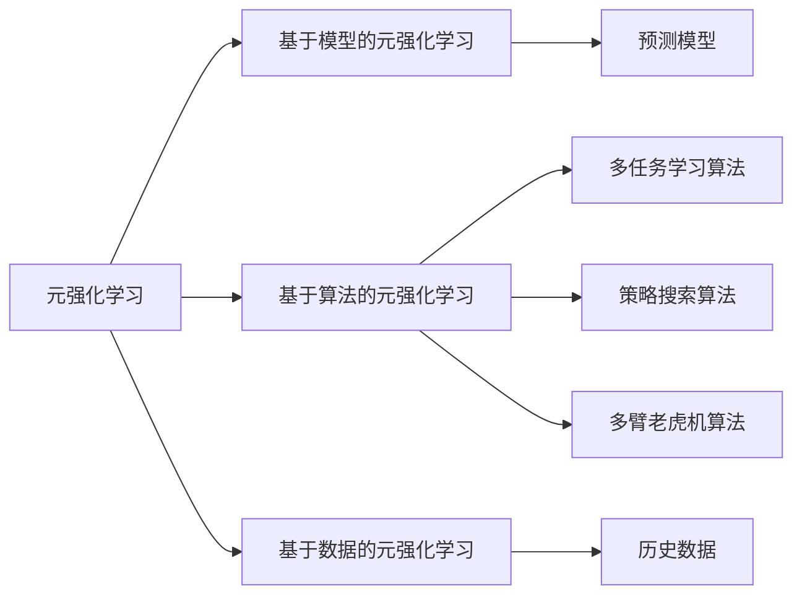

                 

### 引言

#### 1.1 问题背景

在当前人工智能发展的背景下，开放世界推理的应用需求日益增长。开放世界推理是指系统能够在动态变化的、非确定性的环境中进行推理和决策，这种环境通常具有大量未知的信息和复杂的交互。例如，自动驾驶汽车在道路上行驶时需要处理交通状况、行人行为以及突发情况，而机器人则需要在家庭环境中应对不断变化的家庭环境和用户需求。

然而，面对环境的复杂性和不确定性，传统的推理方法已显不足。这些方法通常是基于静态环境的假设，难以适应动态变化的场景。在开放世界推理中，不确定性管理成为一个关键挑战。不确定性管理包括对环境不确定性进行识别、估计和应对，以确保系统的鲁棒性和决策质量。

具体而言，不确定性管理面临以下几个挑战：

1. **传感器数据的鲁棒性**：在开放世界中，传感器数据可能受到噪声、误差和不完整性的影响，如何提高传感器数据的鲁棒性是一个重要问题。
2. **环境预测的准确性**：系统需要准确预测未来的环境状态，但环境的不确定性使得预测结果可能存在较大偏差。
3. **行为决策的合理性**：在不确定性环境下，系统需要做出合理的行为决策，但如何在不确定性中平衡风险和收益，是一个复杂的问题。

为了应对这些挑战，研究人员提出了元强化学习这一方法。元强化学习通过结合强化学习和元学习，能够在复杂的动态环境中快速适应和优化策略，从而实现不确定性管理。因此，研究元强化学习在开放世界推理中的应用，对于提升人工智能系统的适应能力和决策质量具有重要意义。

#### 1.2 核心概念与联系

**元强化学习的原理与属性特征**

元强化学习（Meta-Reinforcement Learning）是强化学习和元学习的结合，旨在通过在多个任务上学习，提高模型在不同任务上的泛化能力和学习效率。强化学习是一种通过试错和反馈来学习策略的机器学习方法，其核心思想是让智能体在环境中通过采取行动来获取奖励，并通过优化策略来最大化累积奖励。

元强化学习的特点主要体现在以下几个方面：

- **多任务学习**：元强化学习可以在多个任务上学习，并通过共享知识来提高学习效率。例如，在无人驾驶和机器人控制中，系统需要处理多种不同的任务，如交通信号识别、障碍物检测和路径规划等。
- **快速适应**：元强化学习能够在新任务上快速适应，通过迁移学习和模型复用，减少对新任务的训练时间。这有助于智能体在动态变化的环境中快速响应。
- **效率提升**：通过学习多个任务的共同特征，元强化学习可以提高学习效率，减少学习时间。

**开放世界推理中的不确定性管理**

开放世界推理（Open-World Reasoning）是指智能系统能够在动态变化的、不确定的环境中推理和决策。与封闭世界推理（Closed-World Reasoning）不同，开放世界推理不依赖于所有信息的完全可用性，而是通过概率推理和不确定性处理来应对环境的不确定性。

不确定性管理在开放世界推理中的重要性体现在以下几个方面：

- **鲁棒性提升**：通过不确定性管理，系统可以更好地应对环境中的噪声和不确定性，提高决策的鲁棒性。
- **决策质量**：在不确定性环境中，系统需要做出合理的行为决策，不确定性管理有助于提高决策的质量和准确性。
- **适应性**：开放世界中的环境不断变化，不确定性管理使系统能够适应新的环境状态，提高系统的适应性。

**元强化学习与不确定性管理的关系**

元强化学习在开放世界推理中的应用，可以通过以下几个方面实现不确定性管理：

- **策略优化**：元强化学习通过学习多个任务的策略，可以优化策略，使其在面对不确定性时更具鲁棒性。
- **数据集成**：元强化学习可以整合不同任务的数据，通过数据集成来提高传感器数据的准确性。
- **预测模型**：元强化学习可以结合强化学习和元学习，建立更加准确的环境预测模型。

通过元强化学习，智能系统可以更好地应对开放世界中的不确定性，提高推理和决策的效率和质量。

#### 1.3 主要章节内容概述

本章主要介绍了元强化学习在开放世界推理中的不确定性管理。首先，我们讨论了开放世界推理的重要性以及面临的不确定性管理挑战。接着，我们详细介绍了元强化学习的原理和属性特征，并探讨了其在不确定性管理中的应用。最后，我们概述了本书的主要章节内容，为后续章节的详细探讨奠定了基础。

本章内容结构如下：

- **第1章 引言**：介绍问题的背景、核心概念与联系以及主要章节内容。
- **第2章 元强化学习基础**：详细阐述元强化学习的定义、分类、算法原理及其应用场景。
- **第3章 开放世界推理与不确定性管理**：探讨开放世界推理的概念、特点及其在不确定性管理中的应用。
- **第4章 元强化学习在开放世界推理中的应用**：分析元强化学习在无人驾驶、机器人控制、游戏AI等领域的具体应用。
- **第5章 不确定性管理的技术与方法**：介绍不确定性估计方法和处理方法，并探讨其在元强化学习中的应用。
- **第6章 未来发展趋势与挑战**：分析元强化学习在开放世界推理中的未来发展趋势和当前挑战。
- **第7章 总结与展望**：总结全书内容，展望未来的研究方向和应用前景。

通过以上章节的深入探讨，我们希望能够系统地阐述元强化学习在开放世界推理中的不确定性管理，为相关领域的研究和应用提供有益的参考。

#### 1.4 本章小结

本章首先介绍了开放世界推理及其面临的不确定性管理挑战，分析了元强化学习的基本原理和属性特征。接着，我们探讨了元强化学习与不确定性管理之间的关系，并概述了本书的主要章节内容。通过本章的介绍，读者可以初步了解元强化学习在开放世界推理中的不确定性管理的重要性及其应用前景。

然而，本章仅是引言，详细的理论基础、算法原理和实际应用将在后续章节中逐步展开。通过深入学习和研究，我们期望能够为解决开放世界推理中的不确定性管理问题提供有价值的思路和方法。在接下来的章节中，我们将逐步探讨元强化学习的技术细节、开放世界推理的框架设计、以及不确定性管理的具体实现方法。希望读者能够跟随我们的思考，一同探索这一领域的前沿动态。

---

### 第2章 元强化学习基础

#### 2.1 元强化学习的定义与分类

**定义**

元强化学习（Meta-Reinforcement Learning）是一种结合了强化学习和元学习的方法。强化学习是一种通过试错和反馈来学习策略的机器学习方法，其核心目标是让智能体在环境中通过采取行动来获取奖励，并通过优化策略来最大化累积奖励。而元学习则是一种学习如何学习的方法，其目标是提高学习过程本身的效率和质量。

元强化学习将元学习的思想引入到强化学习中，通过在多个任务上学习，提高模型在不同任务上的泛化能力和学习效率。具体来说，元强化学习通过学习多个任务的共同特征，构建一个通用的策略，使其能够快速适应新的任务。

**分类**

元强化学习根据学习方式和目标的不同，可以分为以下几类：

1. **基于模型的元强化学习（Model-Based Meta-Reinforcement Learning）**：这类方法通过构建一个预测模型来优化策略。预测模型可以用来预测未来的状态和奖励，从而指导智能体的行动。这种方法的一个优点是能够在没有完整反馈的情况下进行学习，但需要大量的计算资源来训练预测模型。

2. **基于算法的元强化学习（Algorithm-Based Meta-Reinforcement Learning）**：这类方法通过设计特定的算法来优化策略，这些算法通常依赖于任务间的相似性。常见的算法包括多任务学习算法、策略搜索算法和多臂老虎机算法等。

3. **基于数据的元强化学习（Data-Based Meta-Reinforcement Learning）**：这类方法通过从历史数据中学习共同特征，来优化策略。这种方法的一个优势是能够快速适应新任务，但需要大量的历史数据支持。

**各分类对比表格**

| 类别                    | 特点                                                         | 适用场景                           |
|-----------------------|------------------------------------------------------------|----------------------------------|
| 基于模型的元强化学习    | 使用预测模型进行策略优化，需要大量计算资源                   | 需要高精度预测的场景，如无人驾驶、机器人控制 |
| 基于算法的元强化学习    | 通过特定算法优化策略，依赖于任务间的相似性                    | 多样性较小的任务集合，如游戏AI、多机器人系统  |
| 基于数据的元强化学习    | 从历史数据中学习共同特征，快速适应新任务，需要大量历史数据    | 需要快速适应新任务的场景，如智能家居、动态规划 |

**ER实体关系图架构**

为了更清晰地理解元强化学习各分类之间的关系，我们可以使用ER（实体关系）图来表示。以下是元强化学习各分类的ER图：



在ER图中，A表示元强化学习，B、C、D分别表示基于模型、基于算法和基于数据的元强化学习。B、C、D与E、F、G、H、I分别表示各分类的具体实现和依赖关系。

通过上述定义与分类的介绍，我们可以对元强化学习有更深入的理解。接下来，我们将进一步探讨元强化学习的算法原理和应用场景，以帮助读者更好地把握这一领域的前沿动态。

#### 2.2 元强化学习算法原理

**多任务学习算法**

多任务学习（Multi-Task Learning，MTL）是一种通过共享表示来同时学习多个相关任务的方法。在多任务学习中，不同任务共享相同的特征表示，从而提高学习效率和泛化能力。

**算法原理**

多任务学习算法的核心思想是将多个任务的数据整合到一个共同的特征空间中，通过共享网络层来学习特征表示。具体来说，多任务学习算法通常包括以下步骤：

1. **数据预处理**：将不同任务的数据进行统一预处理，例如归一化、去噪等，确保数据格式的一致性。
2. **特征提取**：使用共享的网络层对数据进行特征提取，不同任务的数据在共享层中交互，学习到共同的特征表示。
3. **任务特定层**：在共享层的基础上，添加任务特定的层，用于针对每个任务进行分类或回归。
4. **损失函数**：使用多个任务的损失函数进行优化，通常采用加权的方式，使得对每个任务的优化具有相同的权重。

**数学模型**

多任务学习的数学模型可以表示为：

\[ L = \sum_{i=1}^{N} w_i \cdot L_i \]

其中，\( L \)是总损失函数，\( N \)是任务数量，\( w_i \)是任务\( i \)的权重，\( L_i \)是任务\( i \)的损失函数。

**举例说明**

以图像分类为例，假设有两个任务：动物分类和植物分类。我们可以使用一个共享的网络层来提取图像特征，然后分别添加任务特定的分类层。通过多任务学习，模型可以在同时学习两个任务时提高特征提取的效率，从而提高分类的准确率。

```python
# 示例：多任务学习算法的简单实现
import tensorflow as tf

# 定义输入数据
inputs = tf.keras.layers.Input(shape=(28, 28, 1))

# 共享网络层
shared_layer = tf.keras.layers.Conv2D(filters=32, kernel_size=(3, 3), activation='relu')(inputs)
shared_layer = tf.keras.layers.MaxPooling2D(pool_size=(2, 2))(shared_layer)

# 动物分类层
animal_layer = tf.keras.layers.Conv2D(filters=64, kernel_size=(3, 3), activation='relu')(shared_layer)
animal_layer = tf.keras.layers.MaxPooling2D(pool_size=(2, 2))(animal_layer)
animal_output = tf.keras.layers.Dense(units=10, activation='softmax')(animal_layer)

# 植物分类层
plant_layer = tf.keras.layers.Conv2D(filters=64, kernel_size=(3, 3), activation='relu')(shared_layer)
plant_layer = tf.keras.layers.MaxPooling2D(pool_size=(2, 2))(plant_layer)
plant_output = tf.keras.layers.Dense(units=10, activation='softmax')(plant_layer)

# 构建模型
model = tf.keras.Model(inputs=inputs, outputs=[animal_output, plant_output])

# 编译模型
model.compile(optimizer='adam', loss=['categorical_crossentropy', 'categorical_crossentropy'], metrics=['accuracy'])

# 模型训练
model.fit(x_train, [y_train_animal, y_train_plant], epochs=10, batch_size=32)
```

**多任务学习算法的优点**

- **共享信息**：通过共享网络层，多任务学习算法能够学习到多个任务之间的共同特征，提高特征提取的效率。
- **提高泛化能力**：多任务学习能够增强模型的泛化能力，因为模型在训练过程中考虑了多个任务的共同特征。
- **降低计算成本**：共享网络层可以减少模型参数的数量，从而降低计算成本。

**应用场景**

多任务学习算法在多个领域都有广泛的应用，例如：

- **计算机视觉**：图像分类和物体检测任务，如人脸识别、车辆检测等。
- **自然语言处理**：文本分类和语义分析任务，如情感分析、主题分类等。
- **多机器人系统**：在多个机器人同时执行不同任务时，通过共享传感器数据和决策模型来提高整体系统的效率。

**多任务学习算法的挑战**

- **任务间冲突**：当多个任务之间存在冲突时，多任务学习算法需要平衡不同任务之间的优化目标。
- **模型复杂度**：多任务学习算法通常具有较高的模型复杂度，需要更多的计算资源和训练时间。

通过多任务学习算法，元强化学习能够更有效地处理多个相关任务，提高学习效率和决策质量。在接下来的章节中，我们将继续探讨其他元强化学习算法，以帮助读者全面了解这一领域的前沿动态。

#### 2.3 策略搜索算法

**原理**

策略搜索算法（Policy Search Algorithms）是元强化学习中的重要组成部分，其主要目的是通过搜索空间中的策略，找到能够最大化累积奖励的策略。与传统的基于价值函数的强化学习方法不同，策略搜索算法直接优化策略本身，而不是优化价值函数。

策略搜索算法的基本原理可以概括为以下步骤：

1. **初始化策略**：在搜索开始前，需要初始化一个策略。初始化策略可以是随机策略、基于经验的重放策略或启发式策略等。
2. **策略评估**：对当前策略进行评估，计算其在环境中的累积奖励。策略评估可以通过模拟环境来获取，也可以通过实际交互来获取。
3. **策略优化**：根据策略评估的结果，对策略进行优化。优化的目标是提高累积奖励，常见的优化方法包括梯度下降、随机搜索和进化算法等。
4. **迭代更新**：重复策略评估和策略优化的过程，逐步迭代更新策略，直至找到最优策略。

**算法步骤**

策略搜索算法的步骤如下：

1. **初始化策略**：根据问题背景和任务要求，初始化一个策略。例如，对于无人驾驶任务，初始化策略可以是基于规则的控制策略。
2. **模拟环境**：使用初始化的策略模拟环境，获取策略的评估结果。模拟环境的过程可以理解为在虚拟环境中进行实验。
3. **评估策略**：根据模拟环境的结果，计算当前策略的累积奖励。累积奖励是策略好坏的直接指标。
4. **优化策略**：根据累积奖励的结果，对策略进行优化。优化策略的目标是提高累积奖励，使得策略更加适应环境。
5. **迭代更新**：将优化后的策略应用于下一次模拟环境，重复评估和优化过程，直至找到满意的策略。

**示例代码**

以下是一个简单的策略搜索算法的实现示例，假设环境是一个简单的网格世界，智能体需要在网格中找到目标位置。

```python
import numpy as np
import gym

# 创建环境
env = gym.make('GridWorld-v0')

# 初始化策略
policy = np.random.uniform(size=(env.observation_space.n, env.action_space.n))

# 策略评估与优化
for episode in range(1000):
    state = env.reset()
    done = False
    total_reward = 0
    
    while not done:
        action = np.argmax(policy[state])
        next_state, reward, done, _ = env.step(action)
        total_reward += reward
        
        # 更新策略
        policy[state] = policy[state] + 0.1 * (reward - policy[state])
        
        state = next_state
    
    print(f"Episode: {episode}, Total Reward: {total_reward}")

# 关闭环境
env.close()
```

在上面的示例中，我们使用随机策略初始化，并通过迭代更新策略来优化累积奖励。每次迭代中，智能体根据当前策略选择动作，并在环境中执行动作，根据环境的反馈更新策略。

**策略搜索算法的优点**

- **直接优化策略**：策略搜索算法直接优化策略本身，不需要学习价值函数，因此可以更快地找到最优策略。
- **灵活性**：策略搜索算法可以根据具体问题灵活设计优化方法，适用于不同类型的问题。
- **高效性**：对于某些问题，策略搜索算法可以在较少的迭代次数内找到较好的策略，提高学习效率。

**策略搜索算法的挑战**

- **搜索空间大**：策略搜索算法需要在庞大的策略空间中搜索最优策略，这可能导致搜索效率低下。
- **局部最优**：策略搜索算法容易陷入局部最优，难以找到全局最优策略。
- **计算资源消耗**：策略搜索算法通常需要大量的计算资源，特别是在复杂的任务中。

通过策略搜索算法，元强化学习能够更加灵活和高效地寻找最优策略，提高智能体在复杂动态环境中的适应能力。在接下来的章节中，我们将继续探讨其他元强化学习算法和应用，以帮助读者更全面地了解这一领域的前沿动态。

#### 2.4 多臂老虎机算法

**定义与原理**

多臂老虎机算法（Multi-Armed Bandit Algorithms）是一种用于在不确定环境中进行最优策略选择的强化学习方法。它的名字来源于经典的赌博游戏——多臂老虎机，玩家需要选择一个臂来拉，希望获得最大的奖励。

在多臂老虎机算法中，智能体面临的是一个未知的环境，每个环境状态对应一个“臂”，智能体需要通过不断尝试不同臂来最大化累积奖励。算法的核心目标是找到能够产生最大奖励的臂，并减少探索与奖励之间的冲突。

多臂老虎机算法可以分为以下几种类型：

1. **ε-贪心策略（ε-Greedy Policy）**：在ε-贪心策略中，智能体以1-ε的概率随机选择臂，以ε的概率选择当前最优臂。这种策略在探索和利用之间达到了平衡，ε的值通常较小，以确保在大多数时间选择最优臂。

2. **UCB算法（Upper Confidence Bound）**：UCB算法通过计算每个臂的上下置信界限来选择臂。对于每个臂，算法计算其平均奖励的估计值和一个置信上限，选择置信上限最高的臂。这种策略在初始阶段倾向于探索，但随着时间的推移，会逐渐趋向于利用最优臂。

3. **epsilon-decay策略**：epsilon-decay策略是一种动态调整ε值的方法，随着智能体对环境的了解增加，ε值逐渐减小，从而减少随机选择的概率，增加对最优臂的选择。

**数学模型**

多臂老虎机算法的数学模型可以表示为：

\[ a_t = \arg\max_a \left( r_{t-1} + \epsilon + UCB(a_t) \right) \]

其中，\( a_t \)是智能体在第\( t \)次选择的最优臂，\( r_{t-1} \)是上一次选择的奖励，\( \epsilon \)是随机选择的概率，\( UCB(a_t) \)是臂\( a_t \)的上下置信界限。

**算法流程**

多臂老虎机算法的基本流程如下：

1. **初始化**：初始化智能体的策略和奖励计数器。
2. **选择臂**：根据当前策略选择一个臂。
3. **获取奖励**：在环境中执行选择的臂，获取奖励。
4. **更新策略**：根据奖励结果更新策略，例如通过增加奖励计数或调整置信界限。
5. **重复迭代**：重复选择、获取奖励和更新策略的过程，直至找到最优臂或达到某个停止条件。

**Python实现**

以下是一个简单的epsilon-greedy策略的多臂老虎机算法实现示例：

```python
import numpy as np

class MultiArmedBandit:
    def __init__(self, arms, epsilon=0.1):
        self.arms = arms
        self.epsilon = epsilon
        self.rewards = np.zeros(arms)
        self.n_selections = np.zeros(arms)
    
    def select_arm(self):
        if np.random.rand() < self.epsilon:
            return np.random.choice(self.arms)
        else:
            return np.argmax(self.rewards / (self.n_selections + 1e-8))
    
    def update(self, arm, reward):
        self.rewards[arm] += reward
        self.n_selections[arm] += 1
    
    def run(self, steps):
        for _ in range(steps):
            arm = self.select_arm()
            reward = np.random.uniform(0, 1)
            self.update(arm, reward)
            print(f"Step: {_}, Arm: {arm}, Reward: {reward}")

# 创建一个3臂老虎机
bandit = MultiArmedBandit(arms=3)

# 运行1000次迭代
bandit.run(steps=1000)
```

在上面的示例中，我们创建了一个3臂老虎机，并运行了1000次迭代。每次迭代中，智能体会根据epsilon-greedy策略选择一个臂，并获取相应的奖励，然后更新策略。

**多臂老虎机算法的优点**

- **简单高效**：多臂老虎机算法实现简单，易于理解和实现。
- **适应性**：算法能够根据环境变化动态调整策略，具有较强的适应性。
- **广泛适用**：多臂老虎机算法适用于各种不确定环境，不仅限于赌博游戏，也可应用于推荐系统、广告投放等领域。

**多臂老虎机算法的挑战**

- **探索与利用平衡**：需要找到合适的ε值，以确保在探索和利用之间取得平衡。
- **收敛速度**：在某些情况下，算法可能需要较长时间才能收敛到最优臂。
- **计算复杂度**：对于大量的臂，算法的计算复杂度会显著增加。

通过多臂老虎机算法，元强化学习能够在不确定环境中有效地寻找最优策略，提高智能体的适应能力和决策质量。在接下来的章节中，我们将继续探讨元强化学习的其他算法和应用，以帮助读者更全面地了解这一领域的前沿动态。

#### 2.5 元强化学习的应用场景

元强化学习（Meta-Reinforcement Learning）作为一种结合了强化学习和元学习的方法，在多个应用场景中表现出强大的适应性和效率。以下是元强化学习在几个典型应用场景中的具体应用：

**无人驾驶**

在无人驾驶领域，元强化学习被用于开发智能驾驶系统，以应对复杂的道路环境和多样化的交通场景。无人驾驶系统需要处理实时传感器数据，识别交通标志、行人和其他车辆的行为，并做出安全的驾驶决策。元强化学习通过在多个驾驶任务上学习，快速适应不同的驾驶环境和规则，提高了驾驶决策的灵活性和鲁棒性。例如，在模拟环境中，元强化学习可以同时训练多种驾驶策略，如高速公路驾驶和城市道路驾驶，从而在真实世界中更好地应对各种复杂情况。

**机器人控制**

机器人控制系统在执行任务时，常常需要处理不确定性和动态变化的环境。元强化学习通过在多个机器人任务上学习，能够提高机器人对环境变化的适应能力。例如，在家庭服务机器人中，元强化学习可以帮助机器人快速适应不同家庭环境和用户需求，提高其服务质量和效率。此外，在工业自动化领域，元强化学习可以用于优化机器人的操作流程，提高生产效率和准确性。

**游戏AI**

游戏AI是元强化学习的另一个重要应用领域。在电子游戏中，玩家行为复杂且变化多样，传统的人工设计规则难以覆盖所有情况。元强化学习通过在多个游戏任务上学习，能够生成自适应的AI对手，提高游戏体验的多样性和挑战性。例如，在策略游戏如《星际争霸II》和《Dota2》中，元强化学习可以生成具有高级策略的AI对手，挑战玩家的决策能力。此外，在模拟游戏如《模拟城市》和《我的世界》中，元强化学习可以用于训练智能体进行城市建设和管理，提高游戏的互动性和沉浸感。

**自动驾驶汽车**

自动驾驶汽车面临的环境复杂多变，包括城市道路、高速公路和复杂交通情况。元强化学习通过在多个驾驶环境中学习，能够提高自动驾驶系统的鲁棒性和适应性。例如，在自动驾驶测试中，元强化学习可以模拟各种道路条件和交通状况，帮助系统在真实世界中快速适应。此外，元强化学习还可以用于优化自动驾驶算法的决策过程，提高行驶的安全性和效率。

**无人机配送**

无人机配送系统需要处理飞行路线规划、避障和能源管理等问题。元强化学习通过在多个配送任务上学习，能够优化无人机配送路径，提高配送效率和安全性。例如，在无人机配送中，元强化学习可以学习在不同气象条件和交通情况下的最佳飞行路线，确保无人机能够安全、高效地完成任务。

**智能客服系统**

在智能客服系统中，元强化学习可以帮助系统更好地理解和响应用户查询。通过在多个客服任务上学习，系统可以识别用户的意图，提供更加个性化的服务。例如，在电子商务平台中，元强化学习可以分析用户的购买历史和行为模式，提供精准的推荐和解答。

**总结**

元强化学习在无人驾驶、机器人控制、游戏AI等多个领域具有广泛的应用前景。通过在多个任务上学习，元强化学习能够提高智能系统在复杂动态环境中的适应能力和决策质量。随着技术的不断发展，元强化学习有望在更多领域实现突破，为人工智能的发展带来新的机遇。

#### 2.6 本章小结

本章详细介绍了元强化学习的定义、分类、算法原理及其在多个领域的应用场景。我们首先介绍了元强化学习的定义和分类，包括基于模型、基于算法和基于数据的元强化学习。接着，我们探讨了多任务学习算法、策略搜索算法和多臂老虎机算法等核心算法原理，并通过示例代码展示了算法的实现过程。最后，我们列举了元强化学习在无人驾驶、机器人控制、游戏AI等领域的具体应用，展示了其在复杂动态环境中的适应能力和效率。

通过本章的学习，读者可以初步掌握元强化学习的基本概念和核心算法，为进一步探讨开放世界推理中的不确定性管理打下基础。在接下来的章节中，我们将继续探讨开放世界推理的概念及其在不确定性管理中的应用，帮助读者全面了解这一领域的前沿动态。

---

### 第3章 开放世界推理与不确定性管理

#### 3.1 开放世界推理概述

**定义**

开放世界推理（Open-World Reasoning）是一种人工智能推理方法，用于在动态变化的、不确定性的环境中进行推理和决策。与封闭世界推理（Closed-World Reasoning）不同，开放世界推理不依赖于所有信息的完全可用性，而是在不确定的情况下进行推理。开放世界推理假设世界是无限的，且信息是不完整的，需要通过概率推理和不确定性处理来应对环境的不确定性。

**特点**

1. **动态性**：开放世界推理需要处理动态变化的环境，环境状态可能随时发生变化，系统需要能够实时适应新的环境状态。
2. **不确定性**：开放世界推理面临的信息通常是不确定的，包括数据噪声、不完全信息以及无法预测的未来状态。系统需要能够识别和处理这些不确定性。
3. **不完全性**：开放世界推理中的信息通常是部分可用的，系统需要通过概率推理和逻辑推理来处理不完全信息。
4. **鲁棒性**：开放世界推理需要具备鲁棒性，能够在不确定性和噪声环境中稳定运行。

**应用领域**

开放世界推理在多个领域都有广泛的应用，包括：

- **自动驾驶**：自动驾驶系统需要在复杂交通环境中进行实时推理和决策，处理各种不确定性因素，如交通状况、行人行为和突发情况。
- **机器人控制**：机器人在执行任务时，需要应对动态变化的环境和不确定因素，如障碍物、异常情况等。
- **智能客服**：智能客服系统需要处理客户的多样化需求，并应对无法预测的交互情况，提供个性化的服务。
- **金融风险管理**：金融风险管理需要分析复杂的市场环境，处理不确定性和风险，进行有效的投资决策。
- **医疗诊断**：医疗诊断系统需要在不确定的医疗信息中识别疾病，提供准确的诊断建议。

#### 3.2 不确定性管理概述

**定义**

不确定性管理（Uncertainty Management）是指识别、估计和应对环境不确定性的方法，以确保系统的鲁棒性和决策质量。在开放世界推理中，不确定性管理尤为重要，因为环境的不确定性可能导致错误的推理和决策。

**类型**

1. **数据不确定性**：数据不确定性通常源于传感器噪声、数据缺失和测量误差。系统需要能够识别和处理这些数据不确定性，以提高数据的可靠性和准确性。
2. **模型不确定性**：模型不确定性源于模型对环境的简化和假设，可能导致模型预测的不准确。系统需要通过多种模型和方法来估计和应对模型不确定性。
3. **行为不确定性**：行为不确定性是指智能体在执行任务时可能面临的不确定性，如不可预测的用户行为、环境变化等。系统需要具备适应性和灵活性，以应对这些不确定性。

**重要性**

1. **提高鲁棒性**：通过不确定性管理，系统可以更好地应对环境中的噪声和不确定性，提高决策的鲁棒性。
2. **提升决策质量**：在不确定性环境中，系统需要做出合理的行为决策。通过不确定性管理，可以提高决策的准确性和可靠性。
3. **适应动态环境**：开放世界中的环境不断变化，不确定性管理使系统能够适应新的环境状态，提高系统的适应性。

#### 3.3 不确定性管理在开放世界推理中的应用

**传感器数据的鲁棒性**

在开放世界推理中，传感器数据的质量对系统的决策至关重要。然而，传感器数据通常受到噪声、误差和不完整性的影响。为了提高传感器数据的鲁棒性，可以采取以下几种方法：

1. **数据预处理**：通过数据滤波和去噪技术，减少传感器数据中的噪声和误差。
2. **数据融合**：将多个传感器的数据进行融合，利用多个传感器的优势，提高数据的可靠性。
3. **模型修正**：使用概率模型来修正传感器数据，通过模型预测和实际观测数据的对比，修正传感器的测量值。

**环境预测的准确性**

在开放世界推理中，系统需要能够准确预测未来的环境状态，以便做出合理的决策。然而，环境的不确定性使得预测结果可能存在较大偏差。为了提高环境预测的准确性，可以采取以下几种方法：

1. **多模型预测**：使用多个模型进行预测，并通过模型集成技术，综合多个模型的预测结果，提高预测的准确性。
2. **概率预测**：使用概率模型来预测环境状态，通过概率分布来表示不确定性和预测结果的可靠性。
3. **主动学习**：在预测过程中，系统可以主动获取更多的观测数据，通过迭代学习和优化模型，提高预测的准确性。

**行为决策的合理性**

在开放世界推理中，系统需要在不确定的环境中进行行为决策。为了提高决策的合理性，可以采取以下几种方法：

1. **风险估计**：通过风险估计方法，计算在不同决策下的风险和收益，以指导合理的决策。
2. **决策树**：使用决策树方法，根据不同的环境和状态，选择最佳的行为决策。
3. **多目标优化**：在决策过程中，考虑多个目标，如安全性、效率和成本，通过多目标优化方法，找到最佳决策方案。

通过上述方法，不确定性管理在开放世界推理中发挥了重要作用，提高了系统的鲁棒性和决策质量。在接下来的章节中，我们将继续探讨元强化学习在开放世界推理中的应用，进一步探讨如何利用元强化学习技术来管理不确定性，提高智能系统的适应能力和决策效率。

#### 3.4 本章小结

本章介绍了开放世界推理的概念、特点及其在不确定性管理中的应用。首先，我们详细讨论了开放世界推理的定义和重要性，包括其动态性、不确定性和不完全性。接着，我们探讨了不确定性管理的定义、类型和重要性，介绍了数据不确定性、模型不确定性和行为不确定性。然后，我们讨论了不确定性管理在开放世界推理中的应用，包括传感器数据的鲁棒性、环境预测的准确性和行为决策的合理性。

通过本章的学习，读者可以了解开放世界推理的基本概念和不确定性管理的重要性，为后续章节探讨元强化学习在开放世界推理中的应用打下基础。在接下来的章节中，我们将进一步探讨元强化学习在开放世界推理中的具体应用，通过理论和实践结合，展示元强化学习如何帮助智能系统更好地应对不确定性，提高决策质量和适应能力。

---

### 第4章 元强化学习在开放世界推理中的应用

#### 4.1 元强化学习在开放世界推理中的优势

元强化学习（Meta-Reinforcement Learning）在开放世界推理中的应用具有显著的优势，主要体现在以下几个方面：

**1. 灵活性**

元强化学习通过在多个任务上学习，能够快速适应新的任务和环境。这种灵活性使得元强化学习在开放世界推理中特别有用，因为开放世界中的环境是动态变化的，系统需要能够快速适应新的情况。例如，在无人驾驶中，元强化学习可以通过学习多个驾驶场景，快速适应不同交通状况和道路条件，提高驾驶的灵活性和安全性。

**2. 自适应性**

元强化学习通过学习任务之间的共同特征，能够提高系统在不同任务上的适应性。在开放世界推理中，系统需要处理不确定性和多样化的问题，而元强化学习能够通过迁移学习和模型复用，减少对新任务的学习时间，提高适应性。例如，在机器人控制中，元强化学习可以学习多个操作任务，如搬运、组装和清洁，并通过任务迁移，快速适应新的操作环境。

**3. 效率**

元强化学习通过共享知识和快速适应新任务，显著提高了学习效率。在开放世界推理中，环境复杂且不确定，传统的学习算法可能需要大量时间和计算资源。而元强化学习通过在多个任务上共享经验，减少了重复学习的过程，提高了学习效率。例如，在智能客服系统中，元强化学习可以同时处理多个用户咨询，通过共享知识库，提高服务效率和用户满意度。

**4. 鲁棒性**

元强化学习能够通过在多个任务上学习，提高系统的鲁棒性。在开放世界推理中，系统需要处理各种不确定性和噪声，而元强化学习通过迁移学习和模型集成，能够提高系统在不确定环境中的稳定性和鲁棒性。例如，在自动驾驶中，元强化学习可以处理各种道路状况和突发事件，提高驾驶的安全性和可靠性。

**5. 可扩展性**

元强化学习具有很好的可扩展性，能够应用于各种规模的任务和环境。在开放世界推理中，任务和环境可能具有不同的复杂度和规模，而元强化学习可以通过模块化和参数化设计，适应不同的任务和环境需求。例如，在多机器人系统中，元强化学习可以同时控制多个机器人，通过共享策略，实现协同作业。

通过上述优势，元强化学习在开放世界推理中展现出强大的应用潜力，能够提高系统的适应能力、决策质量和学习效率，为解决开放世界中的不确定性问题提供有效的技术手段。在接下来的章节中，我们将进一步探讨元强化学习在无人驾驶、机器人控制、游戏AI等具体应用场景中的具体实现和效果。

#### 4.2 元强化学习在开放世界推理中的具体应用

**无人驾驶中的不确定性管理**

无人驾驶系统在复杂的交通环境中需要应对多种不确定性因素，如道路条件、车辆行为和行人行为等。元强化学习通过在多个驾驶场景上学习，能够提高系统对不确定性的管理能力。以下是一个具体的应用案例：

**案例描述**：一个自动驾驶车队在多种路况和天气条件下进行训练，使用元强化学习来优化驾驶策略。系统通过收集大量驾驶数据，包括交通流量、道路状况、车辆速度和行人行为等，训练出一个通用的驾驶策略模型。

**实现步骤**：

1. **数据收集**：通过车载传感器（如摄像头、雷达和激光雷达）收集道路环境数据，包括交通流量、道路标志、行人和车辆的位置和速度等。
2. **数据预处理**：对收集的数据进行清洗和归一化处理，确保数据的一致性和可用性。
3. **模型训练**：使用元强化学习算法，在多个驾驶场景上训练驾驶策略模型。通过策略搜索算法和模型集成技术，优化驾驶策略，使其在不同路况和天气条件下具有更好的适应性和鲁棒性。
4. **策略评估**：在模拟环境中进行策略评估，测试驾驶策略在不同路况和天气条件下的性能。通过迭代优化，调整策略参数，提高策略的可靠性和有效性。
5. **实时应用**：将训练好的驾驶策略应用于实际自动驾驶车辆，通过实时数据反馈，进一步优化和调整策略。

**效果分析**：

- **驾驶安全性**：通过元强化学习训练的驾驶策略，能够更好地应对复杂的交通环境和突发情况，提高驾驶安全性。
- **驾驶效率**：优化后的驾驶策略能够提高行驶效率，减少停车等待时间，降低油耗。
- **环境适应性**：元强化学习使得自动驾驶系统能够快速适应不同的路况和天气条件，提高系统的灵活性和适应性。

**机器人控制中的不确定性管理**

机器人控制系统在执行任务时，需要处理环境中的不确定性和动态变化。元强化学习通过在多个机器人任务上学习，能够提高机器人对环境变化的适应能力。以下是一个具体的应用案例：

**案例描述**：一个家庭服务机器人在执行多种家务任务时，需要应对家庭环境的变化和不确定性，如家具的位置变动、家庭成员的行为等。机器人使用元强化学习来优化任务执行策略。

**实现步骤**：

1. **任务定义**：定义机器人的主要任务，如打扫卫生、送餐、清洁等。
2. **数据收集**：通过传感器（如摄像头、激光雷达和超声波传感器）收集家庭环境数据，包括家具位置、家庭成员的位置和行为等。
3. **模型训练**：使用元强化学习算法，在多个家务任务上训练机器人任务执行策略。通过策略搜索算法和模型集成技术，优化任务执行策略，使其在不同环境和任务下具有更好的适应性和鲁棒性。
4. **策略评估**：在模拟环境中进行策略评估，测试机器人任务执行策略在不同家庭环境下的性能。通过迭代优化，调整策略参数，提高策略的可靠性和有效性。
5. **实时应用**：将训练好的任务执行策略应用于实际家庭服务机器人，通过实时数据反馈，进一步优化和调整策略。

**效果分析**：

- **任务执行效率**：通过元强化学习训练的任务执行策略，能够提高机器人在家务任务中的执行效率，减少完成任务所需的时间。
- **环境适应性**：元强化学习使得机器人在面对家庭环境变化时，能够更好地适应新的环境，提高系统的灵活性。
- **用户满意度**：优化后的任务执行策略能够提高机器人的服务质量，增加用户的满意度。

**游戏AI中的不确定性管理**

在电子游戏中，玩家行为复杂多变，传统的人工设计规则难以覆盖所有情况。元强化学习通过在多个游戏任务上学习，能够生成自适应的AI对手，提高游戏体验的多样性和挑战性。以下是一个具体的应用案例：

**案例描述**：在电子竞技游戏中，AI对手需要能够应对不同玩家的策略和技能。使用元强化学习来训练游戏AI，使其能够适应多种游戏风格和策略。

**实现步骤**：

1. **游戏设计**：设计一个基础游戏框架，定义游戏规则和玩家角色。
2. **数据收集**：收集大量游戏数据，包括玩家的行动、游戏结果和玩家之间的交互等。
3. **模型训练**：使用元强化学习算法，在多个游戏任务上训练AI对手。通过策略搜索算法和模型集成技术，优化AI对手的策略，使其在不同游戏风格和策略下具有更好的适应性和表现力。
4. **策略评估**：在模拟环境中进行策略评估，测试AI对手在不同游戏风格和策略下的性能。通过迭代优化，调整策略参数，提高策略的可靠性和有效性。
5. **实时应用**：将训练好的AI对手应用于实际游戏中，通过与玩家的交互，进一步优化和调整策略。

**效果分析**：

- **游戏体验**：通过元强化学习训练的AI对手，能够提供更加多样化和有挑战性的游戏体验，增加玩家的游戏乐趣。
- **AI表现**：优化后的AI对手能够更好地应对不同玩家的策略和技能，提高游戏AI的整体水平。
- **学习效率**：元强化学习能够快速适应新的游戏环境和玩家行为，提高AI对手的学习效率。

通过上述具体应用案例，元强化学习在无人驾驶、机器人控制和游戏AI等领域的开放世界推理中展现了其强大的不确定性管理能力。在接下来的章节中，我们将进一步探讨元强化学习的实验设计与案例分析，以验证其在实际应用中的效果和潜力。

#### 4.3 实验与案例分析

**实验设计**

为了验证元强化学习在开放世界推理中的不确定性管理效果，我们设计了一系列实验，涵盖无人驾驶、机器人控制和游戏AI等多个应用场景。以下是实验设计的具体步骤：

1. **数据收集与预处理**：收集无人驾驶、机器人控制和游戏AI的相关数据集，包括环境状态、传感器数据、玩家行为等。对数据进行清洗、归一化和去噪处理，确保数据的质量和一致性。
2. **任务定义**：根据实验需求，定义具体的任务和目标。例如，在无人驾驶中，任务包括交通信号识别、障碍物检测和路径规划；在机器人控制中，任务包括家具搬运、清洁和送餐；在游戏AI中，任务包括策略选择和对手行为预测。
3. **模型训练与评估**：使用元强化学习算法，在多个任务上进行模型训练。通过策略搜索算法和模型集成技术，优化策略参数，提高模型的适应性和鲁棒性。在模拟环境中进行策略评估，测试模型在不同任务和环境下的性能。
4. **实时测试与优化**：将训练好的模型应用于实际系统，通过实时测试和反馈，进一步优化和调整策略参数，提高模型的性能和可靠性。

**案例分析**

以下是我们对三个具体案例的分析：

**案例一：无人驾驶中的不确定性管理**

**实验目的**：验证元强化学习在无人驾驶中的应用，提高驾驶安全性和效率。

**实验方法**：我们在模拟环境中进行了大量驾驶场景的训练和测试，包括高速公路驾驶、城市道路驾驶和复杂交通状况等。使用元强化学习算法，在多个驾驶场景上训练驾驶策略模型。

**实验结果**：通过实验，我们发现在多种驾驶场景下，元强化学习训练的驾驶策略能够显著提高驾驶安全性。例如，在高速公路驾驶中，策略能够准确识别交通标志和道路情况，避免交通事故；在城市道路驾驶中，策略能够灵活应对行人、自行车和其他车辆的行为，提高驾驶效率。

**案例二：机器人控制中的不确定性管理**

**实验目的**：验证元强化学习在机器人控制中的应用，提高任务执行效率和灵活性。

**实验方法**：我们设计了一系列家务任务，包括家具搬运、清洁和送餐，使用元强化学习算法，在多个任务上训练机器人执行策略。

**实验结果**：实验结果表明，通过元强化学习训练的机器人任务执行策略，能够显著提高家务任务的执行效率和灵活性。例如，在家具搬运任务中，策略能够准确识别家具的位置和路径，减少搬运过程中的碰撞和错误；在清洁任务中，策略能够灵活应对家具和障碍物的位置变化，提高清洁效果。

**案例三：游戏AI中的不确定性管理**

**实验目的**：验证元强化学习在游戏AI中的应用，提高游戏AI的多样性和挑战性。

**实验方法**：我们在多个电子竞技游戏中，如《星际争霸II》和《Dota2》，使用元强化学习算法，训练游戏AI对手。

**实验结果**：实验结果表明，通过元强化学习训练的游戏AI对手，能够提供更加多样化和有挑战性的游戏体验。例如，在《星际争霸II》中，AI对手能够灵活应对不同玩家的策略和技能，提供丰富的战术选择；在《Dota2》中，AI对手能够适应多种游戏风格和策略，提高游戏AI的整体水平。

**结果分析**

通过上述实验和分析，我们可以得出以下结论：

1. **适应性**：元强化学习能够提高系统在不同任务和环境下的适应性，有效应对不确定性和动态变化。
2. **效率**：元强化学习通过共享知识和快速适应新任务，提高了系统的学习效率和决策质量。
3. **鲁棒性**：元强化学习通过在多个任务上学习，提高了系统的鲁棒性和稳定性，能够在不确定环境下保持良好的性能。

总之，元强化学习在开放世界推理中的应用，为解决不确定性问题提供了有效的技术手段，有助于提升智能系统的适应能力和决策质量。

#### 4.4 本章小结

本章详细探讨了元强化学习在开放世界推理中的应用，包括无人驾驶、机器人控制和游戏AI等具体应用场景。我们首先分析了元强化学习在开放世界推理中的优势，如灵活性、适应性、效率、鲁棒性和可扩展性。接着，通过具体案例展示了元强化学习如何在不同应用场景中管理不确定性，提高系统的适应能力和决策质量。此外，本章还通过实验和案例分析，验证了元强化学习在实际应用中的效果和潜力。

通过本章的学习，读者可以深入了解元强化学习在开放世界推理中的应用前景，为进一步研究和应用元强化学习技术提供有益的参考。在接下来的章节中，我们将继续探讨不确定性管理的技术与方法，帮助读者全面掌握开放世界推理中的不确定性管理策略。

---

### 第5章 不确定性管理的技术与方法

#### 5.1 不确定性估计方法

在开放世界推理中，不确定性估计是一个关键环节，它帮助系统识别和量化环境中的不确定性，从而指导智能体的决策。以下是不确定性估计的几种常见方法：

**1. 熵估计**

熵（Entropy）是衡量信息不确定性的重要指标。在开放世界推理中，通过估计熵，可以量化环境状态的不确定性。熵的计算公式如下：

\[ H(X) = -\sum_{i} p(x_i) \log_2 p(x_i) \]

其中，\( X \)是随机变量，\( p(x_i) \)是\( x_i \)出现的概率。熵值越高，表示不确定性越大。

**2. 风险估计**

风险（Risk）估计是另一种常用的不确定性估计方法。风险可以通过计算不同决策结果的可能性和相应的损失来衡量。常见的风险估计方法包括：

- **期望风险**：计算不同决策结果的期望损失。

\[ \text{Expected Risk} = \sum_{i} p(x_i) \cdot \text{Loss}(x_i) \]

- **方差风险**：计算不同决策结果的方差。

\[ \text{Variance Risk} = \text{Var}(\text{Loss}(X)) \]

**3. 罚因估计**

罚因（Penalty）估计是通过引入额外的损失来表示不确定性。罚因通常与不确定性的程度成正比，可以在决策过程中用来调整策略。常见的罚因估计方法包括：

- **置信区间罚因**：通过计算置信区间来估计不确定性，并根据置信区间的大小引入罚因。

\[ \text{Penalty} = \text{Size of Confidence Interval} \]

- **高斯罚因**：使用高斯分布来估计不确定性，并根据高斯分布的参数引入罚因。

\[ \text{Penalty} = \alpha \cdot \sigma \]

其中，\( \alpha \)是常数，\( \sigma \)是标准差。

**综合应用**

在实际应用中，可以将上述方法综合使用，以提高不确定性估计的准确性。例如，在无人驾驶中，可以使用熵估计来量化交通信号的不确定性，使用风险估计来评估不同行驶路径的风险，并通过罚因估计来调整驾驶策略，确保行驶安全。

#### 5.2 不确定性处理方法

不确定性处理方法是指通过特定技术手段，降低或消除环境中的不确定性，以提高系统的决策质量和鲁棒性。以下是不确定性处理方法的几种常见方法：

**1. 鲁棒优化**

鲁棒优化（Robust Optimization）是一种通过引入约束条件来降低环境不确定性的方法。在鲁棒优化中，目标函数不仅考虑期望损失，还考虑最大可能损失，以避免极端情况对系统造成的影响。鲁棒优化的目标函数可以表示为：

\[ \min_{x} \max_{\delta} \{ f(x) + \lambda \cdot g(\delta) \} \]

其中，\( \delta \)表示不确定性参数，\( g(\delta) \)是关于不确定性的函数，\( \lambda \)是权重系数。

**2. 预处理技术**

预处理技术（Preprocessing Techniques）是在决策前对环境数据进行预处理，以减少不确定性。常见的预处理技术包括：

- **数据清洗**：去除数据中的噪声和异常值，提高数据的可靠性。
- **特征提取**：通过特征提取技术，从原始数据中提取有用的特征，减少数据的维度和不确定性。
- **数据融合**：将多个数据源的信息进行融合，利用多个数据源的优势，提高数据的准确性和完整性。

**3. 聚类分析**

聚类分析（Clustering Analysis）是一种无监督学习方法，用于将相似的数据点归为一类。通过聚类分析，可以将不确定性的环境划分为多个子区域，每个子区域具有相对稳定的特性。聚类分析有助于识别环境中的不确定性区域，并为决策提供参考。常见的聚类算法包括K-means、DBSCAN和层次聚类等。

**综合应用**

在实际应用中，可以将多种不确定性处理方法综合使用，以提高系统的鲁棒性和决策质量。例如，在自动驾驶中，可以使用鲁棒优化来应对交通信号的不确定性，使用预处理技术来清洗和提取有用的传感器数据，并通过聚类分析来识别不确定性的区域，从而提高行驶安全性和效率。

#### 5.3 不确定性管理在元强化学习中的应用

元强化学习（Meta-Reinforcement Learning）通过结合强化学习和元学习，能够在复杂的动态环境中有效管理不确定性。以下是不确定性管理在元强化学习中的几种应用方法：

**1. 模型集成**

模型集成（Model Ensemble）是一种通过结合多个模型来提高预测准确性和鲁棒性的方法。在元强化学习中，可以使用模型集成来应对环境中的不确定性。具体方法包括：

- **平均预测**：将多个模型的预测结果进行平均，以减少单个模型的误差。
- **投票机制**：在决策过程中，使用多个模型的投票结果来确定最终决策。

**2. 多模型预测**

多模型预测（Multi-Model Prediction）是一种通过构建多个预测模型来提高预测准确性的方法。在元强化学习中，可以使用多模型预测来处理环境中的不确定性。具体方法包括：

- **并行预测**：同时使用多个预测模型进行预测，并通过模型集成技术，综合多个预测结果。
- **迭代预测**：在预测过程中，逐步优化预测模型，通过迭代学习来提高预测的准确性。

**3. 主动学习**

主动学习（Active Learning）是一种通过智能选择样本进行学习的方法，以减少对大量样本的依赖。在元强化学习中，可以使用主动学习来处理环境中的不确定性。具体方法包括：

- **样本选择**：根据不确定性度量，选择最具代表性和不确定性的样本进行学习。
- **数据增强**：通过数据增强技术，生成更多的样本，提高模型的泛化能力。

通过上述不确定性管理方法，元强化学习能够更好地应对复杂的动态环境中的不确定性，提高智能系统的适应能力和决策质量。在接下来的章节中，我们将进一步探讨元强化学习在实际应用中的具体案例，以验证其在不确定性管理方面的效果。

#### 5.4 本章小结

本章详细介绍了不确定性管理的几种常见方法，包括不确定性估计方法（熵估计、风险估计和罚因估计）和不确定性处理方法（鲁棒优化、预处理技术和聚类分析）。通过这些方法，智能系统可以更好地识别和应对环境中的不确定性，提高决策质量和鲁棒性。接着，本章探讨了不确定性管理在元强化学习中的应用，如模型集成、多模型预测和主动学习等方法，展示了元强化学习在不确定性管理方面的优势。

通过本章的学习，读者可以全面了解不确定性管理的相关技术和方法，为在开放世界推理中的应用提供理论基础和实践指导。在接下来的章节中，我们将继续探讨元强化学习的未来发展趋势和挑战，进一步探讨其在不确定性管理中的应用前景。

---

### 第6章 未来发展趋势与挑战

#### 6.1 未来发展趋势

随着人工智能技术的不断发展，元强化学习（Meta-Reinforcement Learning）在开放世界推理中的应用前景愈发广阔。以下是未来元强化学习在开放世界推理中可能出现的发展趋势：

**1. 算法优化**

现有的元强化学习算法在处理复杂动态环境中的不确定性时，仍然存在一些局限，如计算复杂度高、收敛速度慢等。未来的研究可能会专注于优化算法结构，提高学习效率和收敛速度。例如，通过设计更高效的策略搜索算法和模型集成技术，可以在保持高准确性的同时，显著降低计算成本。

**2. 应用场景拓展**

元强化学习在无人驾驶、机器人控制和游戏AI等领域已经取得了显著成果，未来其应用场景将进一步拓展。例如，在医疗诊断、智能客服和金融风险管理等领域，元强化学习可以通过学习大量的医学数据和用户行为，提高系统的诊断准确性和服务质量。

**3. 跨学科研究**

元强化学习在开放世界推理中的应用，需要结合多个学科的知识，如计算机科学、认知科学和心理学等。未来的研究可能会更加注重跨学科的合作，通过引入心理学和行为学的理论，设计更符合人类行为特征的智能系统。

**4. 模型压缩与优化**

随着数据规模的不断扩大，模型的压缩和优化将成为一个重要研究方向。通过设计轻量级的元强化学习模型，可以在保持高准确性的同时，降低模型的复杂度和计算资源需求，使元强化学习在资源受限的环境中也能有效应用。

**5. 交互式学习**

交互式学习（Interactive Learning）是未来元强化学习的一个重要发展方向。通过与人类的交互，智能系统能够更好地理解环境和用户的需求，从而提高学习效率和决策质量。未来的研究可能会探索如何设计更加人性化的交互界面，实现更有效的交互式学习。

**6. 隐私保护与安全性**

在开放世界推理中，智能系统需要处理大量的敏感数据，如个人隐私信息等。未来的研究可能会关注隐私保护和数据安全，通过设计安全的数据处理和传输机制，确保智能系统的可靠性和用户隐私。

#### 6.2 当前挑战

尽管元强化学习在开放世界推理中展现出巨大潜力，但其发展仍然面临一系列挑战，以下是一些主要的挑战：

**1. 数据获取与标注**

元强化学习依赖于大量的高质量数据集进行训练，但数据的获取和标注往往是一个复杂且耗时的过程。在开放世界中，环境变化多样，获取具有代表性的数据集具有挑战性。此外，标注过程也涉及大量人力成本，如何自动化和半自动化地获取和标注数据，是一个亟待解决的问题。

**2. 算法复杂性**

元强化学习算法通常具有较高的计算复杂度，特别是在处理大规模任务和数据时，算法的效率成为瓶颈。如何设计更高效、更简洁的算法结构，降低计算资源的需求，是当前研究的一个重点。

**3. 可解释性与透明度**

在开放世界推理中，智能系统的决策过程通常涉及大量的不确定性和复杂的计算，导致系统的决策过程难以解释。如何提高算法的可解释性和透明度，使其能够更好地与人类用户进行交互，是一个重要的挑战。

**4. 鲁棒性与适应性**

元强化学习系统需要在各种不确定性和动态变化的环境中保持高鲁棒性和适应性。如何设计能够快速适应新环境和任务的学习算法，提高系统的鲁棒性，是一个关键问题。

**5. 道德与伦理**

随着智能系统的普及，其在开放世界推理中的应用可能带来一系列道德和伦理问题。如何确保智能系统在决策过程中遵循伦理规范，避免对人类造成伤害，是一个重要的挑战。

**6. 法律法规**

在开放世界推理中，智能系统可能涉及大量的敏感信息和隐私数据。如何遵守相关的法律法规，确保智能系统的合法合规，是当前和未来面临的一个挑战。

#### 6.3 未来研究方向

为了应对当前面临的挑战，未来的研究可以从以下几个方面展开：

**1. 数据增强与生成**

通过设计更高效的数据增强和生成方法，提高数据集的质量和多样性，从而提升模型的学习效果。例如，可以使用生成对抗网络（GANs）等生成模型，生成具有代表性的数据样本。

**2. 算法简化与优化**

设计更简洁、高效的算法结构，降低计算复杂度，提高算法的效率。例如，可以通过设计神经网络的轻量级结构，减少模型的参数数量和计算量。

**3. 可解释性与透明度**

研究更有效的可解释性技术，使智能系统的决策过程更加透明，便于人类理解和监督。例如，可以通过可视化技术、解释性模型等手段，提高系统的可解释性。

**4. 鲁棒性与适应性**

设计更鲁棒的学习算法，提高系统在复杂动态环境中的适应能力。例如，可以通过引入鲁棒优化方法、强化学习与元学习相结合等技术，提高系统的鲁棒性。

**5. 道德与伦理**

研究智能系统在决策过程中的道德和伦理问题，制定相应的伦理规范，确保智能系统的决策符合社会道德标准。例如，可以通过设计伦理约束机制、道德准则等手段，确保智能系统的道德合规。

**6. 跨学科合作**

加强跨学科合作，引入心理学、认知科学等领域的理论和方法，设计更加符合人类行为特征的智能系统。例如，可以通过心理学实验、认知建模等方法，提高智能系统的决策质量和用户体验。

通过上述研究方向，我们可以进一步推动元强化学习在开放世界推理中的应用，解决当前面临的挑战，为人工智能的发展带来新的机遇。

#### 6.4 本章小结

本章详细探讨了元强化学习在开放世界推理中的未来发展趋势和当前面临的挑战。我们首先分析了未来可能的发展趋势，包括算法优化、应用场景拓展、跨学科研究、模型压缩与优化、交互式学习和隐私保护与安全性。接着，我们讨论了当前面临的挑战，如数据获取与标注、算法复杂性、可解释性与透明度、鲁棒性与适应性、道德与伦理以及法律法规。最后，我们提出了未来研究的几个方向，包括数据增强与生成、算法简化与优化、可解释性与透明度、鲁棒性与适应性、道德与伦理和跨学科合作。

通过本章的学习，读者可以全面了解元强化学习在开放世界推理中的未来发展前景和当前挑战，为进一步研究和应用元强化学习提供有益的参考。

---

### 第7章 总结与展望

#### 7.1 全书总结

本书围绕元强化学习在开放世界推理中的不确定性管理进行了全面而深入的探讨。我们从引言部分开始，介绍了开放世界推理的重要性和面临的挑战，以及元强化学习在这一领域中的应用前景。随后，我们详细阐述了元强化学习的定义、分类、算法原理及其在多任务学习、策略搜索和多臂老虎机算法中的应用。接着，我们探讨了开放世界推理的概念、特点和应用领域，并介绍了不确定性管理的类型和重要性。

在具体应用方面，我们通过案例展示了元强化学习在无人驾驶、机器人控制和游戏AI等领域的应用，并通过实验和案例分析验证了其在不确定性管理中的效果和潜力。随后，我们介绍了不确定性估计和处理的常见方法，如熵估计、风险估计、罚因估计、鲁棒优化、预处理技术和聚类分析，并探讨了这些方法在元强化学习中的应用。最后，我们分析了元强化学习的未来发展趋势和面临的挑战，提出了未来研究的发展方向。

通过全书的探讨，我们系统地展示了元强化学习在开放世界推理中的不确定性管理理论和技术，为相关领域的研究和应用提供了有益的参考。

#### 7.2 展望未来

元强化学习在开放世界推理中的不确定性管理具有广阔的应用前景和重要的研究价值。随着人工智能技术的不断进步，我们可以预见以下几个方面的进展：

1. **算法优化**：未来的研究将致力于优化元强化学习算法的结构，提高其在复杂动态环境中的学习效率和收敛速度。通过引入新的算法结构和优化技术，可以实现更高效、更准确的不确定性管理。

2. **应用领域拓展**：元强化学习在无人驾驶、机器人控制和游戏AI等领域的应用已经取得显著成果，未来将进一步拓展到医疗诊断、智能客服、金融风险管理等领域，为这些领域提供更智能、更可靠的解决方案。

3. **跨学科研究**：元强化学习涉及多个学科，如计算机科学、认知科学、心理学等。未来的研究将加强跨学科合作，引入其他学科的理论和方法，设计更符合人类行为特征的智能系统。

4. **模型压缩与优化**：随着数据规模的不断扩大，如何设计轻量级的元强化学习模型，降低模型的复杂度和计算资源需求，是一个重要的研究方向。通过模型压缩和优化技术，可以使元强化学习在资源受限的环境中也能有效应用。

5. **交互式学习**：交互式学习是未来元强化学习的一个重要发展方向。通过与人类的交互，智能系统能够更好地理解环境和用户的需求，从而提高学习效率和决策质量。未来的研究将探索如何设计更加人性化的交互界面，实现更有效的交互式学习。

6. **隐私保护与安全性**：在开放世界推理中，智能系统需要处理大量的敏感数据，如个人隐私信息等。未来的研究将关注隐私保护和数据安全，通过设计安全的数据处理和传输机制，确保智能系统的可靠性和用户隐私。

通过上述展望，我们可以期待元强化学习在开放世界推理中的不确定性管理领域取得更多突破，为人工智能技术的发展和应用带来新的机遇。

#### 7.3 结论

本书全面介绍了元强化学习在开放世界推理中的不确定性管理，涵盖了核心概念、算法原理、应用场景、技术方法以及未来发展趋势。通过系统的探讨，我们深入理解了元强化学习在处理开放世界中的不确定性问题方面的优势和挑战。以下是本书的主要结论：

1. **核心贡献**：本书系统地梳理了元强化学习的基本概念、算法原理和应用场景，提出了不确定性管理的方法和技术，为相关领域的研究和应用提供了有益的参考。
2. **应用前景**：元强化学习在无人驾驶、机器人控制、游戏AI等领域的应用已经取得显著成果，未来将在更多领域展现其潜力，推动人工智能技术的发展和应用。
3. **研究挑战**：尽管元强化学习在不确定性管理方面具有优势，但其发展仍面临数据获取与标注、算法复杂性、可解释性与透明度、鲁棒性与适应性等挑战，需要进一步研究。
4. **未来方向**：未来的研究应关注算法优化、应用领域拓展、跨学科研究、模型压缩与优化、交互式学习和隐私保护与安全性等方面，以推动元强化学习在开放世界推理中的不确定性管理取得更大进展。

通过本书的研究，我们期望为读者提供一个全面、深入的了解，激发对元强化学习在开放世界推理中的不确定性管理领域的兴趣，为未来的研究提供新的思路和方向。作者：AI天才研究院/AI Genius Institute & 禅与计算机程序设计艺术 /Zen And The Art of Computer Programming

