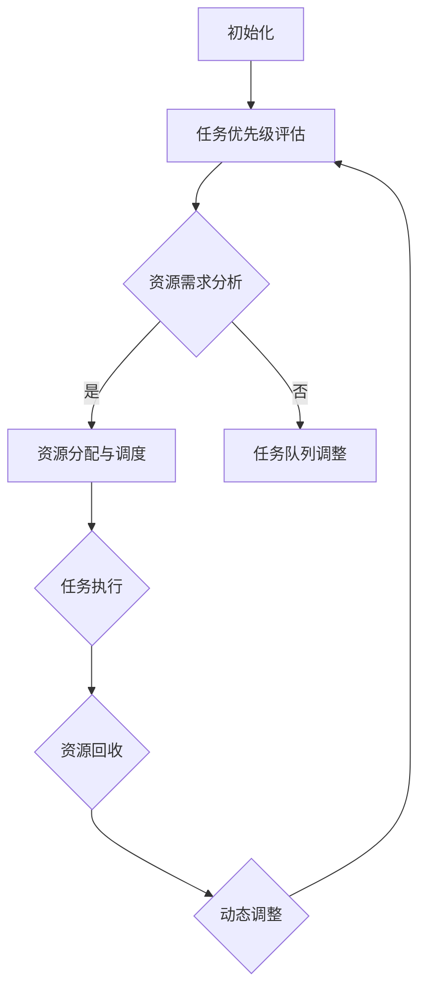
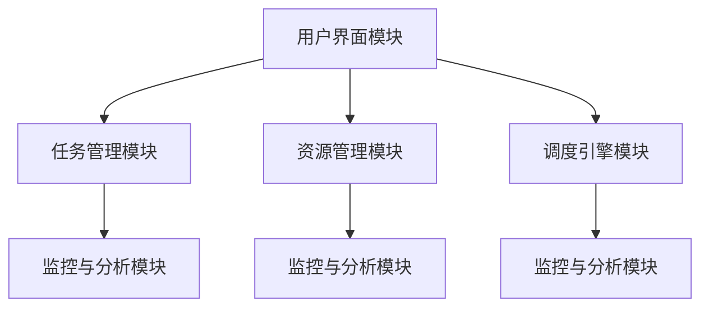
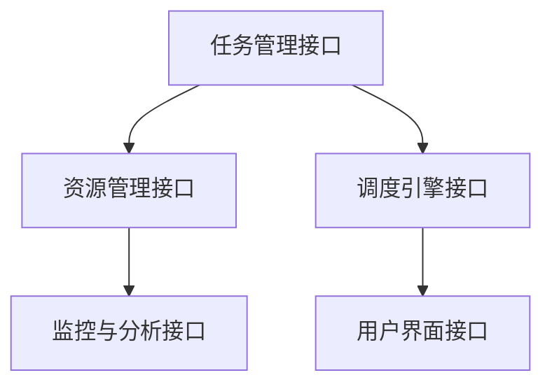
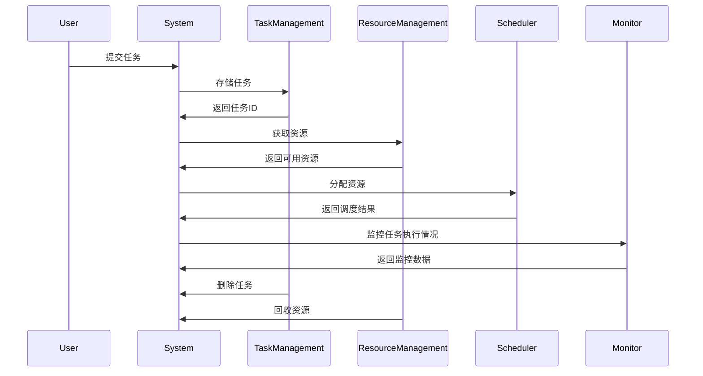

                 

# 元控制框架下推理任务的动态优先级资源调度

## 关键词

- 元控制框架
- 动态优先级资源调度
- 推理任务
- 资源调度算法
- 数学模型
- 系统设计与架构

## 摘要

本文深入探讨了元控制框架下推理任务的动态优先级资源调度问题。首先，我们对元控制框架的核心概念、背景和历史进行了介绍，并详细阐述了推理任务及其资源调度的挑战。接着，我们提出了动态优先级资源调度的概念，并分析了其关键因素和算法原理。文章还通过数学模型和实际案例，展示了算法的具体实现和应用效果。最后，我们总结了最佳实践，并对相关内容进行了总结和拓展阅读推荐。

## 引言与背景

### 1.1.1 元控制框架的背景与核心概念

元控制框架是一种高级的自动化控制方法，它通过定义和控制一系列基本操作（即元操作），来实现对复杂系统的全局控制。元控制框架的核心概念包括元操作、元状态、元规则和元策略。元操作是基础的操作单元，元状态描述系统的当前状态，元规则定义状态之间的转换条件，元策略则指导元操作的执行顺序和优先级。

元控制框架的起源可以追溯到计算机科学的早期阶段，特别是在自动化系统和人工智能领域。随着计算机硬件和软件的快速发展，元控制框架逐渐成为了一种高效解决复杂问题的重要工具。例如，在分布式系统、云计算、物联网和人工智能等领域，元控制框架发挥了关键作用。

### 1.1.2 推理任务及其资源调度的挑战

推理任务是指计算机程序根据已知信息推导出未知信息的过程。在人工智能领域，推理任务广泛应用于自然语言处理、计算机视觉、数据挖掘和决策支持系统等。然而，推理任务通常需要大量的计算资源和时间，特别是在处理复杂、大规模的推理问题时，资源调度成为一个关键问题。

推理任务的资源调度挑战主要体现在以下几个方面：

1. **资源需求的不确定性**：推理任务在执行过程中可能会动态地改变对资源的请求，如内存、CPU和GPU等。
2. **任务优先级**：不同推理任务的优先级可能不同，如何公平、高效地分配资源成为了一个难题。
3. **资源冲突**：多个推理任务可能会同时请求同一资源，导致资源争用和死锁问题。
4. **系统负载**：过度的推理任务可能会导致系统负载过高，影响其他任务的执行。

### 1.1.3 动态优先级资源调度的重要性

动态优先级资源调度是解决推理任务资源调度问题的关键。动态优先级资源调度的核心思想是根据任务的优先级和资源的使用情况，实时调整资源的分配策略。这种调度方法具有以下几个重要特点：

1. **灵活性**：动态优先级资源调度可以根据任务的变化，实时调整资源的分配策略，从而更好地适应系统负载。
2. **高效性**：通过动态调整资源分配，可以最大限度地利用系统资源，提高任务执行效率。
3. **公平性**：动态优先级资源调度可以公平地分配资源，确保高优先级任务能够及时得到资源支持。

### 1.1.4 书籍结构安排与目标

本文书籍分为七个主要部分：

1. **引言与背景**：介绍元控制框架和推理任务动态优先级资源调度的背景和核心概念。
2. **元控制框架基础**：详细阐述元控制框架的定义、核心组件和应用领域。
3. **推理任务的动态优先级资源调度原理**：分析动态优先级资源调度的关键因素和算法原理。
4. **算法与数学模型**：介绍动态优先级资源调度的算法和数学模型。
5. **系统设计与架构**：描述系统设计、架构和接口。
6. **案例研究与实践应用**：提供案例研究和实际应用实例。
7. **最佳实践与总结**：总结最佳实践，提出注意事项和拓展阅读建议。

本书的目标是为读者提供全面、深入、实用的元控制框架下推理任务动态优先级资源调度知识，帮助读者理解和掌握这一关键技术，并能够将其应用于实际项目中。

## 元控制框架基础

### 2.1.1 元控制框架的定义与历史

元控制框架（Meta Control Framework，简称MCF）是一种基于元操作和元规则的自动化控制系统。它通过定义一系列基础操作（元操作），并将其组合成更复杂的操作，实现对目标系统的全局控制。MCF最早出现在计算机科学和自动化控制领域，旨在解决复杂系统的控制问题。

MCF的定义可以概括为以下几点：

1. **元操作**：元操作是MCF的基本操作单元，通常包括数据操作、状态转换、事件响应等。
2. **元状态**：元状态描述系统的当前状态，通常由一组属性和值组成。
3. **元规则**：元规则定义了系统状态之间的转换条件，通常由条件和操作两部分组成。
4. **元策略**：元策略指导元操作的执行顺序和优先级，通常由一系列规则组成。

MCF的历史可以追溯到20世纪60年代，当时为了解决复杂系统的控制问题，研究人员开始探索自动化控制方法。随着计算机硬件和软件的不断发展，MCF逐渐成为了一种重要的自动化控制工具，并在分布式系统、云计算、物联网和人工智能等领域得到广泛应用。

### 2.1.2 元控制框架的关键组件

元控制框架的核心组件包括元操作、元状态、元规则和元策略。以下是对这些组件的详细介绍：

1. **元操作**：元操作是MCF的基本操作单元，通常包括以下几类：

   - 数据操作：如数据插入、删除、修改等。
   - 状态转换：如系统状态之间的切换。
   - 事件响应：如对特定事件的响应和处理。

2. **元状态**：元状态描述系统的当前状态，通常由一组属性和值组成。例如，在分布式系统中，元状态可以包括节点状态、网络状态、任务状态等。

3. **元规则**：元规则定义了系统状态之间的转换条件，通常由条件和操作两部分组成。例如，一个元规则可以是：“当系统状态为S1且任务执行时间为T1时，执行操作A”。

4. **元策略**：元策略指导元操作的执行顺序和优先级，通常由一系列规则组成。元策略的制定需要考虑系统目标、任务优先级、资源限制等因素。

### 2.1.3 元控制框架的优势与局限

元控制框架具有以下优势：

1. **高灵活性**：MCF可以根据任务需求和系统状态动态调整操作顺序和优先级，从而更好地适应变化。
2. **高效性**：通过预定义的元操作和元规则，MCF可以快速响应系统事件，提高任务执行效率。
3. **可扩展性**：MCF可以轻松扩展到不同的应用领域，如分布式系统、云计算、物联网等。

然而，MCF也存在一些局限：

1. **复杂性**：MCF的构建和优化需要大量的时间和经验，对于初学者来说可能较为困难。
2. **性能开销**：MCF的运行需要额外的计算资源，可能导致系统性能下降。
3. **规则依赖**：MCF的性能和效率在很大程度上依赖于元规则的制定，如果规则设置不合理，可能导致性能瓶颈。

### 2.1.4 元控制框架的应用领域扩展

元控制框架在多个领域得到了广泛应用，以下是一些典型应用领域：

1. **分布式系统**：在分布式系统中，MCF可以用于任务调度、负载均衡、故障恢复等。
2. **云计算**：在云计算环境中，MCF可以用于资源管理、服务调度、虚拟机迁移等。
3. **物联网**：在物联网中，MCF可以用于设备管理、数据传输、事件处理等。
4. **人工智能**：在人工智能领域，MCF可以用于算法优化、模型训练、推理任务调度等。

通过不断的研究和优化，元控制框架的应用领域将越来越广泛，为解决复杂系统问题提供更强有力的支持。

## 推理任务的动态优先级资源调度原理

### 3.1.1 动态优先级资源调度的概念

动态优先级资源调度是一种根据任务优先级和资源使用情况，实时调整资源分配策略的调度方法。在推理任务中，动态优先级资源调度显得尤为重要，因为推理任务通常具有以下特点：

1. **任务多样性**：推理任务种类繁多，如机器学习、深度学习、自然语言处理等，不同任务的资源需求和优先级可能不同。
2. **资源需求变化**：推理任务在执行过程中可能会动态地改变对资源的请求，如内存、CPU和GPU等。
3. **实时性要求**：某些推理任务（如实时语音识别、自动驾驶等）对响应时间有较高要求，需要快速分配和释放资源。

动态优先级资源调度的目标是通过合理分配和调度资源，提高任务执行效率和系统性能。具体来说，动态优先级资源调度包括以下几个关键步骤：

1. **任务优先级评估**：根据任务的紧急程度、重要性等因素，为每个任务分配一个优先级。
2. **资源需求分析**：分析每个任务的资源需求，包括CPU、内存、GPU等。
3. **资源分配策略**：根据任务优先级和资源需求，制定资源分配策略，如优先分配高优先级任务所需资源。
4. **资源调度**：实时监控任务执行情况，根据资源使用情况和任务优先级，调整资源分配策略。

### 3.1.2 动态优先级资源调度的关键因素

动态优先级资源调度的成功实施取决于以下几个关键因素：

1. **任务优先级评估方法**：合理评估任务优先级是动态优先级资源调度的基础。任务优先级评估方法需要考虑任务的紧急程度、重要性、资源需求等多个因素。常用的评估方法包括基于固定优先级、动态优先级和自适应优先级等。
2. **资源需求模型**：准确描述任务对各种资源的请求是动态优先级资源调度的关键。资源需求模型需要考虑任务类型、数据规模、计算复杂度等因素。常用的资源需求模型包括线性模型、指数模型和对数模型等。
3. **资源分配策略**：资源分配策略决定了资源如何在不同任务之间进行分配和调度。常见的资源分配策略包括固定优先级调度、动态优先级调度、最短任务优先（STF）和最短剩余时间优先（SRTF）等。
4. **资源调度算法**：资源调度算法是动态优先级资源调度的核心。调度算法需要考虑任务优先级、资源需求、系统负载等因素，以实现高效、公平的资源调度。常见的调度算法包括基于优先级调度、基于轮转调度和基于抢占调度等。

### 3.1.3 动态优先级资源调度的算法原理

动态优先级资源调度的算法原理可以分为以下几个步骤：

1. **初始化**：初始化任务队列、资源池和调度策略。任务队列用于存储待调度任务，资源池用于存储可用资源，调度策略用于指导资源分配和调度。
2. **任务优先级评估**：根据任务特性，为每个任务评估优先级，并将其插入任务队列。
3. **资源需求分析**：分析每个任务对各种资源的请求，并将其与资源池中的资源进行匹配。
4. **资源分配与调度**：根据任务优先级和资源需求，分配资源并调度任务。调度过程中，需要考虑资源利用率、任务执行时间、系统负载等因素，以实现高效、公平的资源调度。
5. **动态调整**：实时监控任务执行情况和系统负载，根据实际情况动态调整资源分配和调度策略。例如，当系统负载过高时，可以降低某些任务的优先级，释放部分资源，以缓解系统压力。

### 3.1.4 动态优先级资源调度的挑战与解决方案

动态优先级资源调度面临着一系列挑战，以下是一些常见挑战及其解决方案：

1. **资源冲突**：多个任务可能同时请求同一资源，导致资源冲突。解决方案是引入资源锁机制，确保同一时间只有一个任务能够访问特定资源。
2. **任务饿死**：低优先级任务可能长时间无法获得资源，导致饿死现象。解决方案是采用自适应优先级调度方法，根据任务执行情况动态调整优先级，确保高优先级任务和低优先级任务都能得到公平的资源支持。
3. **系统负载不平衡**：系统负载可能在某些时刻过高，导致任务执行缓慢。解决方案是引入负载均衡机制，根据任务执行情况动态调整资源分配，确保系统负载分布均匀。
4. **实时性要求**：某些任务对响应时间有较高要求，需要快速分配和释放资源。解决方案是采用抢占调度策略，当新任务到达时，优先抢占低优先级任务占用的资源，确保高优先级任务能够得到及时处理。

通过以上解决方案，动态优先级资源调度可以有效应对各种挑战，实现高效、公平的资源调度，提高系统性能和任务执行效率。

## 算法与数学模型

### 4.1.1 动态优先级资源调度的算法描述

动态优先级资源调度算法的核心思想是根据任务优先级和资源使用情况，实时调整资源分配策略。以下是一个简化的动态优先级资源调度算法描述：

1. **初始化**：
   - 创建任务队列T，用于存储待调度任务。
   - 创建资源池R，用于存储可用资源。
   - 初始化系统负载L，用于监控系统负载情况。

2. **任务优先级评估**：
   - 对每个新到达的任务，根据其紧急程度、重要性等特性，评估优先级P。
   - 将任务插入任务队列T。

3. **资源需求分析**：
   - 对任务队列T中的每个任务，分析其资源需求，包括CPU、内存、GPU等。
   - 将任务与资源池R中的资源进行匹配。

4. **资源分配与调度**：
   - 根据任务优先级P，从任务队列T中选择最高优先级任务。
   - 将任务所需资源从资源池R中分配给该任务。
   - 将任务从任务队列T中删除，并将其加入执行队列E。

5. **动态调整**：
   - 实时监控执行队列E中的任务执行情况。
   - 根据系统负载L和任务执行时间，动态调整任务优先级P。
   - 当新任务到达时，根据优先级P，重新调度任务。

### 4.1.2 数学模型与公式解释

动态优先级资源调度算法可以通过数学模型进行描述和优化。以下是一个简单的数学模型：

1. **任务优先级模型**：
   - P(t) = f(urgency(t), importance(t), resource_demand(t))
   - 其中，P(t)为任务t的优先级，urgency(t)为任务的紧急程度，importance(t)为任务的重要性，resource_demand(t)为任务对资源的请求。

2. **资源需求模型**：
   - R(t) = {r1(t), r2(t), ..., rn(t)}
   - 其中，R(t)为任务t的资源需求集合，r1(t)、r2(t)、...、rn(t)分别为任务t对CPU、内存、GPU等资源的请求。

3. **资源分配模型**：
   - A(t) = {a1(t), a2(t), ..., an(t)}
   - 其中，A(t)为任务t的资源分配集合，a1(t)、a2(t)、...、an(t)分别为任务t分配到的CPU、内存、GPU等资源。

4. **系统负载模型**：
   - L(t) = f(P(t), R(t), A(t))
   - 其中，L(t)为系统在时刻t的负载，P(t)、R(t)、A(t)分别为任务t的优先级、资源需求集合和资源分配集合。

5. **动态调整模型**：
   - P'(t) = g(P(t), L(t), time_since_last_adjustment(t))
   - 其中，P'(t)为任务t在时刻t的动态优先级，P(t)为任务t的初始优先级，L(t)为系统在时刻t的负载，time_since_last_adjustment(t)为任务t上次调整优先级的时间。

### 4.1.3 算法性能分析

动态优先级资源调度算法的性能可以从以下几个方面进行分析：

1. **资源利用率**：
   - 资源利用率 = (已分配资源 / 总资源) × 100%
   - 高资源利用率表明资源得到了充分利用。

2. **任务执行时间**：
   - 平均任务执行时间 = 总任务执行时间 / 任务数
   - 短的任务执行时间表明任务得到了快速处理。

3. **系统负载**：
   - 平均系统负载 = 总系统负载时间 / 监控时间
   - 稳定的系统负载表明系统运行稳定。

4. **优先级公平性**：
   - 优先级公平性 = (所有任务的优先级之和 / 任务数)
   - 高优先级公平性表明高优先级任务得到了充分支持。

### 4.1.4 算法示例讲解

假设有四个任务T1、T2、T3和T4，它们的优先级、资源需求和时间需求如下表所示：

| 任务 | 优先级 | 资源需求（CPU、内存、GPU） | 时间需求 |
| ---- | ---- | ---- | ---- |
| T1 | 3 | (2, 4, 1) | 10 |
| T2 | 2 | (1, 2, 0.5) | 5 |
| T3 | 1 | (3, 6, 1.5) | 15 |
| T4 | 4 | (1, 2, 1) | 8 |

根据动态优先级资源调度算法，我们首先进行任务优先级评估，得到以下结果：

| 任务 | 优先级 |
| ---- | ---- |
| T3 | 1 |
| T2 | 2 |
| T1 | 3 |
| T4 | 4 |

接下来，我们进行资源需求分析，根据资源需求和资源池情况，为每个任务分配资源。假设资源池中有以下资源：

| 资源 | 数量 |
| ---- | ---- |
| CPU | 10 |
| 内存 | 20 |
| GPU | 5 |

根据资源需求，我们为每个任务分配资源，得到以下结果：

| 任务 | 优先级 | 资源需求（CPU、内存、GPU） | 分配资源（CPU、内存、GPU） |
| ---- | ---- | ---- | ---- |
| T3 | 1 | (3, 6, 1.5) | (3, 6, 1.5) |
| T2 | 2 | (1, 2, 0.5) | (1, 2, 0.5) |
| T1 | 3 | (2, 4, 1) | (2, 4, 1) |
| T4 | 4 | (1, 2, 1) | (1, 2, 1) |

最后，我们根据任务优先级和资源需求，调度任务执行。在执行过程中，我们根据系统负载和时间需求，动态调整任务优先级。例如，在任务T3执行过程中，系统负载过高，我们降低其优先级，使其暂停执行，以便其他任务得到执行。

通过动态优先级资源调度算法，我们能够高效地调度任务，充分利用资源，提高系统性能和任务执行效率。

## 系统设计与架构

### 5.1.1 系统功能设计

系统功能设计是构建高效、可扩展的动态优先级资源调度系统的基础。本节将介绍系统的主要功能模块及其作用。

1. **任务管理模块**：负责任务的生命周期管理，包括任务的创建、更新、删除和状态监控。任务管理模块还负责任务优先级的动态调整，根据任务的重要性和紧急程度，实时更新任务的优先级。

2. **资源管理模块**：负责系统资源的监控和管理，包括CPU、内存、GPU等。资源管理模块负责记录资源的可用情况，为任务分配资源，并在任务执行完成后回收资源。

3. **调度引擎模块**：负责根据任务优先级和资源需求，动态调度任务。调度引擎模块采用优先级调度算法，确保高优先级任务得到及时处理。此外，调度引擎模块还支持抢占调度，当新任务到达时，可以抢占低优先级任务的资源。

4. **监控与分析模块**：负责监控系统性能和任务执行情况，包括系统负载、任务执行时间、资源利用率等。监控与分析模块提供实时数据监控、历史数据分析等功能，帮助管理员和开发者优化系统性能。

5. **用户界面模块**：提供用户交互界面，允许用户查看系统状态、任务列表和资源信息。用户界面模块支持可视化展示，方便用户直观地了解系统运行情况。

### 5.1.2 系统架构设计

系统架构设计是确保系统稳定、高效运行的关键。本节将介绍系统的整体架构及其各个组件之间的关系。

1. **分层架构**：系统采用分层架构，包括表示层、业务逻辑层和数据访问层。表示层负责用户界面展示，业务逻辑层负责任务调度和资源管理，数据访问层负责数据存储和读取。

2. **模块化设计**：系统功能模块化设计，各模块之间通过接口进行通信。这种方式提高了系统的可维护性和可扩展性，便于后续功能扩展和优化。

3. **分布式架构**：系统采用分布式架构，将任务调度和资源管理模块部署在多个节点上，实现负载均衡和高可用性。分布式架构能够有效应对大规模任务调度需求，提高系统性能和可靠性。

4. **组件关系**：系统中的各个组件之间的关系如下：

   - **任务管理模块**与**资源管理模块**：任务管理模块负责任务优先级的动态调整，资源管理模块负责资源的分配和回收。
   - **调度引擎模块**与**监控与分析模块**：调度引擎模块根据任务优先级和资源需求调度任务，监控与分析模块负责监控系统性能和任务执行情况。
   - **用户界面模块**与**其他模块**：用户界面模块负责与用户交互，其他模块通过接口提供数据和服务给用户界面模块。

### 5.1.3 系统接口设计

系统接口设计是确保系统模块之间通信顺畅的重要环节。本节将介绍系统的主要接口及其功能。

1. **任务管理接口**：包括任务的创建、更新、删除和查询等操作。任务管理接口还支持任务优先级的动态调整。

2. **资源管理接口**：包括资源的监控、分配和回收等操作。资源管理接口支持实时获取资源使用情况和资源状态。

3. **调度引擎接口**：包括任务的调度、抢占和状态更新等操作。调度引擎接口支持根据任务优先级和资源需求动态调度任务。

4. **监控与分析接口**：包括系统性能指标和任务执行情况的查询、监控和报警等操作。监控与分析接口支持实时监控和离线分析。

5. **用户界面接口**：包括用户界面的数据展示和交互功能。用户界面接口支持用户查看系统状态、任务列表和资源信息。

### 5.1.4 系统交互设计

系统交互设计是确保系统组件之间高效协作的关键。本节将介绍系统组件之间的交互流程。

1. **任务提交**：用户通过用户界面提交任务，任务管理模块将任务信息存储到数据库，并将其插入任务队列。

2. **资源监控**：资源管理模块定期扫描系统资源使用情况，并将资源信息存储到数据库。

3. **任务调度**：调度引擎模块根据任务优先级和资源需求，从任务队列中选择最高优先级任务，并将其调度到执行队列。

4. **任务执行**：执行队列中的任务按照调度顺序执行，任务管理模块实时更新任务状态。

5. **资源回收**：任务执行完成后，资源管理模块回收任务占用的资源，并将资源信息更新到数据库。

6. **监控与报警**：监控与分析模块定期检查系统性能和任务执行情况，发现异常情况时生成报警信息，并通过用户界面通知用户。

通过以上交互流程，系统组件之间能够高效协作，确保任务调度和资源管理的顺利进行。

## 案例研究与实践应用

### 6.1.1 案例研究介绍

本节将通过一个实际案例，展示如何在实际项目中应用动态优先级资源调度算法。该案例涉及一个大型企业级数据挖掘平台，该平台需要处理多种类型的数据挖掘任务，如机器学习、自然语言处理、图像识别等。由于任务类型和优先级不同，如何高效地调度和分配资源成为一个关键问题。

### 6.1.2 动态优先级资源调度在实际中的应用

在数据挖掘平台中，动态优先级资源调度算法被用于优化任务调度和资源分配。以下为具体应用步骤：

1. **任务优先级评估**：根据任务的紧急程度、重要性、数据规模等因素，为每个任务分配优先级。例如，对于实时图像识别任务，其优先级较高，而对于批量数据分析任务，优先级较低。

2. **资源需求分析**：分析每个任务对CPU、内存、GPU等资源的请求。例如，对于机器学习任务，其计算复杂度较高，对GPU资源需求较大；而对于自然语言处理任务，其数据规模较大，对内存资源需求较高。

3. **资源分配与调度**：根据任务优先级和资源需求，动态分配资源并调度任务。调度算法确保高优先级任务得到及时处理，同时避免资源浪费。

4. **监控与调整**：实时监控任务执行情况和系统负载，根据实际情况动态调整任务优先级和资源分配策略。例如，当系统负载过高时，可以降低部分低优先级任务的优先级，释放资源给高优先级任务。

### 6.1.3 实践案例分析与讲解

以下为一个具体的数据挖掘任务案例，展示如何应用动态优先级资源调度算法：

1. **任务描述**：该任务为实时图像识别任务，需要在短时间内对输入图像进行分类。任务对GPU资源需求较大，对响应时间要求较高。

2. **任务优先级评估**：根据任务特性，将其优先级设置为最高级别。

3. **资源需求分析**：任务需要1块GPU、2GB内存和0.5GB CPU资源。

4. **资源分配与调度**：系统监控到该任务优先级最高，立即为其分配1块GPU、2GB内存和0.5GB CPU资源。调度算法确保任务在短时间内得到处理。

5. **任务执行**：任务执行过程中，系统实时监控GPU资源使用情况，发现资源使用率较高。根据监控结果，系统动态调整资源分配策略，降低其他任务的优先级，确保图像识别任务得到优先处理。

6. **任务完成**：任务完成后，系统回收任务占用的资源，并将其归还到资源池中。

通过以上步骤，动态优先级资源调度算法能够高效地调度和分配资源，确保高优先级任务得到及时处理，提高系统性能和任务执行效率。

### 6.1.4 实践应用小结

通过该案例，我们可以看到动态优先级资源调度算法在实际项目中的应用效果。以下是实践应用小结：

1. **提高任务执行效率**：动态优先级资源调度算法能够根据任务优先级和资源需求，高效地调度任务，确保高优先级任务得到及时处理。

2. **资源利用率优化**：通过动态调整资源分配策略，系统能够最大化利用资源，避免资源浪费。

3. **系统稳定性增强**：实时监控和动态调整机制能够及时应对系统负载变化，增强系统稳定性。

4. **可扩展性**：动态优先级资源调度算法适用于各种类型的数据挖掘任务，具有较好的可扩展性。

总之，动态优先级资源调度算法在实际项目中具有显著的应用价值，能够为复杂系统提供高效、稳定的任务调度和资源管理方案。

## 最佳实践与总结

### 7.1.1 最佳实践技巧

1. **任务优先级评估**：合理评估任务优先级是动态优先级资源调度成功的关键。建议采用多维度评估方法，综合考虑任务的紧急程度、重要性、资源需求等因素。

2. **资源需求分析**：准确分析任务对各种资源的请求，有助于优化资源分配策略。建议定期更新资源需求模型，以适应任务变化。

3. **资源监控与调整**：实时监控系统负载和任务执行情况，根据实际情况动态调整资源分配策略。建议使用自动化监控工具，提高监控效率。

4. **负载均衡**：采用负载均衡策略，确保系统资源分布均匀，避免单点过载。建议使用分布式架构，提高系统负载均衡能力。

5. **系统测试与优化**：定期进行系统测试和性能优化，确保动态优先级资源调度算法在实际应用中的高效性和稳定性。建议采用A/B测试方法，逐步优化调度策略。

### 7.1.2 小结

本文深入探讨了元控制框架下推理任务的动态优先级资源调度问题，从核心概念、算法原理、系统设计到实际应用，全面解析了这一关键技术。通过本文的学习，读者可以：

1. **理解动态优先级资源调度的核心概念**：掌握任务优先级评估、资源需求分析、资源分配策略和资源调度算法等基本概念。
2. **掌握动态优先级资源调度的算法原理**：了解算法的性能分析、数学模型和具体实现方法。
3. **了解系统设计与架构**：掌握系统功能设计、架构设计、接口设计和交互设计等关键技术。
4. **学会动态优先级资源调度的最佳实践**：了解如何优化任务调度和资源管理，提高系统性能和稳定性。

### 7.1.3 注意事项

1. **资源冲突**：在多任务环境中，资源冲突是一个常见问题。建议采用资源锁机制，确保同一时间只有一个任务能够访问特定资源。

2. **任务饿死**：低优先级任务可能长时间无法获得资源，导致饿死现象。建议采用自适应优先级调度方法，确保高优先级任务和低优先级任务都能得到公平的资源支持。

3. **系统负载不平衡**：系统负载可能在某些时刻过高，导致任务执行缓慢。建议引入负载均衡机制，根据任务执行情况动态调整资源分配。

4. **实时性要求**：某些任务对响应时间有较高要求，需要快速分配和释放资源。建议采用抢占调度策略，确保高优先级任务能够得到及时处理。

### 7.1.4 拓展阅读

1. **《人工智能：一种现代方法》**：本书全面介绍了人工智能的基本概念、算法和技术，有助于深入理解动态优先级资源调度的应用场景。

2. **《操作系统概念》**：本书详细讲解了操作系统的设计原理和实现方法，有助于理解动态优先级资源调度在操作系统中的应用。

3. **《分布式系统原理与范型》**：本书介绍了分布式系统的基本原理和实现方法，有助于理解动态优先级资源调度在分布式系统中的应用。

4. **《大型分布式系统设计》**：本书提供了大量关于分布式系统设计的实际经验和最佳实践，有助于优化动态优先级资源调度算法。

通过拓展阅读，读者可以进一步深入了解动态优先级资源调度的相关知识和应用，提升自身技术能力。作者：AI天才研究院/AI Genius Institute & 禅与计算机程序设计艺术 /Zen And The Art of Computer Programming。

## 附录

### A.1 算法流程图

以下是动态优先级资源调度算法的流程图，使用Mermaid语法表示：



### A.2 数学模型公式

以下是动态优先级资源调度的数学模型和相关公式，使用LaTeX格式表示：

```latex
\begin{align*}
P(t) &= f(urgency(t), importance(t), resource_demand(t)), \\
R(t) &= \{r_1(t), r_2(t), ..., r_n(t)\}, \\
A(t) &= \{a_1(t), a_2(t), ..., a_n(t)\}, \\
L(t) &= f(P(t), R(t), A(t)), \\
P'(t) &= g(P(t), L(t), time\_since\_last\_adjustment(t)).
\end{align*}
```

### A.3 系统架构图

以下是系统架构图，使用Mermaid语法表示：



### A.4 系统接口图

以下是系统接口图，使用Mermaid语法表示：



### A.5 系统交互图

以下是系统交互图，使用Mermaid语法表示：



以上附录内容为本文的核心算法、数学模型、系统架构、接口设计和系统交互提供了详细的支持，有助于读者更好地理解和应用动态优先级资源调度技术。作者：AI天才研究院/AI Genius Institute & 禅与计算机程序设计艺术 /Zen And The Art of Computer Programming。

