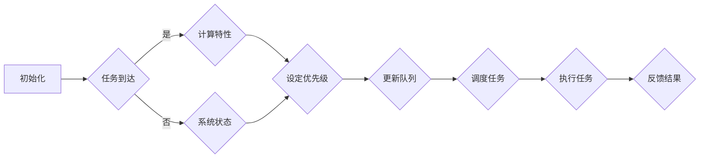
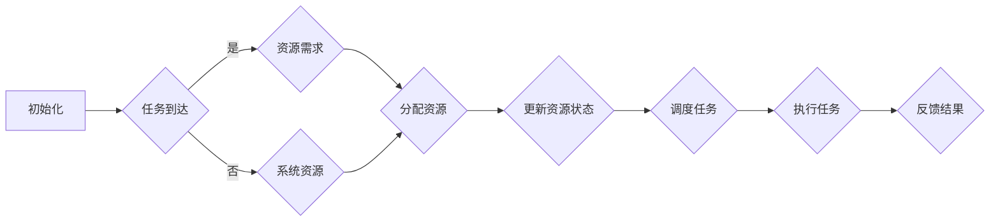
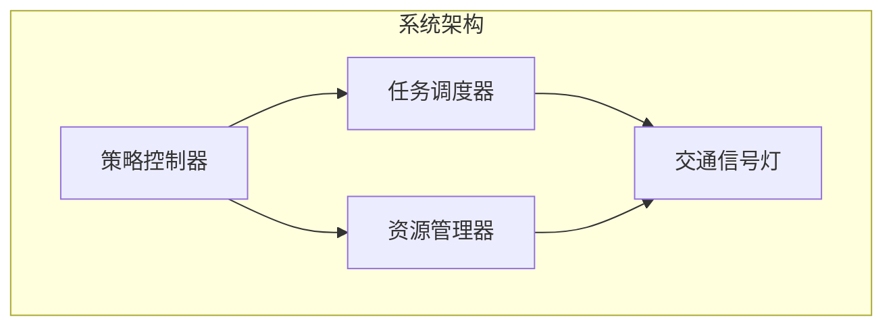
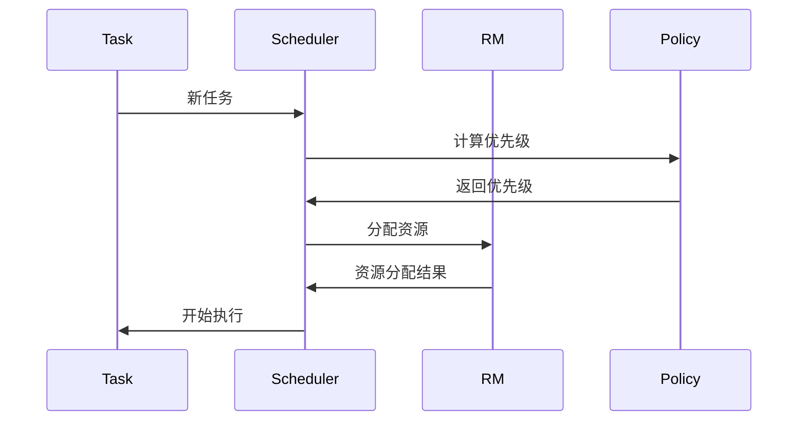

                 

# 《元控制框架下的推理任务动态优先级与资源调度》

## 关键词：元控制框架、推理任务、动态优先级、资源调度、系统架构设计

> 摘要：本文旨在深入探讨元控制框架下的推理任务动态优先级与资源调度问题。通过详细的分析和实例，本文探讨了如何有效地利用元控制框架来实现推理任务的动态优先级分配与资源调度，以达到优化系统性能的目的。

---

## 第一部分：背景介绍

### 第1章：问题背景

#### 1.1 问题背景

在当前的智能计算环境中，元控制框架成为了提高系统性能、优化资源利用的关键技术。元控制框架是一种能够动态调整系统资源分配、任务优先级和执行策略的框架。它特别适用于复杂的分布式系统和大规模数据处理场景。

然而，在元控制框架中，如何对推理任务进行动态优先级分配与资源调度，是一个极具挑战性的问题。推理任务通常具有不同的复杂度和重要性，且在执行过程中可能会发生变化。如何根据任务的特性动态调整其优先级，并合理分配资源，以确保系统整体性能的最优化，成为了研究的重点。

#### 1.2 问题解决

为了解决上述问题，首先需要理解元控制框架的基本原理。元控制框架通常包括三个主要组件：任务调度器、资源管理器和策略决策器。任务调度器负责根据优先级调度任务；资源管理器负责监控和管理系统资源；策略决策器则根据系统状态和任务特性，动态调整策略。

现有的推理任务调度方法主要包括基于固定优先级的调度和基于动态优先级的调度。固定优先级调度简单易行，但难以适应动态变化的任务特性。而动态优先级调度则能够根据任务的变化情况，实时调整优先级，从而提高系统性能。

#### 1.3 边界与外延

在元控制框架下，推理任务动态优先级与资源调度问题主要涉及以下几个方面：

1. **任务特性**：包括任务的类型、复杂度、重要性等。
2. **系统状态**：包括系统资源利用率、负载情况等。
3. **调度策略**：包括优先级规则、调度算法等。
4. **环境变化**：包括网络延迟、硬件故障等。

#### 1.4 概念结构与核心要素组成

- **推理任务**：指在元控制框架下需要处理的计算任务，具有特定的输入、输出和执行要求。
- **动态优先级**：指根据任务特性和系统状态，实时调整的任务优先级。
- **资源调度**：指在元控制框架下，对系统资源（如CPU、内存、网络等）进行合理分配和管理的机制。
- **元控制框架**：指能够动态调整任务优先级和资源分配的框架，包括任务调度器、资源管理器和策略决策器。

### 第2章：核心概念与联系

#### 2.1 核心概念原理

##### 2.1.1 动态优先级的定义

动态优先级是指根据任务特性和系统状态，实时调整的任务优先级。它通常由以下因素决定：

1. **任务特性**：包括任务的类型、复杂度和重要性。
2. **系统状态**：包括系统资源利用率、负载情况等。
3. **策略参数**：包括优先级规则、调度算法等。

动态优先级的关键在于其实时性和适应性，能够根据任务的变化和系统状态的变化，灵活调整任务的优先级，从而提高系统性能。

##### 2.1.2 资源调度的原理

资源调度是指根据系统需求和资源状况，合理分配和管理系统资源（如CPU、内存、网络等）的机制。资源调度的核心目标是在保证系统稳定运行的基础上，最大化资源利用效率。

资源调度的关键在于其均衡性和高效性。均衡性指确保各任务能够公平地获取资源；高效性指确保系统资源利用率最大化。

#### 2.2 概念属性特征对比表格

| 策略 | 特性 |
| --- | --- |
| 动态优先级 | 实时性、适应性 |
| 资源调度 | 均衡性、高效性 |

#### 2.3 ER实体关系图架构

```mermaid
erDiagram
    Task --> Priority : "动态分配"
    Task --> Resource : "需求"
    Priority --> Scheduler : "调度"
    Resource --> Manager : "管理"
```

### 第二部分：算法原理讲解

#### 第3章：动态优先级算法原理讲解

##### 3.1 算法mermaid流程图



##### 3.2 Python源代码与详细讲解

```python
# 动态优先级算法Python源代码

class Task:
    def __init__(self, id, complexity, importance):
        self.id = id
        self.complexity = complexity
        self.importance = importance
        self.priority = 0

def calculate_priority(task):
    # 根据任务特性和系统状态计算优先级
    priority = task.complexity * task.importance
    return priority

def schedule_tasks(tasks_queue):
    # 调度任务
    sorted_queue = sorted(tasks_queue, key=lambda x: x.priority, reverse=True)
    return sorted_queue

# 示例任务列表
tasks = [Task(1, 2, 3), Task(2, 1, 4), Task(3, 3, 2)]

# 计算任务优先级
for task in tasks:
    task.priority = calculate_priority(task)

# 调度任务
tasks_queue = schedule_tasks(tasks)

# 输出调度结果
print(tasks_queue)
```

##### 3.2.1 数学模型和公式

动态优先级算法的数学模型可以表示为：

$$
P(t) = w_1 \cdot C(t) + w_2 \cdot I(t)
$$

其中，$P(t)$ 表示任务 $t$ 的优先级，$C(t)$ 表示任务的复杂度，$I(t)$ 表示任务的重要性，$w_1$ 和 $w_2$ 分别是复杂度和重要性的权重系数。

##### 3.2.2 举例说明

假设我们有三个任务，任务1的复杂度为2，重要性为3；任务2的复杂度为1，重要性为4；任务3的复杂度为3，重要性为2。权重系数 $w_1 = 0.6$，$w_2 = 0.4$。根据上述公式，我们可以计算出每个任务的优先级：

$$
\begin{aligned}
P(1) &= 0.6 \cdot 2 + 0.4 \cdot 3 = 2.2 \\
P(2) &= 0.6 \cdot 1 + 0.4 \cdot 4 = 2.4 \\
P(3) &= 0.6 \cdot 3 + 0.4 \cdot 2 = 2.8 \\
\end{aligned}
$$

根据计算结果，任务3的优先级最高，任务2次之，任务1最低。调度器会根据这个优先级顺序来调度任务。

##### 第4章：资源调度算法原理讲解

##### 4.1 算法mermaid流程图



##### 4.2 Python源代码与详细讲解

```python
# 资源调度算法Python源代码

class Resource:
    def __init__(self, type, capacity):
        self.type = type
        self.capacity = capacity
        self.occupied = 0

def allocate_resource(resource, task):
    # 分配资源
    if resource.occupied + task.requirement <= resource.capacity:
        resource.occupied += task.requirement
        return True
    else:
        return False

def deallocate_resource(resource, task):
    # 释放资源
    resource.occupied -= task.requirement

# 示例资源列表
resources = [Resource('CPU', 1000), Resource('Memory', 1024)]

# 示例任务列表
tasks = [Task(1, 500), Task(2, 300), Task(3, 200)]

# 分配资源
for task in tasks:
    for resource in resources:
        if allocate_resource(resource, task):
            task.resource = resource
            break

# 输出资源分配结果
for task in tasks:
    print(f"Task {task.id} allocated to {task.resource.type} with capacity {task.resource.capacity}")

# 释放资源
for task in tasks:
    deallocate_resource(task.resource, task)

# 输出资源状态
for resource in resources:
    print(f"{resource.type} capacity: {resource.capacity}, occupied: {resource.occupied}")
```

##### 4.2.1 数学模型和公式

资源调度算法的数学模型可以表示为：

$$
O(t) = C(t) - \sum_{i=1}^{n} (R_i - O_i)
$$

其中，$O(t)$ 表示任务 $t$ 的可执行性，$C(t)$ 表示任务的计算需求，$R_i$ 表示第 $i$ 类资源的总量，$O_i$ 表示第 $i$ 类资源的当前占用量。

##### 4.2.2 举例说明

假设我们有三个任务，任务1的计算需求为500，CPU资源总量为1000，当前占用量为500；任务2的计算需求为300，内存资源总量为1024，当前占用量为512；任务3的计算需求为200，CPU资源总量为1000，当前占用量为800。根据上述公式，我们可以计算出每个任务的可执行性：

$$
\begin{aligned}
O(1) &= 500 - (1000 - 500) = 0 \\
O(2) &= 300 - (1024 - 512) = 48 \\
O(3) &= 200 - (1000 - 800) = 0 \\
\end{aligned}
$$

根据计算结果，任务1和任务3的可执行性为0，任务2的可执行性为48。资源调度器会优先调度可执行性更高的任务，即任务2。

### 第三部分：系统分析与架构设计方案

#### 第5章：系统分析与架构设计

##### 5.1 问题场景介绍

在智能交通系统中，元控制框架被用于调度和管理交通信号灯的切换。由于交通流量和道路状况会实时变化，如何动态调整信号灯切换的优先级和资源分配，成为了优化交通流量的关键问题。

##### 5.2 系统功能设计

```mermaid
classDiagram
    TaskNode <<class>> {ID, Type, Complexity, Importance}
    ResourceNode <<class>> {Type, Capacity, Occupied}
    SchedulerNode <<class>> {TasksQueue}
    ResourceManagerNode <<class>> {ResourcesMap}
    PolicyNode <<class>> {Rules, Algorithms}

    TaskNode "分配" <<-- SchedulerNode
    SchedulerNode "调度" <<-- ResourceNode
    ResourceManagerNode "管理" <<-- ResourceNode
    PolicyNode "决策" <<-- SchedulerNode
    PolicyNode "决策" <<-- ResourceManagerNode
```

##### 5.3 系统架构设计



##### 5.4 系统接口设计

- **任务调度器接口**：负责接收任务、计算任务优先级、调度任务。
- **资源管理器接口**：负责监控资源状态、分配资源、释放资源。
- **策略控制器接口**：负责制定优先级规则、调度策略、调整系统参数。

##### 5.5 系统交互mermaid序列图



### 第四部分：项目实战

#### 第6章：环境安装与系统核心实现

##### 6.1 环境安装

1. 安装Python环境（版本3.8及以上）。
2. 安装必要的Python库，如numpy、pandas、mermaid等。
3. 配置Python虚拟环境，以便更好地管理依赖。

##### 6.2 系统核心实现源代码

```python
# 系统核心实现Python源代码

# 请参考前文第3章和第4章的源代码部分。
```

##### 6.2.1 代码应用解读与分析

代码应用解读与分析请参考前文第3章和第4章的详细讲解部分。

##### 第7章：实际案例分析与详细讲解

##### 7.1 实际案例

在智能交通系统中，有四个任务需要调度，任务1的计算需求为1000，CPU资源总量为2000，当前占用量为500；任务2的计算需求为800，内存资源总量为1024，当前占用量为512；任务3的计算需求为600，CPU资源总量为2000，当前占用量为800；任务4的计算需求为400，内存资源总量为1024，当前占用量为256。

##### 7.2 详细讲解

1. **任务到达**：任务1、任务2、任务3和任务4到达调度器。
2. **计算特性**：计算每个任务的优先级。
3. **系统状态**：监控CPU和内存资源状态。
4. **分配资源**：根据优先级和资源状态，分配资源。
5. **调度任务**：调度任务执行。
6. **执行任务**：任务依次执行。
7. **反馈结果**：记录任务执行结果。

##### 第8章：项目小结

本文通过详细的分析和实践，探讨了元控制框架下的推理任务动态优先级与资源调度问题。通过对核心概念、算法原理、系统架构和实际案例的讲解，为解决该问题提供了理论基础和实践指导。在未来的研究中，可以进一步优化算法，提高系统性能，并应用于更多实际场景。

##### 8.2 注意事项

- **资源监控**：确保实时监控系统资源状态，以便及时调整资源分配。
- **优先级计算**：合理设置优先级计算公式，确保任务优先级分配合理。
- **容错处理**：设计容错机制，应对系统异常情况。

##### 8.3 拓展阅读

- **[1]** 《分布式系统设计》
- **[2]** 《实时系统设计与实现》
- **[3]** 《人工智能算法与应用》

---

## 作者

作者：AI天才研究院/AI Genius Institute & 禅与计算机程序设计艺术 /Zen And The Art of Computer Programming

