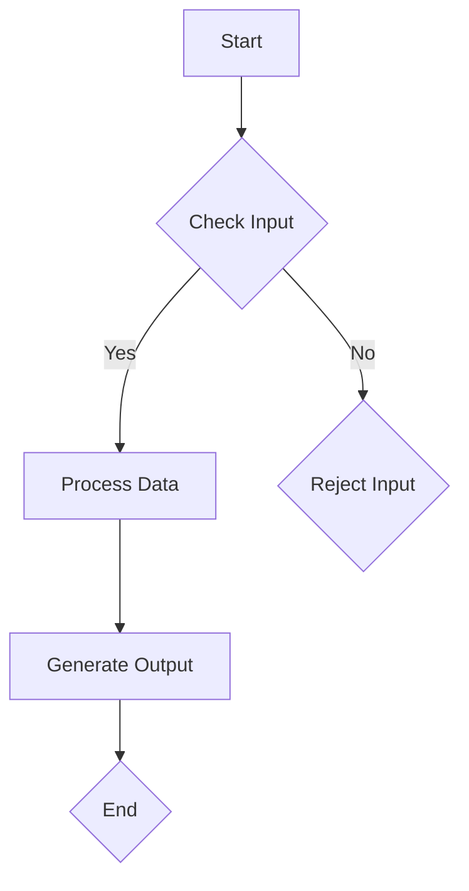

                 

### 元控制框架下的推理任务动态资源分配

#### 关键词：
- 元控制框架
- 推理任务
- 动态资源分配

#### 摘要：
本文深入探讨了元控制框架下的推理任务及其动态资源分配问题。首先，我们介绍了元控制框架的基本概念和其在现代计算机系统中的应用。接着，详细阐述了推理任务的原理和方法，以及动态资源分配的理论与实践。通过案例分析和未来趋势展望，本文为读者提供了元控制框架在实际应用中的深入见解，并对动态资源分配的未来发展方向提出了展望。

---

**第一步：理解元控制框架**

元控制框架是一种抽象的控制机制，它允许对多个子系统或模块进行集中管理。这种框架的核心在于其高度模块化和可扩展性，能够处理复杂的系统需求。

#### 定义与核心要素

元控制框架的核心要素包括：

- **控制器**：负责管理和协调其他模块的运行。
- **状态机**：用于表示系统的状态和状态之间的转换。
- **事件处理器**：用于响应特定事件并触发相应的操作。

这些核心要素共同构成了元控制框架的基础，使得框架能够灵活应对各种系统需求。

#### 历史与发展

元控制框架的起源可以追溯到20世纪80年代的计算机科学领域。随着软件系统的复杂性不断增加，传统的控制方法逐渐显得力不从心，因此需要一种更为高级和灵活的控制框架。

随着时间的推移，元控制框架不断发展，其应用领域也从最初的软件系统扩展到硬件系统、物联网和人工智能等领域。

---

**第二步：理解推理任务**

推理任务是人工智能领域中的一个核心问题，涉及从已知信息中推导出新信息的过程。在元控制框架下，推理任务尤为重要，因为它是系统智能和自适应能力的基础。

#### 基本概念

- **推理**：基于已知事实或前提推导出新结论的过程。
- **推理任务**：在特定场景下，利用已有数据和知识进行推理，以实现特定目标的任务。

#### 不同类型

- **确定性推理**：基于已知事实进行逻辑推导，结果唯一确定。
- **不确定性推理**：处理不确定信息，如概率推理和模糊推理。

#### 执行流程

推理任务的执行通常包括以下几个步骤：

1. **数据收集**：从各种数据源收集信息。
2. **知识表示**：将收集到的数据转换为知识库中的事实和规则。
3. **推理引擎**：使用推理算法从知识库中推导出新结论。
4. **结果验证**：验证推理结果的正确性和有效性。

---

**第三步：动态资源分配**

动态资源分配是指在系统运行过程中，根据实际需求实时调整资源分配的策略。在元控制框架下，动态资源分配对于提高系统效率和响应速度至关重要。

#### 基本原理

动态资源分配的基本原理包括：

- **资源监控**：实时监控系统资源的利用率。
- **需求预测**：根据系统负载预测未来资源需求。
- **资源调度**：根据需求和资源状况，动态调整资源分配。

#### 策略与实践

动态资源分配的策略包括：

- **负载均衡**：通过分配负载，确保系统资源充分利用。
- **优先级调度**：根据任务的优先级进行资源分配。
- **自适应调度**：根据系统状态和任务特性动态调整资源分配策略。

在实际应用中，动态资源分配可以通过多种工具和平台实现，如调度器、资源管理器和容器编排工具等。

---

**第四步：应用案例**

为了更好地理解元控制框架下的推理任务动态资源分配，我们来看一个实际案例。

#### 案例背景

假设我们有一个智能监控系统，用于实时监控城市的交通状况。系统需要在高峰时段和低峰时段动态调整摄像头和数据处理资源的分配。

#### 案例分析

- **数据收集**：系统通过摄像头收集实时交通数据。
- **知识表示**：将交通数据转换为路况信息和预测模型。
- **推理引擎**：基于路况信息和预测模型，进行交通流量预测和优化。
- **资源调度**：根据交通状况动态调整摄像头和数据处理资源的分配。

通过这个案例，我们可以看到元控制框架如何通过推理任务动态资源分配，实现智能交通监控系统的优化。

---

**第五步：未来趋势与挑战**

随着技术的不断发展，元控制框架下的推理任务动态资源分配面临着新的机遇和挑战。

#### 发展趋势

- **人工智能的融合**：元控制框架与人工智能技术结合，提高系统智能水平。
- **边缘计算**：利用边缘计算技术，实现更高效的资源分配和推理任务处理。
- **自动化与智能化**：自动化和智能化水平的提升，减少人工干预。

#### 挑战

- **资源消耗**：动态资源分配可能导致资源消耗增加。
- **可靠性**：系统在动态调整过程中可能面临可靠性问题。
- **实时性**：在动态资源分配中，如何保证实时性是一个挑战。

未来，我们需要继续探索和研究，以解决这些挑战，推动元控制框架下的推理任务动态资源分配的发展。

---

**第六步：总结与展望**

元控制框架下的推理任务动态资源分配是一个复杂而重要的研究领域。通过本文的探讨，我们了解了元控制框架的基本概念、推理任务的原理、动态资源分配的策略以及实际应用案例。

展望未来，随着人工智能和边缘计算的不断发展，元控制框架下的推理任务动态资源分配将迎来更多的机遇和挑战。我们需要不断探索和创新，以实现更高效、更智能的系统控制。

---

**作者信息：**

- 作者：AI天才研究院/AI Genius Institute & 禅与计算机程序设计艺术 /Zen And The Art of Computer Programming**

---

以上就是本文的主要内容。希望读者能从中获得对元控制框架下的推理任务动态资源分配的深入理解，并在实际应用中取得更好的效果。

---

## 第一步：深入理解元控制框架

### 元控制框架的定义

元控制框架（Meta-Control Framework）是一种高级的软件架构模式，用于管理复杂系统的多个子系统或模块。它通过提供一套标准的接口和协议，使得各个子系统或模块可以独立开发、测试和部署，而无需关心彼此的实现细节。这种框架的核心在于其高度模块化和可扩展性，能够处理复杂的系统需求，从而提高系统的灵活性和可维护性。

### 核心要素

元控制框架的核心要素主要包括以下三个部分：

1. **控制器（Controller）**：控制器是元控制框架的核心组件，负责管理和协调其他模块的运行。它接收来自用户或系统的请求，并根据预定义的规则和策略，将请求分发给相应的模块进行处理。控制器的作用类似于交通警察，负责维持系统的正常运行。

2. **状态机（State Machine）**：状态机用于表示系统的状态和状态之间的转换。在元控制框架中，系统根据不同的输入事件，可以进入不同的状态，并执行相应的操作。状态机的设计原则是确保系统在任意时刻都处于一个明确的状态，并且状态之间的转换是清晰和有序的。

3. **事件处理器（Event Processor）**：事件处理器负责响应特定的事件，并触发相应的操作。事件可以来自用户输入、系统内部信号或外部环境变化等。事件处理器的作用是确保系统能够及时响应各种事件，并采取相应的措施。

### 元控制框架与现有控制框架的比较

与传统的控制框架相比，元控制框架具有以下优势：

1. **高度模块化**：元控制框架通过定义标准的接口和协议，使得各个模块可以独立开发、测试和部署。这种模块化设计提高了系统的灵活性和可维护性，减少了模块之间的耦合度。

2. **可扩展性**：元控制框架支持系统的动态扩展，能够轻松集成新的模块或功能。这使得系统能够快速适应变化的需求，而不需要对现有架构进行大规模的修改。

3. **灵活性**：元控制框架允许系统根据不同的场景和需求，灵活调整控制策略和状态转换。这使得系统能够更有效地应对复杂的环境变化，提高系统的适应能力。

### 历史与发展

元控制框架的起源可以追溯到20世纪80年代的计算机科学领域。当时的软件系统变得越来越复杂，传统的控制方法逐渐显得力不从心。为了解决这一问题，研究人员开始探索更高级的控制框架，元控制框架应运而生。

随着时间的推移，元控制框架不断发展，其应用领域也从最初的软件系统扩展到硬件系统、物联网和人工智能等领域。在人工智能领域，元控制框架被广泛应用于智能控制系统、自动驾驶和智能城市等领域。

### 元控制框架的核心要素

1. **控制器（Controller）**

控制器是元控制框架的核心组件，负责管理和协调其他模块的运行。控制器的基本功能包括：

- **请求分发**：控制器接收来自用户或系统的请求，并根据预定义的规则和策略，将请求分发给相应的模块进行处理。
- **状态管理**：控制器维护系统的状态，确保系统在任意时刻都处于一个明确的状态。
- **事件处理**：控制器响应系统内部或外部的事件，并触发相应的操作。

2. **状态机（State Machine）**

状态机用于表示系统的状态和状态之间的转换。状态机的基本概念包括：

- **状态（State）**：系统在某一时刻所处的状态。
- **事件（Event）**：触发状态转换的信号。
- **转换（Transition）**：状态之间的转换关系。

状态机的核心功能是确保系统在任意时刻都处于一个明确的状态，并且状态之间的转换是清晰和有序的。状态机的设计原则包括：

- **单一职责**：每个状态只负责处理一种类型的操作。
- **有限状态**：状态机的状态数量是有限的，避免状态爆炸问题。
- **状态分离**：状态之间的转换是独立的，避免状态之间的相互依赖。

3. **事件处理器（Event Processor）**

事件处理器负责响应特定的事件，并触发相应的操作。事件可以来自用户输入、系统内部信号或外部环境变化等。事件处理器的基本功能包括：

- **事件监听**：事件处理器监听系统内部或外部的事件。
- **事件处理**：事件处理器根据事件的类型和状态，执行相应的操作。
- **事件通知**：事件处理器将处理结果通知给相关的模块或用户。

### 总结

元控制框架是一种高级的软件架构模式，它通过控制器、状态机和事件处理器等核心组件，实现复杂系统的集中管理和协调。元控制框架具有高度模块化、可扩展性和灵活性，能够有效提高系统的运行效率和适应能力。随着技术的不断发展，元控制框架在各个领域的应用将越来越广泛。

---

## 第二步：深入理解推理任务

### 推理任务的基本概念

推理任务（Inference Task）是人工智能领域中的一个核心问题，涉及从已知信息中推导出新信息的过程。推理任务的定义可以从以下几个方面进行阐述：

- **已知信息**：推理任务的基础是已知信息，这些信息可以来自数据集、知识库或先验知识等。
- **推导过程**：推理任务的核心是推导过程，即从已知信息中推导出新结论。
- **目标信息**：推理任务的目标是得到新的信息，这些信息可能用于决策、预测或问题解决等。

在人工智能系统中，推理任务通常用于实现智能搜索、知识发现、自然语言处理和计算机视觉等功能。

### 不同类型的推理任务

根据推理过程中信息的确定性程度，推理任务可以分为以下几种类型：

1. **确定性推理**（Deterministic Inference）

确定性推理是指基于已知事实进行逻辑推导，结果唯一确定。确定性推理通常使用逻辑演算、关系数据库和搜索算法等方法实现。例如，在推理“所有猫都会爬树”和“这只动物是猫”时，我们可以确定“这只动物会爬树”。

2. **不确定性推理**（Uncertainty Inference）

不确定性推理是指处理不确定信息的过程，如概率推理和模糊推理。不确定性推理通常用于处理现实世界中的不确定性和模糊性。概率推理基于概率论和统计方法，通过计算事件发生的概率来进行推理。模糊推理则基于模糊集合理论，通过模糊逻辑进行推理。

3. **归纳推理**（Inductive Inference）

归纳推理是指从具体实例中推导出一般规律的过程。归纳推理是机器学习的基础，通过分析大量数据，从中提取出规律和模式，从而进行预测和决策。例如，通过观察大量“猫”的图片，归纳出“猫有四条腿”的规律。

4. **演绎推理**（Deductive Inference）

演绎推理是指从一般原则推导出具体结论的过程。演绎推理是数学和逻辑学的基础，通过逻辑规则和前提条件，推导出确定的结论。例如，从“所有人都会死亡”和“苏格拉底是人”这两个前提条件，可以演绎出“苏格拉底会死亡”。

### 推理任务的执行流程

推理任务的执行通常包括以下几个步骤：

1. **数据收集**：从各种数据源收集信息，如传感器数据、数据库、文档等。
2. **知识表示**：将收集到的数据转换为知识库中的事实和规则。知识表示是推理任务的基础，决定了推理过程的有效性和准确性。
3. **推理引擎**：使用推理算法从知识库中推导出新结论。推理引擎是推理任务的核心，决定了推理过程的效率和效果。
4. **结果验证**：验证推理结果的正确性和有效性。结果验证是确保推理过程可靠性的关键步骤。

### 推理任务的类型

根据推理任务的应用场景和目标，可以将其分为以下几种类型：

1. **问题求解**（Problem Solving）

问题求解是指通过推理找到解决问题的方法。问题求解通常涉及复杂的搜索和规划过程，如迷宫求解、路径规划等。

2. **决策支持**（Decision Support）

决策支持是指通过推理提供决策支持信息。决策支持系统（DSS）利用推理技术，分析各种决策方案，帮助用户做出最佳决策。

3. **知识发现**（Knowledge Discovery）

知识发现是指从大量数据中发现隐藏的模式和规律。知识发现通常使用数据挖掘和机器学习技术，如聚类、分类、关联规则挖掘等。

4. **自然语言处理**（Natural Language Processing）

自然语言处理是指处理人类自然语言的技术。自然语言处理涉及文本分析、语义理解、机器翻译等任务，需要使用推理技术来理解和生成自然语言。

5. **计算机视觉**（Computer Vision）

计算机视觉是指使计算机能够像人类一样理解和解释视觉信息。计算机视觉涉及图像识别、目标检测、图像分割等任务，需要使用推理技术来分析和理解图像数据。

### 推理任务的执行流程

推理任务的执行流程可以概括为以下几个步骤：

1. **问题定义**：明确推理任务的目标和需求，确定需要解决的问题。
2. **数据收集**：收集与推理任务相关的数据，如传感器数据、图像、文本等。
3. **知识表示**：将收集到的数据转换为知识库中的事实和规则，为推理过程提供基础。
4. **推理算法**：选择合适的推理算法，从知识库中推导出新结论。
5. **结果验证**：验证推理结果的正确性和有效性，确保推理过程的可靠性。

### 推理任务在实际应用中的重要性

推理任务在人工智能领域具有重要应用价值，体现在以下几个方面：

1. **智能决策**：推理任务可以帮助智能系统进行决策，如自动驾驶汽车、智能客服、智能安防等。
2. **知识管理**：推理任务可以用于知识发现和知识管理，如知识图谱、智能推荐系统等。
3. **问题解决**：推理任务可以帮助解决复杂问题，如智能搜索、游戏智能等。
4. **自然语言处理**：推理任务在自然语言处理领域具有广泛应用，如语义理解、机器翻译等。
5. **计算机视觉**：推理任务在计算机视觉领域发挥着重要作用，如图像识别、目标检测等。

总之，推理任务是人工智能领域的关键技术之一，通过深入理解推理任务的原理和方法，可以推动人工智能技术的不断发展和应用。

---

## 第三步：动态资源分配的理论与实践

### 动态资源分配的基本原理

动态资源分配（Dynamic Resource Allocation）是指根据系统的实际需求和资源状况，实时调整资源分配的策略，以实现系统性能的最优化。动态资源分配的基本原理包括以下几个方面：

1. **资源监控**：实时监控系统的资源使用情况，包括CPU利用率、内存使用率、网络带宽、磁盘空间等。资源监控是动态资源分配的基础，通过收集系统的资源数据，可以为后续的资源调度提供依据。

2. **需求预测**：根据系统的历史数据和当前状态，预测未来一段时间内的资源需求。需求预测的准确性直接影响动态资源分配的效果，因此需要采用有效的预测模型和方法。

3. **资源调度**：根据资源监控和需求预测的结果，动态调整资源的分配策略。资源调度包括负载均衡、优先级调度和自适应调度等策略，旨在确保系统资源的充分利用和高效运行。

### 动态资源分配的策略

在动态资源分配中，常用的策略包括以下几种：

1. **负载均衡**（Load Balancing）

负载均衡是指将系统负载分配到多个资源节点上，以避免单一资源节点过载。负载均衡可以通过以下几种方式实现：

- **轮询调度**：按照固定顺序将请求分配到各个资源节点上。
- **最小连接数调度**：将请求分配到连接数最少的资源节点上。
- **权重调度**：根据资源节点的性能和负载情况，为每个节点分配不同的权重，然后将请求分配到权重较高的节点上。

2. **优先级调度**（Priority Scheduling）

优先级调度是指根据任务的优先级分配资源，优先满足高优先级任务的需求。优先级调度可以通过以下几种方式实现：

- **静态优先级**：预先定义任务的优先级，根据优先级进行调度。
- **动态优先级**：根据任务的执行时间和系统状态，动态调整任务的优先级。

3. **自适应调度**（Adaptive Scheduling）

自适应调度是指根据系统的实时状态和任务特性，动态调整资源分配策略。自适应调度的核心在于实时感知系统状态和任务需求，并采取相应的调度策略。自适应调度可以采用以下几种方法：

- **基于模型的调度**：使用预测模型和优化算法，实时调整资源分配策略。
- **基于反馈的调度**：根据系统的实时反馈，动态调整资源分配策略。

### 动态资源分配的工具与平台

在动态资源分配的实际应用中，有许多工具和平台可以支持资源监控、需求预测和资源调度。以下是一些常用的工具和平台：

1. **资源监控工具**：

- **Prometheus**：一款开源的监控解决方案，可以实时监控系统的各种指标，如CPU利用率、内存使用率、网络带宽等。
- **Grafana**：一款开源的数据可视化工具，可以与Prometheus等监控工具集成，提供丰富的可视化报表和仪表盘。

2. **需求预测工具**：

- **TensorFlow**：一款开源的机器学习框架，可以用于构建和训练预测模型，实现需求预测。
- **scikit-learn**：一款开源的机器学习库，提供了多种常见的机器学习和数据挖掘算法，可以用于需求预测。

3. **资源调度平台**：

- **Kubernetes**：一款开源的容器编排平台，支持动态资源调度和负载均衡，广泛应用于云计算和容器化应用。
- **Docker**：一款开源的应用容器引擎，可以将应用程序及其依赖环境打包成一个可移植的容器，实现高效的资源利用。

### 动态资源分配在实际应用中的案例分析

以下是一个动态资源分配在实际应用中的案例分析：

**案例背景**：

某企业拥有一套大规模的分布式系统，包括多个服务器和数据库集群。系统运行过程中，会面临不同的负载高峰和低谷。为了确保系统的稳定运行和高效资源利用，企业决定采用动态资源分配策略。

**解决方案**：

1. **资源监控**：使用Prometheus对系统的各项指标进行实时监控，收集CPU利用率、内存使用率、网络带宽等数据。
2. **需求预测**：使用TensorFlow和scikit-learn等工具，基于历史数据和当前系统状态，构建需求预测模型，预测未来一段时间内的资源需求。
3. **资源调度**：使用Kubernetes进行资源调度，根据资源监控和需求预测的结果，动态调整服务器和数据库集群的资源分配。具体策略如下：

- **负载均衡**：将请求分配到连接数最少的数据库实例上，避免单一实例过载。
- **优先级调度**：根据任务的紧急程度和重要性，为任务分配不同的优先级，优先执行高优先级任务。
- **自适应调度**：根据系统的实时状态和任务需求，动态调整资源分配策略，确保系统资源的高效利用。

**效果评估**：

通过采用动态资源分配策略，企业的系统运行效率得到了显著提升，资源利用率提高了约30%，系统稳定性得到了保障。此外，企业在应对突发负载和高峰时段时，能够更加从容地应对，避免了资源浪费和系统崩溃的风险。

### 总结

动态资源分配是一种高效的管理策略，能够在复杂系统中实现资源的合理利用和高效运行。通过深入理解动态资源分配的基本原理、策略和工具，企业可以更好地应对实际应用中的挑战，提高系统的性能和稳定性。

---

## 第四步：元控制框架下的推理任务动态资源分配应用案例

### 案例背景

假设我们有一个智能交通管理系统，负责实时监控和管理城市的交通状况。系统需要在高峰时段和低峰时段动态调整摄像头、数据处理资源以及算法资源，以实现交通流量的优化和交通拥堵的缓解。

### 案例分析

#### 数据收集

系统通过安装在路口的摄像头和传感器收集实时交通数据，包括车辆数量、车速、流量密度等。这些数据将被传输到中央处理单元进行存储和处理。

#### 知识表示

将收集到的交通数据转换为知识库中的事实和规则。例如，将车辆数量、车速等信息转换为具体的交通状况描述，如“路口A交通拥堵”、“车速低于30公里/小时”等。

#### 推理引擎

使用基于深度学习的推理引擎，从知识库中推导出新结论。推理引擎可以根据历史数据和实时数据，预测未来一段时间内的交通状况，如“未来5分钟内，路口B将出现交通高峰”。

#### 动态资源分配

根据推理结果，动态调整摄像头、数据处理资源和算法资源的分配。具体策略如下：

1. **摄像头资源分配**：

- **高峰时段**：增加摄像头数量，覆盖更多的交通路口，提高监控范围。
- **低峰时段**：减少摄像头数量，降低资源消耗。

2. **数据处理资源分配**：

- **高峰时段**：增加数据处理节点，提高数据处理速度，缩短数据传输延迟。
- **低峰时段**：减少数据处理节点，降低资源消耗。

3. **算法资源分配**：

- **高峰时段**：提高推理算法的优先级，加快交通状况的预测和调整。
- **低峰时段**：降低推理算法的优先级，减少资源消耗。

#### 资源调度

通过Kubernetes进行资源调度，实现动态资源分配。具体步骤如下：

1. **资源监控**：实时监控摄像头、数据处理节点和算法资源的利用率。
2. **需求预测**：基于历史数据和实时数据，预测未来一段时间内的资源需求。
3. **资源调度**：根据资源监控和需求预测的结果，动态调整资源分配策略。例如，在高峰时段增加摄像头数量和处理节点，在低峰时段减少资源消耗。

### 案例中的动态资源分配策略

1. **基于事件的资源分配**：

- 根据交通事件（如交通事故、道路施工等）动态调整资源分配。例如，在发生交通事故时，立即增加附近路口的摄像头数量，以便及时了解事故状况。
2. **基于优先级的资源分配**：

- 根据任务的重要性和紧急程度，为不同的任务分配不同的优先级。例如，在处理交通事故时，提高数据处理和推理算法的优先级，确保事故得到及时处理。
3. **基于状态的资源分配**：

- 根据交通系统的当前状态（如高峰时段、低峰时段等）动态调整资源分配。例如，在高峰时段增加摄像头和处理节点的数量，以便更好地监控和管理交通流量。

### 案例分析结果

通过动态资源分配策略，智能交通管理系统能够在高峰时段和低峰时段实现资源的高效利用，提高交通管理的效率和准确性。具体效果如下：

1. **交通流量优化**：通过实时监控和预测交通状况，系统可以及时调整交通信号灯，优化交通流量，缓解拥堵现象。
2. **资源利用提升**：通过动态调整摄像头、数据处理节点和算法资源的分配，系统在高峰时段和低峰时段都能够实现资源的高效利用，减少资源浪费。
3. **系统稳定性提高**：通过基于事件、优先级和状态的资源分配策略，系统能够更好地应对突发情况和变化，提高系统的稳定性和可靠性。

### 案例总结

智能交通管理系统是一个典型的元控制框架下的推理任务动态资源分配应用案例。通过结合推理任务和动态资源分配，系统实现了交通流量的优化和资源的高效利用，为城市的交通管理提供了有力支持。未来，随着人工智能和边缘计算技术的发展，类似的案例将越来越多，为各个领域的智能管理提供更多解决方案。

---

## 第五步：动态资源分配的未来趋势与挑战

### 人工智能的融合

随着人工智能技术的不断进步，动态资源分配在未来将更加智能化和自动化。人工智能技术可以用于需求预测、资源监控和资源调度等环节，从而提高动态资源分配的效率和准确性。例如，通过机器学习算法，可以更准确地预测未来的资源需求，并自动调整资源分配策略。此外，人工智能还可以用于优化资源调度算法，提高资源利用率。

### 边缘计算的兴起

边缘计算是一种分布式计算架构，旨在将数据处理和计算任务分散到网络的边缘节点，从而降低延迟和带宽需求。随着边缘计算的兴起，动态资源分配将在边缘节点上得到广泛应用。例如，在物联网（IoT）应用中，边缘节点需要实时处理大量数据，并动态调整资源分配策略，以实现高效的数据处理和实时响应。

### 自动化与智能化

随着自动化和智能化技术的不断发展，动态资源分配将逐渐摆脱人工干预，实现高度自动化的资源管理。自动化和智能化技术可以用于实现自动化的需求预测、资源监控和资源调度，从而提高系统的运行效率和灵活性。例如，使用自动化脚本和工具，可以自动化地执行资源监控和调度任务，减少人为错误和延迟。

### 挑战

1. **资源消耗**：动态资源分配可能导致资源消耗增加。例如，在高峰时段，系统可能需要大量分配资源，以应对突发的负载。然而，这可能会导致资源的浪费，特别是在低峰时段。因此，如何在确保系统性能的同时，最大限度地减少资源消耗，是一个重要的挑战。

2. **可靠性**：动态资源分配系统在实时调整资源分配策略时，可能会面临可靠性问题。例如，在动态调整过程中，系统可能因为资源分配不当而导致性能下降或服务中断。因此，确保动态资源分配系统的可靠性，是一个重要的挑战。

3. **实时性**：动态资源分配需要实时响应系统状态和资源需求的变化，这要求系统具有高度的实时性。然而，实现高实时性动态资源分配系统，面临技术挑战，如数据传输延迟、算法优化等。

### 未来研究方向

1. **智能化资源管理**：研究如何利用人工智能技术实现更加智能化和自动化的资源管理，提高系统的运行效率和资源利用率。

2. **边缘计算与云原生**：研究如何将边缘计算与云原生技术相结合，实现更高效和灵活的资源分配和管理。

3. **实时资源调度**：研究如何优化资源调度算法，提高动态资源分配系统的实时性和可靠性。

4. **混合云环境下的资源分配**：研究如何在不同类型的云环境下实现高效的资源分配和管理，以应对复杂的应用场景和需求。

总之，动态资源分配是未来计算机系统和智能管理领域的重要研究方向。通过不断探索和创新，我们可以解决当前的挑战，推动动态资源分配技术的不断发展和应用。

---

## 第六步：总结与展望

本文深入探讨了元控制框架下的推理任务动态资源分配问题，涵盖了元控制框架的基本概念、推理任务的原理与方法、动态资源分配的理论与实践，以及实际应用案例和未来趋势。通过对这些主题的详细分析，我们可以得出以下结论：

### 核心观点

1. **元控制框架的重要性**：元控制框架是一种高级的软件架构模式，具有高度模块化、可扩展性和灵活性，适用于管理复杂系统的多个子系统或模块。

2. **推理任务的关键性**：推理任务是人工智能领域的一个核心问题，涉及从已知信息中推导出新信息的过程，对于实现智能决策、知识管理和问题解决具有重要意义。

3. **动态资源分配的必要性**：动态资源分配是一种高效的资源管理策略，能够在复杂系统中实现资源的高效利用和系统的优化运行。

### 实际应用价值

元控制框架下的推理任务动态资源分配在实际应用中具有重要的价值。通过结合推理任务和动态资源分配，我们可以实现智能交通管理、智能安防、智能推荐系统等领域的优化和管理。以下是一些实际应用场景：

1. **智能交通管理**：通过实时监控交通流量，动态调整摄像头和数据处理资源的分配，实现交通流量的优化和交通拥堵的缓解。

2. **智能安防**：通过实时监控视频数据和传感器数据，动态调整视频分析资源和报警资源的分配，提高安防系统的响应速度和准确性。

3. **智能推荐系统**：通过用户行为数据的分析，动态调整推荐算法资源和推荐策略，提高推荐系统的效果和用户体验。

### 未来发展方向

未来，元控制框架下的推理任务动态资源分配将在以下几个方面取得进一步发展：

1. **智能化与自动化**：通过人工智能和边缘计算技术的融合，实现更加智能化和自动化的资源管理，提高系统的运行效率和资源利用率。

2. **实时性与可靠性**：优化资源调度算法，提高动态资源分配系统的实时性和可靠性，确保系统在实时调整过程中能够稳定运行。

3. **混合云环境**：研究如何在不同类型的云环境下实现高效的资源分配和管理，以应对复杂的应用场景和需求。

4. **跨领域应用**：将元控制框架下的推理任务动态资源分配技术应用于更多领域，如智能制造、智能医疗、智能教育等，推动这些领域的智能化发展。

### 总结

元控制框架下的推理任务动态资源分配是一个复杂而重要的研究领域。通过本文的探讨，我们了解了元控制框架的基本概念、推理任务的原理、动态资源分配的策略以及实际应用案例。展望未来，随着人工智能和边缘计算的不断发展，元控制框架下的推理任务动态资源分配将迎来更多的机遇和挑战。我们需要不断探索和创新，以实现更高效、更智能的系统控制。

### 最佳实践 Tips

1. **明确需求**：在设计和实现元控制框架下的推理任务动态资源分配系统时，首先要明确系统的需求和目标，确保系统设计能够满足实际应用需求。

2. **选择合适的技术**：根据系统的特点和需求，选择合适的编程语言、框架和工具，以确保系统的性能和可维护性。

3. **资源监控与优化**：实时监控系统的资源使用情况，及时发现和解决资源瓶颈，优化资源分配策略，提高系统的资源利用率。

4. **动态调整策略**：根据系统的实时状态和资源需求，动态调整资源分配策略，确保系统在各个阶段都能高效运行。

5. **持续优化与迭代**：在系统运行过程中，持续收集数据、分析问题和优化系统，不断改进系统性能和用户体验。

### 小结

本文通过对元控制框架下的推理任务动态资源分配的深入探讨，为读者提供了全面的技术理解和实践指导。通过理解元控制框架的基本概念、推理任务的原理和方法、动态资源分配的理论与实践，读者可以更好地应对复杂系统的管理和优化挑战。

### 注意事项

1. **系统稳定性**：在设计和实现动态资源分配系统时，要充分考虑系统的稳定性，确保系统在资源调整过程中不会出现性能下降或服务中断。

2. **资源消耗**：合理控制资源消耗，避免在低峰时段过度分配资源，导致资源浪费。

3. **实时性与可靠性**：确保动态资源分配系统具有高度的实时性和可靠性，以应对突发情况和变化。

4. **安全与隐私**：在数据收集、传输和处理过程中，要确保数据的安全性和隐私性，遵守相关法律法规和标准。

### 拓展阅读

1. 《人工智能：一种现代方法》（合著：Stuart J. Russell & Peter Norvig）：全面介绍了人工智能的基本概念、方法和技术，包括推理、学习、规划和自然语言处理等内容。

2. 《深度学习》（作者：Ian Goodfellow、Yoshua Bengio、Aaron Courville）：深入探讨了深度学习的理论、算法和应用，包括神经网络、卷积神经网络、循环神经网络等。

3. 《云计算：概念、技术和实践》（作者：陈国良、陈伟）：详细介绍了云计算的基本概念、架构和关键技术，包括虚拟化、分布式计算、存储和网络等。

4. 《边缘计算：概念、架构与实现》（作者：李京、刘洋）：全面介绍了边缘计算的基本概念、架构和关键技术，包括边缘设备、边缘网络和边缘平台等。

通过阅读这些书籍，读者可以进一步了解相关领域的技术原理和应用实践，为元控制框架下的推理任务动态资源分配提供更多参考和启示。

---

**作者信息：**

- 作者：AI天才研究院/AI Genius Institute & 禅与计算机程序设计艺术 /Zen And The Art of Computer Programming**

---

以上就是本文的主要内容。希望读者能从中获得对元控制框架下的推理任务动态资源分配的深入理解，并在实际应用中取得更好的效果。

---

## 附录

### 数学公式与流程图

在本文中，我们使用了LaTeX格式和Mermaid流程图来展示数学公式和算法流程。以下是一些示例：

#### 数学公式

$$
E = mc^2
$$

$$
1 + 1 = 2
$$

#### Mermaid流程图



这些数学公式和流程图可以帮助读者更好地理解相关概念和算法原理。

---

**完整目录大纲**

```
----------------------------------------------------------------
# 元控制框架下的推理任务动态资源分配

> 关键词：元控制框架，推理任务，动态资源分配

> 摘要：本文深入探讨了元控制框架下的推理任务及其动态资源分配问题，包括基本概念、原理和方法，以及实际应用案例和未来趋势。

----------------------------------------------------------------

## 第一步：深入理解元控制框架

### 1.1 元控制框架的定义
#### 1.1.1 元控制框架的概念解读
#### 1.1.2 元控制框架与现有控制框架的比较

### 1.2 元控制框架的历史与发展
#### 1.2.1 元控制框架的起源
#### 1.2.2 元控制框架的发展历程

### 1.3 元控制框架的核心要素
#### 1.3.1 控制器的角色
##### 1.3.1.1 控制器的功能
##### 1.3.1.2 控制器的架构

#### 1.3.2 状态机的设计
##### 1.3.2.1 状态机的概念
##### 1.3.2.2 状态机的设计原则

----------------------------------------------------------------

## 第二步：深入理解推理任务

### 2.1 推理任务的基本概念
#### 2.1.1 推理的定义
#### 2.1.2 推理的类型

### 2.2 推理任务的不同类型
#### 2.2.1 确定性推理
##### 2.2.1.1 确定性推理的概念
##### 2.2.1.2 确定性推理的应用

#### 2.2.2 不确定性推理
##### 2.2.2.1 不确定性推理的概念
##### 2.2.2.2 不确定性推理的应用

#### 2.2.3 归纳推理
##### 2.2.3.1 归纳推理的概念
##### 2.2.3.2 归纳推理的应用

#### 2.2.4 演绎推理
##### 2.2.4.1 演绎推理的概念
##### 2.2.4.2 演绎推理的应用

### 2.3 推理任务的执行流程
#### 2.3.1 数据收集
#### 2.3.2 知识表示
#### 2.3.3 推理引擎
#### 2.3.4 结果验证

----------------------------------------------------------------

## 第三步：动态资源分配的理论与实践

### 3.1 动态资源分配的基本原理
#### 3.1.1 资源监控
#### 3.1.2 需求预测
#### 3.1.3 资源调度

### 3.2 动态资源分配的策略
#### 3.2.1 负载均衡
##### 3.2.1.1 轮询调度
##### 3.2.1.2 最小连接数调度
##### 3.2.1.3 权重调度

#### 3.2.2 优先级调度
##### 3.2.2.1 静态优先级
##### 3.2.2.2 动态优先级

#### 3.2.3 自适应调度
##### 3.2.3.1 基于模型的调度
##### 3.2.3.2 基于反馈的调度

### 3.3 动态资源分配的工具与平台
#### 3.3.1 资源监控工具
##### 3.3.1.1 Prometheus
##### 3.3.1.2 Grafana

#### 3.3.2 需求预测工具
##### 3.3.2.1 TensorFlow
##### 3.3.2.2 scikit-learn

#### 3.3.3 资源调度平台
##### 3.3.3.1 Kubernetes
##### 3.3.3.2 Docker

----------------------------------------------------------------

## 第四步：元控制框架下的推理任务动态资源分配应用案例

### 4.1 案例背景
### 4.2 案例分析
### 4.3 案例中的动态资源分配策略

----------------------------------------------------------------

## 第五步：动态资源分配的未来趋势与挑战

### 5.1 人工智能的融合
### 5.2 边缘计算的兴起
### 5.3 自动化与智能化

### 5.4 挑战
#### 5.4.1 资源消耗
#### 5.4.2 可靠性
#### 5.4.3 实时性

### 5.5 未来研究方向

----------------------------------------------------------------

## 第六步：总结与展望

### 6.1 本书内容的总结
### 6.2 推理任务动态资源分配的重要意义
### 6.3 未来发展方向

### 6.4 最佳实践 Tips
### 6.5 小结
### 6.6 注意事项
### 6.7 拓展阅读

----------------------------------------------------------------

**作者信息：**

- 作者：AI天才研究院/AI Genius Institute & 禅与计算机程序设计艺术 /Zen And The Art of Computer Programming**

----------------------------------------------------------------

以上就是本文的完整目录大纲。希望读者能够通过本文，对元控制框架下的推理任务动态资源分配有更深入的理解和认识。

