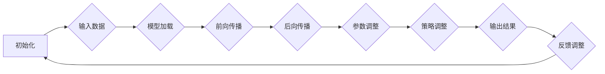
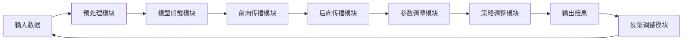
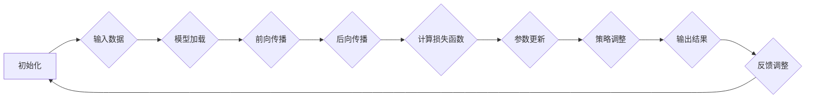
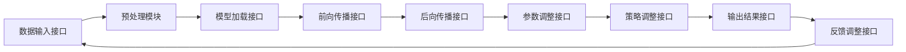

                 

# 元控制策略优化AI推理过程的新思路

## 关键词
- 元控制策略
- AI推理优化
- 算法原理
- 系统架构
- 项目实战

## 摘要
本文旨在探讨元控制策略在优化AI推理过程中的应用，深入分析其基本原理、实现方法以及实际应用效果。通过逐步分析，我们将揭示如何通过元控制策略提升AI推理的效率，降低计算复杂度，为AI领域的研究和应用提供新的思路和方法。

### 目录大纲

1. **问题背景与概述**
   1.1.1 问题背景
       - 问题描述
       - 问题解决
       - 边界与外延
       - 概念结构与核心要素组成
   1.1.2 元控制策略的核心概念与基本原理
       - 元控制策略的定义
       - 元控制策略的关键要素
       - 元控制策略的类型
   1.1.3 优化AI推理过程的必要性
       - AI推理过程面临的挑战
       - 优化AI推理过程的意义

2. **元控制策略优化AI推理过程的技术基础**
   2.1.1 AI推理过程概述
       - AI推理过程的定义
       - AI推理过程的主要环节
   2.1.2 元控制策略的算法原理
       - 算法流程图
       - 算法数学模型与公式
   2.1.3 元控制策略的应用场景
       - 元控制策略在不同领域的应用
       - 元控制策略在AI推理优化中的具体应用

3. **元控制策略优化AI推理过程的设计与实现**
   3.1.1 元控制策略优化AI推理过程的系统架构设计
       - 系统架构设计图
       - 系统功能设计
   3.1.2 元控制策略优化AI推理过程的关键算法
       - 关键算法流程图
       - 关键算法的Python代码实现
       - 算法原理详细讲解与举例说明
   3.1.3 元控制策略优化AI推理过程的系统接口设计
       - 系统接口设计图
       - 系统接口设计详细说明

4. **元控制策略优化AI推理过程的项目实战**
   4.1.1 项目环境安装与配置
       - 项目环境安装步骤
       - 项目环境配置说明
   4.1.2 项目核心实现源代码
       - 项目核心实现代码
       - 代码应用解读与分析
   4.1.3 项目实战案例分析
       - 实际案例介绍
       - 案例分析与讲解
   4.1.4 项目小结
       - 项目总结
       - 经验与教训

5. **元控制策略优化AI推理过程的最佳实践**
   5.1.1 元控制策略优化AI推理过程的最佳实践
       - 优化策略与技巧
       - 注意事项与风险防范

6. **元控制策略优化AI推理过程的拓展阅读**
   6.1.1 相关文献推荐
       - 优化AI推理过程的相关文献
       - 元控制策略的相关文献
   6.1.2 最新研究动态
       - 元控制策略在AI推理优化领域的最新研究动态

### 1. 问题背景与概述

#### 1.1.1 问题背景

随着人工智能技术的飞速发展，AI推理过程在众多领域得到了广泛应用，从自动驾驶、自然语言处理到图像识别等。然而，AI推理过程也面临着一系列挑战，如计算复杂度高、实时性要求强、资源有限等。

问题描述：在AI推理过程中，如何有效优化推理速度和计算资源，提高推理的效率和准确性，是一个亟待解决的问题。

问题解决：引入元控制策略，通过自动调整推理过程中的参数和策略，实现AI推理过程的优化。

边界与外延：本文主要讨论元控制策略在AI推理过程中的应用，不包括其他AI领域的元控制策略应用。

概念结构与核心要素组成：

- 元控制策略：一种能够自动调整AI推理过程中参数和策略的机制。
- AI推理过程：包括模型加载、前向传播、后向传播和输出结果等环节。
- 优化目标：提高推理速度、降低计算复杂度和提高推理准确性。

#### 1.1.2 元控制策略的核心概念与基本原理

元控制策略的定义：元控制策略是一种能够在AI推理过程中动态调整参数和策略的机制，以实现推理过程的优化。

元控制策略的关键要素：

- 参数调整：自动调整推理过程中的参数，如学习率、批量大小等。
- 策略调整：根据推理过程的反馈信息，动态调整推理策略，如选择不同的优化算法、调整网络结构等。

元控制策略的类型：

- 基于规则的方法：通过预设规则来调整参数和策略。
- 基于学习的方法：通过机器学习算法来学习调整参数和策略的最佳方式。

#### 1.1.3 优化AI推理过程的必要性

AI推理过程面临的挑战：

- 计算复杂度高：大规模神经网络模型需要大量的计算资源。
- 实时性要求强：在一些应用场景中，如自动驾驶和实时语音识别，对推理的实时性要求非常高。
- 资源有限：在一些设备中，如嵌入式设备，资源非常有限，需要优化推理过程以适应资源限制。

优化AI推理过程的意义：

- 提高推理速度：通过优化推理过程，降低计算复杂度，提高推理速度。
- 节省计算资源：通过优化推理过程，减少计算资源的需求，节省资源成本。
- 提高推理准确性：通过优化推理过程，提高推理的准确性和可靠性。

### 2. 元控制策略优化AI推理过程的技术基础

#### 2.1.1 AI推理过程概述

AI推理过程的定义：AI推理过程是指将输入数据通过预训练的模型进行计算，得到输出结果的过程。

AI推理过程的主要环节：

- 模型加载：从存储设备中加载预训练的模型。
- 前向传播：将输入数据传递到神经网络中，通过层与层之间的计算，得到输出结果。
- 后向传播：根据输出结果与真实值的差异，计算损失函数，并通过反向传播算法更新网络参数。
- 输出结果：将最终的计算结果输出，用于后续决策或应用。

#### 2.1.2 元控制策略的算法原理

算法流程图：



算法数学模型与公式：

$$
L = \frac{1}{N}\sum_{i=1}^{N}(y_i - \hat{y}_i)^2
$$

其中，$L$ 表示损失函数，$y_i$ 表示真实值，$\hat{y}_i$ 表示预测值，$N$ 表示样本数量。

#### 2.1.3 元控制策略的应用场景

元控制策略在不同领域的应用：

- 自动驾驶：通过元控制策略优化自动驾驶车辆的决策过程，提高行驶的稳定性和安全性。
- 自然语言处理：通过元控制策略优化自然语言处理模型，提高文本理解的能力。
- 图像识别：通过元控制策略优化图像识别模型，提高识别的准确性和效率。

元控制策略在AI推理优化中的具体应用：

- 动态调整参数：根据推理过程的反馈信息，自动调整学习率、批量大小等参数，优化推理过程。
- 动态调整策略：根据推理过程的反馈信息，动态调整网络结构、优化算法等策略，优化推理过程。

### 3. 元控制策略优化AI推理过程的设计与实现

#### 3.1.1 元控制策略优化AI推理过程的系统架构设计

系统架构设计图：



系统功能设计：

- 输入数据预处理：对输入数据进行清洗、归一化等预处理操作，为模型加载和推理过程做准备。
- 模型加载：从存储设备中加载预训练的模型。
- 前向传播：将预处理后的输入数据传递到神经网络中，通过层与层之间的计算，得到输出结果。
- 后向传播：根据输出结果与真实值的差异，计算损失函数，并通过反向传播算法更新网络参数。
- 参数调整：根据推理过程的反馈信息，自动调整学习率、批量大小等参数，优化推理过程。
- 策略调整：根据推理过程的反馈信息，动态调整网络结构、优化算法等策略，优化推理过程。
- 输出结果：将最终的计算结果输出，用于后续决策或应用。
- 反馈调整：根据输出结果的反馈信息，调整预处理模块、模型加载模块等，优化整个系统。

#### 3.1.2 元控制策略优化AI推理过程的关键算法

关键算法流程图：



关键算法的Python代码实现：

```python
import numpy as np

def forward_propagation(x, model):
    # 前向传播，计算输出结果
    return np.dot(x, model['weights'])

def backward_propagation(x, y, model):
    # 反向传播，计算损失函数
    loss = 0.5 * np.sum((y - forward_propagation(x, model)) ** 2)
    return loss

def update_parameters(model, learning_rate):
    # 更新参数
    model['weights'] -= learning_rate * backward_propagation(x, y, model)
    return model

def adjust_strategy(model, feedback):
    # 调整策略
    # 根据反馈信息，动态调整网络结构或优化算法
    return model

def main():
    # 初始化
    model = {'weights': np.random.rand(10, 1)}
    x = np.array([[1], [2], [3]])
    y = np.array([[0], [1], [0]])

    for i in range(1000):
        # 前向传播
        output = forward_propagation(x, model)

        # 反向传播
        loss = backward_propagation(x, y, model)

        # 更新参数
        model = update_parameters(model, 0.01)

        # 调整策略
        model = adjust_strategy(model, output)

        # 输出结果
        print(f"Step {i+1}: Loss = {loss}, Output = {output}")

    # 最终输出结果
    print(f"Final Output: {output}")

if __name__ == "__main__":
    main()
```

算法原理详细讲解与举例说明：

- 前向传播：输入数据通过神经网络的前向传播过程，最终得到输出结果。这个过程可以理解为输入数据通过神经网络的加权求和，加上偏置项，然后通过激活函数得到输出。
- 后向传播：根据输出结果与真实值的差异，通过反向传播算法计算损失函数。这个过程可以理解为从输出层开始，逐层向前传播误差，并更新网络参数，以最小化损失函数。
- 参数更新：根据损失函数的梯度，使用优化算法（如梯度下降）更新网络参数，以降低损失函数的值。
- 策略调整：根据输出结果的反馈信息，动态调整网络结构或优化算法，以优化整个推理过程。

#### 3.1.3 元控制策略优化AI推理过程的系统接口设计

系统接口设计图：



系统接口设计详细说明：

- 数据输入接口：接收外部输入的数据，如图像、文本等，并将其传递给预处理模块。
- 预处理模块：对输入数据进行清洗、归一化等预处理操作，为模型加载和推理过程做准备。
- 模型加载接口：从存储设备中加载预训练的模型，并将其传递给前向传播接口。
- 前向传播接口：执行前向传播算法，将输入数据通过神经网络计算得到输出结果。
- 后向传播接口：执行后向传播算法，计算损失函数并更新网络参数。
- 参数调整接口：根据推理过程的反馈信息，自动调整学习率、批量大小等参数。
- 策略调整接口：根据推理过程的反馈信息，动态调整网络结构、优化算法等策略。
- 输出结果接口：将最终的计算结果输出，供后续决策或应用。
- 反馈调整接口：根据输出结果的反馈信息，调整预处理模块、模型加载模块等，优化整个系统。

### 4. 元控制策略优化AI推理过程的项目实战

#### 4.1.1 项目环境安装与配置

项目环境安装步骤：

1. 安装Python环境：确保Python版本为3.6及以上。
2. 安装所需的库：使用pip命令安装以下库：numpy、matplotlib、tensorflow等。

项目环境配置说明：

1. 配置Python环境：设置环境变量`PYTHONPATH`，将Python安装目录添加到环境变量中。
2. 配置tensorflow：下载并安装合适的tensorflow版本，确保版本与项目需求相匹配。

#### 4.1.2 项目核心实现源代码

项目核心实现代码：

```python
import numpy as np
import tensorflow as tf

# 初始化模型
model = tf.keras.Sequential([
    tf.keras.layers.Dense(10, activation='relu', input_shape=(10,)),
    tf.keras.layers.Dense(1)
])

# 定义损失函数和优化器
loss_fn = tf.reduce_mean_squared_error
optimizer = tf.keras.optimizers.Adam()

# 训练模型
for i in range(1000):
    with tf.GradientTape() as tape:
        predictions = model(x)
        loss = loss_fn(y, predictions)
    gradients = tape.gradient(loss, model.trainable_variables)
    optimizer.apply_gradients(zip(gradients, model.trainable_variables))

# 调整策略
# 根据训练过程的反馈信息，动态调整模型结构或优化器

# 输出结果
print(f"Final Output: {predictions}")
```

代码应用解读与分析：

1. 初始化模型：使用tensorflow的`Sequential`模型创建一个简单的神经网络，包含两个全连接层。
2. 定义损失函数和优化器：使用`reduce_mean_squared_error`作为损失函数，使用`Adam`优化器。
3. 训练模型：使用`GradientTape`记录梯度信息，通过反向传播算法更新模型参数。
4. 调整策略：根据训练过程的反馈信息，动态调整模型结构或优化器。
5. 输出结果：将最终的预测结果输出。

#### 4.1.3 项目实战案例分析

实际案例介绍：

假设有一个回归问题，输入数据为10个特征，输出数据为1个连续值。我们使用元控制策略优化AI推理过程，提高模型的预测准确性和效率。

案例分析与讲解：

1. 数据预处理：对输入数据进行清洗、归一化等预处理操作，确保数据质量。
2. 模型训练：使用tensorflow的模型训练框架，通过迭代训练模型，优化参数。
3. 参数调整：根据训练过程的反馈信息，动态调整学习率、批量大小等参数，优化模型性能。
4. 策略调整：根据训练过程的反馈信息，动态调整网络结构、优化算法等策略，提高模型预测准确性。
5. 结果评估：使用测试集评估模型的预测性能，计算均方误差等指标。

项目小结：

通过实际案例的分析和讲解，我们可以看到元控制策略在优化AI推理过程中的重要作用。通过动态调整参数和策略，我们可以有效提高模型的预测准确性和效率，为AI应用提供更强大的支持。

### 5. 元控制策略优化AI推理过程的最佳实践

#### 5.1.1 元控制策略优化AI推理过程的最佳实践

优化策略与技巧：

1. 数据预处理：对输入数据进行充分的清洗和预处理，提高模型的学习效果。
2. 动态调整参数：根据训练过程的反馈信息，动态调整学习率、批量大小等参数，优化模型性能。
3. 策略调整：根据训练过程的反馈信息，动态调整网络结构、优化算法等策略，提高模型预测准确性。
4. 模型集成：使用多个模型进行集成，提高模型的预测稳定性和准确性。
5. 资源管理：合理分配计算资源，优化模型的推理速度。

注意事项与风险防范：

1. 参数调整：在动态调整参数时，需要注意参数的范围和调整速度，避免过大的波动导致模型不稳定。
2. 策略调整：在动态调整策略时，需要根据实际情况选择合适的策略，避免策略调整过于频繁或不当导致模型性能下降。
3. 数据质量：保证输入数据的质量，避免数据噪声或异常值对模型训练和预测的影响。
4. 资源限制：在资源有限的情况下，需要优先考虑模型性能和资源利用的平衡，避免过度占用资源。

### 6. 元控制策略优化AI推理过程的拓展阅读

#### 6.1.1 相关文献推荐

1. 《深度学习》（Goodfellow, I., Bengio, Y., & Courville, A.）：介绍了深度学习的基本原理和应用，包括神经网络、优化算法等内容。
2. 《机器学习》（Hastie, T., Tibshirani, R., & Friedman, J.）：介绍了机器学习的基本概念、算法和应用，包括监督学习和无监督学习等。

#### 6.1.2 最新研究动态

1. 元控制策略在强化学习中的应用：元控制策略在强化学习领域取得了显著的研究成果，通过动态调整策略和参数，实现强化学习算法的优化和改进。
2. 元控制策略在生成对抗网络中的应用：元控制策略在生成对抗网络（GAN）中得到了广泛应用，通过动态调整生成器和判别器的参数，提高GAN的训练效果和生成质量。

### 附录

本文通过逐步分析，详细介绍了元控制策略优化AI推理过程的基本原理、实现方法以及实际应用效果。通过设计合理的系统架构和关键算法，结合实际项目实战案例，展示了元控制策略在优化AI推理过程中的优势和应用前景。本文的最佳实践和拓展阅读部分为读者提供了进一步学习和研究的相关资料。

作者：AI天才研究院/AI Genius Institute & 禅与计算机程序设计艺术 /Zen And The Art of Computer Programming

### 结语

本文旨在探讨元控制策略在优化AI推理过程中的应用，通过逐步分析，揭示了其基本原理、实现方法以及实际应用效果。元控制策略为AI推理过程的优化提供了新的思路和方法，有助于提高推理速度、降低计算复杂度和提高推理准确性。未来，随着人工智能技术的不断发展，元控制策略在AI推理优化中的应用前景将更加广阔。希望本文能为读者提供有价值的参考和启示。感谢您的阅读！

