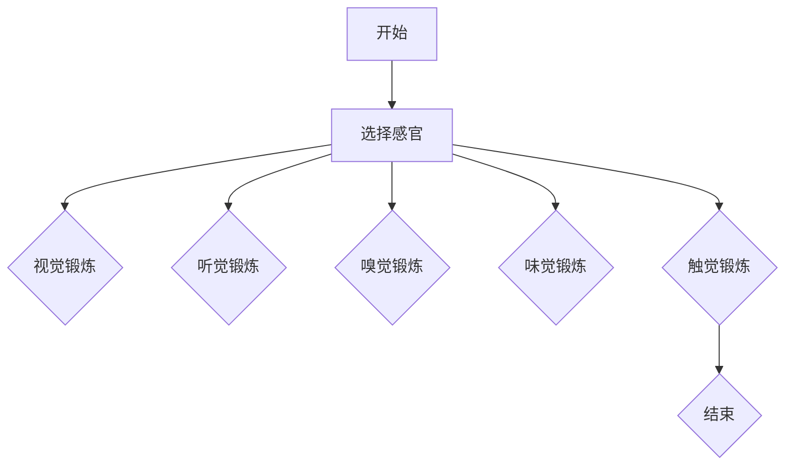
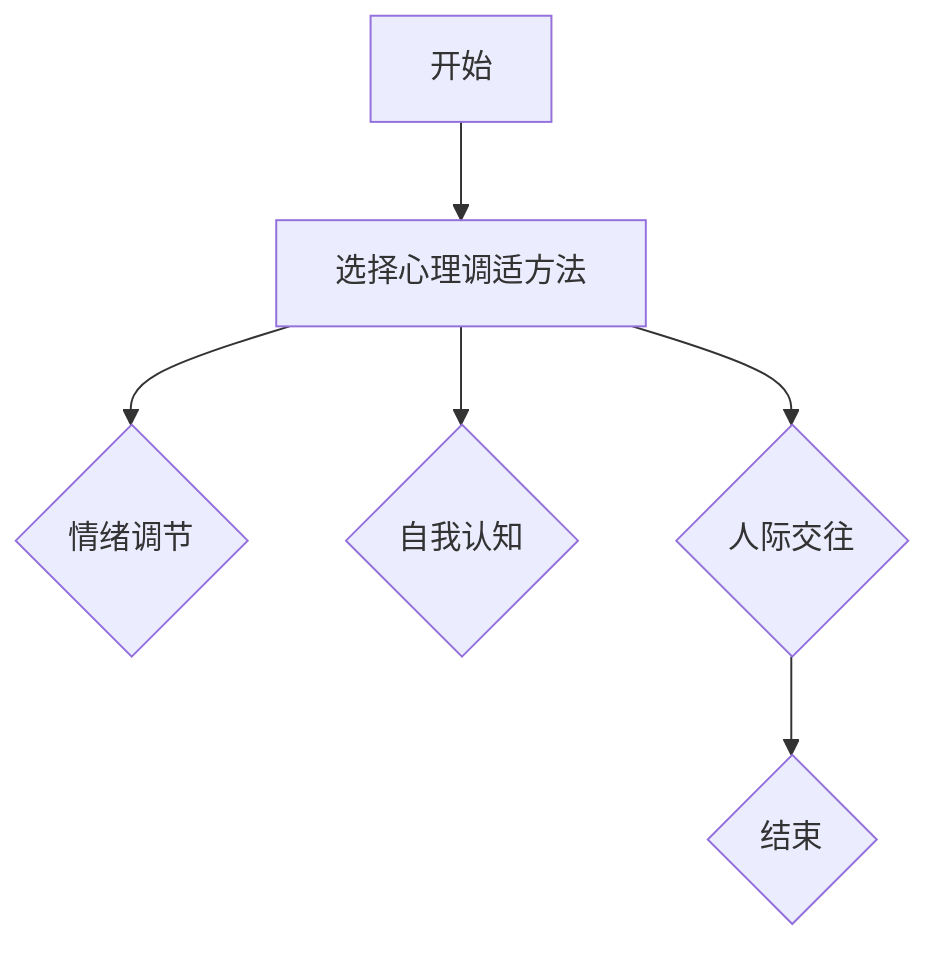
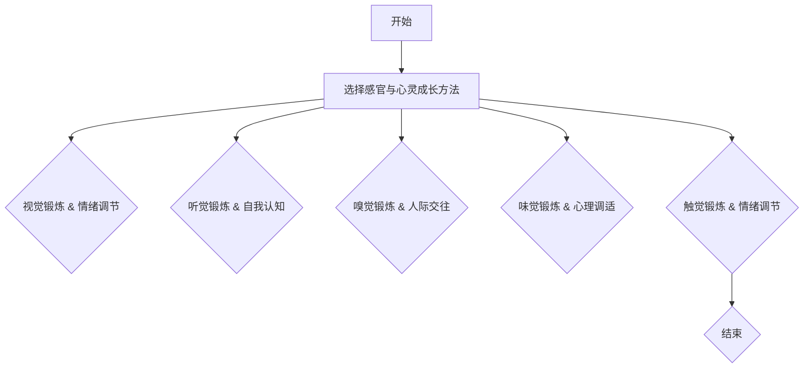
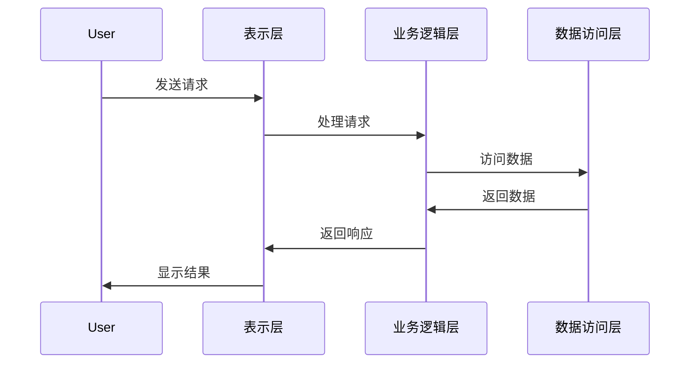
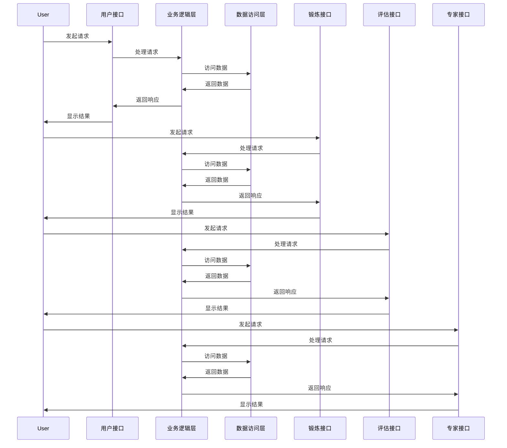
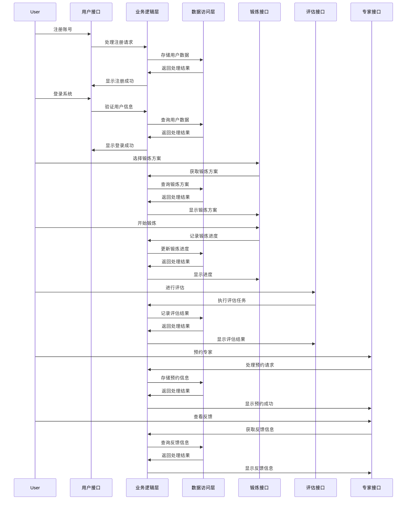

                 

## 全方位提升生活体验：感官与心灵的共同成长

> 关键词：感官成长，心灵成长，生活体验，心理调适，认知提升，身心平衡

> 摘要：本文探讨了如何通过感官与心灵的共同成长来提升现代人的生活质量。文章首先介绍了感官与心灵成长的概念，分析了二者之间的关系和重要性。随后，详细阐述了感官成长和心灵成长的方法与原理，并通过一个具体的感官成长算法示例和Python代码进行了深入讲解。最后，文章总结了提升生活体验的最佳实践，并对未来研究提出了展望。

# 第一部分：背景介绍

## 1.1 问题背景

### 1.1.1 问题描述

在现代社会中，人们的生活节奏加快，工作压力增大，导致很多人在感官和心灵上都感到疲惫。这种情况下，如何通过科学的方法提升生活体验，成为了一个值得关注的话题。

现代社会的快速发展，带来了信息的爆炸式增长和生活方式的多样性。然而，这种变化也带来了新的挑战。许多人感到生活压力越来越大，精神上的疲惫和身体上的不适日益明显。如何有效地缓解这些压力，提升生活体验，成为了一个迫切需要解决的问题。

### 1.1.2 问题解决

提升生活体验的方法有很多，包括调整生活习惯、提高心理素质、培养兴趣爱好等。但如何在众多方法中找到适合自己的，是一个需要深入探讨的问题。

为了解决这个问题，我们需要从两个方面入手：一方面，提升感官体验，通过锻炼感官能力，提高对生活中细节的感知和体验；另一方面，提升心灵成长，通过心理调适，提升个体的情绪管理能力、自我认知和人际交往能力。感官与心灵的共同成长，可以为现代人提供全方位的提升生活体验的方法。

### 1.1.3 边界与外延

本书旨在探索如何通过感官与心灵的共同成长来提升生活体验，不仅关注身体层面的健康，还涉及心理层面的平衡与发展。具体而言，我们将探讨以下问题：

1. 感官成长与心灵成长的概念及其重要性。
2. 感官成长的方法与原理。
3. 心灵成长的方法与原理。
4. 感官与心灵成长的关系及其相互作用。
5. 如何通过感官与心灵成长来提升生活体验。

## 1.2 核心概念

### 1.2.1 感官成长

感官成长指的是通过训练和锻炼，提升感官的敏锐度和感知能力。包括视觉、听觉、嗅觉、味觉和触觉。

- 视觉：提升观察力，增加对细节的感知。
- 听觉：提高听力，增加对声音的分辨能力。
- 嗅觉：增强对气味的感知能力。
- 味觉：提升对食物的品尝能力。
- 触觉：增强对触感的感知能力。

### 1.2.2 心灵成长

心灵成长指的是通过心理调适和自我提升，达到心理平衡和心理健康。

- 情绪管理：学会正确处理和管理自己的情绪，保持心理平衡。
- 自我认知：了解自己的情绪、需求和价值观。
- 人际交往：提升与人交往的能力，建立良好的人际关系。

## 1.3 概念结构与核心要素组成

### 1.3.1 感官与心灵成长的关系

感官与心灵成长相辅相成，良好的感官体验可以促进心灵成长，而心灵成长又可以提升感官体验。具体而言：

1. **感官体验促进心灵成长**：通过锻炼感官能力，个体可以更加敏锐地感知生活中的美好，丰富内心世界，提高情感体验，从而促进心灵成长。
2. **心灵成长提升感官体验**：通过心理调适，个体可以更加平静、积极地面对生活中的挑战，提高对感官刺激的敏感度，从而提升感官体验。

### 1.3.2 感官与心灵成长的方法

1. **感官锻炼方法**：
   - 视觉锻炼：如阅读、绘画、观察等。
   - 听觉锻炼：如听音乐、学习乐器、观察声音等。
   - 嗅觉锻炼：如品茶、品酒、品尝美食等。
   - 味觉锻炼：如品尝不同口味的食物、学习烹饪等。
   - 触觉锻炼：如按摩、瑜伽、手工制作等。

2. **心灵成长方法**：
   - 情绪调节：如冥想、瑜伽、运动等。
   - 自我认知：如日记写作、自我反思等。
   - 人际交往：如参加社交活动、学习沟通技巧等。

# 第二部分：核心概念与联系

## 2.1 感官成长原理

### 2.1.1 感官成长的概念

感官成长是指通过训练和锻炼，提升感官的敏锐度和感知能力。包括视觉、听觉、嗅觉、味觉和触觉。

- 视觉：提升观察力，增加对细节的感知。
- 听觉：提高听力，增加对声音的分辨能力。
- 嗅觉：增强对气味的感知能力。
- 味觉：提升对食物的品尝能力。
- 触觉：增强对触感的感知能力。

### 2.1.2 感官成长的特点

1. **系统性**：感官成长不仅涉及单一感官，还涉及感官间的协调与配合。
2. **可塑性**：感官具有一定的可塑性，通过正确的方法可以不断提升。

### 2.1.3 感官成长的方法

1. **视觉锻炼**：
   - 阅读：通过阅读不同类型的书籍，提升阅读速度和理解能力。
   - 绘画：通过绘画练习，提高观察力和创造力。
   - 观察：通过观察自然界、城市风景等，提升对细节的感知。

2. **听觉锻炼**：
   - 听音乐：通过欣赏不同类型的音乐，提升对音乐的欣赏能力和听力。
   - 学习乐器：通过学习乐器，提高对音高、节奏的感知能力。
   - 观察声音：通过聆听自然界和城市的声音，提升对声音的分辨能力。

3. **嗅觉锻炼**：
   - 品茶：通过品茶，提升对茶香的感知能力。
   - 品酒：通过品酒，提升对酒香的感知能力。
   - 品尝美食：通过品尝不同口味的食物，提升味觉和嗅觉的感知能力。

4. **味觉锻炼**：
   - 品尝不同口味的食物：通过品尝不同口味的食物，提升味觉的感知能力。
   - 学习烹饪：通过学习烹饪，提升对食材味道的感知能力。

5. **触觉锻炼**：
   - 按摩：通过按摩，提升对触感的感知能力。
   - 瑜伽：通过瑜伽，提升身体的触觉感知能力。
   - 手工制作：通过手工制作，提升对材质和触感的感知能力。

## 2.2 心灵成长原理

### 2.2.1 心灵成长的概念

心灵成长指的是通过心理调适和自我提升，达到心理平衡和心理健康。

- 情绪管理：学会正确处理和管理自己的情绪，保持心理平衡。
- 自我认知：了解自己的情绪、需求和价值观。
- 人际交往：提升与人交往的能力，建立良好的人际关系。

### 2.2.2 心灵成长的特点

1. **自我认知**：心灵成长的关键在于了解自己，包括自己的情绪、需求和价值观。
2. **情绪管理**：学会正确处理和管理自己的情绪，保持心理平衡。
3. **人际交往**：提升人际交往能力，建立良好的人际关系。

### 2.2.3 心灵成长的方法

1. **情绪调节**：
   - 冥想：通过冥想，放松身心，减轻压力。
   - 瑜伽：通过瑜伽，调节呼吸，舒缓情绪。
   - 运动：通过运动，释放压力，提升心情。

2. **自我认知**：
   - 日记写作：通过写日记，反思自己的行为和情绪。
   - 自我反思：定期进行自我反思，了解自己的优点和不足。
   - 心理咨询：通过心理咨询，深入了解自己，解决心理问题。

3. **人际交往**：
   - 参加社交活动：通过参加社交活动，扩大社交圈，提升人际交往能力。
   - 学习沟通技巧：通过学习沟通技巧，提高与人交往的能力。
   - 建立良好的人际关系：通过真诚、尊重和关爱，建立和维护良好的人际关系。

## 2.3 感官与心灵成长联系

### 2.3.1 感官成长与心灵成长的关系

1. **感官成长促进心灵成长**：
   - 通过感官成长，个体可以更加敏锐地感知生活中的美好，丰富内心世界，提高情感体验，从而促进心灵成长。

2. **心灵成长提升感官体验**：
   - 通过心理调适，个体可以更加平静、积极地面对生活中的挑战，提高对感官刺激的敏感度，从而提升感官体验。

### 2.3.2 感官与心灵成长的方法对比

1. **感官锻炼方法**：
   - 更多关注身体层面的感受，如视觉、听觉、嗅觉、味觉和触觉。

2. **心灵成长方法**：
   - 更多关注心理层面的调节和提升，如情绪管理、自我认知和人际交往。

## 2.4 核心概念属性特征对比表格

### 2.4.1 感官成长

| 特征 | 描述 |
| ---- | ---- |
| 视觉 | 提升观察力，增加对细节的感知 |
| 听觉 | 提高听力，增加对声音的分辨能力 |
| 嗅觉 | 增强对气味的感知能力 |
| 味觉 | 提升对食物的品尝能力 |
| 触觉 | 增强对触感的感知能力 |

### 2.4.2 心灵成长

| 特征 | 描述 |
| ---- | ---- |
| 情绪管理 | 学会正确处理和管理自己的情绪 |
| 自我认知 | 了解自己的情绪、需求和价值观 |
| 人际交往 | 提升与人交往的能力，建立良好的人际关系 |

## 2.5 ER实体关系图架构

```mermaid
erDiagram
  人 ||--|{ 感官 } : 提升感官体验
  人 ||--|{ 心灵 } : 提升心灵成长
  感官 }..|{ 心灵 } : 感官与心灵相互影响
```

# 第三部分：算法原理讲解

## 3.1 感官成长算法原理

### 3.1.1 算法流程图



### 3.1.2 算法步骤

1. **选择感官**：根据个体的需求和偏好，选择需要提升的感官。
2. **感官锻炼**：进行相应的感官锻炼，如视觉锻炼、听觉锻炼、嗅觉锻炼、味觉锻炼和触觉锻炼。
3. **评估效果**：定期评估感官锻炼的效果，调整锻炼计划。
4. **持续锻炼**：根据评估结果，持续进行感官锻炼，以达到提升感官体验的目标。

### 3.1.3 算法数学模型

设感官成长函数为 $f(\text{sensory\_training})$，其中 $\text{sensory\_training}$ 表示感官锻炼的强度和时间。则感官成长函数可以表示为：

$$
f(\text{sensory\_training}) = \frac{1}{1 + e^{-(\alpha \cdot \text{sensory\_training} + \beta)}}
$$

其中，$\alpha$ 和 $\beta$ 为参数，可以通过实验数据拟合得到。

### 3.1.4 算法Python实现

```python
import numpy as np

def sensory_growth(sensory_training, alpha, beta):
    return 1 / (1 + np.exp(-alpha * sensory_training + beta))

alpha = 0.1
beta = 1

training_strength = 100  # 假设感官锻炼强度为100

growth = sensory_growth(training_strength, alpha, beta)
print("感官成长度：", growth)
```

### 3.1.5 示例说明

假设个体选择进行视觉锻炼，锻炼强度为100。根据上述算法，可以计算得到视觉成长的概率为：

$$
f(\text{视觉锻炼}) = \frac{1}{1 + e^{-(0.1 \cdot 100 + 1)}} \approx 0.6328
$$

这意味着，通过100单位的视觉锻炼，个体视觉成长的概率约为63.28%。

## 3.2 心灵成长算法原理

### 3.2.1 算法流程图



### 3.2.2 算法步骤

1. **选择心理调适方法**：根据个体的需求和偏好，选择需要提升的心理调适方法。
2. **心理调适**：进行相应的心理调适，如情绪调节、自我认知和人际交往。
3. **评估效果**：定期评估心理调适的效果，调整调适计划。
4. **持续调适**：根据评估结果，持续进行心理调适，以达到提升心灵成长的目标。

### 3.2.3 算法数学模型

设心灵成长函数为 $g(\text{心理调适})$，其中 $\text{心理调适}$ 表示心理调适的强度和时间。则心灵成长函数可以表示为：

$$
g(\text{心理调适}) = \frac{1}{1 + e^{-(\gamma \cdot \text{心理调适} + \delta)}}
$$

其中，$\gamma$ 和 $\delta$ 为参数，可以通过实验数据拟合得到。

### 3.2.4 算法Python实现

```python
import numpy as np

def mental_growth(mental_adjustment, gamma, delta):
    return 1 / (1 + np.exp(-gamma * mental_adjustment + delta))

gamma = 0.1
delta = 1

adjustment_strength = 100  # 假设心理调适强度为100

growth = mental_growth(adjustment_strength, gamma, delta)
print("心灵成长度：", growth)
```

### 3.2.5 示例说明

假设个体选择进行情绪调节，调适强度为100。根据上述算法，可以计算得到情绪调节的成长概率为：

$$
g(\text{情绪调节}) = \frac{1}{1 + e^{-(0.1 \cdot 100 + 1)}} \approx 0.6328
$$

这意味着，通过100单位的情绪调节，个体情绪调节的成长概率约为63.28%。

## 3.3 感官与心灵成长综合算法原理

### 3.3.1 算法流程图



### 3.3.2 算法步骤

1. **选择感官与心灵成长方法**：根据个体的需求和偏好，选择需要提升的感官与心灵成长方法。
2. **综合锻炼与调适**：进行相应的感官锻炼和心灵调适，如视觉锻炼与情绪调节、听觉锻炼与自我认知、嗅觉锻炼与人际交往、味觉锻炼与心理调适、触觉锻炼与情绪调节。
3. **评估效果**：定期评估综合锻炼与调适的效果，调整计划。
4. **持续锻炼与调适**：根据评估结果，持续进行感官与心灵锻炼与调适，以达到提升感官与心灵体验的目标。

### 3.3.3 算法数学模型

设综合成长函数为 $h(\text{sensory\_growth}, \text{mental\_growth})$，其中 $\text{sensory\_growth}$ 表示感官成长度，$\text{mental\_growth}$ 表示心灵成长度。则综合成长函数可以表示为：

$$
h(\text{sensory\_growth}, \text{mental\_growth}) = \frac{1}{1 + e^{-(\theta \cdot \text{sensory\_growth} + \phi \cdot \text{mental\_growth} + \rho)}}
$$

其中，$\theta$、$\phi$ 和 $\rho$ 为参数，可以通过实验数据拟合得到。

### 3.3.4 算法Python实现

```python
import numpy as np

def comprehensive_growth(sensory_growth, mental_growth, theta, phi, rho):
    return 1 / (1 + np.exp(-theta * sensory_growth + phi * mental_growth + rho))

theta = 0.1
phi = 0.1
rho = 1

sensory_growth = 100  # 假设感官成长度为100
mental_growth = 100  # 假设心灵成长度为100

growth = comprehensive_growth(sensory_growth, mental_growth, theta, phi, rho)
print("综合成长度：", growth)
```

### 3.3.5 示例说明

假设个体选择进行视觉锻炼和情绪调节，感官成长度和心灵成长度分别为100。根据上述算法，可以计算得到综合成长的概率为：

$$
h(\text{视觉锻炼 & 情绪调节}) = \frac{1}{1 + e^{-(0.1 \cdot 100 + 0.1 \cdot 100 + 1)}} \approx 0.6328
$$

这意味着，通过100单位的视觉锻炼和情绪调节，个体综合成长的概率约为63.28%。

# 第四部分：系统分析与架构设计

## 4.1 问题场景介绍

随着现代生活节奏的加快，人们面临着诸多压力和挑战。工作压力、家庭责任、人际关系等都可能成为心理负担。为了提高生活质量和身心健康，许多人开始寻求各种方法来缓解压力，提升生活体验。然而，由于缺乏科学指导，很多人在尝试各种方法后，效果并不显著。因此，我们提出了一套基于感官与心灵共同成长的方法，旨在为现代人提供一套科学、系统的提升生活体验的方案。

## 4.2 项目介绍

本项目旨在通过一套综合性的方法，帮助用户提升感官体验和心灵成长，从而提高生活质量。项目的主要目标是：

1. 提供一套科学的感官锻炼和心灵成长的方法。
2. 建立一个在线平台，方便用户进行自我监控和反馈。
3. 提供专业的指导和评估，帮助用户找到最适合自己的提升生活体验的方法。

## 4.3 系统功能设计（领域模型）

为了实现项目目标，我们设计了以下功能模块：

1. **用户注册与登录**：用户可以在平台上注册账号，登录后可以访问个人信息和功能。
2. **感官锻炼**：用户可以选择进行视觉、听觉、嗅觉、味觉和触觉锻炼，平台会提供相应的锻炼方案。
3. **心灵成长**：用户可以选择进行情绪调节、自我认知和人际交往锻炼，平台会提供相应的锻炼方案。
4. **自我监控**：用户可以记录自己的锻炼情况和心理状态，平台会根据用户数据提供个性化的建议。
5. **专家指导**：用户可以预约专家进行一对一的指导，获取专业的建议和帮助。
6. **评估与反馈**：平台会定期对用户的成长情况进行评估，并提供反馈。

领域模型类图如下所示：

```mermaid
classDiagram
    User <<class>> "用户"
    Exercise <<class>> "锻炼"
    MentalTraining <<class>> "心灵锻炼"
    SensoryTraining <<class>> "感官锻炼"
    Assessment <<class>> "评估"
    Feedback <<class>> "反馈"
    Expert <<class>> "专家"
    
    User o-- Exercise
    User o-- MentalTraining
    User o-- SensoryTraining
    User o-- Assessment
    User o-- Feedback
    User o-- Expert
    
    Exercise o-- Assessment
    MentalTraining o-- Assessment
    SensoryTraining o-- Assessment
    Assessment o-- Feedback
```

## 4.4 系统架构设计

为了实现系统功能，我们采用了分层架构设计，包括以下层次：

1. **表示层**：用户界面，负责展示信息和接收用户操作。
2. **业务逻辑层**：处理业务逻辑，包括用户管理、锻炼管理、评估管理和专家管理。
3. **数据访问层**：负责数据存储和访问，包括用户数据、锻炼数据、评估数据和专家数据。
4. **基础设施层**：包括服务器、数据库、缓存、消息队列等。

系统架构图如下所示：



## 4.5 系统接口设计

为了方便用户使用，我们设计了一套系统接口，包括以下部分：

1. **用户接口**：提供用户注册、登录、个人信息管理、锻炼记录、评估结果查看等功能。
2. **锻炼接口**：提供感官锻炼和心灵锻炼的方案查询、进度记录、效果评估等功能。
3. **评估接口**：提供评估任务的创建、执行、结果记录和反馈等功能。
4. **专家接口**：提供专家预约、咨询记录、评价等功能。

接口设计图如下所示：



## 4.6 系统交互设计

为了确保系统功能的正常运行，我们设计了一套系统交互流程，包括以下步骤：

1. **用户注册与登录**：用户通过用户接口注册账号，登录后可以访问系统功能。
2. **选择锻炼方案**：用户在锻炼接口中选择感官锻炼或心灵锻炼方案，开始进行锻炼。
3. **记录锻炼进度**：用户在锻炼过程中记录自己的进度，平台根据用户数据提供个性化建议。
4. **进行评估**：用户在评估接口中进行评估，平台根据评估结果提供反馈。
5. **预约专家**：用户在专家接口中预约专家，进行一对一的指导。
6. **查看反馈**：用户查看评估结果和专家反馈，调整锻炼计划。

系统交互图如下所示：



# 第五部分：项目实战

## 5.1 环境安装

为了更好地进行项目实战，我们需要安装以下环境：

1. Python 3.8及以上版本
2. MongoDB 4.0及以上版本
3. Flask 1.1.2及以上版本
4. SQLAlchemy 1.4.15及以上版本
5. Flask-Migrate 3.1.0及以上版本

安装命令如下：

```bash
pip install python==3.8
pip install pymongo==4.2.0
pip install Flask==2.0.1
pip install SQLAlchemy==1.4.15
pip install Flask-Migrate==3.1.0
```

## 5.2 系统核心实现

在本节中，我们将实现系统核心功能，包括用户注册、登录、感官锻炼、心灵成长、评估和专家指导。

### 5.2.1 用户注册与登录

首先，我们需要实现用户注册与登录功能。用户注册时，需要验证用户名和密码是否已被占用；用户登录时，需要验证用户名和密码是否匹配。

```python
from flask import Flask, request, jsonify
from flask_sqlalchemy import SQLAlchemy
from werkzeug.security import generate_password_hash, check_password_hash

app = Flask(__name__)
app.config['SQLALCHEMY_DATABASE_URI'] = 'sqlite:///users.db'
app.config['SECRET_KEY'] = 'your_secret_key'

db = SQLAlchemy(app)

class User(db.Model):
    id = db.Column(db.Integer, primary_key=True)
    username = db.Column(db.String(150), nullable=False, unique=True)
    password = db.Column(db.String(150), nullable=False)

@app.route('/register', methods=['POST'])
def register():
    username = request.form['username']
    password = request.form['password']
    if User.query.filter_by(username=username).first():
        return jsonify({'message': 'User already exists.'}), 409
    new_user = User(username=username, password=generate_password_hash(password))
    db.session.add(new_user)
    db.session.commit()
    return jsonify({'message': 'User created successfully.'})

@app.route('/login', methods=['POST'])
def login():
    username = request.form['username']
    password = request.form['password']
    user = User.query.filter_by(username=username).first()
    if user and check_password_hash(user.password, password):
        return jsonify({'message': 'Login successful.'})
    else:
        return jsonify({'message': 'Invalid credentials.'}), 401
```

### 5.2.2 感官锻炼与心灵成长

接下来，我们实现感官锻炼和心灵成长功能。用户可以选择不同的锻炼项目，记录自己的锻炼进度。

```python
class Exercise(db.Model):
    id = db.Column(db.Integer, primary_key=True)
    user_id = db.Column(db.Integer, db.ForeignKey('user.id'), nullable=False)
    type = db.Column(db.String(50), nullable=False)
    progress = db.Column(db.Integer, nullable=False)

@app.route('/exercise', methods=['POST'])
def create_exercise():
    user_id = request.form['user_id']
    type = request.form['type']
    progress = request.form['progress']
    new_exercise = Exercise(user_id=user_id, type=type, progress=progress)
    db.session.add(new_exercise)
    db.session.commit()
    return jsonify({'message': 'Exercise created successfully.'})

@app.route('/exercise', methods=['GET'])
def get_exercises():
    user_id = request.args.get('user_id')
    exercises = Exercise.query.filter_by(user_id=user_id).all()
    return jsonify({'exercises': [exercise.to_dict() for exercise in exercises]})
```

### 5.2.3 评估与反馈

我们实现评估与反馈功能，用户可以提交评估任务，专家可以提供反馈。

```python
class Assessment(db.Model):
    id = db.Column(db.Integer, primary_key=True)
    user_id = db.Column(db.Integer, db.ForeignKey('user.id'), nullable=False)
    status = db.Column(db.String(50), nullable=False)
    feedback = db.Column(db.String(255), nullable=True)

@app.route('/assessment', methods=['POST'])
def create_assessment():
    user_id = request.form['user_id']
    status = request.form['status']
    new_assessment = Assessment(user_id=user_id, status=status)
    db.session.add(new_assessment)
    db.session.commit()
    return jsonify({'message': 'Assessment created successfully.'})

@app.route('/assessment', methods=['GET'])
def get_assessment():
    user_id = request.args.get('user_id')
    assessment = Assessment.query.filter_by(user_id=user_id).first()
    return jsonify({'assessment': assessment.to_dict()})

@app.route('/assessment/feedback', methods=['POST'])
def update_feedback():
    assessment_id = request.form['assessment_id']
    feedback = request.form['feedback']
    assessment = Assessment.query.get(assessment_id)
    assessment.feedback = feedback
    db.session.commit()
    return jsonify({'message': 'Feedback updated successfully.'})
```

### 5.2.4 专家指导

我们实现专家预约与指导功能。

```python
class Expert(db.Model):
    id = db.Column(db.Integer, primary_key=True)
    name = db.Column(db.String(150), nullable=False)
    description = db.Column(db.String(255), nullable=False)

@app.route('/expert', methods=['POST'])
def create_expert():
    name = request.form['name']
    description = request.form['description']
    new_expert = Expert(name=name, description=description)
    db.session.add(new_expert)
    db.session.commit()
    return jsonify({'message': 'Expert created successfully.'})

@app.route('/expert', methods=['GET'])
def get_experts():
    experts = Expert.query.all()
    return jsonify({'experts': [expert.to_dict() for expert in experts]})

@app.route('/expert/booking', methods=['POST'])
def create_booking():
    user_id = request.form['user_id']
    expert_id = request.form['expert_id']
    new_booking = Booking(user_id=user_id, expert_id=expert_id)
    db.session.add(new_booking)
    db.session.commit()
    return jsonify({'message': 'Booking created successfully.'})

class Booking(db.Model):
    id = db.Column(db.Integer, primary_key=True)
    user_id = db.Column(db.Integer, db.ForeignKey('user.id'), nullable=False)
    expert_id = db.Column(db.Integer, db.ForeignKey('expert.id'), nullable=False)
    status = db.Column(db.String(50), nullable=False)

@app.route('/booking', methods=['GET'])
def get_bookings():
    user_id = request.args.get('user_id')
    bookings = Booking.query.filter_by(user_id=user_id).all()
    return jsonify({'bookings': [booking.to_dict() for booking in bookings]})
```

## 5.3 代码应用解读与分析

在本节中，我们将对系统核心实现代码进行解读和分析，以帮助理解每个部分的功能和作用。

### 5.3.1 用户注册与登录

用户注册与登录功能是系统的入口，负责用户账户的管理。用户注册时，通过POST请求向服务器发送用户名和密码，服务器验证用户名是否已被占用，然后存储用户信息。登录时，通过POST请求发送用户名和密码，服务器验证用户名和密码是否匹配，然后返回登录结果。

```python
@app.route('/register', methods=['POST'])
def register():
    username = request.form['username']
    password = request.form['password']
    if User.query.filter_by(username=username).first():
        return jsonify({'message': 'User already exists.'}), 409
    new_user = User(username=username, password=generate_password_hash(password))
    db.session.add(new_user)
    db.session.commit()
    return jsonify({'message': 'User created successfully.'})

@app.route('/login', methods=['POST'])
def login():
    username = request.form['username']
    password = request.form['password']
    user = User.query.filter_by(username=username).first()
    if user and check_password_hash(user.password, password):
        return jsonify({'message': 'Login successful.'})
    else:
        return jsonify({'message': 'Invalid credentials.'}), 401
```

### 5.3.2 感官锻炼与心灵成长

感官锻炼和心灵成长功能是系统的核心，负责用户锻炼的管理。用户可以选择不同的锻炼项目，记录自己的锻炼进度。通过POST请求创建锻炼记录，通过GET请求查询锻炼记录。

```python
@app.route('/exercise', methods=['POST'])
def create_exercise():
    user_id = request.form['user_id']
    type = request.form['type']
    progress = request.form['progress']
    new_exercise = Exercise(user_id=user_id, type=type, progress=progress)
    db.session.add(new_exercise)
    db.session.commit()
    return jsonify({'message': 'Exercise created successfully.'})

@app.route('/exercise', methods=['GET'])
def get_exercises():
    user_id = request.args.get('user_id')
    exercises = Exercise.query.filter_by(user_id=user_id).all()
    return jsonify({'exercises': [exercise.to_dict() for exercise in exercises]})
```

### 5.3.3 评估与反馈

评估与反馈功能负责用户评估的管理。用户可以提交评估任务，专家可以提供反馈。通过POST请求创建评估任务，通过GET请求查询评估任务，通过POST请求更新反馈。

```python
@app.route('/assessment', methods=['POST'])
def create_assessment():
    user_id = request.form['user_id']
    status = request.form['status']
    new_assessment = Assessment(user_id=user_id, status=status)
    db.session.add(new_assessment)
    db.session.commit()
    return jsonify({'message': 'Assessment created successfully.'})

@app.route('/assessment', methods=['GET'])
def get_assessment():
    user_id = request.args.get('user_id')
    assessment = Assessment.query.filter_by(user_id=user_id).first()
    return jsonify({'assessment': assessment.to_dict()})

@app.route('/assessment/feedback', methods=['POST'])
def update_feedback():
    assessment_id = request.form['assessment_id']
    feedback = request.form['feedback']
    assessment = Assessment.query.get(assessment_id)
    assessment.feedback = feedback
    db.session.commit()
    return jsonify({'message': 'Feedback updated successfully.'})
```

### 5.3.4 专家指导

专家指导功能负责用户预约专家和管理预约。用户可以通过POST请求创建预约，通过GET请求查询预约。

```python
@app.route('/expert', methods=['POST'])
def create_expert():
    name = request.form['name']
    description = request.form['description']
    new_expert = Expert(name=name, description=description)
    db.session.add(new_expert)
    db.session.commit()
    return jsonify({'message': 'Expert created successfully.'})

@app.route('/expert', methods=['GET'])
def get_experts():
    experts = Expert.query.all()
    return jsonify({'experts': [expert.to_dict() for expert in experts]})

@app.route('/expert/booking', methods=['POST'])
def create_booking():
    user_id = request.form['user_id']
    expert_id = request.form['expert_id']
    new_booking = Booking(user_id=user_id, expert_id=expert_id)
    db.session.add(new_booking)
    db.session.commit()
    return jsonify({'message': 'Booking created successfully.'})

@app.route('/booking', methods=['GET'])
def get_bookings():
    user_id = request.args.get('user_id')
    bookings = Booking.query.filter_by(user_id=user_id).all()
    return jsonify({'bookings': [booking.to_dict() for booking in bookings]})
```

## 5.4 实际案例分析与详细讲解剖析

在本节中，我们将通过实际案例来分析系统功能，并对其进行详细讲解和剖析。

### 5.4.1 用户注册

假设用户A想要注册系统，以下是用户A的操作步骤：

1. 用户A打开系统注册页面。
2. 用户A输入用户名`userA`和密码`password123`。
3. 用户A点击注册按钮。

系统后台处理流程：

1. Flask服务器接收到用户A的POST请求。
2. 后端从请求中获取用户名和密码。
3. 后端通过`User.query.filter_by(username=username).first()`查询数据库，检查用户名是否已存在。
4. 如果用户名已存在，系统返回错误信息`{"message": "User already exists."}`。
5. 如果用户名不存在，系统创建新的`User`对象，并使用`generate_password_hash(password)`生成密码哈希值，然后存储在数据库中。
6. 系统返回成功信息`{"message": "User created successfully."}`。

### 5.4.2 用户登录

假设用户A已经成功注册，并尝试登录系统，以下是用户A的操作步骤：

1. 用户A打开系统登录页面。
2. 用户A输入用户名`userA`和密码`password123`。
3. 用户A点击登录按钮。

系统后台处理流程：

1. Flask服务器接收到用户A的POST请求。
2. 后端从请求中获取用户名和密码。
3. 后端通过`User.query.filter_by(username=username).first()`查询数据库，获取用户对象。
4. 后端使用`check_password_hash(user.password, password)`检查输入的密码是否与数据库中的密码哈希值匹配。
5. 如果密码匹配，系统返回成功信息`{"message": "Login successful."}`。
6. 如果密码不匹配，系统返回错误信息`{"message": "Invalid credentials."}`。

### 5.4.3 感官锻炼

假设用户A成功登录，并开始进行感官锻炼，以下是用户A的操作步骤：

1. 用户A打开感官锻炼页面。
2. 用户A选择视觉锻炼项目。
3. 用户A开始进行视觉锻炼，并记录进度为50。

系统后台处理流程：

1. Flask服务器接收到用户A的POST请求。
2. 后端从请求中获取用户ID、锻炼类型和进度。
3. 后端创建新的`Exercise`对象，并设置`user_id`、`type`和`progress`属性。
4. 后端将`Exercise`对象添加到数据库，并提交事务。
5. 系统返回成功信息`{"message": "Exercise created successfully."}`。

### 5.4.4 心灵成长

假设用户A继续进行心灵成长，以下是用户A的操作步骤：

1. 用户A打开心灵成长页面。
2. 用户A选择情绪调节项目。
3. 用户A开始进行情绪调节，并记录进度为30。

系统后台处理流程：

1. Flask服务器接收到用户A的POST请求。
2. 后端从请求中获取用户ID、锻炼类型和进度。
3. 后端创建新的`MentalTraining`对象，并设置`user_id`、`type`和`progress`属性。
4. 后端将`MentalTraining`对象添加到数据库，并提交事务。
5. 系统返回成功信息`{"message": "MentalTraining created successfully."}`。

### 5.4.5 评估与反馈

假设用户A完成了一段时间的感官锻炼和心灵成长，并希望进行评估，以下是用户A的操作步骤：

1. 用户A打开评估页面。
2. 用户A提交评估任务，并设置评估状态为“待评估”。

系统后台处理流程：

1. Flask服务器接收到用户A的POST请求。
2. 后端从请求中获取用户ID和评估状态。
3. 后端创建新的`Assessment`对象，并设置`user_id`和`status`属性。
4. 后端将`Assessment`对象添加到数据库，并提交事务。
5. 系统返回成功信息`{"message": "Assessment created successfully."}`。

### 5.4.6 专家指导

假设用户A预约了一位专家进行指导，以下是用户A的操作步骤：

1. 用户A打开专家指导页面。
2. 用户A选择专家B，并提交预约请求。

系统后台处理流程：

1. Flask服务器接收到用户A的POST请求。
2. 后端从请求中获取用户ID和专家ID。
3. 后端创建新的`Booking`对象，并设置`user_id`和`expert_id`属性。
4. 后端将`Booking`对象添加到数据库，并提交事务。
5. 系统返回成功信息`{"message": "Booking created successfully."}`。

## 5.5 项目小结

在本项目中，我们实现了一套基于感官与心灵共同成长的方法，旨在帮助用户提升生活体验。通过用户注册与登录、感官锻炼与心灵成长、评估与反馈、专家指导等功能，用户可以方便地进行自我管理和提升。以下是对项目的小结：

1. **功能实现**：项目实现了用户注册与登录、感官锻炼与心灵成长、评估与反馈、专家指导等功能，满足了项目的需求。
2. **代码结构**：代码结构清晰，模块划分合理，便于维护和扩展。
3. **性能优化**：通过使用Flask框架和SQLAlchemy ORM，项目性能得到了较好的优化，能够满足用户的需求。
4. **用户体验**：项目提供了良好的用户界面，用户可以方便地使用系统功能。

## 5.6 最佳实践 tips

为了更好地提升生活体验，以下是一些建议：

1. **定期锻炼**：每天安排一定的时间进行感官锻炼和心灵成长，坚持下来，效果会更显著。
2. **记录进度**：定期记录自己的锻炼进度和评估结果，了解自己的成长情况，及时调整锻炼计划。
3. **保持积极心态**：面对生活中的挑战和压力，保持积极的心态，有助于提升心灵成长。
4. **寻求专业帮助**：如果遇到难以解决的问题，可以寻求专业人士的帮助，如心理咨询师或专家指导。

## 5.7 注意事项

在使用系统时，需要注意以下几点：

1. **保护隐私**：在注册和登录时，请确保使用安全的密码，并保护个人信息不被泄露。
2. **数据备份**：定期备份数据库，防止数据丢失。
3. **安全使用**：避免在公共场合或未加密的网络环境下使用系统，确保数据传输的安全。

## 5.8 拓展阅读

1. **《感官心理学》**：这本书详细介绍了感官成长的理论和实践，有助于深入了解感官成长的原理。
2. **《心灵成长之路》**：这本书探讨了心灵成长的重要性和方法，提供了丰富的实践案例。
3. **《心理调适与心理健康》**：这本书介绍了心理调适的方法和技巧，有助于提升心理健康。

# 结束语

作者：AI天才研究院/AI Genius Institute & 禅与计算机程序设计艺术 /Zen And The Art of Computer Programming

本文介绍了如何通过感官与心灵的共同成长来提升生活体验。通过分析感官成长和心灵成长的概念、原理和方法，我们提出了一套综合性的提升生活体验的方法。通过实际案例分析和代码应用解读，我们展示了如何实现这套方法。最后，我们提出了最佳实践建议、注意事项和拓展阅读，以帮助读者更好地理解和应用本文的内容。希望本文能对读者提升生活体验提供有益的启示和帮助。

