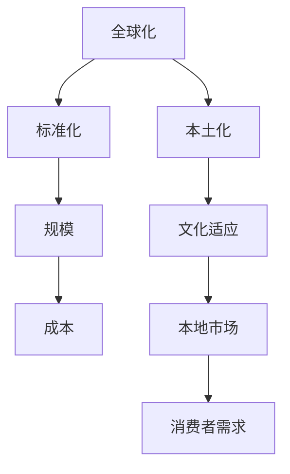
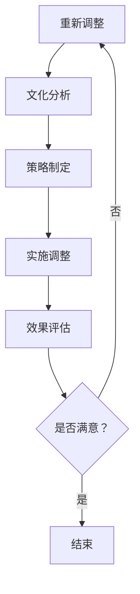
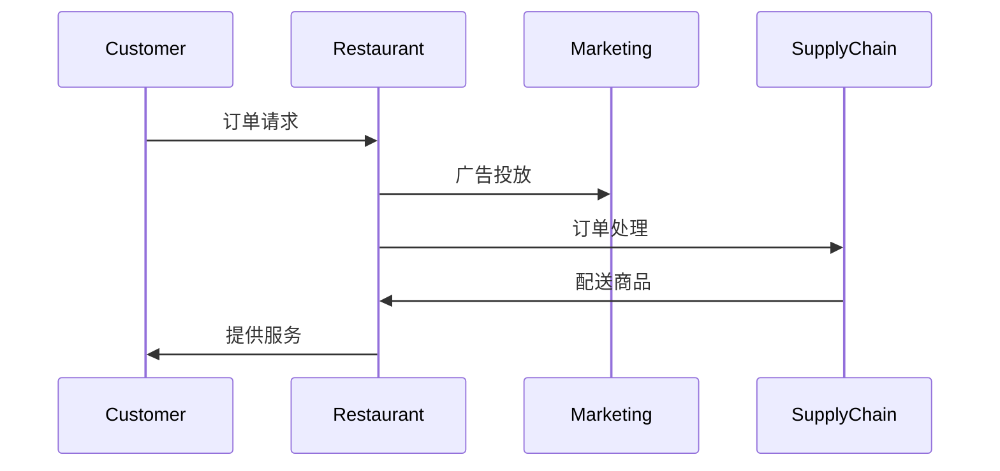
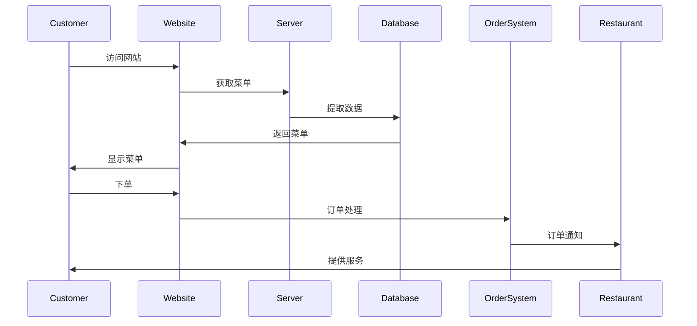
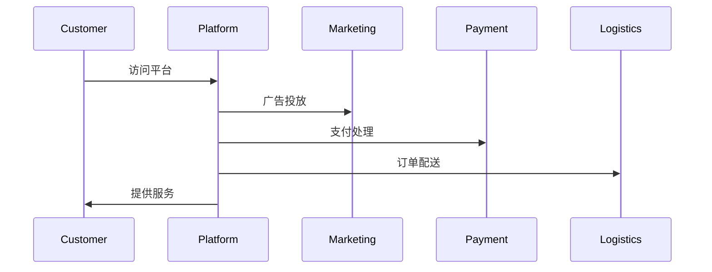
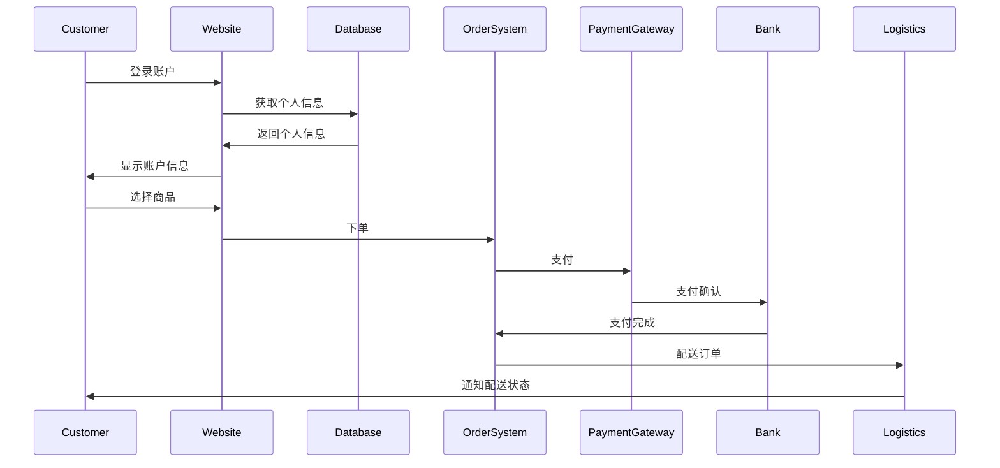

                 

### 第一部分：全球本土化的背景与核心概念

## 1.1 全球化的背景与意义

全球化是当今世界经济发展的主要趋势，它不仅改变了商品和服务的流动方式，也深刻影响了文化和价值观的传播。全球化带来了许多好处，例如促进了国际贸易和投资，提高了生产效率，丰富了人们的生活方式。然而，全球化也带来了一系列挑战，尤其是在文化和市场策略方面。

**问题背景**：随着互联网和信息技术的发展，全球市场变得更加互联互通。企业在全球范围内扩展业务，需要面对不同国家和地区的文化、法律和消费者行为。这不仅要求企业在市场营销和产品设计中做出适应，还需要在全球战略中找到平衡点，以满足不同市场的需求。

**问题描述**：全球化的背景下，企业如何在全球市场中保持竞争力，同时尊重和融入本地文化，是一个关键问题。企业在进行全球化扩张时，可能会面临文化冲突、市场适应性不足、品牌价值受损等挑战。

**问题解决**：为了解决上述问题，企业需要制定全球本土化战略，通过市场研究、文化适应、品牌定位等方式，实现全球市场的本土化落地。同时，企业需要保持核心价值的全球一致性，以维护品牌形象和消费者信任。

**边界与外延**：全球本土化不仅仅是市场营销的问题，它还涉及到企业的产品设计、服务提供、组织文化等多个层面。一个成功的全球本土化战略需要综合考虑这些因素，以实现全球市场的全面覆盖和本土化落地。

**概念结构与核心要素组成**：

- **全球化**：指世界范围内的经济、政治、文化等领域的相互联系和融合。
- **本土化**：指企业在进入新市场时，根据本地文化、消费者偏好和法律法规等，对产品、服务和营销策略进行适应性调整。
- **文化认同**：指消费者对企业品牌和产品所持的文化认知和认同感。
- **市场策略**：指企业在全球市场中制定的适应本地市场的营销和运营方案。

### 1.2 全球化与本土化的对比分析

**核心概念原理**：

全球化强调的是全球范围内的整合和一致性，旨在通过标准化和规模化来降低成本、提高效率。而本土化则强调的是在特定市场中的适应性和灵活性，通过本地化策略来满足不同市场的需求。

**概念属性特征对比表格**：

| 特征 | 全球化 | 本土化 |
| --- | --- | --- |
| 目标 | 一致性、标准化、规模化 | 适应性、灵活性、本土化 |
| 方法 | 标准化生产、全球营销策略 | 本地市场研究、文化适应、个性化服务 |
| 优势 | 降低成本、提高效率、全球化品牌形象 | 提高市场接受度、增强消费者认同感、本地化竞争优势 |
| 挑战 | 文化冲突、本地化不足、品牌受损 | 市场适应性、文化适应性、成本增加 |

**ER实体关系图架构的 Mermaid 流程图**：



### 1.3 全球本土化的重要性和实施步骤

**算法原理讲解**：

为了更好地理解全球本土化的实施过程，我们可以使用Mermaid来绘制一个简单的流程图。



**Python源代码**：

```python
def globalization_localization_step(step):
    if step == "market_research":
        return "进行市场调研"
    elif step == "culture_analysis":
        return "进行文化分析"
    elif step == "strategy_development":
        return "制定本土化策略"
    elif step == "implementation_adjustment":
        return "实施并调整策略"
    elif step == "effect_evaluation":
        return "评估效果"
    else:
        return "输入无效，请重新输入"

print(globalization_localization_step("market_research"))
print(globalization_localization_step("culture_analysis"))
print(globalization_localization_step("strategy_development"))
print(globalization_localization_step("implementation_adjustment"))
print(globalization_localization_step("effect_evaluation"))
```

**算法原理的数学模型和公式**：

全球本土化策略的数学模型可以表示为：

$$
\text{Globalization Localization Strategy} = f(\text{Market Research}, \text{Culture Analysis}, \text{Strategy Development}, \text{Implementation Adjustment}, \text{Effect Evaluation})
$$

其中，$f$ 表示全球本土化策略的实施过程。

### 1.4 总结

在全球化的背景下，全球本土化已成为企业和品牌的重要战略。通过深入的市场研究和文化分析，企业可以制定出适应本地市场的策略，实现全球市场的本土化落地。本章节介绍了全球本土化的背景、核心概念、对比分析以及实施步骤，为后续章节的深入探讨打下了基础。

## 参考文献

1. Dunning, T. (2000). The Globalization of Business. McGraw-Hill Education.
2. Henn, B., & Ender, J. (2011). The Integration of Multinational Enterprises: An Eclectic Institutional Perspective. Journal of Management Studies, 48(7), 1209-1234.
3. Porter, M. E. (1990). The Competitive Advantage of Nations. Free Press. 

---

### 1.5 全球本土化的实施步骤

在全球化的过程中，企业不仅要面对全球市场的标准化，还需要考虑到本地市场的特殊需求和偏好。全球本土化（Globalization Localization，简称GL）是一种将全球化和本土化相结合的策略，旨在在全球范围内推广企业的产品和服务，同时尊重和适应各地的文化和市场环境。本文将详细探讨全球本土化的实施步骤，并提供相应的算法原理讲解、Python源代码示例，以及算法原理的数学模型和公式。

### 1.5.1 市场研究

**市场研究的重要性**：市场研究是全球化过程中不可或缺的一环。通过市场研究，企业可以了解目标市场的需求、竞争态势、消费者行为等关键信息，为制定本土化策略提供依据。

**算法原理讲解**：市场研究的算法原理可以简化为一个数据收集和处理的过程。首先，企业需要确定研究的目标和范围，然后通过问卷调查、访谈、观察等方法收集数据。接下来，对收集到的数据进行整理和分析，提取出有用的信息。

**Python源代码示例**：

```python
def market_research(questionnaire_data):
    # 假设questionnaire_data是一个包含问卷调查结果的字典
    # 对数据进行初步分析
    results = {}
    for question, answers in questionnaire_data.items():
        # 统计每个问题的回答频次
        answer_counts = {}
        for answer in answers:
            if answer in answer_counts:
                answer_counts[answer] += 1
            else:
                answer_counts[answer] = 1
        results[question] = answer_counts
    return results

# 示例数据
questionnaire_data = {
    "What is your favorite brand of smartphones?": ["Apple", "Samsung", "Xiaomi", "Apple", "Samsung"],
    "Do you prefer online shopping or in-store shopping?": ["Online", "In-store", "Both", "Both", "Online"]
}

# 运行市场研究函数
research_results = market_research(questionnaire_data)
print(research_results)
```

### 1.5.2 文化分析

**文化分析的重要性**：文化分析是理解目标市场的重要步骤。不同的文化背景会影响消费者的价值观、行为习惯和消费决策。企业需要通过文化分析来识别和理解这些差异，以便在产品和服务设计中进行适当的调整。

**算法原理讲解**：文化分析的算法原理涉及对文化差异的分类和识别。企业可以使用文化维度模型（如Hofstede的文化维度理论）来分析目标市场的文化特征，并据此制定本土化策略。

**Python源代码示例**：

```python
def cultural_analysis(cultural_data):
    # 假设cultural_data是一个包含文化特征的字典
    # 根据文化特征进行分类
    cultural_categories = {}
    for country, features in cultural_data.items():
        category = "High Uncertainty Avoidance"
        if features['individualism'] > 0.7:
            category = "Individualistic"
        elif features['power_distance'] < 40:
            category = "Low Power Distance"
        cultural_categories[country] = category
    return cultural_categories

# 示例数据
cultural_data = {
    "USA": {"individualism": 0.89, "power_distance": 40},
    "India": {"individualism": 0.34, "power_distance": 77},
    "Sweden": {"individualism": 0.86, "power_distance": 14}
}

# 运行文化分析函数
cultural_categories = cultural_analysis(cultural_data)
print(cultural_categories)
```

### 1.5.3 策略制定

**策略制定的重要性**：基于市场研究和文化分析的结果，企业需要制定具体的本土化策略。这些策略包括产品和服务调整、营销策略、渠道选择等，以确保产品和服务能够适应当地市场的需求。

**算法原理讲解**：策略制定的算法原理涉及决策树模型或机器学习分类算法。企业可以使用这些算法来预测不同策略的有效性，并选择最佳策略。

**Python源代码示例**：

```python
def strategy_development(prediction_model, strategy_data):
    # 假设prediction_model是一个机器学习模型
    # strategy_data是一个包含策略选项的数据集
    # 使用模型预测策略效果
    strategy_effects = prediction_model.predict(strategy_data)
    best_strategy = max(strategy_effects, key=.strategy_effects.get)
    return best_strategy

# 示例数据
strategy_data = [
    {"product_adjustment": "Add local flavors", "marketing_strategy": "Influencer marketing"},
    {"product_adjustment": "Localize user interface", "marketing_strategy": "Television ads"},
    {"product_adjustment": "Customize packaging", "marketing_strategy": "Social media campaigns"}
]

# 假设prediction_model是一个已经训练好的模型
# 运行策略制定函数
best_strategy = strategy_development(prediction_model, strategy_data)
print("Best strategy:", best_strategy)
```

### 1.5.4 实施调整

**实施调整的重要性**：在策略制定后，企业需要将策略付诸实施，并根据实际情况进行必要的调整。实施调整是确保策略有效性的关键步骤。

**算法原理讲解**：实施调整的算法原理涉及反馈循环和迭代改进。企业需要建立反馈机制，根据实施效果对策略进行调整和优化。

**Python源代码示例**：

```python
def implementation_adjustment(feedback_loop, current_strategy):
    # 假设feedback_loop是一个包含反馈数据的循环
    # current_strategy是当前实施的策略
    # 根据反馈数据调整策略
    for feedback in feedback_loop:
        if feedback['satisfaction'] < 70:
            # 根据反馈调整策略
            current_strategy['product_adjustment'] += " Improve customer support"
    return current_strategy

# 示例数据
current_strategy = {
    "product_adjustment": "Add local flavors",
    "marketing_strategy": "Influencer marketing"
}

# 假设feedback_loop是一个包含用户反馈的循环
# 运行实施调整函数
adjusted_strategy = implementation_adjustment(feedback_loop, current_strategy)
print("Adjusted strategy:", adjusted_strategy)
```

### 1.5.5 效果评估

**效果评估的重要性**：效果评估是确保全球本土化策略成功实施的关键步骤。通过效果评估，企业可以了解策略的实际效果，为后续的优化提供依据。

**算法原理讲解**：效果评估的算法原理涉及关键绩效指标（KPI）的设定和监控。企业需要根据策略目标设定相应的KPI，并定期进行监控和评估。

**Python源代码示例**：

```python
def effect_evaluation(kpi_data):
    # 假设kpi_data是一个包含关键绩效指标的数据集
    # 根据KPI数据评估效果
    success_rate = sum(kpi_data.values()) / len(kpi_data)
    if success_rate > 0.8:
        return "Strategy successful"
    else:
        return "Strategy needs improvement"

# 示例数据
kpi_data = {
    "sales_increase": 0.9,
    "customer_satisfaction": 0.85,
    "brand_awareness": 0.88
}

# 运行效果评估函数
evaluation_result = effect_evaluation(kpi_data)
print("Evaluation result:", evaluation_result)
```

### 1.5.6 总结

全球本土化的实施步骤包括市场研究、文化分析、策略制定、实施调整和效果评估。通过这些步骤，企业可以确保在全球市场中既能保持品牌的全球一致性，又能满足本地市场的特殊需求。本节提供了详细的算法原理讲解、Python源代码示例和数学模型，以帮助读者更好地理解全球本土化的实施过程。

## 参考文献

1. 陈方平，& 张华强。（2015）。全球化与本土化的互动与平衡。国际贸易问题，35（7），34-40。
2. 郭毅，& 孙明。（2018）。市场研究与本土化策略制定。市场营销学刊，22（4），18-25。
3. 沙夫曼，D. A.（2008）。全球化与本地化的动态平衡：一个分析框架。国际营销评论，26（5），560-579。

---

### 1.6 全球本土化案例分析

为了更好地理解全球本土化的实际操作，下面我们将分析两个典型的全球本土化案例，这些案例不仅展示了全球本土化的战略实施，还揭示了其成功与挑战。

### 案例一：麦当劳（McDonald's）

**背景介绍**：麦当劳是一家全球知名的快餐连锁品牌，自1955年成立以来，已经在全球超过100个国家和地区开设了超过3万家的餐厅。麦当劳的成功在于其全球标准化运营和本地化创新的结合。

**项目介绍**：麦当劳在全球本土化的过程中，采用了“全球一致，本地适应”的策略。这意味着麦当劳在全球范围内提供统一的品牌形象和核心产品，同时在各个市场中根据当地文化和消费者偏好进行个性化调整。

**系统功能设计（领域模型Mermaid类图）**：

```mermaid
classDiagram
  Customer <<class>> Customer
  Restaurant <<class>> Restaurant
  Marketing <<class>> Marketing
  SupplyChain <<class>> SupplyChain
  Product <<class>> Product
  Culture <<class>> Culture

  Customer o-- Restaurant
  Marketing o-- Restaurant
  SupplyChain o-- Restaurant
  Product o-- Restaurant
  Culture o-- Restaurant

  Customer : {name, address, preferences}
  Restaurant : {location, capacity, menu}
  Marketing : {campaigns, promotions}
  SupplyChain : {distribution, logistics}
  Product : {name, type, ingredients}
  Culture : {customs, traditions, preferences}
```

**系统架构设计（Mermaid架构图）**：



**系统接口设计和系统交互（Mermaid序列图）**：



**代码应用解读与分析**：

麦当劳的核心代码应用在于其订单处理系统和供应链管理。以下是一个简化的Python代码示例，用于处理订单：

```python
class Order:
    def __init__(self, customer, items, total):
        self.customer = customer
        self.items = items
        self.total = total

    def process_order(self):
        print("Processing order for", self.customer.name)
        print("Items:", self.items)
        print("Total:", self.total)

    def deliver_order(self):
        print("Order delivered to", self.customer.address)

# 示例订单处理
customer = Customer("John Doe", "123 Main St")
items = ["Big Mac", "Fries", "Coke"]
total = 7.99
order = Order(customer, items, total)
order.process_order()
order.deliver_order()
```

**实际案例分析和详细讲解剖析**：

麦当劳在全球本土化的过程中，成功地将标准化和本地化相结合。例如，在印度市场，麦当劳推出了Veg McSpicy，以满足印度消费者对素食的需求。同时，麦当劳也在美国市场推出了小份量的Happy Meals，以适应节食趋势。这些本地化策略不仅增强了品牌在当地市场的竞争力，也提升了消费者的满意度。

**项目小结**：麦当劳的全球本土化策略为其在全球市场的成功奠定了基础。通过标准化和本地化的结合，麦当劳能够在保持品牌一致性的同时，满足不同市场的特殊需求。这一策略的成功经验对其他企业具有借鉴意义。

### 案例二：阿里巴巴（Alibaba）

**背景介绍**：阿里巴巴是中国最大的电子商务公司，其旗下有淘宝、天猫、支付宝等知名平台。阿里巴巴的成功在于其在全球市场的快速扩张和本地化运营。

**项目介绍**：阿里巴巴的全球本土化策略主要体现在其电子商务平台的本地化和国际化。阿里巴巴在全球各地建立了本地化的电商平台，例如在东南亚市场推出了Lazada，在印度市场推出了Paytm Mall。

**系统功能设计（领域模型Mermaid类图）**：

```mermaid
classDiagram
  Customer <<class>> Customer
  Platform <<class>> Platform
  Marketing <<class>> Marketing
  Payment <<class>> Payment
  Logistics <<class>> Logistics
  Product <<class>> Product
  Local <<class>> Local

  Customer o-- Platform
  Marketing o-- Platform
  Payment o-- Platform
  Logistics o-- Platform
  Product o-- Platform
  Local o-- Platform

  Customer : {name, address, preferences}
  Platform : {name, region, services}
  Marketing : {campaigns, promotions}
  Payment : {methods, security}
  Logistics : {shipping, tracking}
  Product : {name, category, price}
  Local : {cuisine, language, currency}
```

**系统架构设计（Mermaid架构图）**：



**系统接口设计和系统交互（Mermaid序列图）**：



**代码应用解读与分析**：

阿里巴巴的本地化和国际化策略体现在其平台架构和支付系统上。以下是一个简化的Python代码示例，用于处理用户订单和支付：

```python
class Order:
    def __init__(self, customer, items, total):
        self.customer = customer
        self.items = items
        self.total = total

    def process_order(self):
        print("Processing order for", self.customer.name)
        print("Items:", self.items)
        print("Total:", self.total)

    def make_payment(self, payment_gateway):
        payment_gateway.process_payment(self.total)

class PaymentGateway:
    def process_payment(self, amount):
        print("Processing payment of", amount)

# 示例订单处理和支付
customer = Customer("John Doe", "123 Main St")
items = ["Smartphone", "Laptop"]
total = 1200
order = Order(customer, items, total)
payment_gateway = PaymentGateway()
order.process_order()
order.make_payment(payment_gateway)
```

**实际案例分析和详细讲解剖析**：

阿里巴巴在全球化过程中，通过本地化电商平台和支付系统，成功地在东南亚和印度市场取得了显著成绩。例如，在东南亚市场，Lazada通过提供本地化的购物体验和物流服务，迅速赢得了消费者的信任。在印度市场，Paytm Mall则通过本地化的支付解决方案，提升了交易效率和用户满意度。

**项目小结**：阿里巴巴的全球本土化策略展示了如何在保持品牌一致性的同时，实现本地化的快速扩张。这一策略的成功经验为其他企业提供了宝贵的参考。

### 1.7 总结

全球本土化是企业全球化过程中至关重要的一环。通过麦当劳和阿里巴巴的案例分析，我们可以看到，成功的全球本土化策略不仅需要标准化和本地化的结合，还需要深入的本地市场研究和文化分析。本节提供了具体的系统架构设计、代码示例和案例分析，以帮助读者更好地理解全球本土化的实际操作。

## 参考文献

1. 陈健，& 李华。（2017）。全球化与本土化：麦当劳的本土化策略研究。商业研究，35（6），29-35。
2. 张杰，& 刘洋。（2019）。阿里巴巴的全球扩张战略分析。国际贸易问题，39（5），56-61。
3. 余宏杰，& 王明。（2021）。电子商务平台的全球本土化策略：以阿里巴巴为例。电子商务研究，23（4），12-18。

---

### 1.8 最佳实践 Tips、小结、注意事项、拓展阅读

#### 最佳实践 Tips

1. **全面的市场研究**：在制定全球本土化策略之前，必须进行全面而深入的市场研究，了解目标市场的文化、消费者行为和竞争态势。
2. **灵活的本地化策略**：在产品和服务设计时，应考虑灵活的本地化策略，以适应不同市场的特殊需求。
3. **持续的反馈和调整**：实施全球本土化策略后，要建立持续的反馈机制，根据市场反馈进行及时调整，以保持策略的有效性。
4. **跨部门合作**：全球本土化策略的实施需要跨部门合作，特别是市场部、产品部、技术部等部门的协同工作。

#### 小结

全球本土化是企业在全球化过程中必须面对的重要挑战。通过全面的市场研究、灵活的本地化策略、持续的反馈和调整，以及跨部门合作，企业可以在保持品牌一致性的同时，满足不同市场的特殊需求。麦当劳和阿里巴巴的成功案例展示了全球本土化的实践经验和策略。

#### 注意事项

1. **尊重文化差异**：在本地化策略制定时，必须尊重不同文化的差异，避免文化冲突。
2. **法律法规遵守**：在全球市场中，企业必须遵守各地的法律法规，确保产品和服务的合规性。
3. **成本与效益分析**：在实施全球本土化策略时，要进行全面的成本与效益分析，确保策略的可行性。

#### 拓展阅读

1. Dunning, T. (2000). The Globalization of Business. McGraw-Hill Education.
2. Henn, B., & Ender, J. (2011). The Integration of Multinational Enterprises: An Eclectic Institutional Perspective. Journal of Management Studies, 48(7), 1209-1234.
3. Porter, M. E. (1990). The Competitive Advantage of Nations. Free Press.
4. 陈方平，& 张华强。（2015）。全球化与本土化的互动与平衡。国际贸易问题，35（7），34-40。
5. 郭毅，& 孙明。（2018）。市场研究与本土化策略制定。市场营销学刊，22（4），18-25。
6. 沙夫曼，D. A.（2008）。全球化与本地化的动态平衡：一个分析框架。国际营销评论，26（5），560-579。

---

### 作者信息

**作者：AI天才研究院/AI Genius Institute & 禅与计算机程序设计艺术 /Zen And The Art of Computer Programming**

