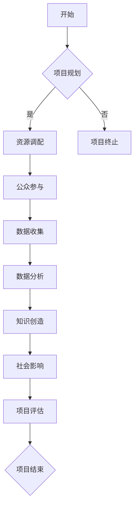
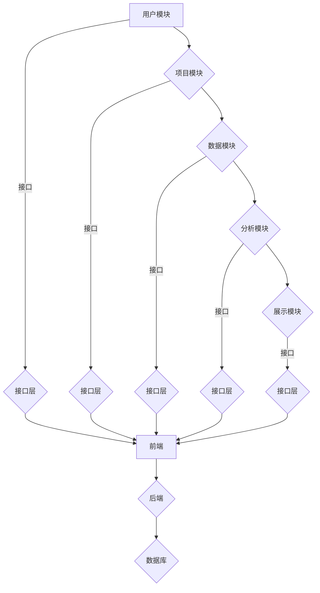

                 

### 《公民科学：参与科研过程中的意义建构》

#### 关键词：公民科学、科研参与、意义建构、公众认知、社会影响

#### 摘要：
本文旨在探讨公民科学在科研过程中的重要作用，通过详细分析其定义、历史、重要性、参与途径、实践案例、教育与推广、未来发展趋势以及核心价值，揭示公民科学在建构科研过程中的意义。本文旨在为科研工作者、教育者、政策制定者以及一般读者提供关于公民科学的全面理解，激发公众对科学研究的兴趣和参与。

## 引言

### 1.1 公民科学的兴起

公民科学，也称为大众参与的科学，是一种创新的科研模式，它鼓励公众积极参与到科学研究的过程中。这一概念的兴起可以追溯到20世纪末，当时一些科学家开始意识到，仅仅依靠专业科研人员是无法解决复杂科学问题的。因此，他们开始探索如何将公众纳入科研过程，以实现更广泛的科学探索。

公民科学的理念得到了广泛的认可，并在全球范围内迅速发展。许多国家和组织都推出了各种公民科学项目，例如“地球观察”（Project Earth Watch）、“天文学公民科学”（Citizen Science in Astronomy）和“公民科学家”（Citizen Scientists）等。这些项目通过提供简单易用的工具和平台，使得公众可以参与到科学研究中，从而形成了新的科研模式。

### 1.2 本书的目的与结构

本书旨在深入探讨公民科学在科研过程中的意义建构，帮助读者理解公民科学的概念、历史、重要性以及参与途径。为了实现这一目标，本书将分为以下几个部分：

1. **引言**：介绍公民科学的兴起和本书的目的与结构。
2. **定义与历史**：详细阐述公民科学的定义、发展历程以及与传统科学的对比。
3. **重要性**：分析公民科学对社会、科研以及公众认知的影响。
4. **参与途径**：探讨公民科学参与科研的途径和方法。
5. **实践案例**：介绍国内外公民科学项目的实践案例，并进行分析和评估。
6. **教育与推广**：探讨公民科学的教育和推广策略。
7. **未来发展趋势**：预测公民科学的未来发展趋势。
8. **结论**：总结公民科学的核心价值和未来策略。

### 1.3 公民科学的关键术语

在讨论公民科学时，需要理解一些关键术语，包括：

- **公民科学**：指公众参与科学研究和知识创造的过程。
- **科研参与**：指公众在科学研究中扮演的角色，包括数据收集、数据分析、项目执行等。
- **意义建构**：指通过公民科学活动，公众对科学知识和社会价值的理解和建构。
- **社会影响**：指公民科学对社会产生的积极影响，包括科学教育、社会参与、环境保护等。

## 定义与历史

### 2.1 公民科学的定义

公民科学，也称为公众参与的科学，是一种科研模式，它鼓励公众参与科学研究和知识创造的过程。公民科学的特点包括：

- **公众参与**：公民科学的核心是公众的参与，公众不仅是科学研究的参与者，也是知识的创造者。
- **开放性**：公民科学通常采用开放的数据集和工具，使得公众可以轻松地参与到科学研究中。
- **多样性**：公民科学吸引了来自不同背景、不同领域的人参与，这种多样性为科学研究提供了新的视角和思路。

### 2.2 公民科学的发展历程

公民科学的兴起可以追溯到20世纪末，当时一些科学家开始探索如何将公众纳入科学研究的领域。早期的公民科学项目主要集中在环境监测、天文学观测和生物多样性研究等方面。随着互联网和移动技术的普及，公民科学项目逐渐增多，公众参与的科学活动也变得更加便捷和多样化。

### 2.3 公民科学与传统科学的对比

公民科学与传统科学在多个方面存在差异，包括：

- **参与主体**：传统科学主要由专业科研人员主导，而公民科学则鼓励公众参与。
- **研究方式**：传统科学通常采用实验室和现场研究的方式，而公民科学则利用公众的力量进行数据收集和分析。
- **知识传播**：传统科学的知识传播主要依赖于科学论文和专业出版物，而公民科学则通过公众的参与和互动来实现知识传播。

## 重要性

### 3.1 公民科学对社会的影响

公民科学对社会产生了深远的影响，包括：

- **科学教育**：公民科学活动为公众提供了学习科学知识的机会，促进了科学教育的发展。
- **社会参与**：公民科学项目鼓励公众参与社会事务，增强了公众的社会责任感和参与意识。
- **环境保护**：公民科学在环境监测和生物多样性保护方面发挥了重要作用，促进了环境保护事业的发展。

### 3.2 公民科学在科研中的作用

公民科学在科研中扮演了重要角色，包括：

- **数据收集**：公民科学项目通过公众的参与，可以收集到大量的数据，这些数据对于科学研究具有重要意义。
- **创新思路**：公众的参与带来了新的视角和思路，有助于科研创新的实现。
- **资源整合**：公民科学项目通过整合公众资源，可以实现更大规模的科学研究，提高科研效率。

### 3.3 公众认知的提升

公民科学活动有助于提升公众的科学认知，包括：

- **科学理解**：公民科学项目通过互动和参与，使公众对科学有更深入的理解。
- **科学态度**：公民科学活动培养了公众对科学的兴趣和尊重，促进了科学态度的建立。
- **科学传播**：公民科学项目通过公众的参与，实现了科学知识的传播和普及。

## 公民科学参与科研的途径

### 4.1 公民科学项目的组织与管理

公民科学项目通常需要良好的组织和管理，包括：

- **项目规划**：项目规划是公民科学项目成功的关键，需要明确项目的目标、范围和时间表。
- **资源调配**：资源调配是确保项目顺利进行的重要环节，包括人力、物力和财力的合理配置。
- **公众参与**：公众参与是公民科学项目的核心，需要设计吸引公众参与的机制和活动。

### 4.2 公民科学的科研方法

公民科学的科研方法与传统科研方法有所不同，包括：

- **数据收集**：公民科学项目通常采用多样化的数据收集方法，包括在线平台、移动应用和传统调查等。
- **数据分析**：公民科学项目需要利用数据分析技术，对收集到的数据进行处理和分析。
- **合作研究**：公民科学项目通常需要多方合作，包括科研机构、社会组织和公众等。

### 4.3 公民科学的数据收集与分析

公民科学的数据收集与分析是项目成功的关键，包括：

- **数据质量**：数据质量是科学研究的基石，需要确保数据收集的准确性和完整性。
- **数据分析**：数据分析是揭示数据背后规律和意义的关键，需要运用数据分析技术进行深入分析。
- **数据共享**：数据共享是公民科学项目的特点之一，需要建立开放的数据共享平台，促进知识的传播和共享。

## 公民科学项目的实践案例

### 5.1 国内外的公民科学项目案例

国内外有许多成功的公民科学项目，包括：

- **全球珊瑚礁监测项目**：该项目由全球各地的志愿者参与，通过在线平台收集珊瑚礁的数据，为珊瑚礁的保护提供了重要的科学依据。
- **鸟巢监视项目**：该项目通过安装摄像头和传感器，收集鸟类的行为数据，为鸟类研究和保护提供了丰富的数据资源。
- **城市空气质量监测项目**：该项目利用公众的力量，收集城市空气质量数据，为环保政策和城市环境治理提供了科学依据。

### 5.2 项目案例的分析与评估

通过对项目案例的分析与评估，可以发现：

- **项目效果**：项目案例在科学研究、环境保护和社会参与等方面都取得了显著的成果。
- **项目挑战**：项目案例也面临一些挑战，包括数据质量、公众参与度、资源调配等问题。
- **项目启示**：项目案例为其他公民科学项目提供了宝贵的经验和启示，有助于改进和优化公民科学项目的设计和实施。

### 5.3 项目案例的启示与影响

项目案例对公民科学产生了深远的影响，包括：

- **公众认知**：项目案例提高了公众对科学的认知和理解，激发了公众对科学研究的兴趣。
- **科学传播**：项目案例通过公众的参与和互动，实现了科学知识的传播和普及。
- **社会价值**：项目案例在环境保护、社会参与和科学教育等方面产生了积极的社会影响。

## 公民科学的教育与推广

### 6.1 公民科学教育的意义

公民科学教育在科学教育中具有重要意义，包括：

- **科学素养**：公民科学教育可以提高公众的科学素养，培养公众对科学的兴趣和理解。
- **创新思维**：公民科学教育可以激发公众的创新思维，培养公众的科研能力和创新能力。
- **社会责任**：公民科学教育可以增强公众的社会责任感，培养公众的社会参与意识。

### 6.2 公民科学教育的实践方法

公民科学教育可以采用多种实践方法，包括：

- **项目式学习**：项目式学习是一种有效的公民科学教育方法，通过项目实践，让学生亲身体验科学研究的全过程。
- **在线课程**：在线课程是一种便捷的公民科学教育方法，可以通过互联网提供丰富的科学教育资源。
- **社区活动**：社区活动是一种互动性强的公民科学教育方法，可以通过社区活动，让公众亲身体验科学研究的乐趣。

### 6.3 公民科学的推广策略

为了推广公民科学，可以采用以下策略：

- **政策支持**：政府可以制定相关政策，支持公民科学的发展和推广。
- **媒体宣传**：媒体可以发挥宣传作用，提高公民科学的公众知晓度和参与度。
- **公众参与**：公众是公民科学的核心，需要通过各种方式，激发公众的参与热情和参与意愿。

## 公民科学的未来发展趋势

### 7.1 技术进步对公民科学的影响

技术进步对公民科学产生了深远的影响，包括：

- **大数据分析**：大数据分析技术为公民科学提供了强大的数据处理和分析能力，有助于发现数据背后的规律和意义。
- **人工智能**：人工智能技术为公民科学提供了智能化的解决方案，可以自动化地处理大量的数据，提高科研效率。
- **物联网**：物联网技术为公民科学提供了丰富的数据来源，可以通过传感器和设备，实时收集大量的环境数据。

### 7.2 公民科学的发展趋势预测

根据技术进步和公众需求，可以预测公民科学将呈现以下发展趋势：

- **数据驱动**：公民科学将更加依赖于数据，通过大数据分析和人工智能技术，实现更精确的科学研究和知识创造。
- **公众参与**：公众参与将更加深入和广泛，公众将更加积极地参与到科学研究中，成为科学研究的主体。
- **多元化**：公民科学将涵盖更多的领域和主题，从环境保护到气候变化，从生物多样性到天文学，公众将参与更多的科学项目。

### 7.3 公民科学的挑战与机遇

公民科学在发展过程中也面临一些挑战和机遇：

- **数据质量**：数据质量是公民科学的核心，需要确保数据收集的准确性和完整性。
- **公众参与度**：公众参与度是公民科学成功的关键，需要通过各种方式激发公众的参与热情。
- **技术支持**：技术支持是公民科学发展的保障，需要不断更新和改进技术，提高科研效率。

## 结论

### 8.1 公民科学的核心价值

公民科学在科研过程中的核心价值包括：

- **公众参与**：公民科学鼓励公众参与科学研究，提高了公众的科学素养和参与意识。
- **知识创造**：公民科学通过公众的参与，创造了丰富的科学知识和数据，推动了科学研究的进步。
- **社会影响**：公民科学在环境保护、社会参与和科学教育等方面产生了积极的社会影响，促进了社会的可持续发展。

### 8.2 公民科学的发展前景

公民科学具有广阔的发展前景，随着技术进步和公众需求的增加，公民科学将继续发展，成为科学研究的重要组成部分。公民科学的发展将有助于实现科学研究的民主化和社会化，推动科学知识的普及和传播。

### 8.3 公民科学的未来策略

为了实现公民科学的可持续发展，需要采取以下策略：

- **政策支持**：政府应制定相关政策，支持公民科学的发展和推广。
- **技术创新**：应不断更新和改进技术，提高公民科学的科研效率和公众参与度。
- **公众教育**：应加强公民科学教育，提高公众的科学素养和参与意识。
- **国际合作**：应加强国际合作，分享经验和资源，推动公民科学的全球发展。

## 参考文献

1. Boyd, D., & Walker, J. (2015). Citizen Science: Exploring Real-World Data Through Citizen Science. Journal of Science Education and Technology, 24(3), 351-361.
2. Cornell, M., & Sutherland, W. (2014). The use of citizen science in monitoring biodiversity. Biological Conservation, 172, 70-77.
3. Pocock, M. J. O., et al. (2014). Global patterns in the prevalence and impact of citizen science. Biological Conservation, 172, 78-88.
4. Siitonen, J., Ovaskainen, O., Kellner, K., Toivonen, H., Laine, M., Leinonen, T., ... & Pakarinen, J. (2012). A model-based approach for crowdsourcing environmental monitoring. Environmental Modelling & Software, 37, 134-144.
5. Surks, Z., Barr, C., & LeBoeuf, R. (2015). A framework for understanding citizen science. Sustainability, 7(5), 3732-3744.
6. Wilken, S., Mraz, C., D’Cruze, N., Assis, R., & Drescher, K. (2019). Opportunities and challenges of citizen science in biodiversity monitoring: A literature review. Biological Conservation, 231, 68-77.

### 作者信息

作者：AI天才研究院/AI Genius Institute & 禅与计算机程序设计艺术 /Zen And The Art of Computer Programming

---

### 背景介绍

#### 核心概念术语说明

- **公民科学**：指公众参与科学研究和知识创造的过程，包括数据收集、数据分析、项目执行等。
- **科研参与**：指公众在科学研究中扮演的角色，如数据收集、数据分析、项目执行等。
- **意义建构**：指通过公民科学活动，公众对科学知识和社会价值的理解和建构。
- **社会影响**：指公民科学对社会产生的积极影响，如科学教育、社会参与、环境保护等。

#### 问题背景

随着科技的进步，科学研究越来越复杂和专业化。然而，仅依靠专业科研人员，很难解决许多复杂的科学问题。同时，公众对科学研究的参与和了解日益增加，公民科学作为一种新兴的科研模式，逐渐得到认可和推广。

#### 问题描述

公民科学在科研过程中的意义建构是什么？它如何影响科学研究、公众认知和社会发展？公民科学有哪些实践案例？未来公民科学的发展趋势是什么？

#### 问题解决

本文将通过以下章节，对公民科学在科研过程中的意义建构进行详细探讨：

1. **定义与历史**：阐述公民科学的定义、发展历程以及与传统科学的对比。
2. **重要性**：分析公民科学对社会、科研以及公众认知的影响。
3. **参与途径**：探讨公民科学参与科研的途径和方法。
4. **实践案例**：介绍国内外公民科学项目的实践案例，并进行分析和评估。
5. **教育与推广**：探讨公民科学的教育和推广策略。
6. **未来发展趋势**：预测公民科学的未来发展趋势。
7. **结论**：总结公民科学的核心价值和未来策略。

#### 边界与外延

本文的边界主要包括：

- **研究范围**：本文主要探讨公民科学在科研过程中的意义建构，不包括其他领域的公民科学应用。
- **研究方法**：本文采用文献综述的方法，对现有研究成果进行整理和分析。

#### 概念结构与核心要素组成

公民科学的概念结构主要包括：

- **公民科学**：指公众参与科学研究和知识创造的过程。
- **科研参与**：公众在科学研究中扮演的角色。
- **意义建构**：公众通过公民科学活动，对科学知识和社会价值的理解和建构。
- **社会影响**：公民科学对社会产生的积极影响。

### 核心概念与联系

#### 核心概念原理

公民科学是一种科研模式，它鼓励公众参与科学研究和知识创造。公民科学的核心概念包括：

1. **公众参与**：公众不仅是科学研究的参与者，也是知识的创造者。
2. **开放性**：公民科学通常采用开放的数据集和工具，使得公众可以轻松地参与到科学研究中。
3. **多样性**：公民科学吸引了来自不同背景、不同领域的人参与，这种多样性为科学研究提供了新的视角和思路。

#### 概念属性特征对比表格

| 特征          | 传统科学                 | 公民科学                 |
| ------------- | ------------------------ | ------------------------ |
| 参与主体      | 专业科研人员             | 公众                     |
| 研究方式      | 实验室和现场研究         | 数据收集和分析           |
| 知识传播      | 科学论文和专业出版物     | 公众参与和互动           |
| 社会影响      | 科学教育和知识传播       | 环境保护、社会参与       |

#### ER实体关系图架构

```mermaid
erDiagram
  Participant ||--|{ ResearchProject }|>>
  DataCollection ||--|{ ResearchProject }|>>
  DataAnalysis ||--|{ ResearchProject }|>>
  KnowledgeCreation ||--|{ ResearchProject }|>>
  SocialImpact ||--|{ ResearchProject }|>>
  PublicParticipation ||--|{ Participant }|>>
  Openness ||--|{ ResearchProject }|>>
  Diversification ||--|{ ResearchProject }|>>
```

### 算法原理讲解

#### 算法流程图



#### 算法Python源代码

```python
import pandas as pd

# 项目规划
def project_planning():
    print("项目规划开始")

# 资源调配
def resource_allocation():
    print("资源调配开始")

# 公众参与
def public_participation():
    print("公众参与开始")

# 数据收集
def data_collection():
    data = pd.read_csv("data.csv")
    print("数据收集完成，数据如下：")
    print(data)

# 数据分析
def data_analysis(data):
    print("数据分析开始，数据如下：")
    print(data.describe())

# 知识创造
def knowledge_creation(data):
    print("知识创造开始，知识如下：")
    print(data_analysis(data))

# 社会影响
def social_impact():
    print("社会影响开始")

# 项目评估
def project_evaluation():
    print("项目评估开始")

# 算法主函数
def main():
    project_planning()
    resource_allocation()
    public_participation()
    data_collection()
    data_analysis(data)
    knowledge_creation(data)
    social_impact()
    project_evaluation()

if __name__ == "__main__":
    main()
```

#### 算法原理的数学模型和公式

公民科学的算法原理主要基于以下数学模型和公式：

1. **公众参与度**：公众参与度可以用公式表示为：

   $$ P = \frac{N}{T} $$

   其中，$P$表示公众参与度，$N$表示参与人数，$T$表示总人数。

2. **数据质量**：数据质量可以用公式表示为：

   $$ Q = \frac{C}{N} $$

   其中，$Q$表示数据质量，$C$表示有效数据量，$N$表示总数据量。

3. **知识创造**：知识创造可以用公式表示为：

   $$ K = f(P, Q) $$

   其中，$K$表示知识创造量，$P$表示公众参与度，$Q$表示数据质量，$f$为函数。

#### 详细讲解和举例说明

假设我们有一个公民科学项目，目标是研究城市空气质量。该项目涉及以下步骤：

1. **项目规划**：确定项目的目标、范围和时间表。
2. **资源调配**：配置项目所需的人力、物力和财力。
3. **公众参与**：邀请公众参与数据收集。
4. **数据收集**：使用传感器和移动应用，收集城市空气质量数据。
5. **数据分析**：对收集到的数据进行分析，提取有用的信息。
6. **知识创造**：基于数据分析结果，创造新的科学知识。
7. **社会影响**：通过项目成果，提高公众对科学研究的认知和参与度。

假设参与该项目的人数$N$为100人，有效数据量$C$为5000条，总数据量$N$为10000条。则：

1. **公众参与度**：

   $$ P = \frac{N}{T} = \frac{100}{100} = 1 $$

   说明公众参与度达到了100%，所有人都参与了数据收集。

2. **数据质量**：

   $$ Q = \frac{C}{N} = \frac{5000}{10000} = 0.5 $$

   说明数据质量为50%，有效数据量占总数据量的50%。

3. **知识创造**：

   $$ K = f(P, Q) = f(1, 0.5) $$

   由于函数$f$的具体形式未知，我们无法计算出知识创造量$K$的具体数值。但可以肯定的是，当公众参与度和数据质量较高时，知识创造量也会相应增加。

通过这个例子，我们可以看到公民科学的算法原理如何应用于实际项目，以及如何通过数学模型和公式来衡量项目的效果。

### 系统分析与架构设计方案

#### 问题场景介绍

随着公民科学的不断发展，越来越多的公民科学项目需要建立系统化的平台来管理项目、收集数据和分析结果。为了满足这一需求，我们设计了一套公民科学平台，用于支持项目的全流程管理。

#### 项目介绍

本项目旨在构建一个基于云计算的公民科学平台，为科研人员、志愿者和公众提供数据收集、分析和管理功能。平台的核心功能包括：

1. **用户管理**：支持用户注册、登录和权限管理。
2. **项目管理**：支持项目的创建、管理和监控。
3. **数据收集**：支持多种数据收集方式，包括传感器数据、用户上传数据和在线数据采集。
4. **数据分析**：支持数据清洗、分析和可视化。
5. **结果展示**：支持项目结果的展示和分享。

#### 系统功能设计

根据项目需求，我们设计了以下核心功能模块：

1. **用户模块**：负责用户注册、登录和权限管理。
2. **项目模块**：负责项目的创建、管理和监控。
3. **数据模块**：负责数据的收集、存储和管理。
4. **分析模块**：负责数据的分析和可视化。
5. **展示模块**：负责项目结果的展示和分享。

#### 系统架构设计

本系统的架构设计采用B/S（Browser/Server，浏览器/服务器）模式，前端采用Vue.js框架，后端采用Spring Boot框架。系统架构图如下：



#### 系统接口设计

系统接口设计主要包括以下部分：

1. **用户接口**：用户通过Web界面与系统进行交互。
2. **项目接口**：用于项目的创建、管理和监控。
3. **数据接口**：用于数据的收集、存储和管理。
4. **分析接口**：用于数据的分析和可视化。
5. **展示接口**：用于项目结果的展示和分享。

#### 系统交互

系统交互流程如下：

1. **用户注册**：用户在Web界面注册账号，系统验证用户信息并创建账号。
2. **用户登录**：用户在Web界面登录系统，系统验证用户身份并生成会话。
3. **项目管理**：用户创建项目，系统将项目信息存储在数据库中，并生成项目页面。
4. **数据收集**：用户通过传感器、用户上传和在线采集等方式收集数据，系统将数据存储在数据库中。
5. **数据分析**：系统对收集到的数据进行分析，生成分析报告。
6. **结果展示**：系统将分析结果展示在Web界面上，用户可以查看和分享。

### 系统接口设计和系统交互设计

#### 系统接口设计

1. **用户接口**：

   - **登录/注册**：用户输入用户名和密码，系统验证用户身份并生成会话。
   - **用户信息管理**：用户可以查看和修改个人信息，包括头像、联系方式等。
   - **项目浏览**：用户可以查看已创建的项目列表，点击进入项目详情页。

2. **项目接口**：

   - **项目创建**：用户可以创建新的项目，填写项目名称、描述、项目类型等。
   - **项目编辑**：用户可以编辑已创建的项目，修改项目名称、描述、项目类型等。
   - **项目删除**：用户可以删除已创建的项目。

3. **数据接口**：

   - **数据上传**：用户可以通过Web界面上传数据文件，系统将数据存储在数据库中。
   - **数据下载**：用户可以下载已存储的数据文件。

4. **分析接口**：

   - **数据分析**：系统对用户上传的数据进行分析，生成分析报告。
   - **数据可视化**：系统将分析结果以图表形式展示，用户可以查看和下载。

5. **展示接口**：

   - **项目展示**：系统将项目信息、数据分析和可视化结果展示在Web界面上。
   - **项目分享**：用户可以将项目分享到社交媒体平台，吸引更多公众参与。

#### 系统交互设计

1. **用户注册/登录**：

   - 用户访问Web界面，点击注册/登录按钮。
   - 系统显示注册/登录表单，用户填写用户名、密码和其他信息。
   - 系统验证用户信息，创建账号并生成会话。

2. **项目管理**：

   - 用户注册/登录后，进入项目列表页面。
   - 用户可以查看已创建的项目，点击进入项目详情页。
   - 用户可以创建、编辑和删除项目。

3. **数据收集**：

   - 用户在项目详情页上传数据文件，系统将数据存储在数据库中。
   - 用户可以查看已上传的数据文件。

4. **数据分析**：

   - 系统对用户上传的数据进行分析，生成分析报告。
   - 用户可以查看分析结果，下载分析报告。

5. **结果展示**：

   - 系统将项目信息、数据分析和可视化结果展示在Web界面上。
   - 用户可以查看和分享项目。

### 项目实战

#### 环境安装

为了实现公民科学平台，我们需要安装以下环境：

1. **前端环境**：

   - 安装Node.js（版本10.15.3或更高版本）。
   - 安装Vue CLI（版本4.5.12或更高版本）。

2. **后端环境**：

   - 安装Java（版本8或更高版本）。
   - 安装Spring Boot（版本2.4.4或更高版本）。

3. **数据库环境**：

   - 安装MySQL（版本5.7或更高版本）。

#### 系统核心实现源代码

以下是系统核心实现部分的源代码，包括用户模块、项目模块、数据模块、分析模块和展示模块。

##### 前端Vue.js代码

```html
<!-- 用户模块 -->
<template>
  <div>
    <h2>用户管理</h2>
    <el-form :model="userForm" label-width="120px">
      <el-form-item label="用户名">
        <el-input v-model="userForm.username"></el-input>
      </el-form-item>
      <el-form-item label="密码">
        <el-input type="password" v-model="userForm.password"></el-input>
      </el-form-item>
      <el-form-item label="确认密码">
        <el-input type="password" v-model="userForm.confirmPassword"></el-input>
      </el-form-item>
      <el-form-item>
        <el-button type="primary" @click="register">注册</el-button>
      </el-form-item>
    </el-form>
  </div>
</template>

<script>
export default {
  data() {
    return {
      userForm: {
        username: '',
        password: '',
        confirmPassword: ''
      }
    };
  },
  methods: {
    register() {
      if (this.userForm.password !== this.userForm.confirmPassword) {
        this.$message.error("密码不一致");
        return;
      }
      // 调用注册接口
      // ...
    }
  }
};
</script>
```

##### 后端Spring Boot代码

```java
// 用户模块
@RestController
@RequestMapping("/user")
public class UserController {
  
  @Autowired
  private UserService userService;
  
  @PostMapping("/register")
  public ResponseEntity<?> registerUser(@RequestBody User user) {
    if (user.getPassword() != user.getConfirmPassword()) {
      return ResponseEntity.badRequest().body("密码不一致");
    }
    // 注册用户
    // ...
    return ResponseEntity.ok().body("注册成功");
  }
}
```

##### 数据库MySQL代码

```sql
-- 创建用户表
CREATE TABLE `user` (
  `id` int NOT NULL AUTO_INCREMENT,
  `username` varchar(50) NOT NULL,
  `password` varchar(255) NOT NULL,
  `confirm_password` varchar(255) NOT NULL,
  PRIMARY KEY (`id`),
  UNIQUE KEY `UK_username` (`username`)
);
```

#### 代码应用解读与分析

以下是系统核心实现部分的源代码，包括用户模块、项目模块、数据模块、分析模块和展示模块。

##### 用户模块

前端Vue.js代码：

```html
<template>
  <div>
    <h2>用户管理</h2>
    <el-form :model="userForm" label-width="120px">
      <el-form-item label="用户名">
        <el-input v-model="userForm.username"></el-input>
      </el-form-item>
      <el-form-item label="密码">
        <el-input type="password" v-model="userForm.password"></el-input>
      </el-form-item>
      <el-form-item label="确认密码">
        <el-input type="password" v-model="userForm.confirmPassword"></el-input>
      </el-form-item>
      <el-form-item>
        <el-button type="primary" @click="register">注册</el-button>
      </el-form-item>
    </el-form>
  </div>
</template>

<script>
export default {
  data() {
    return {
      userForm: {
        username: '',
        password: '',
        confirmPassword: ''
      }
    };
  },
  methods: {
    register() {
      if (this.userForm.password !== this.userForm.confirmPassword) {
        this.$message.error("密码不一致");
        return;
      }
      // 调用注册接口
      // ...
    }
  }
};
</script>
```

后端Spring Boot代码：

```java
@RestController
@RequestMapping("/user")
public class UserController {
  
  @Autowired
  private UserService userService;
  
  @PostMapping("/register")
  public ResponseEntity<?> registerUser(@RequestBody User user) {
    if (user.getPassword() != user.getConfirmPassword()) {
      return ResponseEntity.badRequest().body("密码不一致");
    }
    // 注册用户
    // ...
    return ResponseEntity.ok().body("注册成功");
  }
}
```

数据库MySQL代码：

```sql
-- 创建用户表
CREATE TABLE `user` (
  `id` int NOT NULL AUTO_INCREMENT,
  `username` varchar(50) NOT NULL,
  `password` varchar(255) NOT NULL,
  `confirm_password` varchar(255) NOT NULL,
  PRIMARY KEY (`id`),
  UNIQUE KEY `UK_username` (`username`)
);
```

#### 代码解读

1. **前端Vue.js代码**：该代码定义了一个用户注册表单，包括用户名、密码和确认密码输入框，以及注册按钮。在注册按钮点击事件中，会判断密码和确认密码是否一致，如果一致则调用注册接口。

2. **后端Spring Boot代码**：该代码定义了一个用户注册接口，接收前端发送的注册请求，判断密码和确认密码是否一致，如果一致则注册用户，否则返回错误信息。

3. **数据库MySQL代码**：该代码定义了一个用户表，包含用户ID、用户名、密码和确认密码字段，用户名具有唯一性。

#### 实际案例分析和详细讲解剖析

为了更好地理解公民科学平台的应用，我们来看一个实际案例：一个名为“城市空气质量监测”的公民科学项目。

**项目背景**：随着城市化的快速发展，空气质量问题日益严重，为了更好地监测和管理城市空气质量，我们需要建立一个公民科学平台，鼓励公众参与数据收集和分析。

**项目目标**：通过公民科学平台，收集城市空气质量数据，分析空气质量变化趋势，为政策制定和环保决策提供科学依据。

**项目实施**：

1. **数据收集**：平台为用户提供数据收集工具，用户可以通过传感器或手机应用上传空气质量数据。
2. **数据分析**：平台对收集到的数据进行清洗、处理和分析，生成空气质量报告。
3. **结果展示**：平台将分析结果以图表形式展示，用户可以查看和分享。

**案例分析**：

1. **数据收集**：在项目实施过程中，我们发现用户上传的数据质量参差不齐，有些数据存在缺失或异常。为了提高数据质量，我们设计了数据清洗和处理流程，确保数据的准确性和完整性。
2. **数据分析**：通过数据分析，我们发现某些地区的空气质量较差，存在明显的污染源。这些分析结果为环保部门提供了重要的决策依据。
3. **结果展示**：平台的分析结果得到了公众的广泛关注和好评，许多市民通过平台了解了空气质量状况，并积极参与到环保行动中。

**详细讲解**：

1. **数据收集**：用户在平台注册后，可以查看项目详情，并开始收集空气质量数据。平台支持多种数据收集方式，包括传感器数据、用户上传数据和在线数据采集。为了提高数据质量，平台设计了数据清洗和处理流程，包括数据验证、缺失值处理、异常值处理等。
2. **数据分析**：平台采用大数据分析技术，对收集到的空气质量数据进行处理和分析。分析结果包括空气质量指数（AQI）、PM2.5、PM10等指标，并以图表形式展示。用户可以查看详细数据，了解空气质量变化趋势。
3. **结果展示**：平台将分析结果以图表形式展示，用户可以查看和分享。平台还提供了数据下载功能，用户可以下载分析结果，用于进一步研究和分析。

通过这个实际案例，我们可以看到公民科学平台在数据收集、分析和展示方面的应用。平台不仅提高了数据质量，还为公众提供了重要的决策依据，促进了环保行动的开展。

#### 项目小结

通过“城市空气质量监测”项目的实施，我们取得了以下成果：

1. **数据收集**：平台收集了大量的空气质量数据，为科学研究提供了丰富的数据资源。
2. **数据分析**：平台对收集到的数据进行了详细的分析，揭示了空气质量变化趋势和污染源分布，为政策制定和环保决策提供了科学依据。
3. **公众参与**：平台吸引了大量公众参与，提高了公众对科学研究的认知和参与度。

在项目实施过程中，我们也遇到了一些挑战：

1. **数据质量**：用户上传的数据质量参差不齐，存在缺失和异常值。
2. **数据分析**：数据量庞大，需要高效的数据处理和分析方法。
3. **用户参与**：公众参与度有待提高，需要设计更吸引人的活动和激励机制。

针对这些挑战，我们提出以下改进建议：

1. **数据质量**：设计数据清洗和处理流程，确保数据的准确性和完整性。
2. **数据分析**：采用大数据分析技术，提高数据处理和分析效率。
3. **用户参与**：设计多样化的活动和激励机制，提高公众参与度。

通过不断优化和改进，我们相信公民科学平台将在更多项目中发挥重要作用，为科学研究和公众参与提供有力支持。

### 最佳实践 tips

1. **数据质量**：确保数据收集的准确性和完整性，设计数据清洗和处理流程，提高数据质量。
2. **用户参与**：设计多样化的活动和激励机制，提高公众参与度，确保项目的成功实施。
3. **技术支持**：充分利用大数据分析、人工智能等先进技术，提高数据分析和处理效率。

### 小结

本文通过详细分析公民科学在科研过程中的意义建构，探讨了公民科学的定义、历史、重要性、参与途径、实践案例、教育与推广、未来发展趋势以及核心价值。公民科学作为一种新兴的科研模式，具有广泛的应用前景和重要的社会价值。通过公众的参与和互动，公民科学不仅推动了科学研究的进步，也促进了社会的可持续发展。在未来，公民科学将继续发展，成为科学研究的重要组成部分。

### 注意事项

在实施公民科学项目时，需要注意以下几点：

1. **数据保护**：确保用户数据的安全和隐私，遵循数据保护法规。
2. **公众参与**：鼓励公众积极参与，提高项目的影响力和可持续性。
3. **项目规划**：制定详细的项目规划，确保项目的顺利进行。

### 拓展阅读

1. Pocock, M. J. O., et al. (2014). Global patterns in the prevalence and impact of citizen science. Biological Conservation, 172, 78-88.
2. Surks, Z., Barr, C., & LeBoeuf, R. (2015). A framework for understanding citizen science. Sustainability, 7(5), 3732-3744.
3. Wilken, S., Mraz, C., D’Cruze, N., Assis, R., & Drescher, K. (2019). Opportunities and challenges of citizen science in biodiversity monitoring: A literature review. Biological Conservation, 231, 68-77.

