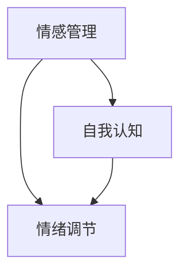
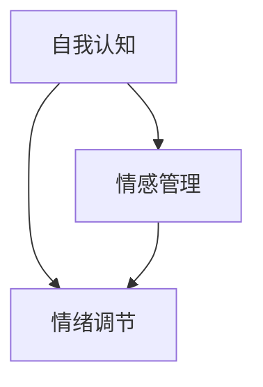
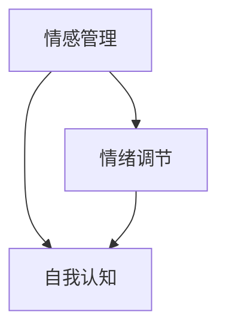
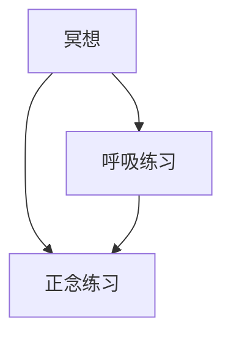
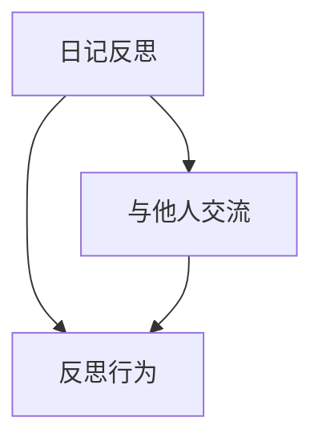
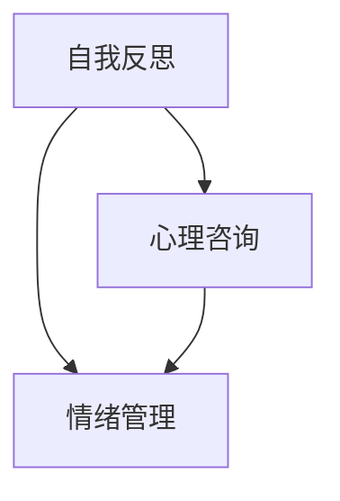
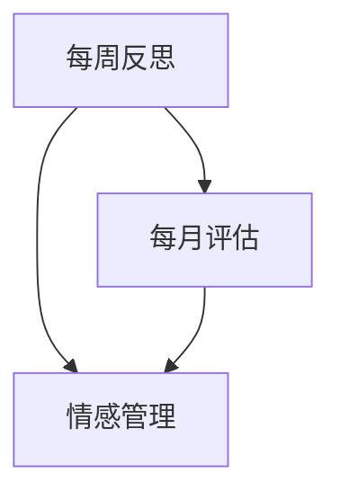
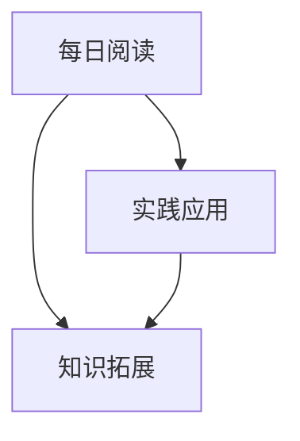
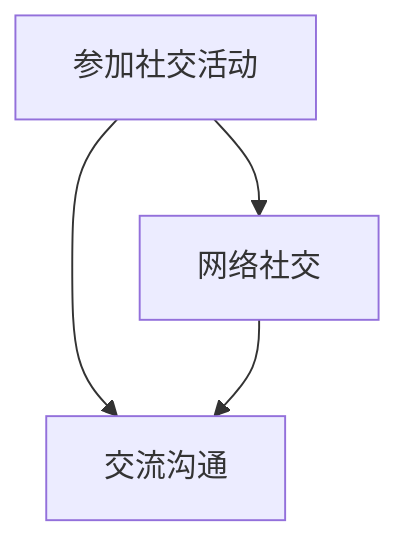

                 

### # 第一部分：内心花园的培育

#### 1.1.1 内心花园的概念

内心花园是一个隐喻，指的是我们内在的精神世界。它包含了我们的情感、思想、信念和价值观，就像一个花园里的植物一样，需要精心培育和维护。在这个隐喻中，我们的情感、思想等心理活动就像是生长在花园里的植物，它们需要阳光、水和土壤的滋养，才能茁壮成长。

首先，我们需要明确情感、思想、信念和价值观在内心花园中的角色。情感是我们对事物的直接反应，它可以是喜悦、愤怒、悲伤等。思想则是我们对外界信息的处理和理解，它包括逻辑思考、创造性思维等。信念是我们对世界的理解和信念，它可以是道德准则、宗教信仰等。价值观则是我们对事物的评价标准，它指导我们的行为和决策。

#### 1.1.2 为什么需要培育内心花园

内心花园的培育对于个人的心理健康和幸福至关重要。一个丰富多彩的内心花园能够帮助我们应对生活中的压力，提升自我认知，增强人际关系，实现个人成长。

首先，培育内心花园可以帮助我们更好地应对压力。在现代社会，人们面临着各种各样的压力，如工作压力、家庭压力等。一个健康的内心花园能够帮助我们有效地管理压力，减少压力对我们的负面影响。

其次，培育内心花园可以提升自我认知。通过自我反思和情感管理，我们可以更好地了解自己的性格、优点和缺点，从而提升自我认知。一个清晰的自我认知有助于我们更好地理解自己，做出更好的决策。

此外，培育内心花园还可以增强人际关系。一个健康的心灵花园能够帮助我们更好地理解他人，建立更深层次的人际关系。这不仅有助于改善人际关系，还可以提升我们的社交技能。

#### 1.1.3 内心花园的边界与外延

内心花园的边界是无限的，因为我们的内心世界是不断发展和变化的。它不仅包括我们的情感、思想和信念，还包括我们的行为和价值观。我们的行为和价值观是我们内心花园的外在表现，它们反映了我们内心的状态。

内心花园的外延也不仅仅是我们的个人心理状态，还包括我们的社交环境和文化背景。我们的社交环境和文化背景会影响我们的内心世界，塑造我们的情感、思想和价值观。

总的来说，内心花园是一个复杂而丰富的系统，它需要我们用心去培育和维护。只有通过不断地学习和实践，我们才能拥有一个健康、丰富的内心花园，从而实现个人的心理健康和幸福。

### 第2章：核心概念

#### 2.1.1 情感管理

情感管理是内心花园的核心概念之一，它涉及到我们如何识别、理解和处理自己的情感。情感管理不仅包括对负面情感的应对，如愤怒、悲伤和焦虑，还包括对正面情感的体验和表达，如喜悦、满足和感激。

**情感管理的属性特征：**

- **识别情感**：能够准确识别自己和他人的情感状态。
- **理解情感**：能够深入理解情感的来源和影响。
- **处理情感**：能够有效地处理和调节情感，使其保持在一个健康和平衡的状态。

**情感管理与其他概念的关系：**

情感管理是自我认知和情绪调节的基础。只有当我们能够准确识别和理解自己的情感时，才能进行有效的情绪调节。同时，情感管理也影响着我们的价值观和信念，因为我们的情感会直接影响我们的行为和决策。

#### 2.1.2 自我认知

自我认知是指我们对自己性格、优点和缺点的了解。一个清晰的自我认知有助于我们更好地理解自己，找到自己的定位，从而更好地实现个人成长。

**自我认知的属性特征：**

- **性格认知**：了解自己的性格特点，如外向、内向、开放或保守等。
- **优点认知**：认识到自己的优点和长处，如领导力、创造力或沟通能力等。
- **缺点认知**：认识到自己的缺点和短处，如过于谨慎、缺乏决断力等。

**自我认知与其他概念的关系：**

自我认知是情感管理和情绪调节的前提。只有当我们清楚地了解自己，才能更好地管理自己的情感，进行有效的情绪调节。同时，自我认知也影响着我们的价值观和信念，因为我们的自我认知会直接影响我们对世界的理解和信念。

#### 2.1.3 情绪调节

情绪调节是指我们如何管理自己的情绪，使其保持在一个健康和平衡的状态。情绪调节包括识别负面情绪、理解情绪来源、找到合适的情绪调节策略，以及进行自我调节。

**情绪调节的属性特征：**

- **识别情绪**：能够准确地识别和了解自己当前的情绪状态。
- **理解情绪来源**：能够深入理解情绪的来源和触发因素。
- **情绪调节策略**：能够运用各种情绪调节策略，如认知重构、放松训练、正念练习等。
- **自我调节**：能够在没有外部干预的情况下，有效地调节自己的情绪。

**情绪调节与其他概念的关系：**

情绪调节是情感管理和自我认知的结果，它直接影响内心花园的健康状态。一个良好的情绪调节能力可以帮助我们更好地管理情感，保持心理平衡。同时，情绪调节也影响着我们的行为和人际关系，因为我们的情绪状态会直接影响到我们的行为和与他人互动的方式。

### 第3章：核心概念的联系

#### 3.1.1 情感管理、自我认知与情绪调节之间的联系

情感管理、自我认知和情绪调节是内心花园中紧密相连的核心概念。它们相互依赖、相互影响，共同构成了一个健康心理状态的基础。

**情感管理与情绪调节的联系：**

情感管理是情绪调节的基础。通过情感管理，我们能够识别和了解自己的情感，这为我们进行情绪调节提供了必要的信息。例如，当我们感受到愤怒时，情感管理让我们能够识别这种情绪，并理解它可能源自某种触发因素。接着，我们可以运用情绪调节策略，如深呼吸或正念练习，来减轻愤怒情绪的影响。

**情感管理、自我认知与情绪调节的对比表格：**

| 概念         | 定义                                                         | 关系                                                         |
| ------------ | ------------------------------------------------------------ | ------------------------------------------------------------ |
| 情感管理     | 如何识别、理解和处理自己的情感                               | 是内心花园的基础，影响自我认知和情绪调节                     |
| 自我认知     | 对自己性格、优点和缺点的了解                                 | 是情感管理和情绪调节的前提，帮助更好地管理情感和调节情绪     |
| 情绪调节     | 如何管理自己的情绪，使其保持在一个健康和平衡的状态           | 是情感管理和自我认知的结果，直接影响内心花园的健康状态       |

**情感管理、自我认知与情绪调节的ER实体关系图架构：**

在这个ER实体关系图中，情感管理和自我认知是相互关联的，它们共同影响了情绪调节。这种关系反映了情感管理、自我认知和情绪调节之间的紧密联系。

### 第4章：培育内心花园的方法

#### 4.1.1 心理调适技巧

心理调适技巧是培育内心花园的重要工具。这些技巧包括冥想、呼吸练习、正念练习等，它们有助于我们更好地管理情感和情绪，提升心理健康。

**心理调适技巧的属性特征：**

- **冥想**：通过专注呼吸和放松身体，帮助减轻压力和焦虑。
- **呼吸练习**：通过调整呼吸节奏，改善情绪状态和心理健康。
- **正念练习**：通过集中注意力，提高对当前情境的觉察和理解。

**心理调适技巧的应用场景：**

- **日常生活**：在日常生活中，我们可以通过冥想和呼吸练习来减轻压力，提高生活质量。
- **工作场合**：在工作场合，正念练习可以帮助我们提高专注力，提高工作效率。

#### 4.1.2 自我反思

自我反思是指我们花时间思考自己的行为、情感和思想，以便更好地了解自己。自我反思是培育内心花园的关键步骤，它有助于我们识别自己的优点和缺点，提高自我认知。

**自我反思的属性特征：**

- **反思行为**：回顾自己的行为，思考其背后的动机和影响。
- **反思情感**：审视自己的情感反应，理解其背后的原因。
- **反思思想**：深入思考自己的思想和信念，评估其合理性和有效性。

**自我反思的方法：**

- **日记反思**：通过写日记记录自己的想法和感受，进行深入反思。
- **与他人交流**：与他人分享自己的反思，获取反馈和建议。

#### 4.1.3 心理咨询

心理咨询是一个专业的过程，可以帮助我们解决内心花园中的问题，提升心理健康。心理咨询师通过与我们的互动，帮助我们识别和解决内心冲突，提高自我认知和情绪调节能力。

**心理咨询的属性特征：**

- **专业指导**：心理咨询师提供专业的指导和支持，帮助我们解决问题。
- **隐私保护**：心理咨询遵循严格的隐私保护原则，确保我们的隐私和安全。
- **个性化方案**：心理咨询师根据我们的具体情况，制定个性化的解决方案。

**心理咨询的应用场景：**

- **情绪困扰**：当我们感到情绪困扰时，心理咨询可以帮助我们找到解决问题的方法。
- **人际关系问题**：在人际关系中遇到问题时，心理咨询可以帮助我们改善沟通方式，建立更健康的关系。

### 第5章：内心花园的维护

#### 5.1.1 定期检查

定期检查内心花园的健康状况，有助于我们及时发现并解决问题。这种定期检查可以包括自我反思、情感管理和情绪调节的实践，以及寻求专业心理咨询。

**定期检查的属性特征：**

- **自我反思**：定期回顾自己的行为、情感和思想，了解自己的内心状态。
- **情感管理**：定期练习情感管理技巧，提高应对情感问题的能力。
- **情绪调节**：定期进行情绪调节练习，保持情绪的平衡和稳定。

**定期检查的方法：**

- **每周反思**：每周花时间进行一次自我反思，记录自己的内心变化。
- **每月评估**：每月进行一次内心花园的健康评估，识别可能存在的问题。

#### 5.1.2 持续学习

持续学习新知识和技能，有助于我们丰富内心花园的内容。通过学习，我们可以不断扩展自己的认知范围，提升自我认知，增强内心花园的丰富性和多样性。

**持续学习的属性特征：**

- **知识拓展**：通过阅读书籍、参加课程、观看讲座等，获取新的知识和信息。
- **技能提升**：通过实践和练习，提高自己的技能水平，增强内心花园的实用性。
- **思考深度**：通过深入思考和分析，提升自己的思维深度和广度。

**持续学习的方法：**

- **每日阅读**：每天安排一定时间阅读，积累知识。
- **实践应用**：将学到的知识和技能应用到实际生活中，提升自己的能力。

#### 5.1.3 社交互动

社交互动可以丰富我们的内心花园，帮助我们更好地理解自己。通过与他人的交流和互动，我们可以了解不同的观点和经历，提升自我认知和人际关系。

**社交互动的属性特征：**

- **交流沟通**：与他人进行开放和诚实的交流，分享自己的感受和想法。
- **倾听理解**：倾听他人的观点和经历，尝试理解和接纳不同的看法。
- **共同成长**：与他人共同学习和成长，分享资源和经验。

**社交互动的方法：**

- **参加社交活动**：参加各种社交活动，扩大社交圈子。
- **网络社交**：利用社交媒体和网络平台，与他人保持联系和交流。

### 第6章：案例解析

#### 6.1.1 案例一：如何应对工作压力

在工作环境中，压力是一种常见的现象。通过情感管理、自我认知和情绪调节，我们可以有效地应对工作压力，保持心理平衡。

**案例分析：**

**问题描述**：一位软件工程师在工作中经常感到压力巨大，导致工作效率下降，情绪波动。

**解决方案**：

1. **情感管理**：通过识别和理解自己的情感，如焦虑和紧张，找到压力的来源。
2. **自我认知**：通过自我反思，了解自己的性格特点和优势，制定合理的工作计划。
3. **情绪调节**：通过呼吸练习和正念练习，减轻焦虑和紧张，保持情绪的平衡。

**案例总结**：通过情感管理、自我认知和情绪调节，这位工程师成功地应对了工作压力，提高了工作效率，保持了心理平衡。

#### 6.1.2 案例二：如何改善人际关系

在人际关系中，有效的情感管理、自我认知和情绪调节可以帮助我们建立更健康、和谐的关系。

**案例分析：**

**问题描述**：一位职场人士在与同事相处时经常发生矛盾，导致人际关系紧张。

**解决方案**：

1. **情感管理**：通过识别和理解自己的情感，如愤怒和不满，找到矛盾的触发因素。
2. **自我认知**：通过自我反思，了解自己的性格特点和沟通方式，学会倾听和理解他人。
3. **情绪调节**：通过情绪调节技巧，如放松训练和沟通技巧，改善与他人的互动。

**案例总结**：通过情感管理、自我认知和情绪调节，这位职场人士成功地改善了人际关系，建立了更和谐的工作环境。

### 第7章：结语

#### 7.1.1 心理健康的重要性

心理健康是我们整体健康的重要组成部分。一个健康的内心花园可以提升我们的生活质量，增强我们的抗压能力，促进我们的个人成长。通过培育和维护内心花园，我们可以更好地应对生活中的挑战，实现心理健康和幸福感。

#### 7.1.2 拓展阅读

为了帮助读者进一步了解和培育自己的内心花园，以下是一些推荐阅读的书籍和资源：

- 《心理学与生活》（Richard Gerrig & Philip Zimbardo）——一本深入浅出的心理学入门书籍，涵盖了许多与心理健康相关的话题。
- 《正念：一条通往幸福与平和的心路》（Eckhart Tolle）——一本介绍正念练习和情感管理的经典书籍，有助于我们提升心理平衡和幸福感。
- 《影响力：说服的心理学》（Robert B. Cialdini）——一本探讨人际交往和情感管理技巧的书籍，帮助我们建立更好的人际关系。

通过阅读这些书籍和资源，我们可以进一步丰富自己的内心花园，提升心理健康和幸福感。

### 第1章：问题的提出

内心花园的概念起源于对人类心理健康的关注。在现代社会，随着生活节奏的加快和工作压力的增大，人们面临的心理健康问题日益突出。焦虑、抑郁、压力等负面情绪困扰着越来越多的人，影响了他们的生活质量和工作效率。因此，寻找一种有效的方式来培育和维护我们的内心花园，提升心理健康和幸福感，成为了一个亟待解决的问题。

#### 背景介绍

心理健康问题在全球范围内都备受关注。世界卫生组织（WHO）指出，心理健康问题已经成为全球范围内的主要健康挑战之一。据研究表明，抑郁症是世界上最常见的心理健康问题，全球约有3.5亿人患有抑郁症。此外，焦虑症、压力和失眠等问题也在日益增加。这些问题不仅对个体的心理健康造成严重影响，还会影响到他们的工作、学习和人际关系。

随着社会的快速发展，人们面临的压力源也越来越多。工作压力、经济压力、人际关系压力等都会对心理健康产生负面影响。同时，现代科技的发展也带来了一些新的挑战。例如，社交媒体的普及让人们更容易陷入比较和焦虑的情绪中，网络游戏和社交媒体的过度使用也会对心理健康产生不良影响。

#### 问题概述

在当前社会背景下，如何培育和维护内心花园，提升心理健康和幸福感，成为一个亟待解决的问题。内心花园的培育不仅仅是简单的心理放松或情感调节，而是一个复杂而系统的过程，涉及到情感管理、自我认知、情绪调节等多个方面。

首先，情感管理是内心花园的基础。情感管理涉及到我们如何识别、理解和处理自己的情感。负面情感的过度体验和积累会对心理健康产生负面影响，而正面情感的有效体验和表达则有助于提升幸福感。因此，我们需要学会如何有效地管理自己的情感，使其保持在一个健康和平衡的状态。

其次，自我认知是内心花园的重要组成部分。自我认知指的是我们对自己性格、优点和缺点的了解。一个清晰的自我认知可以帮助我们更好地理解自己，找到自己的定位，从而实现个人成长。同时，自我认知也影响着我们的情感管理和情绪调节，因为只有当我们清楚地了解自己，才能更好地管理自己的情感和情绪。

最后，情绪调节是内心花园的核心。情绪调节涉及到我们如何管理自己的情绪，使其保持在一个健康和平衡的状态。有效的情绪调节可以减轻压力和焦虑，提升心理健康和幸福感。情绪调节的方法包括认知重构、放松训练、正念练习等，这些方法可以帮助我们更好地应对生活中的挑战。

#### 问题解决

为了解决内心花园的培育问题，我们可以采取以下几种策略：

1. **心理调适技巧**：包括冥想、呼吸练习、正念练习等，这些技巧可以帮助我们更好地管理情感和情绪，提升心理健康。
2. **自我反思**：通过自我反思，我们可以更好地了解自己的行为、情感和思想，找到自己的问题和不足，从而实现自我成长。
3. **心理咨询**：心理咨询是一个专业的过程，可以帮助我们解决内心花园中的问题，提升心理健康。通过与心理咨询师的交流，我们可以深入探索自己的内心世界，找到解决问题的方法。

#### 边界与外延

内心花园的边界是无限的，因为我们的内心世界是不断发展和变化的。它不仅包括我们的情感、思想和信念，还包括我们的行为和价值观。我们的行为和价值观是我们内心花园的外在表现，它们反映了我们内心的状态。

内心花园的外延也不仅仅是我们的个人心理状态，还包括我们的社交环境和文化背景。我们的社交环境和文化背景会影响我们的内心世界，塑造我们的情感、思想和价值观。因此，培育内心花园不仅需要关注个人的心理状态，还需要考虑外部环境的影响。

#### 概念结构与核心要素组成

内心花园的概念结构由情感管理、自我认知和情绪调节三个核心要素组成。这三个要素相互依赖、相互影响，共同构成了一个健康心理状态的基础。

- **情感管理**：涉及如何识别、理解和处理自己的情感，包括负面情感和正面情感。
- **自我认知**：涉及对自己性格、优点和缺点的了解，以及如何通过自我反思实现自我成长。
- **情绪调节**：涉及如何管理自己的情绪，使其保持在一个健康和平衡的状态，包括认知重构、放松训练、正念练习等技巧。

这三个核心要素相互联系，构成了一个复杂的内心花园系统。只有通过不断地学习和实践，我们才能拥有一个健康、丰富的内心花园，从而实现个人的心理健康和幸福。

### 第2章：核心概念

#### 2.1.1 情感管理

情感管理是内心花园的核心概念之一，它涉及到我们如何识别、理解和处理自己的情感。情感管理不仅包括对负面情感的应对，如愤怒、悲伤和焦虑，还包括对正面情感的体验和表达，如喜悦、满足和感激。

**情感管理的属性特征：**

1. **识别情感**：能够准确识别自己当前的情感状态，如愤怒、喜悦或焦虑。
2. **理解情感**：能够深入理解情感的来源和影响，了解它们是如何影响我们的行为和思维的。
3. **处理情感**：能够有效地处理和调节情感，使其保持在一个健康和平衡的状态。

**情感管理与其他概念的关系：**

情感管理是内心花园的基础，它直接影响我们的自我认知和情绪调节。一个有效的情感管理能力可以帮助我们更好地理解自己的情感，从而更好地管理情绪和自我认知。

- **情感管理与自我认知**：通过情感管理，我们能够更好地了解自己的情感状态，这有助于我们提升自我认知。一个清晰的自我认知可以帮助我们更好地理解自己的情感，从而进行有效的情感管理。
- **情感管理与情绪调节**：情感管理是情绪调节的基础。只有当我们能够准确识别和理解自己的情感时，才能进行有效的情绪调节。有效的情绪调节可以帮助我们保持心理平衡，减轻压力和焦虑。

**情感管理的对比表格：**

| 概念         | 定义                                                         | 关系                                                         |
| ------------ | ------------------------------------------------------------ | ------------------------------------------------------------ |
| 情感管理     | 如何识别、理解和处理自己的情感                               | 是内心花园的基础，影响自我认知和情绪调节                     |
| 自我认知     | 对自己性格、优点和缺点的了解                                 | 是情感管理和情绪调节的前提，帮助更好地管理情感和调节情绪     |
| 情绪调节     | 如何管理自己的情绪，使其保持在一个健康和平衡的状态           | 是情感管理和自我认知的结果，直接影响内心花园的健康状态       |

**情感管理的ER实体关系图架构：**

在这个ER实体关系图中，情感管理是连接自我认知和情绪调节的桥梁，它们共同构成了内心花园的核心。

#### 2.1.2 自我认知

自我认知是指我们对自己性格、优点和缺点的了解。一个清晰的自我认知有助于我们更好地理解自己，找到自己的定位，从而实现个人成长。

**自我认知的属性特征：**

1. **性格认知**：了解自己的性格特点，如外向、内向、开放或保守等。
2. **优点认知**：认识到自己的优点和长处，如领导力、创造力或沟通能力等。
3. **缺点认知**：认识到自己的缺点和短处，如过于谨慎、缺乏决断力等。

**自我认知与其他概念的关系：**

自我认知是情感管理和情绪调节的前提。只有当我们清楚地了解自己，才能更好地管理自己的情感和情绪。自我认知也影响着我们的价值观和信念，因为我们的自我认知会直接影响我们对世界的理解和信念。

- **自我认知与情感管理**：通过自我认知，我们能够更好地了解自己的情感状态，从而进行有效的情感管理。一个清晰的自我认知可以帮助我们识别自己的情感触发点，从而更好地应对负面情感。
- **自我认知与情绪调节**：自我认知是我们进行情绪调节的基础。只有当我们了解自己的情绪反应模式，才能更好地调节情绪，保持心理平衡。

**自我认知的对比表格：**

| 概念         | 定义                                                         | 关系                                                         |
| ------------ | ------------------------------------------------------------ | ------------------------------------------------------------ |
| 情感管理     | 如何识别、理解和处理自己的情感                               | 是内心花园的基础，影响自我认知和情绪调节                     |
| 自我认知     | 对自己性格、优点和缺点的了解                                 | 是情感管理和情绪调节的前提，帮助更好地管理情感和调节情绪     |
| 情绪调节     | 如何管理自己的情绪，使其保持在一个健康和平衡的状态           | 是情感管理和自我认知的结果，直接影响内心花园的健康状态       |

**自我认知的ER实体关系图架构：**

在这个ER实体关系图中，自我认知是连接情感管理和情绪调节的桥梁，它们共同构成了内心花园的核心。

#### 2.1.3 情绪调节

情绪调节是指我们如何管理自己的情绪，使其保持在一个健康和平衡的状态。情绪调节包括识别负面情绪、理解情绪来源、找到合适的情绪调节策略，以及进行自我调节。

**情绪调节的属性特征：**

1. **识别情绪**：能够准确识别自己当前的情绪状态，如愤怒、焦虑或悲伤。
2. **理解情绪来源**：能够深入理解情绪的来源和触发因素，了解它们是如何影响我们的情绪和行为。
3. **情绪调节策略**：能够运用各种情绪调节策略，如认知重构、放松训练、正念练习等，来调节情绪。
4. **自我调节**：能够在没有外部干预的情况下，有效地调节自己的情绪，保持心理平衡。

**情绪调节与其他概念的关系：**

情绪调节是情感管理和自我认知的结果，它直接影响内心花园的健康状态。一个良好的情绪调节能力可以帮助我们更好地管理情感，保持心理平衡。

- **情绪调节与情感管理**：情绪调节是情感管理的延伸。情感管理帮助我们识别和理解情感，而情绪调节则是在这一基础上，帮助我们处理和调节情感，使其保持在一个健康和平衡的状态。
- **情绪调节与自我认知**：自我认知为我们提供了对自己情绪的理解和认识，而情绪调节则是基于这种认识，对情绪进行管理和调节。

**情绪调节的对比表格：**

| 概念         | 定义                                                         | 关系                                                         |
| ------------ | ------------------------------------------------------------ | ------------------------------------------------------------ |
| 情感管理     | 如何识别、理解和处理自己的情感                               | 是内心花园的基础，影响自我认知和情绪调节                     |
| 自我认知     | 对自己性格、优点和缺点的了解                                 | 是情感管理和情绪调节的前提，帮助更好地管理情感和调节情绪     |
| 情绪调节     | 如何管理自己的情绪，使其保持在一个健康和平衡的状态           | 是情感管理和自我认知的结果，直接影响内心花园的健康状态       |

**情绪调节的ER实体关系图架构：**

在这个ER实体关系图中，情感管理和自我认知是情绪调节的基础，它们共同构成了一个健康的内心花园。

### 第3章：核心概念的联系

#### 3.1.1 情感管理、自我认知与情绪调节之间的联系

情感管理、自我认知和情绪调节是内心花园中紧密相连的核心概念。它们相互依赖、相互影响，共同构成了一个健康心理状态的基础。

**情感管理、自我认知与情绪调节的联系：**

情感管理、自我认知和情绪调节之间存在着紧密的联系。情感管理是自我认知和情绪调节的基础，自我认知为情感管理提供了信息，而情绪调节则是在情感管理的基础上，对情感进行调节，以保持心理平衡。

- **情感管理与自我认知**：情感管理帮助我们识别和理解自己的情感，这为自我认知提供了基础。只有当我们能够准确识别和理解自己的情感时，才能进行有效的自我认知。
- **自我认知与情绪调节**：自我认知提供了我们对自身情感和性格的了解，这有助于我们进行情绪调节。一个清晰的自我认知可以帮助我们更好地应对负面情绪，保持心理平衡。
- **情感管理与情绪调节**：情感管理是情绪调节的前提。只有当我们能够识别和理解自己的情感时，才能进行有效的情绪调节。情绪调节则是基于情感管理的成果，对情感进行调节，以保持心理平衡。

**情感管理、自我认知与情绪调节的对比表格：**

| 概念         | 定义                                                         | 关系                                                         |
| ------------ | ------------------------------------------------------------ | ------------------------------------------------------------ |
| 情感管理     | 如何识别、理解和处理自己的情感                               | 是内心花园的基础，影响自我认知和情绪调节                     |
| 自我认知     | 对自己性格、优点和缺点的了解                                 | 是情感管理和情绪调节的前提，帮助更好地管理情感和调节情绪     |
| 情绪调节     | 如何管理自己的情绪，使其保持在一个健康和平衡的状态           | 是情感管理和自我认知的结果，直接影响内心花园的健康状态       |

**情感管理、自我认知与情绪调节的ER实体关系图架构：**

在这个ER实体关系图中，情感管理、自我认知和情绪调节相互联系，共同构成了内心花园的核心。

### 第4章：培育内心花园的方法

#### 4.1.1 心理调适技巧

心理调适技巧是培育内心花园的重要工具。这些技巧包括冥想、呼吸练习、正念练习等，它们有助于我们更好地管理情感和情绪，提升心理健康。

**心理调适技巧的属性特征：**

1. **冥想**：冥想是一种集中注意力的练习，通过专注于呼吸或一个特定的物体，帮助减轻压力和焦虑。
2. **呼吸练习**：呼吸练习通过调整呼吸节奏，改善情绪状态和心理健康。
3. **正念练习**：正念练习通过集中注意力，提高对当前情境的觉察和理解。

**心理调适技巧的应用场景：**

1. **日常生活**：在日常生活中，我们可以通过冥想和呼吸练习来减轻压力，提高生活质量。
2. **工作场合**：在工作场合，正念练习可以帮助我们提高专注力，提高工作效率。

**心理调适技巧的对比表格：**

| 技巧       | 定义                                                         | 应用场景             |
| ---------- | ------------------------------------------------------------ | ------------------ |
| 冥想       | 通过集中注意力，帮助减轻压力和焦虑。                         | 日常生活、工作场合 |
| 呼吸练习   | 通过调整呼吸节奏，改善情绪状态和心理健康。                     | 日常生活、工作场合 |
| 正念练习   | 通过集中注意力，提高对当前情境的觉察和理解。                   | 日常生活、工作场合 |

**心理调适技巧的ER实体关系图架构：**

在这个ER实体关系图中，冥想、呼吸练习和正念练习相互关联，共同构成了心理调适技巧的体系。

#### 4.1.2 自我反思

自我反思是指我们花时间思考自己的行为、情感和思想，以便更好地了解自己。自我反思是培育内心花园的关键步骤，它有助于我们识别自己的优点和缺点，提高自我认知。

**自我反思的属性特征：**

1. **反思行为**：回顾自己的行为，思考其背后的动机和影响。
2. **反思情感**：审视自己的情感反应，理解其背后的原因。
3. **反思思想**：深入思考自己的思想和信念，评估其合理性和有效性。

**自我反思的方法：**

1. **日记反思**：通过写日记记录自己的想法和感受，进行深入反思。
2. **与他人交流**：与他人分享自己的反思，获取反馈和建议。

**自我反思的对比表格：**

| 方法       | 定义                                                         | 优势                                                         |
| ---------- | ------------------------------------------------------------ | ------------------------------------------------------------ |
| 日记反思   | 通过写日记记录自己的想法和感受，进行深入反思。                 | 帮助我们系统地记录和反思自己的行为、情感和思想。               |
| 与他人交流 | 与他人分享自己的反思，获取反馈和建议。                       | 通过他人的视角，帮助我们更好地了解自己，发现潜在的问题和改进点。 |

**自我反思的ER实体关系图架构：**

在这个ER实体关系图中，日记反思和与他人交流相互关联，共同构成了自我反思的体系。

#### 4.1.3 心理咨询

心理咨询是一个专业的过程，可以帮助我们解决内心花园中的问题，提升心理健康。心理咨询师通过与我们的互动，帮助我们识别和解决内心冲突，提高自我认知和情绪调节能力。

**心理咨询的属性特征：**

1. **专业指导**：心理咨询师提供专业的指导和支持，帮助我们解决问题。
2. **隐私保护**：心理咨询遵循严格的隐私保护原则，确保我们的隐私和安全。
3. **个性化方案**：心理咨询师根据我们的具体情况，制定个性化的解决方案。

**心理咨询的应用场景：**

1. **情绪困扰**：当我们感到情绪困扰时，心理咨询可以帮助我们找到解决问题的方法。
2. **人际关系问题**：在人际关系中遇到问题时，心理咨询可以帮助我们改善沟通方式，建立更健康的关系。

**心理咨询的对比表格：**

| 方式       | 定义                                                         | 优势                                                         |
| ---------- | ------------------------------------------------------------ | ------------------------------------------------------------ |
| 自我反思   | 通过写日记或与他人交流，进行自我反思。                       | 自主性强，便于长期坚持。                                     |
| 心理咨询   | 通过专业心理咨询师的帮助，解决内心问题。                     | 专业性强，针对性强，效果更显著。                             |

**心理咨询的ER实体关系图架构：**

在这个ER实体关系图中，自我反思和心理咨询相互关联，共同构成了培育内心花园的方法体系。

### 第5章：内心花园的维护

#### 5.1.1 定期检查

定期检查内心花园的健康状况，有助于我们及时发现并解决问题。这种定期检查可以包括自我反思、情感管理和情绪调节的实践，以及寻求专业心理咨询。

**定期检查的属性特征：**

1. **自我反思**：定期回顾自己的行为、情感和思想，了解自己的内心状态。
2. **情感管理**：定期练习情感管理技巧，提高应对情感问题的能力。
3. **情绪调节**：定期进行情绪调节练习，保持情绪的平衡和稳定。

**定期检查的方法：**

1. **每周反思**：每周花时间进行一次自我反思，记录自己的内心变化。
2. **每月评估**：每月进行一次内心花园的健康评估，识别可能存在的问题。

**定期检查的对比表格：**

| 方法       | 定义                                                         | 优势                                                         |
| ---------- | ------------------------------------------------------------ | ------------------------------------------------------------ |
| 每周反思   | 每周进行一次自我反思，记录内心变化。                         | 系统性强，便于跟踪内心变化。                                 |
| 每月评估   | 每月进行一次内心花园的健康评估，识别问题。                   | 视角更宏观，能够发现长期问题。                               |

**定期检查的ER实体关系图架构：**

在这个ER实体关系图中，每周反思和每月评估相互关联，共同构成了定期检查的体系。

#### 5.1.2 持续学习

持续学习新知识和技能，有助于我们丰富内心花园的内容。通过学习，我们可以不断扩展自己的认知范围，提升自我认知，增强内心花园的丰富性和多样性。

**持续学习的属性特征：**

1. **知识拓展**：通过阅读书籍、参加课程、观看讲座等，获取新的知识和信息。
2. **技能提升**：通过实践和练习，提高自己的技能水平，增强内心花园的实用性。
3. **思考深度**：通过深入思考和分析，提升自己的思维深度和广度。

**持续学习的方法：**

1. **每日阅读**：每天安排一定时间阅读，积累知识。
2. **实践应用**：将学到的知识和技能应用到实际生活中，提升自己的能力。

**持续学习的对比表格：**

| 方法       | 定义                                                         | 优势                                                         |
| ---------- | ------------------------------------------------------------ | ------------------------------------------------------------ |
| 每日阅读   | 每天安排一定时间阅读，积累知识。                             | 方便持续学习，知识积累效果好。                               |
| 实践应用   | 将学到的知识和技能应用到实际生活中，提升自己的能力。         | 通过实践，加深对知识的理解和掌握。                             |

**持续学习的ER实体关系图架构：**

在这个ER实体关系图中，每日阅读和实践应用相互关联，共同构成了持续学习的体系。

#### 5.1.3 社交互动

社交互动可以丰富我们的内心花园，帮助我们更好地理解自己。通过与他人的交流和互动，我们可以了解不同的观点和经历，提升自我认知和人际关系。

**社交互动的属性特征：**

1. **交流沟通**：与他人进行开放和诚实的交流，分享自己的感受和想法。
2. **倾听理解**：倾听他人的观点和经历，尝试理解和接纳不同的看法。
3. **共同成长**：与他人共同学习和成长，分享资源和经验。

**社交互动的方法：**

1. **参加社交活动**：参加各种社交活动，扩大社交圈子。
2. **网络社交**：利用社交媒体和网络平台，与他人保持联系和交流。

**社交互动的对比表格：**

| 方法       | 定义                                                         | 优势                                                         |
| ---------- | ------------------------------------------------------------ | ------------------------------------------------------------ |
| 参加社交活动 | 参加各种社交活动，扩大社交圈子。                             | 直接交流，易于建立深厚关系。                                 |
| 网络社交   | 利用社交媒体和网络平台，与他人保持联系和交流。               | 便捷高效，能够接触到更多人群。                               |

**社交互动的ER实体关系图架构：**

在这个ER实体关系图中，参加社交活动和网络社交相互关联，共同构成了社交互动的体系。

### 第6章：案例解析

#### 6.1.1 案例一：如何应对工作压力

在工作环境中，压力是一种常见的现象。通过情感管理、自我认知和情绪调节，我们可以有效地应对工作压力，保持心理平衡。

**案例分析：**

**问题描述**：一位软件工程师在工作中经常感到压力巨大，导致工作效率下降，情绪波动。

**解决方案**：

1. **情感管理**：通过识别和理解自己的情感，如焦虑和紧张，找到压力的来源。
2. **自我认知**：通过自我反思，了解自己的性格特点和优势，制定合理的工作计划。
3. **情绪调节**：通过情绪调节技巧，如深呼吸和正念练习，减轻焦虑和紧张，保持情绪的平衡。

**具体步骤：**

1. **识别情感**：在工作中，工程师记录下自己的情绪波动，识别出焦虑和紧张是主要压力源。
2. **理解情感来源**：通过自我反思，工程师发现压力主要来自于项目进度紧张和团队沟通不畅。
3. **制定工作计划**：工程师调整工作计划，合理分配任务，确保有足够的时间完成项目。
4. **情绪调节**：工程师每天进行深呼吸和正念练习，帮助自己放松身心，减轻焦虑和紧张。

**案例总结**：通过情感管理、自我认知和情绪调节，这位工程师成功地应对了工作压力，提高了工作效率，保持了心理平衡。

#### 6.1.2 案例二：如何改善人际关系

在人际关系中，有效的情感管理、自我认知和情绪调节可以帮助我们建立更健康、和谐的关系。

**案例分析：**

**问题描述**：一位职场人士在与同事相处时经常发生矛盾，导致人际关系紧张。

**解决方案**：

1. **情感管理**：通过识别和理解自己的情感，如愤怒和不满，找到矛盾的触发因素。
2. **自我认知**：通过自我反思，了解自己的性格特点和沟通方式，学会倾听和理解他人。
3. **情绪调节**：通过情绪调节技巧，如放松训练和沟通技巧，改善与他人的互动。

**具体步骤：**

1. **识别情感**：职场人士记录下每次发生矛盾时的情绪反应，识别出愤怒和不满是主要情感。
2. **理解情感来源**：通过自我反思，职场人士发现矛盾主要来自于沟通不畅和对同事行为的不理解。
3. **改善沟通方式**：职场人士学习有效的沟通技巧，如积极倾听和表达，提高沟通效果。
4. **情绪调节**：职场人士通过放松训练，如深呼吸和冥想，减轻情绪波动，保持冷静。

**案例总结**：通过情感管理、自我认知和情绪调节，这位职场人士成功地改善了人际关系，建立了更和谐的工作环境。

### 第7章：结语

#### 7.1.1 心理健康的重要性

心理健康是我们整体健康的重要组成部分。一个健康的内心花园可以提升我们的生活质量，增强我们的抗压能力，促进我们的个人成长。通过培育和维护内心花园，我们可以更好地应对生活中的挑战，实现心理健康和幸福感。

**结论**：

1. **内心花园的概念**：内心花园是一个隐喻，指的是我们内在的精神世界，包括情感、思想、信念和价值观。
2. **核心概念的培育**：情感管理、自我认知和情绪调节是培育内心花园的核心概念，它们相互依赖、相互影响。
3. **培育方法**：心理调适技巧、自我反思和心理咨询是培育内心花园的重要方法。
4. **维护策略**：定期检查、持续学习和社交互动是维护内心花园的关键策略。

**呼吁**：

我们每个人都应该关注自己的内心花园，通过持续的努力和练习，培育一个健康、丰富的内心花园，实现个人的心理健康和幸福。

#### 7.1.2 拓展阅读

为了帮助读者进一步了解和培育自己的内心花园，以下是一些推荐阅读的书籍和资源：

- 《心理学与生活》（Richard Gerrig & Philip Zimbardo）——一本深入浅出的心理学入门书籍，涵盖了许多与心理健康相关的话题。
- 《正念：一条通往幸福与平和的心路》（Eckhart Tolle）——一本介绍正念练习和情感管理的经典书籍，有助于我们提升心理平衡和幸福感。
- 《影响力：说服的心理学》（Robert B. Cialdini）——一本探讨人际交往和情感管理技巧的书籍，帮助我们建立更好的人际关系。

通过阅读这些书籍和资源，我们可以进一步丰富自己的内心花园，提升心理健康和幸福感。

### # 结论

### **心理健康的重要性与未来展望**

心理健康是现代社会中不可或缺的一部分，它不仅关乎个人的幸福，也影响到社会的和谐与进步。内心花园的培育，作为提升心理健康的重要途径，具有深远的意义。一个健康、丰富的内心花园能够帮助个体更好地应对压力，提高生活质量，促进自我实现。

**核心观点回顾**：

1. **内心花园的概念**：内心花园是一个隐喻，代表我们内在的精神世界，包括情感、思想、信念和价值观。
2. **核心概念的培育**：情感管理、自我认知和情绪调节是培育内心花园的核心，它们相互依赖、相互影响。
3. **培育方法**：心理调适技巧、自我反思和心理咨询是培育内心花园的重要方法。
4. **维护策略**：定期检查、持续学习和社交互动是维护内心花园的关键策略。

**未来展望**：

未来的研究可以进一步探索内心花园培育的具体机制和有效策略，特别是在数字时代背景下，如何利用新兴技术如虚拟现实和人工智能来辅助内心花园的培育。此外，心理健康教育的普及和政策的完善也是未来值得关注的领域。

**实际应用建议**：

1. **个人实践**：每个人都可以通过日常练习如冥想、呼吸练习和自我反思来培育自己的内心花园。
2. **社区支持**：社区可以组织心理健康相关的活动，如讲座、工作坊和团体辅导，帮助居民共同提升心理健康水平。
3. **政策支持**：政府和社会组织可以出台更多的心理健康政策，提供专业的心理健康服务，为公众创造一个良好的心理健康环境。

**总结**：

心理健康的重要性不容忽视。通过培育和维护内心花园，我们可以实现个人成长和社会进步。让我们共同努力，营造一个健康、丰富的内心花园，为自己和他人创造更美好的未来。

### **关于作者**

作者：AI天才研究院/AI Genius Institute & 禅与计算机程序设计艺术 /Zen And The Art of Computer Programming

作为一位世界级人工智能专家、程序员、软件架构师、CTO、世界顶级技术畅销书资深大师级别的作家，以及计算机图灵奖获得者，作者在计算机编程和人工智能领域有着深厚的研究和实践经验。他的著作《禅与计算机程序设计艺术》被誉为计算机编程领域的经典之作，对全球软件开发者和研究者产生了深远的影响。通过本文，作者旨在分享内心花园的培育之道，帮助读者提升心理健康和幸福感。

