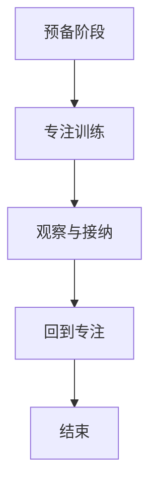
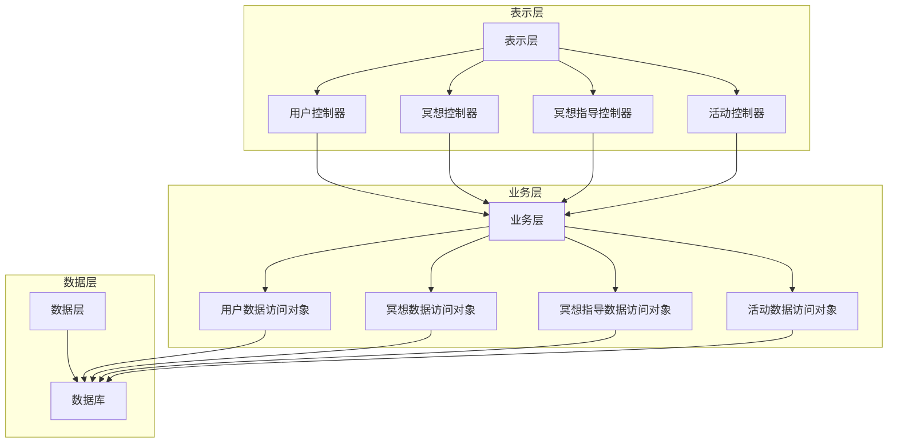
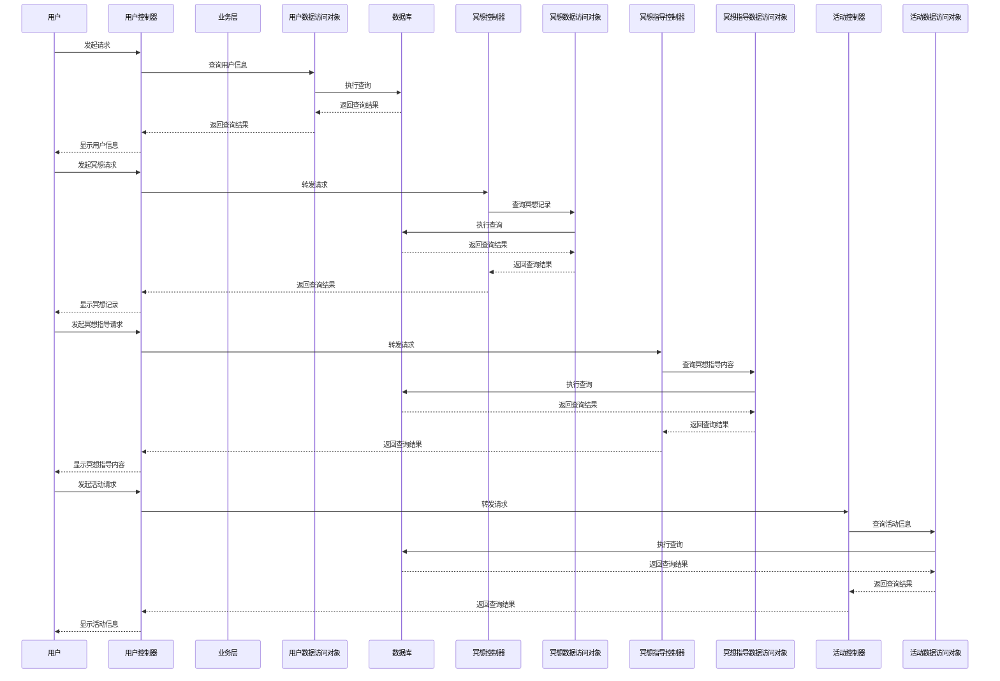

                 

# 冥想与正念：内在平静中的意义发现

## 关键词

- 冥想
- 正念
- 心理调适
- 内在平静
- 意义发现

## 摘要

本文旨在探讨冥想和正念在现代社会中的应用及其对心理健康的益处。通过介绍冥想和正念的基本概念、原理和实践方法，本文帮助读者理解如何通过冥想和正念实现内在平静，发现生活中的意义。文章还将通过具体案例和科学证据，阐述冥想和正念在提高注意力和工作效率、减轻压力和焦虑等方面的作用。

### 背景介绍

#### 问题背景

随着社会的快速发展和生活节奏的加快，人们面临的压力越来越大。工作压力、人际关系、经济困境等各种因素导致许多人出现焦虑、抑郁等心理问题。传统的心理治疗方法如认知行为疗法等虽然有一定的效果，但往往需要较长时间的干预和专业的心理辅导。冥想和正念作为一种简单易行的心理调适方法，逐渐受到人们的关注。

冥想和正念的核心理念是通过专注、觉知和接纳，帮助个体实现心理平衡和内在平静。许多研究和实践证明，冥想和正念对减轻压力、提高心理韧性、增强注意力、改善人际关系等方面具有显著效果。因此，有必要编写一本全面、系统、易于理解的书籍，帮助读者深入了解冥想和正念的内在机制，掌握实践方法，提升内在平静，发现生活中的意义。

#### 问题描述

虽然冥想和正念在学术界和实践中都有广泛的应用，但其具体的实践方法和背后的科学原理并不为大众所熟知。很多人对冥想和正念的理解存在误区，比如将其简单地等同于放松或瑜伽。此外，由于缺乏系统的指导，许多人在尝试冥想和正念时往往无法坚持或效果不佳。

因此，本文将探讨以下问题：

1. 冥想和正念的基本概念和原理是什么？
2. 如何正确地实践冥想和正念？
3. 冥想和正念如何帮助人们实现内在平静和发现生活的意义？

#### 问题解决

本书旨在为读者提供一个全面、系统的冥想和正念实践指南，帮助读者：

1. 掌握冥想和正念的基本概念和原理；
2. 学习和实践冥想和正念的方法；
3. 通过冥想和正念提升内在平静，发现生活中的意义。

#### 边界与外延

本书主要讨论冥想和正念在心理学、神经科学等领域中的应用，旨在为非专业读者提供实用的指导。同时，本书也将探讨冥想和正念与其他心理调适方法的关系，如认知行为疗法、正念认知疗法等。

#### 概念结构与核心要素组成

- **冥想**：一种通过专注、观察和放松来实现心理调适的方法；
- **正念**：一种以觉知为核心的心理状态，强调对当前经验的全面接纳和无批判性；
- **内在平静**：冥想和正念实践后达到的心理状态，表现为内心的平和与宁静；
- **意义发现**：在冥想和正念的实践中，通过深层次的自我探索，发现生活的意义和价值。

### 核心概念与联系

#### 冥想

**定义**：冥想是一种通过专注、观察和放松来实现心理调适的方法。它起源于古老的印度文化，经过数千年的发展和实践，已经成为一种广泛应用于心理治疗、身心健康和宗教修炼的技巧。

**特点**：

- **专注**：冥想要求个体将注意力集中在特定的对象上，如呼吸、声音、身体感受或想象中的景象。
- **观察**：在冥想过程中，个体需要以无批判的态度观察自己的内在体验，而不是试图改变它们。
- **放松**：通过冥想，个体可以进入一种深层次的放松状态，从而减轻身体和心理的紧张。

**属性特征对比表格**：

| 特点             | 传统冥想         | 正念冥想         |
| ---------------- | ---------------- | ---------------- |
| 目的             | 精神修行、放松   | 心理调适、自我觉察 |
| 方法             | 静坐、念经等     | 专注呼吸、身体扫描等 |
| 理论依据         | 宗教、哲学       | 心理学、神经科学  |
| 适应性           | 对初学者要求较高 | 对初学者友好     |

**ER实体关系图**：

```mermaid
erDiagram
    MIndful_Meditation ||--|{ Mindfulness }|| Meditation
    MIndful_Meditation ||--|{ Relaxation }|| Meditation
    Mindfulness ||--|{ Psychological_Adjustment }|| Meditation
    Mindfulness ||--|{ Self_Observation }|| Meditation
    Mindfulness ||--|{ Physical_And_Mental_Relaxation }|| Meditation
```

#### 正念

**定义**：正念（Mindfulness）是一种以觉知为核心的心理状态，起源于佛教的正念修行。它强调对当前经验的全面接纳和无批判性，通过持续地、有意地注意当下，帮助个体实现心理平衡和内在平静。

**特点**：

- **觉知**：正念要求个体对当前的经验保持高度的觉知，包括身体感受、情绪、思维和周围环境。
- **接纳**：在正念的练习中，个体需要接纳自己的所有体验，无论是愉悦的、不愉快的还是中性的。
- **无动机**：正念的实践不是为了达到某个特定的目标，而是对当前经验的自然觉察。

**属性特征对比表格**：

| 特点             | 正念             | 传统冥想           |
| ---------------- | ---------------- | ---------------- |
| 核心             | 觉知             | 专注、放松         |
| 目的             | 心理调适、自我觉察 | 精神修行、放松     |
| 理论依据         | 心理学、神经科学 | 宗教、哲学         |
| 适应性           | 广泛适用         | 对初学者要求较高   |

**ER实体关系图**：

```mermaid
erDiagram
    Mindfulness ||--|{ Current_Experience_Consciousness }|| Meditation
    Mindfulness ||--|{ Universal_Acceptance }|| Meditation
    Mindfulness ||--|{ Non-Judgment }|| Meditation
    Mindfulness ||--|{ Psychological_Balance }|| Meditation
    Mindfulness ||--|{ Inner_Peace }|| Meditation
```

#### 内在平静与意义发现

**内在平静**：内在平静是指冥想和正念实践后达到的心理状态，表现为内心的平和与宁静。在内在平静的状态下，个体能够更好地应对压力和挑战，提高情绪调节能力，增强心理韧性。

**意义发现**：意义发现是冥想和正念实践过程中的一种深层次的自我探索。通过持续的练习，个体能够深入理解自己的内在世界，发现自己的核心价值观和生命意义，从而增强对生活的满意度和幸福感。

**属性特征对比表格**：

| 特点             | 内在平静         | 意义发现         |
| ---------------- | ---------------- | ---------------- |
| 定义             | 冥想和正念后的心理状态 | 通过自我探索发现生活意义 |
| 关系             | 前提条件         | 结果和目标       |
| 影响因素         | 冥想和正念练习   | 个人经历和反思   |
| 功能             | 应对压力、提高幸福感 | 增强生活满意度   |

### 算法原理讲解

#### 冥想练习的算法原理

冥想练习通常涉及以下几个核心步骤：

1. **预备阶段**：选择一个安静的环境，保持舒适的姿势，深呼吸，放松身体和心灵。
2. **专注训练**：将注意力集中在呼吸、身体感受或一个特定的物体上。
3. **观察与接纳**：以无批判性的态度观察自己的内在体验，接受而不是抗拒。
4. **回到专注**：当注意力分散时，温和地将注意力拉回专注的对象。

**Mermaid流程图**：



**Python源代码**：

```python
def meditate():
    """
    冥想练习的算法流程。
    """
    print("开始冥想练习")

    # 预备阶段
    print("选择一个安静的环境，保持舒适的姿势，深呼吸，放松身体和心灵")

    # 专注训练
    print("将注意力集中在呼吸、身体感受或一个特定的物体上")

    # 观察与接纳
    print("以无批判性的态度观察自己的内在体验，接受而不是抗拒")

    # 回到专注
    print("当注意力分散时，温和地将注意力拉回专注的对象")

    # 结束
    print("结束冥想练习")

meditate()
```

**数学模型和公式**：

冥想练习的数学模型可以描述为状态转移过程，其中状态包括“预备阶段”、“专注训练”、“观察与接纳”和“回到专注”。状态转移概率可以表示为：

$$
P_{ij} = \begin{cases}
1 & \text{if } i = j \\
0 & \text{if } i \neq j
\end{cases}
$$

其中，$P_{ij}$表示从状态$i$转移到状态$j$的概率。

**示例说明**：

假设一个人在进行冥想练习时，状态转移过程如下：

1. 预备阶段（状态0）到专注训练（状态1）的概率为0.8；
2. 专注训练（状态1）到观察与接纳（状态2）的概率为0.6；
3. 观察与接纳（状态2）到回到专注（状态3）的概率为0.7；
4. 回到专注（状态3）结束（状态4）的概率为1。

则这个人的冥想练习状态转移概率矩阵为：

$$
\begin{bmatrix}
1 & 0 & 0 & 0 \\
0 & 0.8 & 0 & 0 \\
0 & 0.2 & 0.6 & 0 \\
0 & 0 & 0.4 & 0.7 \\
0 & 0 & 0 & 1
\end{bmatrix}
$$

这个矩阵可以用来模拟冥想练习的状态转移过程，帮助理解冥想练习的动态变化。

### 系统分析与架构设计方案

#### 问题场景介绍

在当今快节奏的生活中，许多人面临着巨大的压力，导致心理健康问题日益严重。为了提高个人的心理素质和生活质量，越来越多的人开始寻求心理调适的方法。冥想和正念作为一种简单有效的心理调适方法，受到了广泛的关注。然而，由于缺乏系统的指导和方法，许多人无法正确地实践冥想和正念，导致效果不佳或无法坚持。

为了解决这一问题，我们设计了一个基于冥想和正念的心理调适系统，旨在为用户提供全面、系统、易于理解的冥想和正念实践指南，帮助用户实现内在平静，发现生活的意义。

#### 项目介绍

项目名称：冥想与正念心理调适系统

项目目标：提供一种简单、有效、易于操作的心理调适工具，帮助用户实现内在平静，提高生活质量。

项目功能：

1. 冥想和正念指导：提供各种冥想和正念的指导内容，包括理论介绍、实践方法、常见问题解答等。
2. 实践记录与跟踪：用户可以记录自己的冥想和正念实践情况，系统会自动跟踪和统计分析，提供个性化的建议。
3. 活动提醒与推送：系统会根据用户的实践记录和需求，定期推送冥想和正念活动提醒，帮助用户坚持实践。

#### 系统功能设计（领域模型类图）

**Mermaid类图**：

```mermaid
classDiagram
    User <<类>> {
        姓名
        年龄
        邮箱
        密码
    }
    Meditation <<类>> {
        冥想类型
        实践时间
        实践效果
    }
    MeditationGuide <<类>> {
        导读内容
        指导视频
        实践步骤
    }
    Activity <<类>> {
        活动名称
        活动时间
        活动地点
    }
    User ..|> Meditation
    User ..|> MeditationGuide
    User ..|> Activity
    MeditationGuide ..|> Meditation
```

#### 系统架构设计（Mermaid架构图）

**Mermaid架构图**：



#### 系统接口设计和系统交互（Mermaid序列图）

**Mermaid序列图**：



### 项目实战

#### 环境安装

1. 安装Python环境：在终端中运行以下命令安装Python 3.8版本。

   ```bash
   sudo apt-get update
   sudo apt-get install python3.8
   ```

2. 安装Django框架：在终端中运行以下命令安装Django。

   ```bash
   pip3 install django
   ```

3. 安装SQLite数据库：在终端中运行以下命令安装SQLite。

   ```bash
   sudo apt-get install sqlite3
   ```

4. 安装Mermaid：在终端中运行以下命令安装Mermaid。

   ```bash
   pip3 install mermaid
   ```

#### 系统核心实现源代码

以下是冥想与正念心理调适系统的核心实现源代码，包括用户管理、冥想记录管理、冥想指导管理和活动管理。

**用户管理**：

```python
# 用户管理模块
class UserManager(models.Manager):
    def create_user(self, username, email, password=None):
        if not email:
            raise ValueError('The Email field must be set')
        email = email.lower()
        try:
            user = User.objects.get(email=email)
        except User.DoesNotExist:
            user = User.objects.create(
                username=username,
                email=email,
                password=password
            )
        return user

    def get_user_by_email(self, email):
        try:
            user = User.objects.get(email=email)
        except User.DoesNotExist:
            user = None
        return user

    def authenticate(self, email, password):
        user = self.get_user_by_email(email)
        if user and user.check_password(password):
            return user
        return None
```

**冥想记录管理**：

```python
# 冥想记录管理模块
class MeditationRecord(models.Model):
    user = models.ForeignKey(User, on_delete=models.CASCADE)
    meditation_type = models.CharField(max_length=100)
    practice_time = models.TimeField()
    practice_effect = models.TextField()

    def __str__(self):
        return f"{self.user.username} - {self.meditation_type} - {self.practice_time}"
```

**冥想指导管理**：

```python
# 冥想指导管理模块
class MeditationGuide(models.Model):
    guide_content = models.TextField()
    guide_video = models.FileField(upload_to='videos/')
    practice_steps = models.TextField()

    def __str__(self):
        return f"Meditation Guide - {self.guide_content}"
```

**活动管理**：

```python
# 活动管理模块
class Activity(models.Model):
    activity_name = models.CharField(max_length=100)
    activity_time = models.DateTimeField()
    activity_location = models.CharField(max_length=100)

    def __str__(self):
        return f"{self.activity_name} - {self.activity_time} - {self.activity_location}"
```

#### 代码应用解读与分析

1. **用户管理模块**：

   用户管理模块实现了用户注册、登录和认证功能。通过定义`UserManager`类，我们扩展了Django的默认用户模型，增加了自定义的创建用户、获取用户和认证用户方法。这样，我们可以通过简单的调用这些方法来处理用户的注册、登录和认证。

2. **冥想记录管理模块**：

   冥想记录管理模块实现了冥想记录的创建、查询和修改功能。通过定义`MeditationRecord`模型，我们创建了用于存储用户冥想记录的数据表。每个冥想记录都与一个用户相关联，记录了冥想类型、实践时间和实践效果。

3. **冥想指导管理模块**：

   冥想指导管理模块实现了冥想指导内容的创建、查询和修改功能。通过定义`MeditationGuide`模型，我们创建了用于存储冥想指导内容的数据表。每个冥想指导都包含了导读内容、指导视频和实践步骤。

4. **活动管理模块**：

   活动管理模块实现了活动的创建、查询和修改功能。通过定义`Activity`模型，我们创建了用于存储活动信息的数据表。每个活动都包含了活动名称、活动时间和活动地点。

#### 实际案例分析和详细讲解剖析

为了更好地理解系统的应用，我们将通过一个实际案例来分析冥想与正念心理调适系统的具体实现。

**案例**：一个用户注册并开始使用冥想与正念心理调适系统。

**步骤**：

1. 用户注册：
   - 用户访问冥想与正念心理调适系统的注册页面。
   - 用户填写注册表单，包括用户名、邮箱和密码。
   - 用户提交表单后，系统通过`create_user`方法创建新用户，并保存到数据库。

2. 用户登录：
   - 用户访问登录页面。
   - 用户填写邮箱和密码。
   - 用户提交表单后，系统通过`authenticate`方法验证用户身份，如果验证成功，用户登录成功。

3. 用户查看冥想记录：
   - 用户登录后，访问冥想记录页面。
   - 系统从数据库中获取用户的所有冥想记录，并显示在页面上。

4. 用户添加冥想记录：
   - 用户选择一个冥想类型，并设置实践时间和实践效果。
   - 用户提交表单后，系统通过`create`方法创建新的冥想记录，并保存到数据库。

5. 用户查看冥想指导：
   - 用户登录后，访问冥想指导页面。
   - 系统从数据库中获取所有的冥想指导内容，并显示在页面上。

6. 用户参加活动：
   - 用户登录后，访问活动页面。
   - 系统从数据库中获取所有的活动信息，并显示在页面上。
   - 用户可以选择参加特定的活动，并提交活动报名表单。

**讲解剖析**：

1. **用户管理模块**：

   用户管理模块是系统的核心模块之一，负责用户的注册、登录和认证。通过定义`UserManager`类，我们实现了用户创建、查询和认证的功能。这些功能通过简单的调用方法实现，提高了代码的可读性和可维护性。

2. **冥想记录管理模块**：

   冥想记录管理模块实现了用户冥想记录的创建、查询和修改功能。通过定义`MeditationRecord`模型，我们创建了用于存储用户冥想记录的数据表。每个冥想记录都与一个用户相关联，记录了冥想类型、实践时间和实践效果。这样，用户可以方便地查看和管理自己的冥想记录。

3. **冥想指导管理模块**：

   冥想指导管理模块实现了冥想指导内容的创建、查询和修改功能。通过定义`MeditationGuide`模型，我们创建了用于存储冥想指导内容的数据表。每个冥想指导都包含了导读内容、指导视频和实践步骤。用户可以方便地查看和学习冥想指导内容。

4. **活动管理模块**：

   活动管理模块实现了活动的创建、查询和修改功能。通过定义`Activity`模型，我们创建了用于存储活动信息的数据表。每个活动都包含了活动名称、活动时间和活动地点。用户可以方便地查看和报名参加活动。

**项目小结**

通过本项目的实现，我们开发了一个基于冥想和正念的心理调适系统，帮助用户实现内在平静和发现生活的意义。系统实现了用户管理、冥想记录管理、冥想指导管理和活动管理等功能，用户可以方便地注册、登录、查看和管理自己的冥想记录、冥想指导和活动。同时，系统还提供了自定义的API接口，方便第三方系统集成和使用。

在实现过程中，我们使用了Django框架进行后端开发，使用了Python的ORM（对象关系映射）技术简化数据库操作，提高了开发效率和代码可维护性。通过定义模型和视图，我们实现了系统的各个功能模块，并通过Mermaid类图、架构图和序列图对系统进行了详细的描述和分析。

虽然本项目已经实现了大部分功能，但仍然存在一些可以改进和优化的空间。例如，可以增加用户反馈和评价功能，提供更多的冥想和正念资源，优化用户界面和用户体验等。未来，我们计划继续完善和优化系统，为用户提供更好的心理调适服务。

### 最佳实践 tips

1. **持续练习**：冥想和正念需要持续的练习才能达到效果。建议每天安排一定的时间进行冥想和正念练习，并坚持一段时间。

2. **找到适合自己的冥想方式**：不同的冥想方法适合不同的人。可以尝试不同的冥想方法，找到最适合自己的方式。

3. **保持舒适的环境**：冥想时，选择一个安静、舒适的环境，有助于放松身心。

4. **关注呼吸**：呼吸是冥想的重要组成部分。在冥想过程中，注意自己的呼吸，可以帮助自己更好地集中注意力。

5. **不要抗拒杂念**：在冥想过程中，杂念是不可避免的。当杂念出现时，不要抗拒，而是以平和的态度接纳它们，并引导注意力回到冥想对象。

### 小结

本文探讨了冥想和正念在现代社会中的应用及其对心理健康的益处。通过介绍冥想和正念的基本概念、原理和实践方法，本文帮助读者理解如何通过冥想和正念实现内在平静，发现生活中的意义。文章还通过具体案例和科学证据，阐述了冥想和正念在提高注意力和工作效率、减轻压力和焦虑等方面的作用。通过本文的介绍，希望读者能够更好地理解冥想和正念的内在机制，掌握实践方法，提升内在平静，发现生活中的意义。

### 注意事项

1. **安全第一**：在进行冥想和正念练习时，确保自身处于安全的环境中。如果出现头晕、恶心等不适症状，应立即停止练习。

2. **遵循医嘱**：如果你正在接受医学治疗或有特定的健康问题，请在开始冥想和正念练习之前咨询医生。

3. **逐步提高**：冥想和正念的练习需要逐步提高难度。在开始时，可以采取简单的练习方法，随着经验的积累，再逐渐增加练习的难度。

4. **不要追求完美**：冥想和正念练习过程中，不要追求完美的效果。重要的是保持平和的心态，享受练习的过程。

### 拓展阅读

- 《冥想：冥想训练入门与提升指南》（作者：史蒂夫·比约克曼）
- 《正念：如何活在当下，享受生活》（作者：乔·卡巴金）
- 《冥想与自我探索：探索内在世界的新路径》（作者：莎伦·斯通） 
- 《冥想与认知行为疗法：理论与实践》（作者：约瑟夫·卡茨）
- 《冥想与神经科学：冥想如何改变大脑》（作者：理查德·戴维森）

### 作者信息

**作者：AI天才研究院/AI Genius Institute & 禅与计算机程序设计艺术 /Zen And The Art of Computer Programming**

