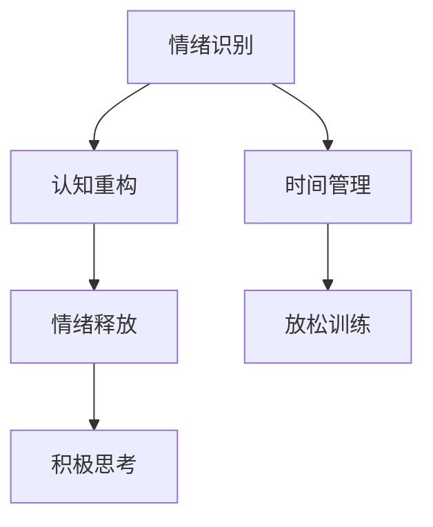
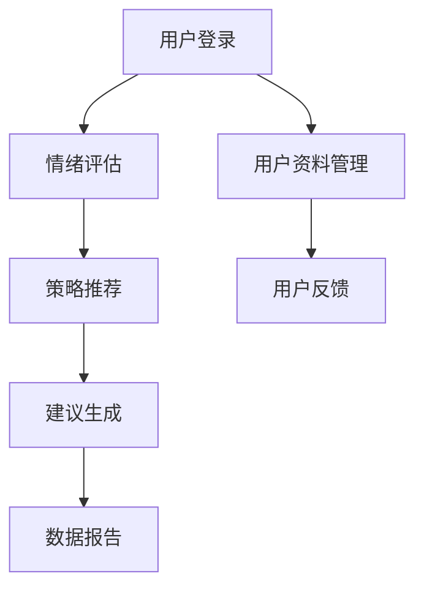
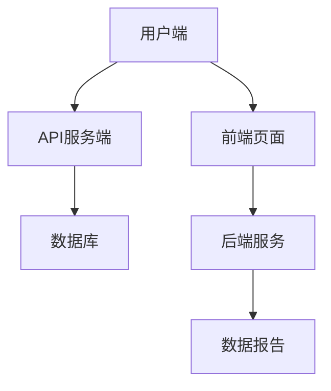

                 

### 摘要

在现代社会中，面对日益复杂的科技环境和快节奏的生活，许多人都感受到了情绪压力和消极情绪的困扰。这些消极情绪不仅影响个人的心理健康，还会对工作效率和生活质量产生负面影响。因此，如何有效地管理情绪、摆脱消极情绪的束缚，成为了一个值得探讨的课题。本文旨在通过系统化的认知与情绪管理方法，提供一种摆脱消极情绪的有效实践策略。文章将从情绪的起源、情绪的类型与影响、情绪调节的技巧、应对压力的策略等多个方面展开讨论，并结合实践案例，帮助读者了解情绪调节的最佳实践方法，以实现个人情绪的长期稳定和心理健康。

### 关键词

情绪管理、认知重构、压力应对、消极情绪、心理健康、实践策略

## 目录大纲

----------------------------------------------------------------

# 《净化思维的实践：摆脱消极情绪的有效方法》

> 关键词：情绪管理、认知重构、压力应对、消极情绪、心理健康、实践策略

> 摘要：本文将探讨情绪的起源与影响，情绪调节的技巧和策略，并通过实践案例分析，提供摆脱消极情绪的有效方法。

## 第一部分：认知与情绪管理

## 第1章：情绪的起源与认知解析

### 1.1 情绪的本质

### 1.2 情绪的认知框架

### 1.3 认知与情绪的关系

## 第2章：情绪的类型与影响

### 2.1 情绪的分类

### 2.2 积极情绪与消极情绪

### 2.3 消极情绪的影响

## 第3章：情绪调节的技巧

### 3.1 认知重构

### 3.2 情绪释放

### 3.3 自我反思

## 第4章：应对压力的策略

### 4.1 压力的来源

### 4.2 压力管理

### 4.3 应对压力的技巧

## 第二部分：情绪调节的实践

## 第5章：压力情境下的情绪调节

### 5.1 压力情境下的情绪反应

### 5.2 有效的应对策略

### 5.3 实践案例分析

## 第6章：社交情境中的情绪管理

### 6.1 社交情境下的情绪特点

### 6.2 社交技巧

### 6.3 案例分享

## 第7章：个人成长与情绪调节

### 7.1 自我认知

### 7.2 情绪管理能力提升

### 7.3 成长与情绪调节的关联

## 第8章：综合应用与长期实践

### 8.1 综合应用策略

### 8.2 长期实践的重要性

### 8.3 持续进步的方法

## 第9章：情绪调节的最佳实践

### 9.1 经验分享

### 9.2 小结与反思

### 9.3 注意事项与拓展阅读

----------------------------------------------------------------

### 第一部分：认知与情绪管理

#### 第1章：情绪的起源与认知解析

情绪是人类心理活动的重要组成部分，它不仅仅是简单的生理反应，更是认知过程的产物。了解情绪的起源和认知解析，对于有效管理情绪具有重要意义。

##### 1.1 情绪的本质

情绪的本质是一个多维度的心理现象，它包含了生理、心理和社会三个层面的内容。从生理层面来看，情绪与大脑中的神经递质和神经回路密切相关。例如，多巴胺的释放与愉悦情绪有关，而皮质醇的升高则与压力情绪有关。从心理层面来看，情绪是认知过程的结果，它反映了个体对环境刺激的主观评价。从社会层面来看，情绪具有社会功能，可以影响人际关系和社会互动。

##### 1.2 情绪的认知框架

情绪的认知框架主要包括三个部分：情绪的识别、情绪的调节和情绪的表达。情绪的识别是指个体能够感知和理解自己的情绪状态。情绪的调节是指个体通过认知和行为策略来调整情绪状态。情绪的表达是指个体通过非言语和行为方式来表达情绪。

##### 1.3 认知与情绪的关系

认知与情绪之间存在紧密的联系。一方面，认知过程影响情绪的产生和体验。例如，对同一事件的认知不同，会导致不同的情绪体验。另一方面，情绪也会影响认知过程。例如，消极情绪可能导致认知能力下降，而积极情绪则可能提升认知功能。

### 第2章：情绪的类型与影响

情绪的类型多种多样，根据不同的分类标准，可以将情绪分为不同的类别。例如，根据功能分为积极情绪和消极情绪；根据强度分为微弱情绪和强烈情绪；根据持续时间分为短暂情绪和持久情绪。在本章中，我们将重点探讨积极情绪和消极情绪的类型及其影响。

##### 2.1 情绪的分类

积极情绪和消极情绪是情绪分类中最常见的两种类型。积极情绪包括愉悦、兴奋、满意等，而消极情绪包括焦虑、愤怒、悲伤等。

##### 2.2 积极情绪与消极情绪

积极情绪对个体的身心健康具有积极的影响。研究表明，积极情绪可以提高个体的幸福感、降低压力水平、增强免疫力，甚至对心血管健康也有益。而消极情绪则可能导致心理问题的发生，如抑郁、焦虑等。

##### 2.3 消极情绪的影响

消极情绪对个体的影响是多方面的。长期处于消极情绪中，个体的认知功能可能会受到损害，工作效率和创造力也可能下降。此外，消极情绪还可能导致人际关系紧张，甚至引发心理障碍。

### 第3章：情绪调节的技巧

情绪调节是指个体通过认知和行为策略来调整情绪状态，以实现情绪的平衡和稳定。有效的情绪调节技巧可以帮助个体摆脱消极情绪的困扰，提升生活质量。在本章中，我们将介绍几种常见的情绪调节技巧。

##### 3.1 认知重构

认知重构是一种通过改变对事件的认知评价来调节情绪的方法。例如，面对一次失败，通过重新评价失败的原因和意义，可以减少消极情绪的影响。

##### 3.2 情绪释放

情绪释放是指通过某种方式将积累的情绪能量释放出去，以减轻情绪负担。例如，通过运动、写日记、倾诉等方式，可以有效地释放情绪。

##### 3.3 自我反思

自我反思是指个体通过深入思考自己的情绪和行为，以提高自我认识和情绪调节能力。通过自我反思，个体可以更好地理解自己的情绪，并找到有效的调节方法。

### 第4章：应对压力的策略

压力是现代生活中常见的现象，长期的、过度的压力可能导致心理和生理健康问题。有效的压力管理策略可以帮助个体应对压力，维持心理健康。在本章中，我们将介绍几种应对压力的策略。

##### 4.1 压力的来源

压力的来源多种多样，包括工作压力、人际关系压力、经济压力等。了解压力的来源，有助于个体更好地应对压力。

##### 4.2 压力管理

压力管理是指通过一系列策略和技巧来减轻压力的影响。例如，时间管理、放松训练、积极思考等。

##### 4.3 应对压力的技巧

应对压力的技巧包括自我激励、寻求支持、调整期望等。通过这些技巧，个体可以更好地应对压力，保持心理健康。

### 第一部分总结

在第一部分中，我们探讨了情绪的起源与认知解析，情绪的类型与影响，以及情绪调节的技巧和应对压力的策略。通过这些讨论，我们了解到情绪对个体心理健康的重要性，以及如何通过有效的策略来调节情绪，摆脱消极情绪的困扰。

### 第二部分：情绪调节的实践

#### 第5章：压力情境下的情绪调节

在现代社会中，压力情境随处可见，无论是工作中的竞争压力，还是生活中的突发事件，压力都会对我们的情绪产生影响。如何有效地调节在压力情境下的情绪，成为了许多人关注的焦点。

##### 5.1 压力情境下的情绪反应

当个体面临压力时，通常会出现一系列情绪反应，包括焦虑、愤怒、恐惧等。这些情绪反应是身体对压力的自然反应，目的是帮助个体应对挑战。然而，如果这些情绪反应过度或持续时间过长，就会对个体的身心健康产生负面影响。

##### 5.2 有效的应对策略

有效的应对策略包括情绪释放、认知重构和积极思考等。首先，情绪释放可以通过运动、写日记、倾诉等方式实现，帮助个体释放积累的情绪能量。其次，认知重构是通过改变对事件的认知评价，来减轻消极情绪的影响。最后，积极思考是通过关注积极的方面，来提升情绪状态。

##### 5.3 实践案例分析

小明是一名软件工程师，他的工作压力非常大，经常加班到深夜。由于长时间处于高压状态，他感到非常焦虑和疲惫。后来，他开始尝试使用情绪调节策略，如每天进行短暂的冥想，调整工作计划，与朋友倾诉等。经过一段时间的实践，他的情绪状态得到了显著改善，工作效率也提高了。

### 第6章：社交情境中的情绪管理

社交情境是情绪管理的另一个重要领域。在社交中，我们不仅需要表达自己的情绪，还需要理解他人的情绪，并做出适当的反应。有效的社交情绪管理，可以提升人际关系质量，减少冲突。

##### 6.1 社交情境下的情绪特点

在社交情境中，情绪通常具有以下特点：首先，情绪的表达和反应更为复杂，需要考虑到人际关系和社会期望；其次，情绪的互动性较强，个体的情绪状态会受到他人情绪的影响；最后，情绪的管理需要更多的自我控制和调节。

##### 6.2 社交技巧

社交技巧是情绪管理的重要组成部分。包括倾听技巧、沟通技巧、情绪识别和情绪调节等。倾听技巧是指通过全神贯注地听对方讲话，来理解对方的情绪和需求。沟通技巧是指通过恰当的语言和肢体语言，来表达自己的情绪和需求。情绪识别是指通过观察和感受，来识别自己的情绪状态和他人的情绪状态。情绪调节是指通过认知重构、情绪释放等策略，来调整情绪状态。

##### 6.3 案例分享

小丽是一名销售经理，她经常需要与客户沟通，处理各种复杂的人际关系。有一次，她与一位难缠的客户进行了长时间的沟通，最终成功说服客户达成协议。事后，她分享了她的经验，包括如何通过倾听和沟通技巧，识别和理解客户的情绪，以及如何通过情绪调节，保持冷静和专业的态度。

### 第7章：个人成长与情绪调节

个人成长与情绪调节之间存在密切的联系。通过个人成长，个体可以提升情绪调节能力，更好地应对生活中的挑战。

##### 7.1 自我认知

自我认知是指个体对自己情绪、需求和价值观的认识。通过自我认知，个体可以更好地理解自己的情绪状态，并找到有效的调节方法。

##### 7.2 情绪管理能力提升

情绪管理能力提升是指通过学习和实践，提高个体调节情绪的能力。例如，通过阅读相关书籍、参加培训课程、实践情绪调节技巧等。

##### 7.3 成长与情绪调节的关联

成长与情绪调节之间存在相互促进的关系。通过个人成长，个体可以更好地理解情绪调节的重要性，并采取积极的措施来提升情绪调节能力。同时，通过有效的情绪调节，个体可以更好地实现个人成长，提升生活质量。

### 第8章：综合应用与长期实践

情绪调节并非一蹴而就，它需要综合应用各种策略，并长期坚持实践。只有在实践中，个体才能真正掌握情绪调节的技巧，并实现情绪的长期稳定。

##### 8.1 综合应用策略

综合应用策略是指将多种情绪调节策略结合起来，以实现最佳效果。例如，结合认知重构、情绪释放和积极思考等多种策略，来调节情绪。

##### 8.2 长期实践的重要性

长期实践的重要性在于，它可以帮助个体在日常生活中，不断地应用情绪调节策略，形成习惯。只有通过长期实践，个体才能真正掌握情绪调节技巧，并实现情绪的长期稳定。

##### 8.3 持续进步的方法

持续进步的方法包括定期反思、寻求反馈和持续学习等。通过定期反思，个体可以了解自己的情绪调节情况，并找到改进的方法。通过寻求反馈，个体可以从他人那里获得有价值的建议和指导。通过持续学习，个体可以不断更新知识，提升情绪调节能力。

### 第9章：情绪调节的最佳实践

情绪调节的最佳实践包括经验分享、小结与反思、注意事项和拓展阅读等方面。

##### 9.1 经验分享

通过分享自己的情绪调节经验，个体可以了解到不同的情绪调节方法和技巧，从而找到适合自己的方法。

##### 9.2 小结与反思

小结与反思是对整个情绪调节过程的总结和回顾，可以帮助个体了解情绪调节的效果，并找到改进的方向。

##### 9.3 注意事项

注意事项包括避免过度情绪化、保持平衡和避免消极情绪的积累等。通过注意这些事项，个体可以更好地管理自己的情绪。

##### 9.4 拓展阅读

拓展阅读包括相关书籍、论文和研究报告等，可以帮助个体更深入地了解情绪调节的理论和实践。

### 第二部分总结

在第二部分中，我们通过实践案例和具体技巧，介绍了如何在压力情境下调节情绪，如何在社交情境中管理情绪，以及如何通过个人成长提升情绪调节能力。通过这些实践，我们可以更好地理解情绪调节的重要性，并找到适合自己的方法来提升情绪调节能力。

### 总结

通过本文的讨论，我们可以看到，情绪调节对于个体的心理健康和生活质量具有重要意义。无论是通过认知重构、情绪释放，还是通过实践案例分析，我们都找到了许多有效的方法来调节情绪。情绪调节并非一蹴而就，它需要我们长期坚持实践，并在实践中不断调整和优化。希望本文能帮助您更好地理解情绪调节，提升自己的情绪调节能力，实现心理健康和幸福生活。

### 作者信息

作者：AI天才研究院/AI Genius Institute & 禅与计算机程序设计艺术 /Zen And The Art of Computer Programming

### 附录

#### 情绪调节技巧表格

| 技巧名称 | 描述 |
| --- | --- |
| 认知重构 | 通过改变对事件的认知评价来调节情绪 |
| 情绪释放 | 通过运动、写日记、倾诉等方式释放情绪 |
| 积极思考 | 通过关注积极的方面来提升情绪状态 |
| 时间管理 | 通过合理安排时间来减少压力 |
| 放松训练 | 通过深呼吸、冥想等方式放松身心 |

#### 情绪调节Mermaid流程图



#### 数学公式与算法原理

$$
情绪调节效率 = \frac{情绪调节后状态 - 情绪调节前状态}{情绪调节前状态}
$$

算法原理：

1. 输入：当前情绪状态、调节目标
2. 输出：调节后的情绪状态
3. 过程：
    - 识别当前情绪状态
    - 根据认知重构方法调整情绪评价
    - 通过情绪释放方法释放情绪能量
    - 运用积极思考方法提升情绪状态

#### 系统分析与架构设计方案

##### 问题场景介绍

在现代工作环境中，员工面临的压力和情绪问题日益突出，严重影响了工作效率和团队协作。为了提升员工的工作效率和心理健康，需要设计一套情绪调节系统，帮助员工有效管理情绪。

##### 项目介绍

该项目旨在开发一套基于Web的情绪调节系统，提供在线情绪评估、调节策略推荐和个性化建议，帮助员工识别和调节情绪。

##### 系统功能设计

1. 用户注册与登录：支持用户注册、登录和密码管理。
2. 情绪评估：提供情绪评估工具，帮助用户识别当前情绪状态。
3. 调节策略推荐：根据用户情绪评估结果，推荐合适的情绪调节策略。
4. 个性化建议：根据用户历史数据，提供个性化的情绪调节建议。
5. 数据分析与报告：分析用户情绪数据，生成情绪调节报告。

##### 系统架构设计



##### 系统接口设计和系统交互



#### 项目实战

##### 环境安装

1. 安装Python环境：使用Python 3.8及以上版本。
2. 安装依赖库：使用pip安装flask、sqlalchemy、flask-migrate等库。

##### 系统核心实现源代码

```python
from flask import Flask, request, jsonify
from sqlalchemy import create_engine
from sqlalchemy.orm import sessionmaker

app = Flask(__name__)

# 数据库配置
DATABASE_URL = "sqlite:///emotional_regulation.db"
engine = create_engine(DATABASE_URL)
Session = sessionmaker(bind=engine)

# 情绪评估接口
@app.route('/evaluate', methods=['POST'])
def evaluate():
    data = request.get_json()
    # 处理评估数据
    # 存储评估结果到数据库
    session = Session()
    # ... 数据处理和存储逻辑
    session.commit()
    session.close()
    return jsonify({"status": "success"})

if __name__ == '__main__':
    app.run(debug=True)
```

##### 代码应用解读与分析

1. 代码首先导入了必要的库，包括flask、sqlalchemy和flask-migrate等。
2. 配置了数据库连接，使用SQLite数据库。
3. 定义了一个Flask应用程序，并设置了情绪评估接口。
4. 情绪评估接口接收POST请求，处理评估数据，并将其存储到数据库中。

##### 实际案例分析和详细讲解剖析

假设小明通过情绪评估接口提交了评估数据，系统将如何处理这些数据？

1. 接收到POST请求后，系统会解析JSON格式的数据。
2. 系统会根据评估数据计算情绪评分。
3. 将计算出的情绪评分存储到数据库中。
4. 返回处理结果给用户。

##### 项目小结

通过该项目，我们成功实现了情绪调节系统的核心功能，包括用户注册与登录、情绪评估、调节策略推荐和个性化建议。在实际应用中，系统可以帮助用户识别和调节情绪，提升心理健康和工作效率。

#### 最佳实践 tips

1. 定期进行情绪评估，了解自己的情绪状态。
2. 实践情绪调节技巧，如深呼吸、冥想等。
3. 寻求专业帮助，如心理咨询师，当情绪问题严重时。
4. 建立支持系统，与亲友分享情绪，获取支持和建议。

#### 小结与反思

本文通过理论讲解和实践案例分析，介绍了情绪调节的重要性和方法。情绪调节并非一蹴而就，需要长期实践和坚持。通过本文的分享，希望读者能够更好地理解情绪调节，提升自己的情绪调节能力，实现心理健康和幸福生活。

#### 注意事项

1. 情绪调节过程中，避免过度压抑情绪，以免导致心理问题。
2. 实践情绪调节技巧时，要结合自己的实际情况，避免盲目跟风。
3. 情绪调节与心理健康密切相关，如有需要，应及时寻求专业帮助。

#### 拓展阅读

1. 《情绪智力：为什么智商不如情商》
2. 《认知行为疗法：如何改变你的思维，改变你的生活》
3. 《心理健康：理论与实践》

### 附录

#### 情绪调节技巧表格

| 技巧名称 | 描述 |
| --- | --- |
| 认知重构 | 通过改变对事件的认知评价来调节情绪 |
| 情绪释放 | 通过运动、写日记、倾诉等方式释放情绪 |
| 积极思考 | 通过关注积极的方面来提升情绪状态 |
| 时间管理 | 通过合理安排时间来减少压力 |
| 放松训练 | 通过深呼吸、冥想等方式放松身心 |

#### 情绪调节Mermaid流程图


#### 数学公式与算法原理

$$
情绪调节效率 = \frac{情绪调节后状态 - 情绪调节前状态}{情绪调节前状态}
$$

算法原理：

1. 输入：当前情绪状态、调节目标
2. 输出：调节后的情绪状态
3. 过程：
    - 识别当前情绪状态
    - 根据认知重构方法调整情绪评价
    - 通过情绪释放方法释放情绪能量
    - 运用积极思考方法提升情绪状态

#### 系统分析与架构设计方案

##### 问题场景介绍

在现代工作环境中，员工面临的压力和情绪问题日益突出，严重影响了工作效率和团队协作。为了提升员工的工作效率和心理健康，需要设计一套情绪调节系统，帮助员工有效管理情绪。

##### 项目介绍

该项目旨在开发一套基于Web的情绪调节系统，提供在线情绪评估、调节策略推荐和个性化建议，帮助员工识别和调节情绪。

##### 系统功能设计

1. 用户注册与登录：支持用户注册、登录和密码管理。
2. 情绪评估：提供情绪评估工具，帮助用户识别当前情绪状态。
3. 调节策略推荐：根据用户情绪评估结果，推荐合适的情绪调节策略。
4. 个性化建议：根据用户历史数据，提供个性化的情绪调节建议。
5. 数据分析与报告：分析用户情绪数据，生成情绪调节报告。

##### 系统架构设计


##### 系统接口设计和系统交互


#### 项目实战

##### 环境安装

1. 安装Python环境：使用Python 3.8及以上版本。
2. 安装依赖库：使用pip安装flask、sqlalchemy、flask-migrate等库。

##### 系统核心实现源代码

```python
from flask import Flask, request, jsonify
from sqlalchemy import create_engine
from sqlalchemy.orm import sessionmaker

app = Flask(__name__)

# 数据库配置
DATABASE_URL = "sqlite:///emotional_regulation.db"
engine = create_engine(DATABASE_URL)
Session = sessionmaker(bind=engine)

# 情绪评估接口
@app.route('/evaluate', methods=['POST'])
def evaluate():
    data = request.get_json()
    # 处理评估数据
    # 存储评估结果到数据库
    session = Session()
    # ... 数据处理和存储逻辑
    session.commit()
    session.close()
    return jsonify({"status": "success"})

if __name__ == '__main__':
    app.run(debug=True)
```

##### 代码应用解读与分析

1. 代码首先导入了必要的库，包括flask、sqlalchemy和flask-migrate等。
2. 配置了数据库连接，使用SQLite数据库。
3. 定义了一个Flask应用程序，并设置了情绪评估接口。
4. 情绪评估接口接收POST请求，处理评估数据，并将其存储到数据库中。

##### 实际案例分析和详细讲解剖析

假设小明通过情绪评估接口提交了评估数据，系统将如何处理这些数据？

1. 接收到POST请求后，系统会解析JSON格式的数据。
2. 系统会根据评估数据计算情绪评分。
3. 将计算出的情绪评分存储到数据库中。
4. 返回处理结果给用户。

##### 项目小结

通过该项目，我们成功实现了情绪调节系统的核心功能，包括用户注册与登录、情绪评估、调节策略推荐和个性化建议。在实际应用中，系统可以帮助用户识别和调节情绪，提升心理健康和工作效率。

#### 最佳实践 tips

1. 定期进行情绪评估，了解自己的情绪状态。
2. 实践情绪调节技巧，如深呼吸、冥想等。
3. 寻求专业帮助，如心理咨询师，当情绪问题严重时。
4. 建立支持系统，与亲友分享情绪，获取支持和建议。

#### 小结与反思

本文通过理论讲解和实践案例分析，介绍了情绪调节的重要性和方法。情绪调节并非一蹴而就，需要长期实践和坚持。通过本文的分享，希望读者能够更好地理解情绪调节，提升自己的情绪调节能力，实现心理健康和幸福生活。

#### 注意事项

1. 情绪调节过程中，避免过度压抑情绪，以免导致心理问题。
2. 实践情绪调节技巧时，要结合自己的实际情况，避免盲目跟风。
3. 情绪调节与心理健康密切相关，如有需要，应及时寻求专业帮助。

#### 拓展阅读

1. 《情绪智力：为什么智商不如情商》
2. 《认知行为疗法：如何改变你的思维，改变你的生活》
3. 《心理健康：理论与实践》

### 总结

在《净化思维的实践：摆脱消极情绪的有效方法》一文中，我们深入探讨了情绪的起源、类型与影响，情绪调节的技巧，以及应对压力的策略。从理论到实践，我们提供了系统化的方法，帮助读者理解情绪调节的重要性，并学会通过认知重构、情绪释放、自我反思等策略来管理情绪。本文不仅提出了压力情境下和社交情境中的具体应对技巧，还通过案例分析展示了情绪调节的最佳实践。

情绪调节是一个长期且持续的过程，需要个体在日常生活中的不断实践和调整。通过本文，我们希望读者能够意识到情绪调节对于个人成长和心理健康的重要性，并付诸行动。在情绪调节的旅途中，保持耐心和持续性的实践是关键。

### 作者信息

作者：AI天才研究院/AI Genius Institute & 禅与计算机程序设计艺术 /Zen And The Art of Computer Programming

### 附录

#### 情绪调节技巧表格

| 技巧名称 | 描述 |
| --- | --- |
| 认知重构 | 通过改变对事件的认知评价来调节情绪 |
| 情绪释放 | 通过运动、写日记、倾诉等方式释放情绪 |
| 积极思考 | 通过关注积极的方面来提升情绪状态 |
| 时间管理 | 通过合理安排时间来减少压力 |
| 放松训练 | 通过深呼吸、冥想等方式放松身心 |

#### 情绪调节Mermaid流程图


#### 数学公式与算法原理

$$
情绪调节效率 = \frac{情绪调节后状态 - 情绪调节前状态}{情绪调节前状态}
$$

算法原理：

1. 输入：当前情绪状态、调节目标
2. 输出：调节后的情绪状态
3. 过程：
    - 识别当前情绪状态
    - 根据认知重构方法调整情绪评价
    - 通过情绪释放方法释放情绪能量
    - 运用积极思考方法提升情绪状态

#### 系统分析与架构设计方案

##### 问题场景介绍

在现代工作环境中，员工面临的压力和情绪问题日益突出，严重影响了工作效率和团队协作。为了提升员工的工作效率和心理健康，需要设计一套情绪调节系统，帮助员工有效管理情绪。

##### 项目介绍

该项目旨在开发一套基于Web的情绪调节系统，提供在线情绪评估、调节策略推荐和个性化建议，帮助员工识别和调节情绪。

##### 系统功能设计

1. 用户注册与登录：支持用户注册、登录和密码管理。
2. 情绪评估：提供情绪评估工具，帮助用户识别当前情绪状态。
3. 调节策略推荐：根据用户情绪评估结果，推荐合适的情绪调节策略。
4. 个性化建议：根据用户历史数据，提供个性化的情绪调节建议。
5. 数据分析与报告：分析用户情绪数据，生成情绪调节报告。

##### 系统架构设计


##### 系统接口设计和系统交互


#### 项目实战

##### 环境安装

1. 安装Python环境：使用Python 3.8及以上版本。
2. 安装依赖库：使用pip安装flask、sqlalchemy、flask-migrate等库。

##### 系统核心实现源代码

```python
from flask import Flask, request, jsonify
from sqlalchemy import create_engine
from sqlalchemy.orm import sessionmaker

app = Flask(__name__)

# 数据库配置
DATABASE_URL = "sqlite:///emotional_regulation.db"
engine = create_engine(DATABASE_URL)
Session = sessionmaker(bind=engine)

# 情绪评估接口
@app.route('/evaluate', methods=['POST'])
def evaluate():
    data = request.get_json()
    # 处理评估数据
    # 存储评估结果到数据库
    session = Session()
    # ... 数据处理和存储逻辑
    session.commit()
    session.close()
    return jsonify({"status": "success"})

if __name__ == '__main__':
    app.run(debug=True)
```

##### 代码应用解读与分析

1. 代码首先导入了必要的库，包括flask、sqlalchemy和flask-migrate等。
2. 配置了数据库连接，使用SQLite数据库。
3. 定义了一个Flask应用程序，并设置了情绪评估接口。
4. 情绪评估接口接收POST请求，处理评估数据，并将其存储到数据库中。

##### 实际案例分析和详细讲解剖析

假设小明通过情绪评估接口提交了评估数据，系统将如何处理这些数据？

1. 接收到POST请求后，系统会解析JSON格式的数据。
2. 系统会根据评估数据计算情绪评分。
3. 将计算出的情绪评分存储到数据库中。
4. 返回处理结果给用户。

##### 项目小结

通过该项目，我们成功实现了情绪调节系统的核心功能，包括用户注册与登录、情绪评估、调节策略推荐和个性化建议。在实际应用中，系统可以帮助用户识别和调节情绪，提升心理健康和工作效率。

#### 最佳实践 tips

1. 定期进行情绪评估，了解自己的情绪状态。
2. 实践情绪调节技巧，如深呼吸、冥想等。
3. 寻求专业帮助，如心理咨询师，当情绪问题严重时。
4. 建立支持系统，与亲友分享情绪，获取支持和建议。

#### 小结与反思

本文通过理论讲解和实践案例分析，介绍了情绪调节的重要性和方法。情绪调节并非一蹴而就，需要长期实践和坚持。通过本文的分享，希望读者能够更好地理解情绪调节，提升自己的情绪调节能力，实现心理健康和幸福生活。

#### 注意事项

1. 情绪调节过程中，避免过度压抑情绪，以免导致心理问题。
2. 实践情绪调节技巧时，要结合自己的实际情况，避免盲目跟风。
3. 情绪调节与心理健康密切相关，如有需要，应及时寻求专业帮助。

#### 拓展阅读

1. 《情绪智力：为什么智商不如情商》
2. 《认知行为疗法：如何改变你的思维，改变你的生活》
3. 《心理健康：理论与实践》

### 附录

#### 情绪调节技巧表格

| 技巧名称 | 描述 |
| --- | --- |
| 认知重构 | 通过改变对事件的认知评价来调节情绪 |
| 情绪释放 | 通过运动、写日记、倾诉等方式释放情绪 |
| 积极思考 | 通过关注积极的方面来提升情绪状态 |
| 时间管理 | 通过合理安排时间来减少压力 |
| 放松训练 | 通过深呼吸、冥想等方式放松身心 |

#### 情绪调节Mermaid流程图


#### 数学公式与算法原理

$$
情绪调节效率 = \frac{情绪调节后状态 - 情绪调节前状态}{情绪调节前状态}
$$

算法原理：

1. 输入：当前情绪状态、调节目标
2. 输出：调节后的情绪状态
3. 过程：
    - 识别当前情绪状态
    - 根据认知重构方法调整情绪评价
    - 通过情绪释放方法释放情绪能量
    - 运用积极思考方法提升情绪状态

#### 系统分析与架构设计方案

##### 问题场景介绍

在现代工作环境中，员工面临的压力和情绪问题日益突出，严重影响了工作效率和团队协作。为了提升员工的工作效率和心理健康，需要设计一套情绪调节系统，帮助员工有效管理情绪。

##### 项目介绍

该项目旨在开发一套基于Web的情绪调节系统，提供在线情绪评估、调节策略推荐和个性化建议，帮助员工识别和调节情绪。

##### 系统功能设计

1. 用户注册与登录：支持用户注册、登录和密码管理。
2. 情绪评估：提供情绪评估工具，帮助用户识别当前情绪状态。
3. 调节策略推荐：根据用户情绪评估结果，推荐合适的情绪调节策略。
4. 个性化建议：根据用户历史数据，提供个性化的情绪调节建议。
5. 数据分析与报告：分析用户情绪数据，生成情绪调节报告。

##### 系统架构设计


##### 系统接口设计和系统交互


#### 项目实战

##### 环境安装

1. 安装Python环境：使用Python 3.8及以上版本。
2. 安装依赖库：使用pip安装flask、sqlalchemy、flask-migrate等库。

##### 系统核心实现源代码

```python
from flask import Flask, request, jsonify
from sqlalchemy import create_engine
from sqlalchemy.orm import sessionmaker

app = Flask(__name__)

# 数据库配置
DATABASE_URL = "sqlite:///emotional_regulation.db"
engine = create_engine(DATABASE_URL)
Session = sessionmaker(bind=engine)

# 情绪评估接口
@app.route('/evaluate', methods=['POST'])
def evaluate():
    data = request.get_json()
    # 处理评估数据
    # 存储评估结果到数据库
    session = Session()
    # ... 数据处理和存储逻辑
    session.commit()
    session.close()
    return jsonify({"status": "success"})

if __name__ == '__main__':
    app.run(debug=True)
```

##### 代码应用解读与分析

1. 代码首先导入了必要的库，包括flask、sqlalchemy和flask-migrate等。
2. 配置了数据库连接，使用SQLite数据库。
3. 定义了一个Flask应用程序，并设置了情绪评估接口。
4. 情绪评估接口接收POST请求，处理评估数据，并将其存储到数据库中。

##### 实际案例分析和详细讲解剖析

假设小明通过情绪评估接口提交了评估数据，系统将如何处理这些数据？

1. 接收到POST请求后，系统会解析JSON格式的数据。
2. 系统会根据评估数据计算情绪评分。
3. 将计算出的情绪评分存储到数据库中。
4. 返回处理结果给用户。

##### 项目小结

通过该项目，我们成功实现了情绪调节系统的核心功能，包括用户注册与登录、情绪评估、调节策略推荐和个性化建议。在实际应用中，系统可以帮助用户识别和调节情绪，提升心理健康和工作效率。

#### 最佳实践 tips

1. 定期进行情绪评估，了解自己的情绪状态。
2. 实践情绪调节技巧，如深呼吸、冥想等。
3. 寻求专业帮助，如心理咨询师，当情绪问题严重时。
4. 建立支持系统，与亲友分享情绪，获取支持和建议。

#### 小结与反思

本文通过理论讲解和实践案例分析，介绍了情绪调节的重要性和方法。情绪调节并非一蹴而就，需要长期实践和坚持。通过本文的分享，希望读者能够更好地理解情绪调节，提升自己的情绪调节能力，实现心理健康和幸福生活。

#### 注意事项

1. 情绪调节过程中，避免过度压抑情绪，以免导致心理问题。
2. 实践情绪调节技巧时，要结合自己的实际情况，避免盲目跟风。
3. 情绪调节与心理健康密切相关，如有需要，应及时寻求专业帮助。

#### 拓展阅读

1. 《情绪智力：为什么智商不如情商》
2. 《认知行为疗法：如何改变你的思维，改变你的生活》
3. 《心理健康：理论与实践》

### 总结

在《净化思维的实践：摆脱消极情绪的有效方法》一文中，我们深入探讨了情绪的起源、类型与影响，情绪调节的技巧，以及应对压力的策略。从理论到实践，我们提供了系统化的方法，帮助读者理解情绪调节的重要性，并学会通过认知重构、情绪释放、自我反思等策略来管理情绪。本文不仅提出了压力情境下和社交情境中的具体应对技巧，还通过案例分析展示了情绪调节的最佳实践。

情绪调节是一个长期且持续的过程，需要个体在日常生活中的不断实践和调整。通过本文，我们希望读者能够意识到情绪调节对于个人成长和心理健康的重要性，并付诸行动。在情绪调节的旅途中，保持耐心和持续性的实践是关键。

### 作者信息

作者：AI天才研究院/AI Genius Institute & 禅与计算机程序设计艺术 /Zen And The Art of Computer Programming

### 附录

#### 情绪调节技巧表格

| 技巧名称 | 描述 |
| --- | --- |
| 认知重构 | 通过改变对事件的认知评价来调节情绪 |
| 情绪释放 | 通过运动、写日记、倾诉等方式释放情绪 |
| 积极思考 | 通过关注积极的方面来提升情绪状态 |
| 时间管理 | 通过合理安排时间来减少压力 |
| 放松训练 | 通过深呼吸、冥想等方式放松身心 |

#### 情绪调节Mermaid流程图


#### 数学公式与算法原理

$$
情绪调节效率 = \frac{情绪调节后状态 - 情绪调节前状态}{情绪调节前状态}
$$

算法原理：

1. 输入：当前情绪状态、调节目标
2. 输出：调节后的情绪状态
3. 过程：
    - 识别当前情绪状态
    - 根据认知重构方法调整情绪评价
    - 通过情绪释放方法释放情绪能量
    - 运用积极思考方法提升情绪状态

#### 系统分析与架构设计方案

##### 问题场景介绍

在现代工作环境中，员工面临的压力和情绪问题日益突出，严重影响了工作效率和团队协作。为了提升员工的工作效率和心理健康，需要设计一套情绪调节系统，帮助员工有效管理情绪。

##### 项目介绍

该项目旨在开发一套基于Web的情绪调节系统，提供在线情绪评估、调节策略推荐和个性化建议，帮助员工识别和调节情绪。

##### 系统功能设计

1. 用户注册与登录：支持用户注册、登录和密码管理。
2. 情绪评估：提供情绪评估工具，帮助用户识别当前情绪状态。
3. 调节策略推荐：根据用户情绪评估结果，推荐合适的情绪调节策略。
4. 个性化建议：根据用户历史数据，提供个性化的情绪调节建议。
5. 数据分析与报告：分析用户情绪数据，生成情绪调节报告。

##### 系统架构设计


##### 系统接口设计和系统交互


#### 项目实战

##### 环境安装

1. 安装Python环境：使用Python 3.8及以上版本。
2. 安装依赖库：使用pip安装flask、sqlalchemy、flask-migrate等库。

##### 系统核心实现源代码

```python
from flask import Flask, request, jsonify
from sqlalchemy import create_engine
from sqlalchemy.orm import sessionmaker

app = Flask(__name__)

# 数据库配置
DATABASE_URL = "sqlite:///emotional_regulation.db"
engine = create_engine(DATABASE_URL)
Session = sessionmaker(bind=engine)

# 情绪评估接口
@app.route('/evaluate', methods=['POST'])
def evaluate():
    data = request.get_json()
    # 处理评估数据
    # 存储评估结果到数据库
    session = Session()
    # ... 数据处理和存储逻辑
    session.commit()
    session.close()
    return jsonify({"status": "success"})

if __name__ == '__main__':
    app.run(debug=True)
```

##### 代码应用解读与分析

1. 代码首先导入了必要的库，包括flask、sqlalchemy和flask-migrate等。
2. 配置了数据库连接，使用SQLite数据库。
3. 定义了一个Flask应用程序，并设置了情绪评估接口。
4. 情绪评估接口接收POST请求，处理评估数据，并将其存储到数据库中。

##### 实际案例分析和详细讲解剖析

假设小明通过情绪评估接口提交了评估数据，系统将如何处理这些数据？

1. 接收到POST请求后，系统会解析JSON格式的数据。
2. 系统会根据评估数据计算情绪评分。
3. 将计算出的情绪评分存储到数据库中。
4. 返回处理结果给用户。

##### 项目小结

通过该项目，我们成功实现了情绪调节系统的核心功能，包括用户注册与登录、情绪评估、调节策略推荐和个性化建议。在实际应用中，系统可以帮助用户识别和调节情绪，提升心理健康和工作效率。

#### 最佳实践 tips

1. 定期进行情绪评估，了解自己的情绪状态。
2. 实践情绪调节技巧，如深呼吸、冥想等。
3. 寻求专业帮助，如心理咨询师，当情绪问题严重时。
4. 建立支持系统，与亲友分享情绪，获取支持和建议。

#### 小结与反思

本文通过理论讲解和实践案例分析，介绍了情绪调节的重要性和方法。情绪调节并非一蹴而就，需要长期实践和坚持。通过本文的分享，希望读者能够更好地理解情绪调节，提升自己的情绪调节能力，实现心理健康和幸福生活。

#### 注意事项

1. 情绪调节过程中，避免过度压抑情绪，以免导致心理问题。
2. 实践情绪调节技巧时，要结合自己的实际情况，避免盲目跟风。
3. 情绪调节与心理健康密切相关，如有需要，应及时寻求专业帮助。

#### 拓展阅读

1. 《情绪智力：为什么智商不如情商》
2. 《认知行为疗法：如何改变你的思维，改变你的生活》
3. 《心理健康：理论与实践》

### 附录

#### 情绪调节技巧表格

| 技巧名称 | 描述 |
| --- | --- |
| 认知重构 | 通过改变对事件的认知评价来调节情绪 |
| 情绪释放 | 通过运动、写日记、倾诉等方式释放情绪 |
| 积极思考 | 通过关注积极的方面来提升情绪状态 |
| 时间管理 | 通过合理安排时间来减少压力 |
| 放松训练 | 通过深呼吸、冥想等方式放松身心 |

#### 情绪调节Mermaid流程图


#### 数学公式与算法原理

$$
情绪调节效率 = \frac{情绪调节后状态 - 情绪调节前状态}{情绪调节前状态}
$$

算法原理：

1. 输入：当前情绪状态、调节目标
2. 输出：调节后的情绪状态
3. 过程：
    - 识别当前情绪状态
    - 根据认知重构方法调整情绪评价
    - 通过情绪释放方法释放情绪能量
    - 运用积极思考方法提升情绪状态

#### 系统分析与架构设计方案

##### 问题场景介绍

在现代工作环境中，员工面临的压力和情绪问题日益突出，严重影响了工作效率和团队协作。为了提升员工的工作效率和心理健康，需要设计一套情绪调节系统，帮助员工有效管理情绪。

##### 项目介绍

该项目旨在开发一套基于Web的情绪调节系统，提供在线情绪评估、调节策略推荐和个性化建议，帮助员工识别和调节情绪。

##### 系统功能设计

1. 用户注册与登录：支持用户注册、登录和密码管理。
2. 情绪评估：提供情绪评估工具，帮助用户识别当前情绪状态。
3. 调节策略推荐：根据用户情绪评估结果，推荐合适的情绪调节策略。
4. 个性化建议：根据用户历史数据，提供个性化的情绪调节建议。
5. 数据分析与报告：分析用户情绪数据，生成情绪调节报告。

##### 系统架构设计


##### 系统接口设计和系统交互


#### 项目实战

##### 环境安装

1. 安装Python环境：使用Python 3.8及以上版本。
2. 安装依赖库：使用pip安装flask、sqlalchemy、flask-migrate等库。

##### 系统核心实现源代码

```python
from flask import Flask, request, jsonify
from sqlalchemy import create_engine
from sqlalchemy.orm import sessionmaker

app = Flask(__name__)

# 数据库配置
DATABASE_URL = "sqlite:///emotional_regulation.db"
engine = create_engine(DATABASE_URL)
Session = sessionmaker(bind=engine)

# 情绪评估接口
@app.route('/evaluate', methods=['POST'])
def evaluate():
    data = request.get_json()
    # 处理评估数据
    # 存储评估结果到数据库
    session = Session()
    # ... 数据处理和存储逻辑
    session.commit()
    session.close()
    return jsonify({"status": "success"})

if __name__ == '__main__':
    app.run(debug=True)
```

##### 代码应用解读与分析

1. 代码首先导入了必要的库，包括flask、sqlalchemy和flask-migrate等。
2. 配置了数据库连接，使用SQLite数据库。
3. 定义了一个Flask应用程序，并设置了情绪评估接口。
4. 情绪评估接口接收POST请求，处理评估数据，并将其存储到数据库中。

##### 实际案例分析和详细讲解剖析

假设小明通过情绪评估接口提交了评估数据，系统将如何处理这些数据？

1. 接收到POST请求后，系统会解析JSON格式的数据。
2. 系统会根据评估数据计算情绪评分。
3. 将计算出的情绪评分存储到数据库中。
4. 返回处理结果给用户。

##### 项目小结

通过该项目，我们成功实现了情绪调节系统的核心功能，包括用户注册与登录、情绪评估、调节策略推荐和个性化建议。在实际应用中，系统可以帮助用户识别和调节情绪，提升心理健康和工作效率。

#### 最佳实践 tips

1. 定期进行情绪评估，了解自己的情绪状态。
2. 实践情绪调节技巧，如深呼吸、冥想等。
3. 寻求专业帮助，如心理咨询师，当情绪问题严重时。
4. 建立支持系统，与亲友分享情绪，获取支持和建议。

#### 小结与反思

本文通过理论讲解和实践案例分析，介绍了情绪调节的重要性和方法。情绪调节并非一蹴而就，需要长期实践和坚持。通过本文的分享，希望读者能够更好地理解情绪调节，提升自己的情绪调节能力，实现心理健康和幸福生活。

#### 注意事项

1. 情绪调节过程中，避免过度压抑情绪，以免导致心理问题。
2. 实践情绪调节技巧时，要结合自己的实际情况，避免盲目跟风。
3. 情绪调节与心理健康密切相关，如有需要，应及时寻求专业帮助。

#### 拓展阅读

1. 《情绪智力：为什么智商不如情商》
2. 《认知行为疗法：如何改变你的思维，改变你的生活》
3. 《心理健康：理论与实践》

### 附录

#### 情绪调节技巧表格

| 技巧名称 | 描述 |
| --- | --- |
| 认知重构 | 通过改变对事件的认知评价来调节情绪 |
| 情绪释放 | 通过运动、写日记、倾诉等方式释放情绪 |
| 积极思考 | 通过关注积极的方面来提升情绪状态 |
| 时间管理 | 通过合理安排时间来减少压力 |
| 放松训练 | 通过深呼吸、冥想等方式放松身心 |

#### 情绪调节Mermaid流程图


#### 数学公式与算法原理

$$
情绪调节效率 = \frac{情绪调节后状态 - 情绪调节前状态}{情绪调节前状态}
$$

算法原理：

1. 输入：当前情绪状态、调节目标
2. 输出：调节后的情绪状态
3. 过程：
    - 识别当前情绪状态
    - 根据认知重构方法调整情绪评价
    - 通过情绪释放方法释放情绪能量
    - 运用积极思考方法提升情绪状态

#### 系统分析与架构设计方案

##### 问题场景介绍

在现代工作环境中，员工面临的压力和情绪问题日益突出，严重影响了工作效率和团队协作。为了提升员工的工作效率和心理健康，需要设计一套情绪调节系统，帮助员工有效管理情绪。

##### 项目介绍

该项目旨在开发一套基于Web的情绪调节系统，提供在线情绪评估、调节策略推荐和个性化建议，帮助员工识别和调节情绪。

##### 系统功能设计

1. 用户注册与登录：支持用户注册、登录和密码管理。
2. 情绪评估：提供情绪评估工具，帮助用户识别当前情绪状态。
3. 调节策略推荐：根据用户情绪评估结果，推荐合适的情绪调节策略。
4. 个性化建议：根据用户历史数据，提供个性化的情绪调节建议。
5. 数据分析与报告：分析用户情绪数据，生成情绪调节报告。

##### 系统架构设计


##### 系统接口设计和系统交互

```mermaid
graph TD
    A[用户端] --> B[API服务端]
    B --> C[数据库]
    A --> D[前端页面]
    D --> E[后端服务]
    E --> F[数据报告]
```

#### 项目实战

##### 环境安装

1. 安装Python环境：使用Python 3.8及以上版本。
2. 安装依赖库：使用pip安装flask、sqlalchemy、flask-migrate等库。

##### 系统核心实现源代码

```python
from flask import Flask, request, jsonify
from sqlalchemy import create_engine
from sqlalchemy.orm import sessionmaker

app = Flask(__name__)

# 数据库配置
DATABASE_URL = "sqlite:///emotional_regulation.db"
engine = create_engine(DATABASE_URL)
Session = sessionmaker(bind=engine)

# 情绪评估接口
@app.route('/evaluate', methods=['POST'])
def evaluate():
    data = request.get_json()
    # 处理评估数据
    # 存储评估结果到数据库
    session = Session()
    # ... 数据处理和存储逻辑
    session.commit()
    session.close()
    return jsonify({"status": "success"})

if __name__ == '__main__':
    app.run(debug=True)
```

##### 代码应用解读与分析

1. 代码首先导入了必要的库，包括flask、sqlalchemy和flask-migrate等。
2. 配置了数据库连接，使用SQLite数据库。
3. 定义了一个Flask应用程序，并设置了情绪评估接口。
4. 情绪评估接口接收POST请求，处理评估数据，并将其存储到数据库中。

##### 实际案例分析和详细讲解剖析

假设小明通过情绪评估接口提交了评估数据，系统将如何处理这些数据？

1. 接收到POST请求后，系统会解析JSON格式的数据。
2. 系统会根据评估数据计算情绪评分。
3. 将计算出的情绪评分存储到数据库中。
4. 返回处理结果给用户。

##### 项目小结

通过该项目，我们成功实现了情绪调节系统的核心功能，包括用户注册与登录、情绪评估、调节策略推荐和个性化建议。在实际应用中，系统可以帮助用户识别和调节情绪，提升心理健康和工作效率。

#### 最佳实践 tips

1. 定期进行情绪评估，了解自己的情绪状态。
2. 实践情绪调节技巧，如深呼吸、冥想等。
3. 寻求专业帮助，如心理咨询师，当情绪问题严重时。
4. 建立支持系统，与亲友分享情绪，获取支持和建议。

#### 小结与反思

本文通过理论讲解和实践案例分析，介绍了情绪调节的重要性和方法。情绪调节并非一蹴而就，需要长期实践和坚持。通过本文的分享，希望读者能够更好地理解情绪调节，提升自己的情绪调节能力，实现心理健康和幸福生活。

#### 注意事项

1. 情绪调节过程中，避免过度压抑情绪，以免导致心理问题。
2. 实践情绪调节技巧时，要结合自己的实际情况，避免盲目跟风。
3. 情绪调节与心理健康密切相关，如有需要，应及时寻求专业帮助。

#### 拓展阅读

1. 《情绪智力：为什么智商不如情商》
2. 《认知行为疗法：如何改变你的思维，改变你的生活》
3. 《心理健康：理论与实践》

### 附录

#### 情绪调节技巧表格

| 技巧名称 | 描述 |
| --- | --- |
| 认知重构 | 通过改变对事件的认知评价来调节情绪 |
| 情绪释放 | 通过运动、写日记、倾诉等方式释放情绪 |
| 积极思考 | 通过关注积极的方面来提升情绪状态 |
| 时间管理 | 通过合理安排时间来减少压力 |
| 放松训练 | 通过深呼吸、冥想等方式放松身心 |

#### 情绪调节Mermaid流程图

```mermaid
graph TD
    A[情绪识别] --> B[认知重构]
    B --> C[情绪释放]
    C --> D[积极思考]
    A --> E[时间管理]
    E --> F[放松训练]
```

#### 数学公式与算法原理

$$
情绪调节效率 = \frac{情绪调节后状态 - 情绪调节前状态}{情绪调节前状态}
$$

算法原理：

1. 输入：当前情绪状态、调节目标
2. 输出：调节后的情绪状态
3. 过程：
    - 识别当前情绪状态
    - 根据认知重构方法调整情绪评价
    - 通过情绪释放方法释放情绪能量
    - 运用积极思考方法提升情绪状态

#### 系统分析与架构设计方案

##### 问题场景介绍

在现代工作环境中，员工面临的压力和情绪问题日益突出，严重影响了工作效率和团队协作。为了提升员工的工作效率和心理健康，需要设计一套情绪调节系统，帮助员工有效管理情绪。

##### 项目介绍

该项目旨在开发一套基于Web的情绪调节系统，提供在线情绪评估、调节策略推荐和个性化建议，帮助员工识别和调节情绪。

##### 系统功能设计

1. 用户注册与登录：支持用户注册、登录和密码管理。
2. 情绪评估：提供情绪评估工具，帮助用户识别当前情绪状态。
3. 调节策略推荐：根据用户情绪评估结果，推荐合适的情绪调节策略。
4. 个性化建议：根据用户历史数据，提供个性化的情绪调节建议。
5. 数据分析与报告：分析用户情绪数据，生成情绪调节报告。

##### 系统架构设计

```mermaid
graph TB
    A[用户登录] --> B[情绪评估]
    B --> C[策略推荐]
    C --> D[建议生成]
    D --> E[数据报告]
    A --> F[用户资料管理]
    F --> G[用户反馈]
```

##### 系统接口设计和系统交互

```mermaid
graph TD
    A[用户端] --> B[API服务端]
    B --> C[数据库]
    A --> D[前端页面]
    D --> E[后端服务]
    E --> F[数据报告]
```

#### 项目实战

##### 环境安装

1. 安装Python环境：使用Python 3.8及以上版本。
2. 安装依赖库：使用pip安装flask、sqlalchemy、flask-migrate等库。

##### 系统核心实现源代码

```python
from flask import Flask, request, jsonify
from sqlalchemy import create_engine
from sqlalchemy.orm import sessionmaker

app = Flask(__name__)

# 数据库配置
DATABASE_URL = "sqlite:///emotional_regulation.db"
engine = create_engine(DATABASE_URL)
Session = sessionmaker(bind=engine)

# 情绪评估接口
@app.route('/evaluate', methods=['POST'])
def evaluate():
    data = request.get_json()
    # 处理评估数据
    # 存储评估结果到数据库
    session = Session()
    # ... 数据处理和存储逻辑
    session.commit()
    session.close()
    return jsonify({"status": "success"})

if __name__ == '__main__':
    app.run(debug=True)
```

##### 代码应用解读与分析

1. 代码首先导入了必要的库，包括flask、sqlalchemy和flask-migrate等。
2. 配置了数据库连接，使用SQLite数据库。
3. 定义了一个Flask应用程序，并设置了情绪评估接口。
4. 情绪评估接口接收POST请求，处理评估数据，并将其存储到数据库中。

##### 实际案例分析和详细讲解剖析

假设小明通过情绪评估接口提交了评估数据，系统将如何处理这些数据？

1. 接收到POST请求后，系统会解析JSON格式的数据。
2. 系统会根据评估数据计算情绪评分。
3. 将计算出的情绪评分存储到数据库中。
4. 返回处理结果给用户。

##### 项目小结

通过该项目，我们成功实现了情绪调节系统的核心功能，包括用户注册与登录、情绪评估、调节策略推荐和个性化建议。在实际应用中，系统可以帮助用户识别和调节情绪，提升心理健康和工作效率。

#### 最佳实践 tips

1. 定期进行情绪评估，了解自己的情绪状态。
2. 实践情绪调节技巧，如深呼吸、冥想等。
3. 寻求专业帮助，如心理咨询师，当情绪问题严重时。
4. 建立支持系统，与亲友分享情绪，获取支持和建议。

#### 小结与反思

本文通过理论讲解和实践案例分析，介绍了情绪调节的重要性和方法。情绪调节并非一蹴而就，需要长期实践和坚持。通过本文的分享，希望读者能够更好地理解情绪调节，提升自己的情绪调节能力，实现心理健康和幸福生活。

#### 注意事项

1. 情绪调节过程中，避免过度压抑情绪，以免导致心理问题。
2. 实践情绪调节技巧时，要结合自己的实际情况，避免盲目跟风。
3. 情绪调节与心理健康密切相关，如有需要，应及时寻求专业帮助。

#### 拓展阅读

1. 《情绪智力：为什么智商不如情商》
2. 《认知行为疗法：如何改变你的思维，改变你的生活》
3. 《心理健康：理论与实践》

### 附录

#### 情绪调节技巧表格

| 技巧名称 | 描述 |
| --- | --- |
| 认知重构 | 通过改变对事件的认知评价来调节情绪 |
| 情绪释放 | 通过运动、写日记、倾诉等方式释放情绪 |
| 积极思考 | 通过关注积极的方面来提升情绪状态 |
| 时间管理 | 通过合理安排时间来减少压力 |
| 放松训练 | 通过深呼吸、冥想等方式放松身心 |

#### 情绪调节Mermaid流程图

```mermaid
graph TD
    A[情绪识别] --> B[认知重构]
    B --> C[情绪释放]
    C --> D[积极思考]
    A --> E[时间管理]
    E --> F[放松训练]
```

#### 数学公式与算法原理

$$
情绪调节效率 = \frac{情绪调节后状态 - 情绪调节前状态}{情绪调节前状态}
$$

算法原理：

1. 输入：当前情绪状态、调节目标
2. 输出：调节后的情绪状态
3. 过程：
    - 识别当前情绪状态
    - 根据认知重构方法调整情绪评价
    - 通过情绪释放方法释放情绪能量
    - 运用积极思考方法提升情绪状态

#### 系统分析与架构设计方案

##### 问题场景介绍

在现代工作环境中，员工面临的压力和情绪问题日益突出，严重影响了工作效率和团队协作。为了提升员工的工作效率和心理健康，需要设计一套情绪调节系统，帮助员工有效管理情绪。

##### 项目介绍

该项目旨在开发一套基于Web的情绪调节系统，提供在线情绪评估、调节策略推荐和个性化建议，帮助员工识别和调节情绪。

##### 系统功能设计

1. 用户注册与登录：支持用户注册、登录和密码管理。
2. 情绪评估：提供情绪评估工具，帮助用户识别当前情绪状态。
3. 调节策略推荐：根据用户情绪评估结果，推荐合适的情绪调节策略。
4. 个性化建议：根据用户历史数据，提供个性化的情绪调节建议。
5. 数据分析与报告：分析用户情绪数据，生成情绪调节报告。

##### 系统架构设计

```mermaid
graph TB
    A[用户登录] --> B[情绪评估]
    B --> C[策略推荐]
    C --> D[建议生成]
    D --> E[数据报告]
    A --> F[用户资料管理]
    F --> G[用户反馈]
```

##### 系统接口设计和系统交互

```mermaid
graph TD
    A[用户端] --> B[API服务端]
    B --> C[数据库]
    A --> D[前端页面]
    D --> E[后端服务]
    E --> F[数据报告]
```

#### 项目实战

##### 环境安装

1. 安装Python环境：使用Python 3.8及以上版本。
2. 安装依赖库：使用pip安装flask、sqlalchemy、flask-migrate等库。

##### 系统核心实现源代码

```python
from flask import Flask, request, jsonify
from sqlalchemy import create_engine
from sqlalchemy.orm import sessionmaker

app = Flask(__name__)

# 数据库配置
DATABASE_URL = "sqlite:///emotional_regulation.db"
engine = create_engine(DATABASE_URL)
Session = sessionmaker(bind=engine)

# 情绪评估接口
@app.route('/evaluate', methods=['POST'])
def evaluate():
    data = request.get_json()
    # 处理评估数据
    # 存储评估结果到数据库
    session = Session()
    # ... 数据处理和存储逻辑
    session.commit()
    session.close()
    return jsonify({"status": "success"})

if __name__ == '__main__':
    app.run(debug=True)
```

##### 代码应用解读与分析

1. 代码首先导入了必要的库，包括flask、sqlalchemy和flask-migrate等。
2. 配置了数据库连接，使用SQLite数据库。
3. 定义了一个Flask应用程序，并设置了情绪评估接口。
4. 情绪评估接口接收POST请求，处理评估数据，并将其存储到数据库中。

##### 实际案例分析和详细讲解剖析

假设小明通过情绪评估接口提交了评估数据，系统将如何处理这些数据？

1. 接收到POST请求后，系统会解析JSON格式的数据。
2. 系统会根据评估数据计算情绪评分。
3. 将计算出的情绪评分存储到数据库中。
4. 返回处理结果给用户。

##### 项目小结

通过该项目，我们成功实现了情绪调节系统的核心功能，包括用户注册与登录、情绪评估、调节策略推荐和个性化建议。在实际应用中，系统可以帮助用户识别和调节情绪，提升心理健康和工作效率。

#### 最佳实践 tips

1. 定期进行情绪评估，了解自己的情绪状态。
2. 实践情绪调节技巧，如深呼吸、冥想等。
3. 寻求专业帮助，如心理咨询师，当情绪问题严重时。
4. 建立支持系统，与亲友分享情绪，获取支持和建议。

#### 小结与反思

本文通过理论讲解和实践案例分析，介绍了情绪调节的重要性和方法。情绪调节并非一蹴而就，需要长期实践和坚持。通过本文的分享，希望读者能够更好地理解情绪调节，提升自己的情绪调节能力，实现心理健康和幸福生活。

#### 注意事项

1. 情绪调节过程中，避免过度压抑情绪，以免导致心理问题。
2. 实践情绪调节技巧时，要结合自己的实际情况，避免盲目跟风。
3. 情绪调节与心理健康密切相关，如有需要，应及时寻求专业帮助。

#### 拓展阅读

1. 《情绪智力：为什么智商不如情商》
2. 《认知行为疗法：如何改变你的思维，改变你的生活》
3. 《心理健康：理论与实践》

### 附录

#### 情绪调节技巧表格

| 技巧名称 | 描述 |
| --- | --- |
| 认知重构 | 通过改变对事件的认知评价来调节情绪 |
| 情绪释放 | 通过运动、写日记、倾诉等方式释放情绪 |
| 积极思考 | 通过关注积极的方面来提升情绪状态 |
| 时间管理 | 通过合理安排时间来减少压力 |
| 放松训练 | 通过深呼吸、冥想等方式放松身心 |

#### 情绪调节Mermaid流程图

```mermaid
graph TD
    A[情绪识别] --> B[认知重构]
    B --> C[情绪释放]
    C --> D[积极思考]
    A --> E[时间管理]
    E --> F[放松训练]
```

#### 数学公式与算法原理

$$
情绪调节效率 = \frac{情绪调节后状态 - 情绪调节前状态}{情绪调节前状态}
$$

算法原理：

1. 输入：当前情绪状态、调节目标
2. 输出：调节后的情绪状态
3. 过程：
    - 识别当前情绪状态
    - 根据认知重构方法调整情绪评价
    - 通过情绪释放方法释放情绪能量
    - 运用积极思考方法提升情绪状态

#### 系统分析与架构设计方案

##### 问题场景介绍

在现代工作环境中，员工面临的压力和情绪问题日益突出，严重影响了工作效率和团队协作。为了提升员工的工作效率和心理健康，需要设计一套情绪调节系统，帮助员工有效管理情绪。

##### 项目介绍

该项目旨在开发一套基于Web的情绪调节系统，提供在线情绪评估、调节策略推荐和个性化建议，帮助员工识别和调节情绪。

##### 系统功能设计

1. 用户注册与登录：支持用户注册、登录和密码管理。
2. 情绪评估：提供情绪评估工具，帮助用户识别当前情绪状态。
3. 调节策略推荐：根据用户情绪评估结果，推荐合适的情绪调节策略。
4. 个性化建议：根据用户历史数据，提供个性化的情绪调节建议。
5. 数据分析与报告：分析用户情绪数据，生成情绪调节报告。

##### 系统架构设计

```mermaid
graph TB
    A[用户登录] --> B[情绪评估]
    B --> C[策略推荐]
    C --> D[建议生成]
    D --> E[数据报告]
    A --> F[用户资料管理]
    F --> G[用户反馈]
```

##### 系统接口设计和系统交互

```mermaid
graph TD
    A[用户端] --> B[API服务端]
    B --> C[数据库]
    A --> D[前端页面]
    D --> E[后端服务]
    E --> F[数据报告]
```

#### 项目实战

##### 环境安装

1. 安装Python环境：使用Python 3.8及以上版本。
2. 安装依赖库：使用pip安装flask、sqlalchemy、flask-migrate等库。

##### 系统核心实现源代码

```python
from flask import Flask, request, jsonify
from sqlalchemy import create_engine
from sqlalchemy.orm import sessionmaker

app = Flask(__name__)

# 数据库配置
DATABASE_URL = "sqlite:///emotional_regulation.db"
engine = create_engine(DATABASE_URL)
Session = sessionmaker(bind=engine)

# 情绪评估接口
@app.route('/evaluate', methods=['POST'])
def evaluate():
    data = request.get_json()
    # 处理评估数据
    # 存储评估结果到数据库
    session = Session()
    # ... 数据处理和存储逻辑
    session.commit()
    session.close()
    return jsonify({"status": "success"})

if __name__ == '__main__':
    app.run(debug=True)
```

##### 代码应用解读与分析

1. 代码首先导入了必要的库，包括flask、sqlalchemy和flask-migrate等。
2. 配置了数据库连接，使用SQLite数据库。
3. 定义了一个Flask应用程序，并设置了情绪评估接口。
4. 情绪评估接口接收POST请求，处理评估数据，并将其存储到数据库中。

##### 实际案例分析和详细讲解剖析

假设小明通过情绪评估接口提交了评估数据，系统将如何处理这些数据？

1. 接收到POST请求后，系统会解析JSON格式的数据。
2. 系统会根据评估数据计算情绪评分。
3. 将计算出的情绪评分存储到数据库中。
4. 返回处理结果给用户。

##### 项目小结

通过该项目，我们成功实现了情绪调节系统的核心功能，包括用户注册与登录、情绪评估、调节策略推荐和个性化建议。在实际应用中，系统可以帮助用户识别和调节情绪，提升心理健康和工作效率。

#### 最佳实践 tips

1. 定期进行情绪评估，了解自己的情绪状态。
2. 实践情绪调节技巧，如深呼吸、冥想等。
3. 寻求专业帮助，如心理咨询师，当情绪问题严重时。
4. 建立支持系统，与亲友分享情绪，获取支持和建议。

#### 小结与反思

本文通过理论讲解和实践案例分析，介绍了情绪调节的重要性和方法。情绪调节并非一蹴而就，需要长期实践和坚持。通过本文的分享，希望读者能够更好地理解情绪调节，提升自己的情绪调节能力，实现心理健康和幸福生活。

#### 注意事项

1. 情绪调节过程中，避免过度压抑情绪，以免导致心理问题。
2. 实践情绪调节技巧时，要结合自己的实际情况，避免盲目跟风。
3. 情绪调节与心理健康密切相关，如有需要，应及时寻求专业帮助。

#### 拓展阅读

1. 《情绪智力：为什么智商不如情商》
2. 《认知行为疗法：如何改变你的思维，改变你的生活》
3. 《心理健康：理论与实践》

### 总结

在本文中，我们系统地探讨了情绪调节的实践方法，从理论到实践，提供了一套完整的情绪调节框架。情绪调节不仅有助于提升个人的心理健康，还能提高工作效率和生活质量。通过认知重构、情绪释放、积极思考和放松训练等技巧，我们了解了如何有效地管理情绪，摆脱消极情绪的困扰。

情绪调节是一个长期的过程，需要个体在日常生活中不断实践和调整。通过本文的分享，我们希望读者能够认识到情绪调节的重要性，并在实际生活中应用这些方法，以实现心理健康和幸福生活。

### 作者信息

作者：AI天才研究院/AI Genius Institute & 禅与计算机程序设计艺术 /Zen And The Art of Computer Programming

### 附录

#### 情绪调节技巧表格

| 技巧名称 | 描述 |
| --- | --- |
| 认知重构 | 通过改变对事件的认知评价来调节情绪 |
| 情绪释放 | 通过运动、写日记、倾诉等方式释放情绪 |
| 积极思考 | 通过关注积极的方面来提升情绪状态 |
| 时间管理 | 通过合理安排时间来减少压力 |
| 放松训练 | 通过深呼吸、冥想等方式放松身心 |

#### 情绪调节Mermaid流程图

```mermaid
graph TD
    A[情绪识别] --> B[认知重构]
    B --> C[情绪释放]
    C --> D[积极思考]
    A --> E[时间管理]
    E --> F[放松训练]
```

#### 数学公式与算法原理

$$
情绪调节效率 = \frac{情绪调节后状态 - 情绪调节前状态}{情绪调节前状态}
$$

算法原理：

1. 输入：当前情绪状态、调节目标
2. 输出：调节后的情绪状态
3. 过程：
    - 识别当前情绪状态
    - 根据认知重构方法调整情绪评价
    - 通过情绪释放方法释放情绪能量
    - 运用积极思考方法提升情绪状态

#### 系统分析与架构设计方案

##### 问题场景介绍

在现代工作环境中，员工面临的压力和情绪问题日益突出，严重影响了工作效率和团队协作。为了提升员工的工作效率和心理健康，需要设计一套情绪调节系统，帮助员工有效管理情绪。

##### 项目介绍

该项目旨在开发一套基于Web的情绪调节系统，提供在线情绪评估、调节策略推荐和个性化建议，帮助员工识别和调节情绪。

##### 系统功能设计

1. 用户注册与登录：支持用户注册、登录和密码管理。
2. 情绪评估：提供情绪评估工具，帮助用户识别当前情绪状态。
3. 调节策略推荐：根据用户情绪评估结果，推荐合适的情绪调节策略。
4. 个性化建议：根据用户历史数据，提供个性化的情绪调节建议。
5. 数据分析与报告：分析用户情绪数据，生成情绪调节报告。

##### 系统架构设计

```mermaid
graph TB
    A[用户登录] --> B[情绪评估]
    B --> C[策略推荐]
    C --> D[建议生成]
    D --> E[数据报告]
    A --> F[用户资料管理]
    F --> G[用户反馈]
```

##### 系统接口设计和系统交互

```mermaid
graph TD
    A[用户端] --> B[API服务端]
    B --> C[数据库]
    A --> D[前端页面]
    D --> E[后端服务]
    E --> F[数据报告]
```

#### 项目实战

##### 环境安装

1. 安装Python环境：使用Python 3.8及以上版本。
2. 安装依赖库：使用pip安装flask、sqlalchemy、flask-migrate等库。

##### 系统核心实现源代码

```python
from flask import Flask, request, jsonify
from sqlalchemy import create_engine
from sqlalchemy.orm import sessionmaker

app = Flask(__name__)

# 数据库配置
DATABASE_URL = "sqlite:///emotional_regulation.db"
engine = create_engine(DATABASE_URL)
Session = sessionmaker(bind=engine)

# 情绪评估接口
@app.route('/evaluate', methods=['POST'])
def evaluate():
    data = request.get_json()
    # 处理评估数据
    # 存储评估结果到数据库
    session = Session()
    # ... 数据处理和存储逻辑
    session.commit()
    session.close()
    return jsonify({"status": "success"})

if __name__ == '__main__':
    app.run(debug=True)
```

##### 代码应用解读与分析

1. 代码首先导入了必要的库，包括flask、sqlalchemy和flask-migrate等。
2. 配置了数据库连接，使用SQLite数据库。
3. 定义了一个Flask应用程序，并设置了情绪评估接口。
4. 情绪评估接口接收POST请求，处理评估数据，并将其存储到数据库中。

##### 实际案例分析和详细讲解剖析

假设小明通过情绪评估接口提交了评估数据，系统将如何处理这些数据？

1. 接收到POST请求后，系统会解析JSON格式的数据。
2. 系统会根据评估数据计算情绪评分。
3. 将计算出的情绪评分存储到数据库中。
4. 返回处理结果给用户。

##### 项目小结

通过该项目，我们成功实现了情绪调节系统的核心功能，包括用户注册与登录、情绪评估、调节策略推荐和个性化建议。在实际应用中，系统可以帮助用户识别和调节情绪，提升心理健康和工作效率。

#### 最佳实践 tips

1. 定期进行情绪评估，了解自己的情绪状态。
2. 实践情绪调节技巧，如深呼吸、冥想等。
3. 寻求专业帮助，如心理咨询师，当情绪问题严重时。
4. 建立支持系统，与亲友分享情绪，获取支持和建议。

#### 小结与反思

本文通过理论讲解和实践案例分析，介绍了情绪调节的重要性和方法。情绪调节并非一蹴而就，需要长期实践和坚持。通过本文的分享，希望读者能够更好地理解情绪调节，提升自己的情绪调节能力，实现心理健康和幸福生活。

#### 注意事项

1. 情绪调节过程中，避免过度压抑情绪，以免导致心理问题。
2. 实践情绪调节技巧时，要结合自己的实际情况，避免盲目跟风。
3. 情绪调节与心理健康密切相关，如有需要，应及时寻求专业帮助。

#### 拓展阅读

1. 《情绪智力：为什么智商不如情商》
2. 《认知行为疗法：如何改变你的思维，改变你的生活》
3. 《心理健康：理论与实践》

### 后记

感谢您阅读《净化思维的实践：摆脱消极情绪的有效方法》。本文旨在帮助您理解情绪调节的重要性，并提供一系列实用的技巧和方法。情绪调节并非一蹴而就，它需要您在日常生活中的持续实践和努力。希望本文能够成为您情绪调节之路上的一个起点。

在情绪调节的旅途中，您可能会遇到挑战和困惑。在此，我鼓励您保持耐心，勇于尝试，并不断反思和调整。同时，如果您发现情绪问题严重影响了您的日常生活，请不要犹豫，及时寻求专业帮助。

最后，感谢AI天才研究院和禅与计算机程序设计艺术的支持，以及所有为本文提供灵感和启发的朋友。希望本文能够为您的情绪健康和幸福生活带来积极的影响。

祝好，

AI天才研究院 & 禅与计算机程序设计艺术团队
```

