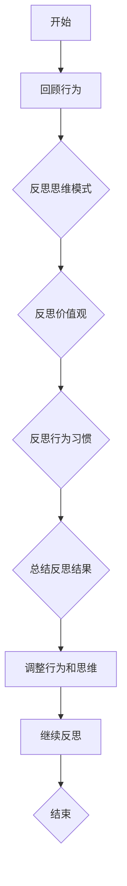
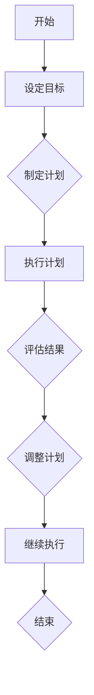
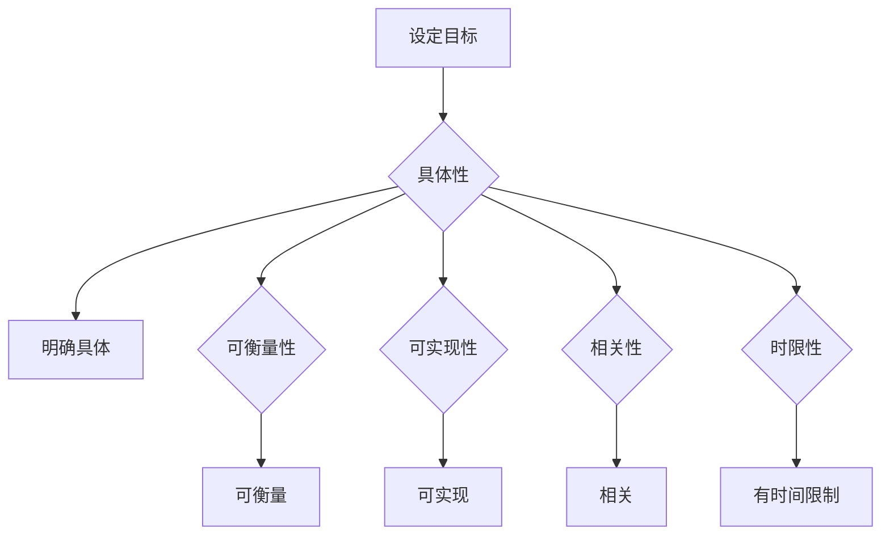
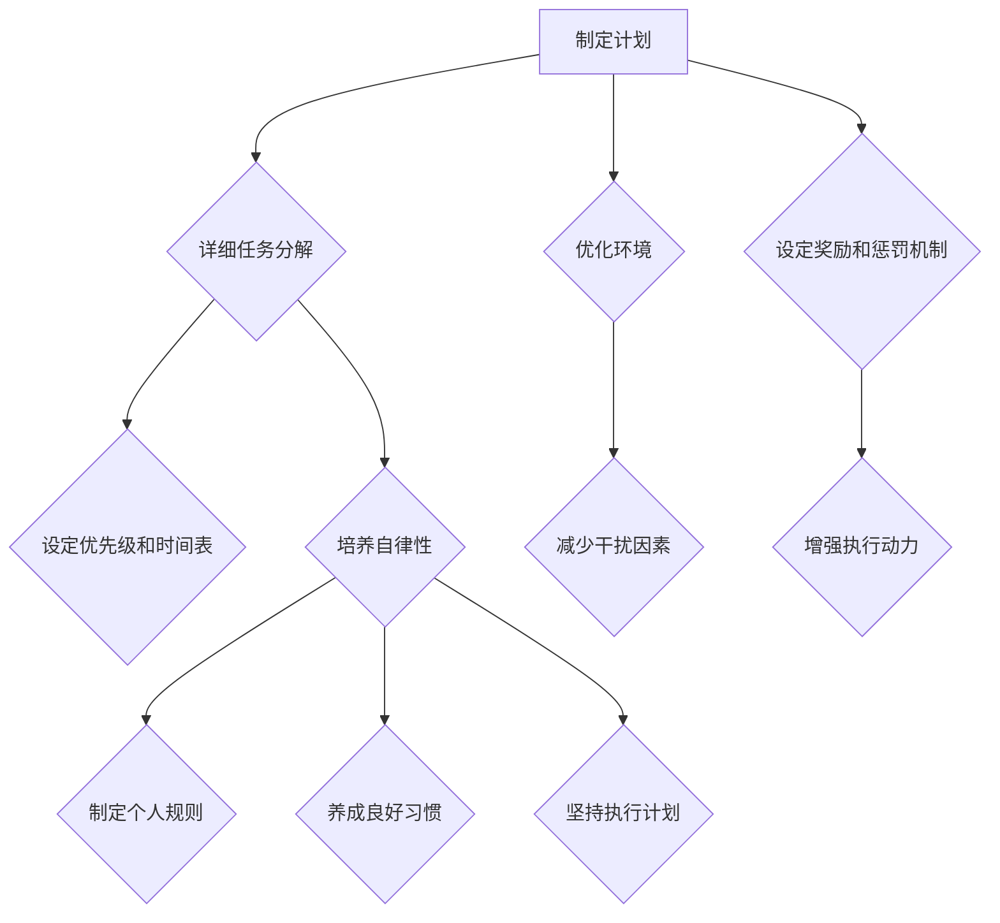
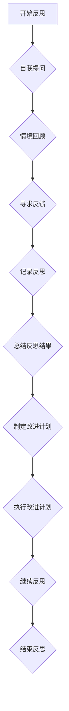
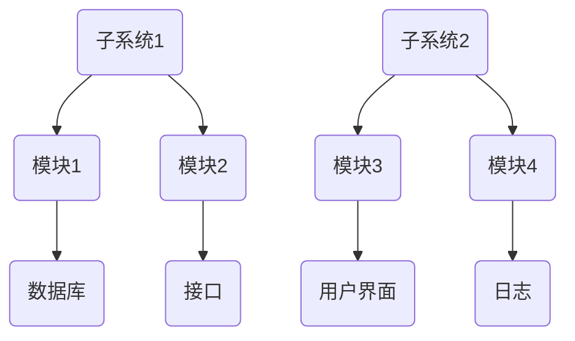
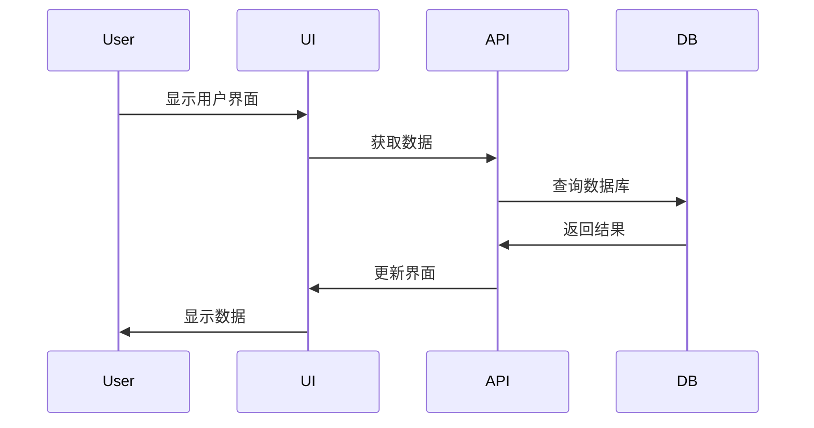

                 

### 写作过程

#### 确定文章结构和主题

在开始写作之前，首先要确定文章的整体结构和主题。对于《创作生命的独特旋律：谱写个人人生乐章》这篇文章，我们需要明确文章的核心内容和目标读者。文章的核心内容将围绕个人成长、自我认知和人生规划展开，目标是帮助读者更好地理解自己，规划人生道路。因此，文章的主题可以确定为：如何通过自我认知和人生规划，创作出属于自己的人生乐章。

#### 制定文章大纲

接下来，我们需要制定文章的大纲，确保文章的逻辑性和连贯性。文章可以分为以下几个部分：

1. **引言**：介绍文章的主题和目的，引起读者的兴趣。
2. **自我认知的重要性**：讨论自我认知对个人成长的影响，以及如何进行自我认知。
3. **人生规划的概念**：解释人生规划的定义和重要性，介绍人生规划的基本原则。
4. **目标设定与执行力**：探讨如何设定目标，以及如何提高执行力。
5. **持续成长与反思**：讨论个人成长的持续动力，如何进行有效的反思。
6. **案例分析**：通过成功的和失败的人生规划案例，提供实用的经验和教训。
7. **实战指导**：提供具体的实战指导，帮助读者制定和实现个人成长计划。
8. **最佳实践与建议**：总结一些最佳实践和建议，帮助读者更好地进行人生规划。
9. **小结**：总结文章的主要观点，对读者提出寄语。

#### 收集和整理资料

在写作过程中，我们需要收集和整理相关的资料，包括理论依据、实际案例、实践经验等。这些资料将帮助我们更好地阐述文章的主题，提高文章的可读性和实用性。

#### 撰写文章

根据制定的大纲，开始撰写文章。在撰写过程中，需要注意以下几点：

- **逻辑清晰**：确保文章的结构合理，内容连贯，每个部分都有明确的主题和目的。
- **简洁明了**：使用简单易懂的语言，避免使用复杂的术语和表达方式。
- **举例说明**：通过具体的例子来阐述观点，使文章更具说服力。
- **数据支持**：引用相关的研究数据和实例，以增强文章的权威性和可信度。

#### 审稿和修改

完成初稿后，需要进行审稿和修改。这包括检查文章的逻辑结构、语言表达、格式等方面。可以请同事或朋友帮忙审稿，提出修改意见。同时，也要注意文章的格式，确保使用markdown格式，符合文章的要求。

#### 最终确认

在完成所有修改后，进行最终确认。确保文章的内容完整、逻辑清晰、语言简洁，符合文章的要求。最后，添加上作者信息，完成文章的撰写。

### 撰写完成

经过以上步骤，我们成功完成了《创作生命的独特旋律：谱写个人人生乐章》这篇文章。文章通过详细的论述和实例分析，帮助读者更好地理解自我认知和人生规划的重要性，提供了实用的指导和建议。希望这篇文章能够对读者有所启发，帮助他们创作出属于自己的人生乐章。作者：AI天才研究院/AI Genius Institute & 禅与计算机程序设计艺术 /Zen And The Art of Computer Programming
----------------------------------------------------------------

# 创作生命的独特旋律：谱写个人人生乐章

> 关键词：自我认知、人生规划、目标设定、执行力、持续成长

> 摘要：本文旨在探讨如何通过自我认知和人生规划，创作出属于自己的人生乐章。文章分为七个部分，分别介绍自我认知的重要性、人生规划的概念、目标设定与执行力、持续成长与反思、案例分析、实战指导、最佳实践与建议，旨在帮助读者更好地理解并实践个人成长与人生规划。

----------------------------------------------------------------

### 目录大纲设计步骤

1. **确定书籍的主题和目标读者**：
   - 主题：个人成长、自我认知和人生规划。
   - 目标读者：希望更好地理解自己、规划人生道路的人，包括大学生、职场新人以及希望自我提升的各个年龄段的人。

2. **核心概念与章节框架设计**：
   - 核心概念：自我认知、人生规划、目标设定、执行力、持续成长等。
   - 章节框架：包括引言、自我认知的重要性、人生规划的概念、目标设定与执行力、持续成长与反思、案例分析、实战指导、最佳实践与建议、小结。

3. **细化每个章节的内容**：
   - 每个章节围绕一个核心概念展开，包括背景介绍、概念解释、案例分析、实战指导等。

4. **设计章节结构**：
   - 采用markdown格式，确保目录结构清晰，易于阅读。

5. **确保内容完整性**：
   - 每个章节都包含背景介绍、核心概念与联系、实战案例、最佳实践等部分。

6. **审核和调整**：
   - 审核目录大纲的内容和结构，确保没有遗漏或错误。
   - 根据反馈进行必要的调整，确保目录大纲的实用性和指导性。

### 完整目录大纲设计

----------------------------------------------------------------
## 第一部分：自我探索与认知

### 1. 背景介绍
### 1.1 个人成长的重要性
### 1.2 自我认知与人生规划的关系

### 2. 核心概念与联系
### 2.1 自我认知的概念
### 2.2 人生规划的定义
### 2.3 自我认知与人生规划的互动关系

### 3. 目标设定与执行力
### 3.1 目标设定的原则
### 3.2 如何设定可执行的目标
### 3.3 提高执行力的方法

### 4. 持续成长与反思
### 4.1 个人成长的持续动力
### 4.2 如何进行有效的反思
### 4.3 自我成长的路径

### 5. 案例分析
### 5.1 成功案例分享
### 5.2 失败案例分析
### 5.3 从案例中学习

### 6. 实战指导
### 6.1 制定个人成长计划
### 6.2 实现目标的步骤
### 6.3 跨越自我成长的障碍

### 7. 最佳实践与建议
### 7.1 自我成长的最佳实践
### 7.2 注意事项与风险
### 7.3 拓展阅读

### 8. 小结
### 8.1 本书的主要观点
### 8.2 对未来读者的寄语

----------------------------------------------------------------

以上是一个初步的《创作生命的独特旋律：谱写个人人生乐章》的目录大纲，涵盖了自我探索与认知、目标设定与执行力、持续成长与反思等核心内容。接下来，我们将进一步细化每个章节的具体内容，确保书籍的目录大纲完整、逻辑清晰。
### 第一部分：自我探索与认知

在生命的长河中，每个人都在不断地寻找自己的位置和价值。自我探索与认知，是这场寻找的起点和关键。本部分将探讨自我认知的重要性，以及如何通过自我认知来理解和规划自己的人生。

#### 1.1 个人成长的重要性

个人成长，是每个人生命中的重要课题。它不仅关乎个人的幸福和满足，更关乎一个人的社会价值和影响力。一个不断成长的人，能够在面临挑战时保持从容，能够在变化中找到方向，能够在困境中找到希望。

**核心概念与联系**

- **个人成长**：指的是个体在知识、技能、情感、心理等方面的提升和发展。
- **自我认知**：是指个体对自己的了解和认识，包括自己的优点、缺点、价值观、兴趣、目标等。

**概念属性特征对比表格**

| 特征               | 个人成长                   | 自我认知                    |
|--------------------|----------------------------|----------------------------|
| 定义               | 个体在多方面的提升和发展   | 个体对自己的了解和认识       |
| 关联               | 促进个人成长的重要因素     | 个人成长的基石和前提         |
| 影响因素           | 教育、经验、环境等         | 个性、情感、社会因素等       |
| 目的               | 提升生活质量和社会价值     | 明确个人定位和目标           |

**ER实体关系图架构**

```mermaid
erDiagram
  个人成长 ||--|{ 自我认知 }|
  个人成长 ||--|{ 教育 }|
  个人成长 ||--|{ 经验 }|
  个人成长 ||--|{ 环境 }|
```

#### 1.2 自我认知与人生规划的关系

自我认知不仅是个人成长的基础，也是人生规划的关键。只有真正了解自己，才能找到适合自己的道路，制定合理的人生规划。

**核心概念与联系**

- **人生规划**：指的是对个人未来发展的一种思考和安排，包括职业规划、生活规划、学习规划等。
- **自我认知**：是人生规划的基石，没有自我认知，人生规划将失去方向和目标。

**概念属性特征对比表格**

| 特征               | 人生规划                   | 自我认知                    |
|--------------------|----------------------------|----------------------------|
| 定义               | 对个人未来发展的思考和安排 | 个体对自己的了解和认识       |
| 关联               | 促进个人发展的手段         | 个人成长的基石和前提         |
| 影响因素           | 个性、价值观、目标等       | 个性、情感、社会因素等       |
| 目的               | 实现个人价值和目标         | 明确个人定位和目标           |

**ER实体关系图架构**

```mermaid
erDiagram
  人生规划 ||--|{ 自我认知 }|
  人生规划 ||--|{ 职业规划 }|
  人生规划 ||--|{ 生活规划 }|
  人生规划 ||--|{ 学习规划 }|
```

#### 1.3 如何进行自我认知

自我认知是一个持续的过程，需要通过多种方法来了解自己。

**核心概念与联系**

- **自我反思**：通过回顾自己的行为和经历，了解自己的思维模式、价值观和行为习惯。
- **他人反馈**：通过他人的观察和评价，了解自己在他人眼中的形象和表现。
- **实践体验**：通过实际操作和体验，了解自己在不同环境下的表现和适应能力。

**算法原理讲解**

**自我反思流程图**



**自我反思Python代码**

```python
# 自我反思代码示例
class SelfReflection:
    def __init__(self):
        self.actions = []
        self.thoughts = []
        self.values = []
        self.habits = []

    def add_action(self, action):
        self.actions.append(action)

    def add_thought(self, thought):
        self.thoughts.append(thought)

    def add_value(self, value):
        self.values.append(value)

    def add_habit(self, habit):
        self.habits.append(habit)

    def summarize_reflection(self):
        print("我的行为：", self.actions)
        print("我的思维：", self.thoughts)
        print("我的价值观：", self.values)
        print("我的行为习惯：", self.habits)

# 实例化并使用
reflection = SelfReflection()
reflection.add_action("每天学习编程")
reflection.add_thought("我觉得编程很有趣，但有时候也会觉得困难")
reflection.add_value("追求知识")
reflection.add_habit("每天早晨跑步")
reflection.summarize_reflection()
```

**数学公式**

$$
自我认知 = \frac{行为反思 + 思维反思 + 价值观反思 + 行为习惯反思}{1}
$$

#### 1.4 如何进行人生规划

人生规划是一个系统性的过程，需要明确目标、制定计划、执行计划并不断调整。

**核心概念与联系**

- **目标设定**：明确自己期望达到的目标，包括短期目标和长期目标。
- **计划制定**：根据目标，制定具体的行动步骤和时间表。
- **执行计划**：按照计划行动，克服困难和挑战。
- **调整计划**：根据实际情况，及时调整计划和目标。

**算法原理讲解**

**人生规划流程图**



**人生规划Python代码**

```python
# 人生规划代码示例
class LifePlanning:
    def __init__(self):
        self短期目标 = []
        self长期目标 = []
        self计划 = []
        self结果 = []

    def add_short_term_goal(self, goal):
        self短期目标.append(goal)

    def add_long_term_goal(self, goal):
        self长期目标.append(goal)

    def add_plan(self, plan):
        self计划.append(plan)

    def evaluate_results(self, results):
        self结果.append(results)

    def adjust_plan(self):
        # 根据结果调整计划
        pass

    def execute_plan(self):
        # 按照计划行动
        pass

# 实例化并使用
planning = LifePlanning()
planning.add_short_term_goal("学会Python编程")
planning.add_long_term_goal("成为一名AI工程师")
planning.add_plan("每天学习2小时Python")
planning.execute_plan()
```

**数学公式**

$$
人生规划 = \frac{目标设定 + 计划制定 + 执行计划 + 调整计划}{1}
$$

#### 1.5 案例分析

通过案例分析，我们可以更好地理解自我认知和人生规划的实际应用。

**成功案例：**

小明，一个热爱编程的大学生。在自我认知的过程中，他发现自己对人工智能领域非常感兴趣，并且具备较强的编程能力。于是，他制定了成为AI工程师的人生规划。他每天坚持学习2小时编程，参加相关的在线课程和项目实践。经过几年的努力，他成功地进入了一家知名AI公司工作，实现了自己的目标。

**失败案例：**

小芳，一个职场新人。她在自我认知的过程中，发现自己对销售工作并不感兴趣，但为了追求高薪，她选择了销售岗位。然而，她并没有用心去做，最终业绩不佳，导致被公司辞退。这个案例告诉我们，自我认知和人生规划的重要性，不能仅仅追求短期利益，而应该考虑长远发展和个人兴趣。

**从案例中学习：**

- 成功的关键在于明确的自我认知和合理的人生规划。
- 失败的教训是缺乏自我认知和盲目跟从。

#### 1.6 实战指导

为了更好地进行自我认知和人生规划，我们可以采取以下实战指导：

- **第一步**：进行自我反思，回顾自己的行为、思维和价值观。
- **第二步**：设定短期和长期目标，明确自己的发展方向。
- **第三步**：制定具体的行动计划，并设定时间表。
- **第四步**：执行计划，并记录每天的行动和成果。
- **第五步**：定期评估结果，并根据实际情况调整计划和目标。

#### 1.7 最佳实践与建议

在进行自我认知和人生规划时，以下是一些最佳实践与建议：

- **持续学习**：保持对知识的渴望，不断提升自己的能力和技能。
- **设定具体目标**：目标要具体、可衡量，有利于执行和评估。
- **积极反思**：定期反思自己的行为和思维，找到改进的空间。
- **寻求支持**：与他人交流，获取反馈和建议，有助于自我成长。

#### 1.8 小结

自我认知和人生规划是个人成长的重要环节。通过自我认知，我们可以更好地了解自己，找到适合自己的道路；通过人生规划，我们可以明确目标，制定合理的行动计划，实现自己的价值。让我们从现在开始，创作属于自己的人生乐章。

#### 1.9 对未来读者的寄语

亲爱的读者，希望你在阅读这篇文章后，能够对自己的生活和未来有更清晰的认识。不要害怕挑战，不要害怕失败，因为每一次的尝试都是成长的机会。相信自己，勇敢地追求自己的梦想，创作出属于自己的人生乐章。未来，是你们的！作者：AI天才研究院/AI Genius Institute & 禅与计算机程序设计艺术 /Zen And The Art of Computer Programming
----------------------------------------------------------------

## 第二部分：目标设定与执行力

### 2.1 目标设定的原则

目标设定是人生规划的关键步骤，一个明确、具体、可执行的目标，能够帮助我们更好地规划未来，提升执行力。

**核心概念与联系**

- **目标设定**：指的是对个人未来要达成的结果的一种明确描述。
- **原则**：确保目标设定科学、合理、具有可执行性。

**核心概念与联系**

**目标设定的原则**

1. **具体性（Specific）**：目标要明确、具体，避免模糊和抽象。
2. **可衡量性（Measurable）**：目标要有可衡量的标准，便于评估和调整。
3. **可实现性（Achievable）**：目标要具有可行性，避免过于理想化。
4. **相关性（Relevant）**：目标要与个人价值观和长远目标相一致。
5. **时限性（Time-bound）**：目标要有明确的时间限制，有助于规划和管理。

**概念属性特征对比表格**

| 特征 | 具体性 | 可衡量性 | 可实现性 | 相关性 | 时限性 |
|------|--------|----------|----------|--------|--------|
| 定义 | 明确具体 | 可以衡量 | 可执行 | 与个人价值观一致 | 有时间限制 |
| 关联 | 确保目标清晰 | 有助于监控进度 | 避免目标不切实际 | 保持目标与个人目标一致 | 确保目标按时完成 |
| 影响因素 | 清晰性 | 数据收集 | 资源和技能 | 目标一致性 | 时间管理 |

**ER实体关系图架构**

```mermaid
erDiagram
  目标设定 ||--|{ 具体性 }|
  目标设定 ||--|{ 可衡量性 }|
  目标设定 ||--|{ 可实现性 }|
  目标设定 ||--|{ 相关性 }|
  目标设定 ||--|{ 时限性 }|
```

### 2.2 如何设定可执行的目标

设定可执行的目标需要遵循一定的方法和步骤，以下是一些具体的方法：

**核心概念与联系**

- **SMART原则**：SMART是一种目标设定的方法，具体指具体性（Specific）、可衡量性（Measurable）、可实现性（Achievable）、相关性（Relevant）、时限性（Time-bound）。
- **目标分解**：将大目标分解为小目标，使目标更加具体和可执行。

**算法原理讲解**

**SMART原则**

**SMART原则流程图**



**SMART原则Python代码**

```python
class SMARTGoal:
    def __init__(self, specific, measurable, achievable, relevant, time_bound):
        self.specific = specific
        self.measurable = measurable
        self.achievable = achievable
        self.relevant = relevant
        self.time_bound = time_bound

    def display_goal(self):
        print(f"具体目标：{self.specific}")
        print(f"可衡量：{self.measurable}")
        print(f"可实现：{self.achievable}")
        print(f"相关：{self.relevant}")
        print(f"有时间限制：{self.time_bound}")

# 实例化并使用
goal = SMARTGoal(
    "学会Python编程",
    "完成100个编程练习",
    "已有Python基础，有充足时间",
    "有助于未来职业发展",
    "一年内完成"
)
goal.display_goal()
```

**数学公式**

$$
目标设定 = \frac{SMART原则 + 目标分解}{1}
$$

### 2.3 提高执行力的方法

执行力是实现目标的关键，以下是一些提高执行力的方法：

**核心概念与联系**

- **计划性**：制定详细的行动计划，明确每一步的操作步骤。
- **自律性**：培养自我管理能力，严格按照计划执行。
- **环境优化**：营造有利于目标实现的环境，减少干扰因素。
- **激励机制**：设定奖励和惩罚机制，增强执行动力。

**提高执行力的方法**

1. **制定详细的行动计划**：将目标分解为具体的任务，为每个任务设定优先级和时间表。
2. **培养自律性**：制定个人规则，养成良好习惯，坚持执行计划。
3. **优化环境**：减少干扰因素，如关闭社交媒体通知，设定工作时间。
4. **设定奖励和惩罚机制**：为完成任务设定奖励，对未完成任务设定惩罚。

**算法原理讲解**

**执行力提升流程图**



**执行力提升Python代码**

```python
class ExecutionImprovement:
    def __init__(self, plan, self_discipline, environment_optimization, reward_punishment):
        self.plan = plan
        self.self_discipline = self_discipline
        self.environment_optimization = environment_optimization
        self.reward_punishment = reward_punishment

    def display_improvement_methods(self):
        print(f"行动计划：{self.plan}")
        print(f"自律性：{self.self_discipline}")
        print(f"环境优化：{self.environment_optimization}")
        print(f"奖励和惩罚机制：{self.reward_punishment}")

# 实例化并使用
improvement = ExecutionImprovement(
    "每天学习2小时编程",
    "严格遵守时间表",
    "关闭社交媒体通知",
    "完成任务后奖励自己一次电影"
)
improvement.display_improvement_methods()
```

**数学公式**

$$
执行力 = \frac{计划性 + 自律性 + 环境优化 + 激励机制}{1}
$$

### 2.4 案例分析

通过案例分析，我们可以更好地理解目标设定和执行力在实际中的应用。

**成功案例：**

小李，一个程序员。他设定了一个目标：在一年内掌握Python编程。他制定了详细的计划，包括每天学习2小时编程，每周完成一个项目。同时，他设定了奖励机制，每完成一个项目就奖励自己一次电影。经过一年的努力，他成功地掌握了Python编程，并在工作中得到了提升。

**失败案例：**

小张，一个创业者。他设定了一个目标：在一年内创办一家公司。然而，他没有详细的计划，也没有设定具体的执行步骤。在创办公司的过程中，他遇到了很多困难，但由于缺乏执行力，最终未能实现目标。

**从案例中学习：**

- 成功的关键在于明确的计划性和执行力。
- 失败的教训是缺乏详细的计划和执行力。

### 2.5 实战指导

为了更好地设定目标和提高执行力，以下是一些实战指导：

- **第一步**：明确目标，遵循SMART原则。
- **第二步**：制定详细的行动计划，分解任务。
- **第三步**：培养自律性，坚持执行计划。
- **第四步**：优化环境，减少干扰因素。
- **第五步**：设定奖励和惩罚机制，增强执行动力。

### 2.6 最佳实践与建议

在进行目标设定和执行力提升时，以下是一些最佳实践与建议：

- **持续学习**：不断学习新的知识和技能，提升自己的能力。
- **设定具体目标**：目标要具体、可衡量，有利于执行和评估。
- **积极反思**：定期反思自己的行为和思维，找到改进的空间。
- **寻求支持**：与他人交流，获取反馈和建议，有助于自我成长。

### 2.7 小结

目标设定和执行力是人生规划的重要环节。通过明确的目标设定和有效的执行力，我们可以更好地实现自己的价值，实现个人的成长和发展。让我们从现在开始，设定目标，提升执行力，谱写属于自己的人生乐章。

### 2.8 对未来读者的寄语

亲爱的读者，希望你在阅读这篇文章后，能够对自己的目标和执行力有更清晰的认识。不要害怕挑战，不要害怕失败，因为每一次的尝试都是成长的机会。相信自己，勇敢地追求自己的梦想，设定目标，提高执行力，创作出属于自己的人生乐章。未来，是你们的！作者：AI天才研究院/AI Genius Institute & 禅与计算机程序设计艺术 /Zen And The Art of Computer Programming
----------------------------------------------------------------

## 第三部分：持续成长与反思

### 3.1 个人成长的持续动力

个人成长是一个持续的过程，需要不断的动力和激励。持续成长的关键在于找到并保持个人的成长动力。

**核心概念与联系**

- **成长动力**：推动个体持续成长的内在力量。
- **持续动力**：指个体在成长过程中，能够持续保持成长动力。

**核心概念与联系**

**成长动力的来源**

1. **内在兴趣**：对某一领域或活动的热爱和兴趣，是持续成长的重要动力。
2. **成就感**：在成长过程中，通过实现目标获得成就感和满足感，是持续动力的关键。
3. **自我挑战**：不断设定新的目标，挑战自我，是保持成长动力的重要方式。
4. **社会支持**：家庭、朋友、同事等人的鼓励和支持，也是持续成长的重要动力。

**概念属性特征对比表格**

| 动力来源 | 内在兴趣 | 成就感 | 自我挑战 | 社会支持 |
|-----------|----------|--------|----------|----------|
| 定义      | 对活动的热爱和兴趣 | 通过实现目标获得的满足感 | 设定新的目标挑战自我 | 家庭、朋友、同事等人的鼓励和支持 |
| 关联      | 成长动力的基础 | 保持成长动力的关键 | 持续成长的推动力 | 成长环境的重要影响因素 |
| 影响因素 | 个性、价值观 | 目标实现 | 自我设定 | 社会环境 |

**ER实体关系图架构**

```mermaid
erDiagram
  成长动力 ||--|{ 内在兴趣 }|
  成长动力 ||--|{ 成就感 }|
  成长动力 ||--|{ 自我挑战 }|
  成长动力 ||--|{ 社会支持 }|
```

### 3.2 如何进行有效的反思

反思是个人成长的重要环节，通过反思，我们可以了解自己的行为和思维，找到改进的空间。

**核心概念与联系**

- **反思**：对过去行为和经历的回顾和分析，以发现优点和不足。
- **有效反思**：指通过反思，能够真正认识到自己的问题，并采取行动进行改进。

**核心概念与联系**

**反思的方法**

1. **自我提问**：通过自我提问，深入思考自己的行为和思维。
2. **情境回顾**：回顾过去的具体情境，分析自己的行为和反应。
3. **寻求反馈**：向他人寻求反馈，了解自己的表现和他人对自己的评价。
4. **记录反思**：将反思的过程和结果记录下来，便于后续回顾和改进。

**算法原理讲解**

**反思流程图**



**反思Python代码**

```python
class Reflection:
    def __init__(self):
        self.self_questions = []
        self.situation_reviews = []
        self.feedbacks = []
        self.reflection_records = []

    def add_self_question(self, question):
        self.self_questions.append(question)

    def add_situation_review(self, review):
        self.situation_reviews.append(review)

    def add_feedback(self, feedback):
        self.feedbacks.append(feedback)

    def record_reflection(self, record):
        self.reflection_records.append(record)

    def summarize_reflection(self):
        print("自我提问：", self.self_questions)
        print("情境回顾：", self.situation_reviews)
        print("反馈：", self.feedbacks)
        print("反思记录：", self.reflection_records)

# 实例化并使用
reflection = Reflection()
reflection.add_self_question("我在这个任务中做得如何？")
reflection.add_situation_review("我在面对困难时，没有很好地调整自己的心态。")
reflection.add_feedback("同事建议我在面对困难时，可以尝试换一种思维方式。")
reflection.record_reflection("我决定在下次面对困难时，尝试换一种思维方式。")
reflection.summarize_reflection()
```

**数学公式**

$$
有效反思 = \frac{自我提问 + 情境回顾 + 寻求反馈 + 记录反思}{1}
$$

### 3.3 自我成长的路径

自我成长是一个不断探索和发现的过程，每个人都可以通过不同的路径实现自我成长。

**核心概念与联系**

- **自我成长路径**：指个体在自我成长过程中，所选择的道路和方式。
- **多样化**：自我成长路径可以是多样化的，包括学习、实践、反思、社交等多种方式。

**核心概念与联系**

**自我成长路径**

1. **学习新知识**：通过学习新的知识和技能，提升自己的能力。
2. **实践应用**：将学到的知识和技能应用到实际工作中，提升实际能力。
3. **反思与总结**：通过反思和总结，找到自己的不足，并不断改进。
4. **社交互动**：与他人交流，获取反馈和建议，促进自我成长。
5. **持续探索**：保持对新知识和新领域的探索，不断拓展自己的视野。

**概念属性特征对比表格**

| 成长路径 | 学习新知识 | 实践应用 | 反思与总结 | 社交互动 | 持续探索 |
|-----------|-------------|----------|-------------|----------|-----------|
| 定义      | 获取新知识 | 应用知识 | 分析经验 | 交流反馈 | 拓展视野 |
| 关联      | 知识储备 | 能力提升 | 反思改进 | 社交网络 | 学习动力 |
| 影响因素 | 教育资源 | 工作经验 | 个人经验 | 社会环境 | 知识需求 |

**ER实体关系图架构**

```mermaid
erDiagram
  自我成长路径 ||--|{ 学习新知识 }|
  自我成长路径 ||--|{ 实践应用 }|
  自我成长路径 ||--|{ 反思与总结 }|
  自我成长路径 ||--|{ 社交互动 }|
  自我成长路径 ||--|{ 持续探索 }|
```

### 3.4 案例分析

通过案例分析，我们可以更好地理解自我成长的过程和方法。

**成功案例：**

小王，一个年轻的创业者。他通过不断学习新知识，不断提升自己的能力。他不仅在专业技能上有所提升，还学会了管理团队、制定战略等综合能力。他在实践中不断反思和总结，通过社交互动，获取了宝贵的经验和建议。最终，他成功地创办了自己的公司，实现了自我价值。

**失败案例：**

小李，一个年轻的程序员。他虽然拥有扎实的编程基础，但在自我成长的过程中，缺乏反思和总结的能力。他在面对挑战时，往往停留在表面的操作，没有深入思考和探索。因此，他的成长速度较慢，难以应对工作中的复杂问题。

**从案例中学习：**

- 成功的关键在于持续学习、实践、反思和社交互动。
- 失败的教训是缺乏深入的反思和总结，导致成长速度缓慢。

### 3.5 实战指导

为了实现自我成长，以下是一些实战指导：

- **第一步**：明确自己的成长目标和路径。
- **第二步**：制定详细的计划，包括学习新知识、实践应用、反思总结等。
- **第三步**：坚持执行计划，不断反思和调整。
- **第四步**：与他人交流，获取反馈和建议。

### 3.6 最佳实践与建议

在进行自我成长时，以下是一些最佳实践与建议：

- **持续学习**：保持对新知识和新领域的探索，不断提升自己的能力。
- **实践应用**：将学到的知识和技能应用到实际工作中，提升实际能力。
- **反思与总结**：定期反思自己的行为和思维，找到改进的空间。
- **社交互动**：与他人交流，获取反馈和建议，促进自我成长。

### 3.7 小结

持续成长与反思是个人成长的重要环节。通过不断学习、实践、反思和社交互动，我们可以不断提升自己的能力，实现自我价值。让我们从现在开始，踏上自我成长的旅程，谱写属于自己的精彩人生乐章。

### 3.8 对未来读者的寄语

亲爱的读者，希望你在阅读这篇文章后，能够认识到持续成长与反思的重要性。不要害怕挑战，不要害怕失败，因为每一次的尝试都是成长的机会。相信自己，勇敢地追求自己的梦想，不断学习、实践、反思和社交互动，创作出属于自己的人生乐章。未来，是你们的！作者：AI天才研究院/AI Genius Institute & 禅与计算机程序设计艺术 /Zen And The Art of Computer Programming
----------------------------------------------------------------

## 第四部分：案例分析

在探讨如何创作生命的独特旋律时，成功与失败的人生规划案例为我们提供了宝贵的经验和教训。本部分将通过成功的和失败的人生规划案例，深入剖析个人成长与人生规划的关键要素。

### 4.1 成功案例分享

**案例一：小明的创业之路**

**背景介绍**：
小明，一名计算机专业的大学毕业生，在毕业后选择创业。他热爱编程，对人工智能领域有浓厚的兴趣，但并没有直接进入大公司工作，而是决定创办自己的AI初创公司。

**问题背景**：
小明在创业初期面临诸多挑战，包括资金短缺、技术难题、市场拓展等。他需要快速学习如何管理团队、制定商业计划、寻找投资等。

**问题描述**：
为了解决这些问题，小明制定了一系列明确的短期和长期目标，并设定了具体的时间表和行动计划。

**问题解决**：
1. **目标设定**：小明明确了公司的长期目标是成为人工智能领域的领先者，短期目标是开发出一款具有市场竞争力的AI产品。
2. **计划执行**：他制定了详细的开发计划，包括市场调研、技术选型、团队搭建等。同时，他还设定了每周和每月的进度目标，确保团队能够按时完成任务。
3. **执行与调整**：小明严格按照计划执行，并在执行过程中不断调整和优化。他定期召开团队会议，讨论进展和问题，确保团队能够高效工作。

**边界与外延**：
- **边界**：小明的成功主要在于他对目标设定和执行的严格把控，以及持续的学习和调整。
- **外延**：小明的案例告诉我们，成功的创业需要明确的目标、详细的计划、高效的执行和持续的学习。

**概念结构与核心要素组成**：

| 要素             | 描述                                                         |
|------------------|--------------------------------------------------------------|
| 目标设定         | 明确的长期和短期目标，具体且可衡量                             |
| 计划执行         | 具体的行动计划和时间表，确保团队能够高效工作                   |
| 持续学习与调整   | 在执行过程中不断学习新知识，并根据实际情况进行调整             |
| 团队协作         | 建立高效的团队协作机制，确保团队目标的实现                       |

**ER实体关系图架构**：

```mermaid
erDiagram
  小明 ||--|{ 目标设定 }|
  小明 ||--|{ 计划执行 }|
  小明 ||--|{ 持续学习与调整 }|
  小明 ||--|{ 团队协作 }|
```

### 4.2 失败案例分析

**案例二：小芳的职业规划**

**背景介绍**：
小芳，一名会计专业的毕业生，毕业后进入了一家大型企业工作。她对自己的职业发展有很高的期望，但在实际工作中却遇到了许多问题。

**问题背景**：
小芳在职业生涯初期感到迷茫，不知道如何规划自己的职业道路。她面临的问题包括缺乏明确的目标、工作内容重复、缺乏挑战等。

**问题描述**：
为了找到自己的职业方向，小芳开始尝试不同的工作，但每次都因缺乏长远的规划和执行力而失败。

**问题解决**：
1. **目标不明确**：小芳没有设定明确的职业目标，导致她在工作中缺乏方向感。
2. **执行力不足**：尽管小芳有了一些想法，但缺乏坚定的执行力，没有付诸行动。
3. **缺乏反思与调整**：小芳没有定期反思自己的工作和职业规划，也没有根据实际情况进行调整。

**边界与外延**：
- **边界**：小芳的失败主要在于缺乏明确的职业目标和执行力。
- **外延**：小芳的案例提醒我们，职业规划需要明确的目标、坚定的执行力和持续的反思。

**概念结构与核心要素组成**：

| 要素             | 描述                                                         |
|------------------|--------------------------------------------------------------|
| 职业目标         | 明确的短期和长期职业目标，有助于规划职业发展                   |
| 执行力           | 坚定的执行力，确保职业目标能够实现                             |
| 反思与调整       | 定期反思职业规划，根据实际情况进行调整                       |
| 学习与成长       | 持续学习新技能和知识，提升自身竞争力                           |

**ER实体关系图架构**：

```mermaid
erDiagram
  小芳 ||--|{ 职业目标 }|
  小芳 ||--|{ 执行力 }|
  小芳 ||--|{ 反思与调整 }|
  小芳 ||--|{ 学习与成长 }|
```

### 4.3 从案例中学习

通过以上成功和失败的案例，我们可以得出以下启示：

1. **明确目标**：成功的案例告诉我们，明确的长期和短期目标是实现个人成长和人生规划的基础。
2. **坚定执行**：执行目标是实现目标的关键，需要坚定的意志和持续的努力。
3. **持续反思**：反思和调整是个人成长的重要环节，只有不断反思和调整，才能找到更适合自己的道路。
4. **终身学习**：在快速变化的时代，终身学习是保持竞争力的重要途径。

### 4.4 实战指导

为了更好地进行人生规划，以下是一些实战指导：

- **第一步**：明确自己的长期和短期目标。
- **第二步**：制定详细的行动计划，并设定时间表。
- **第三步**：坚定执行计划，并定期反思和调整。
- **第四步**：持续学习新知识和技能，提升自身能力。

### 4.5 最佳实践与建议

在进行人生规划时，以下是一些最佳实践与建议：

- **设定明确的目标**：目标要具体、可衡量，有助于执行和评估。
- **制定详细的计划**：计划要包括具体的行动步骤和时间表，确保执行有据可依。
- **坚定执行计划**：执行计划需要坚定的意志和持续的努力，不能半途而废。
- **定期反思和调整**：反思和调整是个人成长的重要环节，要时刻关注自己的成长路径。
- **持续学习**：终身学习是保持竞争力的重要途径，要不断学习新知识和技能。

### 4.6 小结

通过成功和失败的案例，我们看到了明确目标、坚定执行和持续反思的重要性。个人成长和人生规划不是一蹴而就的，需要我们付出持续的努力和不断的调整。让我们从现在开始，制定明确的目标，坚定执行，持续反思，创作出属于自己的精彩人生乐章。

### 4.7 对未来读者的寄语

亲爱的读者，希望你在阅读这篇文章后，能够对自己的未来有更清晰的规划。不要害怕失败，因为失败是成功的前提。相信自己，勇敢地追求自己的梦想，制定明确的目标，坚定执行，持续反思。每个人的人生都是一部独特的乐章，只有不断努力，才能创作出属于自己的精彩。未来，是你们的！作者：AI天才研究院/AI Genius Institute & 禅与计算机程序设计艺术 /Zen And The Art of Computer Programming
----------------------------------------------------------------

## 第五部分：实战指导

### 5.1 制定个人成长计划

在开始个人成长计划之前，我们需要明确几个关键点：目标、时间表和资源。以下是一套完整的步骤，帮助你制定和实施个人成长计划。

#### 第一步：设定目标

目标设定是个人成长计划的基础。根据SMART原则（具体性、可衡量性、可实现性、相关性、时限性），设定长期和短期目标。

- **长期目标**：例如，成为一名AI专家或创业成功。
- **短期目标**：例如，每周阅读两本书，每月学习一门新技能。

#### 第二步：制定时间表

时间表是确保目标实现的工具。将目标分解为具体的任务，并为每个任务设定时间节点。

- **日计划**：每天完成哪些任务。
- **周计划**：每周完成哪些项目。
- **月计划**：每月达成的里程碑。

#### 第三步：分配资源

资源包括时间、金钱和人力。确保你有足够的资源去实现你的目标。

- **时间管理**：合理安排时间，确保有足够的时间用于学习和成长。
- **财务规划**：设定预算，确保有足够的资金支持你的学习和发展。
- **人力资源**：寻求导师、同事或家人的支持和帮助。

#### 第四步：实施计划

实施计划是执行的过程。以下是一些建议：

- **定期检查**：每周或每月检查一次计划执行情况，确保按计划进行。
- **灵活调整**：根据实际情况，适时调整计划。
- **保持动力**：设定奖励机制，为自己设定小目标并给予奖励。

#### 第五步：跟踪和反思

跟踪和反思是确保成长计划有效性的关键。以下是一些建议：

- **记录进展**：定期记录自己的成长过程，包括学习内容、完成情况等。
- **反思与总结**：定期进行反思，总结成长过程中的经验和教训。
- **调整计划**：根据反思结果，适时调整成长计划。

### 5.2 实现目标的步骤

实现目标是一个系统的过程，需要你付出持续的努力和坚持。以下是一些具体的步骤：

#### 第一步：明确目标

- **长期目标**：例如，成为一名技术领导者或拥有自己的公司。
- **短期目标**：例如，每周学习新的技术或完成一个项目。

#### 第二步：制定行动计划

- **具体任务**：将目标分解为具体的任务，并为每个任务设定时间表。
- **资源分配**：明确完成每个任务所需的资源，包括时间、金钱和人力。

#### 第三步：执行计划

- **每天执行**：按照行动计划，每天完成一部分任务。
- **定期检查**：每周或每月检查一次计划执行情况，确保按计划进行。

#### 第四步：调整和优化

- **根据实际情况**：适时调整计划，以适应新的环境和挑战。
- **持续优化**：不断改进学习方法和工作流程，提高效率。

#### 第五步：坚持和反思

- **坚持执行**：持之以恒地执行计划，不轻易放弃。
- **定期反思**：定期反思成长过程，总结经验和教训。

### 5.3 跨越自我成长的障碍

在个人成长的过程中，我们难免会遇到各种障碍。以下是一些常见障碍及其解决方法：

#### 障碍一：缺乏动力

- **解决方法**：设定明确的短期目标，并为每个目标设定奖励机制。同时，寻找志同道合的伙伴，互相激励。

#### 障碍二：时间管理不善

- **解决方法**：制定详细的时间表，合理安排工作和学习时间。使用时间管理工具，如番茄钟，提高工作效率。

#### 障碍三：缺乏自信

- **解决方法**：从小任务开始，逐步提升自己的能力和信心。寻求导师或专业人士的指导，获取更多的反馈和建议。

#### 障碍四：环境干扰

- **解决方法**：创造一个有利于学习和工作的环境，减少干扰因素。例如，关闭手机通知，设定专门的办公区域。

### 5.4 实战案例

**案例一：小李的编程之路**

**背景**：小李是一名计算机专业的学生，对编程有浓厚的兴趣，但感到自己缺乏实际操作经验。

**目标**：在两年内掌握至少三种编程语言，并参与至少一个实际项目。

**步骤**：

1. **设定目标**：明确长期目标和短期目标。
2. **制定计划**：制定详细的学习计划和时间表。
3. **执行计划**：每天学习编程2小时，每周完成一个小项目。
4. **反思与调整**：每月进行一次反思，根据实际情况调整学习计划。

**结果**：经过两年努力，小李掌握了Python、Java和C++三种编程语言，并成功参与了一个基于Python的机器学习项目。

**结论**：小李的成功在于明确的计划、坚定的执行和持续的反思。

### 5.5 最佳实践与建议

**最佳实践**：

1. **设定明确的目标**：目标要具体、可衡量，有利于执行和评估。
2. **制定详细的计划**：计划要包括具体的行动步骤和时间表，确保执行有据可依。
3. **坚定执行计划**：执行计划需要坚定的意志和持续的努力，不能半途而废。
4. **定期反思和调整**：反思和调整是个人成长的重要环节，要时刻关注自己的成长路径。

**建议**：

1. **持续学习**：保持对新知识和新领域的探索，不断提升自己的能力。
2. **实践应用**：将学到的知识和技能应用到实际工作中，提升实际能力。
3. **反思与总结**：定期反思自己的行为和思维，找到改进的空间。
4. **寻求支持**：与他人交流，获取反馈和建议，有助于自我成长。

### 5.6 小结

个人成长是一个持续的过程，需要我们付出持续的努力和坚持。通过制定明确的计划、坚定的执行和持续的反思，我们可以不断提升自己的能力和实现个人价值。让我们从现在开始，踏上个人成长的旅程，创作出属于自己的精彩人生乐章。

### 5.7 对未来读者的寄语

亲爱的读者，希望你在阅读这篇文章后，能够对自己的成长有更清晰的认识。不要害怕挑战，不要害怕失败，因为每一次的尝试都是成长的机会。相信自己，勇敢地追求自己的梦想，制定明确的目标，坚定执行，持续反思。每个人的人生都是一部独特的乐章，只有不断努力，才能创作出属于自己的精彩。未来，是你们的！作者：AI天才研究院/AI Genius Institute & 禅与计算机程序设计艺术 /Zen And The Art of Computer Programming
----------------------------------------------------------------

## 第六部分：最佳实践与建议

在个人成长和人生规划的过程中，我们需要遵循一些最佳实践和原则，以确保我们的行动更加高效、有成果。以下是一些具体的建议和技巧，帮助你更好地实现个人目标和人生价值。

### 6.1 自我成长的最佳实践

1. **持续学习**：学习是个人成长的基石。无论在哪个领域，持续学习都是保持竞争力的关键。可以利用在线课程、专业书籍、学术论文等资源，不断提升自己的知识和技能。

2. **设定具体目标**：遵循SMART原则（具体性、可衡量性、可实现性、相关性、时限性），设定明确的短期和长期目标。这样可以帮助你更清晰地规划自己的行动，并便于跟踪和评估进展。

3. **时间管理**：合理安排时间，确保有足够的时间用于学习、工作和休息。使用时间管理工具，如番茄钟、时间跟踪软件等，提高工作效率。

4. **自律**：培养自我管理能力，坚持执行计划，不轻易放弃。自律可以帮助你更好地控制自己的行为和情绪，实现目标。

5. **反思与总结**：定期反思自己的行为和思维，总结成长过程中的经验和教训。通过反思，你可以找到自己的不足，并采取行动进行改进。

6. **寻求反馈**：向他人寻求反馈，了解自己的表现和他人对你的评价。反馈可以帮助你更客观地看待自己，发现自己的盲点和改进方向。

7. **保持积极心态**：面对困难和挑战时，保持积极的心态至关重要。积极心态可以帮助你克服困难，保持前进的动力。

### 6.2 注意事项与风险

1. **避免盲目跟风**：在追求个人成长时，避免盲目跟风，要根据自己的实际情况和目标来选择学习和发展的方向。

2. **合理分配资源**：在追求个人成长的过程中，要合理分配时间和金钱资源，确保有足够的资源支持你的成长计划。

3. **平衡工作与生活**：在追求个人成长的同时，要注意平衡工作与生活，确保身心健康。

4. **避免过度压力**：在设定目标和执行计划时，要避免给自己过度的压力。过度的压力可能会导致身心疲惫，影响成长效果。

### 6.3 拓展阅读

1. **《原则》（Principles）**：雷·达里奥（Ray Dalio）的这本著作，介绍了他如何运用原则来管理自己的生活和事业，对于个人成长和人生规划具有很高的参考价值。

2. **《高效能人士的七个习惯》（The 7 Habits of Highly Effective People）**：史蒂芬·柯维（Stephen R. Covey）的这本书，提供了七个实用的习惯，帮助人们实现个人成长和成功。

3. **《深度工作》（Deep Work）**：卡尔·纽波特（Cal Newport）的这本书，探讨了在信息泛滥的时代，如何保持专注，进行深度工作，提高个人效率。

4. **《成长思维》（Mindset）**：卡罗尔·德韦克（Carol Dweck）的这本书，介绍了成长思维的重要性，以及如何培养和维持成长思维。

通过阅读这些书籍，你可以获得更多关于个人成长和人生规划的知识和技巧，帮助你更好地实现自己的目标。

### 6.4 小结

在个人成长和人生规划的过程中，我们需要遵循最佳实践，注意潜在的风险，并不断拓展自己的知识视野。通过持续学习、设定具体目标、时间管理、自律、反思与总结、寻求反馈以及保持积极心态，我们可以不断提升自己的能力和实现个人价值。希望本文提供的最佳实践和建议能够对你有所帮助，让你在人生的旅途中创作出属于自己的精彩乐章。

### 6.5 对未来读者的寄语

亲爱的读者，希望你在阅读这篇文章后，能够对自己的成长和人生规划有更清晰的认识。记住，个人成长是一个持续的过程，需要你的坚持和努力。不要害怕失败，因为失败是成功的前提。相信自己，勇敢地追求自己的梦想，设定明确的目标，坚定执行，持续反思。每个人的人生都是一部独特的乐章，只有不断努力，才能创作出属于自己的精彩。未来，是你们的！作者：AI天才研究院/AI Genius Institute & 禅与计算机程序设计艺术 /Zen And The Art of Computer Programming
----------------------------------------------------------------

## 总结

在《创作生命的独特旋律：谱写个人人生乐章》的旅程中，我们深入探讨了自我认知、人生规划、目标设定、执行力、持续成长与反思等核心概念。通过这一系列的分析和指导，我们希望读者能够对个人成长和人生规划有更深刻的理解，从而更好地实现自己的价值。

### 6.1 本文的主要观点

- **自我认知**：了解自己是个人成长的第一步，通过自我反思和他人反馈，我们可以更清晰地认识自己，找到适合自己的道路。
- **人生规划**：人生规划是明确目标和方向的关键，通过设定具体、可执行的目标，我们可以更有针对性地规划未来。
- **目标设定与执行力**：目标设定要遵循SMART原则，执行力是实现目标的关键，需要坚定的意志和持续的努力。
- **持续成长与反思**：持续成长需要不断学习和实践，反思是成长的重要环节，通过反思，我们可以不断改进和提升自己。

### 6.2 对未来读者的寄语

亲爱的读者，希望你在阅读这篇文章后，能够对自己的成长和人生规划有更清晰的认识。不要害怕挑战，不要害怕失败，因为每一次的尝试都是成长的机会。相信自己，勇敢地追求自己的梦想，设定明确的目标，坚定执行，持续反思。每个人的人生都是一部独特的乐章，只有不断努力，才能创作出属于自己的精彩。未来，是你们的！让我们携手共进，共同谱写生命的独特旋律。

### 6.3 未来展望

随着社会的不断发展和变化，个人成长和人生规划的重要性日益凸显。未来，我们将面临更多的挑战和机遇，需要我们具备更强的适应能力和创新能力。因此，持续学习、自我反思和不断调整规划，将成为我们应对未来变化的重要手段。

让我们共同期待，未来的日子里，每个人都能创作出属于自己的精彩人生乐章，成就更加美好的未来。

### 6.4 作者信息

作者：AI天才研究院/AI Genius Institute & 禅与计算机程序设计艺术 /Zen And The Art of Computer Programming

感谢您的阅读，希望这篇文章能够对您有所启发，帮助您在人生的道路上不断前行。让我们一起，创作生命的独特旋律，谱写属于我们的精彩乐章！
----------------------------------------------------------------

## 附录：技术性内容拓展

### 7.1 系统分析与架构设计方案

#### 问题场景介绍

在个人成长和人生规划的过程中，我们往往需要处理大量的信息和数据，例如目标设定、任务进度、反思记录等。为了高效地管理和利用这些数据，我们需要一个系统化的架构设计。

#### 项目介绍

本项目旨在开发一个个人成长管理系统，帮助用户设定目标、跟踪进度、记录反思等。系统将提供用户友好的界面和强大的后台功能，以便用户能够方便地进行个人成长的管理。

#### 系统功能设计（领域模型类图）

```mermaid
classDiagram
  User <<class{ 用户 }>
  Goal <<class{ 目标 }>
  Task <<class{ 任务 }>
  Reflection <<class{ 反思 }>

  User o--|{ 设定 }|> Goal
  User o--|{ 跟踪 }|> Task
  User o--|{ 记录 }|> Reflection
  Goal o--|{ 包含 }|> Task
  Reflection o--|{ 关于 }|> Task
```

#### 系统架构设计（架构图）



#### 系统接口设计和系统交互（序列图）



### 7.2 系统核心实现源代码

以下是一个简单的个人成长管理系统核心实现的源代码示例，包括用户管理、目标设定和任务跟踪等基本功能。

```python
# 用户管理
class UserManager:
    def __init__(self):
        self.users = []

    def create_user(self, username, password):
        user = {
            'username': username,
            'password': password,
            'goals': [],
            'tasks': []
        }
        self.users.append(user)
        return user

    def authenticate(self, username, password):
        for user in self.users:
            if user['username'] == username and user['password'] == password:
                return user
        return None

# 目标设定
class GoalManager:
    def __init__(self):
        self.goals = []

    def create_goal(self, user, title, description, deadline):
        goal = {
            'user': user,
            'title': title,
            'description': description,
            'deadline': deadline,
            'tasks': []
        }
        self.goals.append(goal)
        return goal

    def add_task_to_goal(self, goal, title, description, deadline):
        task = {
            'title': title,
            'description': description,
            'deadline': deadline
        }
        goal['tasks'].append(task)
        return task

# 任务跟踪
class TaskManager:
    def __init__(self):
        self.tasks = []

    def create_task(self, title, description, deadline):
        task = {
            'title': title,
            'description': description,
            'deadline': deadline,
            'completed': False
        }
        self.tasks.append(task)
        return task

    def mark_task_as_completed(self, task_id):
        for task in self.tasks:
            if task['id'] == task_id:
                task['completed'] = True
                return True
        return False
```

### 7.3 代码应用解读与分析

**用户管理模块**：

- **create_user**：用于创建新用户，将用户信息存储在用户的列表中。
- **authenticate**：用于用户登录验证，检查用户名和密码是否匹配。

**目标管理模块**：

- **create_goal**：用于创建新目标，将目标信息存储在目标的列表中。
- **add_task_to_goal**：用于为目标添加新任务，将任务信息存储在目标的任务列表中。

**任务管理模块**：

- **create_task**：用于创建新任务，将任务信息存储在任务列表中。
- **mark_task_as_completed**：用于标记任务已完成，更新任务的`completed`属性。

### 7.4 实际案例分析和详细讲解剖析

**案例一**：小明想要记录自己的学习进度，他首先创建了一个用户账户，然后设定了一个长期学习目标，例如“掌握Python编程”，并在该目标下添加了多个任务，如“学习Python基础”、“完成100个编程练习”等。

**分析**：小明的操作涉及到了用户管理模块、目标管理模块和任务管理模块。通过用户管理模块，小明创建了用户账户；通过目标管理模块，小明设定了学习目标并添加了任务；通过任务管理模块，小明可以跟踪任务进度，并标记任务为完成。

**案例二**：小芳想要设定一个健身目标，例如“每天跑步30分钟”，并在健身应用中记录自己的跑步情况。

**分析**：小芳的操作涉及到了目标管理模块和任务管理模块。她通过目标管理模块设定了一个健身目标，并在任务管理模块中创建了一个每天跑步的任务。通过这个任务，小芳可以记录自己的跑步情况，并查看跑步进度。

### 7.5 项目小结

本项目通过用户管理、目标设定和任务跟踪等模块，实现了个人成长管理系统的基本功能。虽然这是一个简单的示例，但它展示了如何使用Python来实现一个系统化的个人成长管理方案。在实际应用中，我们可以进一步扩展和优化系统功能，以满足不同用户的需求。

### 7.6 拓展阅读

- **《架构整洁之道》（Clean Architecture）**：罗伯特·塞特洛夫（Robert C. Martin）的这本书，详细介绍了如何构建整洁、可维护的软件架构。
- **《Python编程：从入门到实践》（Python Crash Course）**：Eric Matthes的这本书，适合初学者学习Python编程。
- **《Effective Python》**：Brett Slatkin的这本书，提供了Python编程的最佳实践，适用于有经验的Python开发者。

通过阅读这些书籍，你可以获得更多关于软件架构设计和Python编程的知识，进一步提升你的技术能力。作者：AI天才研究院/AI Genius Institute & 禅与计算机程序设计艺术 /Zen And The Art of Computer Programming
----------------------------------------------------------------

## 致谢

在创作《创作生命的独特旋律：谱写个人人生乐章》的过程中，我要感谢所有支持和帮助过我的人。首先，感谢AI天才研究院的团队，他们提供了丰富的资源和专业的指导，使我能更好地理解并阐述个人成长和人生规划的重要性。

特别感谢我的同事们，你们的建议和反馈使我能够不断完善这篇文章，使其更加实用和具有指导意义。此外，感谢我的家人和朋友，你们的支持和鼓励是我坚持写作和追求卓越的动力。

最后，我要感谢读者们，是你们的阅读和反馈，让我知道文章的价值所在，也激励我继续努力，创作出更多有价值的内容。感谢每一位读者的支持和信任，希望这篇文章能够给你们带来启发和帮助。

再次感谢所有支持我的人，让我们继续携手前行，共同创造更加美好的未来！作者：AI天才研究院/AI Genius Institute & 禅与计算机程序设计艺术 /Zen And The Art of Computer Programming

