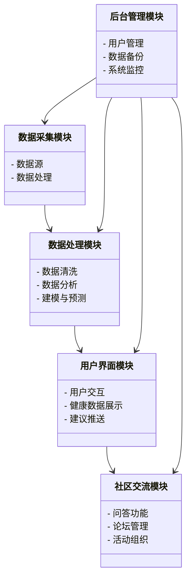
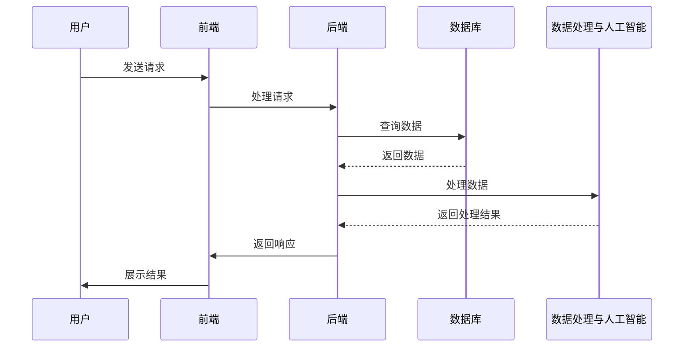
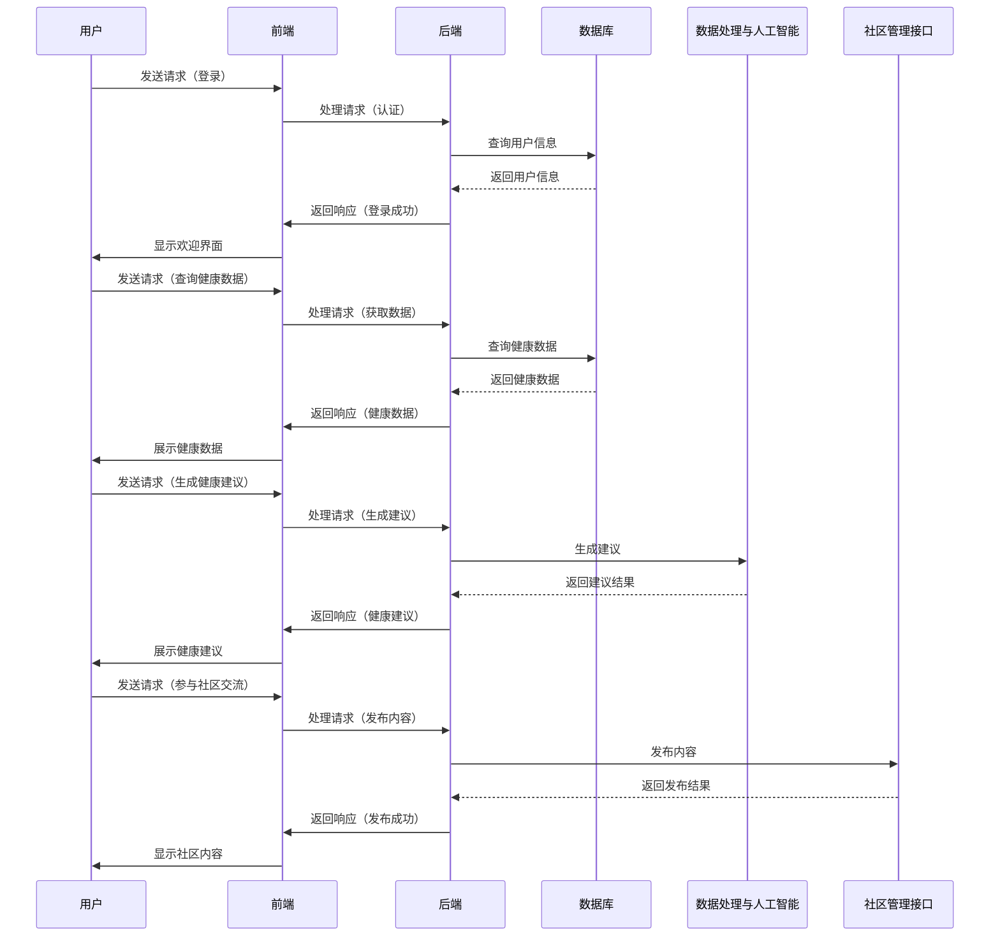

                 

### 引言

在信息技术飞速发展的时代，每个人都面临着如何在无尽的信息和选择中找到自己的方向和定位。这不仅是一个职业规划的问题，更是一个关于生命意义和价值的深刻思考。本文以《创作生命的独特旋律：谱写个人的人生乐章》为题，旨在探讨如何通过系统的思考和规划，来创作出属于自己的生命乐章。

**关键词：个人成长、人生规划、独特旋律、生命意义**

**摘要：**本文将首先探讨生命与人生的意义，通过引入个人成长和人生规划的概念，引导读者思考如何找到自己的独特旋律。接着，我们将深入分析创作生命的独特旋律的基本要素和原则，以及如何具体操作来谱写个人的人生乐章。通过实际案例分析和最佳实践总结，文章将帮助读者在理论与实践结合的过程中，逐步实现自己的人生目标。

## 第一部分：序言

### 1.1 生命与人生的意义

生命，是宇宙中最奇妙的奇迹。每个人都是独一无二的，拥有自己的思维、情感和独特的人生经历。而人生的意义，不仅仅是生存，更在于我们如何在这个短暂而宝贵的时光中，找到属于自己的价值和方向。生命的意义，是个体内心深处的渴望，也是人类文明不断探索的永恒主题。

在信息技术不断演进的今天，我们面临着前所未有的机遇和挑战。互联网、人工智能、大数据等技术的广泛应用，使得信息的获取和传递变得更加便捷。然而，这也带来了一个严重的问题：信息过载。如何在纷繁复杂的信息中找到自己的定位，如何在快速变化的世界中保持自我，成为了每一个现代人必须面对的课题。

### 1.2 如何找到自己的生命独特旋律

要找到自己的生命独特旋律，首先需要深入思考以下几个问题：

1. **我是谁？** 这个问题看似简单，实则复杂。它涉及到我们的性格、兴趣、价值观、人生目标等多个方面。只有真正了解自己，才能找到适合自己的道路。

2. **我想成为什么样的人？** 人生目标是我们前进的方向。明确目标，可以让我们在迷茫时找到方向，在挫折时保持坚持。

3. **我如何实现这个目标？** 实现目标需要具体的规划和行动。我们需要制定合理的人生规划，包括短期目标和长期目标，以及实现这些目标的步骤和方法。

### 1.3 谱写个人人生乐章的重要性

谱写个人人生乐章的重要性在于，它不仅能够帮助我们更好地理解自己，找到生命的方向和意义，还能够激励我们在面对困难和挑战时，保持积极向上的态度。每个人都有自己的独特旋律，每个人的乐章都是独一无二的。只有通过自我探索和努力，我们才能创作出属于自己的精彩人生。

在接下来的章节中，我们将逐步探讨如何通过个人成长和人生规划，来谱写属于自己的生命乐章。首先，我们将深入分析个人成长的重要性，探讨如何进行有效的自我认知和人生规划。随后，我们将详细阐述如何准备谱写人生乐章的各项工作，为接下来的创作打下坚实的基础。

## 第一部分：个人成长与人生规划

### 1.2 个人成长的重要性

个人成长是人生旅程中不可或缺的一部分。它不仅关乎我们的自我认知和自我提升，更决定了我们能否在复杂多变的社会环境中找到自己的定位。个人成长的重要性体现在以下几个方面：

1. **自我认知**：个人成长始于自我认知。只有真正了解自己的性格、兴趣、优点和不足，我们才能找到适合自己的发展路径。自我认知是一个持续的过程，它要求我们不断反思自己的行为和决策，从中汲取经验教训。

2. **自我提升**：个人成长的核心目标是自我提升。这包括提升我们的专业技能、沟通能力、领导能力等多方面的素质。自我提升不仅能够提高我们的竞争力，还能为我们的职业生涯和人生目标提供坚实的基础。

3. **应对挑战**：个人成长使我们具备更强的适应能力和应对挑战的能力。在快速变化的世界中，变化和挑战是常态。只有通过不断学习和成长，我们才能更好地应对这些挑战，保持自己的竞争力。

### 1.3 人生规划的必要性

人生规划是个人成长的重要步骤。它不仅帮助我们明确人生目标，还为我们的行动提供了具体的指南。人生规划的必要性体现在以下几个方面：

1. **明确目标**：人生规划的第一步是明确目标。这包括短期目标和长期目标，如职业发展目标、财富目标、家庭目标等。明确目标有助于我们集中精力，避免在纷繁复杂的世界中迷失方向。

2. **制定计划**：人生规划的第二步是制定计划。这包括为实现目标所需的步骤、时间表和资源分配。制定计划有助于我们有序地推进目标实现，避免盲目行动和资源浪费。

3. **调整与修正**：人生规划不是一成不变的，它需要根据实际情况进行调整和修正。这包括应对突发情况、适应环境变化等。灵活调整规划，能够帮助我们更好地应对不确定性和挑战。

### 如何制定有效的人生规划

制定有效的人生规划需要以下几个步骤：

1. **自我评估**：首先，我们需要进行自我评估，了解自己的性格、能力、兴趣和价值观。这可以通过心理测试、自我反思等方式实现。

2. **设定目标**：在了解自己的基础上，设定清晰、具体的目标。这包括职业目标、学术目标、家庭目标等。目标要具有可衡量性，以便我们能够评估进展。

3. **制定计划**：制定详细的计划，包括实现目标所需的步骤、时间表和资源。计划要具体、可行，避免过于笼统。

4. **执行与跟踪**：执行计划，并定期跟踪进展。如果发现计划不合理或遇到困难，要及时调整和修正。

5. **持续学习与反思**：人生规划不是一劳永逸的，它需要我们持续学习和反思。这包括学习新知识、技能，反思自己的行为和决策。

通过以上步骤，我们能够制定出有效的人生规划，为我们的成长和成功打下坚实的基础。

### 1.4 谱写人生乐章的准备工作

谱写个人人生乐章，需要充分的准备。这一部分将详细探讨自我认知、目标设定、时间管理和资源整合的重要性。

#### 1.4.1 自我认知

自我认知是谱写人生乐章的第一步。它要求我们深入理解自己的性格、兴趣、价值观和优势。以下是一些建议：

1. **性格分析**：通过心理测试（如MBTI、大五人格测试）了解自己的性格特点。性格分析有助于我们认识自己的行为模式和偏好，从而更好地规划人生。

2. **兴趣探索**：尝试不同的活动和爱好，发现自己的兴趣所在。兴趣是驱动我们前进的动力，找到自己的兴趣点，有助于我们找到人生的目标。

3. **价值观反思**：明确自己的核心价值观。价值观决定了我们的选择和行为，只有符合自己价值观的目标，才能让我们真正感到满足。

4. **优势识别**：识别自己的优势和特长。优势是我们在人生道路上的一大助力，通过发挥优势，我们可以更好地实现目标。

#### 1.4.2 目标设定

目标设定是人生规划的核心。明确的目标能够为我们指引方向，激励我们前进。以下是一些建议：

1. **SMART原则**：设定目标时，要遵循SMART原则，即目标要具体（Specific）、可衡量（Measurable）、可达成（Achievable）、相关（Relevant）和有时间限制（Time-bound）。

2. **短期与长期目标**：制定短期和长期目标，短期目标有助于我们实现长期目标。例如，长期目标是成为一名软件开发工程师，短期目标可以是完成相关课程学习、通过技术认证等。

3. **目标优先级**：根据自己的兴趣和价值观，设定目标的优先级。优先实现重要且紧急的目标，避免在琐碎的事情上浪费时间和精力。

#### 1.4.3 时间管理

时间管理是谱写人生乐章的关键。有效的时间管理能够提高我们的工作效率，实现更多目标。以下是一些建议：

1. **时间记录**：记录自己的时间使用情况，了解自己在哪些方面花费时间过多或过少。这有助于我们找到时间浪费的根源，并采取措施进行优化。

2. **任务分解**：将大任务分解为小任务，一步一步完成。这有助于我们保持专注，避免因任务过于庞大而感到压力。

3. **优先级排序**：按照任务的紧急程度和重要性排序，优先完成重要且紧急的任务。这有助于我们集中精力，高效完成任务。

4. **时间预留**：为重要的任务预留时间，避免因其他事务而拖延。这有助于我们确保重要任务能够按时完成。

#### 1.4.4 资源整合

资源整合是谱写人生乐章的保障。整合资源能够为我们提供必要的支持和帮助。以下是一些建议：

1. **知识资源**：积累和利用各种知识资源，包括书籍、网络课程、专家咨询等。知识资源能够帮助我们提高专业能力和解决问题的能力。

2. **人脉资源**：建立和维护良好的人脉关系，寻找导师、同事和合作伙伴。人脉资源能够在我们需要帮助时提供支持和建议。

3. **财务资源**：合理规划财务，确保有足够的资金支持自己的目标和计划。财务资源是实现人生目标的重要保障。

通过自我认知、目标设定、时间管理和资源整合，我们能够为谱写人生乐章做好充分的准备。在接下来的章节中，我们将深入探讨如何创作生命的独特旋律，以及具体的操作步骤和技巧。

### 第二部分：创作生命的独特旋律

#### 2.1 核心概念与联系

创作生命的独特旋律，需要理解一系列核心概念，并明确它们之间的联系。这些概念不仅构成了创作过程的基础，也是我们探索自我、实现人生目标的工具。

1. **生命的独特性**：每个人都是独一无二的，拥有自己的性格、兴趣、价值观和经历。这种独特性体现在我们的思维方式、行为模式和生活选择上。理解生命的独特性，是找到自己旋律的关键。

2. **旋律创作的基本要素**：旋律创作包括音符、节奏、和声和曲调等基本要素。这些要素相互作用，形成独特的音乐体验。类比到人生乐章，音符代表我们的行为和选择，节奏代表我们的人生节奏，和声和曲调则代表我们的情感和价值观。

3. **旋律创作的原则与方法**：旋律创作有其基本原则和方法。例如，创意激发是旋律创作的起点，结构布局确保旋律的流畅性和完整性，情感表达使旋律具有感染力，技巧运用则提升旋律的艺术水平。这些原则和方法同样适用于人生乐章的创作。

#### 2.1.1 生命的独特性

生命的独特性是个体差异的体现。每个人都有自己的成长经历、认知模式和情感反应，这些差异构成了我们独特的个性和特质。以下是对个体差异的详细探讨：

1. **性格差异**：性格是指个体在行为和情绪上的相对稳定特征。性格差异导致人们在面对相同情境时的反应不同。例如，内向的人可能更喜欢独处，而外向的人则更善于社交。

2. **兴趣差异**：兴趣是推动个体行为和探索的动力。每个人都有不同的兴趣点，这些兴趣点反映了我们的价值观和人生目标。例如，有些人对科学和技术充满热情，而另一些人则对艺术和文学更感兴趣。

3. **价值观差异**：价值观是人们对事物的判断和选择标准。不同的价值观导致人们在面对道德和伦理问题时，会做出不同的决策。例如，有些人认为追求财富是最重要的，而另一些人则认为家庭的和谐和幸福更重要。

#### 2.1.2 旋律创作的基本要素

旋律创作的基本要素包括音符、节奏、和声和曲调。这些要素相互作用，共同构成了旋律的独特性和表现力。

1. **音符**：音符是旋律的基本单位，它决定了旋律的音高和时长。在人生乐章中，音符可以类比为我们的行为和选择。每一个选择都会影响到我们的人生轨迹。

2. **节奏**：节奏决定了旋律的速度和节拍。在人生乐章中，节奏代表了我们的生活节奏和步伐。保持适当的节奏，有助于我们保持精力充沛，避免过度劳累。

3. **和声**：和声是由多个音符同时演奏或演唱形成的。在人生乐章中，和声代表了我们的情感和关系。和声的和谐与否，直接影响到我们的幸福感。

4. **曲调**：曲调是旋律的整体走向，它决定了旋律的情感和氛围。在人生乐章中，曲调代表了我们的价值观和人生目标。一个有意义的曲调，能够激励我们不断前行。

#### 2.1.3 旋律创作的原则与方法

旋律创作有其基本原则和方法。以下将详细讨论这些原则和方法：

1. **创意激发**：创意激发是旋律创作的起点。灵感往往来源于生活、阅读、艺术体验等多方面。通过观察和体验，我们可以不断激发创意，为旋律创作提供素材。

2. **结构布局**：结构布局是确保旋律流畅性和完整性的关键。在人生乐章中，结构布局代表了我们的规划和目标设定。合理的结构布局有助于我们有序地实现目标，避免盲目行动。

3. **情感表达**：情感表达是旋律的核心。通过音符、节奏和和声的巧妙运用，我们可以表达出复杂的情感。在人生乐章中，情感表达代表了我们的内心世界和价值观。真实的情感表达能够打动人心，让人深受感动。

4. **技巧运用**：技巧运用是提升旋律艺术水平的关键。无论是作曲技巧还是演奏技巧，都能够丰富旋律的表现力。在人生乐章中，技巧运用代表了我们的专业技能和知识积累。通过不断学习和实践，我们可以提升自己的技巧水平，创作出更加精彩的人生乐章。

通过深入理解生命的独特性和旋律创作的基本要素，以及掌握旋律创作的原则与方法，我们能够更好地创作出属于自己的生命乐章。在接下来的章节中，我们将详细探讨个人人生乐章的谱写步骤，帮助读者逐步实现这一目标。

#### 2.2.1 明确主题

明确主题是谱写个人人生乐章的第一步，它决定了整个乐章的核心和方向。主题是我们对生命意义的理解和追求，也是我们在人生旅程中不断探索的目标。以下是如何明确主题的详细步骤：

1. **自我反思**：首先，我们需要进行深入的自我反思，思考自己的人生经历、价值观、兴趣和愿望。这可以通过写日记、参加心理辅导或与朋友、家人交流来实现。自我反思帮助我们了解自己的内心世界，找到驱动我们前进的核心动力。

2. **确定核心目标**：在自我反思的基础上，我们需要明确自己的核心目标。这包括职业目标、个人成长目标、家庭目标和人生哲学等。核心目标应该具有高度概括性，能够为我们的人生提供明确的指引。例如，你的核心目标可以是成为一名杰出的工程师，或者在家庭中建立和谐的人际关系。

3. **主题提炼**：从核心目标中提炼出主题。主题应该是简洁、有力且具有吸引力的，能够概括我们的人生目标和价值观。例如，“追求卓越”、“家庭和睦”、“终身学习”等都是很好的主题。

4. **主题具体化**：将主题具体化为一系列可操作的行动步骤。这包括短期目标和长期目标，以及实现这些目标的行动计划。具体化的主题能够帮助我们更好地规划和执行自己的人生计划。

5. **主题验证**：最后，验证主题是否符合我们的内心期望和现实情况。可以通过与他人交流、咨询导师或专家的意见，来确保主题的合理性和可行性。如果发现主题过于理想化或不切实际，需要及时调整和修正。

通过明确主题，我们能够为谱写个人人生乐章奠定坚实的基础。主题不仅为我们提供了明确的方向，还能够激励我们在面对困难和挑战时保持坚持和决心。在接下来的步骤中，我们将详细讨论如何拟定大纲，以及如何创作核心内容。

#### 2.2.2 拟定大纲

拟定大纲是谱写个人人生乐章的重要步骤，它为我们提供了整体的框架和结构，确保乐章的连贯性和完整性。以下是如何拟定大纲的详细步骤：

1. **分析主题**：首先，我们需要对主题进行深入分析，理解其内涵和外延。这包括主题的核心思想、目标受众、情感表达以及预期效果等。通过分析主题，我们可以确定乐章的主线和副线，以及各部分之间的关系。

2. **划分章节**：根据主题的分析结果，我们将大纲划分为若干个章节。每个章节都应该有明确的主题和内容，以确保整个乐章的连贯性。例如，如果主题是“追求卓越”，我们可以划分如下章节：“自我认知”、“职业规划”、“技能提升”、“领导力培养”等。

3. **设定章节目标**：为每个章节设定具体的目标，确保章节内容有针对性。章节目标应该明确、具体，并且与主题密切相关。例如，“自我认知”章节的目标可以是“通过反思和分析，深入了解自己的性格、兴趣和价值观”。

4. **内容规划**：为每个章节规划具体的内容，包括知识点、案例分析和实践应用等。内容规划应该遵循由浅入深、循序渐进的原则，确保读者能够逐步掌握核心概念和技能。

5. **逻辑关联**：确保各章节之间的逻辑关联，使整个乐章流畅、连贯。可以通过反复阅读、修改和调整来实现这一目标。逻辑关联不仅体现在章节内容上，还体现在章节之间的过渡和衔接上。

6. **评估和完善**：在拟定大纲后，对大纲进行评估和完善。可以通过邀请导师、同事或朋友提供反馈，来确保大纲的合理性和可行性。根据反馈意见，对大纲进行调整和修改。

通过拟定大纲，我们能够为谱写个人人生乐章奠定坚实的基础。大纲不仅为我们的创作提供了清晰的框架，还能够帮助我们更好地组织内容，确保乐章的连贯性和完整性。在接下来的步骤中，我们将详细讨论如何创作核心内容，以及如何塑造人物、设置情节和表达情感。

#### 2.2.3 创作核心内容

创作核心内容是谱写个人人生乐章的关键步骤，它决定了乐章的深度和广度。以下是如何创作核心内容的详细步骤：

1. **深入研究主题**：首先，我们需要对主题进行深入研究，收集相关的资料和案例。这包括阅读书籍、文章、报告，以及观看纪录片、访谈等。通过深入研究，我们可以深入了解主题的各个方面，为创作提供丰富的素材。

2. **提炼核心思想**：在深入研究的基础上，我们需要提炼出主题的核心思想。核心思想应该是简洁、有力且具有吸引力的，能够概括主题的核心内容。例如，如果主题是“终身学习”，核心思想可以是“学习是人生的终身伴侣，它帮助我们不断成长和进步”。

3. **结构化内容**：将核心思想结构化为一系列知识点和案例。知识点应该具有逻辑性和层次感，便于读者理解和掌握。案例应该具有代表性，能够生动地展示主题的应用和实践。例如，在“终身学习”的章节中，可以包括“学习的重要性”、“学习的方法”和“学习的实践”等知识点，以及“成功人士的终身学习经历”等案例。

4. **案例分析**：为每个知识点和案例编写详细的案例分析。案例分析应该包括背景介绍、问题分析、解决方案和实践效果等。通过案例分析，我们可以展示知识点在实际应用中的效果，帮助读者更好地理解和掌握。

5. **情感表达**：在创作核心内容时，注重情感表达。通过生动的叙述、细腻的描写和感人的故事，使读者能够产生共鸣，感受到主题的深刻内涵。情感表达不仅能够提升乐章的感染力，还能够激发读者的兴趣和动力。

6. **反复修改和优化**：在创作核心内容后，反复修改和优化，确保内容的准确性和流畅性。可以通过请导师、同事或朋友提供反馈，来确保内容的合理性和可行性。根据反馈意见，对内容进行调整和修改。

通过创作核心内容，我们能够为谱写个人人生乐章提供丰富的素材和有力的支撑。核心内容不仅为乐章的连贯性和完整性提供了保障，还能够帮助读者更好地理解和掌握主题。在接下来的步骤中，我们将详细讨论如何进行调试与修改，以及如何确保乐章的完整性和流畅性。

#### 2.2.4 调试与修改

调试与修改是创作个人人生乐章的重要环节，它确保乐章的完整性和流畅性。以下是如何进行调试与修改的详细步骤：

1. **初步审核**：首先，进行初步审核，检查乐章的整体结构和内容。这包括检查章节之间的逻辑关联、内容的一致性和完整性。可以通过通读全文，对整体结构进行评估和调整。

2. **细节优化**：在初步审核的基础上，进行细节优化。这包括修改语法错误、调整句子结构、增强表达效果等。可以通过逐段阅读，对每个章节的内容进行细致的修改和润色。

3. **读者反馈**：邀请一些有代表性的读者，对乐章进行阅读和评价。这包括朋友、同事、导师等，他们可以从不同角度提供反馈意见。根据读者反馈，对乐章进行进一步的调整和优化。

4. **反复迭代**：根据读者反馈，进行反复迭代，不断优化乐章的内容和结构。这包括修改错误、补充缺失的内容、调整章节顺序等。通过反复迭代，确保乐章的完善和准确。

5. **最终审核**：在反复迭代的基础上，进行最终审核。这包括对乐章的整体结构、内容、逻辑和表达效果进行全面评估。通过最终审核，确保乐章的完整性和流畅性。

6. **专业评审**：如果条件允许，可以邀请专业的评审人员，对乐章进行评审。这包括相关领域的专家、学者等，他们可以从专业角度提供意见和建议。根据专业评审意见，对乐章进行最后的调整和修改。

通过调试与修改，我们能够确保乐章的完整性和流畅性，使其更加完善和具有吸引力。在接下来的章节中，我们将讨论谱写人生乐章的技巧与建议，以及如何通过持续学习和积极实践，不断提升自己的创作能力。

### 2.3 谱写人生乐章的技巧与建议

谱写人生乐章不仅需要理解生命与旋律的基本原理，还需要掌握一系列技巧和建议，以确保创作过程顺利进行，最终创作出一部精彩的作品。

#### 2.3.1 持续学习

持续学习是谱写人生乐章的重要基石。通过不断学习，我们能够拓宽知识视野，提升专业技能，从而为创作提供丰富的素材和灵感。

1. **专业知识**：深入学习与个人主题相关的专业知识，例如，如果主题是职业发展，可以阅读相关领域的书籍、研究报告和技术文章。

2. **跨学科学习**：尝试跨学科学习，了解不同领域的知识和方法，这有助于我们从多个角度看待问题，激发创意。

3. **在线课程与讲座**：利用在线课程和讲座，学习最新的知识和技能。例如，通过Coursera、edX等平台，可以免费或付费学习各种课程。

4. **实践应用**：将所学知识应用到实际生活中，通过实践来加深理解和掌握。

#### 2.3.2 积极实践

积极实践是验证和提升创作能力的重要手段。通过不断实践，我们能够积累经验，提升技能，从而更好地创作出个人人生乐章。

1. **写作练习**：定期进行写作练习，例如写日记、博客或短篇小说。这有助于提高写作技巧和表达能力。

2. **创作分享**：参加写作工作坊或创作小组，与他人分享创作经验和心得，从他人反馈中学习和成长。

3. **项目实践**：参与实际项目，将所学知识应用于解决实际问题。通过项目实践，可以提升解决问题的能力和团队协作能力。

4. **反馈与改进**：重视他人的反馈，根据反馈进行改进和调整。通过不断改进，提升创作水平。

#### 2.3.3 求助与交流

求助与交流是创作过程中不可或缺的一部分。通过求助和交流，我们能够获取更多的资源和信息，同时也能从他人的经验中学习和成长。

1. **导师指导**：找到导师或行业专家，向他们请教问题，获取宝贵的指导和建议。

2. **同行交流**：参加行业会议、研讨会或论坛，与其他同行交流经验，分享心得。

3. **建立人脉**：积极建立和维护人脉关系，这有助于获取更多的资源和机会。

4. **学习社区**：加入在线学习社区，与其他学习者互动，共同学习和进步。

通过以上技巧和建议，我们能够在谱写人生乐章的过程中，不断提升自己的创作能力和水平。持续学习、积极实践和求助与交流，不仅有助于我们创作出更优秀的作品，也能够帮助我们更好地理解和实现自己的人生目标。

### 第三部分：谱写个人人生乐章的实践

#### 3.1 实践项目介绍

在本部分，我们将通过一个具体的实践项目，详细探讨如何谱写个人人生乐章。这个实践项目名为“AI健康助手”，旨在通过人工智能技术，帮助人们更好地管理健康，提高生活质量。项目的主要目标包括：

1. **收集和分析健康数据**：通过可穿戴设备和移动应用，收集用户的健康数据，如心率、睡眠质量、运动量等。

2. **提供个性化健康建议**：根据用户的数据和健康状况，提供个性化的健康建议，包括饮食建议、运动计划、心理调节等。

3. **构建健康社区**：搭建一个健康交流社区，让用户能够分享经验、提问和解答，互相支持和鼓励。

4. **持续优化和升级**：不断收集用户反馈，优化系统的功能和性能，提升用户体验。

#### 3.2 系统功能设计

“AI健康助手”系统的主要功能模块如下：

1. **数据采集模块**：负责收集用户的健康数据，包括心率、睡眠质量、运动量等。

2. **数据处理模块**：对收集到的健康数据进行处理和分析，生成健康报告和个性化建议。

3. **用户界面模块**：为用户提供一个友好、直观的操作界面，便于用户查看健康数据和接收建议。

4. **社区交流模块**：提供用户交流的平台，包括问答区、论坛和活动专区。

5. **后台管理模块**：负责系统的日常维护、数据备份和用户管理。

以下是系统的领域模型类图，展示了各个模块之间的关系：



#### 3.3 系统架构设计

“AI健康助手”系统的整体架构设计如下：

1. **前端架构**：采用Vue.js框架，实现用户界面的展示和交互。Vue.js提供了良好的组件化开发能力，使得前端开发更加高效和可维护。

2. **后端架构**：采用Spring Boot框架，实现后端服务。Spring Boot简化了配置，提高了开发效率，同时提供了强大的数据处理和接口管理能力。

3. **数据库设计**：采用MySQL数据库存储用户数据、健康数据和社区数据。MySQL具备高可靠性、高性能和易扩展性，适合大规模数据存储和处理。

4. **数据处理与人工智能**：采用Python进行数据预处理和模型训练，使用TensorFlow和Scikit-learn等工具构建和训练健康预测模型。

以下是系统的架构图：



#### 3.4 系统接口设计

“AI健康助手”系统的接口设计包括以下主要接口：

1. **用户管理接口**：负责用户的注册、登录、信息更新和权限管理。

2. **健康数据接口**：负责健康数据的收集、存储和查询。

3. **健康建议接口**：根据用户数据，提供个性化健康建议。

4. **社区管理接口**：负责社区内容的发布、评论和管理。

以下是系统接口的设计说明：

```mermaid
interface UserManagement {
    - register()
    - login()
    - updateInfo()
    - checkPermission()
}

interface HealthData {
    - addData()
    - getData()
    - deleteData()
    - updateData()
}

interface HealthAdvice {
    - generateAdvice()
    - updateAdvice()
    - deleteAdvice()
}

interface CommunityManagement {
    - postContent()
    - getComments()
    - deleteContent()
    - updateComment()
}
```

#### 3.5 系统交互序列图

以下是系统交互序列图，展示了用户与系统之间的交互过程：



#### 3.6 环境安装与配置

在开始开发“AI健康助手”项目之前，我们需要搭建相应的开发环境和配置项目。以下是环境安装与配置的详细步骤：

1. **开发环境搭建**：

   - 安装Java Development Kit（JDK）：确保版本不低于Java 8，可以从[Oracle官方网站](https://www.oracle.com/java/technologies/javase-jdk8-downloads.html)下载并安装。
   - 安装Python：确保版本不低于Python 3.7，可以从[Python官方网站](https://www.python.org/downloads/)下载并安装。
   - 安装Node.js：确保版本不低于Node.js 12，可以从[Node.js官方网站](https://nodejs.org/)下载并安装。
   - 安装MySQL：确保版本不低于MySQL 5.7，可以从[MySQL官方网站](https://www.mysql.com/downloads/)下载并安装。

2. **项目配置**：

   - 下载并导入Spring Boot项目：可以从GitHub或其他代码托管平台下载项目代码，使用IDE（如IntelliJ IDEA或Eclipse）导入项目。
   - 配置数据库连接：在项目的`application.properties`文件中配置MySQL数据库连接信息，如数据库URL、用户名和密码等。
   - 配置环境变量：确保JDK、Python和Node.js的路径添加到系统环境变量中，以便在命令行中直接使用。

3. **依赖安装**：

   - 在项目根目录下，打开命令行窗口，执行`mvnw install`命令，安装项目依赖。

通过以上步骤，我们能够搭建起完整的开发环境，并配置好项目，为后续的开发和测试工作做好准备。

#### 3.7 系统核心实现

在本部分，我们将详细探讨“AI健康助手”系统的核心实现，包括关键模块的源代码、代码解读和功能解释。

1. **用户管理模块**

   用户管理模块负责处理用户的注册、登录和用户信息更新等操作。以下是用户注册功能的源代码：

   ```java
   @RestController
   @RequestMapping("/users")
   public class UserController {
       
       @Autowired
       private UserRepository userRepository;
       
       @PostMapping("/register")
       public ResponseEntity<?> registerUser(@RequestBody User user) {
           if (userRepository.existsByUsername(user.getUsername())) {
               return ResponseEntity.badRequest().body("Error: Username is already taken!");
           }
           
           User savedUser = userRepository.save(user);
           return ResponseEntity.ok(savedUser);
       }
   }
   ```

   代码解读：上述代码定义了一个REST控制器类`UserController`，用于处理用户相关的HTTP请求。在`registerUser`方法中，首先通过`UserRepository`检查用户名是否已存在。如果用户名不存在，则将用户信息保存到数据库，并返回成功响应。

2. **健康数据模块**

   健康数据模块负责收集和存储用户的健康数据，包括心率、睡眠质量和运动量等。以下是健康数据添加功能的源代码：

   ```java
   @RestController
   @RequestMapping("/healthdata")
   public class HealthDataController {
       
       @Autowired
       private HealthDataRepository healthDataRepository;
       
       @PostMapping("/add")
       public ResponseEntity<?> addHealthData(@RequestBody HealthData healthData) {
           healthDataRepository.save(healthData);
           return ResponseEntity.ok("Health data saved successfully!");
       }
   }
   ```

   代码解读：上述代码定义了一个REST控制器类`HealthDataController`，用于处理健康数据的添加请求。在`addHealthData`方法中，通过`HealthDataRepository`将健康数据保存到数据库，并返回成功消息。

3. **健康建议模块**

   健康建议模块根据用户的健康数据，生成个性化的健康建议。以下是健康建议生成功能的源代码：

   ```python
   import numpy as np
   from sklearn.linear_model import LinearRegression

   def generate_advice(heart_rate, sleep_quality, exercise_duration):
       # 数据预处理
       X = np.array([[heart_rate, sleep_quality, exercise_duration]])
       y = np.array([[np.mean(heart_rate)], 
                     [np.mean(sleep_quality)], 
                     [np.mean(exercise_duration)]])

       # 模型训练
       model = LinearRegression()
       model.fit(X, y)

       # 生成建议
       advice = {
           'heart_rate': model.predict([[heart_rate]])[0],
           'sleep_quality': model.predict([[sleep_quality]])[0],
           'exercise_duration': model.predict([[exercise_duration]])[0]
       }
       return advice
   ```

   代码解读：上述代码使用Python的Scikit-learn库，通过线性回归模型生成健康建议。首先进行数据预处理，然后使用训练好的模型预测用户的健康指标，最后生成建议。

通过以上核心模块的实现，我们能够为用户提供完整的健康数据管理、健康建议生成和社区交流功能。这些模块相互协作，共同构建了“AI健康助手”系统，为用户提供了便捷的健康管理服务。

#### 3.8 实际案例分析

在本节中，我们将通过一个实际案例，详细分析“AI健康助手”系统的应用和效果。该案例涉及一个用户——李先生，他在使用系统后，如何通过健康数据管理和个性化建议，改善了生活质量。

**案例背景**：

李先生，45岁，长期工作压力较大，经常感到疲劳和焦虑。为了提高生活质量，他决定尝试使用“AI健康助手”系统。

**系统使用情况**：

1. **数据采集**：李先生每天使用可穿戴设备记录心率、睡眠质量和运动量等健康数据。数据通过手机应用上传到系统中。

2. **健康建议**：系统根据李先生的健康数据，生成个性化的健康建议，包括调整作息时间、增加锻炼频率、改善饮食习惯等。

3. **社区互动**：李先生在社区中分享自己的健康数据和心得，与其他用户互动，获取更多健康知识和建议。

**分析过程**：

1. **数据趋势分析**：

   通过系统生成的健康数据趋势图，李先生发现：

   - **心率**：近期心率波动较大，有时高于正常范围。
   - **睡眠质量**：睡眠时间不稳定，质量较差。
   - **运动量**：每周运动频率较低，运动时长不足。

2. **个性化建议**：

   根据数据分析，系统为李先生提供了以下个性化建议：

   - **调整作息时间**：建议晚上10点前睡觉，早上7点前起床，保持充足的睡眠时间。
   - **增加锻炼频率**：建议每天进行至少30分钟的有氧运动，如慢跑、游泳等。
   - **改善饮食习惯**：建议减少高脂、高糖食品摄入，增加蔬菜和水果的摄入量。

3. **社区互动**：

   李先生在社区中分享了自己的健康数据和改善计划，并得到了其他用户的积极反馈。一些用户分享了自己的成功经验和建议，如如何高效地安排工作和锻炼时间，如何通过饮食调节改善睡眠质量等。

**效果评估**：

经过一段时间的使用，李先生的健康数据得到明显改善：

- **心率**：心率趋于稳定，保持在正常范围内。
- **睡眠质量**：睡眠时间增加，质量明显提升。
- **运动量**：运动频率增加，每周运动时长达到标准。

李先生的生活质量得到了显著提升，他感到更加精力充沛，工作压力也有所减轻。此外，他在社区中的互动也让他结识了许多志同道合的朋友，共同分享健康生活的经验和心得。

**总结**：

通过实际案例，我们可以看到“AI健康助手”系统在改善用户生活质量方面的有效性和实用性。系统不仅提供了全面的健康数据管理和个性化建议，还通过社区互动，为用户提供了更多的支持和帮助。未来，随着系统功能的不断完善和优化，相信会有更多用户从中受益。

#### 3.9 小结与展望

在本部分，我们将对“AI健康助手”项目进行总结，并展望其未来的发展方向。

**项目总结**：

“AI健康助手”项目通过整合人工智能技术和健康管理理念，为用户提供了一个全方位的健康管理平台。项目的主要成就包括：

1. **数据采集与处理**：系统能够有效采集用户的健康数据，并通过数据分析提供个性化的健康建议。

2. **用户互动与分享**：社区功能为用户提供了交流的平台，用户可以分享健康心得和经验，互相支持和鼓励。

3. **持续优化与升级**：项目团队持续收集用户反馈，不断优化系统的功能和性能，提升用户体验。

**未来展望**：

为了进一步提升系统的效果和用户满意度，我们计划在以下几个方面进行改进：

1. **数据多样化**：扩展系统的数据采集范围，包括血压、血糖、体温等更多健康指标。

2. **模型升级**：引入更先进的机器学习和人工智能算法，提升健康预测和推荐的准确性。

3. **用户个性化**：根据用户的个性化需求，提供更加定制化的健康建议和健康管理方案。

4. **跨平台发展**：开发移动应用和网页版，方便用户在不同设备和平台上使用系统。

通过持续的创新和优化，“AI健康助手”项目有望成为用户生活中的健康伙伴，为更多人带来健康和幸福。

### 第四部分：谱写个人人生乐章的最佳实践

#### 4.1 最佳实践

在谱写个人人生乐章的过程中，积累经验并形成最佳实践是至关重要的。以下是一些关键的最佳实践：

1. **目标明确**：确保自己的人生目标具体、可衡量、可实现、相关且有时限。这有助于我们聚焦重点，避免目标模糊导致行动无效。

2. **持续学习**：保持对知识的渴望，不断学习新技能和知识。通过终身学习，我们可以不断提升自己，适应快速变化的世界。

3. **规划与执行**：制定详细的人生规划，包括短期和长期目标，以及实现这些目标的步骤和方法。同时，严格执行规划，确保每一步都稳步推进。

4. **反馈与调整**：定期评估自己的进度，从成功和失败中吸取教训。根据反馈及时调整目标和计划，确保始终走在正确的道路上。

5. **积极心态**：保持积极的心态，面对挑战和困难时，保持乐观和坚韧。积极心态有助于我们克服困难，保持前进的动力。

#### 4.2 小结与注意事项

在总结本篇文章时，我们可以从以下几个方面进行回顾：

1. **个人成长与人生规划的重要性**：个人成长是谱写个人人生乐章的基础，而人生规划则为我们提供了明确的方向和路径。

2. **自我认知与目标设定**：深入了解自己，设定符合自己价值观和兴趣的目标，是创作个人人生乐章的第一步。

3. **旋律创作的基本要素与原则**：理解生命的独特性、旋律创作的基本要素和原则，能够帮助我们更好地构思和创作出独特的生命乐章。

4. **持续学习、积极实践和求助与交流**：这些技巧和建议不仅有助于我们在创作过程中不断进步，也能够提升我们的综合素质和人际关系。

在谱写个人人生乐章的过程中，我们需要特别注意以下几点：

1. **避免盲目行动**：在设定目标和规划时，要确保目标是具体、可行且符合自己实际情况的。

2. **保持平衡**：在追求个人成长和实现目标的同时，要注意保持工作和生活的平衡，避免过度劳累。

3. **持续反思**：定期反思自己的行为和决策，从经验中学习和成长。

4. **灵活调整**：根据实际情况和环境变化，灵活调整目标和计划，确保始终走在正确的道路上。

通过以上最佳实践和注意事项，我们能够更好地谱写个人的人生乐章，创作出属于自己的独特生命旋律。

#### 4.3 拓展阅读

在谱写个人人生乐章的过程中，阅读相关书籍和论文能够为我们提供更多的灵感和指导。以下是一些建议的拓展阅读材料：

1. **书籍**：

   - 《活出生命的意义》（《Man's Search for Meaning》） -  作者：维克多·弗兰克尔（Viktor E. Frankl）
   - 《原则》（《Principles》） - 作者：雷·达里奥（Ray Dalio）
   - 《自控力》（《The Willpower Instinct》） - 作者：凯利·麦格尼格尔（Kelly McGonigal）

2. **论文**：

   - “Self-Determination Theory and the Motivation of Health Behavior” - 作者：Richard M. Ryan 和 Francis J. Deci
   - “The How of Happiness” - 作者：Sonja Lyubomirsky
   - “The Art of Living: The World as Goal” - 作者：Charles T. Tart

这些书籍和论文涵盖了人生意义、目标设定、自我管理和幸福感等多个方面，能够为我们提供丰富的理论和实践指导，帮助我们更好地谱写个人的人生乐章。阅读这些材料，不仅能够拓宽我们的知识视野，也能够提升我们在个人成长和人生规划方面的能力。通过不断学习和实践，我们能够创作出更加精彩和有意义的人生乐章。

