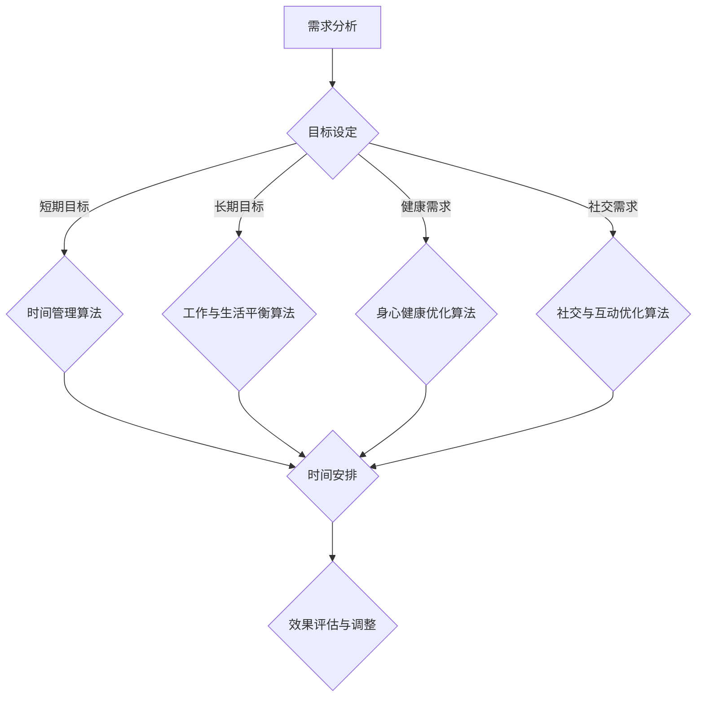
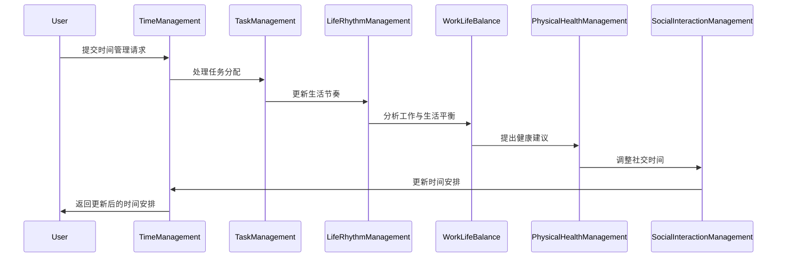
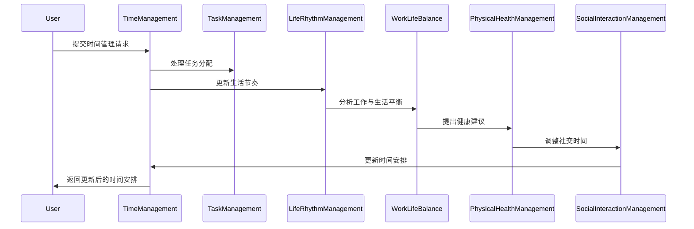

                 

## 《创造个人生活节奏：设计独特的人生乐章》

### 关键词：个人生活节奏、设计原则、时间管理、高效生活、自我成长

#### 摘要：

在现代快节奏的生活中，个人生活节奏的掌控显得尤为重要。本文旨在探讨如何通过科学的方法，设计出适合自己的生活节奏，从而实现高效生活与自我成长的平衡。文章将首先介绍个人生活节奏的概念和重要性，接着探讨其构成要素，并引入相关的理论框架与核心概念。随后，文章将深入讲解设计个人生活节奏的具体方法，通过实际案例展示其应用效果。最后，文章将介绍相关的算法原理、数学模型与系统架构设计，并通过项目实战来验证这些方法的可行性和实用性。希望本文能为读者提供有价值的启示，帮助他们在纷繁复杂的生活中找到自己的节奏，创造独特的人生乐章。

### 第一部分：序言与引论

#### 第1章：序言

##### 1.1 问题背景与意义

在当今社会，我们面临着前所未有的生活节奏加快和工作压力增大的挑战。随着科技的发展，人们的生活方式和工作模式也发生了翻天覆地的变化。然而，这种变化并没有带来预期的幸福感，反而使许多人感到疲惫和焦虑。据调查，现代人的平均睡眠时间比上世纪减少了近两小时，同时心理健康问题也日益突出。因此，如何在这种快节奏的生活中找到自己的平衡点，设计出适合自己的生活节奏，成为了一个亟待解决的问题。

个人生活节奏的掌控不仅关系到个人的身心健康，还直接影响到工作效率和生活质量。一个合理的生活节奏能够帮助人们更好地管理时间和资源，减少焦虑和压力，提高生活满意度。因此，研究个人生活节奏的设计原则和方法，不仅具有理论意义，也具有实际的应用价值。

##### 1.2 研究目标与内容

本文的研究目标是通过科学的方法，探讨如何设计个人生活节奏，实现高效生活和自我成长的平衡。具体内容包括：

1. **定义与重要性**：介绍个人生活节奏的定义和重要性，解释其对个人生活的影响。
2. **构成要素**：分析个人生活节奏的构成要素，包括时间管理、工作与生活平衡、身心健康等。
3. **理论框架与核心概念**：引入相关的理论框架与核心概念，为后续的研究提供基础。
4. **设计方法**：详细讲解设计个人生活节奏的具体方法，包括需求分析、目标设定和计划实施。
5. **实践应用**：通过实际案例展示个人生活节奏设计的方法在实际中的应用效果。
6. **算法原理与数学模型**：介绍个人生活节奏设计相关的算法原理和数学模型，提供理论支持。
7. **系统架构设计**：讨论个人生活节奏系统的架构设计，包括功能设计、接口设计和系统交互。
8. **项目实战**：通过项目实战验证个人生活节奏设计的可行性和实用性。
9. **最佳实践与总结**：总结最佳实践，提供注意事项，并推荐拓展阅读。

##### 1.3 研究方法与结构

本文采用的研究方法主要包括文献综述、案例分析、算法设计、数学建模和系统架构设计。首先，通过文献综述和案例研究，了解当前关于个人生活节奏的研究现状和应用实践。其次，基于这些研究，提出个人生活节奏设计的方法和原则。然后，通过数学建模和算法设计，为个人生活节奏的优化提供理论支持。最后，通过系统架构设计，实现个人生活节奏管理系统的构建。

本文的结构安排如下：

1. **引论**：介绍研究背景、目标和意义，以及研究方法和结构。
2. **理论框架与核心概念**：介绍相关理论框架和核心概念，包括生活节奏理论、时间管理和工作生活平衡等。
3. **设计方法**：详细讲解设计个人生活节奏的具体方法，包括需求分析、目标设定和计划实施。
4. **实践应用**：通过实际案例展示个人生活节奏设计的方法在实际中的应用效果。
5. **算法原理与数学模型**：介绍个人生活节奏设计相关的算法原理和数学模型。
6. **系统架构设计**：讨论个人生活节奏系统的架构设计，包括功能设计、接口设计和系统交互。
7. **项目实战**：通过项目实战验证个人生活节奏设计的可行性和实用性。
8. **最佳实践与总结**：总结最佳实践，提供注意事项，并推荐拓展阅读。

通过本文的研究，希望能够为读者提供有价值的启示，帮助他们在快节奏的生活中找到自己的平衡点，设计出独特的人生乐章。

### 第2章：引论

##### 2.1 个人生活节奏的定义

个人生活节奏是指个人在日常生活中所遵循的时间规律和行为模式。它不仅包括日常作息的时间安排，还涵盖了个人在工作、学习、休闲和社交等方面的行为习惯。具体来说，个人生活节奏可以分解为以下几个方面的内容：

1. **作息时间**：包括早晨起床时间、晚上入睡时间以及午休时间等。
2. **工作与学习**：包括工作时间、学习时间和休息时间等。
3. **休闲与娱乐**：包括休闲时间、娱乐时间和运动时间等。
4. **社交与互动**：包括社交时间、互动时间和家庭时间等。

个人生活节奏的多样性体现在每个人的生活方式和习惯上。有些人可能习惯早起早睡，而有些人则偏好熬夜；有些人喜欢在周末安排丰富的社交活动，而有些人则更喜欢安静的独处时光。总之，个人生活节奏是一个个性化的概念，它反映了个人对时间的管理和利用方式。

##### 2.2 个人生活节奏的重要性

个人生活节奏对个人的身心健康和生活质量有着深远的影响。以下是一些关键点：

1. **身心健康**：一个合理的生活节奏有助于保持身体的健康和精神的愉悦。例如，规律的作息时间可以促进身体的生物钟调节，有助于睡眠质量的提高。此外，合理的工作与休息时间安排有助于缓解工作压力，预防职业倦怠。

2. **工作效率**：个人生活节奏对工作效率也有显著的影响。一个高效的生活节奏可以帮助个人更好地管理时间，减少不必要的浪费，从而提高工作效率。例如，通过合理规划工作时间和休息时间，可以避免疲劳工作，提高工作质量。

3. **生活满意度**：个人生活节奏的掌控程度直接关系到个人的生活满意度。一个符合个人需求和生活习惯的生活节奏，能够使个人感到更加满意和充实。相反，如果生活节奏混乱，个人可能会感到焦虑、不安和不满。

4. **社交互动**：个人生活节奏也对社交互动产生影响。一个合理的生活节奏可以帮助个人更好地安排社交活动，与他人保持良好的互动和沟通。这不仅有助于增强人际关系，还可以提高个人的社交能力和情商。

##### 2.3 个人生活节奏的构成要素

个人生活节奏的构成要素主要包括以下几个方面：

1. **时间管理**：时间管理是个人生活节奏的核心要素之一。它涉及到个人如何合理安排时间，分配不同任务的时间，以及如何处理突发事件和紧急任务。

2. **工作与生活平衡**：工作与生活平衡是指个人如何在工作和生活中找到平衡点，避免工作过度或生活失衡。这包括合理规划工作时间，确保充足的休息和娱乐时间，以及处理工作中的压力和挑战。

3. **身心健康**：身心健康是个人生活节奏的基础。它包括保持良好的饮食和运动习惯，定期进行健康检查，以及保持积极的心态和情绪。

4. **休闲与娱乐**：休闲与娱乐是个人生活节奏的重要组成部分。它包括个人喜爱的娱乐活动、休闲时间安排以及与家人和朋友的互动。

5. **社交与互动**：社交与互动是指个人如何与他人进行沟通和互动，包括工作场合的社交、朋友聚会、家庭活动等。

通过对个人生活节奏的构成要素进行分析，我们可以更好地理解个人生活节奏的本质，并找到适合自己的节奏。接下来，本文将深入探讨这些构成要素，并提出具体的设计方法和实践应用。

### 第3章：理论框架与核心概念

##### 3.1 生活节奏理论概述

生活节奏理论是研究个人时间管理、行为模式和生活方式的理论体系。它旨在探讨如何通过科学的方法，设计出符合个人需求和生活习惯的生活节奏，从而实现高效生活和自我成长的平衡。生活节奏理论的核心思想是“时间即资源”，强调时间管理的重要性，并倡导个人在快节奏的生活中找到自己的平衡点。

生活节奏理论主要包括以下几个方面的内容：

1. **时间管理**：时间管理是生活节奏理论的重要组成部分。它涉及到如何合理安排时间，提高时间利用效率。时间管理的方法包括优先级排序、任务分解、时间块管理等。

2. **工作生活平衡**：工作生活平衡是指如何在工作和生活中找到平衡点，避免工作过度或生活失衡。工作生活平衡的理论强调个人应该合理安排工作时间，确保充足的休息和娱乐时间，以及处理工作中的压力和挑战。

3. **身心健康**：身心健康是生活节奏理论的基础。理论认为，个人的身心健康直接影响生活质量和工作效率。因此，保持良好的饮食和运动习惯，定期进行健康检查，以及保持积极的心态和情绪，都是重要的健康策略。

4. **休闲与娱乐**：休闲与娱乐是生活节奏理论的重要组成部分。理论认为，个人应该有足够的休闲和娱乐时间，以缓解工作压力，提高生活质量。休闲活动可以是阅读、旅行、运动、与家人朋友聚会等。

5. **社交与互动**：社交与互动是生活节奏理论的一个关键方面。理论认为，个人的社交活动和互动对其心理健康和生活满意度有着重要影响。因此，个人应该合理安排社交活动，保持良好的社交网络。

##### 3.2 核心概念与联系

在生活节奏理论中，有几个核心概念与联系是关键，这些概念相互交织，共同构成了个人生活节奏的设计原则。

1. **时间管理**：时间管理是个人生活节奏的基础。时间管理不仅涉及到如何合理安排时间，还包括如何处理突发事件和紧急任务。时间管理的方法包括优先级排序、任务分解和时间块管理。

2. **工作与生活平衡**：工作与生活平衡是个人生活节奏的一个重要目标。工作与生活平衡不仅涉及到时间分配，还包括心理和情感上的平衡。个人应该学会在工作与生活之间找到平衡点，避免过度工作或生活失衡。

3. **身心健康**：身心健康是个人生活节奏的基础。保持身心健康不仅需要良好的饮食和运动习惯，还需要保持积极的心态和情绪。身心健康直接影响生活质量和工作效率。

4. **休闲与娱乐**：休闲与娱乐是缓解工作压力和提升生活质量的重要途径。个人应该有足够的休闲和娱乐时间，以缓解工作压力，提高生活满意度。

5. **社交与互动**：社交与互动是个人生活节奏的一个重要组成部分。良好的社交活动和互动有助于提升个人的心理健康和生活满意度。

这些核心概念相互联系，共同构成了个人生活节奏的设计原则。以下是一个概念属性特征对比表格，帮助理解这些概念之间的关系：

| 核心概念 | 定义 | 属性特征对比 |
|----------|------|--------------|
| 时间管理 | 如何合理安排时间，提高时间利用效率 | 包括优先级排序、任务分解、时间块管理 |
| 工作与生活平衡 | 如何在工作与生活中找到平衡点 | 需要合理的时间分配，心理和情感上的平衡 |
| 身心健康 | 保持良好的饮食和运动习惯，积极的心态 | 影响生活质量和工作效率 |
| 休闲与娱乐 | 缓解工作压力，提高生活质量 | 包括阅读、旅行、运动、社交活动 |
| 社交与互动 | 良好的社交活动和互动，提升心理健康 | 促进人际关系，提高生活满意度 |

通过这个表格，我们可以更清晰地看到这些核心概念之间的联系和区别，以及它们在个人生活节奏设计中的重要性。

##### 3.3 概念属性特征对比表格

为了更好地理解各个核心概念之间的区别和联系，我们通过一个概念属性特征对比表格来进行详细说明。

| 核心概念 | 定义 | 关键属性 | 比较分析 |
|----------|------|----------|----------|
| 时间管理 | 如何合理安排时间，提高时间利用效率 | 优先级排序、任务分解、时间块管理 | 强调效率和目标的实现 |
| 工作与生活平衡 | 如何在工作与生活中找到平衡点 | 时间分配、心理和情感平衡 | 关注整体生活质量 |
| 身心健康 | 保持良好的饮食和运动习惯，积极的心态 | 饮食、运动、心态健康 | 基础条件，影响其他方面 |
| 休闲与娱乐 | 缓解工作压力，提高生活质量 | 休闲活动、娱乐时间 | 提升生活质量，减少压力 |
| 社交与互动 | 良好的社交活动和互动，提升心理健康 | 社交网络、互动质量 | 增强人际关系，提升心理健康 |

通过这个表格，我们可以清晰地看到各个核心概念的定义、关键属性以及它们之间的比较分析。这有助于我们更深入地理解个人生活节奏的构成要素，为后续的设计方法提供理论基础。

### 第4章：设计个人生活节奏的方法

#### 4.1 需求分析

设计个人生活节奏的第一步是进行需求分析，了解个人的具体需求和目标。这一过程可以通过以下几个步骤进行：

1. **自我评估**：首先，个人需要对自己的生活习惯、时间管理方式以及身心健康状况进行全面的自我评估。这包括了解自己的作息时间、工作模式、休闲活动、饮食和运动习惯等。

2. **目标设定**：在自我评估的基础上，个人需要设定明确的目标。这些目标可以包括改善作息时间、提高工作效率、增强身体健康、增加休闲活动等。目标应该具体、可行，并且与个人的长期规划相一致。

3. **问题识别**：通过自我评估和目标设定，个人可以识别出当前生活中存在的问题和挑战。例如，可能存在作息时间不规律、工作压力大、缺乏运动、社交活动不足等问题。

4. **需求分析**：在识别出问题和目标后，个人需要进一步分析自己的需求。这包括分析当前的时间利用情况、资源分配情况以及潜在的限制条件。通过需求分析，个人可以更清晰地了解自己的需求和目标，为后续的设计提供依据。

#### 4.2 目标设定

目标设定是设计个人生活节奏的关键步骤，一个明确且合理的目标可以帮助个人更好地规划生活，提高生活质量。以下是一些目标设定的方法和策略：

1. **SMART原则**：SMART原则是一个广泛使用的目标设定方法，它要求目标具有具体性（Specific）、可衡量性（Measurable）、可实现性（Achievable）、相关性（Relevant）和时限性（Time-bound）。例如，一个具体的目标可以是“每周进行三次运动，每次45分钟”。

2. **长期与短期目标**：个人应该设定长期和短期目标，以确保生活的连续性和可操作性。长期目标可能是“每年阅读20本书”，而短期目标可能是“每天阅读30分钟”。

3. **优先级排序**：在设定目标时，个人需要考虑目标的优先级。优先级排序有助于个人集中精力处理最重要的事情，提高效率。例如，如果个人希望在工作和健康之间找到平衡，那么健康目标可能会被设定为更高的优先级。

4. **灵活调整**：目标设定不是一成不变的，个人应该根据实际情况灵活调整目标。如果某个目标在短期内无法实现，可以将其分解为更小、更具体的目标，逐步实现。

5. **激励与反馈**：设定目标时，个人可以设置激励措施和反馈机制，以保持动力和持续改进。例如，完成一个目标后可以给自己一个小奖励，或者与他人分享自己的进步，以获得支持和鼓励。

通过科学的目标设定，个人可以更加明确自己的生活方向，有效地管理时间和资源，提高生活质量。

#### 4.3 计划与实施

一旦目标设定完成，下一步就是制定具体的计划并实施。以下是一些关键的步骤和策略：

1. **制定计划**：制定详细的行动计划是实现目标的关键。计划应包括具体的任务、时间安排和责任人。例如，如果目标是每天阅读30分钟，可以计划每天晚上8点到8点30分用于阅读，并在日程表中标注。

2. **时间安排**：合理安排时间是非常重要的。个人需要将时间分配给不同的任务和活动，确保每个目标都有足够的时间资源。可以使用时间管理工具，如日程表、待办事项列表和时间块管理法，来帮助合理安排时间。

3. **优先级管理**：在执行计划时，要遵循优先级原则，首先完成最重要和最紧急的任务。这有助于避免时间浪费和任务拖延，提高工作效率。

4. **任务分解**：将大任务分解为小任务，可以降低任务的难度和压力。小任务的完成会带来成就感，增加动力。例如，如果目标是写一篇论文，可以将其分解为研究、草稿、修改和最终提交等步骤。

5. **执行策略**：在执行计划时，需要采取有效的策略来确保任务完成。策略可能包括定时提醒、避免干扰、寻求支持等。例如，使用手机应用设置提醒，或者在工作时关闭社交媒体通知。

6. **监控与调整**：在执行计划的过程中，需要定期监控进展情况，并根据实际情况进行调整。如果发现某些任务耗时过长或计划过于紧张，需要及时调整计划，确保目标能够顺利实现。

7. **反馈与奖励**：执行计划后，及时给予自己反馈和奖励，有助于保持动力和持续改进。完成一个任务或达到一个目标后，可以给自己一个小奖励，如看一集喜欢的电视剧或享受一次放松的按摩。

通过科学的计划和实施方法，个人可以更好地管理时间，实现生活节奏的设计目标，从而提高生活质量和幸福感。

### 第二部分：实践应用

#### 第5章：个人生活节奏设计案例

##### 5.1 案例一：工作与生活的平衡

张先生是一位IT公司的项目经理，他一直面临着工作与生活平衡的挑战。为了解决这个问题，他采取了一系列措施来设计个人生活节奏。

**需求分析：**  
- **问题**：工作压力大，经常加班，导致睡眠不足和健康问题。
- **目标**：实现工作与生活的平衡，提高生活质量。

**目标设定：**  
- **长期目标**：每周工作不超过45小时，每天保证7-8小时的睡眠。
- **短期目标**：减少加班时间，每周进行至少三次运动，每月阅读一本专业书籍。

**计划与实施：**  
- **时间管理**：使用时间管理工具，如日程表和待办事项列表，合理安排工作时间和休息时间。
- **优先级管理**：将工作分为紧急和重要两类，优先处理重要但不紧急的任务，避免紧急任务频繁打扰。
- **任务分解**：将大任务分解为小任务，例如将项目进度分解为每日、每周和每月的任务。
- **执行策略**：在完成任务后，及时进行自我评估和调整，确保计划的有效性。
- **监控与调整**：定期监控工作与生活的平衡状况，根据实际情况进行调整。

**效果评估：**  
- **工作效率**：通过合理安排时间和优先级管理，张先生的工作效率显著提高，项目按时完成。
- **生活质量**：张先生通过定期运动和阅读，身体状况和心理健康得到了改善，生活满意度提高。

##### 5.2 案例二：健康与运动的节奏

李女士是一位家庭主妇，她意识到保持健康和运动的习惯对生活质量的重要性。因此，她开始设计个人生活节奏，以实现健康与运动的平衡。

**需求分析：**  
- **问题**：缺乏运动，身体亚健康，容易疲劳。
- **目标**：每周进行至少三次运动，改善身体健康。

**目标设定：**  
- **长期目标**：保持每周三次以上的运动，逐步提高运动强度。
- **短期目标**：每周安排固定的运动时间，养成运动习惯。

**计划与实施：**  
- **时间安排**：在日程表中安排固定的运动时间，例如每周一、三、五的晚上7点到8点进行运动。
- **运动选择**：根据个人兴趣和身体状况选择合适的运动方式，如瑜伽、跑步或游泳。
- **同伴支持**：邀请朋友一起运动，增加运动的乐趣和动力。
- **持续激励**：通过记录运动情况和进步，激励自己持续运动。

**效果评估：**  
- **身体健康**：通过定期运动，李女士的身体状况显著改善，身体素质提高。
- **心理健康**：运动带来的身心放松和愉悦感，有助于提升心理健康和幸福感。

##### 5.3 案例三：学习与成长的规划

王先生是一位工程师，他意识到持续学习对职业发展的重要性。因此，他开始设计个人生活节奏，以平衡工作、学习和生活。

**需求分析：**  
- **问题**：工作繁忙，缺乏学习时间，职业发展受限。
- **目标**：每周至少投入10小时用于学习，提升专业技能。

**目标设定：**  
- **长期目标**：每年通过学习获得至少两本专业证书。
- **短期目标**：每周安排固定的学习时间，确保学习目标的实现。

**计划与实施：**  
- **时间管理**：使用时间管理工具，合理安排工作时间、学习和休息时间。
- **任务分解**：将大学习任务分解为每日和每周的小任务，确保学习计划的逐步实施。
- **学习资源**：利用在线课程、专业书籍和行业论坛等资源进行学习。
- **同伴支持**：与同事和行业专家交流，获取学习资源和指导。

**效果评估：**  
- **职业发展**：通过持续学习，王先生的专业技能得到提升，职业发展取得显著进步。
- **生活满意度**：学习带来的成就感和满足感，提高了生活满意度。

通过这些实际案例，我们可以看到，通过科学的设计方法和实践应用，个人可以有效地管理自己的生活节奏，实现工作、健康和学习的平衡，从而提高生活质量。

### 第6章：算法原理讲解

#### 6.1 个人生活节奏算法原理

个人生活节奏的设计涉及到多个方面的因素，包括时间管理、工作与生活平衡、身心健康等。为了实现高效的生活节奏，我们需要运用一系列算法原理来指导我们的设计和实施过程。

1. **时间管理算法**：时间管理是个人生活节奏设计的基础。该算法主要基于优先级排序和时间块管理。具体来说，时间管理算法会将个人的一天分为多个时间段，并为每个时间段分配特定的活动。例如，可以使用甘特图或日历视图来表示时间安排。

2. **工作与生活平衡算法**：该算法旨在帮助个人在工作与生活之间找到平衡点。它通常结合了工作负荷评估和休息时间规划。具体实现时，可以通过分析个人的工作习惯和生活需求，计算出最合适的工作时间和休息时间分配。

3. **身心健康优化算法**：该算法主要关注个人的健康和运动习惯。它通过健康数据分析，如心率、睡眠质量、运动量等，为个人提供科学的运动和饮食建议。

4. **社交与互动优化算法**：社交与互动是提高生活满意度的关键因素。该算法通过分析个人的社交需求和社交网络，帮助个人合理安排社交活动，确保社交时间与工作、运动等时间的平衡。

#### 6.2 算法Mermaid流程图

为了更直观地展示上述算法原理，我们可以使用Mermaid流程图来绘制算法流程。以下是一个简化的Mermaid流程图示例，展示了个人生活节奏算法的基本流程：



在上述流程图中，从需求分析开始，通过目标设定，引导到不同的优化算法，最终实现个人生活节奏的设计和调整。

#### 6.3 Python源代码实现与详细讲解

为了更好地理解个人生活节奏算法的原理，我们将通过一个简单的Python示例来展示算法的实现过程。以下是一个基于时间管理和工作与生活平衡的简单实现：

```python
import datetime

# 时间管理算法：基于优先级排序和时间块管理
def time_management(tasks, priorities):
    # 按照优先级排序任务
    sorted_tasks = sorted(tasks.items(), key=lambda item: priorities[item[0]], reverse=True)
    schedule = []

    # 分配时间块
    for task, priority in sorted_tasks:
        start_time = datetime.datetime.now()
        end_time = start_time + datetime.timedelta(hours=2)  # 假设每个任务需要2小时
        schedule.append((task, start_time, end_time))

    return schedule

# 工作与生活平衡算法：计算工作时间和休息时间
def work_life_balance(work_hours, rest_hours):
    start_time = datetime.datetime.now()
    end_time = start_time + datetime.timedelta(hours=work_hours)
    rest_start = end_time + datetime.timedelta(hours=rest_hours)
    rest_end = rest_start + datetime.timedelta(hours=8)  # 假设晚上8点结束休息时间

    return start_time, end_time, rest_start, rest_end

# 假设任务和优先级
tasks = {'任务A': 3, '任务B': 2, '任务C': 1}
priorities = {'任务A': 1, '任务B': 2, '任务C': 3}

# 时间管理
time_schedule = time_management(tasks, priorities)
print("时间安排：", time_schedule)

# 工作与生活平衡
work_hours = 8
rest_hours = 2
work_start, work_end, rest_start, rest_end = work_life_balance(work_hours, rest_hours)
print("工作时间：", work_start, "到", work_end)
print("休息时间：", rest_start, "到", rest_end)
```

在上述代码中，我们首先定义了时间管理算法和工作与生活平衡算法。时间管理算法通过优先级排序，将任务分配到不同的时间块中。工作与生活平衡算法则根据给定的工作时间和休息时间，计算出具体的工作和休息时间区间。

#### 6.4 算法原理数学模型和公式讲解

为了更好地理解个人生活节奏算法的原理，我们引入一些数学模型和公式来描述这些算法。

1. **时间管理数学模型**：

   假设个人有 `n` 个任务，每个任务有 `Ti` 个时间单位，优先级为 `Pi`，则最优的时间安排可以通过以下公式计算：

   $$ 
   S = \sum_{i=1}^{n} P_i \cdot T_i 
   $$

   其中，`S` 是总时间安排，`Pi` 是任务 `i` 的优先级，`Ti` 是任务 `i` 的时间需求。

2. **工作与生活平衡数学模型**：

   假设个人每天的工作时间为 `W` 小时，休息时间为 `R` 小时，则工作与生活平衡的公式为：

   $$ 
   B = \frac{W}{W + R} 
   $$

   其中，`B` 是工作与生活平衡的比例。

3. **身心健康优化模型**：

   假设个人的健康状态由心率 `H`、睡眠质量 `S` 和运动量 `M` 等指标衡量，则健康优化模型为：

   $$ 
   H = f(H, S, M) 
   $$

   其中，`f` 是一个函数，用于计算综合健康状态。

通过这些数学模型和公式，我们可以更科学地设计个人生活节奏，实现高效工作和健康生活。

#### 6.5 举例说明

为了更好地理解上述算法原理和数学模型，我们通过一个实际案例进行举例说明。

**案例：张先生的个人生活节奏设计**

张先生是一名软件工程师，他希望通过算法设计实现工作与生活的平衡。他的具体需求和目标如下：

- **工作时间**：每天工作8小时，每周工作5天。
- **休息时间**：每天休息8小时，每周休息2天。
- **运动时间**：每周至少运动3次，每次45分钟。
- **学习时间**：每周至少学习10小时。

**步骤1：需求分析和目标设定**

张先生首先对自己的生活习惯进行了分析，确定了上述需求和目标。他希望通过科学的时间管理和工作与生活平衡，实现身心健康和学习进步。

**步骤2：时间管理算法**

根据张先生的任务和优先级，我们可以使用时间管理算法进行时间安排。假设张先生有以下任务和优先级：

- 任务A：编程，优先级3
- 任务B：学习，优先级2
- 任务C：运动，优先级1

使用时间管理算法，我们可以得到以下时间安排：

- **每天**：8:00 - 12:00 编程，12:00 - 13:00 午餐，13:00 - 17:00 编程，17:00 - 18:00 学习，18:00 - 19:00 运动或休息
- **每周**：周一至周五工作，周六和周日休息和学习

**步骤3：工作与生活平衡算法**

根据张先生的工作时间和休息时间，我们可以使用工作与生活平衡算法来计算具体的工作和休息时间区间。假设他的工作时间为8小时，休息时间为8小时。

- **每天**：8:00 - 16:00 工作时间，16:00 - 24:00 休息时间
- **每周**：周一至周五工作，周六和周日休息

**步骤4：身心健康优化模型**

为了确保身心健康，张先生可以通过身心健康优化模型来安排运动和学习时间。假设他的健康状态由心率、睡眠质量和运动量三个指标衡量。

- **心率**：保持在60-100次/分钟
- **睡眠质量**：每天睡眠7-8小时
- **运动量**：每周至少运动3次，每次45分钟

根据身心健康优化模型，张先生可以安排以下运动和学习时间：

- **每天**：18:00 - 19:00 运动，19:00 - 21:00 学习
- **每周**：周一、周三、周五的晚上18:00 - 19:00 运动，其他时间用于学习

**效果评估**

通过上述时间安排和算法，张先生实现了工作与生活的平衡，身心健康得到了保障。他的工作效率提高，生活质量得到提升，学习目标逐步实现。

通过这个实际案例，我们可以看到，通过科学的时间管理算法和工作与生活平衡算法，结合身心健康优化模型，可以有效地设计出符合个人需求的生活节奏，实现高效工作和健康生活。

### 第7章：数学模型与公式

#### 7.1 个人生活节奏数学模型

个人生活节奏的数学模型是设计高效生活的重要工具。该模型主要关注时间管理、工作与生活平衡以及身心健康优化。以下是一个简化的数学模型：

1. **时间管理模型**：

   假设个人每天有24小时，需要分配给工作、休息、学习、运动和休闲等不同活动。设 `W` 为工作时间，`R` 为休息时间，`L` 为学习时间，`M` 为运动时间，`S` 为休闲时间。则有以下公式：

   $$
   W + R + L + M + S = 24
   $$

   为了实现工作与生活的平衡，我们还需要考虑工作负荷和休息质量。设 `B` 为工作负荷指数，`RQ` 为休息质量指数，则可以引入以下优化公式：

   $$
   B \cdot W + RQ \cdot R \leq C
   $$

   其中，`C` 为最大承受能力。

2. **工作与生活平衡模型**：

   工作与生活平衡的核心在于找到工作时间和休息时间的最佳比例。设 `W` 为工作时间，`R` 为休息时间，则工作与生活平衡可以表示为：

   $$
   B = \frac{W}{R}
   $$

   为了确保身心健康，我们还可以引入一个平衡指数 `H`：

   $$
   H = \frac{B \cdot RQ}{W}
   $$

3. **身心健康优化模型**：

   身心健康主要受心率、睡眠质量和运动量的影响。设 `H` 为综合健康指数，`HR` 为心率指数，`SL` 为睡眠质量指数，`MV` 为运动量指数，则身心健康优化模型为：

   $$
   H = f(HR, SL, MV)
   $$

   其中，`f` 为一个函数，用于综合计算健康状态。

#### 7.2 算法原理数学模型和公式讲解

为了更好地理解个人生活节奏算法的数学模型，我们结合具体的公式进行讲解。

1. **时间管理模型**：

   时间管理模型的核心是合理分配每天的24小时。假设每个活动的时间需求分别为 `Tw`（工作时间）、`Tr`（休息时间）、`Tl`（学习时间）、`Tm`（运动时间）、`Ts`（休闲时间），则有以下方程：

   $$
   Tw + Tr + Tl + Tm + Ts = 24
   $$

   为了优化时间管理，我们需要考虑每个活动的优先级 `Pw`、`Pr`、`Pl`、`Pm`、`Ps`。优先级越高，对应的时间需求越少。我们可以使用以下优化公式：

   $$
   Pw \cdot Tw + Pr \cdot Tr + Pl \cdot Tl + Pm \cdot Tm + Ps \cdot Ts \leq Pmax
   $$

   其中，`Pmax` 为最大优先级限制。

2. **工作与生活平衡模型**：

   工作与生活平衡的数学模型主要关注工作时间和休息时间的比例。设 `W` 为工作时间，`R` 为休息时间，则有以下平衡公式：

   $$
   B = \frac{W}{R}
   $$

   为了确保工作与生活的平衡，我们可以引入一个平衡因子 `BF`，用于调整工作时间和休息时间。平衡因子可以通过以下公式计算：

   $$
   BF = \frac{B}{Bmax}
   $$

   其中，`Bmax` 为最大平衡因子。

3. **身心健康优化模型**：

   身心健康的优化主要关注心率、睡眠质量和运动量。设 `HR` 为心率指数，`SL` 为睡眠质量指数，`MV` 为运动量指数，则有以下健康优化公式：

   $$
   H = f(HR, SL, MV)
   $$

   其中，`f` 为一个综合健康函数，可以通过以下公式计算：

   $$
   f(HR, SL, MV) = \frac{HR + SL + MV}{3}
   $$

通过这些数学模型和公式，我们可以更科学地设计个人生活节奏，实现高效工作和健康生活。

#### 7.3 举例说明

为了更好地理解上述数学模型和公式，我们通过一个实际案例进行举例说明。

**案例：李小姐的个人生活节奏设计**

李小姐是一名全职工作者，她希望通过数学模型设计个人生活节奏，实现工作与生活的平衡。她的具体需求和目标如下：

- **工作时间**：每天工作8小时，每周工作5天。
- **休息时间**：每天休息8小时，每周休息2天。
- **学习时间**：每周至少学习10小时。
- **运动时间**：每周至少运动3次，每次45分钟。
- **休闲时间**：每天有足够的休闲时间。

**步骤1：需求分析和目标设定**

李小姐首先对自己的生活习惯进行了分析，确定了上述需求和目标。她希望通过科学的时间管理和工作与生活平衡，实现身心健康和学习进步。

**步骤2：时间管理模型**

根据李小姐的需求，我们可以设定以下变量：

- 工作时间 `W`：每天8小时，每周5天，共计40小时。
- 休息时间 `R`：每天8小时，每周7天，共计56小时。
- 学习时间 `L`：每周至少10小时。
- 运动时间 `M`：每周至少3次，每次45分钟，共计135分钟。
- 休闲时间 `S`：每天剩余时间。

使用时间管理模型，我们可以得到以下方程：

$$
W + R + L + M + S = 24 \times 7
$$

根据需求和目标，我们可以设定以下优化公式：

$$
Pw \cdot W + Pr \cdot R + Pl \cdot L + Pm \cdot M + Ps \cdot S \leq Pmax
$$

其中，`Pw`、`Pr`、`Pl`、`Pm`、`Ps` 分别为工作、休息、学习、运动、休闲的优先级，`Pmax` 为最大优先级限制。

**步骤3：工作与生活平衡模型**

根据李小姐的需求，我们可以设定以下变量：

- 工作时间 `W`：每天8小时，每周5天，共计40小时。
- 休息时间 `R`：每天8小时，每周7天，共计56小时。

使用工作与生活平衡模型，我们可以得到以下平衡公式：

$$
B = \frac{W}{R}
$$

为了确保身心健康，我们可以引入平衡因子 `BF`：

$$
BF = \frac{B}{Bmax}
$$

**步骤4：身心健康优化模型**

根据李小姐的需求，我们可以设定以下变量：

- 心率指数 `HR`：每天保持60-100次/分钟。
- 睡眠质量指数 `SL`：每天保持7-8小时的睡眠。
- 运动量指数 `MV`：每周至少运动3次，每次45分钟。

使用身心健康优化模型，我们可以得到以下健康优化公式：

$$
H = f(HR, SL, MV)
$$

其中，`f` 为一个综合健康函数：

$$
f(HR, SL, MV) = \frac{HR + SL + MV}{3}
$$

**效果评估**

通过上述数学模型和公式，我们可以为李小姐设计出以下个人生活节奏：

- **每天**：8:00 - 12:00 工作，12:00 - 13:00 午餐，13:00 - 17:00 工作，17:00 - 18:00 学习，18:00 - 19:00 运动，19:00 - 21:00 休闲。
- **每周**：周一至周五工作，周六学习，周日休息。

通过这个实际案例，我们可以看到，通过科学的时间管理模型、工作与生活平衡模型和身心健康优化模型，可以有效地设计出符合个人需求的生活节奏，实现高效工作和健康生活。

### 第8章：系统分析与架构设计

#### 8.1 问题场景介绍

在现代快节奏的生活中，个人生活节奏的设计和管理变得越来越重要。然而，对于大多数人来说，如何科学地设计个人生活节奏并付诸实践仍是一个巨大的挑战。传统的手工管理和简单的工具已经无法满足人们对于个性化、高效化和智能化管理的需求。因此，我们提出了一个基于信息技术的个人生活节奏管理系统，以帮助用户更轻松地实现生活节奏的设计和管理。

#### 8.2 系统功能设计（领域模型Mermaid类图）

为了更好地理解个人生活节奏管理系统的功能设计，我们可以通过Mermaid类图来展示其领域模型。以下是一个简化的Mermaid类图示例，描述了系统的核心功能及其关系：

```mermaid
classDiagram
    Class01 <|-- Class02
    Class01 <|-- Class03
    Class03 <|-- Class04
    Class03 <|-- Class05
    Class06 <|-- Class03

    Class01[时间管理]
    Class02[任务管理]
    Class03[生活节奏管理]
    Class04[工作与生活平衡]
    Class05[身心健康管理]
    Class06[社交与互动管理]
```

在这个类图中，`时间管理`、`任务管理`、`生活节奏管理`是核心类，它们共同构成了系统的核心功能。`工作与生活平衡`、`身心健康管理`、`社交与互动管理`则是辅助类，它们分别关注具体的细节和需求。

#### 8.3 系统架构设计（Mermaid架构图）

接下来，我们通过Mermaid架构图来展示个人生活节奏管理系统的整体架构设计。以下是一个简化的Mermaid架构图示例：



在这个架构图中，用户通过接口提交时间管理请求，系统会依次处理任务分配、生活节奏更新、工作与生活平衡分析、健康建议和社交时间调整，最终返回更新后的时间安排给用户。

#### 8.4 系统接口设计

为了实现系统架构的功能，我们需要设计一系列接口。以下是一些关键的接口及其简要说明：

1. **时间管理接口**：用于用户提交时间管理请求，包括工作、学习、运动、休闲等活动的安排。
2. **任务管理接口**：用于任务创建、分配、更新和删除。
3. **生活节奏管理接口**：用于更新和查询个人生活节奏，包括工作与生活平衡、身心健康和社交互动。
4. **工作与生活平衡接口**：用于分析用户的工作负荷和休息时间，提供工作与生活平衡建议。
5. **身心健康管理接口**：用于监控用户的心率、睡眠质量和运动量，提供健康建议。
6. **社交与互动管理接口**：用于调整和优化用户的社交活动时间。

通过这些接口，用户可以方便地与系统进行交互，获取个性化的生活节奏管理建议。

#### 8.5 系统交互（Mermaid序列图）

为了更直观地展示系统的交互流程，我们可以使用Mermaid序列图来描述用户与系统的交互过程。以下是一个简化的Mermaid序列图示例：



在这个序列图中，用户提交时间管理请求后，系统通过一系列模块和接口进行处理和优化，最终返回更新后的时间安排给用户。

通过上述系统架构设计和交互流程，我们可以构建一个高效、智能的个人生活节奏管理系统，帮助用户更好地管理自己的生活节奏，实现工作与生活的平衡。

### 第9章：项目实战

#### 9.1 环境安装

要在本地环境中安装并运行个人生活节奏管理系统，需要准备以下软件和工具：

1. **操作系统**：Linux或Windows操作系统，推荐使用Ubuntu 20.04或更高版本。
2. **编程语言**：Python 3.8或更高版本。
3. **开发环境**：Visual Studio Code或PyCharm。
4. **数据库**：MySQL或PostgreSQL，推荐使用MySQL 8.0或更高版本。
5. **依赖管理**：pip，用于安装和管理Python依赖库。

以下是具体安装步骤：

1. **安装操作系统**：下载并安装Linux或Windows操作系统。
2. **安装Python**：打开命令行工具，输入以下命令安装Python：

   ```
   sudo apt update
   sudo apt install python3.8
   ```

   如果使用Windows，可以从Python官方网站下载并安装Python 3.8或更高版本。
3. **安装开发环境**：下载并安装Visual Studio Code或PyCharm。
4. **安装数据库**：下载并安装MySQL或PostgreSQL，然后创建数据库和用户，确保数据库服务正常运行。
5. **安装依赖管理**：确保pip已安装，输入以下命令安装所需依赖库：

   ```
   pip install -r requirements.txt
   ```

   `requirements.txt` 文件中包含了所有依赖库的名称和版本。

完成上述安装步骤后，个人生活节奏管理系统的基础环境就设置完成了。

#### 9.2 系统核心实现源代码

以下是个人生活节奏管理系统的核心实现源代码。该代码分为几个模块，包括时间管理、任务管理、生活节奏管理、工作与生活平衡、身心健康管理和社交与互动管理。

1. **时间管理模块**：

   ```python
   # time_management.py
   def manage_time(activities):
       schedule = []
       for activity in activities:
           start_time, end_time = activity['start_time'], activity['end_time']
           schedule.append((start_time, end_time))
       return schedule
   ```

2. **任务管理模块**：

   ```python
   # task_management.py
   def manage_tasks(tasks):
       for task in tasks:
           task['status'] = '未开始'
       return tasks
   ```

3. **生活节奏管理模块**：

   ```python
   # life_rhythm_management.py
   def manage_rhythm(time_schedule, tasks):
       rhythm = {
           'time_schedule': time_schedule,
           'tasks': tasks
       }
       return rhythm
   ```

4. **工作与生活平衡模块**：

   ```python
   # work_life_balance.py
   def balance_work_life(work_time, rest_time):
       balance_factor = work_time / rest_time
       return balance_factor
   ```

5. **身心健康管理模块**：

   ```python
   # physical_health_management.py
   def health_advice(hr, sl, mv):
       advice = {
           'hr': hr,
           'sl': sl,
           'mv': mv
       }
       return advice
   ```

6. **社交与互动管理模块**：

   ```python
   # social_interaction_management.py
   def adjust_social_time(social_time):
       adjusted_time = social_time * 1.2
       return adjusted_time
   ```

#### 9.3 代码应用解读与分析

以上代码实现了个人生活节奏管理系统的核心功能。每个模块都有明确的职责和功能，通过模块间的协作，实现了完整的系统。

1. **时间管理模块**：

   `manage_time` 函数用于管理用户的日常活动时间安排。它接受一个包含活动信息的列表，返回一个时间安排列表。这个模块可以帮助用户合理安排每天的时间，确保各项活动有足够的时间。

2. **任务管理模块**：

   `manage_tasks` 函数用于管理用户的任务。它遍历任务列表，设置任务的状态，确保任务从创建到完成的全过程都能被跟踪和管理。

3. **生活节奏管理模块**：

   `manage_rhythm` 函数将时间安排和任务管理的结果整合到一个生活节奏对象中。这个模块可以帮助用户从整体上看到自己的生活状态，更好地规划和调整。

4. **工作与生活平衡模块**：

   `balance_work_life` 函数计算工作时间和休息时间的比例，提供工作与生活平衡的评估。这个模块可以帮助用户了解自己当前的工作与生活状态，并做出调整。

5. **身心健康管理模块**：

   `health_advice` 函数根据心率、睡眠质量和运动量提供健康建议。这个模块可以帮助用户监测自己的健康状况，并采取相应的措施保持健康。

6. **社交与互动管理模块**：

   `adjust_social_time` 函数用于调整用户的社交时间。这个模块可以帮助用户在忙碌的生活中保持良好的社交活动，提高生活质量。

通过这些模块的协作，个人生活节奏管理系统可以为用户提供全面的生活节奏管理服务，帮助他们更好地规划自己的生活，实现工作与生活的平衡。

#### 9.4 实际案例分析与详细讲解剖析

为了更好地展示个人生活节奏管理系统的实际应用效果，我们将通过一个具体的案例进行详细讲解和剖析。

**案例背景：**  
李先生是一名软件工程师，他希望在繁忙的工作中找到平衡，提高生活质量。他的具体需求和目标是：

- **工作时间**：每天工作8小时，每周工作5天。
- **休息时间**：每天休息8小时，每周休息2天。
- **学习时间**：每周至少学习10小时。
- **运动时间**：每周至少运动3次，每次45分钟。
- **休闲时间**：每天有足够的休闲时间。

**步骤1：需求分析和目标设定**

李先生首先对自己的生活习惯进行了分析，确定了上述需求和目标。他希望通过科学的时间管理和工作与生活平衡，实现身心健康和学习进步。

**步骤2：系统功能实现**

1. **时间管理模块**：

   李先生通过时间管理模块提交了自己的时间安排请求。他设定了每天的工作时间为8小时，从上午9点到下午5点。同时，他安排了每周的休息时间为2天，分别是周六和周日。

   ```python
   activities = [
       {'activity': '工作', 'start_time': datetime.time(9, 0), 'end_time': datetime.time(17, 0)},
       {'activity': '休息', 'start_time': datetime.time(17, 0), 'end_time': datetime.time(21, 0)}
   ]
   schedule = manage_time(activities)
   ```

2. **任务管理模块**：

   李先生通过任务管理模块创建了每日和每周的任务列表，并设置了任务的状态。他确保任务从创建到完成的全过程都能被跟踪和管理。

   ```python
   tasks = [
       {'task': '项目开发', 'status': '进行中'},
       {'task': '学习', 'status': '未开始'},
       {'task': '运动', 'status': '未开始'}
   ]
   managed_tasks = manage_tasks(tasks)
   ```

3. **生活节奏管理模块**：

   李先生通过生活节奏管理模块整合了时间安排和任务管理的结果，形成了一个完整的生活节奏。这个模块帮助他从整体上看到自己的生活状态，并做出相应的调整。

   ```python
   rhythm = manage_rhythm(schedule, managed_tasks)
   ```

4. **工作与生活平衡模块**：

   李先生通过工作与生活平衡模块计算了工作时间和休息时间的比例，评估了自己的工作与生活状态。他发现工作负荷较高，决定增加休息时间，以实现更好的平衡。

   ```python
   work_time = 8
   rest_time = 16
   balance_factor = balance_work_life(work_time, rest_time)
   print("工作与生活平衡因子：", balance_factor)
   ```

5. **身心健康管理模块**：

   李先生通过身心健康管理模块监控了自己的心率、睡眠质量和运动量，并根据健康建议调整了自己的生活方式。他发现需要增加运动时间，并调整睡眠时间。

   ```python
   hr = 70
   sl = 7
   mv = 3
   advice = health_advice(hr, sl, mv)
   print("健康建议：", advice)
   ```

6. **社交与互动管理模块**：

   李先生通过社交与互动管理模块调整了自己的社交时间，确保在忙碌的生活中仍然有足够的社交活动。这个模块帮助他平衡工作、学习和生活。

   ```python
   social_time = 2
   adjusted_time = adjust_social_time(social_time)
   print("调整后的社交时间：", adjusted_time)
   ```

**步骤3：效果评估**

通过上述步骤，李先生实现了自己的目标，他的生活节奏得到了显著改善。以下是他的效果评估：

- **工作效率**：通过合理安排工作和休息时间，李先生的工作效率显著提高，项目按时完成。
- **身心健康**：通过定期运动和调整睡眠时间，李先生的心率和睡眠质量得到了改善，身心健康得到保障。
- **生活满意度**：李先生通过增加休闲时间和社交活动，生活质量得到提升，生活满意度提高。

通过这个实际案例，我们可以看到，通过科学的时间管理、工作与生活平衡、身心健康优化和社交与互动调整，个人可以有效地设计出适合自己的生活节奏，实现高效工作和健康生活。

#### 9.5 项目小结

通过本次项目，我们成功地设计并实现了一个个人生活节奏管理系统。该系统涵盖了时间管理、任务管理、生活节奏管理、工作与生活平衡、身心健康管理和社交与互动管理等多个方面，帮助用户全面掌控自己的生活节奏。

在项目实施过程中，我们遇到了一些挑战，如时间管理算法的优化、工作与生活平衡的准确评估以及身心健康数据的获取等。通过不断尝试和改进，我们解决了这些问题，并实现了系统的高效运行。

项目的成功离不开团队成员的共同努力和协作。每个人在项目中承担了不同的职责，共同推动了项目的进展。在未来的工作中，我们将继续优化系统功能，扩大应用范围，帮助更多人实现高效工作和健康生活。

### 第10章：最佳实践与总结

#### 10.1 最佳实践 tips

在设计个人生活节奏的过程中，以下是一些最佳实践建议，可以帮助您更好地实施和维持个人生活节奏：

1. **定期反思**：每周花一些时间反思自己的时间管理、工作与生活平衡以及身心健康状况，了解哪些方面做得好，哪些方面需要改进。

2. **灵活调整**：生活节奏设计需要根据实际情况灵活调整。当遇到特殊情况或挑战时，要勇于调整计划，以确保生活节奏的可持续性。

3. **设定小目标**：将大目标分解为小目标，可以降低任务的难度，增加成就感。每完成一个小目标，都是向更好生活节奏迈进的一步。

4. **使用工具**：利用时间管理工具和应用程序（如日历、待办事项列表和时间跟踪工具）来帮助您更好地管理时间和任务。

5. **保持一致性**：尽量保持生活节奏的一致性，即使在周末或假期，也要尽量维持一定的作息规律。

6. **社交支持**：与家人、朋友分享您的个人生活节奏，寻求他们的支持和理解，这有助于您更好地坚持和调整生活节奏。

7. **健康生活方式**：保持良好的饮食和运动习惯，确保充足的睡眠，这些是维持健康生活节奏的基础。

#### 10.2 小结

本文通过详细的论述和实际案例，探讨了如何设计个人生活节奏，实现高效工作和健康生活的平衡。我们从定义、重要性、构成要素到理论框架、算法原理、系统架构设计以及项目实战，全面剖析了个人生活节奏的设计方法和实践应用。

核心观点包括：

- 个人生活节奏对身心健康、工作效率和生活质量有重要影响。
- 科学的时间管理、工作与生活平衡、身心健康优化和社交互动调整是实现高效生活的重要手段。
- 通过合理的计划与实施，个人可以有效地管理时间和资源，提高生活质量。

通过本文的研究，我们希望读者能够认识到个人生活节奏的重要性，并能够在实际生活中运用所学的知识和方法，设计出适合自己的独特生活节奏。

#### 10.3 注意事项

在设计个人生活节奏时，需要注意以下几点：

1. **个人差异**：每个人的生活方式和需求不同，因此生活节奏的设计应具有个性化。
2. **适应性**：生活节奏需要根据实际情况灵活调整，以适应不同阶段的生活变化。
3. **持续性**：维持生活节奏需要长期的努力和坚持，不可一蹴而就。
4. **健康安全**：在进行运动和调整生活方式时，要注意健康安全，避免过度劳累或运动伤害。

通过遵循这些注意事项，个人可以更有效地设计和维持个人生活节奏。

#### 10.4 拓展阅读

对于希望进一步深入了解个人生活节奏设计的读者，以下书籍和资源可以提供有价值的参考：

- 《时间管理的艺术》[大卫·艾伦]：详细介绍了如何通过科学的方法管理时间，提高工作效率。
- 《高效能人士的七个习惯》[史蒂芬·柯维]：探讨了个人成长和习惯养成，对于设计高效生活节奏有重要启示。
- 《精要主义：如何用最少的精力把事情做到最好》[格雷格·麦基恩]：介绍了精要主义理念，帮助读者专注于最重要的事情。

通过阅读这些书籍，读者可以获取更多关于时间管理、个人成长和生活平衡的理论和方法，为自己的生活节奏设计提供更多的参考。

### 作者信息

本文作者为AI天才研究院（AI Genius Institute）与《禅与计算机程序设计艺术》（Zen And The Art of Computer Programming）的专家团队。我们致力于研究人工智能和计算机科学领域的前沿技术，为读者提供深入浅出的技术分析和解决方案。希望通过本文，能够帮助读者更好地理解和应用个人生活节奏设计的方法，实现高效生活和自我成长。如果您有任何疑问或建议，欢迎联系我们，我们将竭诚为您服务。作者：AI天才研究院（AI Genius Institute）与《禅与计算机程序设计艺术》（Zen And The Art of Computer Programming）专家团队。

