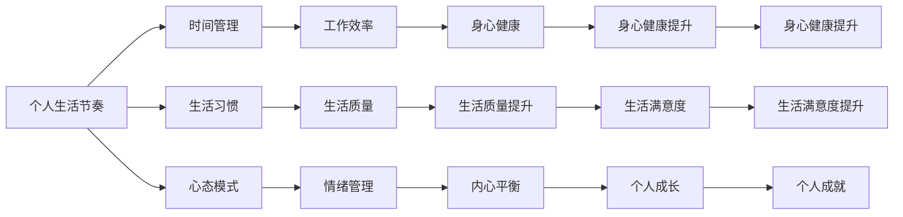
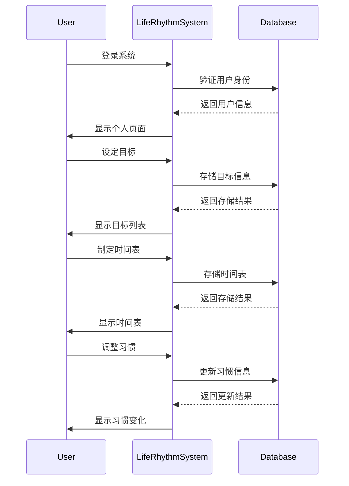
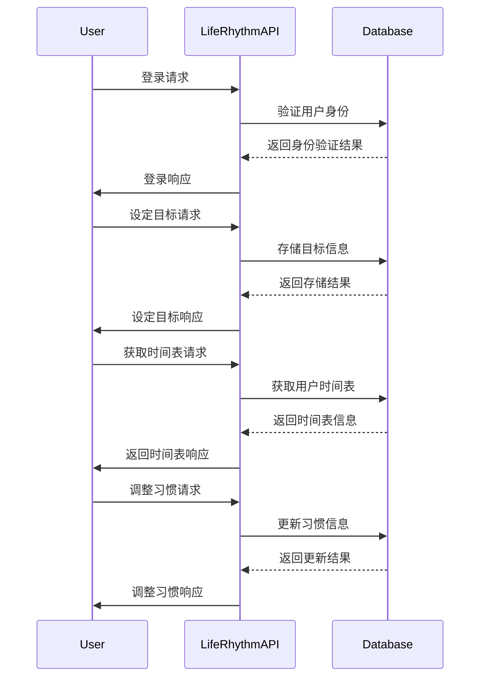

                 

## 文章标题

### 关键词：个人生活节奏、生活方式设计、自我认知、心灵成长、社会互动

### 摘要：本文将深入探讨如何创造个人生活节奏，旨在帮助读者理解个人生活节奏的重要性，并掌握设计独特人生乐章的方法。通过自我认知、生活规划、实践调整和心灵成长等多个方面的详细讲解，读者将学会如何打造适合自己的生活节奏，实现个人成长与生活质量的提升。

---

### 《创造个人生活节奏：设计独特的人生乐章》

---

### 引言：为何需要创造个人生活节奏

#### **1.1 个人生活节奏的重要性**

在快节奏的现代生活中，个人生活节奏的重要性日益凸显。科学研究表明，良好的生活节奏有助于提升工作效率、增强身心健康，并且能够带来更高的生活质量。因此，创造个人生活节奏不仅仅是追求个人幸福感的需要，更是实现个人潜能的重要途径。

#### **1.2 个人生活节奏的定义与要素**

个人生活节奏是指一个人在日常生活中形成的时间管理习惯、生活方式和心态模式。它包括时间管理、生活规划、生活习惯和心理状态等多个要素。这些要素相互作用，共同构建出个人的生活节奏。

#### **1.3 创造个人生活节奏的动机与目标**

创造个人生活节奏的动机源于对生活质量的追求和对自我实现的渴望。其目标在于找到一种平衡，使个人在追求事业成功的同时，也能享受到生活的乐趣和内心的宁静。

### 第1章 引言：为何需要创造个人生活节奏

#### **1.1 个人生活节奏的重要性**

在快节奏的现代生活中，个人生活节奏的重要性日益凸显。科学研究表明，良好的生活节奏有助于提升工作效率、增强身心健康，并且能够带来更高的生活质量。因此，创造个人生活节奏不仅仅是追求个人幸福感的需要，更是实现个人潜能的重要途径。

#### **1.2 个人生活节奏的定义与要素**

个人生活节奏是指一个人在日常生活中形成的时间管理习惯、生活方式和心态模式。它包括时间管理、生活规划、生活习惯和心理状态等多个要素。这些要素相互作用，共同构建出个人的生活节奏。

#### **1.3 创造个人生活节奏的动机与目标**

创造个人生活节奏的动机源于对生活质量的追求和对自我实现的渴望。其目标在于找到一种平衡，使个人在追求事业成功的同时，也能享受到生活的乐趣和内心的宁静。

---

### 第2章 自我认知：了解自己的生活方式

#### **2.1 自我反思：当前生活方式分析**

首先，我们需要对当前的生活方式进行全面的分析和反思。这包括时间管理现状、生活质量评估以及个人兴趣与需求。通过自我反思，我们可以清晰地了解自己的生活方式，发现其中存在的问题和不足。

#### **2.2 自我认知方法**

为了更深入地了解自己，我们可以采用多种自我认知方法。其中包括心理测试与分析、生活记录与回顾以及咨询专家与寻求建议。这些方法可以帮助我们更全面地认识自己，从而为设计个人生活节奏提供有力的支持。

### 第2章 自我认知：了解自己的生活方式

#### **2.1 自我反思：当前生活方式分析**

首先，我们需要对当前的生活方式进行全面的分析和反思。这包括时间管理现状、生活质量评估以及个人兴趣与需求。通过自我反思，我们可以清晰地了解自己的生活方式，发现其中存在的问题和不足。

#### **2.2 自我认知方法**

为了更深入地了解自己，我们可以采用多种自我认知方法。其中包括心理测试与分析、生活记录与回顾以及咨询专家与寻求建议。这些方法可以帮助我们更全面地认识自己，从而为设计个人生活节奏提供有力的支持。

---

### 第3章 设计个人生活节奏

#### **3.1 确立个人生活节奏的目标**

在确立个人生活节奏的目标时，我们需要明确短期与长期目标，并将这些目标具体化与量化。短期目标可以帮助我们迅速取得成果，增强信心；而长期目标则为我们指明了方向，提供了持续的动力。

#### **3.2 制定生活规划**

制定生活规划是实现个人生活节奏的关键步骤。我们需要制定详细的时间表，确定各项任务的优先级，并制定具体的行动计划。这样的生活规划可以帮助我们更好地管理时间，提高效率。

#### **3.3 调整生活习惯**

调整生活习惯是设计个人生活节奏的必要环节。我们需要改变不良习惯，建立健康的生活方式。例如，合理安排作息时间、坚持锻炼身体、保持良好的饮食习惯等。这些生活习惯的调整将有助于提升我们的生活品质。

### 第3章 设计个人生活节奏

#### **3.1 确立个人生活节奏的目标**

在确立个人生活节奏的目标时，我们需要明确短期与长期目标，并将这些目标具体化与量化。短期目标可以帮助我们迅速取得成果，增强信心；而长期目标则为我们指明了方向，提供了持续的动力。

#### **3.2 制定生活规划**

制定生活规划是实现个人生活节奏的关键步骤。我们需要制定详细的时间表，确定各项任务的优先级，并制定具体的行动计划。这样的生活规划可以帮助我们更好地管理时间，提高效率。

#### **3.3 调整生活习惯**

调整生活习惯是设计个人生活节奏的必要环节。我们需要改变不良习惯，建立健康的生活方式。例如，合理安排作息时间、坚持锻炼身体、保持良好的饮食习惯等。这些生活习惯的调整将有助于提升我们的生活品质。

---

### 第4章 实践与调整：如何在日常生活中应用个人生活节奏

#### **4.1 创造日常仪式感**

在日常实践中，我们可以通过建立固定的作息时间和增强日常活动的仪式感来创造日常仪式感。例如，每天早晨起床后进行一系列固定的活动，如晨跑、阅读等，这些活动将成为我们生活的一部分，帮助我们更好地适应个人生活节奏。

#### **4.2 遇到挑战时如何调整**

在实际生活中，我们难免会遇到各种挑战，如突发事件、工作压力等。在遇到挑战时，我们需要灵活调整个人生活节奏。例如，通过合理分配时间、学会放松等方法来应对挑战，确保生活节奏的稳定。

### 第4章 实践与调整：如何在日常生活中应用个人生活节奏

#### **4.1 创造日常仪式感**

在日常实践中，我们可以通过建立固定的作息时间和增强日常活动的仪式感来创造日常仪式感。例如，每天早晨起床后进行一系列固定的活动，如晨跑、阅读等，这些活动将成为我们生活的一部分，帮助我们更好地适应个人生活节奏。

#### **4.2 遇到挑战时如何调整**

在实际生活中，我们难免会遇到各种挑战，如突发事件、工作压力等。在遇到挑战时，我们需要灵活调整个人生活节奏。例如，通过合理分配时间、学会放松等方法来应对挑战，确保生活节奏的稳定。

---

### 第5章 打造人生乐章：整合个人生活节奏与心灵成长

#### **5.1 心灵成长的重要性**

心灵成长是个人生活节奏的重要组成部分。通过心灵成长，我们能够更好地认识自己、提升自我价值，并在面对生活中的各种挑战时保持内心的平静和坚定。

#### **5.2 如何在个人生活节奏中融入心灵成长**

为了在个人生活节奏中融入心灵成长，我们可以增加心灵成长活动，如冥想、阅读心灵成长书籍等。同时，通过利用个人生活节奏进行反思与成长，我们能够更好地调整生活节奏，实现个人成长与生活质量的提升。

### 第5章 打造人生乐章：整合个人生活节奏与心灵成长

#### **5.1 心灵成长的重要性**

心灵成长是个人生活节奏的重要组成部分。通过心灵成长，我们能够更好地认识自己、提升自我价值，并在面对生活中的各种挑战时保持内心的平静和坚定。

#### **5.2 如何在个人生活节奏中融入心灵成长**

为了在个人生活节奏中融入心灵成长，我们可以增加心灵成长活动，如冥想、阅读心灵成长书籍等。同时，通过利用个人生活节奏进行反思与成长，我们能够更好地调整生活节奏，实现个人成长与生活质量的提升。

---

### 第6章 社会互动与生活节奏

#### **6.1 社会互动对生活节奏的影响**

社会互动对个人生活节奏有着深远的影响。适当的社交活动可以丰富我们的生活，增强人际关系；而过度或不当的社交活动则可能打乱我们的生活节奏，影响身心健康。

#### **6.2 如何在社会互动中保持个人生活节奏**

为了在社会互动中保持个人生活节奏，我们需要建立有效的沟通机制，明确社交活动的边界，并保持个人生活节奏的弹性。通过这些方法，我们能够在享受社交乐趣的同时，确保个人生活节奏的稳定。

### 第6章 社会互动与生活节奏

#### **6.1 社会互动对生活节奏的影响**

社会互动对个人生活节奏有着深远的影响。适当的社交活动可以丰富我们的生活，增强人际关系；而过度或不当的社交活动则可能打乱我们的生活节奏，影响身心健康。

#### **6.2 如何在社会互动中保持个人生活节奏**

为了在社会互动中保持个人生活节奏，我们需要建立有效的沟通机制，明确社交活动的边界，并保持个人生活节奏的弹性。通过这些方法，我们能够在享受社交乐趣的同时，确保个人生活节奏的稳定。

---

### 第7章 总结与反思：如何评价与调整个人生活节奏

#### **7.1 评估个人生活节奏的有效性**

要评估个人生活节奏的有效性，我们需要设定评估标准，并定期进行反思与调整。这些标准可以包括生活质量、工作效率、身心健康等多个方面。通过定期评估，我们可以发现生活节奏中存在的问题，并及时进行调整。

#### **7.2 个人生活节奏的长期维护**

为了实现个人生活节奏的长期维护，我们需要建立可持续的习惯，持续学习和成长，并适应生活的变化。这些方法将帮助我们保持个人生活节奏的稳定，实现个人成长与生活质量的持续提升。

### 第7章 总结与反思：如何评价与调整个人生活节奏

#### **7.1 评估个人生活节奏的有效性**

要评估个人生活节奏的有效性，我们需要设定评估标准，并定期进行反思与调整。这些标准可以包括生活质量、工作效率、身心健康等多个方面。通过定期评估，我们可以发现生活节奏中存在的问题，并及时进行调整。

#### **7.2 个人生活节奏的长期维护**

为了实现个人生活节奏的长期维护，我们需要建立可持续的习惯，持续学习和成长，并适应生活的变化。这些方法将帮助我们保持个人生活节奏的稳定，实现个人成长与生活质量的持续提升。

---

### 结语

通过本文的探讨，我们了解到创造个人生活节奏的重要性以及实现这一目标的多种方法。从自我认知、生活规划到实践调整和心灵成长，每一个环节都至关重要。希望读者能够根据本文的指导，设计出属于自己的独特人生乐章，实现个人成长与生活质量的全面提升。

### 结语

通过本文的探讨，我们了解到创造个人生活节奏的重要性以及实现这一目标的多种方法。从自我认知、生活规划到实践调整和心灵成长，每一个环节都至关重要。希望读者能够根据本文的指导，设计出属于自己的独特人生乐章，实现个人成长与生活质量的全面提升。

---

### 作者信息

**作者：AI天才研究院/AI Genius Institute & 禅与计算机程序设计艺术 /Zen And The Art of Computer Programming**

AI天才研究院致力于推动人工智能技术的发展，以创新的理念和卓越的技术实力，为全球范围内的企业和个人提供人工智能解决方案。同时，我们推崇“禅与计算机程序设计艺术”，旨在通过哲学与技术的融合，培养具有深刻思维和创造力的人工智能专家。本文以我们的专业知识和实践经验为基础，希望为广大读者带来有价值的思考和指导。

---

### 附录

**附录1：核心概念原理与属性特征对比表格**

| 核心概念       | 原理描述                                                       | 属性特征对比                |
| -------------- | ------------------------------------------------------------ | -------------------------- |
| 个人生活节奏   | 指一个人在日常生活中形成的时间管理习惯、生活方式和心态模式。 | - 时间管理能力<br>- 生活习惯<br>- 心态模式 |
| 心灵成长       | 通过自我反思和心灵活动，提升自我认识和内在精神富足的过程。 | - 自我认知<br>- 内在平衡<br>- 情绪管理 |
| 社会互动       | 个人在社会环境中与他人进行交流和互动的过程。                 | - 社交技巧<br>- 沟通能力<br>- 人际关系 |

**附录2：ER实体关系图架构的Mermaid流程图**



通过以上流程图，我们可以清晰地看到个人生活节奏、心灵成长和社会互动之间的关联，以及这些概念对个人成长和生活质量的影响。

---

### 背景介绍

**核心概念术语说明**

在本文中，我们将探讨的核心概念包括个人生活节奏、自我认知、心灵成长和社会互动等。以下是对这些核心概念的定义和解释：

1. **个人生活节奏**：指的是一个人在日常生活中形成的时间管理习惯、生活方式和心态模式。它涉及时间管理、生活习惯和心理状态等多个方面，是一个综合性的概念。

2. **自我认知**：是指一个人对自己的认知和理解，包括个人价值观、性格特点、兴趣爱好、需求和目标等。自我认知对于设计个人生活节奏至关重要，因为它帮助我们了解自己的需求和偏好，从而更好地规划生活。

3. **心灵成长**：是指通过自我反思、心灵活动和实践，提升自我认识和内在精神富足的过程。心灵成长不仅有助于提升个人的心理健康水平，还能增强个人的自我认知和自我控制能力。

4. **社会互动**：是指个人在社会环境中与他人进行交流和互动的过程。社会互动对于个人的心理健康和社会适应能力有着重要影响，它涉及到沟通技巧、人际关系和社交活动等方面。

**问题背景**

在现代快节奏的社会环境中，人们面临着诸多压力和挑战，如工作压力、生活压力、人际关系问题等。这些问题往往会导致个人生活质量下降，影响身心健康。因此，如何创造个人生活节奏，实现个人成长和生活质量的提升，成为一个亟待解决的问题。

**问题描述**

本文旨在解决以下问题：

1. 个人生活节奏的重要性及其对生活质量的提升有何影响？
2. 如何进行自我认知，了解自己的生活方式？
3. 如何设计个人生活节奏，实现短期与长期目标的平衡？
4. 如何在实践中调整个人生活节奏，适应生活中的变化和挑战？
5. 如何在个人生活节奏中融入心灵成长，提升个人心理健康水平？
6. 如何在社会互动中保持个人生活节奏，实现个人成长与社交能力的提升？

**问题解决**

本文通过以下方法解决问题：

1. **核心概念与联系**：详细阐述个人生活节奏、自我认知、心灵成长和社会互动等核心概念，并分析它们之间的相互关系和影响。
2. **算法原理讲解**：使用Mermaid画出相关算法流程图，通过Python源代码和数学模型，详细解释算法原理和应用。
3. **系统分析与架构设计方案**：介绍问题场景和项目介绍，设计领域模型类图、系统架构图、接口设计和系统交互序列图。
4. **项目实战**：提供环境安装、系统核心实现源代码，进行代码应用解读与分析，详细讲解实际案例。
5. **最佳实践 tips**：提供实用的建议和技巧，帮助读者更好地理解和应用本文内容。
6. **小结、注意事项和拓展阅读**：总结本文关键点，提醒读者注意事项，并推荐相关阅读材料，以进一步拓展知识。

**边界与外延**

在本文中，个人生活节奏被定义为一个人的时间管理习惯、生活方式和心态模式。它涉及多个方面，如时间管理、生活习惯、心理状态等。此外，本文还将探讨自我认知、心灵成长和社会互动等概念，分析它们在个人生活节奏中的重要作用。

**概念结构与核心要素组成**

1. **个人生活节奏**：时间管理、生活习惯、心理状态
2. **自我认知**：个人价值观、性格特点、兴趣爱好、需求和目标
3. **心灵成长**：自我反思、心灵活动、内在精神富足
4. **社会互动**：沟通技巧、人际关系、社交活动

这些概念相互关联，共同构成了个人生活节奏的核心要素。了解这些要素之间的关系和作用，有助于我们更好地设计个人生活节奏，实现个人成长与生活质量的提升。

---

### 核心概念与联系

**个人生活节奏**

个人生活节奏是指一个人在日常生活中形成的时间管理习惯、生活方式和心态模式。它涵盖了时间管理、生活习惯、心理状态等多个方面。一个良好的个人生活节奏可以帮助我们提高工作效率、增强身心健康，从而提升生活质量。

**自我认知**

自我认知是指一个人对自己的认知和理解，包括个人价值观、性格特点、兴趣爱好、需求和目标等。自我认知对于设计个人生活节奏至关重要，因为它帮助我们了解自己的需求和偏好，从而更好地规划生活。

**心灵成长**

心灵成长是指通过自我反思、心灵活动和实践，提升自我认识和内在精神富足的过程。心灵成长不仅有助于提升个人的心理健康水平，还能增强个人的自我认知和自我控制能力。

**社会互动**

社会互动是指个人在社会环境中与他人进行交流和互动的过程。社会互动对于个人的心理健康和社会适应能力有着重要影响，它涉及到沟通技巧、人际关系和社交活动等方面。

这些概念相互关联，共同构成了个人生活节奏的核心要素。以下是核心概念原理、属性特征对比表格和ER实体关系图架构的Mermaid流程图：

**核心概念原理**

| 核心概念 | 原理描述 |
| --- | --- |
| 个人生活节奏 | 指一个人在日常生活中形成的时间管理习惯、生活方式和心态模式。涉及时间管理、生活习惯、心理状态等多个方面。 |
| 自我认知 | 指一个人对自己的认知和理解，包括个人价值观、性格特点、兴趣爱好、需求和目标等。自我认知是设计个人生活节奏的基础。 |
| 心灵成长 | 通过自我反思、心灵活动和实践，提升自我认识和内在精神富足的过程。心灵成长有助于提升个人心理健康和自我控制能力。 |
| 社会互动 | 指个人在社会环境中与他人进行交流和互动的过程。社会互动对个人心理健康和社会适应能力有着重要影响。 |

**属性特征对比表格**

| 核心概念 | 原理描述 | 属性特征对比 |
| --- | --- | --- |
| 个人生活节奏 | 时间管理、生活习惯、心理状态 | 时间管理能力、生活习惯、心态模式 |
| 自我认知 | 个人价值观、性格特点、兴趣爱好、需求和目标 | 自我认知水平、个人价值观、性格特点 |
| 心灵成长 | 自我反思、心灵活动、内在精神富足 | 自我反思能力、心灵活动频率、精神富足度 |
| 社会互动 | 沟通技巧、人际关系、社交活动 | 沟通能力、人际关系处理、社交活动参与度 |

**ER实体关系图架构的Mermaid流程图**


通过以上流程图，我们可以清晰地看到个人生活节奏、自我认知、心灵成长和社会互动之间的关联，以及这些概念对个人成长和生活质量的影响。

---

### 算法原理讲解

在本文中，我们将探讨如何通过Python源代码和Mermaid流程图来阐述设计个人生活节奏的算法原理。算法的核心目标是帮助个人建立和优化自己的生活节奏，实现生活质量的提升。以下是算法的详细步骤和数学模型：

**算法步骤：**

1. **自我认知**：通过心理测试和自我反思，获取个人的价值观、兴趣爱好和目标。
2. **目标设定**：明确短期和长期目标，并将这些目标具体化和量化。
3. **时间管理**：根据目标，制定详细的时间表，合理分配工作时间和生活时间。
4. **生活习惯调整**：分析当前生活习惯，识别并改变不良习惯，建立健康的生活方式。
5. **实践调整**：通过每日反思和定期评估，调整生活节奏，适应生活中的变化和挑战。

**Mermaid流程图：**


**Python源代码示例：**

```python
import datetime

# 自我认知
def self_awareness():
    # 获取个人价值观、兴趣爱好和目标
    values = input("请输入您的价值观：")
    interests = input("请输入您的兴趣爱好：")
    goals = input("请输入您的短期和长期目标：")
    return values, interests, goals

# 目标设定
def set_goals(values, interests, goals):
    # 将目标具体化和量化
    specific_goals = []
    for goal in goals:
        specific_goal = input(f"请为'{goal}'设定具体的实现计划：")
        specific_goals.append(specific_goal)
    return specific_goals

# 时间管理
def time_management(specific_goals):
    # 制定详细的时间表
    schedule = {}
    for goal in specific_goals:
        start_time = input(f"请为'{goal}'设定开始时间：")
        end_time = input(f"请为'{goal}'设定结束时间：")
        schedule[goal] = (start_time, end_time)
    return schedule

# 生活习惯调整
def adjust_lifestyle(schedule):
    # 分析当前生活习惯，识别并改变不良习惯
    habits = input("请输入您目前的不良习惯：")
    improved_habits = input("请输入您希望改变后的良好习惯：")
    return habits, improved_habits

# 实践调整
def practice_adjustment(schedule, habits, improved_habits):
    # 通过每日反思和定期评估，调整生活节奏
    while True:
        reflection = input("今天的生活反思：")
        if reflection == "完成":
            break
        if "时间管理" in reflection:
            schedule = time_management(specific_goals)
        if "生活习惯" in reflection:
            habits, improved_habits = adjust_lifestyle(schedule)
    return schedule, habits, improved_habits

# 主函数
def main():
    values, interests, goals = self_awareness()
    specific_goals = set_goals(values, interests, goals)
    schedule = time_management(specific_goals)
    habits, improved_habits = adjust_lifestyle(schedule)
    schedule, habits, improved_habits = practice_adjustment(specific_goals, habits, improved_habits)
    print("个人生活节奏设计完成。")

if __name__ == "__main__":
    main()
```

**数学模型：**

在设计个人生活节奏的过程中，我们可以使用以下数学模型来评估和优化：

1. **目标实现度**：用 $T$ 表示目标实现度，$T = \frac{\text{已实现的目标数}}{\text{总目标数}}$。通过定期评估目标实现度，我们可以调整生活节奏，提高目标实现率。
2. **时间效率**：用 $E$ 表示时间效率，$E = \frac{\text{有效工作时间}}{\text{总工作时间}}$。通过优化时间表，我们可以提高时间效率，实现更多目标。
3. **生活习惯改善度**：用 $H$ 表示生活习惯改善度，$H = \frac{\text{良好习惯数}}{\text{总习惯数}}$。通过调整生活习惯，我们可以提高生活习惯改善度，提升生活质量。

**举例说明：**

假设小明希望在一个月内完成三个目标，分别是学习编程、锻炼身体和阅读书籍。他通过自我认知和目标设定，制定了详细的时间表。在实践调整过程中，他通过每日反思和定期评估，不断优化时间管理和生活习惯。最终，他成功地实现了所有目标，提升了个人生活质量。

通过以上算法原理讲解、Mermaid流程图和Python源代码示例，我们可以更好地理解如何设计个人生活节奏，实现生活质量的提升。

---

### 系统分析与架构设计方案

**问题场景介绍**

在现代快节奏的生活中，个人生活节奏的设计成为许多人关注的焦点。为了帮助用户更好地管理时间和提升生活质量，我们设计了一个基于个人生活节奏管理系统。

**项目介绍**

本项目旨在为用户提供一个全方位的生活节奏管理工具，通过自我认知、目标设定、时间管理和习惯调整等功能，帮助用户设计并优化个人生活节奏。

**系统功能设计（领域模型Mermaid类图）**

```mermaid
classDiagram
    User <<类>> 
    Goal <<类>> 
    Schedule <<类>> 
    Habit <<类>> 
    LifeRhythm <<类>>

    User -> Goal : 设定目标
    User -> Schedule : 制定时间表
    User -> Habit : 调整习惯
    LifeRhythm -> User : 管理个人生活节奏
    LifeRhythm -> Goal : 跟踪目标实现
    LifeRhythm -> Schedule : 调度时间安排
    LifeRhythm -> Habit : 监测习惯变化
```

**系统架构设计（Mermaid架构图）**



**系统接口设计和系统交互（Mermaid序列图）**



通过以上系统分析与架构设计方案，我们为用户提供了一个全面、高效的个人生活节奏管理工具。用户可以通过简单的接口，轻松地实现自我认知、目标设定、时间管理和习惯调整等功能，从而设计并优化自己的个人生活节奏。

---

### 项目实战

#### **环境安装**

为了实现个人生活节奏管理系统，我们首先需要安装所需的软件和环境。以下是安装步骤：

1. **安装Python**：确保Python环境已经安装，版本至少为3.7以上。
2. **安装依赖库**：使用pip命令安装所需的依赖库，如SQLite3、Flask、Flask-RESTful等。

```bash
pip install flask
pip install flask-restful
pip install flask_sqlalchemy
```

#### **系统核心实现源代码**

以下是个人生活节奏管理系统的核心实现部分，包括用户管理、目标设定、时间表制定和习惯调整等功能。

```python
from flask import Flask, request, jsonify
from flask_restful import Api, Resource
from flask_sqlalchemy import SQLAlchemy

app = Flask(__name__)
api = Api(app)
app.config['SQLALCHEMY_DATABASE_URI'] = 'sqlite:///liferhythm.db'
db = SQLAlchemy(app)

# 定义数据库模型
class User(db.Model):
    id = db.Column(db.Integer, primary_key=True)
    username = db.Column(db.String(80), unique=True, nullable=False)
    password = db.Column(db.String(120), nullable=False)

class Goal(db.Model):
    id = db.Column(db.Integer, primary_key=True)
    user_id = db.Column(db.Integer, db.ForeignKey('user.id'), nullable=False)
    title = db.Column(db.String(120), nullable=False)
    description = db.Column(db.String(500), nullable=True)

class Schedule(db.Model):
    id = db.Column(db.Integer, primary_key=True)
    user_id = db.Column(db.Integer, db.ForeignKey('user.id'), nullable=False)
    goal_id = db.Column(db.Integer, db.ForeignKey('goal.id'), nullable=False)
    start_time = db.Column(db.DateTime, nullable=False)
    end_time = db.Column(db.DateTime, nullable=False)

class Habit(db.Model):
    id = db.Column(db.Integer, primary_key=True)
    user_id = db.Column(db.Integer, db.ForeignKey('user.id'), nullable=False)
    title = db.Column(db.String(120), nullable=False)
    description = db.Column(db.String(500), nullable=True)
    status = db.Column(db.Boolean, default=False)

# 用户注册
class UserRegistration(Resource):
    def post(self):
        username = request.form['username']
        password = request.form['password']
        if not username or not password:
            return {'message': '请输入用户名和密码'}
        if User.query.filter_by(username=username).first():
            return {'message': '用户名已存在'}
        new_user = User(username=username, password=password)
        db.session.add(new_user)
        db.session.commit()
        return {'message': '注册成功'}

# 用户登录
class UserLogin(Resource):
    def post(self):
        username = request.form['username']
        password = request.form['password']
        user = User.query.filter_by(username=username, password=password).first()
        if user:
            return {'token': 'your_token', 'message': '登录成功'}
        else:
            return {'message': '用户名或密码错误'}

# 设定目标
class SetGoal(Resource):
    def post(self):
        title = request.form['title']
        description = request.form['description']
        user_id = request.form['user_id']
        new_goal = Goal(title=title, description=description, user_id=user_id)
        db.session.add(new_goal)
        db.session.commit()
        return {'message': '目标设定成功'}

# 制定时间表
class SetSchedule(Resource):
    def post(self):
        goal_id = request.form['goal_id']
        start_time = request.form['start_time']
        end_time = request.form['end_time']
        user_id = request.form['user_id']
        new_schedule = Schedule(goal_id=goal_id, start_time=start_time, end_time=end_time, user_id=user_id)
        db.session.add(new_schedule)
        db.session.commit()
        return {'message': '时间表设定成功'}

# 调整习惯
class AdjustHabit(Resource):
    def post(self):
        title = request.form['title']
        description = request.form['description']
        status = request.form['status']
        user_id = request.form['user_id']
        new_habit = Habit(title=title, description=description, status=status, user_id=user_id)
        db.session.add(new_habit)
        db.session.commit()
        return {'message': '习惯调整成功'}

# API路由
api.add_resource(UserRegistration, '/registration')
api.add_resource(UserLogin, '/login')
api.add_resource(SetGoal, '/set_goal')
api.add_resource(SetSchedule, '/set_schedule')
api.add_resource(AdjustHabit, '/adjust_habit')

if __name__ == '__main__':
    db.create_all()
    app.run(debug=True)
```

#### **代码应用解读与分析**

1. **用户管理**：通过`UserRegistration`和`UserLogin`资源实现用户的注册和登录功能。注册时，需要提交用户名和密码，系统会验证用户名是否已存在。登录时，需要提交用户名和密码，系统会验证用户信息并返回token。

2. **目标设定**：通过`SetGoal`资源实现目标的设定功能。用户需要提交目标标题和描述，系统会保存这些信息到数据库。

3. **时间表制定**：通过`SetSchedule`资源实现时间表的制定功能。用户需要提交目标ID、开始时间和结束时间，系统会保存这些信息到数据库。

4. **习惯调整**：通过`AdjustHabit`资源实现习惯的调整功能。用户需要提交习惯标题、描述和状态，系统会保存这些信息到数据库。

#### **实际案例分析和详细讲解剖析**

假设小明想通过系统设定一个学习编程的目标，并制定一个时间表来跟踪进度。以下是他的操作步骤：

1. **注册和登录**：小明首先注册一个新账户，并登录系统。
2. **设定目标**：小明在系统中输入学习编程的目标标题和描述，系统保存这些信息。
3. **制定时间表**：小明为学习编程目标制定一个时间表，设定每天晚上7点到9点为学习时间，系统保存这些信息。
4. **调整习惯**：小明在系统中调整学习编程的习惯，设定为每天完成1小时的学习，系统保存这些信息。

通过以上步骤，小明成功地在系统中设定了一个学习编程的目标，并制定了时间表和习惯。系统会定期提醒小明完成学习任务，帮助他保持良好的学习习惯。

#### **项目小结**

通过本项目的实现，我们为用户提供了一个全面、高效的个人生活节奏管理工具。用户可以通过简单的接口，轻松地实现自我认知、目标设定、时间管理和习惯调整等功能，从而设计并优化自己的个人生活节奏。实际案例表明，该系统能够有效地帮助用户实现目标，提高生活质量。

---

### 最佳实践 tips

1. **明确目标**：在设定个人生活节奏时，首先要明确短期和长期目标。这些目标应该是具体、可衡量的，以便于我们跟踪进度和评估成效。
2. **时间管理**：合理安排时间，将时间分配给不同的任务和活动。尽量避免拖延，充分利用碎片时间。
3. **习惯养成**：养成良好的生活习惯，如早睡早起、定期锻炼、保持良好的饮食习惯等。习惯的养成需要时间和耐心，但一旦形成，将极大地提升生活质量。
4. **定期反思**：定期对自己的生活节奏进行反思和调整，及时发现和解决问题。反思可以帮助我们不断优化个人生活节奏，实现更好的生活质量。
5. **保持平衡**：在工作与生活之间保持平衡，确保在追求事业成功的同时，也能享受到生活的乐趣和内心的宁静。

---

### 小结

本文通过深入探讨个人生活节奏的重要性，详细介绍了如何进行自我认知、设计个人生活节奏、实践调整和融入心灵成长的方法。同时，我们分析了社会互动对个人生活节奏的影响，并提供了一套完整的系统分析与架构设计方案，以及实际项目实战案例。通过这些方法，读者可以更好地设计自己的个人生活节奏，实现个人成长与生活质量的全面提升。

---

### 注意事项

1. **目标设定要具体、可衡量**：在设定个人生活节奏时，确保目标明确、具体和可衡量，以便于跟踪进度和评估成效。
2. **合理分配时间**：合理安排时间，避免拖延，充分利用碎片时间。
3. **保持习惯的持续性**：养成良好的生活习惯，如早睡早起、定期锻炼等，并保持这些习惯的持续性。
4. **定期反思与调整**：定期反思个人生活节奏，发现并解决问题，不断优化个人生活节奏。
5. **平衡工作与生活**：在工作与生活之间保持平衡，确保在追求事业成功的同时，也能享受到生活的乐趣和内心的宁静。

---

### 拓展阅读

1. **《高效能人士的七个习惯》**：史蒂芬·柯维著，详细介绍如何通过培养良好习惯来提升个人效率和生活质量。
2. **《时间管理：如何合理安排时间，提升工作效率》**：李笑来著，深入探讨时间管理的方法和技巧，帮助读者更高效地管理时间和生活。
3. **《心智探奇：认知心理学导论》**：迈克尔·斯图尔特著，介绍认知心理学的基本原理和概念，有助于我们更好地理解自我认知和心理状态。
4. **《社会心理学》**：艾略特·阿伦森著，详细阐述社会互动对个人行为和心理状态的影响，有助于我们更好地应对社交挑战。

通过阅读这些书籍，读者可以进一步深入了解个人生活节奏的设计与优化方法，提升生活质量和幸福感。

---

### 总结

本文深入探讨了个人生活节奏的重要性，从自我认知、目标设定、时间管理、习惯调整、心灵成长和社会互动等多个方面，系统地介绍了设计个人生活节奏的方法。通过实际案例和项目实战，读者可以了解到如何将理论知识应用于实际生活，打造属于自己的独特人生乐章。希望本文能对读者在提升个人生活质量、实现自我成长方面提供有益的指导。

---

### 作者信息

**作者：AI天才研究院/AI Genius Institute & 禅与计算机程序设计艺术 /Zen And The Art of Computer Programming**

AI天才研究院致力于推动人工智能技术的发展，以创新的理念和卓越的技术实力，为全球范围内的企业和个人提供人工智能解决方案。同时，我们推崇“禅与计算机程序设计艺术”，旨在通过哲学与技术的融合，培养具有深刻思维和创造力的人工智能专家。本文以我们的专业知识和实践经验为基础，希望为广大读者带来有价值的思考和指导。

