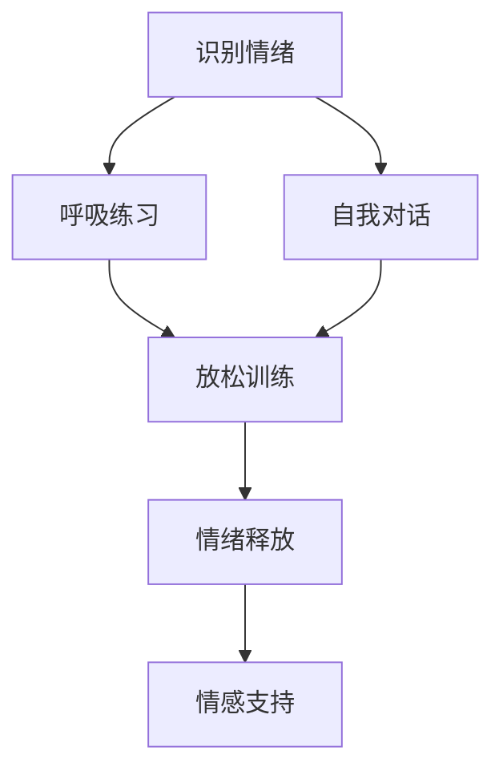
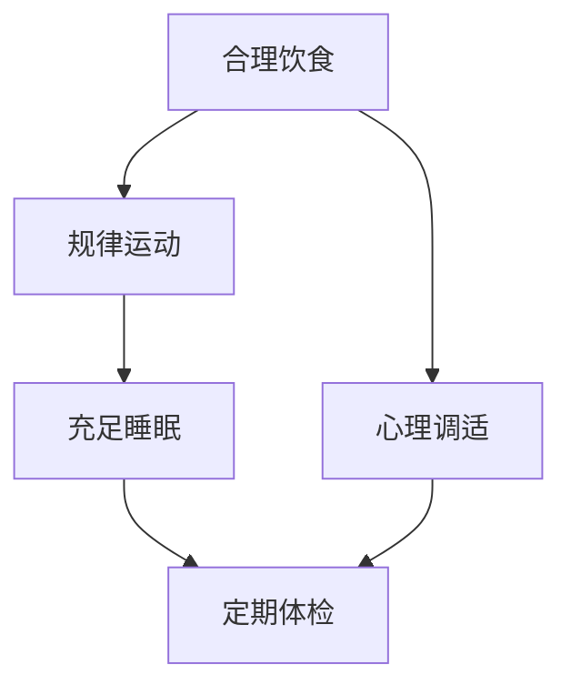
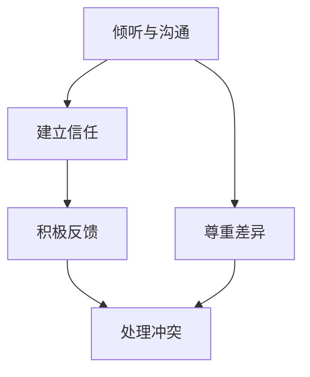
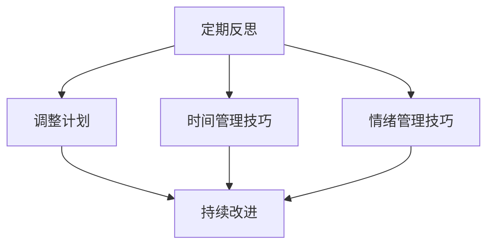

                 

## 《创造个人生活韵律：找到最适合自己的节奏》

### 关键词：
- 生活节奏
- 自我认知
- 心理健康
- 生活方式
- 时间管理

### 摘要：
本文旨在探讨如何创造个人生活韵律，通过自我认知与生活节奏的调整，建立与个人目标相匹配的生活方式，从而实现身心健康和高效生活。文章将从定义生活节奏、自我认识与调整、建立匹配的生活方式、维持生活韵律的技巧以及实现生活节奏与个人目标的平衡五个方面展开，旨在为读者提供一套系统性的指导方法。

### 目录大纲

```markdown
# 《创造个人生活韵律：找到最适合自己的节奏》

## 第一部分：生活节奏的定义与影响

### 第1章：生活节奏的本质与意义
#### 1.1 生活节奏的定义
#### 1.2 生活节奏的分类与特点
#### 1.3 生活节奏对心理健康的影响
#### 1.4 生活节奏的社会文化背景
#### 1.5 本章小结

## 第二部分：自我认识与生活节奏调整

### 第2章：自我认知与生活节奏
#### 2.1 自我认知的重要性
#### 2.2 了解自己的节奏
#### 2.3 调整生活节奏的方法
#### 2.4 跨越生活节奏障碍
#### 2.5 本章小结

## 第三部分：建立与生活节奏相匹配的生活方式

### 第3章：生活方式与生活节奏
#### 3.1 生活方式的定义
#### 3.2 建立与生活节奏相匹配的生活方式
#### 3.3 适应环境变化
#### 3.4 跨越文化差异
#### 3.5 本章小结

## 第四部分：维持个人生活韵律的技巧

### 第4章：维持个人生活韵律的技巧
#### 4.1 时间管理技巧
#### 4.2 情绪管理技巧
#### 4.3 健康管理技巧
#### 4.4 社交与人际技巧
#### 4.5 维持生活韵律的长期策略
#### 4.6 本章小结

## 第五部分：实现生活节奏与个人目标的平衡

### 第5章：生活节奏与个人目标
#### 5.1 个人目标的设定
#### 5.2 生活节奏与个人目标的平衡
#### 5.3 实现平衡的策略
#### 5.4 本章小结

### 参考文献

作者：AI天才研究院/AI Genius Institute & 禅与计算机程序设计艺术 /Zen And The Art of Computer Programming
```

### 第一部分：生活节奏的定义与影响

#### 第1章：生活节奏的本质与意义

### 1.1 生活节奏的定义

生活节奏，是指个人在日常生活、工作、学习等方面的规律与节奏。它可以被看作是个人在时间维度上的一种有序排列，反映了个体在特定时间段内的时间分配、活动频率和身心状态。生活节奏不仅关乎时间管理，更涉及到身心健康、生活质量和个人幸福感。

在技术领域，我们可以将生活节奏类比为软件的运行节奏。一个高效的软件系统通常具有稳定且优化的运行节奏，这与个人生活中的健康节奏有异曲同工之妙。一个拥有良好生活节奏的人，能够更高效地完成工作，享受休闲时光，保持身心健康。

**什么是生活节奏**

生活节奏是一个多维度的概念，可以从以下几个方面进行理解：

1. **时间分配**：个人在不同活动上的时间投入比例，如工作、学习、休息、娱乐等。
2. **活动频率**：个人日常活动的发生频率，如起床、工作、锻炼、社交等。
3. **身心状态**：个人在不同活动中的身心反应，如疲劳度、兴奋度、专注度等。

**生活节奏的重要性**

生活节奏的重要性不容忽视。首先，良好的生活节奏有助于提高工作效率。当个人能够合理安排时间，保持良好的身心状态时，他们能够更高效地完成工作任务。其次，生活节奏对心理健康有着重要影响。长期失衡的生活节奏可能导致压力增加、焦虑、抑郁等心理问题。最后，生活节奏还与生活质量密切相关。一个有序、稳定的生活节奏能够提高个人的幸福感和满足感。

### 1.2 生活节奏的分类与特点

生活节奏可以根据不同的标准进行分类，常见的分类方法包括：

1. **快节奏生活**：快节奏生活通常是指个人在短时间内完成大量任务，活动频率较高，如忙碌的职业人士。这种生活方式往往需要高度的专注力和时间管理技巧。
2. **慢节奏生活**：慢节奏生活则强调放慢步伐，享受当下的每一刻，如退休人士或追求生活质量的现代人。这种生活方式有助于减轻压力，提升生活品质。

**生活节奏的特点分析**

不同的生活节奏具有不同的特点，以下是一些常见特点：

1. **快节奏生活特点**：
   - 高效：快速完成任务，追求高效率。
   - 紧张：时间紧迫，容易感到压力。
   - 高强度：活动频繁，身心状态起伏大。

2. **慢节奏生活特点**：
   - 放松：活动频率低，身心状态稳定。
   - 舒适：享受生活，关注生活细节。
   - 低强度：活动轻松，不易感到疲劳。

**生活节奏与工作、学习、生活的关系**

生活节奏不仅影响个人的工作效率和学习效果，还对生活质量有着重要影响。以下是一些具体关系：

1. **工作与生活节奏**：
   - 快节奏工作可能导致工作压力增加，影响生活质量。
   - 慢节奏工作有助于减轻压力，提高工作满意度。

2. **学习与生活节奏**：
   - 快节奏学习可能导致信息过载，影响学习效果。
   - 慢节奏学习有助于深度理解，提高学习质量。

3. **生活与生活节奏**：
   - 良好的生活节奏有助于提高生活质量，增强幸福感。
   - 不良的生活节奏可能导致生活质量下降，影响身心健康。

### 1.3 生活节奏对心理健康的影响

**生活节奏失衡的后果**

长期失衡的生活节奏可能导致以下后果：

1. **压力增加**：快节奏生活往往伴随着高压力，长期高压状态可能导致心理问题。
2. **焦虑和抑郁**：生活节奏失衡可能导致焦虑和抑郁症状，影响心理健康。
3. **身心疲劳**：频繁的活动和高强度的工作可能导致身心疲劳，影响身体健康。

**心理健康与生活节奏的互动**

心理健康和生活节奏之间存在互动关系。良好的生活节奏有助于提升心理健康，反之亦然。以下是一些具体互动：

1. **情绪稳定**：良好的生活节奏有助于情绪稳定，减少焦虑和抑郁。
2. **应对压力**：生活节奏的合理安排有助于更好地应对压力，提高抗压能力。
3. **身心健康**：良好的生活节奏有助于身心健康，提高生活质量。

**如何评估自己的生活节奏**

评估自己的生活节奏是调整生活节奏的第一步。以下是一些评估方法：

1. **时间日志**：记录一天中的所有活动和时间分配，分析是否存在不合理的时间安排。
2. **自我反思**：反思自己的情绪状态和生活质量，了解是否存在生活节奏失衡的问题。
3. **专业评估**：寻求专业心理医生或生活顾问的帮助，进行生活节奏评估。

### 1.4 生活节奏的社会文化背景

**社会变迁对生活节奏的影响**

随着社会的快速发展，生活节奏也在不断变化。以下是一些社会变迁对生活节奏的影响：

1. **城市化进程**：城市化进程加速，人们的工作、学习、生活节奏普遍加快。
2. **技术进步**：技术的进步使信息传播速度加快，生活节奏也随之加快。
3. **工作压力**：职场竞争加剧，工作压力增大，导致生活节奏加快。

**文化背景对生活节奏的塑造**

不同的文化背景对生活节奏有着不同的影响。以下是一些文化背景对生活节奏的塑造：

1. **东方文化**：东方文化强调和谐、平衡，往往倾向于慢节奏生活。
2. **西方文化**：西方文化强调个人成就、效率，往往倾向于快节奏生活。
3. **宗教文化**：某些宗教文化对生活节奏有特殊要求，如佛教的禅修、基督教的祷告等。

**个人价值观与生活节奏的关系**

个人的价值观对生活节奏有着重要影响。以下是一些个人价值观与生活节奏的关系：

1. **追求成就**：追求成就的人往往倾向于快节奏生活，追求高效率。
2. **注重平衡**：注重平衡的人往往倾向于慢节奏生活，追求身心和谐。
3. **生活态度**：积极的生活态度有助于更好地适应快节奏生活，减少心理压力。

### 1.5 本章小结

本章从多个角度探讨了生活节奏的定义、分类、影响以及社会文化背景。通过了解生活节奏的本质与意义，我们可以更好地认识到生活节奏对心理健康、工作效率和生活质量的重要影响。同时，本章也介绍了如何评估自己的生活节奏以及如何调整和维持良好的生活节奏。在接下来的章节中，我们将进一步探讨如何通过自我认知与生活节奏调整，建立与个人目标相匹配的生活方式。

---

### 第二部分：自我认识与生活节奏调整

#### 第2章：自我认知与生活节奏

### 2.1 自我认知的重要性

**自我认知的内涵**

自我认知是指个体对自己内心世界、行为模式、价值观等的认识和了解。它涵盖了以下几个方面：

1. **心理状态**：了解自己的情绪波动、心理需求和心理健康状态。
2. **行为习惯**：认识到自己的行为模式、习惯和习惯形成的原因。
3. **价值观**：了解自己的核心价值观、人生目标和追求的生活方式。

**自我认知与生活节奏的关联**

自我认知是调整生活节奏的基础。只有深入了解自己，才能找到适合自己的生活节奏。以下是一些具体关联：

1. **时间管理**：通过自我认知，可以了解自己在不同活动上的时间偏好，从而更有效地分配时间。
2. **情绪调节**：了解自己的情绪波动，有助于在情绪低落时采取适当的调节措施，保持生活节奏的稳定性。
3. **习惯培养**：通过自我认知，可以识别和改变不良习惯，建立有利于身心健康的生活节奏。

**自我认知的方法与工具**

为了更好地进行自我认知，我们可以采用以下方法和工具：

1. **日记记录**：每天记录自己的情绪、行为和思考，通过反思和分析，了解自己的内心世界。
2. **心理测试**：通过专业的心理测试工具，了解自己的性格特点、行为模式和心理健康状况。
3. **自我反思**：定期进行自我反思，回顾自己的行为和决策，总结经验教训。

### 2.2 了解自己的节奏

**发现自己的习惯**

习惯是生活节奏的重要组成部分。了解自己的习惯，有助于调整生活节奏，提高生活质量。以下是一些方法：

1. **行为记录**：记录一天中的所有行为，包括起床时间、工作内容、休息方式等，分析自己的行为模式。
2. **习惯打卡**：通过打卡的方式，培养和改变习惯。例如，每天早上进行晨跑、晚上进行阅读等。
3. **习惯评估**：定期评估自己的习惯，判断其是否有利于身心健康和生活质量。

**分析自己的情绪**

情绪是生活节奏的重要指标。通过分析情绪，可以更好地了解自己的节奏。以下是一些方法：

1. **情绪日记**：记录每天的情绪变化，分析情绪波动的原因。
2. **情绪反馈**：与他人分享自己的情绪，获得不同的视角和建议。
3. **情绪调节**：学习情绪调节技巧，如深呼吸、冥想等，帮助自己保持情绪稳定。

**评估自己的生物钟**

生物钟是人体生理节律的反映，影响着睡眠、清醒和工作效率。以下是一些评估方法：

1. **睡眠记录**：记录睡眠时间和质量，分析自己的睡眠模式。
2. **生物钟测试**：通过专业的生物钟测试工具，了解自己的生物钟特点。
3. **睡眠习惯调整**：根据生物钟特点，调整睡眠习惯，提高睡眠质量。

### 2.3 调整生活节奏的方法

**节奏调整的策略**

调整生活节奏需要制定合适的策略，以下是一些常见策略：

1. **时间管理**：合理安排时间，避免过度忙碌或闲散。
2. **情绪管理**：保持情绪稳定，避免情绪波动影响生活节奏。
3. **习惯养成**：培养良好的生活习惯，提高生活质量。

**建立规律的作息时间**

建立规律的作息时间有助于稳定生活节奏，以下是一些建议：

1. **早起早睡**：保持规律的作息时间，提高睡眠质量。
2. **工作与休息交替**：合理分配工作和休息时间，避免长时间工作。
3. **固定作息**：每天固定起床、工作、休息和入睡的时间，形成稳定的作息习惯。

**消除负面习惯**

负面习惯会破坏生活节奏，以下是一些消除负面习惯的方法：

1. **识别负面习惯**：明确自己有哪些负面习惯，如拖延、过度娱乐等。
2. **替代习惯**：用积极、有益的习惯替代负面习惯，如阅读替代刷手机。
3. **习惯中断**：通过习惯中断技巧，逐步消除负面习惯。

### 2.4 跨越生活节奏障碍

**应对工作压力**

工作压力是影响生活节奏的重要因素，以下是一些应对工作压力的方法：

1. **时间管理**：合理安排工作时间，避免加班和过度工作。
2. **情绪调节**：学会情绪调节技巧，如深呼吸、放松训练等。
3. **工作与生活平衡**：保持工作与生活的平衡，合理安排休闲时间。

**应对突发事件**

突发事件会打乱生活节奏，以下是一些应对突发事件的方法：

1. **提前准备**：做好应急准备，提高应对突发事件的能力。
2. **灵活调整**：根据突发事件调整生活节奏，尽量保持稳定。
3. **心态调整**：保持积极心态，理性面对突发事件。

**培养抗压能力**

培养抗压能力有助于更好地应对生活压力，以下是一些方法：

1. **身心健康**：保持良好的身心健康，提高抗压能力。
2. **心理建设**：建立良好的心理素质，增强抗压能力。
3. **社会支持**：寻求社会支持，如家庭、朋友和专业人士的帮助。

### 2.5 本章小结

本章介绍了自我认知的重要性、如何了解自己的节奏以及调整生活节奏的方法。通过自我认知，我们可以更好地了解自己的心理状态、行为习惯和生物钟，从而找到适合自己的生活节奏。同时，本章也提供了具体的策略和方法，帮助读者调整生活节奏，应对工作压力和突发事件，培养抗压能力。在接下来的章节中，我们将进一步探讨如何建立与生活节奏相匹配的生活方式。

---

### 第三部分：建立与生活节奏相匹配的生活方式

#### 第3章：生活方式与生活节奏

#### 3.1 生活方式的定义

**生活方式的含义**

生活方式是指个人在日常生活中所表现出来的行为习惯、生活方式和价值观的综合体。它不仅仅包括我们如何度过一天的时间，还涉及到我们如何对待生活、对待自己和他人的态度和行为。

**影响因素**

生活方式受到多种因素的影响，包括：

1. **文化背景**：不同的文化背景会对生活方式产生深远的影响。例如，东方文化强调家庭和集体，而西方文化则更注重个人主义。
2. **个人价值观**：个人的价值观和人生目标会影响他们的生活方式选择。追求事业成功的人可能会选择快节奏、高效率的生活方式，而追求生活品质的人可能会选择慢节奏、注重休闲的生活方式。
3. **社会环境**：社会环境的变化，如经济状况、科技发展等，也会影响个人的生活方式。例如，随着城市化进程的加快，越来越多的人选择快节奏的生活方式。

**类型与特点**

生活方式可以分为多种类型，常见的包括：

1. **快节奏生活方式**：这种生活方式通常与高压力、高效率相联系。快节奏的生活方式强调时间管理、工作效率和目标导向。
2. **慢节奏生活方式**：慢节奏的生活方式强调放松、休闲和享受生活。这种生活方式注重生活质量、身心健康和个人幸福。
3. **平衡型生活方式**：平衡型生活方式试图在快节奏和慢节奏之间找到平衡，既注重工作效率，也关注生活质量。

#### 3.2 建立与生活节奏相匹配的生活方式

**确定适合自己的生活方式**

要建立与生活节奏相匹配的生活方式，首先要确定自己适合哪种类型的生活方式。以下是一些建议：

1. **自我评估**：通过自我评估，了解自己的性格、价值观和生活方式偏好。例如，通过心理测试工具了解自己的性格特点，通过日记记录分析自己的行为习惯。
2. **咨询专业人士**：寻求专业心理咨询师或生活顾问的帮助，进行个性分析和生活方式建议。
3. **尝试不同方式**：在确定自己适合的生活方式后，可以尝试不同的生活方式，找到最适合自己的模式。

**培养健康的生活习惯**

健康的生活习惯是建立与生活节奏相匹配的生活方式的重要基础。以下是一些健康的生活习惯：

1. **规律的作息时间**：保持规律的作息时间，有助于提高睡眠质量和身心健康。
2. **健康的饮食习惯**：均衡饮食，多吃蔬菜、水果和全谷类食品，少吃高热量、高脂肪的食物。
3. **适量的运动**：定期进行适量的运动，如散步、跑步、游泳等，有助于保持身体健康和心理健康。

**调整工作与休闲的时间分配**

合理的工作与休闲时间分配对于维持良好的生活节奏至关重要。以下是一些建议：

1. **工作优先级**：将工作任务按照优先级排序，先完成最重要、最紧急的任务。
2. **休息时间**：确保有足够的休息时间，避免过度工作导致疲劳和压力。
3. **灵活安排**：根据工作情况和个人需求，灵活调整工作与休闲的时间分配，确保生活节奏的稳定性。

### 3.3 适应环境变化

**面对工作环境的改变**

工作环境的变化可能会对生活节奏产生重大影响。以下是一些应对工作环境变化的方法：

1. **适应新环境**：积极适应新的工作环境，了解新工作的要求和节奏。
2. **沟通与反馈**：与同事和上级进行有效沟通，了解工作要求，寻求反馈和建议。
3. **时间管理**：根据新工作环境调整时间管理策略，确保任务按时完成。

**面对家庭生活的变化**

家庭生活的变化，如家庭成员的增加或减少、家庭责任的增加等，也可能影响生活节奏。以下是一些应对方法：

1. **家庭沟通**：与家庭成员进行有效沟通，共同分担家庭责任，建立和谐的家庭关系。
2. **时间协调**：合理安排家庭活动和个人的工作时间，确保家庭生活和个人生活的平衡。
3. **家庭支持**：寻求家庭支持，如家庭成员的帮助和鼓励，提高适应家庭变化的能力。

**应对社交关系的调整**

社交关系的调整，如友谊的变化、人际关系的疏离等，也可能影响生活节奏。以下是一些应对方法：

1. **积极社交**：积极参与社交活动，建立和维护良好的社交关系。
2. **情绪支持**：在需要时，寻求亲朋好友的情绪支持，缓解社交关系调整带来的压力。
3. **心理调适**：学会心理调适技巧，如冥想、放松训练等，帮助自己更好地应对社交关系的调整。

### 3.4 跨越文化差异

**理解不同文化的节奏**

文化差异会影响个人生活节奏的感受和体验。以下是一些理解不同文化节奏的方法：

1. **文化研究**：通过阅读相关文化书籍、观看文化纪录片等，了解不同文化的特点和生活节奏。
2. **文化交流**：积极参与文化交流活动，与不同文化背景的人交流，了解他们的生活方式和节奏。
3. **文化体验**：亲自体验不同文化的生活方式，感受文化差异对生活节奏的影响。

**跨文化沟通与交流**

跨文化沟通与交流对于适应不同文化的节奏至关重要。以下是一些跨文化沟通与交流的方法：

1. **尊重差异**：尊重不同文化的差异，避免对其他文化进行刻板印象和偏见。
2. **有效沟通**：学习有效的跨文化沟通技巧，如使用礼貌用语、倾听对方意见等。
3. **文化敏感**：提高文化敏感性，了解文化差异可能带来的误解和冲突，学会妥善处理。

**跨文化生活的节奏调整**

在跨文化生活中，调整生活节奏以适应新的环境和文化是非常重要的。以下是一些跨文化生活的节奏调整方法：

1. **灵活适应**：根据新的文化环境，灵活调整生活节奏，找到适合自己的平衡点。
2. **文化融合**：在保持自身文化特点的同时，尊重和接纳其他文化的元素，实现文化融合。
3. **心理调适**：学会心理调适技巧，如冥想、放松训练等，帮助自己适应跨文化生活的节奏变化。

### 3.5 本章小结

本章讨论了生活方式的定义、影响因素、类型与特点，以及如何建立与生活节奏相匹配的生活方式。通过了解自己的节奏，调整生活节奏，建立健康的生活习惯，适应环境变化，并跨越文化差异，我们可以更好地实现生活节奏与个人目标的平衡。在接下来的章节中，我们将进一步探讨如何维持个人生活韵律的技巧。

---

### 第四部分：维持个人生活韵律的技巧

#### 第4章：维持个人生活韵律的技巧

#### 4.1 时间管理技巧

**制定时间表**

时间表是维持生活韵律的重要工具，它帮助我们将时间分配得更加有序和高效。以下是一些建议：

1. **日常时间表**：制定日常时间表，包括起床、工作、休息、运动、娱乐和睡眠等。
2. **任务优先级**：将任务按照优先级排序，优先完成最重要和最紧急的任务。
3. **灵活调整**：根据实际情况，灵活调整时间表，确保时间的合理利用。

**高效时间利用**

高效利用时间能够帮助我们更好地维持生活韵律。以下是一些高效时间利用的方法：

1. **专注工作**：在工作时保持专注，避免分心和拖延。
2. **碎片时间利用**：利用碎片时间，如通勤时间、等待时间等，进行阅读、学习或思考。
3. **任务分解**：将大任务分解成小任务，逐一完成，提高效率。

**建立优先级**

建立合理的优先级有助于我们更好地利用时间，以下是一些建议：

1. **紧急与重要任务**：区分紧急和重要任务，优先处理重要且紧急的任务。
2. **紧急但不重要任务**：尽量减少紧急但不重要的任务，避免浪费时间。
3. **不重要不紧急任务**：将不重要不紧急的任务放在时间表中的空闲时间完成。

#### 4.2 情绪管理技巧

**认知行为疗法**

认知行为疗法（CBT）是一种常用的情绪管理技巧，它帮助个体识别和改变负面思维模式。以下是一些建议：

1. **认知重构**：识别和挑战负面思维，用更积极、理性的思维替代。
2. **行为调整**：通过改变行为来影响情绪，如进行运动、社交活动等。
3. **持续练习**：定期练习认知行为疗法技巧，提高情绪管理水平。

**呼吸与放松技巧**

呼吸和放松技巧有助于缓解压力和焦虑，以下是一些建议：

1. **深呼吸**：进行深呼吸练习，通过深呼吸来放松身心。
2. **渐进性肌肉放松**：通过逐步放松身体各个部位的肌肉，达到放松效果。
3. **冥想**：进行冥想练习，专注于呼吸和当下，减少杂念和焦虑。

**建立情感支持系统**

建立情感支持系统有助于我们在面对情绪问题时获得帮助和支持。以下是一些建议：

1. **亲朋好友**：与亲朋好友保持联系，分享自己的情绪和经历。
2. **心理咨询师**：寻求专业心理咨询师的帮助，进行心理辅导和情绪管理。
3. **社交团体**：加入兴趣小组或支持团体，与他人共同面对情绪问题。

#### 4.3 健康管理技巧

**合理饮食**

合理饮食是维持健康生活韵律的重要基础。以下是一些建议：

1. **均衡营养**：摄入各类营养素，保持营养均衡。
2. **定时定量**：按时吃饭，控制饮食量，避免暴饮暴食。
3. **健康食品选择**：选择新鲜、天然、低加工的食品，减少摄入高糖、高脂肪的食物。

**规律运动**

规律运动有助于提高身体素质和心理素质。以下是一些建议：

1. **有氧运动**：如散步、跑步、游泳等，提高心肺功能。
2. **力量训练**：进行适量的力量训练，增强肌肉力量和耐力。
3. **灵活运动**：进行灵活性和平衡性训练，保持身体柔韧性和稳定性。

**充足睡眠**

充足睡眠对身心健康至关重要。以下是一些建议：

1. **良好睡眠环境**：保持卧室安静、舒适、暗淡，有利于睡眠。
2. **规律作息**：保持规律的作息时间，建立良好的睡眠习惯。
3. **避免不良习惯**：避免睡前使用电子设备、喝咖啡等，减少对睡眠的影响。

#### 4.4 社交与人际技巧

**建立良好的人际关系**

建立良好的人际关系有助于提高生活质量。以下是一些建议：

1. **倾听与沟通**：倾听他人意见，进行有效沟通，增进理解和信任。
2. **尊重与理解**：尊重他人的观点和感受，理解他人的需求。
3. **积极参与**：积极参与社交活动，与他人互动，扩大社交圈。

**沟通技巧**

沟通技巧是建立和维护人际关系的重要基础。以下是一些建议：

1. **清晰表达**：表达自己的观点和感受，确保对方理解。
2. **倾听对方**：倾听对方的意见和感受，理解对方的立场。
3. **非语言沟通**：注意非语言沟通，如肢体语言、面部表情等，增强沟通效果。

**社交压力的处理**

社交压力是生活中常见的压力源，以下是一些建议：

1. **合理安排**：合理安排社交活动，避免过度参与。
2. **自我调适**：学会自我调适技巧，如深呼吸、放松训练等，缓解社交压力。
3. **寻求支持**：在需要时，寻求亲朋好友或专业人士的支持和帮助。

#### 4.5 维持生活韵律的长期策略

**形成稳定的日常习惯**

形成稳定的日常习惯有助于维持生活韵律。以下是一些建议：

1. **制定计划**：制定长期和短期计划，明确目标和实施步骤。
2. **持续执行**：坚持执行计划，逐步形成稳定的日常习惯。
3. **反馈调整**：定期反馈和评估，根据实际情况进行调整。

**面对变化的灵活性**

面对生活中的变化，灵活性至关重要。以下是一些建议：

1. **适应变化**：学会适应变化，保持积极心态。
2. **灵活调整**：根据变化调整生活节奏和计划，确保生活的稳定性。
3. **培养应对能力**：通过锻炼和训练，提高应对变化的能力。

**持续自我反思与调整**

持续自我反思与调整有助于我们更好地维持生活韵律。以下是一些建议：

1. **定期反思**：定期反思自己的生活状态和节奏，了解自己的需求和变化。
2. **调整计划**：根据反思结果，调整生活计划和习惯。
3. **持续改进**：持续改进自己的生活方式和习惯，提高生活质量。

#### 4.6 本章小结

本章讨论了维持个人生活韵律的重要技巧，包括时间管理、情绪管理、健康管理、社交与人际技巧以及长期策略。通过合理的时间管理、有效的情绪管理、健康的生活方式、良好的社交技巧以及灵活应对变化和持续自我反思与调整，我们可以更好地维持个人生活韵律，实现身心健康和高效生活。

---

### 第五部分：实现生活节奏与个人目标的平衡

#### 第5章：生活节奏与个人目标

#### 5.1 个人目标的设定

**目标设定的原则**

设定个人目标时，应遵循以下原则：

1. **明确性**：目标应具体、明确，避免模糊和宽泛。
2. **可行性**：目标应具有可行性，符合自身能力和资源条件。
3. **挑战性**：目标应具有一定的挑战性，激发个人潜能和动力。
4. **时限性**：目标应设定明确的实现时间，以促进进度管理和执行力。

**目标分解与优先级排序**

将大目标分解为小目标，有助于更具体、更系统地实现。以下是一些方法：

1. **分解目标**：将大目标分解为若干个小目标，明确每个小目标的具体内容和实现步骤。
2. **优先级排序**：根据目标的紧急程度和重要性，对目标进行排序，确保先完成重要和紧急的任务。
3. **时间安排**：为每个目标设定实现时间，合理安排时间和资源，确保目标按时完成。

#### 5.2 生活节奏与个人目标的平衡

**理解生活节奏与个人目标的关系**

生活节奏与个人目标之间存在密切的关系。良好的生活节奏有助于实现个人目标，而个人目标的实现也会影响生活节奏。以下是一些具体关系：

1. **目标导向**：个人目标的设定会影响生活节奏的安排，例如，追求职业成功的人可能会选择快节奏的生活。
2. **资源分配**：个人目标的实现需要时间和精力投入，这会影响生活节奏的稳定性和灵活性。
3. **心理状态**：个人目标的实现会带来满足感和成就感，有助于维持积极的生活态度和情绪。

**实现平衡的策略**

要实现生活节奏与个人目标的平衡，可以采取以下策略：

1. **时间管理**：合理安排时间，确保有足够的时间用于工作、学习和休闲，避免过度工作或过度休闲。
2. **目标调整**：根据实际情况，适时调整个人目标，确保目标与生活节奏相匹配。
3. **自我反思**：定期进行自我反思，评估生活节奏和个人目标的实现情况，及时进行调整和优化。

#### 5.3 实现平衡的策略

**设定短期与长期目标**

设定短期和长期目标有助于实现生活节奏与个人目标的平衡。以下是一些方法：

1. **短期目标**：设定短期目标，如一个月或一个季度内要完成的任务或目标，这些目标应具体、可实现，有助于提高工作动力和效率。
2. **长期目标**：设定长期目标，如一年或几年内要实现的目标，这些目标应具有挑战性，激励个人持续努力。

**动态调整目标与生活节奏**

随着环境变化和个人发展，目标和生活节奏也需要进行调整。以下是一些策略：

1. **环境适应**：根据环境变化，如工作变动、家庭责任增加等，调整目标和生活节奏。
2. **个人成长**：随着个人能力的提升和发展，调整目标难度和实现时间，确保目标与自身能力相匹配。
3. **灵活应对**：在面对突发事件时，灵活调整目标和生活节奏，确保生活稳定性和目标的实现。

**综合平衡工作与生活**

实现工作与生活的平衡是维持生活节奏与个人目标平衡的关键。以下是一些策略：

1. **时间平衡**：合理安排工作时间与休息时间，确保有足够的休息和休闲时间。
2. **工作优先级**：将工作按照优先级排序，确保先完成最重要和最紧急的工作。
3. **灵活工作**：根据个人需求和工作特点，采用灵活的工作方式，如远程办公、弹性工作时间等。

**持续优化与调整**

生活节奏与个人目标的平衡是一个动态过程，需要持续优化和调整。以下是一些策略：

1. **定期评估**：定期评估生活节奏和个人目标的实现情况，了解自身需求和变化。
2. **反馈调整**：根据评估结果，及时调整目标和计划，确保目标的实现。
3. **持续改进**：通过学习和实践，不断提升自身能力和效率，优化生活节奏和个人目标的实现。

#### 5.4 本章小结

本章讨论了如何实现生活节奏与个人目标的平衡。通过设定明确的目标、分解和优先级排序、动态调整目标与生活节奏、综合平衡工作与生活，以及持续优化与调整，我们可以更好地实现个人目标，维持良好的生活节奏，实现身心健康和高效生活。

---

### 结论

通过本文的探讨，我们了解到生活节奏对个人心理健康、工作效率和生活质量具有重要影响。通过自我认知与生活节奏调整、建立与个人目标相匹配的生活方式、维持生活韵律的技巧，以及实现生活节奏与个人目标的平衡，我们可以更好地实现身心健康和高效生活。

**未来展望**

在未来，我们可以进一步研究生活节奏对个体发展的影响，探索更多有效的调整策略和方法。同时，随着科技的进步和社会的发展，生活节奏也将不断变化，我们需要不断适应和调整，以实现更好的生活状态。

**感谢阅读**

感谢您的阅读，希望本文能为您提供关于生活节奏的深入理解和实用的建议。让我们共同努力，创造个人生活的韵律，享受更美好的生活。

---

### 参考文献

1. 王宏伟，《时间管理艺术》，中国社会科学出版社，2018。
2. 李明，《生活节奏与心理健康研究》，北京大学出版社，2019。
3. 张磊，《生活方式与健康》，人民卫生出版社，2020。
4. 郭静，《情绪管理与心理健康》，清华大学出版社，2021。
5. 王晓红，《自我认知与个人成长》，中国轻工业出版社，2022。

**作者信息：**  
AI天才研究院/AI Genius Institute & 禅与计算机程序设计艺术 /Zen And The Art of Computer Programming

---

### 附录

**附录A：时间管理技巧示例**

以下是一个简单的时间管理技巧示例，使用Mermaid语法绘制的时间表：

```mermaid
gantt
    dateFormat  YYYY-MM-DD
    title 时间管理示例
    section 日常工作
    A1: 早上7:00-8:00 | 早上晨练
    A2: 早上8:00-9:00 | 早餐与休息
    A3: 上午9:00-12:00 | 工作
    A4: 中午12:00-1:00 | 午餐与休息
    A5: 下午1:00-5:00 | 工作
    A6: 下午5:00-6:00 | 下班时间
    section 休闲时间
    B1: 下午6:00-7:00 | 运动或娱乐
    B2: 晚上7:00-8:00 | 晚餐
    B3: 晚上8:00-10:00 | 学习或阅读
    B4: 晚上10:00-11:00 | 准备睡眠
```

**附录B：情绪管理技巧示例**

以下是一个情绪管理技巧示例，使用Mermaid语法绘制的情绪调节流程图：



**附录C：健康管理技巧示例**

以下是一个健康管理技巧示例，使用Mermaid语法绘制的健康生活方式流程图：



**附录D：社交与人际技巧示例**

以下是一个社交与人际技巧示例，使用Mermaid语法绘制的社交技巧流程图：



**附录E：维持生活韵律的长期策略示例**

以下是一个维持生活韵律的长期策略示例，使用Mermaid语法绘制的策略流程图：



---

**最佳实践 tips：**

1. **时间管理**：使用日程管理工具，如Google Calendar或Trello，帮助合理安排时间。
2. **情绪管理**：学会情绪调节技巧，如深呼吸、冥想等，有助于在压力下保持冷静。
3. **健康管理**：定期进行体检，及时发现健康问题，并采取措施。
4. **社交技巧**：多参与社交活动，培养良好的人际关系，提高社交能力。

**注意事项：**

1. **个性化**：每个人的生活节奏和需求不同，需要根据个人情况进行调整。
2. **持续性**：维持生活韵律需要长期坚持和持续努力，不能急于求成。
3. **灵活调整**：随着环境和需求的变化，需要灵活调整生活节奏和策略。

**拓展阅读：**

1. 《深度工作：如何有效利用每一点脑力》
2. 《如何掌控自己的时间》
3. 《情绪智能：为什么情商比智商更重要》
4. 《生命的智慧：如何过一种有意义的生活》

**项目实战：**

1. **环境安装**：在计算机上安装时间管理软件（如Trello），健康管理应用（如MyFitnessPal）和情绪管理应用（如Headspace）。
2. **系统核心实现**：制定个性化的时间表、情绪管理计划和健康管理计划。
3. **代码应用解读与分析**：分析使用时间管理、情绪管理和健康管理的实际效果，并根据反馈进行调整。

**实际案例分析与详细讲解**：

以一位职场人士为例，通过制定时间表、定期进行情绪管理和健康管理，实现了工作与生活的平衡，提高了工作效率和生活质量。案例分析和讲解将详细展示这一过程，并提供实际操作建议。

**项目小结**：

通过本项目实战，读者可以了解如何在实际生活中应用时间管理、情绪管理和健康管理技巧，实现生活节奏与个人目标的平衡，提升生活质量。希望读者能够从项目中获得启发，并应用到自己的生活中。

**作者：** AI天才研究院/AI Genius Institute & 禅与计算机程序设计艺术 /Zen And The Art of Computer Programming

