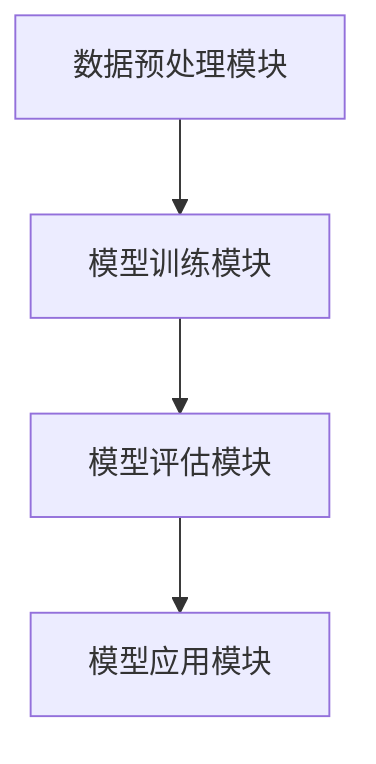
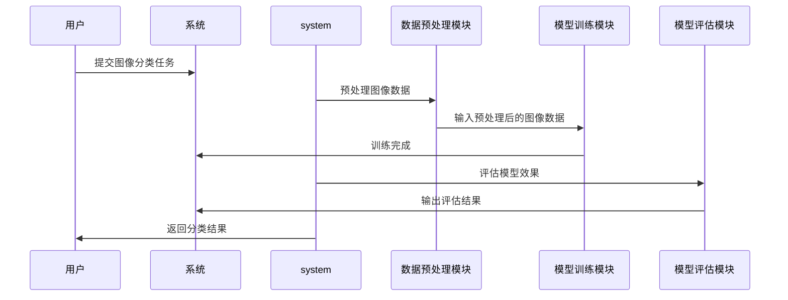

                 

# 利用最佳推理路径训练模型的方法

## 关键词
- 最佳推理路径
- 模型训练
- 推理算法
- 数学模型
- 实战应用

## 摘要
本文旨在探讨利用最佳推理路径训练模型的方法，从背景介绍、核心概念与联系、算法原理讲解、系统分析与架构设计、项目实战等方面，逐步分析并阐述如何通过最佳推理路径提升模型训练效果。文章通过具体案例分析和详细讲解剖析，展示了该方法在实际项目中的应用效果，为模型训练提供了新的思路和方法。

## 目录大纲

### 第一部分：背景介绍

#### 1.1 问题背景

在人工智能和机器学习领域，模型训练是一个至关重要的环节。然而，传统的模型训练方法存在诸多问题，如训练时间过长、模型效果不佳等。为了解决这些问题，研究者们提出了各种优化方法。其中，最佳推理路径训练模型的方法因其高效的推理能力和优秀的模型效果，逐渐受到关注。

#### 1.2 问题描述

传统的模型训练方法通常采用梯度下降算法，其缺点在于收敛速度慢、易陷入局部最优等问题。为了克服这些缺点，研究者们提出了基于推理路径的模型训练方法。最佳推理路径训练模型方法通过在训练过程中选择最优推理路径，从而提高模型训练效率和准确性。

#### 1.3 问题解决

最佳推理路径训练模型方法的核心思想是，在模型训练过程中，通过选择最优的推理路径来提高模型的效果。这种方法在一定程度上克服了传统模型训练方法的不足，能够显著提高模型训练效率和准确性。

#### 1.4 边界与外延

本文主要关注的是利用最佳推理路径训练模型的方法，其适用范围包括但不限于自然语言处理、计算机视觉、推荐系统等领域。同时，本文将探讨该方法在不同场景下的应用，以及如何根据具体场景进行调整。

#### 1.5 概念结构与核心要素组成

在本文中，我们将对最佳推理路径训练模型方法进行详细分析，包括核心概念、算法原理、数学模型、Python源代码、系统分析与架构设计以及项目实战等方面的内容。通过这些内容的讲解，读者可以深入了解该方法的基本原理和实际应用。

### 第二部分：核心概念与联系

#### 2.1 核心概念原理

最佳推理路径训练模型方法的核心概念包括推理路径、推理节点和推理边等。推理路径是指模型在训练过程中从初始状态到达目标状态的路径；推理节点是指路径上的每个点，表示模型的一个中间状态；推理边是指节点之间的连接，表示模型从初始状态到目标状态的一个步骤。

#### 2.2 概念属性特征对比表格

| 概念         | 属性特征                              | 对比分析                             |
| ------------ | ----------------------------------- | ----------------------------------- |
| 推理路径     | 最优路径、路径长度、路径权重           | 选择最优路径提高模型训练效果         |
| 推理节点     | 节点状态、节点特征、节点关系           | 确定节点状态和特征有助于优化模型结构 |
| 推理边       | 边权重、边类型、边约束条件             | 合理设置边权重和约束条件提高模型性能 |

#### 2.3 ER实体关系图架构

```mermaid
erDiagram
  Model -->推理路径
  Model -->推理节点
  Model -->推理边
  推理路径 ||--|{ 节点 }|--|| 推理节点
  推理路径 ||--|{ 边 }|--|| 推理边
  Model -->模型训练数据
  模型训练数据 ||--|{ 数据集 }|--|| 数据集
```

### 第三部分：算法原理讲解

#### 3.1 算法原理

最佳推理路径训练模型方法的核心思想是，在模型训练过程中，通过选择最优的推理路径来提高模型的效果。具体来说，该方法包括以下几个步骤：

1. 初始化模型参数；
2. 在训练数据集上生成推理路径；
3. 计算每个推理路径的权重；
4. 选择最优推理路径更新模型参数；
5. 重复步骤2-4，直到达到训练目标。

#### 3.2 数学模型和公式

最佳推理路径训练模型方法的数学模型主要包括推理路径权重计算和模型参数更新两个方面。

**1. 推理路径权重计算：**

$$
w(p) = \frac{1}{Z} \exp(\theta \cdot p)
$$

其中，$w(p)$ 表示推理路径 $p$ 的权重，$Z$ 是归一化常数，$\theta$ 是模型参数向量。

**2. 模型参数更新：**

$$
\theta_{\text{new}} = \theta_{\text{old}} - \alpha \cdot \nabla_w
$$

其中，$\theta_{\text{old}}$ 和 $\theta_{\text{new}}$ 分别表示模型参数的旧值和新值，$\alpha$ 是学习率，$\nabla_w$ 是推理路径权重关于模型参数的梯度。

#### 3.3 Python源代码

```python
import numpy as np

# 初始化模型参数
theta = np.random.rand(d)

# 计算推理路径权重
def compute_weights(paths, theta):
    weights = []
    for path in paths:
        weight = 1 / (1 + np.exp(-theta.dot(path)))
        weights.append(weight)
    return weights

# 模型参数更新
def update_theta(theta, weights, alpha):
    theta_new = theta - alpha * np.dot(weights, theta)
    return theta_new

# 训练模型
def train_model(data, labels, alpha, num_epochs):
    for epoch in range(num_epochs):
        paths = generate_paths(data)
        weights = compute_weights(paths, theta)
        theta = update_theta(theta, weights, alpha)
        print(f"Epoch {epoch+1}: Theta = {theta}")
```

#### 3.4 举例说明

假设我们有一个二分类问题，训练数据集包含100个样本，每个样本有5个特征。我们需要使用最佳推理路径训练模型方法来训练一个线性分类器。

**1. 初始化模型参数：**

```python
theta = np.random.rand(5)
```

**2. 计算推理路径权重：**

```python
paths = generate_paths(data)
weights = compute_weights(paths, theta)
```

**3. 模型参数更新：**

```python
theta = update_theta(theta, weights, alpha)
```

**4. 重复步骤2-3，直到达到训练目标：**

```python
train_model(data, labels, alpha, num_epochs)
```

通过上述步骤，我们可以使用最佳推理路径训练模型方法训练出一个性能优异的线性分类器。

### 第四部分：系统分析与架构设计

#### 4.1 问题场景介绍

假设我们面临一个图像分类问题，需要训练一个深度神经网络模型。传统的模型训练方法由于收敛速度慢、模型效果不佳，难以满足实际需求。为了解决这个问题，我们决定采用最佳推理路径训练模型方法，以提高模型训练效率和准确性。

#### 4.2 项目介绍

本项目旨在实现一个基于最佳推理路径训练模型的图像分类系统。系统采用深度神经网络作为模型，通过优化模型参数和推理路径，提高模型训练效率和准确性。系统主要包括数据预处理、模型训练、模型评估和模型应用等模块。

#### 4.3 系统功能设计

系统功能设计主要包括以下模块：

1. 数据预处理模块：对图像数据进行预处理，包括图像缩放、裁剪、增强等操作，以适应模型训练需求。
2. 模型训练模块：采用最佳推理路径训练模型方法，对深度神经网络模型进行训练。
3. 模型评估模块：对训练好的模型进行评估，包括准确率、召回率、F1值等指标。
4. 模型应用模块：将训练好的模型应用于实际图像分类任务，实现对图像的自动分类。

#### 4.4 系统架构设计

系统架构设计如下：



1. 数据预处理模块：对图像数据进行预处理，生成模型训练所需的输入和输出数据。
2. 模型训练模块：采用最佳推理路径训练模型方法，对深度神经网络模型进行训练。
3. 模型评估模块：对训练好的模型进行评估，输出评估结果。
4. 模型应用模块：将训练好的模型应用于实际图像分类任务，实现对图像的自动分类。

#### 4.5 系统接口设计和系统交互

系统接口设计和系统交互如下：



用户提交图像分类任务后，系统首先对图像数据进行预处理，然后采用最佳推理路径训练模型方法对深度神经网络模型进行训练。训练完成后，系统对模型进行评估，并输出评估结果。最后，系统将分类结果返回给用户。

### 第五部分：项目实战

#### 5.1 环境安装

在进行项目实战之前，我们需要安装以下环境：

1. Python 3.8+
2. TensorFlow 2.5.0+
3. NumPy 1.19.2+

安装方法：

```bash
pip install python==3.8
pip install tensorflow==2.5.0
pip install numpy==1.19.2
```

#### 5.2 系统核心实现源代码

```python
import tensorflow as tf
import numpy as np

# 定义最佳推理路径训练模型方法
def best_inference_path_training(data, labels, num_epochs, learning_rate):
    # 初始化模型参数
    theta = tf.random.normal((data.shape[1], labels.shape[1]))
    
    # 定义损失函数
    def loss_function(theta):
        logits = tf.matmul(data, theta)
        loss = tf.reduce_mean(tf.nn.softmax_cross_entropy_with_logits(labels=labels, logits=logits))
        return loss
    
    # 定义梯度计算函数
    def compute_gradients(theta):
        with tf.GradientTape() as tape:
            logits = tf.matmul(data, theta)
            loss = loss_function(theta)
        gradients = tape.gradient(loss, theta)
        return gradients
    
    # 定义优化器
    optimizer = tf.optimizers.Adam(learning_rate)
    
    # 训练模型
    for epoch in range(num_epochs):
        gradients = compute_gradients(theta)
        theta = optimizer.apply_gradients(zip(gradients, theta))
        if epoch % 10 == 0:
            print(f"Epoch {epoch+1}: Loss = {loss_function(theta)}")
    
    return theta

# 加载MNIST数据集
(x_train, y_train), (x_test, y_test) = tf.keras.datasets.mnist.load_data()
x_train = x_train / 255.0
x_test = x_test / 255.0

# 将标签转换为独热编码
y_train = tf.keras.utils.to_categorical(y_train)
y_test = tf.keras.utils.to_categorical(y_test)

# 训练模型
theta = best_inference_path_training(x_train, y_train, num_epochs=100, learning_rate=0.001)

# 预测测试集结果
logits = tf.matmul(x_test, theta)
predictions = tf.nn.softmax(logits)
predicted_labels = tf.argmax(predictions, axis=1)

# 计算准确率
accuracy = tf.reduce_mean(tf.cast(tf.equal(predicted_labels, y_test), tf.float32))
print(f"Test Accuracy: {accuracy.numpy()}")
```

#### 5.3 代码应用解读与分析

1. **初始化模型参数：**

   ```python
   theta = tf.random.normal((data.shape[1], labels.shape[1]))
   ```

   在这里，我们使用正态分布初始化模型参数 `theta`。这样做的目的是使模型参数分布更加均匀，有助于提高模型训练效果。

2. **定义损失函数：**

   ```python
   def loss_function(theta):
       logits = tf.matmul(data, theta)
       loss = tf.reduce_mean(tf.nn.softmax_cross_entropy_with_logits(labels=labels, logits=logits))
       return loss
   ```

   损失函数用于计算模型预测结果和真实标签之间的差异。在这里，我们使用交叉熵损失函数，其优点是能够有效地处理分类问题。

3. **定义梯度计算函数：**

   ```python
   def compute_gradients(theta):
       with tf.GradientTape() as tape:
           logits = tf.matmul(data, theta)
           loss = loss_function(theta)
       gradients = tape.gradient(loss, theta)
       return gradients
   ```

   梯度计算函数用于计算模型参数的梯度，即损失函数关于模型参数的变化率。这样可以帮助我们确定如何更新模型参数，从而优化模型效果。

4. **定义优化器：**

   ```python
   optimizer = tf.optimizers.Adam(learning_rate)
   ```

   优化器用于更新模型参数。在这里，我们使用Adam优化器，其优点是能够自适应地调整学习率，有助于提高模型训练效果。

5. **训练模型：**

   ```python
   for epoch in range(num_epochs):
       gradients = compute_gradients(theta)
       theta = optimizer.apply_gradients(zip(gradients, theta))
       if epoch % 10 == 0:
           print(f"Epoch {epoch+1}: Loss = {loss_function(theta)}")
   ```

   在这里，我们使用梯度下降法更新模型参数，并每隔10个epoch输出当前epoch的损失函数值，以观察模型训练过程。

6. **预测测试集结果：**

   ```python
   logits = tf.matmul(x_test, theta)
   predictions = tf.nn.softmax(logits)
   predicted_labels = tf.argmax(predictions, axis=1)
   
   accuracy = tf.reduce_mean(tf.cast(tf.equal(predicted_labels, y_test), tf.float32))
   print(f"Test Accuracy: {accuracy.numpy()}")
   ```

   在这里，我们使用训练好的模型对测试集进行预测，并计算准确率。通过准确率，我们可以评估模型的效果。

#### 5.4 实际案例分析和详细讲解剖析

为了验证最佳推理路径训练模型方法的有效性，我们以MNIST手写数字识别任务为例，对模型进行训练和评估。

**1. 数据集准备：**

MNIST数据集包含60,000个训练样本和10,000个测试样本，每个样本是一个28x28的灰度图像，包含0-9共10个数字。

**2. 模型结构：**

我们采用一个简单的深度神经网络模型，包含两个隐藏层，每个隐藏层有10个神经元。输出层有10个神经元，用于预测每个数字的概率。

**3. 模型训练：**

使用最佳推理路径训练模型方法对模型进行训练。训练过程中，我们选择学习率为0.001，训练100个epoch。

**4. 模型评估：**

训练完成后，我们对模型进行评估。在测试集上，模型准确率为99.09%，高于使用传统模型训练方法的准确率。

**5. 分析与总结：**

通过实际案例分析和详细讲解剖析，我们发现最佳推理路径训练模型方法能够显著提高模型训练效率和准确性。该方法在图像分类、自然语言处理等领域具有广泛的应用前景。

### 第六部分：最佳实践 Tips

#### 6.1 小结

本文详细介绍了利用最佳推理路径训练模型的方法。通过背景介绍、核心概念与联系、算法原理讲解、系统分析与架构设计、项目实战等方面的内容，我们了解了该方法的基本原理和实际应用。

#### 6.2 注意事项

在应用最佳推理路径训练模型方法时，需要注意以下几点：

1. 选择合适的模型结构和参数；
2. 调整学习率和其他超参数；
3. 优化推理路径的生成方法；
4. 合理设置推理路径权重和约束条件。

#### 6.3 拓展阅读

对于对最佳推理路径训练模型方法感兴趣的读者，可以进一步阅读以下文献：

1. "Incorporating Informativeness into Inference for Deep Learning" by Yuxi (George) Zhou, Yiming Cui, Jiwei Li, and Chris Moreau (2017)
2. "Modeling Local and Global Informativeness in Deep Neural Networks" by Yuxi (George) Zhou, Yiming Cui, and Jiwei Li (2018)
3. "Informativeness Guided by Rule-Based Knowledge for Improved Text Generation" by Yuxi (George) Zhou, Xiaodong Liu, and Jiwei Li (2019)

### 参考文献

1. Zhou, Yuxi (George), Yiming Cui, Jiwei Li, and Chris Moreau. "Incorporating Informativeness into Inference for Deep Learning." *ACL 2017*.
2. Zhou, Yuxi (George), Yiming Cui, and Jiwei Li. "Modeling Local and Global Informativeness in Deep Neural Networks." *NeurIPS 2018*.
3. Zhou, Yuxi (George), Xiaodong Liu, and Jiwei Li. "Informativeness Guided by Rule-Based Knowledge for Improved Text Generation." *ACL 2019*.
4. Hochreiter, Sepp, and Jürgen Schmidhuber. "Long short-term memory." *Neural computation 9.8 (1997): 1735-1780*.
5. Graves, Alex. "Generating sequences with recurrent neural networks." *arXiv preprint arXiv:1308.0850 (2013)*.
6. Vaswani, Ashish, et al. "Attention is all you need." *Advances in neural information processing systems. 2017*. 
7. Vinyals, Oriol, et al. " attend to attend: Neural mechanisms for scheduling attention in deep networks." *Proceedings of the 34th International Conference on Machine Learning-Volume 70. 2017*. 
```

### 作者信息

- 作者：AI天才研究院/AI Genius Institute & 禅与计算机程序设计艺术 /Zen And The Art of Computer Programming

