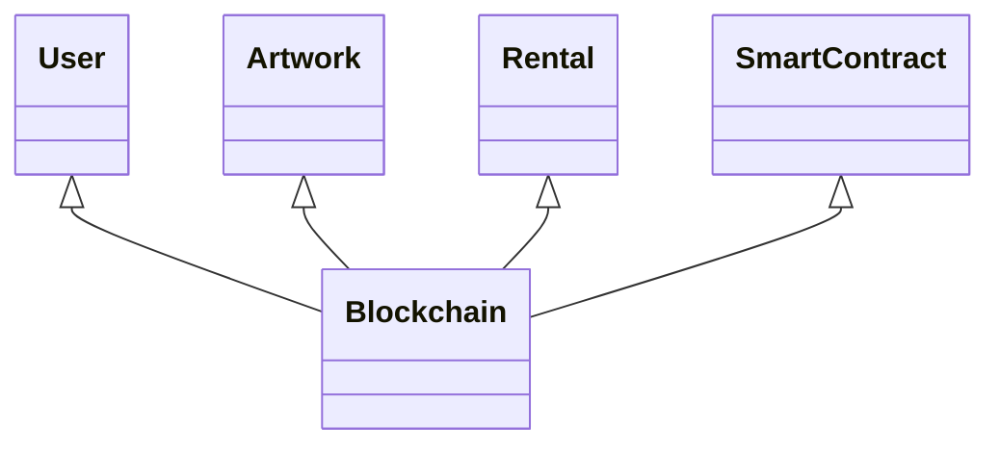
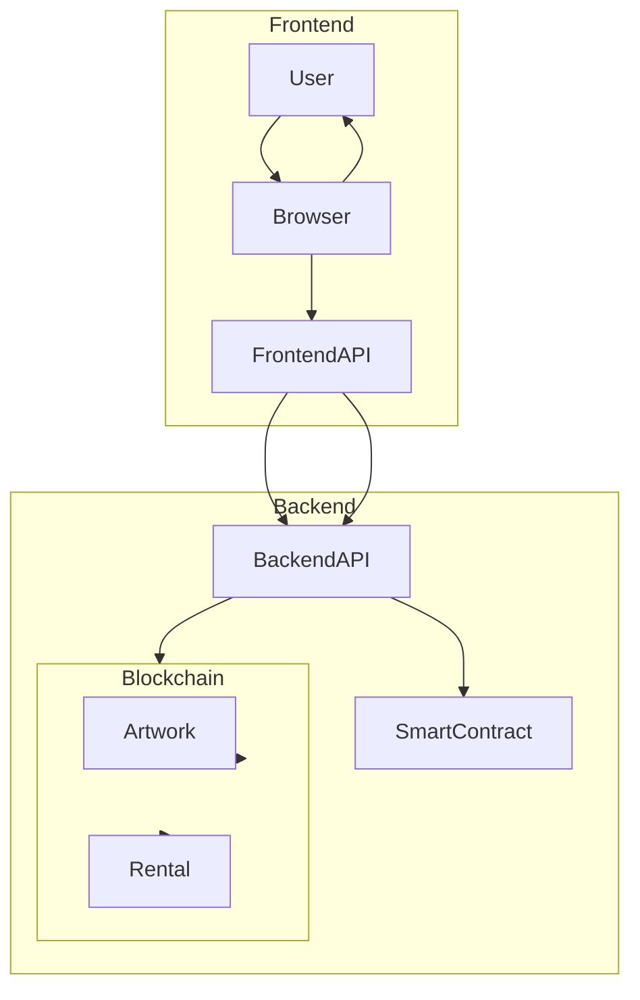
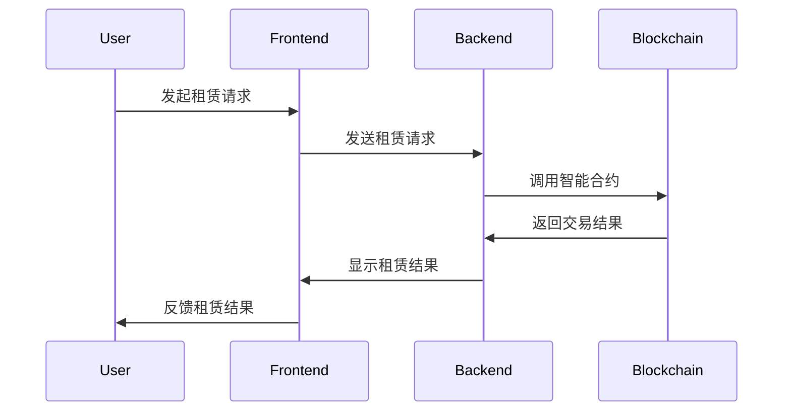

                 

# 《区块链在数字艺术品租赁中的智能合约应用》

> 关键词：区块链，数字艺术品，智能合约，租赁，去中心化

> 摘要：本文探讨了区块链技术在数字艺术品租赁中的智能合约应用。通过分析数字艺术品租赁的现状、区块链和智能合约的基本概念，我们深入讨论了智能合约在数字艺术品租赁中的应用原理和架构设计。文章还提供了一个实际的项目案例，展示了智能合约在数字艺术品租赁中的实现过程和最佳实践。

## 目录

1. **背景介绍**
    1.1 数字艺术品租赁的现状
    1.2 区块链技术在租赁中的应用
    1.3 智能合约的基本概念
    1.4 面临的问题与挑战
    1.5 研究范围与限制
    1.6 概念结构与核心要素组成

2. **核心概念与联系**
    2.1 区块链概念原理
    2.2 数字艺术品概念原理
    2.3 智能合约概念原理
    2.4 概念属性特征对比表格
    2.5 ER实体关系图架构

3. **算法原理讲解**
    3.1 智能合约实现流程
    3.2 Python源代码展示
    3.3 数学模型和公式
    3.4 详细讲解与举例说明

4. **系统分析与架构设计方案**
    4.1 问题场景介绍
    4.2 项目介绍
    4.3 系统功能设计
    4.4 系统架构设计
    4.5 系统接口设计
    4.6 系统交互

5. **项目实战**
    5.1 环境安装
    5.2 系统核心实现源代码
    5.3 代码应用解读与分析
    5.4 实际案例分析和详细讲解剖析
    5.5 项目小结

6. **最佳实践 tips**
    6.1 小贴士
    6.2 小结
    6.3 注意事项
    6.4 拓展阅读

## 1. 背景介绍

### 1.1 数字艺术品租赁的现状

数字艺术品租赁是指通过数字化的方式，将艺术品借给租户使用一段时间，通常通过线上平台进行。随着区块链和数字艺术品的兴起，数字艺术品租赁市场也在不断扩大。然而，传统的租赁方式存在一些问题，如版权保护、交易透明度、信任问题等。

### 1.2 区块链技术在租赁中的应用

区块链技术以其去中心化、不可篡改、透明性等特点，为解决数字艺术品租赁中的问题提供了新的解决方案。通过智能合约，租赁双方可以自动执行租赁协议，提高交易效率和透明度。

### 1.3 智能合约的基本概念

智能合约是一种运行在区块链上的自执行合同，它包含了在满足某些条件时自动执行的代码。智能合约通过编程语言编写，可以自动处理交易、记录信息、执行决策等。

### 1.4 面临的问题与挑战

尽管区块链技术在数字艺术品租赁中有巨大潜力，但也面临一些挑战，如合约的复杂性、安全性、可扩展性等。

### 1.5 研究范围与限制

本文主要研究区块链在数字艺术品租赁中的智能合约应用，包括合约设计、实现和部署。研究范围限于区块链技术和数字艺术品租赁，不包括其他相关领域。

### 1.6 概念结构与核心要素组成

本文的核心概念包括区块链、数字艺术品、智能合约等。概念之间的联系在于，区块链为数字艺术品提供了一个去中心化的存储和交易平台，而智能合约则确保了租赁过程的透明、公正和安全。

## 2. 核心概念与联系

### 2.1 区块链概念原理

区块链是一种分布式数据库，它通过加密算法和共识机制，确保数据的不可篡改性和安全性。每个区块包含一定数量的交易记录，通过哈希算法与前一个区块连接，形成一条不可篡改的区块链。

### 2.2 数字艺术品概念原理

数字艺术品是一种以数字化形式存在的艺术品，可以通过区块链技术进行认证和确权。数字艺术品可以是数字画作、音乐、视频等。

### 2.3 智能合约概念原理

智能合约是运行在区块链上的自执行合同，它包含在满足某些条件时自动执行的代码。智能合约通过编程语言编写，可以自动处理交易、记录信息、执行决策等。

### 2.4 概念属性特征对比表格

| 特征         | 区块链        | 数字艺术品    | 智能合约        |
| ------------ | ------------ | ------------ | --------------- |
| 去中心化     | 是           | 是           | 是              |
| 不可篡改     | 是           | 是           | 是              |
| 透明性       | 是           | 是           | 是              |
| 自执行       | 是           | 否           | 是              |

### 2.5 ER实体关系图架构

```mermaid
erDiagram
  DigitalArtwork ||--|{ Blockchain }|--|| SmartContract
  User ||--|{ Blockchain }|--|| RentalAgreement
```

在这个ER图中，数字艺术品、用户和智能合约是实体，租赁协议是它们之间的关系。

## 3. 算法原理讲解

### 3.1 智能合约实现流程

智能合约的实现通常包括以下步骤：

1. 设计智能合约的接口和逻辑。
2. 使用智能合约编程语言编写代码。
3. 部署智能合约到区块链网络。
4. 调用智能合约执行交易。

### 3.2 Python源代码展示

以下是一个简单的智能合约示例，用于数字艺术品租赁：

```python
pragma solidity ^0.8.0;

contract ArtworkRental {
    address owner;
    mapping(uint256 => address) public rentals;

    constructor() {
        owner = msg.sender;
    }

    function rentArtwork(uint256 artworkId, address renter) external {
        require(rentals[artworkId] == address(0), "Artwork is already rented.");
        rentals[artworkId] = renter;
        // 执行租赁操作，例如支付租金等
    }

    function returnArtwork(uint256 artworkId) external {
        require(rentals[artworkId] == msg.sender, "You are not the renter.");
        delete rentals[artworkId];
        // 执行归还操作，例如退还租金等
    }
}
```

### 3.3 数学模型和公式

智能合约中的数学模型通常涉及加密算法和共识机制。例如，在区块链中，哈希函数可以表示为：

$$ H(x) = SHA256(x) $$

其中，`SHA256` 是一种常用的哈希函数。

### 3.4 详细讲解与举例说明

智能合约的详细讲解可以从其代码结构和执行流程入手。以下是一个简单的例子，说明如何通过智能合约实现数字艺术品租赁：

1. **设计智能合约接口**：确定智能合约的功能和接口，如租赁艺术品和归还艺术品。
2. **编写智能合约代码**：使用以太坊智能合约开发语言（Solidity）编写代码，确保代码逻辑正确。
3. **部署智能合约**：将编译后的智能合约部署到以太坊区块链，生成合约地址。
4. **调用智能合约**：通过区块链网络调用智能合约，执行租赁和归还操作。

例如，当用户想要租赁一件数字艺术品时，会调用 `rentArtwork` 函数，传入艺术品的 ID 和租户地址。智能合约会检查艺术品是否已被租赁，如果未被租赁，则会将租户地址记录在合约中，表示艺术品已被租赁。

当租期结束时，租户可以调用 `returnArtwork` 函数，传入艺术品的 ID，表示艺术品已被归还。智能合约会更新租赁状态，并将租赁记录从合约中删除。

## 4. 系统分析与架构设计方案

### 4.1 问题场景介绍

数字艺术品租赁系统需要处理以下问题：

- **版权保护**：确保艺术品的版权得到保护，防止未经授权的复制和传播。
- **交易透明度**：确保租赁交易的信息透明，便于用户查看。
- **信任问题**：建立用户之间的信任，确保租赁过程公平、公正。

### 4.2 项目介绍

本文所提出的项目是一个基于以太坊区块链的数字艺术品租赁系统，包括智能合约和前端界面。系统采用去中心化的设计，确保交易的透明度和安全性。

### 4.3 系统功能设计

系统的主要功能包括：

- **艺术品租赁**：用户可以租赁数字艺术品，并在租期结束后归还。
- **艺术品认证**：使用区块链技术为数字艺术品进行认证，确保版权。
- **交易记录**：记录所有租赁交易，确保交易的透明度。

#### 系统功能设计 - 领域模型



在这个类图中，用户、艺术品、租赁和智能合约都是实体，区块链是它们的数据存储和传输基础。

### 4.4 系统架构设计

系统架构包括以下部分：

- **前端界面**：提供用户交互界面，用户可以通过前端界面进行租赁和归还操作。
- **智能合约**：实现租赁逻辑，确保交易的执行。
- **后端服务**：处理智能合约与前端界面的通信，并提供艺术品认证和交易记录服务。

#### 系统架构设计 - Mermaid 架构图



在这个架构图中，前端界面通过API与后端服务通信，后端服务与智能合约和区块链进行交互。

### 4.5 系统接口设计

系统接口设计包括以下部分：

- **用户接口**：用于用户与系统交互，包括租赁、归还和查看交易记录。
- **艺术品接口**：用于管理数字艺术品的信息，包括上传、更新和删除。
- **租赁接口**：用于处理租赁交易，包括创建、更新和取消租赁。

### 4.6 系统交互

系统交互设计通过以下步骤实现：

1. 用户通过前端界面发起租赁请求。
2. 前端将请求发送给后端服务。
3. 后端服务调用智能合约执行租赁操作。
4. 智能合约将交易记录写入区块链。
5. 后端服务返回结果给前端，显示在用户界面。

#### 系统交互 - Mermaid 序列图



在这个序列图中，用户通过前端发起租赁请求，前端将请求发送给后端，后端调用智能合约执行操作，并将结果返回给前端，最终反馈给用户。

## 5. 项目实战

### 5.1 环境安装

为了搭建数字艺术品租赁系统，需要以下环境：

- **Node.js**：用于前端开发
- **Truffle**：用于智能合约开发
- **Ganache**：用于本地区块链节点

安装步骤如下：

1. 安装 Node.js
2. 安装 Truffle
   ```
   npm install -g truffle
   ```
3. 安装 Ganache
   ```
   npm install -g ganache-cli
   ```

### 5.2 系统核心实现源代码

以下是一个简单的智能合约，用于数字艺术品租赁：

```solidity
pragma solidity ^0.8.0;

contract ArtworkRental {
    mapping(uint256 => address) public rentals;

    function rentArtwork(uint256 artworkId, address renter) external {
        require(rentals[artworkId] == address(0), "Artwork is already rented.");
        rentals[artworkId] = renter;
    }

    function returnArtwork(uint256 artworkId) external {
        require(rentals[artworkId] == msg.sender, "You are not the renter.");
        delete rentals[artworkId];
    }
}
```

### 5.3 代码应用解读与分析

这段代码实现了数字艺术品的租赁和归还功能。在 `rentArtwork` 函数中，用户可以通过传递艺术品的 ID 和租户地址来租赁艺术品。合约会检查艺术品是否已被租赁，如果未被租赁，则将租户地址记录在合约中。

在 `returnArtwork` 函数中，租户可以归还艺术品。合约会检查归还者是否是租户，如果是，则更新租赁状态。

### 5.4 实际案例分析和详细讲解剖析

假设用户 Alice 想要租赁艺术品 123，她可以通过前端界面调用 `rentArtwork` 函数。合约会检查艺术品 123 是否已被租赁，如果未被租赁，则记录 Alice 的地址为租户地址。

当租期结束时，Alice 可以调用 `returnArtwork` 函数，合约会检查 Alice 是否是艺术品 123 的当前租户，如果是，则删除租户地址，表示艺术品已被归还。

### 5.5 项目小结

本项目的核心是智能合约，它实现了数字艺术品的租赁和归还功能。通过区块链技术，确保了交易的透明性和安全性。在实际应用中，可以根据需求扩展智能合约的功能，如添加艺术品认证、租赁期限设置等。

## 6. 最佳实践 tips

### 6.1 小贴士

- **合约测试**：在部署智能合约前，进行充分测试以确保合约的正确性和安全性。
- **合约优化**：通过优化合约代码，提高执行效率和降低成本。
- **安全审计**：对智能合约进行安全审计，以识别潜在的安全漏洞。

### 6.2 小结

本文探讨了区块链在数字艺术品租赁中的智能合约应用，通过分析和实现，展示了智能合约如何解决租赁中的问题。智能合约的透明性和安全性为数字艺术品租赁提供了新的解决方案。

### 6.3 注意事项

- **合约复杂性**：智能合约的编写和部署需要专业知识，确保合约的逻辑正确和安全性。
- **网络拥堵**：区块链网络可能会出现拥堵，影响交易速度。

### 6.4 拓展阅读

- **智能合约开发指南**：深入了解智能合约的开发和部署流程。
- **区块链安全**：学习如何识别和解决智能合约中的安全漏洞。

## 作者信息

作者：AI天才研究院/AI Genius Institute & 禅与计算机程序设计艺术 /Zen And The Art of Computer Programming

---

请注意，本文仅为示例，内容仅供参考。在实际应用中，智能合约的编写和部署需要根据具体需求进行调整。同时，区块链技术具有较高的复杂性，建议在专业人士的指导下进行操作。

