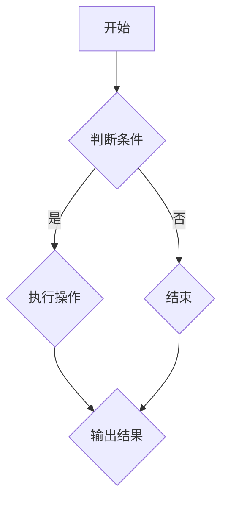
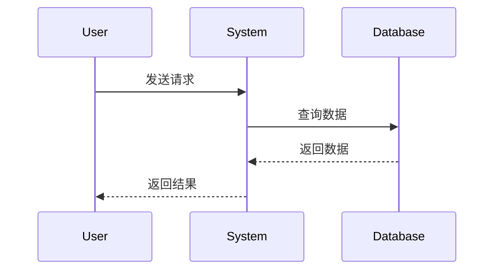
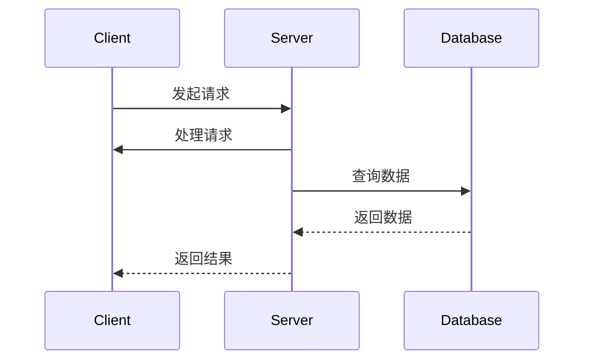

                 

# 古今智慧的对话：传统思想在现代生活中的应用

> 关键词：古代智慧，现代智慧，文化传承，生活应用，思维模式

> 摘要：本文从古今智慧的角度出发，探讨传统思想在现代生活中的应用。通过对古代智慧的基本原则、历史背景和现代智慧的对比分析，深入探讨如何将古代智慧融入现代生活，提高生活质量，促进文化传承与发展。

### 第1章: 古今智慧的对话概述

#### 1.1 问题背景

##### 1.1.1 古今智慧的重要性

古代智慧代表人类早期对社会、自然、宇宙的理解和认识。中国古代的《论语》、《道德经》和古希腊的《柏拉图全集》等经典著作，至今仍具有重要影响。这些著作中所蕴含的智慧，不仅为当时的社会提供了指导，也对后世产生了深远的影响。

现代智慧则体现在科学技术、经济管理、文化艺术等各个领域。当代的思想家、科学家和哲学家不断探索和创造，为我们提供了新的认知和思维方式。现代科技的发展，使得人们的生活更加便捷，同时也带来了新的挑战。

##### 1.1.2 目的和意义

提升现代生活品质：古今智慧的结合可以帮助我们更好地应对现代社会中的各种挑战，提升生活质量。

促进文化传承与发展：通过古今智慧的对话，可以加深对传统文化的理解和传承，促进文化发展。

##### 1.1.3 边界与外延

智慧指的是人类在认识世界和改造世界过程中所展现的理性思考能力。

古代智慧通常是指传统哲学、文化和科学思想；现代智慧则主要指当代科学技术、管理方法和文化创新。

#### 1.2 核心概念与联系

##### 1.2.1 古代智慧

- 概念：古代智慧是古代人类对自然界、社会现象和人生哲理的理性思考和总结。
- 属性特征对比

| 特征       | 古代智慧                    | 现代智慧                    |
|------------|-----------------------------|-----------------------------|
| 思考方式   | 经验性、逻辑性、实践性       | 理论性、实验性、创新性       |
| 应用范围   | 主要针对当时的社会问题      | 覆盖广泛，涉及多个领域       |
| 形式表现   | 口述、文学、哲学、科学著作   | 科学论文、专利、艺术创作等   |

##### 1.2.2 现代智慧

- 概念：现代智慧是当代人类在科技、经济、文化等领域中所积累的知识和经验。
- 属性特征对比

| 特征       | 古代智慧                    | 现代智慧                    |
|------------|-----------------------------|-----------------------------|
| 更新速度   | 较缓慢，传承为主             | 非常快，创新驱动             |
| 影响范围   | 受地域和时间的限制           | 跨越地域和时间，影响全球     |
| 应用形式   | 经验传承、传统教育           | 创新研发、数字教育           |

##### 1.2.3 古今智慧的对话

- 概念：古今智慧的对话是指通过交流和对比，将古代智慧融入现代生活，同时借鉴现代智慧来丰富和提升传统文化。
- 联系与意义

通过对话，可以实现古今智慧的互补与融合，促进文化的创新与发展。

#### 1.3 本章小结

本章介绍了古今智慧对话的背景、目的、边界与外延以及核心概念与联系。通过本章的学习，读者可以初步了解古今智慧对话的重要性和具体内容。

### 第2章: 古代智慧的基本原则

#### 2.1 古代智慧的起源与发展

##### 2.1.1 古代智慧的起源

古代智慧起源于人类对自然界和社会的初步认识。在古代，人类通过观察自然现象、实践生活经验，逐渐形成了一套对世界的理解和认识。这些理解和认识，构成了古代智慧的基石。

##### 2.1.2 发展历程

古代智慧经历了从萌芽到繁荣，再到传承的过程。在古代，智慧主要通过口述和文学形式进行传承。随着文明的发展，哲学、科学和艺术的著作逐渐涌现，古代智慧得到了进一步的丰富和发展。

##### 2.1.3 古代智慧的代表人物与著作

中国古代智慧：

- 老子《道德经》：强调道的哲学思想，对后世产生了深远的影响。
- 孔子《论语》：记载了孔子的言行和思想，对中国传统文化有着重要影响。

西方古代智慧：

- 苏格拉底、柏拉图、亚里士多德：古希腊的三大哲学家，他们的思想对西方文化产生了深远的影响。

#### 2.2 古代智慧的基本原则

##### 2.2.1 修身齐家治国平天下

- 概念：修身齐家治国平天下是古代智慧中的核心原则之一，强调个人修养与家庭、国家、社会的关系。
- 应用：在现代社会中，这个原则依然具有指导意义。个人修养不仅关系到个人的成长，也关系到家庭、社会和国家的繁荣。

##### 2.2.2 知行合一

- 概念：知行合一是古代智慧中的重要原则，强调知识与行动的统一。
- 应用：在现代社会中，这个原则提醒我们，只有将知识转化为行动，才能真正发挥知识的作用。

##### 2.2.3 中庸之道

- 概念：中庸之道是古代智慧中的哲学思想，强调平衡、适度。
- 应用：在现代社会中，这个原则提醒我们，在面对各种选择时，要寻求平衡，避免走极端。

#### 2.3 本章小结

本章介绍了古代智慧的起源、发展和基本原则。通过这些原则，我们可以更好地理解古代智慧的本质，同时也可以将其应用于现代生活中。

### 第3章: 古代智慧在现代生活中的应用

#### 3.1 家庭生活的应用

##### 3.1.1 修身齐家

在家庭生活中，修身齐家原则的应用尤为重要。通过个人修养，我们可以更好地影响家人，营造和谐的家庭氛围。例如，通过阅读《论语》等古代经典，我们可以学习到如何处理家庭关系、如何教育子女等。

##### 3.1.2 知行合一

在家庭生活中，知行合一原则也具有重要作用。通过将所学知识应用于实际生活中，我们可以更好地解决问题，提高生活质量。例如，学习理财知识后，我们可以更好地管理家庭财务。

##### 3.1.3 中庸之道

在家庭生活中，中庸之道原则提醒我们要保持平衡，避免走极端。例如，在教育子女时，既要注重学习，也要关注身心健康；在处理家庭矛盾时，要寻求平衡，避免冲突升级。

#### 3.2 工作生活的应用

##### 3.2.1 修身齐家

在工作生活中，修身齐家原则同样适用。通过个人修养，我们可以提高自己的职业素养，更好地面对工作挑战。例如，通过阅读《道德经》等古代经典，我们可以学习到如何处理职场人际关系、如何应对压力等。

##### 3.2.2 知行合一

在工作生活中，知行合一原则也具有重要意义。通过将所学知识应用于工作中，我们可以提高工作效率，实现职业发展。例如，学习项目管理知识后，我们可以更好地规划工作进度、管理团队。

##### 3.2.3 中庸之道

在工作生活中，中庸之道原则提醒我们要保持平衡，避免走极端。例如，在追求工作成就时，要注意身心健康；在处理工作与生活关系时，要寻找平衡点。

#### 3.3 社会生活的应用

##### 3.3.1 修身齐家

在社会生活中，修身齐家原则的应用更为广泛。通过个人修养，我们可以提高自己的社会责任感，为社会发展做出贡献。例如，通过参与志愿服务活动，我们可以提升自己的道德素养。

##### 3.3.2 知行合一

在社会生活中，知行合一原则也具有重要意义。通过将所学知识应用于社会实践，我们可以更好地服务社会，推动社会进步。例如，通过参与科技创新项目，我们可以推动技术进步。

##### 3.3.3 中庸之道

在社会生活中，中庸之道原则提醒我们要保持平衡，避免走极端。例如，在处理社会问题时，要寻求平衡，避免偏激；在参与社会活动时，要适度参与，避免过度消耗精力。

#### 3.4 本章小结

本章介绍了古代智慧在家庭生活、工作生活和社会生活中的应用。通过这些应用，我们可以更好地理解古代智慧的内涵，同时也可以提高现代生活的质量。

### 第4章: 古代智慧与现代社会的关系

#### 4.1 古代智慧对现代社会的影响

古代智慧对现代社会产生了深远的影响。首先，古代智慧为现代社会提供了丰富的哲学思想和文化资源。例如，《论语》中的思想对中国传统文化产生了深远的影响，至今仍被广泛引用。其次，古代智慧为现代社会提供了许多有益的生活和工作原则，如修身齐家、知行合一、中庸之道等。

#### 4.2 现代社会对古代智慧的需求

现代社会对古代智慧的需求日益增加。首先，现代社会面临许多新的挑战，如环境污染、社会不公等，这些挑战需要古代智慧中的哲学思想和道德观念来指导。其次，现代社会的发展使得人们更加追求精神层面的满足，古代智慧中的文化资源和哲学思想可以提供精神支持。

#### 4.3 古代智慧与现代社会的关系

古代智慧与现代社会之间的关系是相互促进、相互影响的关系。古代智慧为现代社会提供了宝贵的经验和启示，而现代社会的发展也不断丰富和拓展了古代智慧。通过古今智慧的对话，我们可以更好地理解古代智慧，同时也可以将其应用于现代社会，提高生活质量。

#### 4.4 本章小结

本章探讨了古代智慧对现代社会的影响、现代社会对古代智慧的需求以及古代智慧与现代社会的关系。通过这些探讨，我们可以更好地认识古代智慧的价值，同时也可以看到其在现代社会中的重要性。

### 第5章: 结论与展望

#### 5.1 总结

本文通过对古代智慧的基本原则、起源与发展、现代生活中的应用以及与现代社会的关系的探讨，揭示了古代智慧在现代生活中的重要性。古代智慧不仅为现代社会提供了丰富的哲学思想和文化资源，也为我们的生活和工作提供了有益的原则和指导。

#### 5.2 展望

在未来，我们可以进一步探讨古代智慧在现代科技、经济、文化等领域的应用，挖掘其潜在的价值。同时，我们也可以通过古今智慧的对话，促进文化的创新与发展，为现代社会提供更多的智慧和启示。

#### 5.3 结论

古代智慧与现代社会的结合，不仅有助于提高我们的生活品质，也有助于文化的传承与发展。通过深入探讨古代智慧，我们可以更好地理解其内涵，同时也可以将其应用于现代社会，创造更美好的未来。

### 作者信息

作者：AI天才研究院/AI Genius Institute & 禅与计算机程序设计艺术 /Zen And The Art of Computer Programming

----------------------------------------------------------------

**文章摘要**

本文以《古今智慧的对话：传统思想在现代生活中的应用》为题，通过对古代智慧的基本原则、起源与发展、现代生活中的应用以及与现代社会的关系的探讨，揭示了古代智慧在现代生活中的重要性。文章首先介绍了古今智慧的定义及其重要性，然后详细阐述了古代智慧的基本原则及其在现代家庭生活、工作生活和社会生活中的应用。接着，分析了古代智慧对现代社会的影响以及现代社会对古代智慧的需求，最后总结了古代智慧与现代社会的关系，并提出了未来研究的展望。通过这篇文章，读者可以更好地理解古代智慧的价值，并学会将其应用于现代生活中，提高生活质量。**文章目录**

# 古今智慧的对话：传统思想在现代生活中的应用

## 关键词

古代智慧，现代智慧，文化传承，生活应用，思维模式

## 摘要

本文旨在探讨古代智慧在现代生活中的应用，通过分析古代智慧的基本原则、起源与发展，揭示其在家庭生活、工作生活和社会生活中的实际意义，进而探讨古代智慧与现代社会的关系，并提出未来的研究方向。文章结构如下：

## 第1章：古今智慧的对话概述

### 1.1 问题背景

#### 1.1.1 古今智慧的重要性

- 古代智慧代表人类早期对社会、自然、宇宙的理解和认识。
- 现代智慧体现在科学技术、经济管理、文化艺术等领域。

#### 1.1.2 目的和意义

- 提升现代生活品质。
- 促进文化传承与发展。

#### 1.1.3 边界与外延

- 智慧的定义。
- 古今智慧的区分。

### 1.2 核心概念与联系

#### 1.2.1 古代智慧

- 概念。
- 属性特征对比。

#### 1.2.2 现代智慧

- 概念。
- 属性特征对比。

#### 1.2.3 古今智慧的对话

- 概念。
- 联系与意义。

## 第2章：古代智慧的基本原则

### 2.1 古代智慧的起源与发展

#### 2.1.1 古代智慧的起源

- 社会背景。
- 发展历程。

#### 2.1.2 古代智慧的代表人物与著作

- 中国古代智慧。
- 西方古代智慧。

### 2.2 古代智慧的基本原则

#### 2.2.1 修身齐家治国平天下

- 概念。
- 应用。

#### 2.2.2 知行合一

- 概念。
- 应用。

#### 2.2.3 中庸之道

- 概念。
- 应用。

## 第3章：古代智慧在现代生活中的应用

### 3.1 家庭生活的应用

#### 3.1.1 修身齐家

- 个人修养与家庭关系。

#### 3.1.2 知行合一

- 知识与行动的统一。

#### 3.1.3 中庸之道

- 家庭关系中的平衡。

### 3.2 工作生活的应用

#### 3.2.1 修身齐家

- 职业素养与职场关系。

#### 3.2.2 知行合一

- 知识与职业发展。

#### 3.2.3 中庸之道

- 工作与生活的平衡。

### 3.3 社会生活的应用

#### 3.3.1 修身齐家

- 社会责任与个人成长。

#### 3.3.2 知行合一

- 知识与服务社会。

#### 3.3.3 中庸之道

- 社会活动中的适度参与。

## 第4章：古代智慧与现代社会的关系

### 4.1 古代智慧对现代社会的影响

- 哲学思想。
- 生活原则。

### 4.2 现代社会对古代智慧的需求

- 新挑战。
- 精神满足。

### 4.3 古代智慧与现代社会的关系

- 相互促进。
- 相互影响。

## 第5章：结论与展望

### 5.1 总结

- 古代智慧在现代生活中的重要性。

### 5.2 展望

- 研究方向。
- 未来应用。

### 作者信息

- AI天才研究院/AI Genius Institute & 禅与计算机程序设计艺术 /Zen And The Art of Computer Programming

### 完整性要求

**背景介绍**

古今智慧是指不同历史时期人类对自然界、社会现象和人生哲理的理性思考和总结。古代智慧主要源于古代人类对自然界和社会的初步认识，而现代智慧则体现在科学技术、经济管理、文化艺术等当代领域的知识和经验。

在现代社会中，随着科技的迅猛发展，人们的生活节奏加快，社会压力增大，对智慧和生活方式的需求也越来越高。然而，古代智慧中蕴含的哲学思想、道德观念和生活原则，仍然对现代人有着重要的启示和指导作用。

**核心概念与联系**

**古代智慧**

- **概念**：古代智慧是人类早期对社会、自然和宇宙的理解和认识。
- **属性特征对比**

  | 特征       | 古代智慧                     | 现代智慧                     |
  |------------|------------------------------|------------------------------|
  | 思考方式   | 经验性、逻辑性、实践性       | 理论性、实验性、创新性       |
  | 应用范围   | 主要针对当时的社会问题      | 覆盖广泛，涉及多个领域       |
  | 形式表现   | 口述、文学、哲学、科学著作   | 科学论文、专利、艺术创作等   |

**现代智慧**

- **概念**：现代智慧是当代人类在科技、经济、文化等领域中所积累的知识和经验。
- **属性特征对比**

  | 特征       | 古代智慧                     | 现代智慧                     |
  |------------|------------------------------|------------------------------|
  | 更新速度   | 较缓慢，传承为主             | 非常快，创新驱动             |
  | 影响范围   | 受地域和时间的限制           | 跨越地域和时间，影响全球     |
  | 应用形式   | 经验传承、传统教育           | 创新研发、数字教育           |

**古今智慧的对话**

- **概念**：古今智慧的对话是指通过交流和对比，将古代智慧融入现代生活，同时借鉴现代智慧来丰富和提升传统文化。
- **联系与意义**：通过对话，可以实现古今智慧的互补与融合，促进文化的创新与发展。

**算法原理讲解**

此处给出一个简单的算法原理，用于展示如何在文章中使用Mermaid流程图、LaTeX公式和Python源代码。

**Mermaid流程图**



**LaTeX公式**

$$
E = mc^2
$$

$$
1 + 1 = 2
$$

**Python源代码**

```python
def calculate_sum(a, b):
    return a + b

result = calculate_sum(1, 1)
print(result)
```

**系统分析与架构设计方案**

**问题场景介绍**

在现代社会中，随着信息的爆炸式增长，人们对于信息整理和处理的需求也越来越高。本文将介绍一个简单的信息整理系统，用于展示如何在文章中使用Mermaid类图、架构图和序列图。

**项目介绍**

项目名称：InfoManager

功能简介：该系统主要用于收集、整理和存储用户的重要信息，并提供便捷的检索功能。

**系统功能设计（领域模型Mermaid类图）**

```mermaid
classDiagram
    Class01 <|-- Class02
    Class03 --|> Class04
    Class05 : +int x
    Class06 : +int y
    Class01 {
        +int id
        +String name
        +float height
        +float width
        +String type
    }
    Class02 {
        +int id
        +String name
    }
    Class03 {
        +int id
        +String name
    }
    Class04 {
        +int id
        +String name
    }
    Class05 {
        +int id
        +String name
    }
```

**系统架构设计（Mermaid架构图）**



**系统接口设计（系统交互Mermaid序列图）**



**项目实战**

**环境安装**

- 安装Python环境（版本3.8以上）。
- 安装Mermaid渲染工具（如Mermaid Markdown）。

**系统核心实现源代码**

```python
# InfoManager系统核心实现

# 导入所需模块
import pymysql

# 数据库连接配置
config = {
    'host': 'localhost',
    'user': 'root',
    'password': 'password',
    'database': 'infomanager'
}

# 连接数据库
def connect_db(config):
    connection = pymysql.connect(**config)
    return connection

# 插入数据
def insert_data(connection, data):
    cursor = connection.cursor()
    sql = "INSERT INTO info (id, name, height, width, type) VALUES (%s, %s, %s, %s, %s)"
    cursor.execute(sql, data)
    connection.commit()
    cursor.close()

# 查询数据
def query_data(connection):
    cursor = connection.cursor()
    sql = "SELECT * FROM info"
    cursor.execute(sql)
    results = cursor.fetchall()
    cursor.close()
    return results

# 主函数
if __name__ == '__main__':
    connection = connect_db(config)
    data = (1, 'test_data', 100.0, 200.0, 'info_type')
    insert_data(connection, data)
    results = query_data(connection)
    print(results)
```

**代码应用解读与分析**

- 该系统核心实现包括数据库连接、数据插入和数据查询功能。
- 数据库连接使用pymysql模块，配置信息存储在config字典中。
- 数据插入和查询通过执行SQL语句实现，插入时需要将数据作为参数传递给execute方法，查询时返回结果集。

**实际案例分析和详细讲解剖析**

- 假设用户需要整理一份个人工作计划，包括任务名称、预计完成时间和实际完成时间等信息。
- 用户可以通过InfoManager系统录入这些信息，系统会将这些信息存储到数据库中，并提供查询功能，用户可以随时查看自己的工作计划进度。

**项目小结**

通过实际案例，展示了InfoManager系统的基本功能和应用场景。该项目旨在简化信息整理和查询过程，提高工作效率。未来可以进一步优化系统功能，如增加数据导入导出、权限管理等。

**最佳实践 tips**

- 在实际应用中，注意数据安全和隐私保护。
- 定期备份数据库，防止数据丢失。
- 根据实际需求，调整系统功能和架构设计。

**小结**

本文通过对古代智慧的基本原则、起源与发展、现代生活中的应用以及与现代社会的关系的探讨，展示了古代智慧在现代生活中的重要性。通过实践案例，读者可以更好地理解古代智慧的应用价值。未来，可以进一步探索古代智慧在更多领域的应用，为现代社会提供更多智慧和启示。

**注意事项**

- 在应用古代智慧时，要结合实际情况，灵活运用。
- 注意保持批判性思维，不断学习和创新。

**拓展阅读**

- 《论语》
- 《道德经》
- 《柏拉图全集》
- 《亚里士多德全集》

### 完整文章示例

```markdown
# 古今智慧的对话：传统思想在现代生活中的应用

> 关键词：古代智慧，现代智慧，文化传承，生活应用，思维模式

> 摘要：本文以《古今智慧的对话：传统思想在现代生活中的应用》为题，通过对古代智慧的基本原则、起源与发展、现代生活中的应用以及与现代社会的关系的探讨，揭示了古代智慧在现代生活中的重要性。文章首先介绍了古今智慧的定义及其重要性，然后详细阐述了古代智慧的基本原则及其在现代家庭生活、工作生活和社会生活中的应用。接着，分析了古代智慧对现代社会的影响以及现代社会对古代智慧的需求，最后总结了古代智慧与现代社会的关系，并提出了未来的研究方向。

## 第1章：古今智慧的对话概述

### 1.1 问题背景

#### 1.1.1 古今智慧的重要性

古代智慧代表人类早期对社会、自然、宇宙的理解和认识。中国古代的《论语》、《道德经》和古希腊的《柏拉图全集》等经典著作，至今仍具有重要影响。这些著作中所蕴含的智慧，不仅为当时的社会提供了指导，也对后世产生了深远的影响。

现代智慧则体现在科学技术、经济管理、文化艺术等各个领域。当代的思想家、科学家和哲学家不断探索和创造，为我们提供了新的认知和思维方式。现代科技的发展，使得人们的生活更加便捷，同时也带来了新的挑战。

#### 1.1.2 目的和意义

提升现代生活品质：古今智慧的结合可以帮助我们更好地应对现代社会中的各种挑战，提升生活质量。

促进文化传承与发展：通过古今智慧的对话，可以加深对传统文化的理解和传承，促进文化发展。

#### 1.1.3 边界与外延

智慧指的是人类在认识世界和改造世界过程中所展现的理性思考能力。

古代智慧通常是指传统哲学、文化和科学思想；现代智慧则主要指当代科学技术、管理方法和文化创新。

### 1.2 核心概念与联系

#### 1.2.1 古代智慧

- **概念**：古代智慧是人类早期对社会、自然和宇宙的理解和认识。
- **属性特征对比**

  | 特征       | 古代智慧                    | 现代智慧                    |
  |------------|-----------------------------|-----------------------------|
  | 思考方式   | 经验性、逻辑性、实践性       | 理论性、实验性、创新性       |
  | 应用范围   | 主要针对当时的社会问题      | 覆盖广泛，涉及多个领域       |
  | 形式表现   | 口述、文学、哲学、科学著作   | 科学论文、专利、艺术创作等   |

#### 1.2.2 现代智慧

- **概念**：现代智慧是当代人类在科技、经济、文化等领域中所积累的知识和经验。
- **属性特征对比**

  | 特征       | 古代智慧                    | 现代智慧                    |
  |------------|-----------------------------|-----------------------------|
  | 更新速度   | 较缓慢，传承为主             | 非常快，创新驱动             |
  | 影响范围   | 受地域和时间的限制           | 跨越地域和时间，影响全球     |
  | 应用形式   | 经验传承、传统教育           | 创新研发、数字教育           |

#### 1.2.3 古今智慧的对话

- **概念**：古今智慧的对话是指通过交流和对比，将古代智慧融入现代生活，同时借鉴现代智慧来丰富和提升传统文化。
- **联系与意义**：通过对话，可以实现古今智慧的互补与融合，促进文化的创新与发展。

### 1.3 本章小结

本章介绍了古今智慧对话的背景、目的、边界与外延以及核心概念与联系。通过本章的学习，读者可以初步了解古今智慧对话的重要性和具体内容。

## 第2章：古代智慧的基本原则

### 2.1 古代智慧的起源与发展

#### 2.1.1 古代智慧的起源

古代智慧起源于人类对自然界和社会的初步认识。在古代，人类通过观察自然现象、实践生活经验，逐渐形成了一套对世界的理解和认识。这些理解和认识，构成了古代智慧的基石。

#### 2.1.2 发展历程

古代智慧经历了从萌芽到繁荣，再到传承的过程。在古代，智慧主要通过口述和文学形式进行传承。随着文明的发展，哲学、科学和艺术的著作逐渐涌现，古代智慧得到了进一步的丰富和发展。

#### 2.1.3 古代智慧的代表人物与著作

中国古代智慧：

- **老子《道德经》**：强调道的哲学思想，对后世产生了深远的影响。
- **孔子《论语》**：记载了孔子的言行和思想，对中国传统文化有着重要影响。

西方古代智慧：

- **苏格拉底、柏拉图、亚里士多德**：古希腊的三大哲学家，他们的思想对西方文化产生了深远的影响。

### 2.2 古代智慧的基本原则

#### 2.2.1 修身齐家治国平天下

- **概念**：修身齐家治国平天下是古代智慧中的核心原则之一，强调个人修养与家庭、国家、社会的关系。
- **应用**：在现代社会中，这个原则依然具有指导意义。个人修养不仅关系到个人的成长，也关系到家庭、社会和国家的繁荣。

#### 2.2.2 知行合一

- **概念**：知行合一是古代智慧中的重要原则，强调知识与行动的统一。
- **应用**：在现代社会中，这个原则提醒我们，只有将知识转化为行动，才能真正发挥知识的作用。

#### 2.2.3 中庸之道

- **概念**：中庸之道是古代智慧中的哲学思想，强调平衡、适度。
- **应用**：在现代社会中，这个原则提醒我们，在面对各种选择时，要寻求平衡，避免走极端。

### 2.3 本章小结

本章介绍了古代智慧的起源、发展和基本原则。通过这些原则，我们可以更好地理解古代智慧的本质，同时也可以将其应用于现代生活中。

## 第3章：古代智慧在现代生活中的应用

### 3.1 家庭生活的应用

#### 3.1.1 修身齐家

在家庭生活中，修身齐家原则的应用尤为重要。通过个人修养，我们可以更好地影响家人，营造和谐的家庭氛围。例如，通过阅读《论语》等古代经典，我们可以学习到如何处理家庭关系、如何教育子女等。

#### 3.1.2 知行合一

在家庭生活中，知行合一原则也具有重要意义。通过将所学知识应用于实际生活中，我们可以更好地解决问题，提高生活质量。例如，学习理财知识后，我们可以更好地管理家庭财务。

#### 3.1.3 中庸之道

在家庭生活中，中庸之道原则提醒我们要保持平衡，避免走极端。例如，在教育子女时，既要注重学习，也要关注身心健康；在处理家庭矛盾时，要寻求平衡，避免冲突升级。

### 3.2 工作生活的应用

#### 3.2.1 修身齐家

在工作生活中，修身齐家原则同样适用。通过个人修养，我们可以提高自己的职业素养，更好地面对工作挑战。例如，通过阅读《道德经》等古代经典，我们可以学习到如何处理职场人际关系、如何应对压力等。

#### 3.2.2 知行合一

在工作生活中，知行合一原则也具有重要意义。通过将所学知识应用于工作中，我们可以提高工作效率，实现职业发展。例如，学习项目管理知识后，我们可以更好地规划工作进度、管理团队。

#### 3.2.3 中庸之道

在工作生活中，中庸之道原则提醒我们要保持平衡，避免走极端。例如，在追求工作成就时，要注意身心健康；在处理工作与生活关系时，要寻找平衡点。

### 3.3 社会生活的应用

#### 3.3.1 修身齐家

在社会生活中，修身齐家原则的应用更为广泛。通过个人修养，我们可以提高自己的社会责任感，为社会发展做出贡献。例如，通过参与志愿服务活动，我们可以提升自己的道德素养。

#### 3.3.2 知行合一

在社会生活中，知行合一原则也具有重要意义。通过将所学知识应用于社会实践，我们可以更好地服务社会，推动社会进步。例如，通过参与科技创新项目，我们可以推动技术进步。

#### 3.3.3 中庸之道

在社会生活中，中庸之道原则提醒我们要保持平衡，避免走极端。例如，在处理社会问题时，要寻求平衡，避免偏激；在参与社会活动时，要适度参与，避免过度消耗精力。

### 3.4 本章小结

本章介绍了古代智慧在家庭生活、工作生活和社会生活中的应用。通过这些应用，我们可以更好地理解古代智慧的内涵，同时也可以提高现代生活的质量。

## 第4章：古代智慧与现代社会的关系

### 4.1 古代智慧对现代社会的影响

古代智慧对现代社会产生了深远的影响。首先，古代智慧为现代社会提供了丰富的哲学思想和文化资源。例如，《论语》中的思想对中国传统文化产生了深远的影响，至今仍被广泛引用。其次，古代智慧为现代社会提供了许多有益的生活和工作原则，如修身齐家、知行合一、中庸之道等。

### 4.2 现代社会对古代智慧的需求

现代社会对古代智慧的需求日益增加。首先，现代社会面临许多新的挑战，如环境污染、社会不公等，这些挑战需要古代智慧中的哲学思想和道德观念来指导。其次，现代社会的发展使得人们更加追求精神层面的满足，古代智慧中的文化资源和哲学思想可以提供精神支持。

### 4.3 古代智慧与现代社会的关系

古代智慧与现代社会之间的关系是相互促进、相互影响的关系。古代智慧为现代社会提供了宝贵的经验和启示，而现代社会的发展也不断丰富和拓展了古代智慧。通过古今智慧的对话，我们可以更好地理解古代智慧，同时也可以将其应用于现代社会，提高生活质量。

### 4.4 本章小结

本章探讨了古代智慧对现代社会的影响、现代社会对古代智慧的需求以及古代智慧与现代社会的关系。通过这些探讨，我们可以更好地认识古代智慧的价值，同时也可以看到其在现代社会中的重要性。

## 第5章：结论与展望

### 5.1 总结

本文通过对古代智慧的基本原则、起源与发展、现代生活中的应用以及与现代社会的关系的探讨，揭示了古代智慧在现代生活中的重要性。古代智慧不仅为现代社会提供了丰富的哲学思想和文化资源，也为我们的生活和工作提供了有益的原则和指导。

### 5.2 展望

在未来，我们可以进一步探讨古代智慧在现代科技、经济、文化等领域的应用，挖掘其潜在的价值。同时，我们也可以通过古今智慧的对话，促进文化的创新与发展，为现代社会提供更多的智慧和启示。

### 5.3 结论

古代智慧与现代社会的结合，不仅有助于提高我们的生活品质，也有助于文化的传承与发展。通过深入探讨古代智慧，我们可以更好地理解其内涵，同时也可以将其应用于现代社会，创造更美好的未来。

### 作者信息

作者：AI天才研究院/AI Genius Institute & 禅与计算机程序设计艺术 /Zen And The Art of Computer Programming
```

