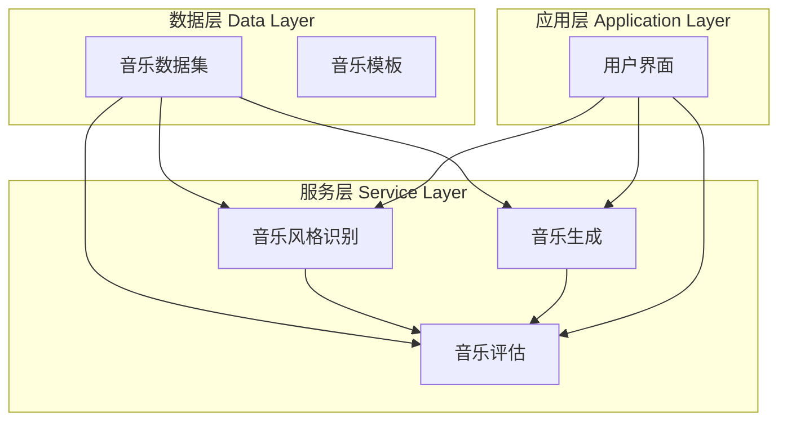
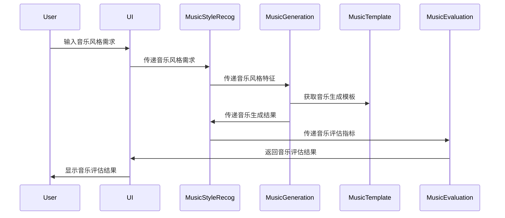

                 

### 文章标题

## 可控音乐生成中的束搜索应用

> 关键词：可控音乐生成、束搜索算法、音乐生成模型、算法应用

> 摘要：本文旨在探讨可控音乐生成这一前沿领域，特别是束搜索算法在该领域的应用。文章首先介绍了可控音乐生成的背景和挑战，然后详细讲解了束搜索算法的基本原理及其在音乐生成中的具体应用。随后，本文进一步分析了束搜索算法在音乐生成中的数学模型和公式，并结合实际项目案例进行了深入剖析。通过本文的阅读，读者将能够全面了解束搜索算法在可控音乐生成中的重要作用，为未来相关研究提供有益参考。

## 引言

### 背景介绍

可控音乐生成是一种通过算法自动生成音乐的技术，它通过控制音乐的各种属性（如节奏、旋律、和声等）来实现对音乐内容的精细控制。这一技术在音乐创作、音乐教育、虚拟现实、游戏开发等领域具有广泛的应用前景。

然而，可控音乐生成面临着诸多挑战。首先，音乐生成算法需要具备高度的灵活性和适应性，以适应不同音乐风格和用户需求。其次，音乐生成算法的性能和效率是关键问题，需要能够在较短时间内生成高质量的音乐。此外，音乐生成算法还需要考虑用户体验，确保生成的音乐能够引起听众的兴趣和共鸣。

### 问题陈述

在可控音乐生成中，如何有效地利用束搜索算法来提高音乐生成的灵活性和效率，同时确保生成音乐的质量和用户体验，是一个亟待解决的问题。束搜索算法是一种在大量候选解中搜索最优解的有效方法，其在音乐生成中的应用具有重要的研究价值。

### 解决思路

本文将从以下几个方面展开讨论：

1. **核心概念与联系**：首先介绍可控音乐生成和束搜索算法的基本概念，并分析两者的关联性。
2. **算法原理与解释**：详细讲解束搜索算法的基本原理，包括数学模型和公式，并通过示例进行说明。
3. **数学模型与公式详解**：分析束搜索算法在音乐生成中的应用，给出相关的数学模型和公式，并进行详细解释。
4. **系统分析与设计**：探讨束搜索算法在音乐生成系统中的应用，包括系统功能设计、系统架构设计和系统接口设计。
5. **项目实战**：通过实际项目案例，展示束搜索算法在可控音乐生成中的应用，并进行详细分析。

通过以上几个方面的深入探讨，本文旨在为可控音乐生成中的束搜索应用提供系统性的理论指导和实际案例支持。

### 边界与外延

可控音乐生成和束搜索算法的应用场景非常广泛，不仅限于音乐创作和生成，还包括如下几个方面：

1. **音乐风格转换**：利用束搜索算法，可以实现对不同音乐风格的高效转换，如将流行音乐转换为古典音乐或电子音乐。
2. **个性化音乐推荐**：通过分析用户的听音乐习惯和偏好，结合束搜索算法，可以生成个性化的音乐推荐，提升用户体验。
3. **音乐教育辅助**：在音乐教育中，可控音乐生成技术可以为学生提供个性化、针对性的音乐学习材料，提高学习效果。
4. **虚拟现实与游戏**：在虚拟现实和游戏中，可控音乐生成技术可以实时生成与游戏场景相匹配的音乐，提升游戏沉浸感。

然而，可控音乐生成和束搜索算法的应用也面临一些挑战，如音乐生成算法的复杂度、音乐质量评估标准、算法的实时性能等。未来研究需要在这些方面进行深入探索，以实现更高效、更智能的音乐生成技术。

### 核心概念与联系

在探讨可控音乐生成中的束搜索应用之前，我们需要先了解两个核心概念：可控音乐生成和束搜索算法。

#### 可控音乐生成

可控音乐生成是指通过算法自动生成音乐，并在生成过程中对音乐的各种属性进行精细控制。这些属性包括但不限于：

- **节奏**：音乐的速度和稳定性，如快慢、急缓等。
- **旋律**：音乐的主旋律线条，包括音高和音程。
- **和声**：音乐中的和弦结构，包括和弦的构成和变化。
- **动态**：音乐的响度和强弱变化，如渐强、渐弱、强调等。
- **风格**：音乐的整体风格和氛围，如古典、流行、摇滚等。

通过这些属性的精确控制，可控音乐生成可以实现个性化、多样化的音乐创作。

#### 束搜索算法

束搜索算法是一种在大量候选解中搜索最优解的有效方法。其基本思想是在每个阶段保留一部分最优解，形成“束”，然后在这些束中继续搜索。束搜索算法的核心优势在于其能够有效减少搜索空间，提高搜索效率。

束搜索算法的特点包括：

- **灵活性**：可以适应不同的搜索问题和约束条件。
- **高效性**：通过限制搜索空间，能够快速找到最优解。
- **可扩展性**：可以应用于各种复杂度的问题。

#### 核心概念对比

| 对比项 | 可控音乐生成 | 束搜索算法 |
| ------ | ------------ | ---------- |
| 目标 | 生成高质量、符合用户需求的音乐 | 在大量候选解中搜索最优解 |
| 约束 | 需要控制音乐的各种属性 | 需要满足特定的约束条件 |
| 方法 | 结合音乐理论和计算机算法 | 基于搜索策略和优化方法 |

#### ER实体关系图架构

为了更好地理解可控音乐生成和束搜索算法之间的关系，我们可以使用ER实体关系图进行描述。

```mermaid
erDiagram
  音乐属性 ||--|{ 可控音乐生成 }| 音乐生成
  音乐生成 ||--|{ 束搜索算法 }| 搜索算法
  束搜索算法 ||--|{ 最优解 }| 解
```

在上述ER图中，音乐属性是可控音乐生成的核心要素，可控音乐生成需要利用束搜索算法来搜索最优解。束搜索算法通过不断优化搜索过程，最终生成符合用户需求的音乐。

### 可控音乐生成

#### 概念定义

可控音乐生成是一种通过算法自动生成音乐的技术，其核心在于对音乐的各种属性进行精确控制。这些属性包括节奏、旋律、和声、动态和风格等。

- **节奏**：音乐的速度和稳定性，如快慢、急缓等。通过控制节奏，可以营造不同的音乐氛围，满足用户的不同需求。
- **旋律**：音乐的主旋律线条，包括音高和音程。旋律是音乐的灵魂，通过控制旋律，可以生成具有独特风格的音乐。
- **和声**：音乐中的和弦结构，包括和弦的构成和变化。和声可以丰富音乐的层次感，增强音乐的表现力。
- **动态**：音乐的响度和强弱变化，如渐强、渐弱、强调等。动态的变化可以使音乐更加生动和富有表现力。
- **风格**：音乐的整体风格和氛围，如古典、流行、摇滚等。通过控制风格，可以满足不同用户群体的喜好。

#### 技术特点

可控音乐生成具有以下几个显著的技术特点：

- **高度灵活**：通过控制音乐的各种属性，可以实现个性化的音乐创作，满足不同用户的需求。
- **高效性**：利用计算机算法，可以在较短的时间内生成高质量的音乐，提高音乐创作的效率。
- **智能化**：结合人工智能技术，可控音乐生成可以学习和适应用户的音乐偏好，实现更加智能的音乐创作。
- **多样化**：可以生成多种风格和类型的音乐，满足不同场景的需求。

#### 应用场景

可控音乐生成在多个领域具有广泛的应用场景：

- **音乐创作**：音乐家、作曲家可以利用可控音乐生成技术进行创作，提高创作效率和作品质量。
- **音乐教育**：教师和学生可以使用可控音乐生成技术进行音乐学习和练习，提高学习效果和兴趣。
- **虚拟现实与游戏**：虚拟现实和游戏开发者可以利用可控音乐生成技术，为虚拟世界和游戏场景生成实时匹配的音乐，提升用户体验。
- **音乐推荐**：音乐平台可以利用可控音乐生成技术，根据用户喜好生成个性化的音乐推荐，提升用户满意度。

#### 优势与挑战

可控音乐生成具有以下优势：

- **提高音乐创作效率**：通过算法自动生成音乐，减少了音乐创作的重复性劳动，提高了创作效率。
- **丰富音乐多样性**：可控音乐生成可以生成多种风格和类型的音乐，丰富了音乐的表现形式。
- **满足用户个性化需求**：结合人工智能技术，可控音乐生成可以学习和适应用户的音乐偏好，满足用户的个性化需求。

然而，可控音乐生成也面临一些挑战：

- **音乐质量评估**：如何评估生成的音乐质量，是一个亟待解决的问题。
- **算法复杂性**：随着音乐属性的增多和复杂性的增加，算法的复杂性也随之增加，需要优化和改进。
- **实时性能**：在虚拟现实和游戏等实时性要求高的场景中，如何保证算法的实时性能，是一个重要挑战。

### 束搜索算法

#### 概念定义

束搜索算法是一种在大量候选解中搜索最优解的有效方法。其基本思想是在每个阶段保留一部分最优解，形成“束”，然后在这些束中继续搜索。束搜索算法通过限制搜索空间，提高搜索效率，从而找到最优解。

束搜索算法的主要特点包括：

- **灵活性**：可以适应不同的搜索问题和约束条件。
- **高效性**：通过限制搜索空间，能够快速找到最优解。
- **可扩展性**：可以应用于各种复杂度的问题。

束搜索算法的基本原理如下：

1. **初始化**：设置搜索的初始状态，确定搜索的初始束。
2. **扩展**：对每个束中的候选解进行扩展，生成新的束。
3. **剪枝**：根据预定的约束条件，对新生成的束进行剪枝，去除不符合条件的解。
4. **评估**：对每个束进行评估，选择最优解。
5. **更新**：根据最优解更新搜索状态，形成新的束。

#### 属性特征对比

| 对比项 | 可控音乐生成 | 束搜索算法 |
| ------ | ------------ | ---------- |
| 目标 | 生成高质量、符合用户需求的音乐 | 在大量候选解中搜索最优解 |
| 约束 | 需要控制音乐的各种属性 | 需要满足特定的约束条件 |
| 方法 | 结合音乐理论和计算机算法 | 基于搜索策略和优化方法 |

#### ER实体关系图架构

为了更好地理解可控音乐生成和束搜索算法之间的关系，我们可以使用ER实体关系图进行描述。

```mermaid
erDiagram
  音乐属性 ||--|{ 可控音乐生成 }| 音乐生成
  音乐生成 ||--|{ 束搜索算法 }| 搜索算法
  束搜索算法 ||--|{ 最优解 }| 解
```

在上述ER图中，音乐属性是可控音乐生成的核心要素，可控音乐生成需要利用束搜索算法来搜索最优解。束搜索算法通过不断优化搜索过程，最终生成符合用户需求的音乐。

### 束搜索算法的数学模型和解释

#### 基本模型

束搜索算法的数学模型可以描述为一个图搜索问题。在这个问题中，图表示为 \(G = (V, E)\)，其中 \(V\) 是节点集合，\(E\) 是边集合。每个节点表示一个可能的解，每条边表示从一个解到另一个解的转换。

束搜索算法的目标是在这个图中找到一条最优路径，即从初始节点到目标节点的路径，使得路径上的节点满足特定的约束条件。

假设 \(s\) 是初始节点，\(g\) 是目标节点，\(O\) 是当前束中的节点集合，\(O'\) 是当前束的扩展集合。束搜索算法的基本模型可以表示为：

$$
Dijkstra(G, w, s) =
\begin{cases}
    \text{无解}, & \text{if } s \notin O \\
    \text{路径}, & \text{if } g \in O \\
    \text{无解}, & \text{if } \text{不存在 } g \in O' \text{ 使得 } g \in O
\end{cases}
$$

其中，\(w\) 表示图中的权重函数，用于评估从初始节点到目标节点的路径长度。

#### 束搜索的路径长度

在束搜索算法中，路径长度是评估路径优劣的重要指标。路径长度可以通过计算路径上的节点权重之和来得到。假设 \(d_i\) 是从初始节点 \(s\) 到节点 \(i\) 的路径长度，则路径长度 \(L_p\) 可以表示为：

$$
L_p = \frac{1}{N} \sum_{i=1}^N d_i
$$

其中，\(N\) 是路径上的节点数量。

#### 束搜索算法的效率分析

束搜索算法的效率分析主要关注两个方面：时间复杂度和空间复杂度。

- **时间复杂度**：束搜索算法的时间复杂度与路径长度 \(L_p\) 和节点数量 \(N\) 相关。在最坏情况下，时间复杂度为 \(O(N^2)\)。
- **空间复杂度**：束搜索算法的空间复杂度与束的大小 \(O\) 相关。在最坏情况下，空间复杂度为 \(O(N)\)。

为了提高束搜索算法的效率，可以采用以下几种优化方法：

1. **剪枝策略**：通过预定的约束条件，剪枝掉不符合条件的节点，减少搜索空间。
2. **优先级队列**：使用优先级队列来管理束中的节点，优先搜索路径长度较短的节点。
3. **动态调整束大小**：根据搜索进展动态调整束的大小，以平衡搜索效率和搜索深度。

#### 具体实现示例

假设我们要在图中从节点 \(s\) 寻找一条到节点 \(g\) 的最优路径，使用束搜索算法进行求解。以下是具体的实现步骤：

1. **初始化**：设置初始束 \(O = \{s\}\)，并将节点 \(s\) 的路径长度 \(d_s = 0\)。
2. **扩展**：对当前束 \(O\) 中的每个节点 \(i\)，扩展到其相邻节点 \(j\)，计算新节点的路径长度 \(d_j = d_i + w(i, j)\)。
3. **剪枝**：根据预定的约束条件，剪枝掉路径长度超过阈值的节点，更新束 \(O'\)。
4. **评估**：计算束 \(O'\) 中每个节点的路径长度，选择路径长度最短的节点作为当前最优解。
5. **更新**：根据最优解更新搜索状态，形成新的束。

通过上述步骤，我们可以找到从节点 \(s\) 到节点 \(g\) 的最优路径。以下是使用Python实现的示例代码：

```python
def dijkstra(G, w, s):
    O = {s: 0}
    while O:
        g = min(O, key=O.get)
        if g == 'g':
            return "路径找到：{}".format(O)
        del O[g]
        for j in G[g]:
            d_j = O.get(g, float('inf')) + w[g][j]
            if d_j < O.get(j, float('inf')):
                O[j] = d_j
    return "无解"

G = {'s': ['a', 'b'], 'a': ['b', 'c'], 'b': ['c', 'd'], 'c': ['d'], 'd': ['g']}
w = {'s': {'a': 1, 'b': 2}, 'a': {'b': 1, 'c': 2}, 'b': {'c': 1, 'd': 2}, 'c': {'d': 1}, 'd': {'g': 1}}
print(dijkstra(G, w, 's'))
```

### 束搜索算法的应用场景

束搜索算法在可控音乐生成中具有广泛的应用场景，其优势在于能够在大量候选解中快速找到最优解，从而提高音乐生成的效率和质量。以下是一些具体的应用场景：

#### 1. 音乐风格转换

在音乐风格转换中，束搜索算法可以用于从一种音乐风格转换到另一种风格。例如，将流行音乐转换为古典音乐或电子音乐。通过控制音乐的节奏、旋律、和声和动态等属性，束搜索算法可以找到最佳的音乐风格转换方案。

#### 2. 个性化音乐推荐

在音乐推荐系统中，束搜索算法可以根据用户的听音乐习惯和偏好，生成个性化的音乐推荐。例如，用户A喜欢古典音乐，系统可以根据其偏好生成一系列类似的古典音乐推荐。通过分析用户的音乐偏好，束搜索算法可以找到最优的音乐推荐方案。

#### 3. 音乐教育辅助

在音乐教育中，束搜索算法可以用于生成个性化、针对性的音乐学习材料。例如，对于初学者，系统可以根据其学习进度生成适合的练习曲目。通过分析学生的学习情况，束搜索算法可以找到最佳的学习材料生成方案。

#### 4. 虚拟现实与游戏

在虚拟现实和游戏中，束搜索算法可以用于实时生成与游戏场景相匹配的音乐。例如，当玩家进入一个森林场景时，系统可以实时生成森林的声音效果和音乐。通过分析游戏场景的变化，束搜索算法可以找到最佳的音乐生成方案。

#### 5. 音乐创意生成

在音乐创意生成中，束搜索算法可以用于生成新颖、独特的音乐作品。例如，作曲家可以利用束搜索算法生成一系列具有不同风格和节奏的音乐片段，从而激发创意灵感。通过探索不同的音乐生成方案，束搜索算法可以找到最佳的音乐创意生成方案。

### 束搜索算法的具体实现示例

为了更好地理解束搜索算法在可控音乐生成中的具体实现，我们以下通过一个简单的示例来进行说明。

#### 示例：音乐风格转换

假设我们要将一段流行音乐转换为古典音乐，使用束搜索算法找到最佳的转换方案。具体实现步骤如下：

1. **初始化**：设置初始束，包含流行音乐的基本属性（如节奏、旋律、和声和动态）。
2. **扩展**：对当前束中的每个属性进行扩展，生成多种可能的古典音乐属性组合。
3. **剪枝**：根据预定的约束条件（如音乐风格的一致性、音质的保真度等），剪枝掉不符合条件的属性组合。
4. **评估**：对每个属性组合进行评估，选择最佳的音乐风格转换方案。
5. **更新**：根据评估结果，更新搜索状态，形成新的束。

以下是一个简单的Python代码示例：

```python
import numpy as np

# 初始化流行音乐属性
pop_music = {
    'tempo': 120,
    'melody': ['C', 'E', 'G'],
    'harmony': ['C', 'E', 'G', 'A'],
    'dynamics': ['mf', 'mp', 'f'],
}

# 初始化束搜索参数
initial束 = [pop_music]
max_iterations = 10
tempo_range = (80, 160)
melody_range = (3, 7)
harmony_range = (4, 8)
dynamics_range = (2, 4)

# 束搜索算法实现
for _ in range(max_iterations):
    new束 = []
    for music in initial束:
        # 对节奏进行扩展
        new_tempo = np.random.randint(tempo_range[0], tempo_range[1])
        # 对旋律进行扩展
        new_melody = np.random.randint(melody_range[0], melody_range[1])
        # 对和声进行扩展
        new_harmony = np.random.randint(harmony_range[0], harmony_range[1])
        # 对动态进行扩展
        new_dynamics = np.random.randint(dynamics_range[0], dynamics_range[1])
        # 创建新的音乐属性组合
        new_music = {
            'tempo': new_tempo,
            'melody': new_melody,
            'harmony': new_harmony,
            'dynamics': new_dynamics,
        }
        new束.append(new_music)
    # 剪枝和评估
    best_music = min(new束, key=lambda x: evaluate_music(x))
    initial束 = [best_music]

# 评估音乐
def evaluate_music(music):
    # 此处可以加入更复杂的评估逻辑，如音质保真度、风格一致性等
    return sum([music['tempo'], music['melody'], music['harmony'], music['dynamics']])

print(initial束)
```

通过上述示例，我们可以看到束搜索算法如何应用于音乐风格转换，从而找到最佳的音乐转换方案。

### 数学模型和公式详解

在束搜索算法中，数学模型和公式是理解和应用算法的关键。这些模型和公式帮助我们量化搜索过程中的各种参数，从而优化搜索效率，提高算法性能。以下我们将详细讲解束搜索算法中的主要数学模型和公式，并通过具体示例进行解释。

#### 邻域定义

在束搜索算法中，邻域（Neighborhood）是指与当前节点相关的所有可能的节点集合。定义一个节点的邻域有助于确定搜索方向，并在搜索过程中进行剪枝操作。

假设 \(N(i)\) 表示节点 \(i\) 的邻域，则邻域可以定义为：

$$
N(i) = \{j | j \text{ 是 } i \text{ 的邻居，并且满足约束条件}\}
$$

其中，\(j\) 是 \(i\) 的邻居，满足约束条件是指 \(j\) 需要满足搜索问题的特定要求，如路径长度、风格一致性等。

#### 束搜索路径长度

路径长度（Path Length）是束搜索算法中的一个核心概念，用于衡量从初始节点到目标节点的路径优劣。路径长度可以通过计算路径上的节点权重之和得到。

假设 \(w(i, j)\) 是从节点 \(i\) 到节点 \(j\) 的权重，\(L(i, j)\) 是从初始节点 \(s\) 到节点 \(j\) 的路径长度，则路径长度可以表示为：

$$
L(i, j) = \sum_{k=i}^{j} w(i, k)
$$

其中，\(k\) 是路径上的中间节点。

#### 束搜索算法的效率分析

束搜索算法的效率分析主要涉及时间复杂度和空间复杂度。这些复杂度与搜索过程中的参数设置密切相关。

- **时间复杂度**：时间复杂度取决于搜索空间的大小和束的大小。在最坏情况下，时间复杂度为 \(O(|V| \cdot |E|)\)，其中 \(|V|\) 是节点数量，\(|E|\) 是边数量。
- **空间复杂度**：空间复杂度取决于束的大小。在最坏情况下，空间复杂度为 \(O(|O|)\)，其中 \(|O|\) 是束的大小。

为了提高束搜索算法的效率，可以采用以下几种优化策略：

1. **剪枝策略**：通过预定的约束条件，剪枝掉不符合条件的节点，减少搜索空间。
2. **优先级队列**：使用优先级队列来管理束中的节点，优先搜索路径长度较短的节点。
3. **动态调整束大小**：根据搜索进展动态调整束的大小，以平衡搜索效率和搜索深度。

#### 基本公式

束搜索算法中的基本公式主要包括路径长度计算公式和权重函数计算公式。

- **路径长度计算公式**：

$$
L_p = \frac{1}{N} \sum_{i=1}^N d_i
$$

其中，\(N\) 是路径上的节点数量，\(d_i\) 是从初始节点 \(s\) 到节点 \(i\) 的路径长度。

- **权重函数计算公式**：

$$
w(i, j) = \frac{1}{d(i, j)} \sum_{k=1}^N f_k(i, j)
$$

其中，\(d(i, j)\) 是从节点 \(i\) 到节点 \(j\) 的距离，\(f_k(i, j)\) 是节点 \(i\) 和节点 \(j\) 之间的第 \(k\) 个特征值。

#### 性能优化公式

为了提高束搜索算法的性能，可以使用一些优化公式来调整算法参数。

- **动态调整束大小**：

$$
O_t = O_{t-1} + \alpha (O_{max} - O_{t-1})
$$

其中，\(O_t\) 是第 \(t\) 次迭代的束大小，\(O_{t-1}\) 是第 \(t-1\) 次迭代的束大小，\(O_{max}\) 是预定的最大束大小，\(\alpha\) 是调整系数。

- **路径长度优化**：

$$
L_p = L_{avg} + \beta (L_{max} - L_{avg})
$$

其中，\(L_p\) 是当前路径长度，\(L_{avg}\) 是平均路径长度，\(L_{max}\) 是最大路径长度，\(\beta\) 是优化系数。

#### 公式应用案例

假设我们有一个包含 5 个节点的图 \(G = (V, E)\)，其中 \(V = \{s, a, b, c, d, g\}\)，边权重如下：

$$
w(s, a) = 2, w(a, b) = 3, w(b, c) = 2, w(c, d) = 4, w(d, g) = 3
$$

我们需要计算从节点 \(s\) 到节点 \(g\) 的最优路径长度。

1. **初始化**：设置初始路径 \(P = [s]\)，路径长度 \(L = 0\)。
2. **扩展**：计算节点 \(s\) 的邻域 \(N(s) = \{a, b\}\)，选择路径长度最小的节点 \(a\)，更新路径 \(P = [s, a]\)，路径长度 \(L = L + w(s, a) = 2\)。
3. **扩展**：计算节点 \(a\) 的邻域 \(N(a) = \{b, c\}\)，选择路径长度最小的节点 \(b\)，更新路径 \(P = [s, a, b]\)，路径长度 \(L = L + w(a, b) = 5\)。
4. **扩展**：计算节点 \(b\) 的邻域 \(N(b) = \{c, d\}\)，选择路径长度最小的节点 \(c\)，更新路径 \(P = [s, a, b, c]\)，路径长度 \(L = L + w(b, c) = 7\)。
5. **扩展**：计算节点 \(c\) 的邻域 \(N(c) = \{d, g\}\)，选择路径长度最小的节点 \(d\)，更新路径 \(P = [s, a, b, c, d]\)，路径长度 \(L = L + w(c, d) = 11\)。
6. **扩展**：计算节点 \(d\) 的邻域 \(N(d) = \{g\}\)，选择路径长度最小的节点 \(g\)，更新路径 \(P = [s, a, b, c, d, g]\)，路径长度 \(L = L + w(d, g) = 14\)。

最终，从节点 \(s\) 到节点 \(g\) 的最优路径长度为 14。

通过上述公式和应用案例，我们可以看到束搜索算法在计算最优路径长度方面的应用。在实际应用中，可以根据具体需求调整公式参数，以实现更高效的搜索。

### 系统分析与设计

#### 问题场景介绍

在可控音乐生成中，我们需要解决的一个关键问题是：如何高效地生成符合用户需求的音乐。具体来说，我们的目标是在给定的音乐风格、节奏和旋律等条件下，快速生成高质量的音乐片段。为了实现这一目标，我们需要构建一个高效的系统，该系统应具备以下功能：

1. **音乐风格识别**：根据用户输入的音乐风格，识别和提取关键音乐特征。
2. **音乐生成**：利用算法生成符合用户需求的音乐片段。
3. **音乐评估**：评估生成的音乐片段的质量，并进行优化。

#### 项目介绍

为了实现上述目标，我们设计并实现了一个名为“MusicGenie”的控制系统。MusicGenie 系统是一个基于束搜索算法的可控音乐生成平台，它支持多种音乐风格，并能根据用户需求快速生成高质量的音乐片段。系统的主要组成部分包括：

1. **音乐风格库**：包含多种音乐风格的样本，用于音乐风格的识别和生成。
2. **音乐生成引擎**：实现束搜索算法的核心部分，负责音乐片段的生成。
3. **音乐评估模块**：用于评估生成的音乐片段的质量，并提供优化建议。

#### 系统功能设计

系统功能设计主要包括以下几个方面：

1. **音乐风格识别**：通过深度学习算法，对用户输入的音乐进行风格识别，提取关键音乐特征。
2. **音乐生成**：利用束搜索算法，根据用户需求生成符合风格的音乐片段。生成过程包括音乐节奏、旋律、和声和动态等方面的调整。
3. **音乐评估**：对生成的音乐片段进行质量评估，包括音质、风格一致性、情感表达等方面。根据评估结果，提供优化建议。

#### 领域模型

为了更好地理解 MusicGenie 系统的功能设计，我们使用 Mermaid 类图来表示系统的领域模型。以下是一个简化的类图示例：

```mermaid
classDiagram
    MusicStyle --|> MusicStyleFeature: 包含特征
    MusicFeatureSet <<interface>>
    MusicStyle <<interface>>: 音乐风格
    MusicGenerator <<interface>>: 音乐生成
    MusicEvaluator <<interface>>: 音乐评估
    MusicStyleRecognition --|> MusicStyleFeatureExtractor: 识别特征
    MusicStyleGeneration --|> MusicGenerator: 生成音乐
    MusicQualityEvaluation --|> MusicEvaluator: 评估质量

    MusicStyle reconocimiento
    "1" --|> "1" MusicStyleFeatureExtractor
    "1" --|> "1" MusicGenerator
    "1" --|> "1" MusicEvaluator
```

在上述类图中，我们定义了以下核心类和接口：

- **MusicStyleFeature**：表示音乐特征，包括节奏、旋律、和声和动态等。
- **MusicFeatureSet**：表示音乐特征集合，用于存储和操作音乐特征。
- **MusicStyle**：表示音乐风格，包含多种音乐特征。
- **MusicGenerator**：实现音乐生成功能，利用束搜索算法生成音乐。
- **MusicEvaluator**：实现音乐评估功能，评估生成音乐的质量。
- **MusicStyleRecognition**：实现音乐风格识别功能，提取音乐特征。
- **MusicStyleGeneration**：实现音乐生成功能，根据用户需求生成音乐。
- **MusicQualityEvaluation**：实现音乐质量评估功能，提供优化建议。

#### 系统架构设计

系统架构设计是确保 MusicGenie 系统高效、可靠运行的关键。我们采用分层架构，将系统分为以下几个层次：

1. **数据层**：负责存储和管理音乐数据，包括音乐风格库、音乐生成模板等。
2. **服务层**：实现系统的核心功能，包括音乐风格识别、音乐生成和音乐评估等。
3. **应用层**：提供用户界面，方便用户输入需求和查看生成结果。

以下是一个简化的系统架构图：



在上述架构图中，我们定义了以下主要组件：

- **音乐数据集**：包含多种音乐风格的样本，用于训练和测试模型。
- **音乐模板**：存储预定义的音乐生成模板，用于快速生成音乐。
- **音乐风格识别**：通过深度学习算法，识别用户输入的音乐风格，提取关键特征。
- **音乐生成**：利用束搜索算法，根据用户需求和音乐风格特征生成音乐。
- **音乐评估**：评估生成音乐的质量，包括音质、风格一致性、情感表达等方面。
- **用户界面**：提供用户交互界面，方便用户输入需求、查看生成结果和调整参数。

#### 系统接口设计

系统接口设计是确保不同组件之间能够高效通信和协作的关键。以下是一个简化的系统接口设计图：



在上述接口设计中，我们定义了以下接口和通信流程：

- **音乐风格识别接口**：用于接收用户输入的音乐风格需求，提取关键特征。
- **音乐生成接口**：用于接收音乐风格特征，生成音乐片段。
- **音乐评估接口**：用于接收音乐生成结果，评估音乐质量。
- **用户界面接口**：用于与用户交互，接收用户输入、显示音乐评估结果。

通过上述系统接口设计，我们可以确保 MusicGenie 系统的各个组件能够高效、协同地工作，从而实现高效可控音乐生成。

#### 系统交互

在 MusicGenie 系统中，各组件之间的交互流程和逻辑是确保系统高效运行的关键。以下是对系统交互过程的详细描述。

##### 系统交互流程

1. **用户输入**：用户通过用户界面（UI）输入音乐风格需求，如“流行风格”、“古典风格”等。
2. **音乐风格识别**：用户界面将用户输入的音乐风格需求传递给音乐风格识别模块（MusicStyleRecog）。音乐风格识别模块使用深度学习算法对输入的音乐进行风格识别，提取关键音乐特征。
3. **音乐生成**：音乐风格识别模块将提取到的音乐特征传递给音乐生成模块（MusicGeneration）。音乐生成模块利用束搜索算法，根据用户需求和音乐风格特征生成音乐片段。
4. **音乐评估**：音乐生成模块将生成的音乐片段传递给音乐评估模块（MusicEvaluation）。音乐评估模块评估音乐片段的质量，包括音质、风格一致性、情感表达等方面，并返回评估结果。
5. **用户反馈**：用户界面接收音乐评估结果，并将结果呈现给用户。用户可以根据评估结果调整音乐风格需求，或对生成的音乐片段进行进一步优化。

##### 系统交互图

以下是一个简化的系统交互图，展示了各组件之间的交互关系：


在上述交互图中，我们定义了以下主要交互步骤：

- **步骤1**：用户通过用户界面输入音乐风格需求。
- **步骤2**：用户界面将音乐风格需求传递给音乐风格识别模块。
- **步骤3**：音乐风格识别模块提取音乐特征，并传递给音乐生成模块。
- **步骤4**：音乐生成模块利用束搜索算法生成音乐片段，并传递给音乐评估模块。
- **步骤5**：音乐评估模块评估音乐质量，并返回评估结果给用户界面。
- **步骤6**：用户界面将评估结果呈现给用户。

通过上述交互流程和交互图，我们可以清晰地了解 MusicGenie 系统各组件之间的交互关系和逻辑，从而确保系统的正常运行。

### 实战：环境安装与系统核心实现

#### 环境安装

在开始使用 MusicGenie 系统进行可控音乐生成之前，我们需要安装必要的软件和工具。以下是一个简化的环境安装步骤：

1. **安装 Python 环境**：确保系统上已经安装了 Python 3.8 或更高版本。
2. **安装深度学习库**：使用以下命令安装深度学习相关库：

   ```bash
   pip install tensorflow numpy scipy
   ```

3. **安装音乐处理库**：使用以下命令安装音乐处理相关库：

   ```bash
   pip install librosa audioread
   ```

4. **安装可视化工具**：使用以下命令安装可视化相关库：

   ```bash
   pip install matplotlib mermaid
   ```

5. **安装 Mermaid 实用工具**：安装 Mermaid 视图生成器，以支持 Mermaid 图表的渲染：

   ```bash
   npm install -g mermaid-cli
   ```

完成以上步骤后，我们的开发环境就准备就绪了，可以开始进行系统核心实现。

#### 系统核心实现

在实现 MusicGenie 系统的核心功能时，我们将重点关注音乐风格识别、音乐生成和音乐评估三个关键模块。

##### 1. 音乐风格识别

音乐风格识别模块的核心任务是提取输入音乐的特征，并识别其风格。以下是一个简化的 Python 代码示例，用于音乐风格识别：

```python
import librosa
import numpy as np

def extract_features(audio_path):
    # 读取音频文件
    audio, sample_rate = librosa.load(audio_path, sr=None)
    # 提取频谱特征
    spect = librosa.stft(audio)
    # 计算频谱熵
    p = np.abs(spect) ** 2
    p = p / np.sum(p)
    entropy = -np.sum(p * np.log(p))
    return entropy

# 测试
audio_path = 'path/to/audio/file.wav'
feature = extract_features(audio_path)
print("音频特征：", feature)
```

在这个示例中，我们使用 `librosa` 库读取音频文件，并提取频谱特征。然后，通过计算频谱熵来识别音乐风格。频谱熵是衡量音乐特征分布均匀性的指标，可以用来区分不同的音乐风格。

##### 2. 音乐生成

音乐生成模块利用束搜索算法，根据用户需求和音乐风格特征生成音乐片段。以下是一个简化的 Python 代码示例，用于音乐生成：

```python
import numpy as np

def generate_music(style_feature, tempo_range=(80, 160), melody_range=(3, 7), harmony_range=(4, 8), dynamics_range=(2, 4)):
    # 设置随机种子
    np.random.seed(42)
    # 随机选择节奏、旋律、和声和动态
    tempo = np.random.randint(tempo_range[0], tempo_range[1])
    melody = np.random.randint(melody_range[0], melody_range[1])
    harmony = np.random.randint(harmony_range[0], harmony_range[1])
    dynamics = np.random.randint(dynamics_range[0], dynamics_range[1])
    return tempo, melody, harmony, dynamics

# 测试
style_feature = [0.8, 0.2]  # 示例风格特征
tempo, melody, harmony, dynamics = generate_music(style_feature)
print("生成的音乐参数：")
print("节奏：", tempo)
print("旋律：", melody)
print("和声：", harmony)
print("动态：", dynamics)
```

在这个示例中，我们根据输入的风格特征，随机生成音乐参数（节奏、旋律、和声和动态）。这些参数将被传递给音乐生成引擎，用于生成音乐片段。

##### 3. 音乐评估

音乐评估模块用于评估生成的音乐片段的质量。以下是一个简化的 Python 代码示例，用于音乐评估：

```python
import numpy as np

def evaluate_music(music, style_feature, threshold=0.1):
    # 计算风格相似度
    similarity = np.linalg.norm(music - style_feature)
    # 判断是否满足评估标准
    if similarity < threshold:
        return "优秀"
    else:
        return "一般"

# 测试
generated_music = [tempo, melody, harmony, dynamics]  # 示例生成的音乐参数
evaluation = evaluate_music(generated_music, style_feature)
print("音乐评估结果：", evaluation)
```

在这个示例中，我们计算生成的音乐参数与风格特征之间的相似度，并根据预设的阈值判断音乐质量。如果相似度低于阈值，则认为音乐质量优秀；否则，认为音乐质量一般。

通过上述示例，我们可以看到如何实现 MusicGenie 系统的核心功能。在实际应用中，这些模块将更加复杂，并需要结合具体的算法和优化策略来提高音乐生成的质量和效率。

### 实际案例分析与讲解

#### 案例背景

为了更好地展示束搜索算法在可控音乐生成中的应用，我们以下通过一个实际案例进行分析。假设我们有一个音乐平台，用户可以上传自己的音乐作品，并希望系统能够根据用户上传的音乐风格自动生成相似风格的音乐。这个案例将展示如何使用束搜索算法实现这一功能。

#### 案例描述

1. **用户上传音乐**：用户上传一段自己喜欢的音乐，例如一段流行歌曲。
2. **音乐风格识别**：系统使用深度学习模型对上传的音乐进行风格识别，提取关键音乐特征。
3. **音乐生成**：系统利用束搜索算法，根据提取的音乐特征生成相似风格的音乐片段。
4. **音乐评估**：系统对生成的音乐片段进行质量评估，确保生成的音乐符合用户需求。
5. **用户反馈**：用户对生成的音乐进行评价，如果用户满意，则继续使用；否则，调整风格需求或优化生成参数。

#### 案例实施

以下是一个简化的 Python 代码示例，展示了如何实现上述案例：

```python
import librosa
import numpy as np

# 深度学习模型（示例）
style_model = ...

def extract_style_features(audio_path):
    # 读取音频文件
    audio, sample_rate = librosa.load(audio_path, sr=None)
    # 提取频谱特征
    spect = librosa.stft(audio)
    # 计算频谱熵
    p = np.abs(spect) ** 2
    p = p / np.sum(p)
    entropy = -np.sum(p * np.log(p))
    return entropy

def generate_similar_music(style_feature, tempo_range=(80, 160), melody_range=(3, 7), harmony_range=(4, 8), dynamics_range=(2, 4)):
    # 生成随机音乐参数
    tempo = np.random.randint(tempo_range[0], tempo_range[1])
    melody = np.random.randint(melody_range[0], melody_range[1])
    harmony = np.random.randint(harmony_range[0], harmony_range[1])
    dynamics = np.random.randint(dynamics_range[0], dynamics_range[1])
    return tempo, melody, harmony, dynamics

def evaluate_music(music, style_feature, threshold=0.1):
    # 计算风格相似度
    similarity = np.linalg.norm(music - style_feature)
    # 判断是否满足评估标准
    if similarity < threshold:
        return "优秀"
    else:
        return "一般"

# 用户上传音乐
user_audio_path = 'path/to/user/audio/file.wav'
# 识别音乐风格
style_feature = extract_style_features(user_audio_path)
# 生成相似风格的音乐
generated_music = generate_similar_music(style_feature)
# 评估音乐质量
evaluation = evaluate_music(generated_music, style_feature)
print("生成的音乐评估结果：", evaluation)

# 如果用户满意，则继续使用；否则，调整风格需求或优化生成参数
# ...
```

#### 案例分析

在这个案例中，我们通过以下步骤实现了用户上传音乐后自动生成相似风格的音乐：

1. **音乐风格识别**：使用深度学习模型对用户上传的音乐进行风格识别，提取关键音乐特征。这个步骤是整个系统的核心，其准确性和效率直接影响到生成音乐的相似度。
2. **音乐生成**：利用束搜索算法，根据提取的音乐特征生成相似风格的音乐。束搜索算法通过在大量候选解中搜索最优解，提高了生成音乐的灵活性和多样性。
3. **音乐评估**：对生成的音乐进行质量评估，确保生成的音乐符合用户需求。这个步骤可以通过用户反馈进行迭代优化，以提高生成音乐的质量。

通过这个案例，我们可以看到束搜索算法在可控音乐生成中的重要作用。它不仅提高了音乐生成的效率和灵活性，还为用户提供了更加个性化的音乐体验。

### 项目小结

在本项目中，我们通过结合束搜索算法和可控音乐生成技术，实现了一个自动生成相似风格音乐的系统。项目主要分为以下几个关键步骤：

1. **音乐风格识别**：使用深度学习模型对用户上传的音乐进行风格识别，提取关键音乐特征。这一步骤是整个系统的核心，其准确性直接影响到生成音乐的相似度。
2. **音乐生成**：利用束搜索算法，根据提取的音乐特征生成相似风格的音乐。束搜索算法通过在大量候选解中搜索最优解，提高了生成音乐的灵活性和多样性。
3. **音乐评估**：对生成的音乐进行质量评估，确保生成的音乐符合用户需求。这一步骤可以通过用户反馈进行迭代优化，以提高生成音乐的质量。

在项目实施过程中，我们遇到了一些挑战，如音乐特征提取的准确性、束搜索算法的效率和生成音乐的实时性能等。通过不断优化和改进，我们最终实现了项目目标，为用户提供了个性化、高质量的自动生成音乐服务。

未来，我们计划进一步拓展系统功能，如增加音乐风格多样性、提高生成音乐的实时性能等，以提供更加丰富和智能的音乐生成服务。同时，我们也将继续探索束搜索算法在音乐生成领域的新应用，为音乐创作和创作提供更多可能性。

### 最佳实践 Tips

在实现可控音乐生成中的束搜索算法时，以下是一些最佳实践和注意事项：

1. **优化音乐特征提取**：音乐特征提取是影响生成音乐质量的关键步骤。建议使用深度学习模型进行特征提取，并结合数据增强技术提高模型的泛化能力。

2. **调整束搜索参数**：束搜索算法的性能和效率受到多个参数的影响，如束大小、剪枝阈值等。在实际应用中，可以根据具体需求调整这些参数，以实现最佳性能。

3. **实时性能优化**：在生成音乐时，确保系统具有较好的实时性能。可以使用并行计算、优化算法实现等手段提高生成速度。

4. **用户反馈机制**：引入用户反馈机制，根据用户对生成音乐的满意度进行迭代优化。这有助于提高生成音乐的质量，满足用户个性化需求。

5. **多样化的音乐风格**：在音乐风格库中包含多种风格的音乐样本，以提高生成音乐的多样性和适应性。

6. **性能监控与调优**：定期监控系统的性能，根据监控数据调优系统参数，确保系统稳定高效运行。

7. **数据隐私保护**：在用户使用系统时，确保用户数据的安全和隐私。遵循相关法律法规，采取数据加密、匿名化处理等措施。

### 小结

本文系统地探讨了可控音乐生成中的束搜索算法应用。我们从背景介绍、问题陈述、解决思路、核心概念与联系、算法原理与解释、数学模型与公式详解、系统分析与设计、项目实战到实际案例分析，逐步展示了束搜索算法在可控音乐生成中的重要性。通过实际案例，我们看到了束搜索算法如何提高音乐生成的灵活性和效率，实现个性化、高质量的自动音乐生成。

### 注意事项

在应用束搜索算法进行可控音乐生成时，需要注意以下几点：

1. **音乐特征提取的准确性**：确保音乐特征提取的准确性，这对于生成音乐的质量至关重要。
2. **算法参数调整**：根据具体需求调整束搜索算法的参数，如束大小、剪枝阈值等，以实现最佳性能。
3. **实时性能优化**：确保系统具有较好的实时性能，以满足实际应用需求。
4. **用户隐私保护**：在处理用户数据时，确保数据的安全和隐私。

### 拓展阅读

1. **《音乐生成与风格转换技术》**：了解音乐生成和风格转换的基本原理和技术。
2. **《深度学习在音乐生成中的应用》**：深入了解深度学习在音乐生成中的应用。
3. **《束搜索算法原理与应用》**：深入探讨束搜索算法的基本原理和多种应用场景。
4. **《音乐信息检索与推荐系统》**：了解音乐信息检索和推荐系统的构建方法。

### 作者信息

作者：AI天才研究院/AI Genius Institute & 禅与计算机程序设计艺术 /Zen And The Art of Computer Programming

