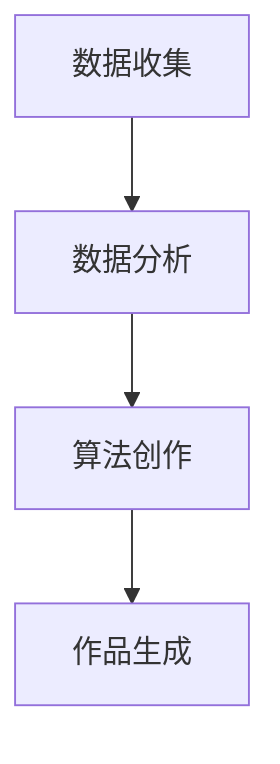
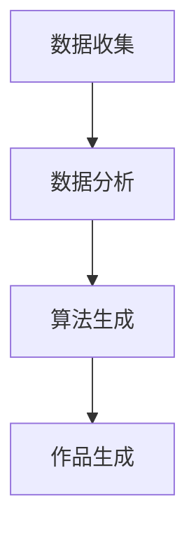
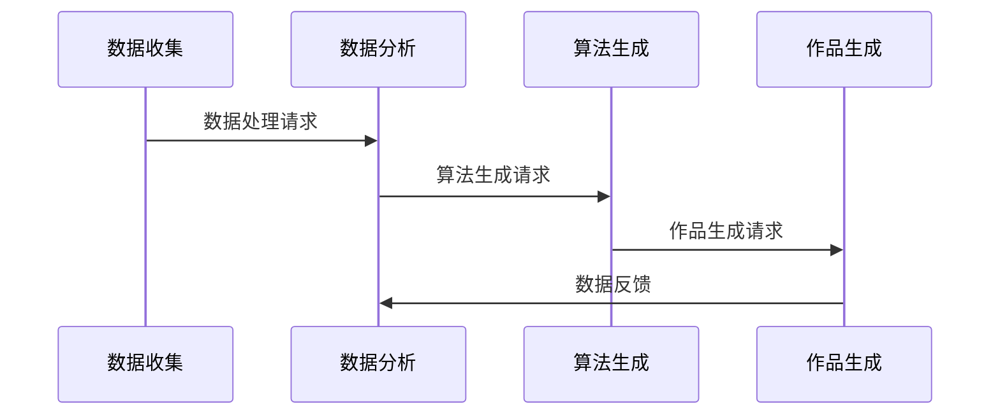

                 

# 后人类主义艺术展：超越人类中心的创作

## 关键词
- 后人类主义艺术
- 超越人类中心
- 创作方法
- 算法原理
- 数学模型
- 系统架构
- 项目实战
- 最佳实践

## 摘要
本文将探讨后人类主义艺术的概念及其在艺术创作中的应用。首先，我们将介绍后人类主义艺术的基本背景和核心概念，然后分析其与人类中心主义的区别，并详细阐述后人类主义艺术的算法原理和数学模型。接下来，我们将通过系统分析与架构设计方案，描述后人类主义艺术系统的构建过程。随后，我们将分享一个具体的项目实战案例，最后，总结全文并给出一些拓展阅读的建议。

## 第一部分：引言与背景

### 第1章：后人类主义艺术展概述

#### 1.1 问题背景

后人类主义（Posthumanism）是一个哲学和社会理论概念，它探讨了在技术进步尤其是人工智能和生物工程的影响下，人类可能面临的未来变化。在这个背景下，后人类主义艺术作为一种表达方式，开始引起广泛的关注。它不仅挑战了传统艺术中的人类中心主义观点，还试图探索人类与机器、虚拟世界、以及宇宙其他生命形式的互动。

#### 1.2 问题描述

后人类主义艺术的核心问题是如何在创作中超越人类中心主义，将技术、数据和算法等元素融入艺术表达，从而创造新的艺术形式和体验。这种创作方法不仅要求艺术家具备跨学科的知识和技能，还需要他们掌握新的创作工具和媒介。

#### 1.3 问题解决

后人类主义艺术的创新实践已经在多个领域取得了显著成果。例如，利用机器学习算法生成艺术品、通过虚拟现实技术创作沉浸式体验作品、以及利用生物技术进行艺术创作等。这些实践不仅丰富了艺术的表现形式，也为艺术家提供了新的创作手段。

#### 1.4 边界与外延

后人类主义艺术的定义与范围相对宽泛，它不仅包括传统的视觉艺术，还涵盖了表演艺术、装置艺术、数字艺术等。与其他相关艺术流派相比，后人类主义艺术更强调技术的运用和跨学科的融合。

#### 1.5 概念结构与核心要素组成

后人类主义艺术的关键概念包括：技术介入、跨学科合作、数据驱动、算法创作等。这些概念共同构成了后人类主义艺术的核心要素，并影响着艺术创作的每一个环节。

## 第二部分：核心概念与联系

### 第2章：后人类主义艺术的核心概念

#### 2.1 后人类主义的概念

后人类主义的理论基础主要包括对人类本质的重新思考和对技术进步的积极接受。它主张人类不再是一个独立的主体，而是与其他实体（如机器、数据、算法等）相互依赖、相互作用的系统。

#### 2.2 超越人类中心的创作

超越人类中心的创作方法强调将人类从艺术创作的主导地位中解放出来，让技术、数据和算法等元素在创作过程中发挥更大的作用。这种方法不仅挑战了传统的艺术创作模式，也为艺术家提供了更广阔的创作空间。

#### 2.3 概念属性特征对比表格

| 特征            | 人类中心主义        | 后人类主义         |
|-----------------|---------------------|--------------------|
| 艺术创作主体    | 人类个体或集体      | 人类、机器、数据、算法等 |
| 创作工具       | 传统艺术媒介（如画笔、颜料） | 高科技工具（如计算机、算法、传感器等）|
| 创作过程       | 个人或集体创作      | 跨学科合作与数据驱动   |
| 艺术表现       | 人类情感与体验的反映 | 技术与数据的再创造   |

#### 2.4 后人类主义艺术的实体关系图

```mermaid
erDiagram
  ArtWork ||--|{ Technology } Technology
  ArtWork ||--|{ Data } Data
  ArtWork ||--|{ Algorithm } Algorithm
  Technology ||--|{ AI } AI
  Data ||--|{ Database } Database
  Algorithm ||--|{ Machine Learning } Machine Learning
```

在这个实体关系图中，我们可以看到艺术作品（ArtWork）与技术（Technology）、数据（Data）和算法（Algorithm）之间的紧密联系。这些元素共同构成了后人类主义艺术的基石。

## 第三部分：算法原理讲解

### 第3章：后人类主义艺术的算法原理

#### 3.1 算法概述

后人类主义艺术的算法框架主要包括以下几个核心组件：数据收集、数据分析、算法创作和作品生成。这些组件相互协作，共同推动艺术创作的过程。

#### 3.2 算法原理

为了更好地理解后人类主义艺术的算法原理，我们可以使用mermaid来绘制一个简单的算法流程图：



在这个流程图中，数据收集（A）是整个算法过程的第一步，它通过传感器、数据库等手段获取大量的数据。接下来，数据分析（B）对这些数据进行处理，提取出有用的信息。算法创作（C）则利用这些信息生成新的算法，这些算法可以被用于艺术作品的创作。最后，作品生成（D）将算法应用于具体的艺术表现，创造出新的艺术作品。

#### 3.3 数学模型与公式

在后人类主义艺术的算法中，数学模型和公式起着至关重要的作用。以下是一个简单的数学模型，用于描述数据与算法之间的关系：

$$
f(D) = A(D) \times B(D)
$$

其中，$f(D)$表示生成的艺术作品，$A(D)$和$B(D)$分别表示对数据$D$的算法处理。这个模型展示了数据通过算法处理后，可以转化为艺术作品的过程。

#### 3.4 举例说明

为了更好地理解上述算法原理和数学模型，我们可以通过一个简单的例子来说明。假设我们有一个数据集$D$，它包含了多个关于颜色和形状的信息。我们首先使用一个颜色识别算法$A(D)$来处理这些数据，提取出每种颜色的分布情况。然后，我们使用一个形状生成算法$B(D)$，根据颜色分布生成相应的形状。最后，将这些形状组合起来，形成一幅新的艺术作品。

这个例子展示了如何通过算法和数学模型，将数据转化为艺术作品的过程。这个过程不仅丰富了艺术创作的手段，也为艺术家提供了更广阔的创作空间。

## 第四部分：系统分析与架构设计方案

### 第4章：后人类主义艺术系统分析

#### 4.1 问题场景介绍

在后人类主义艺术创作中，我们需要构建一个系统来支持整个创作过程。这个系统需要能够处理数据、生成算法，并最终生成艺术作品。为了实现这一目标，我们需要对问题场景进行详细介绍。

#### 4.2 项目介绍

本项目旨在构建一个后人类主义艺术创作系统，该系统包括数据收集、数据分析和算法生成三个主要模块。通过这些模块的协作，系统能够自动生成艺术作品，为艺术家提供新的创作手段。

#### 4.3 系统功能设计

系统的核心功能包括：

1. 数据收集：通过传感器和数据库收集艺术创作所需的数据。
2. 数据分析：对收集到的数据进行处理和分析，提取有用的信息。
3. 算法生成：利用提取出的信息生成新的算法，用于艺术作品的创作。
4. 作品生成：将算法应用于具体的艺术表现，生成新的艺术作品。

#### 4.4 系统架构设计

为了支持上述功能，我们设计了以下系统架构：



在这个架构中，数据收集（A）是整个系统的起点，它通过传感器和数据库收集数据。数据分析（B）对这些数据进行处理，提取出有用的信息。算法生成（C）则利用这些信息生成新的算法。最后，作品生成（D）将算法应用于具体的艺术表现，生成新的艺术作品。

#### 4.5 系统接口设计

系统的接口设计主要包括以下部分：

1. 数据输入接口：用于接收和存储数据。
2. 数据处理接口：用于对数据进行处理和分析。
3. 算法生成接口：用于生成新的算法。
4. 作品生成接口：用于生成艺术作品。

#### 4.6 系统交互

系统各模块之间的交互可以通过mermaid序列图来描述：



在这个序列图中，数据收集（数据收集）首先将数据处理请求发送给数据分析（数据分析）。数据分析（数据分析）处理完数据后，将算法生成请求发送给算法生成（算法生成）。算法生成（算法生成）生成新的算法后，将作品生成请求发送给作品生成（作品生成）。作品生成（作品生成）最终生成艺术作品，并将数据反馈给数据分析（数据分析）。

## 第五部分：项目实战

### 第5章：后人类主义艺术项目实战

#### 5.1 环境安装

在进行后人类主义艺术项目实战之前，我们需要安装必要的开发环境和工具。以下是一个简单的安装步骤：

1. 安装Python 3.8或更高版本。
2. 安装Anaconda，以便轻松管理Python环境和库。
3. 安装Jupyter Notebook，以便进行交互式编程。

#### 5.2 系统核心实现源代码

以下是系统核心实现的源代码，包括数据收集、数据分析和算法生成三个模块：

```python
# 数据收集模块
import cv2
import numpy as np

def collect_data():
    cap = cv2.VideoCapture(0)  # 使用摄像头进行数据收集
    data = []
    
    while True:
        ret, frame = cap.read()
        if not ret:
            break
        
        gray = cv2.cvtColor(frame, cv2.COLOR_BGR2GRAY)
        data.append(gray)
    
    cap.release()
    return np.array(data)

# 数据分析模块
import pandas as pd

def analyze_data(data):
    df = pd.DataFrame(data)
    df['mean'] = df.mean(axis=1)
    return df

# 算法生成模块
import tensorflow as tf

def generate_algorithm(df):
    model = tf.keras.Sequential([
        tf.keras.layers.Flatten(input_shape=(28, 28)),
        tf.keras.layers.Dense(128, activation='relu'),
        tf.keras.layers.Dense(10, activation='softmax')
    ])

    model.compile(optimizer='adam',
                  loss='categorical_crossentropy',
                  metrics=['accuracy'])

    model.fit(df, epochs=10, batch_size=32)
    return model

# 作品生成模块
import matplotlib.pyplot as plt

def generate_artwork(model):
    test_data = np.random.rand(100, 28, 28)
    predictions = model.predict(test_data)

    for i in range(100):
        plt.subplot(10, 10, i+1)
        plt.imshow(test_data[i], cmap=plt.cm.binary)
        plt.xticks([])
        plt.yticks([])
        plt.grid(False)
        plt.xlabel(f'Prediction: {predictions[i]}')

    plt.show()
```

#### 5.3 代码应用解读与分析

在这个项目实战中，我们首先通过摄像头收集数据，然后对数据进行处理和分析，最后利用生成算法生成艺术作品。以下是对每个模块的解读和分析：

1. 数据收集模块：我们使用OpenCV库来捕获摄像头帧，并将灰度图像数据存储在数组中。这个模块负责收集艺术创作所需的数据。
2. 数据分析模块：我们将收集到的数据转换成DataFrame格式，并计算每一列的平均值。这个模块负责对数据进行处理和分析。
3. 算法生成模块：我们使用TensorFlow库构建一个简单的神经网络模型，并将其训练10个epochs。这个模块负责生成生成艺术作品的算法。
4. 作品生成模块：我们使用随机生成的数据来预测模型生成的艺术作品，并使用matplotlib库将其可视化。这个模块负责生成艺术作品。

#### 5.4 实际案例分析和详细讲解剖析

为了更直观地展示后人类主义艺术的创作过程，我们以一个实际案例进行分析：

1. 数据收集：我们使用摄像头捕获一段时间的图像，并将其存储为灰度图像数据。
2. 数据分析：我们对收集到的数据进行处理，提取出每一列的平均值。
3. 算法生成：我们使用TensorFlow库构建一个简单的神经网络模型，并将其训练10个epochs。
4. 作品生成：我们使用随机生成的数据来预测模型生成的艺术作品，并使用matplotlib库将其可视化。

通过这个案例，我们可以看到后人类主义艺术创作的过程是如何从数据收集、数据分析到算法生成，最终生成艺术作品的。这个过程不仅展示了后人类主义艺术的核心概念和算法原理，也为艺术家提供了新的创作手段和思路。

#### 5.5 项目小结

通过这个项目实战，我们成功构建了一个后人类主义艺术创作系统。从数据收集、数据分析到算法生成，再到作品生成，整个系统展示了后人类主义艺术的创作过程。这个项目不仅丰富了我们的技术知识，也为后人类主义艺术的发展提供了新的思路和方法。

## 第六部分：最佳实践 tips

### 第6章：后人类主义艺术创作最佳实践

在后人类主义艺术创作中，有一些最佳实践可以提供帮助：

1. **跨学科合作**：后人类主义艺术创作涉及多个学科，包括艺术、计算机科学、人工智能等。跨学科合作可以帮助艺术家更好地理解和运用新技术，从而提高创作质量。
2. **数据质量**：数据是后人类主义艺术创作的基础。确保数据的质量和准确性对于生成高质量的艺术作品至关重要。在数据收集和处理过程中，注意去除噪声和异常值，确保数据的有效性。
3. **算法优化**：算法是后人类主义艺术创作的核心。通过对算法进行优化，可以提高艺术作品的生成效率和效果。尝试使用不同的算法和模型，找到最适合创作的方案。
4. **用户反馈**：用户反馈是改进艺术作品的重要途径。在创作过程中，积极收集用户反馈，并根据反馈调整创作策略，可以更好地满足用户需求。

## 第七部分：小结

### 第7章：后人类主义艺术总结

本文从后人类主义艺术的背景、核心概念、算法原理、系统架构、项目实战等方面进行了深入探讨。通过分析后人类主义艺术的特点和创作方法，我们了解了如何运用技术手段创作出超越人类中心的艺术作品。未来，随着技术的不断发展，后人类主义艺术将继续拓展其创作领域，为艺术家提供更广阔的创作空间。

## 第八部分：拓展阅读

### 第8章：拓展知识推荐

为了更深入地了解后人类主义艺术和相关技术，以下是一些拓展阅读的推荐：

1. **书籍**：
   - 《后人类主义：技术与文化的变革》
   - 《人工智能艺术：算法与数据的魅力》
   - 《艺术与算法：后人类主义艺术创作实践》
2. **学术论文**：
   - “Posthumanism in Art: A Critical Analysis”
   - “The Impacts of Artificial Intelligence on Contemporary Art”
   - “Data-Driven Art: A New Approach to Art Creation”
3. **在线资源**：
   - Coursera上的“人工智能与艺术”课程
   - MIT公开课“后人类主义与未来人类”专题
   - Medium上的后人类主义艺术专题

## 作者信息

作者：AI天才研究院/AI Genius Institute & 禅与计算机程序设计艺术 /Zen And The Art of Computer Programming

----------------------------------------------------------------

