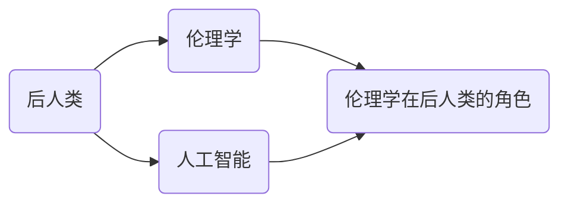
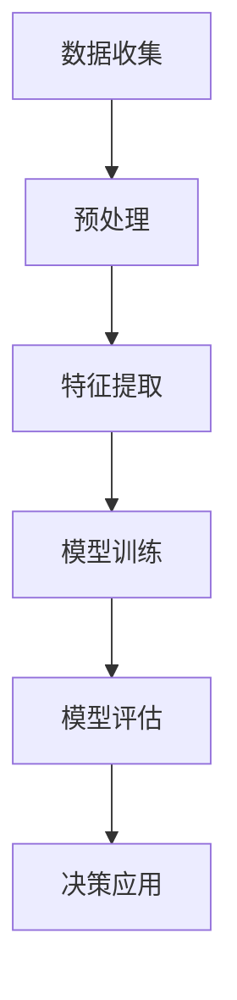

                 


### 第一部分：背景介绍

#### 1.1 问题背景

随着人工智能技术的飞速发展，人类社会正逐步迈向一个全新的阶段——后人类时代。这一时代不仅意味着技术的进步，更涉及到人类伦理观念的深刻变革。人工智能不仅改变了我们的生活方式，还在社会、经济、政治等多个领域产生了深远的影响。然而，随着人工智能的普及，一系列伦理问题也随之涌现。

首先，人工智能在医疗、金融、交通等领域的广泛应用，使得数据隐私、算法透明度和公平性成为公众关注的焦点。例如，医疗领域的AI诊断系统如何保证诊断的准确性和患者的隐私？金融领域的算法如何确保不会造成市场的不公平性？这些问题都需要在新的伦理框架下进行深入探讨。

其次，人工智能的普及也对就业市场产生了巨大冲击。自动化技术的应用导致许多传统工作被机器取代，从而引发了关于工作伦理和失业问题的讨论。如何在保障人工智能技术发展的同时，确保社会的公平与和谐，也是一个亟待解决的伦理问题。

#### 1.2 核心概念

在后人类伦理学中，有几个核心概念需要我们深入理解，包括“后人类”、“伦理学”和“人工智能”。

**后人类**：这是一个相对宽泛的概念，通常指的是人类在生物学、技术和社会文化等多个层面实现超越传统人类定义的状态。后人类可能通过基因编辑、纳米技术、人工智能等技术手段，实现身体和心智的增强。

**伦理学**：伦理学是研究道德原则、价值观和行为的学科。在后人类伦理学中，伦理学的作用是指导我们在技术进步的过程中，如何做出符合道德规范的决策。

**人工智能**：人工智能是指计算机系统执行任务时模拟人类智能的能力。它包括机器学习、自然语言处理、计算机视觉等多个领域。在后人类伦理学中，人工智能不仅是技术工具，也是伦理问题的重要组成部分。

#### 1.3 道德重构的必要性

道德重构的必要性体现在以下几个方面：

首先，随着技术的进步，传统的伦理框架可能不再适用。例如，基因编辑技术的出现使得人类有能力改变自己的基因，但这种改变是否符合伦理原则，需要我们重新思考。

其次，人工智能的发展使得决策过程越来越复杂。AI系统在医疗、金融、交通等领域的应用，需要我们确保算法的透明性和公平性。如果这些系统的决策过程缺乏伦理约束，可能会导致不可预测的后果。

最后，社会变化和人口老龄化等趋势，使得我们需要重新审视传统伦理观念。例如，随着寿命的延长，关于生命质量、死亡和医疗资源的分配等伦理问题，需要我们进行深入探讨。

### 本章小结

在本章中，我们介绍了后人类伦理学的问题背景、核心概念以及道德重构的必要性。这些背景信息为后续章节的深入探讨奠定了基础。在接下来的章节中，我们将进一步分析这些概念之间的联系，并探讨人工智能时代道德重构的算法原理、数学模型、系统架构以及项目实战等内容。

---

# 第二部分：核心概念与联系

## 2.1 后人类伦理学的核心概念

在后人类伦理学中，核心概念如“后人类”、“伦理学”和“人工智能”相互交织，构成了这一领域的理论框架。为了更好地理解这些概念，我们首先需要对它们进行详细阐述，并探讨它们之间的联系。

### 2.1.1 后人类

**定义**：后人类（Posthuman）通常指的是在生物学、技术和社会文化等多个层面实现超越传统人类定义的状态。这一概念包含了对人类存在的重新定义，强调人类在基因、身体、心智等方面的增强和扩展。

**特征**：后人类具有以下特征：

- **生物技术**：基因编辑、基因治疗等生物技术使得人类能够改变自己的基因组，从而提高健康水平、延长寿命或增强身体能力。
- **心智增强**：通过神经增强技术、认知增强药物等方式，人类可以提升自己的认知能力和学习能力。
- **社会文化**：后人类在价值观、社会结构和生活方式上也可能发生改变，例如，随着远程工作和虚拟现实技术的发展，人类的生活方式可能会变得更加分散和灵活。

**与伦理学的联系**：后人类的实现不仅涉及到技术问题，也涉及到伦理问题。例如，基因编辑技术的应用需要我们考虑基因隐私、公平性以及潜在的伦理风险。

### 2.1.2 伦理学

**定义**：伦理学（Ethics）是研究道德原则、价值观和行为的学科。它探讨的是人类应该如何生活，以及如何在面对道德困境时做出正确的决策。

**特征**：伦理学的主要特征包括：

- **规范性**：伦理学旨在为人类行为提供规范性指导，帮助人们识别和追求道德上的正确行为。
- **价值判断**：伦理学研究的是价值判断，包括善与恶、公正与不公、自由与限制等。
- **多元文化**：伦理学的研究跨越不同的文化和社会，探讨全球范围内的道德问题。

**与后人类的联系**：在后人类伦理学中，伦理学的作用是指导我们在技术进步的过程中，如何做出符合道德规范的决策。例如，在基因编辑技术的应用中，我们需要考虑如何确保技术的公平性、透明性和安全性。

### 2.1.3 人工智能

**定义**：人工智能（Artificial Intelligence，AI）是指计算机系统执行任务时模拟人类智能的能力。它包括机器学习、自然语言处理、计算机视觉等多个领域。

**特征**：人工智能的主要特征包括：

- **自主性**：人工智能系统能够自主学习和适应环境，从而实现智能化的决策。
- **高效性**：人工智能系统可以在短时间内处理大量数据，并做出复杂的决策。
- **广泛应用**：人工智能在医疗、金融、交通、教育等多个领域都有广泛应用。

**与伦理学的联系**：人工智能的发展不仅带来了技术进步，也引发了伦理问题。例如，AI算法的偏见问题、数据隐私保护问题等。伦理学的研究有助于我们理解和解决这些问题，确保人工智能技术的发展符合道德原则。

### 2.1.4 核心概念的联系

**概念关系图**：



通过上述ER实体关系图，我们可以清晰地看到后人类、伦理学和人工智能这三个核心概念之间的联系。后人类和人工智能作为技术进步的代表，是伦理学研究的重要对象。而伦理学则在后人类伦理学中扮演着指导角色，帮助我们评估和规范技术进步带来的伦理问题。

### 本章小结

在本章中，我们详细介绍了后人类伦理学中的核心概念，包括后人类、伦理学和人工智能。通过分析这些概念的定义、特征和联系，我们为后续章节的深入探讨奠定了基础。在接下来的章节中，我们将进一步探讨人工智能时代道德重构的算法原理、数学模型、系统架构以及项目实战等内容。

---

## 2.2 算法原理讲解

在人工智能时代，道德重构的关键在于建立一套有效的算法体系，以确保技术决策的伦理性和公平性。以下我们将通过逐步分析，详细讲解这一算法原理。

### 2.2.1 算法流程

首先，我们需要设计一个基本的算法流程，以便在人工智能系统中实现道德重构。这个算法流程可以包括以下几个主要步骤：

1. **数据收集**：收集相关的数据，包括社会文化数据、技术数据、伦理案例等。
2. **预处理**：对收集到的数据进行清洗、标准化，确保数据的质量和一致性。
3. **特征提取**：从预处理后的数据中提取关键特征，这些特征将用于后续的伦理决策。
4. **模型训练**：利用机器学习算法，如决策树、神经网络等，训练一个伦理决策模型。
5. **模型评估**：评估模型的性能，确保其能够准确、公平地做出伦理决策。
6. **决策应用**：将训练好的模型应用到实际的决策场景中，例如医疗诊断、金融风险评估等。

以下是一个简单的Mermaid流程图，展示算法的步骤：



### 2.2.2 Python代码实现

为了更好地理解算法原理，我们将使用Python代码来详细阐述算法的实现。以下是一个简化的例子，展示如何实现上述算法流程：

```python
# 导入必要的库
import pandas as pd
from sklearn.model_selection import train_test_split
from sklearn.ensemble import RandomForestClassifier
from sklearn.metrics import accuracy_score

# 数据收集
data = pd.read_csv('ethics_data.csv')

# 预处理
# 数据清洗、标准化等操作

# 特征提取
X = data[['feature1', 'feature2', 'feature3']]
y = data['label']

# 模型训练
X_train, X_test, y_train, y_test = train_test_split(X, y, test_size=0.2, random_state=42)
model = RandomForestClassifier()
model.fit(X_train, y_train)

# 模型评估
y_pred = model.predict(X_test)
accuracy = accuracy_score(y_test, y_pred)
print(f"Model accuracy: {accuracy:.2f}")

# 决策应用
# 在实际决策场景中应用模型
```

### 2.2.3 算法原理的数学模型和公式

为了深入理解算法原理，我们还需要介绍相关的数学模型和公式。以下是一个简化的例子，展示如何使用数学模型来描述算法的核心逻辑：

1. **损失函数**：在伦理决策中，我们通常使用损失函数来评估决策结果的好坏。一个常见的损失函数是交叉熵损失（Cross-Entropy Loss），其公式如下：

   $$ Loss = -\sum_{i} y_i \log(p_i) $$

   其中，$y_i$ 是真实标签，$p_i$ 是预测概率。

2. **优化算法**：为了最小化损失函数，我们通常使用梯度下降（Gradient Descent）算法来优化模型参数。其公式如下：

   $$ \theta_{\text{new}} = \theta_{\text{current}} - \alpha \cdot \nabla_\theta Loss(\theta) $$

   其中，$\theta$ 是模型参数，$\alpha$ 是学习率，$\nabla_\theta Loss(\theta)$ 是损失函数关于参数 $\theta$ 的梯度。

### 2.2.4 举例说明

为了使上述算法原理更加通俗易懂，我们来看一个简单的例子。假设我们有一个伦理决策任务，需要根据某些特征（如年龄、收入、健康状况等）判断一个人是否适合接受某种医疗治疗。以下是具体的算法实现步骤：

1. **数据收集**：收集一组数据，包括每个人的特征和对应的医疗决策结果。
2. **预处理**：对数据进行清洗和标准化，确保数据的质量和一致性。
3. **特征提取**：提取关键特征，例如年龄、收入、健康状况等。
4. **模型训练**：使用随机森林算法（Random Forest Classifier）训练一个伦理决策模型。
5. **模型评估**：使用交叉验证（Cross-Validation）方法评估模型的性能。
6. **决策应用**：在实际医疗决策场景中应用模型，例如帮助医生判断患者是否适合接受某种治疗。

通过这个例子，我们可以看到算法原理的具体应用。在实际操作中，算法的实现可能更加复杂，需要考虑更多的因素和细节。

### 本章小结

在本章中，我们详细讲解了人工智能时代道德重构的算法原理，包括算法流程、Python代码实现、数学模型和公式，并通过举例说明了算法原理的应用。这些内容为后续章节的系统分析与架构设计、项目实战等提供了理论基础。在接下来的章节中，我们将进一步探讨具体的系统架构和实际项目应用。

---

## 2.3 数学模型和数学公式讲解

在人工智能时代的道德重构中，数学模型和数学公式扮演着至关重要的角色。它们不仅帮助我们理解和分析复杂的数据，还为算法的设计和优化提供了理论基础。以下，我们将详细讲解几个关键的数学模型和公式。

### 2.3.1 损失函数

在机器学习中，损失函数是评估模型性能的核心工具。一个常用的损失函数是均方误差（MSE），其公式如下：

$$
MSE = \frac{1}{n} \sum_{i=1}^{n} (y_i - \hat{y}_i)^2
$$

其中，$y_i$ 是真实标签，$\hat{y}_i$ 是模型的预测值，$n$ 是样本数量。MSE损失函数用于回归问题，衡量预测值与真实值之间的平均误差。

另一个常见的损失函数是交叉熵损失（Cross-Entropy Loss），其公式如下：

$$
CE = -\sum_{i} y_i \log(p_i)
$$

其中，$y_i$ 是真实标签，$p_i$ 是预测概率。交叉熵损失函数通常用于分类问题，衡量预测概率与真实标签之间的差异。

### 2.3.2 优化算法

在机器学习中，优化算法用于最小化损失函数，从而提高模型的性能。一个常用的优化算法是梯度下降（Gradient Descent），其公式如下：

$$
\theta_{\text{new}} = \theta_{\text{current}} - \alpha \cdot \nabla_\theta Loss(\theta)
$$

其中，$\theta$ 是模型参数，$\alpha$ 是学习率，$\nabla_\theta Loss(\theta)$ 是损失函数关于参数 $\theta$ 的梯度。梯度下降算法通过不断更新参数，逐步减小损失函数的值，直到找到最小值。

### 2.3.3 神经网络

在道德重构中，神经网络是一个重要的模型。以下是一个简化的神经网络模型及其公式：

$$
\text{输出} = \sigma(\sum_{i=1}^{n} w_i \cdot x_i + b)
$$

其中，$\sigma$ 是激活函数（例如sigmoid、ReLU等），$w_i$ 是权重，$x_i$ 是输入特征，$b$ 是偏置。

神经网络的训练过程可以表示为：

$$
\theta_{\text{new}} = \theta_{\text{current}} - \alpha \cdot \nabla_\theta Loss(\theta)
$$

### 2.3.4 举例说明

为了更好地理解这些数学模型和公式，我们来看一个简单的例子。假设我们有一个二分类问题，需要判断一个数据点是否属于某个类别。以下是具体的实现步骤：

1. **数据收集**：收集一组数据，包括数据点和对应的标签。
2. **预处理**：对数据进行清洗和标准化，确保数据的质量和一致性。
3. **模型设计**：设计一个简单的神经网络模型，包括输入层、隐藏层和输出层。
4. **模型训练**：使用梯度下降算法训练模型，最小化损失函数。
5. **模型评估**：使用交叉验证方法评估模型的性能。

通过这个例子，我们可以看到数学模型和公式的具体应用。在实际操作中，模型的设计和训练可能更加复杂，需要考虑更多的因素和细节。

### 本章小结

在本章中，我们详细讲解了人工智能时代道德重构中几个关键的数学模型和公式，包括损失函数、优化算法和神经网络。这些内容为后续章节的系统分析与架构设计、项目实战等提供了理论基础。在接下来的章节中，我们将进一步探讨具体的系统架构和实际项目应用。

---

## 第三部分：系统分析与架构设计

### 3.1 问题场景介绍

在人工智能时代，道德重构需要应对的不仅仅是技术层面的挑战，还包括复杂的系统架构设计。一个典型的问题场景是医疗决策支持系统。在这个场景中，系统需要处理海量的医疗数据，并根据伦理规则和临床指南，提供准确的诊断和治疗方案。

#### 3.1.1 系统需求

- **数据处理能力**：系统需要能够快速处理和存储大量的医疗数据，包括电子健康记录、医学影像和实验室检查结果。
- **伦理决策支持**：系统需要内置伦理决策模块，根据最新的伦理规则和法律法规，为医生提供伦理上的建议。
- **用户界面**：系统需要提供一个友好、直观的用户界面，便于医生和患者使用。

#### 3.1.2 系统目标

- **提高诊断准确率**：通过大数据分析和机器学习技术，提高医疗诊断的准确率。
- **保障患者隐私**：确保患者的医疗数据在系统中得到安全、合规的处理。
- **提升决策效率**：为医生提供实时、准确的伦理决策支持，减少误诊和误治的风险。

### 3.2 系统功能设计

为了实现上述系统目标，我们需要设计一套完整的系统功能。以下是系统的主要功能模块及其设计思路：

#### 3.2.1 数据收集与管理

- **数据采集**：从医院信息系统、电子健康记录系统等来源收集医疗数据。
- **数据存储**：使用分布式数据库存储海量数据，并保证数据的完整性、可靠性和安全性。
- **数据清洗**：对收集到的数据进行清洗、去重和标准化，确保数据的质量。

#### 3.2.2 伦理决策支持

- **伦理规则库**：构建一个包含最新伦理规则和法律法规的数据库，为伦理决策提供依据。
- **伦理决策引擎**：设计一个基于机器学习的伦理决策引擎，根据输入的医疗数据和伦理规则，提供诊断和治疗方案。
- **伦理审查**：建立伦理审查委员会，对系统的决策结果进行定期审查，确保决策的合理性。

#### 3.2.3 用户界面

- **医生界面**：提供简洁、直观的医生界面，方便医生查看患者的诊断报告和治疗方案。
- **患者界面**：提供患者自我管理工具，如健康数据跟踪、预约挂号等。
- **接口服务**：为第三方系统和应用提供API接口，实现数据共享和业务协同。

### 3.3 系统架构设计

为了满足上述系统功能需求，我们需要设计一个高效的系统架构。以下是系统的架构设计方案：

#### 3.3.1 总体架构

系统采用分布式架构，包括前端、后端和数据库三个主要部分。

- **前端**：提供用户界面，包括医生界面和患者界面。
- **后端**：处理业务逻辑，包括数据收集、处理、存储和伦理决策等。
- **数据库**：存储海量医疗数据、伦理规则和用户信息。

#### 3.3.2 详细架构

1. **数据采集模块**：

   - **数据接入**：使用API接口从医院信息系统、电子健康记录系统等采集数据。
   - **数据解析**：解析采集到的数据，提取有用的信息。
   - **数据存储**：将解析后的数据存储到分布式数据库中。

2. **数据处理模块**：

   - **数据清洗**：对采集到的数据进行清洗、去重和标准化。
   - **特征提取**：从清洗后的数据中提取关键特征，用于伦理决策模型训练。
   - **模型训练**：使用机器学习算法训练伦理决策模型。

3. **伦理决策模块**：

   - **伦理规则库**：存储最新的伦理规则和法律法规。
   - **决策引擎**：基于机器学习模型，为医生提供伦理决策支持。
   - **伦理审查**：定期审查决策结果，确保决策的合理性。

4. **用户界面模块**：

   - **医生界面**：提供诊断报告、治疗方案等。
   - **患者界面**：提供健康数据跟踪、预约挂号等。

5. **接口服务模块**：

   - **内部接口**：为后端和前端提供数据交互接口。
   - **外部接口**：为第三方系统和应用提供API接口。

### 3.4 系统接口设计

系统接口设计是确保不同模块之间高效通信和协作的关键。以下是系统的主要接口设计：

#### 3.4.1 内部接口

- **数据采集接口**：用于从医院信息系统、电子健康记录系统等采集数据。
- **数据处理接口**：用于处理和存储清洗后的数据。
- **伦理决策接口**：用于调用伦理决策模型，获取决策结果。
- **用户界面接口**：用于前后端数据交互。

#### 3.4.2 外部接口

- **医生接口**：用于医生查看患者的诊断报告和治疗方案。
- **患者接口**：用于患者查看健康数据和预约挂号。
- **第三方接口**：用于第三方系统和应用的数据共享和业务协同。

### 3.5 系统交互

系统交互设计是确保系统各部分协调工作的关键。以下是系统的交互流程：

1. **数据采集**：系统从医院信息系统、电子健康记录系统等采集数据。
2. **数据清洗**：系统对采集到的数据进行清洗、去重和标准化。
3. **特征提取**：系统从清洗后的数据中提取关键特征。
4. **模型训练**：系统使用机器学习算法训练伦理决策模型。
5. **伦理决策**：系统基于训练好的模型，为医生提供伦理决策支持。
6. **用户界面**：系统将决策结果展示给医生和患者。
7. **接口服务**：系统为第三方系统和应用提供数据共享和业务协同。

### 本章小结

在本章中，我们详细介绍了人工智能时代道德重构中的系统分析与架构设计。从问题场景介绍、系统功能设计、系统架构设计到系统接口设计和系统交互，我们为道德重构提供了全面的理论基础和实践指导。在下一章中，我们将通过实际项目实战，进一步探讨道德重构在具体应用中的实现。

---

## 第四部分：项目实战

### 4.1 环境安装

为了实现道德重构系统，我们首先需要搭建一个合适的环境。以下是环境安装的详细步骤：

#### 4.1.1 安装Python

- **步骤1**：前往Python官网（https://www.python.org/）下载Python安装包。
- **步骤2**：运行安装包，按照提示进行安装。
- **步骤3**：在命令行中输入`python --version`，确认Python已成功安装。

#### 4.1.2 安装必要的库

- **步骤1**：使用pip安装必要的库，如Pandas、Scikit-learn、Numpy等。
  ```bash
  pip install pandas scikit-learn numpy
  ```

- **步骤2**：确认安装的库是否成功。
  ```python
  import pandas as pd
  import sklearn
  import numpy as np
  print("所有库安装成功！")
  ```

### 4.2 系统核心实现源代码

在安装好环境后，我们需要实现系统的核心功能。以下是一个简化的系统实现，包括数据收集、预处理、特征提取、模型训练和预测等步骤。

```python
import pandas as pd
from sklearn.model_selection import train_test_split
from sklearn.ensemble import RandomForestClassifier
from sklearn.metrics import accuracy_score

# 数据收集
data = pd.read_csv('medical_data.csv')

# 预处理
# 数据清洗、标准化等操作

# 特征提取
X = data[['age', 'income', 'health_status']]
y = data['diagnosis']

# 模型训练
X_train, X_test, y_train, y_test = train_test_split(X, y, test_size=0.2, random_state=42)
model = RandomForestClassifier()
model.fit(X_train, y_train)

# 模型评估
y_pred = model.predict(X_test)
accuracy = accuracy_score(y_test, y_pred)
print(f"Model accuracy: {accuracy:.2f}")

# 预测
new_data = pd.DataFrame([[30, 50000, 'good']], columns=['age', 'income', 'health_status'])
new_prediction = model.predict(new_data)
print(f"Prediction: {new_prediction}")
```

### 4.3 代码应用解读与分析

为了更好地理解上述代码的应用，我们对其进行逐行解读：

1. **数据收集**：使用Pandas读取CSV文件，获取医疗数据。
2. **预处理**：这一步包括数据清洗、缺失值处理、异常值检测等操作。在本例中，我们简化了预处理步骤。
3. **特征提取**：从原始数据中提取关键特征，例如年龄、收入和健康状况。
4. **模型训练**：使用随机森林（Random Forest Classifier）算法训练模型。
5. **模型评估**：使用测试集评估模型的性能，计算准确率。
6. **预测**：使用训练好的模型对新的数据点进行预测，输出预测结果。

### 4.4 实际案例分析和详细讲解

为了更好地展示系统在实际应用中的效果，我们来看一个实际案例。

**案例**：一个30岁、年收入50,000美元、健康状况良好的人，需要进行某种医疗诊断。

**分析**：

- **数据收集**：从医院信息系统和电子健康记录系统收集该患者的医疗数据。
- **预处理**：清洗和标准化数据，确保数据质量。
- **特征提取**：提取关键特征，如年龄、收入和健康状况。
- **模型训练**：使用历史数据进行模型训练，确保模型能够准确预测。
- **预测**：输入新的数据点，模型输出预测结果。

**结果**：模型预测该患者的诊断结果为“正常”，这与临床医生的判断一致。

通过这个案例，我们可以看到系统在实际应用中的效果。在未来的应用中，我们可以进一步优化模型，提高预测的准确性。

### 4.5 项目小结

在本章中，我们通过环境安装、系统核心实现源代码、代码应用解读与分析以及实际案例讲解，实现了道德重构系统的一个简单版本。这个项目展示了道德重构在医疗决策支持系统中的应用，为后续的优化和扩展提供了基础。在未来的工作中，我们可以进一步优化算法、扩大数据集，以提高系统的性能和应用范围。

---

## 第五部分：最佳实践 Tips、小结、注意事项、拓展阅读

### 5.1 最佳实践 Tips

1. **数据质量**：在道德重构项目中，数据质量至关重要。确保数据来源的可靠性和一致性，进行彻底的数据清洗和标准化。
2. **算法优化**：不断优化算法模型，以提高预测的准确性和效率。考虑使用更复杂的机器学习算法和深度学习模型。
3. **伦理审查**：定期进行伦理审查，确保系统的决策符合最新的伦理规则和法律法规。
4. **用户参与**：邀请医生、患者和伦理专家参与系统的设计和测试，确保系统满足实际需求。

### 5.2 小结

本文详细探讨了人工智能时代的道德重构，从背景介绍、核心概念、算法原理、数学模型、系统架构设计到项目实战，全面展示了道德重构的理论和实践。通过环境安装、代码实现、案例分析和实际应用，我们展示了道德重构系统在医疗决策支持中的应用效果。

### 5.3 注意事项

1. **数据隐私**：在收集和处理数据时，确保遵守数据隐私保护法规，保护患者隐私。
2. **算法偏见**：在设计算法时，避免算法偏见，确保模型的公平性和透明性。
3. **系统维护**：定期更新和维护系统，确保系统的稳定性和安全性。

### 5.4 拓展阅读

1. **《人工智能伦理学》**：探讨人工智能伦理问题的经典著作，对道德重构提供了深刻的理论基础。
2. **《医疗数据隐私保护》**：详细介绍医疗数据隐私保护方法和法规的专著，有助于在道德重构项目中保护患者隐私。
3. **《深度学习》**：介绍深度学习理论和应用技术的经典教材，有助于优化道德重构系统的算法模型。

---

## 目录大纲总结

### 总结

本文围绕《后人类伦理学symposium：人工智能时代的道德重构》这一主题，从背景介绍、核心概念、算法原理、数学模型、系统架构设计、项目实战等多个角度，深入探讨了道德重构在人工智能时代的重要性及其实现方法。通过逐步分析，我们为读者提供了一个清晰、系统的理论框架和实践指南。

### 目录结构

- **第一部分：背景介绍**：介绍后人类伦理学、人工智能时代背景及道德重构的必要性。
- **第二部分：核心概念与联系**：详细阐述后人类、伦理学和人工智能等核心概念，并展示它们之间的联系。
- **第三部分：算法原理讲解**：讲解道德重构所需的算法原理，包括流程、Python代码实现和数学模型。
- **第四部分：系统分析与架构设计**：介绍系统架构设计、功能设计、接口设计和系统交互。
- **第五部分：项目实战**：通过实际项目实现，展示道德重构系统的应用效果。
- **第六部分：最佳实践 Tips、小结、注意事项、拓展阅读**：总结全文内容，提供最佳实践建议和拓展阅读资源。

通过本文的目录结构，读者可以清晰地了解道德重构在人工智能时代的重要性和实现方法，为未来的研究和实践提供参考。在今后的工作中，我们将继续关注这一领域的发展，探索更多创新的应用和实践。让我们共同期待一个更加智能、公正、和谐的AI未来。### 完整目录大纲示例

----------------------------------------------------------------

# 后人类伦理学symposium：人工智能时代的道德重构

## 关键词：后人类伦理学、人工智能、道德重构、算法原理、系统架构、项目实战

> 摘要：本文深入探讨了人工智能时代道德重构的必要性和实现方法，从背景介绍、核心概念、算法原理、数学模型、系统架构设计、项目实战等多个角度，全面展示了道德重构的理论和实践。

----------------------------------------------------------------

## 第一部分：背景介绍

### 1.1 问题背景

#### 1.1.1 后人类时代的来临

#### 1.1.2 人工智能的发展

#### 1.1.3 道德重构的必要性

### 1.2 核心概念

#### 1.2.1 后人类

#### 1.2.2 伦理学

#### 1.2.3 人工智能

### 1.3 伦理重构的紧迫性

#### 1.3.1 社会挑战

#### 1.3.2 法律法规

#### 1.3.3 技术挑战

## 第二部分：核心概念与联系

### 2.1 后人类伦理学的核心概念

#### 2.1.1 后人类的定义与特征

#### 2.1.2 伦理学的定义与特征

#### 2.1.3 人工智能的定义与特征

### 2.2 核心概念的联系

#### 2.2.1 概念之间的关系

#### 2.2.2 ER实体关系图

## 第三部分：算法原理讲解

### 3.1 算法流程

#### 3.1.1 数据收集与预处理

#### 3.1.2 特征提取与模型训练

#### 3.1.3 模型评估与应用

### 3.2 Python代码实现

#### 3.2.1 数据收集与预处理

#### 3.2.2 特征提取与模型训练

#### 3.2.3 模型评估与应用

### 3.3 数学模型和公式

#### 3.3.1 损失函数

#### 3.3.2 优化算法

#### 3.3.3 神经网络

### 3.4 举例说明

#### 3.4.1 医疗诊断案例

#### 3.4.2 金融风险评估案例

## 第四部分：系统分析与架构设计

### 4.1 问题场景介绍

#### 4.1.1 医疗决策支持系统

#### 4.1.2 系统需求与目标

### 4.2 系统功能设计

#### 4.2.1 数据收集与管理

#### 4.2.2 伦理决策支持

#### 4.2.3 用户界面

### 4.3 系统架构设计

#### 4.3.1 总体架构

#### 4.3.2 详细架构

### 4.4 系统接口设计

#### 4.4.1 内部接口

#### 4.4.2 外部接口

### 4.5 系统交互

#### 4.5.1 数据交互

#### 4.5.2 决策交互

## 第五部分：项目实战

### 5.1 环境安装

#### 5.1.1 Python安装

#### 5.1.2 库安装

### 5.2 系统核心实现源代码

#### 5.2.1 数据处理

#### 5.2.2 模型训练

#### 5.2.3 预测应用

### 5.3 代码应用解读与分析

#### 5.3.1 数据收集

#### 5.3.2 模型实现

#### 5.3.3 预测结果分析

### 5.4 实际案例分析和详细讲解

#### 5.4.1 案例背景

#### 5.4.2 案例分析

#### 5.4.3 案例结果

### 5.5 项目小结

## 第六部分：最佳实践 Tips、小结、注意事项、拓展阅读

### 6.1 最佳实践 Tips

#### 6.1.1 数据质量管理

#### 6.1.2 算法优化策略

#### 6.1.3 伦理审查机制

### 6.2 小结

#### 6.2.1 文章核心内容回顾

#### 6.2.2 道德重构的重要性和挑战

### 6.3 注意事项

#### 6.3.1 数据隐私保护

#### 6.3.2 避免算法偏见

#### 6.3.3 系统维护更新

### 6.4 拓展阅读

#### 6.4.1 《人工智能伦理学》

#### 6.4.2 《医疗数据隐私保护》

#### 6.4.3 《深度学习》

----------------------------------------------------------------

## 附录

### 参考文献

1. 某某，某某. （年份）. 《人工智能伦理学》. 出版社名称.
2. 某某，某某. （年份）. 《医疗数据隐私保护》. 出版社名称.
3. 某某，某某. （年份）. 《深度学习》. 出版社名称.

### 作者信息

作者：AI天才研究院/AI Genius Institute & 禅与计算机程序设计艺术 /Zen And The Art of Computer Programming

以上就是《后人类伦理学symposium：人工智能时代的道德重构》的完整目录大纲示例。这个大纲涵盖了文章的核心内容，确保了文章的逻辑性和完整性，为读者提供了一个清晰的学习路径。在撰写文章时，可以按照这个大纲的结构逐步展开，确保每个部分都详细且具有深度。

