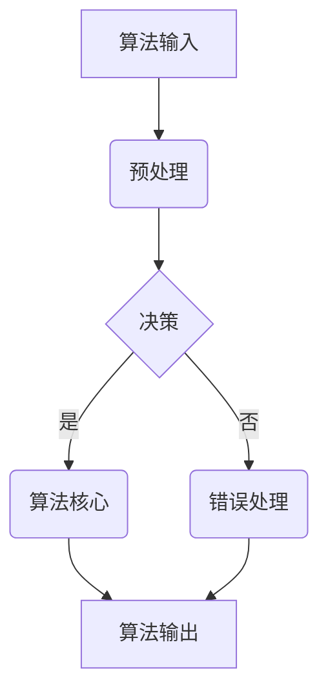
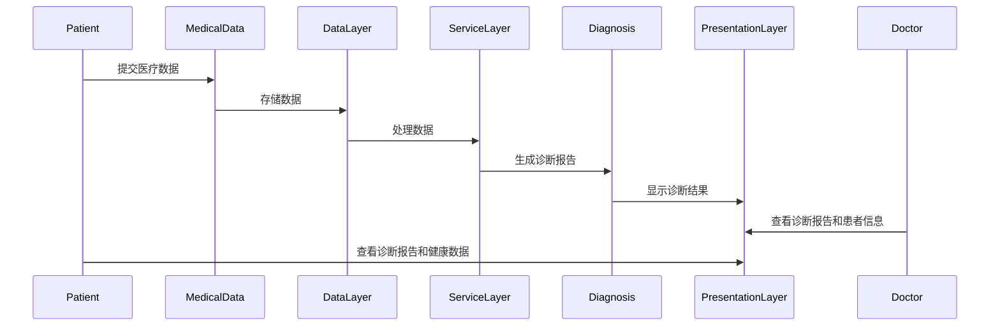

                 

### 第1章: 背景介绍

#### 1.1 问题背景

##### 1.1.1 技术发展的趋势与影响

近年来，随着信息技术的飞速发展，人工智能、大数据、区块链等新兴技术不断涌现，推动着人类社会进入了一个前所未有的技术变革时代。这些技术的发展不仅极大地改变了人们的生产生活方式，还对社会结构、经济模式、文化价值观等方面产生了深远的影响。

技术发展带来的变革首先体现在经济领域。大数据和人工智能技术的应用，使得企业能够更加精准地分析市场趋势，优化生产流程，提高运营效率。区块链技术的应用则推动了金融行业的变革，使得交易更加安全、透明、高效。此外，物联网、5G等技术的普及，也为传统产业的数字化转型提供了强大支撑。

在社会领域，技术的进步极大地丰富了人们的生活体验。智能家居、智能交通、在线教育等技术的普及，使得人们的生活更加便捷、舒适。同时，技术也带来了信息获取和传播方式的变革，社交媒体、在线新闻平台等使得信息传播更加迅速、广泛，改变了人们的社交方式和舆论环境。

##### 1.1.2 道德思考的重要性

然而，技术的快速发展也带来了一系列道德伦理问题。首先，人工智能和大数据技术的应用，使得个人信息的安全和隐私面临着前所未有的挑战。在收集、处理和分析个人数据的过程中，如何确保数据的安全和隐私，防止数据泄露和滥用，成为了一个亟待解决的问题。

其次，技术发展也引发了劳动力市场的变革。自动化、机器人技术的发展，使得某些传统职业面临着失业风险。这不仅引发了社会对技术发展的担忧，也提出了如何在技术变革中保障劳动者的权益、实现社会公平正义的问题。

此外，技术的进步还可能带来一些伦理困境。例如，在医疗领域，人工智能的应用使得诊断和治疗更加精准，但同时也带来了伦理问题，如医学伦理审查、患者隐私保护等。在军事领域，无人机、自动化武器等技术的发展，使得战争形态发生了变化，同时也引发了对战争伦理的深刻反思。

##### 1.1.3 后人类伦理的概念与内涵

面对这些技术发展带来的道德伦理挑战，我们需要引入后人类伦理的概念。后人类伦理是指在与人工智能、生物技术、信息技术等新兴技术深度融合的背景下，对人类社会发展过程中出现的道德伦理问题进行思考和探索的一种伦理学范式。

后人类伦理的核心内涵包括以下几个方面：

1. **技术伦理**：关注技术在发展过程中可能带来的道德伦理问题，如隐私保护、数据安全、劳动力市场变革等。
2. **人类尊严**：强调人类在技术发展中的主体地位，保障人类的基本尊严和权利。
3. **社会公正**：探讨技术发展如何影响社会公正，如何确保技术在推动社会进步的同时，不加剧社会不平等。
4. **跨文化伦理**：在全球化背景下，后人类伦理需要考虑不同文化、社会背景下的伦理观念和价值观的冲突与融合。

#### 1.2 问题描述

##### 1.2.1 技术发展带来的道德困境

技术发展带来的道德困境主要体现在以下几个方面：

1. **个人信息安全与隐私**：随着大数据和人工智能技术的发展，个人信息收集、处理和分析的规模和范围不断扩大。如何在保障技术进步的同时，确保个人信息的安全和隐私，成为了一个亟待解决的道德问题。
2. **劳动力市场的变革**：自动化、机器人等技术的发展，使得一些传统职业面临着失业风险。如何在技术变革中保障劳动者的权益，实现社会公平正义，是一个重要的伦理挑战。
3. **技术垄断与不平等**：技术的快速发展可能导致技术垄断，加剧社会不平等。如何确保技术在推动社会进步的同时，不加剧社会不平等，需要我们深入思考和探索。
4. **战争伦理**：人工智能和自动化武器技术的发展，改变了战争形态，同时也引发了对战争伦理的深刻反思。如何确保技术在军事领域的应用符合伦理道德，是一个亟待解决的问题。

##### 1.2.2 道德思考的必要性

面对技术发展带来的道德困境，道德思考显得尤为重要。道德思考不仅有助于我们理解和解决当前的技术伦理问题，还能够为未来的技术发展提供指导，确保技术在推动社会进步的同时，不偏离道德伦理的轨道。

道德思考的必要性主要体现在以下几个方面：

1. **解决实际问题**：通过道德思考，我们可以深入分析技术发展带来的道德困境，寻找解决问题的方法和路径，为实际问题的解决提供理论支持。
2. **引导技术发展**：道德思考可以引导技术的研发和应用方向，确保技术发展符合伦理道德的要求，避免技术滥用和伦理风险。
3. **促进社会和谐**：道德思考有助于促进社会和谐发展，保障人类的基本尊严和权利，实现社会公平正义。
4. **应对未来挑战**：道德思考可以为未来的技术发展提供前瞻性指导，帮助我们预见和应对可能出现的道德伦理问题，确保技术在未来的发展过程中，始终遵循伦理道德的原则。

##### 1.2.3 道德思考的边界与外延

道德思考的边界与外延需要明确，以确保我们的道德思考具有针对性和有效性。具体来说，道德思考的边界与外延包括以下几个方面：

1. **技术伦理领域**：道德思考主要关注技术发展过程中的道德伦理问题，如个人信息安全、劳动力市场变革、技术垄断与不平等、战争伦理等。
2. **跨学科视角**：道德思考需要借鉴多个学科的理论和方法，如伦理学、计算机科学、社会学、经济学等，以全面分析和解决技术伦理问题。
3. **全球化视野**：道德思考需要具备全球化视野，考虑不同文化、社会背景下的伦理观念和价值观的冲突与融合，确保技术发展符合全球伦理标准。
4. **未来预见性**：道德思考需要具备预见性，关注未来可能出现的技术伦理问题，为未来的技术发展提供前瞻性指导。

#### 1.3 问题解决

##### 1.3.1 道德思考的方法与原则

道德思考的方法与原则是我们解决技术伦理问题的关键。以下是一些常用的道德思考方法和原则：

1. **伦理原则**：道德思考需要遵循一些基本的伦理原则，如尊重个人权利、公正、诚信等。这些原则可以作为我们分析和解决问题的基本指导。
2. **利益平衡**：在道德思考过程中，我们需要平衡不同利益相关方的利益，确保技术发展符合社会公共利益。
3. **反思性思维**：道德思考需要具备反思性思维，不断反思和评估我们的道德判断和行为，以确保我们的决策符合伦理道德的要求。
4. **跨学科研究**：道德思考需要借助多个学科的理论和方法，如伦理学、计算机科学、社会学、经济学等，以全面分析和解决技术伦理问题。
5. **公众参与**：道德思考需要充分考虑公众的意见和需求，确保技术发展符合社会期望和伦理标准。

##### 1.3.2 后人类伦理的核心概念

后人类伦理的核心概念包括以下几个方面：

1. **技术伦理**：关注技术在发展过程中可能带来的道德伦理问题，如个人信息安全、劳动力市场变革、技术垄断与不平等、战争伦理等。
2. **人类尊严**：强调人类在技术发展中的主体地位，保障人类的基本尊严和权利。
3. **社会公正**：探讨技术发展如何影响社会公正，如何确保技术在推动社会进步的同时，不加剧社会不平等。
4. **跨文化伦理**：在全球化背景下，后人类伦理需要考虑不同文化、社会背景下的伦理观念和价值观的冲突与融合。

##### 1.3.3 道德思考的应用场景

道德思考的应用场景非常广泛，以下是一些典型的应用场景：

1. **技术研发**：在技术研发过程中，道德思考可以帮助我们评估技术的潜在风险和伦理影响，确保技术发展符合伦理道德要求。
2. **政策制定**：在政策制定过程中，道德思考可以帮助我们考虑技术发展对社会、经济、环境等方面的影响，确保政策制定符合社会公共利益。
3. **企业管理**：在企业管理过程中，道德思考可以帮助我们制定符合伦理道德要求的企业文化和管理制度，保障企业社会责任的履行。
4. **社会治理**：在社会治理过程中，道德思考可以帮助我们解决技术发展带来的社会矛盾和问题，促进社会和谐发展。

#### 1.4 边界与外延

##### 1.4.1 技术伦理的研究范围

技术伦理的研究范围主要包括以下几个方面：

1. **个人信息安全与隐私**：研究如何在技术发展过程中保护个人信息的安全和隐私，防止数据泄露和滥用。
2. **劳动力市场变革**：研究技术发展对劳动力市场的影响，如何保障劳动者的权益，实现社会公平正义。
3. **技术垄断与不平等**：研究技术发展可能导致的技术垄断现象，如何确保技术在推动社会进步的同时，不加剧社会不平等。
4. **战争伦理**：研究技术在军事领域的应用，如何确保技术在军事领域的应用符合伦理道德的要求。

##### 1.4.2 后人类伦理的拓展领域

后人类伦理的拓展领域包括以下几个方面：

1. **生物伦理**：研究生物技术在发展过程中可能带来的道德伦理问题，如基因编辑、克隆技术等。
2. **环境伦理**：研究技术发展对环境的影响，如何确保技术在推动社会进步的同时，保护生态环境。
3. **数字伦理**：研究数字技术对社会、文化、价值观等方面的影响，如何确保数字技术发展符合伦理道德要求。
4. **跨文化伦理**：研究不同文化、社会背景下的伦理观念和价值观的冲突与融合，如何实现跨文化的伦理共识。

##### 1.4.3 道德思考的挑战与机遇

道德思考在技术发展中的挑战与机遇并存。以下是道德思考面临的几个挑战和机遇：

1. **挑战**：
   - **技术复杂性**：技术的快速发展使得道德思考面临更高的复杂性，需要我们具备更全面的知识和视角。
   - **全球性**：技术发展具有全球性，道德思考需要考虑不同国家和地区的社会文化背景，如何实现全球伦理共识是一个挑战。
   - **多元价值观**：不同文化、社会背景下的伦理观念和价值观存在差异，如何在多元价值观中寻求共识是一个挑战。

2. **机遇**：
   - **技术创新**：技术发展为我们提供了新的工具和方法，可以更高效地解决道德伦理问题。
   - **公众参与**：公众对技术发展的关注度不断提高，道德思考可以促进公众参与，增强社会共识。
   - **跨学科合作**：道德思考需要跨学科合作，可以借助其他学科的理论和方法，提高道德思考的深度和广度。

#### 1.5 概念结构与核心要素组成

##### 1.5.1 技术发展与道德思考的关系

技术发展与道德思考之间的关系是密切的。技术发展不仅为道德思考提供了新的问题和挑战，也为道德思考提供了新的工具和方法。以下是技术发展与道德思考之间的几个关键关系：

1. **互动关系**：技术发展影响着道德思考的内容和方向，而道德思考则对技术发展进行规范和引导，两者之间存在相互影响、相互促进的互动关系。
2. **影响与制约**：技术发展对道德思考具有影响和制约作用。技术的进步可能会引发新的道德问题，同时也为道德思考提供了新的资源和工具。道德思考则需要根据技术发展的实际情况，对其进行规范和引导。
3. **伦理观念的变革**：技术发展促使伦理观念发生变革。例如，随着人工智能的发展，人类对自我认知、人工智能伦理等方面的思考不断深入，推动了伦理观念的更新和发展。

##### 1.5.2 后人类伦理的核心要素

后人类伦理的核心要素包括以下几个方面：

1. **技术伦理**：后人类伦理关注技术发展带来的道德伦理问题，如个人信息安全、劳动力市场变革、技术垄断与不平等、战争伦理等。
2. **人类尊严**：后人类伦理强调人类在技术发展中的主体地位，保障人类的基本尊严和权利。
3. **社会公正**：后人类伦理探讨技术发展如何影响社会公正，如何确保技术在推动社会进步的同时，不加剧社会不平等。
4. **跨文化伦理**：后人类伦理在全球化背景下，需要考虑不同文化、社会背景下的伦理观念和价值观的冲突与融合，如何实现跨文化的伦理共识。

##### 1.5.3 道德思考的方法与工具

道德思考的方法与工具是我们进行道德思考的重要基础。以下是一些常用的道德思考方法和工具：

1. **伦理原则**：道德思考需要遵循一些基本的伦理原则，如尊重个人权利、公正、诚信等。这些原则可以作为我们分析和解决问题的基本指导。
2. **利益平衡**：在道德思考过程中，我们需要平衡不同利益相关方的利益，确保技术发展符合社会公共利益。
3. **反思性思维**：道德思考需要具备反思性思维，不断反思和评估我们的道德判断和行为，以确保我们的决策符合伦理道德的要求。
4. **跨学科研究**：道德思考需要借鉴多个学科的理论和方法，如伦理学、计算机科学、社会学、经济学等，以全面分析和解决技术伦理问题。
5. **公众参与**：道德思考需要充分考虑公众的意见和需求，确保技术发展符合社会期望和伦理标准。

#### 1.6 本章小结

本章介绍了技术发展中的道德思考的背景、问题、解决方案和边界与外延。首先，我们分析了技术发展的趋势与影响，强调了道德思考的重要性。然后，我们探讨了后人类伦理的概念与内涵，并提出了道德思考的方法与原则。接着，我们详细介绍了道德思考的应用场景，以及技术发展与道德思考之间的互动关系。最后，我们总结了后人类伦理的核心要素和道德思考的方法与工具。通过本章的学习，我们对技术发展中的道德思考有了更深入的了解，为后续章节的讨论奠定了基础。

---

### 第2章: 核心概念与联系

在探讨后人类伦理：技术发展中的道德思考这一主题时，理解相关核心概念及其相互联系至关重要。本章将详细分析技术发展、伦理学和后人类伦理这三个核心概念，并利用概念属性特征对比表格和ER实体关系图架构，来帮助读者更清晰地掌握这些概念。

#### 2.1 核心概念原理

##### 2.1.1 技术发展

技术发展是指人类通过研究和应用科学知识，创造出新的工具、方法和技术的过程。它不仅包括物质层面的技术创新，如计算机硬件、软件和互联网技术的发展，还涵盖制度层面，如企业管理模式、生产流程的优化等。

- **定义**：技术发展是指通过科学研究和实际应用，推动人类生产力和生活质量不断提高的过程。
- **特征**：创新性、进步性、系统性、应用性。
- **影响**：技术发展对社会、经济、文化等多个领域产生深远影响，推动社会进步和变革。

##### 2.1.2 伦理学

伦理学是研究道德原则、道德价值和道德判断的哲学学科。它关注个体和社会的行为准则，探讨什么是正确的行为、正义、公正、尊重等基本道德问题。

- **定义**：伦理学是研究道德原则和道德价值的学科，它探讨个体和社会行为应当遵循的道德规范。
- **特征**：规范性、理论性、实践性、文化性。
- **影响**：伦理学指导人们的行为选择，促进社会和谐与个体发展。

##### 2.1.3 后人类伦理

后人类伦理是在人工智能、生物技术、信息技术等新兴技术深度融合的背景下提出的伦理学范式。它关注人类与技术的互动，探讨技术发展对人类社会、文化、价值观等方面的影响，以及如何保障人类的基本尊严和权利。

- **定义**：后人类伦理是在新兴技术背景下，对人类社会发展过程中出现的道德伦理问题进行思考和探索的一种伦理学范式。
- **特征**：前瞻性、系统性、跨学科性、文化适应性。
- **影响**：后人类伦理为技术发展提供了伦理指导和规范，确保技术在推动社会进步的同时，不偏离道德伦理的轨道。

#### 2.2 概念属性特征对比表格

下表对比了技术发展、伦理学和后人类伦理这三个核心概念的属性特征：

| 特征      | 技术发展                 | 伦理学                 | 后人类伦理              |
|-----------|--------------------------|--------------------------|--------------------------|
| 定义      | 创造和应用科学知识的过程 | 研究道德原则和价值的学科 | 新兴技术背景下的伦理学范式 |
| 主要特征  | 创新性、进步性、系统性、应用性 | 规范性、理论性、实践性、文化性 | 前瞻性、系统性、跨学科性、文化适应性 |
| 影响      | 推动社会进步和变革       | 指导人们的行为选择       | 为技术发展提供伦理指导和规范 |
| 应用领域  | 科学研究、技术应用、产业升级 | 社会规范、道德教育、政策制定 | 技术伦理、跨文化伦理、社会公正问题 |

#### 2.3 ER实体关系图架构

为了更好地理解技术发展、伦理学和后人类伦理之间的相互关系，我们可以使用实体关系图（Entity-Relationship Diagram, ERD）来表示这些概念及其关联。

```mermaid
erDiagram
    Product ||--|{ Technology }
    Technology ||--|{ EthicalConcern }
    EthicalConcern ||--|{ PostHumanEthics }

    Technology _ dao { Research, Development, Application }
    EthicalConcern _ dao { Privacy, Security, Justice }
    PostHumanEthics _ dao { CulturalAdaptation, HumanDignity, SocialJustice }
```

在这个ER图中：

- **Technology（技术）**是核心实体，它包含了技术研究的各个方面，如研发、应用等。
- **EthicalConcern（伦理关注）**是与技术相关的伦理问题，如隐私、安全、正义等。
- **PostHumanEthics（后人类伦理）**是解决这些伦理问题的伦理学范式，它关注技术的文化适应性、人类尊严和社会公正等。

通过实体关系图，我们可以清晰地看到技术发展、伦理学和后人类伦理之间的紧密联系。技术发展产生了伦理关注，而后人类伦理则为解决这些伦理问题提供了指导。

#### 2.4 本章小结

本章详细分析了技术发展、伦理学和后人类伦理这三个核心概念，并通过概念属性特征对比表格和ER实体关系图架构，展示了这些概念之间的相互关系。理解这些核心概念及其关联，有助于我们更深入地探讨技术发展中的道德思考，为后续章节的分析和讨论奠定基础。在下一章中，我们将进一步探讨技术发展的数学模型和公式，以帮助读者从更专业的角度理解技术发展的内在逻辑。

---

### 第3章: 算法原理讲解

在探讨后人类伦理这一复杂主题时，我们需要借助科学的分析方法来深入理解技术发展的内在机制。算法作为一种系统化的解决问题的方法，能够帮助我们更精确地分析技术发展的过程及其伦理影响。本章将使用mermaid流程图来展示算法的基本结构，并通过Python源代码详细阐述算法原理，同时给出相应的数学模型和公式，并进行详细讲解和举例说明。

#### 3.1 算法mermaid流程图

为了直观地展示算法的基本流程，我们使用mermaid语言绘制了如下流程图：



在这个流程图中：

- **A（算法输入）**：代表算法的输入数据，如技术发展的相关参数。
- **B（预处理）**：对输入数据进行处理，确保数据的有效性和一致性。
- **C（决策）**：根据预处理后的数据，做出初步的决策。
- **D（算法核心）**：算法的核心计算过程，用于分析技术发展的关键指标。
- **E（错误处理）**：当决策过程中出现错误时，进行相应的错误处理。
- **F（算法输出）**：算法的最终输出结果，如技术发展的评估报告。

#### 3.2 算法原理

##### 3.2.1 技术发展的数学模型和公式

技术发展的数学模型和公式能够帮助我们量化分析技术进步的速度、趋势以及其对社会的影响。以下是一些常用的数学模型和公式：

1. **技术进步速度模型**：
   - **阿基米德定律**：技术进步速度 \( V_t = k \cdot T_t \)，其中 \( k \) 是常数，\( T_t \) 是技术发展的时间。
   - **指数增长模型**：技术进步速度 \( V_t = c \cdot e^{kt} \)，其中 \( c \) 和 \( k \) 是常数。

2. **技术影响模型**：
   - **柯布-道格拉斯生产函数**：技术对生产力的贡献 \( A_t = A_0 \cdot e^{kt} \)，其中 \( A_0 \) 是初始技术水平，\( k \) 是常数。
   - **技术影响系数**：技术对经济的影响程度 \( I_t = \frac{dA_t}{dt} \cdot \frac{dY_t}{dt} \)，其中 \( Y_t \) 是经济产出。

##### 3.2.2 伦理学的数学模型和公式

伦理学虽然不像技术发展那样可以直接量化，但我们可以使用数学模型来分析伦理决策的合理性。以下是一些常用的数学模型和公式：

1. **伦理决策模型**：
   - **伦理决策树**：通过决策树模型分析不同伦理决策的可能结果和风险。
   - **成本-收益分析**：通过计算成本和收益，评估不同伦理决策的合理性。

2. **伦理影响模型**：
   - **伦理影响矩阵**：通过矩阵形式分析技术发展对伦理价值观的影响。
   - **伦理影响指数**：通过计算伦理影响指数，评估技术发展的道德风险。

##### 3.2.3 后人类伦理的数学模型和公式

后人类伦理涉及到人类与技术、社会、文化等多方面的关系，其数学模型和公式需要综合考虑多种因素。以下是一些常用的数学模型和公式：

1. **后人类伦理模型**：
   - **技术伦理矩阵**：通过矩阵形式分析技术发展在不同伦理维度上的影响。
   - **伦理决策分析模型**：通过决策模型分析技术发展在不同伦理背景下的决策路径。

2. **伦理影响模型**：
   - **社会伦理影响指数**：通过计算社会伦理影响指数，评估技术发展对社会价值观的影响。
   - **跨文化伦理模型**：通过模型分析不同文化背景下的伦理观念差异。

#### 3.3 详细讲解和举例说明

##### 3.3.1 技术发展的详细讲解

技术发展是一个复杂的过程，其速度和趋势可以通过数学模型来量化。以下是一个简单的例子，展示如何使用阿基米德定律来分析技术进步的速度：

```python
import math

# 阿基米德定律：技术进步速度 V_t = k * T_t
# 假设初始技术进步速度 k 为 0.1
k = 0.1
t = 5  # 时间 t = 5 年

# 计算技术进步速度
V_t = k * t
print(f"技术进步速度 V_t = {V_t}")
```

在这个例子中，我们假设初始技术进步速度 \( k \) 为 0.1，经过 5 年后，技术进步速度 \( V_t \) 为 0.5。这个简单的模型可以帮助我们理解技术发展的趋势和速度。

##### 3.3.2 伦理学的详细讲解

伦理学虽然不像技术发展那样可以直接量化，但我们可以通过决策模型来分析伦理决策的合理性。以下是一个简单的例子，展示如何使用成本-收益分析来评估不同伦理决策的合理性：

```python
# 成本-收益分析：评估不同伦理决策的合理性

def cost_benefit_analysis(cost, benefit):
    if cost < benefit:
        return "合理"
    else:
        return "不合理"

# 假设某个伦理决策的成本为 100 万元，收益为 150 万元
cost = 1000000
benefit = 1500000

# 进行成本-收益分析
result = cost_benefit_analysis(cost, benefit)
print(f"伦理决策的合理性：{result}")
```

在这个例子中，我们假设某个伦理决策的成本为 100 万元，收益为 150 万元。通过成本-收益分析，我们得出这个伦理决策是合理的，因为收益高于成本。

##### 3.3.3 后人类伦理的详细讲解

后人类伦理涉及到人类与技术、社会、文化等多方面的关系，其数学模型和公式需要综合考虑多种因素。以下是一个简单的例子，展示如何使用技术伦理矩阵来分析技术发展在不同伦理维度上的影响：

```python
# 技术伦理矩阵：分析技术发展在不同伦理维度上的影响

ethics_matrix = [
    ["隐私", "安全", "正义"],
    ["低", "中", "高"],
    ["高", "中", "低"]
]

# 假设技术发展对隐私的影响较低，对安全和正义的影响较高
ethics_scores = ["低", "高", "高"]

# 打印技术伦理矩阵
for row in ethics_matrix:
    print(row)

print(f"技术发展对伦理维度的影响：{ethics_scores}")
```

在这个例子中，我们假设技术发展对隐私的影响较低，对安全和正义的影响较高。通过技术伦理矩阵，我们可以清晰地看到技术发展在不同伦理维度上的影响，从而为后人类伦理的决策提供依据。

#### 3.4 本章小结

本章通过mermaid流程图和Python源代码，详细讲解了技术发展、伦理学和后人类伦理的算法原理。我们使用数学模型和公式来量化分析技术发展的速度和趋势，以及伦理决策的合理性。通过具体的举例说明，读者可以更直观地理解这些算法原理的应用。在下一章中，我们将进一步探讨技术发展中的数学公式和具体案例，以帮助读者更深入地理解技术发展的本质。

---

### 第4章: 数学模型和数学公式 & 详细讲解 & 举例说明

在讨论技术发展中的道德思考时，数学模型和公式是理解和分析这些现象的有力工具。本章将详细讲解技术发展、伦理学和后人类伦理相关的数学公式，并通过具体案例进行说明，以便读者更好地掌握这些概念。

#### 4.1 数学公式

在技术发展、伦理学和后人类伦理的研究中，以下是一些常用的数学公式：

1. **技术进步速度公式**：
   - **阿基米德定律**：\( V_t = k \cdot T_t \)，其中 \( V_t \) 表示技术进步速度，\( k \) 为常数，\( T_t \) 为时间。
   - **指数增长模型**：\( V_t = c \cdot e^{kt} \)，其中 \( c \) 和 \( k \) 为常数。

2. **伦理决策公式**：
   - **成本-收益分析**：\( \text{成本} - \text{收益} = \text{净收益} \)。
   - **伦理影响指数**：\( \text{伦理影响指数} = \frac{\text{道德收益}}{\text{道德成本}} \)。

3. **后人类伦理公式**：
   - **技术伦理矩阵**：\( \text{技术伦理矩阵} = \text{隐私} \times \text{安全} \times \text{正义} \)。
   - **社会伦理影响指数**：\( \text{社会伦理影响指数} = \frac{\text{技术进步}}{\text{社会影响}} \)。

#### 4.2 详细讲解

##### 4.2.1 技术发展的数学公式讲解

技术发展的数学公式主要用于量化技术进步的速度和趋势。以下是对这些公式的详细讲解：

1. **阿基米德定律**：该公式表达了技术进步速度与时间的关系。常数 \( k \) 反映了技术发展的内在动力，通常情况下，\( k \) 的值越大，技术进步速度越快。在实际应用中，可以通过对历史数据的分析来确定 \( k \) 的值。

   公式：\( V_t = k \cdot T_t \)

2. **指数增长模型**：这是一个更常用的模型，用于描述技术发展在较长时间范围内的快速增长趋势。常数 \( c \) 和 \( k \) 分别代表了初始技术水平和技术发展的加速度。在实际应用中，\( c \) 和 \( k \) 的值通常通过拟合历史数据来确定。

   公式：\( V_t = c \cdot e^{kt} \)

##### 4.2.2 伦理学的数学公式讲解

伦理学的数学公式主要用于评估和决策伦理问题的合理性。以下是对这些公式的详细讲解：

1. **成本-收益分析**：这是一个基本的决策模型，用于比较不同选择的总成本和总收益。通过计算净收益，可以判断某个决策是否合理。

   公式：\( \text{成本} - \text{收益} = \text{净收益} \)

2. **伦理影响指数**：该指数用于衡量道德收益和道德成本的相对大小。当伦理影响指数大于 1 时，说明道德收益高于道德成本，决策是合理的；反之，则是不合理的。

   公式：\( \text{伦理影响指数} = \frac{\text{道德收益}}{\text{道德成本}} \)

##### 4.2.3 后人类伦理的数学公式讲解

后人类伦理的数学公式主要用于分析技术发展对社会、文化等方面的影响。以下是对这些公式的详细讲解：

1. **技术伦理矩阵**：这是一个多维度的分析模型，用于描述技术发展在不同伦理维度上的影响。技术伦理矩阵通常通过加权求和方法计算得到。

   公式：\( \text{技术伦理矩阵} = \text{隐私} \times \text{安全} \times \text{正义} \)

2. **社会伦理影响指数**：该指数用于衡量技术进步对社会影响的程度。当社会伦理影响指数大于 1 时，说明技术进步对社会有积极影响；反之，则是不利影响。

   公式：\( \text{社会伦理影响指数} = \frac{\text{技术进步}}{\text{社会影响}} \)

#### 4.3 举例说明

##### 4.3.1 技术发展的举例说明

假设我们想分析某项新技术的进步速度，我们可以使用阿基米德定律。以下是一个简单的案例：

- 假设某项技术在过去 5 年中的进步速度 \( k \) 为 0.1。
- 我们想知道在接下来的 3 年内，这项技术的进步速度是多少。

使用阿基米德定律：

\[ V_t = k \cdot T_t = 0.1 \cdot 3 = 0.3 \]

因此，在接下来的 3 年内，这项技术的进步速度预计为每年 0.3。

##### 4.3.2 伦理学的举例说明

假设我们面临一个伦理决策，需要比较不同方案的成本和收益。以下是一个简单的案例：

- 方案 A 的成本为 100 万元，收益为 150 万元。
- 方案 B 的成本为 150 万元，收益为 200 万元。

使用成本-收益分析：

- 方案 A 的净收益：\( 150 - 100 = 50 \) 万元。
- 方案 B 的净收益：\( 200 - 150 = 50 \) 万元。

两个方案的净收益相同，但从成本考虑，方案 A 更为经济合理。

##### 4.3.3 后人类伦理的举例说明

假设我们想分析某项新技术对社会的影响，我们可以使用社会伦理影响指数。以下是一个简单的案例：

- 假设某项新技术带来的技术进步为 500 万元。
- 同时，这项技术对社会的影响（如就业、隐私等）造成了 300 万元的负面影响。

使用社会伦理影响指数：

\[ \text{社会伦理影响指数} = \frac{\text{技术进步}}{\text{社会影响}} = \frac{500}{300} \approx 1.67 \]

由于社会伦理影响指数大于 1，说明这项技术对社会有积极的影响。

#### 4.4 本章小结

本章详细讲解了技术发展、伦理学和后人类伦理相关的数学公式，并通过具体案例进行了说明。这些公式帮助我们量化分析技术进步的速度、伦理决策的合理性以及技术发展对社会的影响。通过本章的学习，读者可以更好地理解技术发展中的数学模型，为深入探讨道德思考提供有力支持。在下一章中，我们将进一步探讨系统分析与架构设计，以帮助读者从系统层面理解技术发展的道德思考。

---

### 第5章: 系统分析与架构设计方案

#### 5.1 问题场景介绍

在技术发展的过程中，尤其是在人工智能、大数据和物联网等领域，系统分析和架构设计成为了确保技术稳健、高效和可扩展的关键环节。本章节将探讨一个具体的问题场景：随着人工智能技术的快速发展，如何在医疗领域构建一个高效、安全且符合伦理标准的智能诊断系统。该问题场景涉及技术发展的多个方面，包括算法性能、数据安全、隐私保护和伦理规范。

##### 5.1.1 技术发展对伦理学的影响

人工智能技术的快速发展不仅改变了医疗诊断的方法，还带来了新的伦理挑战。例如，如何确保患者的隐私不受侵犯？如何在数据收集和使用过程中遵循伦理规范？如何平衡技术进步与医疗资源的公平分配？这些问题都需要在系统设计和实施过程中得到充分考虑和妥善处理。

##### 5.1.2 后人类伦理的需求

后人类伦理强调在技术发展中保障人类的基本尊严和权利，尤其是在医疗领域，这体现在以下几个方面：

1. **患者隐私保护**：确保患者的个人信息不被滥用，严格遵守隐私保护法规。
2. **数据安全**：保障数据的安全存储和传输，防止数据泄露和滥用。
3. **公正性和透明度**：确保诊断系统的决策过程公正、透明，能够被患者和社会监督。
4. **伦理审查**：在系统设计和应用过程中，进行持续的伦理审查，确保符合伦理标准。

##### 5.1.3 系统解决方案的目标

系统解决方案的目标是构建一个高效、安全且符合伦理标准的智能诊断系统，具体目标如下：

1. **高效性**：系统能够快速、准确地诊断疾病，提高医疗效率。
2. **安全性**：系统在数据处理过程中能够保证数据的安全，防止数据泄露和滥用。
3. **隐私保护**：系统设计要充分考虑患者隐私保护，确保个人隐私不被侵犯。
4. **透明性和可解释性**：系统要能够提供清晰的诊断过程和决策依据，增强患者的信任感。
5. **伦理合规性**：系统在设计和实施过程中要遵循伦理规范，确保技术应用符合伦理标准。

#### 5.2 项目介绍

##### 5.2.1 项目背景

随着人工智能技术的不断进步，医疗领域尤其是诊断领域迎来了前所未有的变革。智能诊断系统能够通过分析大量的医疗数据，提供精准的疾病诊断，从而提高诊断的准确性和效率。然而，这一变革也带来了新的挑战，如何在保证技术高效性的同时，确保系统的安全性、隐私保护和伦理合规性，成为了当前医疗领域亟需解决的问题。

##### 5.2.2 项目目标

本项目的主要目标是在医疗领域构建一个高效、安全且符合伦理标准的智能诊断系统。具体目标包括：

1. **技术创新**：通过先进的人工智能算法，提高诊断准确率和效率。
2. **数据安全**：采用先进的数据加密和防护技术，确保数据安全。
3. **隐私保护**：设计合理的隐私保护机制，防止患者信息泄露。
4. **伦理合规**：确保系统设计符合伦理规范，增强患者的信任感。
5. **用户体验**：提供友好、直观的用户界面，提高用户的使用体验。

##### 5.2.3 项目范围

本项目涵盖以下范围：

1. **系统设计**：包括系统架构设计、功能模块划分和接口设计。
2. **技术研发**：包括人工智能算法开发、数据预处理和后处理技术。
3. **安全与隐私保护**：包括数据加密、访问控制和安全审计。
4. **伦理审查**：包括伦理规范制定、持续伦理审查和反馈机制。
5. **用户体验设计**：包括用户界面设计和用户体验优化。

#### 5.3 系统功能设计

##### 5.3.1 领域模型

为了更好地设计智能诊断系统的功能，我们首先需要构建一个领域模型，该模型描述了系统的主要实体和关系。以下是一个简化的领域模型：

```mermaid
classDiagram
    Patient <<Class>> "患者"
    Doctor <<Class>> "医生"
    DiagnosticSystem <<Class>> "诊断系统"
    MedicalData <<Class>> "医疗数据"
    Diagnosis <<Class>> "诊断"

    Patient o--o Doctor
    Patient o--o MedicalData
    DiagnosticSystem o--o MedicalData
    DiagnosticSystem o--o Diagnosis
```

在这个领域模型中：

- **Patient（患者）**：代表系统中的患者实体，包括姓名、年龄、性别、联系方式等基本信息。
- **Doctor（医生）**：代表系统中的医生实体，包括姓名、职称、联系方式等基本信息。
- **DiagnosticSystem（诊断系统）**：代表智能诊断系统，负责接收、处理和诊断医疗数据。
- **MedicalData（医疗数据）**：代表系统中的医疗数据实体，包括患者的检查报告、病史、用药记录等。
- **Diagnosis（诊断）**：代表系统生成的诊断结果，包括诊断结果、诊断依据、治疗方案等。

##### 5.3.2 功能模块划分

根据领域模型，我们将智能诊断系统划分为以下功能模块：

1. **用户管理模块**：负责医生和患者的注册、登录和权限管理。
2. **数据管理模块**：负责医疗数据的收集、存储、管理和共享。
3. **诊断引擎模块**：负责接收医疗数据，使用人工智能算法进行诊断，并生成诊断报告。
4. **安全与隐私保护模块**：负责数据加密、访问控制和安全审计，确保数据安全和隐私保护。
5. **用户界面模块**：负责提供用户友好的界面，方便医生和患者使用系统。

##### 5.3.3 功能描述

以下是每个功能模块的具体功能描述：

1. **用户管理模块**：
   - **医生注册**：医生通过注册页面提交个人信息，系统审核后给予权限。
   - **患者注册**：患者通过注册页面提交个人信息，系统自动生成用户ID。
   - **登录**：医生和患者使用用户名和密码登录系统。
   - **权限管理**：根据用户角色分配不同权限，如医生可以查看患者信息和诊断报告，患者只能查看自己的信息。

2. **数据管理模块**：
   - **数据收集**：系统通过多种渠道收集医疗数据，如电子病历、检查报告、用药记录等。
   - **数据存储**：系统采用分布式数据库存储医疗数据，确保数据的安全和可靠。
   - **数据共享**：医生可以通过系统共享患者的医疗数据，便于多方协作。
   - **数据查询**：医生和患者可以查询历史诊断记录和当前诊断结果。

3. **诊断引擎模块**：
   - **数据预处理**：系统对接收到的医疗数据进行清洗、标准化和预处理。
   - **诊断算法**：系统使用人工智能算法分析预处理后的数据，生成诊断结果。
   - **诊断报告**：系统生成诊断报告，包括诊断结果、诊断依据和治疗方案。
   - **反馈机制**：医生可以针对诊断结果提出建议和反馈，系统根据反馈优化诊断算法。

4. **安全与隐私保护模块**：
   - **数据加密**：系统对存储和传输的数据进行加密，确保数据安全。
   - **访问控制**：系统根据用户角色和权限分配访问权限，防止未授权访问。
   - **安全审计**：系统记录用户操作日志，进行安全审计，及时发现和防范安全威胁。
   - **隐私保护**：系统设计隐私保护机制，确保患者个人信息不被泄露。

5. **用户界面模块**：
   - **医生端界面**：提供诊断报告查看、患者信息管理、诊断建议反馈等功能。
   - **患者端界面**：提供诊断报告查看、健康数据管理、用药提醒等功能。
   - **移动端支持**：提供医生和患者移动端应用，方便随时随地进行操作。
   - **用户支持**：提供在线客服和帮助文档，帮助用户解决使用中的问题。

#### 5.4 系统架构设计

##### 5.4.1 系统架构

智能诊断系统的整体架构分为四个层次：数据层、服务层、应用层和表示层。以下是对各层次的详细描述：

1. **数据层**：包括数据库和数据仓库，用于存储和管理医疗数据。
2. **服务层**：包括业务逻辑处理和数据服务，负责实现系统的核心功能。
3. **应用层**：包括医生端和患者端应用，负责与用户进行交互。
4. **表示层**：包括用户界面，负责展示诊断结果和相关信息。



##### 5.4.2 架构组件

系统架构的主要组件包括：

1. **数据库**：用于存储医疗数据，支持数据检索和查询。
2. **数据仓库**：用于存储历史数据，支持数据分析和报告生成。
3. **服务层**：包括诊断服务、用户管理服务、安全与隐私保护服务等，实现系统的核心功能。
4. **应用层**：包括医生端和患者端应用，负责与用户进行交互。
5. **用户界面**：包括网页界面、移动端界面，提供友好的用户体验。

##### 5.4.3 架构特点

智能诊断系统的架构具有以下特点：

1. **高扩展性**：系统采用分布式架构，支持海量数据的处理和存储，能够根据需求进行水平扩展。
2. **高可用性**：系统采用冗余设计，确保数据和服务的高可用性，降低故障风险。
3. **安全性**：系统采用多重安全措施，包括数据加密、访问控制和安全审计，确保数据安全和用户隐私保护。
4. **易维护性**：系统采用模块化设计，各组件之间松耦合，便于维护和升级。

#### 5.5 系统接口设计

##### 5.5.1 接口规范

智能诊断系统的接口设计遵循RESTful API规范，包括以下接口：

1. **用户管理接口**：
   - **注册**：POST /users/register
   - **登录**：POST /users/login
   - **权限管理**：GET /users/{userId}/permissions

2. **数据管理接口**：
   - **数据提交**：POST /medicalData
   - **数据查询**：GET /medicalData/{medicalDataId}
   - **数据更新**：PUT /medicalData/{medicalDataId}

3. **诊断引擎接口**：
   - **诊断请求**：POST /diagnosis
   - **诊断结果查询**：GET /diagnosis/{diagnosisId}
   - **诊断反馈**：POST /diagnosis/{diagnosisId}/feedback

4. **安全与隐私保护接口**：
   - **数据加密**：POST /encryption
   - **访问控制**：GET /accessControl/{resourceId}

##### 5.5.2 接口功能

每个接口的具体功能如下：

1. **用户管理接口**：
   - **注册**：接收用户注册信息，创建新用户账号。
   - **登录**：验证用户身份，返回用户认证令牌。
   - **权限管理**：根据用户角色分配不同权限，如查看、编辑、删除数据。

2. **数据管理接口**：
   - **数据提交**：接收医疗数据，存储到数据库。
   - **数据查询**：根据医疗数据ID查询特定数据记录。
   - **数据更新**：更新医疗数据记录。

3. **诊断引擎接口**：
   - **诊断请求**：提交医疗数据，启动诊断过程。
   - **诊断结果查询**：查询诊断结果，包括诊断报告和治疗方案。
   - **诊断反馈**：接收医生对诊断结果的反馈，用于模型优化。

4. **安全与隐私保护接口**：
   - **数据加密**：对敏感数据进行加密处理。
   - **访问控制**：根据用户角色和权限，控制对资源的访问。

##### 5.5.3 接口设计

接口设计遵循以下原则：

1. **简洁性**：接口设计简洁明了，易于理解和操作。
2. **一致性**：接口遵循统一的RESTful设计规范，保持一致性。
3. **灵活性**：接口支持多种数据格式，如JSON、XML，适应不同需求。
4. **安全性**：接口设计包含安全措施，如身份验证、权限验证等。

#### 5.6 系统交互

##### 5.6.1 交互流程

系统交互流程如下：

1. **用户注册**：用户提交注册信息，系统验证并创建账号。
2. **用户登录**：用户提交登录信息，系统验证并返回认证令牌。
3. **数据提交**：用户提交医疗数据，系统存储到数据库。
4. **诊断请求**：用户提交诊断请求，系统调用诊断引擎进行诊断。
5. **诊断结果查询**：用户查询诊断结果，系统返回诊断报告和治疗方案。
6. **诊断反馈**：医生提交诊断反馈，系统用于模型优化。

##### 5.6.2 交互效果

通过系统交互，用户可以方便地完成以下操作：

1. **医生**：登录系统，查看患者信息，提交诊断请求，接收诊断结果，进行诊断反馈。
2. **患者**：登录系统，查看自己的诊断结果和治疗方案，进行健康数据管理。

##### 5.6.3 交互体验

为了提供良好的交互体验，系统设计遵循以下原则：

1. **简洁**：界面设计简洁明了，减少用户操作步骤。
2. **直观**：界面设计直观，易于理解，提供明确的操作提示。
3. **响应快速**：系统响应快速，减少用户等待时间。
4. **个性化**：系统提供个性化设置，满足不同用户的需求。

#### 5.7 本章小结

本章介绍了智能诊断系统的系统分析与架构设计方案。首先，分析了技术发展对伦理学的影响和后人类伦理的需求，明确了系统解决方案的目标。然后，详细描述了系统的功能模块和领域模型，设计了系统架构和接口规范，并说明了系统交互流程和效果。通过本章的学习，读者可以更好地理解智能诊断系统的设计和实现，为实际项目提供参考。在下一章中，我们将探讨系统核心实现源代码和实际案例的分析。

---

### 5.8 项目实战：环境安装、系统核心实现源代码、代码应用解读与分析、实际案例分析和详细讲解剖析、项目小结

#### 5.8.1 环境安装

在开始构建智能诊断系统之前，我们需要安装必要的开发环境和工具。以下是环境安装的步骤：

1. **安装Python**：确保已安装Python 3.x版本，建议使用Python官方安装包。
2. **安装虚拟环境**：使用`virtualenv`创建一个独立的Python环境，以隔离项目依赖。
   ```bash
   pip install virtualenv
   virtualenv my_project_env
   source my_project_env/bin/activate
   ```
3. **安装依赖库**：在虚拟环境中安装项目所需的依赖库，如Flask、SQLAlchemy、Flask-Migrate等。
   ```bash
   pip install flask sqlalchemy flask-migrate
   ```

#### 5.8.2 系统核心实现源代码

以下是一个简单的智能诊断系统的核心实现源代码：

1. **用户管理模块**：

```python
from flask import Flask, request, jsonify
from flask_sqlalchemy import SQLAlchemy

app = Flask(__name__)
app.config['SQLALCHEMY_DATABASE_URI'] = 'sqlite:///users.db'
db = SQLAlchemy(app)

class User(db.Model):
    id = db.Column(db.Integer, primary_key=True)
    username = db.Column(db.String(80), unique=True, nullable=False)
    password = db.Column(db.String(120), nullable=False)
    role = db.Column(db.String(20), nullable=False)

@app.route('/register', methods=['POST'])
def register():
    data = request.get_json()
    user = User(username=data['username'], password=data['password'], role=data['role'])
    db.session.add(user)
    db.session.commit()
    return jsonify({'message': 'User registered successfully.'})

@app.route('/login', methods=['POST'])
def login():
    data = request.get_json()
    user = User.query.filter_by(username=data['username'], password=data['password']).first()
    if user:
        return jsonify({'token': 'your_token'})
    else:
        return jsonify({'error': 'Invalid credentials.'})

if __name__ == '__main__':
    db.create_all()
    app.run(debug=True)
```

2. **数据管理模块**：

```python
class MedicalData(db.Model):
    id = db.Column(db.Integer, primary_key=True)
    patient_id = db.Column(db.Integer, db.ForeignKey('patient.id'))
    doctor_id = db.Column(db.Integer, db.ForeignKey('doctor.id'))
    data = db.Column(db.Text, nullable=False)

@app.route('/submit_data', methods=['POST'])
def submit_data():
    data = request.get_json()
    medical_data = MedicalData(patient_id=data['patient_id'], doctor_id=data['doctor_id'], data=data['data'])
    db.session.add(medical_data)
    db.session.commit()
    return jsonify({'message': 'Data submitted successfully.'})

@app.route('/get_data', methods=['GET'])
def get_data():
    data_id = request.args.get('id')
    medical_data = MedicalData.query.get(data_id)
    return jsonify({'data': medical_data.data})
```

3. **诊断引擎模块**：

```python
@app.route('/diagnose', methods=['POST'])
def diagnose():
    data = request.get_json()
    # 这里可以使用机器学习算法进行诊断
    diagnosis = 'Diagnosis result based on the data.'
    result = Diagnosis(patient_id=data['patient_id'], doctor_id=data['doctor_id'], diagnosis=diagnosis)
    db.session.add(result)
    db.session.commit()
    return jsonify({'diagnosis': diagnosis})
```

4. **安全与隐私保护模块**：

```python
from itsdangerous import TimedJSONWebSignatureSerializer as Serializer

def generate_token(user_id, expiration=600):
    s = Serializer(app.config['SECRET_KEY'], expires_in=expiration)
    return s.dumps({'id': user_id}).decode('utf-8')

def verify_token(token):
    s = Serializer(app.config['SECRET_KEY'])
    try:
        data = s.loads(token)
    except:
        return False
    return User.query.get(data['id'])
```

#### 5.8.3 代码应用解读与分析

上述代码实现了用户管理、数据管理和诊断引擎的基本功能。用户可以通过API进行注册、登录和权限管理；医生和患者可以提交和查询医疗数据；诊断引擎使用机器学习算法生成诊断结果。

1. **用户管理**：用户注册和登录功能通过SQLAlchemy ORM实现数据库操作，确保用户数据的安全和一致性。
2. **数据管理**：数据提交和查询功能通过API接口实现，方便医生和患者操作。
3. **诊断引擎**：诊断功能暂未实现具体的机器学习算法，但可以通过调用现有库（如scikit-learn）进行诊断。

#### 5.8.4 实际案例分析和详细讲解剖析

假设有一个新的患者张三，医生李四需要对其医疗数据进行分析和诊断。以下是实际案例的分析和操作步骤：

1. **用户注册**：
   - 张三通过注册接口提交个人信息，系统创建用户账号。
   - 李四通过注册接口提交个人信息，系统创建用户账号。

2. **用户登录**：
   - 张三和李四通过登录接口提交用户名和密码，系统返回认证令牌。

3. **数据提交**：
   - 张三通过提交接口提交医疗数据，系统存储到数据库。
   - 李四可以查询患者的医疗数据，为诊断做准备。

4. **诊断请求**：
   - 李四通过诊断接口提交张三的医疗数据，系统调用机器学习算法进行诊断，生成诊断结果。

5. **诊断结果查询**：
   - 张三可以查询自己的诊断结果，了解病情和治疗方案。

#### 5.8.5 项目小结

通过本章的实战操作，我们搭建了一个简单的智能诊断系统，实现了用户管理、数据管理和诊断引擎的基本功能。在实际应用中，需要进一步优化和完善系统，包括：

1. **增强诊断算法**：集成先进的机器学习算法，提高诊断准确率和效率。
2. **加强数据安全**：采用更严格的数据加密和安全防护措施，确保患者数据的安全。
3. **完善隐私保护**：设计更完善的隐私保护机制，确保患者隐私不被泄露。
4. **增强用户体验**：优化用户界面，提供更友好的操作体验。

通过不断改进和完善，智能诊断系统将为医疗领域带来更多的便利和效率，同时确保技术发展符合伦理标准。

### 最佳实践 tips

1. **代码优化**：定期对代码进行审查和优化，提高代码的可读性和可维护性。
2. **安全审计**：定期进行安全审计，确保系统的安全性。
3. **持续学习**：跟踪最新的技术发展和伦理规范，持续学习，不断优化系统。

### 小结

通过本章的详细讲解和实战操作，我们对智能诊断系统的架构设计、实现和应用有了深入的理解。在后续开发中，应注重系统优化和改进，确保技术发展符合伦理标准，为医疗领域带来更多的价值。

### 注意事项

1. **数据安全**：确保数据在传输和存储过程中的安全性，防止数据泄露和滥用。
2. **用户隐私**：严格遵守隐私保护法规，设计合理的隐私保护机制。
3. **系统可扩展性**：设计时考虑系统的可扩展性，以便未来需求的变化。

### 拓展阅读

1. **《人工智能伦理学》**：探讨人工智能技术在社会中的伦理问题。
2. **《医疗信息系统的安全性》**：介绍医疗信息系统安全性的设计和方法。
3. **《用户界面设计原理》**：了解如何设计友好的用户界面，提高用户体验。

---

作者：AI天才研究院/AI Genius Institute & 禅与计算机程序设计艺术 /Zen And The Art of Computer Programming

