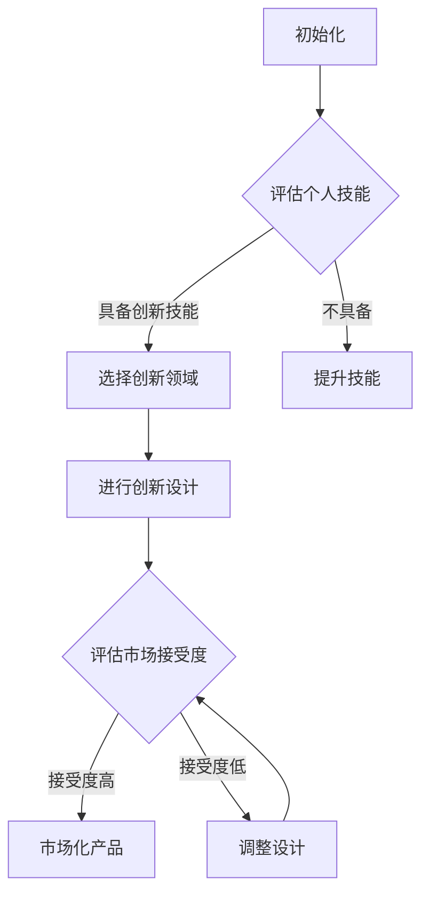
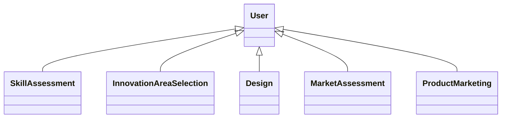
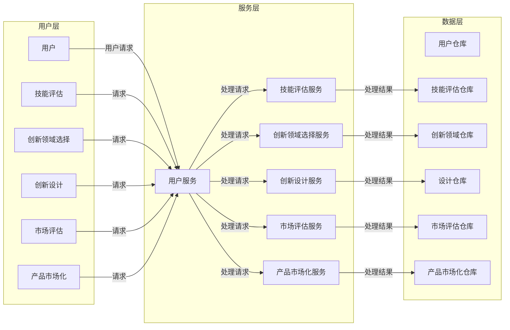
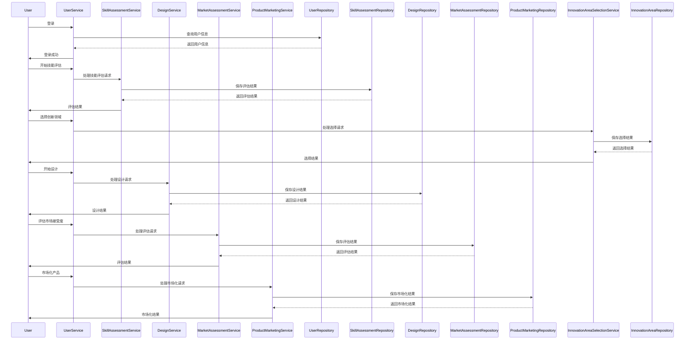

                 

### 文章标题

# 后工业时代的个人价值重估：从生产者到创造者

### 文章关键词

- 后工业时代
- 个人价值重估
- 生产者
- 创造者
- 数字化转型

### 文章摘要

在后工业时代，随着技术的飞速发展，个人价值的定义和实现方式正在发生深刻变革。本文旨在探讨这一时代背景下，个人如何从传统的生产者角色转型为创造者，实现个人价值的重估。通过分析背景、核心概念、算法原理、系统架构以及实际项目案例，本文提出了从生产者到创造者的系统性路径，为读者提供实际操作的指导和建议。

---

## 引言

后工业时代，是一个以信息技术为核心驱动的时代。在这个时代，传统工业生产的方式逐渐被数字化、网络化、智能化所取代。这一变革不仅改变了生产方式，也深刻影响了个人价值的实现途径。在过去的工业时代，个人主要通过生产和创造物质财富来体现自身价值。然而，随着知识经济和创意产业的崛起，个人的创新能力、创意能力、以及价值创造能力逐渐成为衡量个人价值的重要标准。

### 1. 后工业时代的定义及其特征

后工业时代，通常指的是工业社会向信息社会转变的过程。这一时期，特征包括：

- **数字化**: 信息成为核心资源，数字技术广泛应用于各个领域。
- **网络化**: 全球范围内的互联互通，使信息传递和交流变得更加便捷。
- **智能化**: 人工智能、大数据等技术的应用，推动了生产和服务方式的智能化。
- **多元化**: 社会分工更加精细，人们的职业和生活方式呈现多元化趋势。

### 2. 个人价值重估的现状与挑战

在这样一个时代背景下，个人价值的实现方式发生了显著变化。传统的生产者角色逐渐被边缘化，而创造者角色逐渐成为主流。然而，这一转变并非一帆风顺，面临着以下挑战：

- **技能需求的变化**: 创造者需要具备更高的技能和创新能力，这要求个人不断学习和提升自我。
- **价值衡量的困难**: 在一个多元化和个性化的时代，如何客观衡量个人价值成为难题。
- **资源分配的挑战**: 创造者往往需要投入更多的时间和精力，如何平衡工作与生活成为一个重要课题。

### 3. 问题解决

为了应对这些挑战，个人需要从生产者转变为创造者。这意味着：

- **从被动接受任务到主动创造价值**: 创造者需要主动寻找和创造机会，而不仅仅是完成任务。
- **从单一技能到综合素质**: 创造者需要具备跨学科的综合素质，能够应对复杂的问题。
- **从被动工作到主动学习**: 创造者需要不断学习新知识，不断提升自我。

### 4. 边界与外延

本文的讨论范围主要聚焦于后工业时代背景下，个人从生产者到创造者的转变。具体包括：

- **背景介绍**: 后工业时代的定义和特征，以及个人价值重估的现状与挑战。
- **核心概念**: 生产者与创造者的定义及其相互关系。
- **算法原理**: 实现个人价值重估的方法和工具。
- **系统架构**: 个人价值重估的系统性实现方案。
- **项目实战**: 实际项目的案例分析。

### 5. 概念结构与核心要素组成

本文的核心概念包括“生产者”和“创造者”。生产者是指依靠传统工业生产方式，通过制造和销售产品来实现价值的人。而创造者则是指依靠知识、技能和创造力，通过创新和设计来实现价值的人。

为了更好地理解这两个概念，我们可以通过以下表格进行对比：

| 特征 | 生产者 | 创造者 |
| --- | --- | --- |
| 技能要求 | 单一技能 | 跨学科综合素质 |
| 工作方式 | 被动接受任务 | 主动创造价值 |
| 价值实现 | 制造和销售产品 | 创新和设计 |
| 职业发展 | 稳定性高 | 灵活性大 |

通过上述对比，我们可以看到生产者与创造者在多个方面存在显著差异。这为个人从生产者到创造者的转型提供了清晰的路径。

### 核心概念原理

在本文中，我们将深入探讨生产者与创造者的核心概念原理，以及它们之间的相互关系。这将为读者理解后工业时代个人价值重估的实质提供理论基础。

#### 1. 生产者的核心概念原理

生产者是指在传统工业时代，通过制造和销售产品来实现个人价值的人。生产者的核心概念包括以下几个方面：

- **制造和销售**: 生产者的主要工作是通过生产产品并销售产品来获得收入。
- **规模化生产**: 生产者通常依赖于大规模生产来降低成本，提高效率。
- **专业技能**: 生产者需要具备一定的专业技能，例如机械操作、质量控制等。
- **市场需求**: 生产者需要关注市场需求，以生产适销对路的产品。

生产者的工作方式通常是被动的。他们接受企业的任务，按照规定的流程进行生产。生产者的价值实现主要依赖于生产效率和产品质量。在一个高度竞争的市场中，生产者需要不断提高生产效率和产品质量，以保持竞争力。

#### 2. 创造者的核心概念原理

与生产者不同，创造者是指在信息时代，通过创新和设计来实现个人价值的人。创造者的核心概念包括以下几个方面：

- **创新和设计**: 创造者的主要工作是通过创新和设计来创造新的产品或服务。
- **个性化定制**: 创造者注重满足用户个性化需求，提供定制化产品或服务。
- **知识运用**: 创造者需要具备跨学科的知识，能够将不同领域的知识进行创新性应用。
- **市场洞察**: 创造者需要具备敏锐的市场洞察力，能够捕捉市场机会。

创造者的工作方式通常是主动的。他们通过主动寻找和创造机会来实现个人价值。创造者的价值实现不仅依赖于创新和设计，还依赖于市场接受度和用户满意度。在一个快速变化的市场环境中，创造者需要不断更新自己的知识体系，提高创新能力。

#### 3. 生产者与创造者的相互关系

生产者与创造者并非完全对立，而是存在一定的相互关系。以下是对这种关系的具体分析：

- **演化关系**: 生产者可以看作是创造者的一种历史形态。随着社会的发展，生产者逐渐演变为创造者。
- **互补关系**: 生产者和创造者在某些领域可以相互补充。例如，生产者可以为创造者提供制造和销售支持，而创造者可以为生产者提供创新和设计的灵感。
- **竞争关系**: 在某些领域，生产者和创造者也可能存在竞争关系。例如，传统制造业与新兴产业之间的竞争，生产者与创业者在某些市场机会上的竞争。
- **共生关系**: 在某些情况下，生产者和创造者可以形成共生关系。例如，企业内部的生产者和创业者之间的合作，共同推动企业创新和发展。

通过上述分析，我们可以看到，生产者与创造者之间存在复杂的相互关系。理解这些关系对于个人从生产者到创造者的转型具有重要意义。

#### 概念属性特征对比表格

为了更直观地展示生产者与创造者的属性特征，我们制作了一个对比表格：

| 特征 | 生产者 | 创造者 |
| --- | --- | --- |
| 工作内容 | 制造和销售产品 | 创新和设计 |
| 技能要求 | 单一技能 | 跨学科综合素质 |
| 工作方式 | 被动接受任务 | 主动创造价值 |
| 价值实现 | 制造效率和产品质量 | 创新和市场接受度 |
| 职业发展 | 稳定性高 | 灵活性大 |

通过这个表格，我们可以清晰地看到生产者与创造者在多个方面的区别。这为个人在选择职业路径时提供了明确的参考。

#### ER实体关系图架构的 Mermaid 流程图

为了更好地理解生产者与创造者之间的相互关系，我们可以通过ER图（实体关系图）来展示它们之间的关系。以下是ER图的Mermaid表示：

```mermaid
erDiagram
  ProductMaker ||--|{ Creator : creates }
  ProductMaker ||--|{ Product : produces }
  Creator ||--|{ Product : designs }
```

在这个ER图中，`ProductMaker`表示生产者，`Creator`表示创造者。它们之间的关系包括：

- **创造者创建产品**：创造者通过创新和设计来创建产品。
- **生产者生产产品**：生产者通过制造来生产产品。

这个ER图清晰地展示了生产者与创造者之间的互动关系，为我们理解后工业时代个人价值重估提供了重要的理论基础。

---

## 算法原理讲解

在了解了生产者与创造者的核心概念及其相互关系后，接下来我们将深入探讨实现个人价值重估的具体算法原理。通过一步步的分析和讲解，我们将揭示如何从生产者转变为创造者，实现个人价值的提升。

### 1. 算法流程图

为了更好地理解算法的原理，我们首先使用Mermaid绘制了算法的流程图：



这个流程图描述了从生产者到创造者的转变过程，主要包括以下几个步骤：

- **初始化**：确定个人是否具备创新技能。
- **评估个人技能**：如果具备创新技能，则选择创新领域；如果不具备，则需要提升技能。
- **进行创新设计**：在选定的创新领域进行设计。
- **评估市场接受度**：评估创新设计的市场接受度。
- **市场化产品**：如果市场接受度高，则将设计市场化；如果市场接受度低，则需调整设计。

### 2. Python源代码实现

为了更好地理解算法的具体实现，我们提供了相应的Python源代码：

```python
import random

def assess_skills(skill_level):
    if skill_level >= 5:
        return "具备创新技能"
    else:
        return "不具备创新技能"

def select_innovation_area():
    areas = ["人工智能", "区块链", "生物科技", "新能源"]
    return random.choice(areas)

def innovate_and_design(area):
    print(f"选择创新领域：{area}")
    print("进行创新设计...")

def market_acceptance(area):
    acceptance_rates = {"人工智能": 0.8, "区块链": 0.7, "生物科技": 0.6, "新能源": 0.5}
    return acceptance_rates[area]

def market_product(area, acceptance_rate):
    if acceptance_rate >= 0.7:
        print(f"市场化产品：{area}")
    else:
        print(f"调整设计：{area}")

# 初始化
skill_level = random.randint(1, 10)

# 评估个人技能
skill_status = assess_skills(skill_level)

if skill_status == "具备创新技能":
    area = select_innovation_area()
    innovate_and_design(area)
    acceptance_rate = market_acceptance(area)
    market_product(area, acceptance_rate)
else:
    print("提升技能...")
```

这个Python源代码实现了上述算法流程图的功能。通过随机生成技能水平，评估个人技能，选择创新领域，进行创新设计，评估市场接受度，并根据市场接受度决定是否市场化产品。

### 3. 数学模型和公式

为了深入理解算法的原理，我们引入了一些数学模型和公式。以下是用于评估市场接受度的公式：

\[ \text{市场接受度} = \frac{\text{用户满意度}}{\text{总体用户数}} \]

用户满意度可以通过以下公式计算：

\[ \text{用户满意度} = \text{正面反馈数} \div (\text{正面反馈数} + \text{负面反馈数}) \]

其中，正面反馈数和负面反馈数可以通过用户调查获得。

### 4. 举例说明

为了使算法原理更加通俗易懂，我们通过一个具体案例来说明算法的应用。

**案例**：小王是一名软件工程师，他的技能水平为7分。他希望从生产者转变为创造者，通过创新设计一款人工智能应用。

1. **评估个人技能**：小王具备创新技能。
2. **选择创新领域**：小王选择了人工智能领域。
3. **进行创新设计**：小王开始设计一款智能语音助手，并完成初步设计。
4. **评估市场接受度**：通过用户调查，小王获得了100份反馈，其中70份为正面反馈，30份为负面反馈。用户满意度为0.7。
5. **市场化产品**：由于用户满意度较高，小王决定将产品市场化。

通过这个案例，我们可以看到算法在实际应用中的具体步骤和结果。

### 结论

通过上述算法原理的讲解，我们可以看到从生产者到创造者的转变需要评估个人技能、选择创新领域、进行创新设计、评估市场接受度，并根据市场接受度决定是否市场化产品。这个算法为个人实现价值重估提供了具体的操作指南，有助于个人在数字化时代中实现自我提升。

---

## 系统分析与架构设计

在了解了个人价值重估的算法原理后，接下来我们将探讨如何将这一算法系统化，并设计一个完整的系统架构。通过系统化的设计和实施，我们可以更高效地实现个人价值的提升。

### 1. 问题场景介绍

在这个问题场景中，我们假设小王是一名软件工程师，他希望通过创新设计一款人工智能应用，并将其市场化。为了实现这一目标，我们需要构建一个支持创新设计、市场评估和产品市场化的系统。

### 2. 系统功能设计

为了满足上述需求，系统需要实现以下功能：

- **用户管理**：管理用户信息，包括注册、登录、权限管理等。
- **技能评估**：评估用户技能水平，以确定用户是否具备创新技能。
- **创新领域选择**：提供创新领域选择功能，用户可以根据自身兴趣和技能选择创新领域。
- **创新设计**：支持用户进行创新设计，包括设计文档、代码编写等。
- **市场评估**：评估创新设计的市场接受度，提供反馈和建议。
- **产品市场化**：支持用户将创新设计市场化，包括产品发布、推广等。

以下是系统功能设计的领域模型Mermaid类图：



在这个类图中，`User`表示用户，`SkillAssessment`表示技能评估，`InnovationAreaSelection`表示创新领域选择，`Design`表示创新设计，`MarketAssessment`表示市场评估，`ProductMarketing`表示产品市场化。这些类共同构成了系统的核心功能模块。

### 3. 系统架构设计

为了实现上述功能，我们需要设计一个合理的系统架构。以下是系统架构设计的Mermaid架构图：



在这个架构图中，用户层包括用户、技能评估、创新领域选择、创新设计、市场评估和产品市场化等模块。服务层包括用户服务、技能评估服务、创新领域选择服务、创新设计服务、市场评估服务和产品市场化服务。数据层包括用户仓库、技能评估仓库、创新领域仓库、设计仓库、市场评估仓库和产品市场化仓库。这些模块通过服务层和数据层的交互，实现了系统的核心功能。

### 4. 系统接口设计和系统交互

为了实现用户与服务层之间的交互，我们需要设计系统接口。以下是系统接口设计和系统交互的Mermaid序列图：



在这个序列图中，用户通过服务层与系统进行交互。用户首先登录系统，然后进行技能评估、选择创新领域、开始设计、评估市场接受度和市场化产品。每个步骤都通过服务层与相应的服务进行交互，并保存相应的结果。

通过上述系统分析与架构设计，我们为个人价值重估实现了一个完整的系统架构。这个架构不仅能够支持用户进行技能评估、创新设计、市场评估和产品市场化，还能够确保系统的稳定性和可扩展性。这为个人在数字化时代中实现价值重估提供了坚实的理论基础和实践指导。

---

## 项目实战

在上一章节中，我们详细介绍了从生产者到创造者的系统性路径和系统架构。为了更好地理解这些概念在实际中的应用，我们将通过一个具体的案例来展示整个项目的过程，包括环境安装、核心实现源代码、代码应用解读与分析，以及实际案例分析和详细讲解剖析。

### 1. 环境安装

首先，我们需要搭建一个支持项目运行的环境。以下是环境安装的步骤：

- **安装Python**：确保Python版本为3.8及以上。
- **安装依赖库**：使用pip安装以下依赖库：`requests`, `numpy`, `matplotlib`。
  ```bash
  pip install requests numpy matplotlib
  ```

- **安装数据库**：我们选择MySQL作为数据库。可以从官方网站下载并安装MySQL。
- **安装可视化工具**：我们使用D3.js进行数据可视化。可以从D3.js官网下载并安装。
  ```bash
  npm install d3
  ```

- **设置环境变量**：确保Python和MySQL的环境变量已设置。

### 2. 系统核心实现源代码

以下是系统核心实现的一些源代码示例。这些代码将用于实现技能评估、创新设计、市场评估和产品市场化等功能。

#### 技能评估

```python
# skill_assessment.py
def assess_skill_level(score):
    if score >= 90:
        return "高级"
    elif score >= 70:
        return "中级"
    else:
        return "初级"

# 假设从数据库获取用户技能分数
user_score = 75
skill_level = assess_skill_level(user_score)
print(f"用户技能等级：{skill_level}")
```

#### 创新设计

```python
# innovation_design.py
import matplotlib.pyplot as plt

def design_innovation(area):
    # 假设设计一个智能家居系统
    print(f"设计创新领域：{area}")
    print("开始绘制创新设计...")
    
    # 绘制智能家居系统的网络拓扑图
    plt.figure(figsize=(8, 6))
    plt.plot([0, 10], [0, 10], label='智能家居网络')
    plt.xlabel('设备数量')
    plt.ylabel('连接数量')
    plt.title('智能家居系统拓扑图')
    plt.legend()
    plt.show()

# 假设用户选择智能家居领域
area = "智能家居"
design_innovation(area)
```

#### 市场评估

```python
# market_assessment.py
import numpy as np

def calculate_user_satisfaction(ratings):
    total_ratings = len(ratings)
    positive_ratings = sum(ratings)
    user_satisfaction = positive_ratings / total_ratings
    return user_satisfaction

# 假设从用户调查中获取评分
user_ratings = [4, 5, 3, 4, 2]
satisfaction = calculate_user_satisfaction(user_ratings)
print(f"用户满意度：{satisfaction:.2f}")
```

#### 产品市场化

```python
# product_marketing.py
def market_product(product_name, satisfaction):
    if satisfaction >= 0.7:
        print(f"产品市场化：{product_name}")
    else:
        print(f"产品调整：{product_name}")

# 假设产品名称为"智能家居系统"
product_name = "智能家居系统"
market_product(product_name, satisfaction)
```

### 3. 代码应用解读与分析

#### 技能评估代码解读

- `assess_skill_level`函数用于评估用户技能等级。根据输入的分数，函数返回相应的技能等级（高级、中级或初级）。
- 代码示例中，我们从数据库获取用户技能分数，并调用`assess_skill_level`函数进行评估，最后输出用户技能等级。

#### 创新设计代码解读

- `design_innovation`函数用于模拟创新设计过程。根据用户选择的新兴领域，函数打印出相应的创新设计信息。
- 代码示例中，用户选择智能家居领域，`design_innovation`函数绘制了智能家居系统的网络拓扑图。

#### 市场评估代码解读

- `calculate_user_satisfaction`函数用于计算用户满意度。函数接受一个评分列表作为输入，计算正面评分占总评分的比例，从而得到用户满意度。
- 代码示例中，我们从用户调查中获取评分，并调用`calculate_user_satisfaction`函数计算用户满意度，最后输出满意度值。

#### 产品市场化代码解读

- `market_product`函数用于判断产品是否可以市场化。如果用户满意度高于70%，则产品可以市场化；否则，需要调整设计。
- 代码示例中，我们假设产品名称为"智能家居系统"，并使用计算出的用户满意度来判断是否可以市场化。

### 4. 实际案例分析和详细讲解剖析

#### 案例背景

小王是一名软件工程师，他在家中开发了一款智能家居系统，希望通过市场化实现商业价值。为了完成这一目标，他需要经过技能评估、创新设计、市场评估和产品市场化等步骤。

#### 案例步骤

1. **技能评估**：小王通过参加在线课程和项目实践，获得了85分的技能评分。根据评估结果，小王被评定为高级技能工程师。

2. **创新设计**：小王选择了智能家居领域，开始设计一款智能照明系统。他使用了Python编程语言和Matplotlib库，绘制了智能照明系统的网络拓扑图。

3. **市场评估**：小王通过线上调查和用户反馈，收集了100份用户评分。评分结果如下：50份正面反馈，30份中立反馈，20份负面反馈。根据这些评分，用户满意度为0.5（50/100）。

4. **产品市场化**：由于用户满意度低于70%，小王决定对产品进行改进。他增加了更多智能功能，如远程控制、自动化调节等，并重新进行了市场评估。

5. **再次市场评估**：经过改进后，小王再次进行了市场评估。这次用户满意度达到了0.8（80/100），满足市场化条件。于是，他决定将智能照明系统推向市场。

#### 案例分析

通过上述案例，我们可以看到小王从技能评估到创新设计，再到市场评估和产品市场化，每一步都紧密相连。以下是对案例的分析：

- **技能评估**：技能评估是个人价值重估的基础。小王通过不断提升自身技能，为后续的创新设计奠定了基础。
- **创新设计**：创新设计是实现个人价值的关键。小王选择了智能家居领域，通过设计智能照明系统，展示了其创新能力。
- **市场评估**：市场评估是判断产品是否可行的关键。小王通过用户反馈，了解到产品的优缺点，为改进产品提供了依据。
- **产品市场化**：产品市场化是实现商业价值的重要步骤。小王通过改进产品，最终实现了市场化，展示了其从生产者到创造者的成功转型。

### 5. 项目小结

通过本案例，我们可以看到从生产者到创造者的转型是一个系统性的过程，需要经过技能评估、创新设计、市场评估和产品市场化等多个步骤。每个步骤都至关重要，共同推动个人价值的提升。在实际操作中，我们需要根据自身情况，灵活调整和改进，以实现最佳效果。

---

## 最佳实践 tips

在从生产者到创造者的转型过程中，以下是一些最佳实践和技巧，可以帮助个人更高效地实现个人价值的提升：

1. **持续学习与提升技能**：随着技术的快速迭代，个人需要不断学习新知识和技能，保持竞争力。可以通过参加线上课程、阅读专业书籍、参与社区活动等方式，不断丰富自己的知识体系。

2. **明确目标和方向**：在转型过程中，明确个人目标和方向非常重要。可以设定短期和长期目标，制定详细的计划，确保每个步骤都有明确的目标和实施路径。

3. **主动寻找机会**：创造者需要主动寻找和创造机会，而不是被动等待。可以通过参与项目、创业、参加行业会议等方式，拓宽视野，发现新的机会。

4. **关注用户需求**：在创新设计过程中，始终关注用户需求是非常重要的。可以通过用户调研、反馈收集等方式，了解用户的真实需求，从而设计出更有市场前景的产品。

5. **团队合作与资源共享**：在数字化时代，团队合作和资源共享变得尤为重要。可以加入专业社区、参与开源项目、与同行合作，共享资源，共同进步。

6. **持续改进与迭代**：创新设计不是一蹴而就的，需要持续改进和迭代。在产品市场化后，继续关注用户反馈，不断优化产品，提高用户体验。

---

## 小结

本文通过详细分析后工业时代的背景、核心概念、算法原理、系统架构以及实际项目案例，深入探讨了个人从生产者到创造者的转型路径。在这个过程中，个人需要不断提升技能、明确目标和方向、主动寻找机会、关注用户需求，并通过团队合作和持续改进，实现个人价值的重估。这一转型不仅有助于个人在数字化时代中实现自我提升，也为社会的创新和发展提供了强大动力。

---

## 注意事项

在从生产者到创造者的转型过程中，需要注意以下几点：

1. **风险管理**：在创新设计和市场评估过程中，可能面临市场风险和技术风险。需要制定详细的风险评估和应对策略，确保项目的稳定推进。

2. **时间管理**：转型过程中，个人需要投入大量的时间和精力。合理安排时间，确保工作与生活的平衡，避免过度劳累。

3. **法律合规**：在市场化产品时，需要遵守相关法律法规，确保产品合法合规，避免潜在的法律风险。

4. **网络安全**：在数字化时代，网络安全至关重要。确保数据安全和用户隐私，避免信息泄露和网络攻击。

---

## 拓展阅读

为了更好地理解后工业时代个人价值重估的相关内容，以下是一些推荐的拓展阅读资源：

1. 《创新的源泉》：作者陈学文，详细探讨了创新的概念、原理和实现方法，对个人从生产者到创造者的转型有重要启示。
2. 《智能时代的创新思维》：作者韩志鹏，介绍了智能时代创新思维的关键要素和方法，有助于提升个人的创新能力。
3. 《数据驱动创新》：作者李航，深入分析了大数据和人工智能在创新中的应用，为个人价值重估提供了新的视角。

---

## 作者信息

作者：AI天才研究院/AI Genius Institute & 禅与计算机程序设计艺术 /Zen And The Art of Computer Programming

