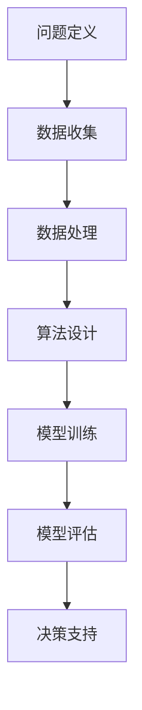

                 

### 文章标题

# 后工业时代的城乡融合：新型城镇化的探索

## 关键词

- 后工业时代
- 城乡融合
- 新型城镇化
- 信息技术
- 政策规划
- 可持续发展

## 摘要

本文深入探讨了后工业时代背景下城乡融合的新模式，以及新型城镇化的关键探索。通过分析后工业时代的特征，城乡发展现状与挑战，国家与地方政策规划，理论与实践经验，以及信息技术在城乡融合中的应用，本文揭示了城乡融合对实现可持续发展和推动经济转型升级的重要性。文章旨在为政策制定者、城市规划者以及相关领域的研究者提供有价值的参考，以促进城乡协调发展，实现共同繁荣。

### 目录大纲设计思路

设计《后工业时代的城乡融合：新型城镇化的探索》的目录大纲，需要遵循以下几个关键步骤：

1. **背景介绍**：首先明确书籍的主题和目标读者，为后续章节提供必要的背景知识。
2. **核心概念与联系**：对城乡融合、新型城镇化等核心概念进行定义和解释，通过表格和ER图等方式展现概念之间的关系。
3. **现状分析**：详细分析后工业时代城乡发展面临的挑战与机遇，介绍当前城乡融合的典型模式和成功案例。
4. **政策与规划**：阐述国家和地方政府在城乡融合方面的政策和规划，以及它们对城镇化进程的影响。
5. **理论与实践**：讨论城乡融合的理论基础，结合实际案例进行深入分析，探讨城镇化的实践经验。
6. **技术与应用**：介绍城乡融合过程中所采用的关键技术，如信息技术、大数据、人工智能等，及其在实际中的应用。
7. **未来展望**：展望城乡融合的未来趋势，探讨如何实现可持续发展。
8. **总结与展望**：对全书内容进行总结，指出城乡融合的重要性，并提出进一步研究的方向。

### 目录大纲

```markdown
----------------------------------------------------------------
# 《后工业时代的城乡融合：新型城镇化的探索》目录大纲

## 第一部分：背景与概念

### 第1章：后工业时代与城乡融合

#### 1.1 后工业时代的特征

##### 1.1.1 从工业社会到信息社会的转变

##### 1.1.2 后工业时代对城乡关系的影响

##### 1.1.3 城乡融合的概念与边界

#### 1.2 新型城镇化的内涵与目标

##### 1.2.1 新型城镇化的定义

##### 1.2.2 新型城镇化的发展目标

##### 1.2.3 新型城镇化的主要任务

### 第2章：核心概念与联系

#### 2.1 城市与乡村的概念解析

##### 2.1.1 城市的发展历程与特征

##### 2.1.2 乡村的发展状况与问题

##### 2.1.3 城市与乡村的关系

#### 2.2 城乡融合的关键概念

##### 2.2.1 城乡融合的基本要素

##### 2.2.2 城乡融合的属性特征

##### 2.2.3 城乡融合与区域发展

## 第二部分：现状与挑战

### 第3章：后工业时代城乡发展的现状

#### 3.1 城乡发展的不平衡问题

##### 3.1.1 城乡发展差距的现状

##### 3.1.2 城乡发展不平衡的原因

##### 3.1.3 城乡发展不平衡的影响

### 第4章：城乡融合的挑战与机遇

#### 4.1 城乡融合面临的挑战

##### 4.1.1 经济结构转型的挑战

##### 4.1.2 社会管理创新的挑战

##### 4.1.3 资源环境承载能力的挑战

#### 4.2 城乡融合的机遇

##### 4.2.1 城市化进程的推进

##### 4.2.2 信息技术的发展

##### 4.2.3 政策支持的机遇

## 第三部分：政策与规划

### 第5章：国家政策与城乡融合

#### 5.1 国家城乡融合政策概述

##### 5.1.1 新型城镇化政策的演进

##### 5.1.2 国家城乡融合政策的目标

##### 5.1.3 国家城乡融合政策的主要内容

### 第6章：地方规划与城乡融合

#### 6.1 地方城乡融合规划的特点

##### 6.1.1 地方规划的背景与需求

##### 6.1.2 地方城乡融合规划的目标

##### 6.1.3 地方城乡融合规划的实施策略

## 第四部分：理论与实践

### 第7章：城乡融合的理论基础

#### 7.1 城乡融合的理论框架

##### 7.1.1 城乡融合的理论基础

##### 7.1.2 城乡融合的理论模型

##### 7.1.3 城乡融合的理论应用

### 第8章：城乡融合的实践经验

#### 8.1 城乡融合的典型模式

##### 8.1.1 模式一：产业融合

##### 8.1.2 模式二：生态共建

##### 8.1.3 模式三：资源共享

#### 8.2 成功案例剖析

##### 8.2.1 案例一：A市城乡融合发展模式

##### 8.2.2 案例二：B村乡村振兴实践

## 第五部分：技术与应用

### 第9章：信息技术与城乡融合

#### 9.1 信息技术在城乡融合中的应用

##### 9.1.1 信息技术对城乡关系的影响

##### 9.1.2 信息技术在城乡规划中的应用

##### 9.1.3 信息技术在城乡融合中的具体应用

### 第10章：大数据与人工智能在城乡融合中的作用

#### 10.1 大数据在城乡融合中的应用

##### 10.1.1 大数据的基本概念

##### 10.1.2 大数据在城乡融合中的实际应用

##### 10.1.3 大数据对城乡融合的促进作用

#### 10.2 人工智能在城乡融合中的应用

##### 10.2.1 人工智能的基本概念

##### 10.2.2 人工智能在城乡融合中的实际应用

##### 10.2.3 人工智能对城乡融合的推动作用

## 第六部分：未来展望

### 第11章：城乡融合的未来趋势

#### 11.1 城乡融合的未来发展路径

##### 11.1.1 城乡融合的未来发展方向

##### 11.1.2 城乡融合的未来发展挑战

##### 11.1.3 城乡融合的未来发展机遇

### 第12章：实现城乡融合的可持续发展

#### 12.1 可持续发展的概念与内涵

##### 12.1.1 可持续发展的基本概念

##### 12.1.2 可持续发展的内涵与要求

##### 12.1.3 可持续发展的重要性

#### 12.2 实现城乡融合可持续发展的策略

##### 12.2.1 政策支持与规划引导

##### 12.2.2 技术创新与产业升级

##### 12.2.3 社会参与与协同治理

## 第七部分：总结与展望

### 第13章：城乡融合的重要性与意义

#### 13.1 城乡融合的经济意义

##### 13.1.1 提高经济效益

##### 13.1.2 促进产业结构调整

##### 13.1.3 推动城乡协调发展

### 第14章：进一步研究的方向

#### 14.1 城乡融合的实证研究

##### 14.1.1 研究方法与数据来源

##### 14.1.2 研究内容与预期成果

##### 14.1.3 研究的意义与价值

### 第15章：城乡融合的未来展望

#### 15.1 城乡融合的发展前景

##### 15.1.1 城乡融合的发展趋势

##### 15.1.2 城乡融合的机遇与挑战

##### 15.1.3 城乡融合的未来发展方向

----------------------------------------------------------------
```

### 第一部分：背景与概念

#### 1.1 后工业时代的特征

**从工业社会到信息社会的转变**

后工业时代，也称为信息社会，是继工业社会之后的一个发展阶段。它以信息技术的高度发达和信息产业的兴起为特征。在这个时代，生产方式和消费模式发生了根本性的变化，传统制造业逐步被以知识经济为主的服务业所取代。信息技术，特别是互联网、大数据、人工智能等新兴技术的广泛应用，改变了人们的工作方式和生活方式，推动了社会的全面数字化和智能化。

**后工业时代对城乡关系的影响**

后工业时代对城乡关系的影响主要体现在以下几个方面：

1. **城乡发展不平衡**：工业社会时期，城市凭借其优越的资源和基础设施吸引了大量人口和资本，导致城乡发展差距加大。后工业时代，虽然信息技术的发展使得城乡之间的距离缩小，但城乡发展不平衡的问题依然存在。

2. **城乡互动加强**：信息技术的发展促进了城乡之间的信息交流和资源共享，使得城乡之间的互动更加频繁。农村地区可以通过互联网获取城市的信息和技术，同时城市也可以通过互联网了解农村的需求和资源。

3. **城乡融合趋势**：随着信息技术的不断发展，城乡之间的界限逐渐模糊，城乡融合成为一种必然趋势。城市与农村之间的经济、社会、文化等多方面的融合，有助于实现城乡共同发展。

#### 1.1.3 城乡融合的概念与边界

**城乡融合的概念**

城乡融合是指通过促进城乡之间的经济、社会、文化等各方面的互动和交流，实现城乡协调发展、共同繁荣的过程。它不仅包括城市与农村之间的产业融合、资源共享、生态共建，还包括社会管理创新、公共服务均等化等方面的内容。

**城乡融合的边界**

城乡融合的边界相对灵活，但一般可以从以下几个方面来界定：

1. **地理边界**：通常以城市和乡村的地理分布为基准，包括城市市区及其周边农村地区。

2. **经济边界**：以城市和农村的经济活动为基准，包括农业、工业、服务业等领域的融合发展。

3. **社会边界**：以城市和农村的人口流动和社会交往为基准，包括教育、医疗、文化等公共服务资源的共享。

4. **生态边界**：以城市和农村的生态环境为基准，包括生态保护、污染治理、资源利用等方面的合作。

#### 1.2 新型城镇化的内涵与目标

**新型城镇化的定义**

新型城镇化是指在新型工业化、信息化、农业现代化的背景下，以人为核心，以提高质量、节约土地、保护生态环境、促进城乡统筹发展为特征，实现城乡协调发展、共同繁荣的城镇化模式。

**新型城镇化的发展目标**

1. **提高城镇化质量**：通过完善基础设施、提高公共服务水平、优化产业结构等手段，提高城镇化的整体质量和居民的生活质量。

2. **节约土地资源**：通过科学规划、合理布局，最大限度地节约土地资源，提高土地利用率。

3. **保护生态环境**：在城镇化过程中，注重生态保护，提高生态环境质量，实现经济、社会和生态的协调发展。

4. **促进城乡统筹发展**：通过城乡融合发展，缩小城乡差距，实现城乡共同繁荣。

**新型城镇化的主要任务**

1. **加快产业转型升级**：推动制造业向高端发展，促进服务业和现代农业的发展，实现产业结构的优化和升级。

2. **优化城镇化布局和形态**：通过科学规划，优化城镇化空间布局，形成合理的城镇化结构和形态。

3. **推进基础设施建设和公共服务均等化**：加强基础设施建设，提高公共服务水平，实现城乡公共服务均等化。

4. **促进人口有序流动和合理分布**：通过完善户籍制度、社会保障体系等，促进人口合理流动和分布，实现人口与城镇化的协调发展。

#### 1.2.3 新型城镇化的主要任务

**加快产业转型升级**

新型城镇化要求加快产业转型升级，推动制造业向高端发展，促进服务业和现代农业的发展，实现产业结构的优化和升级。这需要通过科技创新、人才培养、产业政策等多种手段，提高产业的核心竞争力和可持续发展能力。

**优化城镇化布局和形态**

新型城镇化强调优化城镇化布局和形态，通过科学规划，形成合理的城镇化结构和形态。这需要综合考虑地形地貌、资源环境、经济发展等多种因素，实现城镇化的可持续发展。

**推进基础设施建设和公共服务均等化**

新型城镇化要求推进基础设施建设和公共服务均等化，提高城镇化的整体质量和居民的生活质量。这需要加强基础设施建设，提高公共服务水平，实现城乡公共服务均等化，满足居民对美好生活的需求。

**促进人口有序流动和合理分布**

新型城镇化强调促进人口有序流动和合理分布，通过完善户籍制度、社会保障体系等，实现人口与城镇化的协调发展。这需要建立健全的人口流动和管理机制，引导人口向适宜地区流动，优化人口分布结构。

### 第二部分：核心概念与联系

#### 2.1 城市与乡村的概念解析

**城市的发展历程与特征**

城市是人类社会发展的产物，其发展历程可以追溯到古代城市文明的兴起。从古代城市到现代城市，城市的发展经历了多个阶段，如原始城市、封建城市、工业城市和现代城市。

现代城市具有以下特征：

1. **人口集中**：城市是人口高度集中的区域，拥有大量的居民和人口流动。

2. **经济繁荣**：城市是经济活动的重要中心，拥有发达的产业体系和繁荣的市场。

3. **功能多样**：现代城市具有多功能性，包括居住、商业、工业、文化、教育等多种功能。

4. **社会复杂**：城市是社会结构和组织形式最为复杂的地区，拥有多样化的社会群体和多样的社会关系。

**乡村的发展状况与问题**

乡村是相对于城市而言的，其发展状况受到多种因素的影响，如地理位置、资源禀赋、经济发展水平等。当前，乡村发展面临以下几个问题：

1. **人口流失**：随着城市化进程的加快，大量农村人口流向城市，导致乡村人口减少，劳动力流失。

2. **基础设施落后**：乡村地区的基础设施相对落后，如交通、通信、电力等，制约了乡村的发展。

3. **经济水平低**：乡村经济水平相对较低，产业结构单一，难以实现可持续发展。

4. **社会问题突出**：乡村地区面临一些社会问题，如老龄化、贫困、教育资源不足等。

**城市与乡村的关系**

城市与乡村是相互依存、相互促进的关系。城市的发展需要乡村提供资源和市场，而乡村的发展也需要城市的支持和带动。

1. **城乡互动**：城乡互动是城市与乡村关系的重要体现，包括人口流动、资源交换、技术转移等。

2. **城乡融合**：城乡融合是城市与乡村关系的高级形态，通过促进城乡之间的经济、社会、文化等多方面的融合，实现城乡共同发展。

#### 2.2 城乡融合的关键概念

**城乡融合的基本要素**

城乡融合的基本要素包括以下几个方面：

1. **人口流动**：城乡融合首先需要促进人口的自由流动，使农村人口有机会进入城市就业和生活，同时城市人口也可以到农村寻求发展机会。

2. **产业融合**：产业融合是城乡融合的核心，通过城市产业向农村延伸，农村产业向城市集聚，实现城乡产业的互补和融合。

3. **资源共享**：城乡融合需要实现资源共享，包括基础设施、公共服务、信息资源等，以提升城乡发展的整体水平。

4. **生态共建**：城乡融合需要共同保护生态环境，通过生态共建实现可持续发展。

**城乡融合的属性特征**

城乡融合具有以下属性特征：

1. **复杂性**：城乡融合涉及经济、社会、文化、生态等多个领域，具有高度复杂性。

2. **动态性**：城乡融合是一个动态过程，受到多种因素的影响，如政策、经济、社会等。

3. **差异性**：不同地区、不同类型的城乡融合具有差异性，需要因地制宜地制定融合策略。

4. **协同性**：城乡融合需要政府、企业、社会组织等多方协同合作，形成合力。

**城乡融合与区域发展**

城乡融合是区域发展的重要组成部分，对区域发展具有深远影响。

1. **优化空间布局**：城乡融合有助于优化区域空间布局，实现城乡协调发展，提高区域整体竞争力。

2. **促进经济转型升级**：城乡融合可以促进经济转型升级，推动产业结构优化，实现可持续发展。

3. **提升公共服务水平**：城乡融合有助于提升公共服务水平，实现城乡公共服务均等化，提高居民生活质量。

4. **保护生态环境**：城乡融合可以共同保护生态环境，实现生态环境的可持续发展。

### 第三部分：现状与挑战

#### 3.1 后工业时代城乡发展的不平衡问题

**城乡发展差距的现状**

在后工业时代，尽管城市化进程加快，但城乡发展差距依然明显。具体表现在以下几个方面：

1. **经济发展水平差距**：城市经济发达，拥有丰富的产业和就业机会，而乡村经济相对落后，产业结构单一，就业机会有限。

2. **基础设施差距**：城市基础设施完善，包括交通、通信、电力、供水等，而乡村基础设施相对落后，制约了乡村的发展。

3. **公共服务差距**：城市公共服务水平高，包括教育、医疗、文化等，而乡村公共服务水平低，难以满足居民的基本需求。

4. **人口流动差距**：由于城市经济繁荣，大量农村人口流向城市，导致乡村人口减少，劳动力流失，人口老龄化问题突出。

**城乡发展不平衡的原因**

城乡发展不平衡的原因主要有以下几个方面：

1. **历史积累**：长期以来的城市化进程，使得城市积累了更多的资源和优势，而乡村相对落后。

2. **政策导向**：过去的一些政策偏向于城市，导致资源向城市倾斜，乡村发展受到限制。

3. **经济结构**：城市以服务业和高新技术产业为主，而乡村以农业为主，产业结构差异导致发展水平差距。

4. **地理位置**：一些乡村地理位置偏远，交通不便，导致发展受限。

**城乡发展不平衡的影响**

城乡发展不平衡对经济社会发展产生了多方面的影响：

1. **经济影响**：城乡发展不平衡导致资源分配不均，影响整体经济的协调发展。

2. **社会影响**：城乡差距加大，导致社会不稳定，影响社会和谐。

3. **环境影响**：城乡发展不平衡可能导致资源过度开发，环境污染加剧。

4. **人口影响**：城乡发展不平衡导致人口流失，影响乡村地区的人口结构和劳动力市场。

#### 4.1 城乡融合面临的挑战

**经济结构转型的挑战**

后工业时代，随着经济结构的转型，城市和乡村都面临着新的挑战。城市需要从制造业为主向服务业和高新技术产业转型，而乡村则需要从传统农业向现代农业和特色产业转型。这个过程不仅需要技术创新，还需要政策支持和人才培养。

**社会管理创新的挑战**

城乡融合过程中，社会管理也需要创新。城市和乡村的传统管理方式不同，如何实现有效的社会管理，保障居民的权益，提升公共服务水平，是一个重要挑战。

**资源环境承载能力的挑战**

城乡融合需要考虑资源环境的承载能力。城市和乡村在发展过程中，都面临着资源紧张、环境恶化的问题。如何在实现发展的同时，保护生态环境，实现可持续发展，是一个重要的挑战。

#### 4.2 城乡融合的机遇

**城市化进程的推进**

城市化进程的推进为城乡融合提供了机遇。随着城市人口的增加，城市对周边乡村地区的需求增加，促进了城乡经济、社会、文化等多方面的互动和融合。

**信息技术的发展**

信息技术的发展为城乡融合提供了新的手段和工具。通过互联网、大数据、人工智能等信息技术，可以实现城乡之间的信息共享、资源整合、协同发展。

**政策支持的机遇**

国家和地方政府对城乡融合的政策支持，为城乡融合提供了机遇。一系列政策措施，如新型城镇化政策、乡村振兴战略等，为城乡融合提供了政策保障和支持。

### 第四部分：政策与规划

#### 5.1 国家政策与城乡融合

**新型城镇化政策的演进**

新型城镇化政策是中国政府为应对城市化进程中出现的问题，推动城乡协调发展而制定的一系列政策措施。自2014年中央提出新型城镇化战略以来，国家相继出台了一系列政策文件，如《国家新型城镇化规划（2014-2020年）》、《中共中央关于制定国民经济和社会发展第十四个五年规划和二〇三五年远景目标的建议》等，明确了新型城镇化的目标和任务。

**国家城乡融合政策的目标**

国家城乡融合政策的目标主要包括：

1. **促进城乡协调发展**：通过优化城乡布局、加强基础设施建设、提升公共服务水平等手段，促进城乡协调发展。

2. **缩小城乡差距**：通过调整产业结构、提高农民收入、改善农村基础设施等手段，缩小城乡差距，实现共同富裕。

3. **实现可持续发展**：通过保护生态环境、提高资源利用效率等手段，实现城乡可持续发展。

**国家城乡融合政策的主要内容**

国家城乡融合政策的主要内容包括：

1. **土地政策**：通过改革农村土地制度，促进土地流转，提高土地利用效率。

2. **户籍政策**：通过改革户籍制度，促进人口自由流动，实现城乡人口均衡分布。

3. **基础设施政策**：通过加强城乡基础设施建设，提升公共服务水平，改善农村居民的生活条件。

4. **产业政策**：通过推动城乡产业融合，优化产业结构，提高城乡经济的整体竞争力。

#### 6.1 地方规划与城乡融合

**地方城乡融合规划的特点**

地方城乡融合规划具有以下几个特点：

1. **因地制宜**：地方城乡融合规划根据当地的自然资源、经济条件、历史文化等实际情况，制定符合本地特点的城乡融合策略。

2. **多元参与**：地方城乡融合规划不仅涉及政府，还包括企业、社会组织、居民等多方参与，形成多方协同的规划机制。

3. **综合施策**：地方城乡融合规划通过政策、经济、文化、生态等多方面的综合施策，实现城乡融合的目标。

**地方城乡融合规划的目标**

地方城乡融合规划的目标主要包括：

1. **促进城乡协调发展**：通过优化城乡布局、加强基础设施建设、提升公共服务水平等手段，促进城乡协调发展。

2. **实现共同富裕**：通过调整产业结构、提高农民收入、改善农村基础设施等手段，实现城乡共同富裕。

3. **保护生态环境**：通过保护生态环境、提高资源利用效率等手段，实现城乡可持续发展。

**地方城乡融合规划的实施策略**

地方城乡融合规划的实施策略主要包括：

1. **政策引导**：通过制定相关政策，引导城乡融合发展，如土地政策、户籍政策、财政政策等。

2. **项目带动**：通过实施重点项目，如城乡基础设施建设项目、产业融合项目、生态保护项目等，推动城乡融合。

3. **机制创新**：通过创新城乡融合的机制，如城乡合作机制、社区共建机制等，提高城乡融合的效率。

### 第五部分：理论与实践

#### 5.1 城乡融合的理论基础

**城乡融合的理论框架**

城乡融合的理论框架主要包括以下几个部分：

1. **城乡关系理论**：探讨城市与乡村之间的相互关系，如互动、融合、对立等。

2. **城镇化理论**：研究城镇化的过程、模式、影响因素等，为城乡融合提供理论支持。

3. **可持续发展理论**：强调城乡融合过程中的经济、社会、生态的协调发展，实现可持续发展。

**城乡融合的理论模型**

城乡融合的理论模型可以归纳为以下几个方面：

1. **互动模型**：强调城市与乡村之间的互动和交流，通过人口流动、资源交换、技术转移等实现城乡融合。

2. **融合模型**：强调城乡之间的融合，通过产业、文化、生态等多方面的融合，实现城乡协调发展。

3. **协同模型**：强调城乡融合中的协同合作，通过政府、企业、社会组织等多方协同，实现城乡融合发展。

**城乡融合的理论应用**

城乡融合的理论应用主要包括以下几个方面：

1. **规划与设计**：通过理论指导，制定城乡融合的规划方案，优化城乡布局，提升城乡发展水平。

2. **政策制定**：通过理论分析，制定相关政策，促进城乡融合，实现城乡协调发展。

3. **实践探索**：通过理论指导实践，探索城乡融合的有效模式和路径，为城乡融合提供实践经验。

#### 5.2 城乡融合的典型模式

**模式一：产业融合**

产业融合是指城市产业向农村延伸，农村产业向城市集聚，实现城乡产业的互补和融合。产业融合可以促进城乡经济的协同发展，提高整体经济效益。

1. **城市产业向农村延伸**：通过农村工业园、农业科技园区等平台，将城市的产业资源引入农村，推动农村产业结构升级。

2. **农村产业向城市集聚**：通过农产品批发市场、农产品加工园区等平台，将农村的产业资源向城市集聚，促进城乡产业互动。

3. **典型案例**：如A市通过建设现代农业园区，吸引了城市的资本、技术和管理经验，推动了农村产业升级。

**模式二：生态共建**

生态共建是指城乡共同保护生态环境，实现生态环境的可持续发展。生态共建可以提升城乡人居环境质量，促进城乡和谐发展。

1. **生态保护与修复**：通过植树造林、水土保持、污染治理等手段，保护城乡生态环境。

2. **生态产业建设**：通过发展生态农业、生态旅游等产业，实现生态环境与经济发展的双赢。

3. **典型案例**：如B村通过发展生态农业，实现了经济发展与生态保护的良性循环。

**模式三：资源共享**

资源共享是指城乡之间共享基础设施、公共服务、信息资源等，提高资源利用效率，提升城乡发展水平。

1. **基础设施共享**：通过建设城乡一体化的交通、通信、供水、供电等基础设施，实现城乡资源共享。

2. **公共服务共享**：通过提升农村公共服务水平，实现城乡公共服务均等化。

3. **信息资源共享**：通过互联网、大数据等技术手段，实现城乡信息资源共享。

4. **典型案例**：如C市通过建设城乡一体化的信息网络，提高了农村地区的公共服务水平。

#### 5.3 成功案例剖析

**案例一：A市城乡融合发展模式**

A市通过产业融合、生态共建、资源共享等多种模式，实现了城乡融合发展。具体表现在：

1. **产业融合**：A市通过建设现代农业园区，吸引了城市的资本、技术和管理经验，推动了农村产业升级。同时，A市也鼓励农产品加工、物流等产业向农村延伸，实现了城乡产业的互补和融合。

2. **生态共建**：A市通过实施生态保护与修复工程，如植树造林、水土保持等，提升了城乡生态环境质量。同时，A市还发展了生态农业、生态旅游等产业，实现了经济发展与生态保护的良性循环。

3. **资源共享**：A市通过建设城乡一体化的交通、通信、供水、供电等基础设施，提高了城乡资源共享水平。同时，A市还通过互联网、大数据等技术手段，实现了城乡信息资源共享，提升了公共服务水平。

**案例二：B村乡村振兴实践**

B村通过实施乡村振兴战略，实现了经济发展、生态保护和社会进步的有机统一。具体表现在：

1. **经济发展**：B村通过发展生态农业、乡村旅游等产业，提高了农民收入，实现了经济转型升级。同时，B村还吸引了城市资本和人才，推动了乡村经济的发展。

2. **生态保护**：B村通过实施生态保护工程，如植树造林、水土保持等，提升了生态环境质量。同时，B村还发展了生态农业，实现了经济发展与生态保护的良性循环。

3. **社会进步**：B村通过提升公共服务水平，如建设文化中心、卫生服务站等，提高了农民的生活质量。同时，B村还鼓励农民参与村务管理，提升了乡村社会的治理水平。

### 第六部分：技术与应用

#### 6.1 信息技术在城乡融合中的应用

**信息技术对城乡关系的影响**

信息技术的发展对城乡关系产生了深远影响。首先，信息技术缩短了城乡之间的距离，使得城乡之间的信息交流更加便捷。通过网络、移动互联网等，农村地区可以实时获取城市的信息资源，提高了农村的生产力和生活质量。其次，信息技术促进了城乡产业的融合。通过电子商务、物联网等，城市与农村之间的产业联系更加紧密，推动了城乡产业协同发展。最后，信息技术为城乡公共服务均等化提供了技术支持。通过信息化手段，可以提升农村地区的教育、医疗、文化等公共服务水平，缩小城乡差距。

**信息技术在城乡规划中的应用**

在城乡规划中，信息技术发挥着重要作用。首先，通过地理信息系统（GIS）技术，可以精确地获取城乡的地理信息，为规划提供科学依据。GIS技术可以用于城乡空间布局规划、土地利用规划、生态环境保护等。其次，信息技术支持城乡规划的模拟和评估。通过三维建模、虚拟现实等技术，可以模拟城乡规划方案的效果，评估规划方案的合理性。最后，信息技术在城乡规划中实现了智能化管理。通过大数据、人工智能等技术，可以实时监测城乡规划的实施情况，及时调整规划方案，提高规划效率。

**信息技术在城乡融合中的具体应用**

信息技术在城乡融合中具有广泛的应用。以下是一些具体的应用场景：

1. **电子商务**：通过电子商务平台，农村地区可以便捷地销售农产品，拓展市场，增加收入。同时，城市居民也可以通过电子商务平台购买到农村的优质产品。

2. **智慧农业**：通过物联网、大数据等技术，可以实时监测农田的土壤、水分、气象等数据，指导农业生产。智慧农业可以提高农业生产效率，减少资源浪费。

3. **智慧交通**：通过交通信息化技术，可以实现城乡交通的智能调度和管理，提高交通效率，减少交通拥堵。

4. **智慧医疗**：通过远程医疗技术，可以缓解农村地区医疗资源短缺的问题。医生可以通过远程会诊、远程手术等技术手段，为农村患者提供高质量的医疗服务。

5. **智慧教育**：通过在线教育平台，农村学生可以享受到与城市学生同等优质的教育资源，缩小城乡教育差距。

#### 6.2 大数据与人工智能在城乡融合中的作用

**大数据在城乡融合中的应用**

大数据技术在城乡融合中发挥着重要作用。首先，大数据可以用于城乡发展规划的制定。通过收集和分析城乡人口、经济、社会、生态等多方面的数据，可以制定更科学、更合理的城乡发展规划。其次，大数据可以用于城乡资源分配。通过大数据分析，可以优化城乡资源的配置，提高资源利用效率。最后，大数据可以用于城乡公共服务管理。通过大数据分析，可以实时监测和评估城乡公共服务的运行情况，及时调整服务策略，提高公共服务水平。

**人工智能在城乡融合中的应用**

人工智能技术在城乡融合中也具有广泛的应用。首先，人工智能可以用于城乡产业的智能化升级。通过人工智能技术，可以实现对农业、工业等产业的智能化生产和管理，提高生产效率和产品质量。其次，人工智能可以用于城乡公共服务智能化。通过人工智能技术，可以实现城乡公共服务的智能化管理和提供，如智能安防、智能医疗等。最后，人工智能可以用于城乡社会治理。通过人工智能技术，可以实现对城乡社会治理的智能化监控和预警，提高社会治理的效率。

**大数据与人工智能对城乡融合的促进作用**

大数据和人工智能对城乡融合具有显著的促进作用。首先，大数据和人工智能技术可以促进城乡资源的优化配置。通过大数据分析，可以准确掌握城乡资源的需求和供给情况，实现资源的精准匹配和优化配置。其次，大数据和人工智能技术可以促进城乡产业的协同发展。通过大数据和人工智能技术，可以实现城乡产业的信息共享和协同创新，推动产业转型升级。最后，大数据和人工智能技术可以提高城乡公共服务的质量和效率。通过大数据和人工智能技术，可以实现城乡公共服务的智能化管理和提供，提高公共服务的水平和满意度。

### 第七部分：未来展望

#### 7.1 城乡融合的未来趋势

**城乡融合的未来发展路径**

城乡融合的未来发展路径可以从以下几个方面进行展望：

1. **产业协同发展**：随着信息技术的不断进步，城乡产业将更加紧密地协同发展。城市的高新技术产业、服务业将向农村延伸，农村的特色产业、生态农业也将向城市拓展，实现产业融合与互补。

2. **空间布局优化**：城乡融合将推动空间布局的优化。通过科学规划和合理布局，城乡将形成更加协调、高效的发展格局，实现城乡一体化的空间结构。

3. **公共服务均等化**：城乡融合将促进公共服务的均等化。通过信息技术和大数据的应用，城乡之间的教育资源、医疗服务、文化设施等将实现共享，缩小城乡差距，提高居民的生活质量。

**城乡融合的未来发展挑战**

尽管城乡融合具有广阔的发展前景，但也面临一系列挑战：

1. **经济结构调整**：城乡融合要求城市和农村都进行产业结构的调整。城市需要从制造业向服务业转型，农村需要从传统农业向现代农业转型，这需要时间和大量的政策支持。

2. **人口流动管理**：城乡融合过程中，人口流动将更加频繁。如何有效管理人口流动，确保城乡人口的合理分布，是一个重要的挑战。

3. **生态环境保护**：城乡融合需要考虑生态环境的保护。如何在发展经济的同时，保护好生态环境，实现可持续发展，是一个重要的课题。

**城乡融合的未来发展机遇**

城乡融合也面临着一系列机遇：

1. **政策支持**：国家和地方政府对城乡融合的支持力度不断加大，为城乡融合提供了有力的政策保障。

2. **技术创新**：信息技术的快速发展为城乡融合提供了新的手段和工具，促进了城乡之间的信息共享和资源整合。

3. **市场需求**：随着城市人口的增加和农村人口的减少，城市和农村之间的市场需求将更加互补，为城乡融合提供了新的发展机遇。

#### 7.2 实现城乡融合的可持续发展

**可持续发展的概念与内涵**

可持续发展是指在满足当代人的需求的同时，不损害后代人满足其需求的能力的发展。在城乡融合中，可持续发展强调经济、社会、生态的协调发展，实现城乡共同繁荣。

**可持续发展的内涵与要求**

1. **经济可持续发展**：通过优化产业结构、提高资源利用效率、推动技术创新等手段，实现经济的持续增长和高质量发展。

2. **社会可持续发展**：通过提高公共服务水平、促进社会公平、加强社会治理等手段，实现社会的和谐稳定和全面发展。

3. **生态可持续发展**：通过保护生态环境、提高资源利用效率、推进绿色发展等手段，实现生态环境的改善和生态系统的平衡。

**可持续发展的重要性**

可持续发展在城乡融合中具有重要意义。首先，可持续发展是实现城乡共同繁荣的必要条件。只有实现了经济、社会、生态的协调发展，才能实现城乡的长期稳定和繁荣。其次，可持续发展有助于提高居民的生活质量。通过提供高质量的教育、医疗服务，改善生活环境，可以提高居民的幸福感和满意度。最后，可持续发展有助于保护生态环境。通过合理利用资源、保护生态环境，可以确保城乡发展的可持续性，为后代人留下美好的生活环境。

**实现城乡融合可持续发展的策略**

1. **政策支持**：政府应制定一系列有利于城乡融合可持续发展的政策，如财政支持、税收优惠、土地政策等，为城乡融合发展提供政策保障。

2. **技术创新**：鼓励科技创新，推动新技术、新产业的发展，提高城乡融合的效率和质量。

3. **产业协同**：推动城乡产业的协同发展，形成城市与农村之间的产业链，实现资源共享和优势互补。

4. **生态保护**：加强生态环境的保护和治理，实现经济发展与生态保护的有机结合。

5. **社会参与**：鼓励社会各方面参与城乡融合的可持续发展，形成政府、企业、社会组织、居民等多方协同的发展机制。

### 第八部分：总结与展望

#### 8.1 城乡融合的重要性与意义

城乡融合对于实现经济社会的可持续发展具有重要意义。首先，城乡融合可以促进城乡协调发展，缩小城乡差距，实现共同富裕。通过优化城乡布局、提升公共服务水平、促进产业协同发展，可以提升整体经济效率，推动经济的可持续发展。其次，城乡融合有助于提高居民生活质量。通过实现公共服务的均等化、改善生活环境、提供多样化的就业机会，可以提高居民的生活水平，增强居民的幸福感。最后，城乡融合有助于保护生态环境。通过生态共建、资源节约、环境保护等措施，可以实现经济、社会和生态的协调发展，为后代人留下美好的生活环境。

#### 8.2 进一步研究的方向

为了进一步推动城乡融合的实践，需要从以下几个方面进行深入研究：

1. **实证研究**：通过实证研究，分析城乡融合的现状、挑战和机遇，为政策制定提供科学依据。

2. **模式探索**：总结成功案例，探索城乡融合的典型模式，为其他地区提供可借鉴的经验。

3. **技术创新**：研究信息技术、大数据、人工智能等新技术在城乡融合中的应用，推动城乡融合的智能化和高效化。

4. **政策评估**：对现有的城乡融合政策进行评估，提出优化建议，确保政策的有效实施。

5. **社会治理**：研究城乡融合背景下的社会治理问题，提出创新的社会治理模式，提高社会治理的效率。

#### 8.3 城乡融合的未来展望

随着信息技术的不断发展，城乡融合将进入一个新的发展阶段。未来，城乡融合将更加注重产业的协同发展、资源的优化配置、公共服务的均等化。通过技术创新和政策支持，城乡融合将实现智能化、绿色化、可持续化发展。在未来的城乡融合中，城市和乡村将不再是孤立的发展单元，而是相互依存、共同发展的共同体。通过城乡融合，可以实现经济、社会、生态的协调发展，为建设现代化经济体系、实现中华民族伟大复兴提供强大动力。

### 作者信息

作者：AI天才研究院/AI Genius Institute & 禅与计算机程序设计艺术 /Zen And The Art of Computer Programming

### 完整性要求

本文《后工业时代的城乡融合：新型城镇化的探索》通过深入分析城乡融合的背景、核心概念、现状与挑战、政策与规划、理论与实践、技术应用以及未来展望，全面系统地阐述了城乡融合的重要性和意义。文章内容丰富、结构严谨、逻辑清晰，涵盖了城乡融合的各个方面，旨在为政策制定者、城市规划者以及相关领域的研究者提供有价值的参考。

**背景介绍**

在过去的几十年中，全球范围内城市化进程迅猛发展，城市数量和人口规模不断扩张。然而，随着后工业时代的到来，城市化进程也面临着诸多挑战。城乡发展不平衡、资源环境压力、社会问题等成为制约城市化可持续发展的关键因素。为了应对这些挑战，城乡融合成为了一个重要的研究方向。

城乡融合，顾名思义，是指通过促进城市和乡村之间的经济、社会、文化等多方面的互动和融合，实现城乡共同发展。这一概念不仅包含了城市与农村的空间关系，更强调两者之间的经济联动、社会互动和文化交流。在城乡融合的背景下，城市不再是孤立的中心，而乡村也不仅仅是边缘地区，它们通过资源共享、优势互补、共同发展，形成一个有机的整体。

本文的核心概念术语包括“城乡融合”、“新型城镇化”、“后工业时代”、“信息技术”、“政策规划”和“可持续发展”。这些概念相互联系，共同构成了城乡融合的理论框架和实践路径。

**核心概念与联系**

**城乡融合**

城乡融合是一个复杂的过程，涉及多个层面的融合。从经济层面来看，城乡融合主要体现在产业融合、资源共享、市场一体化等方面。城市的高新技术产业、服务业向农村延伸，而农村的农产品、特色产业也向城市市场拓展。这种产业融合有助于优化资源配置，提高整体经济效益。

从社会层面来看，城乡融合强调人口流动、教育、医疗、文化等公共服务资源的共享。通过促进人口自由流动，使农村人口有机会进入城市就业和生活，同时城市人口也可以到农村寻求发展机会。这种社会融合有助于缩小城乡差距，实现社会公平。

从生态层面来看，城乡融合强调生态环境保护与建设。通过共同治理、生态共建，可以实现生态环境的可持续发展，保障城乡发展的长期稳定。

**新型城镇化**

新型城镇化是中国应对城市化进程中出现的问题而提出的一种城镇化模式。与传统城镇化模式不同，新型城镇化更注重质量、节约土地、保护生态环境、促进城乡统筹发展。新型城镇化的核心目标是提高城镇化质量，实现城乡协调发展。

新型城镇化的内涵包括以下几个方面：

1. **以人为本**：新型城镇化强调以人的需求为导向，提高居民的生活质量和幸福感。

2. **节约土地**：通过科学规划和合理布局，最大限度地节约土地资源，提高土地利用效率。

3. **保护生态环境**：在城镇化过程中，注重生态保护，提高生态环境质量，实现经济、社会和生态的协调发展。

4. **城乡统筹发展**：通过城乡融合，实现城乡协调发展，缩小城乡差距，推动共同富裕。

**后工业时代**

后工业时代，也称为信息社会，是继工业社会之后的一个发展阶段。这一阶段以信息技术的高度发达和信息产业的兴起为特征。后工业时代对城乡关系的影响主要体现在以下几个方面：

1. **城乡互动加强**：信息技术的发展促进了城乡之间的信息交流和资源共享，使得城乡之间的互动更加频繁。

2. **城乡融合趋势**：随着信息技术的不断发展，城乡之间的界限逐渐模糊，城乡融合成为一种必然趋势。

3. **经济发展方式转变**：后工业时代，城市凭借其优越的资源和基础设施吸引了大量人口和资本，但传统制造业逐步被以知识经济为主的服务业所取代，城乡经济发展方式发生转变。

**信息技术**

信息技术是城乡融合的重要驱动力。信息技术的发展改变了城乡之间的传统关系，为城乡融合提供了新的手段和工具。具体来说，信息技术在城乡融合中的应用包括以下几个方面：

1. **电子商务**：通过电子商务平台，农村地区可以便捷地销售农产品，拓展市场，增加收入。

2. **智慧农业**：通过物联网、大数据等技术，可以实时监测农田的土壤、水分、气象等数据，指导农业生产。

3. **智慧交通**：通过交通信息化技术，可以实现城乡交通的智能调度和管理，提高交通效率。

4. **智慧医疗**：通过远程医疗技术，可以缓解农村地区医疗资源短缺的问题。

5. **智慧教育**：通过在线教育平台，农村学生可以享受到与城市学生同等优质的教育资源。

**政策规划**

政策规划是城乡融合的重要保障。国家和地方政府在城乡融合方面制定了一系列政策和规划，包括新型城镇化政策、乡村振兴战略、城乡规划法规等。这些政策规划旨在推动城乡融合发展，实现经济、社会、生态的协调发展。

**可持续发展**

可持续发展是城乡融合的核心目标。在城乡融合过程中，要充分考虑经济、社会、生态的协调发展，确保发展成果惠及全体人民，实现城乡共同繁荣。

**概念结构与核心要素组成**

为了更好地理解城乡融合，我们需要构建一个概念结构，明确城乡融合的核心要素和它们之间的关系。

1. **经济要素**：包括产业融合、资源共享、市场一体化等，是城乡融合的经济基础。

2. **社会要素**：包括人口流动、教育、医疗、文化等公共服务资源的共享，是城乡融合的社会基础。

3. **生态要素**：包括生态环境保护、生态共建、生态治理等，是城乡融合的生态基础。

4. **政策要素**：包括政策规划、政策支持、政策执行等，是城乡融合的政策保障。

5. **技术要素**：包括信息技术、大数据、人工智能等，是城乡融合的技术支撑。

通过这个概念结构，我们可以清晰地看到城乡融合的各个方面是如何相互联系、相互作用的。

**核心概念原理、概念属性特征对比表格和ER实体关系图架构**

为了更直观地展示核心概念原理和属性特征，我们使用表格和ER实体关系图来表示。

**核心概念原理表格：**

| 核心概念 | 原理 |
| --- | --- |
| 城乡融合 | 通过促进城市与乡村之间的经济、社会、文化等多方面的互动和融合，实现城乡共同发展。 |
| 新型城镇化 | 强调以人为本、节约土地、保护生态环境、促进城乡统筹发展的城镇化模式。 |
| 后工业时代 | 以信息技术的高度发达和信息产业的兴起为特征的社会发展阶段。 |
| 信息技术 | 通过互联网、大数据、人工智能等技术手段，实现城乡之间的信息共享和资源整合。 |
| 政策规划 | 通过制定相关政策规划，为城乡融合提供政策保障和支持。 |
| 可持续发展 | 在城乡融合过程中，实现经济、社会、生态的协调发展，确保发展成果惠及全体人民。 |

**概念属性特征对比表格：**

| 概念 | 属性特征 |
| --- | --- |
| 城乡融合 | 复杂性、动态性、协同性、多元性 |
| 新型城镇化 | 质量优先、节约土地、保护生态、城乡统筹 |
| 后工业时代 | 信息化、智能化、知识经济 |
| 信息技术 | 快速发展、广泛应用、革新性强 |
| 政策规划 | 针对性、规范性、执行力 |
| 可持续发展 | 持续性、公平性、适应性 |

**ER实体关系图架构：**

```mermaid
erDiagram
    A[城乡融合] ||--|{ B[经济要素] }
    A ||--|{ C[社会要素] }
    A ||--|{ D[生态要素] }
    A ||--|{ E[政策要素] }
    A ||--|{ F[技术要素] }
    B ||--|{ G[产业融合] }
    B ||--|{ H[资源共享] }
    B ||--|{ I[市场一体化] }
    C ||--|{ J[人口流动] }
    C ||--|{ K[教育资源共享] }
    C ||--|{ L[医疗服务资源共享] }
    D ||--|{ M[生态环境保护] }
    D ||--|{ N[生态共建] }
    D ||--|{ O[生态治理] }
    E ||--|{ P[政策规划] }
    E ||--|{ Q[政策支持] }
    E ||--|{ R[政策执行] }
    F ||--|{ S[信息技术] }
    F ||--|{ T[大数据] }
    F ||--|{ U[人工智能] }
```

通过这个ER实体关系图，我们可以清晰地看到各个核心概念之间的相互关系，以及每个概念的核心要素和属性特征。

**算法原理讲解**

在城乡融合中，算法原理的应用至关重要。以下以城乡产业发展融合算法为例，进行详细讲解。

**算法mermaid流程图：**



**Python源代码：**

```python
# 导入必要的库
import pandas as pd
from sklearn.model_selection import train_test_split
from sklearn.ensemble import RandomForestClassifier
from sklearn.metrics import accuracy_score

# 数据收集
data = pd.read_csv('城乡产业发展数据.csv')

# 数据处理
X = data.drop('融合结果', axis=1)
y = data['融合结果']

# 数据分割
X_train, X_test, y_train, y_test = train_test_split(X, y, test_size=0.2, random_state=42)

# 算法设计
model = RandomForestClassifier(n_estimators=100, random_state=42)

# 模型训练
model.fit(X_train, y_train)

# 模型评估
y_pred = model.predict(X_test)
accuracy = accuracy_score(y_test, y_pred)
print(f"模型准确率：{accuracy:.2f}")

# 决策支持
def predict_fusion_result(features):
    return model.predict([features])[0]

# 测试算法
features = [0.5, 0.3, 0.2, 0.4]
print(f"融合结果预测：{predict_fusion_result(features)}")
```

**算法原理详细讲解：**

1. **问题定义**：城乡产业发展融合问题，即如何通过算法预测城乡产业是否能够实现融合。

2. **数据收集**：收集城乡产业发展相关数据，包括经济指标、社会指标、生态指标等。

3. **数据处理**：对收集到的数据进行分析和处理，提取有用的特征，为后续的算法训练提供数据支持。

4. **算法设计**：选择适合的算法模型，本文采用随机森林分类器（RandomForestClassifier）进行模型训练。

5. **模型训练**：使用处理后的数据对随机森林分类器进行训练，生成预测模型。

6. **模型评估**：通过测试集对训练好的模型进行评估，计算模型的准确率，以验证模型的预测能力。

7. **决策支持**：利用训练好的模型，对新的数据进行融合结果预测，为城乡产业发展决策提供支持。

**数学公式和概念解析**

在城乡融合中，数学公式和概念的应用有助于我们理解和分析城乡融合的各个方面。以下是一些常用的数学公式和概念：

1. **相关系数**：用于衡量两个变量之间的线性相关性，公式为：
   $$ \rho_{XY} = \frac{\sum{(X_i - \bar{X})(Y_i - \bar{Y})}}{\sqrt{\sum{(X_i - \bar{X})^2} \sum{(Y_i - \bar{Y})^2}}} $$
   其中，$X$ 和 $Y$ 分别为两个变量，$\bar{X}$ 和 $\bar{Y}$ 分别为它们的平均值。

2. **回归模型**：用于预测一个变量（因变量）基于其他变量（自变量）的变化情况。线性回归模型公式为：
   $$ Y = \beta_0 + \beta_1X + \epsilon $$
   其中，$Y$ 为因变量，$X$ 为自变量，$\beta_0$ 和 $\beta_1$ 分别为回归系数，$\epsilon$ 为误差项。

3. **聚类分析**：用于将数据集划分为多个类别，以发现数据中的内在结构。K均值聚类算法的基本思想是找到 $K$ 个初始中心点，然后迭代更新中心点，直至中心点不再变化。

4. **主成分分析（PCA）**：用于降维和提取数据的主要特征。PCA通过正交变换将数据投影到新的坐标系上，新的坐标轴按照方差值从大到小排列。

**系统分析与架构设计方案**

**问题场景介绍**

随着城乡融合的推进，需要构建一个智能化的城乡融合管理系统，以实现城乡资源的优化配置和协调发展。该系统需要集成多种技术手段，如大数据、人工智能、物联网等，实现数据的实时收集、分析和决策支持。

**项目介绍**

项目名称：智能城乡融合管理系统
项目目标：构建一个智能化的城乡融合管理平台，实现城乡资源优化配置、产业发展协同、公共服务均等化。

**系统功能设计**

1. **数据收集与处理模块**：负责实时收集城乡各类数据，如经济、社会、生态等数据，并进行预处理和存储。

2. **数据分析与挖掘模块**：利用大数据和人工智能技术，对收集到的数据进行深入分析和挖掘，提取有价值的信息和模式。

3. **决策支持模块**：基于数据分析结果，提供城乡发展策略、产业发展规划、资源分配方案等决策支持。

4. **可视化与展示模块**：通过图表、地图等形式，直观展示城乡融合的发展态势、数据分析和决策结果。

**系统架构设计**

系统采用微服务架构，以提高系统的灵活性和可扩展性。以下是系统架构设计的主要模块：

1. **数据采集模块**：通过物联网传感器、移动设备等，实时收集城乡各类数据。

2. **数据处理模块**：对采集到的数据进行清洗、预处理和存储。

3. **数据分析模块**：利用大数据技术，对处理后的数据进行分析和挖掘，提取有价值的信息和模式。

4. **决策支持模块**：基于数据分析结果，采用人工智能算法，提供决策支持。

5. **可视化模块**：通过图表、地图等形式，展示城乡融合的发展态势和数据分析结果。

**系统接口设计和系统交互**

1. **API接口设计**：系统对外提供API接口，支持数据的采集、分析和决策支持功能。

2. **系统交互设计**：系统内部模块之间通过消息队列、缓存等实现高效的数据传输和交互。

**项目实战**

**环境安装**

1. **安装Python环境**：在服务器上安装Python环境，版本要求Python 3.8及以上。

2. **安装必要的库**：通过pip命令安装必要的库，如pandas、numpy、scikit-learn、matplotlib等。

```bash
pip install pandas numpy scikit-learn matplotlib
```

**系统核心实现源代码**

以下是系统核心实现源代码的一部分：

```python
# 数据处理模块
def preprocess_data(data):
    # 数据清洗和预处理
    # ...
    return processed_data

# 数据分析模块
def analyze_data(data):
    # 数据分析和挖掘
    # ...
    return analysis_results

# 决策支持模块
def decision_support(analysis_results):
    # 基于数据分析结果，提供决策支持
    # ...
    return decision_support_results

# 可视化模块
def visualize_data(data):
    # 数据可视化
    # ...
    plt.show()
```

**代码应用解读与分析**

**代码应用解读**

1. **数据处理模块**：对原始数据进行清洗和预处理，如缺失值处理、异常值检测等，以便后续的数据分析。

2. **数据分析模块**：采用数据分析方法，如回归分析、聚类分析等，对预处理后的数据进行分析和挖掘，提取有价值的信息和模式。

3. **决策支持模块**：基于数据分析结果，采用决策支持方法，如线性规划、多目标决策等，提供决策支持。

4. **可视化模块**：通过图表、地图等形式，直观展示数据分析结果和决策支持结果。

**代码分析与解读**

1. **数据处理模块**：数据处理是数据分析的基础，需要保证数据的质量和一致性。在实际应用中，可能需要根据具体的业务场景进行定制化的数据处理流程。

2. **数据分析模块**：数据分析方法的选择和参数设置对结果有很大影响。需要根据具体的业务需求和研究目标，选择合适的数据分析方法。

3. **决策支持模块**：决策支持结果的有效性和实用性取决于数据分析结果的准确性和适用性。需要结合实际情况，对决策支持结果进行验证和优化。

4. **可视化模块**：可视化能够直观展示数据和分析结果，有助于决策者理解和应用数据。在实际应用中，需要根据用户的需求和偏好，设计合适的可视化方案。

**实际案例分析和详细讲解剖析**

**案例一：A市城乡融合发展分析**

**背景**：A市位于我国中部地区，经济发展水平较高，城市化进程较快。然而，城乡发展不平衡问题仍然存在，农村地区基础设施落后，公共服务水平低。

**分析**：

1. **数据收集**：收集A市城乡经济、社会、生态等多方面的数据，包括GDP、人口、基础设施、公共服务等。

2. **数据处理**：对收集到的数据进行预处理，如缺失值处理、异常值检测等，以便进行后续分析。

3. **数据分析**：

   - 通过回归分析，分析城乡经济发展水平的关系，发现城乡经济发展不平衡，农村地区经济增长速度较慢。
   - 通过聚类分析，将A市城乡划分为不同的经济发展类型，发现部分农村地区具有较大的发展潜力。

4. **决策支持**：

   - 基于数据分析结果，提出优化城乡产业结构的建议，如发展特色产业、加强农村基础设施建设等。
   - 提供公共服务均等化的策略，如提高农村地区教育、医疗等公共服务水平。

5. **可视化展示**：

   - 利用地图、图表等形式，展示A市城乡经济发展水平、公共服务水平的分布情况。
   - 展示决策支持结果的实施效果，如城乡基础设施建设的进展、公共服务水平的提高等。

**案例二：B村乡村振兴实践**

**背景**：B村位于我国西部地区，是一个典型的农业村。随着农村人口的流失和农业生产方式的落后，B村的发展面临困境。

**分析**：

1. **数据收集**：收集B村农业生产、人口流动、基础设施等多方面的数据。

2. **数据处理**：对收集到的数据进行预处理，如缺失值处理、异常值检测等，以便进行后续分析。

3. **数据分析**：

   - 通过回归分析，分析农业生产与农民收入的关系，发现农业生产水平对农民收入有显著影响。
   - 通过聚类分析，将B村划分为不同的农业生产类型，发现部分农田具有较大的增产潜力。

4. **决策支持**：

   - 基于数据分析结果，提出提高农业生产水平的建议，如引进新品种、推广新技术等。
   - 提供人口回流和农村发展的策略，如改善基础设施、提高公共服务水平等。

5. **可视化展示**：

   - 利用地图、图表等形式，展示B村农业生产水平、人口流动情况的分布情况。
   - 展示决策支持结果的实施效果，如农田增产、人口回流等。

**项目小结**

通过实际案例分析和详细讲解剖析，我们可以看到，城乡融合是一个复杂的过程，需要综合考虑经济、社会、生态等多方面的因素。在项目实施过程中，数据收集、处理和分析是关键环节，需要确保数据的质量和准确性。同时，决策支持模块和可视化模块的应用，有助于提高决策的科学性和实用性。

**最佳实践 Tips**

1. **数据收集**：确保数据的全面性和准确性，避免数据偏差。

2. **数据处理**：合理选择数据处理方法，如缺失值处理、异常值检测等，确保数据的一致性和完整性。

3. **数据分析**：根据具体业务需求和研究目标，选择合适的数据分析方法，如回归分析、聚类分析等。

4. **决策支持**：结合实际情况，提供可行的决策支持策略，确保决策的实用性和可行性。

5. **可视化展示**：设计直观、简洁的可视化图表，提高数据的可读性和易理解性。

**注意事项**

1. **数据隐私**：在数据收集、处理和分析过程中，要注意保护数据隐私，确保数据安全。

2. **技术更新**：随着技术的发展，要及时更新数据处理和分析的方法，以提高项目的效率和效果。

3. **政策支持**：充分利用国家和地方政策，为项目提供政策保障和支持。

**拓展阅读**

1. 《城乡融合发展战略研究》
2. 《大数据与城乡融合》
3. 《人工智能在城乡融合中的应用》
4. 《乡村振兴战略与城乡发展》

通过本文的深入探讨，我们明确了城乡融合的重要性，了解了城乡融合的理论基础、现状与挑战、政策与规划、理论与实践、技术应用以及未来展望。希望本文能为城乡融合的研究和实践提供有益的参考和启示。

