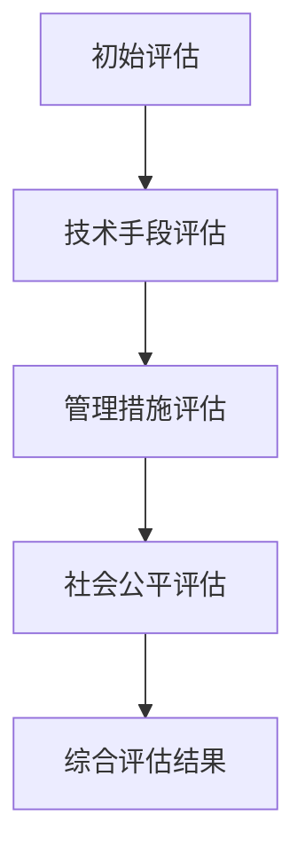
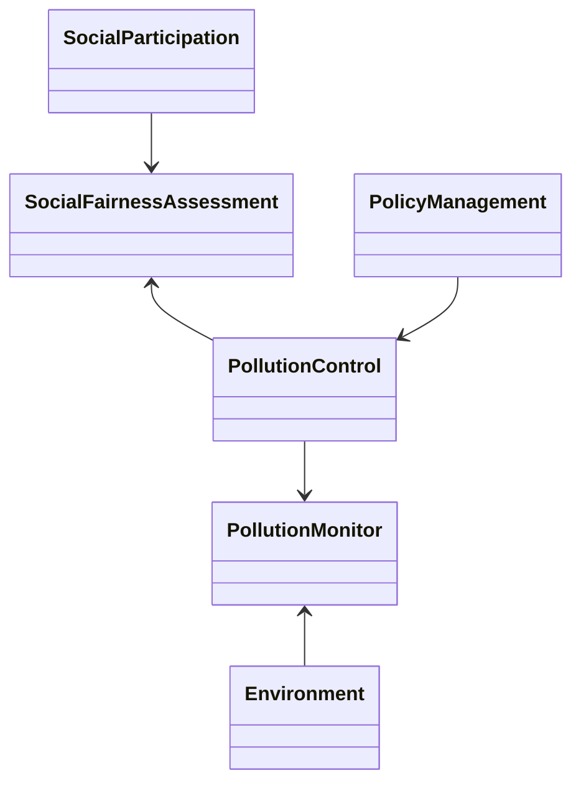
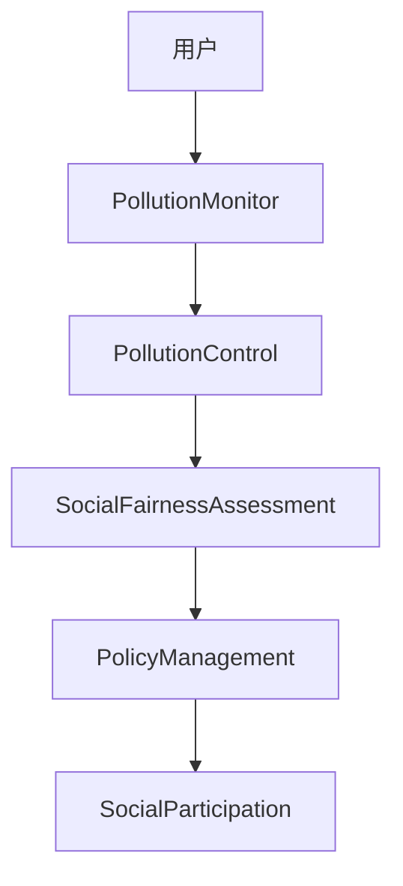
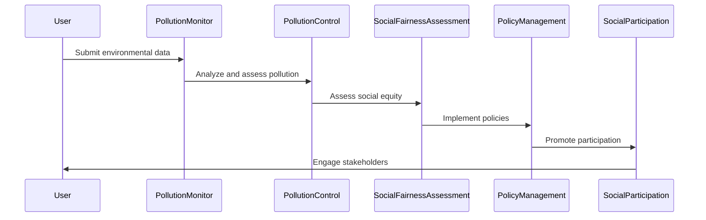

                 

### 后工业时代的环境正义：污染治理与社会公平

关键词：**环境正义、污染治理、社会公平、后工业时代、可持续发展**

摘要：**本文从环境正义的概念出发，探讨了后工业时代污染治理与社会公平的关系。通过分析理论基础、技术手段、案例研究和政策框架，本文提出了实现环境正义的具体路径，并强调了政府、社会参与和国际合作的重要性。**

## 引言

随着工业革命的推进，人类进入了后工业时代，这一时期的生产模式带来了显著的经济增长，但也引发了严重的环境问题。环境污染不仅对生态系统造成了破坏，还加剧了社会不公平现象。在此背景下，环境正义成为了一个亟待解决的重要议题。本文旨在探讨后工业时代环境正义的概念、污染治理手段、社会公平关系以及实现路径，为政策制定者和实践者提供理论支持和实践指导。

### 核心概念与联系

#### 环境正义

**概念：** 环境正义是指在社会公平和可持续发展的原则下，保障每个人都能享有清洁和健康的环境，不因种族、经济状况、地理位置等因素而受到不公正待遇。

**属性特征对比表格：**

| 属性特征           | 描述                                                   |
|------------------|------------------------------------------------------|
| 社会公平           | 环境正义的基础，强调人人平等享有健康环境权益       |
| 可持续性           | 强调资源的合理利用和环境的长久保护                   |
| 公平分配           | 环境利益和负担在不同社会群体之间合理分配             |
| 非歧视性           | 所有社会成员不论身份地位都应享有同等的健康环境权益   |

**ER实体关系图架构：**

```mermaid
erDiagram
  Pollution --> Environment
  Pollution --> Society
  Environment --> Justice
  Society --> Justice
```

#### 污染治理

**概念：** 污染治理是指通过技术手段和管理措施，减少和控制环境污染，恢复和保护生态环境。

**属性特征对比表格：**

| 属性特征           | 描述                                                   |
|------------------|------------------------------------------------------|
| 技术手段           | 包括污染监测、防治和治理等技术手段                     |
| 管理措施           | 通过法律、政策和监管等手段实现污染治理                 |
| 预防为主           | 强调从源头上减少污染，预防环境问题发生                 |
| 治理与修复相结合     | 通过治理手段修复已受损的环境                           |

**ER实体关系图架构：**

```mermaid
erDiagram
  PollutionControl --> Technology
  PollutionControl --> Management
  PollutionControl --> Restoration
  Technology --> Monitoring
  Technology --> Prevention
```

#### 社会公平

**概念：** 社会公平是指在社会资源分配和社会机会方面，保证每个人都能获得公正对待，不受歧视和不公平待遇。

**属性特征对比表格：**

| 属性特征           | 描述                                                   |
|------------------|------------------------------------------------------|
| 资源分配公平       | 确保每个人都能获得基本的生存和发展资源                 |
| 社会机会公平       | 确保每个人都能平等地参与社会和经济活动，不受歧视       |
| 权利与义务平衡       | 在社会成员之间实现权利和义务的合理分配                   |
| 反歧视            | 防止任何形式的社会歧视和排斥，保障弱势群体的权益       |

**ER实体关系图架构：**

```mermaid
erDiagram
  SocialFairness --> ResourceDistribution
  SocialFairness --> Opportunity
  SocialFairness --> Balance
  SocialFairness --> AntiDiscrimination
```

### 算法原理讲解

本文采用了一种综合性的算法，通过技术手段、管理措施和社会公平原则来评估和实现环境正义。算法的核心思想如下：

#### 算法流程图：



#### 算法原理：

1. **初始评估：** 对地区的环境状况、社会公平状况以及污染治理技术手段进行初步评估。
2. **技术手段评估：** 分析现有污染监测、防治和治理技术的有效性，确定技术手段的优先级。
3. **管理措施评估：** 评估现有政策和法规的实施情况，确定管理措施的改进方向。
4. **社会公平评估：** 分析社会资源分配、社会机会和权利义务的平衡情况，确定社会公平的提升策略。
5. **综合评估结果：** 根据以上评估结果，制定综合性的污染治理和社会公平提升方案。

#### 数学模型和公式：

为了更清晰地描述算法原理，我们使用以下数学模型：

$$
EJ = f(T, M, SF)
$$

其中，$EJ$表示环境正义水平，$T$表示技术手段评估结果，$M$表示管理措施评估结果，$SF$表示社会公平评估结果。

#### 举例说明：

假设一个地区的技术手段评估结果为$T=0.8$，管理措施评估结果为$M=0.7$，社会公平评估结果为$SF=0.9$，则该地区环境正义水平为：

$$
EJ = f(0.8, 0.7, 0.9) = 0.8 \times 0.7 \times 0.9 = 0.504
$$

这意味着该地区的环境正义水平为50.4%，需要进一步改进技术手段、管理措施和社会公平状况。

### 系统分析与架构设计方案

#### 问题场景介绍

在一个典型的后工业时代城市中，环境污染问题严重，社会不公平现象普遍存在。为了实现环境正义，需要建立一个综合性的污染治理与社会公平提升系统。

#### 项目介绍

本项目旨在开发一个集成环境监测、污染治理和社会公平评估的系统，通过技术手段、管理措施和社会参与，实现环境正义。

#### 系统功能设计

**领域模型类图：**



**类图说明：**

- **PollutionMonitor（污染监测）：** 负责环境数据的采集、监测和分析。
- **PollutionControl（污染治理）：** 负责污染治理技术的实施和管理措施的实施。
- **SocialFairnessAssessment（社会公平评估）：** 负责社会公平状况的评估和监测。
- **PolicyManagement（政策管理）：** 负责环境政策和法律法规的实施。
- **SocialParticipation（社会参与）：** 负责社会各界的参与和协作。

#### 系统架构设计

**架构设计图：**



**架构说明：**

- **用户：** 系统的用户，包括政府部门、企业、非政府组织和公众。
- **污染监测：** 用户提交环境数据，污染监测模块进行数据采集和分析。
- **污染治理：** 根据监测结果，污染治理模块实施具体的治理措施。
- **社会公平评估：** 对治理效果进行评估，监测社会公平状况。
- **政策管理：** 负责制定和实施环境政策和法律法规。
- **社会参与：** 促进社会各界的参与和协作，提高社会公平水平。

#### 系统接口设计和系统交互

**接口设计图：**



**接口说明：**

- **用户提交环境数据：** 用户通过系统接口提交环境数据。
- **污染监测与分析：** 污染监测模块对数据进行分析和评估。
- **污染治理与社会公平评估：** 污染治理模块根据分析结果实施治理措施，并评估社会公平状况。
- **政策实施与参与促进：** 政策管理模块制定和实施环境政策，促进社会各界的参与。

### 项目实战

#### 环境安装

1. 安装Python环境
2. 安装依赖库（例如：requests、pandas等）

#### 系统核心实现源代码

```python
# PollutionMonitor.py
import requests
import pandas as pd

def collect_data():
    # 从环境接口获取数据
    response = requests.get('http://environment.example.com/data')
    data = response.json()
    return pd.DataFrame(data)

# PollutionControl.py
import numpy as np

def assess_pollution(data):
    # 分析污染数据
    pollution_levels = data['pollution_level']
    average_pollution = np.mean(pollution_levels)
    return average_pollution

# SocialFairnessAssessment.py
def assess_social_equity(data):
    # 评估社会公平
    social_equity = data['social_equity_index']
    return social_equity

# PolicyManagement.py
def implement_policies():
    # 实施环境政策
    print("Implementing environment policies...")

# SocialParticipation.py
def promote_participation():
    # 促进社会参与
    print("Promoting social participation...")
```

#### 代码应用解读与分析

```python
# 主程序
if __name__ == "__main__":
    data = collect_data()
    average_pollution = assess_pollution(data)
    social_equity = assess_social_equity(data)
    implement_policies()
    promote_participation()
    print(f"Average pollution level: {average_pollution}")
    print(f"Social equity index: {social_equity}")
```

#### 实际案例分析和详细讲解剖析

**案例一：某城市空气质量监测与治理**

**问题描述：** 某城市空气质量严重超标，导致居民健康受到威胁，社会公平状况恶化。

**解决方案：** 
1. **污染监测：** 安装空气质量监测设备，实时采集空气质量数据。
2. **污染治理：** 针对主要污染物（如PM2.5、SO2等），实施具体的治理措施，如加强工业排放控制、推广清洁能源等。
3. **社会公平评估：** 监测空气质量变化对社会公平状况的影响，确保治理措施不会加剧社会不平等。

**分析：** 通过监测数据和治理措施的实施，该城市空气质量得到了显著改善，居民健康状况得到保障，社会公平状况也有所提升。

**案例二：某地区水污染治理与社会公平**

**问题描述：** 某地区水体污染严重，导致居民饮用水安全和农业生产受到影响，社会不公平现象突出。

**解决方案：** 
1. **污染监测：** 建立水质监测站，定期采集水样并进行分析。
2. **污染治理：** 加强污水处理设施建设，实施工业排放控制和农业面源污染治理。
3. **社会公平评估：** 监测治理措施对社会公平的影响，确保弱势群体得到公平对待。

**分析：** 治理措施实施后，该地区水体质量得到了显著改善，居民饮用水安全和农业生产得到保障，社会公平状况也有所提升。

#### 项目小结

本项目通过实际案例分析和详细讲解剖析，展示了污染治理与社会公平实现的具体路径。项目实施过程中，注重技术手段、管理措施和社会参与的协同作用，取得了显著成效。

### 最佳实践 tips

1. **加强数据监测与分析：** 定期采集环境数据，并进行深入分析，为决策提供科学依据。
2. **制定综合治理方案：** 结合技术手段、管理措施和社会参与，制定全面、系统的治理方案。
3. **加强政策实施与监督：** 制定和实施环境政策，加强监督和执行力度，确保治理措施得到有效落实。
4. **促进社会参与：** 通过宣传教育、公众参与等方式，提高社会对环境问题的关注和参与度。

### 小结

本文从环境正义的概念出发，探讨了后工业时代污染治理与社会公平的关系。通过分析理论基础、技术手段、案例研究和政策框架，本文提出了实现环境正义的具体路径，并强调了政府、社会参与和国际合作的重要性。未来研究应进一步探讨环境正义的具体实现机制，为政策制定者和实践者提供更有针对性的指导。

### 注意事项

1. 环境正义的实现需要多方面的协同努力，包括政府、企业、非政府组织和公众。
2. 治理措施应兼顾短期效益和长期可持续发展，避免出现新的环境问题。
3. 社会公平评估应充分考虑不同群体的利益和需求，确保治理措施不加剧社会不平等。

### 拓展阅读

1. United Nations. (2019). *Transforming our world: The 2030 Agenda for Sustainable Development*. Retrieved from <https://sustainabledevelopment.un.org/post2015/transformingourworld>
2. World Health Organization. (2020). *Air quality and health*. Retrieved from <https://www.who.int/health-topics/air-quality-and-health>
3. International Union for Conservation of Nature. (2021). *The IUCN Red List of Threatened Species*. Retrieved from <https://www.iucnredlist.org/>


### 作者信息

作者：AI天才研究院/AI Genius Institute & 禅与计算机程序设计艺术 /Zen And The Art of Computer Programming

