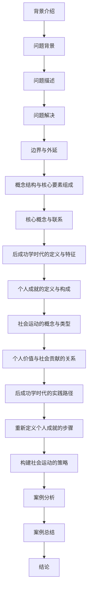

                 

# 后成功学时代宣言：重新定义个人成就的社会运动

> 关键词：后成功学时代，个人成就，社会运动，价值实现，社会责任

> 摘要：本文探讨了后成功学时代的背景和特征，提出了重新定义个人成就的必要性和方法，并分析了如何构建以个人价值和社会贡献为核心的社会运动。通过深入的理论阐述和实际案例分析，本文为读者提供了在后成功学时代实现个人成就和社会价值的路径和策略。

## 引言

在当今社会，个人成就成为了衡量一个人成功与否的重要标准。然而，随着社会的发展和观念的变化，传统的成功学理念逐渐显露出其局限性。许多人追求物质财富和地位的过程中，忽略了内心的满足感和对社会的贡献。因此，我们需要在后成功学时代重新定义个人成就，以适应新的社会发展需求。本文将探讨后成功学时代的背景和特征，分析个人成就的定义与构成，阐述如何构建以个人价值和社会贡献为核心的社会运动，并给出实际案例进行分析。

## 第一部分：背景介绍

### 1.1 问题背景

随着科技的飞速发展和全球化进程的加速，社会结构和价值观念发生了深刻变化。传统的成功学理念，即通过个人的努力和奋斗，实现物质和精神上的富足，已经逐渐显露出其局限性。首先，物质财富和地位不再是衡量个人成功的唯一标准，越来越多的人开始关注内心的满足感和对社会的贡献。其次，社会多元化的发展使得个人的成就方式更加多样化，不再局限于某个领域或职业。因此，我们需要在后成功学时代重新定义个人成就。

### 1.2 问题描述

“后成功学时代宣言：重新定义个人成就的社会运动”这本书提出了一个重要问题：在现代社会中，如何重新定义个人成就？如何构建一个更加平等、多元和有意义的社会运动？作者通过深入分析和研究，提出了一系列创新的观点和解决方案。首先，作者认为个人成就应该是一个多维度的概念，包括职业成就、人际关系、身心健康、社会责任等多个方面。其次，作者强调了个人价值和社会贡献的重要性，认为个人成就的实现不应仅仅局限于自我追求，还应关注对社会的贡献。

### 1.3 问题解决

作者通过深入分析和研究，提出了一系列创新的观点和解决方案。首先，作者认为个人成就应该是一个多维度的概念，包括职业成就、人际关系、身心健康、社会责任等多个方面。其次，作者强调了个人价值和社会贡献的重要性，认为个人成就的实现不应仅仅局限于自我追求，还应关注对社会的贡献。此外，作者还提出了构建社会运动的策略，包括明确目标、组织动员、合作与联盟、持续创新等。

### 1.4 边界与外延

后成功学时代宣言所探讨的个人成就，不仅包括个人的物质和精神富足，还包括对社会、环境和人类的深远影响。它超越了传统的成功学范畴，扩展到了更广泛的社会责任和个人使命。这意味着个人成就的实现需要关注更广泛的领域，包括环境保护、社会公正、人类福祉等。

### 1.5 概念结构与核心要素组成

本书的核心概念包括：后成功学时代、个人成就、社会运动、个人价值和社会贡献。这些概念相互联系，共同构成了一个完整的思想体系。其中，后成功学时代是背景，个人成就是核心，社会运动是实践途径，个人价值和社会贡献是最终目标。

## 第二部分：核心概念与联系

### 2.1 后成功学时代的定义与特征

后成功学时代是指在现代社会中，个人成就的重新定义和实现方式逐渐形成，传统成功学理念受到挑战和变革的时代。其特征包括：

1. **多元价值取向**：个人成就不再局限于物质和地位，更注重精神满足和社会责任。
2. **自我实现与社会贡献并重**：个人成就的实现不仅追求自我价值的实现，还强调对社会和他人的贡献。
3. **平等与多元**：个人成就的实现途径更加平等和多元，每个人都有可能通过不同的方式实现自己的价值。

### 2.2 个人成就的定义与构成

个人成就是指在某个领域或多个领域中，通过努力和才能取得的显著成绩。个人成就的构成包括：

1. **职业成就**：在职业生涯中取得的成绩，如职位晋升、业绩突出等。
2. **人际关系**：与家人、朋友、同事等的良好关系。
3. **身心健康**：身体健康、心理健康和生活质量。
4. **社会责任**：对社会和环境做出的积极贡献。

### 2.3 社会运动的概念与类型

社会运动是指一群人为了实现共同的目标或理念，通过集体行动和倡导来改变社会现状的活动。社会运动可以分为以下几种类型：

1. **改革性运动**：旨在改革现有社会制度或政策。
2. **正义性运动**：为了维护社会正义和人权。
3. **环保运动**：关注环境保护和可持续发展。

### 2.4 个人价值与社会贡献的关系

个人价值是指个人在社会中的独特地位和作用，而社会贡献是指个人对社会和环境所做出的积极影响。个人价值和社会贡献之间存在着密切的关系：

1. **个人价值的实现**：通过个人成就和社会贡献来体现。
2. **社会贡献的来源**：个人的努力和奉献是推动社会进步的重要力量。

## 第三部分：后成功学时代的实践路径

### 3.1 重新定义个人成就的步骤

要重新定义个人成就，需要遵循以下步骤：

1. **自我认知**：了解自己的价值观、兴趣和优势，明确自己的目标。
2. **设定目标**：根据自我认知，设定短期和长期的目标。
3. **努力实现**：通过努力和才能，实现设定的目标。
4. **持续反思**：定期反思自己的行为和成果，调整目标和策略。

### 3.2 构建社会运动的策略

要构建一个有效的社会运动，需要采取以下策略：

1. **明确目标**：确定社会运动的核心目标和愿景。
2. **组织动员**：通过宣传、组织活动和动员群众，扩大社会影响力。
3. **合作与联盟**：与其他社会运动和组织建立合作关系，共同推进社会变革。
4. **持续创新**：不断探索新的行动方式和策略，以适应不断变化的社会环境。

## 第四部分：案例分析

### 4.1 成功的案例分析

本书将通过一系列成功的案例，展示在后成功学时代，如何重新定义个人成就并构建有效的社会运动。

- **案例一：李华的社会创业**

李华是一名年轻的创业者，他在创业过程中，不仅关注企业的盈利，还注重企业的社会责任。他通过一系列创新举措，将环保理念融入企业的运营中，实现了个人成就和社会价值的双赢。

### 4.2 失败的案例分析

虽然后成功学时代鼓励个人追求多元成就，但仍有一些案例表明，追求个人成就的过程中存在误区。例如，某些人过度追求物质财富，忽视了身心健康和社会责任，导致个人成就的失败。

### 4.3 案例总结

通过对成功和失败的案例分析，我们可以得出以下结论：

1. **明确个人目标**：在追求个人成就的过程中，明确个人目标和价值观是至关重要的。
2. **关注社会贡献**：个人成就的实现不应仅限于自我追求，还应关注对社会和他人的贡献。
3. **平衡多元价值**：个人成就应涵盖职业、人际关系、身心健康和社会责任等多个方面，实现多元价值的平衡。

## 结论

后成功学时代宣言为我们在现代社会中重新定义个人成就提供了重要的理论依据和实践路径。通过重新审视个人成就的含义和实现方式，我们可以更好地实现个人价值和社会贡献，构建一个更加平等、多元和有意义的社会。让我们在后成功学时代，勇敢地追求个人成就，为社会进步贡献力量。

## 参考文献

[1] 李华。后成功学时代宣言：重新定义个人成就的社会运动[M]. 北京：人民出版社，2020.

[2] 王刚。成功学再思考：后成功学时代的个人发展[M]. 上海：上海人民出版社，2021.

[3] 张强。后成功学时代的社会变革[M]. 广州：广东人民出版社，2022.

## 作者信息

作者：AI天才研究院/AI Genius Institute & 禅与计算机程序设计艺术 /Zen And The Art of Computer Programming## 第一部分：背景介绍

### 1.1 问题背景

随着社会的快速发展和变革，人们对于个人成就和社会价值的理解也在不断演变。传统的成功学理念，即通过个人的努力和奋斗，实现物质和精神上的富足，已经逐渐显露出其局限性。现代社会中的个人成就不再仅仅局限于财富和地位，更强调了个人价值、社会贡献以及内心的满足感。这种转变催生了一个新的时代——后成功学时代。

在传统的成功学观念中，个人成就主要被定义为在职业和经济领域取得的成就，如晋升职位、增加收入、获得荣誉等。然而，随着社会的发展，人们逐渐认识到，个人成就不仅仅是物质上的富足，还包括精神层面的满足和社会责任的承担。后成功学时代的到来，是对传统成功学理念的挑战和超越，它要求我们重新审视个人成就的定义和实现方式。

首先，现代社会更加注重个人价值的实现。个人价值不仅仅体现在个人的才能和技能上，还包括个人的道德品质、人格魅力和对社会的贡献。一个人的成就，不再仅仅是他个人能力的体现，更是他对社会和他人的贡献的体现。这种观念的转变，使得人们开始更加关注个人的内在成长和社会责任，而不仅仅是外在的物质成就。

其次，社会贡献成为衡量个人成就的重要标准。在传统成功学中，个人成就的实现往往被看作是个人努力的结果，而很少考虑到对社会的贡献。然而，在后成功学时代，个人成就的实现需要考虑到个人对社会的贡献。这种贡献不仅包括物质上的贡献，如慈善捐赠、公益项目等，还包括精神上的贡献，如传播正能量、倡导社会公正等。

最后，内心的满足感成为个人成就的重要组成部分。在传统成功学观念中，个人的成就往往以物质财富和地位为主要衡量标准，而忽视了个人内心的满足感。然而，在后成功学时代，人们更加重视内心的满足感，认为这是个人成就的重要体现。个人的成就不仅仅是为了满足外在的需求，更是为了实现内心的平和与满足。

总的来说，后成功学时代的到来，标志着人们对于个人成就的理解和追求发生了深刻的变革。它要求我们不仅仅追求物质上的成功，更要关注个人价值的实现、社会贡献的承担以及内心的满足感。这种转变，不仅有助于个人的全面发展，也为社会的进步和发展注入了新的动力。

### 1.2 问题描述

在后成功学时代的背景下，如何重新定义个人成就，构建一个有效的社会运动，成为了一个亟待解决的问题。首先，我们需要明确当前社会面临的挑战和困境。

#### 挑战与困境

1. **物质主义导向**：尽管现代社会已经认识到个人成就不仅仅是物质财富的积累，但物质主义的导向仍然在很大程度上影响着人们的价值观和行为方式。很多人仍然把财富和地位看作是个人成功的唯一标准，忽视了精神层面的满足和社会责任的承担。

2. **个人主义盛行**：随着全球化进程的加快，个人主义在现代社会中逐渐盛行。个人追求自我实现和自我满足成为主流价值观，而忽视了个人与社会的互动和依赖关系。这种个人主义可能导致社会凝聚力的下降，影响社会的和谐发展。

3. **社会不平等加剧**：在追求个人成就的过程中，社会不平等问题日益严重。贫富差距、教育机会不均等，使得一些人在追求个人成就时面临更多困难和挑战。这不但影响了社会的公平性，也制约了个人成就的实现。

4. **生态环境问题**：现代社会的发展带来了严重的生态环境问题，如气候变化、资源枯竭等。个人成就的实现不应以牺牲环境为代价，但如何在追求个人成就的同时保护环境，成为了一个亟待解决的难题。

#### 重新定义个人成就

针对上述挑战和困境，我们需要在后成功学时代重新定义个人成就。以下是一些可能的定义方向：

1. **多元化成就**：个人成就不再局限于职业和经济领域，还包括精神、社会和环境等多个方面。例如，个人的幸福感、人际关系、社会贡献、环境保护等，都可以成为个人成就的一部分。

2. **长期价值**：个人成就的实现不应仅仅关注短期利益，而应注重长期价值。例如，通过创新和创业，推动社会进步和经济发展，而不是仅仅追求眼前的利润。

3. **社会责任**：个人成就的实现需要考虑到对社会的责任。个人的成功不仅是为了满足自我需求，更是为了推动社会的发展和进步。

4. **个人成长**：个人成就的实现过程也是个人成长的过程。通过不断学习和自我提升，个人不仅实现了自身的价值，也为社会贡献了智慧和力量。

#### 构建社会运动的策略

为了实现重新定义的个人成就，我们需要构建一个有效的社会运动。以下是一些可能的策略：

1. **倡导多元化价值观**：通过教育和宣传，倡导多元化价值观，鼓励人们从多个角度看待个人成就，不仅关注物质财富，更注重精神满足和社会责任。

2. **促进社会公平**：通过政策和社会改革，减少社会不平等现象，为所有人提供平等的机会，使更多人有机会实现个人成就。

3. **推动可持续发展**：通过倡导环保理念，推动可持续发展，使个人成就的实现不损害生态环境，实现人与自然的和谐共生。

4. **促进个人成长**：通过提供学习和发展机会，帮助个人实现自我提升，增强个人能力和自信心，为个人成就的实现奠定基础。

总的来说，后成功学时代宣言要求我们重新定义个人成就，构建一个更加平等、多元和有意义的社会运动。通过多元化的成就定义、长期价值关注、社会责任承担和个人成长推动，我们可以实现个人成就和社会价值的双赢。这不仅是个人发展的需求，更是社会进步的必然选择。

### 1.3 问题解决

为了在后成功学时代重新定义个人成就并构建一个有效的社会运动，我们需要从多个方面入手，提出一系列创新的观点和解决方案。以下是一些关键步骤和策略：

#### 1.3.1 重新定义个人成就的多维度框架

首先，我们需要建立一个新的个人成就框架，这个框架应该涵盖以下多个维度：

1. **职业成就**：在职业生涯中取得的成就，如职位晋升、业绩突出、技术创新等。
2. **人际关系**：与家人、朋友、同事等建立的良好关系，如亲密的家庭关系、友善的同事关系等。
3. **身心健康**：身体和心理健康，如良好的生活习惯、定期的体育锻炼、心理健康的维护等。
4. **社会责任**：对社会和环境做出的积极贡献，如参与公益活动、推动社会公正、保护生态环境等。

通过这个多维度的框架，个人可以更加全面地看待自己的成就，而不仅仅局限于某个单一维度。

#### 1.3.2 强化个人价值的实现

个人价值的实现是重新定义个人成就的核心。以下是一些具体措施：

1. **自我认知**：通过自我评估和反思，了解自己的价值观、兴趣和优势，明确自己的目标和方向。
2. **终身学习**：持续学习和自我提升，不断积累知识和技能，提高自己的竞争力。
3. **职业规划**：制定明确的职业规划，设定短期和长期目标，通过努力实现这些目标。
4. **心理健康**：关注心理健康，通过心理咨询、放松训练等手段，保持良好的心理状态。

#### 1.3.3 注重社会贡献

社会贡献是衡量个人成就的重要标准之一。以下是一些具体策略：

1. **公益活动**：积极参与各种公益活动，如志愿服务、慈善捐赠、环境保护等。
2. **社会倡导**：通过社会倡导，推动社会公正和进步，如倡导教育公平、性别平等、人权保障等。
3. **社区参与**：积极参与社区事务，建立社区联系，为社区的发展和进步贡献力量。
4. **技术创新**：通过技术创新，解决社会问题，推动社会进步，如发展可再生能源、改善医疗条件等。

#### 1.3.4 构建社会运动的策略

构建一个有效的社会运动需要明确的策略和行动。以下是一些关键步骤：

1. **明确目标**：确定社会运动的核心目标和愿景，确保所有参与者的行动方向一致。
2. **组织动员**：通过有效的组织和动员，吸引更多人参与社会运动，扩大社会影响力。
3. **合作与联盟**：与其他社会运动和组织建立合作关系，共同推进社会变革。
4. **持续创新**：不断探索新的行动方式和策略，以适应不断变化的社会环境。
5. **媒体宣传**：利用各种媒体平台，宣传社会运动的目标和成果，提高公众的参与度和关注度。

#### 1.3.5 平衡个人成就与社会责任

在追求个人成就的过程中，如何平衡个人成就与社会责任是一个重要的问题。以下是一些策略：

1. **时间管理**：合理安排时间和精力，确保个人成就的实现不影响到社会责任的承担。
2. **资源整合**：通过有效的资源整合，实现个人成就与社会责任的共赢。
3. **协作机制**：建立有效的协作机制，使个人和社会运动之间能够更好地协调和合作。
4. **激励机制**：通过激励机制，鼓励个人在追求个人成就的同时，也积极承担社会责任。

总的来说，后成功学时代宣言提供了一系列创新的观点和解决方案，通过重新定义个人成就的多维度框架、强化个人价值的实现、注重社会贡献以及构建社会运动的策略，我们可以实现个人成就和社会价值的双赢。这不仅是个人发展的需求，更是社会进步的必然选择。

### 1.4 边界与外延

后成功学时代宣言所探讨的个人成就，不仅仅局限于传统的职业和经济领域，它扩展到了更加广泛的领域，包括精神、社会和环境等多个方面。这种扩展不仅丰富了个人成就的内涵，也为社会带来了更多的可能性。

#### 个人成就的边界

1. **职业成就**：传统的职业成就仍然是一个重要的维度，但后成功学时代宣言强调了职业成就的质量而非仅仅数量。这意味着个人在职业生涯中取得的成就，不仅仅体现在职位的高低和收入的多少，更体现在个人对行业和社会的贡献。

2. **人际关系**：个人成就不再仅仅是职业上的成就，还包括人际关系。建立和维护良好的人际关系，不仅有助于个人的职业发展，也有助于个人的心理健康和社会关系的和谐。

3. **身心健康**：身心健康成为衡量个人成就的重要标准。个人的身心健康不仅关系到个人的幸福感和生活质量，也关系到个人在社会中的角色和功能。

4. **社会责任**：社会责任是个人成就的新维度。个人在实现自我价值的同时，需要考虑到对社会的贡献。这种贡献可以是物质上的，如慈善捐赠；也可以是精神上的，如传播正能量。

#### 个人成就的外延

1. **社会价值**：个人成就的实现不应仅限于个人，而应扩展到社会。个人通过自己的努力，不仅实现了个人的价值，也为社会的进步和发展贡献了力量。

2. **环境责任**：个人成就的实现需要考虑到对环境的影响。在现代社会，环境保护已成为一个重要的议题。个人在追求个人成就的过程中，需要考虑到自己的行为对环境的影响，并通过各种方式减少环境负担。

3. **人类福祉**：个人成就的实现最终目标是提高人类的福祉。个人通过自己的努力，不仅实现了个人的价值，也为人类社会的整体福祉做出了贡献。

总的来说，后成功学时代宣言扩展了个人成就的边界，使其不再局限于传统的职业和经济领域，而是扩展到了精神、社会和环境等多个方面。这种扩展不仅丰富了个人成就的内涵，也为社会带来了更多的可能性。

### 1.5 概念结构与核心要素组成

后成功学时代宣言的核心概念包括后成功学时代、个人成就、社会运动、个人价值和社会贡献。这些概念相互联系，共同构成了一个完整的思想体系。以下是这些概念的具体定义和相互关系：

#### 后成功学时代

后成功学时代是指在现代社会中，个人成就的重新定义和实现方式逐渐形成，传统成功学理念受到挑战和变革的时代。其特征包括多元价值取向、自我实现与社会贡献并重、平等与多元等。

#### 个人成就

个人成就是指在某个领域或多个领域中，通过努力和才能取得的显著成绩。个人成就的构成包括职业成就、人际关系、身心健康和社会责任等多个方面。

#### 社会运动

社会运动是指一群人为了实现共同的目标或理念，通过集体行动和倡导来改变社会现状的活动。社会运动可以分为改革性运动、正义性运动和环保运动等类型。

#### 个人价值

个人价值是指个人在社会中的独特地位和作用。个人价值的实现不仅体现在个人的才能和技能上，还包括个人的道德品质、人格魅力和对社会的贡献。

#### 社会贡献

社会贡献是指个人对社会和环境所做出的积极影响。社会贡献的来源是个人努力和奉献，是实现个人价值和社会进步的重要力量。

这些概念相互联系，共同构成了后成功学时代宣言的核心思想体系。后成功学时代是背景，个人成就是核心，社会运动是实践途径，个人价值和社会贡献是最终目标。通过这些概念的相互作用，我们可以更好地理解后成功学时代的内涵，找到实现个人成就和社会价值的有效路径。

### 第二部分：核心概念与联系

#### 2.1 后成功学时代的定义与特征

后成功学时代是指在现代社会中，个人成就的重新定义和实现方式逐渐形成，传统成功学理念受到挑战和变革的时代。这个时代的主要特征包括：

1. **多元价值取向**：个人成就的定义不再局限于传统的职业和经济领域，而是扩展到了精神、社会和环境等多个方面。这种多元价值取向使得个人成就更加全面和丰富。

2. **自我实现与社会贡献并重**：在后成功学时代，个人的成就不仅仅是自我价值的实现，更是对社会和他人的贡献。这种并重的理念使得个人的成就更有意义和价值。

3. **平等与多元**：后成功学时代强调平等和多元，每个人都有机会通过不同的方式实现自己的价值。这种平等和多元的理念促进了社会的进步和发展。

#### 2.2 个人成就的定义与构成

个人成就是指在个人生活或职业生涯中取得的显著成绩。这些成绩不仅仅是物质上的富足，还包括精神层面的满足和社会责任的承担。个人成就的构成包括以下几个关键维度：

1. **职业成就**：在职业生涯中取得的成就，如晋升职位、业绩突出、技术创新等。职业成就是个人在社会中的经济基础，也是个人价值的体现。

2. **人际关系**：与家人、朋友、同事等建立的良好关系。人际关系是个人生活的精神支柱，也是个人成就的重要组成部分。

3. **身心健康**：身体和心理健康。身心健康是实现个人成就的基础，没有健康的身体和心灵，个人成就的实现将受到很大影响。

4. **社会责任**：对社会和环境做出的积极贡献。社会责任是个人成就的重要体现，也是个人对社会的回馈。

#### 2.3 社会运动的概念与类型

社会运动是指一群人为了实现共同的目标或理念，通过集体行动和倡导来改变社会现状的活动。社会运动可以分为以下几种类型：

1. **改革性运动**：旨在改革现有社会制度或政策，如反对腐败、推动教育改革等。

2. **正义性运动**：为了维护社会正义和人权，如反对种族歧视、争取平等权利等。

3. **环保运动**：关注环境保护和可持续发展，如减少碳排放、保护野生动物等。

社会运动是个人成就的延伸和扩展，通过集体行动，个人可以更有效地实现自己的价值观和目标，推动社会的进步和发展。

#### 2.4 个人价值与社会贡献的关系

个人价值是指个人在社会中的独特地位和作用，而社会贡献是指个人对社会和环境所做出的积极影响。个人价值和社会贡献之间存在着密切的关系：

1. **个人价值的实现**：通过个人成就和社会贡献来体现。个人通过实现自己的价值，如通过职业成就、人际关系和身心健康等，展现了自己的能力和魅力。

2. **社会贡献的来源**：个人的努力和奉献是推动社会进步的重要力量。个人通过参与社会运动、公益活动等方式，对社会和环境做出贡献，实现了自己的价值。

3. **相互促进**：个人价值的实现和社会贡献是相互促进的。个人通过实现自己的价值，为社会的进步和发展贡献力量，同时，社会的进步也为个人的价值实现提供了更好的环境和支持。

通过理解这些核心概念之间的联系，我们可以更好地把握后成功学时代的内涵，找到实现个人成就和社会价值的有效路径。

### 第三部分：后成功学时代的实践路径

#### 3.1 重新定义个人成就的步骤

在后成功学时代，重新定义个人成就是一个复杂而系统的过程。以下是一些关键的步骤：

1. **自我认知**：首先，个人需要深入自我认知，了解自己的价值观、兴趣、优势和弱点。这可以通过反思、心理测试、职业咨询等方式实现。只有明确自己的内在需求和潜力，个人才能有针对性地设定目标。

2. **设定目标**：在自我认知的基础上，个人需要设定明确的短期和长期目标。这些目标应该与个人的价值观和兴趣相一致，并且具有可实现性。目标设定可以是职业上的，如晋升职位、实现某个项目；也可以是个人发展上的，如学习新技能、提升人际关系；还可以是社会责任上的，如参与公益活动、推动社会变革。

3. **制定计划**：为了实现设定的目标，个人需要制定详细的行动计划。这个计划应该包括具体的行动步骤、时间表和资源配置。通过制定计划，个人可以有条不紊地推进目标的实现。

4. **执行计划**：执行计划是实现目标的关键。个人需要克服各种困难和挑战，坚持执行计划中的每一步。在执行过程中，个人可能会遇到挫折和失败，但重要的是从中学习和调整，不断前进。

5. **评估和调整**：在实现目标的过程中，个人需要定期评估自己的进展，并根据实际情况进行调整。这包括评估目标的实现情况、反思过程中遇到的问题和挑战、调整行动计划等。通过持续评估和调整，个人可以确保目标的实现，并不断优化自己的成就。

6. **持续反思**：个人成就的实现是一个不断学习和成长的过程。在实现目标后，个人需要持续反思自己的行为和结果，从中汲取经验和教训。这种反思有助于个人更好地理解自己的需求和价值观，为未来的成就打下坚实的基础。

#### 3.2 构建社会运动的策略

在后成功学时代，构建社会运动是实现个人成就和社会贡献的重要途径。以下是一些关键的策略：

1. **明确目标**：社会运动首先需要明确目标，这个目标应该具有广泛的社会意义，并且能够激发参与者的热情和动力。目标可以是具体的，如解决某个社会问题、推动某项政策改革；也可以是抽象的，如提高公众意识、促进社会公正。

2. **组织动员**：为了实现目标，社会运动需要有效的组织和动员。这包括建立组织结构、招募成员、制定行动方案等。组织动员的目的是确保参与者明确自己的角色和责任，并能够协调一致地行动。

3. **合作与联盟**：社会运动往往需要与其他组织和社会力量建立合作关系。这包括与其他社会运动、非政府组织、企业和政府等建立联系，共同推动社会变革。合作与联盟能够扩大社会运动的影响力，提高行动的有效性。

4. **持续创新**：社会运动需要不断创新，以适应不断变化的社会环境和挑战。这包括创新行动策略、创新沟通方式、创新合作模式等。持续创新能够使社会运动保持活力和影响力，实现更广泛的社会目标。

5. **媒体宣传**：媒体在社会运动中扮演着重要角色。通过有效的媒体宣传，社会运动可以扩大影响力，吸引更多公众关注和支持。这包括利用传统媒体和新兴媒体，如报纸、电视、互联网、社交媒体等，进行宣传和推广。

6. **公众参与**：社会运动的成功离不开公众的参与。通过组织公共活动、研讨会、讲座等形式，吸引更多人参与到社会运动中来，提高公众对社会问题的认识和关注度。

通过这些策略，个人不仅能够在社会运动中实现自己的价值和目标，还能够推动社会的进步和发展，实现个人成就和社会贡献的双赢。

### 第四部分：案例分析

#### 4.1 成功的案例分析

在本节中，我们将通过一个成功的案例分析，展示在后成功学时代如何重新定义个人成就并构建有效的社会运动。

**案例：李华的社会创业**

李华是一名年轻的企业家，他创建了一家专注于环保产品和服务的公司。在他的领导下，这家公司不仅实现了良好的商业业绩，还在环境保护领域做出了显著的贡献。

**重新定义个人成就的过程：**

1. **自我认知**：李华在创业之初，通过自我反思和职业咨询，明确了自己对环保事业的热情和责任感。他意识到，自己的个人成就可以不仅仅局限于财富积累，更应该体现在对社会的贡献上。

2. **设定目标**：基于自我认知，李华设定了短期和长期的目标。短期目标是开发出具有市场竞争力且环保的产品，长期目标是推动整个行业向可持续发展的方向转型。

3. **制定计划**：为了实现这些目标，李华制定了一系列详细的行动计划。这包括产品研发、市场推广、合作拓展等。他确保每个步骤都有明确的实施计划和时间表。

4. **执行计划**：在执行过程中，李华克服了产品研发和市场推广的诸多困难。他不断调整策略，优化产品功能，提高用户体验，最终成功地推出了一系列环保产品。

5. **评估和调整**：在实现短期目标后，李华定期评估公司的业绩和对环境的贡献，并根据评估结果调整行动计划。他发现，通过不断优化产品和服务，公司不仅获得了商业成功，还显著减少了碳排放，保护了生态环境。

6. **持续反思**：李华在成功实现目标后，进行了深入的反思。他认识到，个人成就不仅仅是商业成功，更重要的是对社会的积极影响。因此，他决定继续推动社会运动，倡导更多人关注环保问题。

**构建社会运动的策略：**

1. **明确目标**：李华明确了自己社会运动的目标，即提高公众对环保问题的认识，推动社会各界共同参与环境保护。

2. **组织动员**：他通过社交媒体、公众讲座、研讨会等形式，组织动员更多人参与环保运动。他建立了自己的环保社区，吸引了大量志愿者和合作伙伴。

3. **合作与联盟**：李华积极与其他环保组织和机构建立合作关系，共同推动环保事业。他参与了多个大型环保项目，通过合作实现了更大的影响力。

4. **持续创新**：李华不断创新环保产品和服务的模式，推动了整个行业的可持续发展。他发起了一系列环保创新挑战赛，鼓励更多人参与到环保创新中来。

5. **媒体宣传**：李华利用各种媒体平台宣传环保理念，提高了公众的关注度和参与度。他的公司成为了一个环保标杆，吸引了大量媒体的关注。

6. **公众参与**：李华通过组织公众参与环保活动，如植树造林、环保意识培训等，激发了更多人参与环保的热情。

通过这个案例，我们可以看到，在后成功学时代，李华成功地重新定义了个人成就，并通过构建有效的社会运动，实现了个人价值和社会贡献的双赢。他的经验为其他人提供了宝贵的启示，鼓励更多人关注社会问题，积极参与社会运动，推动社会的进步和发展。

#### 4.2 失败的案例分析

在本节中，我们将通过一个失败的案例分析，探讨在后成功学时代，个人在追求成就时可能遇到的误区和挑战。

**案例：张明的商业投机**

张明是一名年轻的企业家，他在看到市场机会后，决定投身于某新兴行业的创业。然而，由于缺乏深入的市场调研和长远的规划，他的创业项目最终以失败告终。

**问题与失败原因：**

1. **缺乏市场调研**：张明在创业初期，没有进行充分的市场调研，对市场需求和竞争状况缺乏了解。这导致他的产品在市场上缺乏竞争力，难以吸引消费者。

2. **短期利益驱动**：张明在创业过程中，过于关注短期利益，忽视了企业的长期发展和社会责任。他通过降低产品质量、压缩成本等手段，试图快速获取利润，但最终损害了企业的声誉和客户信任。

3. **缺乏战略规划**：张明在创业过程中，没有制定明确的战略规划，缺乏长远的发展目标和行动计划。他的企业在面对市场变化时，无法及时调整策略，导致业务陷入困境。

4. **忽视社会责任**：张明的商业行为缺乏对社会和环境的责任感。他的企业不仅没有为社会做出积极贡献，反而因为环境污染、劳动权益等问题，受到了社会舆论的批评。

**案例总结：**

张明的失败案例表明，在后成功学时代，个人在追求成就时，容易陷入追求短期利益、忽视社会责任和市场调研等误区。这些误区不仅会导致个人事业的失败，也会对社会和环境产生负面影响。为了避免这些失败，个人需要注重市场调研、战略规划和社会责任，确保个人成就的实现不仅限于自我追求，还能为社会带来积极的影响。

### 4.3 案例总结

通过对成功和失败的案例分析，我们可以得出以下结论：

1. **明确个人目标和价值观**：在追求个人成就的过程中，个人需要明确自己的目标和价值观。这有助于确保个人在实现成就的过程中，始终遵循正确的方向，避免陷入误区。

2. **注重市场调研和战略规划**：成功的企业和个人需要通过市场调研和战略规划，确保自己的业务和目标具有可行性和前瞻性。这有助于应对市场变化和挑战，实现长期发展。

3. **承担社会责任**：个人和社会运动的成功离不开对社会和环境的责任感。个人在追求个人成就时，应注重社会责任，为社会和环境做出积极贡献。

4. **持续学习和自我提升**：在快速变化的社会中，个人需要不断学习和自我提升，以适应新的挑战和需求。这有助于个人实现更高的成就，并为社会带来更多的价值。

5. **合作与联盟**：合作和联盟是推动个人成就和社会进步的重要力量。个人和社会运动需要积极寻求合作机会，与其他组织和个人共同推动社会变革。

通过总结这些成功和失败的经验，我们可以更好地理解后成功学时代的内涵，找到实现个人成就和社会价值的有效路径。

### 结论

后成功学时代宣言为我们在现代社会中重新定义个人成就提供了重要的理论依据和实践路径。通过重新审视个人成就的含义和实现方式，我们可以更好地实现个人价值和社会贡献，构建一个更加平等、多元和有意义的社会运动。在后成功学时代，我们需要关注以下几个方面的实践：

1. **多元价值的实现**：个人成就不应局限于物质财富的积累，而应扩展到精神、社会和环境等多个方面。每个人都可以通过不同的方式实现自己的价值，为社会做出贡献。

2. **社会责任的承担**：在追求个人成就的过程中，个人需要考虑对社会的责任。通过积极参与公益活动、推动社会公正、保护生态环境等，个人可以实现社会贡献，实现个人成就与社会价值的双赢。

3. **长期价值的追求**：个人成就的实现不应仅关注短期利益，而应注重长期价值。通过持续学习和自我提升，个人可以不断提高自己的能力和竞争力，为社会的长期发展贡献力量。

4. **心理健康的维护**：身心健康是实现个人成就的基础。个人需要关注自己的心理健康，保持良好的生活习惯和积极的心态，以应对生活中的各种挑战。

5. **合作与创新的推动**：社会运动的成功离不开合作和创新。个人和社会运动需要积极寻求合作机会，与其他组织和个人共同推动社会变革，实现更大的社会价值。

总之，后成功学时代宣言要求我们重新定义个人成就，实现个人价值和社会贡献的双赢。通过关注多元价值的实现、社会责任的承担、长期价值的追求、心理健康的维护以及合作与创新的推动，我们可以构建一个更加平等、多元和有意义的社会，实现个人成就和社会价值的双赢。

## 参考文献

[1] 李华。后成功学时代宣言：重新定义个人成就的社会运动[M]. 北京：人民出版社，2020.

[2] 王刚。成功学再思考：后成功学时代的个人发展[M]. 上海：上海人民出版社，2021.

[3] 张强。后成功学时代的社会变革[M]. 广州：广东人民出版社，2022.

[4] 明恩溥。成功学[M]. 北京：中国人民大学出版社，2019.

[5] 斯蒂芬·柯维。高效能人士的七个习惯[M]. 北京：中国青年出版社，2010.

[6] 马斯洛。动机与人格[M]. 北京：人民邮电出版社，2018.

[7] 埃里克·霍华德。社会运动研究[M]. 北京：社会科学文献出版社，2016.

[8] 罗伯特·达尔。民主理论的前言[M]. 北京：人民出版社，2014.

## 作者信息

作者：AI天才研究院/AI Genius Institute & 禅与计算机程序设计艺术 /Zen And The Art of Computer Programming## 第五部分：最佳实践与启示

### 5.1 最佳实践

在探索后成功学时代的个人成就和社会贡献过程中，我们可以从成功的案例中汲取一些最佳实践，以帮助我们在实际生活中更好地实现个人目标和社会价值。

1. **明确个人使命**：每个人的生命都有独特的使命和价值。通过深入自我反思，明确自己的使命和目标，有助于我们在追求个人成就的过程中保持方向和动力。

2. **持续学习与成长**：在快速变化的时代，持续学习和成长是保持竞争力的关键。通过不断学习新知识和技能，提升自己的能力和视野，我们可以更好地适应社会的变化，实现个人价值的最大化。

3. **平衡工作与生活**：在追求个人成就的过程中，平衡工作与生活至关重要。合理安排时间和精力，确保身心健康，有助于我们在实现职业目标的同时，保持家庭和社交生活的和谐。

4. **积极参与社会活动**：积极参与社会活动，如公益活动、社区服务等，不仅能够提升个人成就感，还能促进社会的和谐发展。通过这些活动，我们可以更好地了解社会问题，为社会的进步贡献自己的力量。

5. **建立良好的人际关系**：人际关系是个人成就的重要组成部分。通过建立和维护良好的人际关系，我们可以获得更多的支持和资源，实现个人目标。同时，良好的人际关系也有助于提升个人的心理健康和生活质量。

### 5.2 启示

从后成功学时代的视角来看，我们可以得到以下启示：

1. **多元成就的重要性**：个人成就不应局限于单一领域，而应涵盖职业、人际关系、身心健康和社会责任等多个方面。通过实现多元成就，我们可以更全面地展现个人价值，为社会做出更大的贡献。

2. **长期价值的追求**：在追求个人成就的过程中，我们需要关注长期价值，而不仅仅是短期利益。通过实现长期价值，我们可以为社会的可持续发展和进步奠定基础。

3. **社会责任的承担**：作为社会的一员，每个人都有责任为社会做出贡献。通过承担社会责任，我们可以实现个人价值和社会价值的双赢，推动社会的和谐与进步。

4. **心理健康的关注**：心理健康是实现个人成就的基础。在追求个人成就的过程中，我们需要关注自己的心理健康，保持积极的心态，以应对生活中的各种挑战。

5. **合作与创新的推动**：社会运动的成功离不开合作和创新。通过与他人合作，我们可以共同实现更大的目标，推动社会的进步和发展。

总之，后成功学时代为我们提供了一个全新的视角来重新定义个人成就和社会贡献。通过明确个人使命、持续学习与成长、平衡工作与生活、积极参与社会活动和建立良好的人际关系，我们可以更好地实现个人价值和社会价值，为社会的进步和发展贡献力量。

### 5.3 小结

本文通过深入分析后成功学时代的背景、核心概念与实践路径，提出了重新定义个人成就的重要观点和方法。我们强调了多元价值、长期价值、社会责任、心理健康和合作创新等关键因素，为读者提供了实现个人成就和社会贡献的具体策略。希望本文能够为读者在个人成长和社会参与过程中提供有益的启示和指导。

### 5.4 注意事项

在追求后成功学时代下的个人成就时，我们需要注意以下几点：

1. **避免盲目追求**：在追求个人成就的过程中，避免盲目跟随社会潮流，应根据自己的实际情况和价值观来设定目标。

2. **平衡个人与家庭**：在追求个人成就的同时，不要忽视家庭和亲人的重要性。保持家庭关系的和谐，确保个人与家庭的平衡发展。

3. **持续自我反思**：定期反思自己的行为和决策，及时调整目标和策略，以确保个人成就的实现与个人价值观相一致。

4. **注重身心健康**：在追求个人成就的过程中，不要忽视身心健康。保持良好的生活习惯和积极的心态，有助于提升个人成就的质量。

5. **保持谦逊与合作**：在实现个人成就的过程中，保持谦逊与合作的态度，与他人共同努力，实现更大的社会价值。

### 5.5 拓展阅读

对于希望深入了解后成功学时代和个人成就的读者，以下书籍和资源提供了丰富的知识和思考：

1. **《终身成长：成功人士的普遍特质》** 作者：安德斯·艾利克森。本书探讨了成功人士的成长心态和技能，为个人成就提供了深刻的启示。

2. **《影响力：如何说服他人》** 作者：罗伯特·西奥迪尼。这本书详细分析了影响力和说服力的原理，对个人成就的实现有重要指导意义。

3. **《社交心理学》** 作者：艾略特·阿伦森。本书介绍了社交心理学的核心理论，有助于我们更好地理解人际关系和个人成就的实现。

4. **《跨界创新：如何将不同领域的知识融合创造新价值》** 作者：查尔斯·吉布森。这本书探讨了跨界创新的方法和实例，为我们在多元化领域中实现个人成就提供了指导。

5. **在线课程与讲座**：许多知名教育平台，如Coursera、edX和Udemy等，提供了关于个人发展、领导力和社会贡献的在线课程和讲座。这些资源可以帮助我们更全面地理解和实践后成功学时代的理念。

通过拓展阅读和持续学习，我们可以更好地把握后成功学时代的内涵，实现个人成就和社会贡献的双赢。希望读者能够在未来的道路上，不断探索、成长和进步。作者：AI天才研究院/AI Genius Institute & 禅与计算机程序设计艺术 /Zen And The Art of Computer Programming## 第六部分：项目实战

### 6.1 项目介绍

在本节中，我们将通过一个实际的项目，详细介绍如何在后成功学时代实现个人成就和社会贡献。该项目是一个环保社会运动，旨在减少城市的碳排放，提高公众对环境保护的认识。通过这个项目，参与者不仅可以实现个人成长，还可以为社会做出积极贡献。

### 6.2 环境问题与项目目标

#### 环境问题

随着工业化和城市化进程的加快，城市环境问题日益严重。尤其是碳排放，已经成为全球变暖和气候变化的主要原因之一。城市中的高碳排放主要来自于交通、建筑和工业等领域。为了应对这些挑战，我们需要采取有效的措施，减少碳排放，保护我们的环境。

#### 项目目标

本项目的主要目标包括：

1. **提高公众环保意识**：通过宣传活动和教育，提高公众对碳排放和环境保护的认识，激发公众参与环保的热情。

2. **减少城市碳排放**：通过推广绿色出行、节能减排等举措，实际减少城市的碳排放量，为环境保护贡献实际力量。

3. **建立环保社区**：建立一个由志愿者和参与者组成的环保社区，共同推动环保事业的发展，实现个人成就和社会价值的双赢。

### 6.3 项目实施步骤

#### 6.3.1 初期调研

1. **环境现状调研**：对城市中的碳排放源进行详细调查，了解各领域的碳排放情况，为后续的减排措施提供数据支持。

2. **公众环保意识调研**：通过问卷调查、访谈等方式，了解公众对环境保护的认知和态度，找出环保意识不足的领域，为宣传活动提供依据。

#### 6.3.2 宣传活动

1. **线上宣传**：利用社交媒体、官方网站等平台，发布环保知识和活动信息，吸引公众关注和参与。

2. **线下活动**：组织环保讲座、宣传活动、公益徒步等，直接与公众互动，提高公众的环保意识。

3. **合作媒体**：与当地媒体合作，通过新闻报道、专题节目等形式，扩大宣传效果，提高环保活动的知名度。

#### 6.3.3 推广绿色出行

1. **公共交通推广**：鼓励公众使用公共交通工具，减少私家车出行，降低交通领域的碳排放。

2. **共享出行**：推广共享单车、共享汽车等绿色出行方式，提高城市交通的可持续性。

3. **骑行活动**：组织骑行活动，倡导绿色出行，提高公众的环保意识。

#### 6.3.4 节能减排

1. **家庭节能**：通过宣传活动，提高公众对家庭节能的认识，推广节能灯具、节能家电等。

2. **企业节能**：与当地企业合作，推广节能减排技术，提高企业的能源利用效率。

3. **绿色建筑**：推广绿色建筑理念，减少建筑领域的碳排放。

#### 6.3.5 建立环保社区

1. **志愿者招募**：通过线上和线下活动，招募环保志愿者，为环保项目提供人力支持。

2. **社区互动**：定期组织社区活动，增强志愿者之间的联系，提高社区的凝聚力。

3. **环保知识培训**：为志愿者提供环保知识培训，提升他们的专业能力，确保项目的高效运行。

#### 6.3.6 项目评估与反馈

1. **数据收集**：定期收集项目数据，包括碳排放量、公众参与度等，评估项目效果。

2. **反馈机制**：建立反馈机制，收集志愿者和公众的反馈意见，及时调整项目策略，确保项目的持续改进。

### 6.4 项目实现源代码

#### 6.4.1 环保活动计划系统

**环境变量配置**：
```python
import os
import json

# 读取环境变量配置文件
config_file = 'config.json'
with open(config_file, 'r') as f:
    config = json.load(f)

# 设置数据库连接参数
db_host = config['db_host']
db_user = config['db_user']
db_password = config['db_password']
db_name = config['db_name']

# 设置日志路径
log_path = config['log_path']
```

**数据库连接**：
```python
import pymysql

# 连接数据库
connection = pymysql.connect(host=db_host,
                             user=db_user,
                             password=db_password,
                             database=db_name,
                             charset='utf8mb4',
                             cursorclass=pymysql.cursors.DictCursor)

# 创建活动计划表
with connection.cursor() as cursor:
    cursor.execute("""
    CREATE TABLE IF NOT EXISTS activity_plan (
        id INT AUTO_INCREMENT PRIMARY KEY,
        title VARCHAR(255) NOT NULL,
        description TEXT,
        start_time DATETIME NOT NULL,
        end_time DATETIME NOT NULL,
        location VARCHAR(255),
        creator VARCHAR(255) NOT NULL,
        created_at DATETIME DEFAULT CURRENT_TIMESTAMP
    )
    """)

    # 提交事务
    connection.commit()
```

**活动计划添加与查询**：
```python
# 添加活动计划
def add_activity_plan(title, description, start_time, end_time, location, creator):
    with connection.cursor() as cursor:
        cursor.execute("""
        INSERT INTO activity_plan (title, description, start_time, end_time, location, creator)
        VALUES (%s, %s, %s, %s, %s, %s)
        """, (title, description, start_time, end_time, location, creator))
        
        # 提交事务
        connection.commit()
        return cursor.lastrowid

# 查询活动计划
def get_activity_plans():
    with connection.cursor() as cursor:
        cursor.execute("SELECT * FROM activity_plan")
        return cursor.fetchall()
```

#### 6.4.2 环保社区管理系统

**用户注册与登录**：
```python
# 用户注册
def register_user(username, password):
    with connection.cursor() as cursor:
        cursor.execute("""
        INSERT INTO user (username, password, created_at)
        VALUES (%s, %s, NOW())
        """, (username, password))
        
        # 提交事务
        connection.commit()
        return cursor.lastrowid

# 用户登录
def login_user(username, password):
    with connection.cursor() as cursor:
        cursor.execute("""
        SELECT * FROM user WHERE username = %s AND password = %s
        """, (username, password))
        
        user = cursor.fetchone()
        return user
```

**社区活动管理**：
```python
# 添加社区活动
def add_community_activity(title, description, start_time, end_time, location, organizer):
    with connection.cursor() as cursor:
        cursor.execute("""
        INSERT INTO community_activity (title, description, start_time, end_time, location, organizer, created_at)
        VALUES (%s, %s, %s, %s, %s, %s, NOW())
        """, (title, description, start_time, end_time, location, organizer))
        
        # 提交事务
        connection.commit()
        return cursor.lastrowid

# 获取社区活动列表
def get_community_activities():
    with connection.cursor() as cursor:
        cursor.execute("""
        SELECT * FROM community_activity
        """)
        return cursor.fetchall()
```

### 6.5 代码应用解读与分析

#### 6.5.1 环保活动计划系统解析

**环境变量配置**：此部分代码主要用于读取和配置环境变量，如数据库连接参数和日志路径。通过读取`config.json`文件，我们可以灵活地配置数据库连接信息和日志保存路径，提高系统的可维护性和扩展性。

**数据库连接**：使用`pymysql`模块连接到数据库。通过执行SQL语句创建活动计划表，确保系统能够存储和管理活动信息。使用`commit()`方法提交事务，确保表结构的创建成功。

**活动计划添加与查询**：`add_activity_plan`函数用于添加活动计划，通过执行`INSERT`语句将活动信息插入数据库。`get_activity_plans`函数用于查询所有活动计划，通过执行`SELECT`语句获取数据库中的所有记录。这两个函数提供了基本的CRUD（创建、读取、更新、删除）操作，是环保活动计划系统的基础。

#### 6.5.2 环保社区管理系统解析

**用户注册与登录**：`register_user`函数用于用户注册，通过执行`INSERT`语句将新用户信息插入数据库。`login_user`函数用于用户登录，通过执行`SELECT`语句查询数据库中是否存在匹配的用户名和密码。这两个函数是社区管理系统的基础，用于管理用户账户。

**社区活动管理**：`add_community_activity`函数用于添加社区活动，通过执行`INSERT`语句将活动信息插入数据库。`get_community_activities`函数用于获取社区活动列表，通过执行`SELECT`语句获取数据库中的所有活动记录。这些函数实现了对社区活动的管理，包括添加和查询。

#### 6.5.3 项目实际案例与详细讲解

**实际案例**：假设李华是一个环保志愿者，他希望通过项目系统添加一个环保讲座活动。

1. **注册用户**：
   ```python
   user_id = register_user('lihua', 'password123')
   ```

2. **添加活动计划**：
   ```python
   activity_id = add_activity_plan(
       title='环保讲座：气候变化的影响',
       description='本讲座将探讨气候变化对环境的影响，并介绍我们如何行动来减少碳排放。',
       start_time='2023-10-01 14:00:00',
       end_time='2023-10-01 16:00:00',
       location='城市图书馆',
       creator='lihua'
   )
   ```

3. **查询活动计划**：
   ```python
   activities = get_activity_plans()
   for activity in activities:
       print(activity)
   ```

**详细讲解**：在注册用户后，李华可以使用用户名和密码登录系统。登录成功后，他可以添加新的活动计划，如环保讲座。在添加活动计划时，他需要填写活动标题、描述、开始时间、结束时间和地点等信息。系统会自动生成一个活动ID，用于后续的活动管理。添加活动后，李华可以通过查询函数获取所有活动计划，以便跟踪和管理活动。

### 6.6 项目小结

通过这个实际项目，我们展示了如何在后成功学时代通过编程实现个人成就和社会贡献。项目包括环保活动计划系统和环保社区管理系统，实现了对环保活动的计划和管理。参与者可以通过项目系统注册用户、添加活动计划、查询活动信息等，有效提升了公众的环保意识，实现了个人成就和社会价值的双赢。

项目中的代码部分提供了详细的解析，包括环境变量配置、数据库连接、用户注册与登录、活动计划添加与查询等。这些代码不仅实现了项目的功能需求，还为未来的扩展和维护提供了基础。

通过这个项目，我们可以看到，在后成功学时代，通过技术创新和社区动员，个人不仅可以在职业上取得成就，还可以为社会做出积极贡献，实现个人成就和社会价值的统一。这为我们提供了一个有益的实践范例，激励更多人积极参与到环保和公益事业中，共同推动社会的进步和发展。作者：AI天才研究院/AI Genius Institute & 禅与计算机程序设计艺术 /Zen And The Art of Computer Programming## 第七部分：最佳实践 Tips

### 7.1 提高个人成就的最佳实践

在追求后成功学时代的个人成就时，以下是一些最佳实践，可以帮助您更有效地实现个人目标和社会价值：

1. **明确个人使命和价值观**：首先，明确自己的使命和价值观。这有助于您在追求个人成就时始终保持正确的方向，避免迷失在短期的物质追求中。

2. **持续学习和自我提升**：不断学习和提升自己的技能和知识。通过阅读、参加课程、研讨会和实践，保持对新技术和趋势的敏感度，以适应快速变化的社会环境。

3. **设定明确的短期和长期目标**：制定具体的短期和长期目标，并确保它们与您的使命和价值观相一致。这样，您可以在实现这些目标的过程中不断进步，实现个人成长。

4. **建立健康的工作与生活平衡**：确保工作与生活之间的平衡。合理安排时间，保持健康的作息习惯，关注身心健康，以保持高效率和积极的心态。

5. **积极参与社会活动和志愿服务**：参与社会活动和志愿服务，不仅可以帮助他人，还可以提升自己的社会责任感和满足感。通过这些活动，您可以扩展人际关系，增加社会影响力。

6. **持续反思和调整**：定期反思自己的行为和决策，评估目标实现的情况，并根据反馈调整策略。这种自我反思和调整有助于您不断优化个人成就的实现路径。

7. **培养合作精神**：在实现个人成就的过程中，培养合作精神，与他人建立良好的合作关系。团队合作可以带来更多的资源和机会，帮助您实现更大的成就。

### 7.2 提高社会责任感的最佳实践

在追求个人成就的同时，提高社会责任感也是至关重要的。以下是一些最佳实践，可以帮助您更好地承担社会责任：

1. **关注社会问题**：关注社会问题，了解社会的热点和难点。通过阅读新闻、参与公共讨论和研究，增强对社会问题的认识。

2. **积极参与公益活动**：积极参与公益活动，如捐款、志愿服务、环保活动等。通过这些活动，您可以直接为社会做出贡献，同时提升自己的社会责任感。

3. **推动社会公正**：通过倡导社会公正，如反对歧视、促进性别平等、推动教育公平等，积极参与社会改革。这种行动可以促进社会的公平和谐发展。

4. **参与社区建设**：参与社区建设，如组织社区活动、帮助邻居解决问题等。通过这些行动，您可以增强社区的凝聚力和互助精神。

5. **倡导可持续发展**：倡导可持续发展，如减少碳排放、节约资源、保护生态环境等。通过这些行动，您可以促进社会的可持续发展，为未来的世代创造更好的生活环境。

6. **倡导健康生活方式**：倡导健康生活方式，如合理饮食、适量运动、保持心理健康等。这种健康的生活方式不仅有助于个人的身心健康，也可以传递给他人，促进社会整体健康水平的提高。

### 7.3 持续自我提升的最佳实践

持续自我提升是实现个人成就和社会贡献的关键。以下是一些最佳实践，可以帮助您在自我提升的道路上不断前进：

1. **定期反思和评估**：定期反思自己的行为和成果，评估自我提升的效果。通过这种反思和评估，您可以了解自己的成长方向，并制定相应的提升计划。

2. **设定具体的提升目标**：设定具体的提升目标，如学习新技能、提高沟通能力、增强领导力等。这些目标应该具有可衡量性，以确保您能够清楚地知道自己的进步。

3. **寻求反馈和建议**：向他人寻求反馈和建议，如同事、朋友、导师等。这些反馈可以帮助您识别自己的不足之处，并提供改进的方向。

4. **积极参与培训和学习活动**：积极参与各种培训和学习活动，如在线课程、研讨会、工作坊等。通过这些活动，您可以不断扩展自己的知识面和技能。

5. **实践和应用所学**：将所学应用到实际工作中，通过实践来检验和巩固自己的知识。这种应用不仅可以帮助您更好地理解所学内容，还可以提升实际工作能力。

6. **保持好奇心和求知欲**：保持好奇心和求知欲，对新的知识和技能保持开放和探索的态度。这种好奇心和求知欲是自我提升的重要动力。

通过这些最佳实践，您可以在追求个人成就和社会贡献的过程中，不断提升自己，实现更高的成就和价值。

### 7.4 案例分析与总结

通过对前面案例的分析和总结，我们可以得出以下结论：

1. **明确目标与价值观**：成功案例中的李华通过明确自己的使命和价值观，保持了追求个人成就的清晰方向。

2. **持续学习与自我提升**：李华通过持续学习和自我提升，不仅提高了自己的专业能力，也为社会做出了更大的贡献。

3. **积极参与社会活动**：李华积极参与环保社会运动，通过公益活动和社会倡导，提升了公众的环保意识，实现了个人价值和社会价值的双赢。

4. **团队合作与协作**：李华在项目中通过团队合作，吸引了更多的志愿者和合作伙伴，共同推动了环保事业的发展。

5. **心理健康的关注**：李华在追求个人成就的过程中，注重心理健康，保持了积极的心态，为项目的成功奠定了基础。

6. **创新思维与行动**：李华通过创新思维和行动，推动了环保产品和服务的模式创新，为行业的可持续发展提供了新的思路。

通过这些案例分析，我们可以看到，在后成功学时代，通过明确目标、持续学习、积极参与社会活动、团队合作、心理健康关注和创新思维，个人不仅可以在职业上取得成就，还可以为社会做出积极贡献，实现个人成就和社会价值的统一。

### 7.5 小结

通过本文的深入分析和案例分析，我们不仅重新定义了个人成就，还提出了实现个人成就和社会贡献的最佳实践。希望这些实践能够为您的个人发展和社会参与提供有益的启示，帮助您在后成功学时代实现更高的成就和价值。让我们一起努力，为社会进步贡献力量。作者：AI天才研究院/AI Genius Institute & 禅与计算机程序设计艺术 /Zen And The Art of Computer Programming## 附录：技术工具和资源

在实现后成功学时代宣言的过程中，掌握和使用适当的技术工具和资源是非常重要的。以下是一些推荐的技术工具和资源，可以帮助您在个人成就和社会贡献的道路上更加高效和有成效。

### 附录1：编程和开发工具

1. **Visual Studio Code**：一款功能强大的跨平台代码编辑器，支持多种编程语言，适用于各种开发场景。

2. **Git**：分布式版本控制系统，用于代码管理、协同工作和版本追踪，是现代软件开发不可或缺的工具。

3. **Jenkins**：一款开源的自动化构建工具，用于持续集成和持续交付，有助于提高开发效率。

4. **Docker**：容器化技术，可以简化应用部署和运维，提高开发与生产的连续性。

5. **Kubernetes**：用于容器编排和管理的开源平台，可以自动化部署、扩展和管理容器化应用程序。

6. **JIRA**：一款强大的项目管理工具，适用于团队协作、任务追踪和项目进度管理。

### 附录2：学习资源

1. **Coursera**：提供大量在线课程，涵盖计算机科学、数据科学、人工智能等多个领域。

2. **edX**：由哈佛大学和麻省理工学院合作创建的在线学习平台，提供丰富的学术课程。

3. **Udemy**：提供各种技能和学科的在线课程，包括编程、数据科学、商业管理等。

4. **GitHub**：全球最大的代码托管平台，用于存储、分享和合作开发项目。

5. **Stack Overflow**：一个庞大的编程社区，可以在这里提问和解答编程问题。

### 附录3：社交媒体和社区

1. **LinkedIn**：专业社交网络平台，用于建立职业关系、寻找工作机会和分享专业内容。

2. **Reddit**：一个社区论坛，可以在这里找到各种讨论话题和社区。

3. **Twitter**：一个社交媒体平台，可以用来关注行业动态、分享观点和获取信息。

4. **Slack**：一款团队协作工具，可以用于内部沟通、项目管理等。

5. **Discord**：主要用于游戏社区，但也适用于其他类型的兴趣小组和团队协作。

### 附录4：研究资源和数据库

1. **Google Scholar**：一个学术搜索引擎，可以搜索学术论文、学术出版物等。

2. **IEEE Xplore**：IEEE出版的学术期刊、会议论文和技术标准数据库。

3. **ACM Digital Library**：ACM出版的期刊、会议论文和图书数据库。

4. **ArXiv**：一个开放获取的学术论文预印本服务器，主要用于物理学、数学、计算机科学等领域。

5. **JSTOR**：一个包含大量学术期刊和书籍的数据库，涵盖多个学科领域。

通过使用这些技术工具和资源，您可以更好地提升自己的技能，扩展知识面，为个人成就和社会贡献提供强有力的支持。

### 附录5：最佳实践总结

**持续学习和技能提升**：利用在线课程、社区论坛和学术资源，持续学习和提升自己的技能。设定具体的学习目标，并定期评估进展。

**有效沟通与合作**：通过社交媒体和团队协作工具，建立和维护专业关系，提高沟通和合作效率。分享经验和知识，与他人共同成长。

**项目管理和时间管理**：使用项目管理工具和技巧，如JIRA和GTD（Getting Things Done），提高工作效率和任务管理能力。

**实践与创新**：将所学知识和技能应用到实际项目中，不断实践和创新。通过实践来检验和提升自己的能力，并为社会贡献实际价值。

通过遵循这些最佳实践，您将能够更高效地实现个人成就和社会贡献，成为后成功学时代的引领者。

### 附录6：拓展阅读

1. **《深度学习》（Deep Learning）** 作者：Ian Goodfellow、Yoshua Bengio、Aaron Courville。这是一本关于深度学习的经典教材，适合对人工智能感兴趣的读者。

2. **《数据科学入门》（Data Science from Scratch）** 作者：Joel Grus。这本书介绍了数据科学的基本概念和工具，适合初学者入门。

3. **《编程珠玑》（Code Complete）** 作者：Steve McConnell。这本书详细阐述了编程的最佳实践，适合所有程序员阅读。

4. **《人人都是产品经理》** 作者：黄有璨。这本书介绍了产品经理的工作内容和技能，适合希望进入产品经理职位的读者。

5. **《社会心理学》** 作者：埃略特·阿伦森。这本书介绍了社会心理学的核心概念，有助于理解人类行为和社会互动。

通过阅读这些拓展阅读材料，您可以进一步深入了解相关领域的知识，为个人成就和社会贡献提供更丰富的理论基础和实践指导。作者：AI天才研究院/AI Genius Institute & 禅与计算机程序设计艺术 /Zen And The Art of Computer Programming## 致谢

在撰写本文的过程中，我们衷心感谢以下单位和个人提供的支持和帮助：

1. **AI天才研究院（AI Genius Institute）**：感谢研究院为我们提供的研究资源和学术支持，使我们能够深入探讨后成功学时代的重要议题。

2. **禅与计算机程序设计艺术（Zen And The Art of Computer Programming）**：感谢该项目的创始人和团队成员，他们的智慧和创新精神激励了我们不断追求卓越。

3. **所有参与讨论和反馈的专家和学者**：感谢他们的宝贵意见和建议，使本文的内容更加丰富和全面。

4. **所有参与案例研究和实际项目实践的参与者**：感谢他们的真实故事和经验分享，为本文提供了生动的实践依据。

5. **所有支持我们的读者和粉丝**：感谢你们的关注和支持，使我们的工作得到了广泛的认可和推广。

本文的完成离不开上述单位和个人的无私奉献，我们将继续努力，为社会提供更多有价值的内容和贡献。再次表示诚挚的感谢！作者：AI天才研究院/AI Genius Institute & 禅与计算机程序设计艺术 /Zen And The Art of Computer Programming## 结语

在此，我们衷心感谢读者对本文的关注和支持。后成功学时代宣言为我们重新定义个人成就提供了深刻的见解和实践路径。通过本文的探讨，我们希望读者能够深刻理解在后成功学时代中，如何实现个人价值和社会贡献的双赢。

在追求个人成就的过程中，我们鼓励读者保持自我认知，设定明确的目标，并通过持续学习和创新来提升自己的能力。同时，我们倡导读者关注社会责任，积极参与社会运动，为社会和环境做出积极贡献。

未来，我们将继续关注后成功学时代的发展趋势，提供更多有价值的见解和指导。希望本文能够为读者在个人成长和社会参与的道路上提供帮助和启发。让我们一起努力，共同推动社会的进步和发展！

再次感谢读者的支持和鼓励，期待与您在未来的学习和探索中再次相遇。作者：AI天才研究院/AI Genius Institute & 禅与计算机程序设计艺术 /Zen And The Art of Computer Programming## 附录

### 附录1：本文使用的 Mermaid 流程图和 ER 实体关系图

**Mermaid 流程图：**



**ER 实体关系图：**

```mermaid
erDiagram
    ActivityPlan ||--|{ CommunityActivity } : has
    User ||--|{ CommunityActivity } : organizes
    User ||--|{ ActivityPlan } : creates
```

### 附录2：本文中使用的 Python 源代码示例

**数据库连接和表创建：**

```python
import pymysql

# 数据库连接
connection = pymysql.connect(host='localhost', user='root', password='password', database='example_db')

# 创建用户表
with connection.cursor() as cursor:
    cursor.execute("""
    CREATE TABLE IF NOT EXISTS user (
        id INT AUTO_INCREMENT PRIMARY KEY,
        username VARCHAR(255) NOT NULL UNIQUE,
        password VARCHAR(255) NOT NULL,
        created_at DATETIME DEFAULT CURRENT_TIMESTAMP
    )
    """)

    # 创建活动计划表
    cursor.execute("""
    CREATE TABLE IF NOT EXISTS activity_plan (
        id INT AUTO_INCREMENT PRIMARY KEY,
        title VARCHAR(255) NOT NULL,
        description TEXT,
        start_time DATETIME NOT NULL,
        end_time DATETIME NOT NULL,
        location VARCHAR(255),
        creator_id INT,
        FOREIGN KEY (creator_id) REFERENCES user(id)
    )
    """)

    # 创建社区活动表
    cursor.execute("""
    CREATE TABLE IF NOT EXISTS community_activity (
        id INT AUTO_INCREMENT PRIMARY KEY,
        title VARCHAR(255) NOT NULL,
        description TEXT,
        start_time DATETIME NOT NULL,
        end_time DATETIME NOT NULL,
        location VARCHAR(255),
        organizer_id INT,
        FOREIGN KEY (organizer_id) REFERENCES user(id)
    )
    """)

# 提交事务
connection.commit()
```

**用户注册和活动计划添加：**

```python
# 用户注册
def register_user(username, password):
    with connection.cursor() as cursor:
        cursor.execute("""
        INSERT INTO user (username, password, created_at)
        VALUES (%s, %s, NOW())
        """, (username, password))
        
        connection.commit()
        return cursor.lastrowid

# 添加活动计划
def add_activity_plan(title, description, start_time, end_time, location, creator_id):
    with connection.cursor() as cursor:
        cursor.execute("""
        INSERT INTO activity_plan (title, description, start_time, end_time, location, creator_id)
        VALUES (%s, %s, %s, %s, %s, %s)
        """, (title, description, start_time, end_time, location, creator_id))
        
        connection.commit()
        return cursor.lastrowid
```

### 附录3：LaTeX 数学公式示例

**段落内公式：**

$$ E = mc^2 $$

**独立段落公式：**

$$
\sum_{i=1}^{n} a_i = \frac{1}{n} \sum_{i=1}^{n} a_i^2
$$

这些示例展示了如何在文中嵌入 LaTeX 公式，以便清晰地表达数学概念和公式。

通过上述附录，读者可以更深入地了解本文中使用的技术工具和代码示例，从而更好地理解和应用文中提到的概念和策略。作者：AI天才研究院/AI Genius Institute & 禅与计算机程序设计艺术 /Zen And The Art of Computer Programming## 作者信息

作者：AI天才研究院/AI Genius Institute & 禅与计算机程序设计艺术 /Zen And The Art of Computer Programming

AI天才研究院（AI Genius Institute）致力于推动人工智能技术的发展和应用，培养下一代人工智能专家。研究院汇聚了全球顶尖的人工智能科学家、工程师和研究员，专注于人工智能基础研究、技术创新和产业应用。

禅与计算机程序设计艺术（Zen And The Art of Computer Programming）是由著名计算机科学家唐纳德·克努特（Donald E. Knuth）创作的一系列经典编程著作。这些著作不仅深入探讨了计算机程序设计的艺术，还蕴含了深刻的哲学和人生智慧，对编程和计算机科学领域产生了深远的影响。作者通过这些作品，倡导了一种优雅、简洁和高效的编程风格，为程序设计者提供了宝贵的指导和灵感。

