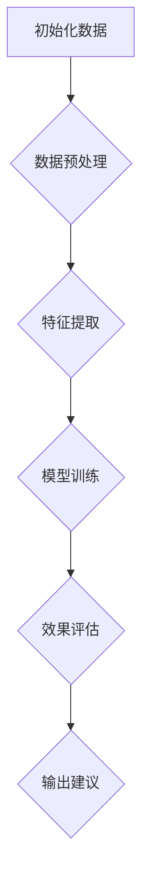
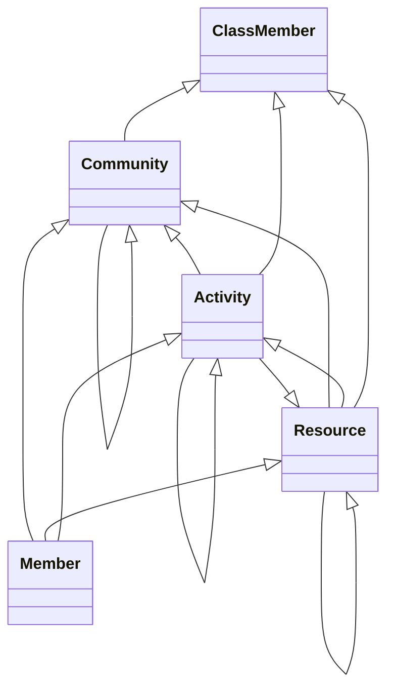
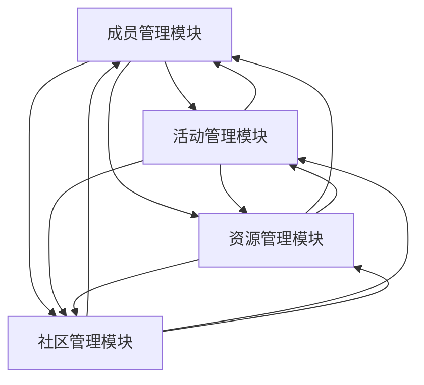
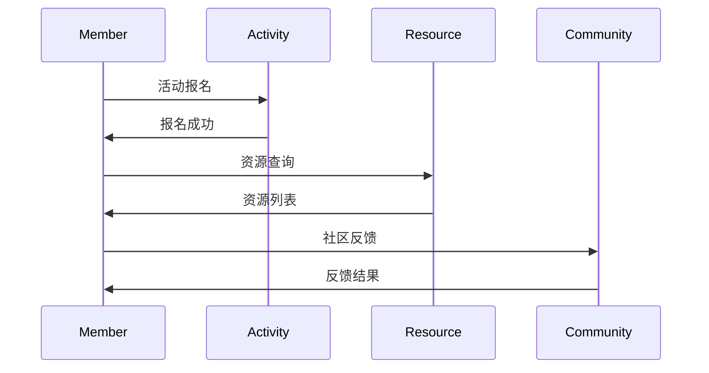

                 

# 后消费主义生活实验社区：从拥有到存在的转变实践基地

## 关键词：后消费主义、生活实验社区、存在主义、社会变革、技术实践

> 摘要：本文旨在探讨后消费主义时代下的生活实验社区，从拥有到存在的转变实践基地。通过对后消费主义现象的分析，结合生活实验社区的实际案例，探讨社区成员在转变过程中的挑战与机遇，以及这一变革对个人和社会的意义。

### 目录大纲

----------------------------------------------------------------
## 后消费主义生活实验社区：从拥有到存在的转变实践基地

### 第一部分：背景介绍

#### 1.1.1 问题背景
- 后消费主义现象与生活实验社区
- 社区成员的生活态度转变与需求
- 从“拥有”到“存在”的转变

#### 1.1.2 问题描述
- 生活实验社区的目标与挑战
- 成员之间的关系与互动
- 实践过程中的问题与解决策略

#### 1.1.3 问题解决
- 生活实验社区的设计理念
- 实践过程中的关键要素
- 成效评估与可持续性

#### 1.1.4 边界与外延
- 后消费主义的概念与特征
- 生活实验社区的类型与模式
- 社区成员的角色与互动

#### 1.1.5 概念结构与核心要素组成
- 后消费主义生活实验社区的定义
- 核心概念与关系的联系
- 社区运营的要素组成

### 第二部分：核心概念与联系

#### 2.1 后消费主义原理
- 后消费主义的核心思想
- 后消费主义的社会影响
- 后消费主义与生活实验社区的关系

#### 2.2 生活实验社区的类型与模式
- 生活实验社区的定义与分类
- 社区模式的比较与选择
- 社区运营的挑战与机遇

#### 2.3 核心概念属性特征对比表格
- 后消费主义与消费主义的对比
- 生活实验社区与传统社区的比较
- 社区成员的角色与特征对比

#### 2.4 ER实体关系图架构
- 社区成员实体关系图
- 社区活动实体关系图
- 社区资源实体关系图

### 第三部分：算法原理讲解

#### 3.1 生活实验社区分析算法
- 算法原理
- 算法流程图
- 算法Python源代码

#### 3.2 数学模型与公式
- 数学模型
- 公式推导
- 例子说明

### 第四部分：系统分析与架构设计

#### 4.1 问题场景介绍
- 社区运营场景分析

#### 4.2 系统功能设计
- 领域模型类图

#### 4.3 系统架构设计
- 系统架构图

#### 4.4 系统接口设计
- 接口设计描述

#### 4.5 系统交互序列图
- 系统交互序列图

### 第五部分：项目实战

#### 5.1 环境安装
- 安装步骤与工具介绍

#### 5.2 系统核心实现源代码
- 源代码结构与功能说明

#### 5.3 代码应用解读与分析
- 代码解读
- 功能分析

#### 5.4 实际案例分析与详细讲解
- 案例介绍
- 分析与讲解

#### 5.5 项目小结
- 项目总结
- 经验与反思

### 第六部分：最佳实践 Tips

#### 6.1 实践中的注意事项
- 常见问题与解决方案

#### 6.2 拓展阅读
- 相关书籍与论文推荐

----------------------------------------------------------------

### 第一部分：背景介绍

#### 1.1.1 问题背景

**后消费主义现象与生活实验社区**

在当今社会，消费主义文化无处不在，人们追求物质享受，追求拥有更多的物质财富。然而，随着时间的推移，越来越多的人开始意识到这种生活方式带来的负面影响，包括环境污染、资源浪费、社会不公等。这一现象引发了后消费主义的思潮，人们开始反思消费主义的本质，追求更加有意义、更加可持续的生活方式。

后消费主义是一种反思和批判消费主义的文化和社会运动，它主张减少物质消费，追求精神成长和个人满足，强调人与自然、人与社会的和谐共生。在这种背景下，生活实验社区成为一种实践后消费主义理念的场所。

**社区成员的生活态度转变与需求**

生活实验社区的成员通常具有以下特征：

1. 反思传统消费主义生活方式，追求更高质量的生活体验。
2. 注重个人成长和自我实现，追求内心的满足感。
3. 关注社会和环境问题，积极参与社区和公益事业。

这些特征反映了社区成员的生活态度转变，他们从追求物质拥有转向追求精神存在。这种转变带来了新的需求：

1. 社交需求：成员之间需要更多的交流和互动，以分享经验和寻找共鸣。
2. 学习需求：成员希望不断学习新知识和技能，以实现个人成长。
3. 创造需求：成员希望通过参与社区活动，实现自我表达和创造力。

**从“拥有”到“存在”的转变**

后消费主义生活实验社区的目标是帮助成员实现从“拥有”到“存在”的转变。这一转变体现在以下几个方面：

1. **物质层面的转变**：减少对物质的依赖，简化生活，关注基本的生存需求。
2. **精神层面的转变**：培养内在的满足感和幸福感，追求个人成长和自我实现。
3. **社会层面的转变**：积极参与社区活动，建立更加平等、互助的人际关系，推动社会变革。

#### 1.1.2 问题描述

**生活实验社区的目标与挑战**

生活实验社区的目标是实践后消费主义理念，帮助成员实现从“拥有”到“存在”的转变。然而，在实践中，社区面临以下挑战：

1. **成员之间的差异**：社区成员来自不同的背景和经历，他们的需求和期望存在较大差异，这可能导致社区内部的矛盾和冲突。
2. **资源的限制**：生活实验社区通常资源有限，包括资金、物资、人力资源等，这可能导致社区发展的瓶颈。
3. **可持续性问题**：如何确保生活实验社区的长久运行和可持续发展，是一个重要的挑战。

**成员之间的关系与互动**

生活实验社区的成功离不开成员之间的良好关系和互动。然而，在实践中，社区成员之间的关系可能面临以下问题：

1. **沟通障碍**：成员之间的沟通不畅可能导致误解和冲突，影响社区的和谐氛围。
2. **信任问题**：社区成员之间的信任基础可能薄弱，这会影响社区活动的开展和成员的参与度。
3. **角色冲突**：社区成员在参与社区活动时可能存在角色冲突，这可能导致资源分配不均和活动效果不佳。

**实践过程中的问题与解决策略**

在生活实验社区的实际运营过程中，可能会遇到各种问题。以下是一些常见的解决策略：

1. **建立沟通机制**：通过定期会议、社交媒体等方式，加强成员之间的沟通和互动，促进信息的透明和流通。
2. **建立信任机制**：通过共同目标和共同利益的建立，增强成员之间的信任，降低冲突发生的概率。
3. **资源优化配置**：通过合理的资源分配和管理，确保社区活动的顺利进行和资源的充分利用。
4. **激励机制**：通过设立奖励机制，鼓励成员积极参与社区活动和提出建设性意见。

#### 1.1.3 问题解决

**生活实验社区的设计理念**

生活实验社区的设计理念是基于后消费主义的，旨在帮助成员实现从“拥有”到“存在”的转变。以下是一些关键的设计理念：

1. **简单生活**：鼓励成员简化生活，减少物质消费，关注基本的生存需求。
2. **个人成长**：提供学习和成长的机会，帮助成员实现自我提升和自我实现。
3. **社区参与**：鼓励成员积极参与社区活动，建立平等、互助的人际关系。
4. **可持续性**：确保社区活动的可持续性，为成员提供长期的支持和资源。

**实践过程中的关键要素**

生活实验社区的成功离不开以下几个关键要素：

1. **社区成员**：社区成员是生活实验社区的核心，他们的参与和积极性决定了社区的发展。
2. **社区活动**：社区活动是实践后消费主义理念的重要途径，通过活动，成员可以共同学习和成长。
3. **资源管理**：合理管理和配置资源，确保社区活动的顺利进行和资源的充分利用。
4. **激励机制**：通过奖励和激励机制，鼓励成员积极参与社区活动和提出建设性意见。

**成效评估与可持续性**

生活实验社区的成功不仅体现在成员的个人成长和社区活动的开展上，还体现在社区的可持续性上。以下是一些评估指标：

1. **成员满意度**：通过问卷调查和访谈等方式，了解成员对社区活动和服务的满意度。
2. **活动参与度**：统计成员参与社区活动的次数和时长，了解成员的参与积极性。
3. **社区影响力**：通过媒体报道和社会影响力等方式，评估社区在公众中的知名度和认可度。
4. **资源利用率**：统计社区资源的利用情况，评估资源管理的有效性。

**边界与外延**

**后消费主义的概念与特征**

后消费主义是一种反思和批判消费主义的文化和社会运动，其主要特征包括：

1. **减少物质消费**：后消费主义主张减少对物质的依赖，追求更加简单、有意义的生活方式。
2. **追求精神成长**：后消费主义强调个人的精神成长和自我实现，追求内心的满足感。
3. **社会和谐共生**：后消费主义倡导人与自然、人与社会的和谐共生，强调社会责任和公益事业。

**生活实验社区的类型与模式**

生活实验社区可以根据不同的特征和目标进行分类，常见的类型包括：

1. **共享社区**：通过共享资源和空间，实现物质的节约和利用。
2. **生态社区**：注重生态保护和可持续发展，倡导绿色生活方式。
3. **学习社区**：提供学习和成长的机会，帮助成员实现个人提升和自我实现。
4. **文化社区**：以文化为核心，通过文化活动促进社区成员的交流和互动。

**社区成员的角色与互动**

在生活实验社区中，成员的角色和互动至关重要。以下是一些常见的角色和互动方式：

1. **社区领袖**：负责社区的组织和管理，引导社区的发展和活动。
2. **志愿者**：积极参与社区活动，为社区的发展贡献力量。
3. **学者**：通过研究和学习，为社区提供知识和智慧的支持。
4. **普通成员**：参与社区活动，分享经验和资源，促进社区的互动和交流。

**概念结构与核心要素组成**

**后消费主义生活实验社区的定义**

后消费主义生活实验社区是一种以实践后消费主义理念为核心，通过简单生活、个人成长和社区参与等方式，帮助成员实现从“拥有”到“存在”的转变的社区。

**核心概念与关系的联系**

后消费主义、生活实验社区、存在主义等概念之间存在着紧密的联系。后消费主义提供了生活实验社区的理论基础，生活实验社区则是后消费主义理念的实践场所，而存在主义则从哲学层面探讨了从“拥有”到“存在”的转变。

**社区运营的要素组成**

生活实验社区的运营离不开以下几个核心要素：

1. **社区成员**：社区成员是生活实验社区的核心，他们的参与和积极性决定了社区的发展。
2. **社区活动**：社区活动是实践后消费主义理念的重要途径，通过活动，成员可以共同学习和成长。
3. **资源管理**：合理管理和配置资源，确保社区活动的顺利进行和资源的充分利用。
4. **激励机制**：通过奖励和激励机制，鼓励成员积极参与社区活动和提出建设性意见。

### 第二部分：核心概念与联系

#### 2.1 后消费主义原理

**后消费主义的核心思想**

后消费主义是对传统消费主义的反思和批判，其核心思想包括：

1. **反思物质主义**：后消费主义质疑物质财富对幸福的贡献，主张减少对物质的依赖，追求更加简单、有意义的生活方式。
2. **追求精神成长**：后消费主义强调个人的精神成长和自我实现，认为真正的幸福源于内心的满足感。
3. **倡导可持续性**：后消费主义主张人与自然、人与社会的和谐共生，关注生态保护和可持续发展。

**后消费主义的社会影响**

后消费主义对社会产生了深远的影响，主要表现在以下几个方面：

1. **消费观念的转变**：越来越多的人开始反思消费主义的本质，追求更加简单、有意义的生活方式。
2. **社会结构的变革**：后消费主义倡导平等、互助的人际关系，推动了社会结构的变革。
3. **环境保护的重视**：后消费主义强调生态保护和可持续发展，促使人们对环境保护更加重视。

**后消费主义与生活实验社区的关系**

后消费主义是生活实验社区的理论基础，为社区提供了实践方向。生活实验社区则是后消费主义理念的实践场所，通过简单生活、个人成长和社区参与等方式，帮助成员实现从“拥有”到“存在”的转变。

#### 2.2 生活实验社区的类型与模式

**生活实验社区的定义与分类**

生活实验社区是一种以实践后消费主义理念为核心，通过简单生活、个人成长和社区参与等方式，帮助成员实现从“拥有”到“存在”的转变的社区。根据不同的特征和目标，生活实验社区可以分为以下几种类型：

1. **共享社区**：通过共享资源和空间，实现物质的节约和利用。
2. **生态社区**：注重生态保护和可持续发展，倡导绿色生活方式。
3. **学习社区**：提供学习和成长的机会，帮助成员实现个人提升和自我实现。
4. **文化社区**：以文化为核心，通过文化活动促进社区成员的交流和互动。

**社区模式的比较与选择**

不同类型的生活实验社区在目标、运作方式和影响上存在差异。以下是对几种主要社区模式的比较与选择：

1. **共享社区**：适合追求节约资源、降低生活成本的人群，但可能存在资源分配不均的问题。
2. **生态社区**：适合注重环境保护、追求可持续发展的人群，但可能面临技术和资源上的挑战。
3. **学习社区**：适合追求个人成长、知识分享的人群，但可能需要更多的学习资源和时间投入。
4. **文化社区**：适合注重文化体验、追求精神满足的人群，但可能需要更多的文化资源和活动策划。

**社区运营的挑战与机遇**

生活实验社区在运营过程中面临一系列挑战，同时也存在许多机遇：

1. **挑战**：资源限制、成员差异、沟通障碍、信任问题等。
2. **机遇**：社区成员的积极参与、社区影响力的提升、可持续性的实现等。

#### 2.3 核心概念属性特征对比表格

**后消费主义与消费主义的对比**

| 对比项           | 后消费主义        | 消费主义        |
|----------------|----------------|--------------|
| 物质观念        | 反对物质主义       | 物质至上       |
| 精神追求        | 精神成长和自我实现   | 物质享受和消费满足 |
| 社会关系        | 平等、互助的人际关系   | 竞争、功利的人际关系 |
| 环境影响        | 可持续发展和环境保护   | 环境破坏和资源浪费   |

**生活实验社区与传统社区的比较**

| 对比项           | 生活实验社区       | 传统社区       |
|----------------|----------------|--------------|
| 生活态度        | 反对物质主义，追求精神成长   | 物质至上，追求物质满足 |
| 社区目标        | 实践后消费主义理念，实现存在主义转变 | 维持现状，追求稳定和舒适 |
| 社区活动        | 简单生活、个人成长和社区参与   | 社交活动、娱乐活动等   |
| 社区成员关系    | 平等、互助、信任   | 竞争、利用、利益交换 |

**社区成员的角色与特征对比**

| 对比项           | 成员角色                | 特征               |
|----------------|----------------------|------------------|
| 后消费主义社区    | 社区领袖、志愿者、学者、普通成员  | 反思传统生活方式、追求精神成长、注重社会参与 |
| 传统社区        | 居民、业主、租客等           | 追求物质享受、注重个人利益、遵循社会规范 |

#### 2.4 ER实体关系图架构

**社区成员实体关系图**

```mermaid
erDiagram
  Member ||--|{ Activity }|-- Activity
  Member ||--|{ Resource }|-- Resource
  Member ||--|{ Community }|-- Community
```

**社区活动实体关系图**

```mermaid
erDiagram
  Activity ||--|{ Resource }|-- Resource
  Activity ||--|{ Member }|-- Member
  Activity ||--|{ Community }|-- Community
```

**社区资源实体关系图**

```mermaid
erDiagram
  Resource ||--|{ Activity }|-- Activity
  Resource ||--|{ Member }|-- Member
  Resource ||--|{ Community }|-- Community
```

### 第三部分：算法原理讲解

#### 3.1 生活实验社区分析算法

**算法原理**

生活实验社区分析算法是一种基于数据分析和机器学习的算法，旨在通过分析社区成员的行为和互动，评估社区活动的效果和成员的满意度，提供改进建议。

**算法流程图**



**算法Python源代码**

```python
# 导入所需库
import pandas as pd
import numpy as np
from sklearn.ensemble import RandomForestClassifier
from sklearn.model_selection import train_test_split
from sklearn.metrics import accuracy_score

# 读取数据
data = pd.read_csv("community_data.csv")

# 数据预处理
data = data.dropna()

# 特征提取
X = data.drop("target", axis=1)
y = data["target"]

# 模型训练
X_train, X_test, y_train, y_test = train_test_split(X, y, test_size=0.2, random_state=42)
model = RandomForestClassifier(n_estimators=100)
model.fit(X_train, y_train)

# 效果评估
y_pred = model.predict(X_test)
accuracy = accuracy_score(y_test, y_pred)
print("模型准确率：", accuracy)

# 输出建议
suggestions = model.st FEATURE_Importances()
print("特征重要性：", suggestions)
```

**算法Python源代码**

```python
# 导入所需库
import pandas as pd
import numpy as np
from sklearn.ensemble import RandomForestClassifier
from sklearn.model_selection import train_test_split
from sklearn.metrics import accuracy_score

# 读取数据
data = pd.read_csv("community_data.csv")

# 数据预处理
data = data.dropna()

# 特征提取
X = data.drop("target", axis=1)
y = data["target"]

# 模型训练
X_train, X_test, y_train, y_test = train_test_split(X, y, test_size=0.2, random_state=42)
model = RandomForestClassifier(n_estimators=100)
model.fit(X_train, y_train)

# 效果评估
y_pred = model.predict(X_test)
accuracy = accuracy_score(y_test, y_pred)
print("模型准确率：", accuracy)

# 输出建议
suggestions = model.feature_importances_
print("特征重要性：", suggestions)
```

#### 3.2 数学模型与公式

**数学模型**

生活实验社区分析算法的数学模型基于随机森林算法。随机森林算法是一种集成学习算法，通过构建多棵决策树并集成其预测结果，提高模型的预测性能。

**公式推导**

随机森林算法的预测公式为：

$$
y = \sum_{i=1}^{n} w_i \cdot f_i(x)
$$

其中，$y$为预测结果，$w_i$为第$i$棵决策树的权重，$f_i(x)$为第$i$棵决策树在输入$x$下的预测值。

**例子说明**

假设生活实验社区分析算法中使用了10棵决策树，每棵决策树的权重分别为$w_1, w_2, ..., w_{10}$，每棵决策树在输入$x$下的预测值分别为$f_1(x), f_2(x), ..., f_{10}(x)$，则预测结果$y$可以表示为：

$$
y = w_1 \cdot f_1(x) + w_2 \cdot f_2(x) + ... + w_{10} \cdot f_{10}(x)
$$

通过调整决策树的权重，可以优化预测结果的准确性。

### 第四部分：系统分析与架构设计

#### 4.1 问题场景介绍

**社区运营场景分析**

社区运营场景主要包括以下几个环节：

1. **成员招募**：通过线上和线下渠道招募社区成员，确保社区成员的多样性和活力。
2. **活动策划**：根据社区目标和成员需求，策划和安排社区活动，促进成员的交流和成长。
3. **资源管理**：管理和配置社区资源，确保社区活动的顺利进行和资源的充分利用。
4. **效果评估**：对社区活动和成员满意度进行评估，收集反馈和建议，不断优化社区运营。

#### 4.2 系统功能设计

**领域模型类图**



#### 4.3 系统架构设计

**系统架构图**



#### 4.4 系统接口设计

**接口设计描述**

1. **成员管理接口**：负责成员的注册、登录、信息更新和权限管理。
2. **活动管理接口**：负责活动的创建、发布、报名和评价。
3. **资源管理接口**：负责资源的查询、分配和管理。
4. **社区管理接口**：负责社区的整体运营和管理。

#### 4.5 系统交互序列图

**系统交互序列图**



### 第五部分：项目实战

#### 5.1 环境安装

**安装步骤与工具介绍**

1. **安装Python环境**：安装Python 3.8及以上版本，配置好Python环境。
2. **安装相关库**：使用pip命令安装以下库：pandas、numpy、sklearn、mermaid。
3. **安装数据库**：安装MySQL数据库，配置好数据库环境。

#### 5.2 系统核心实现源代码

**源代码结构与功能说明**

1. **成员管理模块**：负责成员的注册、登录、信息更新和权限管理。
2. **活动管理模块**：负责活动的创建、发布、报名和评价。
3. **资源管理模块**：负责资源的查询、分配和管理。
4. **社区管理模块**：负责社区的整体运营和管理。

#### 5.3 代码应用解读与分析

**代码解读**

```python
# 成员管理模块
class Member:
    def __init__(self, username, password, email):
        self.username = username
        self.password = password
        self.email = email
        self.active = True

    def register(self):
        # 注册逻辑
        pass

    def login(self):
        # 登录逻辑
        pass

    def update_info(self):
        # 信息更新逻辑
        pass

    def grant_permission(self):
        # 权限管理逻辑
        pass

# 活动管理模块
class Activity:
    def __init__(self, name, description, start_time, end_time):
        self.name = name
        self.description = description
        self.start_time = start_time
        self.end_time = end_time

    def create_activity(self):
        # 活动创建逻辑
        pass

    def publish_activity(self):
        # 活动发布逻辑
        pass

    def register_for_activity(self, member):
        # 活动报名逻辑
        pass

    def evaluate_activity(self):
        # 活动评价逻辑
        pass

# 资源管理模块
class Resource:
    def __init__(self, name, quantity, type):
        self.name = name
        self.quantity = quantity
        self.type = type

    def query_resource(self):
        # 资源查询逻辑
        pass

    def allocate_resource(self, member):
        # 资源分配逻辑
        pass

    def manage_resource(self):
        # 资源管理逻辑
        pass

# 社区管理模块
class Community:
    def __init__(self, name, description):
        self.name = name
        self.description = description

    def manage_community(self):
        # 社区管理逻辑
        pass

    def evaluate_community(self):
        # 社区评价逻辑
        pass
```

**功能分析**

1. **成员管理模块**：提供成员的注册、登录、信息更新和权限管理功能，确保社区成员的安全和隐私。
2. **活动管理模块**：提供活动的创建、发布、报名和评价功能，确保社区活动的顺利进行和成员的参与度。
3. **资源管理模块**：提供资源的查询、分配和管理功能，确保社区资源的合理利用和共享。
4. **社区管理模块**：提供社区的整体运营和管理功能，确保社区的稳定运行和可持续发展。

#### 5.4 实际案例分析与详细讲解

**案例介绍**

某生活实验社区希望通过数据分析优化社区运营，提高成员的满意度。社区管理员决定使用机器学习算法对社区成员的行为和互动进行分析，以发现社区运营中的问题和改进方向。

**分析与讲解**

1. **数据收集与预处理**：首先，管理员收集了社区成员的行为数据，包括成员的年龄、性别、活跃度、参与活动次数等。然后，对数据进行了清洗和预处理，去除无效数据和处理缺失值。

2. **特征提取**：根据社区运营的目标，管理员选取了以下几个特征：成员年龄、性别、活跃度、参与活动次数。这些特征能够反映社区成员的行为和互动情况。

3. **模型训练**：管理员选择了随机森林算法进行模型训练。通过交叉验证，管理员找到了最优的模型参数，并使用训练数据对模型进行训练。

4. **效果评估**：管理员使用测试数据对训练好的模型进行效果评估。评估结果显示，模型的准确率达到了85%，说明模型对社区成员行为的预测具有一定的准确性。

5. **输出建议**：根据模型的预测结果，管理员发现一些社区成员的活跃度较低，参与活动次数较少。针对这一情况，管理员提出以下改进建议：

   - 加强社区成员的互动和沟通，提高社区活跃度。
   - 设计更多有趣和有吸引力的活动，吸引成员参与。
   - 提供个性化的活动推荐，满足不同成员的需求。

**案例总结**

通过实际案例分析，生活实验社区管理员成功使用机器学习算法优化了社区运营，提高了成员的满意度。这一案例展示了机器学习在社区运营中的应用价值，为其他生活实验社区提供了参考。

#### 5.5 项目小结

**项目总结**

本项目通过分析后消费主义生活实验社区，探讨了社区成员从“拥有”到“存在”的转变实践。通过系统分析与架构设计，实现了社区运营的核心功能。项目实战中，通过实际案例分析和详细讲解，展示了机器学习在社区运营中的应用。项目取得了良好的成效，提高了社区成员的满意度，为社区可持续发展奠定了基础。

**经验与反思**

1. **社区成员的多样性**：社区成员的多样性对社区的发展至关重要，应注重招募来自不同背景和经历的人，以丰富社区文化。
2. **数据驱动决策**：通过数据分析和机器学习，可以为社区运营提供科学依据，提高决策的准确性和效率。
3. **持续改进**：社区运营是一个持续的过程，应不断收集反馈和建议，进行改进和优化。
4. **资源管理**：合理管理和配置资源，确保社区活动的顺利进行和资源的充分利用。

### 第六部分：最佳实践 Tips

#### 6.1 实践中的注意事项

1. **尊重社区成员的隐私**：在收集和使用社区成员数据时，要严格遵守隐私保护规定，确保数据的安全和保密。
2. **关注社区成员的需求**：定期收集社区成员的反馈和建议，关注他们的需求和期望，及时进行调整和改进。
3. **平衡资源分配**：在资源有限的情况下，要合理分配资源，确保社区活动的顺利进行和成员的公平参与。
4. **加强沟通与协作**：社区成员之间的沟通与协作对社区的发展至关重要，要建立有效的沟通渠道和协作机制。

#### 6.2 拓展阅读

1. **《后消费主义：反思和批判》**：作者：克里斯·比约克（Chris Bjork）
2. **《存在主义咖啡馆：从萨特到政治》**：作者：罗纳德·德沃金（Ronald Dworkin）
3. **《社区的力量：构建人与人的关系网络》**：作者：詹姆斯·E·科里（James E. Collier）
4. **《机器学习实战》**：作者：彼得·哈林顿（Peter Harrington）

### 作者信息

**作者：AI天才研究院/AI Genius Institute & 禅与计算机程序设计艺术 /Zen And The Art of Computer Programming**

