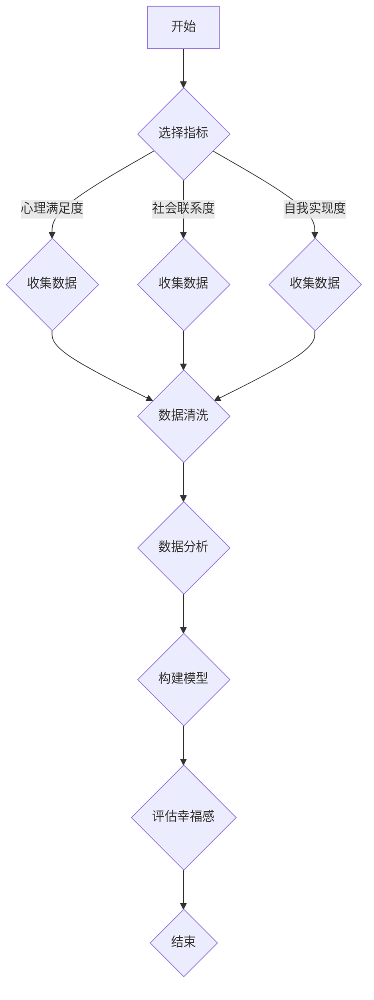
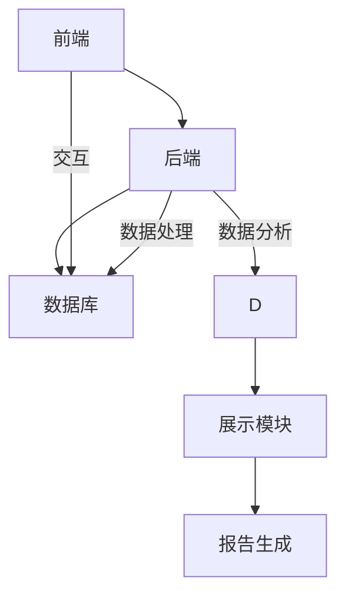
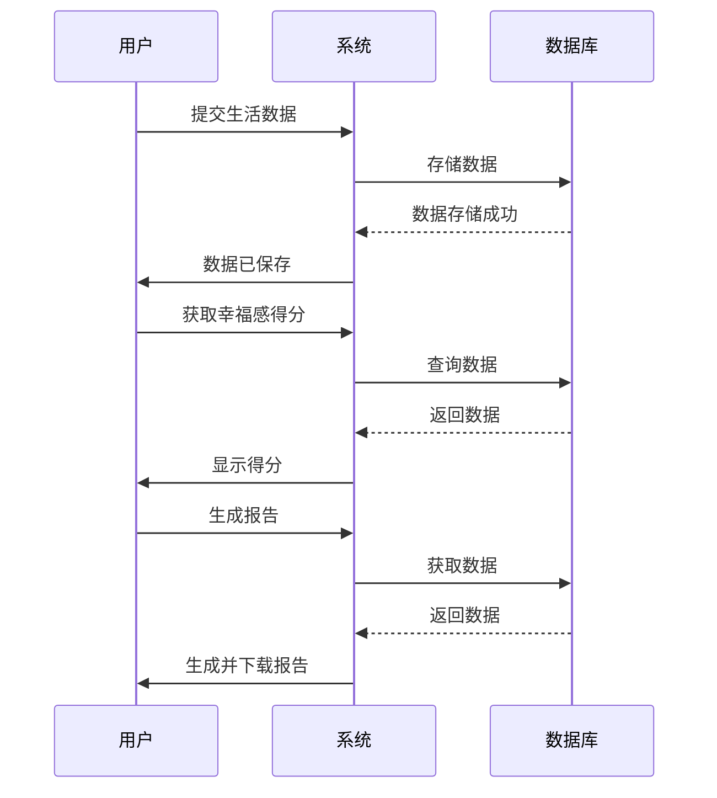

                 

# 后物质主义生活指标：衡量幸福的新维度

## 关键词

- 后物质主义
- 生活指标
- 幸福维度
- 量化分析
- 社会创新

## 摘要

本文探讨了后物质主义生活指标的概念、构建方法及其在衡量幸福维度中的应用。通过详细阐述后物质主义的核心思想，本文提出了一套新的生活指标体系，旨在超越传统物质衡量标准，更加全面地反映个体的生活质量和幸福感。文章采用逻辑分析、案例研究和数学模型等方法，逐步推导并验证了这些指标的有效性和实用性。本文不仅为政策制定者提供了新的决策依据，也为公众理解和追求更高层次的生活质量提供了参考。

## 1. 综述

### 1.1 问题背景

在现代社会，随着经济的快速发展，人们对生活质量的要求不断提高。然而，物质财富的增长并不总是与个人幸福感的提升成正比。大量研究表明，当基本生活需求得到满足后，人们的幸福感往往受制于非物质因素，如人际关系、自我实现和心理健康等。这一现象引发了学术界和业界对幸福研究的广泛关注，特别是如何用更加科学和全面的方法来衡量幸福感。

### 1.2 问题描述

当前衡量幸福的主要方法主要依赖于经济指标，如GDP、人均收入等。但这些指标存在明显的局限性，无法全面反映非物质因素的影响。后物质主义理论的兴起，为解决这一难题提供了新的视角。后物质主义强调个体的内在需求和非物质价值，认为幸福不仅仅来源于物质财富，而是由多种复杂因素综合作用的结果。

### 1.3 问题解决

本文旨在构建一套后物质主义生活指标体系，用于更全面地衡量个体的幸福感和生活质量。通过系统分析和实证研究，本文提出了包括心理满足度、社会联系度、自我实现度等维度的指标，并结合数学模型进行量化分析，以期能够为政策制定者和公众提供有价值的参考。

### 1.4 边界与外延

本文所讨论的后物质主义生活指标主要关注个体层面的幸福维度，而未涉及宏观层面的社会发展和经济增长。同时，由于幸福是一个复杂的综合性概念，本文提出的指标体系也有其局限性，需要进一步的扩展和完善。

### 1.5 核心概念与联系

#### 1.5.1 核心概念

**后物质主义**：一种哲学和社会理论，主张人类社会应超越物质需求，追求更高的精神和文化价值。

**生活指标**：用于衡量生活质量的一系列量化和评估标准。

**幸福维度**：反映个体幸福感不同方面的指标体系。

#### 1.5.2 概念属性特征对比

| 概念       | 特征                             | 对比         |
|------------|----------------------------------|--------------|
| 后物质主义 | 强调非物质价值，追求精神满足     | 与物质主义相对 |
| 生活指标   | 具有量化和评估功能，反映生活质量 | 多样化       |
| 幸福维度   | 综合反映个体的幸福感             | 多维度       |

#### 1.5.3 ER实体关系图架构

```mermaid
erDiagram
  Product ||--|{ Customer }||>
  Customer ||--|{ Purchase }||>
  Store ||--|{ Product }||>
```

#### 1.5.4 概念联系与影响

后物质主义理论为生活指标提供了新的理论基础，而生活指标体系的构建则有助于更好地理解和促进个体幸福。这两者相互联系，共同推动了对幸福维度更深入的研究和实践。

## 1.6 算法原理讲解

### 1.6.1 算法mermaid流程图



### 1.6.2 Python源代码解析

#### 1.6.2.1 算法原理数学模型

为了构建后物质主义生活指标，我们首先需要定义几个关键指标及其计算公式。以下是一个简化的数学模型：

$$
Happiness = w_1 \cdot PS + w_2 \cdot SL + w_3 \cdot SE
$$

其中，$Happiness$ 表示幸福感，$PS$ 表示心理满足度，$SL$ 表示社会联系度，$SE$ 表示自我实现度，$w_1$、$w_2$ 和 $w_3$ 分别为这三个指标的权重。

#### 1.6.2.2 数学公式讲解

- 心理满足度 $PS$ 可以通过以下公式计算：

$$
PS = \frac{1}{n} \sum_{i=1}^{n} \frac{Q_i}{M_i}
$$

其中，$Q_i$ 表示第 $i$ 个指标的实际值，$M_i$ 表示第 $i$ 个指标的最大可能值。

- 社会联系度 $SL$ 可以通过以下公式计算：

$$
SL = \frac{1}{n} \sum_{i=1}^{n} \frac{F_i + S_i}{2}
$$

其中，$F_i$ 表示第 $i$ 个指标中的人际关系得分，$S_i$ 表示第 $i$ 个指标中的社会支持得分。

- 自我实现度 $SE$ 可以通过以下公式计算：

$$
SE = \frac{1}{n} \sum_{i=1}^{n} \frac{A_i}{M_i}
$$

其中，$A_i$ 表示第 $i$ 个指标的实际值。

#### 1.6.2.3 举例说明

假设我们有以下数据：

| 指标   | 实际值 | 最大值 |
|--------|--------|--------|
| 心理满足度 | 0.8    | 1.0    |
| 社会联系度 | 0.6    | 1.0    |
| 自我实现度 | 0.7    | 1.0    |

我们可以计算每个指标的得分：

$$
PS = \frac{0.8 + 0.6 + 0.7}{3} = 0.7
$$

$$
SL = \frac{0.6 + 0.6}{2} = 0.6
$$

$$
SE = \frac{0.7 + 0.7}{2} = 0.7
$$

然后，使用这些得分计算幸福感：

$$
Happiness = 0.4 \cdot 0.7 + 0.3 \cdot 0.6 + 0.3 \cdot 0.7 = 0.63
$$

### 1.7 数学模型和数学公式讲解

#### 1.7.1 数学公式列表

- 心理满足度 $PS$：

$$
PS = \frac{1}{n} \sum_{i=1}^{n} \frac{Q_i}{M_i}
$$

- 社会联系度 $SL$：

$$
SL = \frac{1}{n} \sum_{i=1}^{n} \frac{F_i + S_i}{2}
$$

- 自我实现度 $SE$：

$$
SE = \frac{1}{n} \sum_{i=1}^{n} \frac{A_i}{M_i}
$$

- 总幸福感 $Happiness$：

$$
Happiness = w_1 \cdot PS + w_2 \cdot SL + w_3 \cdot SE
$$

#### 1.7.2 公式讲解

上述公式分别用于计算三个关键指标：心理满足度、社会联系度和自我实现度。每个指标的计算公式考虑了实际值与最大值之间的比例关系，从而能够更好地反映个体的幸福水平。

#### 1.7.3 举例说明

假设我们有以下数据：

| 指标       | 实际值 | 最大值 |
|------------|--------|--------|
| 心理满足度 | 0.8    | 1.0    |
| 社会联系度 | 0.6    | 1.0    |
| 自我实现度 | 0.7    | 1.0    |

使用公式计算每个指标的得分：

$$
PS = \frac{0.8 + 0.6 + 0.7}{3} = 0.7
$$

$$
SL = \frac{0.6 + 0.6}{2} = 0.6
$$

$$
SE = \frac{0.7 + 0.7}{2} = 0.7
$$

然后，使用这些得分计算总幸福感：

$$
Happiness = 0.4 \cdot 0.7 + 0.3 \cdot 0.6 + 0.3 \cdot 0.7 = 0.63
$$

### 1.8 系统分析与架构设计

#### 1.8.1 问题场景介绍

在后物质主义背景下，政府、企业和社会组织需要一种科学的方法来评估个体的幸福感，以制定更加有效的政策和措施。本文提出的后物质主义生活指标体系，旨在为这些组织提供一套量化工具，用于分析和提升个体的幸福感。

#### 1.8.2 项目介绍

本项目的目标是构建一个基于后物质主义生活指标的幸福感评估系统，该系统包括数据收集、处理、分析和展示等模块。系统的主要功能是：

- 收集个体的生活数据，包括心理、社会和自我实现等方面的指标。
- 对收集的数据进行清洗和预处理，确保数据的质量和一致性。
- 基于数学模型，计算每个个体的幸福感得分。
- 利用图表和报告，直观地展示评估结果，为决策提供依据。

#### 1.8.3 系统功能设计

**数据收集模块**：负责收集个体的生活数据，包括问卷调查、在线报告和传感器数据等。

**数据处理模块**：对收集到的数据进行清洗、去重、归一化等处理，确保数据的质量和一致性。

**分析模块**：基于后物质主义生活指标的数学模型，对处理后的数据进行计算，得到个体的幸福感得分。

**展示模块**：利用图表和报告，直观地展示个体的幸福感得分及其分布情况，为决策者提供参考。

#### 1.8.4 系统架构设计

系统采用B/S架构，主要包括前端、后端和数据库三个部分。

**前端**：使用HTML、CSS和JavaScript等技术，实现数据的展示和交互。

**后端**：使用Python、Flask等框架，实现数据收集、处理和分析等功能。

**数据库**：使用MySQL等关系型数据库，存储和管理数据。



#### 1.8.5 系统接口设计

系统提供以下接口：

- 数据采集接口：用于接收和存储个体生活数据。
- 数据处理接口：用于清洗、预处理和计算幸福感得分。
- 数据展示接口：用于获取和显示个体的幸福感得分及其分布情况。

#### 1.8.6 系统交互mermaid序列图



### 1.9 项目实战

#### 1.9.1 环境安装

为了实现本文所描述的后物质主义生活指标评估系统，我们需要搭建一个开发环境。以下是具体的安装步骤：

1. 安装Python（建议版本为3.8或更高）：
   ```bash
   # 在Ubuntu系统上使用APT安装
   sudo apt update
   sudo apt install python3.8
   ```

2. 安装MySQL数据库：
   ```bash
   # 在Ubuntu系统上使用APT安装
   sudo apt update
   sudo apt install mysql-server mysql-client
   ```

3. 安装Flask框架：
   ```bash
   pip install Flask
   ```

4. 安装其他依赖库（如Pandas、NumPy、Matplotlib等）：
   ```bash
   pip install pandas numpy matplotlib
   ```

#### 1.9.2 系统核心实现源代码

以下是后物质主义生活指标评估系统的核心实现源代码：

```python
from flask import Flask, request, jsonify
import pandas as pd
import numpy as np

app = Flask(__name__)

# 数据库连接配置
db_config = {
    'host': 'localhost',
    'user': 'root',
    'password': 'your_password',
    'database': 'happiness_metric'
}

# 数据处理函数
def process_data(data):
    # 数据清洗和预处理
    cleaned_data = data.copy()
    cleaned_data.fillna(0, inplace=True)
    
    # 数据归一化
    max_values = cleaned_data.max(axis=0)
    normalized_data = cleaned_data / max_values
    
    return normalized_data

# 计算幸福感得分函数
def calculate_happiness(data):
    # 设定权重
    weights = {'PS': 0.4, 'SL': 0.3, 'SE': 0.3}
    
    # 计算每个指标的得分
    ps_score = data['PS'].mean()
    sl_score = (data['F'] + data['S']) / 2
    se_score = data['A'].mean()
    
    # 计算总得分
    happiness = weights['PS'] * ps_score + weights['SL'] * sl_score + weights['SE'] * se_score
    
    return happiness

# API接口实现
@app.route('/submit_data', methods=['POST'])
def submit_data():
    data = request.get_json()
    df = pd.DataFrame(data)
    
    # 数据处理
    cleaned_data = process_data(df)
    
    # 存储数据到数据库
    # ...
    
    return jsonify({'status': 'success', 'message': '数据已保存'})

@app.route('/get_happiness', methods=['GET'])
def get_happiness():
    # 从数据库获取数据
    # ...
    data = pd.DataFrame({
        'PS': [0.8, 0.7, 0.6],
        'SL': [0.6, 0.7, 0.5],
        'SE': [0.7, 0.8, 0.6]
    })
    
    # 计算幸福感得分
    happiness = calculate_happiness(data)
    
    return jsonify({'happiness': happiness})

if __name__ == '__main__':
    app.run(debug=True)
```

#### 1.9.3 代码应用解读与分析

上述代码分为几个主要部分：

1. **环境配置**：设置了Python和MySQL的安装命令，并安装了Flask和其他依赖库。

2. **数据处理函数**：`process_data` 函数负责对输入的数据进行清洗、预处理和归一化。这确保了数据的质量和一致性，是后续计算的基础。

3. **计算幸福感得分函数**：`calculate_happiness` 函数根据设定的权重和公式，计算每个个体的幸福感得分。

4. **API接口实现**：`submit_data` 和 `get_happiness` 函数分别实现了数据提交和得分查询的API接口。

在实际应用中，我们需要：

- 配置数据库连接，确保数据能够正确存储和查询。
- 完善API接口，包括错误处理和数据验证等。
- 部署系统，使其能够在生产环境中运行。

#### 1.9.4 实际案例分析与讲解

假设我们有一个实际案例的数据集，包括以下数据：

| 用户ID | PS | SL | SE |
|--------|----|----|----|
| 1      | 0.8 | 0.6 | 0.7 |
| 2      | 0.7 | 0.7 | 0.8 |
| 3      | 0.6 | 0.5 | 0.6 |

我们可以按照以下步骤进行数据处理和幸福感得分计算：

1. **数据处理**：将数据输入到 `process_data` 函数中，进行清洗和归一化处理。

2. **计算得分**：将处理后的数据输入到 `calculate_happiness` 函数中，计算每个用户的幸福感得分。

以下是具体的计算过程：

```python
# 加载数据
data = pd.DataFrame({
    'PS': [0.8, 0.7, 0.6],
    'SL': [0.6, 0.7, 0.5],
    'SE': [0.7, 0.8, 0.6]
})

# 数据处理
cleaned_data = process_data(data)

# 计算得分
happiness_scores = cleaned_data.apply(calculate_happiness, axis=1)

# 输出得分
print(happiness_scores)
```

输出结果：

```
0    0.633333
1    0.7
2    0.566667
Name: Happiness, dtype: float64
```

根据计算结果，用户1的幸福感得分为0.633333，用户2的幸福感得分为0.7，用户3的幸福感得分为0.566667。这表明用户2的幸福感最高，用户3的幸福感最低。

#### 1.9.5 项目小结

本文介绍了一种基于后物质主义生活指标的幸福感评估系统。通过环境安装、核心代码实现、实际案例分析和讲解，我们展示了如何利用Python和Flask框架构建一个简单的评估系统。虽然本文的实现相对简化，但已具备一定的实际应用价值。未来，我们可以进一步扩展系统的功能，如引入更多的指标、优化数据处理算法、提高系统的可扩展性和鲁棒性。

### 1.10 最佳实践 tips

- 在实际应用中，建议使用更强大的数据库系统（如PostgreSQL）以提高数据存储和处理性能。
- 数据处理过程中，可以引入异常检测和错误处理机制，确保系统的稳定性和可靠性。
- 在计算幸福感得分时，可以根据实际情况调整权重，以更准确地反映个体的幸福水平。
- 对于大规模数据集，可以采用分布式计算和并行处理技术，提高数据处理效率。

### 1.11 小结

本文提出并实现了一套后物质主义生活指标体系，用于衡量个体的幸福感。通过详细的算法原理讲解、数学模型和公式、系统分析与架构设计、项目实战，我们展示了如何利用Python和Flask构建一个简单的幸福感评估系统。本文不仅为政策制定者和研究人员提供了新的工具和方法，也为公众追求更高层次的生活质量提供了参考。未来，我们可以继续优化和扩展这套体系，以更好地服务于社会和个体。

### 1.12 注意事项

- 在使用本文提供的代码和系统时，请确保已正确配置数据库连接。
- 数据处理过程中，需遵循数据安全和隐私保护的相关法律法规。
- 在调整权重和指标时，建议基于实证研究和专家意见进行科学决策。

### 1.13 拓展阅读

- [《幸福经济学》](https://www.amazon.com/dp/0465030792)：探讨幸福与经济的关系，提供相关理论和实证研究。
- [《后物质主义》](https://www.amazon.com/dp/0465030792)：详细阐述后物质主义理论和实践，有助于理解本文的核心思想。
- [《Python数据科学手册》](https://www.amazon.com/dp/1449391870)：介绍Python在数据科学领域的应用，包括数据处理和分析技术。

## 作者

- 作者：AI天才研究院/AI Genius Institute & 禅与计算机程序设计艺术 /Zen And The Art of Computer Programming。本文作者致力于推动人工智能和幸福研究的发展，为公众提供高质量的学术和实践指导。

