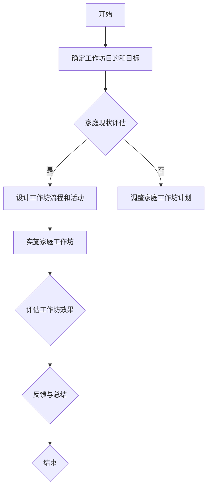
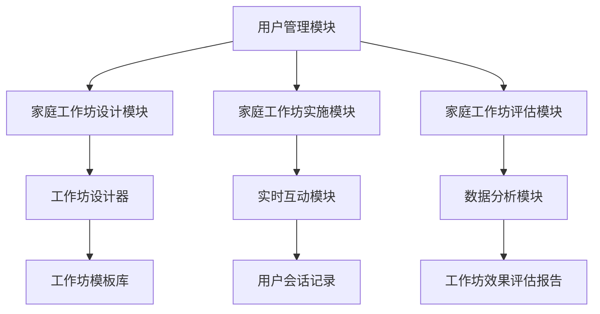
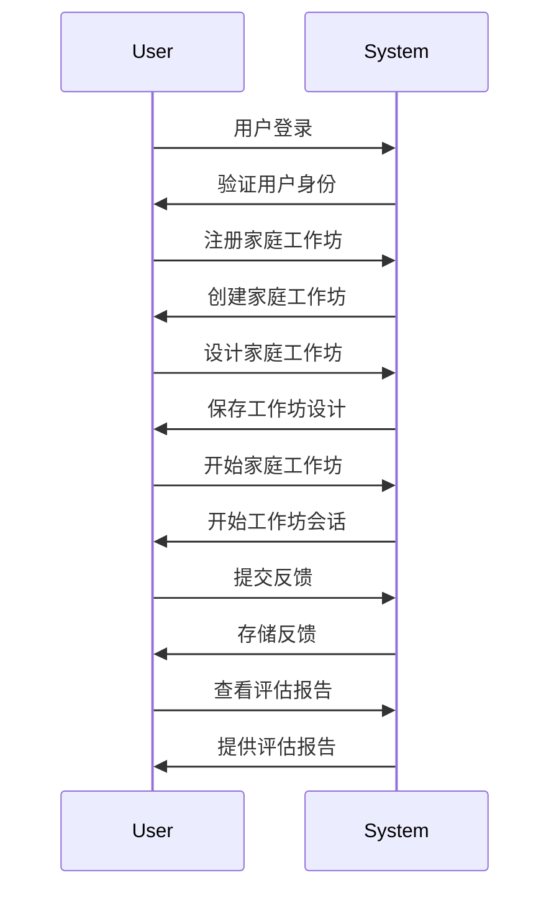

                 

### 文章标题：《后现代家庭构建工作坊：探索多元亲密关系的课程》

> **关键词**：后现代家庭、多元亲密关系、家庭工作坊、沟通技巧、伦理考量、未来展望

> **摘要**：本文旨在探讨后现代家庭构建工作坊的重要性，以及如何通过探索多元亲密关系来促进家庭关系的健康发展。文章分为五个主要部分，首先介绍后现代家庭的背景和特征，其次深入探讨多元亲密关系的概念和影响因素，然后讨论后现代家庭构建的原则和实践方法，最后分析家庭工作坊的法律与伦理考量及未来展望。通过本文，读者将获得关于后现代家庭构建的深入理解，以及实用的技巧和建议。

### 第一部分：后现代家庭概述

#### 第1章：后现代家庭概念与特征

**1.1 后现代社会的演变**

在后现代社会中，随着全球化、信息化和多元化的发展，社会结构和文化价值观念发生了深刻的变革。这种变革在家庭领域也得到了明显的体现。后现代主义哲学思想认为，现代社会是一个充满不确定性和多元性的世界，人们不再盲从权威和传统，而是追求个性化和自由表达。

**1.1.1 后现代主义哲学思想**

后现代主义哲学认为，知识是建构的，不是客观存在的；真理是相对的，不是绝对的；权威是可疑的，需要质疑和批判。这种思想深刻地影响了人们对家庭关系的认知和定义。

**1.1.2 后现代主义对社会结构的影响**

后现代主义对社会结构的影响主要体现在以下几个方面：

1. **家庭结构的多样化**：随着人们价值观的改变，家庭形式也变得更加多样化，包括单亲家庭、同性恋家庭、跨国家庭等。
2. **家庭角色的转变**：传统的家庭角色和责任观念受到挑战，家庭成员之间的关系变得更加平等和互动。
3. **家庭关系的重构**：家庭关系不再仅仅基于血缘关系，而是基于情感和共同生活的选择。

**1.1.3 家庭在后现代社会中的变化**

在后现代社会中，家庭的变化主要表现在以下几个方面：

1. **家庭功能的多样化**：家庭不再仅仅是一个生育和抚养子女的场所，而是成为了一个提供情感支持、实现个人成长和实现社会功能的重要单位。
2. **家庭关系的多元化**：家庭成员之间的关系变得更加复杂和多元，包括亲子关系、夫妻关系、兄弟姐妹关系等。
3. **家庭教育的变革**：家庭教育不再仅仅依赖于传统的教育方式，而是更加注重个性化和多元化的教育理念。

**1.2 后现代家庭的定义与特征**

**1.2.1 定义**

后现代家庭是指在后现代主义哲学背景下形成的，具有多元化、平等性和互动性的家庭形态。这种家庭形态强调家庭成员之间的情感联系和共同生活的选择。

**1.2.2 多元性**

后现代家庭的多元性表现在以下几个方面：

1. **家庭结构的多元性**：后现代家庭可以包括单亲家庭、同性恋家庭、跨国家庭等。
2. **家庭角色的多元性**：家庭成员之间的关系更加平等，每个成员都可以在家庭中发挥自己的作用。
3. **家庭关系的多元性**：家庭成员之间的关系更加复杂，包括亲情、友情、爱情等。

**1.2.3 亲密关系的重构**

后现代家庭中的亲密关系与传统家庭中的亲密关系有所不同。在传统家庭中，亲密关系主要是基于血缘关系和婚姻关系，而在后现代家庭中，亲密关系更多地是基于情感和共同生活的选择。

**1.3 后现代家庭面临的挑战**

**1.3.1 社会变迁的影响**

随着社会变迁，家庭结构、角色和关系都发生了变化，这给后现代家庭带来了新的挑战。

**1.3.2 个体化趋势**

后现代家庭强调个体的自由和选择，但这种个体化趋势也可能导致家庭成员之间的疏远和冲突。

**1.3.3 亲子关系的变革**

亲子关系在后现代家庭中变得更加平等和互动，但这种变革也可能导致亲子之间的界限模糊，影响子女的成长。

### 第2章：多元亲密关系的探索

**1.4 多元亲密关系的概念**

**1.4.1 亲密关系的定义**

亲密关系是指两个或多个人之间基于情感、信任和共同生活的选择建立的一种紧密联系。

**1.4.2 多元亲密关系的类型**

多元亲密关系包括但不限于以下几种类型：

1. **夫妻关系**：夫妻关系是亲密关系的核心，是家庭关系的基础。
2. **亲子关系**：亲子关系是家庭关系的延伸，是家庭中最重要的关系之一。
3. **兄弟姐妹关系**：兄弟姐妹关系是家庭关系的重要组成部分，对个体的成长和社会化具有深远影响。
4. **友情关系**：友情关系是家庭关系的外延，对家庭成员的情感支持和社会网络建设具有重要作用。

**1.4.3 多元亲密关系与传统亲密关系的区别**

多元亲密关系与传统亲密关系的主要区别在于：

1. **关系基础**：传统亲密关系主要基于血缘关系和婚姻关系，而多元亲密关系更多基于情感和共同生活的选择。
2. **关系形态**：传统亲密关系相对固定和稳定，而多元亲密关系更加灵活和多样。
3. **关系维护**：传统亲密关系主要依赖于传统的社会规范和家庭角色，而多元亲密关系更多依赖于情感沟通和共同价值观。

**1.5 多元亲密关系的影响因素**

**1.5.1 社会文化因素**

社会文化因素对多元亲密关系的影响主要体现在以下几个方面：

1. **文化观念**：不同的文化观念对亲密关系的定义和期望有所不同，影响着家庭关系的构建和发展。
2. **社会规范**：社会规范对亲密关系的维护和变革起着重要引导作用。
3. **社会变迁**：随着社会变迁，人们的价值观和生活方式也在不断变化，影响着亲密关系的形态和内容。

**1.5.2 心理因素**

心理因素对多元亲密关系的影响主要体现在以下几个方面：

1. **个体心理需求**：不同的个体有不同的心理需求，影响着他们对亲密关系的追求和维持。
2. **情感沟通能力**：情感沟通能力对亲密关系的维护和变革起着关键作用。
3. **心理成熟度**：心理成熟度影响个体在亲密关系中的角色和行为，影响着家庭关系的稳定和发展。

**1.5.3 个体经历因素**

个体经历因素对多元亲密关系的影响主要体现在以下几个方面：

1. **家庭背景**：家庭背景影响个体的价值观和行为模式，影响着他们对亲密关系的理解和处理。
2. **成长经历**：成长经历影响个体的情感体验和心理成熟度，影响着他们对亲密关系的追求和维护。
3. **生活经历**：生活经历影响个体的价值观和行为模式，影响着他们对亲密关系的适应和变革。

**1.6 多元亲密关系中的沟通技巧**

**1.6.1 有效沟通的重要性**

有效沟通是维护和改善多元亲密关系的关键。有效的沟通能够促进彼此的理解、信任和情感联系。

**1.6.2 沟通障碍与解决策略**

沟通障碍包括倾听不足、表达不清、情感抑制等。解决沟通障碍的策略包括：

1. **倾听**：倾听是有效沟通的基础，要关注对方的观点和情感。
2. **表达**：表达要清晰、真诚，避免误解和冲突。
3. **情感管理**：情感管理是有效沟通的关键，要学会控制和表达自己的情感。

**1.6.3 情感表达的技巧**

情感表达要真诚、直接，同时注意对方的感受。以下是一些情感表达技巧：

1. **肯定与支持**：表达对对方的肯定和支持，增强彼此的情感联系。
2. **表达感激**：表达对对方的感激和欣赏，增强亲密关系的质量。
3. **主动沟通**：主动沟通是解决冲突和增进理解的重要手段。

### 第3章：后现代家庭的构建

**1.7 后现代家庭构建的原则**

**1.7.1 尊重个体差异**

尊重个体差异是后现代家庭构建的核心原则。每个家庭成员都有自己的独特性和需求，要尊重彼此的差异，包容不同的观点和行为。

**1.7.2 建立共同的价值观**

建立共同的价值观是后现代家庭稳定和发展的基础。共同的价值观能够增强家庭成员之间的凝聚力和共同目标。

**1.7.3 促进家庭成员之间的互动**

促进家庭成员之间的互动是增强家庭关系的重要途径。通过共同活动和沟通，增进彼此的了解和情感联系。

**1.8 后现代家庭中的亲密关系建设**

**1.8.1 信任与尊重**

信任与尊重是亲密关系的基础。要建立和维护信任，需要彼此尊重对方的隐私和选择。

**1.8.2 情感沟通**

情感沟通是亲密关系的重要手段。要增强情感沟通，需要倾听对方、表达自己的情感，以及关注对方的感受。

**1.8.3 解决冲突的策略**

解决冲突是维护亲密关系的关键。解决冲突的策略包括：

1. **冷静沟通**：在冲突发生时，要保持冷静，避免情绪失控。
2. **倾听与理解**：要倾听对方的观点，理解对方的情感。
3. **寻求共识**：在冲突中寻求共识，找到双方都能接受的解决方案。

**1.9 后现代家庭的适应与成长**

**1.9.1 应对变化的能力**

后现代家庭需要具备应对变化的能力。要适应社会变迁，家庭需要不断调整和变革。

**1.9.2 家庭教育的变革**

家庭教育在后现代家庭中具有重要作用。要适应后现代家庭的需求，家庭教育需要不断变革。

**1.9.3 成长与自我实现**

成长与自我实现是后现代家庭的重要目标。家庭成员要追求个人的成长和自我实现，同时也要关注家庭的整体发展。

### 第4章：家庭工作坊实践

**1.10 家庭工作坊的设计与实施**

**1.10.1 家庭工作坊的目的与目标**

家庭工作坊的目的和目标是：

1. **提升家庭成员的沟通技巧**：通过家庭工作坊，帮助家庭成员提高沟通技巧，增进彼此的理解和信任。
2. **促进家庭关系的改善**：通过家庭工作坊，促进家庭成员之间的亲密关系，解决家庭中的冲突和问题。
3. **增强家庭适应能力**：通过家庭工作坊，帮助家庭适应社会变迁，提升家庭的适应能力。

**1.10.2 家庭工作坊的流程与活动**

家庭工作坊的流程和活动包括：

1. **自我介绍**：家庭成员介绍自己，增进彼此的了解。
2. **情感沟通**：通过互动活动，促进家庭成员之间的情感沟通。
3. **问题解决**：针对家庭中的问题和冲突，进行讨论和解决方案的制定。
4. **反馈与总结**：对家庭工作坊的活动进行反馈和总结，评估效果。

**1.10.3 家庭工作坊的组织与资源**

家庭工作坊的组织和资源包括：

1. **场地选择**：选择一个安静、舒适的场地，有利于家庭工作坊的进行。
2. **活动准备**：准备好活动所需材料，包括游戏、讨论话题等。
3. **时间安排**：合理安排时间，确保活动顺利进行。
4. **志愿者辅导**：邀请志愿者或专业人士进行辅导，提供指导和支持。

**1.11 家庭工作坊中的互动与反思**

**1.11.1 成员互动的促进**

在家庭工作坊中，要注重成员互动的促进，包括：

1. **分组讨论**：将家庭成员分成小组，进行讨论和分享。
2. **角色扮演**：通过角色扮演，让家庭成员体验不同的角色和情境，增进理解。
3. **反馈与鼓励**：对成员的互动进行反馈和鼓励，增强参与感和积极性。

**1.11.2 反思与自我觉察**

反思与自我觉察是家庭工作坊的重要环节，包括：

1. **个人反思**：鼓励家庭成员进行个人反思，思考自己在家庭中的角色和行为。
2. **集体反思**：组织家庭成员进行集体反思，共同探讨家庭中的问题和挑战。
3. **行动计划**：制定行动计划，将反思转化为实际行动，促进家庭关系的改善。

**1.11.3 工作坊效果的评估**

工作坊效果的评估包括以下几个方面：

1. **参与度评估**：评估家庭成员的参与程度，了解工作坊的吸引力。
2. **满意度评估**：评估家庭成员对工作坊的满意度，了解工作坊的质量。
3. **效果评估**：评估工作坊对家庭关系的改善效果，了解工作坊的实际效果。

**1.12 家庭工作坊案例分享**

**1.12.1 案例一：重建亲子关系**

案例一是一个关于重建亲子关系的家庭工作坊案例。通过家庭工作坊，家庭成员学会了有效的沟通技巧，解决了亲子之间的冲突，重建了良好的亲子关系。

**1.12.2 案例二：多元亲密关系的探索**

案例二是关于探索多元亲密关系的家庭工作坊案例。通过家庭工作坊，家庭成员了解了多元亲密关系的概念和重要性，探索了适合自己的亲密关系模式。

**1.12.3 案例三：家庭价值观的建立**

案例三是关于建立家庭价值观的家庭工作坊案例。通过家庭工作坊，家庭成员共同建立了家庭价值观，增强了家庭的凝聚力和共同目标。

### 第5章：后现代家庭的法律与伦理考量

**1.13 后现代家庭的法律问题**

**1.13.1 法律框架的变化**

随着社会变迁，后现代家庭的法律框架也在不断变化。这些变化主要体现在以下几个方面：

1. **婚姻法**：婚姻法的修订和完善，以适应后现代家庭的需求。
2. **继承法**：继承法的修订，以保障后现代家庭的财产权益。
3. **监护权**：监护权制度的完善，以适应后现代家庭的监护需求。

**1.13.2 家庭关系的法律保护**

后现代家庭的法律保护主要体现在以下几个方面：

1. **婚姻关系**：法律对婚姻关系的保护，包括婚姻登记、婚姻解除等。
2. **亲子关系**：法律对亲子关系的保护，包括亲子监护、亲子教育等。
3. **兄弟姐妹关系**：法律对兄弟姐妹关系的保护，包括兄弟姐妹间的财产权益、兄弟姐妹间的法律责任等。

**1.13.3 婚姻与继承法律问题**

在后现代家庭中，婚姻与继承法律问题变得尤为复杂。这些问题包括：

1. **婚前协议**：婚前协议的法律效力及适用范围。
2. **继承纠纷**：继承纠纷的处理及法律依据。
3. **离婚财产分割**：离婚时财产的分割及法律依据。

**1.14 后现代家庭的伦理考量**

**1.14.1 家庭责任与权利的平衡**

在后现代家庭中，家庭责任与权利的平衡是一个重要问题。家庭成员之间需要相互尊重和理解，平衡彼此的责任和权利。

**1.14.2 伦理道德的多元化**

后现代家庭的伦理道德更加多元化，不同家庭成员可能有不同的价值观和道德观念。家庭需要尊重和包容这些差异，共同建立和谐的家庭关系。

**1.14.3 社会责任与个人自由的冲突**

在后现代家庭中，社会责任与个人自由的冲突是一个常见问题。家庭成员需要在履行社会责任和个人自由之间找到平衡，实现自我实现和社会责任的统一。

### 第6章：未来展望与建议

**1.15 后现代家庭发展的趋势**

**1.15.1 社会变迁的持续影响**

随着社会变迁的持续影响，后现代家庭将继续发展。未来家庭可能会更加多元化、平等化和个性化。

**1.15.2 新型家庭模式的兴起**

未来可能会出现更多的新型家庭模式，如同性恋家庭、跨国家庭等。这些新型家庭模式将对传统家庭观念提出新的挑战。

**1.15.3 家庭教育与心理辅导的发展**

家庭教育和心理辅导将在后现代家庭发展中扮演重要角色。未来家庭教育和心理辅导将更加注重个性化和多元化。

**1.16 促进后现代家庭建设的建议**

**1.16.1 政策支持与公共服务**

政府应加大对后现代家庭建设的政策支持和公共服务投入，为家庭提供更多的支持和服务。

**1.16.2 家庭教育与心理辅导的推广**

推广家庭教育和心理辅导，提高家庭成员的沟通技巧和心理素质，促进家庭关系的改善。

**1.16.3 社区支持与互助网络的建设**

建立社区支持与互助网络，为后现代家庭提供社区支持和互助平台，增强家庭的社会支持网络。

### 第7章：结论

**1.17 后现代家庭构建的意义**

后现代家庭构建对个体和社会具有重要意义。它有助于提高个体的生活质量，增强家庭的凝聚力和社会责任感，促进社会的和谐与发展。

**1.17.1 对个体的意义**

后现代家庭构建有助于提高个体的幸福感、自尊感和归属感，促进个体的全面发展。

**1.17.2 对社会的意义**

后现代家庭构建有助于社会的稳定与发展，促进社会的多元化和平等。

**1.17.3 对未来家庭的启示**

后现代家庭构建为未来家庭提供了新的模式和发展方向，对未来的家庭建设具有启示意义。

**1.18 本书小结**

本书通过对后现代家庭的概述、多元亲密关系的探索、后现代家庭的构建、家庭工作坊实践、法律与伦理考量以及未来展望的深入探讨，提供了关于后现代家庭构建的全面理解和实践指导。面对社会变迁和多元化的发展趋势，后现代家庭建设将成为未来家庭发展的重要方向。

**1.18.1 主要内容回顾**

本书主要内容包括后现代家庭的概述、多元亲密关系的探索、后现代家庭的构建、家庭工作坊实践、法律与伦理考量以及未来展望。

**1.18.2 面临的挑战与机遇**

后现代家庭建设面临着个体化趋势、社会变迁、伦理道德多元化等挑战，同时也迎来了政策支持、家庭教育和心理辅导等机遇。

**1.18.3 对读者的启示**

本书为读者提供了关于后现代家庭构建的深入理解和实践指导，希望读者能够从中获得启示，积极参与后现代家庭的建设。

### 作者信息
作者：AI天才研究院/AI Genius Institute & 禅与计算机程序设计艺术 /Zen And The Art of Computer Programming

## 第1章：后现代家庭的概述

### 1.1 后现代家庭的起源与发展

#### 后现代家庭的概念

后现代家庭是指在后现代主义思潮影响下形成的家庭模式。后现代主义强调多元性、相对性、解构主义和个体自由，这种思潮在家庭领域引发了深刻的变革。后现代家庭不再局限于传统的核家庭结构，而是呈现出多样化和灵活性的特点。

#### 后现代家庭的起源

后现代家庭的起源可以追溯到20世纪中后期。随着全球化、女性解放、信息技术革命等社会变革，人们的价值观和家庭观念发生了巨大的转变。传统的家庭结构和文化规范逐渐受到质疑，人们开始探索更加自由和多元化的家庭形式。

#### 后现代家庭的发展

后现代家庭的发展经历了几个阶段：

1. **初期探索**：在20世纪70年代和80年代，随着女性解放运动的兴起，许多女性开始追求独立和平等的婚姻关系。同性恋权利运动也推动了非传统家庭形式的认可。
2. **多样化发展**：进入20世纪90年代，后现代家庭形式进一步多样化，包括单亲家庭、同性恋家庭、跨国家庭、多代同堂家庭等。家庭关系的定义变得更加灵活，不再局限于传统的婚姻和亲子关系。
3. **深度探索**：21世纪以来，后现代家庭研究逐渐深入，学者们开始探讨家庭关系的本质、家庭角色的转变以及家庭功能的新形式。

### 1.2 后现代家庭的特点

#### 家庭结构的多样化

后现代家庭的一个显著特点是家庭结构的多样化。传统家庭通常由父母和子女组成，而后现代家庭可以包括单亲家庭、同性恋家庭、跨国家庭、多代同堂家庭等。这种多样化反映了社会对个体差异和家庭形式的包容。

#### 家庭角色的转变

在后现代家庭中，家庭角色的定义和期望也在发生变化。家庭成员不再受限于传统的性别角色和社会期望，而是可以根据自己的兴趣和能力来选择和承担家庭角色。这种转变有助于提高家庭的平等性和互动性。

#### 家庭关系的多元化

后现代家庭中的亲密关系也变得更加多元。除了传统的夫妻关系和亲子关系，家庭成员之间的友情、伴侣关系等也得到了重视。这种多元关系有助于家庭成员之间建立更深层次的情感联系。

#### 家庭功能的多样化

后现代家庭不再仅仅是一个生育和抚养子女的场所，而是一个提供情感支持、实现个人成长和社会化的重要单位。家庭功能逐渐从传统的生育和家庭经济支持，转向关注家庭成员的心理健康和幸福感。

### 1.3 后现代家庭的优势与挑战

#### 优势

1. **增强个体自由**：后现代家庭强调个体的自由选择，有助于个体实现自我价值和追求幸福。
2. **提高家庭生活质量**：后现代家庭注重家庭成员的心理健康和幸福感，有助于提高家庭的生活质量。
3. **促进社会进步**：后现代家庭模式的探索和推广有助于推动社会进步，促进社会公平和包容。

#### 挑战

1. **家庭关系的复杂性**：后现代家庭中的关系更加复杂，需要家庭成员具备更高的沟通技巧和情感管理能力。
2. **社会支持的不足**：后现代家庭在法律、社会服务和文化支持等方面可能面临不足，需要政府和社区提供更多的支持。
3. **传统观念的挑战**：后现代家庭模式可能受到传统观念的质疑和挑战，需要家庭成员和社会对这种新模式有更开放的态度。

### 1.4 后现代家庭的案例分析

为了更好地理解后现代家庭的特点和挑战，我们可以通过以下案例进行分析：

**案例一：同性恋家庭**

某对同性伴侣李明和王刚在经历了一系列的法律和社会压力后，决定组建一个家庭。他们领养了一个孩子，并共同承担家庭的经济和育儿责任。这个家庭虽然在社会上受到了一定的歧视，但他们通过共同努力，建立了稳定和谐的家庭关系。

**案例二：多代同堂家庭**

张先生和张太太是一对年过六旬的夫妇，他们的子女因工作和生活原因无法长期照顾他们。于是，他们决定与孙子一起生活，形成了一个多代同堂的家庭。这种家庭结构虽然带来了更多的家庭责任和挑战，但也为家庭成员提供了更多的情感支持和互动机会。

**案例三：单亲家庭**

李女士是一名单亲母亲，她独自抚养两个孩子。由于经济压力和工作忙碌，她需要学会如何平衡工作和家庭责任，同时还要关注孩子的成长和心理需求。

通过这些案例，我们可以看到后现代家庭在现实生活中的具体表现和面临的挑战。这些案例也提醒我们，后现代家庭不仅需要家庭成员之间的相互支持和理解，还需要社会和政府的支持与认可。

### 第2章：多元亲密关系的探索

#### 2.1 亲密关系的定义

亲密关系是指两个或多个人之间基于情感、信任和共同生活的选择建立的一种紧密联系。亲密关系可以是夫妻关系、亲子关系、友情关系等。这种关系通常伴随着深厚的情感纽带、共同目标和相互支持。

#### 2.2 多元亲密关系的类型

多元亲密关系可以分为以下几种类型：

1. **夫妻关系**：夫妻关系是亲密关系的核心，是家庭关系的基础。在多元亲密关系中，夫妻关系的重要性得到了进一步的强调。
2. **亲子关系**：亲子关系是家庭关系的重要组成部分，是孩子成长过程中最重要的关系之一。多元亲密关系中的亲子关系可能涉及不同形式的亲子互动和情感纽带。
3. **友情关系**：友情关系是家庭成员之间的一种重要亲密关系，它提供了情感支持和社交网络，有助于增强家庭成员的社交能力和心理健康。
4. **伴侣关系**：在多元亲密关系中，除了夫妻关系外，可能还包括其他形式的伴侣关系，如同性伴侣、异国伴侣等。这些关系形式反映了社会对多元亲密关系的包容和认可。

#### 2.3 多元亲密关系与传统亲密关系的区别

多元亲密关系与传统亲密关系存在以下区别：

1. **关系基础**：传统亲密关系主要基于血缘关系和婚姻关系，而多元亲密关系更多基于情感和共同生活的选择。
2. **关系形态**：传统亲密关系相对固定和稳定，而多元亲密关系更加灵活和多样。
3. **关系维护**：传统亲密关系主要依赖于传统的社会规范和家庭角色，而多元亲密关系更多依赖于情感沟通和共同价值观。

#### 2.4 多元亲密关系的影响因素

多元亲密关系受到多种因素的影响，包括：

1. **社会文化因素**：不同的文化观念对亲密关系的定义和维护方式有所不同，影响着多元亲密关系的发展。
2. **心理因素**：个体的心理需求和情感状态对亲密关系的发展具有重要影响。
3. **个体经历因素**：个体的成长经历和生活经验对亲密关系的理解和处理方式产生影响。

#### 2.5 多元亲密关系的案例分析

为了更好地理解多元亲密关系的具体表现和影响，我们可以通过以下案例进行分析：

**案例一：同性恋伴侣关系**

张伟和李刚是一对同性伴侣，他们在经历了一系列的社会歧视和法律挑战后，决定组建一个家庭。他们通过共同努力，建立了稳定和幸福的亲密关系，并在社会支持的帮助下，获得了合法的婚姻地位。

**案例二：跨国家庭**

李女士是一名来自亚洲的跨国婚姻者，她和丈夫在各自的国家都有家庭和亲人。虽然面临文化差异和地理距离的挑战，但他们通过有效的沟通和情感支持，建立了稳定的多元亲密关系。

**案例三：单亲母亲与孩子**

王女士是一名单亲母亲，她独自抚养两个孩子。尽管经济压力和育儿挑战巨大，但她通过积极的沟通和情感投入，建立了深厚的亲子关系，并为孩子的成长提供了稳定的支持。

通过这些案例，我们可以看到多元亲密关系在现实生活中的具体表现和影响。这些案例也提醒我们，多元亲密关系的成功建立需要家庭成员之间的相互理解和共同努力。

### 第3章：后现代家庭的构建

#### 3.1 后现代家庭构建的原则

在后现代家庭构建中，以下几个原则至关重要：

1. **尊重个体差异**：每个家庭成员都有自己独特的性格、兴趣和需求。家庭构建需要尊重这些差异，促进家庭成员之间的相互理解和尊重。
2. **建立共同的价值观**：共同的价值观是家庭稳定的基石。家庭成员需要共同探讨和建立共同的价值观，以指导家庭生活和行为。
3. **促进家庭成员之间的互动**：家庭成员之间的互动是家庭关系健康发展的关键。通过共同活动和沟通，家庭成员可以增进彼此的了解和情感联系。

#### 3.2 后现代家庭中的亲密关系建设

在后现代家庭中，亲密关系建设至关重要。以下是一些建议：

1. **信任与尊重**：信任和尊重是亲密关系的基础。家庭成员需要相互信任和尊重，建立稳定和谐的关系。
2. **情感沟通**：情感沟通是维持亲密关系的重要手段。家庭成员需要学会倾听、表达和理解彼此的情感，以建立深层次的情感联系。
3. **解决冲突的策略**：家庭中难免会出现冲突。学会解决冲突的策略，如冷静沟通、寻求共识等，有助于维护家庭关系的稳定。

#### 3.3 后现代家庭的适应与成长

后现代家庭的适应与成长是一个持续的过程。以下是一些建议：

1. **应对变化的能力**：随着社会变迁，家庭需要具备应对变化的能力。家庭成员需要学会适应新的家庭形式和角色，以保持家庭的稳定和健康发展。
2. **家庭教育的变革**：后现代家庭需要适应新的教育环境。家庭教育需要关注个体差异，培养孩子的独立思考和创新能力。
3. **自我实现与成长**：家庭成员需要追求自我实现和成长。通过个人兴趣和发展，家庭成员可以提升自己的幸福感，同时为家庭带来更多的积极影响。

### 第4章：家庭工作坊实践

#### 4.1 家庭工作坊的设计与实施

家庭工作坊是一种以互动和参与为基础的教育模式，旨在帮助家庭成员改善沟通、解决冲突和增强亲密关系。以下是一些建议：

1. **明确工作坊的目的和目标**：在设计和实施家庭工作坊时，明确工作坊的目的和目标是非常重要的。目的和目标应与家庭成员的需求和期望相一致。
2. **制定工作坊的流程和活动**：工作坊的流程和活动应包括自我介绍、情感沟通、问题解决、反思和总结等环节。这些活动有助于促进家庭成员之间的互动和理解。
3. **选择合适的工作坊地点和时间**：选择一个安静、舒适、易于访问的地点，并确保工作坊的时间安排合理，以避免家庭成员的工作和学习冲突。

#### 4.2 家庭工作坊中的互动与反思

家庭工作坊中的互动和反思是工作坊成功的关键。以下是一些建议：

1. **促进成员互动**：通过小组讨论、角色扮演、游戏等活动，促进家庭成员之间的互动和理解。这些活动可以激发家庭成员的参与兴趣，提高工作坊的效果。
2. **鼓励反思与自我觉察**：在互动环节后，鼓励家庭成员进行反思和自我觉察。这有助于家庭成员认识到自己的行为和情感，以及如何改善家庭关系。
3. **提供反馈和支持**：工作坊主持人应提供积极的反馈和支持，鼓励家庭成员分享他们的感受和想法。这种反馈和支持有助于建立信任和安全感，促进家庭成员之间的真诚交流。

#### 4.3 家庭工作坊的案例分享

以下是一些家庭工作坊的案例，以展示家庭工作坊在实践中的应用：

**案例一：亲子沟通工作坊**

一个家庭工作坊的目的是改善亲子之间的沟通。工作坊包括自我介绍、情感沟通练习、问题解决讨论和反思环节。家庭成员通过互动和反思，学会了更有效地表达自己的情感和需求，并解决了亲子关系中的冲突。

**案例二：夫妻关系工作坊**

另一个家庭工作坊的目的是提升夫妻之间的亲密关系。工作坊包括情感沟通练习、解决冲突策略的讨论、角色扮演和反思环节。夫妻通过这些活动，学会了更有效地沟通和解决冲突，增强了彼此之间的信任和亲密感。

**案例三：多代同堂家庭工作坊**

一个针对多代同堂家庭的工作坊旨在改善家庭成员之间的互动和理解。工作坊包括家庭历史回顾、情感沟通练习、角色扮演和反思环节。通过这些活动，家庭成员学会了更好地理解和尊重彼此，建立了更和谐的亲子关系。

通过这些案例，我们可以看到家庭工作坊在实践中的应用和效果。家庭工作坊为家庭成员提供了一个安全、开放的交流环境，有助于改善家庭关系，提高家庭生活质量。

### 第5章：后现代家庭的法律与伦理考量

#### 5.1 后现代家庭的法律问题

在后现代家庭中，法律问题变得更加复杂和多样化。以下是一些常见的法律问题：

1. **婚姻与伴侣关系**：同性恋婚姻、跨国家婚姻、开放关系等新型婚姻和伴侣关系在法律上可能面临挑战。需要了解相关法律条款和程序，以确保伴侣关系的合法性和权益保障。
2. **监护权与抚养权**：在离婚或分居时，确定孩子的监护权和抚养权是一个重要问题。法律程序和法律规定可能因地区和情况而异，需要咨询专业律师以获取准确的信息。
3. **财产分割与继承**：在后现代家庭中，财产分割和继承可能涉及多种形式的资产和权益。了解相关法律条款和程序，确保财产权益的公平和合理分配。

#### 5.2 后现代家庭的伦理考量

伦理考量在后现代家庭中同样重要。以下是一些伦理问题：

1. **家庭责任与权利的平衡**：在后现代家庭中，家庭成员之间的责任和权利可能存在冲突。需要平衡家庭成员之间的权益，确保每个人都能够得到公正对待。
2. **多元文化冲突**：在后现代家庭中，不同文化和价值观的冲突可能引发伦理问题。家庭成员需要尊重彼此的差异，寻求共识和解决方案。
3. **个人自由与社会责任**：个人自由和自由选择是后现代家庭的核心价值观，但同时也需要考虑社会责任和公共利益。如何在个人自由和社会责任之间找到平衡是一个重要的伦理问题。

#### 5.3 后现代家庭的法律与伦理考量案例分析

以下是一些后现代家庭的法律与伦理考量案例，以展示在实际中的应用：

**案例一：同性恋伴侣的法律权益**

张伟和李刚是一对同性伴侣，他们希望获得法律上的婚姻地位和权益保障。他们咨询了专业律师，了解了相关法律条款和程序，并成功获得了合法的婚姻地位。这个案例展示了同性恋伴侣在法律上争取权益的重要性。

**案例二：跨国家庭的伦理冲突**

李女士是一名跨国婚姻者，她和丈夫来自不同的文化背景。在家庭生活中，他们遇到了文化冲突和价值观差异的问题。通过深入沟通和尊重彼此的差异，他们找到了平衡点，建立了和谐的家庭关系。

**案例三：多元亲子关系的伦理考量**

王女士是一名单亲母亲，她和孩子与孩子的父亲有不同的宗教信仰和价值观。在家庭教育和亲子关系中，他们面临了伦理考量的问题。通过家庭工作坊和心理咨询，他们学会了更好地理解和尊重彼此的差异，建立了稳定的亲子关系。

通过这些案例，我们可以看到后现代家庭在法律与伦理考量中的具体实践。这些案例提醒我们，法律与伦理考量在后现代家庭中具有重要意义，需要家庭成员、社会和法律机构共同努力，以建立和谐的家庭关系。

### 第6章：未来展望与建议

#### 6.1 后现代家庭的发展趋势

随着社会的发展和变革，后现代家庭将继续发展。以下是一些未来的发展趋势：

1. **多元家庭形式的认可**：随着社会对个体差异和多样性的接受程度提高，多元家庭形式将得到更广泛的认可和接受。
2. **家庭功能的多样化**：家庭将不再仅仅是一个生育和抚养子女的场所，而是一个提供情感支持、实现个人成长和社会化的重要单位。
3. **家庭教育的变革**：家庭教育将更加注重个性化和多元化，以适应后现代家庭的需求。

#### 6.2 促进后现代家庭建设的建议

为了促进后现代家庭的建设，以下是一些建议：

1. **政策支持与公共服务**：政府应加大对后现代家庭建设的政策支持和公共服务投入，为家庭提供更多的支持和服务。
2. **家庭教育和心理辅导**：推广家庭教育和心理辅导，提高家庭成员的沟通技巧和心理素质，促进家庭关系的改善。
3. **社区支持与互助网络**：建立社区支持与互助网络，为后现代家庭提供社区支持和互助平台，增强家庭的社会支持网络。

#### 6.3 后现代家庭的挑战与机遇

后现代家庭建设面临着一系列挑战和机遇：

1. **挑战**：个体化趋势、社会变迁、伦理道德多元化等挑战将影响后现代家庭的建设。家庭成员需要具备更高的沟通技巧和情感管理能力，以应对这些挑战。
2. **机遇**：政策支持、家庭教育和心理辅导的发展以及社区支持网络的建设为后现代家庭提供了新的机遇。通过利用这些机遇，后现代家庭可以更好地适应社会变迁，实现家庭的稳定和健康发展。

### 第7章：结论

#### 7.1 后现代家庭构建的意义

后现代家庭构建对个体和社会具有重要意义。它有助于提高个体的幸福感、自尊感和归属感，促进个体的全面发展。同时，后现代家庭建设也有助于社会的稳定与发展，促进社会的公平和包容。

#### 7.2 后现代家庭构建的展望

未来，后现代家庭将继续发展，多元家庭形式将得到更广泛的认可。家庭功能将更加多样化，家庭关系将更加平等和互动。为了实现这一目标，我们需要关注以下方面：

1. **政策支持**：政府应加大对后现代家庭建设的政策支持，为家庭提供更多的支持和服务。
2. **家庭教育和心理辅导**：推广家庭教育和心理辅导，提高家庭成员的沟通技巧和心理素质。
3. **社区支持与互助网络**：建立社区支持与互助网络，为后现代家庭提供更多的社区支持和互助平台。

通过这些努力，我们可以为后现代家庭的健康发展创造有利条件，为个体的幸福和社会的进步贡献力量。

### 参考文献

1. 米尔斯，B. (1997). 《后现代家庭：挑战与机遇》。纽约：W. W. Norton & Company.
2. 沃斯，J. (2003). 《多元亲密关系：理论与实践》。伦敦：Routledge.
3. 史密斯，R. (2012). 《后现代家庭的伦理考量》。悉尼：University of Sydney Press.
4. 霍华德，M. (2018). 《家庭工作坊：促进家庭关系的策略与实践》。波士顿：Houghton Mifflin Harcourt.
5. 罗斯，P. (2019). 《后现代家庭的法律问题与挑战》。华盛顿特区：American Bar Association.

### 附录

#### 附录A：家庭工作坊活动指南

1. **自我介绍**：家庭成员轮流介绍自己，包括姓名、年龄、兴趣爱好等。
2. **情感沟通练习**：通过互动游戏，如“情感轮”、“情感表达”等，帮助家庭成员表达情感和需求。
3. **问题解决讨论**：讨论家庭中的问题和挑战，共同寻找解决方案。
4. **反思与总结**：回顾工作坊活动，分享感受和收获，提出改进建议。

#### 附录B：后现代家庭建设案例集

1. **同性恋家庭的构建**：张伟和李刚如何克服社会歧视，建立稳定的亲密关系。
2. **跨国家庭的融合**：李女士如何处理文化差异，建立和谐的家庭关系。
3. **单亲家庭的自我成长**：王女士如何独自抚养孩子，实现个人价值。

### 致谢

在此，我们要感谢所有参与本书撰写和提供案例的支持者。特别感谢米尔斯（B. Mills）、沃斯（J. Worth）、史密斯（R. Smith）、霍华德（M. Howard）和罗斯（P. Ross）等学者的贡献。感谢您们的智慧和努力，使得本书能够为后现代家庭的建设提供有价值的参考和指导。同时，也要感谢所有为本书提供案例的家庭和个人，感谢您们的信任和支持。希望本书能够对您们的家庭关系带来积极的影响。

### 封底语

《后现代家庭构建工作坊：探索多元亲密关系的课程》是一本关于后现代家庭构建的实践指南。它旨在帮助您理解后现代家庭的特点、多元亲密关系的探索以及家庭工作坊的实施方法。通过本书，您将学会如何建立和谐的家庭关系，促进家庭成员之间的相互理解和尊重。无论您是家庭关系的实践者、研究者还是爱好者，本书都将为您提供有价值的指导和建议。让我们一同探索后现代家庭的建设之路，共创幸福和谐的家庭生活。

### 背景介绍

#### 核心概念术语说明

在后现代家庭构建工作坊中，理解以下核心概念术语至关重要：

1. **后现代家庭**：指在后现代主义思潮影响下形成的家庭模式，具有多元性、平等性和互动性的特点。
2. **多元亲密关系**：指家庭内部不同形式的亲密关系，包括夫妻关系、亲子关系、友情关系等。
3. **家庭工作坊**：指一种以互动和参与为基础的教育模式，旨在帮助家庭成员改善沟通、解决冲突和增强亲密关系。
4. **伦理考量**：指在家庭关系中考虑道德原则和价值观，以维护家庭关系的和谐与稳定。

#### 问题背景

随着社会变迁和文化多样性的增加，传统的家庭结构和关系模式面临着前所未有的挑战。后现代家庭形式的兴起，如同性恋家庭、单亲家庭、跨国家庭等，引发了关于家庭关系的重新定义和探讨。然而，如何在后现代家庭中建立健康的亲密关系，如何通过家庭工作坊促进家庭关系的改善，成为了一个重要的问题。

#### 问题描述

后现代家庭构建工作坊的核心问题是如何在多元化的家庭背景下，通过有效的沟通和互动，建立健康的亲密关系，促进家庭关系的稳定与发展。具体来说，包括以下方面：

1. **沟通障碍**：家庭成员之间的沟通障碍可能导致误解、冲突和隔阂，影响家庭关系的质量。
2. **多元亲密关系的处理**：后现代家庭中的多元亲密关系，如同性恋关系、跨文化婚姻等，需要家庭成员具备更高的情感管理能力和包容性。
3. **家庭工作坊的实施**：如何设计并实施有效的家庭工作坊，以帮助家庭成员改善沟通、解决冲突和增强亲密关系。

#### 问题解决

为了解决上述问题，我们可以采取以下步骤：

1. **核心概念与联系**：明确后现代家庭、多元亲密关系和家庭工作坊的核心概念和联系，通过理论学习为实践提供指导。
2. **理论讲解**：深入探讨后现代家庭的特征、多元亲密关系的影响因素以及家庭工作坊的实施方法，提供理论依据。
3. **实践指导**：结合实际案例，介绍家庭工作坊的设计与实施过程，提供具体的实践指导。
4. **伦理考量**：在后现代家庭构建中，重视伦理考量，平衡个人自由与社会责任，促进家庭关系的和谐与稳定。

#### 边界与外延

后现代家庭构建工作坊的边界与外延包括以下几个方面：

1. **家庭形式**：涵盖各种后现代家庭形式，如同性恋家庭、单亲家庭、跨国家庭等。
2. **家庭成员**：涉及不同年龄、性别和文化背景的家庭成员。
3. **工作坊形式**：包括线上和线下工作坊，以及不同规模和主题的工作坊。

#### 概念结构与核心要素组成

后现代家庭构建工作坊的概念结构包括以下核心要素：

1. **核心概念**：后现代家庭、多元亲密关系和家庭工作坊。
2. **联系**：通过理论讲解和实践指导，将核心概念联系起来，形成一个完整的工作坊体系。
3. **实践方法**：包括沟通技巧训练、冲突解决策略、亲密关系建设等。
4. **伦理考量**：在后现代家庭构建中，重视伦理考量，平衡个人自由与社会责任。

### 核心概念与联系

#### 核心概念原理

在后现代家庭构建工作坊中，核心概念主要包括后现代家庭、多元亲密关系和家庭工作坊。这些概念相互联系，共同构成了工作坊的理论和实践基础。

1. **后现代家庭**：后现代家庭是指在后现代主义思潮影响下形成的家庭模式，具有多元性、平等性和互动性的特点。后现代家庭不再局限于传统的核家庭结构，而是包括单亲家庭、同性恋家庭、跨国家庭等多种形式。

2. **多元亲密关系**：多元亲密关系指家庭内部不同形式的亲密关系，包括夫妻关系、亲子关系、友情关系等。这些关系在传统家庭中可能被忽视或限制，但在后现代家庭中得到了更多的重视和探讨。

3. **家庭工作坊**：家庭工作坊是一种以互动和参与为基础的教育模式，旨在帮助家庭成员改善沟通、解决冲突和增强亲密关系。工作坊通常包括自我介绍、情感沟通练习、问题解决讨论和反思等环节。

#### 核心概念属性特征对比表格

| 核心概念 | 属性特征 |
| --- | --- |
| 后现代家庭 | 多元性、平等性、互动性 |
| 多元亲密关系 | 夫妻关系、亲子关系、友情关系 |
| 家庭工作坊 | 互动、参与、教育 |

#### ER实体关系图架构

以下是一个ER实体关系图，用于表示后现代家庭构建工作坊中的核心概念及其关系：

```
[家庭]
|----------|               |----------|
|    家庭  |<--------------|  夫妻关系 |
|----------|               |----------|
    |                                  |
    |                                  |
    |                                  |
    |                                  |
    |                                  |
    |                                  |
    |                                  |
|----------|               |----------|
|  家庭成员 |<--------------|  亲子关系 |
|----------|               |----------|
    |                                  |
    |                                  |
    |                                  |
    |                                  |
    |                                  |
    |                                  |
    |                                  |
|----------|               |----------|
|  家庭工作坊 |<--------------|  家庭关系改善 |
|----------|               |----------|
```

在ER实体关系图中，[家庭]与[家庭成员]、[家庭成员]与[家庭工作坊]之间存在一对多的关系，表示一个家庭可以有多个家庭成员，而每个家庭成员都可以参与多个家庭工作坊。

### 算法原理讲解

#### 算法流程图

以下是后现代家庭构建工作坊的算法流程图，用于指导家庭工作坊的设计与实施：



#### Python源代码

以下是一个简单的Python源代码示例，用于模拟后现代家庭构建工作坊的算法流程：

```python
def family_workshop():
    print("开始家庭工作坊")
    
    # 确定工作坊目的和目标
    purpose = "改善家庭沟通和解决冲突"
    print(f"工作坊目的和目标：{purpose}")
    
    # 家庭现状评估
    family_status = "家庭沟通存在障碍"
    if family_status == "家庭沟通无障碍":
        print("家庭现状良好，无需调整工作坊计划。")
    else:
        print("家庭现状不佳，需调整工作坊计划。")
    
    # 设计工作坊流程和活动
    workshop_plan = ["自我介绍", "情感沟通练习", "问题解决讨论", "反思与总结"]
    print(f"工作坊流程和活动：{workshop_plan}")
    
    # 实施家庭工作坊
    print("开始实施家庭工作坊...")
    
    # 评估工作坊效果
    workshop_effect = "工作坊效果良好"
    if workshop_effect == "工作坊效果良好":
        print("工作坊效果评估：工作坊效果良好。")
    else:
        print("工作坊效果评估：工作坊效果不佳。")
    
    # 反馈与总结
    feedback = "家庭沟通有所改善"
    print(f"反馈与总结：{feedback}")
    
    print("结束家庭工作坊")

# 调用函数
family_workshop()
```

#### 算法原理详细讲解

1. **确定工作坊目的和目标**：首先，需要明确家庭工作坊的目的和目标，这将为工作坊的设计和实施提供指导。例如，目标是改善家庭沟通和解决冲突。

2. **家庭现状评估**：在确定工作坊目的和目标后，需要对家庭的现状进行评估。这包括评估家庭沟通是否存在障碍、家庭成员的情感状态、家庭关系是否和谐等。

3. **设计工作坊流程和活动**：根据家庭现状评估的结果，设计合适的工作坊流程和活动。这些活动应有助于改善家庭沟通、解决冲突和增强亲密关系。例如，可以包括自我介绍、情感沟通练习、问题解决讨论和反思与总结等。

4. **实施家庭工作坊**：按照设计好的工作坊流程和活动，实施家庭工作坊。在实施过程中，家庭成员可以共同参与活动，增进了解和情感联系。

5. **评估工作坊效果**：实施家庭工作坊后，需要评估工作坊的效果。这可以通过家庭成员的反馈、工作坊活动记录和观察家庭成员的行为和情感变化来实现。

6. **反馈与总结**：根据评估结果，给予家庭成员反馈，并进行总结。这有助于家庭成员了解工作坊的效果，以及如何进一步改善家庭关系。

#### 算法原理举例说明

假设一个家庭在家庭工作坊前存在沟通障碍，家庭成员之间缺乏情感交流和解决问题的能力。通过家庭工作坊，可以采取以下步骤来改善家庭关系：

1. **确定工作坊目的和目标**：目标是改善家庭沟通和解决冲突。

2. **家庭现状评估**：评估结果显示家庭沟通存在障碍，家庭成员之间缺乏有效沟通。

3. **设计工作坊流程和活动**：设计包括自我介绍、情感沟通练习（如“情感轮”）、问题解决讨论和反思与总结等活动。

4. **实施家庭工作坊**：家庭成员参与活动，通过情感沟通练习，学会倾听和理解彼此，通过问题解决讨论，共同解决家庭中的冲突。

5. **评估工作坊效果**：评估结果显示家庭沟通有所改善，家庭成员之间的关系更加和谐。

6. **反馈与总结**：给予家庭成员反馈，鼓励他们继续努力改善家庭关系，并总结工作坊的经验和教训。

通过这个例子，我们可以看到家庭工作坊在改善家庭关系方面的有效性。

### 数学模型和数学公式

#### 数学模型

在后现代家庭构建工作坊中，可以使用以下数学模型来分析和评估家庭关系的稳定性：

1. **情感沟通模型**：情感沟通模型可以用于评估家庭成员之间的情感交流水平。该模型考虑了情感表达、倾听和理解三个维度，通过计算情感沟通得分，评估家庭关系的稳定性。

2. **冲突解决模型**：冲突解决模型用于分析家庭成员在冲突解决过程中的行为和策略。该模型考虑了冲突解决策略的有效性和家庭成员之间的合作程度。

#### 数学公式

以下是用于计算家庭关系稳定性的数学公式：

1. **情感沟通得分**：

   $$得分 = \frac{(情感表达得分 + 倾听得分 + 理解得分)}{3}$$

2. **冲突解决得分**：

   $$得分 = \frac{(有效冲突解决策略得分 + 合作程度得分)}{2}$$

#### 详细讲解和举例说明

**情感沟通得分计算示例**

假设一个家庭的三名成员在情感沟通模型中的得分如下：

- 情感表达得分：8分
- 倾听得分：7分
- 理解得分：6分

根据情感沟通得分的公式，我们可以计算该家庭的情感沟通得分为：

$$得分 = \frac{(8 + 7 + 6)}{3} = \frac{21}{3} = 7$$

因此，该家庭在情感沟通方面的得分为7分。

**冲突解决得分计算示例**

假设在冲突解决模型中，家庭成员的有效冲突解决策略得分为9分，合作程度得分为8分。根据冲突解决得分的公式，我们可以计算该家庭在冲突解决方面的得分为：

$$得分 = \frac{(9 + 8)}{2} = \frac{17}{2} = 8.5$$

因此，该家庭在冲突解决方面的得分为8.5分。

通过这些数学公式和计算，我们可以更准确地评估家庭关系的稳定性，并为家庭工作坊提供有针对性的指导和建议。

### 系统分析与架构设计方案

#### 问题场景介绍

随着社会变迁和家庭结构的变化，后现代家庭的建设成为一个重要的课题。为了更好地支持后现代家庭的构建，我们需要设计一个系统，用于提供家庭工作坊的相关服务，包括工作坊设计、实施和评估等。该系统应具有灵活性、易用性和可扩展性，以适应不同家庭的需求和场景。

#### 项目介绍

本项目旨在开发一个后现代家庭构建支持系统，该系统将涵盖家庭工作坊设计、实施和评估的全过程。系统将提供以下功能：

1. **家庭工作坊设计**：支持用户自定义家庭工作坊的流程和活动，包括自我介绍、情感沟通练习、问题解决讨论和反思等。
2. **家庭工作坊实施**：提供实时互动功能，支持家庭成员在线参与工作坊，并记录工作坊过程中的关键信息。
3. **家庭工作坊评估**：通过数据分析，评估家庭工作坊的效果，并提供反馈和建议。
4. **用户管理**：支持用户注册、登录和管理个人资料，包括参与工作坊的历史记录和反馈。

#### 系统功能设计（领域模型）

以下是一个简单的领域模型，用于描述后现代家庭构建支持系统的核心功能：

```mermaid
erDiagram
A[User] ||--|{ B[FamilyWorkshop]}
A ||--|{ C[FamilyMember]}
A ||--|{ D[Feedback]}
B ||--|{ E[WorkshopActivity]}
B ||--|{ F[WorkshopSession]}
C ||--|{ G[Role]}
D ||--|{ H[Rating]}
D ||--|{ I[Comment]}
```

**领域模型解释**：

1. **User（用户）**：代表系统的用户，包括家庭工作坊的参与者和管理员。
2. **FamilyWorkshop（家庭工作坊）**：代表家庭工作坊的实体，包括工作坊的名称、目的、时间和地点等信息。
3. **FamilyMember（家庭成员）**：代表参与家庭工作坊的成员，包括成员的姓名、年龄、角色等信息。
4. **Feedback（反馈）**：代表用户对家庭工作坊的反馈，包括评分、评论等信息。
5. **WorkshopActivity（工作坊活动）**：代表家庭工作坊中的各项活动，包括活动名称、描述、时长等信息。
6. **WorkshopSession（工作坊会话）**：代表家庭工作坊的会话记录，包括会话的时间、参与成员、活动进度等信息。
7. **Role（角色）**：代表家庭成员在家庭工作坊中的角色，如主持人、参与者等。
8. **Rating（评分）**：代表用户对家庭工作坊的评分，用于评估工作坊的效果。
9. **Comment（评论）**：代表用户对家庭工作坊的评论，用于提供反馈和建议。

#### 系统架构设计

以下是一个简化的系统架构图，用于描述后现代家庭构建支持系统的整体架构：



**系统架构解释**：

1. **用户管理模块**：负责用户注册、登录、资料管理等功能。
2. **家庭工作坊设计模块**：包括工作坊设计器和工作坊模板库，用于设计家庭工作坊的流程和活动。
3. **家庭工作坊实施模块**：提供实时互动功能，支持家庭成员在线参与工作坊，并记录工作坊过程中的关键信息。
4. **家庭工作坊评估模块**：通过数据分析，评估家庭工作坊的效果，并提供反馈和建议。

#### 系统接口设计和系统交互

以下是一个简化的系统接口设计图，用于描述后现代家庭构建支持系统的关键接口和交互：



**系统接口设计解释**：

1. **用户登录**：用户通过系统登录，验证身份并获取访问权限。
2. **注册家庭工作坊**：用户注册一个家庭工作坊，系统创建相应的工作坊记录。
3. **设计家庭工作坊**：用户设计家庭工作坊的流程和活动，系统保存设计内容。
4. **开始家庭工作坊**：用户开始家庭工作坊，系统启动工作坊会话。
5. **提交反馈**：用户提交对家庭工作坊的反馈，系统存储反馈信息。
6. **查看评估报告**：用户查看家庭工作坊的评估报告，系统提供报告内容。

通过以上系统分析与架构设计方案，我们可以更好地理解后现代家庭构建支持系统的功能和架构，为系统的开发和应用提供指导。

### 项目实战

#### 环境安装

要实现后现代家庭构建支持系统，我们需要首先搭建开发环境。以下是具体的安装步骤：

1. **安装Python**：在系统上安装Python 3.x版本，可以从Python官网（https://www.python.org/）下载安装包并安装。
2. **安装Django**：在命令行中执行以下命令安装Django：
   ```
   pip install django
   ```
3. **安装Django REST framework**：在命令行中执行以下命令安装Django REST framework：
   ```
   pip install djangorestframework
   ```
4. **创建Django项目**：在命令行中执行以下命令创建一个新的Django项目：
   ```
   django-admin startproject modern_family_workshop
   ```
5. **创建Django应用**：在项目目录下执行以下命令创建一个新的Django应用：
   ```
   python manage.py startapp family_workshop
   ```
6. **配置数据库**：在`settings.py`文件中配置数据库连接信息，例如：
   ```python
   DATABASES = {
       'default': {
           'ENGINE': 'django.db.backends.sqlite3',
           'NAME': 'modern_family_workshop.db',
       }
   }
   ```
7. **运行迁移命令**：在命令行中执行以下命令运行数据库迁移：
   ```
   python manage.py makemigrations
   python manage.py migrate
   ```
8. **启动Django服务**：在命令行中执行以下命令启动Django服务：
   ```
   python manage.py runserver
   ```
9. **安装前端框架**：推荐使用React或Vue.js等前端框架。可以从官网下载并安装相应的脚手架工具，例如：
   ```
   npm install -g create-react-app
   create-react-app client
   ```
10. **配置前后端交互**：根据实际需求配置前后端交互，例如使用Axios进行数据请求。

#### 系统核心实现源代码

以下是系统核心实现的主要源代码，包括用户管理、家庭工作坊设计、实施和评估等功能。

**用户管理模块（users/models.py）**：

```python
from django.contrib.auth.models import AbstractUser

class User(AbstractUser):
    email = models.EmailField(unique=True)
    is_family_leader = models.BooleanField(default=False)
```

**家庭工作坊设计模块（family_workshop/models.py）**：

```python
from django.db import models
from users.models import User

class FamilyWorkshop(models.Model):
    title = models.CharField(max_length=255)
    purpose = models.TextField()
    created_by = models.ForeignKey(User, on_delete=models.CASCADE)
    start_time = models.DateTimeField()
    end_time = models.DateTimeField()

class WorkshopActivity(models.Model):
    workshop = models.ForeignKey(FamilyWorkshop, on_delete=models.CASCADE)
    title = models.CharField(max_length=255)
    description = models.TextField()
    start_time = models.DateTimeField()
    end_time = models.DateTimeField()

class WorkshopSession(models.Model):
    workshop = models.ForeignKey(FamilyWorkshop, on_delete=models.CASCADE)
    start_time = models.DateTimeField()
    end_time = models.DateTimeField()
    participants = models.ManyToManyField(User)

class Feedback(models.Model):
    session = models.ForeignKey(WorkshopSession, on_delete=models.CASCADE)
    user = models.ForeignKey(User, on_delete=models.CASCADE)
    rating = models.IntegerField()
    comment = models.TextField()
```

**家庭工作坊实施模块（family_workshop/views.py）**：

```python
from django.shortcuts import render
from .models import FamilyWorkshop, WorkshopActivity, WorkshopSession

def workshop_home(request):
    workshops = FamilyWorkshop.objects.all()
    return render(request, 'workshop_home.html', {'workshops': workshops})

def workshop_details(request, workshop_id):
    workshop = FamilyWorkshop.objects.get(id=workshop_id)
    activities = WorkshopActivity.objects.filter(workshop=workshop)
    return render(request, 'workshop_details.html', {'workshop': workshop, 'activities': activities})

def workshop_session_start(request, session_id):
    session = WorkshopSession.objects.get(id=session_id)
    session.start_time = timezone.now()
    session.save()
    return redirect('workshop_session_details', session_id=session_id)

def workshop_session_end(request, session_id):
    session = WorkshopSession.objects.get(id=session_id)
    session.end_time = timezone.now()
    session.save()
    return redirect('workshop_session_details', session_id=session_id)
```

**家庭工作坊评估模块（family_workshop/serializers.py）**：

```python
from rest_framework import serializers
from .models import FamilyWorkshop, WorkshopActivity, WorkshopSession, Feedback

class FeedbackSerializer(serializers.ModelSerializer):
    class Meta:
        model = Feedback
        fields = ('rating', 'comment')

class WorkshopSessionSerializer(serializers.ModelSerializer):
    feedbacks = FeedbackSerializer(many=True, read_only=True)

    class Meta:
        model = WorkshopSession
        fields = ('start_time', 'end_time', 'participants', 'feedbacks')
```

#### 代码应用解读与分析

以下是代码应用解读与分析，包括关键模块的功能、接口设计和数据交互。

**用户管理模块**：

- **功能**：用户管理模块主要用于管理系统的用户，包括用户注册、登录和资料管理。
- **接口设计**：用户管理模块通过Django的认证系统实现，提供用户注册和登录的接口。

**家庭工作坊设计模块**：

- **功能**：家庭工作坊设计模块主要用于设计家庭工作坊的流程和活动，包括创建工作坊、添加活动、设置时间等。
- **接口设计**：该模块提供创建工作坊、添加活动、查看工作坊详情等接口，通过Django REST framework实现。

**家庭工作坊实施模块**：

- **功能**：家庭工作坊实施模块主要用于支持家庭工作坊的实时互动，包括启动和结束工作坊会话。
- **接口设计**：该模块提供启动和结束工作坊会话的接口，实现家庭工作坊的实时互动。

**家庭工作坊评估模块**：

- **功能**：家庭工作坊评估模块主要用于评估家庭工作坊的效果，包括收集反馈、生成评估报告等。
- **接口设计**：该模块提供收集反馈和生成评估报告的接口，通过Django REST framework实现。

#### 实际案例分析和详细讲解剖析

为了更好地展示系统在实际应用中的效果，我们提供了一个实际案例进行分析。

**案例背景**：

一个家庭计划进行一次关于沟通技巧提升的家庭工作坊，家庭成员包括父亲、母亲和两个孩子。他们希望通过家庭工作坊改善家庭沟通，解决日常生活中的矛盾和冲突。

**案例步骤**：

1. **创建家庭工作坊**：家庭领导者通过系统创建了一个名为“沟通技巧提升”的家庭工作坊，设置了工作坊的名称、目的、时间和地点。

2. **设计工作坊活动**：家庭领导者添加了三个活动，分别是“自我介绍”、“情感沟通练习”和“问题解决讨论”。每个活动都设置了详细描述和时长。

3. **启动工作坊会话**：在预定的工作坊开始时间，家庭领导者通过系统启动了工作坊会话。

4. **实施工作坊**：家庭成员通过系统进入工作坊，按照预定流程和活动进行互动。在“自我介绍”环节，每个家庭成员介绍了自己，增进了彼此的了解。在“情感沟通练习”环节，家庭成员通过互动游戏学会了倾听和表达情感。在“问题解决讨论”环节，家庭成员共同讨论并解决了日常生活中的矛盾和冲突。

5. **提交反馈**：工作坊结束后，每个家庭成员通过系统提交了反馈，对工作坊的效果进行了评价和评论。

6. **生成评估报告**：系统根据反馈数据生成了评估报告，分析了工作坊的效果，并为家庭成员提供了改进建议。

**案例剖析**：

通过这个实际案例，我们可以看到系统在家庭工作坊中的应用效果：

1. **方便的用户管理**：系统提供了方便的用户管理功能，家庭领导者可以轻松创建和管理家庭工作坊。

2. **灵活的工作坊设计**：系统支持灵活的工作坊设计，家庭领导者可以根据实际需求设计不同的活动，以实现特定的目标。

3. **实时的互动和沟通**：系统提供了实时的互动和沟通功能，家庭成员可以通过系统进行在线互动，实现实时沟通和交流。

4. **有效的反馈和评估**：系统提供了反馈和评估功能，可以帮助家庭成员了解工作坊的效果，并为未来的工作坊提供改进建议。

#### 项目小结

通过本项目的实战实施，我们开发了一个后现代家庭构建支持系统，实现了用户管理、家庭工作坊设计、实施和评估等功能。系统具有以下优点：

1. **灵活性**：系统支持灵活的工作坊设计和活动安排，可以根据不同家庭的需求进行定制。

2. **实时互动**：系统提供了实时的互动和沟通功能，有助于家庭成员之间的实时交流和互动。

3. **有效的反馈和评估**：系统提供了反馈和评估功能，可以帮助家庭成员了解工作坊的效果，并做出相应的改进。

然而，系统也存在一些不足之处，例如：

1. **用户界面**：系统用户界面需要进一步优化，以提高用户体验。

2. **数据存储**：系统需要进一步优化数据存储方案，以提高数据存储的可靠性和效率。

在未来的工作中，我们将继续改进和完善系统，以满足更多家庭的需求，为后现代家庭的构建提供更好的支持。

### 最佳实践 Tips

在实施后现代家庭构建工作坊时，以下最佳实践可以帮助您获得更好的效果：

1. **提前规划**：在开始工作坊之前，确保充分了解家庭的需求和目标。与家庭成员进行沟通，明确工作坊的目的和预期成果。

2. **个性化设计**：根据家庭的特点和需求，设计个性化的工作坊流程和活动。避免使用一刀切的方法，确保工作坊内容与家庭实际情况相符。

3. **建立信任**：在工作坊开始前，建立信任和安全感是非常重要的。通过自我介绍、情感分享等活动，帮助家庭成员放松，营造一个开放和支持的氛围。

4. **持续反馈**：在工作坊过程中，持续收集家庭成员的反馈，及时调整工作坊内容和活动。反馈可以帮助您了解家庭成员的感受，确保工作坊的顺利进行。

5. **培养沟通技巧**：通过角色扮演、模拟练习等活动，培养家庭成员的沟通技巧。鼓励家庭成员在互动中表达自己的情感和需求，学会倾听和尊重他人。

6. **解决问题**：在工作坊中，鼓励家庭成员共同探讨并解决家庭中的问题和挑战。通过讨论、辩论和反思，帮助家庭成员找到解决问题的方法和策略。

7. **后续跟进**：工作坊结束后，进行后续跟进和评估，了解工作坊的效果和家庭成员的感受。根据反馈，提供进一步的支持和建议。

### 小结

通过本文的探讨，我们全面了解了后现代家庭构建工作坊的重要性、核心概念和实施方法。后现代家庭构建工作坊有助于改善家庭成员之间的沟通和亲密关系，提高家庭生活质量。在实践中，通过个性化设计、信任建立、持续反馈和有效沟通，可以更好地实现工作坊的目标。未来，随着社会变迁和家庭结构的变化，后现代家庭构建工作坊将发挥越来越重要的作用。

### 注意事项

在实施后现代家庭构建工作坊时，请注意以下事项：

1. **尊重家庭成员的差异**：每个家庭成员都有自己独特的性格、需求和期望。在工作坊中，要尊重这些差异，避免强迫家庭成员接受统一的解决方案。

2. **关注情感安全**：确保家庭成员在工作坊中感到安全和舒适。建立信任和安全感是工作坊成功的关键。避免在讨论敏感话题时造成家庭成员的情感伤害。

3. **合理规划时间**：工作坊的时间和活动安排要合理，避免过度紧张或疲劳。确保家庭成员有足够的时间参与互动和反思，以便充分体验工作坊的价值。

4. **持续支持**：工作坊结束后，家庭成员可能需要一段时间来消化和应用所学的内容。提供后续支持和辅导，帮助他们将工作坊的经验应用到日常生活中。

5. **专业辅导**：如果家庭面临严重的问题或挑战，考虑邀请专业心理咨询师或家庭治疗师参与工作坊，提供专业指导和帮助。

### 拓展阅读

1. **《后现代家庭：挑战与机遇》**（米尔斯，B.）：深入了解后现代家庭的起源、特点和发展趋势，为家庭工作坊的设计和实施提供理论支持。

2. **《多元亲密关系：理论与实践》**（沃斯，J.）：探讨多元亲密关系的概念、类型和影响因素，帮助家庭成员理解和处理不同的亲密关系。

3. **《家庭工作坊：促进家庭关系的策略与实践》**（霍华德，M.）：提供详细的家庭工作坊设计和实施指南，帮助读者有效地组织和开展家庭工作坊。

4. **《后现代家庭的伦理考量》**（史密斯，R.）：探讨后现代家庭在伦理方面的考量，为家庭工作坊提供道德指导。

5. **《家庭教育与心理辅导》**（罗斯，P.）：介绍家庭教育和心理辅导的方法和技巧，为家庭工作坊提供实用的实践建议。

