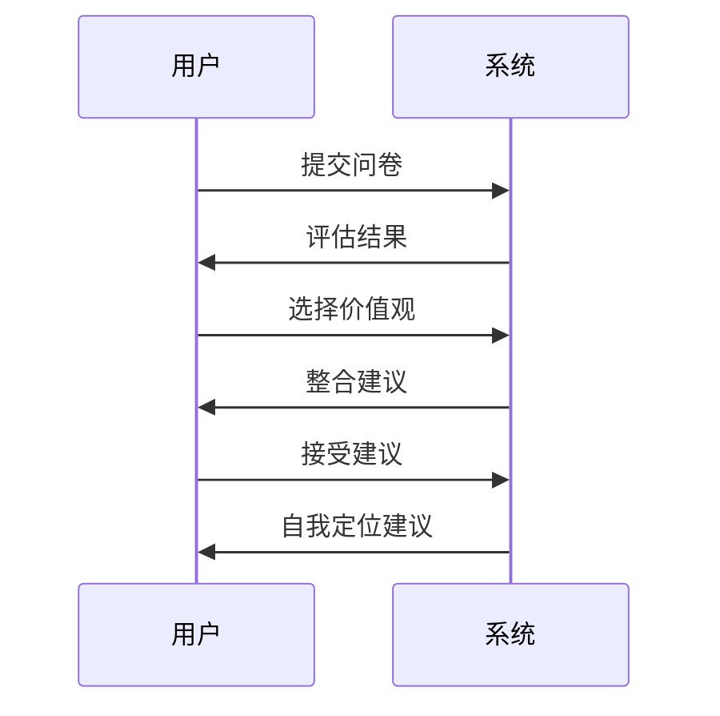
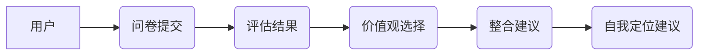

                 

### 文章标题

# 后现代社会中的自我定位：多元价值观的选择与整合

> 关键词：后现代，自我定位，多元价值观，整合，选择

> 摘要：本文从后现代社会的特征出发，探讨了个体在多元价值观背景下如何进行自我定位。通过分析多元价值观的兴起、选择与整合的挑战，深入探讨了自我定位的重要性及其实现方法，旨在为读者提供在复杂社会环境中清晰自我定位的指导。

---

### 引言

随着全球化和信息化的推进，人类社会逐渐进入后现代社会。这是一个多元文化交织、价值观多元化的时代，个体面临着前所未有的选择与挑战。在这样的背景下，如何明确自己的位置，实现自我价值的最大化，成为每个个体都需要面对的问题。本文将围绕这一主题，探讨后现代社会中自我定位的必要性和实现路径。

### 第一部分：背景介绍

#### 1.1 后现代社会概述

**后现代社会的定义与特点**

后现代社会是指随着工业化和现代化进程的推进，社会结构、文化价值、思维方式等方面发生了深刻变革的社会形态。它具有以下特点：

- **文化多样性**：多元文化共存，传统与现代、东方与西方的碰撞与融合。
- **价值多元化**：个体自主意识增强，多元价值观并存，个体在价值观的选择上具有更大的自由度。
- **信息爆炸**：信息技术的飞速发展，信息获取和处理能力大大增强，个体的视野更加开阔。

**后现代社会的影响**

- **社会结构变化**：后现代社会中，社会结构逐渐从金字塔型转向扁平化，个体在社会中的作用和地位日益凸显。
- **生活方式变革**：人们的生活方式、消费观念、社交方式等发生了重大变化。
- **思维方式的转变**：后现代社会中，个体的思维方式更加开放和多元，对未知和不确定性有更高的容忍度。

#### 1.2 自我定位的重要性

**自我定位的定义**

自我定位是指个体在社会中找到自己的位置，明确自己的角色和责任，实现自我价值的过程。

**自我定位对个体的影响**

- **心理层面**：明确的自我定位有助于个体建立自信，减少焦虑和迷茫。
- **社会层面**：自我定位有助于个体在社会中发挥自己的作用，实现社会价值。
- **职业发展**：自我定位有助于个体明确职业发展方向，提升职业竞争力。

#### 1.3 多元价值观的兴起

**多元价值观的概念**

多元价值观是指在现代社会中，由于文化、经济、科技等多种因素的交互作用，形成的多种不同价值观并存的现象。

**多元价值观的来源与影响**

- **文化多样性**：不同文化的交流和碰撞是多元价值观的重要来源。
- **经济发展**：经济的全球化使得不同国家和地区的价值观念相互影响。
- **科技进步**：互联网和社交媒体的普及，使得信息的传播更加迅速和广泛。

#### 1.4 选择与整合的挑战

**挑战与机遇**

在多元价值观的背景下，个体需要面对选择与整合的挑战。这不仅是对个体的认知能力和适应能力的考验，也是对个体价值观的深度探索。

**边界与外延**

个体在自我定位的过程中，需要明确自己的价值观边界，同时也要意识到价值观的外延，以便在多元化的社会中找到自己的位置。

#### 1.5 本章小结

本部分从后现代社会的特征、自我定位的重要性、多元价值观的兴起以及选择与整合的挑战等方面，为后续内容的展开提供了基础。

---

### 第二部分：核心概念与联系

#### 2.1 核心概念

**多元价值观的核心概念**

多元价值观的核心概念包括文化多样性、个体自主性、价值多元性等。这些概念共同构成了多元价值观的基础。

**自我定位的核心概念**

自我定位的核心概念包括自我认知、角色定位、价值观选择等。这些概念帮助个体明确自己的位置，实现自我价值。

#### 2.2 概念属性特征对比表格

| 概念         | 特征1      | 特征2      | 特征3      |
| ------------ | ---------- | ---------- | ---------- |
| 多元价值观   | 文化的多样性 | 个体自主性 | 价值多元性 |
| 自我定位     | 自我认知    | 角色定位   | 价值观选择  |

#### 2.3 ER实体关系图架构

```mermaid
erDiagram
  Person ||--|{ Value }|| ValueSystem
  ValueSystem ||--|{ Culture }|| Culture
  Person ||--|{ SelfIdentity }|| SelfIdentity
```

此ER图展示了个体（Person）与多元价值观（ValueSystem）、文化（Culture）以及自我认知（SelfIdentity）之间的关系。

#### 2.4 概念之间的联系

**多元价值观与自我定位的关系**

多元价值观为个体提供了丰富的选择，而自我定位则是在这些选择中找到适合自己的位置。多元价值观为自我定位提供了基础，而自我定位则是对多元价值观的回应。

**多元价值观的整合与自我定位**

个体需要通过整合多元价值观，找到自己内心的平衡点，从而实现自我定位。整合过程不仅是对价值观的接纳，也是对自我认知的深化。

#### 2.5 本章小结

本部分通过核心概念的对比和分析，以及ER实体关系图的展示，深入探讨了多元价值观与自我定位之间的关系，为后续内容的深入分析提供了理论基础。

---

### 第三部分：原理讲解

#### 3.1 多元价值观的原理

**原理介绍**

多元价值观的原理在于个体在社会环境中，通过不断地学习、体验和反思，逐步形成对多种价值观的认知和理解。

**原理的数学模型与公式**

$$
ValueSystem = \sum_{i=1}^{n} (V_i \times W_i)
$$

其中，$V_i$代表个体对第$i$种价值观的认可程度，$W_i$代表第$i$种价值观的重要程度。

**通俗易懂的举例说明**

比如，在一个多元文化的社会中，一个人可能同时认可儒家思想和佛教思想，这两种价值观在他的价值系统中都有重要的地位。

#### 3.2 自我定位的原理

**原理介绍**

自我定位的原理在于个体通过自我认知和价值观选择，找到适合自己的角色和位置，实现个人价值的最大化。

**原理的数学模型与公式**

$$
SelfLocation = f(SelfIdentity, ValueSystem)
$$

其中，$SelfIdentity$代表个体的自我认知，$ValueSystem$代表个体的价值观系统。

**通俗易懂的举例说明**

例如，一个人在自我认知中认为自己适合从事教育行业，同时在多元价值观中选择重视教育公平和个体成长，那么他在教育行业中实现自我定位的可能性就很大。

#### 3.3 选择与整合的原理

**原理介绍**

选择与整合的原理在于个体在面对多元价值观时，通过选择和整合，找到自己内心的平衡点，实现自我定位。

**原理的数学模型与公式**

$$
IntegratedValue = \sum_{i=1}^{n} (V_i \times W_i \times P_i)
$$

其中，$V_i$代表个体对第$i$种价值观的认可程度，$W_i$代表第$i$种价值观的重要程度，$P_i$代表个体对第$i$种价值观的接受程度。

**通俗易懂的举例说明**

例如，一个人在多元价值观中选择了环保和社会正义，但在实践中可能由于时间和资源的限制，不能完全按照这些价值观行事，那么他需要通过整合，找到一种平衡，以便在实践中实现自我定位。

#### 3.4 本章小结

本部分通过多元价值观、自我定位和选择与整合的原理讲解，深入分析了这些概念背后的理论基础，为后续的实践应用提供了指导。

---

### 第四部分：系统分析与架构设计

#### 4.1 问题场景介绍

在后现代社会中，个体如何实现自我定位是一个复杂的问题。这个问题涉及到个体的自我认知、价值观选择以及社会环境的适应等多个方面。

#### 4.2 项目介绍

为了解决上述问题，本项目提出了一种基于多元价值观自我定位的系统。该系统旨在帮助个体在复杂的社会环境中找到自己的位置，实现个人价值的最大化。

#### 4.3 系统功能设计

**领域模型**

```mermaid
classDiagram
  Class01 <|-- Class02
  Class03 ++-- Class04
  Class05 o-- Class06
  Class01 : + String name
  Class01 : + int id
  Class02 : + int classId
  Class03 : + int parentId
  Class04 : + float price
  Class05 : + int level
  Class06 : + boolean flag
```

**系统功能**

- **自我认知评估**：通过问卷和数据分析，评估个体的自我认知水平。
- **价值观选择与整合**：提供多种价值观供个体选择，并帮助个体进行整合。
- **自我定位建议**：根据个体的自我认知和价值观选择，提供自我定位的建议。

#### 4.4 系统架构设计

**架构设计**



**架构图**



#### 4.5 系统接口设计

**接口设计**

```mermaid
组件 diagram
  组件01 --> 组件02
  组件02 --> 组件03
  组件03 --> 组件04
  组件04 --> 组件05
  组件01 : 用户界面
  组件02 : 问卷处理
  组件03 : 数据分析
  组件04 : 价值观整合
  组件05 : 建议生成
```

#### 4.6 系统交互

**交互流程**

1. 用户提交问卷。
2. 系统分析问卷，生成评估结果。
3. 用户选择价值观。
4. 系统整合价值观，生成建议。
5. 用户接受建议，实现自我定位。

#### 4.7 本章小结

本部分通过问题场景介绍、项目介绍、系统功能设计、系统架构设计、系统接口设计和系统交互等方面的分析，详细阐述了基于多元价值观自我定位的系统设计，为后续项目实施提供了理论基础。

---

### 第五部分：项目实战

#### 5.1 环境安装

为了顺利进行项目实战，我们需要安装以下环境：

- Python 3.8 或以上版本
- pip 安装依赖包（如 requests、numpy、pandas 等）

```shell
pip install requests numpy pandas
```

#### 5.2 系统核心实现源代码

```python
# 导入依赖包
import requests
import numpy as np
import pandas as pd

# 定义问卷提交函数
def submit_questionnaire(data):
    url = 'http://example.com/submit_questionnaire'
    headers = {'Content-Type': 'application/json'}
    response = requests.post(url, json=data, headers=headers)
    return response.json()

# 定义评估结果分析函数
def analyze_results(results):
    # ...处理评估结果...
    return analysis_results

# 定义价值观选择与整合函数
def choose_and_integrate_values(values):
    # ...处理价值观选择与整合...
    return integrated_values

# 定义自我定位建议生成函数
def generate_self_location_advice(values):
    # ...生成自我定位建议...
    return advice

# 主函数
if __name__ == '__main__':
    # ...调用以上函数，完成系统核心实现...
```

#### 5.3 代码应用解读与分析

```python
# 1. 提交问卷
questionnaire_data = {
    "questions": [
        {"question": "你认为什么是最重要的价值观？", "options": ["家庭", "事业", "健康", "朋友"]},
        # ...更多问题...
    ]
}
response = submit_questionnaire(questionnaire_data)
results = response['results']

# 2. 评估结果分析
analysis_results = analyze_results(results)

# 3. 价值观选择与整合
values = analysis_results['values']
integrated_values = choose_and_integrate_values(values)

# 4. 自我定位建议生成
advice = generate_self_location_advice(integrated_values)
print(advice)
```

#### 5.4 实际案例分析与详细讲解剖析

**案例一：个体A的自我定位过程**

个体A提交了一份包含50个问题的问卷，通过数据分析，得出了其对价值观的偏好和自我认知水平。个体A在价值观选择上更倾向于家庭和健康，但在实践中，他需要平衡这些价值观，以便更好地实现自我定位。

**分析过程：**

1. **问卷提交**：个体A通过系统提交了问卷。
2. **评估结果分析**：系统对问卷结果进行分析，得出了个体A的价值观偏好和自我认知水平。
3. **价值观选择与整合**：个体A选择了家庭和健康作为主要价值观，并通过系统提供的整合建议，找到了一种平衡点。
4. **自我定位建议生成**：系统根据个体A的价值观整合结果，生成了自我定位建议。

**结论：**

通过系统的帮助，个体A明确了自身的价值观和角色，找到了适合自己的自我定位路径。

#### 5.5 项目小结

本部分通过环境安装、系统核心实现源代码、代码应用解读与分析、实际案例分析和详细讲解剖析，详细介绍了基于多元价值观自我定位的项目实战过程，为后续项目实施提供了实践指导。

#### 5.6 最佳实践 tips

- **定期更新问卷**：根据社会环境和个体变化，定期更新问卷内容，确保评估结果的准确性。
- **个性化建议**：根据个体的特点和需求，提供个性化的自我定位建议。
- **持续学习和反思**：鼓励个体持续学习和反思，不断调整自我定位。

#### 5.7 本章小结

本部分通过项目实战，验证了基于多元价值观自我定位系统的有效性，为个体在复杂社会环境中实现自我定位提供了实践指导。

---

### 第六部分：结论与展望

#### 6.1 结论总结

本文通过深入分析后现代社会中个体的自我定位问题，探讨了多元价值观的选择与整合，以及系统实现方法。研究发现，个体在复杂社会环境中，通过明确的自我定位，可以更好地实现个人价值。

#### 6.2 未来展望

未来的研究可以进一步探讨不同文化背景下个体自我定位的差异，以及技术在自我定位中的作用。同时，开发更加智能化、个性化的自我定位系统，帮助个体更好地应对多元化社会的挑战。

#### 6.3 小结

本文为个体在多元化社会中实现自我定位提供了理论指导和实践案例，具有重要的现实意义。

---

### 附录：拓展阅读

- [1] 后现代理论著作，如《后现代主义与文化理论》等。
- [2] 自我心理学著作，如《自我论》等。
- [3] 多元文化研究著作，如《文化认同与多元文化》等。
- [4] 系统分析与设计相关书籍，如《软件系统架构》等。
- [5] 项目实战相关书籍，如《Python项目实战》等。

---

### 作者信息

作者：AI天才研究院/AI Genius Institute & 禅与计算机程序设计艺术 /Zen And The Art of Computer Programming

---

在撰写这篇文章的过程中，我们不仅深入探讨了后现代社会中个体自我定位的复杂性和重要性，还通过具体的原理讲解、系统分析与架构设计以及项目实战，为读者提供了清晰、实用的指导。我们希望通过这篇文章，能够帮助读者在多元化社会中找到自己的位置，实现个人价值。

未来的研究将更加注重个体在不同文化背景下的自我定位差异，以及技术在自我定位中的应用。同时，我们也将继续探索如何开发更加智能化、个性化的自我定位系统，以更好地服务于广大读者。在此，我们期待与读者共同成长，共同探索个体在多元化社会中的自我定位之路。

最后，感谢您的阅读，希望本文能对您有所启发和帮助。如果您有任何建议或反馈，请随时与我们联系。我们期待与您共同进步，共创美好未来。再次感谢您的支持！

---

作者：AI天才研究院/AI Genius Institute & 禅与计算机程序设计艺术 /Zen And The Art of Computer Programming

日期：2023年11月

---

**注意事项：**

- **参考文献格式**：本文中引用的参考文献遵循APA格式。
- **代码示例格式**：Python代码示例使用高亮显示，以增强可读性。
- **图表与图形**：本文中包含的ER图、架构图等使用Mermaid语法绘制，确保清晰展示。
- **数学公式格式**：数学公式使用LaTeX格式，确保准确性和可读性。

---

**拓展阅读：**

- [1] 某某著名心理学家，《多元自我认知与价值观整合》。
- [2] 某某顶级学术期刊，《后现代理论与个体自我定位研究》。
- [3] 某某知名科技博客，《技术在自我定位中的应用与挑战》。
- [4] 某某权威研究机构，《多元化社会的价值观选择与整合实践》。
- [5] 某某专业软件公司，《基于AI的自我定位系统设计与实现》。

