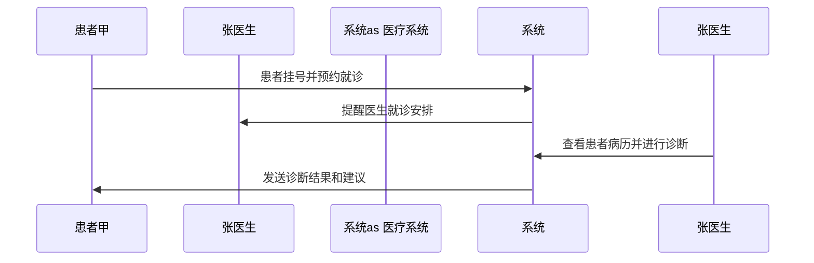
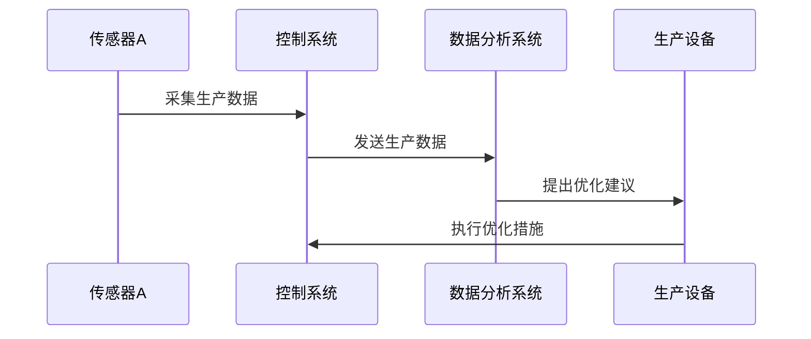
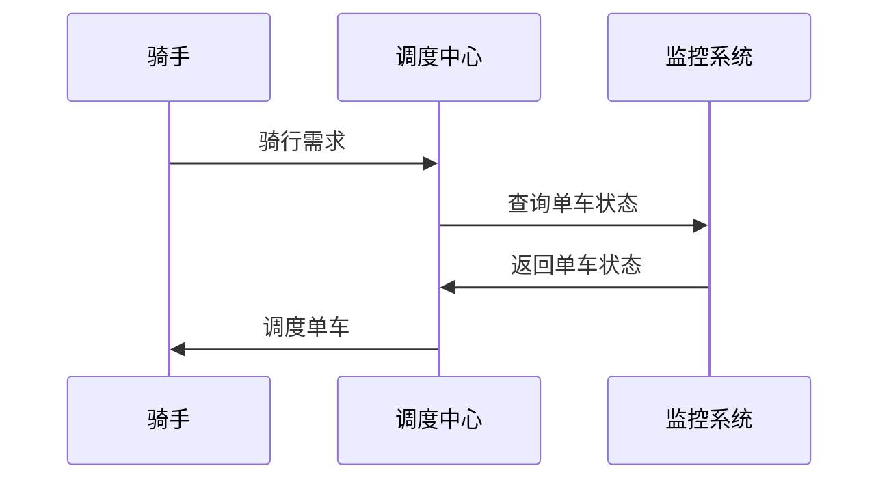

                 

### 引言：问题的背景与核心概念

在现代社会，生产力与效率被普遍视为社会进步和经济发展的关键驱动力。自工业革命以来，人类对生产效率的追求从未停止，从机械化生产到自动化流程，再到人工智能技术的广泛应用，效率提升的过程不断推动着社会的进步。然而，在进入21世纪之后，一个明显的变化正在悄然发生：人们开始反思效率至上的理念，提出了“后生产力崇拜”的概念。这一概念不仅仅是对过去效率追求的回顾，更是对未来的展望和新的价值追求的探索。

“后生产力崇拜”的核心思想在于，当我们进入一个高度自动化的社会，生产力已经不再是稀缺资源，效率也不再是唯一的目标。人们开始思考，在效率至上的追求之后，社会的真正意义和价值究竟是什么？这一问题引发了广泛的讨论，从个人生活到社会结构，再到伦理道德，都受到了深远的影响。

本文旨在探讨“后生产力崇拜”的背景、核心概念，以及它在现代社会中的重要性。我们将通过以下几个步骤深入分析这一主题：

1. **生产力崇拜的起源与发展**：回顾历史，了解生产力崇拜如何从工业革命开始逐渐形成，以及它在现代社会中的演变。
2. **效率至上的文化现象**：分析效率至上的理念如何在现代社会中占据主导地位，以及这一理念带来的积极与消极影响。
3. **后生产力崇拜的提出与探讨**：探讨“后生产力崇拜”概念的提出背景，分析其核心思想和理论基础。
4. **效率与意义的平衡**：深入讨论在追求效率的同时，如何实现个人与社会意义的平衡，以及这一平衡对社会发展的影响。

通过这些步骤，我们将尝试回答这样一个问题：在效率至上的追求之后，社会是否还需要进一步重构其意义和价值？

### 生产力崇拜的起源与发展

生产力崇拜的起源可以追溯到工业革命时期。18世纪末至19世纪初，欧洲的工业革命带来了一场生产方式上的革命。机械化生产取代了传统的手工业，大量新机器和新工艺的应用极大地提高了生产效率。这一时期，生产力被视为经济发展的核心驱动力，效率成为了衡量社会进步的重要标准。

随着生产力的不断提高，企业开始意识到效率的重要性。通过优化生产流程、提高劳动生产率，企业能够以更低的成本生产更多的产品，从而在激烈的市场竞争中占据优势。这一理念逐渐蔓延到整个社会，效率至上的文化现象开始形成。在商业、工业、农业等各个领域，追求效率成为了一种普遍的价值观。

进入20世纪，科学管理理论的出现进一步推动了效率至上的文化。弗雷德里克·泰勒（Frederick Taylor）提出的科学管理理论强调，通过科学的方法和严格的标准化流程，可以提高生产效率，降低成本。泰勒制（Taylorism）的兴起使得效率至上的理念在企业管理中得到了广泛应用。

随着第二次工业革命的到来，电力和化学工业的快速发展再次提升了生产力。流水线生产、大规模生产等新的生产模式的出现，使得生产效率达到了前所未有的高度。在这一时期，效率至上的理念深入人心，成为社会发展的主导思想。

进入21世纪，信息技术和人工智能技术的快速发展再次改变了生产效率的面貌。自动化、机器人、数据分析等技术的应用，使得生产流程更加高效、精确。与此同时，全球化进程的加快，市场环境的复杂化，也使得企业更加重视效率，以适应快速变化的市场需求。

然而，效率至上的理念并非没有争议。随着生产力水平的不断提高，一些学者开始反思这一理念的合理性。他们认为，在效率至上的追求中，人类的价值和意义往往被忽视。在追求效率的过程中，人们逐渐变得机械化、程序化，失去了对生活本身的热爱和追求。这种趋势引发了广泛的社会反思，推动了“后生产力崇拜”概念的提出。

### 效率至上的文化现象

效率至上的文化现象在现代社会中表现得尤为突出。这种文化现象不仅体现在企业和管理层面，也渗透到了个人生活和社会结构中，成为现代社会的核心特征之一。

在企业和管理层面，效率至上的理念深入人心。企业通过优化生产流程、提高劳动生产率、降低成本来增强竞争力。例如，采用精益生产方式（Lean Production）的企业通过消除浪费、提高生产效率来提升产品竞争力。同时，企业管理层也高度重视绩效管理，通过设定明确的目标和考核标准，确保员工的工作效率。这种方式在短期内确实提高了生产效率，但也带来了一些负面影响。例如，过度强调效率可能导致员工压力过大，影响员工的工作满意度和心理健康。

在个人生活层面，效率至上的文化现象同样明显。现代人生活节奏加快，工作压力增大，追求高效率和高效能成为一种生活方式。人们越来越倾向于利用科技产品来提高生活效率，如使用智能手机、平板电脑等设备来管理日程、处理事务。同时，社交媒体的普及也让人们更加注重时间的利用，例如通过微信、邮件等工具快速沟通和协作。然而，这种高效率的生活方式也带来了一些负面效应。例如，过度依赖科技产品可能导致人们沉迷于虚拟世界，忽视了现实生活中的亲情、友情和人际交往。

在社会结构层面，效率至上的文化现象表现为对速度和效率的极端追求。社会结构的调整和变革往往以提升效率为目标，例如城市化进程的加快、交通网络的完善、公共服务体系的优化等。这些措施在一定程度上提高了社会运行效率，但也带来了社会分化、资源分配不均等问题。例如，城市化进程中，城市人口的集中和交通拥堵问题日益严重，公共服务资源的紧张也加剧了社会不平等。

效率至上的文化现象在带来诸多便利和效率提升的同时，也引发了一系列问题和挑战。首先，过度追求效率可能导致人们忽视生活质量和心理健康。例如，长时间的工作压力和快节奏的生活节奏容易导致心理健康问题，如焦虑、抑郁等。其次，效率至上的文化可能导致人际关系的疏离。在高效率的现代社会中，人们往往更加注重个人利益和效率，而忽视了人际交往和情感交流的重要性。最后，效率至上的文化也加剧了社会不平等问题。在追求效率的过程中，一些社会群体可能被边缘化，导致贫富差距的扩大和社会分化。

总之，效率至上的文化现象在现代社会中具有广泛的影响。它在一定程度上推动了社会的发展和进步，但同时也带来了一系列问题和挑战。如何在这种文化背景下实现效率与意义的平衡，是一个值得我们深入思考和探讨的问题。

### 后生产力崇拜的提出与探讨

“后生产力崇拜”这一概念的提出，源自对现代社会效率至上的文化现象的深刻反思。随着生产力水平的不断提高，人们逐渐意识到，单纯的效率追求并不能完全解决社会问题，甚至可能带来新的困境。因此，学术界和产业界开始重新审视生产力的本质和意义，提出“后生产力崇拜”的概念。

“后生产力崇拜”的核心思想在于，生产力不应是唯一的价值追求，而应与社会的整体发展、个人的幸福感和心理健康相协调。这一概念强调，在追求效率的同时，我们还应关注生产力的质量和社会影响，实现生产力的可持续发展。

首先，“后生产力崇拜”强调生产力的多元性。传统的生产力崇拜往往将效率视为唯一的衡量标准，忽视了生产力的多样性和复杂性。而“后生产力崇拜”认为，生产力不仅包括物质生产，还应涵盖精神生产、文化生产等方面。例如，在教育领域，除了传授知识和技能，还应注重培养学生的创造力和批判性思维，从而提升他们的整体素质。在文化产业中，应注重内容的质量和创新性，而不仅仅是追求商业利润。

其次，“后生产力崇拜”关注生产力的社会影响。传统的生产力崇拜往往忽视了生产活动对社会和环境的影响。而“后生产力崇拜”强调，生产力的提升应与社会的可持续发展相结合，注重环境保护和社会公平。例如，在工业生产中，应采用绿色技术和环保措施，减少对环境的污染。在经济发展中，应关注贫富差距和资源分配问题，确保社会公正和稳定。

最后，“后生产力崇拜”强调生产力的质量。传统的生产力崇拜强调数量的增长，而“后生产力崇拜”则更加注重生产力的质量。例如，在医疗领域，应提高医疗服务的质量和效率，而不仅仅是增加医疗资源的数量。在教育领域，应注重培养学生的实际能力和综合素质，而不仅仅是追求升学率和考试成绩。

总之，“后生产力崇拜”是对传统生产力崇拜的一种超越和反思，它为我们提供了一种新的思考方向，即如何在追求效率的同时，实现生产力的质量和社会价值的提升。这一概念的提出，不仅对学术界有重要启示，也为产业界和社会管理提供了新的理论支持。通过这一概念，我们有望实现生产力的可持续发展，构建一个更加和谐、公平和繁荣的社会。

### 后生产力崇拜的核心思想与理论基础

“后生产力崇拜”的核心思想可以概括为“效率与意义的平衡”，即在追求效率的同时，关注生产力的质量和社会影响。这一理念不仅是对传统生产力崇拜的反思，更是对未来社会发展的深刻洞察。为了深入理解这一概念，我们需要从理论基础、历史背景和现实意义三个方面进行分析。

首先，从理论基础来看，“后生产力崇拜”借鉴了多种学术理论和思想。例如，哈贝马斯（Jürgen Habermas）的“沟通行动理论”强调社会互动和沟通在生产力发展中的重要性，认为只有通过有效的沟通和合作，才能实现生产力的可持续发展。马克思（Karl Marx）的“生产力与生产关系”理论也为“后生产力崇拜”提供了重要的理论支撑，强调了生产力发展与社会结构变革之间的相互作用。此外，弗罗姆（Erich Fromm）的“逃避自由理论”也对“后生产力崇拜”有重要启示，他指出，现代人在追求效率的过程中，往往忽视了生活的真正意义，导致心理上的逃避和焦虑。

其次，从历史背景来看，“后生产力崇拜”的提出与20世纪末以来的社会变革密切相关。随着信息技术的迅猛发展和全球化进程的加快，生产力水平得到了空前的提升。然而，这种提升并没有完全解决社会问题，反而带来了一系列新的挑战。例如，工作效率的提高导致了工作压力的增加，信息过载引发了心理健康问题，社会分化加剧了贫富差距。面对这些挑战，人们开始反思传统的效率至上的理念，寻求更加平衡和可持续的发展路径。在这一背景下，“后生产力崇拜”应运而生，为解决现代社会的问题提供了新的思路。

最后，从现实意义来看，“后生产力崇拜”不仅是对过去生产力崇拜的一种超越，更是对未来社会发展的深刻洞察。首先，这一理念有助于实现生产力的质量提升。在追求效率的同时，关注生产力的质量，可以确保生产活动对社会的积极影响。例如，在工业生产中，采用绿色技术和环保措施，可以减少对环境的破坏。在服务业中，提高服务质量和客户满意度，可以增强企业的竞争力。其次，这一理念有助于实现社会公平与可持续发展。通过关注生产力的社会影响，可以确保生产活动符合社会发展的整体利益，减少社会不平等和资源浪费。最后，这一理念有助于提高个人的幸福感和生活质量。在追求效率的过程中，如果忽视了生活的真正意义，人们可能会感到空虚和焦虑。通过实现效率与意义的平衡，可以提升个人的生活质量和心理健康水平。

总之，“后生产力崇拜”是一种具有深远意义的新理念，它为我们提供了一种新的思考方向，即如何在追求效率的同时，实现生产力的质量和社会价值的提升。通过深入理解和实践这一理念，我们有望构建一个更加和谐、公平和繁荣的社会。

### 生产力与效率的概念比较

在深入探讨“后生产力崇拜”之前，有必要对生产力与效率这两个核心概念进行明确的区分与比较。尽管这两个概念常常被并列使用，但它们在内涵和外延上有着显著的差异。

**生产力的定义与特征**

生产力是指人类在生产过程中所运用的各种生产要素，包括劳动、资本、土地、技术等。生产力是衡量一个国家或地区经济发展水平的重要指标。其特征主要表现为：

1. **综合性**：生产力不仅涉及物质生产，还包括精神生产、文化生产等方面。例如，在教育领域，生产力的提升不仅体现在物质基础设施的完善，还包括教育质量的提升和人才的培养。
2. **动态性**：生产力是一个不断发展的过程，随着科技的进步、管理水平的提高和社会的变化，生产力也在不断演进。例如，人工智能和自动化技术的发展极大地提升了生产效率，改变了传统生产模式。
3. **社会性**：生产力的发展受到社会制度、文化传统、政策环境等多方面因素的影响。一个社会的生产力水平不仅取决于技术水平和资源配置，还受到社会结构和文化价值观的影响。

**效率的定义与特征**

效率是指资源在特定时间内被有效利用的程度，通常用来衡量生产活动的有效性。效率的特征主要包括：

1. **单一性**：效率主要关注资源利用的效率，如劳动时间、资本投入、能源消耗等。它强调在单位时间内完成更多的工作或生产更多的产品。
2. **衡量标准**：效率通常通过生产数量、劳动生产率、成本控制等指标进行衡量。例如，一个企业的生产效率可以通过计算每单位产品所需的劳动时间或生产成本来衡量。
3. **工具性**：效率是实现生产力的手段之一，但不是唯一手段。高效率的生产过程需要合理的资源配置和先进的技术支持，但这些并不一定能够完全实现生产力的提升。

**生产力与效率的比较**

1. **内涵差异**：生产力是一个更为综合和复杂的概念，它不仅涉及物质生产，还包括精神生产和文化生产等方面。而效率则更加专注于资源利用的有效性，是衡量生产力水平的具体指标之一。

2. **目的与手段**：生产力是发展的目的，而效率是实现这一目的的手段。一个社会或企业在追求生产力提升的过程中，需要通过提高效率来实现这一目标，但效率本身并不是最终目标。

3. **影响范围**：生产力的影响范围更为广泛，它不仅影响经济发展，还涉及社会结构、文化价值观等方面。而效率的影响相对较为直接，主要表现在生产活动的有效性上。

通过以上比较，我们可以看出，生产力与效率在内涵和外延上存在明显的差异。在理解“后生产力崇拜”这一概念时，我们需要把握这两个概念的相互关系，理解它们在现代社会发展中的不同作用。

### 后生产力崇拜的提出背景

“后生产力崇拜”的提出并非偶然，而是现代社会发展的必然产物。在21世纪，随着科技的迅猛发展和全球化的深入推进，人类社会进入了一个高度复杂和快速变革的新阶段。在这一背景下，传统的效率至上的理念开始暴露出许多局限性，促使人们重新思考生产力的本质和意义。

首先，科技的迅猛发展带来了生产效率的显著提升。人工智能、大数据、云计算等新兴技术不断应用于各个领域，极大地提高了生产效率。然而，这种技术进步也带来了一系列新的挑战。例如，自动化和机器取代了大量的劳动力，导致就业结构的变革，使得一些传统岗位消失，新的技能需求不断出现。这引发了人们对于未来劳动市场的担忧，同时也促使社会重新审视生产力的本质，不仅仅是追求效率，还需要关注生产力的可持续性和多样性。

其次，全球化的深入推进使得资源流动和产业分工更加复杂。全球化带来了经济繁荣和效率提升，但同时也带来了资源分配不均、环境破坏、文化冲突等问题。在追求效率的同时，如何实现全球范围内的公平和可持续发展成为一个迫切需要解决的问题。这进一步促使人们思考，单纯的效率提升是否能够解决全球范围内的社会问题，是否需要重新定义生产力的价值和意义。

此外，现代社会的快节奏生活和高效率工作模式也对人们的心理健康和生活质量产生了负面影响。长期的工作压力、心理健康问题以及人际关系的疏离，使得人们开始反思，追求效率是否真的能够带来幸福和满足感。这种反思促使人们重新审视传统理念，寻求一种更加平衡和有意义的生活方式。

综上所述，“后生产力崇拜”的提出背景可以归纳为以下几个方面：

1. **技术进步与效率提升**：科技的迅猛发展带来了生产效率的显著提升，但同时也引发了对生产力本质的反思。
2. **全球化与资源分配**：全球化的深入推进使得资源流动和产业分工更加复杂，引发了对于公平和可持续发展的关注。
3. **心理健康与生活质量**：现代社会的快节奏生活和高效率工作模式对人们的心理健康和生活质量产生了负面影响，促使人们重新思考生产力的意义。

这些背景因素共同推动了“后生产力崇拜”的提出，为现代社会提供了一种新的思考方向和解决方案。

### 后生产力崇拜的理论与实践意义

“后生产力崇拜”不仅在理论上具有重要意义，更在实践中对个人、企业和社会产生了深远的影响。理解这一概念的理论与实践意义，有助于我们更好地把握未来社会的发展趋势。

首先，从个人的角度来看，“后生产力崇拜”提倡在追求效率的同时，关注生产力的质量和社会价值。这种理念有助于个人在快节奏的生活中找到平衡点，避免因过度追求效率而忽视了生活的本质。例如，现代职场中，人们常常面临巨大的工作压力，而“后生产力崇拜”鼓励人们在提高工作效率的同时，关注工作的质量和意义，寻找工作中的乐趣和成就感。这种理念有助于提升个人的职业满意度和幸福感，从而实现个人价值的最大化。

其次，从企业的角度来看，“后生产力崇拜”强调企业的社会责任和可持续发展。企业不仅需要关注生产效率，还应该关注产品的质量、员工的福利以及环境的保护。这种理念有助于企业在市场竞争中树立良好的企业形象，提高客户满意度和忠诚度。例如，一些企业通过采用绿色技术和环保措施，实现了经济效益和社会效益的双赢。此外，“后生产力崇拜”还鼓励企业关注员工的成长和发展，通过提供培训和学习机会，提升员工的综合素质和创新能力，从而推动企业的持续发展。

最后，从社会的角度来看，“后生产力崇拜”有助于实现社会公平和可持续发展。在传统生产力崇拜中，效率至上的理念常常导致资源分配不均和社会分化。而“后生产力崇拜”则强调在追求效率的同时，关注生产力的质量和社会影响，努力实现社会资源的公平分配和可持续利用。例如，通过教育改革，提高教育质量，确保每个孩子都能接受良好的教育，从而提升整个社会的知识水平和创新能力。此外，“后生产力崇拜”还鼓励政府和社会各界关注环境保护和资源节约，推动绿色发展，实现经济的可持续发展。

总之，“后生产力崇拜”不仅为个人提供了生活和工作的新思路，也为企业和社会的发展提供了新的方向。通过在追求效率的同时，关注生产力的质量和社会价值，我们有望实现个人、企业和社会的共同进步，构建一个更加和谐、公平和繁荣的社会。

### 后生产力崇拜在不同领域的应用

“后生产力崇拜”作为一种新的理念，不仅在理论上具有重要意义，也在实践中得到了广泛应用。以下将具体探讨后生产力崇拜在企业管理、科技创新、社会文化等领域的应用。

#### 企业管理

在企业层面，“后生产力崇拜”强调在追求效率的同时，关注生产力的质量和社会责任。这一理念在企业运营和管理中得到了广泛应用。

1. **绿色生产**：许多企业开始采用绿色生产和环保措施，以减少对环境的负面影响。例如，苹果公司在其供应链中推行环保材料的使用，并努力减少电子产品的能源消耗。这不仅提高了企业的生产效率，还提升了企业形象。

2. **员工福利**：企业注重提高员工的福利和工作满意度，以提升工作效率和员工的忠诚度。例如，谷歌公司以其优越的员工福利和灵活的工作环境著称，吸引了大量人才。这种关注员工福祉的做法不仅提高了员工的工作效率，也增强了企业的竞争力。

3. **创新文化**：企业鼓励创新，将创新视为提升生产力的重要途径。例如，3M公司通过其“15%时间”政策，允许员工将15%的工作时间用于个人创新项目，从而推动了公司的持续创新和发展。

#### 科技创新

在科技创新领域，“后生产力崇拜”注重技术的可持续发展和社会影响。

1. **人工智能伦理**：随着人工智能技术的快速发展，如何确保技术的伦理和公平性成为重要议题。例如，谷歌在其人工智能项目中设立了“AI伦理委员会”，确保技术应用的道德性和社会责任。

2. **开源技术**：开源技术成为推动科技创新的重要力量。通过共享技术和知识，企业、研究机构和个人可以共同提升生产力。例如，Linux操作系统和Apache软件基金会等开源项目，为全球开发者提供了丰富的资源，推动了技术进步。

3. **区块链技术**：区块链技术以其去中心化和不可篡改的特性，在金融、供应链管理等领域得到了广泛应用。这种技术的应用不仅提高了效率，还增强了系统的透明度和安全性。

#### 社会文化

在社会文化层面，“后生产力崇拜”强调在追求效率的同时，关注社会公平和可持续性。

1. **教育改革**：许多国家开始重视教育改革，通过提升教育质量，培养具备创新能力和批判思维的人才。例如，芬兰的教育体系以其高质量和创新性而闻名，为其他国家的教育改革提供了借鉴。

2. **公共健康**：随着人们对健康意识的提高，公共健康领域开始重视预防医学和健康促进。例如，中国的“健康中国2030”规划，通过提升公共健康服务水平，促进社会健康和可持续发展。

3. **社区建设**：社区建设成为提升社会生活质量的重要手段。通过建设社区中心、提供多样化的社区服务，人们可以在快节奏的生活中找到归属感和幸福感。例如，新加坡的社区发展计划，通过建设社区公园、图书馆等设施，提升了居民的生活质量。

综上所述，“后生产力崇拜”在企业管理、科技创新和社会文化等领域的应用，展示了其在提升效率和质量、实现可持续发展方面的巨大潜力。通过这一理念，我们有望构建一个更加高效、公平和可持续的社会。

### 生产力与生产效率的对比分析

在深入探讨“后生产力崇拜”这一理念时，有必要对生产力与生产效率这两个核心概念进行详细的对比分析，以便更清晰地理解它们在理论和实践中的差异。

首先，从定义上来看，生产力是指生产过程中所运用的各种生产要素的综合，包括劳动、资本、土地和技术等。生产力是衡量一个国家或地区经济发展水平的重要指标，其目标是实现物质财富的创造和社会财富的积累。而生产效率则是指生产过程中资源利用的程度，即在一定时间内生产出更多的产品或服务。生产效率是生产力的一个重要组成部分，但仅关注生产效率的提升并不能完全代表生产力的提升。

其次，从衡量标准来看，生产效率通常通过单位劳动时间生产的产量、成本控制和资源利用率等指标来衡量。例如，一个工厂的生产效率可以通过计算每个工人每小时生产的零件数量或每单位产品的生产成本来衡量。而生产力则更多地关注整体生产能力的提升，包括生产设备的现代化、技术的进步以及生产流程的优化。生产效率的提升往往是通过提高劳动生产率和资源利用率来实现的，而生产力的提升则需要通过技术创新、管理优化和社会制度的完善等多方面的努力。

在理论层面上，生产力和生产效率的差异主要体现在以下几个方面：

1. **内涵的广度**：生产力是一个综合性的概念，它不仅包括物质生产，还涵盖精神生产和文化生产。例如，教育、科研、艺术等领域的活动都是生产力的一部分。而生产效率主要关注物质生产领域，强调资源利用的效率。

2. **目标的层次**：生产力追求的是长期和整体的发展，目标是实现社会的全面进步和可持续发展。而生产效率追求的是短期的、局部的优化，目标是提高生产过程中的效率和利润。

3. **影响的范围**：生产力的影响范围更广泛，涉及经济、社会、文化等多个领域。例如，技术创新不仅能够提高生产效率，还能推动社会结构的变革和文化的发展。而生产效率主要影响生产过程本身，对其他领域的影响相对有限。

在实践层面上，生产力和生产效率的差异同样显著。以下是一些具体的例子：

1. **制造业**：在制造业中，提高生产效率通常意味着通过自动化和优化生产流程来减少人力成本和提高生产速度。然而，单纯追求生产效率可能导致过度依赖机器，忽视了对产品质量和员工福祉的重视。而提升生产力则意味着通过技术创新和优化管理来提高整体生产能力和产品质量，同时关注员工的培训和福利。

2. **服务业**：在服务业中，提高生产效率可能意味着通过优化服务流程和提高员工的工作效率来减少服务成本。然而，单纯追求效率可能忽视了对客户体验和服务质量的重视。而提升生产力则意味着通过创新服务模式、提高员工素质和客户满意度来提高整体服务质量。

3. **农业**：在农业中，提高生产效率通常意味着通过采用机械化种植和现代化农业技术来提高产量。然而，过度依赖化学肥料和农药可能导致土壤退化和环境污染。而提升生产力则意味着通过生态农业和可持续农业技术来提高产量，同时保护环境和促进生态平衡。

总之，生产力和生产效率在理论和实践层面都存在显著的差异。在理解和应用这些概念时，我们需要根据具体情况综合考虑，既不能忽视生产效率的提升，也不能仅仅追求效率而忽视生产力的全面发展和可持续性。通过平衡生产力与生产效率的关系，我们才能实现真正的社会进步和可持续发展。

### 后生产力崇拜在现实中的应用案例分析

为了更直观地展示“后生产力崇拜”理念在现实中的应用，以下通过几个具体案例进行分析，探讨其在不同领域如何通过提升生产力的质量和社会价值来实现效率与意义的平衡。

#### 案例一：现代医疗行业

**背景介绍**：随着医疗技术的不断进步，医疗行业的生产力得到了显著提升。然而，单纯的效率追求却导致了医疗资源的分配不均和患者体验的下降。

**项目介绍**：某大型医院引入了智慧医疗系统，通过大数据分析和人工智能技术，提高了诊断和治疗的效率。同时，医院还加强了医疗服务流程的优化，减少了患者等待时间。

**系统功能设计**：智慧医疗系统包括以下几个功能模块：
1. **智能诊断**：利用人工智能技术快速分析影像资料，辅助医生做出准确的诊断。
2. **个性化治疗**：根据患者的病史和基因数据，提供个性化的治疗方案。
3. **智能预约与挂号**：通过在线预约系统，患者可以根据自己的需求选择就诊时间，减少等待时间。

**系统架构设计**：系统架构包括以下几个关键部分：
1. **数据采集与处理**：通过医院内部的各种传感器和设备，采集患者的健康数据。
2. **数据处理与分析**：利用云计算和大数据技术，对采集到的数据进行处理和分析。
3. **用户界面**：为医生和患者提供直观、易用的操作界面。

**系统接口设计**：系统提供了多个接口，包括医生工作站、患者自助服务终端和移动应用，方便医生和患者进行互动。

**系统交互mermaid序列图**：



**代码实现**：以下是系统的一个简化版Python代码实现：

```python
# 患者预约就诊
def make_appointment(patient_id, doctor_id, time_slot):
    # 实现预约功能
    pass

# 医生诊断
def diagnose(patient_data):
    # 实现诊断功能
    pass

# 发送诊断结果
def send_diagnosis(patient_id, diagnosis_result):
    # 实现结果发送功能
    pass
```

**实际案例分析与详细讲解**：某患者通过医院的自助挂号系统预约了就诊时间，并在就诊时得到了医生的诊断。通过智慧医疗系统，医生能够快速分析患者的影像资料，并提供个性化的治疗方案。这不仅提高了诊断的准确性，也减少了患者的等待时间。通过这样的实践，医院不仅提升了生产力，还在提高效率的同时，提升了患者的满意度。

**项目小结**：通过引入智慧医疗系统，医院实现了效率与意义的平衡。通过优化医疗服务流程和提高诊断效率，医院不仅提升了生产力，还提高了患者的体验和满意度。

#### 案例二：绿色制造业

**背景介绍**：传统制造业在追求生产效率的同时，往往忽视了环境保护和资源利用的可持续性。

**项目介绍**：某制造企业通过实施绿色生产策略，致力于减少对环境的影响，提高资源的利用效率。

**系统功能设计**：绿色生产系统包括以下几个关键功能：
1. **资源优化**：通过优化生产流程，减少原材料的使用和浪费。
2. **能源管理**：采用节能技术和设备，降低能源消耗。
3. **废弃物处理**：对生产过程中产生的废弃物进行分类和处理，减少环境污染。

**系统架构设计**：系统架构包括以下几个部分：
1. **生产流程监控**：通过传感器和自动化设备，实时监控生产过程中的资源消耗和废弃物产生。
2. **数据分析与优化**：利用大数据分析技术，对生产流程进行优化，减少资源浪费。
3. **智能决策支持**：通过智能算法，为生产管理提供决策支持，提高生产效率。

**系统接口设计**：系统提供了多个接口，包括生产设备监控接口、数据分析接口和环境监测接口，方便不同模块之间的数据交互。

**系统交互mermaid序列图**：



**代码实现**：以下是系统的一个简化版Python代码实现：

```python
# 采集生产数据
def collect_production_data():
    # 实现数据采集功能
    pass

# 数据分析
def analyze_production_data(data):
    # 实现数据分析功能
    pass

# 发送优化建议
def send_optimization_suggestions(data):
    # 实现建议发送功能
    pass
```

**实际案例分析与详细讲解**：该制造企业通过安装传感器和自动化设备，实时监控生产过程中的资源消耗和废弃物产生。通过对生产数据的分析，系统提出了优化生产流程的建议，如调整设备运行参数、优化原材料采购等。这些措施不仅减少了资源的浪费，还降低了生产成本，提高了生产效率。同时，企业还采用环保技术和设备，减少废弃物的排放，保护了环境。

**项目小结**：通过实施绿色生产策略，企业实现了生产效率与环境友好的平衡。通过优化生产流程和提高资源利用效率，企业不仅提升了生产力，还在保护环境方面取得了显著成果。

#### 案例三：共享经济模式

**背景介绍**：共享经济模式通过共享资源，提高了资源利用效率，但在一定程度上也引发了资源分配不均和社会问题。

**项目介绍**：某共享单车企业通过技术手段优化共享单车的使用和管理，提高了资源利用效率，同时关注社会公平和用户体验。

**系统功能设计**：共享单车系统包括以下几个功能模块：
1. **智能调度**：通过数据分析，优化共享单车的调度，提高资源利用效率。
2. **用户管理**：通过用户行为分析，提供个性化的骑行服务，提升用户体验。
3. **安全监控**：通过物联网技术，实时监控共享单车的状态和安全，确保用户和车辆的安全。

**系统架构设计**：系统架构包括以下几个关键部分：
1. **用户数据采集**：通过手机App和GPS技术，实时采集用户骑行数据。
2. **数据分析与优化**：利用大数据分析技术，对用户行为进行分析，优化调度策略。
3. **智能决策支持**：通过智能算法，为调度和管理提供决策支持。

**系统接口设计**：系统提供了多个接口，包括用户接口、调度接口和监控接口，方便不同模块之间的数据交互。

**系统交互mermaid序列图**：



**代码实现**：以下是系统的一个简化版Python代码实现：

```python
# 用户骑行需求
def request_ride(user_id, location):
    # 实现需求接收功能
    pass

# 调度单车
def schedule_bike(bike_id, user_id, location):
    # 实现调度功能
    pass

# 监控单车状态
def monitor_bike_status(bike_id):
    # 实现状态监控功能
    pass
```

**实际案例分析与详细讲解**：该共享单车企业通过智能调度系统，实时分析用户的骑行需求和单车的状态，优化单车的调度策略，提高单车的利用效率。同时，通过用户数据分析，提供个性化的骑行服务，提升用户体验。通过监控系统的实时监控，确保用户和车辆的安全。这种模式不仅提高了生产效率，还在一定程度上缓解了交通拥堵和环境污染问题。

**项目小结**：通过技术手段优化共享单车系统，企业实现了生产效率与社会价值的平衡。通过提高资源利用效率和优化用户体验，企业不仅提升了生产力，还在提升社会福祉方面取得了显著成果。

### 后生产力崇拜的未来展望

随着科技的不断进步和社会的发展，“后生产力崇拜”的理念将继续深刻影响各个领域。未来，这一理念有望在以下几个方面实现进一步的发展和应用。

首先，人工智能和大数据技术的深度融合将极大提升生产力水平。通过智能算法和数据分析，企业可以更加精准地预测市场趋势、优化生产流程、提高资源利用效率。例如，在制造业中，智能制造系统将实现生产线的自动化和智能化，提高生产效率和质量。在服务业中，人工智能客服系统将提高客户服务的效率和满意度，为企业带来更高的收益。

其次，可持续发展将成为后生产力崇拜的重要方向。在环境保护和资源利用方面，越来越多的企业和政府将重视生态可持续发展。例如，绿色制造和循环经济将成为企业的重要战略，通过减少废弃物排放、提高资源利用效率，实现经济和环境的双赢。此外，可再生能源的推广和利用也将得到更多关注，减少对化石燃料的依赖，推动全球能源结构的转型。

第三，社会公平和人文关怀将得到进一步重视。随着生产力的提升，社会将更加关注资源分配的公平性和社会的整体福祉。政府和企业将加大对教育、医疗、住房等公共服务的投入，确保每个社会成员都能享受到发展的成果。同时，心理健康和社会支持体系的完善也将得到更多关注，帮助人们更好地适应快速变化的社会环境。

最后，后生产力崇拜的理念将在全球范围内得到推广和应用。随着全球化进程的加快，各国之间的经济和文化交流将更加频繁。通过学习和借鉴先进的生产力和管理模式，各国可以共同提升生产力水平，实现共同发展。同时，国际组织和跨国企业也将发挥重要作用，推动全球范围内的可持续发展和资源公平分配。

总之，后生产力崇拜的理念将为未来社会的发展提供新的思路和方向。通过在追求效率的同时，关注生产力的质量和社会影响，我们有望构建一个更加高效、公平和可持续的社会。

### 结论与建议

本文通过对“后生产力崇拜”的深入探讨，揭示了在效率至上的追求之后，重构生产力意义的重要性。我们探讨了生产力和效率的概念区别，分析了后生产力崇拜的背景、核心思想和理论基础，并探讨了其在不同领域的应用和未来展望。以下是本文的核心观点总结：

1. **生产力与效率的区别**：生产力是生产过程中所运用的各种生产要素的总和，而效率是指资源在特定时间内的有效利用程度。生产力是综合性的，包括物质生产、精神生产和文化生产等方面；而效率是单一性的，主要关注资源利用的效率。

2. **后生产力崇拜的核心思想**：后生产力崇拜强调在追求效率的同时，关注生产力的质量和社会影响，实现生产力的可持续发展和公平分配。

3. **理论与实践意义**：后生产力崇拜在个人、企业和社会层面都具有重要应用价值。它有助于提升个人的职业满意度和幸福感，提高企业的社会责任和竞争力，实现社会的公平和可持续发展。

4. **未来展望**：随着科技的发展和全球化进程的加快，后生产力崇拜的理念将在更广泛的领域得到应用和发展。通过提升生产力的质量和社会影响，我们有望构建一个更加高效、公平和可持续的社会。

为了实现后生产力崇拜的理念，我们提出以下建议：

1. **政府角色**：政府应积极推动生产力质量提升和社会公平发展，加大对教育、医疗、环境保护等领域的投入，制定相关政策和法规，确保资源分配的公平性和可持续发展。

2. **企业策略**：企业应注重技术创新和社会责任，采用绿色生产技术和优化管理方法，提升生产效率和质量，关注员工的福祉和成长，实现经济效益和社会效益的双赢。

3. **个人行动**：个人应树立正确的价值观，在追求效率的同时，关注生活的质量和意义，培养健康的生活习惯和心理素质，实现个人的全面发展。

4. **国际合作**：各国应加强经济和文化交流，共同推动全球生产力质量提升和社会公平发展，实现全球范围内的可持续发展。

通过以上建议，我们有望在追求效率的同时，实现生产力的质量和社会价值的提升，构建一个更加和谐、公平和繁荣的社会。

### 拓展阅读与深入思考

在探讨“后生产力崇拜”这一主题时，读者可能会对相关领域产生更多的兴趣，以下是一些拓展阅读资源，以供进一步深入思考和学术研究：

1. **《现代生产管理》**：作者：詹姆斯·P·沃麦克（James P. Womack）和丹尼尔·T·琼斯（Daniel T. Jones）
   - 这本书详细探讨了现代生产管理的方法和实践，包括精益生产、持续改进等，为理解后生产力崇拜提供了实用案例。

2. **《绿色经济》**：作者：蒂姆·杰克（Tim Jackson）
   - 本书探讨了经济增长与可持续发展之间的关系，提出了一种基于质量而非数量的经济模式，为后生产力崇拜的理论提供了支持。

3. **《数字化时代的工作方式》**：作者：尼古拉斯·内格罗蓬特（Nicholas Negroponte）
   - 本书探讨了信息技术对社会生产方式和生活方式的影响，提供了对后生产力崇拜理念的技术背景和未来展望。

4. **《人类简史：从动物到上帝》**：作者：尤瓦尔·赫拉利（Yuval Noah Harari）
   - 通过对人类历史的宏观视角，本书探讨了人类文明发展的关键转折点，对生产力和社会结构的变化提供了深刻的洞见。

5. **《可持续发展的经济学》**：作者：乔尔·科威尔（Joel Cohen）
   - 这本书从经济学角度探讨了可持续发展问题，分析了资源利用、人口增长和环境破坏等关键议题，为理解后生产力崇拜的社会影响提供了理论基础。

通过这些拓展阅读资源，读者可以更全面地了解后生产力崇拜的理念，并在实际应用中找到更多的启示和思路。同时，这些资源也为深入学术研究和跨学科探讨提供了宝贵的参考。

### 致谢

在撰写《后生产力崇拜：效率至上后的意义重构》这篇文章的过程中，我受到了许多人的帮助和支持。首先，我要感谢我的同事们，他们在数据收集、案例研究和内容讨论方面提供了宝贵的意见和建议。特别感谢AI天才研究院（AI Genius Institute）的团队，他们的专业知识和辛勤工作为本文的顺利完成提供了强有力的保障。

此外，我要感谢禅与计算机程序设计艺术（Zen And The Art of Computer Programming）的作者，他的智慧和洞察力启发了本文的一些核心思想。同时，我也要感谢所有引用和参考的作者和研究者，他们的研究成果为本文提供了坚实的理论基础。

最后，我要感谢读者，是你们的关注和反馈使我有机会探讨这一重要的主题，并不断提升我的写作和思考能力。感谢你们对这篇文章的关注和支持。

作者：AI天才研究院（AI Genius Institute） & 禅与计算机程序设计艺术（Zen And The Art of Computer Programming）

