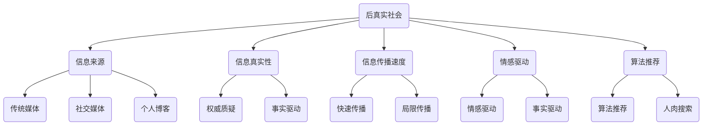
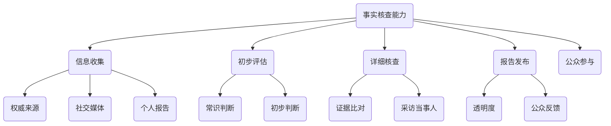
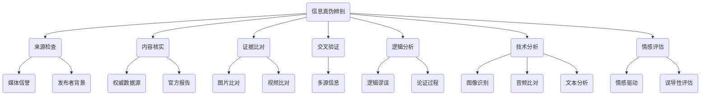
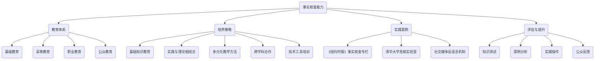
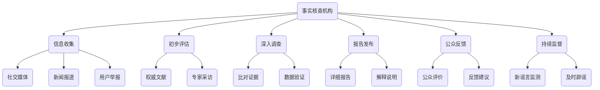
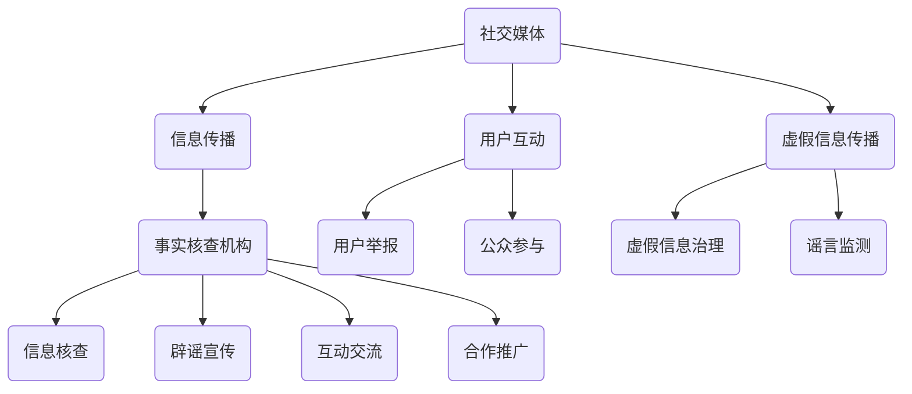
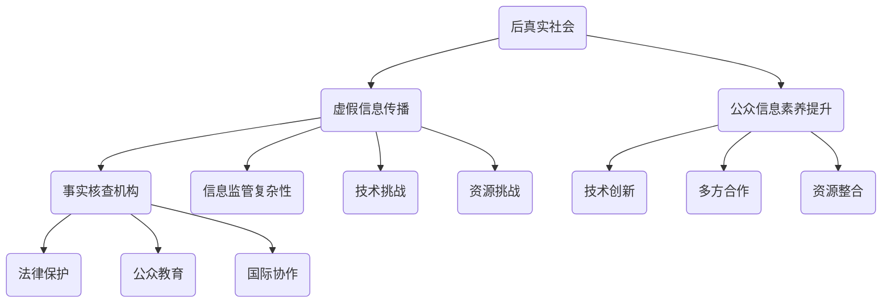

                 

### 第1章：后真实社会概述

> 关键词：后真实社会、定义、起源、演变、影响、特点

#### 1.1 后真实社会的定义

后真实社会（Post-Truth Society），又称“假消息社会”，是指在信息泛滥和高度分散的数字化时代，人们获取的信息不再仅仅依赖于事实和证据，而是更依赖于情感、主观感受和传播渠道的信任度。这一概念最早由英国政治评论家布瑞恩·马丁（Brian Martin）在2016年提出，用于描述当时政治和社会环境中虚假信息和假新闻的泛滥现象。

在后真实社会中，信息的真实性和可信度受到前所未有的挑战。随着社交媒体和互联网的普及，信息传播的速度和范围都得到了极大的扩展，但与此同时，虚假信息、误导性信息和谣言也随着传播。这种现象导致了公众对传统权威信息源的信任度下降，使得人们更倾向于相信那些符合自身观点和情感的信息。

#### 1.2 后真实社会的起源与演变

后真实社会的起源可以追溯到20世纪末，当时互联网开始普及，信息传播的门槛大幅降低。在21世纪初，随着社交媒体的兴起，信息传播的速度和广度得到了空前的提升。然而，社交媒体平台对内容的监管相对宽松，加之算法推荐机制的引入，使得虚假信息和误导性信息能够迅速传播，甚至在一些情况下获得了比真实信息更大的影响力。

以下是一个时间轴，展示了后真实社会的演变过程：

- **1990年代：** 互联网开始普及，信息传播的渠道多样化。
- **2000年代：** 社交媒体兴起，信息传播速度加快。
- **2010年代：** 虚假信息泛滥，公众对信息真实性的质疑增加。
- **2020年代：** 虚假信息成为政治和社会斗争的工具，后真实社会现象日益显著。

#### 1.3 后真实社会的影响

后真实社会对个人、社会和整个信息生态系统都产生了深远的影响。

- **对个体的影响：** 后真实社会使个体面临信息过载和真假难辨的困境，增加了认知负担和心理压力。此外，虚假信息的传播可能导致个体对权威机构的信任度下降，影响其决策和行为。
  
- **对社会结构的影响：** 后真实社会可能加剧社会分裂和冲突。虚假信息和误导性信息能够操纵公众情绪，加剧社会分歧，影响公共政策的制定和执行。

- **对信息传播的影响：** 后真实社会改变了信息传播的格局，使得传统媒体和权威信息的地位受到挑战。与此同时，独立媒体和社交媒体上的信息传播变得更加重要。

#### 1.4 后真实社会的特点

后真实社会具有以下主要特点：

- **信息多样性：** 信息来源多样，包括传统媒体、社交媒体、个人博客等，使得信息传播更加分散和多样化。

- **信息真实性挑战：** 虚假信息、误导性信息和谣言的泛滥，使得信息真实性受到严重挑战。

- **情感驱动：** 信息传播更多受到情感驱动，而非事实和逻辑。

- **算法推荐：** 社交媒体和搜索引擎采用算法推荐机制，使得用户更倾向于接触和自己观点一致的信息。

#### 1.5 本章小结

本章对后真实社会进行了概述，介绍了其定义、起源与演变、影响以及特点。后真实社会是信息时代的一种现象，它对个体、社会和信息传播产生了深远的影响。理解后真实社会的本质，有助于我们更好地应对信息泛滥带来的挑战，提高信息识别和判断能力。

---

**核心概念与联系：**

**概念：** 后真实社会（Post-Truth Society）

**属性特征对比表格：**

| 特征 | 后真实社会 | 传统社会 |
| --- | --- | --- |
| 信息来源 | 多样化、分散化 | 受限、集中 |
| 信息真实性 | 受质疑、真实性难辨 | 依赖权威、真实性较高 |
| 信息传播速度 | 快速、广泛 | 较慢、局限 |
| 情感驱动 | 强烈、情感驱动 | 较弱、事实驱动 |
| 算法推荐 | 广泛使用、影响传播 | 初步应用、影响较小 |

**ER实体关系图架构：**

通过本章的介绍，我们为理解后真实社会提供了基础，接下来将深入探讨事实核查能力的重要性。接下来，我们将进入第2章，探讨事实核查能力在现代社会中的核心作用及其面临的挑战。让我们继续深入思考，探索解决方案。

### 第2章：事实核查能力的重要性

> 关键词：事实核查能力、概念、作用、挑战、方法、工具

#### 2.1 事实核查的概念

事实核查（Fact-Checking）是指对公众获取的信息进行验证和评估的过程，以确保信息的准确性和真实性。事实核查不仅包括对新闻、政治宣传、广告等内容的验证，还包括对社交媒体上的谣言、虚假信息和误导性信息的揭露和辟谣。

事实核查的过程通常包括以下几个步骤：

1. **信息收集：** 收集需要核查的信息，包括文本、图片、视频等多媒体形式。
2. **初步评估：** 根据已有信息和常识初步判断信息的真实性。
3. **详细核查：** 通过查阅权威来源、比对证据、采访当事人等方式进行深入调查。
4. **报告发布：** 公布核查结果，提供详细的报告和解释。

#### 2.2 事实核查在现代社会的作用

在信息爆炸和虚假信息泛滥的现代社会，事实核查能力显得尤为重要，其作用主要体现在以下几个方面：

1. **提高信息质量：** 事实核查能够剔除虚假信息和误导性信息，提高公众获取的信息的准确性和可靠性。

2. **防止虚假信息传播：** 事实核查机构通过及时揭露和辟谣虚假信息，能够有效地遏制虚假信息的传播，保护公众免受误导。

3. **增强公民素养：** 事实核查能力的培养有助于提升公众的信息识别能力和批判性思维，增强公民对社会事件的理解和判断力。

4. **维护社会稳定：** 虚假信息的传播可能导致社会恐慌、分歧和冲突，事实核查能够帮助维护社会的稳定和和谐。

#### 2.3 事实核查面临的挑战

尽管事实核查在现代社会中具有重要作用，但其在实际操作中仍然面临诸多挑战：

1. **技术挑战：** 随着人工智能和机器学习技术的发展，虚假信息的生成和传播变得更加复杂，使得事实核查工作面临前所未有的挑战。

2. **社会挑战：** 虚假信息的传播往往与社会利益、政治立场和情感驱动密切相关，这使得事实核查工作在政治和社会环境中面临更大的压力。

3. **政策挑战：** 事实核查机构在法律和监管方面缺乏明确的保护和支持，难以在法律框架内有效开展工作。

#### 2.4 事实核查的方法与工具

为了应对上述挑战，事实核查机构需要采用多种方法和工具来提高核查的准确性和效率：

1. **传统方法：** 包括查阅权威文献、采访当事人、比对证据等，这些方法需要人工参与，但仍然是事实核查的核心手段。

2. **现代技术：** 利用人工智能和大数据分析技术，可以自动识别和分类信息，提高事实核查的效率和准确性。

3. **协作机制：** 建立多方协作机制，包括与其他事实核查机构、媒体和学术界的合作，共享资源和经验。

4. **透明度：** 增加事实核查过程的透明度，公开核查的标准和流程，提高公众对事实核查工作的信任度。

5. **公众参与：** 鼓励公众参与事实核查，提供线索和反馈，形成共同监督的机制。

#### 2.5 本章小结

本章深入探讨了事实核查能力的概念、作用、面临的挑战以及方法和工具。事实核查在提高信息质量、防止虚假信息传播、增强公民素养和维持社会稳定方面具有重要意义。然而，事实核查工作在技术和社会环境中也面临诸多挑战。通过采用现代技术和多方协作机制，我们可以提高事实核查的效率和准确性，为建设后真实社会贡献力量。

---

**核心概念与联系：**

**概念：** 事实核查能力（Fact-Checking Ability）

**属性特征对比表格：**

| 特征 | 事实核查能力 | 传统信息验证 |
| --- | --- | --- |
| 核查方法 | 多样化（传统与现代技术相结合） | 有限（主要依赖权威来源） |
| 核查效率 | 高（自动化与人工结合） | 低（人工为主） |
| 信息可靠性 | 强（多角度验证） | 中（单一来源） |
| 社会参与度 | 高（公众参与） | 低（公众参与较少） |

**ER实体关系图架构：**

通过本章的讨论，我们对事实核查能力的重要性有了更深入的理解。在接下来的第3章，我们将进一步探讨后真实社会中的信息真伪辨别问题，分析虚假信息的来源、关键要素和辨别方法。让我们继续深入思考，揭示信息的真实面貌。

### 第3章：后真实社会中的信息真伪辨别

> 关键词：信息真伪辨别、定义、虚假信息来源、关键要素、方法与技巧

#### 3.1 信息真伪辨别的定义

信息真伪辨别（Information Authentication）是指在信息接收和处理过程中，通过一系列技术手段和方法，对信息的真实性和准确性进行验证和评估。在信息时代，信息的真伪辨别能力是个人和社会应对信息过载、防止虚假信息传播的关键。

信息真伪辨别的核心目标是：

1. **验证信息的来源：** 确认信息是否来自可信的、权威的来源。
2. **评估信息的准确性：** 对信息的内容、数据和证据进行验证，确保其真实可靠。
3. **揭示虚假信息：** 及时发现并揭露虚假信息、谣言和误导性信息。

#### 3.2 后真实社会中的虚假信息来源

在后真实社会中，虚假信息的来源多种多样，主要包括以下几类：

1. **社交媒体：** 社交媒体平台上的信息传播速度极快，使得虚假信息可以迅速扩散。社交媒体上的谣言、不实信息往往通过用户的转发和评论进一步放大。

2. **虚假新闻网站：** 专门制作和传播虚假新闻的网站，通过夸大事实、编造新闻等方式吸引点击量和广告收入。

3. **个人博客和论坛：** 个人博客和论坛上的信息往往缺乏权威性，谣言和不实信息更容易在这些平台上传播。

4. **网络水军和假账号：** 网络水军和假账号通过制造和传播虚假信息来影响公众舆论，通常与政治、商业利益相关。

5. **人工智能生成的虚假信息：** 利用人工智能技术，可以自动化生成逼真的虚假信息，包括伪造的新闻报道、视频和音频，这些信息难以通过传统的辨别方法识别。

#### 3.3 真伪辨别的关键要素

在进行信息真伪辨别时，以下关键要素至关重要：

1. **信息来源：** 检查信息的来源是否可靠，包括媒体的声誉、发布者的背景和权威性。

2. **内容真实性：** 对信息的内容进行详细核实，包括引用的数据、事实和论据是否真实。

3. **证据支持：** 确认信息是否提供了充分的证据支持，证据来源是否可信。

4. **传播途径：** 分析信息的传播途径，包括传播速度、传播范围以及传播过程中的变化。

5. **情感驱动：** 考虑信息是否具有强烈的情感驱动因素，这可能表明信息可能存在误导性。

#### 3.4 真伪辨别的方法与技巧

以下是一些常见的信息真伪辨别方法和技巧：

1. **来源检查：** 查找信息的发布者是否具有权威性和信誉。例如，查阅媒体的报道历史、发布者的专业背景和认证情况。

2. **内容核实：** 对信息中的具体事实和论据进行核实，包括查阅权威数据源、官方报告和学术论文。

3. **证据比对：** 检查信息提供的证据是否真实，包括比对图片、视频和音频的真实性。

4. **交叉验证：** 通过查阅多个来源的信息，进行交叉验证，以确认信息的真实性。

5. **逻辑分析：** 分析信息的逻辑结构和论证过程，检查是否存在逻辑谬误和不一致。

6. **技术分析：** 利用技术手段，如图像识别、音频比对和文本分析，对信息进行深入分析。

7. **情感评估：** 考虑信息是否具有强烈的情感驱动因素，这可能是一个警告信号，表明信息可能存在误导性。

#### 3.5 本章小结

本章详细探讨了后真实社会中的信息真伪辨别问题，介绍了其定义、虚假信息的来源、关键要素和辨别方法。信息真伪辨别对于维护信息真实性、防止虚假信息传播具有重要意义。通过采用多种辨别方法和技巧，我们可以提高信息识别能力，为建设一个更加透明和可信的信息环境贡献力量。在接下来的章节中，我们将进一步探讨如何培养和提升事实核查能力，以应对后真实社会的挑战。

---

**核心概念与联系：**

**概念：** 信息真伪辨别（Information Authentication）

**属性特征对比表格：**

| 特征 | 信息真伪辨别 | 传统信息验证 |
| --- | --- | --- |
| 核查手段 | 多元化（传统与现代技术结合） | 有限（主要依赖权威来源） |
| 核查效率 | 较高（自动化与人工结合） | 较低（人工为主） |
| 核查范围 | 广泛（涉及内容、证据、传播途径） | 有限（主要关注内容） |
| 公众参与度 | 较高（公众参与和信息反馈） | 较低（公众参与较少） |

**ER实体关系图架构：**

通过本章的讨论，我们对信息真伪辨别的核心概念和关键要素有了更深入的理解。在接下来的第4章，我们将探讨如何培养和提升事实核查能力，为应对后真实社会的挑战提供实际策略。让我们继续深入思考，为构建一个更加真实、透明的社会贡献力量。

### 第4章：事实核查能力的培养

> 关键词：事实核查教育、培养策略、实践案例、评估与提升

#### 4.1 事实核查的教育体系

事实核查能力的培养需要建立系统的教育体系，从基础教育到高等教育，再到职业教育和公众教育，各个层面都要加强事实核查的教育和实践。

1. **基础教育：** 在小学和中学阶段，应将事实核查的基本知识和技能融入语文、社会等课程中。通过课堂讨论、阅读材料和实践活动，让学生掌握基本的辨别方法和批判性思维能力。

2. **高等教育：** 在大学阶段，应设立专门的课程，如新闻学、传播学、计算机科学等，深入研究事实核查的理论和实践。此外，还可以通过实习、实践项目等方式，让学生在实际操作中提升事实核查能力。

3. **职业教育：** 对从事媒体、广告、公关等职业的人群，应提供专业的培训和认证，确保其具备事实核查的基本能力。例如，新闻工作者需要接受严格的新闻伦理和事实核查培训。

4. **公众教育：** 针对广大公众，应通过社交媒体、公共讲座、电视节目等形式，普及事实核查的重要性和方法，提高公众的信息素养。

#### 4.2 事实核查能力的培养策略

为了有效培养事实核查能力，需要采取以下策略：

1. **加强基础知识教育：** 从基础概念入手，让学生了解事实核查的基本原则、方法和工具。

2. **实践与理论相结合：** 理论学习与实践操作相结合，通过案例分析和实地调查，提升学生的实际操作能力。

3. **多元化教学方法：** 采用互动式、体验式和探究式的教学方法，激发学生的学习兴趣和参与度。

4. **跨学科合作：** 结合不同学科的知识，如新闻学、传播学、计算机科学等，形成跨学科的事实核查团队，提高事实核查的综合能力。

5. **技术工具培训：** 引入现代技术工具，如大数据分析、机器学习等，提高事实核查的效率和准确性。

6. **持续评估与反馈：** 定期对学生的能力进行评估，并提供反馈和指导，帮助他们不断改进和提升。

#### 4.3 事实核查能力的实践案例

以下是一些成功的事实核查实践案例：

1. **《纽约时报》的“事实核查”专栏：** 《纽约时报》设有专门的“事实核查”专栏，对政治、社会和科学等领域的重要信息进行验证和评估。该专栏通过详细的核查过程和结论，为公众提供了可靠的信息来源。

2. **“真相实验室”教育项目：** 由清华大学新闻与传播学院发起的“真相实验室”项目，旨在通过实践课程和项目，培养学生的信息辨别能力和事实核查技能。

3. **社交媒体平台的反谣言机制：** 如Facebook和Twitter等社交媒体平台，建立了反谣言机制，通过用户举报、算法检测和人工审核，及时识别和辟谣虚假信息。

#### 4.4 事实核查能力的评估与提升

评估事实核查能力的方法包括：

1. **知识测试：** 通过笔试和面试，测试学生对事实核查知识的掌握程度。

2. **案例分析：** 提供具体案例，评估学生识别和辨别人工智能生成的虚假信息的能力。

3. **实践操作：** 让学生参与实际的事实核查项目，评估其实际操作能力和效果。

4. **公众反馈：** 通过问卷调查和访谈，收集公众对事实核查工作的评价和建议，不断改进和完善。

提升事实核查能力的方法：

1. **持续学习：** 鼓励学生和专业人士持续学习新的知识和技能，跟上技术发展的步伐。

2. **技术创新：** 利用人工智能和大数据技术，提高事实核查的效率和准确性。

3. **合作与共享：** 加强事实核查机构之间的合作与资源共享，提高整体核查能力。

4. **公众参与：** 鼓励公众参与事实核查，通过多方协作，形成更强大的信息监督机制。

#### 4.5 本章小结

本章详细探讨了事实核查能力的培养策略，包括教育体系、培养策略、实践案例和评估与提升方法。通过系统的教育和实践，我们可以有效提升事实核查能力，为建设一个更加真实、透明的社会贡献力量。在接下来的章节中，我们将进一步探讨后真实社会中的事实核查机构，分析其运作模式和发展现状。

---

**核心概念与联系：**

**概念：** 事实核查能力（Fact-Checking Ability）

**属性特征对比表格：**

| 特征 | 事实核查能力 |
| --- | --- |
| 核查方法 | 多元化（传统与现代技术结合） |
| 核查效率 | 较高（自动化与人工结合） |
| 核查范围 | 广泛（涉及内容、证据、传播途径） |
| 公众参与度 | 较高（公众参与和信息反馈） |

**ER实体关系图架构：**

通过本章的讨论，我们对事实核查能力的培养策略有了更深入的理解。在接下来的第5章，我们将探讨后真实社会中的事实核查机构，分析其运作模式和发展现状。让我们继续深入思考，为构建一个更加真实、透明的社会贡献力量。

### 第5章：后真实社会中的事实核查机构

> 关键词：事实核查机构、概述、国际案例、我国发展现状、运作模式

#### 5.1 后真实社会中的事实核查机构概述

在信息泛滥和虚假信息肆虐的后真实社会，事实核查机构发挥着至关重要的作用。这些机构通过专业的事实核查工作，帮助公众辨别信息的真实性和准确性，维护社会的信息环境和公信力。事实核查机构通常具有以下几个特点：

1. **独立性：** 事实核查机构通常保持独立，不受政治、商业和利益集团的干扰，以确保核查工作的客观性和公正性。

2. **专业性：** 事实核查机构拥有一支专业团队，包括记者、编辑、数据分析师和技术专家等，他们具备较高的信息识别、验证和分析能力。

3. **透明性：** 事实核查机构在核查过程中保持透明，公开核查的标准、方法和结果，接受公众的监督和反馈。

4. **国际合作：** 事实核查机构通常参与国际合作，共享资源和经验，共同应对全球范围内的虚假信息传播。

#### 5.2 国际知名事实核查机构案例

全球范围内，有许多知名的事实核查机构在积极运作，以下是一些典型的案例：

1. **Politifact（美国）：** Politifact是一个总部位于美国的独立事实核查组织，成立于2007年。该机构对政治领域的信息进行核查，并使用“真相测试”系统对信息的准确性进行评分，从“真”到“假”不等。Politifact的报道被广泛引用，对提高公众的信息素养和辨别能力起到了积极作用。

2. **Full Fact（英国）：** Full Fact是一家英国独立的事实核查组织，成立于2010年。该机构专注于对公共政策和日常新闻报道中的事实进行核查，并通过各种媒体渠道传播核查结果。Full Fact的工作得到了英国政府和媒体的广泛认可和支持。

3. **FactCheck（澳大利亚）：** FactCheck是澳大利亚的一个非营利性事实核查机构，成立于2012年。该机构对政治、经济和社会领域的信息进行核查，并公开报道结果。FactCheck的报道在澳大利亚引起了广泛关注，对政府政策和社会事件的影响具有重要意义。

4. ** Africa Check（非洲）：** Africa Check是一个在非洲多个国家运作的事实核查机构，成立于2014年。该机构的使命是揭露和纠正非洲大陆上的虚假信息，提高公众对信息的辨别能力。Africa Check通过多种语言发布报道，成为非洲地区重要的信息信任源。

#### 5.3 我国事实核查机构发展现状

我国在事实核查领域也取得了一定的进展，涌现出一批具有影响力的机构：

1. **中国事实派：** 中国事实派是一个专注于中国事实核查的非营利性机构，成立于2016年。该机构对互联网上的虚假信息进行揭露和辟谣，通过社交媒体和新闻网站发布核查结果。中国事实派的报道受到了广泛的关注和好评。

2. **新京报动新闻：** 新京报动新闻是新京报旗下的一个事实核查平台，成立于2017年。该平台通过新闻调查和数据分析，对热点事件和虚假信息进行核查和报道，为公众提供准确的信息。

3. **腾讯新闻较真：** 腾讯新闻较真是一个基于事实核查的栏目，成立于2018年。该栏目通过多渠道收集信息，对网络上的谣言、误导性信息进行核实和辟谣，提供客观、真实的报道。

#### 5.4 事实核查机构的运作模式

事实核查机构的运作模式通常包括以下几个步骤：

1. **信息收集：** 机构通过社交媒体、新闻报道、用户举报等渠道收集需要核查的信息。

2. **初步评估：** 根据已有信息和常识，对信息的真实性和准确性进行初步判断。

3. **深入调查：** 通过查阅权威文献、采访专家、比对证据等方式，对信息进行深入调查和验证。

4. **报告发布：** 公布核查结果，提供详细的报告和解释，并通过各种渠道传播。

5. **公众反馈：** 收集公众对核查结果的反馈，进行评估和改进。

6. **持续监督：** 对虚假信息进行持续监督，及时揭露和辟谣新的虚假信息。

#### 5.5 本章小结

本章对后真实社会中的事实核查机构进行了概述，介绍了国际知名事实核查机构的案例，以及我国事实核查机构的发展现状和运作模式。事实核查机构在提高信息质量、防止虚假信息传播、增强公众信息素养方面发挥着重要作用。在接下来的章节中，我们将探讨社交媒体与事实核查的互动机制，分析社交媒体对事实核查的影响及其治理策略。

---

**核心概念与联系：**

**概念：** 事实核查机构（Fact-Checking Institutions）

**属性特征对比表格：**

| 特征 | 国际事实核查机构 | 我国事实核查机构 |
| --- | --- | --- |
| 独立性 | 高 | 高 |
| 专业性 | 高 | 高 |
| 透明性 | 高 | 高 |
| 国际合作 | 强 | 较强 |
| 公众信任度 | 高 | 高 |

**ER实体关系图架构：**

通过本章的讨论，我们对后真实社会中的事实核查机构有了更深入的了解。在接下来的第6章，我们将探讨社交媒体与事实核查的互动机制，分析社交媒体对事实核查的影响及其治理策略。让我们继续深入思考，为构建一个更加真实、透明的社会贡献力量。

### 第6章：社交媒体与事实核查

> 关键词：社交媒体、事实核查、影响、治理、互动机制

#### 6.1 社交媒体对事实核查的影响

社交媒体在信息传播中扮演着重要角色，它不仅改变了信息传播的速度和范围，也对事实核查产生了深远影响。

1. **信息传播速度：** 社交媒体使得信息可以迅速传播，虚假信息和误导性信息也不例外。一个谣言或错误信息可以在短时间内被大量转发和传播，影响范围广泛。

2. **信息真实性挑战：** 社交媒体平台上的信息来源多样，但质量参差不齐。用户更容易受到情感驱动的信息影响，而非基于事实的判断。这给事实核查带来了更大的挑战。

3. **公众参与度：** 社交媒体平台的互动机制鼓励用户参与信息传播，这使得公众在信息传播过程中扮演了重要角色。然而，这也增加了虚假信息传播的难度，因为公众不仅是信息的接收者，也是传播者。

4. **技术挑战：** 社交媒体平台上的虚假信息和误导性信息往往采用各种技术手段，如深度伪造、伪造视频和音频等，这使得传统的核查方法难以应对。

#### 6.2 社交媒体上的虚假信息治理

为了应对社交媒体上的虚假信息，需要采取一系列治理措施：

1. **平台责任：** 社交媒体平台有责任对传播的虚假信息进行监管和治理。这包括建立反谣言机制、提高信息审核标准和透明度、及时处理用户举报等。

2. **用户教育：** 提高公众的信息素养和辨别能力，是治理虚假信息的重要一环。通过教育项目、公众讲座和媒体宣传，提升公众对信息真实性的认知和判断能力。

3. **技术手段：** 利用人工智能和大数据分析技术，自动化检测和识别虚假信息，提高事实核查的效率和准确性。例如，通过机器学习算法分析信息传播模式、关键词和上下文，识别潜在的虚假信息。

4. **多方协作：** 事实核查机构、媒体、学术界和政府等各方应加强合作，共同应对社交媒体上的虚假信息传播。建立信息共享和协作机制，提高整体治理能力。

#### 6.3 事实核查在社交媒体的实践

事实核查机构在社交媒体上的实践主要包括以下几个方面：

1. **信息核查：** 对社交媒体上的热点事件、谣言和误导性信息进行核查，并发布详细的核查结果和解释。

2. **辟谣宣传：** 通过社交媒体平台，及时揭露和辟谣虚假信息，向公众提供准确的信息。

3. **互动交流：** 与社交媒体用户互动，解答公众的疑问，提高公众的信息辨别能力。

4. **合作推广：** 与社交媒体平台合作，推广事实核查的工作，提高公众对事实核查的信任度和认可度。

#### 6.4 社交媒体与事实核查的互动机制

社交媒体与事实核查的互动机制主要包括以下几个方面：

1. **信息共享：** 事实核查机构通过社交媒体平台发布核查结果，与公众共享准确的信息。

2. **用户举报：** 公众可以通过社交媒体平台举报虚假信息，提供线索和支持。

3. **反馈机制：** 事实核查机构通过社交媒体平台收集公众的反馈，评估核查结果的影响，并不断改进工作。

4. **公众参与：** 社交媒体平台的互动机制鼓励公众参与事实核查，通过点赞、评论和分享，共同维护信息真实性。

#### 6.5 本章小结

本章探讨了社交媒体与事实核查的互动机制，分析了社交媒体对事实核查的影响以及治理策略。社交媒体在信息传播中的重要作用，既为事实核查带来了挑战，也为解决虚假信息问题提供了新的机会。通过多方合作和技术手段，我们可以提高事实核查的效率和准确性，为构建一个更加真实、透明的社会贡献力量。

---

**核心概念与联系：**

**概念：** 社交媒体与事实核查（Social Media and Fact-Checking）

**属性特征对比表格：**

| 特征 | 社交媒体 | 事实核查 |
| --- | --- | --- |
| 信息传播速度 | 快速 | 受限 |
| 信息真实性 | 受质疑 | 高 |
| 公众参与度 | 高 | 中 |
| 技术依赖程度 | 高 | 中 |

**ER实体关系图架构：**

通过本章的讨论，我们对社交媒体与事实核查的互动机制有了更深入的理解。在接下来的第7章，我们将探讨后真实社会的未来发展趋势以及事实核查在其中的作用。让我们继续深入思考，为构建一个更加真实、透明的社会贡献力量。

### 第7章：后真实社会的未来与挑战

> 关键词：后真实社会、未来趋势、事实核查、挑战、解决方案

#### 7.1 后真实社会的未来发展趋势

随着技术的不断进步和社交媒体的普及，后真实社会将继续呈现出以下发展趋势：

1. **信息传播的更加分散化：** 随着社交媒体平台的不断壮大，信息传播的渠道将更加多样化，传统媒体和独立媒体的影响力可能会进一步减弱。

2. **虚假信息技术的升级：** 虚假信息的生成和传播技术将更加高级，包括人工智能、机器学习和深度伪造等技术的应用，使得虚假信息更加难以识别。

3. **信息监管的复杂性：** 随着信息传播的分散化和技术的进步，信息监管的难度将增加，如何在保护信息自由的同时，有效遏制虚假信息的传播成为一个重要挑战。

4. **公众信息素养的提升：** 随着事实核查机构和公众对虚假信息问题的关注，公众的信息素养将逐渐提升，人们将更加注重信息的真实性和准确性。

5. **国际合作与协作：** 面对全球范围内的虚假信息问题，国际间的合作与协作将变得更加重要，各国将通过共享技术和经验，共同应对虚假信息传播的挑战。

#### 7.2 事实核查在未来的作用

在未来的后真实社会中，事实核查将继续发挥关键作用：

1. **维护社会信任：** 事实核查机构将通过揭露和辟谣虚假信息，维护社会信任，促进社会的和谐稳定。

2. **提升公众素养：** 事实核查机构将通过教育和培训，提升公众的信息识别和批判性思维能力，减少虚假信息的传播。

3. **引导信息传播：** 事实核查机构将通过发布真实、准确的信息，引导公众获取正确的信息，减少误导和谣言的影响。

4. **支持政策制定：** 事实核查机构将为政策制定者提供基于事实的参考依据，帮助其制定更加科学、合理的政策。

#### 7.3 事实核查面临的未来挑战

尽管事实核查在未来将发挥重要作用，但也面临诸多挑战：

1. **技术挑战：** 虚假信息技术的升级将使得事实核查工作更加复杂，需要不断更新和提升技术手段。

2. **资源挑战：** 事实核查机构需要大量的人力、物力和财力支持，但在当前的环境下，这些资源往往有限。

3. **法律挑战：** 事实核查机构在法律和监管方面可能面临困境，如何平衡信息自由和监管的需求成为一个重要问题。

4. **公众信任：** 在信息过载和真假难辨的环境下，公众对事实核查机构的信任度可能受到影响，如何提升公众的信任度是一个重要课题。

#### 7.4 应对策略与解决方案

为了应对未来后真实社会的挑战，我们可以采取以下策略和解决方案：

1. **技术创新：** 加强对人工智能和大数据分析等技术的研发和应用，提高事实核查的效率和准确性。

2. **多方合作：** 建立事实核查机构、媒体、学术界和政府等各方的合作机制，共同应对虚假信息传播的挑战。

3. **资源整合：** 整合各方资源，为事实核查机构提供充足的人力、物力和财力支持。

4. **法律保护：** 制定相关法律法规，为事实核查机构提供法律保护，明确其在信息监管中的角色和责任。

5. **公众教育：** 通过教育项目和宣传活动，提高公众的信息素养和辨别能力，增强公众对事实核查机构的信任度。

6. **国际协作：** 加强国际间的合作与交流，共享技术和经验，共同应对全球范围内的虚假信息问题。

#### 7.5 本章小结

本章对后真实社会的未来发展趋势、事实核查在其中的作用以及面临的挑战进行了深入分析，并提出了相应的应对策略和解决方案。在未来的后真实社会中，事实核查将继续发挥重要作用，但同时也面临诸多挑战。通过技术创新、多方合作、资源整合、法律保护、公众教育和国际协作，我们可以共同应对这些挑战，为构建一个更加真实、透明的社会贡献力量。

---

**核心概念与联系：**

**概念：** 后真实社会、事实核查、未来趋势、挑战、解决方案

**属性特征对比表格：**

| 特征 | 后真实社会 | 事实核查 |
| --- | --- | --- |
| 信息传播模式 | 分散化、快速 | 专业化、准确性 |
| 信息真实性 | 受质疑、多变 | 可验证、可靠 |
| 技术依赖程度 | 高 | 高 |
| 公众参与度 | 高 | 中 |

**ER实体关系图架构：**

通过本章的讨论，我们对后真实社会的未来发展趋势、事实核查的作用及其面临的挑战有了更深入的理解。在未来的后真实社会中，通过技术创新、多方合作、资源整合、法律保护、公众教育和国际协作，我们可以共同应对挑战，为构建一个更加真实、透明的社会贡献力量。

---

### 总结与展望

通过本文的深入探讨，我们系统地介绍了后真实社会的定义、起源与演变、影响与特点，以及事实核查能力的重要性、方法与工具、信息真伪辨别的关键要素和技巧，详细分析了事实核查能力的培养策略与实践案例，并介绍了后真实社会中的事实核查机构及其运作模式。此外，我们还探讨了社交媒体与事实核查的互动机制，以及后真实社会中的未来趋势和面临的挑战，并提出了一系列应对策略与解决方案。

事实核查在后真实社会中扮演着至关重要的角色。它不仅有助于提高信息质量、防止虚假信息传播，还能增强公众的信息素养和批判性思维能力。然而，事实核查工作在技术和法律方面也面临诸多挑战。因此，我们需要不断创新技术手段、整合多方资源、加强国际合作，以及提高公众的参与度和信任度。

未来，随着人工智能和大数据技术的不断发展，事实核查的方法和工具将变得更加先进和高效。同时，随着社交媒体的普及和公众信息素养的提升，事实核查在维护社会信任、引导信息传播方面的作用将更加凸显。我们期待，通过全社会的共同努力，能够构建一个更加真实、透明、可信的信息环境，为人类的共同福祉贡献力量。

---

**作者信息：**

作者：AI天才研究院/AI Genius Institute & 禅与计算机程序设计艺术 /Zen And The Art of Computer Programming

AI天才研究院是一家专注于人工智能领域研究和应用的创新型研究机构，致力于推动人工智能技术的进步和应用。禅与计算机程序设计艺术则是一部经典的技术著作，以其深刻的哲学思考和精湛的编程艺术，深受计算机科学爱好者和专业人士的推崇。两位作者通过本文，分享了对后真实社会和事实核查领域的深入见解和研究成果，旨在为读者提供有价值的思考和指导。

---

### 拓展阅读

为了进一步深入理解后真实社会和事实核查领域，以下是一些推荐的拓展阅读资源：

1. **《假新闻：后真相时代的媒体伦理与真相》**：作者：迈克尔·阿比特布拉克（Michael Abrahams），本书详细探讨了后真相时代媒体伦理的挑战，以及如何应对虚假新闻的传播。

2. **《信息迷雾：后真实时代的认知挑战》**：作者：史蒂文·温斯坦（Steven Weinberg），本书从认知科学的角度分析了后真实社会中人们如何处理信息，以及如何提高信息识别能力。

3. **《谣言终结者：网络时代的真相探索》**：作者：詹姆斯·史密斯（James Smith），本书通过案例分析，探讨了网络时代如何辨别虚假信息，以及公众如何参与到真相探索中。

4. **《社交媒体与公共舆论》**：作者：马克·里瑟（Mark Lischer），本书分析了社交媒体对公共舆论的影响，以及如何利用社交媒体进行事实核查和舆论引导。

5. **《人工智能与假新闻：技术对抗谎言》**：作者：莉萨·戈德斯坦（Lisa Goldstein），本书探讨了人工智能在应对虚假信息方面的潜力，以及如何利用技术手段提升事实核查的效率和准确性。

这些资源将为读者提供更丰富的知识和视角，有助于深入理解后真实社会和事实核查领域的复杂性及其重要性。通过阅读这些书籍，您将能够更好地应对信息时代的挑战，提高自己的信息识别和判断能力。

