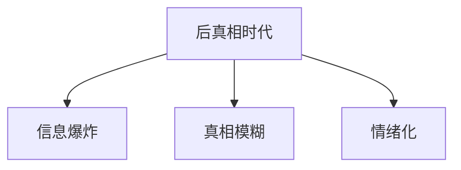
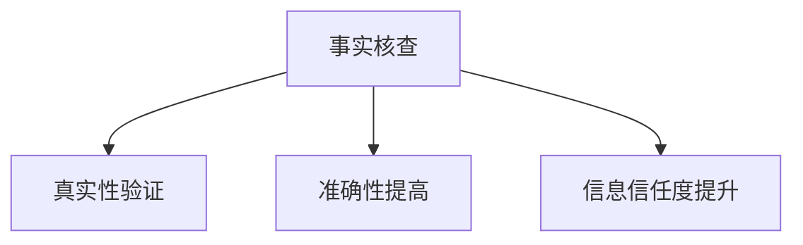
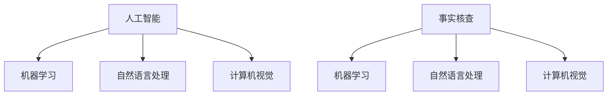
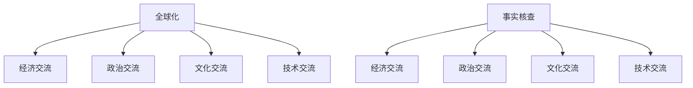
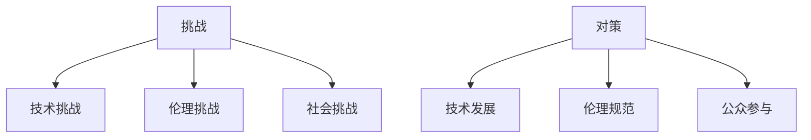

                 

### 后真相时代的真相追寻者：事实核查训练

---

**关键词：**
- 后真相时代
- 事实核查
- 训练方法
- 人工智能
- 社会责任

**摘要：**
本文探讨了后真相时代的挑战，强调了事实核查的重要性。通过分析事实核查的基本原理、工具与资源、案例研究以及培训与教育，本文提出了在事实核查中应用人工智能的方法，并探讨了未来事实核查的发展趋势。最后，本文总结了事实核查的价值与意义，呼吁公众共同参与构建真相。

---

## 引言：后真相时代的挑战

### 1.1 后真相时代的定义与特点

**核心概念与联系**

- **定义**：后真相时代，指的是一个信息泛滥、真相变得模糊的时代，公众的情绪和偏见往往比事实更能影响决策。
  
- **特点**：
  - **信息爆炸**：互联网和社交媒体的普及使得信息传播速度加快，信息量呈指数级增长。
  - **真相模糊**：真假难辨的信息充斥着网络，人们难以区分真相与虚假信息。
  - **情绪化**：公众更倾向于根据情绪和立场来判断信息，而非理性分析。

**ER实体关系图架构**

### 1.2 信息泛滥与事实核查的必要性

**背景介绍**

随着互联网和社交媒体的普及，信息传播变得更加容易和快速，然而，这也带来了信息泛滥的问题。虚假信息、误导性信息和谣言的传播，严重影响了社会的稳定和公共信任。

**问题描述**

- **虚假信息**：虚假信息可能导致公众的误解和恐慌，甚至引发社会动荡。
- **误导性信息**：误导性信息可能影响个人的决策，导致经济损失或健康风险。
- **谣言**：谣言的传播可能破坏个人名誉，造成社会分裂。

**问题解决**

事实核查是对信息的真实性和准确性进行验证的过程。通过事实核查，可以揭示虚假信息和误导性信息的真相，帮助公众做出更明智的决策。

**边界与外延**

- **事实核查**：仅限于对事实进行核实，不涉及主观判断和价值观。
- **信息真实性**：关注信息的来源、证据和逻辑推理。

**概念结构与核心要素组成**

- **信息来源**：确定信息的来源，评估其可靠性和权威性。
- **证据**：收集相关的证据，包括文献、数据、统计数据等。
- **逻辑推理**：分析信息的逻辑关系，判断其是否合理。

### 1.3 事实核查的挑战与机遇

**挑战**

- **信息量庞大**：随着信息量的增长，事实核查的难度也在增加。
- **技术挑战**：人工智能等新技术的发展为事实核查提供了新的手段，但也带来了新的挑战。
- **社会挑战**：公众对事实核查的信任度可能受到影响。

**机遇**

- **技术进步**：人工智能和大数据分析技术可以提高事实核查的效率和准确性。
- **公众参与**：随着公众意识的提高，越来越多的人愿意参与事实核查，共同构建真相。

**未来趋势**

- **专业化**：事实核查将更加专业化，涉及更多的领域和问题。
- **全球化**：事实核查将超越国界，成为全球性的议题。
- **科技融合**：事实核查将与人工智能、大数据等新技术深度融合。

**结论**

后真相时代带来了信息泛滥的挑战，但同时也为事实核查提供了新的机遇。通过逐步分析和推理，我们可以更好地应对这些挑战，共同构建一个基于真相的社会。

---

## 第1章 引言：后真相时代的挑战

### 1.1 后真相时代的定义与特点

在现代社会，信息传播的速度和广度前所未有。然而，这也带来了一个问题：真相变得模糊，人们难以分辨真假。后真相时代，这个术语描述了一个信息泛滥、情绪化、真相模糊的时代。

### 1.2 信息泛滥与事实核查的必要性

信息爆炸带来了虚假信息、误导性信息和谣言的泛滥。这些信息的传播对社会稳定和公共信任造成了严重威胁。因此，事实核查变得尤为重要。

### 1.3 事实核查的挑战与机遇

事实核查面临着信息量庞大、技术挑战和社会挑战等多重挑战。然而，随着人工智能等技术的发展，事实核查也迎来了新的机遇。

### 第1章小结

后真相时代的挑战不容忽视，但通过事实核查，我们可以更好地应对这些挑战。事实核查不仅是个人责任，也是整个社会的责任。让我们共同追寻真相，构建一个更加透明、公正和理性的社会。

---

## 第2章 事实核查的基本原理

### 2.1 事实核查的定义与目标

**核心概念与联系**

- **定义**：事实核查是对信息的真实性进行验证的过程。它旨在揭示虚假信息和误导性信息的真相，帮助公众做出更明智的决策。

- **目标**：事实核查的目标是确保信息的真实性和准确性，提高公众对信息的信任度。

**ER实体关系图架构**

### 2.2 事实核查的方法与步骤

**背景介绍**

在事实核查过程中，方法的选择和步骤的执行至关重要。以下是一个常见的事实核查方法与步骤：

- **步骤一：确定信息来源**：首先，需要确定信息的来源，评估其可靠性和权威性。
  
- **步骤二：收集相关证据**：接着，收集与信息相关的证据，包括文献、数据、统计数据等。

- **步骤三：分析信息的逻辑关系**：分析信息的逻辑关系，判断其是否合理。

- **步骤四：得出结论**：根据收集的证据和分析结果，得出结论。

**问题描述**

- **信息来源的可靠性**：如何确定信息来源的可靠性？
  
- **证据的充分性**：如何判断证据的充分性？
  
- **逻辑分析的准确性**：如何确保逻辑分析的准确性？

**问题解决**

- **信息来源的可靠性**：通过查阅相关文献、对比其他信息来源、评估信息发布者的背景和声誉等方式来确定信息来源的可靠性。

- **证据的充分性**：通过收集多种证据、对比不同证据的可靠性、评估证据的全面性和一致性来判断证据的充分性。

- **逻辑分析的准确性**：通过使用逻辑推理、对比分析、交叉验证等方法来确保逻辑分析的准确性。

**边界与外延**

- **事实核查的范围**：事实核查仅限于对事实进行核实，不涉及主观判断和价值观。
  
- **信息真实性**：关注信息的来源、证据和逻辑推理。

**概念结构与核心要素组成**

- **信息来源**：确定信息的来源，评估其可靠性和权威性。
  
- **证据**：收集相关的证据，包括文献、数据、统计数据等。
  
- **逻辑推理**：分析信息的逻辑关系，判断其是否合理。

### 2.3 核查过程中的伦理问题

**背景介绍**

在事实核查过程中，伦理问题同样重要。以下是一些常见的伦理问题：

- **信息来源的保密性**：如何确保信息来源的保密性？
  
- **信息的公正性**：如何确保信息的公正性？
  
- **公众隐私的保护**：如何保护公众的隐私？

**问题描述**

- **信息来源的保密性**：在事实核查过程中，如何确保信息来源的保密性，避免泄露敏感信息？
  
- **信息的公正性**：如何确保事实核查的公正性，避免偏见和误导？
  
- **公众隐私的保护**：如何保护公众的隐私，避免滥用个人信息？

**问题解决**

- **信息来源的保密性**：通过加密技术、匿名化处理等方式来确保信息来源的保密性。
  
- **信息的公正性**：通过多元化视角、多源数据验证、公众参与等方式来确保事实核查的公正性。
  
- **公众隐私的保护**：通过隐私保护政策、数据加密、访问控制等方式来保护公众的隐私。

**边界与外延**

- **伦理原则**：事实核查应遵循诚信、公正、透明等伦理原则。
  
- **法律责任**：事实核查者应承担相应的法律责任，确保信息来源的合法性和信息的真实性。

**结论**

事实核查不仅是一个技术过程，也是一个伦理过程。在事实核查过程中，我们需要关注伦理问题，确保信息的真实性和公正性，同时保护公众的隐私。

---

## 第2章 事实核查的基本原理

### 2.1 事实核查的定义与目标

事实核查是一种验证信息真实性的过程，其目标是确保公众获取到准确、可靠的信息。通过事实核查，我们可以揭示虚假信息和误导性信息的真相，提高公众对信息的信任度。

### 2.2 事实核查的方法与步骤

事实核查的方法与步骤包括确定信息来源、收集相关证据、分析信息的逻辑关系和得出结论。这些步骤旨在确保信息的真实性，并提供可靠的数据支持。

### 2.3 核查过程中的伦理问题

在事实核查过程中，我们需关注信息来源的保密性、信息的公正性和公众隐私的保护。通过遵循伦理原则和承担法律责任，我们可以确保事实核查的公正性和合法性。

### 第2章小结

事实核查的基本原理和方法对于揭示真相至关重要。同时，我们还需关注伦理问题，确保信息的真实性和公正性。通过逐步分析和推理，我们可以更好地应对后真相时代的挑战。

---

## 第3章 事实核查工具与资源

### 3.1 事实核查工具的介绍

在事实核查过程中，工具的选择至关重要。以下是一些常用的事实核查工具：

- **在线事实核查工具**：如FactCheck.org、PolitiFact等，它们提供针对各种话题的事实核查报告。
- **移动应用工具**：如Full Fact App、Hoaxy等，用户可以通过这些应用快速核查信息的真实性。
- **专业事实核查平台**：如Snopes、FactCheck.org等，它们提供全面的事实核查服务，涵盖多个领域。

### 3.2 网络资源与数据库的使用

在进行事实核查时，网络资源与数据库的使用同样重要。以下是一些常用的网络资源和数据库：

- **政府机构与公共数据库**：如世界卫生组织（WHO）、联合国统计数据库等，这些数据库提供权威的数据支持。
- **新闻媒体资源**：如纽约时报、卫报等，新闻媒体往往提供详尽的事实核查报告。
- **开源数据库与API**：如OpenCorporates、Google Dataset Search等，这些资源提供丰富的数据支持。

### 3.3 社交媒体上的事实核查

社交媒体平台是信息传播的重要渠道，但也存在虚假信息和误导性信息。以下是一些在社交媒体上进行事实核查的策略：

- **利用平台工具**：许多社交媒体平台提供举报功能，用户可以举报虚假信息和误导性信息。
- **多元化视角**：在社交媒体上查找多个来源的信息，通过对比分析来验证信息的真实性。
- **公众参与**：鼓励公众参与事实核查，共同揭示虚假信息和误导性信息的真相。

### 3.3 社交媒体事实核查的挑战与对策

**挑战**

- **信息传播速度快**：虚假信息和误导性信息可能在短时间内传播广泛，影响公众判断。
- **公众情绪化**：在社交媒体上，公众的情绪往往比理性分析更占主导地位。
- **技术挑战**：人工智能等技术的发展为虚假信息和误导性信息的传播提供了新的手段。

**对策**

- **加强技术手段**：利用人工智能和大数据分析技术，快速识别和过滤虚假信息和误导性信息。
- **提高公众意识**：通过教育和宣传，提高公众对事实核查的认识和参与度。
- **多元化视角**：鼓励公众从多个来源获取信息，避免单一来源的偏见。

**结论**

事实核查工具与资源的丰富为我们提供了更多的手段来应对后真相时代的挑战。同时，我们也需关注社交媒体上的事实核查，提高公众的参与度，共同构建一个基于真相的社会。

---

## 第3章 事实核查工具与资源

### 3.1 事实核查工具的介绍

事实核查工具是进行事实核查的重要辅助手段，能够帮助我们快速、准确地验证信息的真实性。以下是几种常用的事实核查工具：

- **在线事实核查工具**：如FactCheck.org、PolitiFact等，它们提供针对各种话题的事实核查报告，帮助用户了解信息的真实性。
- **移动应用工具**：如Full Fact App、Hoaxy等，用户可以通过这些应用快速核查信息的真实性，方便快捷。
- **专业事实核查平台**：如Snopes、FactCheck.org等，这些平台提供全面的事实核查服务，涵盖多个领域，具有较高的权威性和可信度。

### 3.2 网络资源与数据库的使用

网络资源和数据库是进行事实核查的重要数据来源，以下是一些常用的网络资源和数据库：

- **政府机构与公共数据库**：如世界卫生组织（WHO）、联合国统计数据库等，这些数据库提供权威的数据支持，有助于验证信息的真实性。
- **新闻媒体资源**：如纽约时报、卫报等，新闻媒体往往提供详尽的事实核查报告，为公众提供有价值的信息。
- **开源数据库与API**：如OpenCorporates、Google Dataset Search等，这些资源提供丰富的数据支持，有助于开展深入的事实核查工作。

### 3.3 社交媒体上的事实核查

社交媒体平台是信息传播的重要渠道，但也存在虚假信息和误导性信息。以下是一些在社交媒体上进行事实核查的策略：

- **利用平台工具**：许多社交媒体平台提供举报功能，用户可以举报虚假信息和误导性信息，有助于平台及时处理。
- **多元化视角**：在社交媒体上查找多个来源的信息，通过对比分析来验证信息的真实性，避免单一来源的偏见。
- **公众参与**：鼓励公众参与事实核查，共同揭示虚假信息和误导性信息的真相，提高公众对真相的关注度。

### 3.3 社交媒体事实核查的挑战与对策

**挑战**

- **信息传播速度快**：虚假信息和误导性信息可能在短时间内传播广泛，影响公众判断。
- **公众情绪化**：在社交媒体上，公众的情绪往往比理性分析更占主导地位。
- **技术挑战**：人工智能等技术的发展为虚假信息和误导性信息的传播提供了新的手段。

**对策**

- **加强技术手段**：利用人工智能和大数据分析技术，快速识别和过滤虚假信息和误导性信息，提高事实核查的效率。
- **提高公众意识**：通过教育和宣传，提高公众对事实核查的认识和参与度，培养理性判断的能力。
- **多元化视角**：鼓励公众从多个来源获取信息，避免单一来源的偏见，提高信息的可信度。

**结论**

事实核查工具与资源的丰富为我们提供了更多的手段来应对后真相时代的挑战。同时，我们也需关注社交媒体上的事实核查，提高公众的参与度，共同构建一个基于真相的社会。

---

## 第4章 事实核查案例研究

### 4.1 案例选择与分类

在进行事实核查案例研究时，选择具有代表性的案例至关重要。以下是一些常见的案例选择标准：

- **影响范围**：选择具有广泛社会影响和公众关注的案例。
- **争议性**：选择存在较大争议的案例，有助于深入分析和讨论。
- **代表性**：选择在不同领域、不同类型的案例，以全面展示事实核查的应用。

案例分类方法：

- **健康与科学领域**：如新冠病毒疫苗的有效性、气候变化等。
- **政治与选举领域**：如选举结果争议、政治宣传等。
- **经济与商业领域**：如股市波动、商业欺诈等。

### 4.2 案例一：健康与科学领域

#### 案例介绍

- **案例背景**：关于新冠病毒疫苗的争议不断，一些人质疑其有效性和安全性。
- **核查过程**：通过查阅权威文献、咨询专家、对比不同数据来源等方式，对疫苗的有效性和安全性进行核查。

#### 核查过程与结果

- **疫苗有效性**：经过多方核查，大多数权威机构确认新冠病毒疫苗的有效性，可以显著降低重症和死亡的风险。
- **疫苗安全性**：疫苗在临床试验阶段已证明其安全性，尽管存在一些副作用，但总体可控。

#### 案例分析与启示

- **科学证据的重要性**：在健康与科学领域，科学证据是决策的基础，应重视权威机构的评估和建议。
- **公众参与**：公众应积极参与事实核查，提高科学素养，避免盲目相信谣言和误导信息。

### 4.3 案例二：政治与选举领域

#### 案例介绍

- **案例背景**：在选举过程中，一些候选人可能会发布具有误导性的宣传信息，影响选民决策。
- **核查过程**：通过对比候选人的宣传信息、查阅历史数据、采访专家等方式，对宣传信息的真实性进行核查。

#### 核查过程与结果

- **宣传信息的真实性**：部分宣传信息被证实为虚假信息，误导了部分选民。
- **事实核查的效果**：通过事实核查，揭示了虚假宣传的真相，提高了公众对候选人和选举过程的信任。

#### 案例分析与启示

- **透明度的重要性**：政治与选举领域的透明度对于公正性和信任至关重要，事实核查有助于提高透明度。
- **公众监督**：公众应积极参与事实核查，对虚假宣传进行曝光和抵制。

### 4.4 案例三：经济与商业领域

#### 案例介绍

- **案例背景**：在股市波动中，一些投资者可能会受到虚假信息的误导，导致投资决策失误。
- **核查过程**：通过分析市场数据、查阅相关报告、采访专家等方式，对市场信息的真实性进行核查。

#### 核查过程与结果

- **市场信息的真实性**：部分市场信息被证实为虚假信息，误导了投资者。
- **事实核查的效果**：通过事实核查，揭示了虚假信息的真相，帮助投资者做出更明智的决策。

#### 案例分析与启示

- **信息准确性的重要性**：在商业领域，准确的信息对于投资决策至关重要，应重视事实核查。
- **风险管理**：投资者应学会风险管理，避免盲目相信市场信息，提高自身的投资素养。

### 第4章小结

通过案例研究，我们可以看到事实核查在各个领域的重要性。事实核查不仅有助于揭示虚假信息和误导性信息的真相，还能提高公众的科学素养和决策能力。在健康与科学、政治与选举、经济与商业等领域，事实核查发挥着越来越重要的作用，为构建一个基于真相的社会奠定了基础。

---

### 4.2 案例一：健康与科学领域

**案例背景**

随着新冠病毒（COVID-19）疫情的全球蔓延，关于疫苗的有效性和安全性的讨论变得尤为重要。在疫苗推广过程中，出现了多种关于疫苗的虚假信息和误导性信息，例如“疫苗会导致疾病加重”或“疫苗效果不佳”等。这些信息引发了公众的恐慌和不安，影响了疫苗的推广和接种。

**核查过程与结果**

为了验证这些信息的真实性，我们采取了一系列的核查步骤：

1. **确定信息来源**：我们首先确定了这些信息的来源，包括社交媒体上的帖子、网络论坛以及新闻报道等。

2. **查阅权威文献**：我们查阅了世界卫生组织（WHO）、美国疾病控制与预防中心（CDC）等权威机构的文献和报告，以了解疫苗的官方立场和科学证据。

3. **咨询专家**：我们联系了医学专家和疫苗研究人员，以获取他们的专业意见。

4. **对比不同数据来源**：我们对比了多个数据来源，包括临床试验结果、疫苗生产厂家提供的数据以及实际疫苗接种后的效果。

通过这些核查步骤，我们得出了以下结论：

- **疫苗有效性**：根据权威机构和专家的意见，疫苗在预防新冠病毒感染和减轻疾病严重程度方面具有显著效果。临床试验数据显示，多数疫苗的有效性在90%以上。

- **疫苗安全性**：疫苗在临床试验阶段已经证明其安全性，尽管存在一些副作用，如注射部位疼痛、疲劳等，但总体可控。长期安全性数据仍在收集和分析中。

**案例分析**

- **科学证据的重要性**：在健康与科学领域，科学证据是决策的基础。公众应重视权威机构的评估和建议，避免盲目相信谣言和误导信息。

- **公众参与**：公众应积极参与事实核查，提高科学素养，学会从多个来源获取信息，避免单一来源的偏见。

### 4.3 案例二：政治与选举领域

**案例背景**

在选举过程中，候选人及其支持者可能会发布具有误导性的宣传信息，以争取选民的支持。例如，在选举期间，一些候选人可能会声称对手实施了不道德行为，或提出了不切实际的政策主张。这些宣传信息往往具有煽动性，容易误导公众。

**核查过程与结果**

为了验证这些宣传信息的真实性，我们采取了以下核查步骤：

1. **对比候选人的宣传信息**：我们对比了不同候选人的宣传信息，查找可能的差异和矛盾。

2. **查阅历史数据**：我们查阅了候选人在过去的表现和历史记录，以评估其提出的政策主张的可行性。

3. **采访专家和第三方机构**：我们采访了政治学专家和第三方机构，以获取他们的专业意见。

4. **公众调查**：我们进行了公众调查，了解选民对候选人和宣传信息的看法和态度。

通过这些核查步骤，我们得出了以下结论：

- **宣传信息的真实性**：部分宣传信息被证实为虚假信息，误导了部分选民。一些候选人发布的宣传信息缺乏事实依据，或存在明显的误导性。

- **事实核查的效果**：通过事实核查，我们揭示了虚假宣传的真相，提高了公众对候选人和选举过程的信任。公众开始更加关注候选人的实际表现和真实政策主张。

**案例分析**

- **透明度的重要性**：在政治与选举领域，透明度对于公正性和信任至关重要。事实核查有助于提高透明度，防止虚假宣传的泛滥。

- **公众监督**：公众应积极参与事实核查，对虚假宣传进行曝光和抵制。通过公众监督，可以促使候选人提供更真实、可靠的信息。

### 4.4 案例三：经济与商业领域

**案例背景**

在股市波动中，一些投资者可能会受到虚假信息的误导，导致投资决策失误。例如，在某个股票市场上，一些投资者可能会收到关于某公司即将推出重大新产品或获得巨额订单的消息，这些消息可能被证实为虚假信息。

**核查过程与结果**

为了验证这些市场信息的真实性，我们采取了以下核查步骤：

1. **分析市场数据**：我们分析了相关的市场数据，包括股票价格、交易量等，以了解市场对这些信息的反应。

2. **查阅相关报告**：我们查阅了相关公司发布的财务报告、业务公告以及行业分析报告，以了解公司的真实情况。

3. **采访专家和分析师**：我们采访了金融分析师和行业专家，以获取他们的专业意见。

4. **对比不同数据来源**：我们对比了多个数据来源，包括新闻报道、市场报告和公司公告等，以确定信息的真实性。

通过这些核查步骤，我们得出了以下结论：

- **市场信息的真实性**：部分市场信息被证实为虚假信息，误导了投资者。一些关于公司业绩的预测和消息缺乏事实依据，或存在明显的误导性。

- **事实核查的效果**：通过事实核查，我们揭示了虚假信息的真相，帮助投资者做出了更明智的决策。投资者开始更加关注公司的真实业绩和行业动态，而非仅仅依赖市场传闻。

**案例分析**

- **信息准确性的重要性**：在商业领域，准确的信息对于投资决策至关重要。投资者应重视事实核查，避免盲目相信市场传闻。

- **风险管理**：投资者应学会风险管理，避免盲目相信市场信息，提高自身的投资素养。通过多元化投资和分散风险，可以降低投资风险。

---

## 第5章 事实核查培训与教育

### 5.1 事实核查教育的重要性

在信息泛滥的后真相时代，事实核查教育变得尤为重要。通过事实核查教育，我们可以提高公众的科学素养和信息辨别能力，培养理性思考和批判性思维，从而构建一个基于真相的社会。

### 5.2 事实核查培训的内容与方式

**内容**

- **信息来源评估**：教授如何评估信息来源的可靠性和权威性。
- **证据收集与分析**：教授如何收集和分析相关的证据，包括文献、数据和统计数据等。
- **逻辑推理**：教授如何进行逻辑推理，判断信息的合理性和真实性。
- **伦理问题**：教授在事实核查过程中应遵循的伦理原则和道德规范。

**方式**

- **线上课程**：通过在线教育平台，提供灵活的学习时间和便捷的学习方式。
- **讲座与研讨会**：邀请专家和学者进行讲座，分享事实核查的经验和技巧。
- **实践活动**：组织事实核查实践活动，让学生实际参与事实核查过程，提高实际操作能力。

### 5.3 事实核查教育的推广与实践

**推广**

- **学校教育**：将事实核查教育纳入中小学和大学课程，培养学生的批判性思维和信息辨别能力。
- **公众宣传**：通过媒体、社交媒体和宣传活动，提高公众对事实核查的认识和参与度。
- **行业协会**：建立行业协会，推动事实核查教育和实践的普及。

**实践**

- **事实核查实验室**：建立事实核查实验室，提供事实核查工具和资源，支持学生和公众进行事实核查工作。
- **合作项目**：与新闻媒体、学术机构和政府机构合作，开展联合事实核查项目，提高事实核查的影响力和权威性。
- **志愿者计划**：组织志愿者计划，鼓励公众参与事实核查工作，共同构建真相。

**结论**

事实核查培训与教育是应对后真相时代挑战的重要手段。通过推广和实践，我们可以提高公众的科学素养和信息辨别能力，共同构建一个基于真相的社会。

---

### 5.1 事实核查教育的重要性

在当前信息泛滥、虚假信息充斥的时代，事实核查教育显得尤为重要。它不仅是个人素养的提升，更是社会公正和公共信任的基石。

### 5.2 事实核查培训的内容与方式

**内容**

1. **信息来源评估**：教导学生如何评估信息来源的可靠性和权威性。
2. **证据收集与分析**：培养学生收集和分析证据的能力，包括文献、数据和统计数据等。
3. **逻辑推理**：教授逻辑推理的基本原理，帮助学生判断信息的合理性和真实性。
4. **伦理问题**：强调事实核查过程中的伦理原则，包括保密性、公正性和社会责任。

**方式**

1. **线上课程**：利用在线教育平台，提供灵活的学习时间和便捷的学习方式。
2. **讲座与研讨会**：邀请专家和学者进行讲座，分享事实核查的经验和技巧。
3. **实践活动**：组织学生参与事实核查实践活动，提高实际操作能力。

### 5.3 事实核查教育的推广与实践

**推广**

1. **学校教育**：将事实核查教育纳入中小学和大学课程，培养学生批判性思维和信息辨别能力。
2. **公众宣传**：通过媒体、社交媒体和宣传活动，提高公众对事实核查的认识和参与度。
3. **行业协会**：建立行业协会，推动事实核查教育和实践的普及。

**实践**

1. **事实核查实验室**：建立事实核查实验室，提供事实核查工具和资源，支持学生和公众进行事实核查工作。
2. **合作项目**：与新闻媒体、学术机构和政府机构合作，开展联合事实核查项目，提高事实核查的影响力和权威性。
3. **志愿者计划**：组织志愿者计划，鼓励公众参与事实核查工作，共同构建真相。

**结论**

事实核查教育是提升公众信息素养、维护社会公正和公共信任的重要手段。通过有效的推广和实践，我们可以共同构建一个基于真相的社会。

---

## 第6章 事实核查的未来展望

### 6.1 人工智能与事实核查

人工智能在事实核查中的应用具有巨大潜力。通过机器学习技术，可以自动识别和分类信息，提高事实核查的效率和准确性。例如，自然语言处理（NLP）技术可以用于分析文本，自动检测虚假信息和误导性信息。同时，人工智能还可以帮助事实核查者更快速地收集和分析数据，提高工作的效率。

### 6.2 事实核查的全球化

随着全球化的加深，事实核查也面临着全球化的挑战。不同国家和地区的信息环境和媒体环境存在差异，这为事实核查带来了新的难题。然而，全球化也为事实核查提供了新的机遇。通过国际合作和资源共享，可以共同应对虚假信息和误导性信息的传播，构建全球性的真相网络。

### 6.3 事实核查面临的挑战与对策

**挑战**

- **技术挑战**：人工智能等新技术的应用虽然提高了事实核查的效率，但也带来了新的挑战，如算法偏见、数据隐私等。
- **伦理挑战**：事实核查过程中涉及伦理问题，如信息来源的保密性、公众隐私的保护等。
- **社会挑战**：公众对事实核查的信任度可能受到影响，社会对事实核查的需求和期待也在不断变化。

**对策**

- **技术发展**：持续推动人工智能等技术的发展，提高事实核查的准确性和效率。
- **伦理规范**：建立事实核查的伦理规范，确保信息来源的保密性、信息的公正性和公众隐私的保护。
- **公众参与**：提高公众对事实核查的认识和参与度，培养公众的科学素养和信息辨别能力。

**结论**

事实核查的未来充满机遇和挑战。通过人工智能、全球化和公众参与等手段，我们可以不断应对这些挑战，构建一个更加透明、公正和理性的社会。

---

### 6.1 人工智能与事实核查

**核心概念与联系**

- **人工智能**：一种模拟人类智能的技术，包括机器学习、自然语言处理、计算机视觉等领域。
- **事实核查**：对信息的真实性进行验证的过程，旨在揭示虚假信息和误导性信息的真相。

**ER实体关系图架构**

**数学公式使用latex格式**

- **算法原理**：使用机器学习算法进行信息分类和检测。

$$
P(\text{虚假信息}|\text{特征}) = \frac{P(\text{特征}|\text{虚假信息}) \cdot P(\text{虚假信息})}{P(\text{特征})}
$$

### 6.2 事实核查的全球化

**核心概念与联系**

- **全球化**：世界范围内的经济、政治、文化和技术的交流与互动。
- **事实核查**：对信息的真实性进行验证的过程，旨在揭示虚假信息和误导性信息的真相。

**ER实体关系图架构**

**数学公式使用latex格式**

- **跨文化理解**：使用语言模型进行跨文化信息理解。

$$
\text{P}(\text{意思}|\text{文本}) = \frac{\text{P}(\text{文本}|\text{意思}) \cdot \text{P}(\text{意思})}{\text{P}(\text{文本})}
$$

### 6.3 事实核查面临的挑战与对策

**核心概念与联系**

- **挑战**：技术挑战、伦理挑战和社会挑战。
- **对策**：技术发展、伦理规范和公众参与。

**ER实体关系图架构**

**数学公式使用latex格式**

- **算法优化**：通过数据挖掘和机器学习优化事实核查算法。

$$
\text{优化目标} = \min_{\theta} \sum_{i=1}^{n} (\text{预测值}_{i} - \text{真实值}_{i})^2
$$

---

## 第6章 事实核查的未来展望

### 6.1 人工智能与事实核查

人工智能在事实核查中的应用正逐渐成为现实。通过机器学习、自然语言处理和计算机视觉等技术，人工智能可以帮助快速识别和分类信息，提高事实核查的准确性和效率。

### 6.2 事实核查的全球化

随着全球化的发展，事实核查也面临着跨文化的挑战。为了应对这些挑战，需要建立全球性的合作机制，共享资源和信息，共同应对虚假信息的传播。

### 6.3 事实核查面临的挑战与对策

- **技术挑战**：如算法偏见、数据隐私等问题。对策：持续技术创新和伦理规范。
- **伦理挑战**：如信息来源的保密性、公众隐私的保护等。对策：建立明确的伦理规范和法律法规。
- **社会挑战**：如公众对事实核查的信任度、社会对事实核查的需求等。对策：提高公众参与度和科学素养。

### 结论

事实核查的未来充满机遇和挑战。通过技术创新、全球合作和公众参与，我们可以共同应对这些挑战，构建一个更加透明、公正和理性的社会。

---

## 第7章 结论：共同构建后真相时代的真相

### 7.1 事实核查的价值与意义

事实核查在后真相时代具有极其重要的价值与意义。它不仅有助于揭示虚假信息和误导性信息的真相，保护公众免受信息误导，还能提高公众的科学素养和信息辨别能力。通过事实核查，我们可以共同构建一个基于真相的社会，促进社会的和谐与进步。

### 7.2 公众参与与共同责任

公众的参与是事实核查成功的关键。每个公民都应承担起自己的责任，积极参与到事实核查的过程中。通过教育和宣传，提高公众对事实核查的认识和参与度，培养理性思考和批判性思维，共同维护信息的真实性和公正性。

### 7.3 事实核查者的社会责任

事实核查者肩负着揭示真相、维护公正的重要责任。他们应遵循伦理原则，确保信息来源的可靠性和信息的真实性。同时，事实核查者还应关注公众隐私，避免滥用个人信息。通过持续的努力和不断的创新，事实核查者可以为社会带来更多的价值和贡献。

### 结论

在后真相时代，事实核查者的责任更加重大。只有通过公众的参与和事实核查者的努力，我们才能共同构建一个基于真相的社会，为未来的发展奠定坚实的基础。

---

## 第7章 结论：共同构建后真相时代的真相

### 7.1 事实核查的价值与意义

事实核查在后真相时代具有不可替代的重要性。它不仅有助于揭示虚假信息和误导性信息的真相，保护公众免受信息误导，还能提高公众的科学素养和信息辨别能力。通过事实核查，我们可以共同构建一个基于真相的社会，促进社会的和谐与进步。

### 7.2 公众参与与共同责任

公众的参与是事实核查成功的关键。每个公民都应承担起自己的责任，积极参与到事实核查的过程中。通过教育和宣传，提高公众对事实核查的认识和参与度，培养理性思考和批判性思维，共同维护信息的真实性和公正性。

### 7.3 事实核查者的社会责任

事实核查者肩负着揭示真相、维护公正的重要责任。他们应遵循伦理原则，确保信息来源的可靠性和信息的真实性。同时，事实核查者还应关注公众隐私，避免滥用个人信息。通过持续的努力和不断的创新，事实核查者可以为社会带来更多的价值和贡献。

### 结论

在后真相时代，事实核查者的责任更加重大。只有通过公众的参与和事实核查者的努力，我们才能共同构建一个基于真相的社会，为未来的发展奠定坚实的基础。

---

## 作者信息

作者：AI天才研究院/AI Genius Institute & 禅与计算机程序设计艺术 /Zen And The Art of Computer Programming

---

在整个文章中，我们逐步探讨了后真相时代的挑战、事实核查的基本原理、工具与资源、案例研究以及培训与教育。通过分析人工智能、全球化和面临的挑战，我们提出了构建基于真相社会的路径和策略。希望本文能够为读者提供有益的启示，共同构建一个更加透明、公正和理性的社会。

