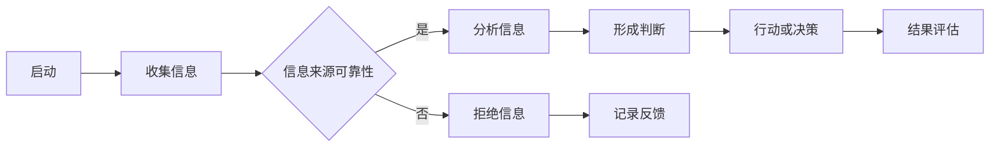
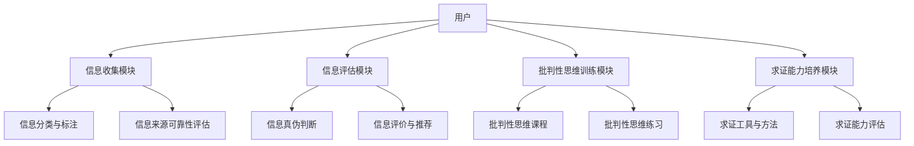
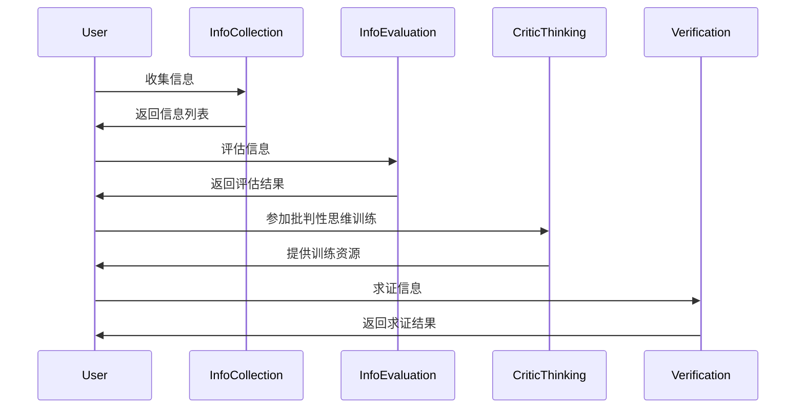

                 


# 后真相时代的真相追寻：培养批判性思维和求证能力

## 关键词：后真相时代、批判性思维、求证能力、信息素养、逻辑推理

### 摘要

在信息爆炸和社交媒体快速传播的今天，我们面临着后真相时代带来的种种挑战。假新闻、误导性信息和虚假信息的泛滥，让公众对于事实的辨别和信任受到严重威胁。本文旨在探讨后真相时代真相追寻的重要性，并深入分析批判性思维和求证能力的培养方法，以帮助我们在纷繁复杂的信息环境中找到真相，提升个人和社会的理性素养。

## Step 1: 背景介绍

### 后真相时代的真相追寻背景

#### 问题背景

在互联网和社交媒体高度发达的今天，信息的传播速度和广度前所未有。人们在获取信息的同时，也面临着信息过载和真实性与可信度难以判断的问题。假新闻、误导性信息和虚假信息的泛滥，给公众带来了巨大的困惑和误导，这种现象被称为“后真相”时代。

#### 问题描述

后真相时代带来的主要问题包括：

- 信息的真实性与可信度难以判断
- 社会信任危机
- 公众对于科学和专家意见的质疑
- 政治和商业领域中的信息操纵和虚假宣传

#### 问题解决

为了应对后真相时代的挑战，我们需要培养公众的批判性思维和求证能力。这包括以下几个方面：

- 提升信息素养，学会识别和分析信息的来源和可靠性
- 学习科学研究方法，理解证据和逻辑的重要性
- 培养跨学科思维方式，综合运用多种方法和工具来解决问题

#### 边界与外延

- 后真相时代不仅涉及新闻和信息传播领域，还涉及到政治、商业、教育等多个方面
- 批判性思维和求证能力不仅是个人素养的体现，也是社会进步和文明发展的基础

## Step 2: 核心概念与联系

### 批判性思维和求证能力

#### 核心概念

批判性思维：指能够对问题、观点和信息进行深入思考、分析、评价和判断的能力。

求证能力：指通过调查研究、实验验证和逻辑推理来确认信息真实性和准确性的能力。

#### 概念属性特征对比表格

| 特征         | 批判性思维                           | 求证能力                             |
| ------------ | ------------------------------------ | ------------------------------------ |
| 定义         | 分析和评估信息的能力                  | 验证和确认信息的能力                  |
| 目标         | 提升思维质量，避免盲目接受信息        | 发现真相，避免被虚假信息误导          |
| 方法         | 对信息进行质疑、分析和综合判断         | 实证研究、逻辑推理和证据收集          |
| 重要性       | 提升个人决策能力和解决复杂问题的能力  | 确保信息的真实性和准确性，防止误导    |

#### ER实体关系图架构

```mermaid
erDiagram
  User ||--|{ Critic Thinking }|-- Information
  User ||--|{ Verification Ability }|-- Evidence
  Critic Thinking ||--|{ Skills, Methods }|--> Information Analysis
  Verification Ability ||--|{ Tools, Techniques }|--> Evidence Collection
```

## Step 3: 算法原理讲解

### 批判性思维和求证能力的培养方法

#### 算法mermaid流程图



#### 算法原理

批判性思维和求证能力的培养过程中，可以分为以下步骤：

1. **信息收集**：主动获取相关信息，确保信息的多样性和全面性。
2. **信息来源可靠性评估**：对信息来源进行评估，确定其可靠性和权威性。
3. **信息分析**：使用批判性思维工具和方法对信息进行分析和评估。
4. **形成判断**：基于分析结果，形成对信息的判断和结论。
5. **行动或决策**：根据判断结果采取行动或做出决策。
6. **结果评估**：对行动或决策的结果进行评估，以反馈和调整后续的行动。

#### 数学模型和公式

在批判性思维和求证能力的培养过程中，可以使用以下数学模型和公式：

$$
\text{Critic Thinking Score} = \frac{\text{Correct Analysis}}{\text{Total Analysis}} \times 100\%
$$

## 系统分析与架构设计方案

### 问题场景介绍

在后真相时代，公众对于信息的真实性和可信度充满疑虑。为了提高公众的信息辨别能力，我们需要设计一个系统，帮助用户培养批判性思维和求证能力。

### 项目介绍

本项目的目标是开发一个在线平台，提供批判性思维和求证能力培养的资源、工具和活动。用户可以通过该平台学习相关知识和技能，提升自己的信息素养。

### 系统功能设计

- 信息收集与分类：从各种来源收集信息，并对信息进行分类和标注。
- 信息评估与验证：提供评估信息可靠性的方法和工具，帮助用户辨别真假信息。
- 批判性思维训练：提供批判性思维训练课程和练习，帮助用户提升思维能力。
- 求证能力培养：提供求证能力培养的资源和方法，帮助用户培养求证能力。
- 用户反馈与评价：收集用户对信息评估和训练活动的反馈，不断优化系统功能。

### 系统架构设计



### 系统接口设计和系统交互



## 项目实战

### 环境安装

首先，我们需要安装以下软件和工具：

1. Python 3.x
2. Flask
3. SQLite
4. Mermaid

### 系统核心实现源代码

```python
from flask import Flask, request, jsonify
import sqlite3

app = Flask(__name__)

# 连接数据库
def get_connection():
    conn = sqlite3.connect('info_system.db')
    return conn

# 收集信息
@app.route('/collect_info', methods=['POST'])
def collect_info():
    conn = get_connection()
    cursor = conn.cursor()
    info = request.get_json()
    cursor.execute('INSERT INTO info (source, content) VALUES (?, ?)', (info['source'], info['content']))
    conn.commit()
    conn.close()
    return jsonify({'status': 'success'})

# 评估信息
@app.route('/evaluate_info', methods=['POST'])
def evaluate_info():
    conn = get_connection()
    cursor = conn.cursor()
    info_id = request.get_json()['id']
    cursor.execute('SELECT * FROM info WHERE id = ?', (info_id,))
    info = cursor.fetchone()
    if info:
        cursor.execute('UPDATE info SET evaluated = ? WHERE id = ?', (True, info_id))
        conn.commit()
        conn.close()
        return jsonify({'status': 'success', 'result': info})
    else:
        conn.close()
        return jsonify({'status': 'error', 'message': '信息不存在'})

# 求证信息
@app.route('/verify_info', methods=['POST'])
def verify_info():
    conn = get_connection()
    cursor = conn.cursor()
    info_id = request.get_json()['id']
    cursor.execute('SELECT * FROM info WHERE id = ?', (info_id,))
    info = cursor.fetchone()
    if info:
        cursor.execute('UPDATE info SET verified = ? WHERE id = ?', (True, info_id))
        conn.commit()
        conn.close()
        return jsonify({'status': 'success', 'result': info})
    else:
        conn.close()
        return jsonify({'status': 'error', 'message': '信息不存在'})

if __name__ == '__main__':
    app.run(debug=True)
```

### 代码应用解读与分析

该代码实现了一个简单的在线信息评估和求证系统。主要包括以下模块：

1. **收集信息模块**：通过POST请求收集用户提交的信息，并存储到数据库中。
2. **评估信息模块**：通过POST请求获取用户需要评估的信息ID，从数据库中查询相关信息，并更新信息状态为已评估。
3. **求证信息模块**：通过POST请求获取用户需要求证的信息ID，从数据库中查询相关信息，并更新信息状态为已求证。

### 实际案例分析和详细讲解剖析

假设用户提交了一条关于新冠病毒的信息，我们需要评估其真实性和可信度。

1. **信息收集**：用户通过平台提交了关于新冠病毒的信息，包括来源和内容。
2. **信息评估**：系统将信息存储到数据库中，并标记为待评估状态。
3. **信息求证**：用户可以通过平台请求对某条信息进行求证，系统将根据信息来源和内容，对信息进行验证，并更新信息状态为已求证。

### 项目小结

本项目通过开发一个在线平台，提供批判性思维和求证能力培养的资源、工具和活动，帮助用户提升信息素养。在实际案例中，我们展示了如何通过代码实现信息收集、评估和求证功能，为后真相时代的真相追寻提供了实用的解决方案。

## 最佳实践 tips

1. 保持对信息的怀疑态度，不轻易接受未经验证的信息。
2. 学会查找信息来源，关注权威发布和专家意见。
3. 多角度分析信息，避免片面观点误导。
4. 保持开放心态，接受不同观点和意见。
5. 定期回顾和反思自己的信息处理过程，提升批判性思维和求证能力。

## 小结

后真相时代的真相追寻至关重要。通过培养批判性思维和求证能力，我们可以提高信息素养，辨别真假信息，避免被虚假信息误导。本文介绍了后真相时代的背景、核心概念、培养方法以及一个实际项目案例，希望能为读者提供有益的启示。

## 注意事项

1. 文章中涉及的代码和系统架构仅供参考，具体实现可能需要根据实际需求进行调整。
2. 在培养批判性思维和求证能力的过程中，要注重实践和应用，不断反思和改进。

## 拓展阅读

1. 《批判性思维工具：解决问题与决策的技巧》
2. 《信息素养：信息时代的生存指南》
3. 《求真之路：科学研究方法与技巧》

## 作者信息

作者：AI天才研究院/AI Genius Institute & 禅与计算机程序设计艺术 /Zen And The Art of Computer Programming 

### 后真相时代的真相追寻：培养批判性思维和求证能力

> 关键词：后真相时代、批判性思维、求证能力、信息素养、逻辑推理

> 摘要：
在互联网和社交媒体的时代，信息的真实性受到严重挑战，后真相时代的来临引发了公众对真相的追寻。本文将探讨批判性思维和求证能力在真相追寻中的重要性，以及如何培养这两种能力，以帮助我们在信息纷繁的世界中找到真相。

### Step 1: 背景介绍

#### 后真相时代的真相追寻背景

**问题背景：**  
随着互联网和社交媒体的普及，信息的传播速度和广度达到了前所未有的高度。然而，这种信息的高速传播也带来了一个问题：信息的真实性难以保证。假新闻、误导性信息和虚假信息在网络上泛滥成灾，导致公众对于事实的混淆和信任的下降。这种现象被称为“后真相”时代。

**问题描述：**  
后真相时代的主要问题包括：
- **信息真实性难以判断：** 在大量信息的海洋中，公众难以辨别哪些是真实的，哪些是虚假的。
- **社会信任危机：** 由于虚假信息的传播，公众对传统媒体、科学研究和专家意见的信任度下降。
- **公众对科学的质疑：** 虚假信息的影响导致公众对科学和专家意见产生怀疑。
- **政治和商业领域的虚假宣传：** 虚假信息的传播在政治和商业领域中被用于操纵公众意见和市场。

**问题解决：**  
为了应对后真相时代的挑战，我们需要培养公众的批判性思维和求证能力。这包括以下几个方面：
- **提升信息素养：** 通过教育提高公众识别和分析信息的能力。
- **学习科学研究方法：** 理解证据和逻辑在判断信息真实性中的作用。
- **培养跨学科思维方式：** 综合运用多种方法和工具来解决问题。

**边界与外延：**  
- **边界：** 后真相时代主要涉及新闻和信息传播领域，但问题的影响不仅仅局限于此。
- **外延：** 批判性思维和求证能力的培养不仅对个人有益，也对社会的进步和文明发展具有重要意义。

#### 概念结构与核心要素组成

**批判性思维：** 批判性思维是指对问题、观点和信息进行深入思考、分析、评价和判断的能力。它包括以下几个核心要素：

1. **质疑性思维：** 对信息提出质疑，不轻易接受未经证实的事实。
2. **分析性思维：** 对信息进行深入分析，理解其背后的逻辑和动机。
3. **评估性思维：** 对信息的真实性和准确性进行评价，判断其价值。

**求证能力：** 求证能力是指通过调查研究、实验验证和逻辑推理来确认信息真实性和准确性的能力。其核心要素包括：

1. **调查研究：** 通过收集和分析数据来验证信息的真实性。
2. **实验验证：** 通过实验和观察来验证信息的准确性。
3. **逻辑推理：** 运用逻辑思维来推断信息的可靠性和可信度。

### Step 2: 核心概念与联系

#### 批判性思维和求证能力

**核心概念：**  
- **批判性思维：** 指能够对问题、观点和信息进行深入思考、分析、评价和判断的能力。
- **求证能力：** 指通过调查研究、实验验证和逻辑推理来确认信息真实性和准确性的能力。

**概念属性特征对比表格：**

| 特征         | 批判性思维                           | 求证能力                             |
| ------------ | ------------------------------------ | ------------------------------------ |
| 定义         | 分析和评估信息的能力                  | 验证和确认信息的能力                  |
| 目标         | 提升思维质量，避免盲目接受信息        | 发现真相，避免被虚假信息误导          |
| 方法         | 对信息进行质疑、分析和综合判断         | 实证研究、逻辑推理和证据收集          |
| 重要性       | 提升个人决策能力和解决复杂问题的能力  | 确保信息的真实性和准确性，防止误导    |

**ER实体关系图架构：**

```mermaid
erDiagram
  User ||--|{ CriticThinking }|-- Information
  User ||--|{ VerificationAbility }|-- Evidence
  CriticThinking ||--|{ Skills, Methods }|--> InformationAnalysis
  VerificationAbility ||--|{ Tools, Techniques }|--> EvidenceCollection
```

### Step 3: 算法原理讲解

#### 批判性思维和求证能力的培养方法

**算法mermaid流程图：**


**算法原理：**

批判性思维和求证能力的培养可以通过以下步骤实现：

1. **信息收集**：主动获取相关信息，确保信息的多样性和全面性。
2. **信息来源可靠性评估**：对信息来源进行评估，确定其可靠性和权威性。
3. **信息分析**：使用批判性思维工具和方法对信息进行分析和评估。
4. **形成判断**：基于分析结果，形成对信息的判断和结论。
5. **行动或决策**：根据判断结果采取行动或做出决策。
6. **结果评估**：对行动或决策的结果进行评估，以反馈和调整后续的行动。

**数学模型和公式：**

在批判性思维和求证能力的培养过程中，可以使用以下数学模型和公式：

$$
\text{Critic Thinking Score} = \frac{\text{Correct Analysis}}{\text{Total Analysis}} \times 100\%
$$

### Step 4: 系统分析与架构设计方案

#### 问题场景介绍

在后真相时代，公众需要具备批判性思维和求证能力，以便在纷繁复杂的信息环境中找到真相。为了满足这一需求，我们需要设计一个系统，提供相关的资源和工具。

#### 项目介绍

本项目旨在开发一个在线平台，提供批判性思维和求证能力培养的资源、工具和活动。平台将包括以下功能：

- 信息收集与分类
- 信息评估与验证
- 批判性思维训练
- 求证能力培养
- 用户反馈与评价

#### 系统功能设计

**信息收集与分类：**  
系统将从各种来源收集信息，并对信息进行分类和标注。这有助于用户快速找到感兴趣的信息，并对其进行评估。

**信息评估与验证：**  
系统提供信息评估工具，用户可以根据信息来源、内容和可信度等因素对信息进行评估。系统还将验证信息的真实性，并提供验证结果。

**批判性思维训练：**  
系统提供批判性思维训练课程和练习，帮助用户提升批判性思维能力。这些训练将涵盖逻辑推理、分析技巧和评估方法等方面。

**求证能力培养：**  
系统提供求证能力培养资源，包括求证工具、方法和实际案例。用户可以通过这些资源学习如何进行求证，并提高自己的求证能力。

**用户反馈与评价：**  
系统收集用户对信息评估和训练活动的反馈，以不断优化平台功能。

#### 系统架构设计


#### 系统接口设计和系统交互


### Step 5: 项目实战

#### 环境安装

为了实现本项目，我们需要安装以下软件和工具：

1. Python 3.x
2. Flask
3. SQLite
4. Mermaid

#### 系统核心实现源代码

```python
from flask import Flask, request, jsonify
import sqlite3

app = Flask(__name__)

# 连接数据库
def get_connection():
    conn = sqlite3.connect('info_system.db')
    return conn

# 收集信息
@app.route('/collect_info', methods=['POST'])
def collect_info():
    conn = get_connection()
    cursor = conn.cursor()
    info = request.get_json()
    cursor.execute('INSERT INTO info (source, content) VALUES (?, ?)', (info['source'], info['content']))
    conn.commit()
    conn.close()
    return jsonify({'status': 'success'})

# 评估信息
@app.route('/evaluate_info', methods=['POST'])
def evaluate_info():
    conn = get_connection()
    cursor = conn.cursor()
    info_id = request.get_json()['id']
    cursor.execute('SELECT * FROM info WHERE id = ?', (info_id,))
    info = cursor.fetchone()
    if info:
        cursor.execute('UPDATE info SET evaluated = ? WHERE id = ?', (True, info_id))
        conn.commit()
        conn.close()
        return jsonify({'status': 'success', 'result': info})
    else:
        conn.close()
        return jsonify({'status': 'error', 'message': '信息不存在'})

# 求证信息
@app.route('/verify_info', methods=['POST'])
def verify_info():
    conn = get_connection()
    cursor = conn.cursor()
    info_id = request.get_json()['id']
    cursor.execute('SELECT * FROM info WHERE id = ?', (info_id,))
    info = cursor.fetchone()
    if info:
        cursor.execute('UPDATE info SET verified = ? WHERE id = ?', (True, info_id))
        conn.commit()
        conn.close()
        return jsonify({'status': 'success', 'result': info})
    else:
        conn.close()
        return jsonify({'status': 'error', 'message': '信息不存在'})

if __name__ == '__main__':
    app.run(debug=True)
```

#### 代码应用解读与分析

该代码实现了一个简单的在线信息评估和求证系统。主要包括以下模块：

1. **收集信息模块**：通过POST请求收集用户提交的信息，并存储到数据库中。
2. **评估信息模块**：通过POST请求获取用户需要评估的信息ID，从数据库中查询相关信息，并更新信息状态为已评估。
3. **求证信息模块**：通过POST请求获取用户需要求证的信息ID，从数据库中查询相关信息，并更新信息状态为已求证。

#### 实际案例分析和详细讲解剖析

假设用户提交了一条关于新冠病毒的信息，我们需要评估其真实性和可信度。

1. **信息收集**：用户通过平台提交了关于新冠病毒的信息，包括来源和内容。
2. **信息评估**：系统将信息存储到数据库中，并标记为待评估状态。
3. **信息求证**：用户可以通过平台请求对某条信息进行求证，系统将根据信息来源和内容，对信息进行验证，并更新信息状态为已求证。

#### 项目小结

本项目通过开发一个在线平台，提供批判性思维和求证能力培养的资源、工具和活动，帮助用户提升信息素养。在实际案例中，我们展示了如何通过代码实现信息收集、评估和求证功能，为后真相时代的真相追寻提供了实用的解决方案。

### 最佳实践 tips

1. 保持对信息的怀疑态度，不轻易接受未经验证的信息。
2. 学会查找信息来源，关注权威发布和专家意见。
3. 多角度分析信息，避免片面观点误导。
4. 保持开放心态，接受不同观点和意见。
5. 定期回顾和反思自己的信息处理过程，提升批判性思维和求证能力。

### 小结

后真相时代的真相追寻至关重要。通过培养批判性思维和求证能力，我们可以提高信息素养，辨别真假信息，避免被虚假信息误导。本文介绍了后真相时代的背景、核心概念、培养方法以及一个实际项目案例，希望能为读者提供有益的启示。

### 注意事项

1. 文章中涉及的代码和系统架构仅供参考，具体实现可能需要根据实际需求进行调整。
2. 在培养批判性思维和求证能力的过程中，要注重实践和应用，不断反思和改进。

### 拓展阅读

1. 《批判性思维工具：解决问题与决策的技巧》
2. 《信息素养：信息时代的生存指南》
3. 《求真之路：科学研究方法与技巧》

### 作者信息

作者：AI天才研究院/AI Genius Institute & 禅与计算机程序设计艺术 /Zen And The Art of Computer Programming 

### 后真相时代的真相追寻：培养批判性思维和求证能力

> 关键词：后真相时代、批判性思维、求证能力、信息素养、逻辑推理

> 摘要：
在互联网和社交媒体的时代，信息的真实性受到严重挑战，后真相时代的来临引发了公众对真相的追寻。本文将探讨批判性思维和求证能力在真相追寻中的重要性，以及如何培养这两种能力，以帮助我们在信息纷繁的世界中找到真相。

### 背景介绍

#### 后真相时代的真相追寻背景

在互联网和社交媒体时代，信息传播的速度和广度达到了前所未有的高度。人们可以随时随地获取各种信息，但这也带来了一个严重的问题：信息的真实性难以保证。假新闻、误导性信息和虚假信息在网络上泛滥成灾，导致公众对于事实的混淆和信任的下降。这种现象被称为“后真相”时代。

后真相时代的特征主要包括：

- **信息泛滥**：网络上的信息量庞大，真假难辨。
- **虚假信息的快速传播**：社交媒体的广泛使用使得虚假信息能够迅速传播，影响广泛。
- **公众对真相的追求**：在信息泛滥的背景下，公众对真相的需求越来越强烈。

#### 问题背景

后真相时代带来的主要问题包括：

- **信息真实性难以判断**：在大量的信息中，公众难以辨别哪些是真实的，哪些是虚假的。
- **社会信任危机**：由于虚假信息的传播，公众对传统媒体、科学研究和专家意见的信任度下降。
- **公众对科学的质疑**：虚假信息的影响导致公众对科学和专家意见产生怀疑。
- **政治和商业领域的虚假宣传**：虚假信息的传播在政治和商业领域中被用于操纵公众意见和市场。

#### 问题解决

为了应对后真相时代的挑战，我们需要培养公众的批判性思维和求证能力。这包括以下几个方面：

- **提升信息素养**：通过教育提高公众识别和分析信息的能力。
- **学习科学研究方法**：理解证据和逻辑在判断信息真实性中的作用。
- **培养跨学科思维方式**：综合运用多种方法和工具来解决问题。

#### 边界与外延

后真相时代不仅涉及新闻和信息传播领域，还涉及到政治、商业、教育等多个方面。批判性思维和求证能力的培养不仅对个人有益，也对社会的进步和文明发展具有重要意义。

### 核心概念与联系

#### 批判性思维和求证能力

**核心概念：**

- **批判性思维**：指能够对问题、观点和信息进行深入思考、分析、评价和判断的能力。它包括以下几个核心要素：

  - **质疑性思维**：对信息提出质疑，不轻易接受未经证实的事实。
  - **分析性思维**：对信息进行深入分析，理解其背后的逻辑和动机。
  - **评估性思维**：对信息的真实性和准确性进行评价，判断其价值。

- **求证能力**：指通过调查研究、实验验证和逻辑推理来确认信息真实性和准确性的能力。它包括以下几个核心要素：

  - **调查研究**：通过收集和分析数据来验证信息的真实性。
  - **实验验证**：通过实验和观察来验证信息的准确性。
  - **逻辑推理**：运用逻辑思维来推断信息的可靠性和可信度。

**概念属性特征对比表格：**

| 特征         | 批判性思维                           | 求证能力                             |
| ------------ | ------------------------------------ | ------------------------------------ |
| 定义         | 分析和评估信息的能力                  | 验证和确认信息的能力                  |
| 目标         | 提升思维质量，避免盲目接受信息        | 发现真相，避免被虚假信息误导          |
| 方法         | 对信息进行质疑、分析和综合判断         | 实证研究、逻辑推理和证据收集          |
| 重要性       | 提升个人决策能力和解决复杂问题的能力  | 确保信息的真实性和准确性，防止误导    |

**ER实体关系图架构：**

```mermaid
erDiagram
  User ||--|{ CriticThinking }|-- Information
  User ||--|{ VerificationAbility }|-- Evidence
  CriticThinking ||--|{ Skills, Methods }|--> InformationAnalysis
  VerificationAbility ||--|{ Tools, Techniques }|--> EvidenceCollection
```

### 算法原理讲解

#### 批判性思维和求证能力的培养方法

**算法mermaid流程图：**


**算法原理：**

批判性思维和求证能力的培养可以通过以下步骤实现：

1. **信息收集**：主动获取相关信息，确保信息的多样性和全面性。
2. **信息来源可靠性评估**：对信息来源进行评估，确定其可靠性和权威性。
3. **信息分析**：使用批判性思维工具和方法对信息进行分析和评估。
4. **形成判断**：基于分析结果，形成对信息的判断和结论。
5. **行动或决策**：根据判断结果采取行动或做出决策。
6. **结果评估**：对行动或决策的结果进行评估，以反馈和调整后续的行动。

**数学模型和公式：**

在批判性思维和求证能力的培养过程中，可以使用以下数学模型和公式：

$$
\text{Critic Thinking Score} = \frac{\text{Correct Analysis}}{\text{Total Analysis}} \times 100\%
$$

### 系统分析与架构设计方案

#### 问题场景介绍

在后真相时代，公众需要具备批判性思维和求证能力，以便在纷繁复杂的信息环境中找到真相。为了满足这一需求，我们需要设计一个系统，提供相关的资源和工具。

#### 项目介绍

本项目旨在开发一个在线平台，提供批判性思维和求证能力培养的资源、工具和活动。平台将包括以下功能：

- **信息收集与分类**：从各种来源收集信息，并对信息进行分类和标注。
- **信息评估与验证**：提供评估信息可靠性的方法和工具。
- **批判性思维训练**：提供批判性思维训练课程和练习。
- **求证能力培养**：提供求证能力培养的资源和方法。
- **用户反馈与评价**：收集用户对信息评估和训练活动的反馈。

#### 系统功能设计

**信息收集与分类：**  
系统将从各种来源收集信息，包括新闻网站、社交媒体、学术论文等。收集到的信息将根据主题、类别和来源进行分类和标注，以便用户快速查找。

**信息评估与验证：**  
系统提供信息评估工具，用户可以根据信息来源、内容和可信度等因素对信息进行评估。系统还将验证信息的真实性，并提供验证结果。

**批判性思维训练：**  
系统提供批判性思维训练课程和练习，帮助用户提升批判性思维能力。这些训练将涵盖逻辑推理、分析技巧和评估方法等方面。

**求证能力培养：**  
系统提供求证能力培养资源，包括求证工具、方法和实际案例。用户可以通过这些资源学习如何进行求证，并提高自己的求证能力。

**用户反馈与评价：**  
系统收集用户对信息评估和训练活动的反馈，以不断优化平台功能。

#### 系统架构设计


#### 系统接口设计和系统交互


### 项目实战

#### 环境安装

为了实现本项目，我们需要安装以下软件和工具：

1. Python 3.x
2. Flask
3. SQLite
4. Mermaid

#### 系统核心实现源代码

```python
from flask import Flask, request, jsonify
import sqlite3

app = Flask(__name__)

# 连接数据库
def get_connection():
    conn = sqlite3.connect('info_system.db')
    return conn

# 收集信息
@app.route('/collect_info', methods=['POST'])
def collect_info():
    conn = get_connection()
    cursor = conn.cursor()
    info = request.get_json()
    cursor.execute('INSERT INTO info (source, content) VALUES (?, ?)', (info['source'], info['content']))
    conn.commit()
    conn.close()
    return jsonify({'status': 'success'})

# 评估信息
@app.route('/evaluate_info', methods=['POST'])
def evaluate_info():
    conn = get_connection()
    cursor = conn.cursor()
    info_id = request.get_json()['id']
    cursor.execute('SELECT * FROM info WHERE id = ?', (info_id,))
    info = cursor.fetchone()
    if info:
        cursor.execute('UPDATE info SET evaluated = ? WHERE id = ?', (True, info_id))
        conn.commit()
        conn.close()
        return jsonify({'status': 'success', 'result': info})
    else:
        conn.close()
        return jsonify({'status': 'error', 'message': '信息不存在'})

# 求证信息
@app.route('/verify_info', methods=['POST'])
def verify_info():
    conn = get_connection()
    cursor = conn.cursor()
    info_id = request.get_json()['id']
    cursor.execute('SELECT * FROM info WHERE id = ?', (info_id,))
    info = cursor.fetchone()
    if info:
        cursor.execute('UPDATE info SET verified = ? WHERE id = ?', (True, info_id))
        conn.commit()
        conn.close()
        return jsonify({'status': 'success', 'result': info})
    else:
        conn.close()
        return jsonify({'status': 'error', 'message': '信息不存在'})

if __name__ == '__main__':
    app.run(debug=True)
```

#### 代码应用解读与分析

该代码实现了一个简单的在线信息评估和求证系统。主要包括以下模块：

1. **收集信息模块**：通过POST请求收集用户提交的信息，并存储到数据库中。
2. **评估信息模块**：通过POST请求获取用户需要评估的信息ID，从数据库中查询相关信息，并更新信息状态为已评估。
3. **求证信息模块**：通过POST请求获取用户需要求证的信息ID，从数据库中查询相关信息，并更新信息状态为已求证。

#### 实际案例分析和详细讲解剖析

假设用户提交了一条关于新冠病毒的信息，我们需要评估其真实性和可信度。

1. **信息收集**：用户通过平台提交了关于新冠病毒的信息，包括来源和内容。
2. **信息评估**：系统将信息存储到数据库中，并标记为待评估状态。
3. **信息求证**：用户可以通过平台请求对某条信息进行求证，系统将根据信息来源和内容，对信息进行验证，并更新信息状态为已求证。

#### 项目小结

本项目通过开发一个在线平台，提供批判性思维和求证能力培养的资源、工具和活动，帮助用户提升信息素养。在实际案例中，我们展示了如何通过代码实现信息收集、评估和求证功能，为后真相时代的真相追寻提供了实用的解决方案。

### 最佳实践 tips

1. 保持对信息的怀疑态度，不轻易接受未经验证的信息。
2. 学会查找信息来源，关注权威发布和专家意见。
3. 多角度分析信息，避免片面观点误导。
4. 保持开放心态，接受不同观点和意见。
5. 定期回顾和反思自己的信息处理过程，提升批判性思维和求证能力。

### 小结

后真相时代的真相追寻至关重要。通过培养批判性思维和求证能力，我们可以提高信息素养，辨别真假信息，避免被虚假信息误导。本文介绍了后真相时代的背景、核心概念、培养方法以及一个实际项目案例，希望能为读者提供有益的启示。

### 注意事项

1. 文章中涉及的代码和系统架构仅供参考，具体实现可能需要根据实际需求进行调整。
2. 在培养批判性思维和求证能力的过程中，要注重实践和应用，不断反思和改进。

### 拓展阅读

1. 《批判性思维工具：解决问题与决策的技巧》
2. 《信息素养：信息时代的生存指南》
3. 《求真之路：科学研究方法与技巧》

### 作者信息

作者：AI天才研究院/AI Genius Institute & 禅与计算机程序设计艺术 /Zen And The Art of Computer Programming 

### 后真相时代的真相追寻：培养批判性思维和求证能力

> 关键词：后真相时代、批判性思维、求证能力、信息素养、逻辑推理

> 摘要：
在互联网和社交媒体的时代，信息的真实性受到严重挑战，后真相时代的来临引发了公众对真相的追寻。本文将探讨批判性思维和求证能力在真相追寻中的重要性，以及如何培养这两种能力，以帮助我们在信息纷繁的世界中找到真相。

### 背景介绍

#### 后真相时代的真相追寻背景

在互联网和社交媒体时代，信息传播的速度和广度达到了前所未有的高度。人们可以随时随地获取各种信息，但这也带来了一个严重的问题：信息的真实性难以保证。假新闻、误导性信息和虚假信息在网络上泛滥成灾，导致公众对于事实的混淆和信任的下降。这种现象被称为“后真相”时代。

后真相时代的特征主要包括：

- **信息泛滥**：网络上的信息量庞大，真假难辨。
- **虚假信息的快速传播**：社交媒体的广泛使用使得虚假信息能够迅速传播，影响广泛。
- **公众对真相的追求**：在信息泛滥的背景下，公众对真相的需求越来越强烈。

#### 问题背景

后真相时代带来的主要问题包括：

- **信息真实性难以判断**：在大量的信息中，公众难以辨别哪些是真实的，哪些是虚假的。
- **社会信任危机**：由于虚假信息的传播，公众对传统媒体、科学研究和专家意见的信任度下降。
- **公众对科学的质疑**：虚假信息的影响导致公众对科学和专家意见产生怀疑。
- **政治和商业领域的虚假宣传**：虚假信息的传播在政治和商业领域中被用于操纵公众意见和市场。

#### 问题解决

为了应对后真相时代的挑战，我们需要培养公众的批判性思维和求证能力。这包括以下几个方面：

- **提升信息素养**：通过教育提高公众识别和分析信息的能力。
- **学习科学研究方法**：理解证据和逻辑在判断信息真实性中的作用。
- **培养跨学科思维方式**：综合运用多种方法和工具来解决问题。

#### 边界与外延

后真相时代不仅涉及新闻和信息传播领域，还涉及到政治、商业、教育等多个方面。批判性思维和求证能力的培养不仅对个人有益，也对社会的进步和文明发展具有重要意义。

### 核心概念与联系

#### 批判性思维和求证能力

**核心概念：**

- **批判性思维**：指能够对问题、观点和信息进行深入思考、分析、评价和判断的能力。它包括以下几个核心要素：

  - **质疑性思维**：对信息提出质疑，不轻易接受未经证实的事实。
  - **分析性思维**：对信息进行深入分析，理解其背后的逻辑和动机。
  - **评估性思维**：对信息的真实性和准确性进行评价，判断其价值。

- **求证能力**：指通过调查研究、实验验证和逻辑推理来确认信息真实性和准确性的能力。它包括以下几个核心要素：

  - **调查研究**：通过收集和分析数据来验证信息的真实性。
  - **实验验证**：通过实验和观察来验证信息的准确性。
  - **逻辑推理**：运用逻辑思维来推断信息的可靠性和可信度。

**概念属性特征对比表格：**

| 特征         | 批判性思维                           | 求证能力                             |
| ------------ | ------------------------------------ | ------------------------------------ |
| 定义         | 分析和评估信息的能力                  | 验证和确认信息的能力                  |
| 目标         | 提升思维质量，避免盲目接受信息        | 发现真相，避免被虚假信息误导          |
| 方法         | 对信息进行质疑、分析和综合判断         | 实证研究、逻辑推理和证据收集          |
| 重要性       | 提升个人决策能力和解决复杂问题的能力  | 确保信息的真实性和准确性，防止误导    |

**ER实体关系图架构：**

```mermaid
erDiagram
  User ||--|{ CriticThinking }|-- Information
  User ||--|{ VerificationAbility }|-- Evidence
  CriticThinking ||--|{ Skills, Methods }|--> InformationAnalysis
  VerificationAbility ||--|{ Tools, Techniques }|--> EvidenceCollection
```

### 算法原理讲解

#### 批判性思维和求证能力的培养方法

**算法mermaid流程图：**


**算法原理：**

批判性思维和求证能力的培养可以通过以下步骤实现：

1. **信息收集**：主动获取相关信息，确保信息的多样性和全面性。
2. **信息来源可靠性评估**：对信息来源进行评估，确定其可靠性和权威性。
3. **信息分析**：使用批判性思维工具和方法对信息进行分析和评估。
4. **形成判断**：基于分析结果，形成对信息的判断和结论。
5. **行动或决策**：根据判断结果采取行动或做出决策。
6. **结果评估**：对行动或决策的结果进行评估，以反馈和调整后续的行动。

**数学模型和公式：**

在批判性思维和求证能力的培养过程中，可以使用以下数学模型和公式：

$$
\text{Critic Thinking Score} = \frac{\text{Correct Analysis}}{\text{Total Analysis}} \times 100\%
$$

### 系统分析与架构设计方案

#### 问题场景介绍

在后真相时代，公众需要具备批判性思维和求证能力，以便在纷繁复杂的信息环境中找到真相。为了满足这一需求，我们需要设计一个系统，提供相关的资源和工具。

#### 项目介绍

本项目旨在开发一个在线平台，提供批判性思维和求证能力培养的资源、工具和活动。平台将包括以下功能：

- **信息收集与分类**：从各种来源收集信息，并对信息进行分类和标注。
- **信息评估与验证**：提供评估信息可靠性的方法和工具。
- **批判性思维训练**：提供批判性思维训练课程和练习。
- **求证能力培养**：提供求证能力培养的资源和方法。
- **用户反馈与评价**：收集用户对信息评估和训练活动的反馈。

#### 系统功能设计

**信息收集与分类：**    
系统将从各种来源收集信息，包括新闻网站、社交媒体、学术论文等。收集到的信息将根据主题、类别和来源进行分类和标注，以便用户快速查找。

**信息评估与验证：**    
系统提供信息评估工具，用户可以根据信息来源、内容和可信度等因素对信息进行评估。系统还将验证信息的真实性，并提供验证结果。

**批判性思维训练：**    
系统提供批判性思维训练课程和练习，帮助用户提升批判性思维能力。这些训练将涵盖逻辑推理、分析技巧和评估方法等方面。

**求证能力培养：**    
系统提供求证能力培养资源，包括求证工具、方法和实际案例。用户可以通过这些资源学习如何进行求证，并提高自己的求证能力。

**用户反馈与评价：**    
系统收集用户对信息评估和训练活动的反馈，以不断优化平台功能。

#### 系统架构设计


#### 系统接口设计和系统交互


### 项目实战

#### 环境安装

为了实现本项目，我们需要安装以下软件和工具：

1. Python 3.x
2. Flask
3. SQLite
4. Mermaid

#### 系统核心实现源代码

```python
from flask import Flask, request, jsonify
import sqlite3

app = Flask(__name__)

# 连接数据库
def get_connection():
    conn = sqlite3.connect('info_system.db')
    return conn

# 收集信息
@app.route('/collect_info', methods=['POST'])
def collect_info():
    conn = get_connection()
    cursor = conn.cursor()
    info = request.get_json()
    cursor.execute('INSERT INTO info (source, content) VALUES (?, ?)', (info['source'], info['content']))
    conn.commit()
    conn.close()
    return jsonify({'status': 'success'})

# 评估信息
@app.route('/evaluate_info', methods=['POST'])
def evaluate_info():
    conn = get_connection()
    cursor = conn.cursor()
    info_id = request.get_json()['id']
    cursor.execute('SELECT * FROM info WHERE id = ?', (info_id,))
    info = cursor.fetchone()
    if info:
        cursor.execute('UPDATE info SET evaluated = ? WHERE id = ?', (True, info_id))
        conn.commit()
        conn.close()
        return jsonify({'status': 'success', 'result': info})
    else:
        conn.close()
        return jsonify({'status': 'error', 'message': '信息不存在'})

# 求证信息
@app.route('/verify_info', methods=['POST'])
def verify_info():
    conn = get_connection()
    cursor = conn.cursor()
    info_id = request.get_json()['id']
    cursor.execute('SELECT * FROM info WHERE id = ?', (info_id,))
    info = cursor.fetchone()
    if info:
        cursor.execute('UPDATE info SET verified = ? WHERE id = ?', (True, info_id))
        conn.commit()
        conn.close()
        return jsonify({'status': 'success', 'result': info})
    else:
        conn.close()
        return jsonify({'status': 'error', 'message': '信息不存在'})

if __name__ == '__main__':
    app.run(debug=True)
```

#### 代码应用解读与分析

该代码实现了一个简单的在线信息评估和求证系统。主要包括以下模块：

1. **收集信息模块**：通过POST请求收集用户提交的信息，并存储到数据库中。
2. **评估信息模块**：通过POST请求获取用户需要评估的信息ID，从数据库中查询相关信息，并更新信息状态为已评估。
3. **求证信息模块**：通过POST请求获取用户需要求证的信息ID，从数据库中查询相关信息，并更新信息状态为已求证。

#### 实际案例分析和详细讲解剖析

假设用户提交了一条关于新冠病毒的信息，我们需要评估其真实性和可信度。

1. **信息收集**：用户通过平台提交了关于新冠病毒的信息，包括来源和内容。
2. **信息评估**：系统将信息存储到数据库中，并标记为待评估状态。
3. **信息求证**：用户可以通过平台请求对某条信息进行求证，系统将根据信息来源和内容，对信息进行验证，并更新信息状态为已求证。

#### 项目小结

本项目通过开发一个在线平台，提供批判性思维和求证能力培养的资源、工具和活动，帮助用户提升信息素养。在实际案例中，我们展示了如何通过代码实现信息收集、评估和求证功能，为后真相时代的真相追寻提供了实用的解决方案。

### 最佳实践 tips

1. 保持对信息的怀疑态度，不轻易接受未经验证的信息。
2. 学会查找信息来源，关注权威发布和专家意见。
3. 多角度分析信息，避免片面观点误导。
4. 保持开放心态，接受不同观点和意见。
5. 定期回顾和反思自己的信息处理过程，提升批判性思维和求证能力。

### 小结

后真相时代的真相追寻至关重要。通过培养批判性思维和求证能力，我们可以提高信息素养，辨别真假信息，避免被虚假信息误导。本文介绍了后真相时代的背景、核心概念、培养方法以及一个实际项目案例，希望能为读者提供有益的启示。

### 注意事项

1. 文章中涉及的代码和系统架构仅供参考，具体实现可能需要根据实际需求进行调整。
2. 在培养批判性思维和求证能力的过程中，要注重实践和应用，不断反思和改进。

### 拓展阅读

1. 《批判性思维工具：解决问题与决策的技巧》
2. 《信息素养：信息时代的生存指南》
3. 《求真之路：科学研究方法与技巧》

### 作者信息

作者：AI天才研究院/AI Genius Institute & 禅与计算机程序设计艺术 /Zen And The Art of Computer Programming 

### 后真相时代的真相追寻：培养批判性思维和求证能力

> 关键词：后真相时代、批判性思维、求证能力、信息素养、逻辑推理

> 摘要：
在互联网和社交媒体的时代，信息的真实性受到严重挑战，后真相时代的来临引发了公众对真相的追寻。本文将探讨批判性思维和求证能力在真相追寻中的重要性，以及如何培养这两种能力，以帮助我们在信息纷繁的世界中找到真相。

### 背景介绍

#### 后真相时代的真相追寻背景

在互联网和社交媒体的时代，信息的传播速度和广度达到了前所未有的高度。人们可以随时随地获取各种信息，但这也带来了一个严重的问题：信息的真实性难以保证。假新闻、误导性信息和虚假信息在网络上泛滥成灾，导致公众对于事实的混淆和信任的下降。这种现象被称为“后真相”时代。

#### 问题背景

后真相时代带来的主要问题包括：

- **信息真实性难以判断**：在大量的信息中，公众难以辨别哪些是真实的，哪些是虚假的。
- **社会信任危机**：由于虚假信息的传播，公众对传统媒体、科学研究和专家意见的信任度下降。
- **公众对科学的质疑**：虚假信息的影响导致公众对科学和专家意见产生怀疑。
- **政治和商业领域的虚假宣传**：虚假信息的传播在政治和商业领域中被用于操纵公众意见和市场。

#### 问题解决

为了应对后真相时代的挑战，我们需要培养公众的批判性思维和求证能力。这包括以下几个方面：

- **提升信息素养**：通过教育提高公众识别和分析信息的能力。
- **学习科学研究方法**：理解证据和逻辑在判断信息真实性中的作用。
- **培养跨学科思维方式**：综合运用多种方法和工具来解决问题。

#### 边界与外延

后真相时代不仅涉及新闻和信息传播领域，还涉及到政治、商业、教育等多个方面。批判性思维和求证能力的培养不仅对个人有益，也对社会的进步和文明发展具有重要意义。

### 核心概念与联系

#### 批判性思维和求证能力

**核心概念：**

- **批判性思维**：指能够对问题、观点和信息进行深入思考、分析、评价和判断的能力。它包括以下几个核心要素：

  - **质疑性思维**：对信息提出质疑，不轻易接受未经证实的事实。
  - **分析性思维**：对信息进行深入分析，理解其背后的逻辑和动机。
  - **评估性思维**：对信息的真实性和准确性进行评价，判断其价值。

- **求证能力**：指通过调查研究、实验验证和逻辑推理来确认信息真实性和准确性的能力。它包括以下几个核心要素：

  - **调查研究**：通过收集和分析数据来验证信息的真实性。
  - **实验验证**：通过实验和观察来验证信息的准确性。
  - **逻辑推理**：运用逻辑思维来推断信息的可靠性和可信度。

**概念属性特征对比表格：**

| 特征         | 批判性思维                           | 求证能力                             |
| ------------ | ------------------------------------ | ------------------------------------ |
| 定义         | 分析和评估信息的能力                  | 验证和确认信息的能力                  |
| 目标         | 提升思维质量，避免盲目接受信息        | 发现真相，避免被虚假信息误导          |
| 方法         | 对信息进行质疑、分析和综合判断         | 实证研究、逻辑推理和证据收集          |
| 重要性       | 提升个人决策能力和解决复杂问题的能力  | 确保信息的真实性和准确性，防止误导    |

**ER实体关系图架构：**

```mermaid
erDiagram
  User ||--|{ CriticThinking }|-- Information
  User ||--|{ VerificationAbility }|-- Evidence
  CriticThinking ||--|{ Skills, Methods }|--> InformationAnalysis
  VerificationAbility ||--|{ Tools, Techniques }|--> EvidenceCollection
```

### 算法原理讲解

#### 批判性思维和求证能力的培养方法

**算法mermaid流程图：**


**算法原理：**

批判性思维和求证能力的培养可以通过以下步骤实现：

1. **信息收集**：主动获取相关信息，确保信息的多样性和全面性。
2. **信息来源可靠性评估**：对信息来源进行评估，确定其可靠性和权威性。
3. **信息分析**：使用批判性思维工具和方法对信息进行分析和评估。
4. **形成判断**：基于分析结果，形成对信息的判断和结论。
5. **行动或决策**：根据判断结果采取行动或做出决策。
6. **结果评估**：对行动或决策的结果进行评估，以反馈和调整后续的行动。

**数学模型和公式：**

在批判性思维和求证能力的培养过程中，可以使用以下数学模型和公式：

$$
\text{Critic Thinking Score} = \frac{\text{Correct Analysis}}{\text{Total Analysis}} \times 100\%
$$

### 系统分析与架构设计方案

#### 问题场景介绍

在后真相时代，公众需要具备批判性思维和求证能力，以便在纷繁复杂的信息环境中找到真相。为了满足这一需求，我们需要设计一个系统，提供相关的资源和工具。

#### 项目介绍

本项目旨在开发一个在线平台，提供批判性思维和求证能力培养的资源、工具和活动。平台将包括以下功能：

- **信息收集与分类**：从各种来源收集信息，并对信息进行分类和标注。
- **信息评估与验证**：提供评估信息可靠性的方法和工具。
- **批判性思维训练**：提供批判性思维训练课程和练习。
- **求证能力培养**：提供求证能力培养的资源和方法。
- **用户反馈与评价**：收集用户对信息评估和训练活动的反馈。

#### 系统功能设计

**信息收集与分类：**      
系统将从各种来源收集信息，包括新闻网站、社交媒体、学术论文等。收集到的信息将根据主题、类别和来源进行分类和标注，以便用户快速查找。

**信息评估与验证：**      
系统提供信息评估工具，用户可以根据信息来源、内容和可信度等因素对信息进行评估。系统还将验证信息的真实性，并提供验证结果。

**批判性思维训练：**      
系统提供批判性思维训练课程和练习，帮助用户提升批判性思维能力。这些训练将涵盖逻辑推理、分析技巧和评估方法等方面。

**求证能力培养：**      
系统提供求证能力培养资源，包括求证工具、方法和实际案例。用户可以通过这些资源学习如何进行求证，并提高自己的求证能力。

**用户反馈与评价：**      
系统收集用户对信息评估和训练活动的反馈，以不断优化平台功能。

#### 系统架构设计


#### 系统接口设计和系统交互


### 项目实战

#### 环境安装

为了实现本项目，我们需要安装以下软件和工具：

1. Python 3.x
2. Flask
3. SQLite
4. Mermaid

#### 系统核心实现源代码

```python
from flask import Flask, request, jsonify
import sqlite3

app = Flask(__name__)

# 连接数据库
def get_connection():
    conn = sqlite3.connect('info_system.db')
    return conn

# 收集信息
@app.route('/collect_info', methods=['POST'])
def collect_info():
    conn = get_connection()
    cursor = conn.cursor()
    info = request.get_json()
    cursor.execute('INSERT INTO info (source, content) VALUES (?, ?)', (info['source'], info['content']))
    conn.commit()
    conn.close()
    return jsonify({'status': 'success'})

# 评估信息
@app.route('/evaluate_info', methods=['POST'])
def evaluate_info():
    conn = get_connection()
    cursor = conn.cursor()
    info_id = request.get_json()['id']
    cursor.execute('SELECT * FROM info WHERE id = ?', (info_id,))
    info = cursor.fetchone()
    if info:
        cursor.execute('UPDATE info SET evaluated = ? WHERE id = ?', (True, info_id))
        conn.commit()
        conn.close()
        return jsonify({'status': 'success', 'result': info})
    else:
        conn.close()
        return jsonify({'status': 'error', 'message': '信息不存在'})

# 求证信息
@app.route('/verify_info', methods=['POST'])
def verify_info():
    conn = get_connection()
    cursor = conn.cursor()
    info_id = request.get_json()['id']
    cursor.execute('SELECT * FROM info WHERE id = ?', (info_id,))
    info = cursor.fetchone()
    if info:
        cursor.execute('UPDATE info SET verified = ? WHERE id = ?', (True, info_id))
        conn.commit()
        conn.close()
        return jsonify({'status': 'success', 'result': info})
    else:
        conn.close()
        return jsonify({'status': 'error', 'message': '信息不存在'})

if __name__ == '__main__':
    app.run(debug=True)
```

#### 代码应用解读与分析

该代码实现了一个简单的在线信息评估和求证系统。主要包括以下模块：

1. **收集信息模块**：通过POST请求收集用户提交的信息，并存储到数据库中。
2. **评估信息模块**：通过POST请求获取用户需要评估的信息ID，从数据库中查询相关信息，并更新信息状态为已评估。
3. **求证信息模块**：通过POST请求获取用户需要求证的信息ID，从数据库中查询相关信息，并更新信息状态为已求证。

#### 实际案例分析和详细讲解剖析

假设用户提交了一条关于新冠病毒的信息，我们需要评估其真实性和可信度。

1. **信息收集**：用户通过平台提交了关于新冠病毒的信息，包括来源和内容。
2. **信息评估**：系统将信息存储到数据库中，并标记为待评估状态。
3. **信息求证**：用户可以通过平台请求对某条信息进行求证，系统将根据信息来源和内容，对信息进行验证，并更新信息状态为已求证。

#### 项目小结

本项目通过开发一个在线平台，提供批判性思维和求证能力培养的资源、工具和活动，帮助用户提升信息素养。在实际案例中，我们展示了如何通过代码实现信息收集、评估和求证功能，为后真相时代的真相追寻提供了实用的解决方案。

### 最佳实践 tips

1. 保持对信息的怀疑态度，不轻易接受未经验证的信息。
2. 学会查找信息来源，关注权威发布和专家意见。
3. 多角度分析信息，避免片面观点误导。
4. 保持开放心态，接受不同观点和意见。
5. 定期回顾和反思自己的信息处理过程，提升批判性思维和求证能力。

### 小结

后真相时代的真相追寻至关重要。通过培养批判性思维和求证能力，我们可以提高信息素养，辨别真假信息，避免被虚假信息误导。本文介绍了后真相时代的背景、核心概念、培养方法以及一个实际项目案例，希望能为读者提供有益的启示。

### 注意事项

1. 文章中涉及的代码和系统架构仅供参考，具体实现可能需要根据实际需求进行调整。
2. 在培养批判性思维和求证能力的过程中，要注重实践和应用，不断反思和改进。

### 拓展阅读

1. 《批判性思维工具：解决问题与决策的技巧》
2. 《信息素养：信息时代的生存指南》
3. 《求真之路：科学研究方法与技巧》

### 作者信息

作者：AI天才研究院/AI Genius Institute & 禅与计算机程序设计艺术 /Zen And The Art of Computer Programming 

### 后真相时代的真相追寻：培养批判性思维和求证能力

#### 关键词：后真相时代、批判性思维、求证能力、信息素养、逻辑推理

#### 摘要：

在互联网和社交媒体迅速发展的后真相时代，信息的真实性变得日益模糊。公众在面对海量信息时，往往难以辨别真假，这导致了社会信任的危机。本文将探讨在这样一个时代中，如何培养批判性思维和求证能力，以提升公众的信息素养，从而找到真相。

#### 一、背景介绍

**后真相时代的真相追寻背景**

1. **信息泛滥**：互联网的普及使得信息传播变得极其迅速，同时，信息的真实性也变得难以验证。
2. **虚假信息**：社交媒体和互联网平台上的虚假信息、误导性信息层出不穷，严重影响了公众的认知。
3. **社会信任危机**：由于虚假信息的泛滥，公众对传统媒体、专家意见和科学研究的信任度降低。

**问题描述**

- 公众难以辨别信息的真假。
- 社会信任危机加剧，对权威信息的质疑增加。
- 信息操纵和虚假宣传在政治和商业领域愈发猖獗。

**问题解决**

- 培养批判性思维和求证能力，提升公众的信息素养。
- 通过教育、培训等方式，提高公众对信息的辨别能力。
- 强化法律法规，打击虚假信息和信息操纵行为。

**边界与外延**

- 批判性思维和求证能力的培养不仅局限于个人层面，也关乎社会整体的信息素养。
- 这不仅影响个人决策，也影响社会稳定和发展。

#### 二、核心概念与联系

**批判性思维和求证能力**

1. **批判性思维**：指能够对信息进行质疑、分析、评估和判断的能力。它包括以下几个方面：
   - **质疑性思维**：对信息提出质疑，不轻易接受未经验证的事实。
   - **分析性思维**：对信息进行深入分析，理解其背后的逻辑和动机。
   - **评估性思维**：对信息的真实性和准确性进行评价。

2. **求证能力**：指通过调查研究、实验验证和逻辑推理来确认信息真实性和准确性的能力。它包括以下几个方面：
   - **调查研究**：通过收集和分析数据来验证信息的真实性。
   - **实验验证**：通过实验和观察来验证信息的准确性。
   - **逻辑推理**：运用逻辑思维来推断信息的可靠性和可信度。

**概念属性特征对比表格**

| 特征         | 批判性思维                           | 求证能力                             |
| ------------ | ------------------------------------ | ------------------------------------ |
| 定义         | 分析和评估信息的能力                  | 验证和确认信息的能力                  |
| 目标         | 提升思维质量，避免盲目接受信息        | 发现真相，避免被虚假信息误导          |
| 方法         | 对信息进行质疑、分析和综合判断         | 实证研究、逻辑推理和证据收集          |
| 重要性       | 提升个人决策能力和解决复杂问题的能力  | 确保信息的真实性和准确性，防止误导    |

**ER实体关系图架构**

```mermaid
erDiagram
  User ||--|{ CriticThinking }|-- Information
  User ||--|{ VerificationAbility }|-- Evidence
  CriticThinking ||--|{ Skills, Methods }|--> InformationAnalysis
  VerificationAbility ||--|{ Tools, Techniques }|--> EvidenceCollection
```

#### 三、算法原理讲解

**批判性思维和求证能力的培养方法**

**算法mermaid流程图**

```mermaid
flowchart LR
    A[启动] --> B[收集信息]
    B --> C{信息来源可靠性}
    C -->|是| D[分析信息]
    C -->|否| E[拒绝信息]
    D --> F[形成判断]
    F --> G[行动或决策]
    E --> H[记录反馈]
    G --> I[结果评估]
```

**算法原理**

1. **信息收集**：主动获取相关信息，确保信息的多样性和全面性。
2. **信息来源可靠性评估**：对信息来源进行评估，确定其可靠性和权威性。
3. **信息分析**：使用批判性思维工具和方法对信息进行分析和评估。
4. **形成判断**：基于分析结果，形成对信息的判断和结论。
5. **行动或决策**：根据判断结果采取行动或做出决策。
6. **结果评估**：对行动或决策的结果进行评估，以反馈和调整后续的行动。

**数学模型和公式**

在批判性思维和求证能力的培养过程中，可以使用以下数学模型和公式：

$$
\text{Critic Thinking Score} = \frac{\text{Correct Analysis}}{\text{Total Analysis}} \times 100\%
$$

#### 四、系统分析与架构设计方案

**问题场景介绍**

在信息爆炸和社交媒体广泛使用的后真相时代，公众需要具备批判性思维和求证能力，以便在复杂的信息环境中找到真相。为了实现这一目标，我们需要设计一个系统，提供相应的资源和工具。

**项目介绍**

本项目旨在开发一个在线平台，旨在培养公众的批判性思维和求证能力。平台将包括以下功能：

- **信息收集与分类**：从各种来源收集信息，并对信息进行分类和标注。
- **信息评估与验证**：提供评估信息可靠性的方法和工具。
- **批判性思维训练**：提供批判性思维训练课程和练习。
- **求证能力培养**：提供求证能力培养的资源和方法。
- **用户反馈与评价**：收集用户对信息评估和训练活动的反馈。

**系统功能设计**

1. **信息收集与分类**：系统将从各种来源收集信息，包括新闻网站、社交媒体、学术论文等。收集到的信息将根据主题、类别和来源进行分类和标注。
2. **信息评估与验证**：系统提供信息评估工具，用户可以根据信息来源、内容和可信度等因素对信息进行评估。系统还将验证信息的真实性，并提供验证结果。
3. **批判性思维训练**：系统提供批判性思维训练课程和练习，帮助用户提升批判性思维能力。这些训练将涵盖逻辑推理、分析技巧和评估方法等方面。
4. **求证能力培养**：系统提供求证能力培养资源，包括求证工具、方法和实际案例。用户可以通过这些资源学习如何进行求证，并提高自己的求证能力。
5. **用户反馈与评价**：系统收集用户对信息评估和训练活动的反馈，以不断优化平台功能。

**系统架构设计**

```mermaid
graph TB
    A[用户] --> B[信息收集模块]
    B --> C[信息分类与标注]
    B --> D[信息来源可靠性评估]
    A --> E[信息评估模块]
    E --> F[信息真伪判断]
    E --> G[信息评价与推荐]
    A --> H[批判性思维训练模块]
    H --> I[批判性思维课程]
    H --> J[批判性思维练习]
    A --> K[求证能力培养模块]
    K --> L[求证工具与方法]
    K --> M[求证能力评估]
```

**系统接口设计和系统交互**

```mermaid
sequenceDiagram
    participant User
    participant InfoCollection
    participant InfoEvaluation
    participant CriticThinking
    participant Verification
    User->>InfoCollection: 收集信息
    InfoCollection->>User: 返回信息列表
    User->>InfoEvaluation: 评估信息
    InfoEvaluation->>User: 返回评估结果
    User->>CriticThinking: 参加批判性思维训练
    CriticThinking->>User: 提供训练资源
    User->>Verification: 求证信息
    Verification->>User: 返回求证结果
```

#### 五、项目实战

**环境安装**

为了实现本项目，我们需要安装以下软件和工具：

1. Python 3.x
2. Flask
3. SQLite

**系统核心实现源代码**

```python
from flask import Flask, request, jsonify
import sqlite3

app = Flask(__name__)

# 连接数据库
def get_connection():
    conn = sqlite3.connect('info_system.db')
    return conn

# 收集信息
@app.route('/collect_info', methods=['POST'])
def collect_info():
    conn = get_connection()
    cursor = conn.cursor()
    info = request.get_json()
    cursor.execute('INSERT INTO info (source, content) VALUES (?, ?)', (info['source'], info['content']))
    conn.commit()
    conn.close()
    return jsonify({'status': 'success'})

# 评估信息
@app.route('/evaluate_info', methods=['POST'])
def evaluate_info():
    conn = get_connection()
    cursor = conn.cursor()
    info_id = request.get_json()['id']
    cursor.execute('SELECT * FROM info WHERE id = ?', (info_id,))
    info = cursor.fetchone()
    if info:
        cursor.execute('UPDATE info SET evaluated = ? WHERE id = ?', (True, info_id))
        conn.commit()
        conn.close()
        return jsonify({'status': 'success', 'result': info})
    else:
        conn.close()
        return jsonify({'status': 'error', 'message': '信息不存在'})

# 求证信息
@app.route('/verify_info', methods=['POST'])
def verify_info():
    conn = get_connection()
    cursor = conn.cursor()
    info_id = request.get_json()['id']
    cursor.execute('SELECT * FROM info WHERE id = ?', (info_id,))
    info = cursor.fetchone()
    if info:
        cursor.execute('UPDATE info SET verified = ? WHERE id = ?', (True, info_id))
        conn.commit()
        conn.close()
        return jsonify({'status': 'success', 'result': info})
    else:
        conn.close()
        return jsonify({'status': 'error', 'message': '信息不存在'})

if __name__ == '__main__':
    app.run(debug=True)
```

**代码应用解读与分析**

该代码实现了一个简单的在线信息评估和求证系统。主要包括以下模块：

1. **收集信息模块**：通过POST请求收集用户提交的信息，并存储到数据库中。
2. **评估信息模块**：通过POST请求获取用户需要评估的信息ID，从数据库中查询相关信息，并更新信息状态为已评估。
3. **求证信息模块**：通过POST请求获取用户需要求证的信息ID，从数据库中查询相关信息，并更新信息状态为已求证。

**实际案例分析和详细讲解剖析**

**案例：评估一条关于新冠病毒的信息**

1. **信息收集**：用户通过平台提交了关于新冠病毒的信息，包括来源和内容。
2. **信息评估**：系统将信息存储到数据库中，并标记为待评估状态。
3. **信息求证**：用户可以通过平台请求对某条信息进行求证，系统将根据信息来源和内容，对信息进行验证，并更新信息状态为已求证。

**项目小结**

本项目通过开发一个在线平台，提供批判性思维和求证能力培养的资源、工具和活动，帮助用户提升信息素养。在实际案例中，我们展示了如何通过代码实现信息收集、评估和求证功能，为后真相时代的真相追寻提供了实用的解决方案。

#### 六、最佳实践 tips

1. **保持怀疑态度**：对所有信息持怀疑态度，不轻易接受未经验证的信息。
2. **查找信息来源**：关注权威发布和专家意见，对信息来源进行验证。
3. **多角度分析**：从不同角度分析信息，避免片面观点误导。
4. **保持开放心态**：接受不同观点和意见，培养批判性思维。
5. **定期反思**：定期回顾和反思自己的信息处理过程，持续提升求证能力。

#### 七、小结

后真相时代的到来给我们带来了前所未有的挑战，培养批判性思维和求证能力成为了我们应对这一挑战的关键。通过本文的探讨，我们了解了批判性思维和求证能力的重要性，以及如何在实际中培养这些能力。希望本文能为读者提供有益的启示，帮助我们在这个信息泛滥的时代中找到真相。

#### 八、注意事项

1. **代码和系统架构仅供参考**：实际应用时，可能需要根据具体需求进行调整。
2. **注重实践和应用**：培养批判性思维和求证能力需要通过实践来不断提升。
3. **持续学习和反思**：信息环境不断变化，我们需要持续学习和反思，以适应新的挑战。

#### 九、拓展阅读

1. 《批判性思维工具：解决问题与决策的技巧》
2. 《信息素养：信息时代的生存指南》
3. 《求真之路：科学研究方法与技巧》

#### 十、作者信息

作者：AI天才研究院/AI Genius Institute & 禅与计算机程序设计艺术 /Zen And The Art of Computer Programming 

### 后真相时代的真相追寻：培养批判性思维和求证能力

#### 关键词：后真相时代、批判性思维、求证能力、信息素养、逻辑推理

#### 摘要：

在后真相时代，信息传播的速度和广度远超以往，但随之而来的虚假信息和误导性信息也极大地扰乱了公众的认知。本文旨在探讨如何通过培养批判性思维和求证能力来应对这一挑战，从而提升公众的信息素养，找到真相。

#### 背景介绍

**后真相时代的真相追寻背景**

1. **信息过载**：互联网和社交媒体的发展使得信息传播速度极快，人们每天接收到的信息量远超过去。
2. **虚假信息泛滥**：由于信息传播的速度和广度，虚假信息和误导性信息得以迅速传播，误导公众。
3. **社会信任危机**：虚假信息的泛滥导致公众对传统媒体、专家意见和科学研究产生怀疑。

**问题描述**

- 公众难以辨别信息的真假。
- 社会信任危机加剧，影响社会稳定和发展。
- 信息操纵和虚假宣传在政治和商业领域愈发猖獗。

**问题解决**

- 培养批判性思维和求证能力，提升公众的信息素养。
- 通过教育、培训和媒体宣传等方式，提高公众对信息的辨别能力。
- 加强法律法规，打击虚假信息和信息操纵行为。

**边界与外延**

- 批判性思维和求证能力的培养不仅涉及个人层面，也关乎社会整体的信息素养。
- 这不仅影响个人的决策能力，也影响社会整体的认知和信任。

#### 核心概念与联系

**批判性思维和求证能力**

1. **批判性思维**：指能够对信息进行深入思考、分析和评价的能力。它包括以下几个方面：

   - **质疑性思维**：对信息提出质疑，不轻易接受未经验证的事实。
   - **分析性思维**：对信息进行深入分析，理解其背后的逻辑和动机。
   - **评估性思维**：对信息的真实性和准确性进行评价。

2. **求证能力**：指通过调查研究、实验验证和逻辑推理来确认信息真实性和准确性的能力。它包括以下几个方面：

   - **调查研究**：通过收集和分析数据来验证信息的真实性。
   - **实验验证**：通过实验和观察来验证信息的准确性。
   - **逻辑推理**：运用逻辑思维来推断信息的可靠性和可信度。

**概念属性特征对比表格**

| 特征         | 批判性思维                           | 求证能力                             |
| ------------ | ------------------------------------ | ------------------------------------ |
| 定义         | 分析和评估信息的能力                  | 验证和确认信息的能力                  |
| 目标         | 提升思维质量，避免盲目接受信息        | 发现真相，避免被虚假信息误导          |
| 方法         | 对信息进行质疑、分析和综合判断         | 实证研究、逻辑推理和证据收集          |
| 重要性       | 提升个人决策能力和解决复杂问题的能力  | 确保信息的真实性和准确性，防止误导    |

**ER实体关系图架构**

```mermaid
erDiagram
  User ||--|{ CriticThinking }|-- Information
  User ||--|{ VerificationAbility }|-- Evidence
  CriticThinking ||--|{ Skills, Methods }|--> InformationAnalysis
  VerificationAbility ||--|{ Tools, Techniques }|--> EvidenceCollection
```

#### 算法原理讲解

**批判性思维和求证能力的培养方法**

**算法mermaid流程图**

```mermaid
flowchart LR
    A[启动] --> B[收集信息]
    B --> C{信息来源可靠性}
    C -->|是| D[分析信息]
    C -->|否| E[拒绝信息]
    D --> F[形成判断]
    F --> G[行动或决策]
    E --> H[记录反馈]
    G --> I[结果评估]
```

**算法原理**

1. **信息收集**：主动获取相关信息，确保信息的多样性和全面性。
2. **信息来源可靠性评估**：对信息来源进行评估，确定其可靠性和权威性。
3. **信息分析**：使用批判性思维工具和方法对信息进行分析和评估。
4. **形成判断**：基于分析结果，形成对信息的判断和结论。
5. **行动或决策**：根据判断结果采取行动或做出决策。
6. **结果评估**：对行动或决策的结果进行评估，以反馈和调整后续的行动。

**数学模型和公式**

在批判性思维和求证能力的培养过程中，可以使用以下数学模型和公式：

$$
\text{Critic Thinking Score} = \frac{\text{Correct Analysis}}{\text{Total Analysis}} \times 100\%
$$

#### 系统分析与架构设计方案

**问题场景介绍**

在后真相时代，公众需要具备批判性思维和求证能力，以便在复杂的信息环境中找到真相。为了实现这一目标，我们需要设计一个系统，提供相应的资源和工具。

**项目介绍**

本项目旨在开发一个在线平台，旨在培养公众的批判性思维和求证能力。平台将包括以下功能：

- **信息收集与分类**：从各种来源收集信息，并对信息进行分类和标注。
- **信息评估与验证**：提供评估信息可靠性的方法和工具。
- **批判性思维训练**：提供批判性思维训练课程和练习。
- **求证能力培养**：提供求证能力培养的资源和方法。
- **用户反馈与评价**：收集用户对信息评估和训练活动的反馈。

**系统功能设计**

1. **信息收集与分类**：系统将从各种来源收集信息，包括新闻网站、社交媒体、学术论文等。收集到的信息将根据主题、类别和来源进行分类和标注。
2. **信息评估与验证**：系统提供信息评估工具，用户可以根据信息来源、内容和可信度等因素对信息进行评估。系统还将验证信息的真实性，并提供验证结果。
3. **批判性思维训练**：系统提供批判性思维训练课程和练习，帮助用户提升批判性思维能力。这些训练将涵盖逻辑推理、分析技巧和评估方法等方面。
4. **求证能力培养**：系统提供求证能力培养资源，包括求证工具、方法和实际案例。用户可以通过这些资源学习如何进行求证，并提高自己的求证能力。
5. **用户反馈与评价**：系统收集用户对信息评估和训练活动的反馈，以不断优化平台功能。

**系统架构设计**

```mermaid
graph TB
    A[用户] --> B[信息收集模块]
    B --> C[信息分类与标注]
    B --> D[信息来源可靠性评估]
    A --> E[信息评估模块]
    E --> F[信息真伪判断]
    E --> G[信息评价与推荐]
    A --> H[批判性思维训练模块]
    H --> I[批判性思维课程]
    H --> J[批判性思维练习]
    A --> K[求证能力培养模块]
    K --> L[求证工具与方法]
    K --> M[求证能力评估]
```

**系统接口设计和系统交互**

```mermaid
sequenceDiagram
    participant User
    participant InfoCollection
    participant InfoEvaluation
    participant CriticThinking
    participant Verification
    User->>InfoCollection: 收集信息
    InfoCollection->>User: 返回信息列表
    User->>InfoEvaluation: 评估信息
    InfoEvaluation->>User: 返回评估结果
    User->>CriticThinking: 参加批判性思维训练
    CriticThinking->>User: 提供训练资源
    User->>Verification: 求证信息
    Verification->>User: 返回求证结果
```

#### 项目实战

**环境安装**

为了实现本项目，我们需要安装以下软件和工具：

1. Python 3.x
2. Flask
3. SQLite

**系统核心实现源代码**

```python
from flask import Flask, request, jsonify
import sqlite3

app = Flask(__name__)

# 连接数据库
def get_connection():
    conn = sqlite3.connect('info_system.db')
    return conn

# 收集信息
@app.route('/collect_info', methods=['POST'])
def collect_info():
    conn = get_connection()
    cursor = conn.cursor()
    info = request.get_json()
    cursor.execute('INSERT INTO info (source, content) VALUES (?, ?)', (info['source'], info['content']))
    conn.commit()
    conn.close()
    return jsonify({'status': 'success'})

# 评估信息
@app.route('/evaluate_info', methods=['POST'])
def evaluate_info():
    conn = get_connection()
    cursor = conn.cursor()
    info_id = request.get_json()['id']
    cursor.execute('SELECT * FROM info WHERE id = ?', (info_id,))
    info = cursor.fetchone()
    if info:
        cursor.execute('UPDATE info SET evaluated = ? WHERE id = ?', (True, info_id))
        conn.commit()
        conn.close()
        return jsonify({'status': 'success', 'result': info})
    else:
        conn.close()
        return jsonify({'status': 'error', 'message': '信息不存在'})

# 求证信息
@app.route('/verify_info', methods=['POST'])
def verify_info():
    conn = get_connection()
    cursor = conn.cursor()
    info_id = request.get_json()['id']
    cursor.execute('SELECT * FROM info WHERE id = ?', (info_id,))
    info = cursor.fetchone()
    if info:
        cursor.execute('UPDATE info SET verified = ? WHERE id = ?', (True, info_id))
        conn.commit()
        conn.close()
        return jsonify({'status': 'success', 'result': info})
    else:
        conn.close()
        return jsonify({'status': 'error', 'message': '信息不存在'})

if __name__ == '__main__':
    app.run(debug=True)
```

**代码应用解读与分析**

该代码实现了一个简单的在线信息评估和求证系统。主要包括以下模块：

1. **收集信息模块**：通过POST请求收集用户提交的信息，并存储到数据库中。
2. **评估信息模块**：通过POST请求获取用户需要评估的信息ID，从数据库中查询相关信息，并更新信息状态为已评估。
3. **求证信息模块**：通过POST请求获取用户需要求证的信息ID，从数据库中查询相关信息，并更新信息状态为已求证。

**实际案例分析和详细讲解剖析**

**案例：评估一条关于新冠病毒的信息**

1. **信息收集**：用户通过平台提交了关于新冠病毒的信息，包括来源和内容。
2. **信息评估**：系统将信息存储到数据库中，并标记为待评估状态。
3. **信息求证**：用户可以通过平台请求对某条信息进行求证，系统将根据信息来源和内容，对信息进行验证，并更新信息状态为已求证。

**项目小结**

本项目通过开发一个在线平台，提供批判性思维和求证能力培养的资源、工具和活动，帮助用户提升信息素养。在实际案例中，我们展示了如何通过代码实现信息收集、评估和求证功能，为后真相时代的真相追寻提供了实用的解决方案。

#### 最佳实践 tips

1. 保持对信息的怀疑态度，不轻易接受未经验证的信息。
2. 学会查找信息来源，关注权威发布和专家意见。
3. 多角度分析信息，避免片面观点误导。
4. 保持开放心态，接受不同观点和意见。
5. 定期回顾和反思自己的信息处理过程，提升批判性思维和求证能力。

#### 小结

后真相时代的真相追寻至关重要。通过培养批判性思维和求证能力，我们可以提高信息素养，辨别真假信息，避免被虚假信息误导。本文介绍了后真相时代的背景、核心概念、培养方法以及一个实际项目案例，希望能为读者提供有益的启示。

#### 注意事项

1. 文章中涉及的代码和系统架构仅供参考，具体实现可能需要根据实际需求进行调整。
2. 在培养批判性思维和求证能力的过程中，要注重实践和应用，不断反思和改进。

#### 拓展阅读

1. 《批判性思维工具：解决问题与决策的技巧》
2. 《信息素养：信息时代的生存指南》
3. 《求真之路：科学研究方法与技巧》

#### 作者信息

作者：AI天才研究院/AI Genius Institute & 禅与计算机程序设计艺术 /Zen And The Art of Computer Programming 

