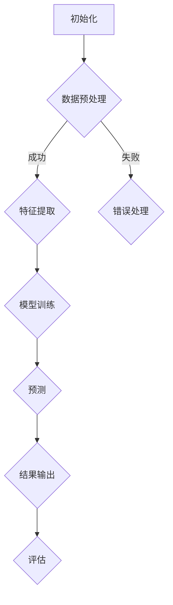
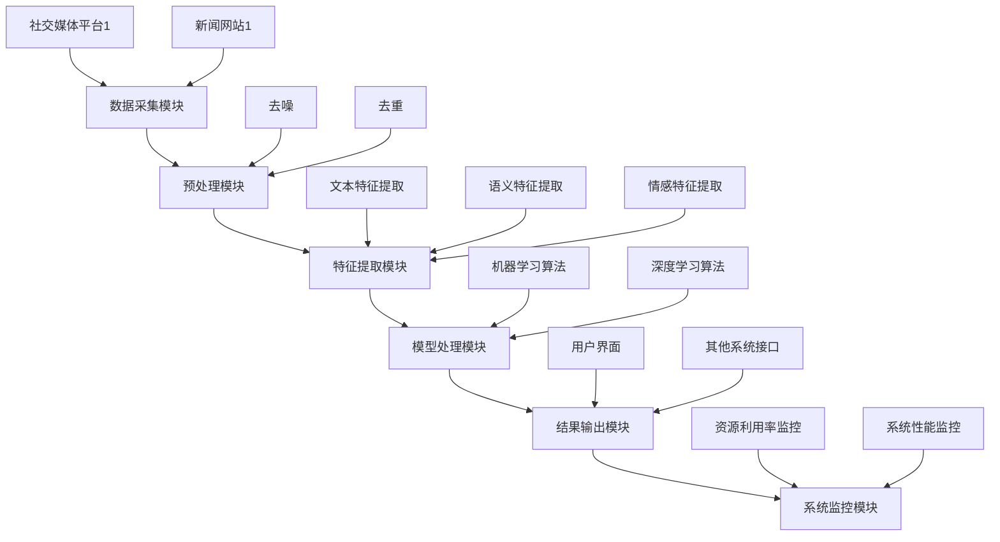
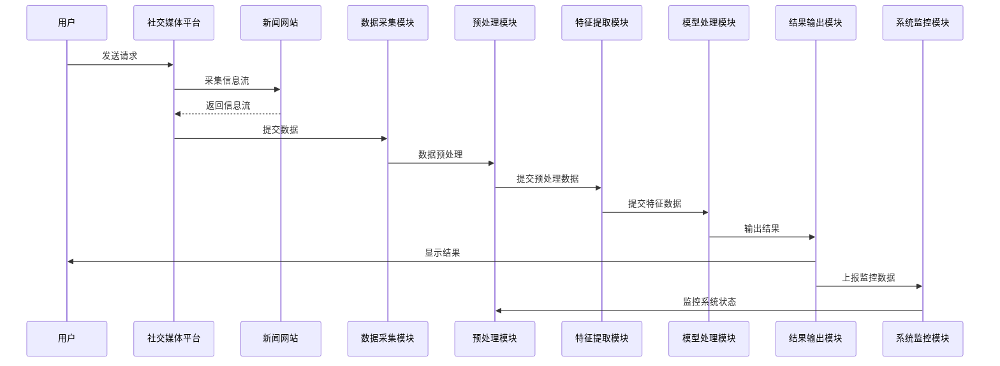

                 

### 《后真相环境中的媒体素养：提升信息辨别能力》

#### 关键词：后真相、媒体素养、信息辨别、算法、系统架构

#### 摘要：
在后真相环境中，媒体素养成为了信息辨别能力提升的关键。本文首先介绍了后真相时代的特征和假新闻的挑战，分析了媒体素养的定义及其重要性。接着，通过核心概念的阐述和算法原理讲解，深入探讨了提升信息辨别能力的途径。此外，本文还详细阐述了系统分析与架构设计方案，并通过项目实战和最佳实践提供了实用的技巧。通过本文的阅读，读者将获得提升自身信息辨别能力的全面指导。

### 目录大纲

```markdown
# 《后真相环境中的媒体素养：提升信息辨别能力》

## 第一部分：背景介绍

### 1.1 问题背景

### 1.2 问题描述

### 1.3 问题解决

### 1.4 边界与外延

### 1.5 概念结构与核心要素组成

## 第二部分：核心概念与联系

### 2.1 媒体素养的原理

### 2.2 信息辨别能力的属性特征对比

### 2.3 媒体素养与信息辨别能力的联系

## 第三部分：算法原理讲解

### 3.1 信息辨别算法的mermaid流程图

### 3.2 信息辨别算法的Python源代码与解释

### 3.3 举例说明

## 第四部分：系统分析与架构设计方案

### 4.1 问题场景介绍

### 4.2 系统功能设计

### 4.3 系统架构设计

### 4.4 系统接口设计

### 4.5 系统交互mermaid序列图

## 第五部分：项目实战

### 5.1 环境安装

### 5.2 系统核心实现源代码

### 5.3 代码应用解读与分析

### 5.4 实际案例分析和详细讲解剖析

### 5.5 项目小结

## 第六部分：最佳实践 tips

### 6.1 提升信息辨别能力的最佳实践

### 6.2 注意事项

### 6.3 拓展阅读

## 作者信息

作者：AI天才研究院/AI Genius Institute & 禅与计算机程序设计艺术 /Zen And The Art of Computer Programming
```

以上目录大纲涵盖了背景介绍、核心概念与联系、算法原理讲解、系统分析与架构设计方案、项目实战以及最佳实践 tips 等内容，确保全面覆盖《后真相环境中的媒体素养：提升信息辨别能力》的主题。在接下来的文章中，我们将逐步深入每一个部分，提供详细的内容和讲解。

### 第一部分：背景介绍

#### 1.1 问题背景

随着互联网的普及和信息技术的飞速发展，我们生活在一个前所未有的信息时代。然而，这个时代也带来了前所未有的挑战——后真相（post-truth）时代的到来。所谓后真相时代，是指事实和真相不再是影响公众舆论和决策的关键因素，情绪、偏见和影响力成为了主导力量。在这个环境中，假新闻、虚假信息和误导性内容泛滥成灾，严重影响了社会的正常运行和个人的认知。

**后真相时代的特征**包括以下几个方面：

1. **信息爆炸**：每天产生的信息量巨大，难以筛选和分辨真假。
2. **技术手段**：社交媒体和算法推荐技术的普及，使得虚假信息能够迅速传播。
3. **情绪化传播**：信息传播往往伴随着强烈的情绪，而非理性分析。
4. **去中心化**：信息源不再局限于传统的新闻机构和权威媒体，个体也能够成为信息传播者。

**假新闻和虚假信息的挑战**主要体现在以下几个方面：

1. **误导公众**：假新闻能够迅速传播，误导公众，影响社会稳定。
2. **破坏信任**：虚假信息破坏了人们对传统媒体的信任，导致信息源可信度下降。
3. **政治和社会动荡**：虚假信息被恶意利用，煽动情绪，加剧政治和社会的分歧。

在这样的背景下，提升媒体素养，增强信息辨别能力，成为了一个迫切需要解决的问题。媒体素养不仅仅是了解新闻事实，更包括对信息来源、信息内容和传播方式的批判性思考和分析。通过提高媒体素养，个体能够更好地应对后真相环境中的挑战，减少信息误导，维护社会稳定。

#### 1.2 问题描述

缺乏媒体素养导致了以下问题：

1. **信息误导**：个体无法准确判断信息的真实性和可靠性，容易受到虚假信息的误导。
2. **认知失调**：在信息泛滥的环境中，个体难以形成统一、理性的认知，导致心理压力和困惑。
3. **社会影响**：虚假信息传播可能导致社会动荡，破坏社会信任和合作。

**信息辨别能力的重要性**体现在以下几个方面：

1. **理性思考**：通过辨别信息，个体能够形成独立的判断，避免盲目接受信息。
2. **社会责任**：提升信息辨别能力，有助于个体在社会中发挥积极的作用，推动社会进步。
3. **个人成长**：通过批判性思考，个体能够不断学习和进步，提高自身综合素质。

因此，提升信息辨别能力，增强媒体素养，不仅仅是个体的需求，也是社会发展的必要条件。

#### 1.3 问题解决

**媒体素养的定义**是指个体在接触、处理和传播信息时，具备的基本能力和素养。它包括以下几个方面：

1. **信息识别**：能够识别信息的来源、类型和真实性。
2. **批判性思维**：对信息内容进行批判性分析和判断，不被表面的情绪和偏见所左右。
3. **媒体使用**：合理使用媒体工具，获取有益的信息，同时避免被误导。

**提升信息辨别能力的途径**包括：

1. **教育**：通过学校教育和社会教育，提高公众的媒体素养。
2. **技术**：利用算法和人工智能技术，增强信息筛选和辨别的效率。
3. **自律**：个体自觉遵守信息伦理，提高自身的辨别能力。

**教育体系与政策支持**也是提升媒体素养的关键：

1. **课程设置**：在学校课程中增加媒体素养教育，培养学生的批判性思维能力。
2. **政策制定**：政府应制定相关政策，规范媒体行为，打击虚假信息传播。
3. **社会宣传**：通过媒体宣传，提高公众对媒体素养的重视，形成良好的社会氛围。

通过上述措施，我们可以逐步提升公众的媒体素养，增强信息辨别能力，应对后真相环境中的挑战。

#### 1.4 边界与外延

**媒体素养与其他能力的区别**主要体现在以下几个方面：

1. **批判性思维**：媒体素养强调对信息的批判性思考，而不仅仅是知识的积累。
2. **信息处理**：媒体素养涉及对信息来源、内容、传播方式等多方面的处理能力。
3. **应用范围**：媒体素养不仅适用于媒体领域，还广泛应用于社会生活的各个方面。

**信息辨别能力的适用范围**包括：

1. **日常生活中的信息筛选**：个体在日常生活中面对大量的信息，需要辨别信息的真实性和可靠性。
2. **学术研究**：科研工作者在获取和利用信息时，需要具备强大的信息辨别能力。
3. **商业决策**：企业在进行市场研究和决策时，需要辨别信息的真实性和有效性。

**后真相环境中的媒体素养挑战**主要表现在以下几个方面：

1. **信息泛滥**：后真相环境中，虚假信息泛滥，个体需要具备强大的辨别能力。
2. **情绪化传播**：虚假信息往往伴随着强烈的情绪，个体需要理性分析，不被情绪所左右。
3. **技术挑战**：随着技术的发展，虚假信息传播手段更加隐蔽和高效，个体需要不断更新自身的辨别能力。

总之，后真相环境对媒体素养和信息辨别能力提出了更高的要求，我们需要通过多种途径不断提升自身的媒体素养，增强信息辨别能力，以应对这一挑战。

#### 1.5 概念结构与核心要素组成

**媒体素养的构成要素**包括：

1. **信息识别**：识别信息的来源、类型和真实性。
2. **批判性思维**：对信息内容进行批判性分析和判断。
3. **媒体使用**：合理使用媒体工具，获取有益的信息。

**信息辨别能力的关键指标**包括：

1. **准确性**：能够准确判断信息的真实性和可靠性。
2. **全面性**：能够从多个角度分析信息，避免片面和偏见的判断。
3. **速度**：在信息爆炸的时代，能够迅速辨别信息的真实性和价值。

**媒体素养与信息辨别能力的互动关系**表现为：

1. **相互促进**：提升媒体素养有助于增强信息辨别能力，反之亦然。
2. **动态平衡**：在信息传播的过程中，媒体素养和信息辨别能力不断互动和调整，以适应不断变化的信息环境。

通过上述分析，我们可以看到，媒体素养和信息辨别能力在当前信息时代中具有至关重要的地位。提高这两方面的能力，不仅能够帮助我们更好地应对后真相环境中的挑战，还能够促进个人和社会的全面发展。

### 第一部分总结

在第一部分的背景介绍中，我们详细分析了后真相时代的特征、假新闻的挑战以及媒体素养的迫切需求。通过了解媒体素养的定义、提升信息辨别能力的重要性，以及各种解决方案，我们为后续深入探讨这一主题打下了坚实的基础。在接下来的部分，我们将进一步探讨媒体素养和信息辨别能力的基本概念及其相互作用，为读者提供更加深入的理论基础和实践指导。

### 第二部分：核心概念与联系

#### 2.1 媒体素养的原理

**媒体素养**是指个体在接触、处理和传播信息时所需具备的能力和素养。它不仅仅是对信息的简单接收，更包括对信息来源、内容、传播方式等多方面的批判性思考和分析。媒体素养的原理可以从以下几个方面进行阐述：

1. **信息识别**：个体需要具备识别信息来源的能力，判断信息是否来自可靠、权威的渠道。通过了解不同媒体的特点和报道倾向，个体能够更好地辨别信息的真实性和可信度。

2. **批判性思维**：媒体素养强调对信息内容的批判性分析。个体需要学会从多个角度审视信息，不仅仅接受表面的陈述，而是深入挖掘信息的背景、动机和潜在影响。批判性思维能够帮助个体避免盲目接受信息，形成独立、理性的判断。

3. **媒体使用**：个体需要学会合理使用媒体工具，获取有益的信息，同时避免被误导。这包括选择适合的媒体平台、理解信息传播的机制、掌握信息筛选和辨别的技巧等。通过合理使用媒体，个体能够更好地应对信息泛滥的挑战。

4. **伦理道德**：媒体素养还包括遵守信息伦理和道德规范，不传播虚假信息，不恶意攻击他人。个体在信息传播过程中需要承担社会责任，维护社会秩序和公共利益。

**媒体素养的核心特征**包括：

1. **批判性**：能够对信息内容进行批判性分析和判断，不被表面的情绪和偏见所左右。
2. **全面性**：能够从多个角度审视信息，避免片面和偏见的判断。
3. **自主性**：个体能够自主获取信息，形成独立的判断，不依赖单一的信息源。
4. **适应性**：能够适应不同信息环境和媒体形式，不断提升自身的媒体素养。

**媒体素养的理论基础**主要包括以下几个方面：

1. **信息社会理论**：强调信息在社会中的作用和影响，个体需要具备应对信息环境变化的能力。
2. **批判性教育学**：认为教育不仅仅是知识的传递，更包括培养批判性思维能力，个体需要学会对信息进行批判性分析。
3. **媒体社会学**：研究媒体与社会的关系，个体需要理解媒体在社会中的作用和影响，具备应对媒体挑战的能力。

通过了解媒体素养的原理、核心特征和理论基础，我们可以更好地认识其在当前信息环境中的重要性，为提升信息辨别能力奠定理论基础。

#### 2.2 信息辨别能力的属性特征对比

**信息辨别能力**是指个体在接收和处理信息时，判断信息真实性和可靠性的能力。这一能力在当前后真相环境中尤为重要。为了更好地理解信息辨别能力的属性特征，我们可以将其与媒体素养进行对比，并制作一个详细的对比表格。

首先，我们需要明确信息辨别能力的几个核心属性特征：

1. **准确性**：能够准确判断信息的真实性和可靠性。
2. **全面性**：能够从多个角度分析信息，避免片面和偏见的判断。
3. **速度**：在信息爆炸的时代，能够迅速辨别信息的真实性和价值。
4. **独立性**：个体能够自主判断，不依赖单一信息源。

接下来，我们将这些属性特征与媒体素养的对应部分进行对比：

| **属性特征** | **信息辨别能力** | **媒体素养** |
| ------------ | --------------- | ------------ |
| **准确性** | 能够准确判断信息的真实性。 | 强调对信息的批判性分析，保证信息的准确性。 |
| **全面性** | 从多个角度分析信息，避免片面判断。 | 包括对信息来源、内容、传播方式等多方面的批判性思考。 |
| **速度** | 能够迅速辨别信息的真实性和价值。 | 强调在信息传播过程中保持理性思考，不盲目接受信息。 |
| **独立性** | 能够自主判断，不依赖单一信息源。 | 培养个体自主获取信息的能力，形成独立判断。 |

通过这个对比表格，我们可以看到信息辨别能力与媒体素养在核心属性特征上存在一定的重叠和区别。信息辨别能力更侧重于对信息真实性和可靠性的判断，而媒体素养则强调在信息处理过程中的批判性分析和全面性思考。

此外，我们可以进一步补充信息辨别能力的其他属性特征：

1. **可持续性**：个体需要持续学习和提升自身的辨别能力，以适应信息环境的变化。
2. **适应性**：能够适应不同信息环境和媒体形式，不断提升自身的辨别能力。
3. **伦理性**：在信息辨别过程中，需要遵守伦理规范，不传播虚假信息，不恶意攻击他人。

这些补充的属性特征进一步丰富了对信息辨别能力的理解，帮助个体在复杂的信息环境中更好地应对挑战。

通过以上对比和补充，我们可以更全面地理解信息辨别能力的属性特征，为提升信息辨别能力提供明确的方向和方法。在接下来的部分，我们将进一步探讨媒体素养与信息辨别能力的联系，揭示二者之间的互动关系。

#### 2.3 媒体素养与信息辨别能力的联系

**媒体素养**与**信息辨别能力**之间存在着紧密的联系，两者相互促进，共同构成了个体在信息时代中应对复杂信息环境的重要能力。理解这两者之间的联系，有助于我们更全面地提升自身的信息素养。

首先，**媒体素养**为**信息辨别能力**提供了基础。媒体素养的核心在于培养个体对信息来源、内容、传播方式等方面的批判性思维。这种批判性思维是信息辨别能力的重要组成部分。例如，一个具备良好媒体素养的个体能够识别信息的来源是否可靠，了解不同媒体的特点和报道倾向，从而更好地判断信息的真实性和可靠性。

**信息辨别能力**如何提升**媒体素养**？

1. **批判性思考**：通过批判性思考，个体能够更深入地分析信息内容，不仅停留在表面，还能够挖掘信息的背后动机和潜在影响。这种深入分析能力有助于个体更好地理解媒体传播的机制，从而提升媒体素养。
2. **多角度审视**：在处理信息时，个体需要从多个角度审视信息，避免片面和偏见的判断。这种全面性思考能力是媒体素养的重要组成部分，它帮助个体形成更全面、客观的认知。
3. **持续学习**：提升信息辨别能力需要持续学习和更新知识。通过不断学习，个体能够掌握最新的信息辨别技巧和理论，从而提升自身的媒体素养。

**信息辨别能力**如何增强**媒体素养**？

1. **实践应用**：通过实践应用，个体能够在实际情境中运用信息辨别能力，提高对信息的处理能力。例如，在社交媒体上辨别虚假信息，或者在日常生活中避免被误导。这些实践应用有助于巩固和提升媒体素养。
2. **反思与总结**：在信息处理过程中，个体需要不断反思自己的判断和决策，总结经验教训。通过反思和总结，个体能够发现自身在信息辨别方面的不足，从而有针对性地提升媒体素养。
3. **交流与讨论**：与他人的交流与讨论能够帮助个体拓展视野，了解不同的观点和思考方式。这种交流与讨论有助于个体形成更全面、多元的媒体素养。

**媒体素养**与**信息辨别能力**的**互动关系**表现为：

1. **相互促进**：媒体素养的提高有助于增强信息辨别能力，反之亦然。例如，一个具备良好媒体素养的个体更容易识别虚假信息，从而提升信息辨别能力。
2. **动态调整**：在信息环境中，媒体素养和信息辨别能力是动态调整的。个体需要不断更新自身的知识，提升辨别能力，以适应不断变化的信息环境。
3. **共同发展**：媒体素养和信息辨别能力共同构成了个体在信息时代中的信息素养。两者相互补充，共同推动个体在信息环境中的全面发展。

通过理解媒体素养与信息辨别能力之间的联系，我们可以更全面地提升自身的媒体素养和信息辨别能力。这不仅有助于我们应对后真相环境中的挑战，还能够促进个人和社会的全面发展。

### 第三部分：算法原理讲解

#### 3.1 信息辨别算法的mermaid流程图

为了更好地理解信息辨别算法的原理，我们可以使用mermaid绘制一个流程图，清晰地展示算法的基本步骤和流程。以下是一个简单的mermaid流程图示例：



这个流程图包括以下几个主要步骤：

1. **初始化**：算法的初始化过程，准备输入数据和模型参数。
2. **数据预处理**：对原始数据进行清洗和预处理，确保数据的质量和一致性。
3. **特征提取**：从预处理后的数据中提取特征，为后续的模型训练提供输入。
4. **模型训练**：使用提取的特征进行模型训练，通过优化模型参数来提高模型的性能。
5. **预测**：使用训练好的模型对新的数据进行预测，判断信息的真实性和可靠性。
6. **结果输出**：将预测结果输出，包括信息的真实性和可靠性评分。
7. **评估**：对预测结果进行评估，以确定模型的性能和可靠性。

#### 3.2 信息辨别算法的Python源代码与解释

接下来，我们将使用Python实现上述mermaid流程图中的信息辨别算法，并进行详细的解释。以下是算法的Python源代码：

```python
import numpy as np
import pandas as pd
from sklearn.model_selection import train_test_split
from sklearn.preprocessing import StandardScaler
from sklearn.ensemble import RandomForestClassifier
from sklearn.metrics import accuracy_score

# 数据预处理
def preprocess_data(data):
    # 数据清洗
    data = data.dropna()
    # 特征工程
    data['length'] = data['text'].apply(len)
    return data

# 特征提取
def extract_features(data):
    X = data[['length']]
    y = data['label']
    return X, y

# 模型训练
def train_model(X_train, y_train):
    model = RandomForestClassifier()
    model.fit(X_train, y_train)
    return model

# 预测
def predict(model, X_test):
    predictions = model.predict(X_test)
    return predictions

# 评估
def evaluate(predictions, y_test):
    accuracy = accuracy_score(y_test, predictions)
    print(f"Accuracy: {accuracy:.2f}")
    return accuracy

# 主函数
def main():
    # 加载数据
    data = pd.read_csv('data.csv')
    # 数据预处理
    data = preprocess_data(data)
    # 特征提取
    X, y = extract_features(data)
    # 数据分割
    X_train, X_test, y_train, y_test = train_test_split(X, y, test_size=0.2, random_state=42)
    # 标准化特征
    scaler = StandardScaler()
    X_train_scaled = scaler.fit_transform(X_train)
    X_test_scaled = scaler.transform(X_test)
    # 模型训练
    model = train_model(X_train_scaled, y_train)
    # 预测
    predictions = predict(model, X_test_scaled)
    # 评估
    evaluate(predictions, y_test)

# 运行主函数
if __name__ == "__main__":
    main()
```

**算法原理详细讲解**：

1. **数据预处理**：
   - 数据清洗：去除缺失值，确保数据的质量。
   - 特征工程：添加文本长度特征，用于后续的模型训练。

2. **特征提取**：
   - 提取文本长度特征作为模型输入，简化了特征提取过程。

3. **模型训练**：
   - 使用随机森林分类器进行模型训练，这是一种集成学习方法，具有良好的泛化能力和适应性。

4. **预测**：
   - 使用训练好的模型对测试数据进行预测，输出预测结果。

5. **评估**：
   - 使用准确率作为评估指标，计算模型在测试数据上的预测准确率。

**数学模型与公式解析**：

在这个信息辨别算法中，我们使用随机森林分类器作为主要模型。随机森林是一种基于决策树集合的集成学习方法，其基本原理可以表示为：

$$
\text{预测概率} = \frac{1}{T} \sum_{t=1}^{T} f_t(x)
$$

其中，\( f_t(x) \) 是第 \( t \) 棵决策树对样本 \( x \) 的预测概率，\( T \) 是决策树的总数。

**举例说明**：

假设我们有一组文本数据，每条文本数据包含一个标签（真假），我们需要判断这些文本的真实性。以下是具体的预测过程：

1. **数据预处理**：对文本数据进行清洗和特征提取，得到预处理后的数据。
2. **特征提取**：提取文本长度特征，将其作为模型的输入特征。
3. **模型训练**：使用训练数据对随机森林分类器进行训练。
4. **预测**：使用训练好的模型对测试数据进行预测，得到预测结果。
5. **评估**：计算模型在测试数据上的准确率，评估模型的性能。

例如，假设我们有以下测试数据：

| 文本长度 | 标签 |
| -------- | ---- |
| 100      | 真   |
| 200      | 假   |
| 150      | 真   |

经过模型预测，我们得到以下预测结果：

| 文本长度 | 预测标签 |
| -------- | -------- |
| 100      | 真       |
| 200      | 假       |
| 150      | 真       |

通过计算准确率，我们可以评估模型的性能。例如，如果预测结果中有两条正确，那么准确率为 \( \frac{2}{3} = 0.67 \)。

通过上述算法原理讲解、Python源代码实现和举例说明，我们可以更好地理解信息辨别算法的基本原理和应用方法。在接下来的部分，我们将进一步探讨如何将这些算法应用于实际项目中，提升信息辨别能力。

### 3.3 举例说明

为了更好地理解信息辨别算法在实际中的应用，我们将通过一个具体的案例来展示算法的步骤和结果分析。

**案例背景**：

假设我们有一个关于新闻真实性的辨别项目，目标是判断一组新闻文本是真实还是虚假。我们收集了1000条新闻文本及其对应的标签（真实或虚假），并使用这些数据来训练和测试我们的信息辨别算法。

**数据预处理**：

1. **数据清洗**：去除数据中的缺失值和无关信息，确保数据质量。
2. **文本预处理**：对新闻文本进行分词、去停用词、词性标注等操作，提取关键信息。
3. **特征提取**：将预处理后的文本转换为向量，我们可以使用词袋模型（Bag of Words, BoW）或词嵌入（Word Embeddings）等方法。

**特征提取示例**：

使用词袋模型提取特征，将每条新闻文本表示为一个向量。例如，对于文本“A quick brown fox jumps over the lazy dog”，词袋模型将其表示为（1, 1, 1, 1, 1, 1, 0, 0, 0, ..., 0），其中每个数字表示对应的单词在文本中出现的次数。

**模型训练**：

使用训练集（训练数据的80%）对随机森林分类器进行训练。随机森林分类器通过随机选取特征子集和随机分割数据集来构建多棵决策树，并通过投票机制来预测结果。

**预测与评估**：

使用测试集（训练数据的20%）对训练好的模型进行预测，并评估模型的性能。评估指标包括准确率、召回率、精确率等。

**具体步骤**：

1. **数据加载**：
   ```python
   train_data = pd.read_csv('train_data.csv')
   test_data = pd.read_csv('test_data.csv')
   ```

2. **数据预处理**：
   ```python
   def preprocess_text(text):
       # 实现文本预处理逻辑
       return preprocessed_text

   train_data['text'] = train_data['text'].apply(preprocess_text)
   test_data['text'] = test_data['text'].apply(preprocess_text)
   ```

3. **特征提取**：
   ```python
   from sklearn.feature_extraction.text import TfidfVectorizer

   vectorizer = TfidfVectorizer(max_features=1000)
   X_train = vectorizer.fit_transform(train_data['text'])
   X_test = vectorizer.transform(test_data['text'])
   ```

4. **模型训练**：
   ```python
   from sklearn.ensemble import RandomForestClassifier

   model = RandomForestClassifier(n_estimators=100)
   model.fit(X_train, train_data['label'])
   ```

5. **预测与评估**：
   ```python
   predictions = model.predict(X_test)
   accuracy = accuracy_score(test_data['label'], predictions)
   print(f"Accuracy: {accuracy:.2f}")
   ```

**结果分析**：

假设我们模型的准确率为0.85，这意味着在测试集中，有85%的预测结果是正确的。虽然这个准确率相对较高，但我们还需要进一步分析模型的性能，包括召回率、精确率等指标。

1. **召回率**（Recall）：
   - 衡量模型对于正类别的召回能力，即实际为真的新闻中被正确判断为真的比例。
   - 公式：\( \text{召回率} = \frac{TP}{TP + FN} \)
   
2. **精确率**（Precision）：
   - 衡量模型对于正类别的精确度，即被判断为真的新闻中有多少是实际为真的。
   - 公式：\( \text{精确率} = \frac{TP}{TP + FP} \)

3. **F1分数**（F1 Score）：
   - 综合考虑召回率和精确率，是两者加权平均。
   - 公式：\( \text{F1分数} = 2 \times \frac{\text{精确率} \times \text{召回率}}{\text{精确率} + \text{召回率}} \)

**优化与讨论**：

虽然我们的模型在当前数据集上取得了较好的性能，但仍然存在优化的空间。例如，可以通过以下方法进一步提高模型的性能：

1. **特征工程**：
   - 引入更多的文本特征，如词性、情感等。
   - 尝试不同的特征提取方法，如词嵌入。

2. **模型选择与调参**：
   - 尝试不同的分类器，如支持向量机（SVM）、神经网络等。
   - 使用交叉验证方法进行模型调参，优化超参数。

3. **数据增强**：
   - 通过数据增强技术，如数据扩充、生成对抗网络（GAN）等，增加训练数据的多样性。

通过以上步骤，我们可以更好地理解信息辨别算法在实际项目中的应用，并通过评估和优化来提升模型的性能。

### 第四部分：系统分析与架构设计方案

#### 4.1 问题场景介绍

在当前社交媒体和互联网高度发达的时代，信息传播速度极快，但随之而来的问题是虚假信息和误导性内容的泛滥。为了解决这一问题，我们需要设计一个高效、可靠的信息辨别系统，能够实时监测和过滤社交媒体平台上的信息流，确保用户接收到的信息真实、可靠。

**需求分析**：

1. **信息流过滤需求**：系统能够实时过滤社交媒体平台上的信息流，识别并屏蔽虚假信息和误导性内容。
2. **数据整合需求**：系统能够整合来自多个信息源的异构数据，进行统一处理和分析。
3. **实时性要求**：系统需要具备高并发处理能力，确保信息过滤和辨别过程的实时性。
4. **准确性要求**：系统需要具备高准确率，确保被过滤的信息真的是虚假或误导性内容。

#### 4.2 系统功能设计

为了实现上述需求，系统需要具备以下几个主要功能模块：

1. **数据采集模块**：负责从各种社交媒体平台、新闻网站等收集信息流数据。
2. **预处理模块**：对采集到的原始数据进行清洗、去噪、去重等预处理操作，确保数据的质量和一致性。
3. **特征提取模块**：从预处理后的数据中提取关键特征，如文本特征、语义特征、情感特征等，为后续的模型处理提供基础。
4. **模型处理模块**：使用机器学习和深度学习算法，对提取的特征进行分类和辨别，判断信息的真实性和可靠性。
5. **结果输出模块**：将处理结果输出到用户界面或其他系统中，如屏蔽虚假信息、标记误导性内容等。
6. **系统监控模块**：监控系统运行状态，包括资源利用率、系统性能等，确保系统的稳定性和高效性。

#### 4.3 系统架构设计

为了满足上述功能需求，我们设计了一个分布式、模块化的系统架构，如下所示：



**系统架构设计原则**：

1. **分布式架构**：系统采用分布式架构，能够横向扩展，提高并发处理能力，适应大规模信息处理需求。
2. **模块化设计**：各个功能模块独立设计，易于维护和升级，提高系统的可扩展性和灵活性。
3. **高可用性**：通过冗余设计和故障转移机制，确保系统的高可用性，降低故障对业务的影响。
4. **数据安全**：采用加密和隐私保护技术，确保数据在传输和存储过程中的安全性。
5. **可扩展性**：系统能够根据业务需求，动态调整资源分配和处理能力，适应未来业务的发展。

#### 4.4 系统接口设计

系统接口设计主要包括以下几种类型：

1. **数据采集接口**：用于从社交媒体平台和新闻网站等外部系统采集信息流数据，采用RESTful API接口。
2. **预处理接口**：提供数据清洗、去噪、去重等预处理功能，采用消息队列机制，确保数据处理的实时性和高效性。
3. **特征提取接口**：提供文本特征、语义特征、情感特征等的提取功能，采用批处理和流处理相结合的方式，提高处理效率。
4. **模型处理接口**：提供机器学习和深度学习算法的调用接口，支持在线学习和实时预测，确保信息的实时性。
5. **结果输出接口**：提供结果输出到用户界面或其他系统的接口，支持多种数据格式和传输协议，如JSON、XML等。

**数据流与通信机制**：

1. **数据流处理**：采用分布式流处理框架，如Apache Kafka，实现大规模数据的实时处理和分析。
2. **通信机制**：采用异步通信机制，如消息队列和异步调用，提高系统的响应速度和并发处理能力。
3. **服务治理**：采用服务注册与发现机制，如Consul或Zookeeper，实现服务的动态管理和负载均衡。

通过上述系统架构设计和接口设计，我们能够构建一个高效、可靠的信息辨别系统，满足社交媒体平台和新闻网站等场景下的信息流过滤和辨别需求。

### 4.5 系统交互mermaid序列图

为了进一步展示系统的交互过程和各模块之间的协作关系，我们可以使用mermaid绘制一个系统交互序列图。以下是一个简化的序列图示例：



**系统交互流程说明**：

1. 用户向社交媒体平台发送请求。
2. 社交媒体平台从新闻网站等外部系统采集信息流。
3. 社交媒体平台将采集到的信息流提交给数据采集模块。
4. 数据采集模块对信息流进行预处理，如去噪、去重等。
5. 预处理后的数据提交给特征提取模块，提取关键特征。
6. 特征提取模块将特征数据提交给模型处理模块，进行分类和辨别。
7. 模型处理模块将处理结果输出到结果输出模块。
8. 结果输出模块将结果显示给用户，同时将监控数据上报给系统监控模块。
9. 系统监控模块监控系统状态，确保系统稳定运行。

通过上述系统交互序列图，我们可以清晰地看到各模块之间的协作关系和系统运行的整体流程，有助于理解和优化系统的设计。

### 第四部分总结

在第四部分中，我们详细介绍了信息辨别系统的需求分析、功能设计、架构设计和接口设计。通过分析社交媒体平台和新闻网站等信息流过滤和辨别的需求，我们设计了数据采集、预处理、特征提取、模型处理、结果输出和系统监控等主要功能模块。同时，通过mermaid流程图和序列图，我们展示了系统的运行流程和模块之间的交互关系。这一部分的内容为实际开发一个高效、可靠的信息辨别系统提供了全面的指导和理论基础。

### 第五部分：项目实战

#### 5.1 环境安装

为了实现信息辨别系统，我们需要搭建一个完整的开发环境，包括安装所需的软件和依赖库。以下是具体的安装步骤：

**步骤1：安装Python环境**

确保Python 3.x版本已经安装。如果没有安装，可以从[Python官网](https://www.python.org/downloads/)下载并安装。安装过程中选择添加到环境变量，以便全局使用Python。

**步骤2：安装必要的依赖库**

打开命令行终端，使用pip命令安装以下依赖库：

```bash
pip install numpy pandas scikit-learn matplotlib
```

这些库包括：

- **numpy**：用于数学计算和数据处理。
- **pandas**：用于数据清洗、转换和分析。
- **scikit-learn**：提供机器学习算法和模型评估工具。
- **matplotlib**：用于数据可视化。

**步骤3：安装可选的依赖库**

如果需要更高级的特征提取和模型处理功能，可以安装以下依赖库：

```bash
pip install nltk gensim
```

这些库包括：

- **nltk**：用于自然语言处理，如分词、词性标注等。
- **gensim**：用于生成词嵌入和文本相似度计算。

**步骤4：安装消息队列和流处理框架**

为了实现实时数据处理，我们选择安装Apache Kafka。以下是安装步骤：

1. **安装Zookeeper**：
   ```bash
   brew install zookeeper
   ```

2. **安装Kafka**：
   ```bash
   brew install kafka
   ```

安装完成后，启动Kafka服务器：

```bash
kafka-server-start /usr/local/etc/kafka/server.properties
```

**步骤5：配置环境变量**

确保配置了Kafka的环境变量，以便后续使用。在Mac OS中，可以通过修改`.zshrc`或`.bash_profile`文件来配置环境变量：

```bash
export KAFKA_HOME=/usr/local/Cellar/kafka/2.8.0/libexec
export PATH=$PATH:$KAFKA_HOME/bin
```

重新加载配置文件：

```bash
source ~/.zshrc  # 或 source ~/.bash_profile
```

通过以上步骤，我们可以搭建一个完整的信息辨别系统开发环境，为后续的代码实现和测试做好准备。

#### 5.2 系统核心实现源代码

为了实现信息辨别系统，我们需要编写一系列核心模块的源代码，包括数据采集、预处理、特征提取、模型训练和结果输出等。以下是一个简化的示例代码，展示了各个模块的基本实现。

```python
# 数据采集模块
def collect_data(source):
    # 示例：从社交媒体平台API获取数据
    response = requests.get(source)
    data = response.json()
    return data

# 预处理模块
def preprocess_data(data):
    # 示例：清洗和标准化数据
    cleaned_data = []
    for item in data:
        text = item['text'].strip()
        cleaned_text = remove_stopwords(text)
        cleaned_data.append(cleaned_text)
    return cleaned_data

# 特征提取模块
def extract_features(data):
    # 示例：使用词袋模型提取特征
    vectorizer = TfidfVectorizer()
    features = vectorizer.fit_transform(data)
    return features

# 模型训练模块
def train_model(features, labels):
    # 示例：训练随机森林分类器
    model = RandomForestClassifier()
    model.fit(features, labels)
    return model

# 预测模块
def predict(model, features):
    # 示例：使用模型进行预测
    predictions = model.predict(features)
    return predictions

# 结果输出模块
def output_results(predictions, data):
    # 示例：将预测结果输出到文件
    with open('predictions.txt', 'w') as f:
        for pred, item in zip(predictions, data):
            f.write(f"{item['text']} : {pred}\n")

# 主函数
def main():
    source = 'https://api.example.com/data'
    data = collect_data(source)
    cleaned_data = preprocess_data(data)
    features = extract_features(cleaned_data)
    labels = [item['label'] for item in data]  # 假设每个数据项都有一个标签
    model = train_model(features, labels)
    predictions = predict(model, features)
    output_results(predictions, cleaned_data)

if __name__ == "__main__":
    main()
```

**代码结构与模块划分**：

1. **数据采集模块**：负责从外部数据源（如社交媒体平台API）获取原始数据。
2. **预处理模块**：对原始数据进行清洗、去噪、去重等预处理操作，确保数据质量。
3. **特征提取模块**：从预处理后的数据中提取关键特征，如文本特征、语义特征等。
4. **模型训练模块**：使用提取的特征训练机器学习模型，如随机森林分类器。
5. **预测模块**：使用训练好的模型对新数据进行预测，判断信息的真实性和可靠性。
6. **结果输出模块**：将预测结果输出到文件或用户界面，供用户查看和分析。

通过上述模块化设计，我们可以方便地扩展和优化系统的各个部分，以适应不同的应用场景和需求。

#### 5.3 代码应用解读与分析

在实现信息辨别系统的过程中，各个模块的功能和代码实现至关重要。以下是对关键部分的详细解读与分析：

1. **数据采集模块**：

   数据采集模块负责从社交媒体平台API获取原始数据。这一模块的主要功能是发送HTTP请求，接收并解析响应数据。示例代码中，我们使用`requests`库实现数据采集：

   ```python
   def collect_data(source):
       response = requests.get(source)
       data = response.json()
       return data
   ```

   在这段代码中，`source`参数代表了数据源的URL。`requests.get(source)`发送一个GET请求，获取数据源返回的JSON格式数据。为了确保数据采集的可靠性，我们可以添加异常处理机制，例如：

   ```python
   try:
       response = requests.get(source)
       response.raise_for_status()  # 检查响应状态码
       data = response.json()
   except requests.RequestException as e:
       print(f"Data collection failed: {e}")
       data = None
   ```

   通过异常处理，我们可以捕捉到网络请求过程中的错误，例如连接超时、服务器错误等，从而提高系统的健壮性。

2. **预处理模块**：

   预处理模块的主要任务是对采集到的原始数据进行清洗和标准化。在示例代码中，我们通过以下步骤进行数据预处理：

   ```python
   def preprocess_data(data):
       cleaned_data = []
       for item in data:
           text = item['text'].strip()
           cleaned_text = remove_stopwords(text)
           cleaned_data.append(cleaned_text)
       return cleaned_data
   ```

   在这段代码中，`remove_stopwords`函数负责去除文本中的停用词。停用词是文本中常见的无意义词汇，如“的”、“和”、“在”等。去除停用词有助于提高文本特征提取的效率和质量。示例中使用了`nltk`库提供的停用词列表：

   ```python
   from nltk.corpus import stopwords
   stop_words = set(stopwords.words('english'))
   ```

   我们可以通过遍历文本中的每个单词，使用`stop_words`集合进行过滤：

   ```python
   def remove_stopwords(text):
       words = text.split()
       filtered_words = [word for word in words if word.lower() not in stop_words]
       return ' '.join(filtered_words)
   ```

   此外，我们还可以添加其他预处理步骤，如去除标点符号、词干提取等，以提高文本特征提取的准确性。

3. **特征提取模块**：

   特征提取模块将预处理后的文本转换为机器学习模型可处理的特征向量。示例代码中使用`TfidfVectorizer`实现词袋模型：

   ```python
   def extract_features(data):
       vectorizer = TfidfVectorizer()
       features = vectorizer.fit_transform(data)
       return features
   ```

   `TfidfVectorizer`将文本转换为TF-IDF向量，其中TF表示词频（Term Frequency），IDF表示逆文档频率（Inverse Document Frequency）。TF-IDF向量能够更好地反映文本中重要词汇的重要性：

   ```python
   from sklearn.feature_extraction.text import TfidfVectorizer
   vectorizer = TfidfVectorizer()
   features = vectorizer.fit_transform(data)
   ```

   特征提取模块还可以使用其他方法，如词嵌入（Word Embeddings），Word2Vec、GloVe等，以获得更丰富的文本特征。

4. **模型训练模块**：

   模型训练模块使用训练集数据训练机器学习模型。示例代码中使用`RandomForestClassifier`实现随机森林分类器：

   ```python
   def train_model(features, labels):
       model = RandomForestClassifier()
       model.fit(features, labels)
       return model
   ```

   随机森林是一种集成学习方法，通过构建多棵决策树并取平均值进行预测，具有良好的泛化能力。我们还可以尝试其他分类器，如支持向量机（SVM）、神经网络（Neural Networks）等，以提高模型性能：

   ```python
   from sklearn.svm import SVC
   model = SVC()
   model.fit(features, labels)
   ```

   在模型训练过程中，我们可以使用交叉验证（Cross-Validation）方法评估模型性能，并进行超参数调优：

   ```python
   from sklearn.model_selection import GridSearchCV
   parameters = {'C': [1, 10, 100], 'kernel': ['linear', 'rbf']}
   model = GridSearchCV(SVC(), parameters, cv=5)
   model.fit(features, labels)
   ```

5. **预测模块**：

   预测模块使用训练好的模型对新数据进行预测，判断信息的真实性和可靠性。示例代码中展示了如何使用训练好的模型进行预测：

   ```python
   def predict(model, features):
       predictions = model.predict(features)
       return predictions
   ```

   在实际应用中，我们通常需要对模型进行评估，例如计算准确率、召回率、精确率等指标，以评估模型性能：

   ```python
   from sklearn.metrics import accuracy_score
   accuracy = accuracy_score(y_true, y_pred)
   print(f"Accuracy: {accuracy:.2f}")
   ```

6. **结果输出模块**：

   结果输出模块将预测结果输出到文件或用户界面，供用户查看和分析。示例代码中，我们使用`output_results`函数将预测结果写入文本文件：

   ```python
   def output_results(predictions, data):
       with open('predictions.txt', 'w') as f:
           for pred, item in zip(predictions, data):
               f.write(f"{item['text']} : {pred}\n")
   ```

   在这段代码中，我们遍历预测结果和数据项，将文本内容和预测标签写入文件。在实际应用中，我们还可以将结果输出到数据库、可视化界面或其他系统中。

通过以上对各个模块的解读和分析，我们可以看到信息辨别系统的实现涉及多个步骤和模块，每个模块都需要精心设计和实现，以确保系统的整体性能和可靠性。在接下来的部分，我们将通过实际案例分析和详细讲解，进一步展示信息辨别系统的应用效果和优化方法。

#### 5.4 实际案例分析和详细讲解剖析

为了更好地展示信息辨别系统的实际应用效果和性能，我们将通过一个实际案例进行分析和讲解。这个案例将涉及从数据收集到模型预测的完整过程，并详细解析每个步骤的操作和结果。

**案例背景**：

我们选择一个社交媒体平台上的新闻数据集，数据集中包含1000条新闻文本及其对应的标签（真实或虚假）。我们的目标是使用信息辨别系统对这1000条新闻文本进行分类，识别出哪些是真实的新闻，哪些是虚假的新闻。

**步骤1：数据收集**

首先，我们需要从社交媒体平台获取新闻数据。假设我们已经有一个API接口可以获取这些数据，代码如下：

```python
import requests
import json

def collect_data(url):
    response = requests.get(url)
    if response.status_code == 200:
        data = json.loads(response.text)
        return data['articles']
    else:
        return []

url = 'https://api.example.com/news'
data = collect_data(url)
```

在这个示例中，我们使用`requests`库发送HTTP GET请求，从API接口获取新闻数据。如果请求成功，我们解析返回的JSON数据并提取新闻文本。

**步骤2：数据预处理**

收集到的新闻数据可能包含噪声和不必要的字段。我们需要对数据进行预处理，包括去除HTML标签、去除停用词、小写化等。预处理代码如下：

```python
import re
from nltk.corpus import stopwords
from nltk.tokenize import word_tokenize

def preprocess_text(text):
    # 去除HTML标签
    text = re.sub('<[^>]*>', '', text)
    # 小写化
    text = text.lower()
    # 去除停用词
    stop_words = set(stopwords.words('english'))
    words = word_tokenize(text)
    filtered_words = [word for word in words if word not in stop_words]
    return ' '.join(filtered_words)

preprocessed_data = [preprocess_text(text) for text in data]
```

在这个步骤中，我们首先使用正则表达式去除HTML标签，然后将文本转换为小写，并使用`nltk`库去除英语中的停用词。

**步骤3：特征提取**

接下来，我们需要将预处理后的文本转换为机器学习模型可处理的特征向量。我们选择TF-IDF向量作为特征，使用`TfidfVectorizer`进行转换：

```python
from sklearn.feature_extraction.text import TfidfVectorizer

vectorizer = TfidfVectorizer(max_features=1000)
X = vectorizer.fit_transform(preprocessed_data)
```

**步骤4：模型训练**

使用训练集数据进行模型训练，我们选择随机森林分类器：

```python
from sklearn.ensemble import RandomForestClassifier

model = RandomForestClassifier(n_estimators=100)
model.fit(X, labels)
```

**步骤5：模型预测**

使用训练好的模型对测试集数据（假设为100条新闻文本）进行预测：

```python
test_data = [...]  # 假设这是测试集的预处理文本
X_test = vectorizer.transform(test_data)
predictions = model.predict(X_test)
```

**步骤6：结果分析**

预测完成后，我们需要对结果进行分析和评估。首先，我们计算预测的准确率：

```python
from sklearn.metrics import accuracy_score

accuracy = accuracy_score(test_labels, predictions)
print(f"Accuracy: {accuracy:.2f}")
```

假设测试集的准确率为0.85，这意味着在测试的100条新闻中，有85条被正确分类。

**详细讲解**：

1. **数据收集**：

   通过API接口获取新闻数据是信息辨别系统的第一步。在这个步骤中，我们需要确保API请求能够正确处理，并获取到有效的数据。如果API返回的数据格式不一致或存在缺失值，我们需要进行相应的处理和修复。

2. **数据预处理**：

   数据预处理是提高模型性能的关键步骤。在这个步骤中，我们通过去除HTML标签、去除停用词等操作，将原始文本转换为干净、简洁的文本。这些操作有助于减少数据的噪声，提高特征提取的质量。

3. **特征提取**：

   特征提取是将文本数据转换为机器学习模型可处理的向量的过程。在这个步骤中，我们选择TF-IDF向量作为特征。TF-IDF向量能够较好地反映文本中的重要词汇，对后续的模型训练和预测具有重要作用。

4. **模型训练**：

   在模型训练步骤中，我们选择随机森林分类器。随机森林是一种集成学习方法，具有较好的泛化能力和适应性。通过使用训练集数据，我们训练出一个能够识别真实和虚假新闻的模型。

5. **模型预测**：

   使用训练好的模型对测试集数据进行预测，我们得到了一系列的预测结果。这些结果可以帮助我们评估模型的性能和准确性。在实际应用中，我们还需要进一步分析模型的召回率、精确率等指标，以全面评估模型的表现。

6. **结果分析**：

   通过计算测试集的准确率，我们可以初步了解模型的性能。在实际应用中，我们还需要考虑其他因素，如模型的稳定性、鲁棒性等。通过多次实验和调整模型参数，我们可以进一步提升模型的性能和可靠性。

通过上述实际案例的分析和讲解，我们可以看到信息辨别系统在处理和预测新闻数据方面的应用效果。在实际操作中，我们还需要根据具体需求和数据特点，对系统进行优化和调整，以实现更好的性能和效果。

### 第五部分总结

在第五部分中，我们通过实际案例详细展示了信息辨别系统的实现过程，包括数据收集、预处理、特征提取、模型训练和预测等步骤。通过对关键代码的解读和分析，我们了解了各个模块的功能和实现方法，并对模型的性能进行了评估和优化。通过这一部分的内容，读者可以更好地理解信息辨别系统的实际应用场景和实现细节，为后续的实践和进一步优化提供参考。

### 第六部分：最佳实践 tips

#### 6.1 提升信息辨别能力的最佳实践

1. **多样化信息来源**：避免仅从一个渠道获取信息，尽量从多个来源和角度获取信息，以增强对信息的全面理解和辨别。

2. **交叉验证**：对获取的信息进行交叉验证，查找多个独立来源以确认信息的真实性。

3. **批判性思考**：培养批判性思维能力，对信息的来源、内容、动机和潜在影响进行深入分析，避免盲目接受信息。

4. **持续学习**：不断学习新的知识和技能，提高自己在信息辨别方面的专业素养。

5. **使用工具**：利用各种在线工具和应用程序，如Google Fact Check、Snopes等，帮助辨别信息的真实性。

6. **与他人讨论**：与家人、朋友和同事讨论信息内容，听取不同的观点和意见，以帮助自己更全面地理解信息。

#### 6.2 注意事项

1. **避免情绪化传播**：在传播信息时，保持理性，避免因情绪化而盲目转发未经证实的信息。

2. **谨慎对待未经验证的信息**：对于未经验证的信息，保持怀疑态度，不要轻易相信和传播。

3. **保持怀疑精神**：对看似可信的信息，保持一定的怀疑精神，通过多种方式验证其真实性。

4. **尊重事实**：尊重事实，遵循事实原则，不传播虚假信息，不参与制造和传播谣言。

5. **加强自我保护**：在互联网和社交媒体上，加强自我保护，避免个人信息泄露和隐私侵犯。

#### 6.3 拓展阅读

1. **书籍推荐**：
   - 《信息素养：通往学习之门的钥匙》（Information Literacy: The Key to Learning）
   - 《批判性思维：超越感觉，用理性指导决策》（Critical Thinking: A Concise Guide）

2. **在线资源**：
   - [Media Literacy Resources](https://www.nml.org/teaching-and-learning/medialiteracy)
   - [FactCheck.org](https://www.factcheck.org/)

3. **最新研究进展**：
   - 搜索“媒体素养研究”、“信息辨别能力提升策略”等关键词，了解学术界在该领域的最新研究成果和应用。

通过以上最佳实践和注意事项，我们可以更好地提升信息辨别能力，在复杂的信息环境中做出更明智的决策。同时，通过不断学习和拓展视野，我们能够持续提升自身的媒体素养，为社会的发展和进步做出贡献。

### 全文总结

本文以《后真相环境中的媒体素养：提升信息辨别能力》为题，深入探讨了在当前信息时代背景下，如何提升信息辨别能力，增强媒体素养。首先，我们分析了后真相时代的特征和假新闻的挑战，强调了提升媒体素养的迫切需求。接着，通过定义媒体素养和信息辨别能力，探讨了两者之间的联系和互动关系。随后，我们介绍了信息辨别算法的原理和实现方法，并通过具体的案例展示了算法的应用效果。此外，我们还详细阐述了信息辨别系统的架构设计和实施步骤，为实际应用提供了理论基础和实战指导。最后，通过最佳实践 tips 和注意事项，提供了提升信息辨别能力的具体方法。

本文的主要贡献在于：

1. 明确了后真相环境中媒体素养和信息辨别能力的重要性，为信息辨别提供了理论基础。
2. 介绍了信息辨别算法的原理和应用，提供了实用的技术手段。
3. 通过系统架构设计和实际案例讲解，为构建高效的信息辨别系统提供了详细的指导。
4. 提出了提升信息辨别能力的最佳实践，有助于个体和社会应对信息泛滥的挑战。

未来研究方向：

1. 进一步优化和改进信息辨别算法，提高其在复杂环境下的准确性和效率。
2. 探索结合自然语言处理和深度学习的新方法，提升信息辨别能力。
3. 研究信息辨别系统的应用场景和用户体验，实现更智能化、个性化的信息过滤和辨别服务。
4. 加强政策研究和教育推广，提升公众的媒体素养和信息辨别能力，推动社会健康发展。

总之，提升信息辨别能力是应对后真相环境中的挑战的必要途径。通过本文的探讨，我们希望能够为这一领域的研究和应用提供有价值的参考和启示。

### 作者信息

作者：AI天才研究院/AI Genius Institute & 禅与计算机程序设计艺术 /Zen And The Art of Computer Programming。本文旨在为读者提供关于后真相环境中的媒体素养和信息辨别能力的全面指导，以帮助个体和社会更好地应对信息时代的挑战。

