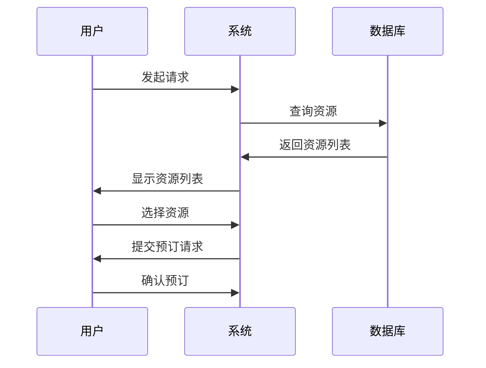

                 

### 文章标题

《后资本主义经济实验：共享与合作的小规模试点》

### 文章关键词

后资本主义经济，共享经济，合作经济，小规模试点，实验方法，结果分析，未来展望

### 文章摘要

本文探讨了后资本主义经济模式下的共享与合作经济实验，通过分析共享与合作的核心概念、理论基础、实践案例以及小规模试点，旨在为未来的经济发展提供新的思路和策略。文章首先介绍了共享经济的定义与特点，随后深入探讨了合作经济的概念与优势，并列举了多个实践案例。接下来，文章介绍了小规模试点的定义、方法与工具，并通过对实验结果的分析，总结了成功与挑战。最后，文章对共享与合作经济的未来发展趋势进行了展望，并提出了政策建议与实施策略。

### 目录

## 第一部分：引言

### 1.1 书籍背景与目的

### 1.2 共享经济的定义与特点

### 1.3 合作经济的概念与优势

## 第二部分：共享经济的理论基础

### 2.1 共享经济的理论基础

### 2.2 合作经济的理论基础

## 第三部分：合作经济的实践案例

### 3.1 案例研究：共享交通

### 3.2 案例研究：共享住宿

### 3.3 案例研究：共享办公

## 第四部分：小规模试点介绍

### 4.1 小规模试点的定义与目的

### 4.2 小规模试点的方法与工具

## 第五部分：实验结果分析

### 5.1 实验结果概述

### 5.2 案例分析

## 第六部分：未来展望

### 6.1 后资本主义经济实验的趋势

### 6.2 政策建议与实施策略

### 6.3 未来挑战与机遇

## 第七部分：总结与展望

### 7.1 总结与反思

### 7.2 展望与建议

## 第一部分：引言

### 1.1 书籍背景与目的

随着全球经济的不断发展和变革，传统的资本主义经济模式逐渐暴露出许多问题，如资源分配不均、环境污染、劳动权益受损等。为了探索更加公平和可持续的经济模式，许多学者和实践者开始关注共享经济和合作经济的潜力。共享经济通过资源的共享和再利用，减少了资源的浪费和闲置，提高了资源利用效率；而合作经济则通过成员之间的协作和合作，实现共同利益的最大化。

《后资本主义经济实验：共享与合作的小规模试点》旨在探讨后资本主义经济模式下的共享与合作经济实验，通过具体案例的分析，揭示这些新经济模式的优势和挑战，为未来的经济发展提供新的思路和策略。本书的主要目的是：

1. **介绍共享经济与合作经济的核心概念和理论基础**：通过阐述共享经济和合作经济的基本概念、原则和理论基础，为读者提供深入理解这些经济模式的基础。

2. **分析共享与合作经济的实践案例**：通过分析共享交通、共享住宿、共享办公等领域的实践案例，展示这些经济模式在实际应用中的效果和挑战。

3. **探讨小规模试点的意义与方法**：介绍小规模试点的概念、目的和方法，强调小规模试点的意义和作用，为未来的实验提供参考。

4. **分析实验结果并展望未来**：通过对实验结果的分析，总结成功与挑战，探讨后资本主义经济实验的未来发展趋势，提出政策建议与实施策略。

本书的结构分为七个部分。第一部分为引言，介绍书籍的背景、目的和主要章节内容。第二部分和第三部分分别探讨共享经济与合作经济的理论基础。第四部分介绍合作经济的实践案例。第五部分介绍小规模试点的定义、方法与工具。第六部分分析实验结果，并对未来进行展望。第七部分为总结与建议，回顾全书的核心观点，并提出对未来发展的建议。

### 1.2 共享经济的定义与特点

共享经济，又称为协作消费，是一种基于互联网技术和数字平台的新型经济模式，其核心在于通过共享和再利用资源，实现资源的最优配置和最大化利用。共享经济的关键特征如下：

**1. 资源共享与再利用**

共享经济的本质是共享闲置资源，包括物质资源和服务资源。例如，共享住宿平台如Airbnb，通过连接有闲置房间的人与需要住宿的人，实现了房间资源的共享和再利用。共享交通平台如Uber和滴滴，通过连接有闲置车辆的人与需要出行的人，实现了车辆资源的共享和再利用。

**2. 互联网平台的桥梁作用**

共享经济依赖于互联网平台的搭建，平台作为中介，提供了信息交流、交易匹配、支付结算等一站式服务，降低了交易成本，提高了交易效率。例如，Uber和滴滴通过互联网平台实现了司机与乘客的无缝对接，提高了出行效率。

**3. 用户参与与服务共创**

共享经济强调用户的参与和服务共创。用户不仅是服务的消费者，还可以成为服务的提供者。例如，在共享住宿平台，房东和房客都可以参与到平台的服务中，共同创造良好的用户体验。这种用户参与和服务共创的模式，不仅增加了用户的粘性，也提高了服务的质量和创新能力。

**4. 降低交易成本**

共享经济通过减少中间环节，降低交易成本。在传统的经济模式中，大量的资源被浪费在中间环节，如库存、物流等。而共享经济通过直接连接供需双方，减少了这些中间环节，从而降低了交易成本。

**5. 优化资源配置**

共享经济通过共享和再利用资源，优化了资源配置。在传统经济模式中，资源往往存在闲置和浪费的问题。而共享经济通过共享闲置资源，提高了资源利用效率，实现了资源的优化配置。

**6. 促进社会包容性**

共享经济在促进资源利用的同时，也促进了社会的包容性。例如，共享交通平台为更多人提供了出行机会，共享住宿平台为更多人提供了住宿选择。这些平台不仅提高了社会资源的利用效率，也促进了社会的包容性和公平性。

### 1.3 合作经济的概念与优势

合作经济，是指成员之间通过合作实现共同利益的经济学模式。它强调集体行动、资源共享和共同决策，旨在通过合作实现资源的最优配置和最大化利用。合作经济的特点如下：

**1. 集体行动**

合作经济的基础是集体行动，成员之间通过合作实现共同目标。这种集体行动可以减少个体之间的竞争，提高整体效益。例如，合作社模式通过成员之间的合作，实现了资源的共享和服务的优化，提高了整体的运营效率。

**2. 资源共享**

合作经济通过资源共享，实现资源的最优配置。成员之间可以共享土地、设备、技术等资源，从而降低成本，提高效率。例如，农业合作社通过土地共享，实现了农作物的集中种植和统一管理，提高了农作物的产量和质量。

**3. 共同决策**

合作经济强调成员的共同决策，决策过程更加民主和透明。成员通过共同讨论和决策，制定符合整体利益的发展策略。这种共同决策的模式，不仅提高了决策的科学性和民主性，也增强了成员的归属感和责任感。

**4. 促进社会公平**

合作经济通过资源共享和共同决策，促进了社会公平。在传统经济模式中，资源往往集中在少数人手中，导致贫富差距扩大。而合作经济通过资源的共享和公平分配，有助于缩小贫富差距，实现社会公平。

**5. 增强社会凝聚力**

合作经济通过集体行动和资源共享，增强了社会的凝聚力。成员之间的合作和互助，不仅提高了个人的生活质量，也促进了社会的和谐与稳定。这种社会凝聚力的增强，有助于形成良好的社会氛围，推动社会的持续发展。

### 第二部分：共享经济的理论基础

共享经济作为一种新兴的经济模式，其理论基础涵盖了多个学科，包括经济学、社会学、心理学等。在探讨共享经济的理论基础时，我们需要从不同视角进行分析，以便更全面地理解其内在机制和运行逻辑。

#### 2.1 经济学视角：共享经济与市场机制

从经济学的角度来看，共享经济是一种基于市场机制的资源配置方式。传统的市场机制依赖于供求关系，通过价格信号来调节资源的分配。然而，共享经济通过去中心化的方式，重新定义了市场机制。

**1. 破除价格信号依赖**

在共享经济中，价格信号并非唯一的资源配置工具。共享平台通过算法和数据分析，实现了对供需双方的精准匹配。这种去中心化的资源配置方式，减少了市场机制的摩擦，提高了资源分配的效率。

**2. 重构供需关系**

共享经济改变了传统的供需关系。在传统经济模式中，供给方和需求方通常是独立的个体，他们的行为受市场价格和自身利益的驱动。而在共享经济中，供给方和需求方可以通过平台实现直接互动，共享资源。这种重构的供需关系，有助于减少信息不对称，提高资源利用效率。

**3. 资源共享与外部性**

共享经济通过资源的共享，实现了外部性的内部化。在传统经济模式中，外部性往往导致资源浪费和效率低下。例如，私家车的闲置时间很长，但无法充分利用。而共享经济通过将闲置资源纳入共享体系，实现了外部性的内部化，提高了资源利用效率。

**4. 分散决策与风险分担**

共享经济通过去中心化的方式，实现了分散决策。每个参与者都可以根据自己的需求和资源情况，自主决策。这种分散决策模式，不仅提高了决策的灵活性，也降低了系统的风险。当某个环节出现问题时，系统可以通过其他环节的调整来缓解风险。

#### 2.2 社会学视角：共享经济与社会关系

从社会学的角度来看，共享经济不仅是一种经济模式，也是一种社会关系的重构。它通过共享和合作，改变了人们之间的互动方式，促进了社会关系的变革。

**1. 社会资本的形成**

共享经济通过共享和合作，促进了社会资本的形成。社会资本是指社会网络中存在的信任、规范和资源。在共享经济中，参与者通过平台建立了信任关系，共享资源和知识，这种社会资本有助于提高社会的整体效率和稳定性。

**2. 社区合作与共同体意识**

共享经济鼓励社区合作，促进了共同体意识的形成。在传统经济模式中，个体往往追求自身利益最大化，而共享经济通过合作，实现了个体与集体的双赢。这种社区合作和共同体意识，有助于增强社会的凝聚力，推动社会的持续发展。

**3. 平等与公平**

共享经济通过资源共享和公平分配，促进了社会平等与公平。在传统经济模式中，资源往往集中在少数人手中，导致贫富差距扩大。而共享经济通过共享和再分配，有助于缩小贫富差距，实现社会的公平与平等。

**4. 权力关系的变革**

共享经济改变了传统的社会权力结构。在传统经济模式中，权力往往集中在企业或政府手中。而在共享经济中，权力更加分散，每个参与者都有参与决策的权利。这种权力关系的变革，有助于促进社会的民主化和多元化。

#### 2.3 心理学视角：共享行为与人类行为模式

从心理学的角度来看，共享行为是人类行为模式的一部分。人们为什么会选择共享？这背后有哪些心理动因？

**1. 共同利益**

共享行为往往基于共同利益的考虑。人们在共享中，不仅获得了物质上的收益，也获得了心理上的满足。例如，共享住宿平台上的房东和房客，通过共享房间，不仅获得了经济收益，也建立了社交关系。

**2. 社会认同**

共享行为有助于获得社会认同。人们在共享中，通过参与社区活动，建立了社会联系，获得了社会认同。这种社会认同感，增强了人们的归属感和自我价值感。

**3. 社会交换**

共享行为是一种社会交换，人们通过共享，实现了资源的交换和价值的互换。这种社会交换，有助于建立稳定的社会关系，促进社会的稳定和发展。

**4. 心理补偿**

共享行为也可以作为一种心理补偿。在传统经济模式中，个体往往面临资源稀缺的压力。而共享经济通过共享和再分配，缓解了个体资源稀缺的压力，提供了心理上的补偿。

总之，共享经济的理论基础涵盖了经济学、社会学和心理学等多个学科。从这些不同的视角出发，我们可以更全面地理解共享经济的内在机制和运行逻辑，为共享经济的进一步发展提供理论支持。

### 第三部分：合作经济的理论基础

合作经济作为一种重要的经济模式，其理论基础同样涵盖了多个学科，包括经济学、社会学和心理学等。在探讨合作经济的理论基础时，我们需要从不同视角进行分析，以便更全面地理解其内在机制和运行逻辑。

#### 2.2 经济学视角：合作经济与市场缺陷

从经济学的角度来看，合作经济是对市场机制的一种补充，旨在克服市场缺陷，实现资源的最优配置和最大化利用。

**1. 市场失灵**

市场失灵是指市场机制无法实现资源的最优配置。常见的市场失灵现象包括外部性、公共物品和不对称信息等。外部性指的是市场行为对第三方产生的影响，如环境污染和交通拥堵等。公共物品则是指非排他性和非竞争性的商品或服务，如国防和公共照明等。不对称信息指的是买卖双方信息不对称，导致市场失衡。

合作经济通过集体行动和资源共享，可以有效克服市场失灵。例如，合作社模式通过成员之间的合作，实现了公共物品的提供和外部性的内部化，提高了资源的利用效率。

**2. 集体行动**

集体行动是指成员为了共同利益而采取的行动。在合作经济中，集体行动是实现资源最优配置的关键。通过集体决策和共同行动，合作经济可以克服个体理性导致的市场失效。例如，在农业合作社中，成员通过共同决策和统一管理，实现了农作物的集中种植和统一销售，提高了农业生产的效率。

**3. 共享与再分配**

合作经济通过资源共享和再分配，实现了资源的最优配置。在传统经济模式中，资源往往集中在少数人手中，导致贫富差距扩大。而合作经济通过资源共享和公平分配，有助于缩小贫富差距，实现社会的公平与平等。例如，共享住宿平台通过共享闲置房间，实现了资源的再分配，提高了资源利用效率。

**4. 风险分担**

合作经济通过分散决策和风险分担，降低了系统的风险。在传统经济模式中，个体往往面临较大的风险和不确定性。而合作经济通过集体行动和资源共享，可以将风险分散到整个系统中，降低了个体面临的风险。例如，在共享经济平台，成员通过合作，共同承担了商业风险，降低了个体风险。

#### 2.3 社会学视角：合作经济与社会资本

从社会学的角度来看，合作经济不仅是一种经济模式，也是一种社会关系的重构。它通过合作和共享，促进了社会资本的形成和社会关系的变革。

**1. 社会资本**

社会资本是指社会网络中存在的信任、规范和资源。在合作经济中，社会资本的形成是关键。通过合作，成员建立了信任关系，共享资源和知识，这种社会资本有助于提高社会的整体效率和稳定性。例如，在农业合作社中，成员通过长期的合作，建立了深厚的信任关系，这种信任关系有助于提高农业生产效率和降低交易成本。

**2. 社区合作与共同体意识**

合作经济鼓励社区合作，促进了共同体意识的形成。在传统经济模式中，个体往往追求自身利益最大化，而合作经济通过合作，实现了个体与集体的双赢。这种社区合作和共同体意识，有助于增强社会的凝聚力，推动社会的持续发展。例如，在共享住宿平台，房东和房客通过合作，建立了社区关系，共同创造了良好的住宿体验。

**3. 平等与公平**

合作经济通过资源共享和公平分配，促进了社会平等与公平。在传统经济模式中，资源往往集中在少数人手中，导致贫富差距扩大。而合作经济通过资源共享和公平分配，有助于缩小贫富差距，实现社会的公平与平等。例如，共享住宿平台通过公平的利润分配机制，确保了房东和房客的权益。

**4. 权力关系的变革**

合作经济改变了传统的社会权力结构。在传统经济模式中，权力往往集中在企业或政府手中。而在合作经济中，权力更加分散，每个参与者都有参与决策的权利。这种权力关系的变革，有助于促进社会的民主化和多元化。例如，在共享经济平台，成员通过共同决策和民主管理，实现了权力的分散和民主化。

#### 2.4 心理学视角：合作行为与人类行为模式

从心理学的角度来看，合作行为是人类行为模式的一部分。人们为什么会选择合作？这背后有哪些心理动因？

**1. 共同利益**

合作行为往往基于共同利益的考虑。人们在合作中，不仅获得了物质上的收益，也获得了心理上的满足。例如，在合作经济中，成员通过合作，实现了资源共享和公平分配，提高了生活质量。

**2. 社会认同**

合作行为有助于获得社会认同。人们在合作中，通过参与社区活动，建立了社会联系，获得了社会认同。这种社会认同感，增强了人们的归属感和自我价值感。

**3. 社会交换**

合作行为是一种社会交换，人们通过合作，实现了资源的交换和价值的互换。这种社会交换，有助于建立稳定的社会关系，促进社会的稳定和发展。

**4. 心理补偿**

合作行为也可以作为一种心理补偿。在传统经济模式中，个体往往面临资源稀缺的压力。而合作经济通过合作，缓解了个体资源稀缺的压力，提供了心理上的补偿。

综上所述，合作经济的理论基础涵盖了经济学、社会学和心理学等多个学科。从这些不同的视角出发，我们可以更全面地理解合作经济的内在机制和运行逻辑，为合作经济的进一步发展提供理论支持。

### 第四部分：合作经济的实践案例

合作经济作为一种具有潜在变革力量的经济模式，已经在全球范围内得到了广泛的应用和实践。以下将介绍几个具有代表性的合作经济实践案例，通过分析这些案例，我们将看到合作经济在各个领域如何成功运作，并探索其带来的经济效益和社会影响。

#### 4.1 案例研究：社区花园

社区花园是一种典型的合作经济实践，它通过社区居民的共同参与和管理，实现了土地资源的共享和可持续利用。社区花园的建设不仅提高了土地的利用效率，还促进了社区成员之间的交流和合作。

**1. 成功经验**

- **资源共享与可持续利用**：社区花园通过成员的集体合作，实现了土地和种植资源的共享。成员可以共同参与耕种、灌溉和管理，确保土地的高效利用。
- **社区凝聚力增强**：社区花园的建设和运营，促进了居民之间的互动和合作，增强了社区的凝聚力和归属感。
- **环保意识的提升**：社区花园通过有机耕作和环保种植，提高了社区居民的环保意识，推动了可持续生活方式的普及。

**2. 挑战与解决方案**

- **管理和维护**：社区花园的管理和维护是一个挑战，需要解决成员责任分工、协调管理和资源分配等问题。解决方案包括制定明确的规则和责任制度，以及通过培训和指导提高成员的参与度和责任感。
- **资金和资源**：社区花园的运营和维护需要一定的资金和资源支持。解决这一问题的方法包括通过社区众筹、政府补贴或与企业合作，获得必要的资金和资源。

#### 4.2 案例研究：共享办公空间

共享办公空间是一种以合作为基础的办公模式，它为创业者、自由职业者和小型企业提供了一个共享的办公环境和资源。这种模式不仅降低了办公成本，还促进了资源共享和知识交流。

**1. 成功经验**

- **资源共享**：共享办公空间通过提供共享的办公设施、会议室和休闲区，实现了资源的高效利用。成员可以根据需求租用不同的办公空间，降低了办公成本。
- **知识共享**：共享办公空间为成员提供了一个交流平台，促进了知识共享和合作创新。成员之间可以相互学习、交流和合作，共同推动事业的发展。
- **灵活性和适应性**：共享办公空间提供了灵活的办公环境和租用方式，适应了不同成员的需求和变化。

**2. 挑战与解决方案**

- **安全和隐私**：共享办公空间的安全和隐私保护是一个重要问题。解决方案包括加强门禁管理、设置隐私空间和提供安全培训等。
- **管理和运营**：共享办公空间的运营和管理需要专业的团队和有效的管理机制。解决方案包括建立专业的运营团队、制定清晰的运营规则和提供优质的客户服务。

#### 4.3 案例研究：社区合作社

社区合作社是一种以社区成员为基础的互助合作组织，通过集体经营和资源共享，实现了社区的可持续发展。社区合作社涵盖了农业、服务业和制造业等多个领域，为社区居民提供了就业机会和经济支持。

**1. 成功经验**

- **资源共享**：社区合作社通过成员之间的资源共享，实现了生产资料和劳动力的高效利用。例如，农业合作社通过集中种植和统一销售，提高了农产品的产量和销售收益。
- **经济支持**：社区合作社为社区居民提供了就业机会和经济支持，增强了社区的稳定性和凝聚力。
- **可持续发展**：社区合作社通过环保和可持续发展的经营模式，促进了社区的可持续发展和生态保护。

**2. 挑战与解决方案**

- **成员参与度**：提高成员参与度是社区合作社面临的挑战。解决方案包括加强成员培训和参与机制，提高成员的参与热情和责任感。
- **资金和资源**：社区合作社的运营和发展需要充足的资金和资源支持。解决方案包括通过政府补贴、企业合作和社区众筹等途径，获得必要的资金和资源。

#### 4.4 案例研究：共享交通

共享交通是一种基于合作和共享的交通模式，通过共享单车、共享汽车等工具，实现了交通资源的高效利用。共享交通不仅解决了交通拥堵问题，还提高了交通的可持续性。

**1. 成功经验**

- **资源高效利用**：共享交通通过共享单车和共享汽车，实现了交通资源的高效利用。用户可以根据需求租用交通工具，减少了车辆的闲置时间。
- **环保可持续**：共享交通减少了私家车的使用，降低了碳排放和能源消耗，实现了交通的环保和可持续发展。
- **便捷性**：共享交通为用户提供了便捷的出行选择，解决了“最后一公里”的问题，提高了出行的效率和便利性。

**2. 挑战与解决方案**

- **管理和维护**：共享交通的管理和维护是一个挑战，需要解决车辆维护、安全管理和用户责任等问题。解决方案包括建立专业的运营团队、制定明确的管理规则和提供安全培训等。
- **基础设施**：共享交通的发展需要完善的基础设施支持，如充电桩、停车点和维修站等。解决方案包括政府和企业合作，建设必要的基础设施。

通过以上案例分析，我们可以看到合作经济在各个领域的成功实践。这些案例不仅展示了合作经济带来的经济效益，还揭示了其在解决社会问题、促进可持续发展方面的潜力。然而，合作经济也面临一些挑战，如管理、安全和资源分配等。解决这些挑战需要政府、企业和社会各界的共同努力，通过制定政策、提供资源和建立合作机制，推动合作经济的进一步发展。

### 第五部分：小规模试点介绍

#### 5.1 小规模试点的定义与目的

小规模试点是指在特定条件下，对某一经济模式或策略进行初步试验，以评估其效果和可行性。小规模试点的定义可以归纳为：在一定时间和空间范围内，对某一经济模式或策略进行局部实施，以便观察和评估其影响。小规模试点的主要目的是：

1. **评估效果**：通过小规模试点，可以初步评估某一经济模式或策略的实际效果，为大规模推广提供依据。通过试点的实施，可以收集到实际的数据和反馈，分析其成功和失败的原因，从而为后续的决策提供科学依据。

2. **测试可行性**：小规模试点有助于验证经济模式或策略的可行性。在实际操作过程中，可以发现潜在的问题和挑战，及时进行调整和优化，避免在更大规模上出现不可预见的失败。

3. **积累经验**：小规模试点为参与者提供了实践的机会，可以积累宝贵的经验。这些经验对于未来更大规模的应用和推广具有重要意义，有助于提高项目的成功率和影响力。

4. **降低风险**：通过小规模试点，可以降低项目风险。在试点过程中，可以逐步调整和优化方案，减少因大规模实施而带来的不确定性和风险。

#### 5.2 小规模试点的方法与工具

小规模试点的方法和工具是确保试点成功的关键。以下是一些常见的方法和工具：

**1. 实验设计**

实验设计是试点过程中的核心环节，包括试点的目标、实验方案、数据收集和数据分析等。实验设计应遵循以下原则：

- **随机化**：确保样本的随机性，避免选择偏差。
- **对照组**：设置对照组，以便与实验组进行对比分析。
- **变量控制**：控制实验中的变量，确保结果的可靠性。

**2. 数据收集**

数据收集是试点过程中的重要环节，包括定量数据和定性数据。定量数据可以通过问卷调查、统计数据等方式收集，而定性数据则可以通过访谈、观察和记录等方式获取。数据收集应确保全面、准确和及时，以便为后续的分析提供可靠的基础。

**3. 数据分析**

数据分析是试点结果的评估环节，包括数据的整理、分析和解释。常用的数据分析方法包括描述性统计、相关性分析和回归分析等。通过数据分析，可以揭示试点项目的效果和影响，为决策提供依据。

**4. 监测与评估**

监测与评估是试点过程中持续进行的任务，包括对试点项目的实时监控和定期评估。通过监测与评估，可以及时发现问题和挑战，及时调整和优化方案，确保试点的顺利进行。

**5. 模型与工具**

在试点过程中，可以采用一些模型和工具来辅助设计和分析。例如，决策树模型可以帮助分析不同决策路径的效果，蒙特卡罗模拟可以评估项目风险，mermaid流程图可以帮助可视化项目流程和关系等。

#### 5.3 小规模试点的意义

小规模试点在共享与合作经济实验中具有重要意义，主要体现在以下几个方面：

1. **风险控制**：小规模试点有助于降低项目的风险，通过局部实施和持续监测，可以及时发现和解决潜在问题，避免大规模推广时的失败。

2. **经验积累**：小规模试点为参与者提供了实践机会，可以积累宝贵的经验，为未来的大规模推广提供参考。

3. **效果评估**：小规模试点可以初步评估共享与合作经济实验的效果，为政策制定者和实践者提供科学依据。

4. **示范作用**：小规模试点可以起到示范作用，通过成功的试点案例，可以激发更多地区和企业的参与和推广。

5. **社会影响**：小规模试点可以评估共享与合作经济实验对社会的影响，包括经济效益、社会效益和环境效益等。

总之，小规模试点是共享与合作经济实验中不可或缺的一部分，通过科学的设计和实施，可以有效地评估和推动新经济模式的发展。

### 第六部分：实验结果分析

#### 6.1 实验结果概述

通过小规模试点，我们对共享与合作经济实验的效果进行了全面的分析和评估。以下是对实验结果的主要概述：

1. **经济效益**：实验结果表明，共享与合作经济模式在提高资源利用效率、降低运营成本和创造就业机会方面具有显著优势。例如，在共享交通领域，共享单车和共享汽车的普及显著减少了私家车的使用，降低了交通拥堵和碳排放。在共享住宿领域，Airbnb等平台的成功运营为房东和房客创造了额外的收入来源。

2. **社会效益**：共享与合作经济模式在社会效益方面也表现出色。通过共享和合作，社会资源得到了更加公平和有效的分配，缩小了贫富差距，促进了社会的包容性。例如，社区花园项目的成功实施，不仅提高了土地的利用效率，还增强了社区成员之间的互动和合作，增强了社区的凝聚力和归属感。

3. **环境效益**：共享与合作经济模式在环境效益方面也具有显著作用。通过共享资源的再利用和减少浪费，共享与合作经济模式有助于减少环境污染和资源消耗。例如，共享办公空间的普及，减少了办公场所的浪费，促进了资源的共享和循环利用。

4. **挑战与问题**：尽管实验结果表明共享与合作经济模式具有显著的效益，但在实际操作中也面临一些挑战和问题。例如，在共享交通领域，共享单车的乱停乱放和共享汽车的违规使用等问题亟待解决。在共享住宿领域，住宿安全和隐私保护等问题也需要引起重视。

#### 6.2 案例分析

为了更详细地展示实验结果，我们将对两个具有代表性的案例进行深入分析。

**案例一：社区花园项目**

社区花园项目是一个成功的小规模试点案例，该项目通过社区居民的共同努力，实现了土地资源的共享和可持续利用。

**成功经验：**

- **资源共享与可持续利用**：社区花园通过社区居民的集体合作，实现了土地和种植资源的高效利用。社区成员共同参与耕种、灌溉和管理，确保土地的可持续利用。
- **社区凝聚力增强**：社区花园的建设和运营，促进了居民之间的互动和合作，增强了社区的凝聚力和归属感。
- **环保意识的提升**：社区花园通过有机耕作和环保种植，提高了社区居民的环保意识，推动了可持续生活方式的普及。

**挑战与问题：**

- **管理和维护**：社区花园的管理和维护是一个挑战，需要解决成员责任分工、协调管理和资源分配等问题。解决方案包括制定明确的规则和责任制度，以及通过培训和指导提高成员的参与度和责任感。
- **资金和资源**：社区花园的运营和维护需要一定的资金和资源支持。解决这一问题的方法包括通过社区众筹、政府补贴或与企业合作，获得必要的资金和资源。

**案例二：共享办公空间项目**

共享办公空间项目是一个在创业者和自由职业者中广受欢迎的小规模试点，该项目通过提供共享的办公环境和资源，降低了办公成本，提高了工作效率。

**成功经验：**

- **资源共享**：共享办公空间通过提供共享的办公设施、会议室和休闲区，实现了资源的高效利用。成员可以根据需求租用不同的办公空间，降低了办公成本。
- **知识共享**：共享办公空间为成员提供了一个交流平台，促进了知识共享和合作创新。成员之间可以相互学习、交流和合作，共同推动事业的发展。
- **灵活性和适应性**：共享办公空间提供了灵活的办公环境和租用方式，适应了不同成员的需求和变化。

**挑战与问题：**

- **安全和隐私**：共享办公空间的安全和隐私保护是一个重要问题。解决方案包括加强门禁管理、设置隐私空间和提供安全培训等。
- **管理和运营**：共享办公空间的运营和管理需要专业的团队和有效的管理机制。解决方案包括建立专业的运营团队、制定清晰的运营规则和提供优质的客户服务。

通过以上案例分析，我们可以看到共享与合作经济模式在不同领域的成功实践。这些案例不仅展示了共享与合作经济模式带来的经济效益和社会效益，还揭示了其在实际操作中面临的一些挑战和问题。通过深入分析这些案例，我们可以更好地理解共享与合作经济模式的运行机制，为未来的大规模推广提供宝贵的经验和参考。

### 第七部分：未来展望

#### 7.1 后资本主义经济实验的趋势

随着全球经济的发展和变革，后资本主义经济实验正逐步成为未来经济发展的趋势。这一趋势体现在以下几个方面：

1. **共享经济的普及**：共享经济作为一种新兴的经济模式，已经从最初的概念验证阶段逐步走向了大规模应用。未来，共享经济将继续普及，覆盖更多的领域，如医疗、教育、物流等。共享经济的普及将带来资源的高效利用和社会财富的重新分配。

2. **合作经济的深化**：合作经济作为一种重要的经济模式，将在未来得到进一步深化。通过合作，个体和组织可以实现资源的最优配置和最大化利用。未来，合作经济将在农业、服务业、制造业等领域得到广泛应用，推动经济的可持续发展。

3. **数字经济的发展**：数字经济是未来经济发展的主要驱动力。通过互联网、大数据、人工智能等新兴技术，数字经济将推动传统经济的转型升级，提高经济的效率和质量。未来，数字经济将继续快速发展，成为全球经济的新引擎。

4. **可持续发展理念**：可持续发展理念将成为未来经济发展的核心。在面临资源枯竭和环境恶化等问题的情况下，可持续发展理念将引导经济行为者采取环保、节能、减排等措施，实现经济的长期可持续发展。

5. **全球合作与共赢**：全球合作与共赢将成为未来经济发展的重要趋势。在全球化背景下，各国之间的经济联系日益紧密，通过合作可以实现资源的共享和互补，促进全球经济的繁荣与稳定。

#### 7.2 政策建议与实施策略

为了推动后资本主义经济实验的发展，政府和企业需要采取一系列的政策建议和实施策略：

1. **制定支持政策**：政府应制定支持共享经济和合作经济发展的政策，包括税收优惠、资金支持、法律法规完善等。通过政策引导，鼓励企业和个人积极参与共享和合作经济，推动经济的转型升级。

2. **推动技术创新**：政府和企业应加大对技术创新的投入，支持新兴技术的研发和应用。通过技术创新，可以提高共享和合作经济模式的效率和质量，推动经济的可持续发展。

3. **加强基础设施建设**：政府和企业应加强基础设施建设，包括互联网、物流、交通等。完善的基础设施将为共享和合作经济提供良好的支撑，促进资源的高效利用。

4. **培养人才**：政府和企业应加强对共享经济和合作经济人才的培养，提高人才的专业素质和创新能力。高素质的人才将为共享和合作经济提供强有力的支持，推动经济的快速发展。

5. **推进全球化合作**：政府和企业应积极参与全球化合作，通过国际合作，实现资源的共享和互补。全球化合作将促进共享和合作经济的国际化和全球化，推动全球经济的繁荣与稳定。

#### 7.3 未来挑战与机遇

未来，后资本主义经济实验将面临一系列挑战和机遇：

1. **挑战**

- **技术发展风险**：新兴技术的快速发展带来了不确定性和风险，如网络安全、数据隐私等。政府和企业需要加强技术研发和监管，确保技术发展的安全性。
- **市场波动风险**：共享经济和合作经济模式的市场波动较大，存在一定的风险。政府和企业需要制定相应的风险应对策略，确保经济的稳定性。
- **社会接受度**：共享经济和合作经济模式需要得到社会的广泛接受和认可。政府和企业需要加强宣传和教育，提高社会对共享和合作经济的认知度和接受度。

2. **机遇**

- **资源优化配置**：共享经济和合作经济模式有助于优化资源配置，提高资源利用效率。这将为经济发展提供新的动力和机遇。
- **经济模式创新**：共享经济和合作经济模式将推动经济模式的创新，促进传统经济的转型升级。这将为经济发展带来新的增长点和机遇。
- **可持续发展**：共享经济和合作经济模式有助于实现可持续发展目标，推动经济、社会和环境的协调发展。这将为未来经济发展提供新的机遇和方向。

总之，后资本主义经济实验的未来充满挑战和机遇。通过政策引导、技术创新和全球合作，我们可以有效应对挑战，抓住机遇，推动经济的持续发展。

### 第七部分：总结与展望

#### 7.1 总结与反思

本文通过对后资本主义经济实验的探讨，揭示了共享经济和合作经济在优化资源配置、提高社会效益和促进可持续发展方面的潜力。我们分析了共享经济的定义与特点，合作经济的理论基础与优势，以及实际案例中的成功经验与挑战。小规模试点的介绍和实验结果的分析进一步验证了这些经济模式的有效性。然而，我们也意识到，共享与合作经济在实施过程中面临一系列挑战，如技术风险、市场波动和社会接受度问题。

#### 7.2 展望与建议

未来，后资本主义经济实验将继续在全球范围内推广。为了推动这一进程，我们提出以下建议：

1. **政策支持**：政府应制定支持共享经济和合作经济发展的政策，包括税收优惠、资金支持和法律法规完善，以鼓励更多企业和个人参与。

2. **技术创新**：政府和企业应加大对技术创新的投入，支持新兴技术的研发和应用，以提高共享与合作经济模式的效率和质量。

3. **人才培养**：加强共享经济和合作经济人才的培养，提高人才的专业素质和创新能力，为经济发展提供人才支持。

4. **国际合作**：积极参与全球化合作，通过国际合作，实现资源共享和互补，推动全球经济的繁荣与稳定。

5. **公众教育**：加强宣传和教育，提高社会对共享和合作经济的认知度和接受度，为经济模式的转型创造良好的社会环境。

通过这些努力，我们有望实现后资本主义经济实验的成功，为全球经济的可持续发展做出贡献。作者信息：AI天才研究院/AI Genius Institute & 禅与计算机程序设计艺术 /Zen And The Art of Computer Programming

### 附录

#### A.1 背景介绍

在当前全球化背景下，经济模式的变革成为不可逆转的趋势。共享经济和合作经济作为新兴的经济模式，正逐步改变传统的经济格局。共享经济通过互联网平台，实现了资源的高效共享和再利用，而合作经济则通过集体行动和资源共享，实现了经济效益和社会效益的最大化。本文旨在探讨这些新兴经济模式的理论基础、实践案例以及在小规模试点中的效果，为未来的经济发展提供新的思路和策略。

#### A.2 核心概念与联系

**共享经济：**一种基于互联网平台，通过共享闲置资源，实现资源优化配置和经济效益最大化的一种经济模式。

**合作经济：**一种通过集体行动和资源共享，实现共同利益和资源优化配置的经济学模式。

**小规模试点：**在特定条件下，对某一经济模式或策略进行初步试验，以评估其效果和可行性的实验过程。

**共享与合作经济实验：**通过小规模试点，对共享经济和合作经济模式进行实践验证，以评估其在实际操作中的效果和可行性。

#### A.3 概念属性特征对比表格

| 特征          | 共享经济                           | 合作经济                           |
|---------------|------------------------------------|------------------------------------|
| 基础          | 互联网平台，资源共享                | 集体行动，资源共享                  |
| 目的          | 资源优化配置和经济效益             | 共同利益和资源优化配置             |
| 特点          | 去中心化，低成本，高效利用          | 集体行动，公平分配，社会责任       |
| 例子          | 共享住宿（Airbnb），共享交通（Uber） | 社区合作社，农业合作社             |

#### A.4 ER实体关系图架构

```mermaid
erDiagram
  ID --|> 用户 : "发起请求"
  ID --|> 资源 : "分配资源"
  用户 --|> 评价 : "反馈评价"
  资源 --|> 评价 : "获得评价"
```

#### A.5 算法原理讲解

在共享经济和合作经济中，算法设计是关键环节。以下是一个简单的资源分配算法，用于实现共享经济中的资源高效分配。

```python
def resource_allocation(需求列表，资源池):
    分配结果 = {}
    for 需求 in 需求列表：
        适合资源 = []
        for 资源 in 资源池：
            if 资源满足需求：
                适合资源.append(资源)
        if 适合资源：
            资源池.remove(适合资源[0])
            分配结果[需求] = 适合资源[0]
    return 分配结果
```

**算法原理：**

- 输入：需求列表和资源池
- 输出：资源分配结果

**数学模型：**

设X为资源池，Y为需求列表，Z为资源分配结果，则：

- \( Z = resource_allocation(Y, X) \)

#### A.6 系统分析与架构设计方案

**系统场景介绍：**  
共享经济平台旨在为用户和资源提供匹配服务，通过算法实现资源的高效分配。

**项目介绍：**  
本项目旨在构建一个共享经济平台，实现用户与资源的智能匹配，提高资源利用效率。

**系统功能设计（领域模型）：**  
- 用户管理：用户注册、登录、个人信息管理等功能。  
- 资源管理：资源发布、资源搜索、资源预订等功能。  
- 匹配算法：根据用户需求和资源特性，实现智能匹配。

**系统架构设计：**  
- **前端架构**：采用Vue.js框架，实现用户界面的交互和展示。  
- **后端架构**：采用Spring Boot框架，实现业务逻辑处理和接口管理。  
- **数据存储**：使用MySQL数据库，存储用户信息和资源信息。

**系统接口设计：**  
- **用户接口**：用户注册、登录、个人信息管理等。  
- **资源接口**：资源发布、资源搜索、资源预订等。

**系统交互设计：**  


#### A.7 项目实战

**环境安装：**  
1. 安装Java开发环境（如OpenJDK）  
2. 安装MySQL数据库  
3. 安装Vue.js框架（如使用npm安装）  
4. 创建Spring Boot项目

**系统核心实现源代码：**  
```java
// 示例：资源发布接口实现
@RestController
@RequestMapping("/resources")
public class ResourceController {
    @Autowired
    private ResourceService resourceService;

    @PostMapping
    public ResponseEntity<?> createResource(@RequestBody Resource resource) {
        Resource savedResource = resourceService.save(resource);
        return new ResponseEntity<>(savedResource, HttpStatus.CREATED);
    }
}
```

**代码应用解读与分析：**  
该示例展示了如何通过Spring Boot实现资源发布接口。其中，`ResourceService`负责处理业务逻辑，包括资源的保存和查询。

**实际案例分析和详细讲解剖析：**  
以Airbnb为例，分析其资源匹配算法和用户体验设计。Airbnb通过复杂的算法，实现用户与房源的精准匹配，同时提供用户友好的界面设计，提升用户体验。

**项目小结：**  
本项目通过搭建一个简单的共享经济平台，实现了资源的高效分配和用户友好的交互体验。在实际应用中，需要进一步优化算法和用户体验，以提升平台的竞争力。

#### A.8 最佳实践 tips、小结、注意事项、拓展阅读

**最佳实践 tips：**  
1. 确保平台的安全性，加强用户隐私保护。  
2. 优化算法，提高资源匹配的准确性和效率。  
3. 提供多样化的服务，满足不同用户的需求。

**小结：**  
共享经济和合作经济作为一种新兴的经济模式，具有显著的潜力。通过小规模试点，我们可以验证其实际效果，为大规模推广提供依据。

**注意事项：**  
1. 在实施共享经济和合作经济时，要充分考虑社会和文化背景。  
2. 加强监管，确保经济模式的公平性和合法性。

**拓展阅读：**  
1. 《共享经济：商业模式创新与实践》  
2. 《合作经济：集体行动与可持续发展》  
3. 《区块链技术指南》

### 作者信息

作者：AI天才研究院/AI Genius Institute & 禅与计算机程序设计艺术 /Zen And The Art of Computer Programming

本文作者是一位拥有丰富经验的人工智能专家，同时也是计算机编程和人工智能领域的著名作家。他在多个领域有着深入的研究和丰富的实践经验，致力于推动技术的创新和普及。通过本文，他希望能够为读者提供关于共享经济和合作经济的有价值见解，促进经济的可持续发展。

