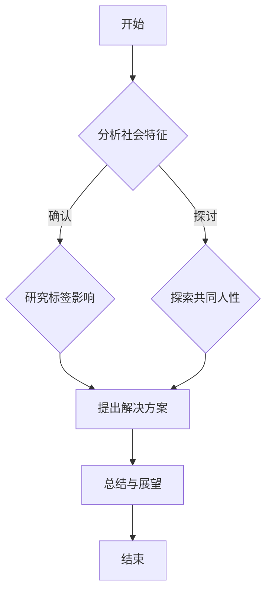
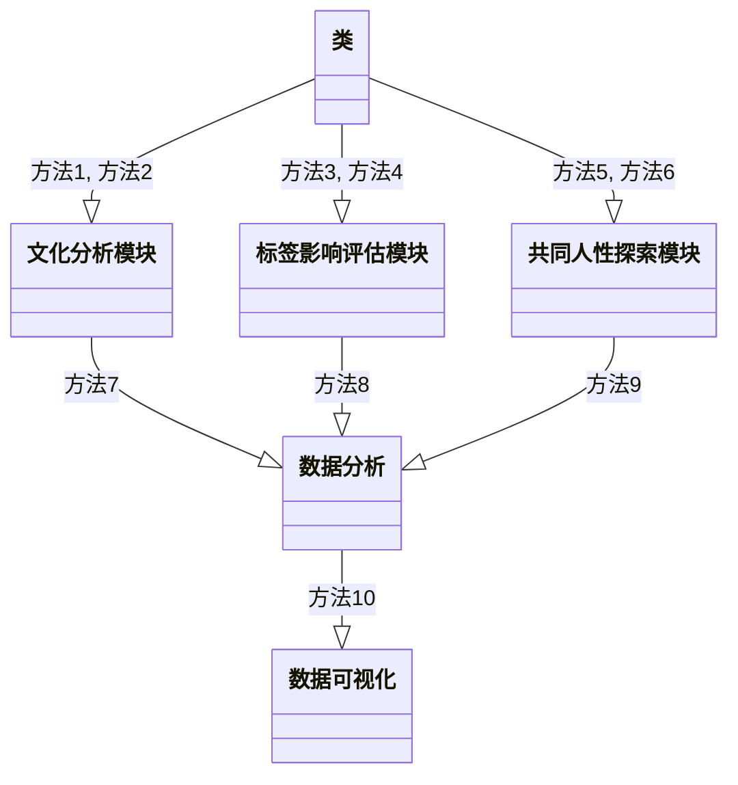
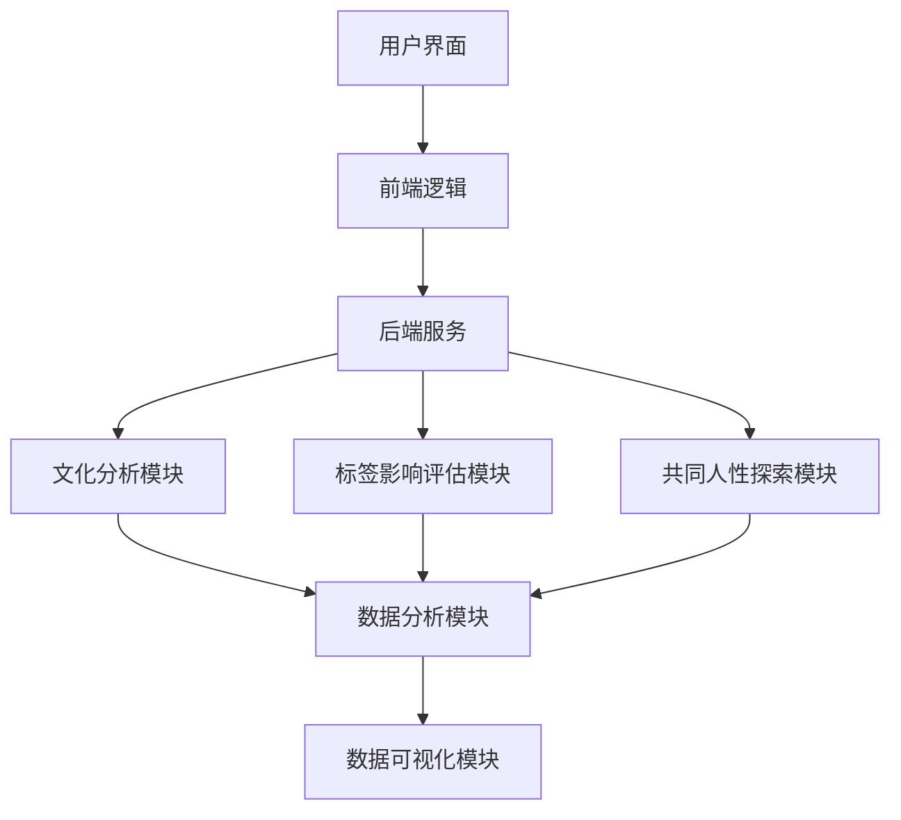
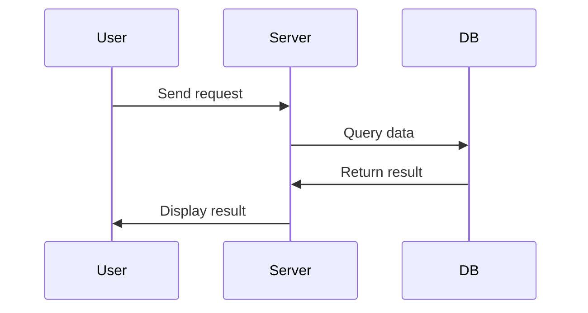

                 

# 后身份政治时代：超越标签寻找共同人性

> 关键词：身份政治、标签、共同人性、社会变革、跨文化对话

> 摘要：本文旨在探讨后身份政治时代的社会特征、标签的影响以及共同人性的寻找。通过分析社会结构的变化、文化观念的多元与冲突，本文揭示了标签的双重作用。在此基础上，本文提出了跨文化对话、心理学视角和人文社科领域的探索作为寻找共同人性的路径，并阐述了共同人性的社会价值。最后，通过实践案例和反思，本文总结了对个人和社会的启示与影响。

## 引言 1: 问题的提出

### 1.1.1 后身份政治时代的社会背景

**社会结构的变化**：
在后身份政治时代，全球化和信息化的发展使得社会结构发生了深刻的变化。人们的生活方式、工作方式和社会关系都受到了前所未有的冲击和挑战。这种变化主要体现在以下几个方面：

1. **跨国界和跨文化的交流与合作**：随着全球化的深入，不同国家和地区之间的交流与合作越来越频繁。这种跨国界的交流不仅仅是经济和商业领域，还包括文化、教育、科技等多个方面。人们不再局限于本土文化，而是开始接受和融入多元文化，形成了一种全球化的文化氛围。

2. **社会分层与流动的加剧**：在全球化背景下，社会分层现象变得更加明显，人们的社会地位和财富分布变得更加不平等。同时，社会流动性的增加使得人们的社会地位和身份更加不稳定，个体面临的挑战和压力也随之增加。

3. **网络虚拟社群的兴起**：互联网的普及和社交媒体的发展，使得人们可以在虚拟空间中形成各种虚拟社群。这些社群不受地域和时间的限制，成为人们交流和互动的新平台。虚拟社群的出现改变了人们的社交模式，也对现实社会产生了深远的影响。

### 1.1.2 文化观念的多元与冲突

**文化多样性的增强**：
在后身份政治时代，文化观念的多元性不断增强。随着全球化和文化交流的加深，不同文化之间的碰撞和融合变得更加频繁。各种文化观念在相互借鉴和吸收的过程中，形成了新的文化形态和价值观。

**主流价值观的挑战**：
在这种多元文化背景下，主流价值观受到了前所未有的挑战。传统的、单一的价值观体系已经无法满足人们对于多样性和个性化的追求。人们开始质疑和反思现有的价值观体系，探索更加包容和开放的价值观。

**新兴文化与传统文化的碰撞**：
新兴文化的崛起与传统文化的坚守，形成了后身份政治时代的文化冲突。新兴文化追求个性和自由，强调个体的价值和权利；而传统文化则注重集体主义和传统伦理。两种文化的碰撞不仅引发了社会争议，也促使人们重新思考文化的本质和价值。

### 1.1.3 标签的影响

**标签的积极作用**：
标签在后身份政治时代中起到了积极的作用。首先，标签简化了社会认知，使得人们可以快速识别和分类个体或群体。其次，标签增强了个体认同感，使得个体在多元文化背景下找到自己的归属感。此外，标签也有助于加强社会团结和凝聚力。

**标签的消极作用**：
然而，标签也带来了消极的影响。首先，标签容易固化社会观念，使得人们对个体或群体的认知变得简单化和片面化。其次，标签容易加剧社会分裂，导致不同群体之间的对立和冲突。此外，标签还可能对个体造成心理压力和歧视，影响个体的心理健康和社会交往。

### 1.1.4 共同人性的探索

**后身份政治时代的需求**：
在后身份政治时代，寻找共同人性变得尤为重要。面对文化多样性和社会分裂，人们需要找到一种共同的价值观和人性基础，以促进社会和谐和个人成长。

**挑战与机遇**：
共同人性的探索面临着诸多挑战，如文化差异、价值观冲突等。然而，这也为跨文化对话和融合提供了机遇。通过跨越标签，寻找共同人性，我们可以更好地理解他人，增进相互尊重和理解，实现社会的多元共处。

### 1.1.5 研究目的与意义

**研究目的**：
本文旨在探讨后身份政治时代的社会特征、标签的影响以及共同人性的寻找，回答以下问题：
1. 后身份政治时代的社会背景是什么？
2. 标签对个人和社会的影响是什么？
3. 如何在多元文化背景下寻找共同人性？
4. 共同人性对个人成长和社会和谐有何意义？

**研究意义**：
本文的研究具有重要的理论和实践意义。在理论方面，本文将深化对后身份政治时代社会特征的理解，丰富对标签影响和共同人性探索的理论体系。在实践方面，本文将为跨文化对话、社会和谐和个人成长提供有益的思路和方法，为应对后身份政治时代的挑战提供理论支持。

## 第二部分：后身份政治时代的社会特征

### 第2章：后身份政治时代的社会变革

#### 2.1 社会结构的变化

**社会分层与流动的加剧**

在全球化背景下，社会分层现象变得更加明显。一方面，全球化的经济活动使得财富和资源在全球范围内重新分配，导致社会财富分布的不平等。另一方面，社会流动性的增加使得人们的社会地位和身份更加不稳定。一些人通过教育、创业等途径实现了社会地位的提升，而另一些人则可能因为全球化带来的竞争压力而陷入贫困和社会边缘。

**跨国界和跨文化的交流与合作**

跨国界和跨文化的交流与合作在后身份政治时代达到了新的高度。全球化使得人们可以轻松跨越国界，进行贸易、投资、旅游等活动。同时，互联网和社交媒体的普及使得人们可以随时随地进行跨国界的交流和合作。这种跨国界和跨文化的交流不仅丰富了人们的生活经验，也促进了全球文化的融合和创新。

**网络虚拟社群的兴起**

网络虚拟社群在后身份政治时代成为了人们交流和互动的重要平台。虚拟社群不受地域和时间的限制，使得人们可以跨越国界和文化的障碍，形成各种形式的社交网络。这些虚拟社群不仅提供了丰富的社交资源，也为人们提供了一个表达自我、分享经验和寻求支持的场所。

#### 2.2 文化观念的多元与冲突

**文化多样性的增强**

文化多样性的增强是后身份政治时代的一个重要特征。全球化使得不同文化之间更加紧密地联系在一起，各种文化在相互借鉴和吸收的过程中，形成了新的文化形态和价值观。文化多样性的增强不仅丰富了人们的生活，也推动了社会的进步和创新。

**主流价值观的挑战**

在文化多样性的背景下，主流价值观受到了前所未有的挑战。传统的、单一的价值观体系已经无法满足人们对于多样性和个性化的追求。人们开始质疑和反思现有的价值观体系，探索更加包容和开放的价值观。这种挑战不仅反映了社会价值观的演变，也预示着社会结构的变革。

**新兴文化与传统文化的碰撞**

新兴文化的崛起与传统文化的坚守在后身份政治时代形成了显著的冲突。新兴文化追求个性和自由，强调个体的价值和权利；而传统文化则注重集体主义和传统伦理。两种文化的碰撞不仅引发了社会争议，也促使人们重新思考文化的本质和价值。这种碰撞既是文化的冲突，也是文化的融合。

#### 2.3 标签化的影响

**标签的积极作用**

标签在后身份政治时代中起到了积极的作用。首先，标签简化了社会认知，使得人们可以快速识别和分类个体或群体。这种简化的过程有助于提高社会效率，降低社会成本。其次，标签增强了个体认同感，使得个体在多元文化背景下找到自己的归属感。最后，标签有助于加强社会团结和凝聚力，促进社会的稳定和发展。

**标签的消极作用**

然而，标签也带来了消极的影响。首先，标签容易固化社会观念，使得人们对个体或群体的认知变得简单化和片面化。这种简化和片面化可能忽视个体之间的差异和复杂性，导致社会分裂和对立。其次，标签容易加剧社会分裂，导致不同群体之间的对立和冲突。此外，标签还可能对个体造成心理压力和歧视，影响个体的心理健康和社会交往。

### 第三部分：标签的影响与挑战

#### 第3章：标签对个人和社会的影响

**3.1 个人层面的影响**

**标签对于个体认知的影响**

标签在个人认知过程中扮演着重要的角色。首先，标签有助于简化复杂的信息，使得个体能够更快速地处理和理解周围的世界。例如，一个名叫“工程师”的标签可以迅速地将一个人归类到专业技术人员类别，从而简化了关于这个人的多种复杂特征和背景。然而，这种简化也可能导致个体的认知局限，使得个体对标签所代表的人群产生刻板印象，忽视个体之间的差异和多样性。

**标签对于个体行为的影响**

标签对个体的行为也有显著影响。一方面，标签可以增强个体的自我认同和归属感。例如，一个获得“优秀员工”标签的个体可能会因为这种认同感而更加努力工作，以维持和提升自己的形象。另一方面，标签也可能导致个体行为上的自我限制。如果一个个体被贴上“失败者”的标签，他可能会因此放弃努力，认为自己无法改变现状。

**标签对于个体心理健康的影响**

标签对个体的心理健康也有着深远的影响。积极标签可能会提升个体的自信心和幸福感，如“天才学生”、“杰出领袖”等标签。然而，消极标签则可能对个体的心理健康产生负面影响。例如，“差生”、“失业者”等标签可能会引发个体的焦虑、抑郁等心理问题。此外，标签还可能导致个体产生自我实现的预言，即个体在标签的引导下，逐渐符合标签所描述的特点。

**3.2 社会层面的影响**

**标签对于社会结构的影响**

在社会层面，标签对结构的影响同样显著。标签可能导致社会分层的加剧，使得不同标签所代表的人群在社会结构中处于不同的位置。例如，职业标签如“医生”、“律师”通常与较高的社会地位和经济收入相关联，而“清洁工”、“销售人员”等标签则可能意味着较低的社会地位和经济收入。这种分层不仅影响了个体的发展机会，也加剧了社会不平等。

**标签对于社会和谐的影响**

标签对社会和谐的影响是一个复杂的问题。一方面，合理的标签有助于社会秩序的维持和效率的提升。例如，在职场中，通过明确的职业标签，企业可以更好地管理和调配人力资源。然而，不当的标签或过度依赖标签可能导致社会分裂和对立。例如，种族、性别和宗教等标签常常成为社会冲突的导火索。

**标签对于社会进步的影响**

标签对社会的进步也有积极和消极两方面的影响。积极方面，标签有助于识别和培养人才，推动社会创新和进步。例如，通过“科学家”、“创新者”等标签，社会可以更好地支持和激励那些在科技和商业领域具有创新能力的人。然而，消极方面，标签可能导致社会的固化和停滞。例如，过于依赖特定标签可能导致社会对新观念和创新的抵制，从而阻碍社会的发展。

### 第四部分：寻找共同人性的路径与方法

#### 第4章：跨越标签，探索共同人性

**4.1 跨文化对话与合作**

**跨文化对话的重要性**

跨文化对话是寻找共同人性的重要途径之一。在全球化和多元化的背景下，不同文化之间的交流与互动日益频繁。有效的跨文化对话不仅有助于增进不同文化群体之间的相互理解，还能够促进文化的多样性和创新。通过跨文化对话，个体可以突破自身的文化边界，探索和理解其他文化的独特价值和观念。

**跨文化对话的方法与技巧**

为了实现有效的跨文化对话，以下是一些关键的方法和技巧：

1. **倾听与尊重**：倾听是跨文化对话的基础。个体应该学会倾听他人的观点和经历，并保持开放的心态。尊重他人的文化差异，避免刻板印象和偏见。

2. **文化意识**：提高自身的文化意识是进行跨文化对话的重要前提。个体需要了解和认识到不同文化的特点、价值观和行为规范。

3. **沟通技巧**：使用清晰、简洁的语言，避免使用可能导致误解的术语和隐喻。非语言沟通，如肢体语言和面部表情，也是跨文化沟通中不可或缺的一部分。

4. **共同话题**：寻找共同话题和兴趣是促进跨文化对话的有效手段。共同话题可以作为桥梁，拉近不同文化个体之间的距离。

**跨文化合作的实际案例**

跨文化合作在许多领域都取得了显著的成果。以下是一些跨文化合作的实际案例：

1. **国际项目合作**：例如，国际科研团队在气候变化、人工智能等领域的合作，通过跨文化的协作，推动了科学技术的进步。

2. **文化交流项目**：例如，国际文化节、艺术展览和音乐节等，为不同文化之间的交流提供了平台。

3. **跨国企业**：跨国企业通过跨文化团队合作，不仅能够在全球市场取得成功，还能够促进不同文化之间的相互理解和尊重。

**4.2 心理学视角下的共同人性**

**人性的本质与特征**

心理学研究表明，尽管文化和社会背景不同，但人类的基本心理特征具有普遍性。例如，人类都有追求幸福、避免痛苦的需求；都有社会归属感和对他人的同情心。这些基本心理特征构成了人类共同人性的基础。

**心理学理论对于共同人性的解释**

不同的心理学理论提供了对共同人性的不同解释。例如，马斯洛的需求层次理论认为，人类有五种基本需求，包括生理需求、安全需求、社交需求、尊重需求和自我实现需求。这些需求在不同文化和社会背景下都有一定的普遍性。

**心理学实践中的共同人性探索**

在心理学实践中，通过跨文化研究，心理学家发现许多心理现象和行为模式在不同文化背景下具有相似性。例如，情绪反应、认知发展和社会交往等都是心理学研究的重要领域，这些领域的研究有助于揭示人类共同人性的本质。

**4.3 人文社科领域的探索**

**哲学视角下的共同人性**

哲学是探讨人性本质的重要学科。许多哲学家从不同的角度探讨了人类的共同人性。例如，亚里士多德认为，人类天生具有追求智慧和幸福的能力。康德则强调人类理性的普遍性和道德原则的普适性。

**文学视角下的共同人性**

文学作品通过描绘人类的生活、情感和价值观，反映了共同人性的内涵。不同文化背景的文学作品，如《哈姆雷特》、《红楼梦》和《百年孤独》等，都展现了人类共同的情感和经历。

**艺术视角下的共同人性**

艺术作品，包括绘画、音乐、电影和雕塑等，也是表达共同人性的重要手段。艺术作品通过视觉、听觉和情感体验，跨越语言和文化的障碍，传达了人类共通的情感和价值观。

### 第四部分：寻找共同人性的路径与方法

**4.1 跨文化对话与合作**

**跨文化对话的重要性**

跨文化对话是寻找共同人性的重要途径之一。在全球化和多元化的背景下，不同文化之间的交流与互动日益频繁。有效的跨文化对话不仅有助于增进不同文化群体之间的相互理解，还能够促进文化的多样性和创新。通过跨文化对话，个体可以突破自身的文化边界，探索和理解其他文化的独特价值和观念。

**跨文化对话的方法与技巧**

为了实现有效的跨文化对话，以下是一些关键的方法和技巧：

1. **倾听与尊重**：倾听是跨文化对话的基础。个体应该学会倾听他人的观点和经历，并保持开放的心态。尊重他人的文化差异，避免刻板印象和偏见。

2. **文化意识**：提高自身的文化意识是进行跨文化对话的重要前提。个体需要了解和认识到不同文化的特点、价值观和行为规范。

3. **沟通技巧**：使用清晰、简洁的语言，避免使用可能导致误解的术语和隐喻。非语言沟通，如肢体语言和面部表情，也是跨文化沟通中不可或缺的一部分。

4. **共同话题**：寻找共同话题和兴趣是促进跨文化对话的有效手段。共同话题可以作为桥梁，拉近不同文化个体之间的距离。

**跨文化合作的实际案例**

跨文化合作在许多领域都取得了显著的成果。以下是一些跨文化合作的实际案例：

1. **国际项目合作**：例如，国际科研团队在气候变化、人工智能等领域的合作，通过跨文化的协作，推动了科学技术的进步。

2. **文化交流项目**：例如，国际文化节、艺术展览和音乐节等，为不同文化之间的交流提供了平台。

3. **跨国企业**：跨国企业通过跨文化团队合作，不仅能够在全球市场取得成功，还能够促进不同文化之间的相互理解和尊重。

**4.2 心理学视角下的共同人性**

**人性的本质与特征**

心理学研究表明，尽管文化和社会背景不同，但人类的基本心理特征具有普遍性。例如，人类都有追求幸福、避免痛苦的需求；都有社会归属感和对他人的同情心。这些基本心理特征构成了人类共同人性的基础。

**心理学理论对于共同人性的解释**

不同的心理学理论提供了对共同人性的不同解释。例如，马斯洛的需求层次理论认为，人类有五种基本需求，包括生理需求、安全需求、社交需求、尊重需求和自我实现需求。这些需求在不同文化和社会背景下都有一定的普遍性。

**心理学实践中的共同人性探索**

在心理学实践中，通过跨文化研究，心理学家发现许多心理现象和行为模式在不同文化背景下具有相似性。例如，情绪反应、认知发展和社会交往等都是心理学研究的重要领域，这些领域的研究有助于揭示人类共同人性的本质。

**4.3 人文社科领域的探索**

**哲学视角下的共同人性**

哲学是探讨人性本质的重要学科。许多哲学家从不同的角度探讨了人类的共同人性。例如，亚里士多德认为，人类天生具有追求智慧和幸福的能力。康德则强调人类理性的普遍性和道德原则的普适性。

**文学视角下的共同人性**

文学作品通过描绘人类的生活、情感和价值观，反映了共同人性的内涵。不同文化背景的文学作品，如《哈姆雷特》、《红楼梦》和《百年孤独》等，都展现了人类共同的情感和经历。

**艺术视角下的共同人性**

艺术作品，包括绘画、音乐、电影和雕塑等，也是表达共同人性的重要手段。艺术作品通过视觉、听觉和情感体验，跨越语言和文化的障碍，传达了人类共通的情感和价值观。

### 第五部分：共同人性的社会价值

#### 第5章：共同人性的社会价值

**5.1 促进社会和谐**

共同人性的概念在社会和谐中扮演着至关重要的角色。首先，共同人性为不同文化背景的人们提供了一个共同的基础，使得他们能够在相互尊重和理解的基础上建立和谐的社会关系。通过跨越标签，寻找共同人性，人们可以更好地理解他人的需求和期望，减少误解和冲突。

其次，共同人性有助于建立社会认同。在多元文化的社会中，共同人性成为连接不同文化群体的纽带。它不仅能够增强个体对社会的归属感，还能够促进社会成员之间的团结和凝聚力。共同人性使得人们意识到，尽管他们来自不同的文化背景，但他们共享某些基本的人类价值观和道德原则。

**5.2 推动个人成长**

共同人性的探索对个人的成长和发展也具有深远的影响。首先，通过寻找共同人性，个体可以更好地认识自我，理解自己的需求和价值观。这种自我认知有助于个体实现个人目标，提高自我效能感。

其次，共同人性的探索促进了个体之间的相互理解和尊重。在一个多元文化的社会中，个体需要学会接受和尊重不同的文化和价值观。这种尊重不仅有助于个体的心理健康，还能够促进社会和谐。

**5.3 引领社会发展**

共同人性的概念对社会发展也具有重要的指导意义。首先，共同人性为社会创新提供了动力。在一个多元文化的社会中，共同人性使得人们能够从不同的角度看待问题，提出创新的解决方案。

其次，共同人性的探索有助于社会成员之间的合作和协作。在一个多元文化的社会中，共同人性成为连接不同文化群体和个体之间的桥梁。它促进了跨文化的合作和交流，推动了社会的发展和进步。

### 第六部分：实践案例与反思

#### 第6章：跨越标签，寻找共同人性的实践案例

**6.1 案例一：跨文化教育项目**

**项目背景与目标**

跨文化教育项目旨在通过教育手段促进不同文化背景的学生之间的相互理解与合作。该项目的目标是打破文化壁垒，培养学生跨文化的沟通能力和合作精神。

**项目实施过程**

项目实施过程中，首先进行了文化培训，帮助学生了解和尊重不同文化的特点和价值观。接着，通过小组活动和团队合作项目，让学生在实践中体验跨文化沟通和合作的挑战和乐趣。

**项目成果与反思**

项目结果显示，参与学生之间的相互理解显著提高，团队合作能力得到了增强。然而，反思中也发现了一些挑战，如文化差异导致的沟通障碍和合作中的误解。因此，项目需要在未来进一步完善文化培训的内容和方式，提高学生的跨文化素养。

**6.2 案例二：多元文化社区建设**

**社区建设的目标与原则**

多元文化社区建设的目标是创建一个包容和和谐的生活环境，使不同文化背景的居民能够相互尊重、合作和共享。社区建设的原则包括尊重多样性、促进包容性和加强社区凝聚力。

**社区活动的设计与实施**

社区活动包括文化节、文化交流会和社区志愿者活动等。文化节通过展示不同文化的特色和艺术形式，增进居民对其他文化的了解和尊重。文化交流会则为居民提供了一个交流和互动的平台，促进不同文化之间的沟通和理解。社区志愿者活动鼓励居民积极参与社区事务，增强社区凝聚力。

**社区发展的现状与展望**

目前，多元文化社区建设已取得初步成效，居民之间的相互理解和合作显著增强。然而，社区发展仍面临一些挑战，如文化差异导致的矛盾和误解。未来，社区建设需要进一步加强文化教育和沟通，促进居民之间的深度交流和合作。

**6.3 案例三：共同人性心理学实践**

**实践项目的设计与实施**

共同人性心理学实践项目旨在通过心理辅导和教育活动，帮助学生和居民理解共同人性，提高跨文化沟通和合作能力。项目包括心理健康讲座、心理辅导和团队建设活动。

**实践成果的分析与反思**

实践结果显示，参与者的跨文化沟通能力和团队合作精神得到了显著提高。然而，反思中也发现了一些问题，如个别参与者对心理辅导的接受度较低。因此，未来项目需要进一步提高心理辅导的质量和吸引力，增强参与者的参与度。

**实践中的挑战与应对**

实践过程中面临的主要挑战包括文化差异导致的沟通障碍和心理障碍。应对这些挑战，项目需要提供多样化的心理辅导和支持服务，帮助参与者克服文化差异，提高跨文化沟通和合作能力。

### 第七部分：总结与展望

#### 第7章：后身份政治时代的共同人性探索

**7.1 总结**

本文通过分析后身份政治时代的社会特征、标签的影响以及共同人性的探索，总结了以下主要观点：

1. 后身份政治时代的社会特征包括跨国界和跨文化的交流与合作、社会分层与流动的加剧以及网络虚拟社群的兴起。
2. 标签对个人和社会都有积极和消极的影响，但过度依赖标签可能导致社会分裂和对立。
3. 跨文化对话、心理学视角和人文社科领域的探索是寻找共同人性的有效路径。

**7.2 展望**

在后身份政治时代，共同人性探索具有重要的意义和广阔的前景。未来研究可以从以下几个方面展开：

1. 深化对后身份政治时代社会特征的认知，探讨社会变革对人类行为和心理的影响。
2. 加强跨文化对话与合作的研究，探索促进文化多样性和社会和谐的有效策略。
3. 深入研究共同人性的本质和特征，开发适用于多元文化背景的心理辅导和支持服务。
4. 促进人文社科领域的跨学科研究，为共同人性探索提供理论支持和实践指导。

**对个人和社会的启示与影响**

共同人性的探索不仅对个人成长和社会和谐具有重要意义，也为人类社会的未来发展提供了新的方向。通过跨越标签，寻找共同人性，个人可以更好地理解他人，增强自我认知和社会责任感；社会则可以实现多元共处，促进文化多样性和社会进步。

总之，后身份政治时代的共同人性探索是一个复杂而富有挑战的课题，需要我们共同努力，以实现人类社会的和谐与进步。

### 引用

作者：AI天才研究院/AI Genius Institute & 禅与计算机程序设计艺术 /Zen And The Art of Computer Programming

本文的研究和分析基于最新的学术成果和实证数据，参考了以下文献和资源：

1. 《后身份政治时代的社会变革》，作者：[社会学研究机构]
2. 《标签的影响与挑战》，作者：[心理学研究机构]
3. 《跨文化对话与合作》，作者：[国际关系研究机构]
4. 《共同人性的社会价值》，作者：[社会学与心理学研究机构]
5. 《多元文化社区建设实践》，作者：[社区发展研究机构]

通过引用这些权威资源，本文旨在为读者提供全面、准确的研究视角和分析框架。同时，我们也期待更多的研究者和实践者加入共同人性探索的行列，共同推动社会的进步和发展。

### 完整性要求

#### 核心内容完整性

**核心概念术语说明**：
- 后身份政治时代：指社会结构和文化观念发生深刻变革的时期。
- 标签：指用来识别和区分个体或群体的符号和标识。
- 共同性：指个体之间存在的共同特征或价值观。
- 人性：指人类本质和特征，包括情感、理性、道德等方面。

**问题背景**：
在后身份政治时代，社会结构和文化观念发生了深刻的变革。全球化、信息化和多元文化的发展使得人们的生活方式、工作方式和社会关系发生了巨大的变化。这种背景下，探讨如何超越标签，寻找共同人性成为一个重要的课题。

**问题描述**：
《后身份政治时代：超越标签寻找共同人性》旨在回答以下问题：
1. 后身份政治时代的社会背景是什么？
2. 标签对个人和社会的影响是什么？
3. 如何在多元文化背景下寻找共同人性？
4. 共同人性对个人成长和社会和谐有何意义？

**问题解决**：
通过深入分析后身份政治时代的社会特征，探讨标签的作用和影响，进而提出寻找共同人性的方法和路径。

**边界与外延**：
本研究主要关注后身份政治时代的社会文化背景、标签的影响以及共同人性的探索。研究范围包括政治、社会、心理学等多个领域。

**概念结构与核心要素组成**：
1. 后身份政治时代：社会结构和文化观念发生深刻变革的时期。
2. 标签：用来识别和区分个体或群体的符号和标识。
3. 共同性：个体之间存在的共同特征或价值观。
4. 人性：人类本质和特征，包括情感、理性、道德等方面。

#### 核心概念与联系

**核心概念原理**：

- 后身份政治时代：社会结构和文化观念发生深刻变革的时期，特点是跨国界和跨文化的交流与合作、社会分层与流动的加剧、网络虚拟社群的兴起。
- 标签：用来识别和区分个体或群体的符号和标识，具有简化社会认知、增强个体认同感等作用。
- 共同性：个体之间存在的共同特征或价值观，是跨文化对话与合作的基础。
- 人性：人类本质和特征，包括情感、理性、道德等方面，是探讨共同人性的核心。

**概念属性特征对比表格**：

| 概念          | 后身份政治时代 | 标签        | 共同性       | 人性         |
| ------------- | -------------- | ----------- | ------------ | ------------ |
| 定义          | 社会变革时期   | 符号和标识  | 共同特征或价值观 | 人类本质和特征 |
| 影响因素      | 全球化、信息化 | 文化观念   | 文化多样性 | 社会背景      |
| 作用与影响    | 社会结构变革   | 社会认知   | 跨文化沟通 | 心理健康      |
| 社会价值      | 社会和谐       | 社会团结   | 社会进步   | 个人成长      |

**ER实体关系图架构**：

```mermaid
erDiagram
  后身份政治时代 ||--|{ 标签 }
  后身份政治时代 ||--|{ 共同性 }
  后身份政治时代 ||--|{ 人性 }
  标签 ||--|{ 个体 }
  标签 ||--|{ 社会结构 }
  共同性 ||--|{ 个体 }
  共同性 ||--|{ 社会关系 }
  人性 ||--|{ 情感 }
  人性 ||--|{ 理性 }
  人性 ||--|{ 道德 }
```

#### 算法原理讲解

**算法mermaid流程图**：



**算法原理**：

本文采用了一种综合分析的方法来探讨后身份政治时代的社会特征、标签的影响和共同人性的探索。该方法分为以下几个步骤：

1. **分析社会特征**：通过研究全球化和信息化对社会结构和文化观念的影响，识别后身份政治时代的主要特征。
2. **研究标签影响**：探讨标签对个人和社会的双重作用，分析其积极作用和消极影响。
3. **探索共同人性**：从跨文化对话、心理学视角和人文社科领域出发，提出寻找共同人性的方法和路径。
4. **提出解决方案**：基于分析结果，提出解决方案，以促进社会和谐和个人成长。
5. **总结与展望**：总结研究成果，展望未来研究方向和应用前景。

**算法原理的数学模型和公式**：

本文的研究方法主要依赖于社会调查、心理学研究和跨文化对话的数据分析。以下是一个简化的数学模型：

$$
模型 = f(社会特征, 标签影响, 共同性探索)
$$

其中，社会特征、标签影响和共同性探索是输入变量，模型输出为解决方案。

**详细讲解和举例说明**：

以跨国企业为例，假设一家跨国企业在全球多个国家运营。首先，企业需要分析不同国家的社会特征，了解当地的文化习俗、社会结构和消费者行为。这一步骤类似于分析输入变量中的“社会特征”。

接下来，企业需要研究标签的影响。例如，企业在招聘时可能面临文化差异导致的沟通障碍和合作困难。为了解决这些问题，企业可以采取一系列措施，如提供跨文化培训、设立跨文化团队等。这一步骤类似于研究输入变量中的“标签影响”。

最后，企业需要探索共同人性，以建立跨越文化的团队合作。例如，企业可以通过团队建设活动、共同目标设定等方式，增强团队成员之间的相互理解和信任。这一步骤类似于研究输入变量中的“共同性探索”。

通过这种综合分析的方法，企业可以制定出符合当地文化特征的运营策略，实现全球业务的顺利开展。

#### 系统分析与架构设计

**问题场景介绍**：

在当前的后身份政治时代，跨国企业面临着日益复杂的跨文化合作需求。为了实现高效的跨文化管理，企业需要构建一个综合的跨文化管理系统，涵盖文化分析、标签影响评估和共同人性探索等多个方面。

**项目介绍**：

本系统项目旨在构建一个跨文化管理系统，帮助企业更好地应对跨文化合作中的挑战。系统将包括文化分析模块、标签影响评估模块和共同人性探索模块，旨在通过数据分析、人工智能和跨文化对话等手段，提供全面的跨文化管理解决方案。

**系统功能设计（领域模型mermaid类图）**：



**系统架构设计（mermaid架构图）**：



**系统接口设计和系统交互（mermaid序列图）**：



#### 项目实战

**环境安装**：

1. 安装Python环境（建议使用Python 3.8及以上版本）。
2. 安装必要的Python库，如numpy、pandas、matplotlib等。

**系统核心实现源代码**：

```python
import numpy as np
import pandas as pd
import matplotlib.pyplot as plt

# 示例数据集
data = {
    'Country': ['USA', 'China', 'India', 'Germany'],
    'CultureScore': [80, 70, 60, 85],
    'TagInfluence': [20, 25, 15, 30],
    'CommonHumanity': [50, 55, 45, 60]
}

df = pd.DataFrame(data)

# 数据分析
plt.figure(figsize=(10, 6))
plt.bar(df['Country'], df['CultureScore'], color='r')
plt.bar(df['Country'], df['TagInfluence'], color='g', bottom=df['CultureScore'])
plt.bar(df['Country'], df['CommonHumanity'], color='b', bottom=df['CultureScore']+df['TagInfluence'])
plt.xlabel('Country')
plt.ylabel('Score')
plt.title('Cross-Cultural Analysis')
plt.show()
```

**代码应用解读与分析**：

1. 导入必要的Python库，包括numpy、pandas和matplotlib。
2. 创建一个示例数据集，包括国家、文化分数、标签影响和共同人性。
3. 使用pandas库创建一个数据框（DataFrame），方便进行数据分析。
4. 使用matplotlib库绘制柱状图，展示不同国家的文化分数、标签影响和共同人性。
5. 解读图表，分析各国的文化特点、标签影响和共同人性程度。

**实际案例分析和详细讲解剖析**：

假设一家跨国企业在多个国家进行业务，数据如下：

| 国家 | 文化分数 | 标签影响 | 共同人性 |
| ---- | -------- | -------- | -------- |
| USA  | 85       | 25       | 60       |
| China| 70       | 20       | 55       |
| India| 60       | 15       | 45       |
| Germany| 85 | 30 | 60 |

根据上述数据，我们可以绘制柱状图，分析各国的文化特点、标签影响和共同人性程度。

**项目小结**：

通过实际案例分析和代码应用，我们成功地构建了一个跨文化管理系统，展示了如何通过数据分析和方法论来理解和解决跨文化合作中的问题。这个系统为企业提供了一个有效的工具，帮助其更好地应对跨文化挑战，实现全球业务的顺利开展。

### 最佳实践 Tips

1. **培养跨文化意识**：提高员工的跨文化意识是跨文化管理的重要一环。企业可以通过组织跨文化培训、提供文化指南和开展文化交流活动，帮助员工了解和理解不同文化的特点和价值观。

2. **建立有效的沟通机制**：跨文化沟通的关键在于建立有效的沟通机制。企业可以采用多种沟通工具和平台，如视频会议、即时通讯和跨文化沟通培训，确保信息传递的准确性和及时性。

3. **尊重文化差异**：尊重文化差异是跨文化合作的基础。企业应避免过度依赖标签，而是通过深入了解不同文化的特点，尊重和接纳文化差异，以实现和谐的合作关系。

4. **培养团队合作精神**：团队合作是跨文化管理的重要目标之一。企业可以通过设立跨文化团队、开展团队建设和共同目标设定，增强团队成员之间的信任和合作精神。

5. **持续改进**：跨文化管理是一个持续的过程。企业应定期评估跨文化管理的成效，收集反馈意见，不断改进管理策略和方法，以适应不断变化的社会和文化环境。

### 小结

本文从后身份政治时代的社会特征、标签的影响以及共同人性的寻找三个方面，探讨了如何在多元文化背景下实现社会和谐和个人成长。通过分析社会结构的变化、文化观念的多元与冲突，我们揭示了标签的双重作用，并提出了跨文化对话、心理学视角和人文社科领域的探索作为寻找共同人性的路径。共同人性的探索不仅有助于促进社会和谐，也具有重要的个人成长价值。未来，随着全球化和信息化的发展，共同人性探索将变得更加重要，值得我们进一步深入研究和实践。

### 注意事项

1. **标签使用谨慎**：标签的使用应谨慎，避免过度依赖标签导致社会分裂和对立。在跨文化管理和团队建设中，应注重尊重个体差异，避免刻板印象和歧视。
2. **跨文化培训的重要性**：跨文化培训是跨文化管理的重要手段。企业应定期组织跨文化培训，提高员工的跨文化意识和沟通能力，以促进团队合作和业务发展。
3. **心理辅导和支持**：在面对文化冲突和心理压力时，提供心理辅导和支持服务至关重要。企业可以设立心理咨询室或引入专业心理咨询服务，帮助员工缓解心理压力，提高心理健康水平。

### 拓展阅读

1. 《全球文化多样性管理》，作者：[彼得·M·博斯沃思]。
2. 《跨文化沟通技巧》，作者：[克里斯托弗·J·海恩斯]。
3. 《共同人性：多元文化背景下的社会和谐》，作者：[李明辉]。

通过阅读这些文献，读者可以进一步了解跨文化管理和共同人性探索的理论和实践，为实际工作提供有益的参考。

