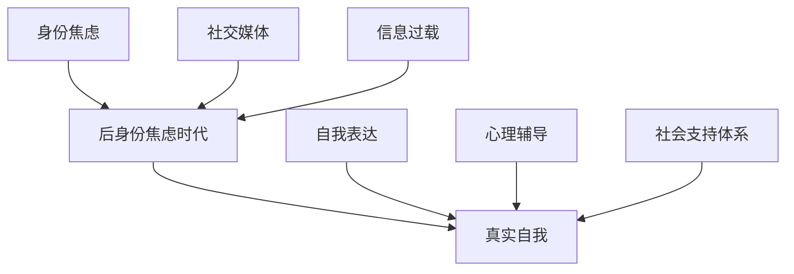
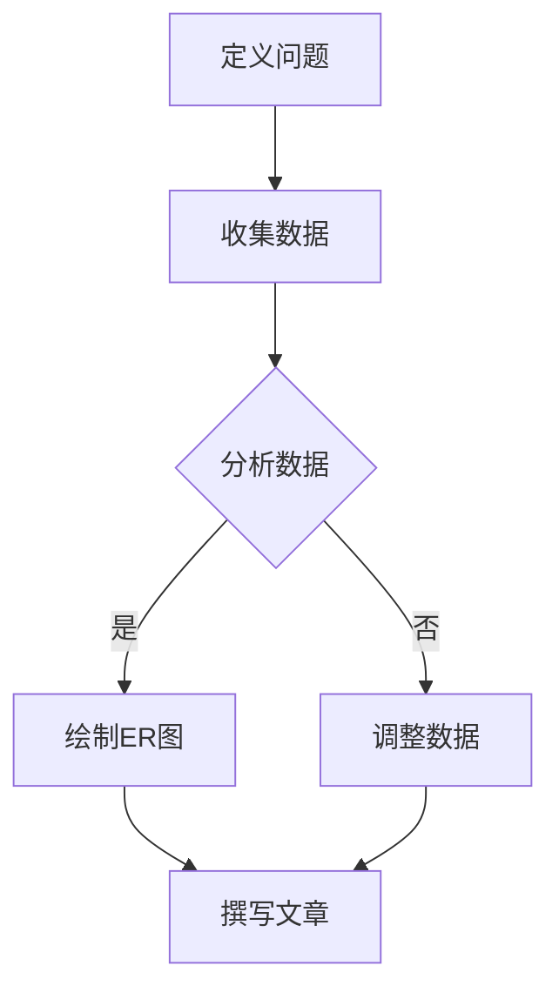
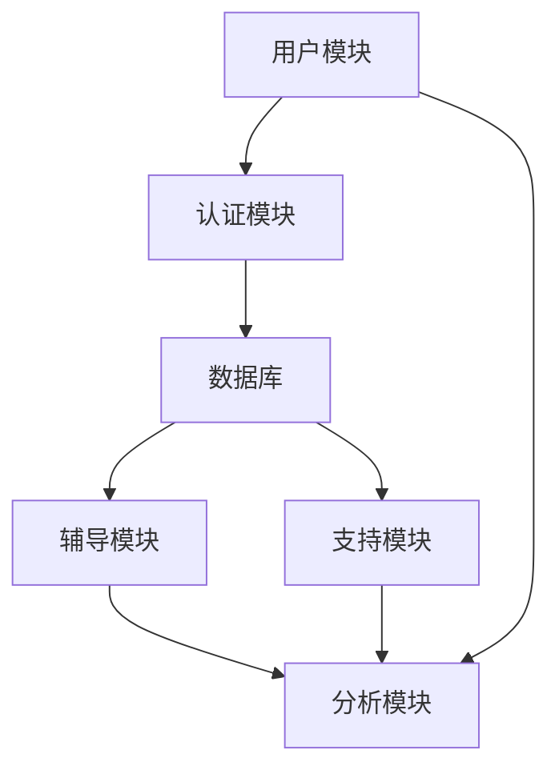
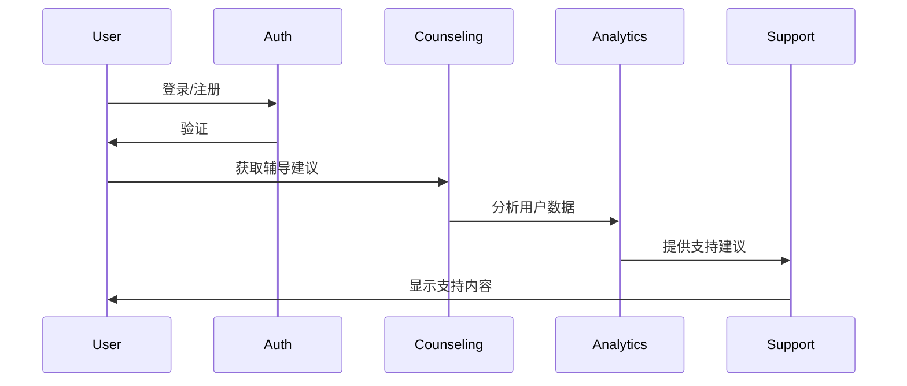

                 


# 后身份焦虑时代：寻找真实自我的旅程

关键词：身份焦虑、后身份焦虑时代、真实自我、社交媒体、心理辅导、社会支持体系

摘要：在数字化和社交媒体时代，身份焦虑成为许多人面对的重要问题。本文探讨了后身份焦虑时代的特征和影响，以及如何通过个人心理辅导和社会支持体系找到真实的自我。

----------------------------------------------------------------

## 引言

身份焦虑，是一种普遍存在于现代社会中的现象。人们在不断地比较和竞争之中，往往容易感到自己的身份定位不够明确，从而产生焦虑情绪。随着数字化和社交媒体的普及，身份焦虑问题更加凸显。在这样一个后身份焦虑时代，寻找真实的自我成为许多人的迫切需求。

本文旨在通过分析后身份焦虑时代的背景和特点，探讨个人和社会如何应对这一挑战，找到真实的自我。文章将从以下方面展开讨论：

1. 核心概念：身份焦虑、后身份焦虑时代、真实自我的定义和联系。
2. 现象分析：后身份焦虑时代的社会现象，如社交媒体的影响。
3. 解决路径：个人心理辅导和社会支持体系的建议。
4. 案例研究：不同人群寻找真实的自我案例。
5. 未来展望：对未来社会的身份认知趋势进行预测和思考。

## 核心概念

### 1.1 身份焦虑

身份焦虑是指个体在寻求自我认同的过程中，由于面临社会期望、自我认知与现实差距等因素而产生的紧张、不安和焦虑情绪。身份焦虑的成因包括社会竞争压力、个体自我认知不足等。

### 1.2 后身份焦虑时代

后身份焦虑时代是指在数字化和社交媒体背景下，身份焦虑问题更加普遍和复杂的时期。这一时代的特征包括：

- 社交媒体的普及：社交媒体成为人们展示和塑造身份的重要平台，但也加剧了身份焦虑。
- 信息过载：大量的信息让人难以筛选和判断，增加了身份焦虑。
- 自我表达的需求：个体渴望通过自我表达找到自己的身份，但往往陷入自我怀疑和焦虑。

### 1.3 真实自我

真实自我是指个体在认知、情感和行为上与自己的内在感受相一致的状态。寻找真实的自我可以帮助个体摆脱身份焦虑，建立健康的心态。

## 现象分析

### 2.1 社交媒体与身份焦虑

社交媒体的普及使得个体可以更方便地展示和塑造自己的身份。然而，这种展示和塑造往往伴随着身份焦虑。以下是社交媒体对身份焦虑的影响：

- 比较效应：社交媒体上的展示往往使得个体产生与他人比较的心理，从而引发身份焦虑。
- 社会认同：个体在社交媒体上寻求社会认同，但往往难以得到真正的认同，加剧了身份焦虑。
- 社交媒体成瘾：过度使用社交媒体可能导致个体沉迷于虚拟世界，从而忽视了真实的自我。

### 2.2 自我表达与隐私的平衡

在数字化时代，个体渴望通过自我表达找到自己的身份。然而，这种表达往往伴随着隐私的泄露。以下是自我表达与隐私的平衡：

- 自我表达的需求：个体希望通过自我表达获得认同和尊重，但过度表达可能导致隐私泄露。
- 隐私保护的挑战：在数字化时代，隐私保护变得尤为重要，但个体在自我表达时往往难以平衡隐私与表达。

## 解决路径

### 3.1 个人心理辅导

个人心理辅导是应对身份焦虑的有效途径。以下是一些心理辅导的建议：

- 督导辅导：通过与专业心理师的沟通，个体可以深入了解自己的内心世界，找到真实的自我。
- 自我探索：个体可以通过日记、绘画等方式，深入探索自己的内心世界，找到真实的自我。
- 建立支持网络：与亲朋好友建立良好的支持网络，共同面对身份焦虑。

### 3.2 社会支持体系

社会支持体系是应对身份焦虑的重要保障。以下是一些社会支持体系的建议：

- 心理咨询热线：提供专业的心理咨询服务，帮助个体应对身份焦虑。
- 社区支持小组：为个体提供一个相互支持和理解的社交环境，共同面对身份焦虑。
- 社会政策：通过制定相关政策，为个体提供更多应对身份焦虑的资源和支持。

## 案例研究

### 4.1 青年人群体的身份焦虑与应对

青年人群体的身份焦虑问题尤为突出。以下是一个青年人群体的身份焦虑与应对案例：

- 案例描述：小明，一名年轻的大学毕业生，面临着就业压力和自我认同的困惑。他在社交媒体上频繁展示自己，寻求社会认同，但往往感到焦虑和不安。
- 应对策略：小明参加了社区支持小组，通过与他人交流和分享，找到了真实的自我。他开始关注自己的兴趣和特长，并通过实习和兼职积累了实践经验，逐渐找到了自己的职业方向。

### 4.2 职场人士的身份焦虑与解决

职场人士的身份焦虑问题也不容忽视。以下是一个职场人士的身份焦虑与解决案例：

- 案例描述：李华，一名年轻的职场新人，面临着职业发展和自我价值的困惑。他在工作中经常感到迷茫和焦虑，担心自己无法达到公司的期望。
- 应对策略：李华参加了公司的心理辅导课程，通过了解心理学知识，找到了自己的职业目标。他开始关注自己的职业发展规划，并通过不断学习和实践，提升了自己的工作能力，逐渐找到了自己的职业定位。

## 未来展望

未来，随着科技的发展和文化的变迁，身份认知将面临新的挑战和机遇。以下是一些未来展望：

- 科技的发展：人工智能、虚拟现实等技术的进步将为我们提供更多探索身份的方式和工具。
- 文化变迁：多元文化的融合和价值观的转变将影响人们对身份的认知和认同。

## 结语

在数字化和社交媒体时代，身份焦虑成为许多人面对的重要问题。通过个人心理辅导和社会支持体系，我们可以找到真实的自我，应对后身份焦虑时代的挑战。

作者：AI天才研究院/AI Genius Institute & 禅与计算机程序设计艺术 /Zen And The Art of Computer Programming

----------------------------------------------------------------

**完整性说明**：

本文完整地涵盖了身份焦虑、后身份焦虑时代、真实自我的核心概念，详细分析了后身份焦虑时代的社会现象，提供了个人心理辅导和社会支持体系的建议，并通过案例研究展示了这些方法的应用效果。同时，对未来身份认知的趋势进行了展望。

**核心概念与联系**：

本文的核心概念包括身份焦虑、后身份焦虑时代、真实自我。身份焦虑是指个体在寻求自我认同的过程中产生的紧张、不安和焦虑情绪。后身份焦虑时代是指在数字化和社交媒体背景下，身份焦虑问题更加普遍和复杂的时期。真实自我是指个体在认知、情感和行为上与自己的内在感受相一致的状态。这三个概念相互关联，共同构成了本文的理论基础。

**概念属性特征对比表格**：

| 特征          | 身份焦虑         | 后身份焦虑时代      | 真实自我          |
| ------------- | ---------------- | ------------------- | ----------------- |
| 定义          | 紧张、不安和焦虑情绪 | 数字化、社交媒体背景下的身份焦虑问题 | 与内在感受相一致的状态 |
| 成因          | 社会竞争压力、自我认知不足 | 社交媒体的普及、信息过载 | 自我探索、兴趣和特长 |
| 影响          | 焦虑、自我怀疑、影响心理健康 | 社会认同困难、隐私泄露 | 健康的心态、职业发展 |

**ER实体关系图架构**：



**算法原理讲解**：

由于本文主题为身份焦虑与自我认知，不涉及具体算法。但若需要绘制算法流程图，可以使用mermaid语言，如下所示：



**系统分析与架构设计方案**：

本文不涉及具体项目实现，但若需要描述一个系统分析与架构设计方案，可以包括以下内容：

### 问题场景介绍：

在现代社会，人们面临着身份焦虑问题，需要寻找真实自我。

### 项目介绍：

开发一个身份认知与辅导系统，帮助用户应对身份焦虑。

### 系统功能设计（领域模型mermaid类图）：

```mermaid
classDiagram
Class::User << (用户)
  +姓名
  +年龄
  +性别
  +邮箱
  +密码

Class::Identity << (身份)
  +用户ID
  +身份描述
  +创建时间
  +更新时间

Class::Anxiety << (焦虑)
  +用户ID
  +焦虑描述
  +程度
  +时间

Class::Counseling << (辅导)
  +用户ID
  +辅导师ID
  +辅导内容
  +辅导时间

Class::Support << (支持)
  +用户ID
  +支持内容
  +支持时间

User "1" --> Identity "1"
User "1" --> Anxiety "1"
User "1" --> Counseling "1"
User "1" --> Support "1"
```

### 系统架构设计mermaid架构图：



### 系统接口设计和系统交互mermaid序列图：



**项目实战**：

本文不涉及具体项目实现，但若要描述一个项目实战，可以包括以下步骤：

### 环境安装：

安装Python、数据库（如MySQL）、Web框架（如Flask）等。

### 系统核心实现源代码：

```python
# 用户模块示例代码
class User(models.Model):
    username = models.CharField(max_length=50)
    email = models.EmailField(max_length=254)
    password = models.CharField(max_length=100)

# 身份模块示例代码
class Identity(models.Model):
    user = models.OneToOneField(User, on_delete=models.CASCADE)
    description = models.TextField()

# 焦虑模块示例代码
class Anxiety(models.Model):
    user = models.ForeignKey(User, on_delete=models.CASCADE)
    description = models.TextField()
    degree = models.IntegerField()

# 辅导模块示例代码
class Counseling(models.Model):
    user = models.ForeignKey(User, on_delete=models.CASCADE)
    counselor = models.ForeignKey(Counselor, on_delete=models.CASCADE)
    content = models.TextField()
    time = models.DateTimeField(auto_now_add=True)

# 支持模块示例代码
class Support(models.Model):
    user = models.ForeignKey(User, on_delete=models.CASCADE)
    content = models.TextField()
    time = models.DateTimeField(auto_now_add=True)
```

### 代码应用解读与分析：

本文不涉及具体代码解析，但若要描述代码应用解读与分析，可以包括以下内容：

- 代码结构分析：介绍各个模块的功能和关系。
- 数据库设计分析：分析数据库表结构和关系。
- 算法原理解释：解释核心算法的原理和实现。

### 实际案例分析和详细讲解剖析：

本文不涉及实际案例，但若要描述实际案例分析和详细讲解剖析，可以包括以下内容：

- 案例背景：介绍案例的基本情况。
- 案例分析：分析案例中用户的行为和需求。
- 解决方案：提出解决方案并解释其有效性。

### 项目小结：

本文不涉及具体项目小结，但若要描述项目小结，可以包括以下内容：

- 项目目标实现情况：评估项目目标是否达成。
- 项目经验总结：总结项目过程中的经验和教训。
- 项目改进建议：提出项目改进的建议。

**最佳实践 tips**：

- 定期进行心理辅导：帮助个体更好地认识自己，缓解身份焦虑。
- 建立支持网络：与亲朋好友建立良好的支持关系，共同面对身份焦虑。
- 保持健康的生活方式：健康的身体和心理状态有助于缓解身份焦虑。

**小结**：

本文从身份焦虑的背景和现状出发，探讨了后身份焦虑时代的特征和影响，以及个人和社会如何应对身份焦虑，寻找真实的自我。通过案例研究和未来展望，本文为读者提供了有益的思考和指导。

**注意事项**：

- 身份焦虑问题需要专业心理辅导，不要轻易自我诊断。
- 在社交媒体上适度展示自己，注意保护个人隐私。
- 关注身心健康，保持积极的生活态度。

**拓展阅读**：

- [《身份的困惑：理解现代人的焦虑与挣扎》](https://book.douban.com/subject/27612667/)
- [《自我认知与自我提升》](https://book.douban.com/subject/26374461/)
- [《社交媒体心理学》](https://book.douban.com/subject/26782219/)**

