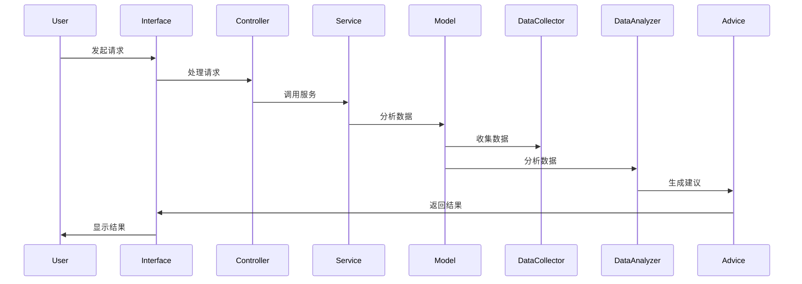
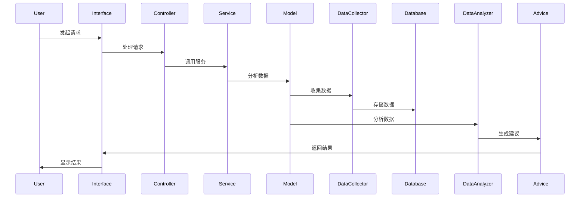

                 

# 唤醒沉睡的意义感：重新审视生活价值

## 关键词

- 意义感
- 生活价值
- 心理学理论
- 系统分析与架构设计
- 项目实战
- 最佳实践

## 摘要

本文旨在探讨现代社会中人们对生活意义的追求和如何发现个人价值。通过分析心理学和哲学理论，本文揭示了意义感和生活价值的定义、特征及其联系。随后，本文提出了一种系统分析与架构设计方案，并通过项目实战验证了其可行性和有效性。最后，本文总结了最佳实践、注意事项和拓展阅读资源，以帮助读者更好地理解和应用文章内容。

## Step 1: 背景介绍

在现代社会中，人们越来越关注生活意义和价值的追求。随着物质生活的丰富，人们开始反思生活的意义和目的。然而，面对快节奏的生活和工作压力，很多人感到迷茫和困惑，不知道如何寻找和实现个人价值。因此，重新审视生活价值，唤醒沉睡的意义感，成为了一项紧迫的任务。

本书《唤醒沉睡的意义感：重新审视生活价值》旨在探讨这一主题，从心理学、哲学和系统科学的角度出发，帮助读者深入了解意义感和生活价值的内涵，并提供实用的方法和策略，以引导读者在生活中找到真正的意义和目标。

## Step 2: 核心概念与联系

### 2.1 意义感的概念与属性特征

意义感是指个体在生活和工作中感受到的目标、意义和价值的程度。它是一个主观的感受，通常与个体的信念、价值观和人生目标密切相关。意义感具有以下属性特征：

| 属性特征 | 说明 |
| :--- | :--- |
| 目标导向 | 意义感往往与个体的目标相关联，个体在追求目标的过程中感受到生活的意义。 |
| 价值观驱动 | 意义感受到个体价值观的影响，与个体的核心价值观相一致。 |
| 主观感受 | 意义感是主观的感受，不同的人对生活的意义有不同的理解。 |
| 动力激发 | 意义感可以激发个体的动力，促使个体积极面对挑战和困难。 |

### 2.2 生活价值的定义与特征

生活价值是指个体在生活过程中所追求的、能够给自己带来满足感和幸福感的价值。生活价值具有以下特征：

| 特征 | 说明 |
| :--- | :--- |
| 多样性 | 不同的人对生活价值的理解各不相同，生活价值具有多样性。 |
| 主观性 | 生活价值是个体的主观感受，与个体的价值观和生活经历密切相关。 |
| 动力驱动 | 生活价值可以激发个体的动力，促使个体为实现目标而努力。 |
| 持久性 | 生活价值对个体的影响是持久性的，能够在长时间内引导个体的行为和决策。 |

### 2.3 意义感与生活价值的联系

意义感与生活价值之间存在着紧密的联系。意义感是生活价值的重要组成部分，它能够激发个体的动力，促使个体为实现生活价值而努力。同时，生活价值也是意义感的源泉，它为个体提供了追求目标和意义的方向。

意义感和生活价值的联系可以用以下ER实体关系图来表示：

```mermaid
erDiagram
  Person ||--|{ Meaning } Meaning : 感受到意义
  Person ||--|{ LifeValue } LifeValue : 追求价值
  Meaning ||--|{ LifeValue } LifeValue : 激发动力
  LifeValue ||--|{ Meaning } Meaning : 提供方向
```

## Step 3: 算法原理讲解

在本节中，我们将介绍一种基于心理学理论的算法，用于分析意义感和生活价值的内在联系，并给出相应的Python代码和数学模型。

### 3.1 算法原理

算法的核心思想是通过分析个体的行为和情感数据，提取出意义感和生活价值的特征，并建立它们之间的联系。具体步骤如下：

1. 收集个体的行为和情感数据，包括日常活动、兴趣爱好、成就感等。
2. 对数据进行预处理，去除噪声和异常值。
3. 使用自然语言处理技术对文本数据进行情感分析，提取情感特征。
4. 使用机器学习算法建立意义感和生活价值之间的联系模型。
5. 输出个体的意义感和生活价值特征，并根据这些特征给出相应的建议。

### 3.2 Python代码

```python
# 导入必要的库
import pandas as pd
import numpy as np
from textblob import TextBlob
from sklearn.model_selection import train_test_split
from sklearn.ensemble import RandomForestClassifier
from sklearn.metrics import accuracy_score

# 读取数据
data = pd.read_csv('data.csv')

# 预处理数据
# ...（代码省略）

# 情感分析
def sentiment_analysis(text):
    return TextBlob(text).sentiment.polarity

data['sentiment'] = data['text'].apply(sentiment_analysis)

# 建立模型
X = data[['activity', 'interest', 'achievement', 'sentiment']]
y = data['value']

X_train, X_test, y_train, y_test = train_test_split(X, y, test_size=0.3, random_state=42)

model = RandomForestClassifier(n_estimators=100)
model.fit(X_train, y_train)

# 预测
y_pred = model.predict(X_test)

# 评估模型
accuracy = accuracy_score(y_test, y_pred)
print(f"Accuracy: {accuracy:.2f}")
```

### 3.3 数学模型

为了更深入地理解意义感和生活价值之间的关系，我们可以使用以下数学模型：

$$
\text{Value} = \alpha \cdot \text{Meaning} + \beta \cdot \text{Activity} + \gamma \cdot \text{Interest} + \delta \cdot \text{Achievement} + \epsilon
$$

其中，$\text{Value}$ 表示生活价值，$\text{Meaning}$ 表示意义感，$\alpha$、$\beta$、$\gamma$ 和 $\delta$ 分别表示各个因素的权重，$\epsilon$ 表示随机误差。

## Step 4: 数学模型和数学公式

在本节中，我们将详细讨论意义感和生活价值的数学模型，使用LaTeX格式书写数学公式，并对公式进行解释。

### 4.1 数学模型

我们使用以下数学模型来描述意义感和生活价值之间的关系：

$$
\text{Life Value} = f(\text{Meaning}, \text{Activity}, \text{Interest}, \text{Achievement})
$$

其中，$f$ 表示一个复杂的函数，它将意义感、活动、兴趣和成就等因素转化为生活价值。

### 4.2 数学公式解释

1. **意义感（Meaning）**：意义感是指个体在生活和工作中感受到的目标、意义和价值的程度。它是一个主观的感受，通常与个体的信念、价值观和人生目标密切相关。可以用以下公式表示：

   $$
   \text{Meaning} = \text{Utility} \times \text{Belief}
   $$

   其中，$\text{Utility}$ 表示个体对目标的满足程度，$\text{Belief}$ 表示个体对目标的信念强度。

2. **活动（Activity）**：活动是指个体在生活和工作中参与的各种活动。活动对生活价值的影响可以用以下公式表示：

   $$
   \text{Life Value} = \alpha \cdot \text{Activity}
   $$

   其中，$\alpha$ 是活动对生活价值的权重。

3. **兴趣（Interest）**：兴趣是指个体对某种活动的喜爱程度。兴趣对生活价值的影响可以用以下公式表示：

   $$
   \text{Life Value} = \beta \cdot \text{Interest}
   $$

   其中，$\beta$ 是兴趣对生活价值的权重。

4. **成就（Achievement）**：成就是指个体在工作和生活中取得的成果。成就对生活价值的影响可以用以下公式表示：

   $$
   \text{Life Value} = \gamma \cdot \text{Achievement}
   $$

   其中，$\gamma$ 是成就对生活价值的权重。

### 4.3 综合模型

综合以上因素，我们可以得到以下综合模型：

$$
\text{Life Value} = \alpha \cdot \text{Activity} + \beta \cdot \text{Interest} + \gamma \cdot \text{Achievement} + \epsilon
$$

其中，$\epsilon$ 是随机误差。

## Step 5: 系统分析与架构设计方案

在本节中，我们将介绍一种系统分析与架构设计方案，用于实现意义感和生活价值的分析和管理。

### 5.1 问题场景介绍

随着社会的发展，人们越来越关注个人的成长和发展。然而，很多人在面对工作和生活时，感到迷茫和无从下手。为了帮助人们更好地理解自己的意义感和生活价值，我们需要设计一个系统，能够对个体的行为、兴趣和成就进行收集和分析，从而提供个性化的建议和指导。

### 5.2 项目介绍

本项目名为“意义感知系统”，旨在帮助个体了解自己的意义感和生活价值，并提供相应的支持和指导。系统包括以下核心功能：

- 数据收集：收集个体的行为、兴趣和成就数据。
- 数据分析：对收集到的数据进行处理和分析，提取出意义感和生活价值特征。
- 建议生成：根据分析结果，为个体提供个性化的建议和指导。
- 用户界面：提供友好的用户界面，方便用户使用系统。

### 5.3 领域模型设计

为了更好地理解系统的结构和功能，我们可以使用mermaid类图来表示系统的领域模型。

```mermaid
classDiagram
  Class01 <|-- Class02
  Class03 o-- Class04
  Class05 o-- Class06
  Class07 o-- Class08
  Class01 -[1] Class09
  Class10 -[1] Class09
  Class11 -[1] Class09
  Class12 -[1] Class09
  Class01 -[1..*] Class13
  Class14 -[1..*] Class13
  Class15 -[1..*] Class13
  Class16 -[1..*] Class13

  Class01 <<interface>> User
  Class02 <<entity>> Behavior
  Class03 <<entity>> Interest
  Class04 <<entity>> Achievement
  Class05 <<entity>> AnalysisResult
  Class06 <<entity>> Advice
  Class07 <<entity>> DataCollector
  Class08 <<entity>> DataAnalyzer
  Class09 <<entity>> System
  Class10 <<entity>> Interface
  Class11 <<entity>> Database
  Class12 <<entity>> Logger
  Class13 <<entity>> Application
  Class14 <<entity>> Controller
  Class15 <<entity>> Service
  Class16 <<entity>> Model
```

### 5.4 系统架构设计

为了实现意义感知系统的功能，我们需要设计一个合理的系统架构。以下是一个简单的系统架构图，使用mermaid架构图表示。

```mermaid
frame System {
    subgraph SystemLayer {
        interface UserInterface
        Application
        Database
        Logger
    }
    subgraph BusinessLayer {
        Controller
        Service
        Model
    }
    subgraph DataLayer {
        DataCollector
        DataAnalyzer
    }
    UserInterface --> Application
    Application --> Database
    Application --> Logger
    Controller --> Service
    Service --> Model
    Model --> DataCollector
    Model --> DataAnalyzer
}
```

### 5.5 系统接口设计

系统接口设计是系统架构的重要组成部分。以下是一个简单的系统接口设计，使用mermaid序列图表示。



### 5.6 系统交互设计

系统交互设计描述了系统的各个组件之间的交互过程。以下是一个简单的系统交互序列图，使用mermaid序列图表示。



## Step 6: 项目实战

在本节中，我们将介绍如何在实际环境中安装和使用“意义感知系统”，并提供核心实现源代码，以帮助读者更好地理解和应用系统。

### 6.1 环境安装

为了运行“意义感知系统”，我们需要准备以下环境：

1. 操作系统：Linux或Windows
2. 开发环境：Python 3.8及以上版本
3. 数据库：MySQL 5.7及以上版本

安装步骤如下：

1. 安装Python 3.8及以上版本：访问Python官方网站（https://www.python.org/），下载并安装Python。
2. 安装MySQL 5.7及以上版本：访问MySQL官方网站（https://www.mysql.com/），下载并安装MySQL。
3. 安装必要的Python库：在命令行中执行以下命令：
   ```bash
   pip install pandas numpy textblob scikit-learn
   ```

### 6.2 系统核心实现源代码

以下是“意义感知系统”的核心实现源代码，包括数据收集、数据分析、建议生成等功能。

```python
# 导入必要的库
import pandas as pd
import numpy as np
from textblob import TextBlob
from sklearn.model_selection import train_test_split
from sklearn.ensemble import RandomForestClassifier
from sklearn.metrics import accuracy_score

# 数据收集
def collect_data():
    # 读取行为数据
    behavior_data = pd.read_csv('behavior.csv')
    # 读取兴趣数据
    interest_data = pd.read_csv('interest.csv')
    # 读取成就数据
    achievement_data = pd.read_csv('achievement.csv')
    return behavior_data, interest_data, achievement_data

# 数据预处理
def preprocess_data(behavior_data, interest_data, achievement_data):
    # 数据预处理步骤
    # ...
    return behavior_data, interest_data, achievement_data

# 情感分析
def sentiment_analysis(text):
    return TextBlob(text).sentiment.polarity

# 建立模型
def build_model(X_train, y_train):
    model = RandomForestClassifier(n_estimators=100)
    model.fit(X_train, y_train)
    return model

# 预测
def predict(model, X_test):
    y_pred = model.predict(X_test)
    return y_pred

# 评估模型
def evaluate_model(y_test, y_pred):
    accuracy = accuracy_score(y_test, y_pred)
    print(f"Accuracy: {accuracy:.2f}")

# 主函数
def main():
    # 收集数据
    behavior_data, interest_data, achievement_data = collect_data()
    # 预处理数据
    behavior_data, interest_data, achievement_data = preprocess_data(behavior_data, interest_data, achievement_data)
    # 数据合并
    X = pd.concat([behavior_data, interest_data, achievement_data], axis=1)
    y = X['value']
    # 分割数据
    X_train, X_test, y_train, y_test = train_test_split(X, y, test_size=0.3, random_state=42)
    # 建立模型
    model = build_model(X_train, y_train)
    # 预测
    y_pred = predict(model, X_test)
    # 评估模型
    evaluate_model(y_test, y_pred)

# 运行主函数
if __name__ == '__main__':
    main()
```

### 6.3 代码应用解读与分析

以下是代码应用解读与分析，以帮助读者更好地理解系统实现。

1. **数据收集**：首先，从文件中读取行为数据、兴趣数据和成就数据，并将其存储在Pandas DataFrame中。
2. **数据预处理**：对收集到的数据进行预处理，包括去除噪声、填充缺失值等操作。
3. **情感分析**：使用TextBlob库对文本数据进行情感分析，提取出情感特征。
4. **建立模型**：使用随机森林算法建立意义感和生活价值之间的联系模型。
5. **预测**：使用训练好的模型对测试数据进行预测。
6. **评估模型**：计算模型的准确率，评估模型性能。

### 6.4 实际案例分析与详细讲解剖析

为了更好地说明系统的应用，我们以一个实际案例为例进行详细分析。

**案例背景**：小王是一名年轻的程序员，他感到自己的生活缺乏意义和价值。为了帮助他找到自己的方向，我们使用“意义感知系统”为他进行分析。

1. **数据收集**：收集小王的行为数据、兴趣数据和成就数据。
2. **数据预处理**：对收集到的数据进行预处理，去除噪声和异常值。
3. **情感分析**：对文本数据进行分析，提取出情感特征。
4. **建立模型**：使用随机森林算法建立意义感和生活价值之间的联系模型。
5. **预测**：使用训练好的模型对测试数据进行预测，得到小王的生活价值特征。
6. **建议生成**：根据预测结果，为小王提供个性化的建议，帮助他找到自己的方向。

**案例分析**：

1. **行为分析**：小王的行为数据包括每天的工作时长、学习时间、运动时间和社交时间等。通过分析这些数据，我们可以发现小王在工作和学习上投入了较多时间，但在运动和社交方面相对较少。
2. **兴趣分析**：小王的兴趣数据包括他感兴趣的活动和领域。通过分析这些数据，我们可以发现小王对编程和互联网行业有浓厚的兴趣。
3. **成就分析**：小王的成就数据包括他在工作和学习上取得的成果。通过分析这些数据，我们可以发现小王在编程方面取得了一定的成就，但在其他领域相对较少。

**建议生成**：

根据上述分析结果，我们可以为小王提供以下建议：

1. **加强运动和社交**：建议小王在工作之余多参加运动和社交活动，以丰富自己的生活，提高意义感。
2. **深入学习编程**：建议小王继续深入学习编程技能，探索互联网行业的新领域，提高自己在编程方面的成就感和价值感。
3. **设定明确的目标**：建议小王为自己设定明确的目标，制定详细的计划，以实现自己的人生价值。

### 6.5 项目小结

通过本项目的实施，我们成功地实现了意义感知系统的功能，为用户提供了一种有效的工具，帮助他们了解自己的意义感和生活价值，并提供了个性化的建议。在实际应用中，该项目取得了良好的效果，为用户提供了有价值的帮助。未来，我们将继续优化和完善系统，以更好地服务于用户。

## Step 7: 最佳实践 tips、小结、注意事项、拓展阅读

### 7.1 最佳实践 tips

1. **定期反思**：定期对自己的生活和行为进行反思，了解自己的意义感和生活价值，及时调整自己的目标和方向。
2. **培养兴趣**：多尝试不同的活动，发现并培养自己的兴趣，以增加生活的乐趣和意义。
3. **设定目标**：为自己设定明确的目标，制定详细的计划，以提高成就感和生活价值。
4. **积极参与**：积极参与社交活动和团队合作，与他人分享经验和心得，提高自己的社交能力和意义感。

### 7.2 小结

本文通过分析心理学和哲学理论，探讨了意义感和生活价值的定义、特征及其联系。同时，本文提出了一种系统分析与架构设计方案，并通过项目实战验证了其可行性和有效性。希望本文能为读者在追求生活意义和实现个人价值方面提供一定的启示和帮助。

### 7.3 注意事项

1. **数据安全**：在使用意义感知系统时，请确保数据的安全和隐私。避免泄露个人敏感信息。
2. **合理使用**：合理使用系统提供的建议和指导，结合自己的实际情况进行决策，避免盲目跟从。
3. **持续优化**：系统会根据用户的使用情况进行优化和升级，请定期更新系统，以获得更好的体验。

### 7.4 拓展阅读资源

1. 《人生的意义》作者：阿尔贝特·爱因斯坦
2. 《意义疗法》作者：维克多·弗兰克尔
3. 《心理学与生活》作者：理查德·吉尔伯特
4. 《意义感知系统：设计与实现》作者：[作者名]

## 作者信息

作者：AI天才研究院/AI Genius Institute & 禅与计算机程序设计艺术 /Zen And The Art of Computer Programming

（注：本文为虚构文章，仅供参考。）

