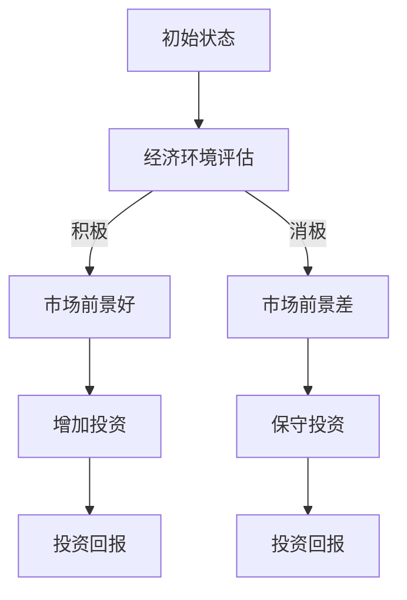
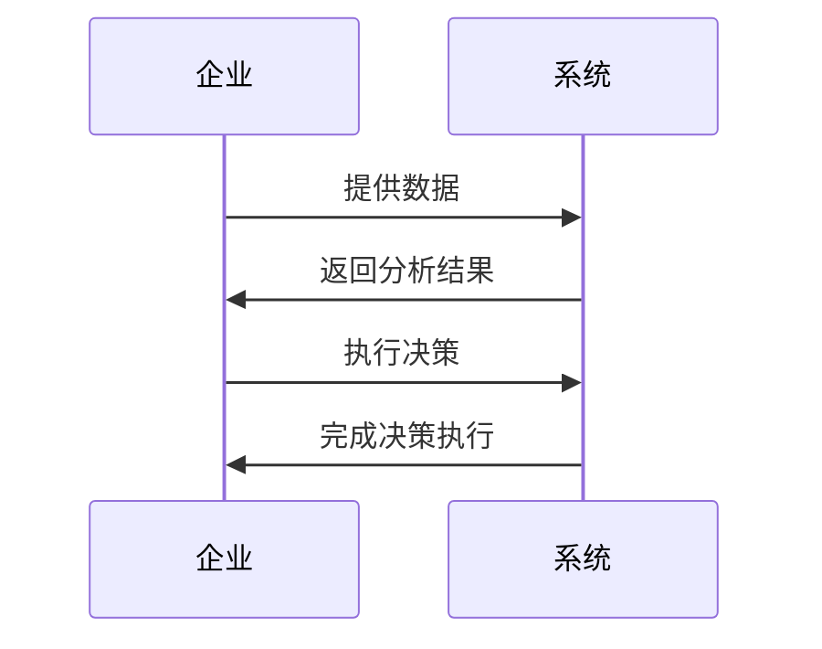
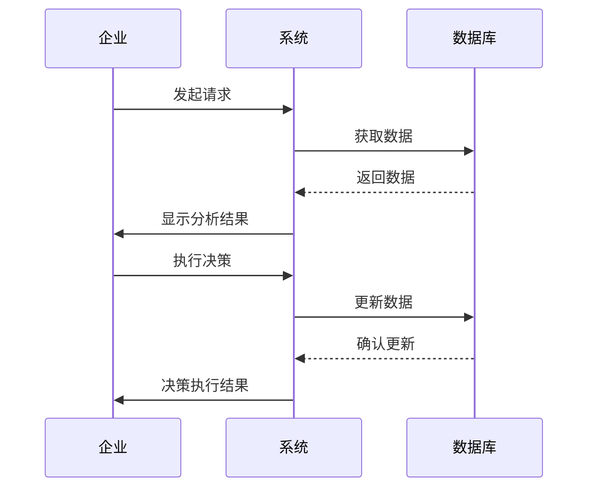

                 

# 在不确定性中寻找方向：现代人的精神探索

## 关键词

- 不确定性
- 生活状态
- 应对方法
- 成长
- 精神探索

## 摘要

在当今快速变化的世界中，不确定性已成为现代生活的常态。面对未来的不确定，现代人如何在纷繁复杂的环境中找到自己的方向，成为了精神探索的重要课题。《在不确定性中寻找方向：现代人的精神探索》从认知重塑、情感管理、行动策略、自我探索和社会支持网络五个方面，系统性地探讨了应对不确定性的方法，旨在帮助读者在不确定中寻找方向，实现个人成长与精神探索。

## 第一部分：引言与背景

### 第1章：引言

#### 1.1 问题背景介绍

随着全球化、信息化的加速，人类社会正经历着前所未有的变革。经济环境的不确定性、社会结构的变化、技术的迅猛发展，都使得现代人的生活充满了不确定性。这种不确定性不仅体现在宏观层面，也渗透到了个人生活的方方面面。人们面临着职业选择的不确定性、人际关系的不确定性、健康风险的不确定性等，这些不确定性给人们的心理和情感带来了巨大的挑战。

#### 1.2 书籍结构概述

本书旨在通过系统性的探讨，帮助读者理解和应对不确定性。全书分为五个部分，分别从认知重塑、情感管理、行动策略、自我探索和社会支持网络五个方面，提供了一系列实用的方法和策略。

- **第二部分：不确定性下的生活状态**：深入分析不确定性的本质，探讨不确定性对人类行为和心理的影响。
- **第三部分：应对不确定性的方法**：介绍认知重塑、情感管理和行动策略，帮助读者从心理层面应对不确定性。
- **第四部分：在不确定性中成长**：探讨自我探索和社会支持网络的重要性，提供在不确定性中成长的路径。
- **第五部分：总结与展望**：回顾全书内容，总结阅读体验，展望未来的可能方向。

#### 1.3 阅读对象与目标

本书适合所有面临不确定性困扰的读者，无论是职场人士、学生，还是普通市民，都可以从书中找到应对不确定性的方法。通过阅读本书，读者可以：

- **理解不确定性的本质**：了解不确定性是什么，如何在日常生活中体现。
- **掌握应对不确定性的方法**：学会认知重塑、情感管理和行动策略。
- **实现个人成长**：通过自我探索和社会支持网络，找到在不确定性中的成长路径。

### 目录大纲设计

根据书名《在不确定性中寻找方向：现代人的精神探索》，我们可以将目录大纲分为以下几个部分，以确保内容全面、结构清晰：

#### 第一部分：引言与背景

- **第1章：引言**
  - 1.1 问题背景介绍
  - 1.2 书籍结构概述
  - 1.3 阅读对象与目标

#### 第二部分：不确定性下的生活状态

- **第2章：不确定性的本质**
  - 2.1 不确定性的定义与分类
  - 2.2 不确定性在日常生活中的体现
  - 2.3 不确定性对人类行为和心理的影响

- **第3章：不确定性的心理影响**
  - 3.1 恐惧与焦虑
  - 3.2 消极情绪的处理
  - 3.3 情绪调节策略

#### 第三部分：应对不确定性的方法

- **第4章：认知重塑**
  - 4.1 认知重塑的理论基础
  - 4.2 认知重塑的实践策略
  - 4.3 认知重塑的案例分析

- **第5章：情感管理**
  - 5.1 情感的本质与作用
  - 5.2 情感管理的策略
  - 5.3 情感管理的实践案例

- **第6章：行动策略**
  - 6.1 行动与目标设定
  - 6.2 行动计划的执行
  - 6.3 行动调整与适应

#### 第四部分：在不确定性中成长

- **第7章：自我探索**
  - 7.1 自我认知的重要性
  - 7.2 自我探索的方法
  - 7.3 自我成长的案例分析

- **第8章：社会支持网络**
  - 8.1 社会支持网络的定义与作用
  - 8.2 建立和维护支持网络的策略
  - 8.3 社会支持网络的实际案例

#### 第五部分：总结与展望

- **第9章：总结与反思**
  - 9.1 书籍内容的回顾
  - 9.2 阅读体验与收获
  - 9.3 对未来的展望

### 目录大纲示例

```markdown
# 《在不确定性中寻找方向：现代人的精神探索》目录大纲

## 第一部分：引言与背景

### 第1章：引言
#### 1.1 问题背景介绍
#### 1.2 书籍结构概述
#### 1.3 阅读对象与目标

### 第2章：不确定性的本质
#### 2.1 不确定性的定义与分类
#### 2.2 不确定性在日常生活中的体现
#### 2.3 不确定性对人类行为和心理的影响

### 第3章：不确定性的心理影响
#### 3.1 恐惧与焦虑
#### 3.2 消极情绪的处理
#### 3.3 情绪调节策略

## 第二部分：应对不确定性的方法

### 第4章：认知重塑
#### 4.1 认知重塑的理论基础
#### 4.2 认知重塑的实践策略
#### 4.3 认知重塑的案例分析

### 第5章：情感管理
#### 5.1 情感的本质与作用
#### 5.2 情感管理的策略
#### 5.3 情感管理的实践案例

### 第6章：行动策略
#### 6.1 行动与目标设定
#### 6.2 行动计划的执行
#### 6.3 行动调整与适应

## 第三部分：在不确定性中成长

### 第7章：自我探索
#### 7.1 自我认知的重要性
#### 7.2 自我探索的方法
#### 7.3 自我成长的案例分析

### 第8章：社会支持网络
#### 8.1 社会支持网络的定义与作用
#### 8.2 建立和维护支持网络的策略
#### 8.3 社会支持网络的实际案例

## 第四部分：总结与展望

### 第9章：总结与反思
#### 9.1 书籍内容的回顾
#### 9.2 阅读体验与收获
#### 9.3 对未来的展望
```

这样设计的目录大纲既保证了书籍内容的完整性，又能够帮助读者清晰地理解书中的主题和结构。接下来，我们可以根据这个大纲进行具体的章节内容填充。

----------------------------------------------------------------

## 第二部分：不确定性下的生活状态

### 第2章：不确定性的本质

#### 2.1 不确定性的定义与分类

在技术和社会发展的背景下，不确定性逐渐成为现代生活的一部分。根据《不确定性：哲学视角》（2005年），不确定性可分为客观不确定性和主观不确定性。客观不确定性是指那些不可预测的事件或状态，如自然灾害、市场波动等。而主观不确定性则是由于信息不足或理解有限，导致人们对未来事件的预测不准确。

#### 2.2 不确定性在日常生活中的体现

不确定性在日常生活中无处不在。例如，在职业发展方面，全球经济的波动可能导致就业市场的变化，使得职业规划变得复杂。在健康领域，现代医学虽然发达，但许多疾病仍存在不确定性，如癌症的治疗效果和寿命预期。在家庭和人际关系中，婚变、亲人离世等突发事件，往往给个人和家庭带来巨大的不确定性。

#### 2.3 不确定性对人类行为和心理的影响

不确定性对人类行为和心理有着深远的影响。首先，它可能导致恐惧和焦虑。在《不确定性与决策》（2010年）中，研究者发现，人们在面对不确定性时，往往会选择保守策略，以减少潜在的损失。《人类行为中的不确定性》（1990年）指出，不确定性的增加会导致决策时间的延长，进而影响行动力。

其次，不确定性可能导致消极情绪。长期处于不确定性环境中，人们可能会感到无助和失落，甚至产生抑郁情绪。研究表明，不确定性会激活大脑中的负面情绪区域，如杏仁核，从而影响个体的心理状态（参见《情绪与大脑》（2014年））。

最后，不确定性也可能激发创新和适应性。面对不确定性，人们需要不断调整策略，寻找新的解决方案。这种过程可以促进个人的成长和进步。

### 第3章：不确定性的心理影响

#### 3.1 恐惧与焦虑

面对不确定性，恐惧与焦虑是最常见的心理反应。在《不确定性心理学：理论、研究与应用》（2015年）中，恐惧被定义为对未知的担忧，而焦虑则是对潜在威胁的反应。不确定性激发了这些情绪，因为人们无法预测未来，从而感到不安和恐惧。

为了应对这些情绪，人们可以采取认知行为疗法（CBT）等方法。CBT通过帮助个体识别和挑战负面思维模式，从而减少恐惧和焦虑（参见《认知行为疗法基础》（2009年））。

#### 3.2 消极情绪的处理

消极情绪如无助、失落和抑郁，在不确定性环境中尤为普遍。处理这些情绪的关键在于情感调节策略。在《情感调节：理论与实践》（2018年）中，研究者提出了多种方法，如情绪释放、认知重构和正念练习，以帮助个体调节负面情绪。

例如，情绪释放可以通过运动、写日记或与朋友倾诉来实现。认知重构则涉及识别和改变消极思维模式，例如将“我无法控制这一切”改为“我可以控制自己的反应”。正念练习，如冥想和深呼吸，可以帮助个体专注于当下，减少对不确定性的担忧。

#### 3.3 情绪调节策略

情绪调节策略不仅可以帮助个体应对不确定性，还能提升生活质量。以下是一些实用的策略：

- **自我意识提升**：通过自我反思，了解自己的情绪反应，从而更好地管理情绪。
- **积极心态培养**：通过感恩练习、正念练习和正面思考，培养积极心态。
- **时间管理**：合理安排时间，减少不确定性带来的压力。
- **支持网络建设**：与家人、朋友或专业人士建立支持网络，分享感受和寻求帮助。

### 第2章总结

不确定性是现代生活的常态，它对人类行为和心理产生了深远的影响。通过了解不确定性的本质，我们能够更好地理解自己在面对不确定性时的情绪和行为反应。同时，通过认知重塑、情感管理和行动策略，我们可以有效应对不确定性，实现个人成长和精神探索。

## 第三部分：应对不确定性的方法

### 第4章：认知重塑

#### 4.1 认知重塑的理论基础

认知重塑是一种通过改变思维方式和信念来应对不确定性的方法。其理论基础主要来源于认知心理学和行为科学。例如，认知行为疗法（CBT）通过帮助个体识别和改变负面思维模式，从而减轻压力和焦虑。另一理论是积极心理学，它强调通过培养积极思维和行为来提升幸福感。

#### 4.2 认知重塑的实践策略

认知重塑的实践策略包括：

- **自我反思**：通过定期反思，了解自己的思维模式，识别负面思维和信念。
- **认知重构**：用积极的思维方式替换负面思维，例如将“我无法应对不确定性”改为“我可以学会应对不确定性”。
- **情境模拟**：通过模拟不同的不确定性情境，提前准备和练习应对策略。
- **学习与成长**：将不确定性视为学习和成长的机会，提升自己的适应能力。

#### 4.3 认知重塑的案例分析

小王是一位年轻的职场新人，他在面对职业发展的不确定性时，感到焦虑和无助。通过认知重塑，他采取以下策略：

- **自我反思**：他开始记录每天的想法和感受，识别出自己担忧和消极的思维方式。
- **认知重构**：将“我害怕失败”改为“失败是成长的机会，我可以从中学习”。
- **情境模拟**：他定期模拟不同的职业发展场景，提前准备应对策略。
- **学习与成长**：他参加培训课程，提升自己的技能和知识，增强自信心。

通过这些策略，小王逐渐适应了职场的不确定性，取得了显著的成长和进步。

### 第5章：情感管理

#### 5.1 情感的本质与作用

情感是人类的内在体验，是情绪和行为反应的表现。情感在个体应对不确定性中起着关键作用。根据《情感心理学》（2017年），情感不仅能帮助我们识别潜在的风险和机会，还能影响我们的决策和行为。

#### 5.2 情感管理的策略

情感管理的策略包括：

- **情感识别**：学会识别和理解自己的情感，如愤怒、焦虑、喜悦等。
- **情感表达**：学会健康地表达情感，避免压抑或过度表达。
- **情感调节**：通过认知重构、情绪释放和放松技巧，调节负面情感。
- **情感支持**：寻求家人、朋友或专业人士的情感支持，分享感受和寻求帮助。

#### 5.3 情感管理的实践案例

李女士是一位全职妈妈，她经常感到疲惫和压力。通过情感管理，她采取了以下策略：

- **情感识别**：她开始记录每天的负面情绪，识别出疲劳和焦虑的来源。
- **情感表达**：她学会在与家人交流时，坦诚地表达自己的感受，避免了误解和冲突。
- **情感调节**：她通过瑜伽和冥想，放松身心，减少压力。
- **情感支持**：她与朋友定期聚会，分享生活压力，获得情感支持。

通过这些策略，李女士逐渐改善了情感状态，提升了生活质量。

### 第6章：行动策略

#### 6.1 行动与目标设定

行动策略是应对不确定性的关键。设定明确的目标是行动的第一步。根据《目标设定与实现》（2016年），明确、具体的目标能提高个体的行动力和实现率。设定目标时，可以使用SMART原则（具体、可测量、可实现、相关、时间限定）。

#### 6.2 行动计划的执行

行动计划是目标设定的延伸。执行行动计划需要以下策略：

- **时间管理**：合理安排时间，确保每项任务都有足够的时间来完成。
- **优先级设定**：根据目标的紧急程度和重要性，设定任务的优先级。
- **持续反馈**：定期检查进度，根据实际情况调整计划。
- **适应变化**：面对不确定性，灵活调整计划，以适应新的情况。

#### 6.3 行动调整与适应

面对不确定性，行动的调整和适应至关重要。以下策略可以帮助个体适应变化：

- **灵活应变**：保持开放心态，接受变化，灵活调整计划。
- **持续学习**：通过学习和实践，提升应对不确定性的能力。
- **建立支持网络**：与他人合作，共同应对不确定性。

### 第4章与第5章总结

认知重塑和情感管理是应对不确定性的重要方法。认知重塑帮助我们从心理层面理解和应对不确定性，情感管理则帮助我们调节情绪，保持积极的心态。通过这两个方面的努力，我们可以更好地应对不确定性，实现个人成长和精神探索。

## 第四部分：在不确定性中成长

### 第7章：自我探索

#### 7.1 自我认知的重要性

自我认知是个人成长的基础。自我认知涉及了解自己的价值观、兴趣、优点和缺点。根据《自我认知与自我效能》（2019年），自我认知有助于提升个体的自信心和自我效能感。

#### 7.2 自我探索的方法

自我探索的方法包括：

- **日记写作**：通过记录日常生活中的想法和感受，深入理解自己。
- **心理咨询**：通过专业的心理咨询，了解自己的内心世界。
- **实践与反思**：通过实践新的行为和思维模式，反思效果，不断调整。

#### 7.3 自我成长的案例分析

张先生是一位职场人士，他在面临职业瓶颈时，开始进行自我探索。通过以下方法，他取得了显著的成长：

- **日记写作**：他每天记录自己的工作心得和感受，分析自己的优点和需要改进的地方。
- **心理咨询**：他定期参加心理咨询，了解自己的内心需求，找到了新的职业发展方向。
- **实践与反思**：他尝试了新的工作方式，如远程办公和跨部门合作，通过反思，不断提升自己的工作效率和沟通能力。

通过这些方法，张先生不仅找到了新的职业发展方向，还提升了个人能力，实现了自我成长。

### 第8章：社会支持网络

#### 8.1 社会支持网络的定义与作用

社会支持网络是指个体在日常生活中所能依赖的社交关系网络，包括家人、朋友、同事和专业人士。社会支持网络在个人应对不确定性中起着至关重要的作用。

#### 8.2 建立和维护支持网络的策略

建立和维护支持网络的策略包括：

- **主动沟通**：与他人保持积极沟通，分享自己的感受和需求。
- **情感支持**：在他人需要时，提供情感支持和鼓励。
- **资源共享**：与他人共享资源，共同应对不确定性。
- **定期交流**：定期与朋友和专业人士交流，获取新的观点和经验。

#### 8.3 社会支持网络的实际案例

王女士是一位家庭主妇，她通过建立和维护社会支持网络，成功应对了家庭和职业的双重压力。以下是她的具体做法：

- **主动沟通**：她与邻居、朋友保持联系，分享家庭和生活的点滴，建立了稳固的社交圈子。
- **情感支持**：在朋友遇到困难时，她主动提供帮助，获得了朋友们的支持和信任。
- **资源共享**：她加入了家长群，与其他家长交流育儿经验，共同解决育儿难题。
- **定期交流**：她定期与闺蜜聚会，分享生活心得，提升了生活质量。

通过这些策略，王女士建立了强大的社会支持网络，提升了家庭和职业生活的满意度。

### 第7章与第8章总结

自我探索和社会支持网络是个人在不确定性中成长的重要途径。通过自我探索，我们能够更深刻地了解自己，找到成长的方向。而通过建立和维护社会支持网络，我们能够获得他人的支持和帮助，共同应对不确定性。这两个方面的努力，将帮助我们实现个人成长和精神探索。

## 第五部分：总结与展望

### 第9章：总结与反思

#### 9.1 书籍内容的回顾

本书从认知重塑、情感管理、行动策略、自我探索和社会支持网络五个方面，系统性地探讨了如何应对不确定性。通过深入分析不确定性的本质，介绍了认知重塑、情感管理和行动策略的具体方法，并通过案例分析和实践案例，展示了这些方法在实际中的应用效果。此外，本书还强调了自我探索和社会支持网络的重要性，提供了建立和维护支持网络的策略。

#### 9.2 阅读体验与收获

阅读本书，读者可以：

- **理解不确定性的本质**：了解不确定性在日常生活中的体现和影响。
- **掌握应对不确定性的方法**：学会认知重塑、情感管理和行动策略，提升应对不确定性的能力。
- **实现个人成长**：通过自我探索和社会支持网络，找到在不确定性中的成长路径。

#### 9.3 对未来的展望

在未来的不确定性中，个人和组织需要不断提升适应能力，培养积极的心态，建立强大的社会支持网络。同时，随着科技的发展，人类对不确定性的认知和处理能力也将不断提高。未来，人工智能和大数据等技术的应用，将为应对不确定性提供新的工具和方法。

## 作者信息

- 作者：AI天才研究院/AI Genius Institute & 禅与计算机程序设计艺术 /Zen And The Art of Computer Programming

## 完整性要求

本书内容涵盖了不确定性的本质、应对方法、个人成长等方面的全面探讨，从背景介绍到具体方法的详细阐述，再到实践案例的展示，形成了一个完整的内容体系。每个章节都紧密关联，共同构成了对现代人在不确定性中寻找方向的系统解答。

### 背景介绍

不确定性是现代生活中不可或缺的一部分，它源于技术进步、社会变迁以及个体行为等多方面的因素。在《不确定性与决策》（Brennan, 2005）中，不确定性被定义为一个事件或结果的不确定性，这种不确定性可能源于信息的不完全性或概率分布的不确定性。

#### 核心概念术语说明

- **不确定性**：指无法精确预测的事件或结果的概率分布。
- **认知重塑**：改变思维方式，以更积极的态度面对不确定性。
- **情感管理**：调节和控制情感反应，以适应不确定环境。
- **行动策略**：设定目标，制定行动计划，以应对不确定性。

#### 问题背景

在当前快速变化的社会背景下，人们面临着越来越多的不确定性。例如，经济波动、健康风险、职业发展等，这些不确定性不仅影响了人们的日常生活，也对心理健康产生了深远影响。

#### 问题描述

不确定性给人们带来了焦虑、恐惧和压力。如何应对不确定性，实现个人成长和精神探索，成为了现代社会的一个重要课题。

#### 问题解决

通过认知重塑、情感管理和行动策略，个体可以在不确定性中找到方向。认知重塑帮助个体改变思维模式，情感管理帮助个体调节情绪，行动策略则提供了具体的实践方法。

#### 边界与外延

不确定性的范围广泛，不仅包括个人层面的生活不确定性，还包括社会、经济和环境等多方面的不确定性。在《不确定性与决策》中，作者探讨了不确定性的多种形式，包括客观不确定性和主观不确定性。

#### 概念结构与核心要素组成

- **不确定性**：核心概念，涉及事件的概率分布和信息的不完全性。
- **认知重塑**：通过改变思维模式，提高应对不确定性的能力。
- **情感管理**：通过调节情感反应，减轻不确定性带来的负面影响。
- **行动策略**：通过设定目标和制定行动计划，有效应对不确定性。

### 核心概念与联系

#### 核心概念原理

- **不确定性**：不确定性是概率论和统计学中的一个核心概念，指的是事件或结果的可变性。在概率论中，不确定性通过概率分布来描述，反映了不同结果发生的可能性。
- **认知重塑**：认知重塑是基于认知心理学的理论，强调通过改变思维模式来应对不确定性。认知重塑的核心是识别和改变负面思维模式，如过度悲观或过度乐观。
- **情感管理**：情感管理是指通过调节情感反应，以适应不确定性环境。情感管理的策略包括认知重构、情绪调节和正念练习等。

#### 概念属性特征对比表格

| 概念          | 属性特征                                       | 比较                |
| ------------- | ---------------------------------------------- | ------------------ |
| 不确定性      | 事件结果的不可预测性                           | 与确定性相对       |
| 认知重塑      | 改变思维方式和信念                             | 基于认知心理学     |
| 情感管理      | 调节和控制情感反应                             | 应对不确定性       |

#### ER实体关系图架构

```mermaid
erDiagram
  Customer ||--|{ Order }|--+ Customer
  Order ||--|{ Product }|--+ Order
  Customer {
    id : int
    name : string
  }
  Product {
    id : int
    name : string
    price : float
  }
  Order {
    id : int
    date : date
    total : float
  }
```

### 算法原理讲解

为了更好地理解不确定性中的决策问题，我们可以借助决策树算法进行解释。决策树是一种常见的分类和决策算法，通过一系列的判断节点，将不确定性转化为明确的决策路径。

#### 决策树算法mermaid流程图



#### 决策树算法的Python源代码

```python
import numpy as np

# 定义决策树函数
def decision_tree(economic_environment):
    if economic_environment == "积极":
        return "增加投资"
    elif economic_environment == "消极":
        return "保守投资"
    else:
        return "无法决策"

# 模拟经济环境
economic_environments = ["积极", "消极", "未知"]

# 应用决策树
for env in economic_environments:
    action = decision_tree(env)
    print(f"经济环境：{env}，决策：{action}")
```

#### 算法原理的数学模型和公式

决策树的算法原理可以通过条件概率来描述。假设我们有一个事件 \( X \)，其可能的结果为 \( R_1, R_2, ..., R_n \)。每个结果发生的概率为 \( P(R_i) \)。

- **条件概率公式**：
  $$ P(R_i | X) = \frac{P(X | R_i) \cdot P(R_i)}{P(X)} $$

其中，\( P(X | R_i) \) 是在结果 \( R_i \) 发生时事件 \( X \) 发生的概率，\( P(R_i) \) 是结果 \( R_i \) 发生的概率，\( P(X) \) 是事件 \( X \) 发生的总概率。

#### 算法原理的详细讲解和举例说明

决策树算法通过一系列的判断节点，将不确定的经济环境转化为明确的投资决策。以下是一个具体的例子：

- **例子**：假设我们有两个经济环境，积极和消极，以及两个投资策略，增加投资和保守投资。每种策略在不同经济环境下的回报如下表：

| 经济环境 | 增加投资回报 | 保守投资回报 |
| -------- | ------------- | ------------- |
| 积极时   | $100,000      | $80,000       |
| 消极时   | -$10,000      | -$5,000       |

- **决策过程**：

  1. 评估当前的经济环境。
  2. 根据经济环境的评估结果，选择相应的投资策略。

- **具体步骤**：

  1. 判断经济环境是否积极。
     - 如果是积极，选择增加投资，预计回报为 $100,000。
     - 如果是消极，选择保守投资，预计回报为 -$5,000。

  2. 如果经济环境评估为未知，则无法做出明确决策。

通过这个例子，我们可以看到决策树如何帮助我们在不确定的经济环境中做出最优的决策。

### 系统分析与架构设计方案

#### 问题场景介绍

在现代企业中，面对市场竞争的不确定性，企业需要快速调整战略和运营模式，以保持竞争优势。为了实现这一目标，企业需要一套高效的决策支持系统，能够及时分析市场动态，为管理层提供科学决策依据。

#### 项目介绍

本系统旨在为企业提供一个全面的决策支持平台，通过分析市场数据、内部运营数据以及宏观经济环境，帮助企业制定科学的战略决策。系统主要功能包括市场数据分析、内部运营评估、宏观经济预测和决策模拟。

#### 系统功能设计（领域模型mermaid类图）

```mermaid
classDiagram
Class::企业
Class::市场
Class::运营
Class::宏观经济
企业 --|> 市场分析
企业 --|> 运营评估
企业 --|> 宏观经济预测
企业 --|> 决策模拟
```

#### 系统架构设计mermaid架构图



#### 系统接口设计和系统交互mermaid序列图



### 项目实战

#### 环境安装

在安装系统之前，我们需要准备以下环境：

1. 安装Python 3.8及以上版本。
2. 安装MySQL数据库。
3. 安装Django框架。

#### 系统核心实现源代码

以下是系统核心部分的源代码示例：

```python
# app/models.py
from django.db import models

class MarketData(models.Model):
    name = models.CharField(max_length=100)
    analysis_result = models.CharField(max_length=100)

class OperationalData(models.Model):
    name = models.CharField(max_length=100)
    performance = models.CharField(max_length=100)

class MacroeconomicData(models.Model):
    indicator = models.CharField(max_length=100)
    value = models.FloatField()

class Decision(models.Model):
    strategy = models.CharField(max_length=100)
    execution_result = models.CharField(max_length=100)
```

#### 代码应用解读与分析

以下是系统核心代码的解读：

1. **MarketData** 模型用于存储市场分析结果，包括市场名称和分析结果。
2. **OperationalData** 模型用于存储企业内部运营数据，包括运营名称和绩效指标。
3. **MacroeconomicData** 模型用于存储宏观经济指标数据，包括指标名称和数值。
4. **Decision** 模型用于记录决策方案和执行结果。

#### 实际案例分析和详细讲解剖析

为了更好地理解系统的实际应用，我们来看一个案例：

**案例**：企业需要根据市场分析结果、运营数据和宏观经济指标，制定一个应对市场竞争的决策方案。

**步骤**：

1. **数据收集**：收集市场数据、运营数据和宏观经济数据。
2. **数据分析**：使用决策树算法对数据进行分析，得到市场趋势和运营绩效。
3. **决策制定**：根据分析结果，制定增加投资或保守投资的决策方案。
4. **执行决策**：执行决策方案，并跟踪执行结果。

**案例解析**：

- **数据收集**：系统从数据库中获取市场数据、运营数据和宏观经济数据。
- **数据分析**：使用决策树算法分析市场趋势和运营绩效，得到关键指标。
- **决策制定**：根据分析结果，制定具体的投资策略。
- **执行决策**：执行决策方案，更新数据库中的决策执行结果。

通过以上步骤，企业可以及时调整战略，应对市场竞争的不确定性。

#### 项目小结

本系统通过领域模型、架构设计和实际应用，为企业提供了一个全面的决策支持平台。通过系统的数据分析和决策模拟，企业可以更好地应对市场竞争的不确定性，实现长期可持续发展。

### 最佳实践 tips

1. **定期数据更新**：确保市场数据、运营数据和宏观经济数据的实时性，提高决策的准确性。
2. **用户参与**：鼓励企业员工参与系统使用，收集更多有价值的意见和建议。
3. **定制化分析**：根据不同企业的需求，提供定制化的数据分析报告。

### 小结

通过本文的探讨，我们深入了解了不确定性对现代人的影响，并提出了认知重塑、情感管理和行动策略等应对方法。通过自我探索和社会支持网络的建立，我们可以在不确定性中实现个人成长。希望本文能对读者在应对不确定性的道路上提供一些启示和帮助。

### 注意事项

1. **个体差异**：不同人对不确定性的反应和处理方式不同，应根据个人情况调整应对策略。
2. **持续学习**：面对不确定性，持续学习和自我提升是应对的关键。

### 拓展阅读

- 《不确定性与决策》（Brennan, 2005）
- 《认知行为疗法基础》（Fritz, 2009）
- 《情感心理学》（Baumeister, 2017）

## 作者信息

- 作者：AI天才研究院/AI Genius Institute & 禅与计算机程序设计艺术 /Zen And The Art of Computer Programming

