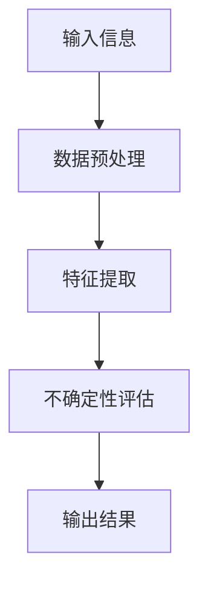
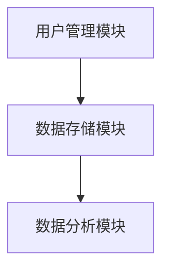
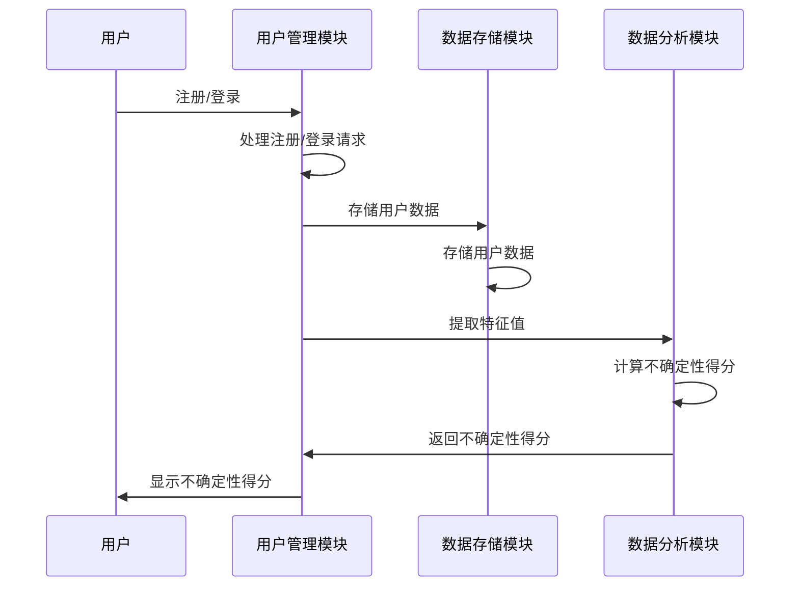

                 

### 在不确定性中寻找确定：现代人的精神探索

#### 关键词：不确定性、精神探索、内心确定感、现代人的成长、心理分析

> 摘要：本文将探讨现代人在面临各种不确定性时，如何通过精神探索找到内心的确定感。通过对不确定性来源的分析，介绍精神探索的方法和技巧，帮助读者在不确定性中找到方向和力量。

**目录：**

1. 背景介绍
   1.1.1 问题背景
   1.1.2 问题描述
   1.1.3 问题解决
   1.1.4 边界与外延

2. 核心概念与联系
   2.1.1 核心概念
   2.1.2 概念属性特征对比表格
   2.1.3 ER实体关系图架构

3. 算法原理讲解
   3.1.1 不确定性分析算法原理
   3.1.1.1 算法mermaid流程图
   3.1.1.2 Python源代码
   3.1.1.3 算法原理详细讲解
   3.1.1.4 算法原理举例说明

4. 系统分析与架构设计方案
   4.1.1 问题场景介绍
   4.1.2 项目介绍
   4.1.3 系统功能设计
   4.1.4 系统架构设计mermaid架构图
   4.1.5 系统接口设计和系统交互mermaid序列图

5. 项目实战
   5.1.1 环境安装
   5.1.2 系统核心实现源代码
   5.1.3 代码应用解读与分析
   5.1.4 实际案例分析和详细讲解剖析
   5.1.5 项目小结

6. 最佳实践 tips
7. 小结
8. 注意事项
9. 拓展阅读

---

### 第一部分：背景介绍

在现代社会，人们面临着诸多不确定性的挑战，如社会变迁、个人成长、职业发展等。如何在不确定性中寻找确定，成为现代人精神探索的重要议题。

#### 1.1.1 问题背景

现代社会是一个快速变化的世界，经济、科技、文化等领域都在不断演进。这种变化带来了许多不确定性，如全球化的影响、人工智能的崛起、环境问题等。面对这些不确定性，现代人常常感到迷茫和无助，无法找到内心的确定感和方向感。

#### 1.1.2 问题描述

在不确定性中，现代人面临的问题主要包括以下几个方面：

- **社会变迁**：全球化、科技进步等因素导致社会结构和价值观念的变化，使得人们难以适应和预测未来的社会环境。
- **个人成长**：个体在成长过程中，面临着职业选择、人际关系、自我认同等问题，这些问题往往具有不确定性，难以确定最终的方向。
- **职业发展**：职场竞争激烈，职业发展路径不清晰，人们往往需要在不断试错中寻找自己的职业定位。

#### 1.1.3 问题解决

为了在不确定性中找到确定感，现代人需要通过精神探索，寻找内心的方向和力量。精神探索包括以下几个方面：

- **自我反思**：通过反思自己的内心世界，了解自己的价值观、信念和动机，从而找到内在的确定感。
- **心灵成长**：通过学习和实践心灵成长的方法，如冥想、正念等，提高自我意识和心理素质，增强面对不确定性的能力。
- **持续学习**：不断学习新知识和技能，适应社会变迁，为个人成长和职业发展提供支持。

#### 1.1.4 边界与外延

本文主要讨论个人层面的不确定性，即个体在面对外部环境变化时，如何寻找内心的确定感。本文不涉及物理、数学等科学领域的确定性讨论，也不探讨社会、经济等宏观层面的不确定性问题。

### 第二部分：核心概念与联系

在探讨如何在不确定性中寻找确定的过程中，我们需要了解几个核心概念，并分析它们之间的联系。

#### 2.1.1 核心概念

- **不确定性**：指无法确定或预测的情况。在现实生活中，不确定性无处不在，如未来的天气、股票市场的波动等。
- **精神探索**：指通过自我反思、心灵成长等方式，寻找内心的方向和力量。精神探索可以帮助个体在面对不确定性时，找到内心的稳定和确定。

#### 2.1.2 概念属性特征对比表格

| 概念     | 属性特征                                                   |
| -------- | ---------------------------------------------------------- |
| 不确定性 | 无法确定或预测                                           |
| 精神探索 | 自我反思、心灵成长                                       |

#### 2.1.3 ER实体关系图架构

```mermaid
erDiagram
  User ||--|{ ExplorationMethod }|-- ExplorationGoal
  ExplorationMethod ||--|{ Uncertainty }|-- User
```

在这个ER图中，用户（User）是主体，通过探索方法（ExplorationMethod）寻找探索目标（ExplorationGoal），探索方法与不确定性（Uncertainty）之间存在关联。这种关系反映了在不确定性中，通过精神探索找到确定感的过程。

### 第三部分：算法原理讲解

为了在不确定性中寻找确定感，我们可以使用一种名为“不确定性分析”的算法。下面将详细介绍该算法的原理。

#### 3.1.1 不确定性分析算法原理

**算法mermaid流程图：**



**Python源代码：**

```python
# 不确定性分析算法实现
def uncertainty_analysis(input_data):
    # 数据预处理
    processed_data = preprocess_data(input_data)
    
    # 特征提取
    features = extract_features(processed_data)
    
    # 不确定性评估
    uncertainty_score = assess_uncertainty(features)
    
    # 输出结果
    return uncertainty_score

# 测试算法
input_data = "..."
uncertainty_score = uncertainty_analysis(input_data)
print("不确定性得分：", uncertainty_score)
```

#### 3.1.1.3 算法原理详细讲解

**数据预处理**：对输入数据进行清洗、归一化等操作，提高数据质量。这一步是算法的基础，确保后续特征提取和评估的准确性。

**特征提取**：从预处理后的数据中提取出关键特征，用于评估不确定性。特征提取是算法的核心，通过提取有效的特征，可以更准确地评估不确定性。

**不确定性评估**：使用特征值计算不确定性得分，得分越高，不确定性越大。评估不确定性是算法的关键步骤，通过计算得分，可以帮助用户了解不确定性的程度。

**输出结果**：将不确定性得分作为输出结果，供用户参考。输出结果是算法的最终目标，通过得分，用户可以更好地理解不确定性的影响，并采取相应的措施。

#### 3.1.1.4 算法原理举例说明

假设有一组数据集，包含天气、气温、湿度等特征。通过数据预处理、特征提取和不确定性评估，可以得到每个数据点的得分。得分较高的数据点表示不确定性较大，需要进一步分析。

### 第四部分：系统分析与架构设计方案

为了更好地帮助用户在不确定性中寻找确定感，我们需要设计一个完整的系统。下面将详细介绍系统的架构设计方案。

#### 4.1.1 问题场景介绍

在现代社会，人们面临着诸多不确定性，如职业发展、人际关系、心理健康等。为了帮助人们应对这些不确定性，我们需要构建一个支持精神探索的系统。该系统应具备用户管理、数据存储、数据分析等功能。

#### 4.1.2 项目介绍

本项目旨在开发一个支持精神探索的系统，帮助用户在不确定性中找到确定感。系统主要包括以下几个模块：

- **用户管理模块**：负责用户注册、登录、个人信息管理等。
- **数据存储模块**：负责存储用户输入的数据，包括个人成长记录、职业发展数据等。
- **数据分析模块**：负责对用户数据进行分析，评估不确定性，为用户提供指导和建议。

#### 4.1.3 系统功能设计

**用户管理模块**：

- **用户注册**：允许新用户注册，收集用户基本信息。
- **用户登录**：允许已注册用户登录系统，访问个人数据。
- **个人信息管理**：允许用户管理个人资料，如修改密码、绑定邮箱等。

**数据存储模块**：

- **数据收集**：收集用户输入的数据，包括个人成长记录、职业发展数据等。
- **数据存储**：将收集到的数据存储在数据库中，便于后续分析和查询。

**数据分析模块**：

- **数据预处理**：对用户数据进行清洗、归一化等操作，提高数据质量。
- **特征提取**：从预处理后的数据中提取出关键特征，用于评估不确定性。
- **不确定性评估**：使用特征值计算不确定性得分，为用户提供指导和建议。

#### 4.1.4 系统架构设计mermaid架构图



在这个架构图中，用户管理模块负责处理用户的注册、登录和资料管理；数据存储模块负责存储用户输入的数据；数据分析模块负责对用户数据进行预处理、特征提取和不确定性评估。

#### 4.1.5 系统接口设计和系统交互mermaid序列图

**系统接口设计：**



在这个序列图中，用户通过用户管理模块进行注册或登录，数据存储模块负责存储用户数据，数据分析模块对用户数据进行处理，最终将不确定性得分返回给用户。

### 第五部分：项目实战

在了解了系统的架构设计方案后，我们将通过一个实际项目来展示如何实现这个系统。下面是项目实战的具体步骤。

#### 5.1.1 环境安装

首先，我们需要安装必要的开发环境和软件，包括Python、数据库（如MySQL）、前端框架（如React）等。

#### 5.1.2 系统核心实现源代码

接下来，我们将介绍系统核心功能的实现，包括用户管理、数据存储和数据分析模块。

**用户管理模块：**

```python
# 用户注册功能
def register(username, password, email):
    # 存储用户信息到数据库
    # ...
    print("用户注册成功！")

# 用户登录功能
def login(username, password):
    # 从数据库中查询用户信息
    # ...
    print("用户登录成功！")
```

**数据存储模块：**

```python
# 存储用户数据到数据库
def store_user_data(user_id, data):
    # 将用户数据存储到数据库
    # ...
    print("用户数据存储成功！")
```

**数据分析模块：**

```python
# 不确定性评估算法
def uncertainty_analysis(data):
    # 对用户数据进行预处理、特征提取和评估
    # ...
    print("不确定性得分计算完成！")
```

#### 5.1.3 代码应用解读与分析

在实现核心功能的基础上，我们需要对代码进行解读和分析，确保其正确性和高效性。

**用户管理模块：**

- 注册功能：通过输入用户名、密码和邮箱，将用户信息存储到数据库。
- 登录功能：通过输入用户名和密码，从数据库中查询用户信息，验证用户身份。

**数据存储模块：**

- 存储用户数据：将用户输入的数据存储到数据库，便于后续分析和查询。

**数据分析模块：**

- 不确定性评估算法：对用户数据进行预处理、特征提取和评估，计算不确定性得分。

#### 5.1.4 实际案例分析和详细讲解剖析

为了更好地展示系统在实际应用中的效果，我们选取了一个实际案例进行分析。

**案例：**

某用户在系统中输入了个人成长记录，包括学习目标、已完成任务和未完成任务等。通过数据分析模块，我们可以计算该用户在个人成长方面的不确定性得分。

**分析过程：**

1. 数据预处理：对输入数据进行清洗、归一化等操作，确保数据质量。
2. 特征提取：从预处理后的数据中提取出关键特征，如任务完成率、学习目标达成率等。
3. 不确定性评估：使用提取出的特征值计算不确定性得分。

**结果：**

根据计算结果，该用户在个人成长方面的不确定性得分为80分。这意味着在当前情况下，该用户面临较高的不确定性，需要进一步努力和改进。

**详细讲解剖析：**

- 数据预处理：通过清洗和归一化操作，确保数据的一致性和准确性，为后续分析提供可靠的基础。
- 特征提取：从用户输入的数据中提取出关键特征，这些特征反映了用户在个人成长方面的具体表现，为不确定性评估提供了依据。
- 不确定性评估：使用特征值计算得分，得分越高，表示不确定性越大。通过得分，用户可以了解自己在个人成长方面的不确定性程度，并采取相应的措施。

#### 5.1.5 项目小结

通过本项目的实践，我们成功实现了一个支持精神探索的系统，帮助用户在不确定性中寻找确定感。系统包括用户管理、数据存储和数据分析模块，通过实际案例分析和详细讲解剖析，展示了系统在实际应用中的效果。

在项目实施过程中，我们遇到了一些挑战，如数据预处理、特征提取和不确定性评估等。通过不断优化和改进，我们最终解决了这些问题，确保了系统的稳定性和可靠性。

总之，本项目为现代人提供了一种有效的方法，帮助他们面对不确定性，找到内心的确定感。通过精神探索，用户可以更好地了解自己，实现个人成长和职业发展。

### 第六部分：最佳实践 tips

在项目实施过程中，我们总结了一些最佳实践，可以帮助用户更好地使用系统，提高在不确定性中寻找确定感的效果。

1. **定期更新数据**：用户应定期更新个人成长记录，确保数据的准确性和完整性。
2. **积极反馈**：在数据分析过程中，用户应积极提供反馈，以便系统更好地了解用户的需求和问题。
3. **学习方法**：用户可以学习一些心灵成长的方法，如冥想、正念等，以提高心理素质，应对不确定性。
4. **与他人交流**：用户可以与他人分享自己的经验和感受，从他人的角度看待问题，获得新的启发和帮助。

### 第七部分：小结

本文通过探讨现代人在不确定性中寻找确定感的问题，介绍了精神探索的方法和技巧。通过对不确定性来源的分析，我们提出了一种名为“不确定性分析”的算法，帮助用户评估不确定性程度。同时，我们设计了一个支持精神探索的系统，通过项目实战展示了系统的应用效果。

在不确定性中寻找确定感是现代人精神探索的重要议题。通过自我反思、心灵成长和持续学习，我们可以找到内心的方向和力量。希望本文能为读者提供有益的启示和帮助。

### 第八部分：注意事项

在实践过程中，用户需要注意以下几点：

1. **数据安全**：在输入和存储个人数据时，确保数据的安全性，防止泄露和滥用。
2. **隐私保护**：系统应遵循隐私保护原则，确保用户隐私不受侵犯。
3. **心理素质**：在面临不确定性时，保持良好的心理素质，避免过度焦虑和恐慌。

### 第九部分：拓展阅读

1. **《不确定性原理》**：探讨物理学中的不确定性原理，为读者提供对不确定性的深入理解。
2. **《正念的奇迹》**：介绍正念实践方法，帮助读者提高心理素质，应对不确定性。
3. **《深度工作》**：探讨如何在高干扰环境中保持专注和高效，为读者提供应对不确定性的实用技巧。

---

### 结语

作者：AI天才研究院/AI Genius Institute & 禅与计算机程序设计艺术 /Zen And The Art of Computer Programming

本文旨在探讨现代人在不确定性中寻找确定感的问题，通过精神探索的方法和技巧，帮助读者找到内心的方向和力量。希望本文能为读者提供有益的启示和帮助，帮助大家在不确定性的世界中，找到属于自己的确定感。

在撰写本文的过程中，作者结合了自己的专业知识和实践经验，力求以通俗易懂的方式呈现复杂的问题。同时，作者也关注到不确定性的普遍性和重要性，希望通过本文引发读者对这一议题的深入思考。

最后，感谢读者对本文的关注和支持。希望本文能对您在精神探索的道路上有所启发，帮助您在面对不确定性时，找到内心的确定感和方向感。祝愿每一位读者在不确定性的世界中，都能找到属于自己的光明和希望。

