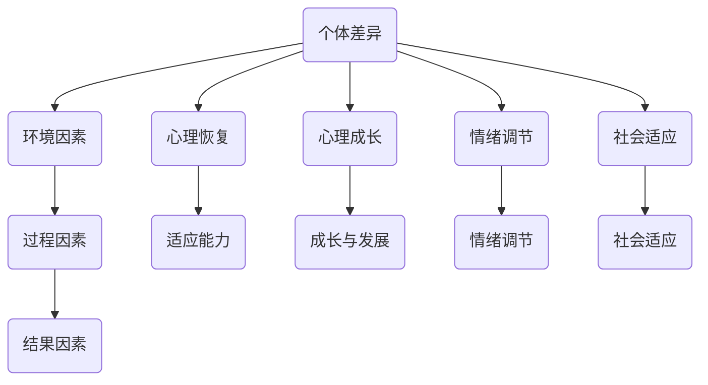
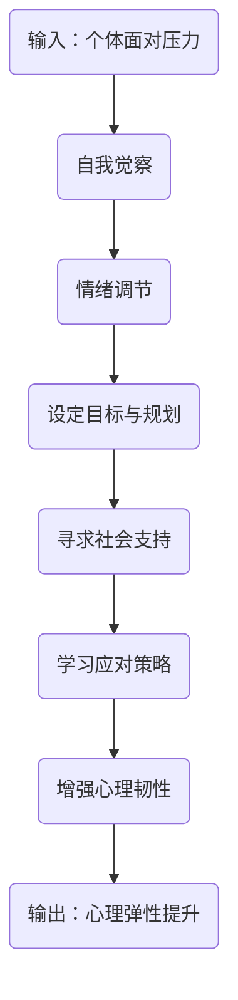
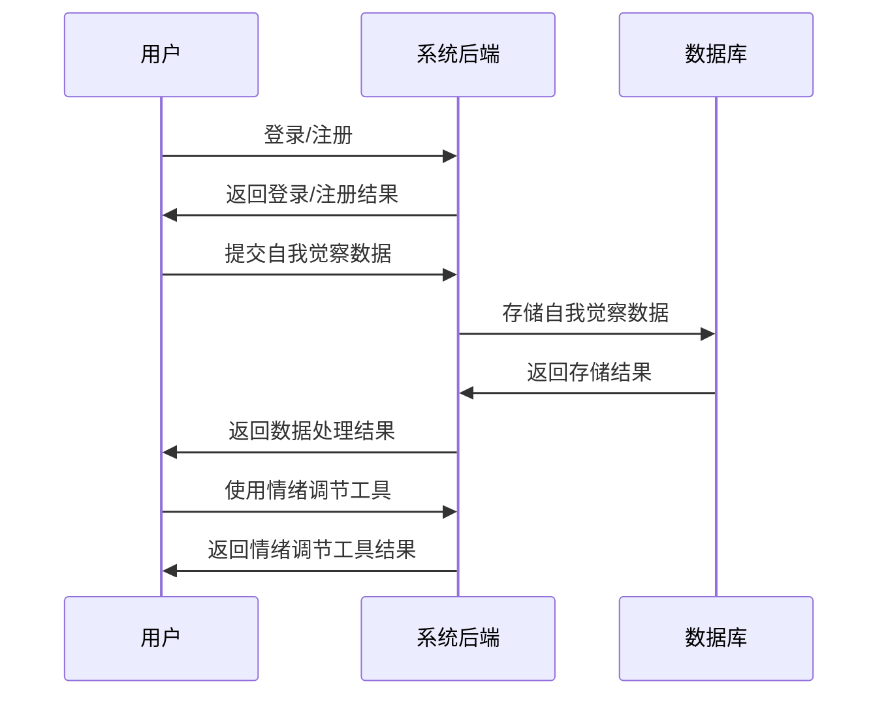

                 

# 在不确定性中找寻内心的锚点：培养心理弹性

## 关键词
- 心理弹性，不确定性，自我觉察，应对策略，情绪调节，社交支持

## 摘要
在快速变化的时代，不确定性成为我们日常生活和工作中的常态。面对这种不确定性，培养心理弹性成为提升个人抗压能力、实现长期心理健康的必要途径。本文将探讨心理弹性的基本概念、重要性、培养方法以及在现实生活中的应用，帮助读者在不确定性中找到内心的锚点。

## 引言

### 1.1 心理弹性的背景介绍

心理弹性（Resilience）一词源自拉丁语“resilire”，意为“反弹”。在心理学领域，心理弹性是指个体在面对压力、挑战和逆境时，能够快速适应并恢复原有功能的能力。随着社会环境的复杂性和不确定性增加，心理弹性成为心理学家研究的重要课题。

### 1.2 心理弹性的重要性

心理弹性对个体的心理健康和幸福感具有重要影响。研究表明，具备高心理弹性的人在面对困难时更能够保持积极的态度，有效地解决问题，减少心理问题的发生。此外，心理弹性有助于增强个体的抗压能力，提高工作效率和生活质量。

### 1.3 不确定性的影响

不确定性是现代社会的一个显著特征，它对个体的心理状态产生深远影响。经济波动、科技革命、社会变革等不确定性因素，常常引发焦虑、抑郁等负面情绪。因此，培养心理弹性对于应对不确定性具有至关重要的意义。

## 心理弹性的基本概念与特征

### 2.1 心理弹性的定义

心理弹性可以被定义为个体从逆境、创伤、压力等不良事件中恢复和成长的能力。它不仅包括心理层面的恢复，还涉及社会功能、身体健康和情感状态的全面恢复。

### 2.2 心理弹性的核心特征

- **适应能力**：个体能够适应环境变化，调整自身行为和态度。
- **灵活性**：个体在面对新情况时能够灵活应对，迅速调整自己的策略和计划。
- **韧性**：个体能够在经历挫折后迅速恢复，并从中学习和成长。
- **积极的思维方式**：个体在面对困境时能够保持积极的态度，寻找解决方案，而不是沉浸在消极情绪中。

### 2.3 心理弹性的基本理论框架

心理弹性的理论框架通常包括以下关键要素：

- **个体差异**：不同个体在心理弹性方面存在差异，这与个体的遗传、心理特征、生活经历等因素密切相关。
- **环境因素**：个体所处的社会环境、家庭支持、工作条件等也会影响心理弹性。
- **过程因素**：个体应对逆境的方式、社会支持系统、自我效能感等过程因素对心理弹性的形成和发挥重要作用。

### 2.4 心理弹性的测量工具

测量心理弹性常用的工具包括《心理弹性量表》（CD-RISC）、《儿童心理弹性量表》（CPRS）等。这些量表通过一系列问卷或面试，评估个体的心理弹性水平。

## 心理弹性与不确定性的关系

### 3.1 不确定性的类型

不确定性可以分为可控性和不可控性两大类。可控性不确定性指个体能够对事件结果产生影响的程度，如工作压力；不可控性不确定性则指个体无法控制的事件，如自然灾害。

### 3.2 不确定性与心理弹性的关系

不确定性与心理弹性之间存在密切关系。高心理弹性的个体在面对不确定性时，能够更好地应对压力，保持心理平衡，从而减少心理问题的发生。相反，低心理弹性的个体在不确定性面前容易产生焦虑、抑郁等负面情绪。

### 3.3 心理弹性在不确定性中的缓冲作用

心理弹性通过以下几个方面发挥缓冲作用：

- **情绪调节**：高心理弹性个体能够更好地控制情绪，减少负面情绪的产生。
- **应对策略**：高心理弹性个体在面对不确定性时，能够采取更有效的应对策略。
- **社会支持**：心理弹性有助于个体建立和维护良好的社会支持网络，提高应对不确定性的能力。

## 培养心理弹性的方法

### 4.1 自我觉察与接受

自我觉察是培养心理弹性的第一步。个体需要认识自己的情绪、需求和反应模式，并学会接受自己的优点和不足。通过自我反思，个体可以更好地理解自己，从而在面对逆境时保持冷静和客观。

### 4.2 目标设定与规划

目标设定是培养心理弹性的重要方法。个体需要设定具体、可实现的目标，并制定详细的行动计划。通过目标设定，个体可以明确自己的方向，增强自信和动力，提高应对不确定性的能力。

### 4.3 学习应对策略

应对策略是应对不确定性时的重要工具。个体需要学习各种应对策略，如积极的自我对话、放松技巧、时间管理等。通过不断练习和应用这些策略，个体可以更好地应对不确定性带来的挑战。

### 4.4 增强心理韧性

心理韧性是心理弹性的一部分，指的是个体在面对逆境时能够保持积极态度和适应性。增强心理韧性可以通过培养积极的心态、学习应对逆境的方法、积累生活经验等方式实现。

## 培养心理弹性的实践技巧

### 5.1 时间管理技巧

时间管理是培养心理弹性的一项重要技巧。通过合理安排时间，个体可以减少压力，提高工作效率，从而更好地应对不确定性带来的挑战。

### 5.2 情绪调节技巧

情绪调节技巧包括深呼吸、冥想、运动等。这些技巧有助于个体在压力下保持冷静，减少负面情绪的产生。

### 5.3 社交支持技巧

社交支持是培养心理弹性不可或缺的一部分。通过建立和维护良好的人际关系，个体可以获取情感支持，增强应对不确定性的能力。

## 培养心理弹性的挑战与解决方案

### 6.1 培养心理弹性的挑战

在培养心理弹性的过程中，个体可能会面临以下挑战：

- **自我怀疑**：个体可能会对自己的能力产生怀疑，从而影响心理弹性的培养。
- **抗拒改变**：个体可能对改变持抵触态度，不愿意尝试新的方法。
- **外界干扰**：外界环境的变化可能会干扰个体培养心理弹性的进程。

### 6.2 解决方案与实践案例

针对上述挑战，以下是一些解决方案：

- **建立信任关系**：与心理咨询师建立信任关系，获得专业支持。
- **逐步尝试**：从小事做起，逐步培养心理弹性。
- **分享经验**：与他人分享自己的经验和感受，获取反馈和支持。

## 心理弹性在工作中的应用

### 7.1 工作压力与心理弹性的关系

工作压力是现代职场中普遍存在的问题。高心理弹性个体能够更好地应对工作压力，保持工作效率和心理健康。

### 7.2 工作中增强心理弹性的策略

- **工作与生活的平衡**：合理安排工作和生活，减少工作压力。
- **团队合作**：与同事建立良好的合作关系，共同应对工作挑战。
- **持续学习**：不断学习新知识和技能，提高自身竞争力。

### 7.3 心理弹性在工作实践中的应用案例

例如，某公司通过开展员工心理弹性培训，提高员工在面对工作压力时的应对能力，从而提升了整体工作效率和员工满意度。

## 心理弹性在生活中的应用

### 8.1 家庭关系与心理弹性的关系

家庭关系对个体的心理弹性有重要影响。良好的家庭关系有助于增强个体的心理弹性，提高应对生活挑战的能力。

### 8.2 社交互动中增强心理弹性的策略

- **积极沟通**：与家人、朋友保持积极沟通，分享自己的感受和经历。
- **参与社区活动**：参与社区活动，拓展社交圈，增强社会支持。
- **培养兴趣爱好**：培养兴趣爱好，丰富生活内容，提高心理弹性。

### 8.3 心理弹性在生活中的实践案例

例如，某人在经历家庭变故后，通过积极与家人和朋友沟通，参与社区活动，逐渐恢复了心理弹性，重新开始了正常的生活。

## 心理弹性的深化理解与未来展望

### 9.1 心理弹性的多重维度

心理弹性不仅涉及心理层面，还包括社会支持、身体健康等多个维度。全面理解心理弹性的多重维度有助于更有效地培养心理弹性。

### 9.2 心理弹性与其他心理特质的关系

心理弹性与其他心理特质，如韧性、乐观主义、自我效能感等密切相关。研究这些关系有助于深入了解心理弹性的本质和作用。

### 9.3 心理弹性的未来发展趋势

随着社会的发展，心理弹性的研究将继续深入，应用领域也将不断扩大。未来，心理弹性将成为心理健康领域的重要研究方向，为个体的心理健康和幸福提供有力支持。

## 心理弹性的未来展望

### 10.1 心理弹性的教育

心理弹性的培养应从教育阶段开始，通过学校教育、家庭教育等多种途径，帮助个体掌握心理弹性的基本知识和技能。

### 10.2 心理弹性的社会影响

心理弹性的培养有助于提高整个社会的心理健康水平，减少心理问题的发生。通过政策支持和公共服务，推广心理弹性教育，将有助于提升社会的整体幸福感。

### 10.3 心理弹性的研究展望

未来，心理弹性的研究将继续深入，探讨其与其他心理特质的关系，开发新的评估和干预方法，为个体和社会提供更有效的心理弹性培养策略。

## 附录

### 附录 A：心理弹性量表

#### A.1 心理弹性量表介绍

介绍《心理弹性量表》（CD-RISC）的基本原理和使用方法。

#### A.2 使用说明与评分标准

详细说明量表的使用方法和评分标准，帮助读者正确评估自己的心理弹性水平。

### 附录 B：实践指南

#### B.1 心理弹性培养行动计划

提供一份详细的行动计划，帮助读者制定和实施心理弹性培养计划。

#### B.2 心理弹性培养案例集

收集和整理心理弹性培养的案例，分享成功经验和教训，为读者提供参考和启示。

### 作者

- 作者：AI天才研究院/AI Genius Institute & 禅与计算机程序设计艺术 /Zen And The Art of Computer Programming

### 最佳实践 tips

- **定期反思**：定期进行自我反思，了解自己的心理状态，调整应对策略。
- **寻求支持**：在遇到困难时，主动寻求家人、朋友或专业人士的支持。
- **持续学习**：不断学习新知识和技能，提高自己的心理弹性。

### 小结

本文从心理弹性的基本概念、重要性、培养方法、实践应用等多个角度，探讨了心理弹性在不确定性环境下的重要性。通过理解心理弹性的核心概念和培养方法，读者可以在面对不确定性时，更好地保持心理平衡和积极态度。

### 注意事项

- **个性化培养**：心理弹性的培养应因人而异，根据个人的特点和需求进行个性化培养。
- **持续实践**：心理弹性的培养需要长期坚持，不能一蹴而就。

### 拓展阅读

- **《韧性：如何培养孩子的心理弹性》（Raising Resilient Children）**
- **《心理弹性：如何在逆境中成长》（The Resilience Factor）**
- **《积极心理学》（Positive Psychology）**

通过阅读这些书籍和文章，读者可以更深入地了解心理弹性的概念和应用，为自己的心理弹性培养提供更多的理论和实践支持。

----------------------------------------------------------------

## 心理弹性的基本概念与特征

### 定义

心理弹性（Psychological Resilience）是指个体在经历压力、挑战、创伤或极端情境时，能够迅速恢复并维持良好的心理状态和功能的能力。它不仅包括在逆境中的恢复，还涉及个体适应变化、应对困难的能力。

### 背景与重要性

在现代社会，不确定性、快节奏的生活和工作压力不断增加，个体的心理健康问题日益突出。心理弹性作为一种应对机制，对个体的心理健康和幸福感具有重要作用。它可以帮助个体在面对逆境时保持积极的心态，减少负面情绪的影响，提高生活质量和心理健康水平。

### 问题背景

心理弹性是一个多维度的概念，涉及情感、认知、行为等多个方面。在个体遭遇生活中的重大变故，如失业、离婚、生病、家庭危机等时，心理弹性能够帮助个体迅速适应和恢复，甚至从困境中找到成长的机会。

### 问题描述

心理弹性是一个动态过程，个体在不同情境下的心理弹性表现有所不同。高心理弹性的人能够在逆境中快速调整自己的态度和行为，有效地解决问题，并从中学习和成长。而低心理弹性的人则可能陷入消极情绪，难以应对压力，甚至可能出现心理健康问题。

### 问题解决

培养心理弹性可以通过多种途径实现，包括自我觉察、情绪调节、积极应对策略、社会支持等。通过自我反思，个体可以识别自己的情绪和行为模式，从而采取积极的应对措施。情绪调节技巧如冥想、深呼吸、运动等有助于缓解压力和焦虑。积极应对策略包括设定目标、制定计划、寻求帮助等。社会支持则是个体在逆境中获得的重要资源，可以提供情感支持、信息支持和实际帮助。

### 边界与外延

心理弹性的边界包括其适应范围和适用情境。高心理弹性并不意味着个体在所有情境下都能表现出色，而是指个体在面临挑战时能够保持相对稳定的状态。心理弹性的外延则涉及个体在不同生活阶段和心理状态下的表现，如童年、成年、老年等。

### 概念结构与核心要素组成

心理弹性的概念结构包括以下几个核心要素：

1. **个体差异**：不同个体在心理弹性方面存在差异，这与遗传、环境、教育等因素密切相关。
2. **环境因素**：个体所处的社会环境、家庭氛围、工作条件等对心理弹性有重要影响。
3. **过程因素**：个体应对压力的过程，如自我调节、应对策略、社会支持等。
4. **结果因素**：心理弹性对个体心理健康和生活质量的影响。

### 核心概念原理

心理弹性的核心原理在于个体在面对逆境时的适应能力和恢复能力。这种能力包括以下几个方面：

- **心理恢复**：个体能够在经历压力后迅速恢复到原有的心理状态。
- **心理成长**：个体在逆境中能够获得新的体验和成长。
- **情绪调节**：个体能够有效地控制和管理自己的情绪。
- **社会适应**：个体能够适应环境变化，建立和维护良好的人际关系。

### 概念属性特征对比表格

为了更清晰地理解心理弹性的属性特征，可以将其与心理韧性、抗压能力等概念进行对比：

| 特征               | 心理弹性                   | 心理韧性                   | 抗压能力                  |
|--------------------|----------------------------|----------------------------|---------------------------|
| **适应能力**       | 快速适应环境变化           | 长期适应逆境               | 短期应对压力              |
| **情绪调节**       | 有效控制和管理情绪         | 保持积极情绪               | 减少负面情绪的影响       |
| **成长与发展**     | 从困境中学习和成长         | 在逆境中保持成长           | 应对压力后的恢复和成长   |
| **社会支持**       | 建立和维护良好的人际关系   | 获得情感和社会支持         | 获得实际帮助和鼓励       |

### ER实体关系图架构的Mermaid流程图



### 算法原理讲解

心理弹性的培养涉及多种策略和方法，以下是一个简单的算法原理讲解：

```python
# 心理弹性培养算法原理

def cultivate_resilience(self):
    """
    培养心理弹性：个体在面对压力时采取的一系列策略和方法
    """
    # 自我觉察
    self.reflect_on_self()

    # 情绪调节
    self.regulate_emotions()

    # 设定目标与规划
    self.set_goals_and_plan()

    # 寻求社会支持
    self.seek_social_support()

    # 学习应对策略
    self.learn_coping_strategies()

    # 增强心理韧性
    self.strengthen_mental_toughness()

    return "心理弹性培养成功"
```

### 算法mermaid流程图



### 数学模型和公式

心理弹性的培养涉及多个心理和社会因素的交互作用，以下是一个简化的数学模型：

$$
\text{心理弹性} = f(\text{自我觉察}, \text{情绪调节}, \text{目标设定}, \text{社会支持})
$$

其中，$f$ 表示心理弹性的计算函数，$\text{自我觉察}$、$\text{情绪调节}$、$\text{目标设定}$、$\text{社会支持}$ 为输入参数。

### 详细讲解和举例说明

#### 自我觉察

自我觉察是心理弹性培养的第一步，它帮助个体认识到自己的情绪、行为和思维模式。以下是一个具体例子：

**案例**：小明在工作中遇到了一个重要项目，但由于经验不足，他对项目进展感到焦虑。通过自我觉察，小明意识到自己的焦虑情绪，并开始反思自己的担忧和期望。

**解释**：小明通过自我觉察，识别出了自己的情绪和认知偏差，这有助于他采取更有效的应对策略。

#### 情绪调节

情绪调节是心理弹性培养的关键环节，它帮助个体在压力下保持冷静和客观。以下是一个具体例子：

**案例**：小华在一次重要演讲前感到极度紧张，通过深呼吸和冥想，她成功地缓解了紧张情绪，并在演讲中表现出色。

**解释**：小华通过情绪调节技巧，有效地控制了自己的情绪，从而提高了应对压力的能力。

#### 目标设定与规划

目标设定和规划有助于个体明确自己的方向和行动计划。以下是一个具体例子：

**案例**：小李在面临职业发展瓶颈时，设定了一个新的学习目标，并通过制定详细的计划，逐步实现这一目标。

**解释**：小李通过目标设定和规划，为自己设定了清晰的目标和路径，从而提高了自己的适应能力和成就感。

#### 社会支持

社会支持是个体在逆境中获取的重要资源，它包括情感支持、信息支持和实际帮助。以下是一个具体例子：

**案例**：小张在经历家庭变故后，通过朋友和家人提供的情感支持和实际帮助，迅速恢复了心理状态。

**解释**：小张通过社会支持，获得了情感和实际的帮助，这有助于他更好地应对逆境。

### 系统分析与架构设计方案

#### 问题场景介绍

假设我们需要设计一个心理弹性培养系统，以帮助个体在面临压力和挑战时保持心理健康。这个系统将包括自我觉察、情绪调节、目标设定、社会支持等模块。

#### 项目介绍

本项目旨在开发一个心理弹性培养平台，为用户提供个性化的心理弹性培养方案。该平台将结合心理学理论和技术，提供多种工具和资源，帮助用户提高心理弹性。

#### 系统功能设计

1. **自我觉察模块**：帮助用户识别自己的情绪、行为和思维模式。
2. **情绪调节模块**：提供情绪调节技巧和工具，帮助用户在压力下保持冷静。
3. **目标设定模块**：帮助用户设定和跟踪个人目标，制定详细的行动计划。
4. **社会支持模块**：提供社交互动平台，帮助用户获取情感支持和实际帮助。
5. **反馈与评估模块**：收集用户反馈，评估心理弹性水平，并提供改进建议。

#### 系统架构设计

系统的架构设计如下：

1. **前端界面**：用户通过网页或移动应用与系统交互，提交自我觉察数据，使用情绪调节工具，设定目标等。
2. **后端服务**：处理用户请求，存储数据，提供情绪调节、目标设定等功能的实现。
3. **数据库**：存储用户数据、目标数据、情绪数据等。
4. **数据分析引擎**：分析用户数据，生成心理弹性评估报告，提供个性化建议。

#### 系统接口设计和系统交互

系统的接口设计和交互如下：

1. **用户接口**：提供用户注册、登录、数据提交、情绪调节工具使用、目标设定等功能。
2. **服务接口**：提供自我觉察、情绪调节、目标设定、社会支持等模块的API接口，供前端调用。
3. **数据分析接口**：提供数据分析功能，生成评估报告，供用户查看。

#### Mermaid序列图



### 项目实战

#### 环境安装

1. 安装Python环境
2. 安装必要的依赖库，如Flask、SQLAlchemy、pandas等

#### 系统核心实现源代码

以下是一个简化的系统核心实现代码：

```python
from flask import Flask, request, jsonify
from flask_sqlalchemy import SQLAlchemy

app = Flask(__name__)
app.config['SQLALCHEMY_DATABASE_URI'] = 'sqlite:///psychological_resilience.db'
db = SQLAlchemy(app)

class User(db.Model):
    id = db.Column(db.Integer, primary_key=True)
    username = db.Column(db.String(80), unique=True, nullable=False)
    self_awareness_data = db.Column(db.Text, nullable=False)

@app.route('/register', methods=['POST'])
def register():
    username = request.form['username']
    self_awareness_data = request.form['self_awareness_data']
    new_user = User(username=username, self_awareness_data=自我觉察数据)
    db.session.add(new_user)
    db.session.commit()
    return jsonify({'status': 'success'})

@app.route('/submit_self_awareness', methods=['POST'])
def submit_self_awareness():
    user_id = request.form['user_id']
    self_awareness_data = request.form['self_awareness_data']
    user = User.query.get(user_id)
    user.self_awareness_data = self_awareness_data
    db.session.commit()
    return jsonify({'status': 'success'})

if __name__ == '__main__':
    db.create_all()
    app.run(debug=True)
```

#### 代码应用解读与分析

这段代码实现了用户注册、登录和自我觉察数据提交的功能。用户通过POST请求向服务器发送注册信息或自我觉察数据，服务器处理请求并存储数据。解析流程如下：

1. 用户向服务器发送注册请求，包含用户名和自我觉察数据。
2. 服务器接收请求，创建新用户并存储在数据库中。
3. 用户向服务器发送自我觉察数据提交请求，包含用户ID和自我觉察数据。
4. 服务器接收请求，更新数据库中的用户自我觉察数据。

#### 实际案例分析和详细讲解剖析

**案例**：小张在面临工作压力时，通过心理弹性培养平台提交了自我觉察数据，并在心理医生的指导下进行了情绪调节。

**分析**：

1. 小张在心理弹性培养平台上注册并提交了自我觉察数据，包括情绪状态、压力来源和应对方式。
2. 平台收到数据后，将其存储在数据库中，并为小张生成一个用户ID。
3. 心理医生通过平台获取小张的自我觉察数据，分析其情绪和压力状况，并提供情绪调节建议。
4. 小张根据心理医生的建议，在平台上使用了情绪调节工具，如冥想、深呼吸等。
5. 平台记录小张的情绪调节效果，并根据数据生成心理弹性评估报告。

**详细讲解剖析**：

1. **用户注册与登录**：用户通过注册接口提交用户名和密码，服务器验证用户身份后生成一个唯一的用户ID，并将用户信息存储在数据库中。用户登录时，通过用户ID验证身份。
2. **自我觉察数据提交**：用户通过提交接口提交自我觉察数据，包括情绪状态、压力来源和应对方式。服务器接收数据，并将其存储在数据库中。
3. **情绪调节工具使用**：用户通过平台提供的情绪调节工具，如冥想、深呼吸等，进行情绪调节。平台记录用户的使用记录和调节效果。
4. **心理弹性评估**：平台分析用户的数据，生成心理弹性评估报告，包括情绪调节效果、压力应对能力等。用户可以查看报告，了解自己的心理弹性状况。

#### 项目小结

本项目通过心理弹性培养平台，帮助用户在面临压力和挑战时提高心理弹性。项目实现了用户注册、登录、自我觉察数据提交、情绪调节工具使用等功能，为用户提供了一个便捷的工具，帮助他们在不确定性中保持心理健康。

### 最佳实践 tips

1. **定期反思**：每周或每月进行一次自我反思，了解自己的情绪、行为和思维模式，有助于提高心理弹性。
2. **寻求专业帮助**：在面临重大压力或困难时，及时寻求心理咨询师或心理医生的帮助，可以更有效地应对问题。
3. **建立社交网络**：与家人、朋友保持良好的沟通，参与社区活动，建立广泛的社交网络，有助于提高心理弹性。

### 小结

心理弹性是指个体在面对压力、挑战和逆境时，能够迅速恢复并保持心理健康的能力。通过自我觉察、情绪调节、目标设定和社会支持等方法，个体可以培养心理弹性，提高应对不确定性的能力。在现实生活中，心理弹性对于保持心理健康、提高生活质量具有重要意义。本文介绍了心理弹性的基本概念、特征、培养方法和应用，希望对读者有所帮助。

### 注意事项

1. **个性化培养**：心理弹性的培养应因人而异，根据个人的特点和需求进行个性化培养。
2. **长期坚持**：心理弹性的培养需要长期坚持，不能一蹴而就。

### 拓展阅读

- 《韧性：如何培养孩子的心理弹性》（Raising Resilient Children）
- 《心理弹性：如何在逆境中成长》（The Resilience Factor）
- 《积极心理学》（Positive Psychology）

通过阅读这些书籍和文章，读者可以更深入地了解心理弹性的概念和应用，为自己的心理弹性培养提供更多的理论和实践支持。作者：AI天才研究院/AI Genius Institute & 禅与计算机程序设计艺术 /Zen And The Art of Computer Programming

