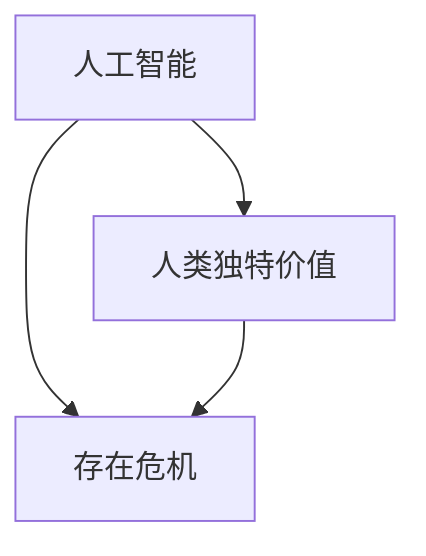

                 

## 在人工智能时代寻找人类独特价值：应对存在危机

> 关键词：人工智能，人类独特价值，存在危机，应对策略，未来展望

> 摘要：随着人工智能技术的飞速发展，人类社会正经历着前所未有的变革。本文旨在探讨人工智能时代人类独特价值的内涵和重要性，分析人工智能对人类生活、工作、思维等方面的影响，并提出应对存在危机的策略。通过深入思考和逻辑推理，本文希望为读者提供一幅清晰的蓝图，指引我们在人工智能时代如何保持和发挥人类的独特价值。

---

### 开头部分：背景介绍

#### 1.1 问题背景

在21世纪，人工智能（AI）技术飞速发展，深刻地改变了人类社会的生活方式。随着机器学习、深度学习等AI技术的不断突破，人工智能正逐渐从理论走向实践，深入到各个行业和应用场景。人工智能的应用，不仅提高了生产效率，还极大地丰富了人们的日常生活。然而，人工智能的崛起也带来了一系列的挑战，尤其是在对人类独特价值的影响方面。

近年来，随着人工智能技术的不断成熟，机器在很多领域已经能够超越人类。例如，在围棋、象棋等竞技项目中，人工智能算法已经取得了显著的成绩。此外，人工智能在医疗、金融、交通等领域的应用也取得了重要进展。然而，这些成就同时也引发了人们对于“人类独特价值”的深刻思考。人们开始质疑，在人工智能时代，人类是否还能够保持自身的独特性？我们如何应对这种存在的危机？

#### 1.2 问题描述

人工智能的迅速发展，使得机器在很多领域已经能够超越人类，这引发了人们对于“人类独特价值”的深刻思考。人们开始质疑，在人工智能时代，人类是否还能够保持自身的独特性？我们如何应对这种存在的危机？

具体来说，这个问题包括以下几个方面的内容：

1. **人类独特价值的内涵**：人类独特价值是什么？它包括哪些方面？
2. **人工智能对人类独特价值的影响**：人工智能如何影响人类的独特价值？它在哪些方面超越了人类？
3. **人类如何应对人工智能带来的挑战**：在人工智能时代，人类应该如何保持自身的独特价值？
4. **未来人工智能的发展趋势**：未来人工智能会如何影响人类社会？人类应该如何应对这些影响？

#### 1.3 问题解决

本书旨在通过深入探讨人工智能时代的人类独特价值，寻找人类在新时代的生存之道。书中将详细分析人工智能对人类生活、工作、思维等各方面的影响，并提出一系列解决方案。具体来说，本书将包括以下几个方面的内容：

1. **人工智能技术的概述**：介绍人工智能的基本概念、发展历程、核心技术及应用场景。
2. **人类独特价值的分析**：阐述人类独特价值的内涵和重要性，分析人工智能如何影响人类独特价值。
3. **人工智能时代的挑战与应对**：探讨人工智能时代人类面临的挑战，并提出应对策略。
4. **未来人工智能的发展趋势**：分析未来人工智能的发展趋势，展望人类在人工智能时代的未来。

通过以上内容的探讨，本书希望能够为读者提供一幅清晰的蓝图，帮助他们在人工智能时代保持和发挥人类的独特价值。

#### 1.4 边界与外延

本书讨论的人类独特价值，主要指的是人类在情感、创造力、道德伦理等方面的独特性。这些特质是人工智能目前难以完全复制的，也是人类在人工智能时代保持独特价值的关键。具体来说，人类独特价值包括以下几个方面：

1. **情感丰富**：人类拥有丰富的情感体验，包括喜怒哀乐、爱恨情仇等。这些情感体验是人工智能难以完全模拟的。
2. **创造力强**：人类具有独特的创造力，能够在不同领域提出新的观点和解决方案。这种创造力是人工智能难以完全复制的。
3. **道德伦理成熟**：人类在社会中形成了复杂的道德伦理体系，能够根据自己的价值观进行判断和选择。这种道德伦理成熟度是人工智能难以达到的。
4. **适应性强**：人类在面对复杂多变的环境时，能够灵活适应并找到合适的解决方案。这种适应能力是人工智能难以完全具备的。

#### 1.5 概念结构与核心要素组成

本书将围绕以下几个核心要素进行讨论：

1. **人工智能技术的发展与影响**：分析人工智能技术的核心概念、发展历程、核心技术及应用场景，探讨人工智能对人类生活、工作、思维等方面的影响。
2. **人类独特价值的定义与特征**：阐述人类独特价值的内涵和重要性，分析人工智能如何影响人类独特价值。
3. **人工智能时代的挑战与应对**：探讨人工智能时代人类面临的挑战，并提出应对策略。
4. **未来人工智能的发展趋势**：分析未来人工智能的发展趋势，展望人类在人工智能时代的未来。

通过以上内容的探讨，本书希望能够为读者提供一幅清晰的蓝图，帮助他们在人工智能时代保持和发挥人类的独特价值。

### 核心概念与联系

#### 2.1 核心概念原理

在讨论人工智能时代的人类独特价值时，我们需要明确几个核心概念，包括人工智能、人类独特价值和存在危机。

- **人工智能（AI）**：人工智能是模拟人类智能行为的计算机系统，通过学习和推理实现智能任务。人工智能包括机器学习、深度学习、自然语言处理、计算机视觉等核心技术。

- **人类独特价值**：人类独特价值是指人类在情感、创造力、道德伦理等方面的独特性。这些特质使得人类在复杂环境中具有独特的适应能力和创造力。

- **存在危机**：存在危机是指人类在人工智能时代可能面临的生存困境，包括就业失业问题、伦理道德问题、社会结构变革等。

#### 2.2 概念属性特征对比表格

为了更好地理解这些核心概念，我们通过一个对比表格来展示它们的主要属性特征。

| 概念         | 特征                                                         |
| ------------ | ------------------------------------------------------------ |
| 人工智能     | 自动化、高效、精确、可扩展、可重复                           |
| 人类独特价值 | 情感丰富、创造力强、道德伦理成熟、适应性强                   |
| 存在危机     | 人类独特价值受到挑战、社会结构变革、就业失业问题、伦理道德问题 |

#### 2.3 ER实体关系图架构的 Mermaid 流程图

为了更直观地展示这些核心概念之间的关系，我们使用Mermaid流程图来描述它们的实体关系。

在上述流程图中，人工智能（AI）作为核心驱动因素，直接影响人类独特价值（LV）和存在危机（EC）。人类独特价值则在一定程度上缓解了存在危机，为人类在人工智能时代提供了一种应对策略。

### 人工智能时代的人类独特价值

#### 3.1 人工智能对人类生活的影响

人工智能技术的快速发展，不仅改变了人们的工作方式，也对日常生活产生了深远的影响。以下从便利性、舒适性和安全性三个方面，探讨人工智能如何影响人类生活。

##### 3.1.1 便利性

人工智能在提高生活便利性方面发挥了重要作用。例如，智能家居系统的普及使得家庭生活更加便捷。通过智能音箱、智能灯光、智能空调等设备，用户可以远程控制家居环境，提高生活品质。此外，人工智能还广泛应用于交通领域，如自动驾驶汽车和智能交通系统，可以减少交通事故，提高出行效率。

##### 3.1.2 舒适性

人工智能在提升生活舒适性方面也具有显著作用。例如，智能穿戴设备可以实时监测用户的健康状况，提供个性化的健康建议。智能助手如Siri、Alexa等，可以回答用户的问题、设置提醒、播放音乐等，为用户提供便利。此外，人工智能在娱乐领域也有广泛应用，如智能推荐算法可以推荐用户感兴趣的电影、音乐和文章，提高用户的娱乐体验。

##### 3.1.3 安全性

人工智能在提升生活安全性方面具有重要作用。例如，智能安防系统可以通过人脸识别、行为分析等技术，实时监控家庭和工作环境，提高安全性。智能交通系统可以通过实时数据分析和预测，优化交通流

