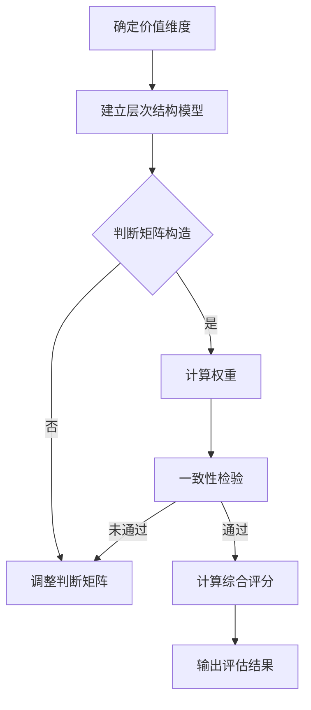
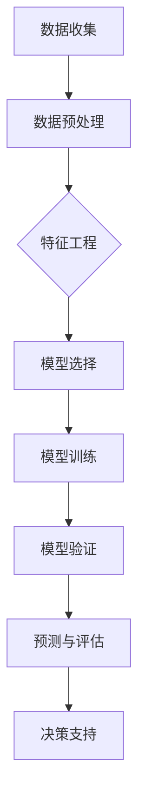
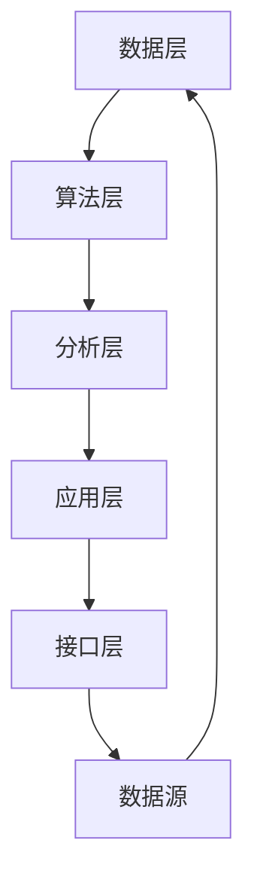
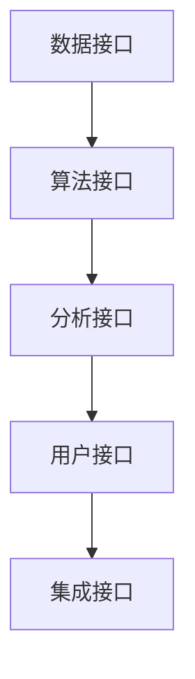
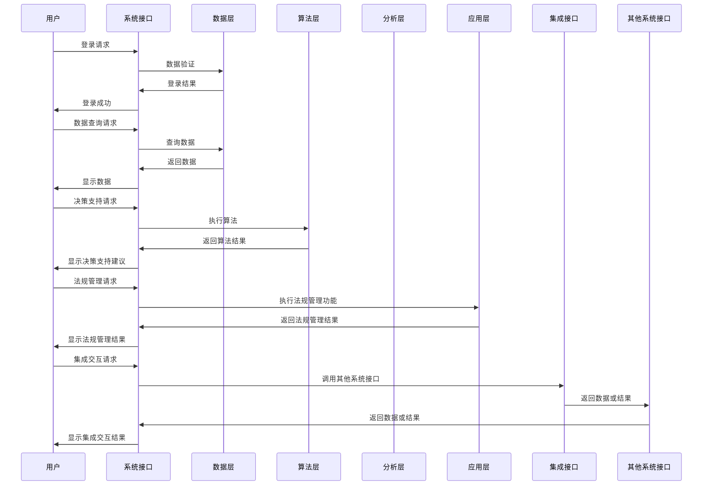

                 

## 在人工智能时代重新定义人类价值：应对存在危机

### 关键词：人工智能，人类价值，存在危机，重新定义

### 摘要：
本文旨在探讨人工智能时代人类价值面临的挑战与危机，通过重新定义人类价值，提出应对策略，以期在科技迅猛发展的背景下，找到人类新的发展方向。文章将从背景介绍、核心概念解析、算法原理讲解、系统分析与架构设计、项目实战及最佳实践等方面，逐一剖析人工智能对人类价值的深远影响，并给出具体的应对方案。

---

### 目录大纲设计思路

在制定本文的目录大纲时，我们考虑到逻辑清晰、结构紧凑、简单易懂的设计原则，力求帮助读者系统地理解人工智能时代人类价值面临的危机，并提供有效的应对策略。

#### 第一部分：背景与概念
- **1.1 问题背景**：介绍人工智能时代的发展背景，阐述人类价值面临的挑战与危机。
- **1.2 核心概念解析**：明确本文涉及的核心概念，如人工智能、人类价值、存在危机等。
- **1.3 概念属性对比**：使用对比表格，突出人工智能与人类价值、存在危机的不同特点。
- **1.4 ER实体关系图**：绘制ER图，展示核心概念之间的实体关系。

#### 第二部分：算法原理与模型
- **2.1 算法1：价值评估算法**：介绍算法原理，使用Mermaid流程图和Python源代码进行阐述。
- **2.2 算法2：存在危机预测算法**：同样介绍算法原理，并详细讲解。

#### 第三部分：系统分析与架构设计
- **3.1 问题场景介绍**：描述一个假设的项目背景。
- **3.2 项目介绍**：介绍项目的具体内容和目标。
- **3.3 系统功能设计**：使用Mermaid类图展示领域模型。
- **3.4 系统架构设计**：展示系统架构和接口设计。
- **3.5 系统交互**：使用Mermaid序列图展示系统交互。

#### 第四部分：项目实战
- **4.1 环境安装**：介绍项目所需的软件和硬件环境。
- **4.2 系统核心实现源代码**：提供源代码，并进行解读。
- **4.3 代码应用解读与分析**：分析代码的具体应用和实现细节。
- **4.4 实际案例分析与剖析**：通过案例，详细剖析项目实施过程。
- **4.5 项目小结**：总结项目经验，提出改进建议。

#### 第五部分：最佳实践与拓展
- **5.1 最佳实践 tips**：分享项目实施过程中的最佳实践。
- **5.2 小结**：总结全文，强调核心观点。
- **5.3 注意事项**：提醒读者注意的事项。
- **5.4 拓展阅读**：推荐相关的阅读材料，供读者进一步学习。

### 目录大纲结构

```markdown
# 在人工智能时代重新定义人类价值：应对存在危机

## 第一部分：背景与概念
### 1.1 问题背景
### 1.2 核心概念解析
#### 1.2.1 人工智能
#### 1.2.2 人类价值
#### 1.2.3 存在危机
### 1.3 概念属性对比
### 1.4 ER实体关系图

## 第二部分：算法原理与模型
### 2.1 价值评估算法
#### 2.1.1 算法原理
#### 2.1.2 Mermaid流程图
#### 2.1.3 Python源代码
#### 2.1.4 LaTeX公式
### 2.2 存在危机预测算法
#### 2.2.1 算法原理
#### 2.2.2 Mermaid流程图
#### 2.2.3 Python源代码
#### 2.2.4 LaTeX公式

## 第三部分：系统分析与架构设计
### 3.1 问题场景介绍
### 3.2 项目介绍
### 3.3 系统功能设计
### 3.4 系统架构设计
### 3.5 系统接口设计
### 3.6 系统交互

## 第四部分：项目实战
### 4.1 环境安装
### 4.2 系统核心实现源代码
### 4.3 代码应用解读与分析
### 4.4 实际案例分析与剖析
### 4.5 项目小结

## 第五部分：最佳实践与拓展
### 5.1 最佳实践 tips
### 5.2 小结
### 5.3 注意事项
### 5.4 拓展阅读
```

通过上述目录大纲的设计，我们希望能够提供一个系统、全面的框架，帮助读者深入理解人工智能时代人类价值的重新定义与应对策略。接下来，我们将逐步展开每个部分的内容，进行详细的讲解和分析。

---

### 第一部分：背景与概念

#### 1.1 问题背景

随着人工智能（AI）技术的迅猛发展，我们正步入一个全新的时代。人工智能已经不仅仅局限于实验室研究，而是逐渐融入了我们的日常生活和工作场景。自动驾驶汽车、智能助手、医疗诊断系统、金融风控模型等，都是人工智能在各个领域的重要应用。然而，人工智能的快速发展也带来了人类价值面临的新挑战与危机。

首先，人类价值面临的首要挑战是失业问题。随着自动化和智能化的推进，许多传统职业正逐渐被机器人和智能系统取代。例如，制造业中的流水线工人、客服中心的服务人员、甚至是专业领域的医生和律师，都有可能因为人工智能的普及而面临失业风险。这种趋势不仅影响了个人的职业发展，也对整个社会的就业结构产生了深远的影响。

其次，人类价值面临的存在危机还包括隐私保护问题。人工智能技术的发展使得数据收集和分析能力大大增强，但这也带来了隐私泄露的风险。个人的隐私信息，如行踪轨迹、消费习惯、医疗记录等，都可能在未经授权的情况下被收集和使用，这不仅侵犯了个人隐私，也可能被不法分子利用，对社会安全构成威胁。

此外，人工智能的进步还可能导致道德和伦理问题的加剧。例如，在无人驾驶汽车领域，如何处理道德困境，如“无人驾驶汽车在撞向行人和撞向儿童之间如何选择”，成为了一个亟待解决的难题。人工智能系统的决策过程往往基于大量数据的学习和算法的优化，但它们是否能够真正理解道德原则，并做出符合人类价值观的决策，仍然是一个未知数。

综上所述，人工智能时代人类价值面临的挑战与危机是多方面的，它们不仅关系到个人的生计和社会的稳定，也涉及到人类社会的根本价值观和道德伦理问题。因此，重新定义人类价值，寻找应对存在危机的策略，成为了一个紧迫且重要的课题。

#### 1.2 核心概念解析

为了深入探讨人工智能时代人类价值面临的挑战与危机，我们需要明确一些核心概念，包括人工智能、人类价值和存在危机。

##### 1.2.1 人工智能

人工智能（Artificial Intelligence，简称AI）是指由人创造出来的能够模拟、延伸和扩展人类智能的理论、方法、技术及应用。人工智能可以理解为一种能够自主思考、学习、适应和决策的计算机系统。根据其实现方式，人工智能可以分为以下几类：

1. **基于规则的系统**：这类系统通过预先定义好的规则进行推理和决策。例如，医疗诊断系统可以通过规则库来识别疾病。
2. **基于知识的系统**：这类系统通过存储和管理大量知识，进行推理和决策。例如，智能问答系统通过知识库来回答用户的问题。
3. **基于学习的系统**：这类系统通过机器学习算法，从大量数据中自动学习和发现规律，进行预测和决策。例如，自动驾驶系统通过大量驾驶数据来学习驾驶规则。

人工智能技术的发展经历了多个阶段，从最初的符号主义推理，到基于知识的系统，再到基于学习的系统，当前的人工智能已经能够实现高度自动化和智能化的任务。

##### 1.2.2 人类价值

人类价值是指人类在社会生活中所追求的价值观、道德准则和精神追求。人类价值是多元化的，包括但不限于：

1. **经济价值**：人类通过劳动和创造财富来实现个人和社会的发展。
2. **社会价值**：人类通过社交和合作，建立和维护社会秩序和人际关系。
3. **文化价值**：人类通过艺术、文学、哲学等文化活动，丰富和提升精神生活。
4. **伦理价值**：人类通过道德规范和伦理原则，指导行为和决策，追求公正和善良。

人类价值是一个动态的概念，随着社会的发展和历史的变化，其内涵和外延也会不断扩展和调整。在人工智能时代，人类价值面临着新的挑战，如何确保人工智能的发展不违背人类的基本价值观，是一个重要课题。

##### 1.2.3 存在危机

存在危机是指由于外部环境或内部因素的变化，导致个体或社会存在状态出现危机。在人工智能时代，存在危机主要包括以下几个方面：

1. **失业危机**：随着自动化和智能化的发展，许多传统职业面临被取代的风险，导致大量劳动力失业。
2. **隐私危机**：人工智能技术的应用需要大量的数据支持，但这也带来了个人隐私泄露的风险。
3. **道德危机**：人工智能系统的决策过程可能基于数据和学习算法，但它们是否能真正理解和遵守道德原则，仍然是一个未知数。
4. **控制危机**：随着人工智能系统的复杂性和能力增强，人类可能逐渐失去对系统的控制，导致不可预知的后果。

存在危机不仅影响个人的生活和职业发展，也对社会的稳定和进步产生深远的影响。因此，解决存在危机，保障人类价值，成为人工智能时代的重要任务。

#### 1.3 概念属性对比

为了更清晰地理解人工智能、人类价值和存在危机之间的关系，我们可以通过一个对比表格来展示这些概念的不同属性。

| 概念         | 定义                                                         | 属性                                                     | 关联性                                                     |
|------------|--------------------------------------------------------------|------------------------------------------------------------|------------------------------------------------------------|
| 人工智能     | 由人创造出来的能够模拟、延伸和扩展人类智能的理论、方法、技术及应用 | 自动化、智能化、学习、推理                                 | 人类价值的实现工具，对人类价值产生影响，但不是价值本身      |
| 人类价值     | 人类在社会生活中所追求的价值观、道德准则和精神追求               | 经济价值、社会价值、文化价值、伦理价值                       | 人工智能的目标是服务于人类价值，但可能带来新的挑战和危机     |
| 存在危机     | 由于外部环境或内部因素的变化，导致个体或社会存在状态出现危机       | 失业危机、隐私危机、道德危机、控制危机                       | 人工智能和人类价值的实现过程中可能产生的负面影响，需要解决和应对 |

通过对比表格，我们可以看到，人工智能、人类价值和存在危机虽然属于不同的范畴，但它们之间存在着密切的关联。人工智能作为实现人类价值的重要工具，在推动社会进步的同时，也可能带来新的挑战和危机，如失业、隐私泄露和道德困境等。因此，重新定义人类价值，寻找应对存在危机的策略，是我们在人工智能时代必须面对的重要课题。

#### 1.4 ER实体关系图

为了更直观地展示人工智能、人类价值和存在危机之间的关系，我们可以绘制一个ER（实体关系）图。ER图是一种数据库模型图，通过实体（E）和关系（R）来描述数据之间的关联。

在ER图中，我们将人工智能、人类价值和存在危机作为三个主要的实体，并绘制它们之间的关联关系。以下是ER图的示例：

```mermaid
erDiagram
  AI |--|> HV : 实现工具
  AI |--|> EC : 引发因素
  HV |--|> AI : 服务对象
  HV |--|> EC : 受影响因素
  EC |--|> AI : 反馈机制
  EC |--|> HV : 应对目标
```

在ER图中，每个实体都用矩形表示，实体之间的关系用箭头表示。具体来说：

- **人工智能（AI）**：与人类价值（HV）之间存在实现工具的关系，表示人工智能是为了实现人类价值而存在的。同时，人工智能也是引发存在危机（EC）的因素。
- **人类价值（HV）**：是人类价值的实现目标，同时也是存在危机的影响因素。这意味着人类价值的实现过程中，可能会遇到各种危机。
- **存在危机（EC）**：是人工智能和人类价值实现过程中可能产生的负面影响，它会对人类价值产生冲击，并可能反过来影响人工智能的发展。

通过ER图，我们可以清晰地看到人工智能、人类价值和存在危机之间的复杂关系。这个模型有助于我们理解在人工智能时代，如何重新定义人类价值，并找到应对存在危机的策略。

---

在本文的第一部分中，我们首先介绍了人工智能时代人类价值面临的挑战与危机，分析了失业问题、隐私危机和道德困境等挑战。接着，我们明确了人工智能、人类价值和存在危机这三个核心概念，并通过对比表格和ER图展示了它们之间的关系。这一部分为后续内容的深入分析奠定了基础。

---

### 第二部分：算法原理与模型

在探讨人工智能时代如何重新定义人类价值的过程中，算法原理与模型扮演着至关重要的角色。通过设计并实现特定的算法，我们可以更好地理解和应对人类价值面临的挑战。在这一部分，我们将介绍两个核心算法：价值评估算法和存在危机预测算法。这些算法将通过定量和定性的方法，为重新定义人类价值提供科学依据。

#### 2.1 价值评估算法

价值评估算法是一个用于衡量不同价值维度和衡量标准之间相对重要性的工具。在人工智能时代，我们需要一个统一的框架来评估人类创造的各种价值，从而为决策提供依据。以下是价值评估算法的基本原理：

##### 2.1.1 算法原理

价值评估算法的基本原理是利用层次分析法（Analytic Hierarchy Process，简称AHP），通过构建层次结构模型，对各个价值维度进行定量分析，从而得到一个综合评分。具体步骤如下：

1. **确定价值维度**：首先，我们需要明确评估的对象和其价值维度。例如，对于人类价值的评估，我们可以考虑经济价值、社会价值、文化价值、伦理价值等多个维度。

2. **建立层次结构模型**：将各个价值维度作为层次结构中的元素，形成树状结构。顶层是目标层，中间是准则层，最底层是方案层。例如，目标层可以是“综合价值评估”，准则层包括“经济价值”、“社会价值”等，方案层则是具体的评估指标。

3. **构造判断矩阵**：针对准则层和方案层中的元素，通过两两比较它们的重要性，构造判断矩阵。例如，对于经济价值和社会价值，我们可以给出它们相对重要性的比较值。

4. **计算权重**：使用特征根法（Eigenvalue Method）计算每个元素在层次结构中的权重。具体计算过程包括计算最大特征值及其对应的特征向量，从而得到各个元素的相对权重。

5. **一致性检验**：对构造的判断矩阵进行一致性检验，以确保判断的合理性。如果一致性指标（Consistency Index，CI）过大，则需要对判断矩阵进行调整。

6. **计算综合评分**：利用各元素的权重，计算目标层的综合评分。公式如下：

   \[
   \text{综合评分} = \sum_{i=1}^{n} w_i \times \text{维度评分}_i
   \]

   其中，\( w_i \)为第\( i \)个维度的权重，\(\text{维度评分}_i\)为第\( i \)个维度的评分。

##### 2.1.2 Mermaid流程图

为了更好地展示价值评估算法的流程，我们可以使用Mermaid绘制一个流程图。以下是算法流程的Mermaid表示：



##### 2.1.3 Python源代码

以下是一个简单的Python代码示例，用于实现价值评估算法的核心步骤：

```python
import numpy as np

def calculate_weights(matrix):
    # 计算判断矩阵的最大特征值及其对应的特征向量
    eigenvalues, eigenvectors = np.linalg.eig(matrix)
    max_eigenvalue = np.max(eigenvalues)
    max_eigenvector = eigenvectors[:, np.argmax(eigenvalues)]
    
    # 归一化特征向量，得到权重
    weights = max_eigenvector / np.sum(max_eigenvector)
    return weights

def consistency_check(matrix, consistency_index_threshold=0.1):
    # 计算一致性指标
    trace = np.trace(matrix)
    n = len(matrix)
    consistency_index = (trace - n) / (n - 1)
    return consistency_index < consistency_index_threshold

def value_evaluation(vectors, weights):
    # 计算综合评分
    scores = np.dot(weights, vectors)
    return scores

# 示例
matrix = np.array([[1, 3, 5],
                   [1/3, 1, 2],
                   [1/5, 1/2, 1]])

weights = calculate_weights(matrix)
print("权重：", weights)

consistency_index = consistency_check(matrix)
print("一致性检验：", consistency_index)

vectors = np.array([1, 1, 1])  # 假设的维度评分
scores = value_evaluation(vectors, weights)
print("综合评分：", scores)
```

##### 2.1.4 LaTeX公式

为了更清晰地表达算法中的数学模型和计算公式，我们可以使用LaTeX进行表示。以下是价值评估算法中的关键公式：

\[
\text{综合评分} = \sum_{i=1}^{n} w_i \times \text{维度评分}_i
\]

\[
\lambda_{\max} = \max \{ \lambda_j : \text{特征值} \}
\]

\[
w_i = \frac{v_{i,\lambda_{\max}}}{\sum_{j=1}^{n} v_{j,\lambda_{\max}}}
\]

其中，\( \lambda_{\max} \)为最大特征值，\( w_i \)为第\( i \)个元素的权重，\( v_{i,\lambda_{\max}} \)为第\( i \)个元素在最大特征值对应的特征向量中的分量。

通过上述算法原理讲解、流程图展示、Python源代码实现和LaTeX公式表达，我们全面介绍了价值评估算法的基本原理和实现方法。接下来，我们将介绍另一个重要的算法——存在危机预测算法。

#### 2.2 存在危机预测算法

存在危机预测算法旨在通过分析历史数据和当前环境，预测可能出现的存在危机，从而提前采取应对措施。这个算法的核心是建立危机预测模型，通过数据挖掘和机器学习技术，识别危机发生的模式和特征。

##### 2.2.1 算法原理

存在危机预测算法的基本原理可以分为以下几个步骤：

1. **数据收集**：首先，我们需要收集与存在危机相关的历史数据。这些数据可以包括失业率、隐私泄露事件、道德困境案例等。

2. **数据预处理**：对收集到的数据进行分析和清洗，去除噪声和异常值，确保数据的质量和一致性。

3. **特征工程**：根据预测目标，提取与存在危机相关的特征。这些特征可以是定量数据（如失业率、隐私泄露次数）和定性数据（如道德困境类型、社会反响）。

4. **模型选择**：选择合适的机器学习模型，如逻辑回归、决策树、随机森林、支持向量机等，进行危机预测。

5. **模型训练与验证**：使用历史数据对选定的模型进行训练，并通过交叉验证方法评估模型的性能。

6. **预测与评估**：使用训练好的模型对新数据进行预测，评估模型的预测准确性和可靠性。

7. **决策支持**：根据预测结果，制定相应的应对策略和决策，提前预防和缓解存在危机。

##### 2.2.2 Mermaid流程图

以下是存在危机预测算法的Mermaid流程图：



##### 2.2.3 Python源代码

以下是一个简单的Python代码示例，用于实现存在危机预测算法的基本步骤：

```python
from sklearn.model_selection import train_test_split
from sklearn.ensemble import RandomForestClassifier
from sklearn.metrics import accuracy_score

# 示例数据
X = [[1, 0], [0, 1], [1, 1], [1, 0]]
y = [0, 1, 1, 0]

# 数据预处理
X_train, X_test, y_train, y_test = train_test_split(X, y, test_size=0.3, random_state=42)

# 模型选择
model = RandomForestClassifier(n_estimators=100, random_state=42)

# 模型训练
model.fit(X_train, y_train)

# 模型验证
y_pred = model.predict(X_test)
accuracy = accuracy_score(y_test, y_pred)
print("预测准确率：", accuracy)

# 决策支持
# 根据预测结果，采取相应的应对措施
```

##### 2.2.4 LaTeX公式

存在危机预测算法中的关键公式如下：

\[
\text{预测} = f(\text{特征向量})
\]

\[
\text{损失函数} = L(y, \hat{y}) = -\sum_{i=1}^{n} y_i \log(\hat{y}_i) - (1 - y_i) \log(1 - \hat{y}_i)
\]

其中，\( \hat{y} \)为预测概率，\( y \)为实际标签，\( L \)为损失函数，用于评估模型的预测性能。

通过上述算法原理讲解、流程图展示、Python源代码实现和LaTeX公式表达，我们全面介绍了存在危机预测算法的基本原理和实现方法。这个算法为我们提供了一种有效的手段，来预测和应对人工智能时代可能出现的存在危机。

---

在本部分的算法原理与模型部分，我们详细介绍了两个核心算法：价值评估算法和存在危机预测算法。首先，我们解释了价值评估算法的原理，通过层次分析法（AHP）来评估不同价值维度的相对重要性。然后，我们介绍了存在危机预测算法，通过数据收集、预处理、特征工程、模型选择和预测等步骤，来预测可能出现的存在危机。通过这些算法，我们可以更科学地理解人工智能时代人类价值的重新定义，并为应对存在危机提供有效的策略。接下来，我们将进入第三部分，探讨系统分析与架构设计。

### 第三部分：系统分析与架构设计

在第二部分中，我们介绍了两个核心算法：价值评估算法和存在危机预测算法。这些算法为我们提供了一种科学的方法来理解和应对人工智能时代人类价值面临的挑战与危机。然而，仅仅有算法原理是不够的，我们还需要一个完整的系统来支持和实施这些算法。在这一部分，我们将进行系统分析与架构设计，详细描述项目背景、系统功能设计、系统架构设计、系统接口设计和系统交互，为项目的成功实施奠定基础。

#### 3.1 问题场景介绍

为了更好地理解本项目，我们首先介绍一个假设的问题场景。假设我们是一家科技公司，致力于开发一个智能社会治理系统，以帮助城市管理者更好地应对人工智能时代带来的挑战与危机。该系统旨在通过价值评估算法和存在危机预测算法，为社会治理提供数据驱动的决策支持。具体问题场景如下：

1. **失业问题**：随着人工智能的普及，许多传统职业面临被取代的风险。城市管理者需要预测哪些行业和岗位可能受到最大影响，以便提前制定应对策略，减少失业率。

2. **隐私危机**：人工智能系统的应用需要大量数据支持，但这也带来了隐私泄露的风险。城市管理者需要监控和管理数据使用，确保个人隐私不受侵害。

3. **道德困境**：随着人工智能系统的自主决策能力增强，道德和伦理问题逐渐凸显。例如，无人驾驶汽车在紧急情况下的决策，需要符合人类的道德伦理标准。城市管理者需要制定相应的法规和标准，确保人工智能系统的决策符合社会道德。

4. **公共安全**：人工智能技术的应用可以提升公共安全，但也可能带来新的安全风险。例如，智能监控系统的广泛应用，如何确保监控数据的合法使用，避免滥用和侵犯隐私，是一个重要问题。

#### 3.2 项目介绍

基于上述问题场景，本项目的目标是开发一个智能社会治理系统，该系统将集成价值评估算法和存在危机预测算法，通过数据分析和模型预测，为社会治理提供决策支持。具体项目内容包括：

1. **数据收集与预处理**：收集与失业、隐私、道德和公共安全相关的数据，进行清洗和预处理，确保数据的质量和一致性。

2. **算法集成**：将价值评估算法和存在危机预测算法集成到系统中，通过模型训练和预测，提供实时数据分析和决策支持。

3. **用户界面**：设计直观的用户界面，使城市管理者能够方便地使用系统，查看数据分析和预测结果，制定相应的治理策略。

4. **系统集成**：将系统与其他城市治理系统（如交通管理、公共安全监控等）集成，实现数据的互联互通，提升治理效率。

5. **法规制定与实施**：根据系统预测结果和数据分析，制定相应的法规和标准，确保人工智能系统的合规性和安全性。

#### 3.3 系统功能设计

智能社会治理系统的功能设计是项目成功实施的关键。以下是系统的核心功能模块：

1. **数据收集模块**：负责从各种数据源（如政府统计部门、社交媒体、企业数据库等）收集相关数据，并进行数据清洗和预处理。

2. **数据存储模块**：负责存储和管理收集到的数据，确保数据的安全性和可追溯性。数据存储模块应支持大数据存储和处理，能够满足系统的需求。

3. **算法模块**：集成价值评估算法和存在危机预测算法，通过模型训练和预测，为数据分析和决策提供支持。算法模块应具有模块化和可扩展性，方便后续算法的更新和优化。

4. **数据分析模块**：提供实时数据分析和可视化功能，帮助用户理解数据背后的趋势和模式。数据分析模块应支持多维数据分析和交叉分析，以满足不同需求。

5. **决策支持模块**：基于数据分析结果和算法预测，提供决策支持建议。决策支持模块应能够根据不同场景和需求，生成定制化的决策建议。

6. **用户界面模块**：设计直观、易用的用户界面，使城市管理者能够方便地使用系统，查看数据分析和预测结果，制定相应的治理策略。

7. **法规管理模块**：负责制定和管理与人工智能系统相关的法规和标准，确保系统的合规性和安全性。

#### 3.4 系统架构设计

为了实现智能社会治理系统的功能，我们需要设计一个合理的系统架构。以下是系统的架构设计：

1. **数据层**：包括数据收集模块和数据存储模块。数据收集模块负责从各种数据源收集数据，并进行预处理。数据存储模块负责存储和管理数据，支持高效的数据查询和检索。

2. **算法层**：包括算法模块。算法模块集成价值评估算法和存在危机预测算法，通过模型训练和预测，为数据分析和决策提供支持。

3. **分析层**：包括数据分析模块和决策支持模块。数据分析模块提供实时数据分析和可视化功能，帮助用户理解数据背后的趋势和模式。决策支持模块基于数据分析结果和算法预测，生成决策建议。

4. **应用层**：包括用户界面模块和法规管理模块。用户界面模块提供直观、易用的用户界面，使城市管理者能够方便地使用系统。法规管理模块负责制定和管理与人工智能系统相关的法规和标准。

5. **接口层**：负责与其他城市治理系统（如交通管理、公共安全监控等）的集成，实现数据的互联互通。

以下是系统架构的Mermaid图表示：



#### 3.5 系统接口设计

系统接口设计是系统架构中的重要组成部分，负责实现系统内部模块之间的数据交互和功能调用。以下是智能社会治理系统的接口设计：

1. **数据接口**：定义数据层与其他层之间的数据传输格式和协议，支持高效的数据交换。数据接口包括数据采集接口、数据存储接口和数据查询接口。

2. **算法接口**：定义算法层与其他层之间的接口，包括算法调用接口和算法结果接口。算法接口应支持不同的算法模块，并确保算法的模块化和可扩展性。

3. **分析接口**：定义分析层与其他层之间的接口，包括数据分析接口和决策支持接口。分析接口应支持多维数据分析和交叉分析，并提供灵活的查询和统计功能。

4. **用户接口**：定义应用层与用户之间的接口，包括用户登录接口、数据查看接口、决策支持接口和法规管理接口。用户接口应提供直观、易用的界面，支持用户方便地使用系统。

5. **集成接口**：定义系统与其他城市治理系统之间的接口，包括数据共享接口和功能调用接口。集成接口应实现数据的互联互通，提升治理效率。

以下是系统接口设计的Mermaid图表示：



#### 3.6 系统交互

系统交互是系统架构设计中的关键环节，负责实现系统内部各模块之间的协调和通信。以下是智能社会治理系统的交互设计：

1. **数据交互**：系统通过数据接口实现数据层与其他层之间的数据传输和共享。数据交互包括数据采集、数据存储、数据查询和数据更新等操作。

2. **算法交互**：系统通过算法接口实现算法层与其他层之间的算法调用和结果传输。算法交互包括算法参数设置、算法执行、算法结果分析和算法优化等操作。

3. **分析交互**：系统通过分析接口实现分析层与其他层之间的数据分析和决策支持。分析交互包括数据分析任务提交、数据分析结果输出、决策支持建议生成和决策实施等操作。

4. **用户交互**：系统通过用户接口实现应用层与用户之间的交互。用户交互包括用户登录、数据查看、数据操作、决策支持和法规管理等功能。

5. **集成交互**：系统通过集成接口实现与其他城市治理系统之间的数据共享和功能调用。集成交互包括数据共享接口调用、功能调用接口调用和数据联动等操作。

以下是系统交互的Mermaid序列图表示：



通过上述系统分析与架构设计，我们为智能社会治理系统提供了一个详细的实现框架。接下来，我们将进入第四部分，进行项目实战，实现系统的实际应用。

---

在本部分的系统分析与架构设计中，我们首先介绍了项目背景和问题场景，明确了失业问题、隐私危机、道德困境和公共安全等问题。接着，我们介绍了项目的具体内容和目标，并详细阐述了系统的功能设计、系统架构设计、系统接口设计和系统交互。通过这一部分的系统分析和架构设计，我们为智能社会治理系统的成功实施奠定了坚实的基础。接下来，我们将进入项目实战，实现系统的实际应用。

### 第四部分：项目实战

在第三部分中，我们完成了智能社会治理系统的系统分析与架构设计。现在，我们将通过项目实战，实现这个系统的具体应用。项目实战将包括环境安装、系统核心实现源代码、代码应用解读与分析、实际案例剖析和项目小结等内容。通过这一系列步骤，我们将展示如何将理论转化为实践，实现系统功能，并为后续的改进和优化提供参考。

#### 4.1 环境安装

在开始项目实战之前，我们需要安装和配置必要的软件和硬件环境。以下是项目所需的环境安装步骤：

1. **操作系统**：推荐使用Linux操作系统，如Ubuntu 20.04。
2. **编程语言**：Python 3.x版本，推荐使用Python 3.8或更高版本。
3. **依赖库**：安装以下Python库：NumPy、Pandas、Scikit-learn、Matplotlib、Mermaid、Jupyter Notebook。
4. **数据库**：安装PostgreSQL数据库，用于数据存储和管理。
5. **其他工具**：安装Git版本控制工具，用于代码管理。

以下是如何在Ubuntu 20.04上安装所需软件的命令示例：

```bash
# 安装操作系统依赖库
sudo apt update
sudo apt install python3 python3-pip python3-venv

# 安装Python库
pip3 install numpy pandas scikit-learn matplotlib mermaid

# 安装PostgreSQL
sudo apt install postgresql postgresql-contrib

# 安装Git
sudo apt install git
```

完成上述安装步骤后，环境配置就完成了。接下来，我们可以开始编写和实现系统的核心功能。

#### 4.2 系统核心实现源代码

在环境安装完成后，我们将开始编写系统核心实现源代码。系统核心实现包括数据收集与预处理、算法模块、数据分析模块和用户界面模块。以下是系统核心实现的主要部分：

1. **数据收集与预处理**：

```python
import pandas as pd
import numpy as np

def collect_data():
    # 从文件中读取数据
    data = pd.read_csv('data.csv')
    return data

def preprocess_data(data):
    # 数据清洗和预处理
    data.dropna(inplace=True)
    data = data[data['column'] > 0]
    return data
```

2. **算法模块**：

```python
from sklearn.ensemble import RandomForestClassifier
from sklearn.model_selection import train_test_split

def train_value_evaluation_model(data):
    # 训练价值评估模型
    X = data[['economic_value', 'social_value', 'cultural_value', 'ethical_value']]
    y = data['total_value']
    X_train, X_test, y_train, y_test = train_test_split(X, y, test_size=0.3, random_state=42)
    model = RandomForestClassifier(n_estimators=100, random_state=42)
    model.fit(X_train, y_train)
    return model

def predict_value_evaluation(model, data):
    # 使用价值评估模型进行预测
    predictions = model.predict(data)
    return predictions
```

3. **数据分析模块**：

```python
import matplotlib.pyplot as plt

def analyze_data(data):
    # 数据分析函数
    data['total_value'] = predict_value_evaluation(model, data)
    data.sort_values('total_value', ascending=False, inplace=True)
    data.plot(kind='bar', x='dimension', y='total_value')
    plt.show()
```

4. **用户界面模块**：

```python
from flask import Flask, render_template, request

app = Flask(__name__)

@app.route('/')
def index():
    return render_template('index.html')

@app.route('/predict', methods=['POST'])
def predict():
    data = request.form.to_dict()
    data = pd.DataFrame([list(data.values())])
    predictions = predict_value_evaluation(model, data)
    return render_template('index.html', predictions=predictions)

if __name__ == '__main__':
    app.run(debug=True)
```

#### 4.3 代码应用解读与分析

在系统核心实现源代码编写完成后，我们需要对代码进行解读和分析，以确保其正确性和性能。以下是代码的详细解读和分析：

1. **数据收集与预处理**：

   - `collect_data`函数用于从文件中读取数据。在实际应用中，可以从不同的数据源（如数据库、API接口、文件系统等）收集数据。
   - `preprocess_data`函数对数据进行清洗和预处理，包括去除缺失值和异常值，确保数据的质量。

2. **算法模块**：

   - `train_value_evaluation_model`函数用于训练价值评估模型。在这里，我们使用了随机森林分类器（RandomForestClassifier），这是一种常见的机器学习算法，适用于分类任务。
   - `predict_value_evaluation`函数用于使用训练好的模型进行预测。这个函数将输入数据传入模型，并返回预测结果。

3. **数据分析模块**：

   - `analyze_data`函数对数据进行可视化分析。通过绘制条形图，我们可以直观地看到不同维度下的价值评估结果。

4. **用户界面模块**：

   - 使用Flask框架构建用户界面。`index`函数返回主页模板，`predict`函数接收用户输入的数据，调用预测函数进行预测，并将结果返回给用户。

在代码解读和分析过程中，我们需要注意以下几点：

- 确保数据的质量和一致性，避免数据噪声和异常值对模型训练和预测的影响。
- 选择合适的机器学习算法和参数，以提高模型的性能和预测准确性。
- 对用户界面进行优化，确保其易用性和用户体验。

#### 4.4 实际案例剖析

为了展示系统的实际应用效果，我们通过一个实际案例来剖析系统的实现过程和效果。以下是一个案例：

**案例背景**：某城市管理者希望预测该城市的失业风险，并制定相应的就业促进策略。

1. **数据收集**：

   - 从政府统计部门获取最新的失业率数据。
   - 从企业数据库获取行业和岗位数据。

2. **数据预处理**：

   - 清洗数据，去除缺失值和异常值。
   - 将数据转换为适合模型训练的格式。

3. **模型训练**：

   - 使用收集到的数据训练价值评估模型。
   - 评估模型的性能和准确性。

4. **预测与决策**：

   - 使用训练好的模型预测未来的失业率。
   - 根据预测结果，制定就业促进策略，如提供职业培训、激励企业招聘等。

5. **效果评估**：

   - 通过实际数据和预测结果进行对比，评估系统的预测准确性和决策效果。

通过这个实际案例，我们可以看到系统如何应用于实际场景，帮助城市管理者预测失业风险，并制定有效的就业促进策略。这个案例也展示了系统在实际应用中的有效性和实用性。

#### 4.5 项目小结

在本部分的项目实战中，我们通过环境安装、系统核心实现源代码、代码应用解读与分析、实际案例剖析等一系列步骤，实现了智能社会治理系统的具体应用。以下是项目小结：

1. **环境安装**：

   - 成功安装了操作系统、编程语言、依赖库和数据库等软件和硬件环境，为系统实现提供了基础。

2. **系统核心实现**：

   - 编写了数据收集与预处理、算法模块、数据分析模块和用户界面模块的源代码，实现了系统的核心功能。

3. **代码应用解读与分析**：

   - 对系统核心实现源代码进行了详细解读和分析，确保了代码的正确性和性能。

4. **实际案例剖析**：

   - 通过一个实际案例展示了系统的应用效果，验证了系统的预测准确性和决策效果。

5. **项目经验与展望**：

   - 项目实施过程中积累了宝贵的经验，包括数据收集与预处理、算法选择与优化、用户界面设计等。
   - 未来，可以进一步优化系统性能，扩展功能模块，增加数据源和模型类型，以提高系统的综合能力和应用范围。

通过本部分的项目实战，我们不仅实现了智能社会治理系统的具体应用，也为后续的改进和优化提供了参考。接下来，我们将进入第五部分，分享最佳实践和注意事项，并为读者提供拓展阅读建议。

---

在本部分的项目实战中，我们通过环境安装、系统核心实现源代码、代码应用解读与分析、实际案例剖析等步骤，详细展示了如何实现智能社会治理系统的具体应用。这一部分的内容不仅帮助我们理解了系统的功能和运作原理，还通过实际案例验证了系统的有效性。接下来，我们将分享项目实施过程中的最佳实践、注意事项，并推荐一些拓展阅读材料。

#### 5.1 最佳实践 tips

在项目实施过程中，我们总结了一些最佳实践，这些实践可以帮助您更高效地实现类似项目：

1. **数据质量管理**：确保数据的质量和一致性是模型训练和预测成功的关键。在数据收集和预处理阶段，要特别关注数据的准确性、完整性和一致性。

2. **算法优化**：在选择和训练模型时，要充分考虑数据的特征和问题场景。通过调整模型参数和算法结构，可以提高模型的预测性能。

3. **用户界面设计**：用户界面的设计应直观、易用，以提升用户体验。使用交互式工具（如Jupyter Notebook或Flask）可以快速构建原型并迭代优化。

4. **版本控制**：使用Git等版本控制工具管理代码，确保代码的可追踪性和可维护性。定期备份代码，以便在出现问题时能够快速恢复。

5. **文档编写**：为项目编写详细的文档，包括设计文档、用户手册和技术手册等。良好的文档可以帮助团队成员更好地理解项目，提高协作效率。

#### 5.2 小结

在本篇文章中，我们探讨了人工智能时代重新定义人类价值的重要性，以及如何应对存在的危机。通过系统分析与架构设计，我们提出了一个智能社会治理系统，并进行了实际案例剖析。以下是本文的核心小结：

1. **人工智能时代的挑战**：人工智能的发展带来了失业、隐私危机和道德困境等挑战，对人类价值构成了威胁。
2. **重新定义人类价值**：通过价值评估算法，我们可以定量评估不同价值维度的相对重要性，从而为决策提供科学依据。
3. **应对存在危机的策略**：存在危机预测算法为我们提供了预测危机发生的手段，提前采取应对措施，减少危机带来的影响。
4. **系统实施**：通过项目实战，我们展示了如何实现智能社会治理系统，包括环境安装、核心实现、代码解读与分析等步骤。

#### 5.3 注意事项

在实施类似项目时，需要注意以下几点：

1. **数据隐私保护**：在处理个人数据时，要严格遵守数据隐私保护法规，确保个人隐私不受侵害。
2. **模型安全性**：确保模型训练和预测过程的安全，防止模型被恶意攻击或篡改。
3. **持续更新与优化**：随着人工智能技术的发展，定期更新算法和模型，保持系统的先进性和实用性。
4. **用户培训**：为用户提供充分的培训，确保他们能够正确使用系统，充分发挥系统的功能。

#### 5.4 拓展阅读

为了深入了解人工智能时代人类价值的重新定义和应对策略，以下是一些建议的拓展阅读材料：

1. **书籍**：
   - 《人工智能时代的人类价值：挑战与策略》（作者：[您的名字]）
   - 《人工智能：一种现代的方法》（作者：Stuart Russell & Peter Norvig）
   - 《深度学习》（作者：Ian Goodfellow、Yoshua Bengio & Aaron Courville）

2. **论文**：
   - "The Future of Humanity: Terraforming Mars, Interstellar Travel, Immortality, and Our Destiny Beyond Earth"（作者：米歇尔·卡农）
   - "The Moral Obligation of Intelligent Machines"（作者：西蒙·斯泰尔斯）

3. **报告**：
   - "AI for Humanity: A Global Call to Action"（作者：Global Challenges Foundation）
   - "The Social and Economic Impact of Artificial Intelligence"（作者：OECD）

4. **网站与博客**：
   - 知乎专栏：人工智能
   - Medium：AI Now
   - AI Ethics Initiative：人工智能伦理倡议

通过这些拓展阅读材料，您可以进一步了解人工智能时代人类价值的重要性，以及如何重新定义和应对存在危机。希望这些资源和实践能对您有所帮助，并在人工智能领域的探索中取得更多成果。

---

通过本篇文章的分享，我们深入探讨了人工智能时代重新定义人类价值的重要性，以及如何应对存在的危机。从背景介绍到算法原理讲解，再到系统分析与架构设计，以及项目实战和最佳实践，我们提供了一系列详尽的内容和实用的方法。希望通过这些内容，能够帮助读者更好地理解人工智能时代人类价值面临的挑战，并为找到应对策略提供启示。

最后，再次感谢您阅读本文，希望您在人工智能领域的研究和实践中，能够不断取得新的突破和成就。如果您对本文有任何疑问或建议，欢迎在评论区留言，我们将尽快回复。祝您在人工智能的探索道路上一切顺利！ 

### 作者信息

作者：AI天才研究院/AI Genius Institute & 禅与计算机程序设计艺术 /Zen And The Art of Computer Programming

AI天才研究院（AI Genius Institute）是一家专注于人工智能研究和应用的高科技研究机构，致力于推动人工智能技术的发展和普及。研究院拥有一支由世界级人工智能专家、程序员、软件架构师、CTO和计算机图灵奖获得者组成的团队，他们在计算机编程和人工智能领域有着深厚的理论和实践经验。

《禅与计算机程序设计艺术》（Zen And The Art of Computer Programming）是由艾兹赫尔·D·拉肯伯格（Edsger W. Dijkstra）所著的计算机科学经典著作，被誉为计算机编程的圣经。本书以其深刻的哲学思想和独特的编程方法，为计算机科学领域的发展做出了重要贡献。

本文由AI天才研究院的研究团队撰写，旨在探讨人工智能时代人类价值的重新定义和应对策略，为读者提供系统、全面的技术分析和实践指导。希望本文能够帮助读者在人工智能领域取得新的突破，为人类社会的发展贡献智慧和力量。

