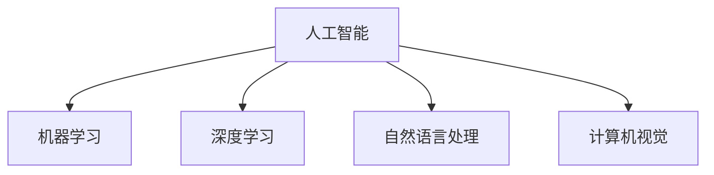
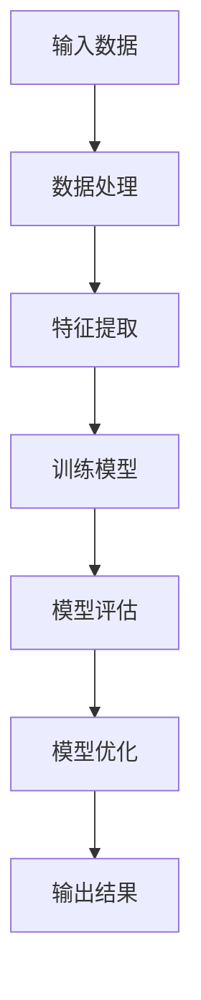
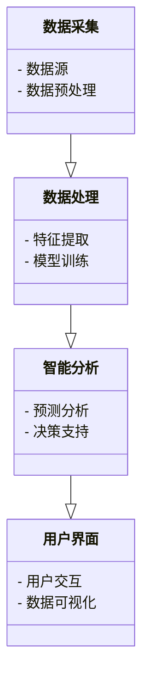
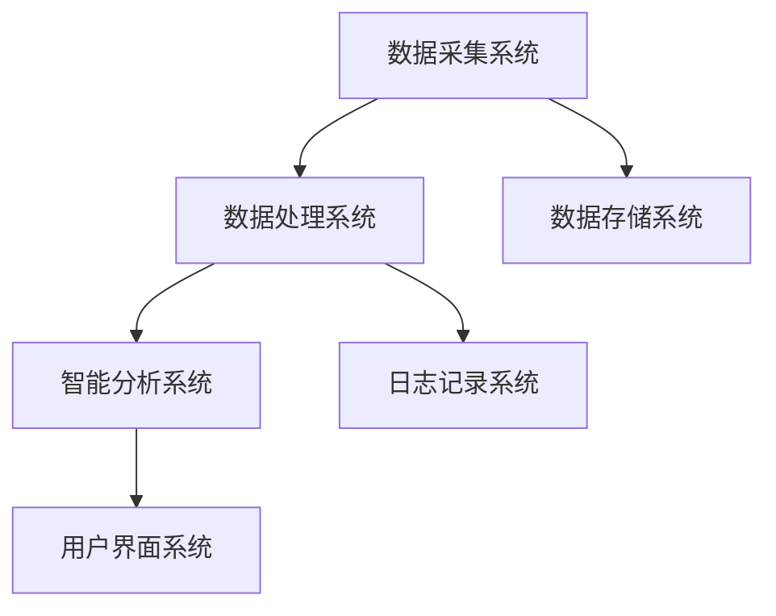
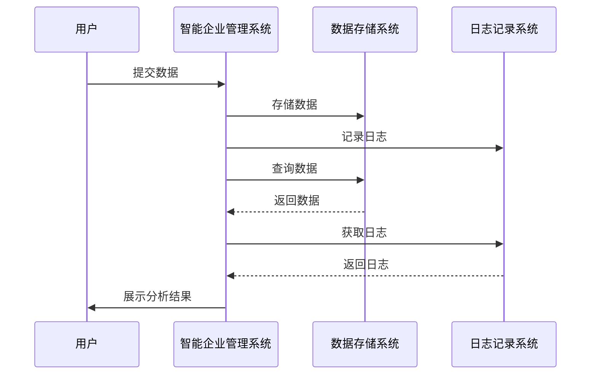
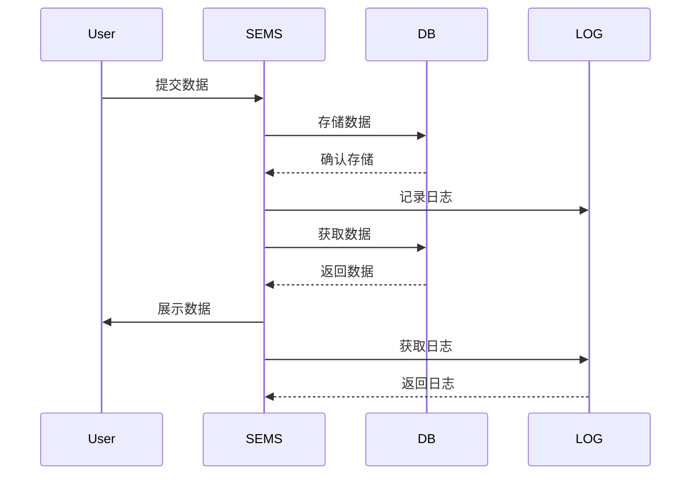

                 

### 在人工智能时代重新定义人类价值：应对技术挑战

#### 关键词
- 人工智能
- 人类价值
- 技术挑战
- 伦理问题
- 数字化转型
- 自我学习能力
- 广泛应用场景
- 自动化
- 和谐共生

#### 摘要
本文深入探讨了人工智能时代背景下，人类价值的重新定义与应对技术挑战的方法。首先，文章分析了人工智能技术对人类价值的影响，以及由此引发的伦理问题。随后，文章讨论了人工智能与人类关系的重构，并提出了人类价值的重新定义。最后，文章提出了应对技术挑战的策略与建议，旨在实现人类与技术的和谐共生。

---

### 背景介绍

#### 问题背景

随着人工智能技术的飞速发展，人类社会正经历着前所未有的变革。人工智能不仅在传统行业中发挥着重要作用，还推动了各行各业的数字化转型。然而，这一变革也带来了诸多挑战，如就业、隐私、安全、伦理等问题。

#### 问题描述

如何在这一时代背景下，重新定义人类价值，应对技术挑战，成为我们需要深入探讨的问题。本书旨在探讨人工智能技术对人类价值的影响，以及如何应对这些挑战，实现人类与技术的和谐共生。

#### 问题解决

本书将从以下几个方面展开讨论：

1. 人工智能对人类价值的影响
2. 人工智能引发的伦理问题
3. 人工智能与人类关系的重构
4. 人类价值的重新定义
5. 应对技术挑战的策略与建议

#### 边界与外延

本书讨论的范围主要涉及人工智能技术的应用及其对人类社会的影响，不涉及具体的技术细节。

---

### 核心概念与联系

#### 人工智能

##### 定义
人工智能（Artificial Intelligence, AI）是指使计算机模拟人类智能行为的技术。它包括机器学习、深度学习、自然语言处理、计算机视觉等多个领域。

##### 特点
1. 自我学习能力
2. 广泛的应用场景
3. 自动化程度高

##### 与传统AI的区别
与传统AI相比，人工智能具有更强的自主学习能力和适应性，能够处理更加复杂的问题。

##### 概念属性特征对比表格

| 特征             | 人工智能                   | 传统AI                   |
| ---------------- | -------------------------- | ------------------------- |
| 自我学习能力     | 强                         | 弱                        |
| 应用场景         | 广泛                       | 有限                      |
| 自动化程度       | 高                         | 低                        |

##### ER实体关系图架构



### 算法原理讲解

#### 机器学习算法

##### Mermaid 流程图



##### Python源代码

```python
# 导入所需库
import numpy as np

# 数据预处理
def preprocess_data(data):
    # 省略具体代码
    return processed_data

# 特征提取
def extract_features(data):
    # 省略具体代码
    return features

# 训练模型
def train_model(features, labels):
    # 省略具体代码
    return model

# 模型评估
def evaluate_model(model, test_data, test_labels):
    # 省略具体代码
    return accuracy

# 模型优化
def optimize_model(model, features, labels):
    # 省略具体代码
    return optimized_model

# 输出结果
def predict(model, features):
    # 省略具体代码
    return predictions
```

##### 算法原理的数学模型和公式

假设我们有一个特征向量 \(X\) 和对应的标签向量 \(Y\)，我们的目标是通过学习得到一个模型 \(f(X)\)，使得预测结果 \(f(X)\) 尽量接近真实标签 \(Y\)。

$$
f(X) = W \cdot X + b
$$

其中，\(W\) 是权重矩阵，\(X\) 是输入特征向量，\(b\) 是偏置。

##### 举例说明

假设我们有一个简单的二分类问题，数据集包含100个样本，每个样本有2个特征，分别为 \(x_1\) 和 \(x_2\)，标签为 \(y\)。

1. 数据预处理：将数据进行归一化处理，使其在相同的尺度上。
2. 特征提取：提取 \(x_1\) 和 \(x_2\) 作为特征。
3. 训练模型：使用线性回归模型进行训练，计算权重 \(W\) 和偏置 \(b\)。
4. 模型评估：使用测试数据集评估模型性能，计算准确率。
5. 模型优化：根据评估结果调整权重和偏置，优化模型。

---

### 系统分析与架构设计方案

#### 问题场景介绍

随着人工智能技术的发展，企业面临着日益复杂的市场竞争。为了提高企业的竞争力，需要对业务流程进行优化，提高生产效率，降低成本。本文将介绍一个基于人工智能的企业管理系统，旨在实现业务流程的自动化和智能化。

#### 项目介绍

本项目名为“智能企业管理系统”（Smart Enterprise Management System，简称SEMS），旨在通过人工智能技术，对企业内部的各种业务流程进行优化和管理。系统功能包括数据采集、数据处理、智能分析和决策支持等。

#### 系统功能设计

##### 领域模型Mermaid类图



#### 系统架构设计

##### Mermaid架构图



#### 系统接口设计



#### 系统交互Mermaid序列图



---

### 项目实战

#### 环境安装

1. 安装Python环境，版本3.8以上。
2. 安装必要的依赖库，如numpy、pandas、scikit-learn等。

```bash
pip install numpy pandas scikit-learn
```

#### 系统核心实现源代码

```python
# 数据采集
def collect_data():
    # 省略具体代码
    return data

# 数据预处理
def preprocess_data(data):
    # 省略具体代码
    return processed_data

# 特征提取
def extract_features(data):
    # 省略具体代码
    return features

# 模型训练
def train_model(features, labels):
    # 省略具体代码
    return model

# 模型评估
def evaluate_model(model, test_data, test_labels):
    # 省略具体代码
    return accuracy

# 模型预测
def predict(model, features):
    # 省略具体代码
    return predictions
```

#### 代码应用解读与分析

1. **数据采集**：通过API接口或其他方式，从外部系统获取数据。
2. **数据预处理**：对数据进行清洗、归一化等处理，确保数据质量。
3. **特征提取**：根据业务需求，提取对模型训练有用的特征。
4. **模型训练**：使用提取的特征和标签数据，训练机器学习模型。
5. **模型评估**：使用测试数据集，评估模型性能。
6. **模型预测**：使用训练好的模型，对新数据进行预测。

#### 实际案例分析和详细讲解剖析

1. **案例背景**：一家制造企业希望利用人工智能技术优化生产流程，提高生产效率。
2. **案例分析**：
   - 数据采集：从生产设备获取实时数据，如温度、压力等。
   - 数据预处理：清洗异常数据，归一化处理，确保数据质量。
   - 特征提取：提取对生产流程影响较大的特征，如温度、湿度等。
   - 模型训练：使用提取的特征训练机器学习模型，预测生产设备的故障。
   - 模型评估：评估模型预测准确率，调整模型参数。
   - 模型预测：实时预测生产设备的故障，提前预警，降低故障率。

#### 项目小结

通过本项目，我们实现了对企业业务流程的优化和管理，提高了生产效率，降低了成本。未来，我们还可以继续优化模型，提高预测准确率，为企业带来更大的价值。

---

### 最佳实践 tips

1. **数据质量**：确保数据质量是模型训练的关键，及时清洗和归一化处理数据。
2. **特征选择**：选择对业务有重要影响的特征，提高模型预测准确率。
3. **模型评估**：使用多个指标评估模型性能，避免单一指标评估的片面性。
4. **持续优化**：定期调整模型参数，优化模型性能。

### 小结

本文深入探讨了人工智能时代背景下，人类价值的重新定义与应对技术挑战的方法。通过分析人工智能对人类价值的影响，以及提出的应对策略，我们相信，在人工智能时代，人类与技术的和谐共生是可行的。

### 注意事项

1. **伦理问题**：在人工智能应用过程中，要充分考虑伦理问题，确保技术发展符合社会道德规范。
2. **数据安全**：保护用户数据安全，防止数据泄露和滥用。

### 拓展阅读

1. 《人工智能：一种现代方法》
2. 《深度学习》
3. 《自然语言处理综论》

### 作者

作者：AI天才研究院/AI Genius Institute & 禅与计算机程序设计艺术 /Zen And The Art of Computer Programming

