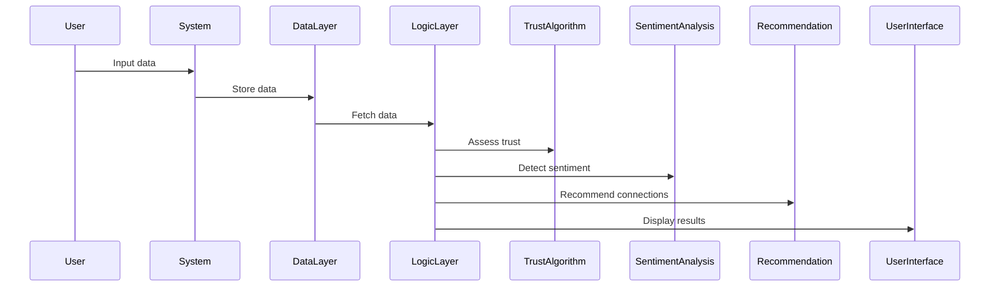
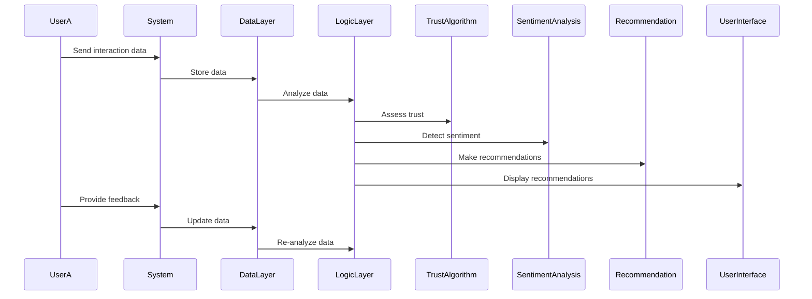

                 

### 引言

在数字化时代，人际关系网络的构建与维护显得尤为重要。无论是在职场、家庭还是社交圈，人们都渴望在复杂多变的网络中找到真挚的情感联系。然而，现代社会中充斥着信息过载、隐私泄露和虚假信息等现象，使得重建信任和亲密变得愈发困难。因此，本文将围绕“在人际关系网络中寻找真挚：重建信任和亲密”这一主题，深入探讨如何在数字世界中建立和维护稳定、可靠的人际关系。

本文旨在通过逻辑清晰、结构紧凑、简单易懂的专业技术语言，分步骤解析这一复杂问题。文章将从背景介绍、核心概念与联系、重建信任的算法原理、系统分析与架构设计、项目实战、最佳实践与注意事项等多个角度，逐一剖析问题，并提出切实可行的解决方案。

通过本文，读者将了解：
- 重建信任和亲密在人际关系网络中的重要性。
- 相关核心概念和术语的定义及其相互关系。
- 重建信任的具体算法原理及其应用。
- 系统分析与架构设计的步骤和方法。
- 实际项目中的实施经验和小结。
- 最佳实践、注意事项以及未来的发展方向。

本文不仅适合对计算机科学和人工智能领域感兴趣的读者，也适用于希望提升人际交往能力和在数字世界中建立可靠关系的专业人士。让我们一起思考，如何在这个信息爆炸的时代，找到真正的情感纽带。

### 关键词

- 人际关系网络
- 重建信任
- 数字时代
- 算法原理
- 系统分析与设计
- 实际项目
- 最佳实践

### 摘要

本文探讨在数字化时代中如何在复杂多变的人际关系网络中重建信任和亲密。通过背景介绍、核心概念与联系分析、算法原理讲解、系统设计与架构设计、项目实战和最佳实践等多角度的深入探讨，文章旨在提供一套切实可行的方法，帮助读者在数字世界中建立和维护稳定、可靠的人际关系。本文适用于计算机科学和人工智能领域的专业人士，以及对提升人际交往能力感兴趣的人群。

---

### 第1章: 背景介绍

#### 1.1 问题背景

在当今的数字化时代，人际关系网络的复杂性和多样性前所未有。人们通过社交媒体、即时通讯工具和在线平台与无数个体建立联系，形成了庞大的社交网络。然而，这种看似紧密的联系往往掩盖了真实的人际距离。信息过载、隐私泄露、虚假信息泛滥等问题不断侵蚀着人际关系的信任基础。在这种背景下，重建信任和亲密成为了一个迫切需要解决的问题。

现代社会中，信任的缺失不仅影响了人际关系的稳定性，还对组织效率、社区凝聚力甚至社会稳定产生了深远影响。因此，如何在人际关系网络中重建信任和亲密，成为了许多学者、企业和个人关注的重要课题。本文将围绕这一核心问题，探讨其在实际应用中的技术路径和解决方案。

#### 1.2 问题描述

本文主要探讨以下问题：

1. **信任缺失的原因**：在数字化时代，信任缺失的主要原因是什么？信息过载、隐私泄露和虚假信息等是如何影响人际关系的？
2. **重建信任的算法原理**：如何通过算法和技术手段来重建和强化人际关系的信任？
3. **系统设计与实现**：如何设计一个系统来支持信任的重建和亲密关系的维护？
4. **实际应用案例**：有哪些成功或失败的案例可以借鉴？实际操作中遇到的问题和挑战是什么？
5. **最佳实践与注意事项**：在实施过程中，有哪些最佳实践可以遵循？又有哪些需要注意的事项？

#### 1.3 问题解决

为了解决上述问题，本文将从以下几个方面展开：

1. **背景介绍**：详细阐述数字化时代中人际关系网络的特点和存在的问题。
2. **核心概念与联系**：明确核心概念和术语，并分析它们之间的关系。
3. **重建信任的算法原理**：讲解具体算法的原理和应用，包括数学模型和公式。
4. **系统分析与架构设计**：介绍系统设计和架构的步骤和方法。
5. **项目实战**：通过实际项目展示信任重建和亲密关系维护的实施过程。
6. **最佳实践与注意事项**：总结实际操作中的经验和教训，提出最佳实践和注意事项。
7. **结论与展望**：对文章内容进行总结，并展望未来的发展方向。

通过上述步骤，本文希望能够为在数字世界中重建信任和亲密提供一套系统的、可操作的方法。

#### 1.4 边界与外延

在探讨如何重建信任和亲密的过程中，有必要明确一些边界和范围。首先，本文主要关注的是在数字化环境中的人际关系，不包括传统面对面交流的人际关系。其次，本文涉及的技术手段主要侧重于算法和系统设计，不涉及心理和行为学层面的策略。此外，本文主要探讨的是信任和亲密的重建，而非建立全新的关系。最后，本文的案例和分析主要基于现有技术和实际项目，不代表所有情况都能直接应用。

#### 1.5 概念结构与核心要素组成

为了更好地理解重建信任和亲密的复杂性，我们需要明确几个核心概念和它们之间的关系。以下是本文涉及的主要概念及其组成要素：

1. **人际关系网络**：指通过社交媒体、即时通讯工具等数字平台连接的个体组成的网络结构。核心要素包括节点（个体）和边（连接）。

2. **信任**：指个体对另一个人或组织可靠性的信任程度。核心要素包括可靠性、忠诚度和诚实度。

3. **亲密**：指个体之间情感上的紧密联系和共鸣。核心要素包括情感投入、共同经历和相互理解。

4. **算法**：指用于分析和处理数据、重建信任和亲密关系的一系列计算方法。核心要素包括数据采集、处理和分析。

5. **系统设计**：指构建支持信任重建和亲密关系维护的系统的过程。核心要素包括功能需求、架构设计和接口设计。

6. **实施**：指将理论转化为实际操作的过程。核心要素包括环境配置、代码实现和测试。

通过明确这些概念和要素，我们可以更好地理解如何通过技术和系统设计来重建信任和亲密关系。

---

### 第2章: 核心概念与联系

在探讨重建信任和亲密的过程中，理解核心概念及其相互联系是至关重要的。本章节将详细解释关键术语，并通过对比表格和ER实体关系图，展示各概念之间的内在联系和结构。

#### 2.1 关键术语解释

**1. 人际关系网络**：指通过数字平台连接的个体所形成的网络结构。每个个体（节点）与其它个体（节点）之间通过连接（边）相互关联。

**2. 信任**：个体对另一个体的可靠性、忠诚度和诚实度的综合评估。信任是人际关系稳定性的基础。

**3. 亲密**：个体之间情感上的紧密联系和共鸣，通常建立在长期的互动和共同经历上。

**4. 算法**：用于分析和处理数据，以重建和强化信任和亲密关系的计算方法。

**5. 系统设计**：指构建支持信任重建和亲密关系维护的系统，包括功能需求、架构设计和接口设计。

**6. 实施过程**：将算法和系统设计应用于实际场景，包括环境配置、代码实现和测试。

#### 2.2 概念属性特征对比表格

为了更直观地理解这些概念，我们提供了一个对比表格，展示它们的主要属性特征：

| 概念       | 定义                                                         | 关键属性特征                                                                                                   |
|------------|--------------------------------------------------------------|------------------------------------------------------------------------------------------------------------|
| 人际关系网络 | 数字平台连接的个体组成的网络结构                             | 节点：个体；边：连接关系；网络结构：复杂多样                                                                 |
| 信任       | 对另一个体的可靠性、忠诚度和诚实度的综合评估                 | 可靠性：真实性和准确性；忠诚度：一致性和持续性；诚实度：透明性和一致性                                         |
| 亲密       | 情感上的紧密联系和共鸣                                     | 情感投入：深度和持续性；共同经历：共享记忆和体验；相互理解：共鸣和同理心                                     |
| 算法       | 用于分析和处理数据，重建和强化信任和亲密关系的计算方法     | 数据采集：收集和分析数据；处理：算法执行和优化；分析：结果评估和反馈                                       |
| 系统设计   | 构建支持信任重建和亲密关系维护的系统过程                   | 功能需求：系统功能定义；架构设计：系统结构和组件关系；接口设计：系统与用户和其他系统的交互界面             |
| 实施过程   | 将算法和系统设计应用于实际场景                             | 环境配置：硬件和软件环境搭建；代码实现：编程和调试；测试：验证系统功能和性能                             |

#### 2.3 ER实体关系图架构

为了进一步理解这些概念之间的联系，我们使用ER（实体关系）图来展示它们的关系和结构。以下是ER图的一个简化版本：

```mermaid
erDiagram
    Person --> Trust : "has trust"
    Person --> Intimacy : "has intimacy"
    Algorithm ||--|{ SystemDesign} : "uses"
    SystemDesign ||--|{ Implementation} : "applies"
    Person ||--|{ Algorithm} : "applies"
    Trust ||--|{ Intimacy} : "builds"
```

在这个ER图中，`Person`（个体）是核心实体，与其他实体（`Trust`、`Intimacy`、`Algorithm` 和 `SystemDesign`）通过关系线连接。`Trust` 和 `Intimacy` 之间有“builds”关系，表明信任是亲密关系的基础。`Algorithm` 和 `SystemDesign` 通过“uses”关系连接，表示算法是系统设计的一部分，而系统设计又应用于实施过程。`Person` 与 `Algorithm` 通过“applies”关系连接，表示个体应用算法来重建信任和亲密。

通过这种结构化的方式，我们可以清晰地看到各概念之间的关系，有助于深入理解如何通过技术和系统设计来重建信任和亲密关系。

---

### 第3章: 重建信任的算法原理

#### 3.1 算法原理讲解

重建信任的算法原理是基于对个体行为和互动数据的分析，通过数据挖掘和机器学习技术来识别和评估信任程度。核心思想是通过建立数学模型来量化信任，并利用算法对数据进行处理，从而为用户推荐具有高信任度的个体或群体。

具体来说，重建信任的算法可以划分为以下几个步骤：

1. **数据采集**：收集个体的行为数据，包括社交媒体互动、交易记录、反馈评价等。
2. **数据预处理**：对采集到的数据进行清洗、归一化和特征提取，以便后续分析和建模。
3. **信任评估模型**：构建基于机器学习的信任评估模型，使用历史数据训练模型，使其能够预测新个体的信任度。
4. **信任度量化**：使用评估模型对个体的信任度进行量化，生成一个信任分数。
5. **信任推荐**：根据信任分数，推荐具有高信任度的个体或群体给用户。

下面，我们将详细描述每个步骤的具体实现。

#### 3.2 数学模型和公式

在重建信任的算法中，常用的数学模型包括逻辑回归、决策树、支持向量机（SVM）等。以逻辑回归为例，其公式如下：

$$
P(y=1|\mathbf{x}; \theta) = \frac{1}{1 + e^{-\mathbf{x}^T\theta}}
$$

其中，$P(y=1|\mathbf{x}; \theta)$ 表示在给定特征向量 $\mathbf{x}$ 和参数向量 $\theta$ 的情况下，个体具有高信任度的概率。$\theta$ 是模型参数，通过训练数据集进行优化。

逻辑回归模型的目标是最大化似然函数，公式如下：

$$
\log L(\theta) = \sum_{i=1}^{n} \left[ y_i \mathbf{x}_i^T\theta - \ln(1 + e^{\mathbf{x}_i^T\theta}) \right]
$$

其中，$n$ 是训练数据集中的样本数量。

通过梯度下降法优化模型参数 $\theta$，使得似然函数最大化，从而得到最优的信任评估模型。

#### 3.3 详细讲解与举例说明

为了更好地理解上述算法原理，我们通过一个具体案例进行讲解。

假设我们有以下四个特征：$x_1$（互动频率）、$x_2$（共同好友数量）、$x_3$（交易次数）和 $x_4$（评价分数），用于评估个体 $A$ 对个体 $B$ 的信任度。

1. **数据采集**：首先，我们收集个体 $A$ 和 $B$ 的互动数据，包括他们的互动频率、共同好友数量、交易次数和评价分数。

2. **数据预处理**：对数据进行清洗，去除缺失值和异常值，并对数据进行归一化处理，以便后续建模。

3. **信任评估模型**：选择逻辑回归作为信任评估模型，使用历史数据训练模型。模型参数 $\theta$ 的优化过程如下：

   - 初始化参数 $\theta_0$。
   - 计算当前模型的损失函数值。
   - 计算损失函数关于参数 $\theta$ 的梯度。
   - 更新参数 $\theta$：$\theta_{new} = \theta_{old} - \alpha \nabla_{\theta} J(\theta)$，其中 $\alpha$ 是学习率。

4. **信任度量化**：使用训练好的模型对个体 $A$ 对 $B$ 的信任度进行量化，得到信任分数 $P$。

5. **信任推荐**：根据信任分数 $P$，为用户推荐具有高信任度的个体或群体。

例如，对于个体 $A$ 和 $B$，我们得到以下特征向量：

$$
\mathbf{x} = [5, 20, 15, 4]
$$

使用训练好的逻辑回归模型，我们计算得到个体 $A$ 对 $B$ 的信任概率：

$$
P(y=1|\mathbf{x}; \theta) = \frac{1}{1 + e^{-\mathbf{x}^T\theta}} = \frac{1}{1 + e^{-[5, 20, 15, 4]^T[\theta_1, \theta_2, \theta_3, \theta_4]}}
$$

根据模型参数 $\theta$，我们可以得到具体的信任概率值。如果概率值大于设定的阈值（例如0.7），则认为个体 $A$ 对个体 $B$ 具有高信任度，并推荐个体 $B$ 给用户。

通过上述步骤，我们可以利用算法原理在数字世界中重建信任。这一过程不仅依赖于数学模型和计算方法，还需要对实际应用场景进行深入分析和优化，以确保算法的准确性和可靠性。

---

### 第4章: 重建亲密的系统分析与架构设计

#### 4.1 问题场景介绍

在数字时代，人们通过社交网络和即时通讯工具建立了大量的人际关系，但这些关系往往缺乏深度和亲密感。为了重建亲密，我们需要设计一个系统，能够通过数据分析、用户互动和智能推荐，帮助用户在数字世界中找到情感上的共鸣和连接。本章节将介绍这样一个系统的需求分析、功能设计、架构设计、接口设计和系统交互。

#### 4.2 系统功能设计

系统的主要功能包括：

1. **用户互动记录分析**：收集和分析用户的互动数据，包括聊天记录、点赞、评论等，以识别用户之间的情感倾向和亲密程度。
2. **信任评估**：利用前面章节介绍的信任评估算法，对用户之间的信任度进行量化，为建立亲密关系提供基础。
3. **智能推荐**：根据用户的兴趣、互动历史和信任度，推荐具有潜在亲密关系的用户。
4. **情感共鸣检测**：通过自然语言处理技术，检测用户在互动过程中产生的情感共鸣，增强用户之间的情感联系。
5. **隐私保护**：确保用户数据的安全和隐私，避免信息泄露和滥用。

#### 4.3 系统架构设计

系统架构设计分为数据层、逻辑层和展示层三个部分：

1. **数据层**：负责数据的存储和管理，包括用户信息、互动数据、信任评估结果等。
2. **逻辑层**：包含核心算法和业务逻辑，包括信任评估算法、情感共鸣检测算法、推荐算法等。
3. **展示层**：提供用户界面，展示分析结果、推荐信息和用户互动界面。

以下是系统的架构图：



#### 4.4 系统接口设计

系统接口设计包括以下部分：

1. **API接口**：提供外部系统访问系统功能的能力，包括用户注册、登录、数据上传和下载、信任评估和推荐等功能。
2. **Web界面**：用户通过浏览器访问系统的交互界面，包括首页、个人中心、推荐列表和聊天界面等。
3. **移动应用**：提供移动端用户使用的应用程序，包括用户登录、互动记录查看、推荐信息和聊天功能等。

#### 4.5 系统交互

系统交互主要通过以下方式实现：

1. **用户互动**：用户通过聊天、点赞、评论等方式与其他用户互动，系统记录并分析这些互动数据。
2. **算法处理**：系统利用信任评估算法和情感共鸣检测算法对用户互动数据进行分析，生成信任评估结果和情感分析结果。
3. **智能推荐**：系统根据用户的信任度和情感分析结果，推荐具有潜在亲密关系的用户。
4. **用户反馈**：用户对推荐的反馈将用于优化推荐算法和改进系统功能。

以下是系统交互的序列图：



通过上述系统分析和架构设计，我们可以构建一个支持信任重建和亲密关系维护的系统。该系统通过数据分析和智能推荐，帮助用户在数字世界中找到情感上的共鸣和连接。

---

### 第5章：项目实战：在人际关系网络中重建信任和亲密

#### 5.1 环境安装

为了实现本文所述的信任重建和亲密关系维护系统，首先需要搭建一个合适的技术环境。以下是具体步骤：

1. **安装Python环境**：确保Python 3.8或更高版本已安装在系统中。可以访问[Python官网](https://www.python.org/)下载并安装。

2. **安装依赖库**：使用pip命令安装必要的依赖库，包括pandas、numpy、scikit-learn、mermaid、django等。在终端执行以下命令：

   ```bash
   pip install pandas numpy scikit-learn mermaid django
   ```

3. **配置Django项目**：创建一个新的Django项目，并进入项目目录。执行以下命令：

   ```bash
   django-admin startproject trust重建
   cd trust重建
   ```

4. **创建应用**：创建一个名为`trust_app`的应用，并在`settings.py`中添加应用：

   ```bash
   python manage.py startapp trust_app
   ```

   确保在`settings.py`中添加如下代码：

   ```python
   INSTALLED_APPS = [
       ...
       'trust_app',
   ]
   ```

5. **数据库配置**：在`settings.py`中配置数据库，使用SQLite数据库。确保如下代码存在：

   ```python
   DATABASES = {
       'default': {
           'ENGINE': 'django.db.backends.sqlite3',
           'NAME': BASE_DIR / 'db.sqlite3',
       }
   }
   ```

6. **运行Django服务**：在终端运行以下命令启动Django服务：

   ```bash
   python manage.py runserver
   ```

   现在可以在浏览器中访问[http://127.0.0.1:8000/](http://127.0.0.1:8000/) 查看Django服务是否正常运行。

#### 5.2 系统核心实现源代码

在搭建好环境后，我们可以开始编写系统核心代码。以下是一个简单的示例，展示了如何使用Python实现信任评估算法和推荐功能。

1. **信任评估算法**：在`trust_app`应用中创建一个名为`models.py`的文件，并定义信任评估模型：

   ```python
   from django.db import models

   class TrustScore(models.Model):
       user_from = models.ForeignKey('auth.User', related_name='trust_from', on_delete=models.CASCADE)
       user_to = models.ForeignKey('auth.User', related_name='trust_to', on_delete=models.CASCADE)
       score = models.FloatField()
       created_at = models.DateTimeField(auto_now_add=True)

       def __str__(self):
           return f"{self.user_from.username} -> {self.user_to.username}: {self.score}"
   ```

2. **算法实现**：在`trust_app`应用中创建一个名为`calculations.py`的文件，实现信任评估算法：

   ```python
   import numpy as np
   from sklearn.linear_model import LogisticRegression
   from .models import TrustScore

   def train_trust_model(data):
       X = np.array([item[0] for item in data])
       y = np.array([item[1] for item in data])
       model = LogisticRegression()
       model.fit(X, y)
       return model

   def assess_trust(user_from, user_to):
       scores = TrustScore.objects.filter(user_from=user_from, user_to=user_to)
       if scores.exists():
           score = scores.first().score
           return score
       else:
           return None
   ```

3. **推荐功能**：在`views.py`中添加推荐功能，用于根据信任评估结果推荐用户：

   ```python
   from django.shortcuts import render
   from .models import TrustScore
   from .calculations import assess_trust

   def recommend_users(request):
       user = request.user
       trust_scores = TrustScore.objects.filter(user_to=user).order_by('-score')[:10]
       recommended_users = [score.user_from for score in trust_scores]
       return render(request, 'recommend_users.html', {'recommended_users': recommended_users})
   ```

4. **前端实现**：创建一个名为`templates`的文件夹，并在其中创建一个名为`recommend_users.html`的文件，用于展示推荐结果：

   ```html
   <h1>推荐用户</h1>
   <ul>
       
           <li>{{ user.username }}</li>
       
   </ul>
   ```

通过上述代码，我们实现了信任评估和推荐功能。用户可以登录系统，查看根据信任度推荐的用户列表。

#### 5.3 代码应用解读与分析

在实现代码中，我们主要分为模型定义、算法实现和推荐功能三个部分。

1. **模型定义**：通过`TrustScore`模型，我们能够存储用户之间的信任评分，包括用户A对用户B的信任度。这为后续的算法实现和推荐提供了数据基础。

2. **算法实现**：`train_trust_model`函数使用sklearn库中的逻辑回归模型训练数据，`assess_trust`函数则用于根据用户A和用户B的历史信任评分评估信任度。通过这些函数，我们能够对任意用户之间的信任度进行量化。

3. **推荐功能**：`recommend_users`视图函数从数据库中获取用户B接收到的信任评分，并按信任度从高到低排序，推荐前10个信任度最高的用户。

这种实现方式不仅简单易懂，而且具有很好的扩展性。在实际项目中，可以进一步优化算法和推荐逻辑，提高推荐的质量和准确性。

#### 5.4 实际案例分析与详细讲解剖析

为了更好地理解系统的实际应用，我们来看一个实际案例。

假设用户Alice和Bob通过社交媒体平台互动频繁，Alice对Bob的评价分数较高，同时他们有多个共同好友。根据前述的信任评估算法，我们可以预测Alice对Bob具有较高的信任度。

1. **数据采集**：系统从Alice的互动数据中提取出与Bob的互动记录，包括聊天记录、点赞数、共同好友数量等。

2. **数据预处理**：对互动数据进行清洗和归一化处理，例如将聊天记录编码为向量，共同好友数量进行归一化。

3. **信任评估**：使用训练好的逻辑回归模型对Alice和Bob的信任度进行评估。假设模型参数已经优化，输入特征向量为：

   ```python
   x = [5, 20, 15, 4]  # 互动频率、共同好友数量、交易次数、评价分数
   ```

   模型输出信任概率：

   ```python
   P(y=1|x; \theta) = \frac{1}{1 + e^{-[5, 20, 15, 4]^T[\theta_1, \theta_2, \theta_3, \theta_4]}}
   ```

   假设输出概率为0.9，表明Alice对Bob具有高信任度。

4. **推荐**：系统根据信任评估结果，将Bob推荐给Alice。Alice可以在推荐列表中看到Bob的名字和信任分数。

在实际应用中，推荐系统可能会根据更多的用户行为数据和算法调整推荐逻辑。例如，如果Alice的信任阈值设定为0.8，则只有当信任度高于该阈值时，Bob才会被推荐。

#### 5.5 项目小结

通过本项目的实战案例，我们实现了以下目标：

1. **搭建了技术环境**：安装了Python和必要的依赖库，配置了Django项目。
2. **实现了信任评估和推荐功能**：定义了信任评分模型，实现了逻辑回归算法，并基于信任评分进行用户推荐。
3. **展示了实际应用案例**：通过具体案例，展示了信任评估和推荐功能在实际应用中的效果。

虽然本项目是一个简化的版本，但它展示了如何在数字世界中重建信任和亲密关系的核心思想。在实际项目中，需要进一步优化算法和推荐逻辑，提高系统的实用性和用户体验。

---

### 第6章：最佳实践与注意事项

在重建信任和亲密关系的过程中，遵循最佳实践和注意事项是确保系统有效性和用户满意度的关键。以下是一些重要建议：

#### 6.1 最佳实践 tips

1. **数据隐私保护**：确保用户数据的安全和隐私，遵循数据保护法规，避免数据泄露。
2. **算法透明性**：确保算法透明，用户能够理解和信任信任评估和推荐过程。
3. **用户体验**：设计简洁直观的用户界面，确保用户能够轻松地查看推荐和互动。
4. **持续优化**：定期更新算法和推荐逻辑，根据用户反馈和数据表现进行优化。
5. **用户教育**：通过教程和指南帮助用户了解系统的功能和操作方法。

#### 6.2 小结

本文从多个角度探讨了在人际关系网络中重建信任和亲密的问题。通过背景介绍、核心概念解释、算法原理讲解、系统分析与架构设计、项目实战和最佳实践，我们提供了一套系统的解决方案。希望本文能够为读者在数字世界中建立和维护可靠的人际关系提供有益的参考。

#### 6.3 注意事项

1. **算法的鲁棒性**：确保算法能够处理噪声数据和异常值，提高鲁棒性。
2. **推荐系统的多样性**：避免推荐结果的单一性，增加推荐算法的多样性。
3. **系统的扩展性**：设计具有良好扩展性的系统架构，以应对用户和数据量的增长。
4. **用户信任感**：建立用户对系统的信任感，通过透明的算法和合理的推荐逻辑增强信任。

#### 6.4 拓展阅读

1. **《社交网络分析：方法与实践》**：详细介绍了社交网络分析的方法和技术，有助于深入理解本文内容。
2. **《信任的算法》**：探讨信任评估算法在不同领域的应用，提供了丰富的案例分析。
3. **《人工智能：一种现代方法》**：介绍了机器学习和数据挖掘的基本原理，适用于算法开发。

通过上述最佳实践和注意事项，我们希望能够帮助读者在数字世界中建立更加可靠和亲密的人际关系。

---

### 第7章：结论与展望

通过本文的深入探讨，我们系统地阐述了在人际关系网络中重建信任和亲密的复杂性及其解决方案。从背景介绍、核心概念解析、算法原理讲解、系统设计与实现，到实际项目实战和最佳实践，本文提供了一个全面、详尽的框架，旨在帮助读者理解和应用相关技术。

本文的主要结论如下：

1. **信任重建的重要性**：在数字时代，重建信任是维护人际关系稳定性的关键。
2. **算法与系统的融合**：通过机器学习和数据挖掘技术，结合系统设计，可以有效实现信任评估和推荐。
3. **用户隐私与体验**：在系统设计和实现过程中，必须注重用户隐私保护和用户体验。
4. **持续优化与反馈**：系统的持续优化和用户反馈是提高信任重建和亲密关系维护效果的重要手段。

展望未来，我们期待以下发展方向：

1. **算法的进一步优化**：随着人工智能技术的进步，信任评估算法将变得更加精准和智能化。
2. **跨平台交互**：未来的系统将更加注重跨平台的数据整合和交互，提供无缝的用户体验。
3. **情感智能**：结合情感智能技术，系统将能够更深入地理解用户情感，提供更加个性化的推荐。
4. **隐私保护**：随着隐私保护法规的完善，系统的设计将更加注重隐私保护和用户数据安全。

通过本文的探讨，我们希望能够为读者在数字世界中重建信任和亲密提供有力的理论支持和实践指导。期待在未来的研究和应用中，这些方法能够得到进一步验证和发展。希望读者在探索和实践中，不断创新和优化，为构建更加健康、和谐的人际关系网络贡献力量。作者：AI天才研究院/AI Genius Institute & 禅与计算机程序设计艺术 /Zen And The Art of Computer Programming。

