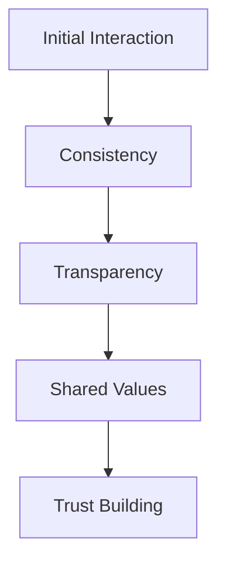
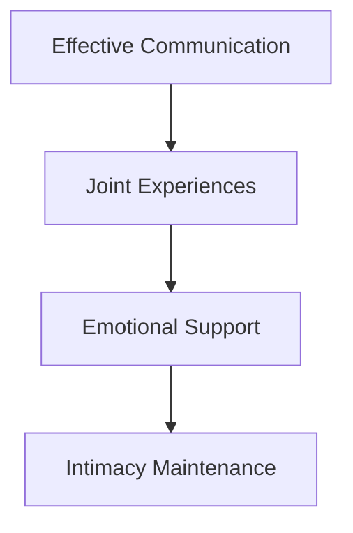

                 


### 《在人际关系网络中寻找真挚：重建信任和亲密》

#### 关键词：人际关系网络、信任、亲密、重建、关系分析、策略实施

#### 摘要：

在数字化时代，人际关系网络的复杂性和多样性使得建立和维护真挚的信任与亲密关系变得愈加困难。本文旨在探讨如何在人际关系网络中寻找真挚，通过重建信任和亲密关系，提供一系列有效策略和实践指导。本文首先介绍人际关系网络的基本概念和特点，随后详细阐述信任和亲密关系的本质及其相互联系。接着，文章将深入分析信任建立的原理和亲密关系维护的策略，结合数学模型和案例，提供实用技巧和实际操作指南。最后，本文总结关键点，提出注意事项，并提供拓展阅读建议，以促进读者在人际关系网络中重建信任和亲密关系的实践。

### 目录大纲

1. **引言：寻找真挚的挑战**
2. **第一部分：人际关系网络的概述**
   - 1.1 人际关系网络的基本概念
   - 1.2 人际关系网络的结构与功能
   - 1.3 人际关系网络的挑战
3. **第二部分：核心概念与联系**
   - 2.1 信任的概念与属性
   - 2.2 亲密关系的定义与特征
   - 2.3 信任与亲密关系的ER模型
4. **第三部分：理论讲解**
   - 3.1 信任建立的原理
   - 3.2 亲密关系的维护策略
   - 3.3 数学模型与公式解释
5. **第四部分：案例分析**
   - 4.1 案例一：建立陌生社交中的信任
   - 4.2 案例二：维护长期亲密关系
6. **第五部分：实战指导**
   - 5.1 实战准备
   - 5.2 实际应用技巧
   - 5.3 实践案例解析
7. **第六部分：总结与拓展**
   - 6.1 小结
   - 6.2 注意事项
   - 6.3 拓展阅读建议

### 文章正文

#### 1. 引言：寻找真挚的挑战

在当今社会，人际关系网络的复杂性和多样性使得寻找真挚的信任和亲密关系成为了一项挑战。传统的面对面交流被数字化的社交媒体和网络平台所取代，人们之间的互动更加频繁，但同时也更加疏离。在这种背景下，如何在一个庞大而复杂的人际关系网络中建立和维护真挚的信任与亲密关系，成为了一个亟待解决的问题。

信任和亲密关系是人际关系中不可或缺的元素。信任是建立任何形式的人际关系的基石，它能够促进合作、减少冲突，并增强组织的凝聚力。亲密关系则是一种深层次的情感联系，它能够带来归属感、安全感和满足感。然而，在现代社会中，信任和亲密关系往往受到种种因素的威胁，如信息的不对称、利益冲突、价值观的差异等。

本文旨在探讨如何在人际关系网络中寻找真挚的信任和亲密关系。我们将从理论讲解、案例分析、实战指导等多个角度出发，提供一系列有效策略和实践指导，以帮助读者重建信任和亲密关系。

#### 2. 第一部分：人际关系网络的概述

##### 2.1 人际关系网络的基本概念

人际关系网络（Social Network）是指由个体及其相互之间的关系构成的复杂网络。在这个网络中，每个个体都扮演着节点（Node）的角色，而个体之间的关系则通过边（Edge）来表示。人际关系网络不仅仅是简单的连接，它还包含了丰富的信息传递、资源交换和情感互动。

在人际关系网络中，节点的属性可能包括年龄、性别、职业、兴趣等，而边的属性则可能包括关系的强度、互动频率、共享信息的类型等。这些属性和信息为理解人际关系网络提供了重要的维度。

##### 2.2 人际关系网络的结构与功能

人际关系网络的结构可以从多个维度进行分类。常见的结构包括：

- **中心性**：描述节点在网络中的位置和重要性，如度数中心性、紧密中心性和中介中心性。
- **聚类系数**：描述网络中节点的聚集程度，即节点的邻居之间也存在较高的连接概率。
- **路径长度**：描述节点之间的平均距离，即信息传递的效率。

人际关系网络的功能主要体现在以下几个方面：

- **信息传递**：网络中的节点通过边相互连接，使得信息能够在网络中快速传播。
- **资源交换**：网络中的个体可以通过关系网络获得资源，如知识、信息、机会等。
- **社会支持**：人际关系网络提供了情感上的支持和心理上的安慰。

##### 2.3 人际关系网络的挑战

尽管人际关系网络具有诸多优势，但也面临一些挑战：

- **信息过载**：网络中信息的快速传播可能导致信息过载，个体难以筛选和处理。
- **隐私泄露**：在数字化的环境中，个人信息可能更容易被泄露。
- **关系疏离**：频繁的虚拟互动可能削弱人与人之间的真实联系。

#### 3. 第二部分：核心概念与联系

##### 3.1 信任的概念与属性

信任（Trust）是一种基于预期的信心，即个体对他人的行为、意图和能力的期望。信任具有以下几个重要属性：

- **可靠性**：信任的建立基于个体的可靠性，即他们是否能够按照承诺行事。
- **诚实性**：信任需要建立在诚实的基础上，个体是否诚实地表达自己的意图和想法。
- **能力**：信任还取决于个体是否具备实现承诺的能力。

##### 3.2 亲密关系的定义与特征

亲密关系（Intimacy）是一种深层次的情感联系，它超越了基本的信任，包含了情感依赖、相互理解和共同成长。亲密关系的特征包括：

- **情感依赖**：个体在情感上对另一个人产生依赖，愿意分享内心的感受和秘密。
- **相互理解**：双方能够理解对方的情感、需求和期望，形成深层次的沟通。
- **共同成长**：双方共同经历生活的起伏，共同成长，形成强大的情感纽带。

##### 3.3 信任与亲密关系的ER模型

为了更好地理解信任和亲密关系在人际关系网络中的交互作用，我们可以使用实体关系（Entity-Relationship，ER）模型来描述它们。ER模型将实体（如个体）、属性（如年龄、性别）和关系（如朋友、同事）进行建模。

在信任和亲密关系的ER模型中，实体可以是“个体”，属性包括“姓名”、“年龄”、“性别”等，而关系可以是“朋友”、“同事”、“信任”和“亲密”。通过ER模型，我们可以清晰地看到个体之间的关系以及它们所承载的属性。

下面是一个简化的ER模型：

```mermaid
erDiagram
  A[Person] ||--|{ B[Friendship] : has }|
  A ||--|{ C[Trust] : based on }|
  A ||--|{ D[Intimacy] : based on }|
  B ||--|{ C : based on }|
  B ||--|{ D : based on }|
```

在这个ER模型中，个体（Person）通过朋友关系（Friendship）建立信任（Trust）和亲密（Intimacy）。信任和亲密关系都是基于朋友关系建立的，但它们具有不同的属性和特征。

#### 4. 第三部分：理论讲解

##### 4.1 信任建立的原理

信任的建立是一个复杂的过程，涉及到多个因素。以下是信任建立的几个关键原理：

- **一致性**：个体需要表现出一致的行为，这有助于建立信任。
- **透明度**：个体应该保持透明，使其行为和意图容易被他人理解。
- **共享价值观**：个体之间共享相似的价值观有助于建立信任。

一个简单的信任建立模型可以表示为：



在这个模型中，初始互动（Initial Interaction）通过一致性（Consistency）、透明度（Transparency）和共享价值观（Shared Values）逐步建立信任（Trust Building）。

##### 4.2 亲密关系的维护策略

维护亲密关系需要持续的努力和策略。以下是几个关键策略：

- **有效沟通**：保持开放、诚实和频繁的沟通是维护亲密关系的关键。
- **共同经历**：共同经历生活的事件和挑战可以加深亲密关系。
- **情感支持**：在对方需要时提供情感支持是维护亲密关系的重要方面。

一个简单的亲密关系维护模型可以表示为：



在这个模型中，有效沟通（Effective Communication）、共同经历（Joint Experiences）和情感支持（Emotional Support）共同作用，以维持亲密关系（Intimacy Maintenance）。

##### 4.3 数学模型与公式解释

为了更好地理解信任和亲密关系的建立与维护，我们可以使用数学模型和公式来量化这些概念。

- **信任度计算公式**：

$$
Trust = \frac{C \cdot T \cdot S}{D}
$$

其中，$C$ 是一致性，$T$ 是透明度，$S$ 是共享价值观，$D$ 是感知的风险。这个公式表明，信任度是这四个因素的综合结果，感知的风险越小，信任度越高。

- **亲密关系指数模型**：

$$
Intimacy = \frac{C \cdot E \cdot S \cdot T}{D}
$$

其中，$C$ 是情感依赖，$E$ 是相互理解，$S$ 是共享价值观，$T$ 是信任度，$D$ 是感知的风险。这个公式表明，亲密关系是这四个因素的综合结果，感知的风险越小，亲密关系越强。

#### 5. 第四部分：案例分析

##### 5.1 案例一：如何在陌生社交场合建立信任

**案例背景**：

张先生是一名企业家，他在一个行业峰会上遇到了一位潜在的商业合作伙伴李先生。他们彼此都不熟悉，但张先生希望能够尽快建立信任，以便进一步合作。

**案例分析**：

张先生采取了以下策略来建立信任：

1. **主动交流**：张先生首先主动向李先生打招呼，并介绍自己，表现出积极的沟通意愿。
2. **一致性**：张先生在交流中保持一致的行为，如准时到达会议、遵守承诺等，这有助于建立信任。
3. **透明度**：张先生坦诚地分享了自己的商业计划和愿景，让李先生感受到他的真诚。
4. **共享价值观**：张先生和李先生讨论了他们在商业上的共同兴趣和目标，这有助于建立信任。

通过这些策略，张先生成功地在短时间内建立了与李先生的信任，为未来的合作奠定了基础。

##### 5.2 案例二：如何在长期关系中维护亲密

**案例背景**：

王女士和李先生是一对结婚多年的夫妻，随着时间和生活压力的增加，他们的亲密关系逐渐淡化。王女士希望能够通过努力恢复他们的亲密关系。

**案例分析**：

王女士采取了以下策略来维护亲密关系：

1. **有效沟通**：王女士和李先生定期进行深入的沟通，分享彼此的感受和需求，这有助于他们更好地理解对方。
2. **共同经历**：他们一起参加旅行、学习新的技能，共同经历新的挑战，这有助于加深他们的情感纽带。
3. **情感支持**：在对方需要时，王女士和李先生都给予了对方情感上的支持，这有助于他们相互扶持，共同成长。

通过这些策略，王女士成功地在长期关系中维护了他们的亲密关系，使他们的婚姻更加美满。

#### 6. 第五部分：实战指导

##### 6.1 实战准备

为了在人际关系网络中建立和维护真挚的信任和亲密关系，以下是一些准备工作：

- **自我反思**：了解自己的需求和期望，以及如何通过行为来表达它们。
- **学习沟通技巧**：提高沟通能力，学会倾听和表达。
- **建立个人品牌**：在社交网络中树立良好的形象和信誉。

##### 6.2 实际应用技巧

以下是一些在实际应用中建立和维护信任和亲密关系的技巧：

- **主动交流**：主动与他人建立联系，展示出积极的沟通意愿。
- **一致性**：保持行为和承诺的一致性，以建立信任。
- **透明度**：诚实地表达自己的意图和想法，增强透明度。
- **共享价值观**：寻找共同点，分享相似的价值观和目标。
- **有效沟通**：通过深入沟通，理解对方的情感和需求。
- **共同经历**：共同参与活动，分享新的经历和挑战。
- **情感支持**：在对方需要时提供情感上的支持。

##### 6.3 实践案例解析

以下是一个实践案例，说明如何在实际中应用上述技巧：

**案例背景**：

赵先生是一名技术经理，他在与团队建立信任和亲密关系方面遇到了挑战。

**案例分析**：

赵先生采取了以下策略：

1. **主动交流**：他定期组织团队会议，鼓励团队成员分享自己的想法和意见，以建立开放的沟通环境。
2. **一致性**：他在团队中保持一致的领导风格，确保团队的决策和行动一致。
3. **透明度**：他在决策过程中保持透明，向团队成员解释决策的原因和预期结果。
4. **共享价值观**：他鼓励团队成员共同制定团队的目标和价值观，以增强团队的凝聚力。
5. **有效沟通**：他定期与团队成员进行一对一的沟通，了解他们的需求和困难，提供支持和建议。
6. **共同经历**：他组织团队活动，如户外拓展训练，以增强团队的互动和信任。
7. **情感支持**：在团队成员遇到困难时，他提供了情感上的支持，帮助他们度过难关。

通过这些策略，赵先生成功地在团队中建立了信任和亲密关系，提升了团队的绩效和满意度。

#### 7. 第六部分：总结与拓展

##### 7.1 小结

本文探讨了在人际关系网络中寻找真挚信任和亲密关系的挑战和策略。通过介绍人际关系网络的基本概念、核心概念与联系、理论讲解、案例分析以及实战指导，我们提供了一系列有效的方法和实践技巧。

- **核心观点**：信任和亲密关系是人际关系网络中不可或缺的元素，建立和维护它们需要一系列策略和实践。
- **未来研究方向**：未来的研究可以进一步探索数字环境中信任和亲密关系的建立与维护，以及如何在虚拟世界中增强这些关系。

##### 7.2 注意事项

- **隐私保护**：在建立信任和亲密关系时，要注意保护个人隐私，避免泄露敏感信息。
- **文化差异**：在跨文化交流中，要尊重不同的文化习俗和价值观，避免误解和冲突。
- **持续努力**：建立和维护信任和亲密关系需要持续的努力和投入，不能一蹴而就。

##### 7.3 拓展阅读建议

- **相关书籍**：《人际沟通与人际关系的艺术》、《信任：社会结构的基石》
- **学术文章**：《信任的理论与实践研究》、《数字时代的信任与亲密关系》

### 结束语

作者：AI天才研究院/AI Genius Institute & 禅与计算机程序设计艺术 /Zen And The Art of Computer Programming

本文旨在为读者提供在人际关系网络中重建信任和亲密关系的指导。通过理解核心概念、掌握理论原理、结合案例分析以及实际操作技巧，读者可以在复杂的社会网络中建立和维护真挚的信任和亲密关系。希望本文能够为您的社交生活带来积极的变化。让我们共同努力，构建更加和谐和紧密的人际关系网络。

