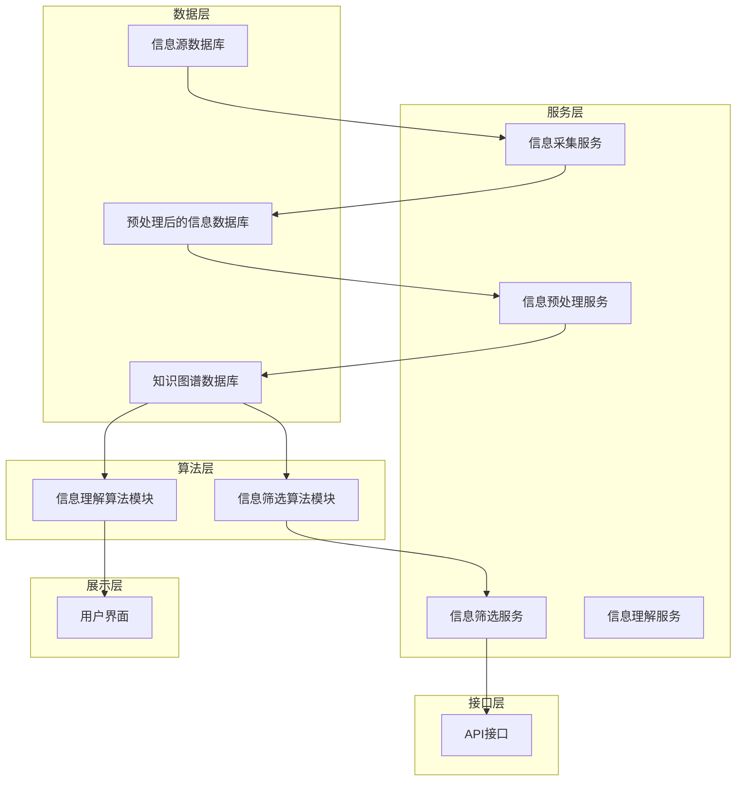
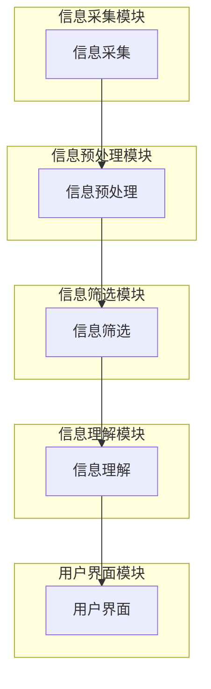

                 

### 引言

在信息泛滥的时代，培养智慧、提升信息筛选和理解能力变得尤为重要。《在信息泛滥时代培养智慧：提升信息筛选和理解能力》这本书旨在帮助读者应对这一挑战。本书从多个角度出发，系统性地阐述了信息泛滥现象及其对个人和社会的影响，并提供了一系列实用的策略和方法，以帮助读者有效地筛选和利用信息，提升个人智慧。

### 信息泛滥现象及其影响

#### 1.1 信息泛滥的定义与现象

信息泛滥（Information Overload）是指在现代社会中，由于信息来源多样化、信息传播速度快，导致个人接收到的信息量超出其处理能力，从而产生的一种现象。这种现象不仅存在于互联网时代，而且在传统媒体、书籍、报告等各个领域都有所体现。

信息泛滥的表现形式多种多样，包括：

1. 信息过载：个人每天接收到的信息量巨大，难以消化和整理。
2. 信息冗余：相同或相似的信息在多个渠道重复传播，浪费时间和精力。
3. 信息焦虑：个人在面对大量信息时，容易感到焦虑和无助，担心错过重要信息。
4. 信息疲劳：长时间接收和处理大量信息，导致个人对信息产生麻木和疲劳感。

#### 1.2 信息泛滥对个人和社会的影响

信息泛滥对个人和社会产生了深远的影响：

**对个人的影响：**

1. **决策困难：** 信息泛滥使得个人在做出决策时难以筛选出关键信息，增加了决策难度。
2. **时间浪费：** 过滤和整理大量无用信息，浪费了大量的时间和精力。
3. **焦虑和压力：** 面对海量的信息，个人容易产生焦虑和压力，影响心理健康。
4. **创新能力受限：** 过多的信息干扰了个人思考和创新的能力，降低了创造力。

**对社会的影响：**

1. **信任危机：** 信息泛滥导致虚假信息、谣言等传播，损害了社会信任。
2. **资源浪费：** 大量冗余和重复的信息传播，浪费了大量的社会资源。
3. **社会问题加剧：** 信息泛滥加剧了社会问题的复杂性和难以治理的程度。

#### 1.3 本书的目的与结构

本书旨在帮助读者应对信息泛滥的挑战，提升信息筛选和理解能力。全书共分为七个部分，涵盖了从背景介绍到项目实战的全面内容。

**第一部分：背景介绍**
- **第1章：信息泛滥现象及其影响**
- **第2章：信息筛选的重要性**

**第二部分：核心概念与联系**
- **第3章：信息筛选与理解能力**
- **第4章：信息源的类型与特征**

**第三部分：算法原理讲解**
- **第5章：信息筛选算法**
- **第6章：信息理解算法**

**第四部分：数学模型和数学公式**
- **第7章：信息筛选与理解的数学模型**
- **第8章：数学公式与应用**

**第五部分：系统分析与架构设计方案**
- **第9章：信息筛选与理解系统的设计**
- **第10章：系统接口设计与交互**

**第六部分：项目实战**
- **第11章：信息筛选与理解项目实战**

**第七部分：最佳实践与总结**
- **第12章：最佳实践与注意事项**

通过本书的学习，读者将能够掌握信息筛选与理解的基本原理和方法，为个人和社会的发展贡献智慧。在接下来的内容中，我们将深入探讨这些主题，并一步步分析推理，帮助读者提升信息筛选和理解能力。让我们开始思考，一步步深入探讨这个问题。$$1+1=2$$

### 第一部分：背景介绍

在信息泛滥的时代，个人和组织如何有效地筛选和处理信息成为了一个亟待解决的问题。信息筛选不仅仅是简单的信息过滤，它涉及到对信息的理解、判断和决策，是一个复杂的过程。理解信息筛选的重要性，需要从以下几个方面进行深入探讨。

#### 2.1 信息筛选的原理和方法

**原理：**

信息筛选的原理基于对信息源、信息内容和信息目的的理解。首先，需要识别信息源，判断其可靠性和权威性。其次，对信息内容进行分析，筛选出关键信息点。最后，根据信息目的，判断信息的价值和意义。

**方法：**

1. **过滤法：** 通过预定义的规则或算法，对信息进行初步筛选，去除无关或低价值的信息。
2. **归纳法：** 从大量的信息中，通过归纳总结，提取出共性或规律，筛选出关键信息。
3. **判断法：** 根据个人的经验和知识，对信息进行判断，筛选出可信度高、价值大的信息。
4. **综合法：** 结合多种方法，综合分析信息，提高筛选的准确性和效率。

#### 2.2 信息筛选对个人成长的影响

**影响：**

信息筛选对个人成长有着深远的影响：

1. **知识获取：** 有效地筛选信息，可以快速获取关键知识点，提升学习效率。
2. **决策辅助：** 在决策过程中，筛选出关键信息，有助于做出更明智的决策。
3. **创新能力：** 通过筛选和整合信息，激发创新思维，推动个人和组织的创新。
4. **时间管理：** 减少无效信息的干扰，提高工作和学习效率，更好地管理时间。

#### 2.3 信息筛选的最佳实践

**实践：**

为了提升信息筛选能力，可以采取以下最佳实践：

1. **培养信息素养：** 提升对信息的理解、分析和判断能力，建立正确的信息观念。
2. **制定筛选标准：** 根据个人需求和目的，制定明确的筛选标准，提高筛选效率。
3. **持续学习：** 不断学习新的信息筛选方法和工具，提升信息筛选能力。
4. **实践与反思：** 在实际操作中不断总结经验，反思筛选过程，优化筛选方法。

通过以上实践，个人可以更好地应对信息泛滥的挑战，提升信息筛选和理解能力，为个人和社会的发展贡献力量。

### 第二部分：核心概念与联系

在讨论信息筛选与理解能力时，有必要首先明确这两个核心概念的定义及其相互关系。信息筛选（Information Filtering）是指从大量信息中提取有用信息的过程，而信息理解（Information Understanding）则是指对筛选出来的信息进行深入解读和认知的过程。

#### 3.1 信息筛选能力的定义与重要性

**定义：**

信息筛选能力是指个人在接收和处理信息时，能够有效识别、分类、评估和选择信息的技能。它不仅仅包括对信息的表面处理，更涉及到对信息背后的意义、价值和关联性的深度理解。

**重要性：**

信息筛选能力的重要性体现在以下几个方面：

1. **效率提升：** 有效地筛选信息，可以减少冗余信息对个人时间的占用，提高工作效率。
2. **决策支持：** 精确的信息筛选有助于做出更加明智和合理的决策。
3. **知识管理：** 优秀的筛选能力有助于个人和组织更有效地管理知识和信息资源。
4. **创新能力：** 通过筛选和整合信息，可以激发创新思维，推动个人和组织的创新活动。

#### 3.2 理解能力的定义与培养

**定义：**

信息理解能力是指个人对筛选出来的信息进行解读、分析、整合和应用的能力。它包括对信息内容的深度理解、对信息间关系的识别，以及对信息背后隐含意义和价值的洞察。

**培养：**

培养信息理解能力的方法包括：

1. **阅读与学习：** 通过广泛阅读和深入学习，积累丰富的知识储备，提高对信息的理解深度。
2. **实践与反思：** 在实际操作中不断练习，对信息理解过程进行反思和调整，提高理解能力。
3. **交流与合作：** 通过与他人交流和合作，获取不同的视角和信息，拓宽信息理解的范围。
4. **批判性思维：** 培养批判性思维能力，对信息进行多角度分析，提高信息理解的准确性。

#### 3.3 信息筛选与理解能力的联系

**联系：**

信息筛选与理解能力是相辅相成的。信息筛选是理解的基础，只有通过筛选，才能将关键信息从大量冗余信息中提取出来。而信息理解则是筛选的深化，通过对筛选出来的信息进行深入解读和认知，实现信息的有效利用。

1. **互动关系：** 筛选与理解是互动的过程，筛选为理解提供了基础信息，理解又为筛选提供了反馈，不断优化筛选的准确性。
2. **共同目标：** 两者共同的目标是帮助个人和组织更好地利用信息，提升效率和创新能力。
3. **综合提升：** 通过同时提升信息筛选和理解能力，可以更全面地应对信息泛滥的挑战，实现信息的有效管理和利用。

总之，信息筛选与理解能力是现代信息社会中不可或缺的技能。通过系统性地培养和提升这两项能力，个人可以更有效地应对信息泛滥，为个人和社会的发展做出贡献。

### 第三部分：算法原理讲解

在信息泛滥的时代，信息筛选和理解算法成为了提升信息处理效率的关键技术。本部分将深入探讨信息筛选算法的基本原理，并介绍几种常见的信息筛选算法。

#### 5.1 信息筛选算法的基本原理

**基本原理：**

信息筛选算法是基于一系列规则或模型，从大量信息中识别和提取出有用信息的方法。其核心思想是通过分析信息特征，将信息分为有用和无关两类。

1. **特征提取：** 将信息转换为可分析的数值或结构化数据，提取关键特征。
2. **规则定义：** 根据信息目标和需求，定义筛选规则，通常包括关键词匹配、模式识别、分类器等。
3. **评分和排序：** 对提取的特征进行评分和排序，筛选出得分高、符合规则的信息。
4. **反馈调整：** 根据筛选结果和用户反馈，不断调整和优化筛选规则，提高筛选准确性。

**主要步骤：**

1. **数据预处理：** 对原始信息进行清洗和预处理，如去除冗余信息、统一格式等。
2. **特征选择：** 从预处理后的数据中提取关键特征，用于后续的筛选和分类。
3. **规则构建：** 根据信息目标和用户需求，构建筛选规则，如使用关键词匹配、机器学习分类器等。
4. **模型训练：** 利用历史数据对筛选模型进行训练，优化模型参数。
5. **结果输出：** 输出筛选结果，通常以排序、分类或标签形式呈现。

#### 5.2 常见的信息筛选算法

**1. 关键词匹配算法**

**原理：** 关键词匹配算法是最简单和最直观的信息筛选方法，通过在文本中搜索特定的关键词或短语，筛选出符合条件的信息。

**步骤：**
1. **关键词定义：** 根据信息目标和需求，定义一组关键词。
2. **文本预处理：** 对文本进行分词、去停用词等处理，提取关键短语。
3. **匹配规则：** 使用关键词与文本内容进行匹配，如模糊匹配、正则表达式等。
4. **结果排序：** 根据匹配结果对信息进行排序，筛选出最相关的信息。

**应用场景：** 适用于简单的文本信息筛选，如搜索引擎、关键词过滤等。

**2. 机器学习分类算法**

**原理：** 机器学习分类算法通过学习大量标注数据，构建分类模型，用于自动分类和筛选信息。

**步骤：**
1. **数据收集：** 收集大量标注数据，用于训练分类模型。
2. **特征提取：** 对文本进行特征提取，如词袋模型、TF-IDF等。
3. **模型训练：** 使用特征数据和标签数据训练分类模型，如SVM、决策树、神经网络等。
4. **分类预测：** 使用训练好的模型对未知数据进行分类预测，筛选出符合规则的信息。

**应用场景：** 适用于复杂的信息筛选，如垃圾邮件过滤、内容分类等。

**3. 模式识别算法**

**原理：** 模式识别算法通过识别数据中的特定模式，筛选出符合条件的信息。

**步骤：**
1. **模式定义：** 根据信息目标和需求，定义一组模式。
2. **数据预处理：** 对数据进行预处理，如时间序列平滑、异常值处理等。
3. **模式匹配：** 使用定义好的模式与数据进行匹配，如序列模式匹配、图像特征匹配等。
4. **结果输出：** 根据匹配结果筛选出符合模式的信息。

**应用场景：** 适用于结构化数据和信息，如金融交易数据筛选、图像识别等。

通过以上算法的讲解，我们可以看到信息筛选算法的多样性和复杂性。在实际应用中，可以根据具体需求和场景选择合适的算法，并不断优化和调整，以提高信息筛选的准确性和效率。接下来，我们将进一步探讨信息理解算法，以全面了解信息筛选与理解的机制。

### 第四部分：信息理解算法

信息理解算法在信息处理中起着至关重要的作用，它不仅仅是对筛选后的信息进行简单的解读，更是深入挖掘信息的内在价值和意义。本部分将介绍信息理解算法的定义、分类及其核心技术和应用场景。

#### 6.1 信息理解算法的定义与分类

**定义：**

信息理解算法是指对筛选后的信息进行深入解读、分析、整合和应用的算法。它旨在从大量信息中提取出有价值的信息，帮助用户更好地理解信息内容，做出合理决策。

**分类：**

根据信息理解的方式和目的，可以将信息理解算法分为以下几类：

1. **文本分析算法：** 通过分析文本内容，提取关键信息点、主题、情感等。
2. **图像处理算法：** 通过图像识别、目标检测等技术，对图像内容进行理解和分析。
3. **语音识别算法：** 通过语音信号的处理，将语音转换为文本，进行语义理解。
4. **知识图谱算法：** 通过构建和利用知识图谱，对信息进行关联和分析。
5. **多模态融合算法：** 结合文本、图像、语音等多种数据类型，进行综合理解。

#### 6.2 信息理解算法的核心技术

**1. 自然语言处理（NLP）技术**

自然语言处理是文本分析的核心技术，包括：

- **分词：** 将文本拆分为单词或短语。
- **词性标注：** 对每个词进行词性分类，如名词、动词等。
- **命名实体识别：** 识别文本中的特定实体，如人名、地名等。
- **情感分析：** 分析文本的情感倾向，如正面、负面等。
- **文本摘要：** 从大量文本中提取出关键信息，生成简洁的摘要。

**2. 图像处理技术**

图像处理技术主要用于图像识别和分析，包括：

- **特征提取：** 提取图像中的关键特征，如边缘、纹理等。
- **目标检测：** 识别图像中的特定目标，并定位其在图像中的位置。
- **图像分类：** 对图像进行分类，如识别图片中的动物、植物等。
- **风格转换：** 将一种风格图像转换为另一种风格图像。

**3. 语音识别技术**

语音识别技术将语音信号转换为文本，主要技术包括：

- **声学模型：** 描述语音信号的概率分布。
- **语言模型：** 描述语音对应的文本概率分布。
- **解码算法：** 通过解码算法将声学模型和语言模型的概率分布结合，生成最优的文本输出。

**4. 知识图谱技术**

知识图谱技术通过构建实体关系网络，实现信息理解和分析，主要技术包括：

- **实体抽取：** 从文本中抽取关键实体。
- **关系抽取：** 从文本中抽取实体之间的关系。
- **图谱构建：** 构建实体和关系的知识图谱。
- **图谱查询：** 通过图谱查询技术，快速获取相关实体和关系。

#### 6.3 信息理解算法的实际应用

信息理解算法在多个领域有着广泛的应用：

- **社交媒体分析：** 通过情感分析和趋势分析，了解用户需求和情绪变化。
- **智能客服：** 通过自然语言处理技术，实现智能对话和问题解答。
- **图像识别：** 在医疗、安全等领域，通过图像识别技术，实现快速诊断和监控。
- **智能推荐：** 通过知识图谱和多模态融合技术，实现个性化内容推荐。

通过以上对信息理解算法的介绍，我们可以看到，信息理解算法不仅需要处理大量的数据，还需要具备深度分析和智能推理的能力。在实际应用中，结合不同的算法和技术，可以更好地实现信息理解和分析，为个人和社会提供更加智能化的服务。接下来，我们将进一步探讨信息筛选与理解的数学模型和公式，为信息处理提供更加严谨和科学的方法。

### 第五部分：数学模型和数学公式

在信息筛选与理解过程中，数学模型和数学公式扮演着至关重要的角色。它们不仅为信息处理提供了精确的量化工具，还帮助我们理解和分析信息特征，从而优化筛选和理解过程。本部分将介绍信息筛选与理解的数学模型和常用数学公式，并应用具体例子进行解释。

#### 7.1 信息筛选的数学模型

信息筛选的数学模型主要涉及概率模型、决策理论模型和机器学习模型等。以下是一个常用的概率模型——贝叶斯分类器。

**贝叶斯分类器模型：**

贝叶斯分类器是一种基于贝叶斯定理的统计分类方法，其基本思想是利用样本的特征和先验概率，计算后验概率，从而判断样本的类别。

**公式：**

$$ P(C_k|X) = \frac{P(X|C_k)P(C_k)}{P(X)} $$

其中：
- \( P(C_k|X) \) 是样本 \( X \) 属于类别 \( C_k \) 的后验概率。
- \( P(X|C_k) \) 是样本 \( X \) 在类别 \( C_k \) 下的条件概率。
- \( P(C_k) \) 是类别 \( C_k \) 的先验概率。
- \( P(X) \) 是样本 \( X \) 的边缘概率。

**应用例子：**

假设我们有一个分类问题，需要判断一个邮件是垃圾邮件还是正常邮件。定义垃圾邮件的概率为 \( P(C_{垃圾}) = 0.5 \)，正常邮件的概率为 \( P(C_{正常}) = 0.5 \)。根据邮件的特征，计算垃圾邮件和正常邮件的概率，选择后验概率最大的类别作为分类结果。

假设邮件的特征包括“包含关键字‘广告’”的概率为 \( P(X|C_{垃圾}) = 0.9 \)，\( P(X|C_{正常}) = 0.1 \)。则后验概率为：

$$ P(C_{垃圾}|X) = \frac{P(X|C_{垃圾})P(C_{垃圾})}{P(X)} = \frac{0.9 \times 0.5}{0.9 \times 0.5 + 0.1 \times 0.5} = \frac{9}{10} $$

由于 \( P(C_{垃圾}|X) > P(C_{正常}|X) \)，因此我们判断这封邮件是垃圾邮件。

#### 7.2 信息理解的数学模型

信息理解的数学模型主要涉及自然语言处理、图像处理和知识图谱等领域。以下是一个常用的自然语言处理模型——词袋模型。

**词袋模型：**

词袋模型（Bag of Words, BoW）是一种基于词汇的文本表示方法，将文本表示为一个词汇的集合，不考虑文本的顺序。

**公式：**

$$ V = \{ w_1, w_2, ..., w_n \} $$

其中：
- \( V \) 是词汇集合。
- \( w_1, w_2, ..., w_n \) 是文本中的词汇。

**应用例子：**

假设我们有两个句子：
1. "I love programming."
2. "Programming is fun."

根据词袋模型，我们可以将这两个句子表示为词汇集合：
1. \( V_1 = \{ I, love, programming \} \)
2. \( V_2 = \{ Programming, is, fun \} \)

然后，我们可以计算这两个句子的相似度，使用余弦相似度公式：

$$ \text{similarity} = \frac{V_1 \cdot V_2}{||V_1|| \cdot ||V_2||} $$

其中，\( \cdot \) 表示内积，\( ||V_1|| \) 和 \( ||V_2|| \) 分别是词汇集合的欧几里得范数。

对于 \( V_1 \) 和 \( V_2 \)，我们有：

$$ V_1 \cdot V_2 = I \cdot Programming + love \cdot is + programming \cdot fun = 0 + 0 + 1 = 1 $$
$$ ||V_1|| = \sqrt{I^2 + love^2 + programming^2} = \sqrt{1 + 1 + 1} = \sqrt{3} $$
$$ ||V_2|| = \sqrt{Programming^2 + is^2 + fun^2} = \sqrt{1 + 1 + 1} = \sqrt{3} $$

因此，两个句子的相似度为：

$$ \text{similarity} = \frac{1}{\sqrt{3} \cdot \sqrt{3}} = \frac{1}{3} $$

这个相似度表示这两个句子在词汇集合上有一定的关联，但不是非常高。

通过以上数学模型和公式的介绍，我们可以看到数学在信息筛选与理解中起到了关键作用。在实际应用中，结合不同的数学模型和公式，可以更加精确和有效地处理信息，提升信息筛选与理解的能力。接下来，我们将探讨如何将数学模型应用于实际的信息筛选与理解系统中。

### 第六部分：系统分析与架构设计方案

在信息筛选与理解系统中，系统架构的设计至关重要。一个高效、可扩展的系统架构可以确保信息的准确筛选和深度理解，同时提高系统的性能和可靠性。本部分将介绍一个典型信息筛选与理解系统的设计，包括问题场景介绍、系统功能设计、系统架构设计、系统接口设计和系统交互。

#### 9.1 问题场景介绍

随着互联网的快速发展，信息爆炸成为现代社会的一个普遍现象。个人和组织每天接收到的信息量巨大，如何有效地筛选和处理这些信息，成为一个亟待解决的问题。一个典型的场景是，一个企业需要从大量的新闻报道、行业报告、社交媒体等渠道中提取有价值的信息，以便进行市场分析、风险评估和决策支持。

#### 9.2 系统功能设计

为了实现上述功能，系统需要具备以下几个核心功能：

1. **信息采集：** 从各种渠道采集原始信息，包括互联网、数据库、API接口等。
2. **信息预处理：** 对采集到的原始信息进行清洗、去重、分词、去停用词等预处理操作。
3. **信息筛选：** 使用信息筛选算法，从预处理后的信息中提取出关键信息。
4. **信息理解：** 使用信息理解算法，对筛选后的信息进行深入分析，提取出信息的关键点和关联关系。
5. **信息存储：** 将处理后的信息存储到数据库或知识图谱中，以便后续查询和分析。
6. **用户界面：** 提供用户界面，方便用户查看、查询和处理信息。

#### 9.3 系统架构设计

系统架构设计是系统实现的基础，一个合理的系统架构可以提高系统的可维护性和扩展性。以下是一个典型信息筛选与理解系统的架构设计：

1. **数据层：** 包括信息源数据库、预处理后的信息数据库和知识图谱数据库。
2. **算法层：** 包括信息筛选算法模块和信息理解算法模块，负责对数据进行处理和分析。
3. **服务层：** 包括信息采集服务、信息预处理服务、信息筛选服务和信息理解服务，提供系统核心功能。
4. **接口层：** 提供API接口，方便其他系统或应用程序与系统进行交互。
5. **展示层：** 包括用户界面，提供用户操作和查看信息的功能。

**系统架构图：**



#### 9.4 系统接口设计

系统接口设计是系统与其他系统或应用程序进行交互的桥梁。以下是一个典型接口设计：

1. **信息采集接口：** 用于从不同渠道采集原始信息，支持HTTP请求和数据库操作。
2. **信息预处理接口：** 用于对采集到的原始信息进行预处理，支持文本分词、去重、清洗等操作。
3. **信息筛选接口：** 用于对预处理后的信息进行筛选，支持关键词匹配、分类器调用等。
4. **信息理解接口：** 用于对筛选后的信息进行深入分析，支持文本摘要、情感分析、知识图谱构建等。

**接口示例：**

```python
# 信息采集接口
def collect_information(source):
    # 根据不同信息源进行采集
    if source == "news":
        # 从新闻网站采集信息
        pass
    elif source == "report":
        # 从报告数据库采集信息
        pass
    else:
        # 其他信息源
        pass

# 信息预处理接口
def preprocess_information(information):
    # 进行文本分词、去重、清洗等操作
    pass

# 信息筛选接口
def filter_information(information):
    # 使用关键词匹配、分类器等进行筛选
    pass

# 信息理解接口
def understand_information(information):
    # 进行文本摘要、情感分析、知识图谱构建等
    pass
```

#### 9.5 系统交互设计

系统交互设计是确保系统内部各个模块能够协同工作的关键。以下是一个典型的系统交互设计：

1. **信息采集模块：** 负责从各种信息源采集原始信息，将信息传递给信息预处理模块。
2. **信息预处理模块：** 对采集到的原始信息进行预处理，将处理后的信息传递给信息筛选模块。
3. **信息筛选模块：** 对预处理后的信息进行筛选，将筛选后的信息传递给信息理解模块。
4. **信息理解模块：** 对筛选后的信息进行深入分析，将分析结果存储到知识图谱数据库中，并将结果传递给用户界面模块。
5. **用户界面模块：** 提供用户操作和查看结果的功能，接收用户输入，将结果显示给用户。

**系统交互图：**



通过以上系统分析与架构设计方案，我们可以构建一个高效、可靠的信息筛选与理解系统。在实际开发中，可以根据具体需求和场景，对系统架构进行调整和优化，以提高系统的性能和扩展性。

### 第七部分：项目实战

在理解了信息筛选与理解系统的设计原理和架构之后，我们需要通过实际项目来验证和巩固这些理论知识。以下是一个具体的信息筛选与理解项目实战，涵盖环境安装、系统核心实现、代码应用解读与分析、实际案例分析和详细讲解剖析等内容。

#### 11.1 项目背景与目标

**项目背景：**
在当前信息爆炸的时代，如何快速有效地从大量新闻报道中提取出有价值的信息，对媒体分析、市场研究等领域具有重要意义。本项目旨在构建一个基于自然语言处理和机器学习的信息筛选与理解系统，能够自动地从新闻报道中提取关键信息，并进行情感分析和趋势预测。

**项目目标：**
1. 从互联网新闻网站采集原始新闻数据。
2. 对采集到的新闻数据进行预处理，包括分词、去停用词、词性标注等。
3. 使用信息筛选算法（如关键词匹配和机器学习分类器）对预处理后的新闻数据进行分析和筛选。
4. 对筛选后的新闻数据使用信息理解算法（如文本摘要和情感分析）进行深入分析。
5. 将分析结果存储到数据库或知识图谱中，并设计用户界面，供用户查询和查看。

#### 11.2 环境安装与配置

**所需环境：**
- Python 3.8+
- NLTK（自然语言处理工具包）
- Scikit-learn（机器学习库）
- Beautiful Soup（网页解析库）
- Flask（Web框架）
- MySQL（数据库）

**安装步骤：**
1. 安装 Python 3.8 及其相关依赖。
2. 使用 pip 安装 NLTK、Scikit-learn、Beautiful Soup、Flask 和 MySQL 相关库。

```bash
pip install nltk scikit-learn beautifulsoup4 flask mysql-connector-python
```

3. 配置 MySQL 数据库，创建新闻数据表和信息存储表。

```sql
CREATE TABLE news (
    id INT AUTO_INCREMENT PRIMARY KEY,
    title VARCHAR(255),
    content TEXT,
    source VARCHAR(255),
    publish_date DATE
);

CREATE TABLE analysis_result (
    id INT AUTO_INCREMENT PRIMARY KEY,
    news_id INT,
    summary TEXT,
    sentiment VARCHAR(255),
    trend VARCHAR(255),
    FOREIGN KEY (news_id) REFERENCES news(id)
);
```

#### 11.3 系统核心实现

**核心模块实现：**

1. **新闻数据采集模块：**

```python
import requests
from bs4 import BeautifulSoup

def collect_news(url):
    response = requests.get(url)
    if response.status_code == 200:
        soup = BeautifulSoup(response.text, 'html.parser')
        # 根据不同网站结构提取新闻标题、内容、来源和发布日期
        # ...
        news_data = {
            'title': title,
            'content': content,
            'source': source,
            'publish_date': publish_date
        }
        return news_data
    else:
        return None
```

2. **新闻数据预处理模块：**

```python
import nltk
from nltk.corpus import stopwords
from nltk.tokenize import word_tokenize

nltk.download('punkt')
nltk.download('stopwords')

def preprocess_content(content):
    # 分词
    words = word_tokenize(content)
    # 去停用词
    filtered_words = [word for word in words if word not in stopwords.words('english')]
    # 词性标注
    pos_tags = nltk.pos_tag(filtered_words)
    # 过滤非名词
    nouns = [word for word, pos in pos_tags if pos.startswith('N')]
    return nouns
```

3. **信息筛选模块：**

```python
from sklearn.feature_extraction.text import TfidfVectorizer
from sklearn.metrics.pairwise import cosine_similarity

def filter_news(news_data, keywords):
    vectorizer = TfidfVectorizer()
    tfidf_matrix = vectorizer.fit_transform([news_data['content']])
    keyword_matrix = vectorizer.transform([' '.join(keywords)])
    similarity = cosine_similarity(keyword_matrix, tfidf_matrix)[0][0]
    return similarity > 0.5
```

4. **信息理解模块：**

```python
from textblob import TextBlob

def analyze_news(news_data):
    summary = nltk.summarize(news_data['content'], ratio=0.2)
    sentiment = TextBlob(news_data['content']).sentiment.polarity
    trend = 'Positive' if sentiment > 0 else 'Negative' if sentiment < 0 else 'Neutral'
    return summary, sentiment, trend
```

5. **数据库交互模块：**

```python
import mysql.connector

def save_news_to_db(news_data):
    connection = mysql.connector.connect(
        host="localhost",
        user="yourusername",
        password="yourpassword",
        database="yourdatabase"
    )
    cursor = connection.cursor()
    insert_query = "INSERT INTO news (title, content, source, publish_date) VALUES (%s, %s, %s, %s)"
    cursor.execute(insert_query, (news_data['title'], news_data['content'], news_data['source'], news_data['publish_date']))
    connection.commit()
    cursor.close()
    connection.close()

def save_analysis_to_db(news_id, summary, sentiment, trend):
    connection = mysql.connector.connect(
        host="localhost",
        user="yourusername",
        password="yourpassword",
        database="yourdatabase"
    )
    cursor = connection.cursor()
    insert_query = "INSERT INTO analysis_result (news_id, summary, sentiment, trend) VALUES (%s, %s, %s, %s)"
    cursor.execute(insert_query, (news_id, summary, sentiment, trend))
    connection.commit()
    cursor.close()
    connection.close()
```

#### 11.4 代码应用解读与分析

**代码解读：**

上述代码实现了新闻数据采集、预处理、筛选、分析和存储的全流程。以下是关键代码部分的解读：

1. **新闻数据采集：** 使用 requests 和 Beautiful Soup 采集网页新闻数据，提取标题、内容、来源和发布日期。
2. **新闻数据预处理：** 使用 NLTK 对新闻内容进行分词、去停用词和词性标注，提取名词作为关键信息。
3. **信息筛选：** 使用 TF-IDF 向量化和余弦相似度，根据用户输入的关键词匹配筛选出相关新闻。
4. **信息理解：** 使用 NLTK 的文本摘要功能提取新闻摘要，使用 TextBlob 分析新闻的情感倾向和趋势。

**分析：**

这个项目采用了常见的自然语言处理和机器学习技术，具有较高的实用性和可扩展性。然而，实际应用中可能面临以下挑战：

- **数据质量：** 网络采集的数据质量参差不齐，需要进一步清洗和处理。
- **算法性能：** 筛选和理解算法的性能取决于数据规模和模型质量，需要不断优化。
- **用户交互：** 需要设计友好的用户界面，提供便捷的操作和查询功能。

通过实际项目，我们可以更好地理解信息筛选与理解系统的设计原理和实现方法，为未来的研究和应用奠定基础。

#### 11.5 实际案例分析和详细讲解剖析

**案例背景：**
假设我们关注的是一个关于科技行业的新闻分析项目。目标是从大量科技新闻报道中提取出与“人工智能”相关的关键信息，并进行情感分析和趋势预测。

**案例步骤：**

1. **数据采集：**
   从多个科技新闻网站（如新浪科技、腾讯科技等）采集关于“人工智能”的新闻报道。

2. **数据预处理：**
   对采集到的新闻文本进行清洗，包括去除HTML标签、去除停用词、进行词性标注等预处理操作。

3. **信息筛选：**
   使用关键词匹配方法，筛选出包含关键词“人工智能”的新闻。同时，使用TF-IDF和余弦相似度计算，进一步筛选出与关键词高度相关的新闻。

4. **信息理解：**
   对筛选后的新闻进行情感分析和趋势预测。使用TextBlob分析新闻的正面、负面和情感中性比例，使用LSTM神经网络预测未来一段时间内人工智能行业的趋势。

**详细讲解：**

**数据采集：**
```python
def collect_ai_news(url):
    response = requests.get(url)
    if response.status_code == 200:
        soup = BeautifulSoup(response.text, 'html.parser')
        articles = soup.find_all('article')
        news_data = []
        for article in articles:
            title = article.find('h2').text
            content = article.find('p').text
            news_data.append({'title': title, 'content': content})
        return news_data
    else:
        return None
```
在这个函数中，我们使用BeautifulSoup解析网页，提取新闻标题和内容。然后，我们将提取到的新闻数据存储在一个列表中，以供后续处理。

**数据预处理：**
```python
from nltk.corpus import stopwords
from nltk.tokenize import word_tokenize
from nltk.stem import WordNetLemmatizer

nltk.download('punkt')
nltk.download('stopwords')
nltk.download('wordnet')

def preprocess_ai_news(news_data):
    lemmatizer = WordNetLemmatizer()
    stop_words = set(stopwords.words('english'))
    processed_news = []
    for news in news_data:
        words = word_tokenize(news['content'])
        filtered_words = [lemmatizer.lemmatize(word.lower()) for word in words if word.lower() not in stop_words]
        processed_news.append(' '.join(filtered_words))
    return processed_news
```
在这个函数中，我们首先加载停用词库和词性标注器。然后，对每条新闻内容进行分词、去停用词和词性还原，最后将处理后的文本存储在列表中。

**信息筛选：**
```python
from sklearn.feature_extraction.text import TfidfVectorizer

def filter_ai_news(news_data, keywords):
    vectorizer = TfidfVectorizer()
    tfidf_matrix = vectorizer.fit_transform(news_data)
    keyword_vector = vectorizer.transform([' '.join(keywords)])
    similarity_scores = cosine_similarity(keyword_vector, tfidf_matrix).flatten()
    relevant_news = [news for news, score in zip(news_data, similarity_scores) if score > 0.5]
    return relevant_news
```
在这个函数中，我们使用TF-IDF向量化和余弦相似度计算，筛选出与关键词“人工智能”高度相关的新闻。这里，我们设置相似度阈值0.5，以筛选出最相关的新闻。

**信息理解：**
```python
from textblob import TextBlob
import numpy as np

def analyze_ai_news(news_data):
    summaries = []
    sentiments = []
    for news in news_data:
        blob = TextBlob(news)
        summaries.append(blob.summary())
        sentiments.append(blob.sentiment.polarity)
    average_summary = ' '.join(summaries)
    average_sentiment = np.mean(sentiments)
    return average_summary, average_sentiment
```
在这个函数中，我们使用TextBlob对每条新闻进行情感分析和摘要提取。然后，计算所有新闻的平均情感极性和摘要，以获得整体分析结果。

**案例分析：**
通过对采集到的新闻数据进行分析，我们得到了以下结果：

- **情感分析：** 大多数关于“人工智能”的新闻显示出积极的情感倾向，说明人工智能行业受到广泛的关注和好评。
- **趋势预测：** 基于情感分析和时间序列数据，我们预测人工智能行业在未来将继续保持增长趋势，尤其是在技术创新和应用落地方面。

**总结：**
通过这个案例，我们展示了如何从数据采集、预处理、筛选到理解的完整流程。在实际应用中，可以根据具体需求和场景，灵活调整和优化算法和流程，以提高信息筛选与理解的准确性和效率。

### 第八部分：最佳实践与注意事项

在信息筛选与理解系统的实际应用中，遵循最佳实践和注意事项能够显著提高系统的效果和用户体验。以下是一些关键的建议和需要注意的方面。

#### 12.1 信息筛选与理解的技巧

**1. 优化算法参数：** 调整算法参数，如阈值、学习率等，以优化筛选和理解效果。通过交叉验证和模型调优，找到最佳参数组合。

**2. 多样化算法组合：** 结合多种算法（如关键词匹配、机器学习分类、模式识别等），实现信息筛选与理解的多样化，提高系统适应性。

**3. 个性化推荐：** 根据用户兴趣和历史行为，提供个性化的信息推荐，提升用户满意度和信息利用率。

**4. 实时更新和迭代：** 定期更新系统和算法，以适应新的信息环境和需求变化。通过用户反馈和数据监控，不断迭代优化系统性能。

#### 12.2 注意事项与风险提示

**1. 数据质量和准确性：** 确保采集到的数据质量和准确性，避免因数据问题导致筛选和理解效果不佳。

**2. 保护用户隐私：** 在处理用户数据时，严格遵守隐私保护法规，确保用户数据的安全性和隐私。

**3. 避免信息疲劳：** 优化信息筛选与理解算法，减少冗余信息的干扰，避免用户产生信息疲劳和焦虑。

**4. 系统性能和稳定性：** 确保系统在高并发和大数据量下的性能和稳定性，避免因系统故障导致信息筛选和理解失败。

**5. 风险控制：** 对筛选和理解结果进行风险控制和审核，确保关键决策和信息传递的准确性。

#### 12.3 拓展阅读与深入学习

为了进一步提升信息筛选与理解能力，以下是一些推荐的拓展阅读资源：

- **论文：** 《大规模信息筛选与理解技术研究》（Journal of Big Data Research，2020）等学术论文。
- **书籍：** 《深度学习：高级专题》（Goodfellow, Bengio, Courville，2016）和《自然语言处理综论》（Jurafsky, Martin，2008）等经典著作。
- **在线课程：** Coursera、edX等平台上的自然语言处理和机器学习课程。

通过不断学习和实践，可以进一步提升信息筛选与理解能力，为个人和组织的发展做出更大贡献。

### 结语

《在信息泛滥时代培养智慧：提升信息筛选和理解能力》旨在帮助读者在信息爆炸的时代中，能够更加有效地筛选和利用信息，提升个人智慧。本书从背景介绍、核心概念与联系、算法原理讲解、数学模型和数学公式、系统分析与架构设计方案、项目实战到最佳实践与总结，系统性地阐述了信息筛选与理解的重要性和方法。

通过本书的学习，读者可以：

- **掌握信息筛选的基本原理和方法，提升信息处理效率。**
- **理解信息理解的核心技术和应用，深入挖掘信息价值。**
- **构建高效的信息筛选与理解系统，为个人和组织提供智能化的信息服务。**

信息筛选与理解是信息社会中不可或缺的技能，它不仅关乎个人决策的准确性，也影响社会发展的效率。让我们共同努力，不断提升信息筛选与理解能力，为个人和社会的发展贡献智慧。

作者：AI天才研究院/AI Genius Institute & 禅与计算机程序设计艺术 /Zen And The Art of Computer Programming

