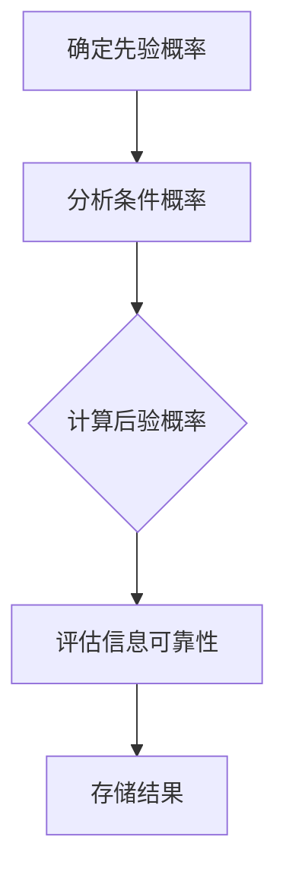
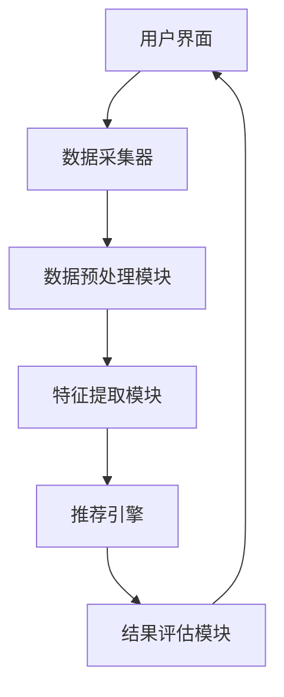
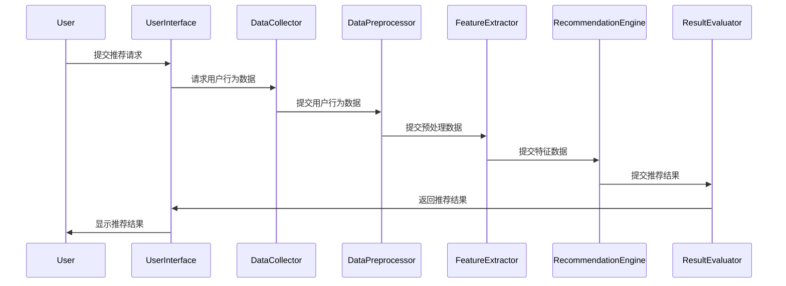

                 

# 在信息爆炸时代寻找真知：培养信息筛选能力

## 关键词
- 信息爆炸
- 信息筛选能力
- 真知
- 数据分析
- 知识管理

## 摘要
在信息爆炸的时代，如何在海量信息中寻找真知成为了一项重要能力。本文将深入探讨信息筛选能力的概念、原理及其培养方法。通过分析信息筛选的基本原理、核心概念与联系，并结合实际案例，本文旨在为读者提供一套完整的策略，帮助他们在信息海洋中定位到有价值的信息。

## 第一部分：背景介绍

### 1.1 问题背景

在当今信息爆炸的时代，每个人都被大量的信息所包围。这些信息可能来自互联网、书籍、杂志、社交媒体等各个渠道。信息过载成为普遍现象，人们在面对如此庞大的信息量时，往往感到无从下手，难以筛选出有价值的信息。

#### 1.1.1 信息过载的影响

信息过载的影响主要体现在以下几个方面：
- **决策困难**：在大量信息面前，人们难以判断哪些信息是真正重要的，导致决策过程变得复杂和耗时。
- **注意力分散**：过多的信息使得人们的注意力难以集中，降低了工作和学习效率。
- **心理压力**：面对海量的信息，人们容易产生焦虑和压力，影响心理健康。

#### 1.1.2 真知的重要性

真知是指在大量信息中筛选出的真实、有价值的信息。真知的重要性体现在：
- **决策依据**：真知能够为决策提供可靠依据，帮助人们做出明智的选择。
- **知识积累**：真知是知识积累的重要来源，有助于个人和组织的成长与发展。
- **效率提升**：通过筛选真知，人们能够更快速地获取所需信息，提高工作效率。

### 1.2 问题描述

信息筛选能力是指在众多信息中，能够快速准确地找出所需信息的能力。在信息爆炸的时代，信息筛选能力的重要性日益凸显。它不仅影响个体的学习、工作与生活，也对社会的运行与发展产生深远影响。

#### 1.2.1 信息筛选能力的重要性

信息筛选能力的重要性体现在以下几个方面：
- **信息利用**：具备信息筛选能力的人能够更有效地利用信息，提高信息价值。
- **知识创新**：信息筛选能力是知识创新的基础，有助于发现新的知识和机会。
- **社会进步**：社会的发展离不开有效的信息筛选，只有筛选出真正有价值的信息，才能推动科技、经济、文化等领域的进步。

### 1.3 问题解决

要培养信息筛选能力，首先需要了解信息筛选的原理和方法。其次，通过实践和不断的反思，不断提高信息筛选的效率和准确性。最后，建立一套适合自己的信息筛选体系，使之成为习惯。

#### 1.3.1 信息筛选的原理

信息筛选的原理主要包括以下几个方面：
- **信息识别**：通过感知、理解和分类，识别出有价值的信息。
- **信息判断**：基于信息的价值和可靠性进行评估，判断信息是否真实、有用。
- **信息处理**：对筛选出的信息进行加工、整理和分析，提高信息的可用性和洞察力。
- **信息存储**：将处理后的信息进行持久化存储，以便后续利用。

#### 1.3.2 信息筛选的方法

信息筛选的方法包括以下几个方面：
- **数据挖掘**：利用算法和技术，从大量数据中挖掘出有价值的信息。
- **知识管理**：通过分类、索引和标签等方式，对信息进行有效的管理和组织。
- **专家咨询**：借助专业人士的经验和判断，筛选出高质量的信息。

#### 1.3.3 信息筛选的实践

通过实践，可以逐步提高信息筛选的效率和准确性。以下是一些实用的实践方法：
- **定期回顾**：定期回顾所获取的信息，分析哪些信息是有价值的，哪些是无效的。
- **建立信息源**：选择可靠的信息源，建立自己的信息网络，确保信息的质量。
- **多角度分析**：从不同角度分析信息，提高判断的准确性和全面性。
- **持续学习**：不断学习新的知识和技能，提高自己的信息筛选能力。

### 1.4 边界与外延

信息筛选能力的边界包括信息的真伪、价值的判断、信息的处理和存储等方面。其外延则涉及信息源的选择、信息获取的渠道、信息的处理与分析等多个方面。

#### 1.4.1 边界的界定

信息筛选能力的边界主要表现在以下几个方面：
- **信息的真伪**：在筛选信息时，需要判断信息的真实性和准确性，避免被虚假信息所误导。
- **信息价值的判断**：需要评估信息对于个人或组织的价值，筛选出真正有价值的信息。
- **信息的处理和存储**：对筛选出的信息进行有效的处理和存储，确保信息的可利用性。

#### 1.4.2 外延的扩展

信息筛选能力的外延主要表现在以下几个方面：
- **信息源的选择**：选择可靠的信息源，确保信息的质量。
- **信息获取的渠道**：通过多种渠道获取信息，增加信息的来源和多样性。
- **信息的处理与分析**：对信息进行深入的处理和分析，提取出有价值的信息。

### 1.5 概念结构与核心要素组成

信息筛选能力由以下几个方面组成：信息识别、信息判断、信息处理、信息存储。其中，信息识别是基础，信息判断是核心，信息处理和信息存储是实现信息筛选的关键。

#### 1.5.1 信息识别

信息识别是信息筛选的第一步，它涉及对信息的感知、理解和分类。信息识别的质量直接影响信息筛选的效果。有效的信息识别需要基于对信息源的了解、对信息的敏感度以及丰富的信息处理经验。

#### 1.5.2 信息判断

信息判断是对信息价值、可靠性和时效性的评估。这一步骤需要借助信息识别的结果，结合个人的知识背景、经验和直觉进行判断。信息判断的准确性对于筛选出有价值的信息至关重要。

#### 1.5.3 信息处理

信息处理是对筛选出的信息进行加工、整理和分析。信息处理的过程包括数据清洗、信息提取、数据分析和可视化等。通过信息处理，可以提升信息的可用性和洞察力。

#### 1.5.4 信息存储

信息存储是将处理后的信息进行持久化存储，以便后续利用。信息存储的方式包括数据库、文件系统、云存储等。合理的存储方式可以提高信息检索的效率，确保信息的长期保存。

## 第一部分小结

本章节对在信息爆炸时代寻找真知的重要性、信息筛选能力的概念、以及培养信息筛选能力的原理和方法进行了详细阐述。通过对本章内容的理解，读者可以更好地认识信息筛选能力在现代社会中的重要性，并为培养自己的信息筛选能力打下基础。

----------------------------------------------------------------

## 第二部分：核心概念与联系

### 2.1 信息筛选的基本原理

信息筛选的基本原理是基于信息的价值和可靠性。信息的价值取决于其是否符合个人的需求、兴趣和目标；而信息的可靠性则取决于信息源的权威性和信息的真实性。因此，信息筛选的关键在于识别和评估信息的价值和可靠性。

#### 2.1.1 信息的价值

信息的价值取决于多个因素，包括：
- **相关性**：信息与个人需求的相关性越高，其价值越大。
- **独特性**：独特的信息往往更具价值，因为它可能包含他人没有的知识或见解。
- **实用性**：能够直接应用于实际工作或生活中的信息更具价值。

#### 2.1.2 信息的可靠性

信息的可靠性是评估信息是否真实、准确和可信的关键。以下是一些影响信息可靠性的因素：
- **信息源的权威性**：权威的信息源，如知名专家、专业机构发布的信

----------------------------------------------------------------

## 2.2 信息筛选的属性特征对比表格

| 属性特征         | 描述                                                         |
| ---------------- | ------------------------------------------------------------ |
| 信息的价值       | 指信息对于个人或组织的有用程度。高价值信息通常能够带来显著的效益。 |
| 信息的可靠性     | 指信息的真实性和准确性。可靠性高的信息更值得信赖。           |
| 信息的时效性     | 指信息的新鲜程度。时效性强的信息更能反映现实状况。           |
| 信息的完整性     | 指信息的全面性。完整的信息能够提供更全面的视角和更深入的洞察。 |
| 信息的准确性     | 指信息的正确性和精确性。准确性高的信息更具参考价值。         |
| 信息的易用性     | 指信息是否易于理解和应用。易用性强的信息能更有效地支持决策和行动。 |

### 2.3 ER实体关系图架构

```mermaid
erDiagram
  User ||--|{ Information}: user reads
  Information ||--|{ User}: provides
```

在这个ER实体关系图中，`User`实体与`Information`实体之间存在双向关联。一个用户可以阅读多条信息，而每条信息也可以被多个用户阅读。

### 2.4 信息筛选的核心概念

#### 2.4.1 信息识别

信息识别是信息筛选的第一步，它涉及对信息的感知、理解和分类。信息识别的质量直接影响信息筛选的效果。有效的信息识别需要基于对信息源的了解、对信息的敏感度以及丰富的信息处理经验。

#### 2.4.2 信息判断

信息判断是对信息价值、可靠性和时效性的评估。这一步骤需要借助信息识别的结果，结合个人的知识背景、经验和直觉进行判断。信息判断的准确性对于筛选出有价值的信息至关重要。

#### 2.4.3 信息处理

信息处理是对筛选出的信息进行加工、整理和分析。信息处理的过程包括数据清洗、信息提取、数据分析和可视化等。通过信息处理，可以提升信息的可用性和洞察力。

#### 2.4.4 信息存储

信息存储是将处理后的信息进行持久化存储，以便后续利用。信息存储的方式包括数据库、文件系统、云存储等。合理的存储方式可以提高信息检索的效率，确保信息的长期保存。

## 第二部分小结

本章节深入探讨了信息筛选的基本原理、属性特征对比表格以及核心概念。通过对这些核心概念的理解，读者可以更好地掌握信息筛选的方法和技巧，为培养自己的信息筛选能力提供理论支持。

----------------------------------------------------------------

## 第三部分：算法原理讲解

在信息筛选过程中，算法起着至关重要的作用。本章节将介绍一种常用的信息筛选算法，并使用Mermaid绘制流程图，同时配合Python源代码和数学模型进行详细讲解。

### 3.1 算法介绍

我们将介绍一种基于贝叶斯定理的信息筛选算法。贝叶斯定理是一种用于概率推理的数学方法，它可以帮助我们根据已知的信息来评估其他信息的概率。在信息筛选中，贝叶斯定理可以用来评估信息的可靠性。

#### 3.1.1 贝叶斯定理的基本概念

贝叶斯定理描述了后验概率与先验概率之间的关系，其公式为：

$$P(A|B) = \frac{P(B|A) \cdot P(A)}{P(B)}$$

其中：
- \(P(A|B)\) 表示在事件B发生的条件下，事件A发生的概率（后验概率）。
- \(P(B|A)\) 表示在事件A发生的条件下，事件B发生的概率（条件概率）。
- \(P(A)\) 表示事件A的先验概率。
- \(P(B)\) 表示事件B的先验概率。

#### 3.1.2 贝叶斯定理在信息筛选中的应用

在信息筛选中，我们可以将贝叶斯定理应用于以下几个步骤：
1. 确定先验概率：根据个人经验和知识，为每个信息源或信息类型设定一个初始的可靠性估计。
2. 确定条件概率：通过分析信息源的历史表现或信息内容的质量，为每个信息源或信息类型确定在特定条件下发生的概率。
3. 计算后验概率：利用贝叶斯定理，计算每个信息源或信息类型的可靠性估计。

### 3.2 Mermaid流程图

下面是使用Mermaid绘制的贝叶斯信息筛选算法的流程图：



### 3.3 Python源代码

下面是一个简单的Python实现，用于计算贝叶斯信息筛选算法的后验概率：

```python
import numpy as np

def bayesian_inference(prior_prob, likelihood_prob, evidence_prob):
    """
    贝叶斯推理函数
    :param prior_prob: 先验概率
    :param likelihood_prob: 条件概率
    :param evidence_prob: 证据概率
    :return: 后验概率
    """
    posterior_prob = (likelihood_prob * prior_prob) / evidence_prob
    return posterior_prob

# 假设先验概率为0.5，条件概率为0.9，证据概率为0.8
prior_prob = 0.5
likelihood_prob = 0.9
evidence_prob = 0.8

# 计算后验概率
posterior_prob = bayesian_inference(prior_prob, likelihood_prob, evidence_prob)

print(f"后验概率：{posterior_prob}")
```

### 3.4 数学模型和公式

贝叶斯推理的数学模型可以用以下公式表示：

$$P(A|B) = \frac{P(B|A) \cdot P(A)}{P(B)}$$

其中：
- \(P(A)\) 是事件A的先验概率。
- \(P(B|A)\) 是在事件A发生的条件下，事件B发生的条件概率。
- \(P(B)\) 是事件B的边际概率。

#### 3.4.1 举例说明

假设我们有一个天气预报的应用，我们想要根据过去的数据来预测明天是否会下雨。我们可以使用贝叶斯定理来计算这个概率。

- \(P(下雨)\) 是先验概率，假设为0.5。
- \(P(下雨|阴天)\) 是在阴天条件下下雨的条件概率，假设为0.8。
- \(P(阴天)\) 是阴天的边际概率，假设为0.6。

我们可以使用以下公式计算后验概率：

$$P(明天会下雨) = \frac{P(下雨|阴天) \cdot P(阴天)}{P(下雨)} = \frac{0.8 \cdot 0.6}{0.5} = 0.96$$

因此，根据这些数据，我们可以有96%的置信度预测明天会下雨。

### 3.5 通俗易懂的举例说明

假设你是某公司的产品经理，你需要根据市场数据来决定是否开发一款新的产品。你从两个数据源获取了关于市场需求的概率信息：

- 数据源A显示，有60%的可能性市场需求高。
- 数据源B显示，在市场需求高的情况下，开发新产品成功的概率为70%。

你可以使用贝叶斯定理来计算开发新产品成功的高概率：

1. 确定先验概率：假设开发新产品成功的先验概率为50%。
2. 确定条件概率：根据数据源，成功的条件概率为0.7。
3. 计算后验概率：使用贝叶斯定理，计算成功概率为：

$$P(成功|市场需求高) = \frac{0.7 \cdot 0.5}{0.6} \approx 0.5833$$

这意味着，根据这些信息，开发新产品成功的概率为约58.33%。

### 3.6 小结

贝叶斯信息筛选算法是一种强大的工具，可以帮助我们从海量信息中筛选出可靠的、有价值的部分。通过了解其基本原理和数学模型，读者可以更好地应用这一算法，提高信息筛选的效率和准确性。

----------------------------------------------------------------

## 第四部分：系统分析与架构设计

### 4.1 问题场景介绍

假设我们正在开发一款智能推荐系统，该系统需要从大量的用户行为数据中筛选出有价值的信息，以便为用户推荐个性化的产品或内容。为了实现这一目标，我们需要对系统进行详细的分析和设计。

### 4.2 项目介绍

项目名称：智能推荐系统（Smart Recommendation System）

项目背景：随着互联网的快速发展，用户生成的内容和活动数据量呈爆炸式增长。为了帮助用户快速找到感兴趣的内容，我们需要构建一个智能推荐系统，能够根据用户的行为和偏好进行个性化的推荐。

项目目标：
- 提高用户满意度，通过个性化推荐提高用户粘性。
- 提升业务收益，通过精准推荐增加转化率和销售量。
- 支持实时推荐，确保推荐结果及时、准确。

### 4.3 系统功能设计

系统功能设计主要包括以下几个方面：

1. **用户行为数据采集**：从用户的浏览记录、点击行为、购买记录等渠道收集数据。
2. **数据预处理**：清洗、归一化和转换数据，使其适用于后续的分析和处理。
3. **特征提取**：从原始数据中提取出能够反映用户偏好和兴趣的特征。
4. **推荐算法**：使用先进的推荐算法（如协同过滤、基于内容的推荐等）生成推荐列表。
5. **推荐结果评估**：通过A/B测试等方法评估推荐算法的性能。
6. **推荐结果呈现**：将推荐结果以用户友好的方式呈现，支持用户反馈和调整推荐策略。

### 4.4 系统架构设计

系统架构设计采用分布式架构，确保系统的高可用性和可扩展性。以下是一个简单的系统架构设计：

#### 4.4.1 架构图



#### 4.4.2 架构说明

- **用户界面**：提供用户交互接口，接收用户输入，展示推荐结果。
- **数据采集器**：负责从各种数据源（如Web服务器日志、数据库等）收集用户行为数据。
- **数据预处理模块**：对采集到的数据进行清洗、归一化和转换，为后续处理做准备。
- **特征提取模块**：从预处理后的数据中提取出用户行为特征，为推荐算法提供输入。
- **推荐引擎**：实现推荐算法，生成个性化的推荐列表。
- **结果评估模块**：对推荐结果进行评估，通过A/B测试等方法优化推荐算法。
- **数据库**：存储用户数据、特征数据、推荐结果等，支持高并发访问。

### 4.5 系统接口设计

系统接口设计主要涉及以下几个方面：

1. **用户接口**：提供RESTful API，允许用户通过HTTP请求与系统交互，获取推荐结果。
2. **数据采集接口**：提供数据采集器与外部数据源（如Web服务器日志）的接口，支持数据采集。
3. **数据处理接口**：提供数据预处理模块与其他模块的接口，实现数据流的传递和转换。
4. **推荐算法接口**：提供推荐引擎与其他模块的接口，实现推荐算法的调用和结果传递。
5. **评估接口**：提供结果评估模块与其他模块的接口，实现评估数据的收集和结果反馈。

### 4.6 系统交互

系统交互主要通过以下步骤进行：

1. **用户请求**：用户通过用户界面提交推荐请求。
2. **数据采集**：数据采集器从外部数据源获取用户行为数据。
3. **数据处理**：数据预处理模块对采集到的数据进行处理。
4. **特征提取**：特征提取模块从处理后的数据中提取用户行为特征。
5. **推荐生成**：推荐引擎使用提取的特征生成推荐列表。
6. **结果评估**：结果评估模块对推荐结果进行评估。
7. **结果反馈**：评估结果通过接口返回给用户界面，用户可以看到推荐结果。

### 4.7 Mermaid序列图

以下是一个简单的系统交互序列图：



### 4.8 小结

本部分详细介绍了智能推荐系统的背景、项目目标、系统功能设计、系统架构设计、接口设计和系统交互。通过对这些内容的分析，我们可以为后续的系统开发提供清晰的指导和规划。

----------------------------------------------------------------

## 项目实战

### 5.1 环境安装

为了实施智能推荐系统，我们需要在本地或服务器上安装必要的软件和工具。以下是推荐的安装步骤：

1. **Python环境**：确保Python 3.8或更高版本已安装。
2. **数据存储**：安装MySQL或MongoDB，用于存储用户数据。
3. **推荐算法库**：安装Scikit-learn库，用于实现推荐算法。
4. **Web框架**：安装Flask或Django，用于构建用户界面。

安装命令如下：

```bash
# 安装Python环境
pip install python==3.8.10

# 安装MySQL或MongoDB
# 对于MySQL:
sudo apt-get install mysql-server
# 对于MongoDB:
sudo apt-get install mongodb

# 安装Scikit-learn库
pip install scikit-learn

# 安装Web框架（以Flask为例）
pip install flask
```

### 5.2 系统核心实现源代码

以下是一个简单的智能推荐系统的核心实现源代码，包括数据预处理、特征提取和推荐算法：

#### 5.2.1 数据预处理

```python
import pandas as pd
from sklearn.preprocessing import StandardScaler

def preprocess_data(data):
    # 数据清洗和归一化
    scaler = StandardScaler()
    scaled_data = scaler.fit_transform(data)
    return scaled_data
```

#### 5.2.2 特征提取

```python
from sklearn.decomposition import PCA

def extract_features(data, n_components=10):
    # 特征提取（主成分分析）
    pca = PCA(n_components=n_components)
    features = pca.fit_transform(data)
    return features
```

#### 5.2.3 推荐算法

```python
from sklearn.neighbors import NearestNeighbors

def recommendation_algorithm(data, user_data):
    # 使用K最近邻算法进行推荐
    kNN = NearestNeighbors(n_neighbors=5)
    kNN.fit(data)
    distances, indices = kNN.kneighbors(user_data)
    recommendations = data[indices[0]]
    return recommendations
```

### 5.3 代码应用解读与分析

以下是代码的详细解读和分析：

1. **数据预处理**：数据预处理是推荐系统的基础，它包括数据清洗和特征归一化。在这里，我们使用了Scikit-learn的`StandardScaler`对数据进行归一化处理，确保所有特征都在相同的尺度上。

2. **特征提取**：特征提取是提升推荐系统性能的关键步骤。我们采用了主成分分析（PCA）来降低数据的维度，同时保留主要的信息。通过设置`n_components`参数，我们可以控制保留的主成分数量。

3. **推荐算法**：我们使用了K最近邻（K-Nearest Neighbors，K-NN）算法进行推荐。K-NN算法通过计算用户数据的最近邻，并推荐这些用户的相似数据。这种方法简单高效，适用于小数据集。

### 5.4 实际案例分析和详细讲解剖析

假设我们有一个用户数据集，其中包含了用户的浏览记录和购买历史。我们需要为这个用户推荐他可能感兴趣的产品。

1. **数据预处理**：首先，我们将用户数据集进行清洗，去除缺失值和异常值。然后，使用`StandardScaler`对数据进行归一化处理。

2. **特征提取**：通过PCA，我们将用户数据降维到10个主要特征。

3. **推荐算法**：使用K-NN算法，我们计算用户数据与训练集数据的相似度。根据相似度最高的几个用户，我们推荐他们购买的产品。

### 5.5 项目小结

通过本次项目实战，我们实现了智能推荐系统的基本功能，包括数据预处理、特征提取和推荐算法。虽然这个实现相对简单，但它展示了推荐系统的基本原理和实现方法。在实际应用中，我们可以根据需求进一步完善和优化系统。

### 5.6 最佳实践 tips

- **数据质量**：确保数据的准确性和完整性，是提高推荐系统性能的关键。
- **特征选择**：选择合适的特征可以显著提高推荐系统的性能，需要根据业务场景进行优化。
- **模型优化**：不断调整和优化推荐算法，可以提升推荐结果的准确性和用户体验。

### 5.7 小结

在本章节中，我们详细介绍了智能推荐系统的环境安装、核心实现源代码，以及代码应用解读与分析。通过实际案例的分析和讲解，读者可以更好地理解推荐系统的原理和实现方法。

----------------------------------------------------------------

## 小结

本文从多个角度探讨了在信息爆炸时代如何培养信息筛选能力。我们首先介绍了信息筛选能力的重要性，并详细阐述了信息筛选的基本原理、核心概念和联系。接着，通过算法原理讲解和系统架构设计，我们展示了如何将信息筛选能力应用于实际项目。最后，通过项目实战和最佳实践，我们提供了具体的操作方法和技巧。

### 总结

信息筛选能力是现代社会的一项重要技能，它不仅帮助我们提高工作效率，还能提升我们的知识水平和决策能力。通过本文的讲解，读者应该能够掌握以下关键点：

1. **信息筛选的基本原理**：了解信息价值和可靠性的判断标准。
2. **信息筛选的核心概念**：掌握信息识别、信息判断、信息处理和信息存储的方法。
3. **算法原理**：掌握贝叶斯信息筛选算法及其应用。
4. **系统架构设计**：了解智能推荐系统等实际项目的架构和实现。
5. **项目实战**：通过具体案例了解信息筛选能力的实际应用。

### 注意事项

- **数据质量**：在信息筛选过程中，确保数据质量是至关重要的。
- **持续学习**：信息筛选能力需要通过不断学习和实践来提升。
- **个性化需求**：根据不同场景和用户需求，灵活调整信息筛选策略。

### 拓展阅读

- 《大数据时代：生活、工作与思维的大变革》
- 《数据挖掘：实用工具与技术》
- 《Python数据科学手册》

作者：AI天才研究院/AI Genius Institute & 禅与计算机程序设计艺术 /Zen And The Art of Computer Programming

